## ARM体系结构介绍

### **excution state**


### **processor state**

处理器状态


ARM 处理器传统上有几类中断信号：

- **IRQ** (Interrupt Request)：普通中断
- **FIQ** (Fast Interrupt Request)：快速中断
- **SError**（System Error）：同步异常
- **Abort**（数据/指令访问异常）
- **Undefined Instruction**（非法指令异常）

在 AArch64 下，异常会统一被称为 *Exception*，但 FIQ 还是保留，作为一种 **高优先级中断**。

### 异常掩码


- 0 表示没有屏蔽这个异常
- 1 表示屏蔽了这个异常


### 特殊寄存器


SPSR (The Saved Program Status Register)

ELR (Exception Link Register)

当处理器运行在比EL0高级别的异常等级时，处理器可以访问：

- 当前异常等级对应的栈指针SP_ELn
- EL0对应的栈指针SP_EL0寄存器可以当作一个临时寄存器


**CurrentEL**

> Current Exception Level, hold the current Exception level


**DAIF**

> Allows access to the interrupt mask bit, that hold the current PSTATE.{D,A,I,F} interrupt mask bit

**DIT**

> that holds the PSTATE DIT bit

**ELR_EL1**

> that holds the address to return to for an exception return from EL1

**ELR_EL2**

> that holds the address to return to for an exception return from EL2

**ELR_EL3**

> that holds the address to return to for an exception return from EL4

**FPCR**

> that provides control of floating-point operation

**FPSR**

> that provides floating-point status information

**NZCV**

> that holds the PSTATE.{N,Z,C,V} condition flags

**PAN**

> that holds the PSTATE.PAN state bit

**SP_EL0**

> that holds the stack pointer for EL0

**SP_EL1**

> that holds the stack pointer for EL1

**SP_EL2**

> that holds the stack pointer for EL2

**SP_EL3**

> that holds the stack pointer for EL3

**SPSel**

> that holds PSTATE.SP, that at EL1 or higer selects the current SP

**SPSR_abt**

> that holds process state on taking an exception on AArch32 Abort mode

**SPSR_EL1**

> that holds process state on taking an exception to AArch64 EL1

**SPSR_EL2**

> that holds process state on taking an exception to AArch64 EL2

**SPSR_EL3**

> that holds process state on taking an exception to AArch64 EL3

**SPSR_fiq**

> that holds process state on taking an exception to AArch32 FIQ mode

**SPSR_irq**

> hat holds process state on taking an exception to AArch32 IRQ mode

**SPSR_und**

> at holds process state on taking an exception to AArch32 Undefined mode

**SSBS**

> hat holds the PSTATE.SSBS bit.

**TCO**

> controls Streaming SVE mode and SME behavior

**UAO**

> that holds the PSTATE.UAO bit

## ARM 汇编


**指令分类**：

1. 内存加载和存储指令
2. 多字节内存加载和存储
3. 算数和移位指令
4. 移位操作
5. 位操作指令
6. 条件操作
7. 跳转指令
8. 独占访存指令
9. 内存屏障指令
10. 异常处理指令
11. 系统寄存器访问指令

### 加载与存储指令

1. LDR
2. STR

#### 练习1：ldr指令


注意lsl #3中间不要有分号

当扩展为lsl时，amount只能为#0或#3(ARM文档定义)

#### 练习2：ldr前变基模式和后变基模式


#### 练习3：str的前变基和后变基模式


#### ldr 标签(literal)

读取**PC+label**的值

#### 练习4：ldr伪指令


- 指令：每一条指令都对应一种CPU操作
- 伪指令：对编译器发出的命令，它是在对源程序汇编期间由汇编程序处理的操作，它们可以完成如处理处理器选择，定义程序模式，定义数据，分配存储区，指示程序结束等功能，总之，可以分解为几条指令的集合
- ldr指令既可以是大范围的地址读取伪指令，也可以是内存访问指令，而当它的第二个参数前面有“=”时，表示伪指令，否则表示内存访问指令
- ldr伪指令没有立即数访问限制

ldr x6, MY_LABEL  是内存访问指令

ldr x7, =MY_LABEL 是ldr伪指令

#### 练习5：实现memcpy汇编


可以看到0xffffffff没有复制过去，这是因为起始地址没有四字节对齐


#### mov指令

1. 16位立即数


#### ldp和stp

> A32指令集中提供**LDM**和**STM**来实现多字节内存加载和存储，到了A64指令集，不再提供LDM和STM指令，而是采用LDP和STP指令

- ldp和stp可以一条指令加载和存储16个字节


#### 练习6: memset


#### 练习7：坑

1. 加载一个很大的数值到通用寄存器，例如0xffff_0000_ffff_ffff


2. 加载一个寄存器的值，例如sctrl_el1寄存器


 

3. 


4. 


5. 


注意使用ldr时，可能产生literal pool, 最好用adrp指令

#### 存储指令变种

| 指令      | 含义（全称）                             | 访问大小                         | 符号扩展 |
| --------- | ---------------------------------------- | -------------------------------- | -------- |
| **LDR**   | Load Register                            | 32位（W寄存器）或64位（X寄存器） | 无符号   |
| **LDRSW** | Load Register Signed Word                | 32位 → 符号扩展到64位            | 有符号   |
| **LDRB**  | Load Register Byte                       | 8位 → 零扩展到32/64位            | 无符号   |
| **LDRSB** | Load Register Signed Byte                | 8位 → 符号扩展到32/64位          | 有符号   |
| **LDRH**  | Load Register Halfword                   | 16位 → 零扩展到32/64位           | 无符号   |
| **LDRSH** | Load Register Signed Halfword            | 16位 → 符号扩展到32/64位         | 有符号   |
| **LDRQ**  | Load Register Quadword (NEON/SIMD寄存器) | 128位（V寄存器）                 | 无符号   |
| **STR**   | Store Register                           | 32位或64位                       | 无符号   |
| **STRB**  | Store Register Byte                      | 8位                              | 无符号   |
| **STRH**  | Store Register Halfword                  | 16位                             | 无符号   |

 **补充说明**

- **无符号加载 (LDR, LDRB, LDRH)**：高位部分填充 `0`。
- **有符号加载 (LDRSB, LDRSH, LDRSW)**：会进行符号扩展（最高位是1则扩展为1）。
- 如果访问和存储4个字节或8个字节都是用ldr和str，只不过目标寄存器使用wn或者xn
- `STR` 系列指令不存在有符号版本，因为存储时“原封不动”写入内存，**不会进行符号扩展、零扩展或任何填充操作**，但要注意寄存器位宽，如xn和wn时不同的。
- AArch64 默认小端序（低地址存低字节）。
- 还有一类**原子加载/存储指令**（`LDAXR`、`STLXR`等）用于锁操作

### 算数与移位指令

  pstate处理器状态中四个条件操作码NCZV


#### add加法指令

##### 普通的加法指令add

- 使用寄存器的加法
- 使用立即数的加法
- 使用移位操作的加法

##### adds指令-影响条件标志位(进位)

主要影响C标志位(无符号溢出)

#### sub减法指令

##### 普通的减法指令

##### subs指令-影响条件标志位(C标志位)

#### adc指令(带进位的加法指令)


#### sbc指令(带进位的减法指令)


Wd = Wn - Wm-1+ C

#### cmp比较指令

> 比较两个数的大小，内部使用subs指令来实现，影响C标志位

等同于

```asm
SUBS XZR, <Xn>, #<imm>
```

当x1和x2都为无符号数时

```asm
cmp x1, x2
```

x1-x2 = x1+ ~x2+1(发生溢出)

当x1>= x2时，C=1

当x1<x2时  C=0


#### 练习1 adds和cmp指令的C条件标志位


| 位   | 名称 | 含义                      |
| ---- | ---- | ------------------------- |
| 31   | N    | 结果为负数                |
| 30   | Z    | 结果为零                  |
| 29   | C    | 无符号比较无借位（Carry） |
| 28   | V    | 有符号溢出                |


#### 练习2 cmp和sbc指令

 


#### 移位操作

- lsl 逻辑左移
- lsr 逻辑右移
- asr 算数右移
- ror 循环右移


#### 按位与操作

- **and** 与操作
- **ands** 带进位的与操作，影响Z标志位


#### 按位或操作

- **orr** 或操作
- **eor** 异或操作


#### 按位清除 

- **bic** 位清零指令

不常见

#### 实验3：测试ands指令以及Z标志位


#### 位段插入操作

> 位段(bitfield)


##### **bfi** 位段插入指令

> bitfield insert


- **Xd**：目标寄存器（Destination）

- **Xn**：源寄存器（Source）

- **lsb**：**Least Significant Bit**，即 **目标寄存器 Xd 中要开始插入的最低位位置索引**（从 0 开始计数）。

- **width**：要插入的位宽（bit 数）。


##### ubfx 无符号数的位段提取指令

##### sbfx 有符号数的位段提取指令


注意是从0开始计数

#### 实验4：测试bitfield指令


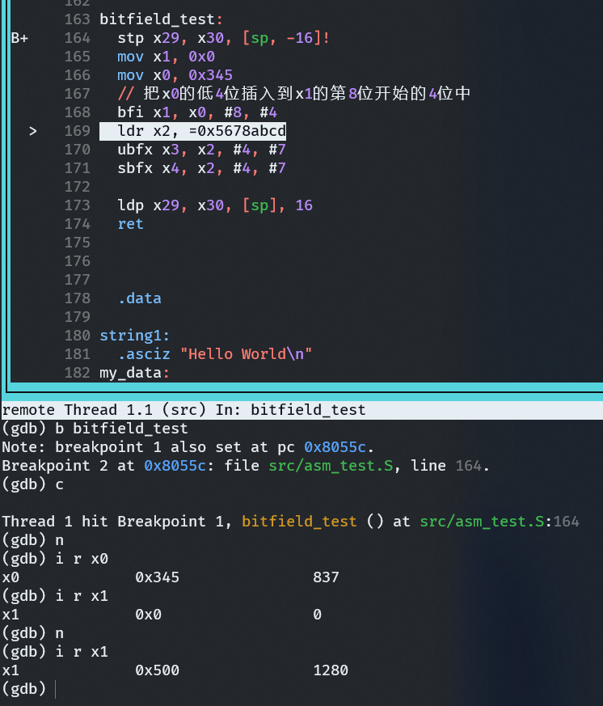

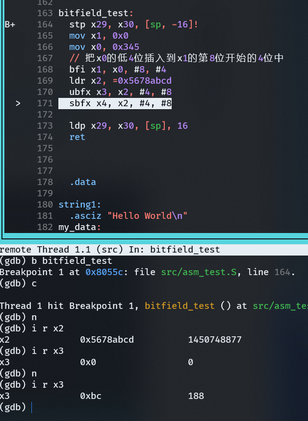

#### 乘法和除法指令

乘法：

| 指令       | 功能说明                                                     |
| ---------- | ------------------------------------------------------------ |
| **MADD**   | Multiply-Add：`Xd = (Xn * Xm) + Xa`                          |
| **MNEG**   | Multiply-Negate：`Xd = -(Xn * Xm)`                           |
| **MSUB**   | Multiply-Subtract：`Xd = Xa - (Xn * Xm)`                     |
| **MUL**    | Multiply：`Xd = Xn * Xm`（低 64 位结果）                     |
| **SMADDL** | Signed Multiply-Add Long：32位*32位 → 64位，加上加数         |
| **SMNEGL** | Signed Multiply-Negate Long：32位*32位 → 64位，取负          |
| **SMSUBL** | Signed Multiply-Subtract Long：32位*32位 → 64位，执行减法    |
| **SMULH**  | Signed Multiply returning High half：取 128 位结果的高 64 位（有符号） |
| **SMULL**  | Signed Multiply Long：32位*32位 → 64位                       |
| **UMADDL** | Unsigned Multiply-Add Long：无符号版本                       |
| **UMNEGL** | Unsigned Multiply-Negate Long：无符号版本                    |
| **UMSUBL** | Unsigned Multiply-Subtract Long：无符号版本                  |
| **UMULH**  | Unsigned Multiply returning High half：取高 64 位（无符号）  |
| **UMULL**  | Unsigned Multiply Long：无符号 32位*32位 → 64位              |

除法：

| 指令     | 功能说明                    |
| -------- | --------------------------- |
| **SDIV** | Signed Divide：有符号除法   |
| **UDIV** | Unsigned Divide：无符号除法 |

### 比较与跳转指令

#### 实验5：使用bitfield指令来读取寄存器


> 注意ubfx这类指令只能对普通寄存器的值进行位域提取，不能直接提取系统寄存器，因此需要先用msr把系统寄存器存入通用寄存器

读取系统寄存器(move register from system)

```asm
mrs x1, ID_AA64ISAR0_EL1
```

写入系统寄存器(move system from register)

```asm
msr ID_AA64ISAR0_EL1, x1
```

> ⚠️ 但注意：很多 CPU 特性寄存器（如 `ID_AA64ISAR0_EL1`）是 **只读的**，所以 `MSR` 往这个寄存器写入通常会触发异常，不能随意修改。


#### 零计数指令clz

> clz: 计算最高为1的比特位前面有几个0


#### 比较指令

##### cmp

> 比较两个数

cmp x1, x2

x1-x2

##### cmn

> 负向比较

cmn x1, x2

x1+x2

##### 条件操作后缀

| 条件后缀 | 含义               | 标志           | 条件码 | 缩写说明                   |
| -------- | ------------------ | -------------- | ------ | -------------------------- |
| EQ       | 相等               | Z=1            | 0b0000 | Equal                      |
| NE       | 不相等             | Z=0            | 0b0001 | Not Equal                  |
| CS/HS    | 无符号数大于或等于 | C=1            | 0b0010 | Carry Set / Higher or Same |
| CC/LO    | 无符号数小于       | C=0            | 0b0011 | Carry Clear / Lower        |
| MI       | 负数               | N=1            | 0b0100 | Minus                      |
| PL       | 正数或零           | N=0            | 0b0101 | Plus                       |
| VS       | 溢出               | V=1            | 0b0110 | Overflow Set               |
| VC       | 未溢出             | V=0            | 0b0111 | Overflow Clear             |
| HI       | 无符号数大于       | (C=1) && (Z=0) | 0b1000 | Higher                     |
| LS       | 无符号数小于或等于 | (C=0) ∨ (Z=1)  | 0b1001 | Lower or Same              |
| GE       | 带符号数大于或等于 | N = V          | 0b1010 | Greater or Equal           |
| LT       | 带符号数小于       | N ≠ V          | 0b1011 | Less Than                  |
| GT       | 带符号数大于       | (Z=0) && (N=V) | 0b1100 | Greater Than               |
| LE       | 带符号数小于或等于 | (Z=1) ∨ (N≠V)  | 0b1101 | Less or Equal              |
| AL       | 无条件执行         | --             | 0b1110 | Always                     |
| NV       | 无条件执行         | --             | 0b1111 | Never (保留，一般不用)     |

#### 实验1：cmp/cmn指令以及条件操作后缀


#### **NZCV 寄存器结构图**


```mathematica
┌───┬───┬───┬───┐
│ N │ Z │ C │ V │
└───┴───┴───┴───┘
 31  30  29  28   ← 在 PSTATE 或 NZCV 系统寄存器的位位置
```

**N (Negative flag)**

- 结果为负数（有符号数最高位为1） → N=1
- 否则 N=0

**Z (Zero flag)**

- 结果等于 0 → Z=1
- 否则 Z=0

**C (Carry flag)**

- 加法：有进位 → C=1
- 减法：无借位（即操作数1 ≥ 操作数2） → C=1
- 否则 C=0

**V (Overflow flag)**

- 有符号加/减法溢出（结果超出可表示范围） → V=1
- 否则 V=0


#### 条件选择指令

> 搭配cmp指令来使用

##### csel


##### cset


##### csinc

>  **Conditional Select Increment** 


#### 实验2：条件选择指令


#### 跳转指令

##### b 无条件跳转

> 跳转指令，无条件的跳转指令，不返回
>
> 跳转范围：PC+/- 128MB

##### b.cnd 有条件跳转指令

> 有条件的跳转指令，不返回
>
> cnd为条件操作后缀
>
> 跳转范围：PC+/- 1MB

##### bx 跳转到寄存器指定地址处

> 跳转到寄存器指定的地址处，不返回

##### bl (Branch with Link)带返回地址的跳转

> 带返回地址(PC+4 => x30)，适用于call子函数
>
> 返回地址保存到x30中，保存的是父函数的PC+4
>
> 跳转范围：PC+/- 128MB

##### blx (Branch with Link to Register)

> 跳转到寄存器指定的地址处，可以返回
>
> 返回地址保存到x30中，保存的是父函数的PC+4


#### 返回指令

##### ret

> 从子函数中返回，通常是x30里保存了返回地址

##### eret

> 从当前的异常模式返回，通常可以实现模式的切换，例如EL1切换到EL0
>
> 它从当前的异常模式中返回，它会从SPSR中恢复PSTATE，从ELR中获取跳转地址，并返回到该地址

#### 实验3： 为啥ret之后就跑飞了


**陷阱与坑**

> bl指令：用于call子函数，它把返回地址写入到x30寄存器，返回地址为PC+4
>
> 在一个函数里调用bl来call子函数，有可能会把父函数的lr寄存器给冲走，然后父函数的ret返回就跑飞了

简单来讲就是子函数更改了x30寄存器的值，返回时没有恢复


#### 比较并跳转指令

##### cbz cbnz tbz tbnz

| 指令     | 缩写含义                          | 作用描述                                                     |
| -------- | --------------------------------- | ------------------------------------------------------------ |
| **CBZ**  | *Compare and Branch if Zero*      | 检查指定寄存器的值是否为零，若为零则跳转到目标地址，跳转范围+/- 1MB。 |
| **CBNZ** | *Compare and Branch if Non-Zero*  | 检查指定寄存器的值是否非零，若非零则跳转到目标地址，跳转范围+/- 1MB。 |
| **TBZ**  | *Test Bit and Branch if Zero*     | 检查指定寄存器的某一位（bit）是否为 0，若该位为 0 则跳转到目标地址，跳转范围+/- 32KB。 |
| **TBNZ** | *Test Bit and Branch if Non-Zero* | 检查指定寄存器的某一位（bit）是否为 1，若该位为 1 则跳转到目标地址，跳转范围+/- 32KB。 |

### 其他重要的指令

#### PC相对地址加载指令

- adr 指令，加载PC相对地址的label的地址，范围为+/- 1MB


- adrp 指令，加载PC相对地址的label的地址，它只加载label所属的4KB对齐的地址，范围为+/- 4GB


#### 实验1： 测试adrp和ldr指令


#### adrp和ldr究竟有什么不同

陷阱与坑：


- ldr 伪指令：加载的绝对地址
- adrp指令：加载的PC相对地址


- 当链接地址 = 运行地址时

> ldr伪指令 加载的地址 = adrp 指令加载的地址

- 当链接地址!=运行地址时

> ldr伪指令地址：加载的时链接地址（或称为虚拟地址）
>
> adrp指令：加载的时当前运行地址的PC值+label的offset，即label在当前运行时的地址（或者称为物理内存）

#### 实验2：adrp和ldr指令的陷阱


#### 内存独占加载和存储指令

- ldxr 指令

> 内存独占加载指令，从内存中以独占exclusive的方式加载内存的地址到通用寄存器

- stxr 指令

> 内存独占存储指令


1. ldrx是加载内存，不过它会通过独占监视器来监视这个内存的访问，监视器会把这个内存地址标记为独占访问，保证其独占的方式来访问


2. stxr是有条件的存储内存，刚才ldxr标记的内存地址被独占的方式存储了，注意第一个寄存器为w0


- ldxr指令和stxr指令通常需要配对使用
- Linux内核常常用来实现atomic的访问，例如atomic_write()，atomic_set_bit()
- spinlock机制可以简单地使用ldxr和stxr指令来实现

#### 实验3：ldxr和stxr指令的使用


#### 异常处理指令

| 指令         | 名称                                          | 描述                                                         |
| ------------ | --------------------------------------------- | ------------------------------------------------------------ |
| **SVC #imm** | **系统调用指令**(Supervisor Call)             | 应用程序通过 `SVC` 指令从用户态跳转到内核态操作系统，通常进入 EL1 异常级别，用于触发系统调用 |
| **HVC #imm** | **虚拟化系统调用指令**(Hypervisor Call)       | 主机操作系统通过 `HVC` 指令从 EL1 进入 EL2，调用虚拟化管理程序（Hypervisor），用于虚拟化支持场景 |
| **SMC #imm** | **安全监控系统调用指令**(Secure Monitor Call) | 主机操作系统或监控程序通过 `SMC` 指令从普通世界（Non-secure World）进入安全世界（Secure World），通常触发 EL3 异常，用于 TrustZone 安全机制 |

#### 系统寄存器访问指令

| 指令    | 描述                                                        |
| ------- | ----------------------------------------------------------- |
| **MRS** | 读取系统寄存器的值到通用寄存器（Move Register from System） |
| **MSR** | 将通用寄存器的值写入系统寄存器（Move Register to System）   |

#### 内存屏障指令

| 指令    | 全称                                | 作用                                               | 强度 | 示例用途                           |
| ------- | ----------------------------------- | -------------------------------------------------- | ---- | ---------------------------------- |
| **DMB** | Data Memory Barrier                 | 保证**内存访问指令的执行顺序**（如写后读不会乱序） | 中等 | 多核间共享数据通信                 |
| **DSB** | Data Synchronization Barrier        | **等待所有内存访问完成**后再执行后续指令           | 强   | 外设寄存器读写前后，缓存同步       |
| **ISB** | Instruction Synchronization Barrier | **清除指令流水线和缓存**，强制重新取指             | 特殊 | 改变系统状态寄存器后，强制刷新指令 |

1. DMB

作用： 保证内存访问的先后顺序，但不阻塞执行。
例子：

```asm
    str x0, [x1]     // 写数据
    dmb sy           // 确保写操作完成
    ldr x2, [x3]     // 再读其他数据
```
2. DSB

作用： 必须等待之前所有内存操作完成，再继续执行后续指令。
例子：

```asm
    str x0, [x1]     // 写数据
    dsb sy           // 等待写入完成
    isb              // 保证后面执行的是最新的代码
```
3.  ISB

作用： 清除 CPU 指令预取缓存，通常在修改系统控制寄存器后用。
例子：

```asm
    msr sctlr_el1, x0  // 修改系统控制寄存器
    isb                // 强制刷新指令流
```


**DMB/DSB指令参数详解(内存屏障的粒度与作用范围)**

| 参数    | 访问顺序控制 | 共享范围                        | 说明                                                     |
| ------- | ------------ | ------------------------------- | -------------------------------------------------------- |
| `SY`    | 读/写        | 全系统共享                      | 最强，**所有处理器和设备**可见，常用于设备驱动或关键同步 |
| `ST`    | 写           | 全系统共享                      | 只对**写操作**建立顺序                                   |
| `LD`    | 读           | 全系统共享                      | 只对**读操作**建立顺序                                   |
| `ISH`   | 读/写        | **Inner Shareable（内部共享）** | 多核共享同一个 L2 cache 时使用                           |
| `ISHST` | 写           | Inner 共享                      | 内部共享域的**写操作屏障**                               |
| `ISHLD` | 读           | Inner 共享                      | 内部共享域的**读操作屏障**                               |
| `NSH`   | 读/写        | **Non-shareable（不共享）**     | 本核私有内存使用                                         |
| `NSHST` | 写           | 不共享                          | 本核私有写屏障                                           |
| `NSHLD` | 读           | 不共享                          | 本核私有读屏障                                           |
| `OSH`   | 读/写        | **Outer Shareable（外部共享）** | 多个 L2 之间共享时使用                                   |
| `OSHST` | 写           | Outer 共享                      | 外部共享写屏障                                           |
| `OSHLT` | 读           | Outer 共享                      | 外部共享读屏障                                           |


### Overview

- 运行在aarch64 execution state的指令集，64是指它的运行环境，而不是指令长度
- 指令长度是32bit，而不是64bit
- 31个通用寄存器，xn为64bit，wn为32bit
- 零寄存器：xzr, wzr
- pc不是通用寄存器，通常不能直接返回
- x30用作链接寄存器lr，用于函数返回
- ELR_ELx用于从异常返回
- 每个异常等级都有自己的栈SP，例如SP_EL0, SP_EL1
- SP不是通用寄存器


- SIMD和浮点运算的寄存器

- Qn（126bit，16字节），Dn（64bit）,Sn（32bit）， Hn（16bit）,Bn（Bn）

  

- `PSTATE`（Processor State Register）**不是单独存在的一个物理寄存器**，而是**多个位段组成的处理器状态集合**。

- `PSTATE` 的值控制 CPU 的当前状态，包括异常屏蔽、当前异常级别、条件码等。

| 字段        | 含义说明                                                     |
| ----------- | ------------------------------------------------------------ |
| `NZCV`      | 条件码标志位（ALU Flags）用于条件跳转等：**N**（负号）、**Z**（零）、**C**（进位）、**V**（溢出） |
| `Q`         | 溢出标志位位，仅 AArch32 用某些 SIMD 操作溢出时设置          |
| `DAIF`      | 异常屏蔽位：**D**：调试异常屏蔽**A**：SError 屏蔽**I**：IRQ 中断屏蔽**F**：FIQ 中断屏蔽 |
| `SPSel`     | SP 寄存器选择（仅 AArch64）控制是使用 `SP_EL0` 还是 `SP_ELx` |
| `CurrentEL` | 当前异常级别（EL0/EL1/EL2/EL3）影响特权级访问和执行          |
| `E`         | 字节序选择（AArch32）控制数据访问是小端或大端                |
| `IL`        | 非法指令标志设为 1 时，**所有指令都会被当作 UNDEFINED 执行**，调试用 |
| `SS`        | 单步执行标志（Software Stepping）与调试器联合使用，每次执行一条指令后触发异常 |


- 加载和存储指令

| 指令    | 类型            | 数据大小 | 是否符号扩展           | 存储/加载目标 |
| ------- | --------------- | -------- | ---------------------- | ------------- |
| `LDR`   | 普通加载        | 依寄存器 | 否                     | 任意位宽      |
| `LDRSW` | 加载有符号 word | 32-bit   | ✔（符号扩展至 64-bit） | **Xn only**   |
| `LDRB`  | 加载字节        | 8-bit    | 否                     | Wn/Xn         |
| `LDRSB` | 加载符号字节    | 8-bit    | ✔                      | Wn 或 Xn      |
| `LDRH`  | 加载半字        | 16-bit   | 否                     | Wn/Xn         |
| `LDRSH` | 加载符号半字    | 16-bit   | ✔                      | Wn 或 Xn      |
| `STRB`  | 存储字节        | 8-bit    | N/A                    | —             |
| `STRH`  | 存储半字        | 16-bit   | N/A                    | —             |

指令后缀含义

| 后缀   | 含义                           |
| ------ | ------------------------------ |
| `B`    | Byte（8-bit）                  |
| `H`    | Halfword（16-bit）             |
| `W`    | Word（32-bit）                 |
| `S`    | Sign-extended（符号扩展）      |
| 无后缀 | 默认按目标寄存器位数加载或存储 |


- 多字节加载和存储指令
  - A64指令集已经把ldm，stm，push，pop指令删掉
  - ldp和stp来实现多字节加载和存储指令


**与PC相关的指令**

 `ldr x0, =label`（伪指令）

- **含义**：加载 `label` 的地址（**链接地址**）到 `x0`。
- **实现方式**：汇编器会在 `.rodata` 区域生成一个常量表，`ldr` 实际上是从常量表中加载地址。
- **适用场景**：任何位置都能使用，但**依赖链接时地址信息**，在支持重定位的系统中要谨慎。

------

 `ldr x0, label`

- **含义**：将 `label` 地址处的值加载到 `x0` 中。
- **注意**：这里的 `label` 是个地址，指向的数据会被加载到寄存器中（不是加载地址本身）。
- **区别于上面**：这个不是加载地址，而是**通过地址去读取数据**。

------

`adr x0, .`

- **含义**：把当前 PC 的值加载到 `x0` 中。
- **常用场景**：定位当前代码位置（如实现 Position-Independent Code）。

------

 `adrp x0, label`

- **含义**：将 `label` 所在 page 的**页首地址（4KB 对齐）**加载到 `x0` 中。
- **用途**：
  - 多用于 **位置无关代码（PIC）**。
  - 搭配 `add` 实现完整地址加载：


| 标志位 | 含义                                               | 常见触发情况                    |
| ------ | -------------------------------------------------- | ------------------------------- |
| `N`    | Negative（负号）标志位：结果为负时置位             | 如 `subs x0, x1, x2` 得到负数   |
| `Z`    | Zero（零）标志位：结果为零时置位                   | 如 `subs x0, x1, x1`，结果为0   |
| `C`    | Carry（进位）标志位：无符号加法进位/无符号减法借位 | 如 `adds`, `subs`, `adc`, `sbc` |
| `V`    | Overflow（溢出）标志位：有符号数加减运算时溢出     | 如 `adds`, `subs` 溢出          |


推荐查阅文档

**arm8.6 Chapter C3 A64 Instruction Set Overview**


### 陷阱与坑（QEMU能跑但板子不能跑）

#### 坑1：ldr指令加载宏


在裸机编程中，没有enable MMU，因此内存属性一律被视为Device memory

ldr指令访问8个字节，如果地址不是8个字节对齐，那么会触发alignment异常，也就是Data abort

解决办法：

```asm
ldr x6, MY_LABEL
// 修改
ldr w6, MY_LABEL
```


#### **坑2: ldr指令加载字符串**


这也是alignment导致的，因为不能保证string1的起始地址是8个字节对齐

解决办法：让string1按8个字节对齐


#### 对齐访问总结

- 对于normal memory，支持不对齐访问。（需要enable MMU，并设置内存属性为normal）
- 可以单独设置不对齐访问时触发异常（设置SCTLR_Elx.A）
- 对于Device memory，不对齐访问会触发Data Abort异常
  - 没有enable MMU的系统，例如我们的实验代访问DDR编程访问device memory
- 指令预取，需要4个字节对齐，否则会触发异常


1. Normal memory 支持不对齐访问

- **条件**：
  - 启用了 **MMU**（Memory Management Unit）；
  - 并且该内存区域的属性被设置为 **Normal memory**；
- **结果**：
  - 支持对字（4字节）、半字（2字节）、字节（1字节）的不对齐访问；
  - 可实现跨边界访问，不触发异常；

2. 配置不对齐访问异常（SCTLR_ELx.A 位）

- **SCTLR_EL1.A** 控制是否允许 **不对齐访问**（Alignment Check）：
  - `A = 0`（默认）：允许不对齐访问（如果 memory 类型允许）；
  - `A = 1`：**强制对齐访问**，一旦发生不对齐访问，则触发 **Alignment fault 异常（Data Abort）**；

3. Device memory 不支持不对齐访问

- **特点**：
  - 无论 MMU 是否启用，Device memory 类型都**不允许不对齐访问**；
- **后果**：
  - 一旦访问未对齐的地址（如访问 `0x1003` 的 32-bit 数据），将触发 **Data Abort 异常**；
- **应用示例**：
  - 实验环境中直接映射访问 **DDR、外设寄存器** 等，通常被定义为 Device memory 类型；
  - 访问这些区域时必须对齐，如访问 32-bit 数据必须 4 字节对齐；

4. 指令预取要求

- **指令取址** 必须是 **4字节对齐**（即地址最低两位必须为 0）；
- 否则会触发 **Instruction Abort 异常**；
- 原因：ARMv8 指令以 4 字节为基本单位存储和取指，无法从非对齐位置解码执行指令。


#### **坑3：存储指令数据大小**

使用str指令来设置寄存器，一定要注意寄存器的位宽，否则会出现死机问题

树莓派4b上的寄存器位宽都是32bit的，也就是4个字节


#### 坑4：ldxr的大坑


**ldxr指令的使用会有很多限制**

1. 首先确保访问的内存是normal memory并且是sharable


2. 如果访问device memory，例如MMU没有打开的情况，那就需要CPU IP核心支持以独占的方式访问device memory，这个需要查询具体CPU IP手册的描述

例如： <\<Cortex-A72 MPCore Processor Technical Reference Manual\>>第6.45章节


解决方法：

填充好页表，使能MMU和cache，才能使用ldxr和stxr

### 大作业：在汇编中实现串口打印功能


🧱 1. GPIO 初始化（引脚复用配置）

```asm
ldr x1, =GPFSEL1
ldr w0, [x1]
and w0, w0, #0xffff8fff    // 清除 GPIO14 功能选择位（bit 12-14）
orr w0, w0, #0x4000        // 设置 GPIO14 为 ALT0 (UART0_TXD)
and w0, w0, #0xfffc7fff    // 清除 GPIO15 功能选择位（bit 15-17）
orr w0, w0, #0x20000       // 设置 GPIO15 为 ALT0 (UART0_RXD)
str w0, [x1]
```

✅ 作用：将 GPIO14 和 GPIO15 设置为 UART 功能（ALT0 模式）。
🧱 2. 禁用上拉/下拉（仅 Pi 3B 配置）
```asm
#ifdef CONFIG_BOARD_PI3B
	ldr x1, =GPPUD
	str wzr,[x1]

	// delay 150 cycles
	mov x0, #150
1:
	sub x0, x0, #1
	cmp x0, #0
	bne 1b

	ldr x1, =GPPUDCLK0
	ldr w2, #0xc000   // 对 GPIO14 和 GPIO15 生效
	str w2, [x1]
	
	// delay again
	mov x0, #150
2:
	sub x0, x0, #1
	cmp x0, #0
	bne 2b

	ldr x1, =GPPUDCLK0
	str wzr, [x1]
	isb
#endif
```
✅ 对 GPIO14/15 禁用上拉/下拉，符合 BCM2837 的初始化流程。
🧱 3. UART 初始化
```asm
// 禁用 UART
ldr x1, =U_CR_REG
str wzr, [x1]

// 设置波特率
ldr x1, =U_IBRD_REG
mov w2, #26          // Integer Baud Rate Divisor
str w2, [x1]

ldr x1, =U_FBRD_REG
mov w2, #3           // Fractional Baud Rate Divisor
str w2, [x1]

// 设置数据格式
ldr x1, =U_LCRH_REG
mov w2, #0x70        // FIFO enable + 8-bit word length
str w2, [x1]

// 禁用中断
ldr x1, =U_IMSC_REG
str wzr, [x1]

// 使能 UART (TX/RX/UART enable)
ldr x1, =U_CR_REG
mov w2, #0x301       // UARTEN | TXE | RXE
str w2, [x1]
isb
```
✅ 正确配置波特率和数据格式（8N1, FIFO），最后使能 UART。

你使用的是：

    波特率 = UARTCLK / (16 * (IBRD + FBRD/64))
    假设 UARTCLK = 48 MHz，则波特率约为 115200。

🧱 4. 单个字符输出函数 put_uart
```asm
put_uart:
	ldr x1, =U_FR_REG
1:
	ldr w2, [x1]
	and w2, w2, #0x20       // 检查 TXFF (Transmit FIFO full)
	cmp w2, #0
	b.ne 1b                 // 如果 FIFO 满，则等待

	ldr x1, =U_DATA_REG
	str w0, [x1]            // 写入字符
	ret
```
✅ 会等待 FIFO 可用后发送字符。

🧱 5. 字符串输出函数 put_string_uart
```asm
put_string_uart:
	mov x4, x0              // x0: 指向字符串
	mov x6, x30             // 保存返回地址
1:
	ldrb w0, [x4]           // 读取一个字节（字符）
	bl put_uart
	add x4, x4, 1
	cmp w0, #0
	bne 1b
	mov x30, x6
	ret
```
✅ 输入：x0 = 字符串地址，将其打印出来直到遇到 NULL（0x00）。

## GNU AS汇编器

ARM64的汇编器

- ARM公司的官方的汇编器
- GNU AS汇编器：aarch64-linux-gnu-as
- gcc采用as作为其汇编器，所以汇编代码是AT&T的
  - AT&T：源自贝尔实验室，为开发UNIX系统而产生的汇编语法
  - ARM格式：arm官方汇编语法

### 汇编语法

- label: 任何以冒号结尾的标识符都被认为是一个标号
- 注释：
  - // 表示注释
  - \# 在一行的开始，表示注释整行
- 指令，伪指令，寄存器可以全部都是大写或者小写，GNU风格默认小写

#### Symbol

> 代表它所在的地址，也可以当作变量或者函数来使用

- 全局symbol, 可以用.global来声明
- 局部symbol，主要在局部范围内使用，开头以0-99直接的数字为标号名，通常和b指令结合使用
- f: 指示编译向前搜索
- b:指示编译器向后搜索


#### 对齐伪指令

- .align对齐，填充数据来实现对齐。可以填充0或者使用nop指令。
  - 告诉汇编程序,align后面的汇编必须从下一个能被2^n整除的地址开始分配
  - ARM64系统中，第一个参数表示2^n大小


#### 数据定义伪指令

##### 整数与浮点伪指令汇总

| 指令           | 数据类型/作用                       | 字节数 | 补充说明                  |
| -------------- | ----------------------------------- | ------ | ------------------------- |
| `.byte`        | 定义 8 位整数                       | 1 B    | 通常用于字符、控制位      |
| `.hword`       | 定义 16 位整数（half-word）         | 2 B    | 某些架构中也叫`.short`    |
| `.int`/`.long` | 定义 32 位整数                      | 4 B    | `.int` 是别名，效果一样   |
| `.quad`        | 定义 64 位整数（quad-word）         | 8 B    | 在 AArch64 中非常常用     |
| `.float`       | 定义 IEEE-754 单精度浮点数（32 位） | 4 B    | 等价于 C 语言中的 `float` |

##### 字符串定义伪指令

| 指令           | 功能说明                                                     |
| -------------- | ------------------------------------------------------------ |
| `.ascii "str"` | 将字符串原样插入，不自动添加 `\0`，适用于非 C 风格字符串     |
| `.asciz "str"` | 在字符串末尾**自动追加一个空字符 `\0`**，适用于 C 字符串（推荐） |


#####  .rept ... .endr：重复块定义

语法：

```asm
.rept <count>
  <内容>
.endr
```


作用：重复某段汇编代码或数据定义若干次，适用于初始化数组或填充空间。

例子：
```asm
.rept 3
    .long 0
.endr
```
 等价于：
```asm
.long 0
.long 0
.long 0
```
#####  .equ / .set：常量定义（赋值操作）

这两个指令完全等价，只是语法风格略不同。
 .equ

```asm
.equ abcd, 0x45
```
 让 abcd 成为 常量宏定义，值为 0x45。
 .set

```asm
.set abcd, 0x45
```
 同样效果，也定义 abcd 为 0x45。

典型用途：用于定义寄存器地址、常量位掩码等。
常见用法示例（结合 .equ 与 .rept）：

```asm
.equ LED_BASE, 0x3F200000

.section .data
.rept 4
    .int LED_BASE
.endr
```
表示将 LED_BASE 这个地址填充 4 次，每次 4 字节，共 16 字节。


`.equ` 与 C 的 `#define` 区别：

| `.equ` / `.set`                    | `#define`                |
| ---------------------------------- | ------------------------ |
| 汇编阶段赋值，数值不可变           | 预处理阶段文本替换       |
| 可用于表达式（如 `.equ val, 4+5`） | 只做文本拼接             |
| 不可用于条件编译                   | 可与 `#ifdef` 等配合使用 |


##### 函数相关的伪指令

| 伪操作             | 作用说明                   |
| ------------------ | -------------------------- |
| `.global`          | 定义一个全局的符号         |
| `.include`         | 引用头文件                 |
| `.if .else .endif` | 控制语句结构，用于条件编译 |

##### if语句伪操作

| 指令               | 含义说明                             |
| ------------------ | ------------------------------------ |
| `.ifdef symbol`    | 判断 `symbol` 是否已定义             |
| `.ifndef symbol`   | 判断 `symbol` 是否**未**定义         |
| `.ifc str1,str2`   | 判断字符串 `str1` 与 `str2` 是否相等 |
| `.ifeq expr`       | 判断表达式 `expr` 的值是否为 0       |
| `.ifeqs str1,str2` | 等价于 `.ifc str1,str2`              |
| `.ifge expr`       | 判断表达式 `expr` 的值是否 ≥ 0       |
| `.ifle expr`       | 判断表达式 `expr` 的值是否 ≤ 0       |
| `.ifne expr`       | 判断表达式 `expr` 的值是否 ≠ 0       |

##### 与段相关的伪操作

- .section 表示接下来的汇编会链接到哪个段里，例如代码段，数据段等
- 每一个段以段名为开始，以下一个段名或者文件尾为结束

```asm
.section name, "flags"
```

后面可以添加flags，表示段的属性

| 标志 | 含义说明                                                     |
| ---- | ------------------------------------------------------------ |
| `a`  | **allocatable**：该段在运行时需要被加载到内存中。            |
| `d`  | **GNU_MBIND section**：GNU 使用的特殊绑定段。                |
| `e`  | **excluded**：该段不会被包含在可执行文件或共享库中。         |
| `w`  | **writable**：该段可写。                                     |
| `x`  | **executable**：该段包含可执行代码。                         |
| `M`  | **mergeable**：可以和其他具有相同属性的段合并（通常用于只读字符串等）。 |
| `S`  | **string**：该段包含以 0 结尾的字符串。                      |
| `G`  | **group**：该段属于某个 section group（如 COMDAT）。         |
| `T`  | **thread-local-storage**：该段用于线程局部存储（TLS）。      |
| `?`  | **unspecified group**：该段属于前一个 section 的 group（如果有的话）。 |

举例：


`.pushsection <name>`
 将接下来的代码或数据**插入到指定的 section（段）中**，同时**保存当前 section 状态**。

`.popsection`
 表示**结束前面的 push**，并**恢复原来的 section**。

- **成对使用**。

- 作用仅在 `pushsection` 和 `popsection` 之间的代码，对其他代码没有影响。

- 其余代码仍然属于原先的段，比如 `.text` 或 `.data`。
```asm
    .text
    .globl _start
_start:
    nop             // 在默认的 .text 段中

    .pushsection .mydata, "a"
    .long 0x12345678  // 被插入到 .mydata 段中
    .popsection
    
    nop             // 又回到 .text 段
```

`_start` 和两个 `nop` 都属于 `.text` 段；

`.long 0x12345678` 被插入到了自定义的 `.mydata` 段中。

##### 实验1：使用汇编伪操作来实现一张表


##### 宏

- .macro和.endm组成一个宏
- .macro后面跟着的是宏的名称，在后面是宏的参数
- 在宏里使用参数，需要添加前缀“\”

```asm	
.macro plus1 p, p1
```

> 定义了一个名为plus1的宏，有两个参数p和p1
>
> 在宏里使用参数需要前缀,"\p"表示第一个参数,"\p1"属于第二个参数

- 宏参数定义的时候可以设置一个初始化值

```asm
.macro reserve_str p1=0 p2
```

> 第一个参数p1有一个初始化的值，0。这个时候可以使用reserve_str a,b或者reserve_str, b来调用这个宏


解决办法：

- 使用空格或者使用altmacro+&


-  使用”\\()“表示连接（）


##### 实验2：汇编宏的使用


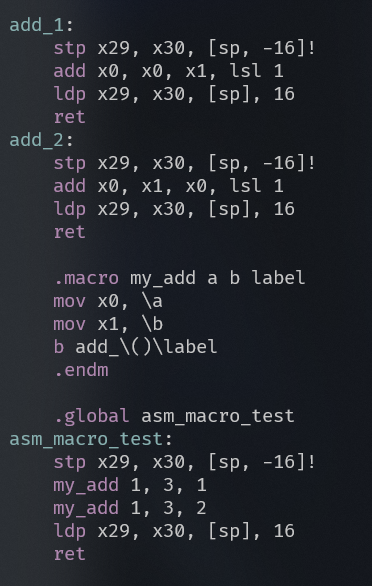

#### ARM64特有的特性

##### ARM64编译选项

- -EB：用于大端模式的CPU，-EL：用于小端模式的CPU
- -mabi：指定ABI模式，ilp32用于ELF32，lp64用于ELF64，默认值为lp64
- -mcpu=processor+extension：指定CPU型号，例如cortex-a72
- -march=，用于指定支持的架构，例如armv8.2-a
- ARM64支持的extension，见GNU汇编器as_v2.34 9.1.2章

##### 特殊字符

- //表示注释
- #若在一行开始表示注释，不在一行开始也可表示立即数
- #:low12 表示低12位

```asm
adrp x0, foo
ldr x0, [x0, #:lo12:foo]
```


- ldr伪操作
- .bss 切换到bss段
- .dword/.xword 64位数据
- name .reg register_name 为寄存器命名

```asm
foo .req w0
```


## GNU LD连接器

### 链接器Linker

- 链接器是一个程序，将一个或多个由编译器或汇编器生成的目标文件外加库链接为一个可执行文件
- GNU Linker采用AT&T链接脚本语言
- 官方文档：v2.3.4


#### ld命令

- aarch64-linux-gnu-ld
- 常用参数
  - -T 指定链接脚本
  - -Map 输出一个符号表文件
  - -o 输出最终可执行二进制文件


#### 一个简单的例子

```asm
SECTIONS
{
	. = 0x10000;
	.text : {* (.text)}
	. = 0x8000000
	.data : {*(.data)}
	.bss : {*(.bss)}
}
```

#### 基本概念

- 输入段(input section)，输出段(output section)
- 每个段包括name和大小
- 段的属性
  - loadable 运行时会加载这些段的内容到内存
  - allocatable 运行时不会加载段的内容
- 段的地址
  - **VMA**(virtual memory address) 虚拟地址，运行时的地址
  - **LMA**(load memory address) 加载地址
  - **通常ROM的地址为加载地址，而RAM的地址为VMA**

#### 链接脚本命令

- ENTRY(symbol) 设置程序的入口函数
- 链接程序有如下几种方式来设置入口点：
  - 使用-e参数
  - 使用ENTRY(symbol)
  - 在.text的最开始的地方
  - 0地址


- INCLUDE filename 引入filename链接脚本
- OUTPUT filename 输出二进制文件，类似在命令行里使用“-o filename”
- OUTPUT_FORMAT(bfd) 输出BFD格式
- OUTPUT_ARCH(bfdarch) 输出处理器体系结构格式


#### 符号赋值

- 符号也可以像C语言一样赋值

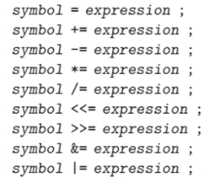

- "." 表示location counter，表示当前位置


#### 符号的引用

- 高级语言中常常需要引用链接脚本定义的符号
- 在C语言里，定义一个变量并初始化一个变量。例如 int foo = 100
  - 编译器会在符号表定义了一个符号foo
  - 编译器会在内存中为符号存储100


- 在链接脚本中定义一个变量
  - **链接器仅仅在符号表里定义这个符号，没有分配内存来存储变量的值**
- 访问链接脚本定义的变量：**访问的时变量的地址，不能访问变量的值**


- 我们可以在每个段设置一些符号，以方便C语言访问每个段的起始地址和结束地址


#### SECTIONS命令

- SECTIONS命令：告诉链接器如何把输入段(input sections)映射到输出段(output sections)，以及如何在内存中摆放这些输出段


- 输出section的描述符


#### LMA加载地址

- 每个段都有**VMA**（虚拟地址，运行地址）以及**LMA**（加载地址）
- 在输出段描述符中**使用"AT"来指定LMA**
- **如果没有通过"AT"来指定LMA，通常LMA=VMA**
- 构建**一个基于ROM的映像文件常常会设置输出段的虚拟地址和加载地址不一致**

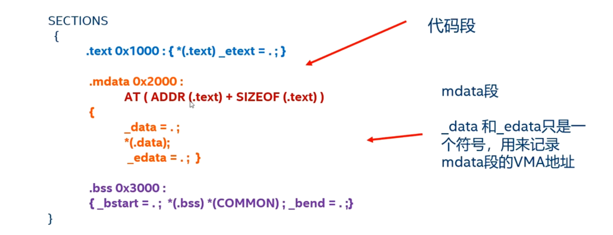


- data段的加载地址和链接地址（虚拟地址）不一样，因此程序的初始化需要把data段从ROM的加载地址复制到SDRAM中的虚拟地址中
- 数据加载地址在_etext起始的地方，数据段的运行地址是在\_data起始的地方，数据段的大小为“\_edata-\_data",下面这段代码把数据段从\_etext起始的地方复制到\_data起始的地方


#### 常见的内建函数

##### ADDR(section)

> 返回前面已经定义过的段的VMA地址


##### ALIGN(n)

> 返回下一个与n字节对齐的地址，它是基于当前的位置(location counter)来计算对齐地址的
>
> 注意这里是n个字节，而不是2^n个字节（与汇编器的.align区分）


##### SIZEOF(section)

> 返回一个段的大小


##### MAX(exp1, exp2) / MIN(exp1, exp2)

> 返回两个表达式的最大值或最小值

#### 实验2：打印每个段的内存布局


1. **链接器导出的符号是地址，不是变量值**

链接脚本中的这些符号：

```asm
_text = .;
```

定义的不是变量本身，而是一个 地址标签（symbol address）。在 C 中没有对应“地址标签”的语法，因此只能通过某种“变量”来间接引用这个地址。


用 char[] 声明它，其实是在说：

> “这是一段起始于 _text 的内存区域，我关心的是它的地址，而不是它的具体内容。”

2. **char[] 是一种“单位最小”的内存表示，方便做指针运算**

    char 是 C 中最小的可寻址单位（1 字节）。
    
    所以用 char[] 类型，我们就可以直接进行精确的地址操作：
    
```c
extern char _text[], _etext[];
size_t text_size = _etext - _text;  // 计算段长度（字节）
```

如果你写成 int[] 或 void*，这个计算就可能出错，或者无法编译。

3. char[] vs char* 的差异：**链接器符号是“数组地址”而非指针变量**

虽然你也可以写成：
```c
extern char *_text;
```
但这其实意味着 _text 是一个“指向字符的变量”，而不是一个地址标签。

> char *_text; 说明编译器要去“取变量 _text 的值”，它必须由代码赋值。
而 char _text[]; 是“声明链接器会提供这个地址”，不会生成额外符号或变量。

所以推荐使用：

```c
extern char _text[];
```


#### 实验3：加载地址不等于运行地址


需要把代码从装载地址拷贝到运行地址

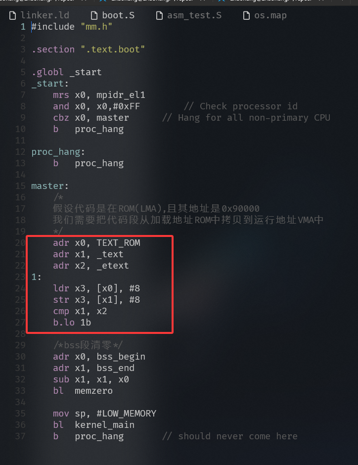

#### 实验4：分析Linux5.0内核的链接脚本


#### 运行地址，装载地址，链接地址

##### 链接地址（Link Address）

定义：

>  编译器和链接器在生成可执行文件（如 ELF 文件）时，为各段（如 .text, .data, .bss 等）分配的地址。

特征：

- 是编译阶段由 链接器设定的地址。
- 可以通过链接脚本 (ld script) 显式设置，比如 . = 0x80000;。
- 可执行文件中的节表（section headers）或段表（program headers）中就记录了这些地址。

例子：

```asm
.text : { *(.text) } > 0x80000
```

表示 .text 段的 链接地址是 0x80000。

##### 装载地址（Load Address）

定义：

> 可执行文件中的内容被加载到内存中的位置，也就是 操作系统/bootloader 将文件装入内存的位置。

特征：

- 通常等于链接地址，但在某些情况下（如动态链接、加载地址重定位）可以不同。
- 由 操作系统或 bootloader 决定，也可以通过 objcopy 等工具进行重新定位。

例子：

- 你的 ELF 文件 .text 段链接地址是 0x80000，bootloader 将它加载到 0x100000，那么：
  - 链接地址 ≠ 装载地址
  - 如果没有做重定位，程序运行会出错（因为代码中有绝对地址）

##### 运行地址（Runtime/Execution Address）

定义：
> 程序在执行时，CPU 实际访问的内存地址。

特征：

- 通常 = 装载地址（程序加载到哪里就从哪里执行）

- 如果启用了 MMU（内存管理单元），运行地址是虚拟地址，由 MMU 映射到物理装载地址。

- 在裸机程序中，一般 = 链接地址 = 装载地址 = 运行地址。

## GCC内嵌汇编

> 内嵌汇编（Inline Assembly Language）在C语言中嵌入汇编代码

目的：

- 优化：针对特定重要代码(time-sensitive进行优化)
- C语言需要访问某些特殊指令来实现特殊功能，比如内存屏障指令

参考资料：《Using the GNU Compiler Collection, v16.0》Chapter 6.12


内存汇编两种模式

### 基础内嵌汇编

**格式：**

```c
  asm asm-qualifiers(AssemblerInstructions)
```

- asm关键字：表明这是一个GNU扩展
- 修饰词（qualifiers）
  - volatile：在基础内嵌汇编中通常不需要这个修饰词
  - inline：内联，asm汇编的代码会尽可能小

- 汇编代码块（AssemblerInstructions）

  - GCC编译器把内嵌汇编当成一个字符串

  - GCC编译不会去解析和分析内嵌汇编

  - 多条汇编指令，需要使用”\n\t“来换行

  - GCC的优化器，可以移动汇编指令的前后位置。如果你需要保存汇编指令的顺序，最后使用多个内嵌汇编的方式


### 扩展内嵌汇编


- 格式
  - asm关键字：表明这个是一个GNU扩展
  - 修饰词(asm-qualifiers)
    - volatile：用来关闭GCC优化
    - inline内联，asm汇编的代码会尽可能小
    - goto 在内嵌会便利会跳转到C语言的标签里


- 输出部：

  > 用于描述在指令部中**可以被修改的C语言变量**以及约束条件

  - 每个输出约束通常以"="开头，接着的字母表示对操作数类型的说明，然后是关于变量结合的约束
  - 输出部通常使用”=“或者"+"作为输出约束，其中”**=“表示被修饰的操作数只具有可写属性**，”**+“表示被修饰的操作数只具有可读可写属性**
  - 输出部可以是空的

``` 
"=/+" + 约束修饰符 + 变量
```

- 输入部

  > 用来描述在指令部**只能被读取访问的C语言变量**以及约束条件

  - 输入部描述的参数是只有只读属性，不要试图修改输入部的参数内容，因为GCC编译器假定，输入部的参数的内容在内嵌汇编之前和之后都是一致的
  - 在输入部中不能使用"="或者”+“约束条件，否则编译器会报错
  - 输入部可以是空的

- 损坏部（Clobbers）

  - "memory"告诉GCC编译器内联汇编指令改变了内存中的值，强迫编译器在执行该汇编代码前存储所有缓存中的值，在执行完汇编代码之后重新加载该值，目的是防止编译乱序
  - ”cc"表示内嵌汇编代码修改了状态寄存器相关的标志位


- 指令部的参数表示
  - %0 对应输出输入部的第一个参数，%1表示第二个参数


**输出和输入部的约束修饰符**


**输出部和输入部的约束修饰符——通用**


**输出部和输入部的约束修饰符——ARM64**


**汇编符号名字来代替前缀%**

- `%[name]` → 引用约束变量

- `%w[name]` → 引用 **低 32 位寄存器**（如 `w0, w1`）

- `%x[name]` → 引用 **完整 64 位寄存器**（如 `x0, x1`）


### 实验1：实现简单的memcpy函数


### 陷阱与坑

- **GDB不能单步调试内嵌汇编**
- **输出部和输入部的修饰符不能用错**，否则程序会跑错

### 实验3：使用内嵌汇编来完善memset函数


### 内嵌汇编的高级玩法：和宏结合

- 技巧1：使用了C语言的#运算符。在带参数的宏中，“#”运算符作为一个预处理运算符，可以把记号转换为字符串


```c
#define ATOMIC_OP(op, asm_op) \
static inline void atomic_##op(int i, atomic_t *v) { \
    __asm__ __volatile__( \
        asm_op " %1, %0" \
        : "+m" (v->counter) \
        : "ir" (i)); \
}


```

你可以用这个宏来生成多个原子操作函数：

```c
ATOMIC_OP(add, "addl")
ATOMIC_OP(sub, "subl")
```

这会展开为：

```c
static inline void atomic_add(int i, atomic_t *v) {
    __asm__ __volatile__(
        "addl %1, %0"
        : "+m" (v->counter)
        : "ir" (i));
}

static inline void atomic_sub(int i, atomic_t *v) {
    __asm__ __volatile__(
        "subl %1, %0"
        : "+m" (v->counter)
        : "ir" (i));
}
```

图片中的这个宏使用 `#asm_op` 是因为 **它需要将宏参数 `asm_op` 转换成字符串字面量**，用于字符串拼接或输出。这种语法叫做 **宏字符串化（stringification）**

`asm_op` 是宏参数，**在宏展开时会替换为你提供的值**（比如 `"addl"`）。

它已经是一个字符串，比如你调用：

```asm
ATOMIC_OP(add, "addl")
```

宏展开后是：

```c
__asm__ __volatile__(
    "addl %1, %0"
    : "+m" (v->counter)
    : "ir" (i));

```

而这样：

```c
 ATOMIC_OP(add, addl)
```

宏展开后是

```c
__asm__ __volatile__(
    addl "%1, %0"
    : "+m" (v->counter)
    : "ir" (i));
```

则不是


`##name` —— **符号连接（token pasting）运算符**

- 把宏参数和前后的标识符直接拼接成一个新的标识符（不是字符串）。

- 常用来生成变量名、函数名等。

```c
#define MAKE_FUNC(name) void func_##name(void) {}

MAKE_FUNC(test); // 展开成：void func_test(void) {}
```


### 实验4：使用内嵌汇编与宏的结合


### 实验5：实现读写系统寄存器的宏


这里用到了**GNU C 的语句表达式 (statement expression)** 语法:

**`({ ... })` 是什么**

- 这是 GNU 扩展，不是标准 C。

- 它让一段代码块既能像语句一样执行，也能**返回一个值**。

- 语法规则：

  > `({ statement1; statement2; ...; expression; })`
  >  代码块里最后的那个 **表达式**（不加分号）就是返回值。

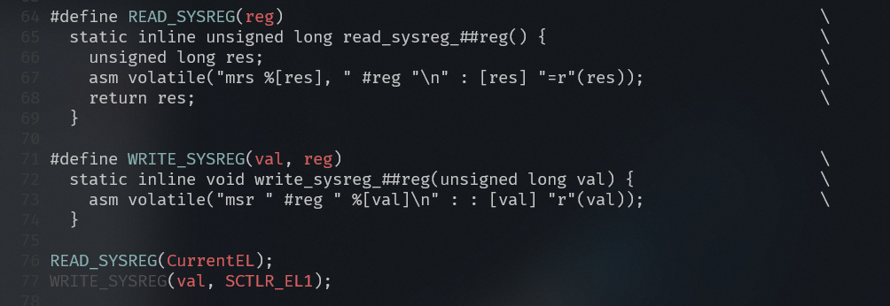


### 内嵌汇编：goto

> 内嵌汇编的goto模板，可以跳转到C语言的label标签里


- Goto模板的输出部必须为空
- 新增一个gotolabels的部，里面列出了C语言的label，是允许跳转的label


### 实验6：goto模板的内嵌汇编


`%l[label]` 是 GCC 内联汇编中 `asm goto` 语法的特殊写法，表示跳转到 C 代码中的标签 `label`。

详细解释：

- `%l[...]` 是告诉编译器这是一个**标签符号**（label），而不是普通的寄存器或立即数。
- `label` 是你在 C 代码里定义的标签名，比如你代码中的 `label:`。
- `asm goto` 允许汇编代码通过条件跳转直接跳转到 C 代码中的某个标签，实现条件分支。

## ARM64的异常处理（Exception Model）

ARMv8.6手册


### ARM64的异常等级

- EL0 非特权模式，例如应用程序
- EL1 特权模式，例如OS内核
- EL2 虚拟化监控程序，例如hypervisor
- EL3 安全模式，例如secure monitor

### 异常术语(Exception terminology)

- **Taking an exception**: 正在处理一个异常
- **Returning from an exception**: 从一个异常中返回
- **Exception levels**: 异常等级
- **Precise exception**: 精准异常
- **Synchronous and asynchronous exception**: 同步异常与异步异常
  - 同步异常
    - 系统调用, svc, hvc, SMC等
    - MMU引发的异常
    - SP和PC对齐检查
    - 未分配的指令
  - 异步异常
    - IRQ中断
    - FIQ中断
    - SError（系统错误）


### 异常入口（Exception Entry）

> Process state or PSTATE is an abstraction of process state information

- 当异常发生时，CPU硬件都做了哪些事情
  - **PSTATE 保存到SPSR_ELx（The Saved Program Status Register）**
  - **返回地址保存ELR_ELx**
  - **PSTATE寄存器的DAIF域都设置为1，相当于把调试异常，系统错误（SError），IRQ中断以及FIQ中断都关闭了**
  - **更新了ESR_ELx（Exception Link Register）寄存器，里面包含了同步异常发生的原因**
  - **SP执行SP_ELx**
  - **切换到对应的EL，然后跳转到异常向量表里执行**
- 当异常发生后，操作系统需要做哪些事情

> 操作系统需要根据异常发生的类型，跳转到合适的异常向量表
>
> 异常向量表的每个表项会保存一个异常处理的跳转函数，然后跳转到恰当的异常处理函数并处理异常

### 异常的返回

- 操作系统执行一条**eret**语句
  - **从ELR_ELx（Exception Link Register）寄存器中恢复PC指针**
  - **从SPSR_ELx（The Saved Program Status Register）寄存器恢复处理器的状态**


### 异常返回地址

- 返回地址两个寄存器
  - x30：子函数的返回地址。使用ret指令来返回
  - ELR_ELx：异常返回地址。使用eret指令来返回
- **ELR_ELx**寄存器保存了异常返回地址
  - **对于异步异常，它的返回地址是中断发生时的下一条指令，或者没有执行的第一条指令**
  - **对于不是system call的同步异常，返回的是触发同步异常的那一条指令**
  - **对于system call，它返回的是svc指令的下一条指令**

**异步异常（中断）**

> 硬件已经把 ELR 设置为 *下一条要执行的指令*，`eret` 就直接回去继续执行，不用额外改

**同步异常（非 system call）**

> 硬件把 ELR 设置为 *触发异常的那条指令*
>  如果你修复了异常原因（比如缺页异常），直接 ` eret` 就会重新执行这条指令
>  如果你想跳过它（不重试），就要手动 `ELR_ELx += 4`

**system call（svc）**

> 硬件把 ELR 设置为 *svc 的下一条指令*，所以 `eret` 会直接返回到下一条

### 异常处理的路由

> 当在一个特定的“异常等级（Exception Level, EL）”发生异常时，CPU 应该跳转到哪个异常等级去处理它

- 异常发生时，可以在**当前EL处理也可以在更高EL处理**
- **EL0不能用来处理异常**
- **同步异常是可以在当前EL里处理的**，比如在EL1发生了同步异常
- 对于**异步异常，可以路由到EL1,EL2,EL3处理**，需要配置**HCR**（Hypervisor Configuration Register）以及**SCR**（Secure Configuration Register）相关寄存器


参考armv8.6的tableD1-10


- 表格的输入是两个寄存器SCR和HCR
- **Target when taken from EL0 / EL1 / EL2 / EL3**: 这些列显示了异常处理程序所在的最终目标等级。
- **EL1 / EL2 / EL3**: 表示异常被直接路由到对应的异常等级。
- **C**: "Call"。表示异常被视为对目标等级的同步调用。
- **Hyp**: "Hypervisor"。是 EL2 的别称，表示异常被路由到 EL2。
- **FIQ/IRQ Abt**: "FIQ/IRQ Abort"。表示异常被作为中断中止路由。具体路由到哪里，要看 `SCR_EL3` 和 `HCR_EL2` 中 `FIQ`/`IRQ` 相关位的设置。
- **n/a**: "Not Applicable"。表示该场景不适用或不可能发生。

### 栈的选择

- 每个异常等级EL都有对应栈指针寄存器SP
  - SP_EL0, SP_EL1, SP_EL2, SP_EL3
- **栈必须16字节对齐**。硬件可以检测栈指针是否对齐
- **当异常发生时，并跳转到目标异常等级时，硬件会自动选择SP_ELx**
- **操作系统负责和分配**保证每个异常等级EL对应的栈，是可用的


### 异常处理的执行模式

- 当异常发生时，切换到高级别的EL，这个EL运行在哪个模式？AArch64 or AArch32
  - **HCR_EL2.RW（Hypervisor Configuration Register）**记录了EL1要运行在哪个模式
    - 1表示aarch64
    - 0表示aarch32


- **当异常发生后，执行模式可以发生改变**
  - 一个aarch32的应用程序正在运行，这时候来了一个中断，它可能会跑到aarch64执行状态下的EL1里处理这个中断 

### 异常返回的执行模式

- 从一个异常返回，SPSR寄存器记录了：
  - 返回到哪个EL?   **SPSR.M[3:0]**
  - 返回目标EL的执行模式？**SPSR.M[4]**
    - 0表示aarch64
    - 1表示aarch32


### 实验1：切换到EL1中运行


**提示**

从EL2切换到EL1，需要做如下几件事情

1. **设置HCR_EL2（Hypervisor Configuration Register）寄存器，最重要的是Bit 31的RW域，表示EL1要运行在哪个执行环境里，aarch32或aarch64**

   - HCR_EL2属于General System Control Register

   

   

   

2. **设置SCTLR_EL1（System Control Register），要设置大小端和关闭MMU**

   

   

   

3. **设置SPSR_EL2（Saved Program Status Register）寄存器，设置模式M域为EL1h，另外需要关闭所有的DAIF**

   - **SPSR_ELx**属于**Special-purpose Register**

   

   

   

   

   

   ---

   

   

   

   | M[3:0] | 目标模式 | 说明             |
   | ------ | -------- | ---------------- |
   | `0000` | EL0t     | EL0，使用 SP_EL0 |
   | `0100` | EL1t     | EL1，使用 SP_EL0 |
   | `0101` | EL1h     | EL1，使用 SP_EL1 |
   | `1000` | EL2t     | EL2，使用 SP_EL0 |
   | `1001` | EL2h     | EL2，使用 SP_EL2 |
   | `1100` | EL3t     | EL3，使用 SP_EL0 |
   | `1101` | EL3h     | EL3，使用 SP_EL3 |

4. **设置异常返回寄存器elr_el2，让其返回到el1_entry汇编函数里**

5. 执行**eret**

（3,4其实是一个异常返回的经典步骤，从EL2返回到EL1）


首先根据当前异常等级判断要跳到哪个异常等级


注意执行eret前要设置elr_el2寄存器


### 异常向量表（Exception vectors）

- 每个异常等级EL都有自己的异常向量表，EL0除外

- 异常向量表的基地址需要设置到**VBAR_ELx（Vector Base Address Register）**寄存器中

- VBAR_EL1寄存器：

  

  0~10是reserve，因此**地址是2k对齐**


1. 行（Exception taken from）

   > 定义异常触发时的 “当前执行状态”，分 4 类场景：

   - **Current Exception level with SP_EL0**：当前异常级别使用 `SP_EL0` 栈指针（如在 EL1 下用用户级栈指针时触发异常 ）。
   - **Current Exception level with SP_ELx, x>0**：当前异常级别使用 `SP_ELx`（x≥1，如 EL1 用 `SP_EL1`、EL2 用 `SP_EL2` 等内核级栈指针）时触发异常。
   - **Lower Exception level（AArch64）**：从更低异常级别触发，且 “更低级别” 处于 AArch64 执行状态（如从 EL0/EL1 切换到更高 EL 时，且原级别是 64 位模式 ）。
   - **Lower Exception level（AArch32）**：从更低异常级别触发，且 “更低级别” 处于 AArch32 执行状态（如从 32 位模式的 EL0/EL1 切换到更高 EL ）。

2. 列（Offset for exception type）

   > 按异常类型分类，对应不同偏移：

   - **Synchronous**：同步异常（如指令执行错误、软件触发异常等，与指令流同步发生 ）。
   - **IRQ or vIRQ**：普通中断（IRQ）或虚拟中断（vIRQ，虚拟化场景下）。
   - **FIQ or vFIQ**：快速中断（FIQ，优先级通常更高）或虚拟快速中断（vFIQ，虚拟化场景 ）。
   - **SError or vSError**：系统错误（SError，如总线错误等严重错误）或虚拟系统错误（vSError，虚拟化场景 ）。

3. **偏移值（如 0x000、0x080 等）**：基于行（触发状态）和列（异常类型）的组合，给出相对于向量表基地址的偏移，处理器通过基地址 + 偏移，就能找到异常处理程序的入口地址 。

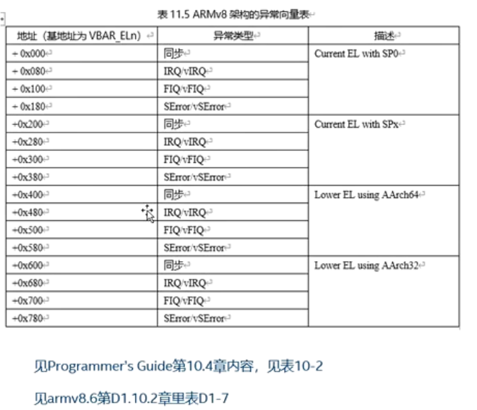


- **异常向量表的整体结构**

在 **AArch64 EL1** 及以上的执行级别中，异常向量表（Vector Table）存放在 **`VBAR_ELx`**（Vector Base Address Register）寄存器指向的地址。

这个表里一共包含 **4 个“区块” (blocks)**，分别对应不同的异常来源：

1. **从当前的 SP (SP0)** 触发的异常
2. **从当前的 SP (SPx)** 触发的异常（x≠0，比如 SP_EL1）
3. **来自下一个更低特权级（比如 EL0）** 的异常
4. **来自当前特权级（比如 EL1 内部）** 的异常

每个区块又包含 **4 种异常类型**：

- **Synchronous exception** （同步异常，比如 SVC 指令、数据访问异常）
- **IRQ** （普通中断）
- **FIQ** （快速中断）
- **SError** （系统错误，通常是硬件异常）

所以总共：
  **4 个区块 × 4 种异常 = 16 个表项**

------

**每个表项的大小**

ARMv8-A 规定：

- **每个表项的大小固定为 128 字节**（0x80）。
- **16 个表项 × 128 字节 = 2048 字节 = 2KB**。
- 所以整个向量表的大小是 **2KB**。

也就是说，异常向量表必须是 **2KB 对齐**的区域。

### Linux5.0内核的异常处理


- .align 11就是让异常向量表按**2k大小对齐**

- kernel_ventry是一个宏，简化代码如下


> align 7表示按2的7次方大小来对齐，2的7次方是128个字节
>
> sub指令是让栈指针sp减去一个S_FRAME_SIZE，其中S_FRAME_SIZE称为寄存器框架大小，也就是struct pt_regs数据结构的大小
>
> “\\()”表示连接
>
> 举例：在发生EL1的IRQ中断时，这条语句变成了"b el1_irq"

`kernel_entry` 是异常向量表跳转到的第一级入口，它的职责是：

1. **保存上下文**：把 CPU 现场（通用寄存器）保存到栈上。
2. **建立栈帧**：为异常处理函数（C 代码）准备好栈空间。
3. **切换栈**（如果需要）：例如从用户态进入内核态时，栈要换成内核栈。
4. **调用 C 层的异常分发函数**。


**以发生在EL1的FIQ为例**


**保存异常上下文**

- **栈框**：Linux内核中定义了一个**struct pt_regs**的数据结构来描述内核栈上保存寄存器的排列信息，通常用于保存中断上下文等信息


> orig_x0, syscallno, orig_addr_limit, unused, stackfram[0], stackframe[1]都是软件定义保存的东西


### 实验2：建立一个异常向量表并创造一个同步异常


**FAR        Fault Address Register (at EL1)**

它的作用是：

- 当 **发生同步异常（Synchronous Exception）** 时，处理器会把导致异常的 **虚拟地址**写入到 `FAR_ELx` 对应寄存器中。
- `EL1` 就对应内核态（操作系统层），所以 `FAR_EL1` 保存的是 **EL1 下异常发生时的虚拟地址**。

------

**常见场景**

1. **Page Fault（缺页异常）**
    如果 CPU 在访问一个不存在或非法的虚拟地址时触发异常，`FAR_EL1` 会保存这个地址，内核就可以根据它决定是否分配新页、还是杀掉进程。
2. **Alignment Fault（未对齐访问异常）**
    如果访问地址不符合对齐规则，`FAR_EL1` 也会保存那个地址。
3. **Watchpoint/Breakpoint 异常**
    `FAR_EL1` 也可能被用来存储触发异常的地址。

------

**相关寄存器**

- `ESR_EL1` (**Exception Syndrome Register**)
   保存异常的 **原因码**（比如是缺页、权限错误、未对齐等）。
- `FAR_EL1`
   保存导致异常的 **具体虚拟地址**。

entry.S

```assembly
#define BAD_SYNC  0
#define BAD_IRQ   1
#define BAD_FIQ   2
#define BAD_ERROR 3

    .macro inv_entry el, reason
    // 保存异常现场，暂未实现
    // kernel_entry el
    mov x0, sp
    mov x1, #\reason
    mrs x2, esr_el1
    b bad_mode
    .endm

    
    // 异常向量表
    .macro vtentry label
    .align 7
    b \label
    .endm
    
/*
* ARM64的异常向量表一共占用2048个字节，分成四组，每个表项占用128字节
* .align 11表示按2048对齐
*/


.align 11
.global vectors

vectors:  
/* Current EL with SP0
*  当前系统运行在EL1时使用EL0的栈指针SP
* 这是一种异常的错误类型
*/
  vtentry el1_sync_invalid
  vtentry el1_irq_invalid
  vtentry el1_fiq_invalid
  vtentry el1_error_invalid
  
/* Current EL with SPx
* 当前系统运行在EL1时使用EL1的栈指针SP
* 说明系统内核态发生了异常
* 暂时只实现IRQ中断
*/

  vtentry el1_sync_invalid
  vtentry el1_irq_invalid
  vtentry el1_fiq_invalid
  vtentry el1_error_invalid

/* Lower EL using AArch64
* 用户态的aarch64程序发生异常
*/

  vtentry el0_sync_invalid
  vtentry el0_irq_invalid
  vtentry el0_fiq_invalid
  vtentry el0_error_invalid


/* Lower EL using AArch32
* 在用户态的aarch32程序发生异常
*/

  vtentry el0_sync_invalid
  vtentry el0_irq_invalid
  vtentry el0_fiq_invalid
  vtentry el0_error_invalid


el1_sync_invalid: 
  inv_entry 1, BAD_SYNC
el1_irq_invalid:  
  inv_entry 1, BAD_IRQ
el1_fiq_invalid:  
  inv_entry 1, BAD_FIQ
el1_error_invalid:  
  inv_entry 1, BAD_ERROR


el0_sync_invalid: 
  inv_entry 0, BAD_SYNC
el0_irq_invalid:  
  inv_entry 0, BAD_IRQ
el0_fiq_invalid:  
  inv_entry 0, BAD_FIQ
el0_error_invalid:  
  inv_entry 0, BAD_ERROR  

// 占用两个字节
string_test:  
  .string "t"
// 因为string_test导致不是4个字节对齐了
.global trigger_alignment

trigger_alignment:  
  ldr x0, =0x80002
  ldr x1, [x0]
  ret
```

**kernel.c**中定义


在**kernel_main**中触发**trigger_alignment**


在**boot.S**中设置异常向量表


### 实验3：解bug：寻找树莓派4上触发异常的指令


这条指令会加载当前PC+MY_LABEL为地址取值到x6

相当于：

```
x6 = *(PC-relative 地址 + MY_LABEL)
```

对于LDR Xt来说**目标地址必须是 8 字节对齐的（因为 Xt 是 64 位寄存器）**

可以改成w6，只需要四个字节对齐，因为MY_LABEL定义为0x20

### 同步异常的解析

#### ESR_ELx(异常综合信息寄存器 Excepion Syndrome Register)


- ESR寄存器一共包含四个字段（域）
  - Bit 32~63 保留比特位
  - Bit 26~31，是**异常类型（Exception Class，简称EC）**,这个字段**指示发生异常的类型**，同时用来**索引ISS域**
  - Bit 25，IL，表示同步异常指令的指令长度，Instruction Length
  - Bit 0~24，**ISS（Instruction Specific Syndrome）具体的异常指令编码**。这个异常指令编码表依赖不同的异常类型，**不同的异常类型有不同的编码格式**


**常见的异常类型对应编码**


第一个表示从低级异常等级的指令异常，第二个表示当前异常等级的指令异常


**ISS字段的编方式**


#### FAR(失效地址寄存器)


FAR寄存器保**存了发生异常时刻的虚拟地址**


### 实验四：解析数据异常的信息


**esr.h**

```c
#ifndef __ESR_H
#define __ESR_H

#define UL(x) x

#define ESR_ELx_EC_UNKNOWN	(0x00)
#define ESR_ELx_EC_WFx		(0x01)
/* Unallocated EC: 0x02 */
#define ESR_ELx_EC_CP15_32	(0x03)
#define ESR_ELx_EC_CP15_64	(0x04)
#define ESR_ELx_EC_CP14_MR	(0x05)
#define ESR_ELx_EC_CP14_LS	(0x06)
#define ESR_ELx_EC_FP_ASIMD	(0x07)
#define ESR_ELx_EC_CP10_ID	(0x08)
/* Unallocated EC: 0x09 - 0x0B */
#define ESR_ELx_EC_CP14_64	(0x0C)
/* Unallocated EC: 0x0d */
#define ESR_ELx_EC_ILL		(0x0E)
/* Unallocated EC: 0x0F - 0x10 */
#define ESR_ELx_EC_SVC32	(0x11)
#define ESR_ELx_EC_HVC32	(0x12)
#define ESR_ELx_EC_SMC32	(0x13)
/* Unallocated EC: 0x14 */
#define ESR_ELx_EC_SVC64	(0x15)
#define ESR_ELx_EC_HVC64	(0x16)
#define ESR_ELx_EC_SMC64	(0x17)
#define ESR_ELx_EC_SYS64	(0x18)
/* Unallocated EC: 0x19 - 0x1E */
#define ESR_ELx_EC_IMP_DEF	(0x1f)
#define ESR_ELx_EC_IABT_LOW	(0x20)
#define ESR_ELx_EC_IABT_CUR	(0x21)
#define ESR_ELx_EC_PC_ALIGN	(0x22)
/* Unallocated EC: 0x23 */
#define ESR_ELx_EC_DABT_LOW	(0x24)
#define ESR_ELx_EC_DABT_CUR	(0x25)
#define ESR_ELx_EC_SP_ALIGN	(0x26)
/* Unallocated EC: 0x27 */
#define ESR_ELx_EC_FP_EXC32	(0x28)
/* Unallocated EC: 0x29 - 0x2B */
#define ESR_ELx_EC_FP_EXC64	(0x2C)
/* Unallocated EC: 0x2D - 0x2E */
#define ESR_ELx_EC_SERROR	(0x2F)
#define ESR_ELx_EC_BREAKPT_LOW	(0x30)
#define ESR_ELx_EC_BREAKPT_CUR	(0x31)
#define ESR_ELx_EC_SOFTSTP_LOW	(0x32)
#define ESR_ELx_EC_SOFTSTP_CUR	(0x33)
#define ESR_ELx_EC_WATCHPT_LOW	(0x34)
#define ESR_ELx_EC_WATCHPT_CUR	(0x35)
/* Unallocated EC: 0x36 - 0x37 */
#define ESR_ELx_EC_BKPT32	(0x38)
/* Unallocated EC: 0x39 */
#define ESR_ELx_EC_VECTOR32	(0x3A)
/* Unallocted EC: 0x3B */
#define ESR_ELx_EC_BRK64	(0x3C)
/* Unallocated EC: 0x3D - 0x3F */
#define ESR_ELx_EC_MAX		(0x3F)

#define ESR_ELx_SET_SHIFT	(11)
#define ESR_ELx_FnV_SHIFT	(10)
#define ESR_ELx_EA_SHIFT	(9)
#define ESR_ELx_CM_SHIFT	(8)
#define ESR_ELx_S1PTW_SHIFT	(7)
#define ESR_ELx_WNR_SHIFT	(6)

#define ESR_ELx_EC_SHIFT	(26)
#define ESR_ELx_EC_MASK		(UL(0x3F) << ESR_ELx_EC_SHIFT)
#define ESR_ELx_EC(esr)		(((esr) & ESR_ELx_EC_MASK) >> ESR_ELx_EC_SHIFT)

#define ESR_ELx_IL		(UL(1) << 25)
#define ESR_ELx_ISS_MASK	(ESR_ELx_IL - 1)
#define ESR_ELx_ISV		(UL(1) << 24)
#define ESR_ELx_SAS_SHIFT	(22)
#define ESR_ELx_SAS		(UL(3) << ESR_ELx_SAS_SHIFT)
#define ESR_ELx_SSE_SHIFT	(21)
#define ESR_ELx_SSE		(UL(1) << 21)
#define ESR_ELx_SRT_SHIFT	(16)
#define ESR_ELx_SRT_MASK	(UL(0x1F) << ESR_ELx_SRT_SHIFT)
#define ESR_ELx_SF_SHIFT	(15)
#define ESR_ELx_SF 		(UL(1) << 15)
#define ESR_ELx_AR_SHIFT	(14)
#define ESR_ELx_AR 		(UL(1) << 14)
#define ESR_ELx_EA 		(UL(1) << 9)
#define ESR_ELx_CM 		(UL(1) << 8)
#define ESR_ELx_S1PTW 		(UL(1) << 7)
#define ESR_ELx_WNR		(UL(1) << 6)
#define ESR_ELx_FSC		(0x3F)
#define ESR_ELx_FSC_TYPE	(0x3C)
#define ESR_ELx_FSC_EXTABT	(0x10)
#define ESR_ELx_FSC_FAULT	(0x04)
#define ESR_ELx_FSC_PERM	(0x0C)
#define ESR_ELx_CV		(UL(1) << 24)
#define ESR_ELx_COND_SHIFT	(20)
#define ESR_ELx_COND_MASK	(UL(0xF) << ESR_ELx_COND_SHIFT)
#define ESR_ELx_WFx_ISS_WFE	(UL(1) << 0)
#define ESR_ELx_xVC_IMM_MASK	((1UL << 16) - 1)

#endif 
```

**作用**：解析 ESR_ELx 寄存器的值，方便异常处理。

**结构**：

- 高 6 位 → **EC（Exception Class）**
- IL、ISV → 指令长度/有效性
- **ISS → Instruction Specific Syndrome**
- FSC → 数据访问异常代码
- WNR、EA、CM → 访问属性

**kernel.c**

```c
static const char *const bad_mode_handler[] = {"Sync Abort", "IRQ", "FIQ",
                                               "SError"};
static const char *data_fault_code[] = {
    [0] = "Address size fault, level0",
    [1] = "Address size fault, level1",
    [2] = "Address size fault, level2",
    [3] = "Address size fault, level3",
    [4] = "Translation fault, level0",
    [5] = "Translation fault, level1",
    [6] = "Translation fault, level2",
    [7] = "Translation fault, level3",
    [9] = "Access flag fault, level1",
    [10] = "Access flag fault, level2",
    [11] = "Access flag fault, level3",
    [13] = "Permission fault, level1",
    [14] = "Permission fault, level2",
    [15] = "Permission fault, level3",
    [0x21] = "Alignment fault",
    [0x35] = "Unsupported Exclusive or Atomic access",
};

static const char *esr_get_dfsc_string(unsigned int esr) {
  return data_fault_code[esr & 0x3f];
}

static const char *esr_class_str[] = {
    // GCC 扩展，表示把数组下标从 0 到 ESR_ELx_EC_MAX 全部初始化为 "UNRECOGNIZED
    // EC"。
    [0 ... ESR_ELx_EC_MAX] = "UNRECOGNIZED EC",
    [ESR_ELx_EC_UNKNOWN] = "Unknown/Uncategorized",
    [ESR_ELx_EC_WFx] = "WFI/WFE",
    [ESR_ELx_EC_CP15_32] = "CP15 MCR/MRC",
    [ESR_ELx_EC_CP15_64] = "CP15 MCRR/MRRC",
    [ESR_ELx_EC_CP14_MR] = "CP14 MCR/MRC",
    [ESR_ELx_EC_CP14_LS] = "CP14 LDC/STC",
    [ESR_ELx_EC_FP_ASIMD] = "ASIMD",
    [ESR_ELx_EC_CP10_ID] = "CP10 MRC/VMRS",
    [ESR_ELx_EC_CP14_64] = "CP14 MCRR/MRRC",
    [ESR_ELx_EC_ILL] = "PSTATE.IL",
    [ESR_ELx_EC_SVC32] = "SVC (AArch32)",
    [ESR_ELx_EC_HVC32] = "HVC (AArch32)",
    [ESR_ELx_EC_SMC32] = "SMC (AArch32)",
    [ESR_ELx_EC_SVC64] = "SVC (AArch64)",
    [ESR_ELx_EC_HVC64] = "HVC (AArch64)",
    [ESR_ELx_EC_SMC64] = "SMC (AArch64)",
    [ESR_ELx_EC_SYS64] = "MSR/MRS (AArch64)",
    [ESR_ELx_EC_IMP_DEF] = "EL3 IMP DEF",
    [ESR_ELx_EC_IABT_LOW] = "IABT (lower EL)",
    [ESR_ELx_EC_IABT_CUR] = "IABT (current EL)",
    [ESR_ELx_EC_PC_ALIGN] = "PC Alignment",
    [ESR_ELx_EC_DABT_LOW] = "DABT (lower EL)",
    [ESR_ELx_EC_DABT_CUR] = "DABT (current EL)",
    [ESR_ELx_EC_SP_ALIGN] = "SP Alignment",
    [ESR_ELx_EC_FP_EXC32] = "FP (AArch32)",
    [ESR_ELx_EC_FP_EXC64] = "FP (AArch64)",
    [ESR_ELx_EC_SERROR] = "SError",
    [ESR_ELx_EC_BREAKPT_LOW] = "Breakpoint (lower EL)",
    [ESR_ELx_EC_BREAKPT_CUR] = "Breakpoint (current EL)",
    [ESR_ELx_EC_SOFTSTP_LOW] = "Software Step (lower EL)",
    [ESR_ELx_EC_SOFTSTP_CUR] = "Software Step (current EL)",
    [ESR_ELx_EC_WATCHPT_LOW] = "Watchpoint (lower EL)",
    [ESR_ELx_EC_WATCHPT_CUR] = "Watchpoint (current EL)",
    [ESR_ELx_EC_BKPT32] = "BKPT (AArch32)",
    [ESR_ELx_EC_VECTOR32] = "Vector catch (AArch32)",
    [ESR_ELx_EC_BRK64] = "BRK (AArch64)",
};

static const char *esr_get_class_string(unsigned int esr) {
  return esr_class_str[esr >> ESR_ELx_EC_SHIFT];
}

void parse_esr(unsigned int esr) {
  unsigned int ec = ESR_ELx_EC(esr);

  printk("ESR info:\n");
  printk("  ESR = 0x%08x\n", esr);
  printk("  Exception class = %s, IL = %u bits\n", esr_get_class_string(esr),
         (esr & ESR_ELx_IL) ? 32 : 16);

  if (ec == ESR_ELx_EC_DABT_LOW || ec == ESR_ELx_EC_DABT_CUR) {
    printk("  Data abort:\n");
    if ((esr & ESR_ELx_ISV)) {
      printk("  Access size = %u byte(s)\n",
             1U << ((esr & ESR_ELx_SAS) >> ESR_ELx_SAS_SHIFT));
      printk("  SSE = %lu, SRT = %lu\n",
             (esr & ESR_ELx_SSE) >> ESR_ELx_SSE_SHIFT,
             (esr & ESR_ELx_SRT_MASK) >> ESR_ELx_SRT_SHIFT);
      printk("  SF = %lu, AR = %lu\n", (esr & ESR_ELx_SF) >> ESR_ELx_SF_SHIFT,
             (esr & ESR_ELx_AR) >> ESR_ELx_AR_SHIFT);
    }

    printk("  SET = %lu, FnV = %lu\n", (esr >> ESR_ELx_SET_SHIFT) & 3,
           (esr >> ESR_ELx_FnV_SHIFT) & 1);
    printk("  EA = %lu, S1PTW = %lu\n", (esr >> ESR_ELx_EA_SHIFT) & 1,
           (esr >> ESR_ELx_S1PTW_SHIFT) & 1);
    printk("  CM = %lu, WnR = %lu\n", (esr & ESR_ELx_CM) >> ESR_ELx_CM_SHIFT,
           (esr & ESR_ELx_WNR) >> ESR_ELx_WNR_SHIFT);
    printk("  DFSC = %s\n", esr_get_dfsc_string(esr));
  } else {
    printk("Not supported yet\n");
  }
}

void bad_mode(struct pt_regs *regs, int reason, unsigned int esr) {
  printk("Bad mode for %s handler detected, far:0x%x esr:0x%x - %s\n",
         bad_mode_handler[reason], read_sysreg(far_el1), esr,
         esr_get_class_string(esr));

  parse_esr(esr);
}

extern void trigger_sync_data_abort(void);
extern void trigger_sync_instruction_alignment(void);
```

触发数据异常的代码：


### ARM64异常处理之中断处理

- **ARM**核心两个和中断相关的管脚：**nIRQ**和**nFIQ**
- 每个**CPU**核心有一对这样的中断相关的管脚


- PSTATE状态中有两个比特位和中断相关
  - I 用来屏蔽IRQ中断
  - F 用来屏蔽FIQ中断


**ARM64**中的**GIC**控制器

- ARM提供了标准的GIC控制器，例如树莓派4b上支持GIC-400
- 树莓派3b上支持传统的中断方式（legacy interrupt）

**Legacy Interrupt**


#### **中断的处理过程**


#### **树莓派4B上的中断源**


- **ARM Core n**	(ARM核心的中断源)

  - **PNS timer IRQ**对应 **A Non-secure EL1 physical timer**
  - **PS timer IRQ**对应**A secure EL1 physical timer**
  - **HP timer IRQ**(Hypervisor)对应**A Non-secure EL2 physical timer**
  - **V timer IRQ** 对应 **A virtual timer**
  - **PMU** 是**Performance Monitor Unit（性能监控单元）**
  - repeated 4 times 表示每个核心都有一组这样的中断源，树莓派有4个核心因此repeated 4 times

  

- **ARM_LOCAL**	(只有CPU才能访问的中断源)

- **ARMC**	(CPU和GPU都能访问的中断源)

- **VideoCore**    (GPU核心的中断源)

  包括的中断如下表：

  **VC(VideoCore) peripheral IRQs**

  

  

- **ETH_PCIe** (PCIe的中断)


#### **树莓派4B**的**Legacy Interrupt Routing**


ARM Core IRQs直接路由到pre-core routing

ARMC和VC通过ARMC routing 硬件单元路由


#### **Legacy IRQ status registers**


- FIQn/IRQn_PENDING2

- FIQn/IRQn_PENDING0

- FIQn/IRQn_PENDING1

- FIQ/IRQ_SOURCEn

  > 当source 寄存器的bit8被设置了，那么你需要读PENDING2状态寄存器
  >
  > 如果PENDING2的bit24置位了，那么你需要读PENDING0的状态寄存器
  >
  > 如果PENDING2的bit25置位了，那么你需要读PENDING1的寄存器
  >
  > 软件需要一步一步读取中断状态寄存器

```
       ┌──────────────┐
       │ SOURCE寄存器 │   ← ARM_LOCAL_IRQ_SOURCE0
       └───────┬──────┘
               │
    ┌──────────┴──────────┐
    │                     │
 本地中断？             bit8=1？
(定时器等)             (有外设/GPU中断)
    │                     │
    ↓                     ↓
handle_timer_irq()   ┌───────────────┐
                     │  PENDING2寄存器│
                     └───────┬───────┘
                             │
          ┌───────────┬───────────┐
          │           │           │
     bit24=1？    bit25=1？     其它位？
     去PENDING0   去PENDING1   直接是GPU中断

```


**Example**


以ARM Core的generic timer为例

- Cortex-A72支持4个ARM Core的generic timer
  - **CNT_PS_IRQ** 	Secure EL1 Physical Timer Event Interrupt
  - **CNT_PNS_IRQ**      Nonsecure EL1 Physical Timer Event interrupt
  - **CNT_HP_IRQ**        Hypervisor Physical Timer Event interrupt, EL2
  - **CNT_V_IRQ**           Virtual Timer Event interrupt EL3


Timer支持两种触发方式


`XXX_ELn` → 表示这个系统寄存器 **可在 ELn 及更高特权级访问**。

- 比如 `CNTP_CTL_EL0` 就是 **EL0 和 EL1 都能访问**。


#### **EL1的Nonsecure generic timer的中断处理流程**

1. 初始化timer，设置**cntp_ctl_el0**寄存器的**enable域为1**
2. 给timer的**TimeValue**一个初值，设置**cntp_tval_el0**寄存器
3. 打开树莓派中断控制器中和timer相关的中断，设置**TIMER_CNTRL0**寄存器中的**CNT_PNS_IRQ**为1


4. 打开PSTATE寄存器中的IRQ中断总开关


5. Timer中断发生
6. CPU跳转到el1_irq汇编函数
7. **保存中断上下文**(使用**kernel_entry**宏)
8. 跳转到中断处理函数
9. 读取ARM_LOCAL中中断状态寄存器**IRQ_SOURCE0**
10. 判断是否**CNT_PNS_IRQ**中断发生
11. 如果是，重新设置TimeValue
12. 返回到el1_irq汇编函数
13. 恢复中断上下文
14. 返回中断现场

#### 中断现场

- 中断发生瞬间，CPU的状态包括：
  - PSTATE寄存器
  - PC值
  - SP值
  - x0~x30寄存器
- 使用一个栈框数据结构来描述需要保存的中断现场(struct pt_regs)


**保存中断现场**


**恢复中断现场**


#### 中断实验1：在树莓派上实现generic timer


树莓派firmware启动时默认加载GIC控制器而不是使用Legacy Interrupt因此可以在QEMU上跑

1. 初始化timer，设置**cntp_ctl_el0**寄存器的**enable域为1**

   

2. 给timer的**TimeValue**一个初值，设置**cntp_tval_el0**寄存器

   

3. 打开树莓派中断控制器中和timer相关的中断，设置**TIMER_CNTRL0**寄存器中的**CNT_PNS_IRQ**为1

   

   

   

4. 打开PSTATE寄存器中的IRQ中断总开关

   

5. Timer中断发生

6. CPU跳转到el1_irq汇编函数

   

   

7. **保存中断上下文**(使用**kernel_entry**宏)

   

8. 跳转到中断处理函数

9. 读取ARM_LOCAL中中断状态寄存器**IRQ_SOURCE0**

   

   

10. 判断是否**CNT_PNS_IRQ**中断发生

11. 如果是，重新设置TimeValue


12. 返回到el1_irq汇编函数
13. 恢复中断上下文
14. 返回中断现场


另一种实现：

```c
#include "timer.h"
#include "asm/arm_local_reg.h"
#include "io.h"
#include "irq.h"
#include "mydef.h"
#include "printk.h"

static inline unsigned long read_cntfrq(void) {
  unsigned long v;
  asm volatile("mrs %0, cntfrq_el0" : "=r"(v));
  return v;
}
// ms -> ticks
static inline unsigned long ms_to_ticks(unsigned int ms) {
  unsigned long f = read_cntfrq();
  return (f / 1000UL) * (unsigned long)ms;
}

// 设置cntp_ctl_el0 enable域为1 开启EL1 Nonsecure generic timer
static int generic_timer_init(void) {
  asm volatile("mov x0, #1\n"
               "msr cntp_ctl_el0, x0"
               :
               :
               : "memory");
  return 0;
}
// 设置cntp_ctl_el0 enable域为0 关闭EL1 Nonsecure generic timer
static int generic_timer_deinit(void) {
  asm volatile("mov x0, #0\n"
               "msr cntp_ctl_el0, x0"
               :
               :
               : "memory");
  return 0;
}
// %[name] → 引用约束变量
// %w[name] → 引用 低 32 位寄存器（如 w0, w1）
// %x[name] → 引用 完整 64 位寄存器（如 x0, x1）

static int generic_timer_reset(unsigned int val) {
  asm volatile("msr cntp_tval_el0, %x[timer_val]"
               :
               : [timer_val] "r"(val)
               : "memory");
  return 0;
}

static void enable_timer_interrupt(void) { writel(CNT_PNS_IRQ, TIMER_CNTRL0); }

static void (*timer_callback)(void) = NULL;
void timer_init(unsigned int ms, void (*callback)(void)) {

  // 初始化timer, cntp_ctl_el0 enable为1
  unsigned int ticks = ms_to_ticks(ms); // ms -> tick
  generic_timer_reset(ticks);
  // 打开中断控制器和timer相关的中断
  enable_timer_interrupt();
  timer_callback = callback;
}

void timer_start(void) {
  raw_local_irq_disable(); // 关闭PSTATE中断控制器总开关，防止初始化时被打断
  generic_timer_init();    // 打开cntp_ctl_el0.enbale=1，启动计数
  raw_local_irq_enable();  // 打开PSTATE中断控制器总开关，防止初始化时被打断
}

void timer_stop(void) {
  raw_local_irq_disable(); // 关闭PSTATE中断控制器总开关，防止初始化时被打断
  generic_timer_deinit();
  raw_local_irq_enable(); // 打开PSTATE中断控制器总开关，防止初始化时被打断
}

void timer_reset(unsigned int ms) {
  unsigned int ticks = ms_to_ticks(ms); // ms -> tick
  generic_timer_reset(ticks);
}

void handle_timer_irq(void) {
  generic_timer_deinit();
  if (timer_callback) {
    timer_callback();
    timer_callback = NULL;
  }
  printk("Core0 Timer interrupt received\r\n");
}

void kernel_main(void) {
  uart_init();
  init_printk_done();
  printk("Welcome to arm64 mini OS!\r\n");

  raw_local_irq_enable(); // 打开PSTATE中断控制器总开关
  printk("timer test\n");
  timer_init(2000, test_function);
  timer_start();
  asm volatile("wfi");
  /* my test*/
  my_test();
  // data_abort在QEMU中不起作用
  // trigger_sync_data_abort();

  trigger_sync_instruction_alignment();

  while (1) {
    uart_send(uart_recv());
  }
}


```

**顺序（推荐的顺序）**

1. `cntp_tval_el0` ← 写定时器值
2. `TIMER_CNTRL0.CNT_PNS_IRQ` ← 打开外设中断路径
3. `PSTATE.I` ← 关闭 CPU IRQ 总开关
4. `cntp_ctl_el0.enable` ← 启动定时器
5. `PSTATE.I` ← 打开 CPU IRQ 总开关

 这种顺序保证 **在 CPU 开 IRQ 前，外设和定时器都准备好了**，所以一旦中断触发，CPU 能立刻收到并处理。

在 **裸机/内核初始化阶段**，定时器还没准备好，如果这时候 CPU **允许 IRQ**，就可能被 **别的外设中断打断**，导致：

- 初始化流程被中断，配置寄存器可能只做了一半。
- 定时器或者外设中断配置还没完成，就有中断 pending → 结果是中断丢失或乱序执行。


#### 中断实验2：使用汇编函数的方式来保存和恢复中断现场


关键在于**使用函数方式lr寄存器被破坏**


### GIC中断控制器

- 传统的中断控制器，例如树莓派4b上的legacy interrupt controller
  - 中断enable寄存器
  - 中断disable寄存器
  - 中断状态状态寄存器
- 传统的使用简单状态寄存器的方式来管理中断，变得越来越难管理
  - 中断源变得越来越多
  - 不同类型的中断，比如多核间的中断，中断优先级，软件定义的中断等、

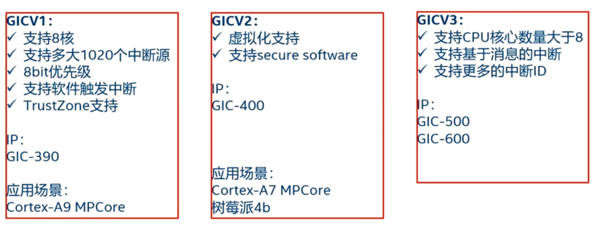


#### GIC支持的中断类型

- **SGI** （**Software Generated Interrupt**）,软件产生的中断，软中断，用于给其他CPU核心发送中断信号

- **PPI** （**Private Peripheral Interrupt**）,私有的外设中断，该中断时某个指定的CPU独有的

- **SPI**（**Shared Peripheral Interrupt**）,共享的外设中断，所有CPU都可以访问这个中断

- **LPI** （**Locality-specific Peripheral Interrupt**）,本地特殊外设中断，GICv3新增的中断类型。基于消息传递的中断类型

  
#### 中断的触发类型

每个中断类型要么是**Edge-triggered**的要么是**Level-sensitive**的：


由**GICD_ICFGRn**寄存器控制

#### 中断号


  > banked interrupt
  >
  > 意思是对于 **SGI 和 PPI**，虽然它们的 ID 在整个系统里一样（例如 Timer PPI 在所有核都是 **ID30**），但是 **它们是私有的**，每个 CPU 都有自己的一份，互不干扰。

  - **SGI (0–15)**：某核触发 SGI0，不会影响别的核的 SGI0。
  - **PPI (16–31)**：核 0 的 Timer PPI（比如 ID30）和核 1 的 Timer PPI（ID30）是独立的，它们不会共享。

  > 中断号 1020~1023是保留的

  

#### 中断优先级

每个中断优先级设置在**GICD_IPRIORITYRn**寄存器中

**优先级字段的宽度**

- 每个中断优先级字段是8bit
- 实际实现支持的优先级级数 = 2ⁿ，n ∈ [4, 8]（即 **16 ~ 256 级**）。
- 如果硬件实现的比 8 小，比如只实现 5 bit，则写入低 3 bit 是 **RAZ/WI**（读为 0、写无效）。

**数值大小与优先级**

- 数值越小，优先级越高
- 最大优先级值依赖实现
- 初始化默认应当给所有中断一个中等优先级，避免打断系统调度，常见是0xa0或0x80

#### 中断状态

- **inactive** （不活跃状态）：**中断处于无效状态**
- **pending** （等待状态）：**中断处于有效状态，但是等待CPU响应该中断**
- **active** （活跃状态）：**CPU已经响应该中断**
- **active and pending** （活跃并等待状态）：**CPU正在响应该中断，但是该中断源又发送中断过来**

  


#### GICV2中断控制器


- **The Distributor registers** (**GICD_**)      包含了**中断设置和配置**
- **The CPU Interface registers** (**GICC_**)  包含**CPU相关的特殊设置**


#### 中断路由


**GICD_ITARGETSRn** (**Interrupt Processor Targets Registers**)


> GICD_ITARGETSRn寄存器**用来配置Distributor可以把中断路由到哪个CPU上**，是一个 32 位寄存器，通常每**个中断有一个对应的寄存器**。

- **8bit来表示一个中断源，共四个中断源，每个bit代表能路由的CPU**
-  **byte-accessible**
- 某个bit设置了，说明该中断源可以路由到这个CPU上
- **前32个中断源的路由配置是硬件设置好的，RO**
- 第33~1019号中断，可以由软件来配置其路由，RW


对应**计算方法**：


> 假设m是中断ID, n是对应寄存器号

- GICD_ITARGETSRn寄存器与中断源的关系
  - 每个GICD_ITARGETSRn控制四个中断源
  - **n =  m DIV 4**
  - 计算n后要加上GICD_ITARGETSRn寄存器的起始地址偏移0x800
- Priority字段的字节偏移
  - **m MOD 4**用来确定目标中断源对应的字节偏移
    - **偏移 0** 对应寄存器的 **[7:0]** 位（即最低字节），对应中断 ID **m % 4 == 0**。
    - **偏移 1** 对应寄存器的 **[15:8]** 位，适用于 **m % 4 == 1**。
    - **偏移 2** 对应寄存器的 **[23:16]** 位，适用于 **m % 4 == 2**。
    - **偏移 3** 对应寄存器的 **[31:24]** 位，适用于 **m % 4 == 3**。

**GICD_ITARGETSRn 是一个数组寄存器**


#### 中断状态时序图

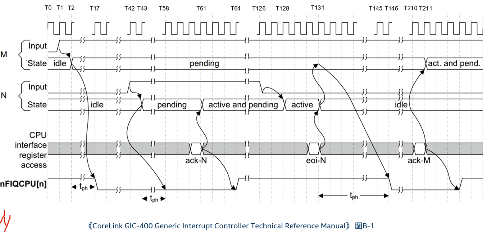

>  M和N分别代表两个中断,Input表示中断信号,State表示中断状态机，nFIQCPU[n]表示连接到CPU核心的FIQ信号
>
> 假设M和N都是SPI中断，且N的优先级高于M


#### GICv2寄存器


> 有些寄存器是按中断号来描述的，比如使用某几个比特位来描述一个中断号的相关属性，同一个寄存器可以n个，例如GICD_ISENABLERn寄存器，它是用来使能某个中断号的。“n”表示它有n个这样的寄存器


计算方法：根据中断号计算对应寄存器


对于有些寄存器，会提示：

```
A register bit corresponding to an unimplemented interrupt is RAZ/WI.
```

**RAZ** = *Read-As-Zero*
 如果你读这个寄存器位，返回值永远是 **0**，即使你写过别的值。

**WI** = *Write-Ignored*
 如果你往这个位写入数据，**硬件会忽略**，不会改变，也不会报错。

##### GICD_CTLR
> **Distributor Control Register**


##### **GICD_ITARGETSRn** 

> **Interrupt Processor Targets Registers**，见中断路由章节

##### GICD_TYPER （Interrupt Controller Type Register）

> **描述这个 GIC 的能力和配置参数**，比如有多少中断、多少个 CPU 接口、是否支持某些特性等等。


##### GICD_ICFGRn

> Interrupt Configuration Registers

GIC用来配置**中断触发类型**的寄存器

每个 `GICD_ICFGRn` 是 **32 位寄存器**。


**分布方式**

- 每个中断需要 **2 bit** （**Int_config**）来描述，所以**一个寄存器可以配置 16 个中断**。

- 第 `n` 个寄存器（`ICFGRn`）对应的中断范围是：

  ```
  中断 ID = n*16  ~ (n*16 + 15)
  ```

**Int_config字段编码**

根据 ARM GICv2 TRM（Table 4-18）：


对于**PPI**（Private Peripheral Interrupt）和**SPI**（Private Peripheral Interrupt）来说

| Bit[1] | Bit[0]   | 含义                |
| ------ | -------- | ------------------- |
| 0      | reversed | **Level-sensitive** |
| 1      | reserved | **Edge-triggered**  |

##### GICD_ISENABLERn

> Interrupt Set-Enable Registers

负责**打开中断转发**

- **GICD_ISENABLERn**是**32位寄存器**

- 每个 `GICD_ISENABLERn` 控制 **32 个中断源**。

  

- **写 1** → 使能对应的中断（让 Distributor 可以把它转发给 CPU interface）

- **写 0** → 没有作用

- **读** → 可以看到某个中断当前是否被使能（1=已使能，0=未使能）


根据中断号**计算GICD_ISENABLERn的n**


##### GICD_ICENABLERn

> Interrupt Clear-Enable Registers

- W1C (写 1 清除)，禁用某个中断（禁止分发到 CPU）


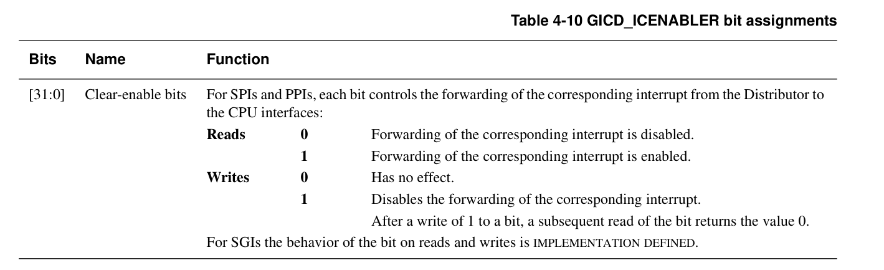


##### GICD_ISACTIVERn

> Interrupt Set-Active Registers

- W1S（写1设置），软件可以**把一个中断状态人为标记为 active**。


##### GICD_ICACTIVERn 

> Interrupt Clear-Active Registers

- W1C（写1清除），清除中断的 active 状态。

- 和 EOI（End of Interrupt）有点类似，但 **EOI 是 CPU interface 寄存器**，只能由当前 CPU 对自己接收的中断做“中断服务完成”的动作；

- `ICACTIVERn` 在 **Distributor**，软件可以**全局地强制清除某个中断的 active 位**。


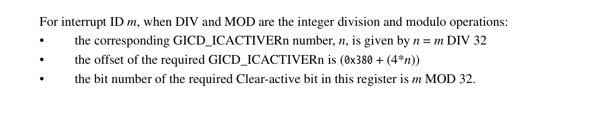


##### GICD_IPRIORITYRn

> Interrupt Priority Registers

用于**设置每个中断的优先级**

- 每个中断占 8 bit

- 一个 32 位寄存器管理 4 个中断


地址计算：


##### GICC_CTLR

> CPU Interface Control Register


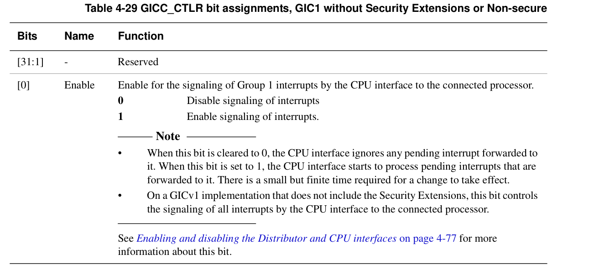


##### GICC_PMR

> Iterrupt Priority Mask Register

 **CPU 接口的优先级屏蔽寄存器**，它决定了 **CPU 能够接收哪些优先级的中断**。

- 只有 **优先级数值 ≤ PMR 的中断** 才能被 CPU 接收。
- 注意：GIC 的优先级是 **数值越小，优先级越高**。


**使用举例**：假设你的 GIC 实现有 8 bit 优先级：

1. 如果 `GICC_PMR = 0xff`
   - CPU 接收所有优先级的中断（最常见的初始化设置）。
2. 如果 `GICC_PMR = 0xa0`
   - 只接收 **优先级值 ≤ 0xa0** 的中断，优先级更“低”的中断会被屏蔽。
3. 如果 `GICC_PMR = 0x0`
   - 只接收最高优先级（0）的中断，其他都屏蔽

##### GICC_IAR

> Interrupt Acknowledge Register

当 CPU 收到 IRQ 信号时，软件需要从这个寄存器读取当前 **pending 中断的 ID**，并确认它是哪一个 IRQ。


| Bits    | 名称      | 含义                                 |
| ------- | --------- | ------------------------------------ |
| [9:0]   | **INTID** | 中断 ID（0~1019 表示有效中断号）     |
| [12:10] | **CPUID** | 标识触发该中断的 CPU（多核系统有用） |
| [31:13] | Reserved  | 保留，读出为 0                       |

##### GICC_EOIR

> End of Interrupt Register

软件在完成中断处理后，必须写入这个寄存器，告诉 GIC：“这个 IRQ 已经处理完了，可以清除 active 状态，并允许后续相同中断再次触发”。


| Bits    | 名称     | 含义                                   |
| ------- | -------- | -------------------------------------- |
| [9:0]   | INTID    | 中断 ID（必须与 IAR 读出的中断号一致） |
| [12:10] | CPUID    | 发出该中断的 CPU ID（多核系统使用）    |
| [31:13] | Reserved | 保留，写 0                             |

#### 树莓派4B的GIC400


- ARM Core的中断：
  - Core n HP tiemr IRQ
  - Core n V timer IRQ
  - Legacy FIQn
  - Core n PS timer IRQ
  - **Core n PNS timer IRQ** (PPI ID **30**)
  - Legacy IRQn
- ARM local的中断
  - ARM Mailbox IRQs
  - Core 0 PMU IRQ
  - Core 1 PMU IRQ
  - Core 2 PMU IRQ
  - Core 3 PMU IRQ
  - AXIERR IRQ
  - Local timer IRQ
- 16个ARMC外设中断
- 64个VC外设中断
- 51个PCI相关的外设中断


##### **访问GIC-400寄存器**

- 树莓派4b上的GIC-400的基地址


**访问**：树莓派GIC400的**基地址 **+ GIC-400 **memory map偏移** + **寄存器偏移**

##### GIC400的初始化流程

1. 设置distributor和CPU interface寄存器组的基地址
2. 读取**GICD_TYPER**寄存器，计算当前GIC最大支持多少个中断源
3. 初始化distributor
   1. **Disable distributor**，设置**GICD_CTLR**
   2. **设置SPI中断的路由**
      1. 前32个中断怎么路由是GIC芯片固定的，因此先读**GICD_ITARGETSRn**前面的值，获取能路由的所有CPU
      2. 将 **SPI（Shared Peripheral Interrupt）中断** 的路由设置为将中断分发到所有能路由的 CPU，因为SPI中断是Shared的中断，设置SPI的**GICD_ITARGETSRn**
   3. **设置SPI中断的触发类型，例如Level触发**，设置**GICD_ICFGRn**
   4. **Disactive和disable所有的SPI中断源**
   5. **打开SGI中断(0-15)，SMP会用到**
   6. **Enable distributor**,设置**GICD_CTLR**
4. 初始化CPU interface
   1. 为前32个中断源设置默认中断优先级，设置**GICD_IPRIORITYRn**
   2. 设置**GICC_PRM**，设置中断优先级mask level
   3. Enable CPU interface，设置**GICC_PRM**


##### **注册中断**

1. 初始化外设
2. 查找该外设的中断在GIC-400的中断号，例如PNS timer的中断号为30
3. 设置**GICD_ISENABLERn**寄存器来enable这个中断号
4. 打开设备相关的中断，例如树莓派上的generic timer，需要打开ARM_LOCAL寄存器中的TIMER_CNTRL0寄存器中相关的enable位
5. 打开CPU的PSTATE中的I位


##### **中断响应**

1. 中断发生
2. 异常向量表
3. 跳转到GIC中断函数里，gic_handle_irq()
4. 读取**GICC_IAR**寄存器，获取中断号
5. 根据中断号来进行相应的中断处理，例如读取的中断号为30，说明的是PNS的generic timer，然后跳转到generic timer的处理函数里。


#### GIC中断实验1：实现generic timer


**GIC-400初始化**

1. 设置**distributor**和**CPU interface**寄存器组的基地址

```c
#ifndef __GIC_V2_H
#define __GIC_V2_H

#include "asm/base.h"

#define GIC_V2_DISTRIBUTOR_OFFSET 0x1000
#define GIC_V2_CPU_INTERFACE_OFFSET 0x2000
#define GIC_V2_DISTRIBUTOR_BASE (GIC_400_BASE + GIC_V2_DISTRIBUTOR_OFFSET)
#define GIC_V2_CPU_INTERFACE_BASE (GIC_400_BASE + GIC_V2_CPU_INTERFACE_OFFSET)

#define GICD_CTLR (GIC_V2_DISTRIBUTOR_BASE + 0x000)

#define GICD_TYPER (GIC_V2_DISTRIBUTOR_BASE + 0x004)
#define GICD_TYPER_ITLINESNUMBER 0x1f
// 直接用 n / 4 或 n / 16 会得到 寄存器索引
// 然后在地址计算上乘以 4（每个寄存器 4 字节）
#define GICD_ITARGETSRn(n) (GIC_V2_DISTRIBUTOR_BASE + 0x800 + (n / 4) * 4)
#define GICD_ICFGRn(n) (GIC_V2_DISTRIBUTOR_BASE + 0xc00 + (n / 16) * 4)

#define GICD_ICFG_LEVEL_SENSITIVE 0x0
#define GICD_ICFG_LEVEL_EDGE_TRIGGERED 0x2

#define GICD_ISENABLERn(n) (GIC_V2_DISTRIBUTOR_BASE + 0x100 + (n / 32) * 4)
#define GICD_ICENABLERn(n) (GIC_V2_DISTRIBUTOR_BASE + 0x180 + (n / 32) * 4)
#define GICD_ICACTIVERn(n) (GIC_V2_DISTRIBUTOR_BASE + 0x380 + (n / 32) * 4)

#define GICD_IPRIORITYRn(n) (GIC_V2_DISTRIBUTOR_BASE + 0x400 + (n / 4) * 4)
#define DAFAULT_IPRIORITY 0xa0a0a0a0

#define GICC_PMR (GIC_V2_CPU_INTERFACE_BASE + 0x4)
#define GICC_CTLR (GIC_V2_CPU_INTERFACE_BASE + 0x0)

#define GICC_IAR (GIC_V2_CPU_INTERFACE_BASE + 0xc)
#define GICC_IAR_CPU_ID_MASK 0x1c00
#define GICC_IAR_INT_ID_MASK 0x3ff
#define GICC_EOIR (GIC_V2_CPU_INTERFACE_BASE + 0x10)

int gic_init(void);
void gic_enable_irq(int irq);

#endif

```

2. 读取**GICD_TYPER**寄存器，计算当前GIC最大支持多少个中断源

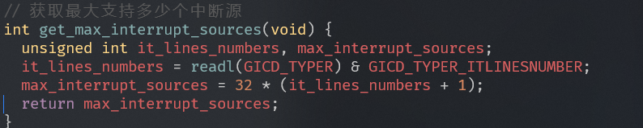

3. 初始化**distributor**

   

   

2. 初始化CPU interface

   

3. 打开PNS_TIMER_IRQ的路由


4. 测试


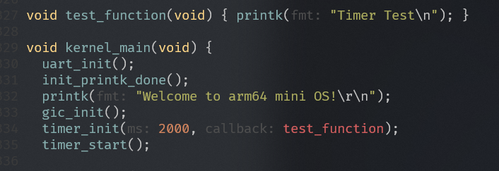

#### GIC中断实验2：实现树莓派上的System Timer


## 内存管理


**Prgrammer Guide**


### 内存管理的基本知识和概念

**直接使用物理内存的缺点**

- 进程地址空间保护问题。所有的用户进程都可以访问全部的物理内存，所以恶意程序可以修改其他程序的内存数据
- 内存使用效率低。如果即将要运行的进程所需要的内存空间不足，就需要选择一个进程进行整体换出，这种机制导致有大量的数据需要换入和换出，效率非常低下
- 程序运行地址重定位问题


### 分页机制的基本概念

- 虚拟存储器(Virtual Memory)
- 虚拟地址空间(Virtual Address)
- 物理存储器(Physical Memory)
- 页帧(Page Frame)
- 虚拟页帧号(Virtual Page Frame Number)
- 物理页帧号(Physical Frame Number)
- 页表(Page Table, PT)
- 页表项(Page Table Entry, PTE)


### 虚拟地址到物理地址映射的过程


#### 一级页表


**采用一级页表的缺点**

- 处理器采用一级页表，虚拟地址空间位宽32位，寻址范围是4GB大小，物理地址空间位宽也是32bit，最大支持4GB物理内存，另外页面大小是4KB。为了能映射整个4GB地址空间，需要4GB/4KB = 1MB个页表项，每个页表项占用4字节，共需要4MB大小的物理内存来存放这张页表
- **每个进程拥有一套属于自己的页表，在进程切换时需要切换页表基地址。**如上述的一级页表，每个进程需要为其分配4MB的连续物理内存来存储页表，这是不能接受的，因为这样太浪费内存了。
- 多级页表：按需一级一级映射，不用一次全部映射所有地址空间

#### 二级页表


### VMSA

> Virtual Memory System Architecture

- VMSA提供了MMU硬件单元
  - 虚拟地址到物理地址的转换
  - 访问权限
  - 内存属性检查
- MMU硬件单元用来实现VA到PA的转换
  - 硬件遍历页表table walking
  - TTBR寄存器保存了页表基地址
  - TLB保存了最近的转换页表项


没有虚拟化场景的情况下，翻译只有一个阶段，由VA映射到PA

在有虚拟化场景的情况下，翻译需要先转换为IPA


### ARMv8的页表

- **aarch64仅仅支持Long Descriptor的页表格式**

- AArch32支持两种页表格式

  - Armv7-A Short Descriptor format
  - Armv7-A (**LPAE**) Long Descriptor format

- AArch64支持三种不同的页大小：4KB，16KB，64KB

  - 大粒度page size可以减少页表的体积

  - 地址总线位宽支持48位或者52位

  - 52位宽：ARMv8.2-LVA is implemented and the 64 KB translation granule

  - 以48位总线位宽为例

  - **虚拟地址VA被划分为两个空间**，**每个空间最大支持256TB**

    - **低位虚拟地址空间位于0x0000_0000_0000_0000到0x0000_FFFF_FFFF_FFFF**
    - **高位的虚拟地址空间位于0xFFFF_0000_0000_0000到0xFFFF_FFFF_FFFF_FFFF**

    

    （**Fault是非规范区域，CPU不能访问**）

    **四级页表**

    

#### AArch64的页表描述符

下面的都是48位虚拟地址，4KB大小页面

##### L0~L2的页表描述符


**块类型**表示描述的是一块非常大的内存


##### L3页表描述符


| 层级 (Level) | 对应 Linux 抽象 | 描述符可能的类型                            |
| ------------ | --------------- | ------------------------------------------- |
| L0 (可选)    | **PGD**         | **Table / Fault**                           |
| L1           | **PUD**         | **Block (1GB, granule=4K) / Table / Fault** |
| L2           | **PMD**         | **Block (2MB, granule=4K) / Table / Fault** |
| L3           | **PTE**         | **Page (4KB, granule=4K) / Fault**          |

> 注意：
>
> - **Block entry** 只能出现在中间层（L1/L2），表示大页映射。
> - **PTE (L3)** 不能是 Block，只能是 Page 或 Fault。

#### 页表属性

Armv8.6 **D5.3.3**章

- **bit[0]** → 是否有效：
  - `0` = Invalid (Fault entry)
  - `1` = 有效 (Valid entry)
- **bit[1]** → 类型（只在有效时才有意义）：
  - `0` = Block entry （块映射，大页映射）
  - `1` = Table entry （指向下一级页表；到最后一级时变成 Page entry）

所以：block和page的页表属性


**高位属性和低位属性**


##### Contiguous Block entries

- ARMv8**利用TLB进行的一个优化**：利用**一个TLB entry来完成多个连续的page的VA到PA的转换**
- **使用Contiguous bit的条件**
  - **页面对应的VA必须是连续的**
  - **对于4KB的页面，16个连续的page**
  - **对于16KB的页面，32或128个连续的page**
  - **对于64KB的页面，32个连续的page**
  - **连续的页面必须有相同的属性**
  - **起始地址必须以页面对齐**


##### 4KB页表

- 4级页表
- 48bit虚拟地址
- **每级页表使用9bit来做索引(512 entries)**


##### 16KB页表

- 4级页表

- 48bit虚拟地址

- L0页表只有两个entry

- L1，L2，L3页表使用11bit来做索引（2048 entries）


##### 64KB页表

- 3级页表
- 48bit虚拟地址
- L1页表只有64个entry
- L2和L3页表使用13bit


#### 分离的两套页表设计

- 用户空间(EL0)和内核空间(EL1)采用两套分离的页表基地址设计
  - **虚拟地址的高16位为1时选择TTBR1_EL1**
  - **虚拟地址的高16位为0时选择TTBR0_EL0**


#### 与页表相关的系统寄存器

##### TCR_EL1

> Translation Control Register
>
> 配置地址空间大小和页表粒度


**配置地址空间大小和页表粒度**


- **IPS**：Intermediate Physical Address Size，用来配置物理地址大小，例如48bit，256TB大小的物理空间
- **TG1**和**TG0**：配置页表粒度的大小，例如4KB，16KB，64KB
- **T1SZ**：用来配置TTBR_EL1页表能管辖的大小，计算公式为2^(64-T1SZ)个字节
- **T0SZ**：用来配置TTBR_EL0页表能管辖的大小，计算公式为2^(64-T0SZ)个字节

> 在 ARM64 中，虚拟地址的高位并不是随便用的，而是受 **TCR_EL1.T0SZ / T1SZ** 限制。

**与Cache相关的字段**


- **SH1**：设置内存相关的cache属性，这些内存是通过TTBR_EL1页表来访问的。例如Non-shareable, Outer Shareable，Inner Shareable
- **ORGN1**：设置Outer Shareable的相关属性
- **IRGN1**：设置Innter Shareable 的相关属性
- **SH0**：设置内存相关的cache属性，这些内存是通过TTBR_EL0页表来访问的

##### SCTLR_EL1

> System Control Register (EL1)


- M：打开和关闭MMU
- I：打开指令cache
- C：打开data cache

##### TTBR0_EL1

> 指向TTBR0页表的基地址，通常用于EL1/EL0的页表映射


##### TTBR1_EL1

> 指向TTBR1页表的基地址，通常用于EL1/EL0的页表映射


### 内存属性

#### ARMv8定义的内存属性

- ARMv8架构处理器提供两种内存属性

  - 普通内存(Normal Memory)

    > 普通内存是弱一致性的(weakly ordered)，没有其他额外约束，提供最高的内存访问性能

  - 设备内存(Device Memory)

    > 处理器访问设备内存会有很多限制，比如不能进行预测访问等。设备内存是严格按照指令顺序来执行的。ARMv8架构定义了多种设备内存的属性

    - **Device-nGnRnE**   (不支持聚合操作，不支持指令重排，不支持提前写应答)
    - **Device-nGnRE**     (不支持聚合操作，不支持指令重排，支持提前写应答)
    - **Device-nGRE**        (不支持聚合操作，支持指令重排，支持提前写应答)
    - **Device-GRE**           (支持聚合操作，支持指令重排，支持提前写应答)

**Linux内核中定义**


**内存属性并没有存放在页表的页表项中**，而是存放在**MAIR_ELn**寄存器（**Memory Attribute Indirection Register**）。

**页表项中有一个3位的索引值（AttrInx[2:0]）来查找MAIR_ELn寄存器**。


#### Linux内核中定义的内存属性

- 操作系统（Linux系统）根据armv8的定义的内存属性，以及内存的读写等属性，定义一些列属性
  - **PAGE_KERNEL**：内存最普通的内存页面
  - **PAGE_KERNEL_RO**：内核中只读的普通内存页面
  - **PAGE_KERNEL_ROX**：内核中只读可执行的普通页面
  - **PAGE_KERNEL_EXEC**：内核中可执行的普通页面
  - **PAGE_KERNEL_EXEC_CONT**：内核中可执行的普通页面，并且是物理连续的多个页面


### Linux5.0中的创建页表的例子

- 全局目录项 **PGD** （**Page Global Directory**）对应arm64的L0页表
- 上级目录项 **PUD** （**Page Upper Directory**）对应arm64的L1页表
- 中间目录项 **PMD** （**Page Middle Directory**）对应arm64的L2页表
- 页表项（**Page Table Entry**）对应arm64的L3页表

arch/arm64/mm/mmu.c


1. 通过地址addr查找PGD表项

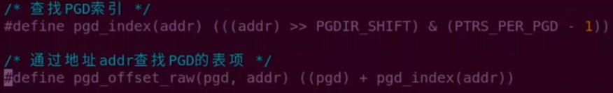

2. 通过addr找到对应pgd的管辖范围的结束地址


3. 设置pgd页表项


4. 通过地址addr查找PUD的表项


### 实验一：建立恒等映射


**为什么要恒等映射**

为了打开MMU不会出问题：

1. 在关闭MMU情况下，处理器访问的地址都是物理地址。**当MMU打开时，处理器访问地址变为虚拟地址**
2. 现代处理器都是**多级流水线架构**，**处理器会提前预取多条指令到流水线中**。当打开MMU时，处理器已经提前预取了多条指令，并且这些指令是以物理地址来进行预取的。当打开MMU指令执行完成，处理器的MMU功能生效。因此，这里是为了**保证处理器在开启MMU前后可以连续取指令**。

### 实验二：为什么MMU跑不起来


