## ARM体系结构介绍

### **excution state**


### **processor state**

处理器状态


ARM 处理器传统上有几类中断信号：

- **IRQ** (Interrupt Request)：普通中断
- **FIQ** (Fast Interrupt Request)：快速中断
- **SError**（System Error）：同步异常
- **Abort**（数据/指令访问异常）
- **Undefined Instruction**（非法指令异常）

在 AArch64 下，异常会统一被称为 *Exception*，但 FIQ 还是保留，作为一种 **高优先级中断**。

### 异常掩码

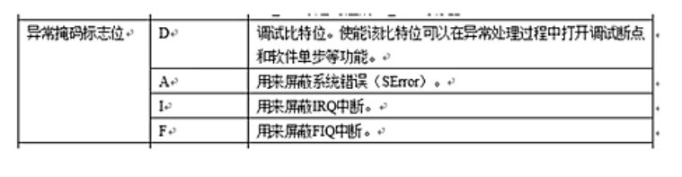

- 0 表示没有屏蔽这个异常
- 1 表示屏蔽了这个异常


### 特殊寄存器


SPSR (The Saved Program Status Register)

ELR (Exception Link Register)

当处理器运行在比EL0高级别的异常等级时，处理器可以访问：

- 当前异常等级对应的栈指针SP_ELn
- EL0对应的栈指针SP_EL0寄存器可以当作一个临时寄存器


**CurrentEL**

> Current Exception Level, hold the current Exception level


**DAIF**

> Allows access to the interrupt mask bit, that hold the current PSTATE.{D,A,I,F} interrupt mask bit

**DIT**

> that holds the PSTATE DIT bit

**ELR_EL1**

> that holds the address to return to for an exception return from EL1

**ELR_EL2**

> that holds the address to return to for an exception return from EL2

**ELR_EL3**

> that holds the address to return to for an exception return from EL4

**FPCR**

> that provides control of floating-point operation

**FPSR**

> that provides floating-point status information

**NZCV**

> that holds the PSTATE.{N,Z,C,V} condition flags

**PAN**

> that holds the PSTATE.PAN state bit

**SP_EL0**

> that holds the stack pointer for EL0

**SP_EL1**

> that holds the stack pointer for EL1

**SP_EL2**

> that holds the stack pointer for EL2

**SP_EL3**

> that holds the stack pointer for EL3

**SPSel**

> that holds PSTATE.SP, that at EL1 or higer selects the current SP

**SPSR_abt**

> that holds process state on taking an exception on AArch32 Abort mode

**SPSR_EL1**

> that holds process state on taking an exception to AArch64 EL1

**SPSR_EL2**

> that holds process state on taking an exception to AArch64 EL2

**SPSR_EL3**

> that holds process state on taking an exception to AArch64 EL3

**SPSR_fiq**

> that holds process state on taking an exception to AArch32 FIQ mode

**SPSR_irq**

> hat holds process state on taking an exception to AArch32 IRQ mode

**SPSR_und**

> at holds process state on taking an exception to AArch32 Undefined mode

**SSBS**

> hat holds the PSTATE.SSBS bit.

**TCO**

> controls Streaming SVE mode and SME behavior

**UAO**

> that holds the PSTATE.UAO bit

## ARM 汇编


**指令分类**：

1. 内存加载和存储指令
2. 多字节内存加载和存储
3. 算数和移位指令
4. 移位操作
5. 位操作指令
6. 条件操作
7. 跳转指令
8. 独占访存指令
9. 内存屏障指令
10. 异常处理指令
11. 系统寄存器访问指令

### 加载与存储指令

1. LDR
2. STR

#### 练习1：ldr指令

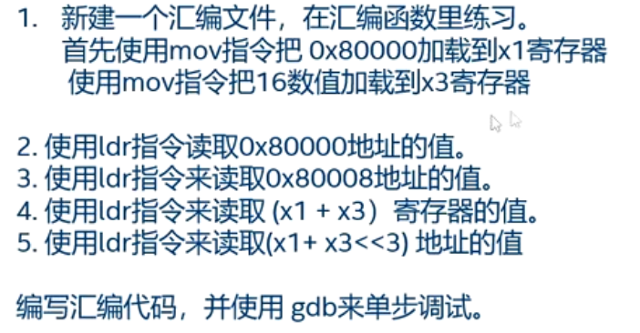

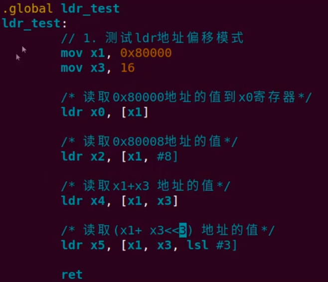

注意lsl #3中间不要有分号

当扩展为lsl时，amount只能为#0或#3(ARM文档定义)

#### 练习2：ldr前变基模式和后变基模式

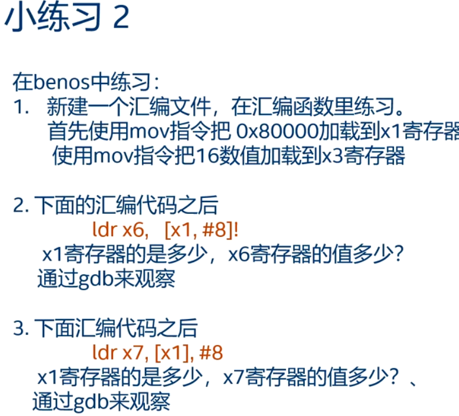

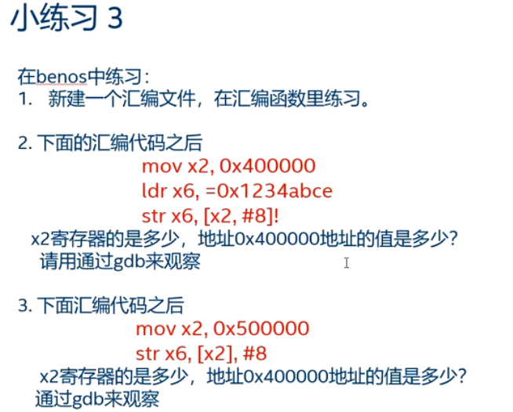


#### 练习3：str的前变基和后变基模式


#### ldr 标签(literal)

读取**PC+label**的值

#### 练习4：ldr伪指令

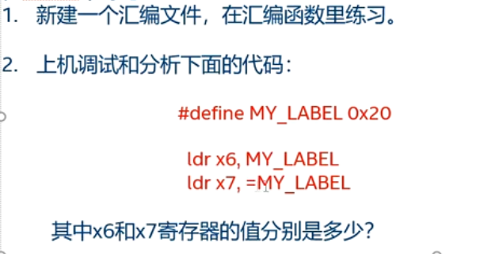

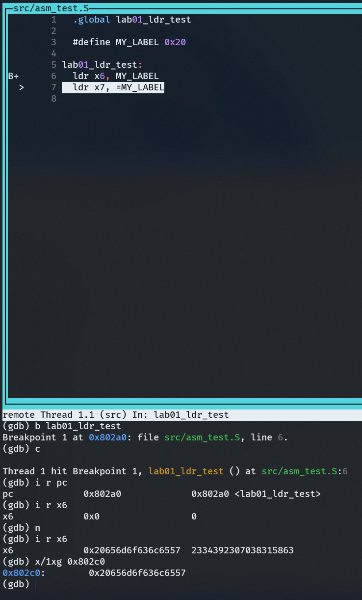


- 指令：每一条指令都对应一种CPU操作
- 伪指令：对编译器发出的命令，它是在对源程序汇编期间由汇编程序处理的操作，它们可以完成如处理处理器选择，定义程序模式，定义数据，分配存储区，指示程序结束等功能，总之，可以分解为几条指令的集合
- ldr指令既可以是大范围的地址读取伪指令，也可以是内存访问指令，而当它的第二个参数前面有“=”时，表示伪指令，否则表示内存访问指令
- ldr伪指令没有立即数访问限制

ldr x6, MY_LABEL  是内存访问指令

ldr x7, =MY_LABEL 是ldr伪指令

#### 练习5：实现memcpy汇编

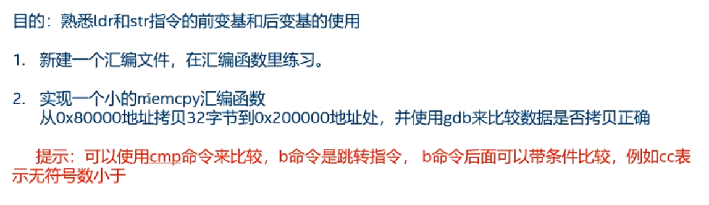

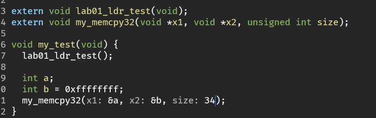

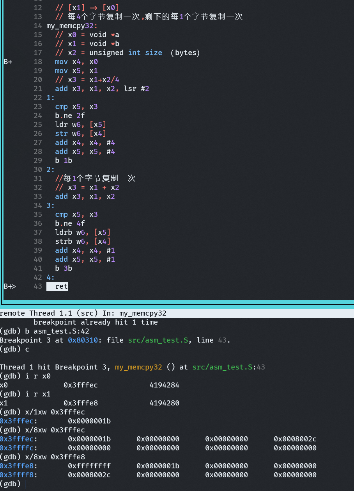

可以看到0xffffffff没有复制过去，这是因为起始地址没有四字节对齐


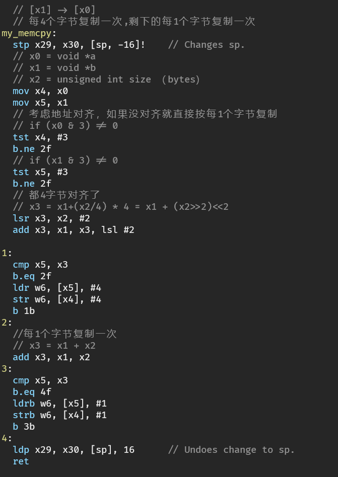

#### mov指令

1. 16位立即数


#### ldp和stp

> A32指令集中提供**LDM**和**STM**来实现多字节内存加载和存储，到了A64指令集，不再提供LDM和STM指令，而是采用LDP和STP指令

- ldp和stp可以一条指令加载和存储16个字节


#### 练习6: memset

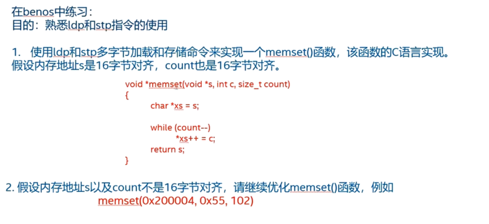

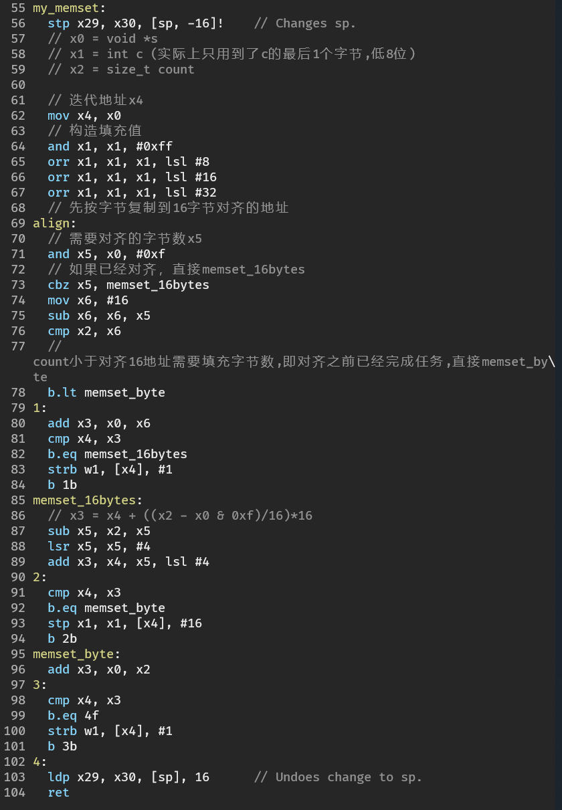

#### 练习7：坑

1. 加载一个很大的数值到通用寄存器，例如0xffff_0000_ffff_ffff


2. 加载一个寄存器的值，例如sctrl_el1寄存器

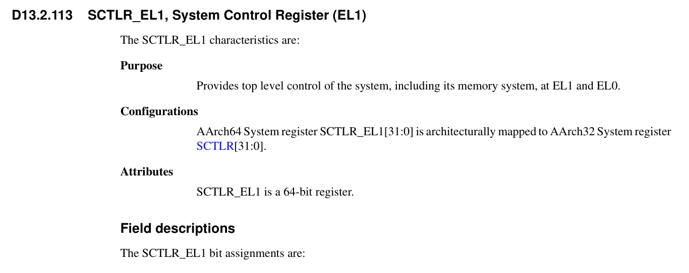


 

3. 


4. 

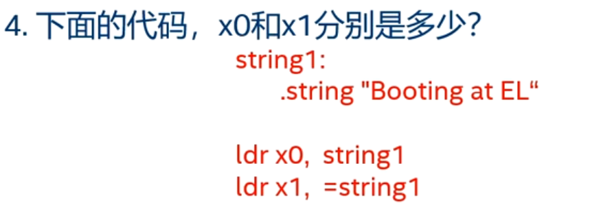


5. 


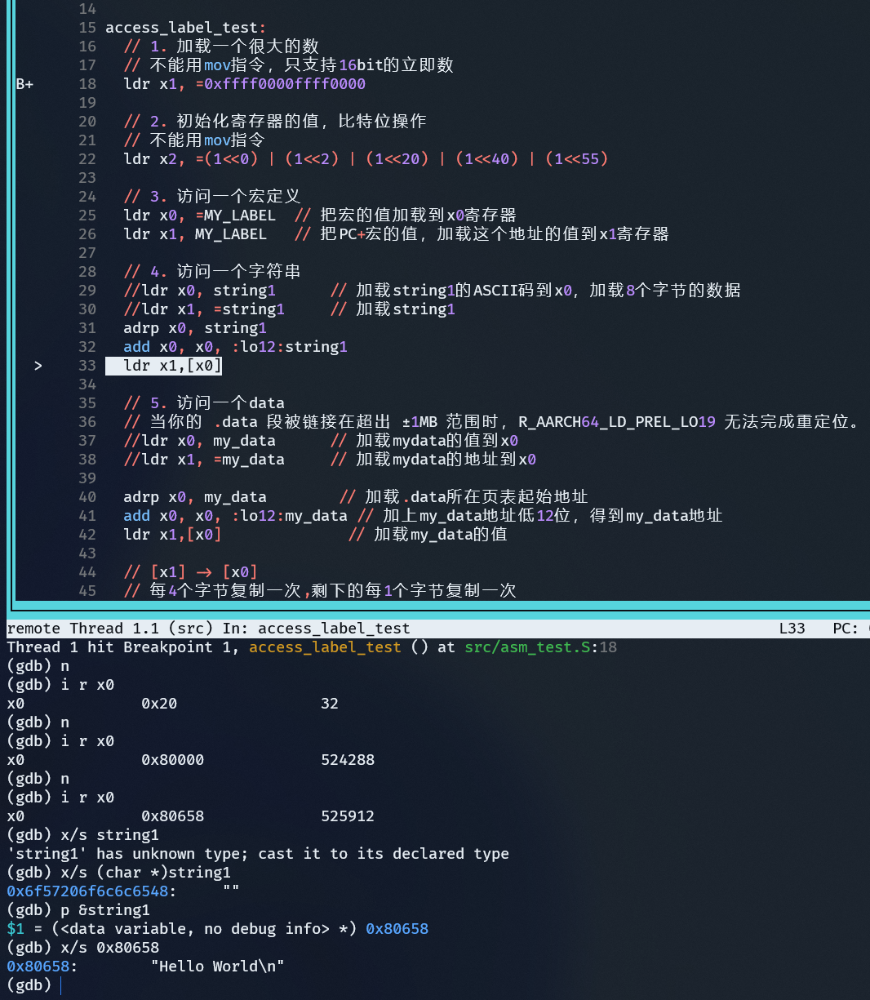

注意使用ldr时，可能产生literal pool, 最好用adrp指令

#### 存储指令变种

| 指令      | 含义（全称）                             | 访问大小                         | 符号扩展 |
| --------- | ---------------------------------------- | -------------------------------- | -------- |
| **LDR**   | Load Register                            | 32位（W寄存器）或64位（X寄存器） | 无符号   |
| **LDRSW** | Load Register Signed Word                | 32位 → 符号扩展到64位            | 有符号   |
| **LDRB**  | Load Register Byte                       | 8位 → 零扩展到32/64位            | 无符号   |
| **LDRSB** | Load Register Signed Byte                | 8位 → 符号扩展到32/64位          | 有符号   |
| **LDRH**  | Load Register Halfword                   | 16位 → 零扩展到32/64位           | 无符号   |
| **LDRSH** | Load Register Signed Halfword            | 16位 → 符号扩展到32/64位         | 有符号   |
| **LDRQ**  | Load Register Quadword (NEON/SIMD寄存器) | 128位（V寄存器）                 | 无符号   |
| **STR**   | Store Register                           | 32位或64位                       | 无符号   |
| **STRB**  | Store Register Byte                      | 8位                              | 无符号   |
| **STRH**  | Store Register Halfword                  | 16位                             | 无符号   |

 **补充说明**

- **无符号加载 (LDR, LDRB, LDRH)**：高位部分填充 `0`。
- **有符号加载 (LDRSB, LDRSH, LDRSW)**：会进行符号扩展（最高位是1则扩展为1）。
- 如果访问和存储4个字节或8个字节都是用ldr和str，只不过目标寄存器使用wn或者xn
- `STR` 系列指令不存在有符号版本，因为存储时“原封不动”写入内存，**不会进行符号扩展、零扩展或任何填充操作**，但要注意寄存器位宽，如xn和wn时不同的。
- AArch64 默认小端序（低地址存低字节）。
- 还有一类**原子加载/存储指令**（`LDAXR`、`STLXR`等）用于锁操作

### 算数与移位指令

  pstate处理器状态中四个条件操作码NCZV


#### add加法指令

##### 普通的加法指令add

- 使用寄存器的加法
- 使用立即数的加法
- 使用移位操作的加法

##### adds指令-影响条件标志位(进位)

主要影响C标志位(无符号溢出)

#### sub减法指令

##### 普通的减法指令

##### subs指令-影响条件标志位(C标志位)

#### adc指令(带进位的加法指令)

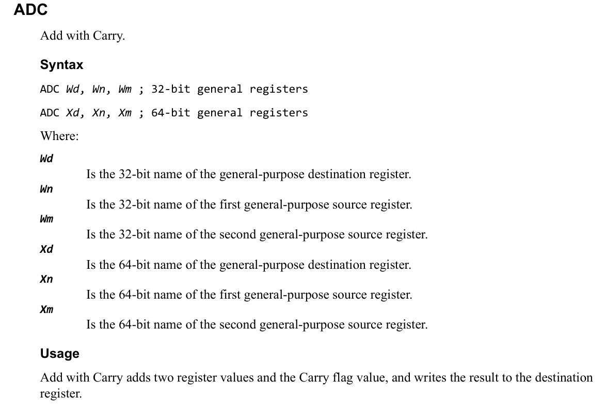

#### sbc指令(带进位的减法指令)


Wd = Wn - Wm-1+ C

#### cmp比较指令

> 比较两个数的大小，内部使用subs指令来实现，影响C标志位

等同于

```asm
SUBS XZR, <Xn>, #<imm>
```

当x1和x2都为无符号数时

```asm
cmp x1, x2
```

x1-x2 = x1+ ~x2+1(发生溢出)

当x1>= x2时，C=1

当x1<x2时  C=0


#### 练习1 adds和cmp指令的C条件标志位


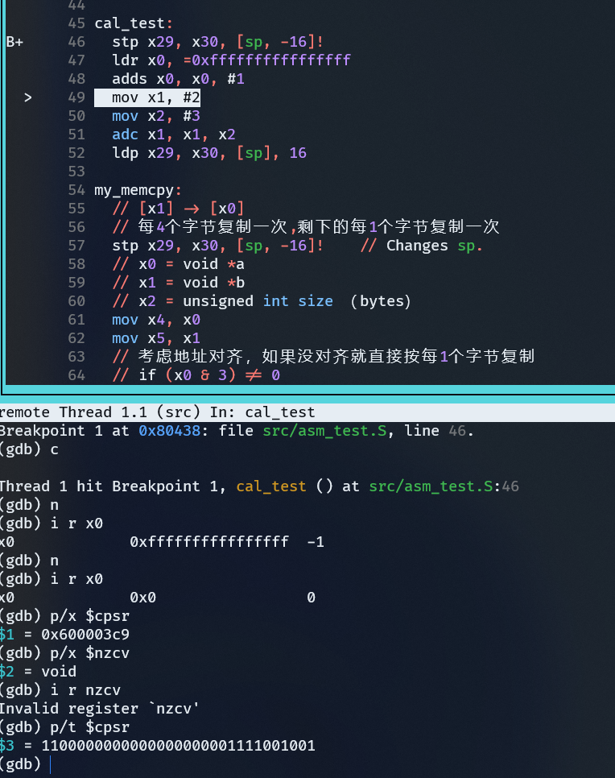

| 位   | 名称 | 含义                      |
| ---- | ---- | ------------------------- |
| 31   | N    | 结果为负数                |
| 30   | Z    | 结果为零                  |
| 29   | C    | 无符号比较无借位（Carry） |
| 28   | V    | 有符号溢出                |

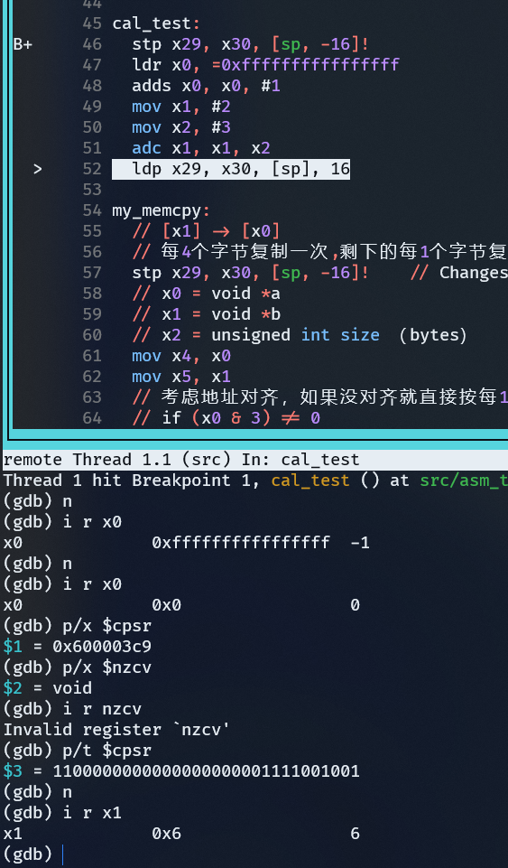

#### 练习2 cmp和sbc指令

 

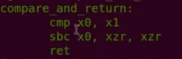

#### 移位操作

- lsl 逻辑左移
- lsr 逻辑右移
- asr 算数右移
- ror 循环右移

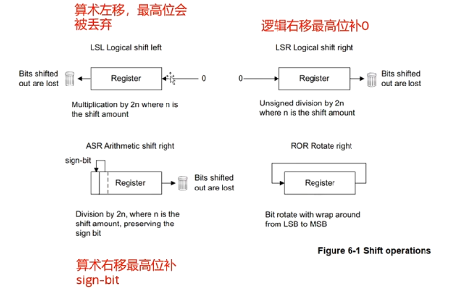

#### 按位与操作

- **and** 与操作
- **ands** 带进位的与操作，影响Z标志位


#### 按位或操作

- **orr** 或操作
- **eor** 异或操作

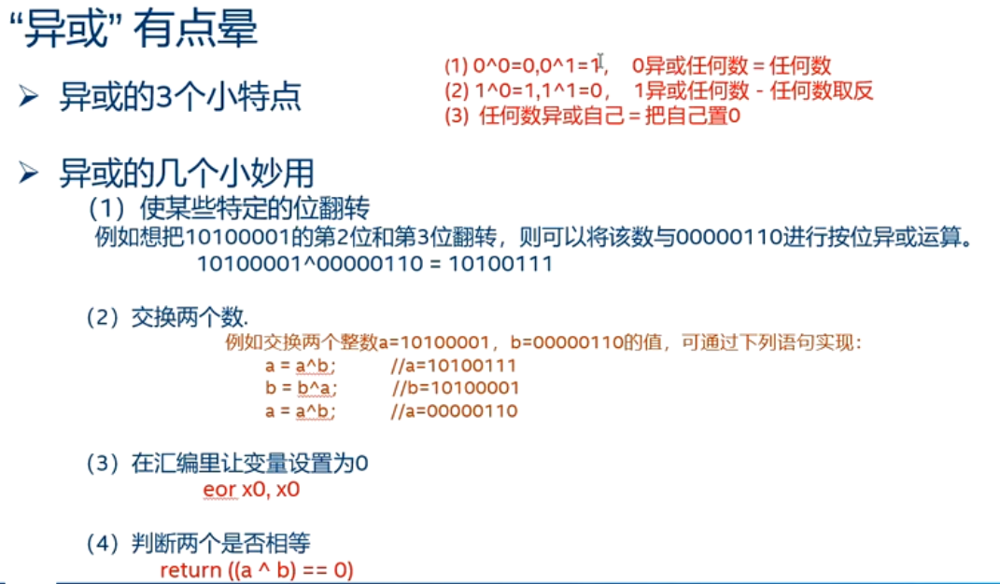


#### 按位清除 

- **bic** 位清零指令

不常见

#### 实验3：测试ands指令以及Z标志位

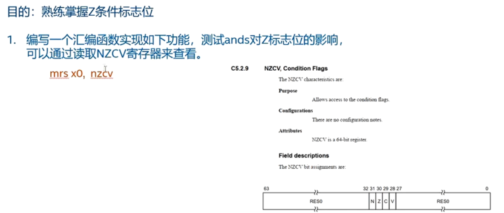


#### 位段插入操作

> 位段(bitfield)

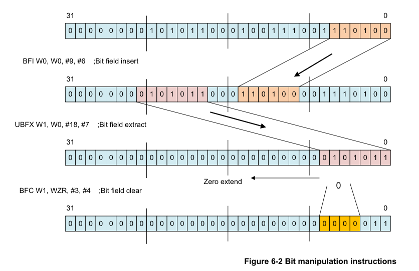

##### **bfi** 位段插入指令

> bitfield insert


- **Xd**：目标寄存器（Destination）

- **Xn**：源寄存器（Source）

- **lsb**：**Least Significant Bit**，即 **目标寄存器 Xd 中要开始插入的最低位位置索引**（从 0 开始计数）。

- **width**：要插入的位宽（bit 数）。


##### ubfx 无符号数的位段提取指令

##### sbfx 有符号数的位段提取指令


注意是从0开始计数

#### 实验4：测试bitfield指令

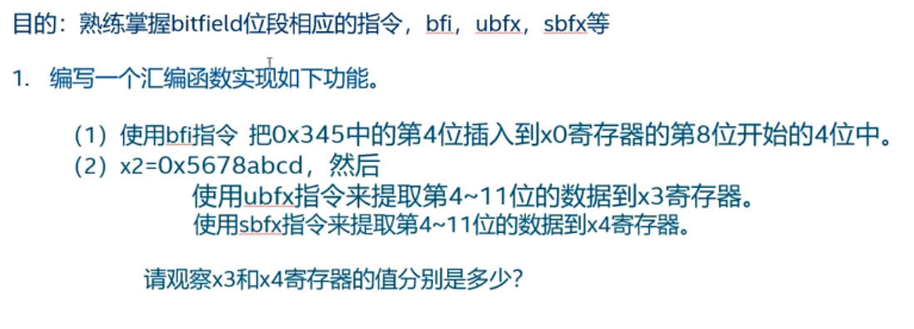


#### 乘法和除法指令

乘法：

| 指令       | 功能说明                                                     |
| ---------- | ------------------------------------------------------------ |
| **MADD**   | Multiply-Add：`Xd = (Xn * Xm) + Xa`                          |
| **MNEG**   | Multiply-Negate：`Xd = -(Xn * Xm)`                           |
| **MSUB**   | Multiply-Subtract：`Xd = Xa - (Xn * Xm)`                     |
| **MUL**    | Multiply：`Xd = Xn * Xm`（低 64 位结果）                     |
| **SMADDL** | Signed Multiply-Add Long：32位*32位 → 64位，加上加数         |
| **SMNEGL** | Signed Multiply-Negate Long：32位*32位 → 64位，取负          |
| **SMSUBL** | Signed Multiply-Subtract Long：32位*32位 → 64位，执行减法    |
| **SMULH**  | Signed Multiply returning High half：取 128 位结果的高 64 位（有符号） |
| **SMULL**  | Signed Multiply Long：32位*32位 → 64位                       |
| **UMADDL** | Unsigned Multiply-Add Long：无符号版本                       |
| **UMNEGL** | Unsigned Multiply-Negate Long：无符号版本                    |
| **UMSUBL** | Unsigned Multiply-Subtract Long：无符号版本                  |
| **UMULH**  | Unsigned Multiply returning High half：取高 64 位（无符号）  |
| **UMULL**  | Unsigned Multiply Long：无符号 32位*32位 → 64位              |

除法：

| 指令     | 功能说明                    |
| -------- | --------------------------- |
| **SDIV** | Signed Divide：有符号除法   |
| **UDIV** | Unsigned Divide：无符号除法 |

### 比较与跳转指令

#### 实验5：使用bitfield指令来读取寄存器


> 注意ubfx这类指令只能对普通寄存器的值进行位域提取，不能直接提取系统寄存器，因此需要先用msr把系统寄存器存入通用寄存器

读取系统寄存器(move register from system)

```asm
mrs x1, ID_AA64ISAR0_EL1
```

写入系统寄存器(move system from register)

```asm
msr ID_AA64ISAR0_EL1, x1
```

> ⚠️ 但注意：很多 CPU 特性寄存器（如 `ID_AA64ISAR0_EL1`）是 **只读的**，所以 `MSR` 往这个寄存器写入通常会触发异常，不能随意修改。

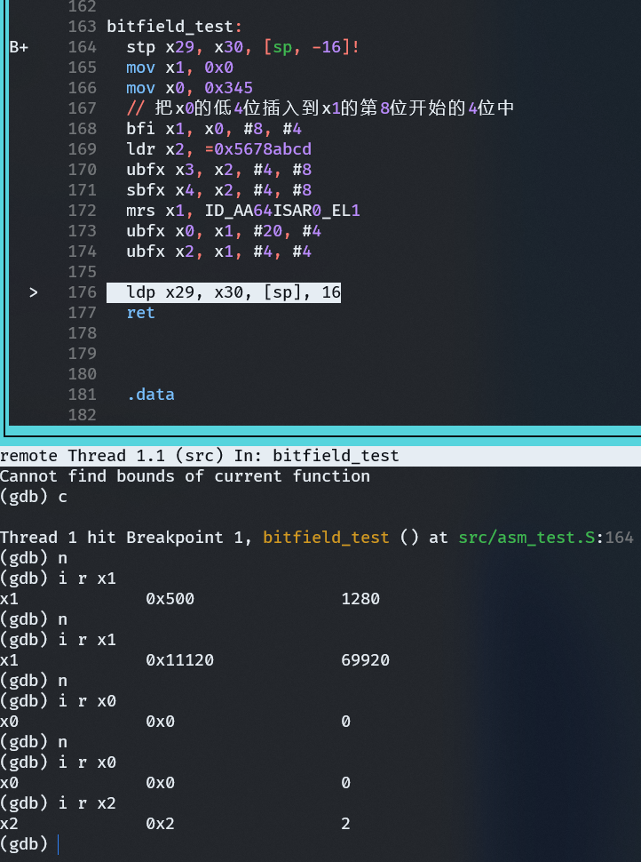

#### 零计数指令clz

> clz: 计算最高为1的比特位前面有几个0


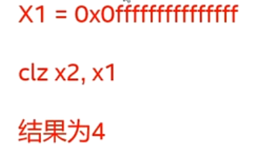

#### 比较指令

##### cmp

> 比较两个数

cmp x1, x2

x1-x2

##### cmn

> 负向比较

cmn x1, x2

x1+x2

##### 条件操作后缀

| 条件后缀 | 含义               | 标志           | 条件码 | 缩写说明                   |
| -------- | ------------------ | -------------- | ------ | -------------------------- |
| EQ       | 相等               | Z=1            | 0b0000 | Equal                      |
| NE       | 不相等             | Z=0            | 0b0001 | Not Equal                  |
| CS/HS    | 无符号数大于或等于 | C=1            | 0b0010 | Carry Set / Higher or Same |
| CC/LO    | 无符号数小于       | C=0            | 0b0011 | Carry Clear / Lower        |
| MI       | 负数               | N=1            | 0b0100 | Minus                      |
| PL       | 正数或零           | N=0            | 0b0101 | Plus                       |
| VS       | 溢出               | V=1            | 0b0110 | Overflow Set               |
| VC       | 未溢出             | V=0            | 0b0111 | Overflow Clear             |
| HI       | 无符号数大于       | (C=1) && (Z=0) | 0b1000 | Higher                     |
| LS       | 无符号数小于或等于 | (C=0) ∨ (Z=1)  | 0b1001 | Lower or Same              |
| GE       | 带符号数大于或等于 | N = V          | 0b1010 | Greater or Equal           |
| LT       | 带符号数小于       | N ≠ V          | 0b1011 | Less Than                  |
| GT       | 带符号数大于       | (Z=0) && (N=V) | 0b1100 | Greater Than               |
| LE       | 带符号数小于或等于 | (Z=1) ∨ (N≠V)  | 0b1101 | Less or Equal              |
| AL       | 无条件执行         | --             | 0b1110 | Always                     |
| NV       | 无条件执行         | --             | 0b1111 | Never (保留，一般不用)     |

#### 实验1：cmp/cmn指令以及条件操作后缀


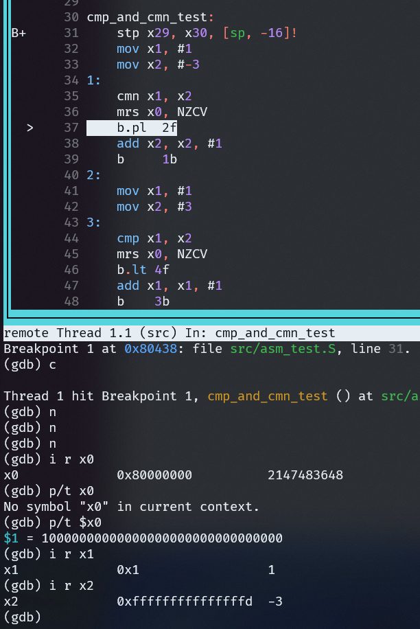


#### **NZCV 寄存器结构图**


```mathematica
┌───┬───┬───┬───┐
│ N │ Z │ C │ V │
└───┴───┴───┴───┘
 31  30  29  28   ← 在 PSTATE 或 NZCV 系统寄存器的位位置
```

**N (Negative flag)**

- 结果为负数（有符号数最高位为1） → N=1
- 否则 N=0

**Z (Zero flag)**

- 结果等于 0 → Z=1
- 否则 Z=0

**C (Carry flag)**

- 加法：有进位 → C=1
- 减法：无借位（即操作数1 ≥ 操作数2） → C=1
- 否则 C=0

**V (Overflow flag)**

- 有符号加/减法溢出（结果超出可表示范围） → V=1
- 否则 V=0


#### 条件选择指令

> 搭配cmp指令来使用

##### csel

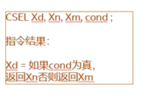

##### cset


##### csinc

>  **Conditional Select Increment** 

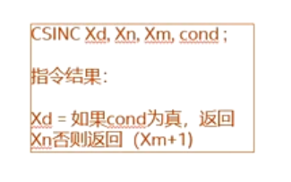

#### 实验2：条件选择指令

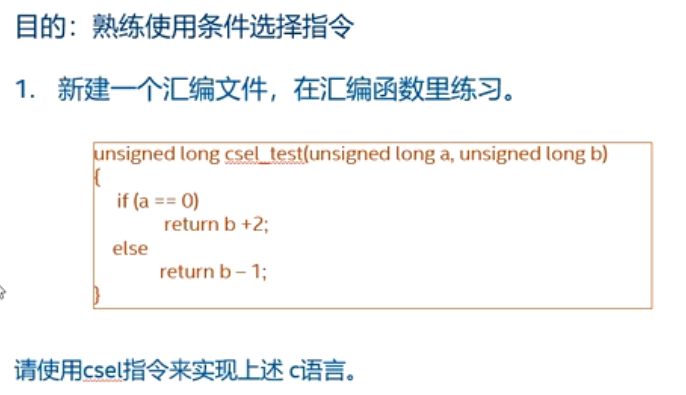

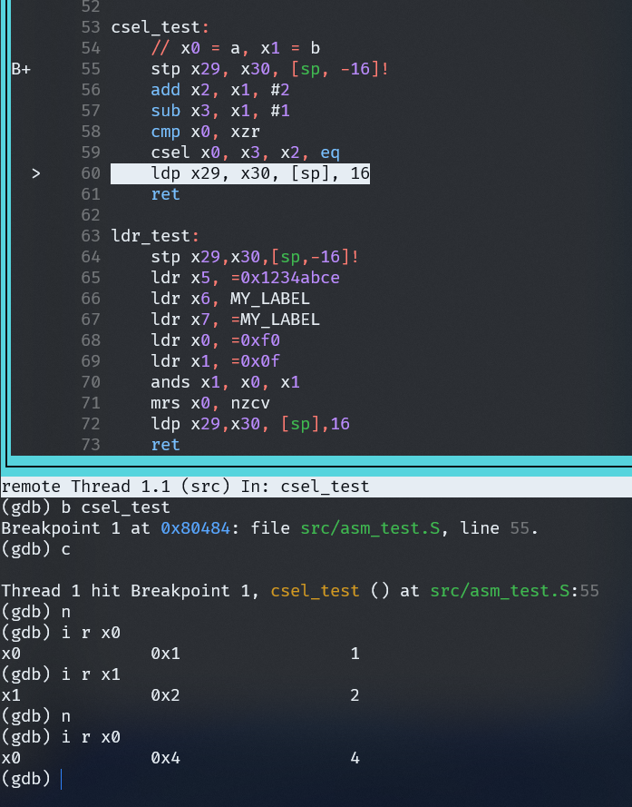

#### 跳转指令

##### b 无条件跳转

> 跳转指令，无条件的跳转指令，不返回
>
> 跳转范围：PC+/- 128MB

##### b.cnd 有条件跳转指令

> 有条件的跳转指令，不返回
>
> cnd为条件操作后缀
>
> 跳转范围：PC+/- 1MB

##### bx 跳转到寄存器指定地址处

> 跳转到寄存器指定的地址处，不返回

##### bl (Branch with Link)带返回地址的跳转

> 带返回地址(PC+4 => x30)，适用于call子函数
>
> 返回地址保存到x30中，保存的是父函数的PC+4
>
> 跳转范围：PC+/- 128MB

##### blx (Branch with Link to Register)

> 跳转到寄存器指定的地址处，可以返回
>
> 返回地址保存到x30中，保存的是父函数的PC+4


#### 返回指令

##### ret

> 从子函数中返回，通常是x30里保存了返回地址

##### eret

> 从当前的异常模式返回，通常可以实现模式的切换，例如EL1切换到EL0
>
> 它从当前的异常模式中返回，它会从SPSR中恢复PSTATE，从ELR中获取跳转地址，并返回到该地址

#### 实验3： 为啥ret之后就跑飞了

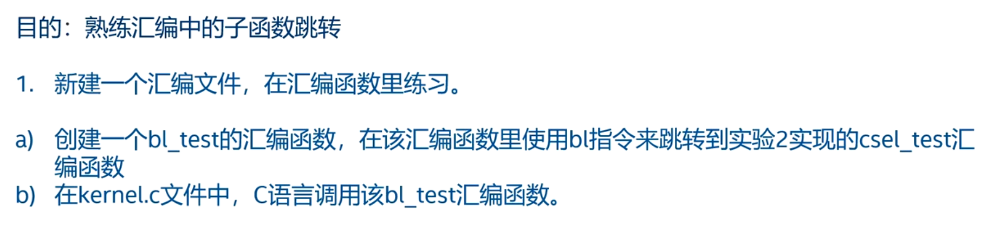

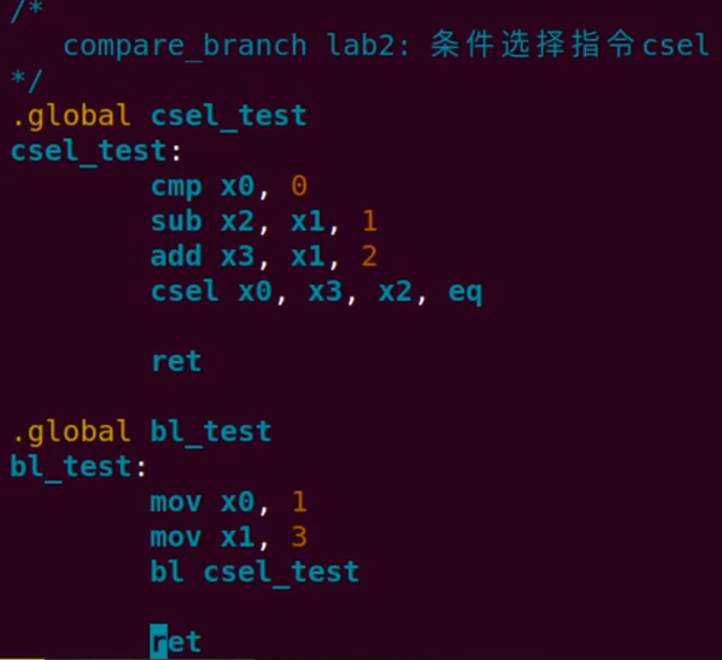

**陷阱与坑**

> bl指令：用于call子函数，它把返回地址写入到x30寄存器，返回地址为PC+4
>
> 在一个函数里调用bl来call子函数，有可能会把父函数的lr寄存器给冲走，然后父函数的ret返回就跑飞了

简单来讲就是子函数更改了x30寄存器的值，返回时没有恢复


#### 比较并跳转指令

##### cbz cbnz tbz tbnz

| 指令     | 缩写含义                          | 作用描述                                                     |
| -------- | --------------------------------- | ------------------------------------------------------------ |
| **CBZ**  | *Compare and Branch if Zero*      | 检查指定寄存器的值是否为零，若为零则跳转到目标地址，跳转范围+/- 1MB。 |
| **CBNZ** | *Compare and Branch if Non-Zero*  | 检查指定寄存器的值是否非零，若非零则跳转到目标地址，跳转范围+/- 1MB。 |
| **TBZ**  | *Test Bit and Branch if Zero*     | 检查指定寄存器的某一位（bit）是否为 0，若该位为 0 则跳转到目标地址，跳转范围+/- 32KB。 |
| **TBNZ** | *Test Bit and Branch if Non-Zero* | 检查指定寄存器的某一位（bit）是否为 1，若该位为 1 则跳转到目标地址，跳转范围+/- 32KB。 |

### 其他重要的指令

#### PC相对地址加载指令

- adr 指令，加载PC相对地址的label的地址，范围为+/- 1MB

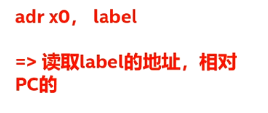

- adrp 指令，加载PC相对地址的label的地址，它只加载label所属的4KB对齐的地址，范围为+/- 4GB

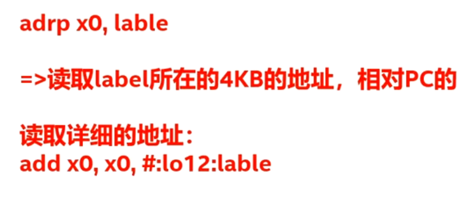


#### 实验1： 测试adrp和ldr指令

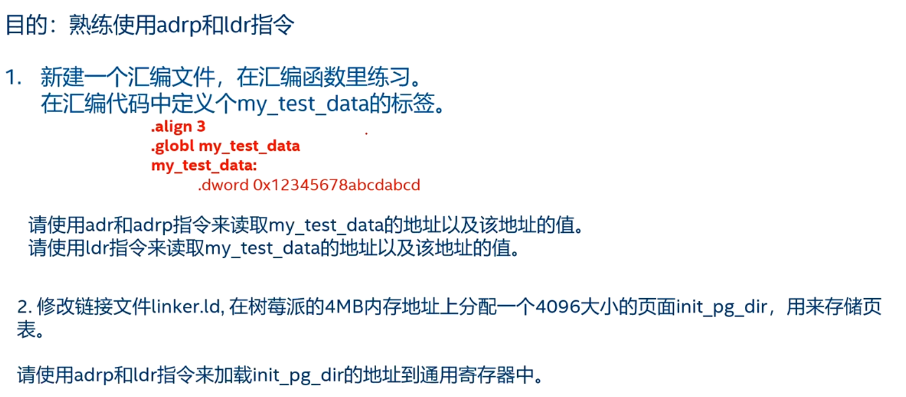

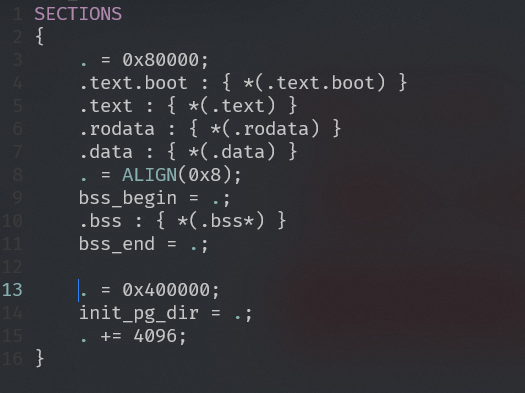

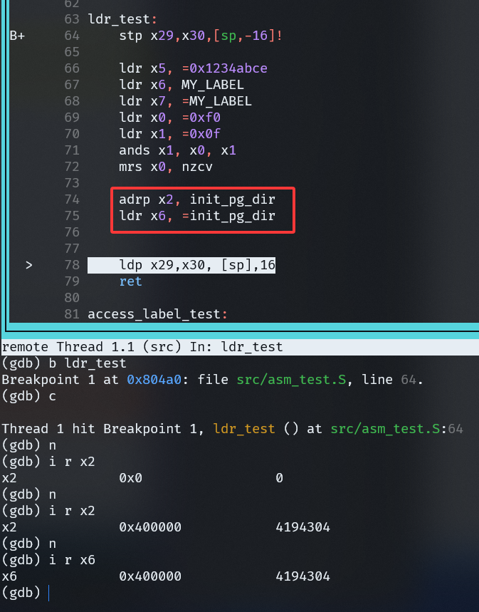


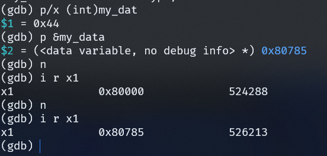


#### adrp和ldr究竟有什么不同

陷阱与坑：

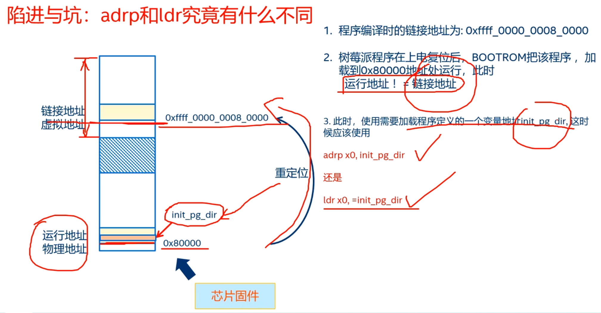

- ldr 伪指令：加载的绝对地址
- adrp指令：加载的PC相对地址


- 当链接地址 = 运行地址时

> ldr伪指令 加载的地址 = adrp 指令加载的地址

- 当链接地址!=运行地址时

> ldr伪指令地址：加载的时链接地址（或称为虚拟地址）
>
> adrp指令：加载的时当前运行地址的PC值+label的offset，即label在当前运行时的地址（或者称为物理内存）

#### 实验2：adrp和ldr指令的陷阱


#### 内存独占加载和存储指令

- ldxr 指令

> 内存独占加载指令，从内存中以独占exclusive的方式加载内存的地址到通用寄存器

- stxr 指令

> 内存独占存储指令


1. ldrx是加载内存，不过它会通过独占监视器来监视这个内存的访问，监视器会把这个内存地址标记为独占访问，保证其独占的方式来访问

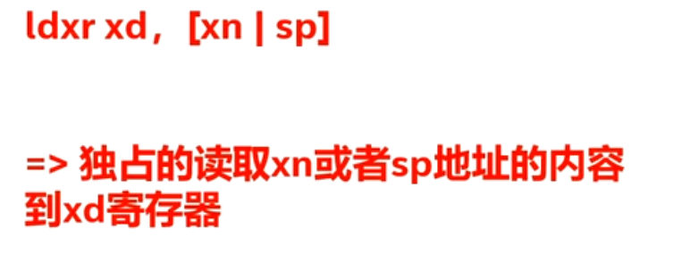

2. stxr是有条件的存储内存，刚才ldxr标记的内存地址被独占的方式存储了，注意第一个寄存器为w0


- ldxr指令和stxr指令通常需要配对使用
- Linux内核常常用来实现atomic的访问，例如atomic_write()，atomic_set_bit()
- spinlock机制可以简单地使用ldxr和stxr指令来实现

#### 实验3：ldxr和stxr指令的使用


#### 异常处理指令

| 指令         | 名称                                          | 描述                                                         |
| ------------ | --------------------------------------------- | ------------------------------------------------------------ |
| **SVC #imm** | **系统调用指令**(Supervisor Call)             | 应用程序通过 `SVC` 指令从用户态跳转到内核态操作系统，通常进入 EL1 异常级别，用于触发系统调用 |
| **HVC #imm** | **虚拟化系统调用指令**(Hypervisor Call)       | 主机操作系统通过 `HVC` 指令从 EL1 进入 EL2，调用虚拟化管理程序（Hypervisor），用于虚拟化支持场景 |
| **SMC #imm** | **安全监控系统调用指令**(Secure Monitor Call) | 主机操作系统或监控程序通过 `SMC` 指令从普通世界（Non-secure World）进入安全世界（Secure World），通常触发 EL3 异常，用于 TrustZone 安全机制 |

#### 系统寄存器访问指令

| 指令    | 描述                                                        |
| ------- | ----------------------------------------------------------- |
| **MRS** | 读取系统寄存器的值到通用寄存器（Move Register from System） |
| **MSR** | 将通用寄存器的值写入系统寄存器（Move Register to System）   |

#### 内存屏障指令

| 指令    | 全称                                | 作用                                               | 强度 | 示例用途                           |
| ------- | ----------------------------------- | -------------------------------------------------- | ---- | ---------------------------------- |
| **DMB** | Data Memory Barrier                 | 保证**内存访问指令的执行顺序**（如写后读不会乱序） | 中等 | 多核间共享数据通信                 |
| **DSB** | Data Synchronization Barrier        | **等待所有内存访问完成**后再执行后续指令           | 强   | 外设寄存器读写前后，缓存同步       |
| **ISB** | Instruction Synchronization Barrier | **清除指令流水线和缓存**，强制重新取指             | 特殊 | 改变系统状态寄存器后，强制刷新指令 |

1. DMB

作用： 保证内存访问的先后顺序，但不阻塞执行。
例子：

```asm
    str x0, [x1]     // 写数据
    dmb sy           // 确保写操作完成
    ldr x2, [x3]     // 再读其他数据
```
2. DSB

作用： 必须等待之前所有内存操作完成，再继续执行后续指令。
例子：

```asm
    str x0, [x1]     // 写数据
    dsb sy           // 等待写入完成
    isb              // 保证后面执行的是最新的代码
```
3.  ISB

作用： 清除 CPU 指令预取缓存，通常在修改系统控制寄存器后用。
例子：

```asm
    msr sctlr_el1, x0  // 修改系统控制寄存器
    isb                // 强制刷新指令流
```


**DMB/DSB指令参数详解(内存屏障的粒度与作用范围)**

| 参数    | 访问顺序控制 | 共享范围                        | 说明                                                     |
| ------- | ------------ | ------------------------------- | -------------------------------------------------------- |
| `SY`    | 读/写        | 全系统共享                      | 最强，**所有处理器和设备**可见，常用于设备驱动或关键同步 |
| `ST`    | 写           | 全系统共享                      | 只对**写操作**建立顺序                                   |
| `LD`    | 读           | 全系统共享                      | 只对**读操作**建立顺序                                   |
| `ISH`   | 读/写        | **Inner Shareable（内部共享）** | 多核共享同一个 L2 cache 时使用                           |
| `ISHST` | 写           | Inner 共享                      | 内部共享域的**写操作屏障**                               |
| `ISHLD` | 读           | Inner 共享                      | 内部共享域的**读操作屏障**                               |
| `NSH`   | 读/写        | **Non-shareable（不共享）**     | 本核私有内存使用                                         |
| `NSHST` | 写           | 不共享                          | 本核私有写屏障                                           |
| `NSHLD` | 读           | 不共享                          | 本核私有读屏障                                           |
| `OSH`   | 读/写        | **Outer Shareable（外部共享）** | 多个 L2 之间共享时使用                                   |
| `OSHST` | 写           | Outer 共享                      | 外部共享写屏障                                           |
| `OSHLT` | 读           | Outer 共享                      | 外部共享读屏障                                           |


### Overview

- 运行在aarch64 execution state的指令集，64是指它的运行环境，而不是指令长度
- 指令长度是32bit，而不是64bit
- 31个通用寄存器，xn为64bit，wn为32bit
- 零寄存器：xzr, wzr
- pc不是通用寄存器，通常不能直接返回
- x30用作链接寄存器lr，用于函数返回
- ELR_ELx用于从异常返回
- 每个异常等级都有自己的栈SP，例如SP_EL0, SP_EL1
- SP不是通用寄存器


- SIMD和浮点运算的寄存器

- Qn（126bit，16字节），Dn（64bit）,Sn（32bit）， Hn（16bit）,Bn（Bn）

  

- `PSTATE`（Processor State Register）**不是单独存在的一个物理寄存器**，而是**多个位段组成的处理器状态集合**。

- `PSTATE` 的值控制 CPU 的当前状态，包括异常屏蔽、当前异常级别、条件码等。

| 字段        | 含义说明                                                     |
| ----------- | ------------------------------------------------------------ |
| `NZCV`      | 条件码标志位（ALU Flags）用于条件跳转等：**N**（负号）、**Z**（零）、**C**（进位）、**V**（溢出） |
| `Q`         | 溢出标志位位，仅 AArch32 用某些 SIMD 操作溢出时设置          |
| `DAIF`      | 异常屏蔽位：**D**：调试异常屏蔽**A**：SError 屏蔽**I**：IRQ 中断屏蔽**F**：FIQ 中断屏蔽 |
| `SPSel`     | SP 寄存器选择（仅 AArch64）控制是使用 `SP_EL0` 还是 `SP_ELx` |
| `CurrentEL` | 当前异常级别（EL0/EL1/EL2/EL3）影响特权级访问和执行          |
| `E`         | 字节序选择（AArch32）控制数据访问是小端或大端                |
| `IL`        | 非法指令标志设为 1 时，**所有指令都会被当作 UNDEFINED 执行**，调试用 |
| `SS`        | 单步执行标志（Software Stepping）与调试器联合使用，每次执行一条指令后触发异常 |


- 加载和存储指令

| 指令    | 类型            | 数据大小 | 是否符号扩展           | 存储/加载目标 |
| ------- | --------------- | -------- | ---------------------- | ------------- |
| `LDR`   | 普通加载        | 依寄存器 | 否                     | 任意位宽      |
| `LDRSW` | 加载有符号 word | 32-bit   | ✔（符号扩展至 64-bit） | **Xn only**   |
| `LDRB`  | 加载字节        | 8-bit    | 否                     | Wn/Xn         |
| `LDRSB` | 加载符号字节    | 8-bit    | ✔                      | Wn 或 Xn      |
| `LDRH`  | 加载半字        | 16-bit   | 否                     | Wn/Xn         |
| `LDRSH` | 加载符号半字    | 16-bit   | ✔                      | Wn 或 Xn      |
| `STRB`  | 存储字节        | 8-bit    | N/A                    | —             |
| `STRH`  | 存储半字        | 16-bit   | N/A                    | —             |

指令后缀含义

| 后缀   | 含义                           |
| ------ | ------------------------------ |
| `B`    | Byte（8-bit）                  |
| `H`    | Halfword（16-bit）             |
| `W`    | Word（32-bit）                 |
| `S`    | Sign-extended（符号扩展）      |
| 无后缀 | 默认按目标寄存器位数加载或存储 |


- 多字节加载和存储指令
  - A64指令集已经把ldm，stm，push，pop指令删掉
  - ldp和stp来实现多字节加载和存储指令


**与PC相关的指令**

 `ldr x0, =label`（伪指令）

- **含义**：加载 `label` 的地址（**链接地址**）到 `x0`。
- **实现方式**：汇编器会在 `.rodata` 区域生成一个常量表，`ldr` 实际上是从常量表中加载地址。
- **适用场景**：任何位置都能使用，但**依赖链接时地址信息**，在支持重定位的系统中要谨慎。

------

 `ldr x0, label`

- **含义**：将 `label` 地址处的值加载到 `x0` 中。
- **注意**：这里的 `label` 是个地址，指向的数据会被加载到寄存器中（不是加载地址本身）。
- **区别于上面**：这个不是加载地址，而是**通过地址去读取数据**。

------

`adr x0, .`

- **含义**：把当前 PC 的值加载到 `x0` 中。
- **常用场景**：定位当前代码位置（如实现 Position-Independent Code）。

------

 `adrp x0, label`

- **含义**：将 `label` 所在 page 的**页首地址（4KB 对齐）**加载到 `x0` 中。
- **用途**：
  - 多用于 **位置无关代码（PIC）**。
  - 搭配 `add` 实现完整地址加载：


| 标志位 | 含义                                               | 常见触发情况                    |
| ------ | -------------------------------------------------- | ------------------------------- |
| `N`    | Negative（负号）标志位：结果为负时置位             | 如 `subs x0, x1, x2` 得到负数   |
| `Z`    | Zero（零）标志位：结果为零时置位                   | 如 `subs x0, x1, x1`，结果为0   |
| `C`    | Carry（进位）标志位：无符号加法进位/无符号减法借位 | 如 `adds`, `subs`, `adc`, `sbc` |
| `V`    | Overflow（溢出）标志位：有符号数加减运算时溢出     | 如 `adds`, `subs` 溢出          |


推荐查阅文档

**arm8.6 Chapter C3 A64 Instruction Set Overview**


### 陷阱与坑（QEMU能跑但板子不能跑）

#### 坑1：ldr指令加载宏


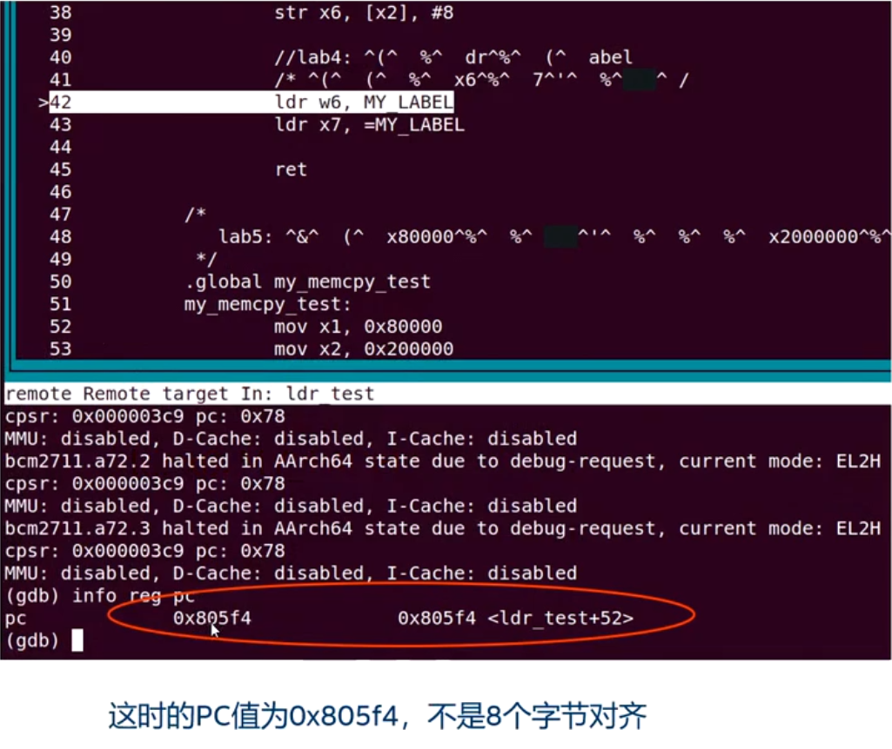

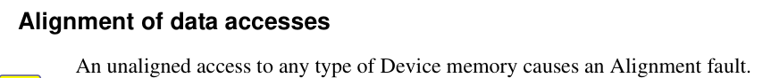

在裸机编程中，没有enable MMU，因此内存属性一律被视为Device memory

ldr指令访问8个字节，如果地址不是8个字节对齐，那么会触发alignment异常，也就是Data abort

解决办法：

```asm
ldr x6, MY_LABEL
// 修改
ldr w6, MY_LABEL
```


#### **坑2: ldr指令加载字符串**

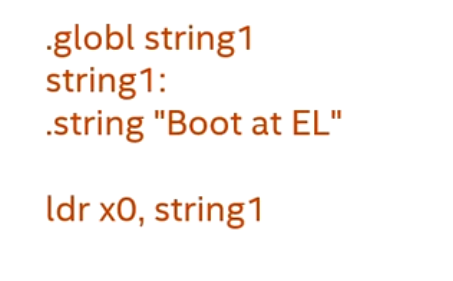

这也是alignment导致的，因为不能保证string1的起始地址是8个字节对齐

解决办法：让string1按8个字节对齐


#### 对齐访问总结

- 对于normal memory，支持不对齐访问。（需要enable MMU，并设置内存属性为normal）
- 可以单独设置不对齐访问时触发异常（设置SCTLR_Elx.A）
- 对于Device memory，不对齐访问会触发Data Abort异常
  - 没有enable MMU的系统，例如我们的实验代访问DDR编程访问device memory
- 指令预取，需要4个字节对齐，否则会触发异常


1. Normal memory 支持不对齐访问

- **条件**：
  - 启用了 **MMU**（Memory Management Unit）；
  - 并且该内存区域的属性被设置为 **Normal memory**；
- **结果**：
  - 支持对字（4字节）、半字（2字节）、字节（1字节）的不对齐访问；
  - 可实现跨边界访问，不触发异常；

2. 配置不对齐访问异常（SCTLR_ELx.A 位）

- **SCTLR_EL1.A** 控制是否允许 **不对齐访问**（Alignment Check）：
  - `A = 0`（默认）：允许不对齐访问（如果 memory 类型允许）；
  - `A = 1`：**强制对齐访问**，一旦发生不对齐访问，则触发 **Alignment fault 异常（Data Abort）**；

3. Device memory 不支持不对齐访问

- **特点**：
  - 无论 MMU 是否启用，Device memory 类型都**不允许不对齐访问**；
- **后果**：
  - 一旦访问未对齐的地址（如访问 `0x1003` 的 32-bit 数据），将触发 **Data Abort 异常**；
- **应用示例**：
  - 实验环境中直接映射访问 **DDR、外设寄存器** 等，通常被定义为 Device memory 类型；
  - 访问这些区域时必须对齐，如访问 32-bit 数据必须 4 字节对齐；

4. 指令预取要求

- **指令取址** 必须是 **4字节对齐**（即地址最低两位必须为 0）；
- 否则会触发 **Instruction Abort 异常**；
- 原因：ARMv8 指令以 4 字节为基本单位存储和取指，无法从非对齐位置解码执行指令。


#### **坑3：存储指令数据大小**

使用str指令来设置寄存器，一定要注意寄存器的位宽，否则会出现死机问题

树莓派4b上的寄存器位宽都是32bit的，也就是4个字节


#### 坑4：ldxr的大坑

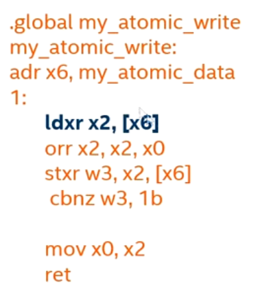

**ldxr指令的使用会有很多限制**

1. 首先确保访问的内存是normal memory并且是sharable

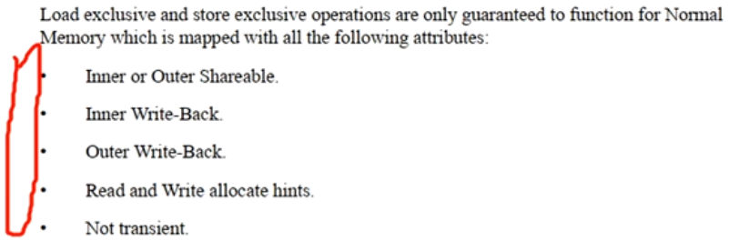

2. 如果访问device memory，例如MMU没有打开的情况，那就需要CPU IP核心支持以独占的方式访问device memory，这个需要查询具体CPU IP手册的描述

例如： <\<Cortex-A72 MPCore Processor Technical Reference Manual\>>第6.45章节


解决方法：

填充好页表，使能MMU和cache，才能使用ldxr和stxr

### 大作业：在汇编中实现串口打印功能

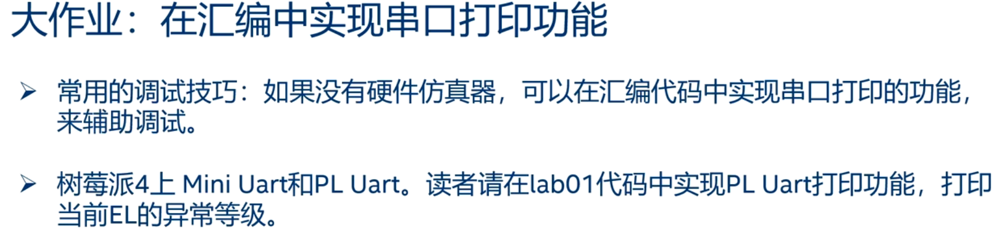

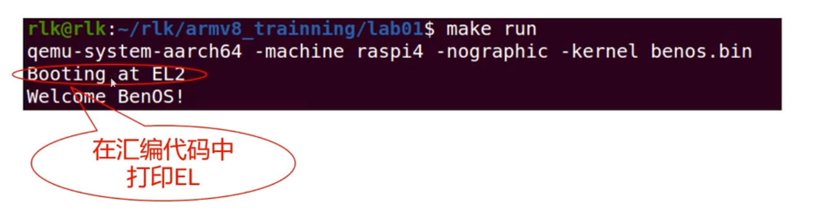

🧱 1. GPIO 初始化（引脚复用配置）

```asm
ldr x1, =GPFSEL1
ldr w0, [x1]
and w0, w0, #0xffff8fff    // 清除 GPIO14 功能选择位（bit 12-14）
orr w0, w0, #0x4000        // 设置 GPIO14 为 ALT0 (UART0_TXD)
and w0, w0, #0xfffc7fff    // 清除 GPIO15 功能选择位（bit 15-17）
orr w0, w0, #0x20000       // 设置 GPIO15 为 ALT0 (UART0_RXD)
str w0, [x1]
```

✅ 作用：将 GPIO14 和 GPIO15 设置为 UART 功能（ALT0 模式）。
🧱 2. 禁用上拉/下拉（仅 Pi 3B 配置）
```asm
#ifdef CONFIG_BOARD_PI3B
	ldr x1, =GPPUD
	str wzr,[x1]

	// delay 150 cycles
	mov x0, #150
1:
	sub x0, x0, #1
	cmp x0, #0
	bne 1b

	ldr x1, =GPPUDCLK0
	ldr w2, #0xc000   // 对 GPIO14 和 GPIO15 生效
	str w2, [x1]
	
	// delay again
	mov x0, #150
2:
	sub x0, x0, #1
	cmp x0, #0
	bne 2b

	ldr x1, =GPPUDCLK0
	str wzr, [x1]
	isb
#endif
```
✅ 对 GPIO14/15 禁用上拉/下拉，符合 BCM2837 的初始化流程。
🧱 3. UART 初始化
```asm
// 禁用 UART
ldr x1, =U_CR_REG
str wzr, [x1]

// 设置波特率
ldr x1, =U_IBRD_REG
mov w2, #26          // Integer Baud Rate Divisor
str w2, [x1]

ldr x1, =U_FBRD_REG
mov w2, #3           // Fractional Baud Rate Divisor
str w2, [x1]

// 设置数据格式
ldr x1, =U_LCRH_REG
mov w2, #0x70        // FIFO enable + 8-bit word length
str w2, [x1]

// 禁用中断
ldr x1, =U_IMSC_REG
str wzr, [x1]

// 使能 UART (TX/RX/UART enable)
ldr x1, =U_CR_REG
mov w2, #0x301       // UARTEN | TXE | RXE
str w2, [x1]
isb
```
✅ 正确配置波特率和数据格式（8N1, FIFO），最后使能 UART。

你使用的是：

    波特率 = UARTCLK / (16 * (IBRD + FBRD/64))
    假设 UARTCLK = 48 MHz，则波特率约为 115200。

🧱 4. 单个字符输出函数 put_uart
```asm
put_uart:
	ldr x1, =U_FR_REG
1:
	ldr w2, [x1]
	and w2, w2, #0x20       // 检查 TXFF (Transmit FIFO full)
	cmp w2, #0
	b.ne 1b                 // 如果 FIFO 满，则等待

	ldr x1, =U_DATA_REG
	str w0, [x1]            // 写入字符
	ret
```
✅ 会等待 FIFO 可用后发送字符。

🧱 5. 字符串输出函数 put_string_uart
```asm
put_string_uart:
	mov x4, x0              // x0: 指向字符串
	mov x6, x30             // 保存返回地址
1:
	ldrb w0, [x4]           // 读取一个字节（字符）
	bl put_uart
	add x4, x4, 1
	cmp w0, #0
	bne 1b
	mov x30, x6
	ret
```
✅ 输入：x0 = 字符串地址，将其打印出来直到遇到 NULL（0x00）。

## GNU AS汇编器

ARM64的汇编器

- ARM公司的官方的汇编器
- GNU AS汇编器：aarch64-linux-gnu-as
- gcc采用as作为其汇编器，所以汇编代码是AT&T的
  - AT&T：源自贝尔实验室，为开发UNIX系统而产生的汇编语法
  - ARM格式：arm官方汇编语法

### 汇编语法

- label: 任何以冒号结尾的标识符都被认为是一个标号
- 注释：
  - // 表示注释
  - \# 在一行的开始，表示注释整行
- 指令，伪指令，寄存器可以全部都是大写或者小写，GNU风格默认小写

#### Symbol

> 代表它所在的地址，也可以当作变量或者函数来使用

- 全局symbol, 可以用.global来声明
- 局部symbol，主要在局部范围内使用，开头以0-99直接的数字为标号名，通常和b指令结合使用
- f: 指示编译向前搜索
- b:指示编译器向后搜索


#### 对齐伪指令

- .align对齐，填充数据来实现对齐。可以填充0或者使用nop指令。
  - 告诉汇编程序,align后面的汇编必须从下一个能被2^n整除的地址开始分配
  - ARM64系统中，第一个参数表示2^n大小


#### 数据定义伪指令

##### 整数与浮点伪指令汇总

| 指令           | 数据类型/作用                       | 字节数 | 补充说明                  |
| -------------- | ----------------------------------- | ------ | ------------------------- |
| `.byte`        | 定义 8 位整数                       | 1 B    | 通常用于字符、控制位      |
| `.hword`       | 定义 16 位整数（half-word）         | 2 B    | 某些架构中也叫`.short`    |
| `.int`/`.long` | 定义 32 位整数                      | 4 B    | `.int` 是别名，效果一样   |
| `.quad`        | 定义 64 位整数（quad-word）         | 8 B    | 在 AArch64 中非常常用     |
| `.float`       | 定义 IEEE-754 单精度浮点数（32 位） | 4 B    | 等价于 C 语言中的 `float` |

##### 字符串定义伪指令

| 指令           | 功能说明                                                     |
| -------------- | ------------------------------------------------------------ |
| `.ascii "str"` | 将字符串原样插入，不自动添加 `\0`，适用于非 C 风格字符串     |
| `.asciz "str"` | 在字符串末尾**自动追加一个空字符 `\0`**，适用于 C 字符串（推荐） |


#####  .rept ... .endr：重复块定义

语法：

```asm
.rept <count>
  <内容>
.endr
```


作用：重复某段汇编代码或数据定义若干次，适用于初始化数组或填充空间。

例子：
```asm
.rept 3
    .long 0
.endr
```
 等价于：
```asm
.long 0
.long 0
.long 0
```
#####  .equ / .set：常量定义（赋值操作）

这两个指令完全等价，只是语法风格略不同。
 .equ

```asm
.equ abcd, 0x45
```
 让 abcd 成为 常量宏定义，值为 0x45。
 .set

```asm
.set abcd, 0x45
```
 同样效果，也定义 abcd 为 0x45。

典型用途：用于定义寄存器地址、常量位掩码等。
常见用法示例（结合 .equ 与 .rept）：

```asm
.equ LED_BASE, 0x3F200000

.section .data
.rept 4
    .int LED_BASE
.endr
```
表示将 LED_BASE 这个地址填充 4 次，每次 4 字节，共 16 字节。


`.equ` 与 C 的 `#define` 区别：

| `.equ` / `.set`                    | `#define`                |
| ---------------------------------- | ------------------------ |
| 汇编阶段赋值，数值不可变           | 预处理阶段文本替换       |
| 可用于表达式（如 `.equ val, 4+5`） | 只做文本拼接             |
| 不可用于条件编译                   | 可与 `#ifdef` 等配合使用 |


##### 函数相关的伪指令

| 伪操作             | 作用说明                   |
| ------------------ | -------------------------- |
| `.global`          | 定义一个全局的符号         |
| `.include`         | 引用头文件                 |
| `.if .else .endif` | 控制语句结构，用于条件编译 |

##### if语句伪操作

| 指令               | 含义说明                             |
| ------------------ | ------------------------------------ |
| `.ifdef symbol`    | 判断 `symbol` 是否已定义             |
| `.ifndef symbol`   | 判断 `symbol` 是否**未**定义         |
| `.ifc str1,str2`   | 判断字符串 `str1` 与 `str2` 是否相等 |
| `.ifeq expr`       | 判断表达式 `expr` 的值是否为 0       |
| `.ifeqs str1,str2` | 等价于 `.ifc str1,str2`              |
| `.ifge expr`       | 判断表达式 `expr` 的值是否 ≥ 0       |
| `.ifle expr`       | 判断表达式 `expr` 的值是否 ≤ 0       |
| `.ifne expr`       | 判断表达式 `expr` 的值是否 ≠ 0       |

##### 与段相关的伪操作

- .section 表示接下来的汇编会链接到哪个段里，例如代码段，数据段等
- 每一个段以段名为开始，以下一个段名或者文件尾为结束

```asm
.section name, "flags"
```

后面可以添加flags，表示段的属性

| 标志 | 含义说明                                                     |
| ---- | ------------------------------------------------------------ |
| `a`  | **allocatable**：该段在运行时需要被加载到内存中。            |
| `d`  | **GNU_MBIND section**：GNU 使用的特殊绑定段。                |
| `e`  | **excluded**：该段不会被包含在可执行文件或共享库中。         |
| `w`  | **writable**：该段可写。                                     |
| `x`  | **executable**：该段包含可执行代码。                         |
| `M`  | **mergeable**：可以和其他具有相同属性的段合并（通常用于只读字符串等）。 |
| `S`  | **string**：该段包含以 0 结尾的字符串。                      |
| `G`  | **group**：该段属于某个 section group（如 COMDAT）。         |
| `T`  | **thread-local-storage**：该段用于线程局部存储（TLS）。      |
| `?`  | **unspecified group**：该段属于前一个 section 的 group（如果有的话）。 |

举例：

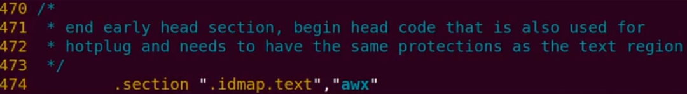


`.pushsection <name>`
 将接下来的代码或数据**插入到指定的 section（段）中**，同时**保存当前 section 状态**。

`.popsection`
 表示**结束前面的 push**，并**恢复原来的 section**。

- **成对使用**。

- 作用仅在 `pushsection` 和 `popsection` 之间的代码，对其他代码没有影响。

- 其余代码仍然属于原先的段，比如 `.text` 或 `.data`。
```asm
    .text
    .globl _start
_start:
    nop             // 在默认的 .text 段中

    .pushsection .mydata, "a"
    .long 0x12345678  // 被插入到 .mydata 段中
    .popsection
    
    nop             // 又回到 .text 段
```

`_start` 和两个 `nop` 都属于 `.text` 段；

`.long 0x12345678` 被插入到了自定义的 `.mydata` 段中。

##### 实验1：使用汇编伪操作来实现一张表


##### 宏

- .macro和.endm组成一个宏
- .macro后面跟着的是宏的名称，在后面是宏的参数
- 在宏里使用参数，需要添加前缀“\”

```asm	
.macro plus1 p, p1
```

> 定义了一个名为plus1的宏，有两个参数p和p1
>
> 在宏里使用参数需要前缀,"\p"表示第一个参数,"\p1"属于第二个参数

- 宏参数定义的时候可以设置一个初始化值

```asm
.macro reserve_str p1=0 p2
```

> 第一个参数p1有一个初始化的值，0。这个时候可以使用reserve_str a,b或者reserve_str, b来调用这个宏


解决办法：

- 使用空格或者使用altmacro+&


-  使用”\\()“表示连接（）


##### 实验2：汇编宏的使用


#### ARM64特有的特性

##### ARM64编译选项

- -EB：用于大端模式的CPU，-EL：用于小端模式的CPU
- -mabi：指定ABI模式，ilp32用于ELF32，lp64用于ELF64，默认值为lp64
- -mcpu=processor+extension：指定CPU型号，例如cortex-a72
- -march=，用于指定支持的架构，例如armv8.2-a
- ARM64支持的extension，见GNU汇编器as_v2.34 9.1.2章

##### 特殊字符

- //表示注释
- #若在一行开始表示注释，不在一行开始也可表示立即数
- #:low12 表示低12位

```asm
adrp x0, foo
ldr x0, [x0, #:lo12:foo]
```


- ldr伪操作
- .bss 切换到bss段
- .dword/.xword 64位数据
- name .reg register_name 为寄存器命名

```asm
foo .req w0
```


## GNU LD连接器

### 链接器Linker

- 链接器是一个程序，将一个或多个由编译器或汇编器生成的目标文件外加库链接为一个可执行文件
- GNU Linker采用AT&T链接脚本语言
- 官方文档：v2.3.4


#### ld命令

- aarch64-linux-gnu-ld
- 常用参数
  - -T 指定链接脚本
  - -Map 输出一个符号表文件
  - -o 输出最终可执行二进制文件


#### 一个简单的例子

```asm
SECTIONS
{
	. = 0x10000;
	.text : {* (.text)}
	. = 0x8000000
	.data : {*(.data)}
	.bss : {*(.bss)}
}
```

#### 基本概念

- 输入段(input section)，输出段(output section)
- 每个段包括name和大小
- 段的属性
  - loadable 运行时会加载这些段的内容到内存
  - allocatable 运行时不会加载段的内容
- 段的地址
  - **VMA**(virtual memory address) 虚拟地址，运行时的地址
  - **LMA**(load memory address) 加载地址
  - **通常ROM的地址为加载地址，而RAM的地址为VMA**

#### 链接脚本命令

- ENTRY(symbol) 设置程序的入口函数
- 链接程序有如下几种方式来设置入口点：
  - 使用-e参数
  - 使用ENTRY(symbol)
  - 在.text的最开始的地方
  - 0地址


- INCLUDE filename 引入filename链接脚本
- OUTPUT filename 输出二进制文件，类似在命令行里使用“-o filename”
- OUTPUT_FORMAT(bfd) 输出BFD格式
- OUTPUT_ARCH(bfdarch) 输出处理器体系结构格式


#### 符号赋值

- 符号也可以像C语言一样赋值


- "." 表示location counter，表示当前位置


#### 符号的引用

- 高级语言中常常需要引用链接脚本定义的符号
- 在C语言里，定义一个变量并初始化一个变量。例如 int foo = 100
  - 编译器会在符号表定义了一个符号foo
  - 编译器会在内存中为符号存储100


- 在链接脚本中定义一个变量
  - **链接器仅仅在符号表里定义这个符号，没有分配内存来存储变量的值**
- 访问链接脚本定义的变量：**访问的时变量的地址，不能访问变量的值**


- 我们可以在每个段设置一些符号，以方便C语言访问每个段的起始地址和结束地址


#### SECTIONS命令

- SECTIONS命令：告诉链接器如何把输入段(input sections)映射到输出段(output sections)，以及如何在内存中摆放这些输出段


- 输出section的描述符


#### LMA加载地址

- 每个段都有**VMA**（虚拟地址，运行地址）以及**LMA**（加载地址）
- 在输出段描述符中**使用"AT"来指定LMA**
- **如果没有通过"AT"来指定LMA，通常LMA=VMA**
- 构建**一个基于ROM的映像文件常常会设置输出段的虚拟地址和加载地址不一致**


- data段的加载地址和链接地址（虚拟地址）不一样，因此程序的初始化需要把data段从ROM的加载地址复制到SDRAM中的虚拟地址中
- 数据加载地址在_etext起始的地方，数据段的运行地址是在\_data起始的地方，数据段的大小为“\_edata-\_data",下面这段代码把数据段从\_etext起始的地方复制到\_data起始的地方


#### 常见的内建函数

##### ADDR(section)

> 返回前面已经定义过的段的VMA地址


##### ALIGN(n)

> 返回下一个与n字节对齐的地址，它是基于当前的位置(location counter)来计算对齐地址的
>
> 注意这里是n个字节，而不是2^n个字节（与汇编器的.align区分）


##### SIZEOF(section)

> 返回一个段的大小


##### MAX(exp1, exp2) / MIN(exp1, exp2)

> 返回两个表达式的最大值或最小值

#### 实验2：打印每个段的内存布局


1. **链接器导出的符号是地址，不是变量值**

链接脚本中的这些符号：

```asm
_text = .;
```

定义的不是变量本身，而是一个 地址标签（symbol address）。在 C 中没有对应“地址标签”的语法，因此只能通过某种“变量”来间接引用这个地址。


用 char[] 声明它，其实是在说：

> “这是一段起始于 _text 的内存区域，我关心的是它的地址，而不是它的具体内容。”

2. **char[] 是一种“单位最小”的内存表示，方便做指针运算**

    char 是 C 中最小的可寻址单位（1 字节）。
    
    所以用 char[] 类型，我们就可以直接进行精确的地址操作：
    
```c
extern char _text[], _etext[];
size_t text_size = _etext - _text;  // 计算段长度（字节）
```

如果你写成 int[] 或 void*，这个计算就可能出错，或者无法编译。

3. char[] vs char* 的差异：**链接器符号是“数组地址”而非指针变量**

虽然你也可以写成：
```c
extern char *_text;
```
但这其实意味着 _text 是一个“指向字符的变量”，而不是一个地址标签。

> char *_text; 说明编译器要去“取变量 _text 的值”，它必须由代码赋值。
而 char _text[]; 是“声明链接器会提供这个地址”，不会生成额外符号或变量。

所以推荐使用：

```c
extern char _text[];
```


#### 实验3：加载地址不等于运行地址


需要把代码从装载地址拷贝到运行地址


#### 实验4：分析Linux5.0内核的链接脚本


#### 运行地址，装载地址，链接地址

##### 链接地址（Link Address）

定义：

>  编译器和链接器在生成可执行文件（如 ELF 文件）时，为各段（如 .text, .data, .bss 等）分配的地址。

特征：

- 是编译阶段由 链接器设定的地址。
- 可以通过链接脚本 (ld script) 显式设置，比如 . = 0x80000;。
- 可执行文件中的节表（section headers）或段表（program headers）中就记录了这些地址。

例子：

```asm
.text : { *(.text) } > 0x80000
```

表示 .text 段的 链接地址是 0x80000。

##### 装载地址（Load Address）

定义：

> 可执行文件中的内容被加载到内存中的位置，也就是 操作系统/bootloader 将文件装入内存的位置。

特征：

- 通常等于链接地址，但在某些情况下（如动态链接、加载地址重定位）可以不同。
- 由 操作系统或 bootloader 决定，也可以通过 objcopy 等工具进行重新定位。

例子：

- 你的 ELF 文件 .text 段链接地址是 0x80000，bootloader 将它加载到 0x100000，那么：
  - 链接地址 ≠ 装载地址
  - 如果没有做重定位，程序运行会出错（因为代码中有绝对地址）

##### 运行地址（Runtime/Execution Address）

定义：
> 程序在执行时，CPU 实际访问的内存地址。

特征：

- 通常 = 装载地址（程序加载到哪里就从哪里执行）

- 如果启用了 MMU（内存管理单元），运行地址是虚拟地址，由 MMU 映射到物理装载地址。

- 在裸机程序中，一般 = 链接地址 = 装载地址 = 运行地址。

## GCC内嵌汇编

> 内嵌汇编（Inline Assembly Language）在C语言中嵌入汇编代码

目的：

- 优化：针对特定重要代码(time-sensitive进行优化)
- C语言需要访问某些特殊指令来实现特殊功能，比如内存屏障指令

参考资料：《Using the GNU Compiler Collection, v16.0》Chapter 6.12


内存汇编两种模式

### 基础内嵌汇编

**格式：**

```c
  asm asm-qualifiers(AssemblerInstructions)
```

- asm关键字：表明这是一个GNU扩展
- 修饰词（qualifiers）
  - volatile：在基础内嵌汇编中通常不需要这个修饰词
  - inline：内联，asm汇编的代码会尽可能小

- 汇编代码块（AssemblerInstructions）

  - GCC编译器把内嵌汇编当成一个字符串

  - GCC编译不会去解析和分析内嵌汇编

  - 多条汇编指令，需要使用”\n\t“来换行

  - GCC的优化器，可以移动汇编指令的前后位置。如果你需要保存汇编指令的顺序，最后使用多个内嵌汇编的方式


### 扩展内嵌汇编


- 格式
  - asm关键字：表明这个是一个GNU扩展
  - 修饰词(asm-qualifiers)
    - volatile：用来关闭GCC优化
    - inline内联，asm汇编的代码会尽可能小
    - goto 在内嵌会便利会跳转到C语言的标签里


- 输出部：

  > 用于描述在指令部中**可以被修改的C语言变量**以及约束条件

  - 每个输出约束通常以"="开头，接着的字母表示对操作数类型的说明，然后是关于变量结合的约束
  - 输出部通常使用”=“或者"+"作为输出约束，其中”**=“表示被修饰的操作数只具有可写属性**，”**+“表示被修饰的操作数只具有可读可写属性**
  - 输出部可以是空的

``` 
"=/+" + 约束修饰符 + 变量
```

- 输入部

  > 用来描述在指令部**只能被读取访问的C语言变量**以及约束条件

  - 输入部描述的参数是只有只读属性，不要试图修改输入部的参数内容，因为GCC编译器假定，输入部的参数的内容在内嵌汇编之前和之后都是一致的
  - 在输入部中不能使用"="或者”+“约束条件，否则编译器会报错
  - 输入部可以是空的

- 损坏部（Clobbers）

  - "memory"告诉GCC编译器内联汇编指令改变了内存中的值，强迫编译器在执行该汇编代码前存储所有缓存中的值，在执行完汇编代码之后重新加载该值，目的是防止编译乱序
  - ”cc"表示内嵌汇编代码修改了状态寄存器相关的标志位


- 指令部的参数表示
  - %0 对应输出输入部的第一个参数，%1表示第二个参数


**输出和输入部的约束修饰符**


**输出部和输入部的约束修饰符——通用**


**输出部和输入部的约束修饰符——ARM64**


**汇编符号名字来代替前缀%**

- `%[name]` → 引用约束变量

- `%w[name]` → 引用 **低 32 位寄存器**（如 `w0, w1`）

- `%x[name]` → 引用 **完整 64 位寄存器**（如 `x0, x1`）


### 实验1：实现简单的memcpy函数


### 陷阱与坑

- **GDB不能单步调试内嵌汇编**
- **输出部和输入部的修饰符不能用错**，否则程序会跑错

### 实验3：使用内嵌汇编来完善memset函数


### 内嵌汇编的高级玩法：和宏结合

- 技巧1：使用了C语言的#运算符。在带参数的宏中，“#”运算符作为一个预处理运算符，可以把记号转换为字符串


```c
#define ATOMIC_OP(op, asm_op) \
static inline void atomic_##op(int i, atomic_t *v) { \
    __asm__ __volatile__( \
        asm_op " %1, %0" \
        : "+m" (v->counter) \
        : "ir" (i)); \
}


```

你可以用这个宏来生成多个原子操作函数：

```c
ATOMIC_OP(add, "addl")
ATOMIC_OP(sub, "subl")
```

这会展开为：

```c
static inline void atomic_add(int i, atomic_t *v) {
    __asm__ __volatile__(
        "addl %1, %0"
        : "+m" (v->counter)
        : "ir" (i));
}

static inline void atomic_sub(int i, atomic_t *v) {
    __asm__ __volatile__(
        "subl %1, %0"
        : "+m" (v->counter)
        : "ir" (i));
}
```

图片中的这个宏使用 `#asm_op` 是因为 **它需要将宏参数 `asm_op` 转换成字符串字面量**，用于字符串拼接或输出。这种语法叫做 **宏字符串化（stringification）**

`asm_op` 是宏参数，**在宏展开时会替换为你提供的值**（比如 `"addl"`）。

它已经是一个字符串，比如你调用：

```asm
ATOMIC_OP(add, "addl")
```

宏展开后是：

```c
__asm__ __volatile__(
    "addl %1, %0"
    : "+m" (v->counter)
    : "ir" (i));

```

而这样：

```c
 ATOMIC_OP(add, addl)
```

宏展开后是

```c
__asm__ __volatile__(
    addl "%1, %0"
    : "+m" (v->counter)
    : "ir" (i));
```

则不是


`##name` —— **符号连接（token pasting）运算符**

- 把宏参数和前后的标识符直接拼接成一个新的标识符（不是字符串）。

- 常用来生成变量名、函数名等。

```c
#define MAKE_FUNC(name) void func_##name(void) {}

MAKE_FUNC(test); // 展开成：void func_test(void) {}
```


### 实验4：使用内嵌汇编与宏的结合


### 实验5：实现读写系统寄存器的宏


这里用到了**GNU C 的语句表达式 (statement expression)** 语法:

**`({ ... })` 是什么**

- 这是 GNU 扩展，不是标准 C。

- 它让一段代码块既能像语句一样执行，也能**返回一个值**。

- 语法规则：

  > `({ statement1; statement2; ...; expression; })`
  >  代码块里最后的那个 **表达式**（不加分号）就是返回值。


### 内嵌汇编：goto

> 内嵌汇编的goto模板，可以跳转到C语言的label标签里


- Goto模板的输出部必须为空
- 新增一个gotolabels的部，里面列出了C语言的label，是允许跳转的label


### 实验6：goto模板的内嵌汇编


`%l[label]` 是 GCC 内联汇编中 `asm goto` 语法的特殊写法，表示跳转到 C 代码中的标签 `label`。

详细解释：

- `%l[...]` 是告诉编译器这是一个**标签符号**（label），而不是普通的寄存器或立即数。
- `label` 是你在 C 代码里定义的标签名，比如你代码中的 `label:`。
- `asm goto` 允许汇编代码通过条件跳转直接跳转到 C 代码中的某个标签，实现条件分支。

## ARM64的异常处理（Exception Model）

ARMv8.6手册


### ARM64的异常等级

- EL0 非特权模式，例如应用程序
- EL1 特权模式，例如OS内核
- EL2 虚拟化监控程序，例如hypervisor
- EL3 安全模式，例如secure monitor

### 异常术语(Exception terminology)

- **Taking an exception**: 正在处理一个异常
- **Returning from an exception**: 从一个异常中返回
- **Exception levels**: 异常等级
- **Precise exception**: 精准异常
- **Synchronous and asynchronous exception**: 同步异常与异步异常
  - 同步异常
    - 系统调用, svc, hvc, SMC等
    - MMU引发的异常
    - SP和PC对齐检查
    - 未分配的指令
  - 异步异常
    - IRQ中断
    - FIQ中断
    - SError（系统错误）


### 异常入口（Exception Entry）

> Process state or PSTATE is an abstraction of process state information

- 当异常发生时，CPU硬件都做了哪些事情
  - **PSTATE 保存到SPSR_ELx（The Saved Program Status Register）**
  - **返回地址保存ELR_ELx**
  - **PSTATE寄存器的DAIF域都设置为1，相当于把调试异常，系统错误（SError），IRQ中断以及FIQ中断都关闭了**
  - **更新了ESR_ELx（Exception Link Register）寄存器，里面包含了同步异常发生的原因**
  - **SP执行SP_ELx**
  - **切换到对应的EL，然后跳转到异常向量表里执行**
- 当异常发生后，操作系统需要做哪些事情

> 操作系统需要根据异常发生的类型，跳转到合适的异常向量表
>
> 异常向量表的每个表项会保存一个异常处理的跳转函数，然后跳转到恰当的异常处理函数并处理异常

### 异常的返回

- 操作系统执行一条**eret**语句
  - **从ELR_ELx（Exception Link Register）寄存器中恢复PC指针**
  - **从SPSR_ELx（The Saved Program Status Register）寄存器恢复处理器的状态**


### 异常返回地址

- 返回地址两个寄存器
  - x30：子函数的返回地址。使用ret指令来返回
  - ELR_ELx：异常返回地址。使用eret指令来返回
- **ELR_ELx**寄存器保存了异常返回地址
  - **对于异步异常，它的返回地址是中断发生时的下一条指令，或者没有执行的第一条指令**
  - **对于不是system call的同步异常，返回的是触发同步异常的那一条指令**
  - **对于system call，它返回的是svc指令的下一条指令**

**异步异常（中断）**

> 硬件已经把 ELR 设置为 *下一条要执行的指令*，`eret` 就直接回去继续执行，不用额外改

**同步异常（非 system call）**

> 硬件把 ELR 设置为 *触发异常的那条指令*
>  如果你修复了异常原因（比如缺页异常），直接 ` eret` 就会重新执行这条指令
>  如果你想跳过它（不重试），就要手动 `ELR_ELx += 4`

**system call（svc）**

> 硬件把 ELR 设置为 *svc 的下一条指令*，所以 `eret` 会直接返回到下一条

### 异常处理的路由

> 当在一个特定的“异常等级（Exception Level, EL）”发生异常时，CPU 应该跳转到哪个异常等级去处理它

- 异常发生时，可以在**当前EL处理也可以在更高EL处理**
- **EL0不能用来处理异常**
- **同步异常是可以在当前EL里处理的**，比如在EL1发生了同步异常
- 对于**异步异常，可以路由到EL1,EL2,EL3处理**，需要配置**HCR**（Hypervisor Configuration Register）以及**SCR**（Secure Configuration Register）相关寄存器


参考armv8.6的tableD1-10


- 表格的输入是两个寄存器SCR和HCR
- **Target when taken from EL0 / EL1 / EL2 / EL3**: 这些列显示了异常处理程序所在的最终目标等级。
- **EL1 / EL2 / EL3**: 表示异常被直接路由到对应的异常等级。
- **C**: "Call"。表示异常被视为对目标等级的同步调用。
- **Hyp**: "Hypervisor"。是 EL2 的别称，表示异常被路由到 EL2。
- **FIQ/IRQ Abt**: "FIQ/IRQ Abort"。表示异常被作为中断中止路由。具体路由到哪里，要看 `SCR_EL3` 和 `HCR_EL2` 中 `FIQ`/`IRQ` 相关位的设置。
- **n/a**: "Not Applicable"。表示该场景不适用或不可能发生。

### 栈的选择

- 每个异常等级EL都有对应栈指针寄存器SP
  - SP_EL0, SP_EL1, SP_EL2, SP_EL3
- **栈必须16字节对齐**。硬件可以检测栈指针是否对齐
- **当异常发生时，并跳转到目标异常等级时，硬件会自动选择SP_ELx**
- **操作系统负责和分配**保证每个异常等级EL对应的栈，是可用的


### 异常处理的执行模式

- 当异常发生时，切换到高级别的EL，这个EL运行在哪个模式？AArch64 or AArch32
  - **HCR_EL2.RW（Hypervisor Configuration Register）**记录了EL1要运行在哪个模式
    - 1表示aarch64
    - 0表示aarch32


- **当异常发生后，执行模式可以发生改变**
  - 一个aarch32的应用程序正在运行，这时候来了一个中断，它可能会跑到aarch64执行状态下的EL1里处理这个中断 

### 异常返回的执行模式

- 从一个异常返回，SPSR寄存器记录了：
  - 返回到哪个EL?   **SPSR.M[3:0]**
  - 返回目标EL的执行模式？**SPSR.M[4]**
    - 0表示aarch64
    - 1表示aarch32


### 实验1：切换到EL1中运行


**提示**

从EL2切换到EL1，需要做如下几件事情

1. **设置HCR_EL2（Hypervisor Configuration Register）寄存器，最重要的是Bit 31的RW域，表示EL1要运行在哪个执行环境里，aarch32或aarch64**

   - HCR_EL2属于General System Control Register

   

   

   

2. **设置SCTLR_EL1（System Control Register），要设置大小端和关闭MMU**

   

   

   

3. **设置SPSR_EL2（Saved Program Status Register）寄存器，设置模式M域为EL1h，另外需要关闭所有的DAIF**

   - **SPSR_ELx**属于**Special-purpose Register**

   

   

   

   

   

   ---

   

   

   

   | M[3:0] | 目标模式 | 说明             |
   | ------ | -------- | ---------------- |
   | `0000` | EL0t     | EL0，使用 SP_EL0 |
   | `0100` | EL1t     | EL1，使用 SP_EL0 |
   | `0101` | EL1h     | EL1，使用 SP_EL1 |
   | `1000` | EL2t     | EL2，使用 SP_EL0 |
   | `1001` | EL2h     | EL2，使用 SP_EL2 |
   | `1100` | EL3t     | EL3，使用 SP_EL0 |
   | `1101` | EL3h     | EL3，使用 SP_EL3 |

4. **设置异常返回寄存器elr_el2，让其返回到el1_entry汇编函数里**

5. 执行**eret**

（3,4其实是一个异常返回的经典步骤，从EL2返回到EL1）


首先根据当前异常等级判断要跳到哪个异常等级


注意执行eret前要设置elr_el2寄存器


### 异常向量表（Exception vectors）

- 每个异常等级EL都有自己的异常向量表，EL0除外

- 异常向量表的基地址需要设置到**VBAR_ELx（Vector Base Address Register）**寄存器中

- VBAR_EL1寄存器：

  

  0~10是reserve，因此**地址是2k对齐**


1. 行（Exception taken from）

   > 定义异常触发时的 “当前执行状态”，分 4 类场景：

   - **Current Exception level with SP_EL0**：当前异常级别使用 `SP_EL0` 栈指针（如在 EL1 下用用户级栈指针时触发异常 ）。
   - **Current Exception level with SP_ELx, x>0**：当前异常级别使用 `SP_ELx`（x≥1，如 EL1 用 `SP_EL1`、EL2 用 `SP_EL2` 等内核级栈指针）时触发异常。
   - **Lower Exception level（AArch64）**：从更低异常级别触发，且 “更低级别” 处于 AArch64 执行状态（如从 EL0/EL1 切换到更高 EL 时，且原级别是 64 位模式 ）。
   - **Lower Exception level（AArch32）**：从更低异常级别触发，且 “更低级别” 处于 AArch32 执行状态（如从 32 位模式的 EL0/EL1 切换到更高 EL ）。

2. 列（Offset for exception type）

   > 按异常类型分类，对应不同偏移：

   - **Synchronous**：同步异常（如指令执行错误、软件触发异常等，与指令流同步发生 ）。
   - **IRQ or vIRQ**：普通中断（IRQ）或虚拟中断（vIRQ，虚拟化场景下）。
   - **FIQ or vFIQ**：快速中断（FIQ，优先级通常更高）或虚拟快速中断（vFIQ，虚拟化场景 ）。
   - **SError or vSError**：系统错误（SError，如总线错误等严重错误）或虚拟系统错误（vSError，虚拟化场景 ）。

3. **偏移值（如 0x000、0x080 等）**：基于行（触发状态）和列（异常类型）的组合，给出相对于向量表基地址的偏移，处理器通过基地址 + 偏移，就能找到异常处理程序的入口地址 。


- **异常向量表的整体结构**

在 **AArch64 EL1** 及以上的执行级别中，异常向量表（Vector Table）存放在 **`VBAR_ELx`**（Vector Base Address Register）寄存器指向的地址。

这个表里一共包含 **4 个“区块” (blocks)**，分别对应不同的异常来源：

1. **从当前的 SP (SP0)** 触发的异常
2. **从当前的 SP (SPx)** 触发的异常（x≠0，比如 SP_EL1）
3. **来自下一个更低特权级（比如 EL0）** 的异常
4. **来自当前特权级（比如 EL1 内部）** 的异常

每个区块又包含 **4 种异常类型**：

- **Synchronous exception** （同步异常，比如 SVC 指令、数据访问异常）
- **IRQ** （普通中断）
- **FIQ** （快速中断）
- **SError** （系统错误，通常是硬件异常）

所以总共：
  **4 个区块 × 4 种异常 = 16 个表项**

------

**每个表项的大小**

ARMv8-A 规定：

- **每个表项的大小固定为 128 字节**（0x80）。
- **16 个表项 × 128 字节 = 2048 字节 = 2KB**。
- 所以整个向量表的大小是 **2KB**。

也就是说，异常向量表必须是 **2KB 对齐**的区域。

### Linux5.0内核的异常处理


- .align 11就是让异常向量表按**2k大小对齐**

- kernel_ventry是一个宏，简化代码如下


> align 7表示按2的7次方大小来对齐，2的7次方是128个字节
>
> sub指令是让栈指针sp减去一个S_FRAME_SIZE，其中S_FRAME_SIZE称为寄存器框架大小，也就是struct pt_regs数据结构的大小
>
> “\\()”表示连接
>
> 举例：在发生EL1的IRQ中断时，这条语句变成了"b el1_irq"

`kernel_entry` 是异常向量表跳转到的第一级入口，它的职责是：

1. **保存上下文**：把 CPU 现场（通用寄存器）保存到栈上。
2. **建立栈帧**：为异常处理函数（C 代码）准备好栈空间。
3. **切换栈**（如果需要）：例如从用户态进入内核态时，栈要换成内核栈。
4. **调用 C 层的异常分发函数**。


**以发生在EL1的FIQ为例**


**保存异常上下文**

- **栈框**：Linux内核中定义了一个**struct pt_regs**的数据结构来描述内核栈上保存寄存器的排列信息，通常用于保存中断上下文等信息


> orig_x0, syscallno, orig_addr_limit, unused, stackfram[0], stackframe[1]都是软件定义保存的东西


### 实验2：建立一个异常向量表并创造一个同步异常


**FAR        Fault Address Register (at EL1)**

它的作用是：

- 当 **发生同步异常（Synchronous Exception）** 时，处理器会把导致异常的 **虚拟地址**写入到 `FAR_ELx` 对应寄存器中。
- `EL1` 就对应内核态（操作系统层），所以 `FAR_EL1` 保存的是 **EL1 下异常发生时的虚拟地址**。

------

**常见场景**

1. **Page Fault（缺页异常）**
    如果 CPU 在访问一个不存在或非法的虚拟地址时触发异常，`FAR_EL1` 会保存这个地址，内核就可以根据它决定是否分配新页、还是杀掉进程。
2. **Alignment Fault（未对齐访问异常）**
    如果访问地址不符合对齐规则，`FAR_EL1` 也会保存那个地址。
3. **Watchpoint/Breakpoint 异常**
    `FAR_EL1` 也可能被用来存储触发异常的地址。

------

**相关寄存器**

- `ESR_EL1` (**Exception Syndrome Register**)
   保存异常的 **原因码**（比如是缺页、权限错误、未对齐等）。
- `FAR_EL1`
   保存导致异常的 **具体虚拟地址**。

entry.S

```assembly
#define BAD_SYNC  0
#define BAD_IRQ   1
#define BAD_FIQ   2
#define BAD_ERROR 3

    .macro inv_entry el, reason
    // 保存异常现场，暂未实现
    // kernel_entry el
    mov x0, sp
    mov x1, #\reason
    mrs x2, esr_el1
    b bad_mode
    .endm

    
    // 异常向量表
    .macro vtentry label
    .align 7
    b \label
    .endm
    
/*
* ARM64的异常向量表一共占用2048个字节，分成四组，每个表项占用128字节
* .align 11表示按2048对齐
*/


.align 11
.global vectors

vectors:  
/* Current EL with SP0
*  当前系统运行在EL1时使用EL0的栈指针SP
* 这是一种异常的错误类型
*/
  vtentry el1_sync_invalid
  vtentry el1_irq_invalid
  vtentry el1_fiq_invalid
  vtentry el1_error_invalid
  
/* Current EL with SPx
* 当前系统运行在EL1时使用EL1的栈指针SP
* 说明系统内核态发生了异常
* 暂时只实现IRQ中断
*/

  vtentry el1_sync_invalid
  vtentry el1_irq_invalid
  vtentry el1_fiq_invalid
  vtentry el1_error_invalid

/* Lower EL using AArch64
* 用户态的aarch64程序发生异常
*/

  vtentry el0_sync_invalid
  vtentry el0_irq_invalid
  vtentry el0_fiq_invalid
  vtentry el0_error_invalid


/* Lower EL using AArch32
* 在用户态的aarch32程序发生异常
*/

  vtentry el0_sync_invalid
  vtentry el0_irq_invalid
  vtentry el0_fiq_invalid
  vtentry el0_error_invalid


el1_sync_invalid: 
  inv_entry 1, BAD_SYNC
el1_irq_invalid:  
  inv_entry 1, BAD_IRQ
el1_fiq_invalid:  
  inv_entry 1, BAD_FIQ
el1_error_invalid:  
  inv_entry 1, BAD_ERROR


el0_sync_invalid: 
  inv_entry 0, BAD_SYNC
el0_irq_invalid:  
  inv_entry 0, BAD_IRQ
el0_fiq_invalid:  
  inv_entry 0, BAD_FIQ
el0_error_invalid:  
  inv_entry 0, BAD_ERROR  

// 占用两个字节
string_test:  
  .string "t"
// 因为string_test导致不是4个字节对齐了
.global trigger_alignment

trigger_alignment:  
  ldr x0, =0x80002
  ldr x1, [x0]
  ret
```

**kernel.c**中定义


在**kernel_main**中触发**trigger_alignment**


在**boot.S**中设置异常向量表


### 实验3：解bug：寻找树莓派4上触发异常的指令


这条指令会加载当前PC+MY_LABEL为地址取值到x6

相当于：

```
x6 = *(PC-relative 地址 + MY_LABEL)
```

对于LDR Xt来说**目标地址必须是 8 字节对齐的（因为 Xt 是 64 位寄存器）**

可以改成w6，只需要四个字节对齐，因为MY_LABEL定义为0x20

### 同步异常的解析

#### ESR_ELx(异常综合信息寄存器 Excepion Syndrome Register)


- ESR寄存器一共包含四个字段（域）
  - Bit 32~63 保留比特位
  - Bit 26~31，是**异常类型（Exception Class，简称EC）**,这个字段**指示发生异常的类型**，同时用来**索引ISS域**
  - Bit 25，IL，表示同步异常指令的指令长度，Instruction Length
  - Bit 0~24，**ISS（Instruction Specific Syndrome）具体的异常指令编码**。这个异常指令编码表依赖不同的异常类型，**不同的异常类型有不同的编码格式**


**常见的异常类型对应编码**


第一个表示从低级异常等级的指令异常，第二个表示当前异常等级的指令异常


**ISS字段的编方式**


#### FAR(失效地址寄存器)


FAR寄存器保**存了发生异常时刻的虚拟地址**


### 实验四：解析数据异常的信息


**esr.h**

```c
#ifndef __ESR_H
#define __ESR_H

#define UL(x) x

#define ESR_ELx_EC_UNKNOWN	(0x00)
#define ESR_ELx_EC_WFx		(0x01)
/* Unallocated EC: 0x02 */
#define ESR_ELx_EC_CP15_32	(0x03)
#define ESR_ELx_EC_CP15_64	(0x04)
#define ESR_ELx_EC_CP14_MR	(0x05)
#define ESR_ELx_EC_CP14_LS	(0x06)
#define ESR_ELx_EC_FP_ASIMD	(0x07)
#define ESR_ELx_EC_CP10_ID	(0x08)
/* Unallocated EC: 0x09 - 0x0B */
#define ESR_ELx_EC_CP14_64	(0x0C)
/* Unallocated EC: 0x0d */
#define ESR_ELx_EC_ILL		(0x0E)
/* Unallocated EC: 0x0F - 0x10 */
#define ESR_ELx_EC_SVC32	(0x11)
#define ESR_ELx_EC_HVC32	(0x12)
#define ESR_ELx_EC_SMC32	(0x13)
/* Unallocated EC: 0x14 */
#define ESR_ELx_EC_SVC64	(0x15)
#define ESR_ELx_EC_HVC64	(0x16)
#define ESR_ELx_EC_SMC64	(0x17)
#define ESR_ELx_EC_SYS64	(0x18)
/* Unallocated EC: 0x19 - 0x1E */
#define ESR_ELx_EC_IMP_DEF	(0x1f)
#define ESR_ELx_EC_IABT_LOW	(0x20)
#define ESR_ELx_EC_IABT_CUR	(0x21)
#define ESR_ELx_EC_PC_ALIGN	(0x22)
/* Unallocated EC: 0x23 */
#define ESR_ELx_EC_DABT_LOW	(0x24)
#define ESR_ELx_EC_DABT_CUR	(0x25)
#define ESR_ELx_EC_SP_ALIGN	(0x26)
/* Unallocated EC: 0x27 */
#define ESR_ELx_EC_FP_EXC32	(0x28)
/* Unallocated EC: 0x29 - 0x2B */
#define ESR_ELx_EC_FP_EXC64	(0x2C)
/* Unallocated EC: 0x2D - 0x2E */
#define ESR_ELx_EC_SERROR	(0x2F)
#define ESR_ELx_EC_BREAKPT_LOW	(0x30)
#define ESR_ELx_EC_BREAKPT_CUR	(0x31)
#define ESR_ELx_EC_SOFTSTP_LOW	(0x32)
#define ESR_ELx_EC_SOFTSTP_CUR	(0x33)
#define ESR_ELx_EC_WATCHPT_LOW	(0x34)
#define ESR_ELx_EC_WATCHPT_CUR	(0x35)
/* Unallocated EC: 0x36 - 0x37 */
#define ESR_ELx_EC_BKPT32	(0x38)
/* Unallocated EC: 0x39 */
#define ESR_ELx_EC_VECTOR32	(0x3A)
/* Unallocted EC: 0x3B */
#define ESR_ELx_EC_BRK64	(0x3C)
/* Unallocated EC: 0x3D - 0x3F */
#define ESR_ELx_EC_MAX		(0x3F)

#define ESR_ELx_SET_SHIFT	(11)
#define ESR_ELx_FnV_SHIFT	(10)
#define ESR_ELx_EA_SHIFT	(9)
#define ESR_ELx_CM_SHIFT	(8)
#define ESR_ELx_S1PTW_SHIFT	(7)
#define ESR_ELx_WNR_SHIFT	(6)

#define ESR_ELx_EC_SHIFT	(26)
#define ESR_ELx_EC_MASK		(UL(0x3F) << ESR_ELx_EC_SHIFT)
#define ESR_ELx_EC(esr)		(((esr) & ESR_ELx_EC_MASK) >> ESR_ELx_EC_SHIFT)

#define ESR_ELx_IL		(UL(1) << 25)
#define ESR_ELx_ISS_MASK	(ESR_ELx_IL - 1)
#define ESR_ELx_ISV		(UL(1) << 24)
#define ESR_ELx_SAS_SHIFT	(22)
#define ESR_ELx_SAS		(UL(3) << ESR_ELx_SAS_SHIFT)
#define ESR_ELx_SSE_SHIFT	(21)
#define ESR_ELx_SSE		(UL(1) << 21)
#define ESR_ELx_SRT_SHIFT	(16)
#define ESR_ELx_SRT_MASK	(UL(0x1F) << ESR_ELx_SRT_SHIFT)
#define ESR_ELx_SF_SHIFT	(15)
#define ESR_ELx_SF 		(UL(1) << 15)
#define ESR_ELx_AR_SHIFT	(14)
#define ESR_ELx_AR 		(UL(1) << 14)
#define ESR_ELx_EA 		(UL(1) << 9)
#define ESR_ELx_CM 		(UL(1) << 8)
#define ESR_ELx_S1PTW 		(UL(1) << 7)
#define ESR_ELx_WNR		(UL(1) << 6)
#define ESR_ELx_FSC		(0x3F)
#define ESR_ELx_FSC_TYPE	(0x3C)
#define ESR_ELx_FSC_EXTABT	(0x10)
#define ESR_ELx_FSC_FAULT	(0x04)
#define ESR_ELx_FSC_PERM	(0x0C)
#define ESR_ELx_CV		(UL(1) << 24)
#define ESR_ELx_COND_SHIFT	(20)
#define ESR_ELx_COND_MASK	(UL(0xF) << ESR_ELx_COND_SHIFT)
#define ESR_ELx_WFx_ISS_WFE	(UL(1) << 0)
#define ESR_ELx_xVC_IMM_MASK	((1UL << 16) - 1)

#endif 
```

**作用**：解析 ESR_ELx 寄存器的值，方便异常处理。

**结构**：

- 高 6 位 → **EC（Exception Class）**
- IL、ISV → 指令长度/有效性
- **ISS → Instruction Specific Syndrome**
- FSC → 数据访问异常代码
- WNR、EA、CM → 访问属性

**kernel.c**

```c
static const char *const bad_mode_handler[] = {"Sync Abort", "IRQ", "FIQ",
                                               "SError"};
static const char *data_fault_code[] = {
    [0] = "Address size fault, level0",
    [1] = "Address size fault, level1",
    [2] = "Address size fault, level2",
    [3] = "Address size fault, level3",
    [4] = "Translation fault, level0",
    [5] = "Translation fault, level1",
    [6] = "Translation fault, level2",
    [7] = "Translation fault, level3",
    [9] = "Access flag fault, level1",
    [10] = "Access flag fault, level2",
    [11] = "Access flag fault, level3",
    [13] = "Permission fault, level1",
    [14] = "Permission fault, level2",
    [15] = "Permission fault, level3",
    [0x21] = "Alignment fault",
    [0x35] = "Unsupported Exclusive or Atomic access",
};

static const char *esr_get_dfsc_string(unsigned int esr) {
  return data_fault_code[esr & 0x3f];
}

static const char *esr_class_str[] = {
    // GCC 扩展，表示把数组下标从 0 到 ESR_ELx_EC_MAX 全部初始化为 "UNRECOGNIZED
    // EC"。
    [0 ... ESR_ELx_EC_MAX] = "UNRECOGNIZED EC",
    [ESR_ELx_EC_UNKNOWN] = "Unknown/Uncategorized",
    [ESR_ELx_EC_WFx] = "WFI/WFE",
    [ESR_ELx_EC_CP15_32] = "CP15 MCR/MRC",
    [ESR_ELx_EC_CP15_64] = "CP15 MCRR/MRRC",
    [ESR_ELx_EC_CP14_MR] = "CP14 MCR/MRC",
    [ESR_ELx_EC_CP14_LS] = "CP14 LDC/STC",
    [ESR_ELx_EC_FP_ASIMD] = "ASIMD",
    [ESR_ELx_EC_CP10_ID] = "CP10 MRC/VMRS",
    [ESR_ELx_EC_CP14_64] = "CP14 MCRR/MRRC",
    [ESR_ELx_EC_ILL] = "PSTATE.IL",
    [ESR_ELx_EC_SVC32] = "SVC (AArch32)",
    [ESR_ELx_EC_HVC32] = "HVC (AArch32)",
    [ESR_ELx_EC_SMC32] = "SMC (AArch32)",
    [ESR_ELx_EC_SVC64] = "SVC (AArch64)",
    [ESR_ELx_EC_HVC64] = "HVC (AArch64)",
    [ESR_ELx_EC_SMC64] = "SMC (AArch64)",
    [ESR_ELx_EC_SYS64] = "MSR/MRS (AArch64)",
    [ESR_ELx_EC_IMP_DEF] = "EL3 IMP DEF",
    [ESR_ELx_EC_IABT_LOW] = "IABT (lower EL)",
    [ESR_ELx_EC_IABT_CUR] = "IABT (current EL)",
    [ESR_ELx_EC_PC_ALIGN] = "PC Alignment",
    [ESR_ELx_EC_DABT_LOW] = "DABT (lower EL)",
    [ESR_ELx_EC_DABT_CUR] = "DABT (current EL)",
    [ESR_ELx_EC_SP_ALIGN] = "SP Alignment",
    [ESR_ELx_EC_FP_EXC32] = "FP (AArch32)",
    [ESR_ELx_EC_FP_EXC64] = "FP (AArch64)",
    [ESR_ELx_EC_SERROR] = "SError",
    [ESR_ELx_EC_BREAKPT_LOW] = "Breakpoint (lower EL)",
    [ESR_ELx_EC_BREAKPT_CUR] = "Breakpoint (current EL)",
    [ESR_ELx_EC_SOFTSTP_LOW] = "Software Step (lower EL)",
    [ESR_ELx_EC_SOFTSTP_CUR] = "Software Step (current EL)",
    [ESR_ELx_EC_WATCHPT_LOW] = "Watchpoint (lower EL)",
    [ESR_ELx_EC_WATCHPT_CUR] = "Watchpoint (current EL)",
    [ESR_ELx_EC_BKPT32] = "BKPT (AArch32)",
    [ESR_ELx_EC_VECTOR32] = "Vector catch (AArch32)",
    [ESR_ELx_EC_BRK64] = "BRK (AArch64)",
};

static const char *esr_get_class_string(unsigned int esr) {
  return esr_class_str[esr >> ESR_ELx_EC_SHIFT];
}

void parse_esr(unsigned int esr) {
  unsigned int ec = ESR_ELx_EC(esr);

  printk("ESR info:\n");
  printk("  ESR = 0x%08x\n", esr);
  printk("  Exception class = %s, IL = %u bits\n", esr_get_class_string(esr),
         (esr & ESR_ELx_IL) ? 32 : 16);

  if (ec == ESR_ELx_EC_DABT_LOW || ec == ESR_ELx_EC_DABT_CUR) {
    printk("  Data abort:\n");
    if ((esr & ESR_ELx_ISV)) {
      printk("  Access size = %u byte(s)\n",
             1U << ((esr & ESR_ELx_SAS) >> ESR_ELx_SAS_SHIFT));
      printk("  SSE = %lu, SRT = %lu\n",
             (esr & ESR_ELx_SSE) >> ESR_ELx_SSE_SHIFT,
             (esr & ESR_ELx_SRT_MASK) >> ESR_ELx_SRT_SHIFT);
      printk("  SF = %lu, AR = %lu\n", (esr & ESR_ELx_SF) >> ESR_ELx_SF_SHIFT,
             (esr & ESR_ELx_AR) >> ESR_ELx_AR_SHIFT);
    }

    printk("  SET = %lu, FnV = %lu\n", (esr >> ESR_ELx_SET_SHIFT) & 3,
           (esr >> ESR_ELx_FnV_SHIFT) & 1);
    printk("  EA = %lu, S1PTW = %lu\n", (esr >> ESR_ELx_EA_SHIFT) & 1,
           (esr >> ESR_ELx_S1PTW_SHIFT) & 1);
    printk("  CM = %lu, WnR = %lu\n", (esr & ESR_ELx_CM) >> ESR_ELx_CM_SHIFT,
           (esr & ESR_ELx_WNR) >> ESR_ELx_WNR_SHIFT);
    printk("  DFSC = %s\n", esr_get_dfsc_string(esr));
  } else {
    printk("Not supported yet\n");
  }
}

void bad_mode(struct pt_regs *regs, int reason, unsigned int esr) {
  printk("Bad mode for %s handler detected, far:0x%x esr:0x%x - %s\n",
         bad_mode_handler[reason], read_sysreg(far_el1), esr,
         esr_get_class_string(esr));

  parse_esr(esr);
}

extern void trigger_sync_data_abort(void);
extern void trigger_sync_instruction_alignment(void);
```

触发数据异常的代码：


### ARM64异常处理之中断处理

- **ARM**核心两个和中断相关的管脚：**nIRQ**和**nFIQ**
- 每个**CPU**核心有一对这样的中断相关的管脚


- PSTATE状态中有两个比特位和中断相关
  - I 用来屏蔽IRQ中断
  - F 用来屏蔽FIQ中断


**ARM64**中的**GIC**控制器

- ARM提供了标准的GIC控制器，例如树莓派4b上支持GIC-400
- 树莓派3b上支持传统的中断方式（legacy interrupt）

**Legacy Interrupt**


#### **中断的处理过程**


#### **树莓派4B上的中断源**


- **ARM Core n**	(ARM核心的中断源)

  - **PNS timer IRQ**对应 **A Non-secure EL1 physical timer**
  - **PS timer IRQ**对应**A secure EL1 physical timer**
  - **HP timer IRQ**(Hypervisor)对应**A Non-secure EL2 physical timer**
  - **V timer IRQ** 对应 **A virtual timer**
  - **PMU** 是**Performance Monitor Unit（性能监控单元）**
  - repeated 4 times 表示每个核心都有一组这样的中断源，树莓派有4个核心因此repeated 4 times

  

- **ARM_LOCAL**	(只有CPU才能访问的中断源)

- **ARMC**	(CPU和GPU都能访问的中断源)

- **VideoCore**    (GPU核心的中断源)

  包括的中断如下表：

  **VC(VideoCore) peripheral IRQs**

  

  

- **ETH_PCIe** (PCIe的中断)


#### **树莓派4B**的**Legacy Interrupt Routing**


ARM Core IRQs直接路由到pre-core routing

ARMC和VC通过ARMC routing 硬件单元路由


#### **Legacy IRQ status registers**


- FIQn/IRQn_PENDING2

- FIQn/IRQn_PENDING0

- FIQn/IRQn_PENDING1

- FIQ/IRQ_SOURCEn

  > 当source 寄存器的bit8被设置了，那么你需要读PENDING2状态寄存器
  >
  > 如果PENDING2的bit24置位了，那么你需要读PENDING0的状态寄存器
  >
  > 如果PENDING2的bit25置位了，那么你需要读PENDING1的寄存器
  >
  > 软件需要一步一步读取中断状态寄存器

```
       ┌──────────────┐
       │ SOURCE寄存器 │   ← ARM_LOCAL_IRQ_SOURCE0
       └───────┬──────┘
               │
    ┌──────────┴──────────┐
    │                     │
 本地中断？             bit8=1？
(定时器等)             (有外设/GPU中断)
    │                     │
    ↓                     ↓
handle_timer_irq()   ┌───────────────┐
                     │  PENDING2寄存器│
                     └───────┬───────┘
                             │
          ┌───────────┬───────────┐
          │           │           │
     bit24=1？    bit25=1？     其它位？
     去PENDING0   去PENDING1   直接是GPU中断

```


**Example**


以ARM Core的generic timer为例

- Cortex-A72支持4个ARM Core的generic timer
  - **CNT_PS_IRQ** 	Secure EL1 Physical Timer Event Interrupt
  - **CNT_PNS_IRQ**      Nonsecure EL1 Physical Timer Event interrupt
  - **CNT_HP_IRQ**        Hypervisor Physical Timer Event interrupt, EL2
  - **CNT_V_IRQ**           Virtual Timer Event interrupt EL3


Timer支持两种触发方式


`XXX_ELn` → 表示这个系统寄存器 **可在 ELn 及更高特权级访问**。

- 比如 `CNTP_CTL_EL0` 就是 **EL0 和 EL1 都能访问**。


#### **EL1的Nonsecure generic timer的中断处理流程**

1. 初始化timer，设置**cntp_ctl_el0**寄存器的**enable域为1**
2. 给timer的**TimeValue**一个初值，设置**cntp_tval_el0**寄存器
3. 打开树莓派中断控制器中和timer相关的中断，设置**TIMER_CNTRL0**寄存器中的**CNT_PNS_IRQ**为1


4. 打开PSTATE寄存器中的IRQ中断总开关


5. Timer中断发生
6. CPU跳转到el1_irq汇编函数
7. **保存中断上下文**(使用**kernel_entry**宏)
8. 跳转到中断处理函数
9. 读取ARM_LOCAL中中断状态寄存器**IRQ_SOURCE0**
10. 判断是否**CNT_PNS_IRQ**中断发生
11. 如果是，重新设置TimeValue
12. 返回到el1_irq汇编函数
13. 恢复中断上下文
14. 返回中断现场

#### 中断现场

- 中断发生瞬间，CPU的状态包括：
  - PSTATE寄存器
  - PC值
  - SP值
  - x0~x30寄存器
- 使用一个栈框数据结构来描述需要保存的中断现场(struct pt_regs)


**保存中断现场**


**恢复中断现场**


#### 中断实验1：在树莓派上实现generic timer


树莓派firmware启动时默认加载GIC控制器而不是使用Legacy Interrupt因此可以在QEMU上跑

1. 初始化timer，设置**cntp_ctl_el0**寄存器的**enable域为1**

   

2. 给timer的**TimeValue**一个初值，设置**cntp_tval_el0**寄存器

   

3. 打开树莓派中断控制器中和timer相关的中断，设置**TIMER_CNTRL0**寄存器中的**CNT_PNS_IRQ**为1

   

   

   

4. 打开PSTATE寄存器中的IRQ中断总开关

   

5. Timer中断发生

6. CPU跳转到el1_irq汇编函数

   

   

7. **保存中断上下文**(使用**kernel_entry**宏)

   

8. 跳转到中断处理函数

9. 读取ARM_LOCAL中中断状态寄存器**IRQ_SOURCE0**

   

   

10. 判断是否**CNT_PNS_IRQ**中断发生

11. 如果是，重新设置TimeValue


12. 返回到el1_irq汇编函数
13. 恢复中断上下文
14. 返回中断现场


另一种实现：

```c
#include "timer.h"
#include "asm/arm_local_reg.h"
#include "io.h"
#include "irq.h"
#include "mydef.h"
#include "printk.h"

static inline unsigned long read_cntfrq(void) {
  unsigned long v;
  asm volatile("mrs %0, cntfrq_el0" : "=r"(v));
  return v;
}
// ms -> ticks
static inline unsigned long ms_to_ticks(unsigned int ms) {
  unsigned long f = read_cntfrq();
  return (f / 1000UL) * (unsigned long)ms;
}

// 设置cntp_ctl_el0 enable域为1 开启EL1 Nonsecure generic timer
static int generic_timer_init(void) {
  asm volatile("mov x0, #1\n"
               "msr cntp_ctl_el0, x0"
               :
               :
               : "memory");
  return 0;
}
// 设置cntp_ctl_el0 enable域为0 关闭EL1 Nonsecure generic timer
static int generic_timer_deinit(void) {
  asm volatile("mov x0, #0\n"
               "msr cntp_ctl_el0, x0"
               :
               :
               : "memory");
  return 0;
}
// %[name] → 引用约束变量
// %w[name] → 引用 低 32 位寄存器（如 w0, w1）
// %x[name] → 引用 完整 64 位寄存器（如 x0, x1）

static int generic_timer_reset(unsigned int val) {
  asm volatile("msr cntp_tval_el0, %x[timer_val]"
               :
               : [timer_val] "r"(val)
               : "memory");
  return 0;
}

static void enable_timer_interrupt(void) { writel(CNT_PNS_IRQ, TIMER_CNTRL0); }

static void (*timer_callback)(void) = NULL;
void timer_init(unsigned int ms, void (*callback)(void)) {

  // 初始化timer, cntp_ctl_el0 enable为1
  unsigned int ticks = ms_to_ticks(ms); // ms -> tick
  generic_timer_reset(ticks);
  // 打开中断控制器和timer相关的中断
  enable_timer_interrupt();
  timer_callback = callback;
}

void timer_start(void) {
  raw_local_irq_disable(); // 关闭PSTATE中断控制器总开关，防止初始化时被打断
  generic_timer_init();    // 打开cntp_ctl_el0.enbale=1，启动计数
  raw_local_irq_enable();  // 打开PSTATE中断控制器总开关，防止初始化时被打断
}

void timer_stop(void) {
  raw_local_irq_disable(); // 关闭PSTATE中断控制器总开关，防止初始化时被打断
  generic_timer_deinit();
  raw_local_irq_enable(); // 打开PSTATE中断控制器总开关，防止初始化时被打断
}

void timer_reset(unsigned int ms) {
  unsigned int ticks = ms_to_ticks(ms); // ms -> tick
  generic_timer_reset(ticks);
}

void handle_timer_irq(void) {
  generic_timer_deinit();
  if (timer_callback) {
    timer_callback();
    timer_callback = NULL;
  }
  printk("Core0 Timer interrupt received\r\n");
}

void kernel_main(void) {
  uart_init();
  init_printk_done();
  printk("Welcome to arm64 mini OS!\r\n");

  raw_local_irq_enable(); // 打开PSTATE中断控制器总开关
  printk("timer test\n");
  timer_init(2000, test_function);
  timer_start();
  asm volatile("wfi");
  /* my test*/
  my_test();
  // data_abort在QEMU中不起作用
  // trigger_sync_data_abort();

  trigger_sync_instruction_alignment();

  while (1) {
    uart_send(uart_recv());
  }
}


```

**顺序（推荐的顺序）**

1. `cntp_tval_el0` ← 写定时器值
2. `TIMER_CNTRL0.CNT_PNS_IRQ` ← 打开外设中断路径
3. `PSTATE.I` ← 关闭 CPU IRQ 总开关
4. `cntp_ctl_el0.enable` ← 启动定时器
5. `PSTATE.I` ← 打开 CPU IRQ 总开关

 这种顺序保证 **在 CPU 开 IRQ 前，外设和定时器都准备好了**，所以一旦中断触发，CPU 能立刻收到并处理。

在 **裸机/内核初始化阶段**，定时器还没准备好，如果这时候 CPU **允许 IRQ**，就可能被 **别的外设中断打断**，导致：

- 初始化流程被中断，配置寄存器可能只做了一半。
- 定时器或者外设中断配置还没完成，就有中断 pending → 结果是中断丢失或乱序执行。


#### 中断实验2：使用汇编函数的方式来保存和恢复中断现场


关键在于**使用函数方式lr寄存器被破坏**


### GIC中断控制器

- 传统的中断控制器，例如树莓派4b上的legacy interrupt controller
  - 中断enable寄存器
  - 中断disable寄存器
  - 中断状态状态寄存器
- 传统的使用简单状态寄存器的方式来管理中断，变得越来越难管理
  - 中断源变得越来越多
  - 不同类型的中断，比如多核间的中断，中断优先级，软件定义的中断等、


#### GIC支持的中断类型

- **SGI** （**Software Generated Interrupt**）,软件产生的中断，软中断，用于给其他CPU核心发送中断信号

- **PPI** （**Private Peripheral Interrupt**）,私有的外设中断，该中断时某个指定的CPU独有的

- **SPI**（**Shared Peripheral Interrupt**）,共享的外设中断，所有CPU都可以访问这个中断

- **LPI** （**Locality-specific Peripheral Interrupt**）,本地特殊外设中断，GICv3新增的中断类型。基于消息传递的中断类型

  
#### 中断的触发类型

每个中断类型要么是**Edge-triggered**的要么是**Level-sensitive**的：


由**GICD_ICFGRn**寄存器控制

#### 中断号


  > banked interrupt
  >
  > 意思是对于 **SGI 和 PPI**，虽然它们的 ID 在整个系统里一样（例如 Timer PPI 在所有核都是 **ID30**），但是 **它们是私有的**，每个 CPU 都有自己的一份，互不干扰。

  - **SGI (0–15)**：某核触发 SGI0，不会影响别的核的 SGI0。
  - **PPI (16–31)**：核 0 的 Timer PPI（比如 ID30）和核 1 的 Timer PPI（ID30）是独立的，它们不会共享。

  > 中断号 1020~1023是保留的

  

#### 中断优先级

每个中断优先级设置在**GICD_IPRIORITYRn**寄存器中

**优先级字段的宽度**

- 每个中断优先级字段是8bit
- 实际实现支持的优先级级数 = 2ⁿ，n ∈ [4, 8]（即 **16 ~ 256 级**）。
- 如果硬件实现的比 8 小，比如只实现 5 bit，则写入低 3 bit 是 **RAZ/WI**（读为 0、写无效）。

**数值大小与优先级**

- 数值越小，优先级越高
- 最大优先级值依赖实现
- 初始化默认应当给所有中断一个中等优先级，避免打断系统调度，常见是0xa0或0x80

#### 中断状态

- **inactive** （不活跃状态）：**中断处于无效状态**
- **pending** （等待状态）：**中断处于有效状态，但是等待CPU响应该中断**
- **active** （活跃状态）：**CPU已经响应该中断**
- **active and pending** （活跃并等待状态）：**CPU正在响应该中断，但是该中断源又发送中断过来**

  


#### GICV2中断控制器


- **The Distributor registers** (**GICD_**)      包含了**中断设置和配置**
- **The CPU Interface registers** (**GICC_**)  包含**CPU相关的特殊设置**


#### 中断路由


**GICD_ITARGETSRn** (**Interrupt Processor Targets Registers**)


> GICD_ITARGETSRn寄存器**用来配置Distributor可以把中断路由到哪个CPU上**，是一个 32 位寄存器，通常每**个中断有一个对应的寄存器**。

- **8bit来表示一个中断源，共四个中断源，每个bit代表能路由的CPU**
-  **byte-accessible**
- 某个bit设置了，说明该中断源可以路由到这个CPU上
- **前32个中断源的路由配置是硬件设置好的，RO**
- 第33~1019号中断，可以由软件来配置其路由，RW


对应**计算方法**：


> 假设m是中断ID, n是对应寄存器号

- GICD_ITARGETSRn寄存器与中断源的关系
  - 每个GICD_ITARGETSRn控制四个中断源
  - **n =  m DIV 4**
  - 计算n后要加上GICD_ITARGETSRn寄存器的起始地址偏移0x800
- Priority字段的字节偏移
  - **m MOD 4**用来确定目标中断源对应的字节偏移
    - **偏移 0** 对应寄存器的 **[7:0]** 位（即最低字节），对应中断 ID **m % 4 == 0**。
    - **偏移 1** 对应寄存器的 **[15:8]** 位，适用于 **m % 4 == 1**。
    - **偏移 2** 对应寄存器的 **[23:16]** 位，适用于 **m % 4 == 2**。
    - **偏移 3** 对应寄存器的 **[31:24]** 位，适用于 **m % 4 == 3**。

**GICD_ITARGETSRn 是一个数组寄存器**


#### 中断状态时序图


>  M和N分别代表两个中断,Input表示中断信号,State表示中断状态机，nFIQCPU[n]表示连接到CPU核心的FIQ信号
>
> 假设M和N都是SPI中断，且N的优先级高于M


#### GICv2寄存器


> 有些寄存器是按中断号来描述的，比如使用某几个比特位来描述一个中断号的相关属性，同一个寄存器可以n个，例如GICD_ISENABLERn寄存器，它是用来使能某个中断号的。“n”表示它有n个这样的寄存器


计算方法：根据中断号计算对应寄存器


对于有些寄存器，会提示：

```
A register bit corresponding to an unimplemented interrupt is RAZ/WI.
```

**RAZ** = *Read-As-Zero*
 如果你读这个寄存器位，返回值永远是 **0**，即使你写过别的值。

**WI** = *Write-Ignored*
 如果你往这个位写入数据，**硬件会忽略**，不会改变，也不会报错。

##### GICD_CTLR
> **Distributor Control Register**


##### **GICD_ITARGETSRn** 

> **Interrupt Processor Targets Registers**，见中断路由章节

##### GICD_TYPER （Interrupt Controller Type Register）

> **描述这个 GIC 的能力和配置参数**，比如有多少中断、多少个 CPU 接口、是否支持某些特性等等。


##### GICD_ICFGRn

> Interrupt Configuration Registers

GIC用来配置**中断触发类型**的寄存器

每个 `GICD_ICFGRn` 是 **32 位寄存器**。


**分布方式**

- 每个中断需要 **2 bit** （**Int_config**）来描述，所以**一个寄存器可以配置 16 个中断**。

- 第 `n` 个寄存器（`ICFGRn`）对应的中断范围是：

  ```
  中断 ID = n*16  ~ (n*16 + 15)
  ```

**Int_config字段编码**

根据 ARM GICv2 TRM（Table 4-18）：


对于**PPI**（Private Peripheral Interrupt）和**SPI**（Private Peripheral Interrupt）来说

| Bit[1] | Bit[0]   | 含义                |
| ------ | -------- | ------------------- |
| 0      | reversed | **Level-sensitive** |
| 1      | reserved | **Edge-triggered**  |

##### GICD_ISENABLERn

> Interrupt Set-Enable Registers

负责**打开中断转发**

- **GICD_ISENABLERn**是**32位寄存器**

- 每个 `GICD_ISENABLERn` 控制 **32 个中断源**。

  

- **写 1** → 使能对应的中断（让 Distributor 可以把它转发给 CPU interface）

- **写 0** → 没有作用

- **读** → 可以看到某个中断当前是否被使能（1=已使能，0=未使能）


根据中断号**计算GICD_ISENABLERn的n**


##### GICD_ICENABLERn

> Interrupt Clear-Enable Registers

- W1C (写 1 清除)，禁用某个中断（禁止分发到 CPU）


##### GICD_ISACTIVERn

> Interrupt Set-Active Registers

- W1S（写1设置），软件可以**把一个中断状态人为标记为 active**。


##### GICD_ICACTIVERn 

> Interrupt Clear-Active Registers

- W1C（写1清除），清除中断的 active 状态。

- 和 EOI（End of Interrupt）有点类似，但 **EOI 是 CPU interface 寄存器**，只能由当前 CPU 对自己接收的中断做“中断服务完成”的动作；

- `ICACTIVERn` 在 **Distributor**，软件可以**全局地强制清除某个中断的 active 位**。


##### GICD_IPRIORITYRn

> Interrupt Priority Registers

用于**设置每个中断的优先级**

- 每个中断占 8 bit

- 一个 32 位寄存器管理 4 个中断


地址计算：


##### GICC_CTLR

> CPU Interface Control Register


##### GICC_PMR

> Iterrupt Priority Mask Register

 **CPU 接口的优先级屏蔽寄存器**，它决定了 **CPU 能够接收哪些优先级的中断**。

- 只有 **优先级数值 ≤ PMR 的中断** 才能被 CPU 接收。
- 注意：GIC 的优先级是 **数值越小，优先级越高**。


**使用举例**：假设你的 GIC 实现有 8 bit 优先级：

1. 如果 `GICC_PMR = 0xff`
   - CPU 接收所有优先级的中断（最常见的初始化设置）。
2. 如果 `GICC_PMR = 0xa0`
   - 只接收 **优先级值 ≤ 0xa0** 的中断，优先级更“低”的中断会被屏蔽。
3. 如果 `GICC_PMR = 0x0`
   - 只接收最高优先级（0）的中断，其他都屏蔽

##### GICC_IAR

> Interrupt Acknowledge Register

当 CPU 收到 IRQ 信号时，软件需要从这个寄存器读取当前 **pending 中断的 ID**，并确认它是哪一个 IRQ。


| Bits    | 名称      | 含义                                 |
| ------- | --------- | ------------------------------------ |
| [9:0]   | **INTID** | 中断 ID（0~1019 表示有效中断号）     |
| [12:10] | **CPUID** | 标识触发该中断的 CPU（多核系统有用） |
| [31:13] | Reserved  | 保留，读出为 0                       |

##### GICC_EOIR

> End of Interrupt Register

软件在完成中断处理后，必须写入这个寄存器，告诉 GIC：“这个 IRQ 已经处理完了，可以清除 active 状态，并允许后续相同中断再次触发”。


| Bits    | 名称     | 含义                                   |
| ------- | -------- | -------------------------------------- |
| [9:0]   | INTID    | 中断 ID（必须与 IAR 读出的中断号一致） |
| [12:10] | CPUID    | 发出该中断的 CPU ID（多核系统使用）    |
| [31:13] | Reserved | 保留，写 0                             |

#### 树莓派4B的GIC400


- ARM Core的中断：
  - Core n HP tiemr IRQ
  - Core n V timer IRQ
  - Legacy FIQn
  - Core n PS timer IRQ
  - **Core n PNS timer IRQ** (PPI ID **30**)
  - Legacy IRQn
- ARM local的中断
  - ARM Mailbox IRQs
  - Core 0 PMU IRQ
  - Core 1 PMU IRQ
  - Core 2 PMU IRQ
  - Core 3 PMU IRQ
  - AXIERR IRQ
  - Local timer IRQ
- 16个ARMC外设中断
- 64个VC外设中断
- 51个PCI相关的外设中断


##### **访问GIC-400寄存器**

- 树莓派4b上的GIC-400的基地址


**访问**：树莓派GIC400的**基地址 **+ GIC-400 **memory map偏移** + **寄存器偏移**

##### GIC400的初始化流程

1. 设置distributor和CPU interface寄存器组的基地址
2. 读取**GICD_TYPER**寄存器，计算当前GIC最大支持多少个中断源
3. 初始化distributor
   1. **Disable distributor**，设置**GICD_CTLR**
   2. **设置SPI中断的路由**
      1. 前32个中断怎么路由是GIC芯片固定的，因此先读**GICD_ITARGETSRn**前面的值，获取能路由的所有CPU
      2. 将 **SPI（Shared Peripheral Interrupt）中断** 的路由设置为将中断分发到所有能路由的 CPU，因为SPI中断是Shared的中断，设置SPI的**GICD_ITARGETSRn**
   3. **设置SPI中断的触发类型，例如Level触发**，设置**GICD_ICFGRn**
   4. **Disactive和disable所有的SPI中断源**
   5. **打开SGI中断(0-15)，SMP会用到**
   6. **Enable distributor**,设置**GICD_CTLR**
4. 初始化CPU interface
   1. 为前32个中断源设置默认中断优先级，设置**GICD_IPRIORITYRn**
   2. 设置**GICC_PRM**，设置中断优先级mask level
   3. Enable CPU interface，设置**GICC_PRM**


##### **注册中断**

1. 初始化外设
2. 查找该外设的中断在GIC-400的中断号，例如PNS timer的中断号为30
3. 设置**GICD_ISENABLERn**寄存器来enable这个中断号
4. 打开设备相关的中断，例如树莓派上的generic timer，需要打开ARM_LOCAL寄存器中的TIMER_CNTRL0寄存器中相关的enable位
5. 打开CPU的PSTATE中的I位


##### **中断响应**

1. 中断发生
2. 异常向量表
3. 跳转到GIC中断函数里，gic_handle_irq()
4. 读取**GICC_IAR**寄存器，获取中断号
5. 根据中断号来进行相应的中断处理，例如读取的中断号为30，说明的是PNS的generic timer，然后跳转到generic timer的处理函数里。


#### GIC中断实验1：实现generic timer


**GIC-400初始化**

1. 设置**distributor**和**CPU interface**寄存器组的基地址

```c
#ifndef __GIC_V2_H
#define __GIC_V2_H

#include "asm/base.h"

#define GIC_V2_DISTRIBUTOR_OFFSET 0x1000
#define GIC_V2_CPU_INTERFACE_OFFSET 0x2000
#define GIC_V2_DISTRIBUTOR_BASE (GIC_400_BASE + GIC_V2_DISTRIBUTOR_OFFSET)
#define GIC_V2_CPU_INTERFACE_BASE (GIC_400_BASE + GIC_V2_CPU_INTERFACE_OFFSET)

#define GICD_CTLR (GIC_V2_DISTRIBUTOR_BASE + 0x000)

#define GICD_TYPER (GIC_V2_DISTRIBUTOR_BASE + 0x004)
#define GICD_TYPER_ITLINESNUMBER 0x1f
// 直接用 n / 4 或 n / 16 会得到 寄存器索引
// 然后在地址计算上乘以 4（每个寄存器 4 字节）
#define GICD_ITARGETSRn(n) (GIC_V2_DISTRIBUTOR_BASE + 0x800 + (n / 4) * 4)
#define GICD_ICFGRn(n) (GIC_V2_DISTRIBUTOR_BASE + 0xc00 + (n / 16) * 4)

#define GICD_ICFG_LEVEL_SENSITIVE 0x0
#define GICD_ICFG_LEVEL_EDGE_TRIGGERED 0x2

#define GICD_ISENABLERn(n) (GIC_V2_DISTRIBUTOR_BASE + 0x100 + (n / 32) * 4)
#define GICD_ICENABLERn(n) (GIC_V2_DISTRIBUTOR_BASE + 0x180 + (n / 32) * 4)
#define GICD_ICACTIVERn(n) (GIC_V2_DISTRIBUTOR_BASE + 0x380 + (n / 32) * 4)

#define GICD_IPRIORITYRn(n) (GIC_V2_DISTRIBUTOR_BASE + 0x400 + (n / 4) * 4)
#define DAFAULT_IPRIORITY 0xa0a0a0a0

#define GICC_PMR (GIC_V2_CPU_INTERFACE_BASE + 0x4)
#define GICC_CTLR (GIC_V2_CPU_INTERFACE_BASE + 0x0)

#define GICC_IAR (GIC_V2_CPU_INTERFACE_BASE + 0xc)
#define GICC_IAR_CPU_ID_MASK 0x1c00
#define GICC_IAR_INT_ID_MASK 0x3ff
#define GICC_EOIR (GIC_V2_CPU_INTERFACE_BASE + 0x10)

int gic_init(void);
void gic_enable_irq(int irq);

#endif

```

2. 读取**GICD_TYPER**寄存器，计算当前GIC最大支持多少个中断源


3. 初始化**distributor**

   

   

2. 初始化CPU interface

   

3. 打开PNS_TIMER_IRQ的路由


4. 测试


#### GIC中断实验2：实现树莓派上的System Timer


## 内存管理


**Prgrammer Guide**


### 内存管理的基本知识和概念

**直接使用物理内存的缺点**

- 进程地址空间保护问题。所有的用户进程都可以访问全部的物理内存，所以恶意程序可以修改其他程序的内存数据
- 内存使用效率低。如果即将要运行的进程所需要的内存空间不足，就需要选择一个进程进行整体换出，这种机制导致有大量的数据需要换入和换出，效率非常低下
- 程序运行地址重定位问题


### 分页机制的基本概念

- 虚拟存储器(Virtual Memory)
- 虚拟地址空间(Virtual Address)
- 物理存储器(Physical Memory)
- 页帧(Page Frame)
- 虚拟页帧号(Virtual Page Frame Number)
- 物理页帧号(Physical Frame Number)
- 页表(Page Table, PT)
- 页表项(Page Table Entry, PTE)


### 虚拟地址到物理地址映射的过程


#### 一级页表


**采用一级页表的缺点**

- 处理器采用一级页表，虚拟地址空间位宽32位，寻址范围是4GB大小，物理地址空间位宽也是32bit，最大支持4GB物理内存，另外页面大小是4KB。为了能映射整个4GB地址空间，需要4GB/4KB = 1MB个页表项，每个页表项占用4字节，共需要4MB大小的物理内存来存放这张页表
- **每个进程拥有一套属于自己的页表，在进程切换时需要切换页表基地址。**如上述的一级页表，每个进程需要为其分配4MB的连续物理内存来存储页表，这是不能接受的，因为这样太浪费内存了。
- 多级页表：按需一级一级映射，不用一次全部映射所有地址空间


#### 二级页表


### VMSA

> Virtual Memory System Architecture

- VMSA提供了MMU硬件单元
  - 虚拟地址到物理地址的转换
  - 访问权限
  - 内存属性检查
- MMU硬件单元用来实现VA到PA的转换
  - 硬件遍历页表table walking
  - TTBR寄存器保存了页表基地址
  - TLB保存了最近的转换页表项


没有虚拟化场景的情况下，翻译只有一个阶段，由VA映射到PA

在有虚拟化场景的情况下，翻译需要先转换为IPA


**TTBR0_ELx** 用于每个进程的地址空间

**TTBR1_ELx **用于内核空间，所有进程共享


### ARMv8的页表

- **aarch64仅仅支持Long Descriptor的页表格式**

- AArch32支持两种页表格式

  - Armv7-A Short Descriptor format
  - Armv7-A (**LPAE**) Long Descriptor format

- AArch64支持三种不同的页大小：4KB，16KB，64KB

  - 大粒度page size可以减少页表的体积

  - 地址总线位宽支持48位或者52位

  - 52位宽：ARMv8.2-LVA is implemented and the 64 KB translation granule

  - 以48位总线位宽为例

  - **虚拟地址VA被划分为两个空间**，**每个空间最大支持256TB**

    - **低位虚拟地址空间位于0x0000_0000_0000_0000到0x0000_FFFF_FFFF_FFFF**
    - **高位的虚拟地址空间位于0xFFFF_0000_0000_0000到0xFFFF_FFFF_FFFF_FFFF**

    

    （**Fault是非规范区域，CPU不能访问**）

    **四级页表**

    

#### AArch64的页表描述符

下面的都是48位虚拟地址，4KB大小页面

##### L0~L2的页表描述符


**块类型**表示描述的是一块非常大的内存


##### L3页表描述符


| 层级 (Level) | 对应 Linux 抽象 | 描述符可能的类型                            |
| ------------ | --------------- | ------------------------------------------- |
| L0 (可选)    | **PGD**         | **Table / Fault**                           |
| L1           | **PUD**         | **Block (1GB, granule=4K) / Table / Fault** |
| L2           | **PMD**         | **Block (2MB, granule=4K) / Table / Fault** |
| L3           | **PTE**         | **Page (4KB, granule=4K) / Fault**          |

> 注意：
>
> - **Block entry** 只能出现在中间层（L1/L2），表示大页映射，映射一大段物理地址空间，相当于最后一级页表了。
> - **PTE (L3)** 不能是 Block，只能是 Page 或 Fault。
> - 输出地址是下一级页表的**PA**即物理地址

#### 页表属性

> 只有指向 **最终物理页（block/page）** 的表项，才需要页表属性

Armv8.6 **D5.3.3**章

- **bit[0]** → 是否有效：
  - `0` = Invalid (Fault entry)
  - `1` = 有效 (Valid entry)
- **bit[1]** → 类型（只在有效时才有意义）：
  - `0` = Block entry （块映射，大页映射）
  - `1` = Table entry （指向下一级页表；到最后一级时变成 Page entry）

所以：block和page的页表属性


**高位属性和低位属性**

只描述**Block**和**Page**


##### Contiguous Block entries

- ARMv8**利用TLB进行的一个优化**：利用**一个TLB entry来完成多个连续的page的VA到PA的转换**
- **使用Contiguous bit的条件**
  - **页面对应的VA必须是连续的**
  - **对于4KB的页面，16个连续的page**
  - **对于16KB的页面，32或128个连续的page**
  - **对于64KB的页面，32个连续的page**
  - **连续的页面必须有相同的属性**
  - **起始地址必须以页面对齐**


##### 4KB页表

- 4级页表
- 48bit虚拟地址
- **每级页表使用9bit来做索引(512 entries)**


##### 16KB页表

- 4级页表

- 48bit虚拟地址

- L0页表只有两个entry

- L1，L2，L3页表使用11bit来做索引（2048 entries）


##### 64KB页表

- 3级页表
- 48bit虚拟地址
- L1页表只有64个entry
- L2和L3页表使用13bit


#### 分离的两套页表设计

- 用户空间(EL0)和内核空间(EL1)采用两套分离的页表基地址设计
  - **虚拟地址的高16位为1时选择TTBR1_EL1**
  - **虚拟地址的高16位为0时选择TTBR0_EL0**


#### 与页表相关的系统寄存器

##### TCR_EL1

> Translation Control Register
>
> 配置地址空间大小和页表粒度


**配置地址空间大小和页表粒度**


- **IPS**：Intermediate Physical Address Size，用来配置物理地址大小，例如48bit，256TB大小的物理空间
- **TG1**和**TG0**：配置页表粒度的大小，例如4KB，16KB，64KB
- **T1SZ**：用来配置TTBR_EL1页表能管辖的大小，计算公式为2^(64-T1SZ)个字节
- **T0SZ**：用来配置TTBR_EL0页表能管辖的大小，计算公式为2^(64-T0SZ)个字节

> 在 ARM64 中，虚拟地址的高位并不是随便用的，而是受 **TCR_EL1.T0SZ / T1SZ** 限制。

**与Cache相关的字段**


- **SH1**：设置内存相关的cache属性，这些内存是通过TTBR_EL1页表来访问的。例如Non-shareable, Outer Shareable，Inner Shareable
- **SH0**：设置内存相关的cache属性，这些内存是通过TTBR_EL0页表来访问的


- **ORGN1**：设置Outer Shareable的相关属性
- **ORGN0**:  设置Outer Shareable的相关属性
- **IRGN1**： 设置Inner Shareable 的相关属性
- **IRGN0**： 设置Inner Shareable 的相关属性


##### SCTLR_EL1

> System Control Register (EL1)


- M：打开和关闭MMU
- I：打开指令cache
- C：打开data cache

##### TTBR0_EL1

> 指向TTBR0页表的基地址，通常用于EL1/EL0的页表映射


##### TTBR1_EL1

> 指向TTBR1页表的基地址，通常用于EL1/EL0的页表映射


##### MAIR_EL1

> Memory Attribute Indirection Register


##### ID_AA64MMFR0_EL1

> AArch64 Memory Model Feature Register 0，报告处理器对 **页表、地址范围和内存特性的支持情况**


| 字段      | 位      | 含义                                |
| --------- | ------- | ----------------------------------- |
| PARANGE   | [3:0]   | 支持的物理地址位宽                  |
| ASID      | [7:4]   | 支持的 ASID（Address Space ID）位数 |
| BIGENDEL  | [11:8]  | 支持 EL1/EL0 大页扩展               |
| SNSMEM    | [15:12] | 是否支持安全内存访问                |
| BIGENDEL0 | [19:16] | 支持 EL0 大页扩展                   |
| TGRAN16   | [23:20] | 支持 16KB 页                        |
| TGRAN64   | [27:24] | 支持 64KB 页                        |
| TGRAN4    | [31:28] | 支持 4KB 页                         |


##### CPACR_EL1

> Architectural Feature Access Control Register


**FPEN 字段（CPACR_EL1[21:20]）**

>  FPEN = Floating-point Enable controls，控制 **EL0/EL1 对 SVE、Advanced SIMD、浮点寄存器的访问是否被 EL1/EL2 捕获（trapped）**。

- **寄存器影响**：
  - **AArch64**:
    - FPCR、FPSR
    - SIMD/Floating-point 寄存器 `V0-V31`（含 D0-D31 / S0-S31 视图）
  - **AArch32 / Advanced SIMD**:
    - FPSCR
    - Q0-Q15（含 D0-D31 / S0-S31 视图）
- **异常报告**：
  - EL0/EL1 捕获 → EC syndrome = `0x07`
  - EL2 捕获 → EC syndrome = `0x00`（当 EL2 启用且 `HCR_EL2.TGE = 1`）

| FPEN | 行为描述                                                     |
| ---- | ------------------------------------------------------------ |
| 0b00 | **EL0 和 EL1 的指令都会被捕获**，除非 CPACR_EL1.ZEN 已经捕获它们 |
| 0b01 | **仅 EL0 的指令会被捕获**，EL1 不捕获                        |
| 0b10 | **EL0 和 EL1 的指令都会被捕获**（与 0b00 相同）              |
| 0b11 | **不捕获任何指令**（寄存器可自由访问）                       |

**简单来说**：

- FPEN 控制了 **用户态 (EL0) 或内核态 (EL1) 是否可以直接使用浮点/SIMD/SVE 寄存器**。**开启MMU前通常要打开**

- 配合 CPACR_EL1.ZEN，可以对不同级别的访问做精细控制。

- 常用配置：

  - **0b11** → 不捕获，允许所有 EL0/EL1 指令访问 FP/SIMD。

  - **0b00/0b10** → 捕获，通常用于安全或虚拟化场景。


##### MDSCR_EL1


**TDCC**

- **TDCC = 0** → 用户态 EL0 可以直接读写 DCC 寄存器。

- **TDCC = 1** → EL0 访问 DCC 寄存器会被 trap 到 EL1/EL2，常用于 **安全/虚拟化/调试控制**。


> DCC 是 **调试通信通道（Debug Communication Channel）**，它提供了 **CPU 与调试器（Debug Host）之间的数据传输接口**，打开后才能使用Jtag


### 内存属性

#### ARMv8定义的内存属性

- ARMv8架构处理器提供两种内存属性

  - 普通内存(Normal Memory)

    > 普通内存是弱一致性的(weakly ordered)，没有其他额外约束，提供最高的内存访问性能

  - 设备内存(Device Memory)

    > 处理器访问设备内存会有很多限制，比如不能进行预测访问等。设备内存是严格按照指令顺序来执行的。ARMv8架构定义了多种设备内存的属性

    - **Device-nGnRnE**   (不支持聚合操作，不支持指令重排，不支持提前写应答)
    - **Device-nGnRE**     (不支持聚合操作，不支持指令重排，支持提前写应答)
    - **Device-nGRE**        (不支持聚合操作，支持指令重排，支持提前写应答)
    - **Device-GRE**           (支持聚合操作，支持指令重排，支持提前写应答)

**Linux内核中定义**


**内存属性并没有存放在页表的页表项中**，而是存放在**MAIR_ELn**寄存器（**Memory Attribute Indirection Register**）。

**页表项中有一个3位的索引值（AttrInx[2:0]）来查找MAIR_ELn寄存器**。


#### Linux内核中定义的内存属性

- 操作系统（Linux系统）根据armv8的定义的内存属性，以及内存的读写等属性，定义一些列属性
  - **PAGE_KERNEL**：内存最普通的内存页面
  - **PAGE_KERNEL_RO**：内核中只读的普通内存页面
  - **PAGE_KERNEL_ROX**：内核中只读可执行的普通页面
  - **PAGE_KERNEL_EXEC**：内核中可执行的普通页面
  - **PAGE_KERNEL_EXEC_CONT**：内核中可执行的普通页面，并且是物理连续的多个页面


### Linux5.0中的创建页表的例子

- 全局目录项 **PGD** （**Page Global Directory**）对应arm64的L0页表
- 上级目录项 **PUD** （**Page Upper Directory**）对应arm64的L1页表
- 中间目录项 **PMD** （**Page Middle Directory**）对应arm64的L2页表
- 页表项（**Page Table Entry**）对应arm64的L3页表

arch/arm64/mm/mmu.c


1. 通过地址addr查找PGD表项


2. 通过addr找到对应pgd的管辖范围的结束地址


3. 设置pgd页表项


4. 通过地址addr查找PUD的表项


### 实验一：建立恒等映射


**为什么要恒等映射**

为了打开MMU不会出问题：

1. 在关闭MMU情况下，处理器访问的地址都是物理地址。**当MMU打开时，处理器访问地址变为虚拟地址**
2. 现代处理器都是**多级流水线架构**，**处理器会提前预取多条指令到流水线中**。当打开MMU时，处理器已经提前预取了多条指令，并且这些指令是以物理地址来进行预取的。当打开MMU指令执行完成，处理器的MMU功能生效。因此，这里是为了**保证处理器在开启MMU前后可以连续取指令**。

### 实验二：为什么MMU跑不起来


很明显，_text_boot到\_etext的内存属性应该映射成PAGE_KERNEL_ROX

从_etext到TOTAL_MEMORY才是映射成PAGE_KERNEL


### 实验三：实现一个MMU页表dump的功能


### 实验四：修改页面属性导致的系统宕机


小明同学做了这个实验，他在链接脚本里text段申请了一个4KB的只读页面，然后实现了一个walk_pgtable()的函数去遍历页表和查找对应的PTE，发现怎么设置都没法让页面设置为可写


问题出在这里

​	

应改成


### 实验五：验证ldxr和stxr指令


原因是我们没有设置sharable属性


### 实验六：地址转换AT指令


### MMU芯片手册阅读

## Cache基础知识

芯片手册：


经典的cache架构：


### Cache内部架构图


- **高速缓存行**：高速缓存中的最小的访问单元
- **索引(index)域**: 用于索引和查找是在高速缓存中的哪一行
- **标记(tag)**：高速缓存地址编码的一部分，通常是高速缓存地址的高位部分，用来判断高速缓存行缓存的数据地址是否和处理器寻址地址一致
- **偏移(offset) **: 高速缓存行中的偏移。处理器可以按字(word)或者字节(Byte)来寻址高速缓存行的内容
- **组(set)**：相同索引域的高速缓存行组成一个组
- **路(way)**: 在组相联的高速缓存中，高速缓存被分成大小相同的几个块

组的作用主要是防止cache的"颠簸"


### Cache的类型

ARM64 架构上主要有：

- **Instruction Cache (I-Cache)**
   专门缓存指令流，加快取指速度。
- **Data Cache (D-Cache)**
   缓存数据读写（Load/Store）。
- **Unified Cache**
   一些层级（如 L2、L3）往往是统一缓存（既存指令也存数据），不像 L1 那样严格分指令/数据。

有时称既有I-Cache也有D-Cache的为Separate Cache，它是分离缓存结构：既有独立的 I-Cache，又有独立的 D-Cache。典型于 **L1 Cache**。

### Cache映射方式

#### 直接映射

> 每个组只有一行高速缓存行时，称为直接映射高速缓存(direct-mapping)


例子：


0x00,0x40,0x80都映射了同一个高速缓存行里，会频繁发生高速缓存替换性能较低

#### 全相联

> 当cache只有一个组，即主存中只有一个地址与n个cache line对应，成为全相联


#### 组相联

- 一个二路相联的高速缓存为例，每一路包括4个高速缓存行，那么每两个组有两个高速缓存行可以提供高速缓存行的替换
- 减小高速缓存的颠簸


举例：

- 高速缓存的总大小是32KB，并且是4路(way)，所以每一路的大小为8KB：way_size = 32/4 = 8(KB)
- 高速缓存行的大小为32字节，所以每一路包含的高速缓存行数量为：num_cache_line = 8KB/32B=256

由此可以画出高速缓存的结构图：


索引值为12-5+1 = 8位，共2^8=256，可以索引256个cache line


### 物理高速缓存

> 当处理器查询MMU和TLB得到物理地址之后，使用物理地址去查询高速缓存

**缺点**：处理器在查询MMU和TLB后才能访问高速缓存，增加了流水线的延迟


### 虚拟高速缓存

> 处理器使用虚拟地址来寻址高速缓存

**缺点**：会引入不少问题：

- 重名(Aliasing)问题
- 同名(Homonyms)问题


#### 重名问题(Aliasing)

- 在操作系统中，多个不同的虚拟地址可能映射相同的物理地址。由于采用虚拟高速缓存架构，那么这些不同的虚拟地址会占用高速缓存中不同的高速缓存行，但是它们对应的是相同的物理地址
- 举个例子：VA1和VA2都映射到PA，在cache中有两个cache line缓存了VA1和VA2
  - 当程序往VA1写入数据时，VA1对应的高速缓存行以及PA的内容会被更改，但是VA2还保存着旧数据。这样一个物理地址在虚拟高速缓存中就保存了两份数据，这样会产生歧义

	

#### 同名问题(Homonyms)

- 相同的虚拟地址对应着不同的物理地址，因为操作系统中不同的进程会存在很多相同的虚拟地址，而这些相同的虚拟地址在经过MMU转换后得到不同的物理地址，这就产生了同名问题
- 同名问题最常见的地方是进程切换。当一个进程切换到另外一个进程时，新进程使用虚拟地址来访问高速缓存的话，新进程会访问到旧进程遗留下来的高速缓存，这些高速缓存数据对于新进程来说是错误和没用的。解决办法是在进程切换时把旧进程遗留下来的高速缓存都置为无效，这样就能保证新进程执行时得到一个干净的虚拟高速缓存。

### 高速缓存分类

- **VIVT** (Virtual Index Virtual Tag):  使用虚拟地址的索引域和虚拟地址的标记域，相当于是虚拟高速缓存
  - CPU 在访问缓存时，不需要先进行地址转换（虚拟地址 → 物理地址），直接用虚拟地址来决定缓存行（index）和匹配标记（tag）。
  - 存在别名问题 (Synonym/Aliasing)：不同虚拟地址映射到同一物理地址时，会在缓存中出现多份数据，可能导致数据不一致。

- **PIPT** (Physical Index Physical Tag): 使用物理地址索引域和物理地址标记域，相当于是物理高速缓存
  - CPU 先通过 MMU 将虚拟地址转换成物理地址，然后用物理地址进行缓存索引和匹配。
  - 不存在别名问题
  - 常见L2 Cache

- **VIPT** (Virtual Index Physical Tag): 使用虚拟地址索引域和物理地址的标记域
  - CPU 使用虚拟地址的低位部分作为缓存索引（Index）。使用物理地址作为标记（Tag），用于匹配判断。因为缓存行对齐（通常是 64 字节或 128 字节），虚拟地址低位与物理地址低位一致，所以可以安全地用虚拟地址索引。
  - 避免了别名问题，因为使用了物理地址作为标记
  - 受 **Page Size** 限制：虚拟索引长度必须 ≤ 页面偏移位数，否则不同页的同一虚拟索引会冲突。（VIPT 用虚拟地址的低位索引缓存行）
  - 常见L1 Cache


#### VIPT工作过程

一般视角下：

```
						VA = 虚拟页号 (VPN) | 页内偏移 (PO)
```

VIPT视角下PO分成：

```
						PO = Cache Index | Cache Line Offset
```

假设 L1 Cache 有 64KB，缓存行 64B：

- 索引位数 = log₂(64KB / 64B) = log₂(1024) = 10 位
- 所以缓存索引使用虚拟地址的 **10 位**
- 页内偏移 = 12 位（4KB 页）

所以要求：索引位 ≤ 页内偏移位


左右两步同时进行

#### VIPT别名问题

两个虚拟页面同时映射到同一个物理页面时，两个虚拟页面同时一起填满了Cache的一路


如图，Virtual Page1改写后，Virtual Page2访问的仍然是原来的数据


这个别名问题可以通过cache layout 来避免


### Cache层级

**两级cache**的系统


**三级cache**的系统


### 多级cache的处理流程

举例：

```asm
	LDR x0,[x1]
```

加载x1地址的值到x0，假设x1是cachable的


- **Case1**: 如果x1的值在**L1 cache**中，那么CPU直接从**L1 cache**获取了数据
- **Case2**: 如果x1的值不在**L1 cache**中，而是在**L2 cache**中
  - 如果**L1 cache**中没有空间，那么会淘汰一些**cache line**
  - 数据从**L2 cache line**加载到**L1 cache line**
  - CPU从**L1 cache line**中读取数据
- **Case3**: x1的值都不在L1和L2 **cache**中，但是在内存中
  - 如果**L1 cache**和**L2 cache**中没有空间，那么会淘汰一些**cache line**
  - 数据从内存中加载到L2和L1的**cache line**中
  - CPU从**L1 cache line**中读取数据

### 多级cache的访问延迟


### Cache的策略（Cache Policies）

- Cache相关的策略是**在MMU页表中配置**。**只有Normal内存可以被cacheable**
- Cache策略包括：
  - Cacheable/non-cacheable
  - Cacheable细分
    - Read/write-allocate
    - Write-Back cacheable, write-through cacheable
    - Shareability


- Cache 的分配策略
  - Write allocation: 当write miss的时候才分配一个新的cache line
  - Read allocation: 当read miss的时候才分配一个新的cache line
- Cache回写策略：
  - Write-back: 回写操作仅仅更新到cache，并没有马上更新回内存(cache line is marked as dirty)
  - Write through: 回写操作会直接更新cache和内存

#### Write Back和Write Through


- WT写直通模式
  - 进行写操作时，数据同时写入当前的高速缓存，下一级高速缓存或主存储器中
  - 直写模式可以降低高速缓存一致性的实现难度，最大的缺点是消耗比较多的总线带宽
- ARM Cortex-A系列处理器把WT模式看成Non-cacheable
  - The Cortex-A72 processor memory system treats all Write-Through pages as Non-cacheable
- WB模式回写模式
  - 在进行写操作时，数据直接写入当前高速缓存，而不会继续传递，当该高速缓存行被替换出去时，被改写的数据才会更新到下一级高速缓存或主存储器中。该策略增加了高速缓存一致性的实现难度，但是有效降低了总线带宽需求。
  - Cache line变成Dirty data

#### Inner 和 Outer Shareability

- **Normal memory**可以设置inner或者outer shareability
- 怎么区分是inner或者outer，不同设计有不同的区分
  - **inner attribute**通常是**CPU IP**集成的caches
  - **outer attribute** are exported on the bus


- inner attribute是内部集成的cache
- outer attribute是挂载在外部总线的外部cache


### Point of Unification(PoU)和Point of Coherency(PoC)

- **PoU**: 表示一个CPU中的**指令cache**，**数据cache**还有**MMU**，**TLB**等看到的是同一份的内存拷贝
  - **PoU for a PE**，是说保证**PE**看到的**I/D cache**和**MMU**是同一份拷贝。大多情况下，**PoU是站在单核系统的角度来观察的**
  - **PoU for inner share**，意思是说在**inner share**里面的所有**PE**都能看到相同的一份拷贝
- **PoC**: 系统中所有的观察者例如**DSP**, **GPU**, **CPU**, **DMA**等都能看到同一份内存拷贝


#### PoU和Poc的区别

- **PoC**是系统一个概念，和系统配置相关
- 例如，**Cortex-A53**可以配置**L2 cache**和没有**L2 cache**，可能会影响**PoU**的范围


### Cache维护

- Cache的管理操作
  - 无效 (**Invalidate**)  整个高速缓存或者某个高速缓存行。高速缓存上的数据会被丢弃。
  - 清除 (**Clean**) 整个高速缓存或者某个告诉缓存行。相应的告诉缓存行会被标记为脏，数**据会写回到下一级高速缓存中或者主存储器中**（也可称为flush）
  - 清零 (**Zero**) 操作
- Cache管理的对象
  - **ALL** : 整块高速缓存
  - **VA**:   某个虚拟地址
  - **Set/Way**: 特定的告诉缓存行或者组和路
- Cache管理的范围
  - **PoC**
  - **PoU**
- Shareability
  - **inner**


### Cache指令格式


### Cache的枚举(Cache discovery)

- 在我们做cache指令管理的时候，你需要知道如下信息：
  - 系统支持多少级的cache?
  - Cache line是多少
  - 每一级的cache，它的set和way是多少
  - 对于zero操作，我们需要知道多少data可以被zeroed?


- Cache Level ID Register (**CLIDR**, **CLIDR_EL1**)：列出有多少level的cache
- Cache Type Register(**CTR, CRT_EL0**): cache line大小
- sets and ways: 需要访问两个寄存器来获取
  - 告诉Cache Size Selection Register(**CSSELR**, **CSSELR_EL1**)要查询哪个cache
  - 从Cache Size ID Register(**CCSIDR**, **CCSIDR_EL1**)中读取相关信息

## Cache一致性


### 为什么要cache一致性(cache coherency)?

- 系统中各级cache都有不同的数据备份，例如每个CPU核心都有**L1 cache**


- **cache一致性关注的是同一个数据在多个高速缓存和内存中的一致性问题**，解决高速缓存一致性的方法主要是总线监听协议，例如**MESI**协议
- 需要关注cache一致性的例子：
  - **驱动中使用DMA**(数据cache和内存不一致)
  - **Self-modifying code**(数据cache的数据可能比指令cache新)
  - **修改了页表**(TLB里保存的数据可能过时)


**ARM**的**cache**一致性的演进


- Cortex-A8是单核架构，没有核心之间的cache一致性问题，但是存在DMA和cache之间的一致性问题
- Cortex-A9的多核版本(MPCore)存在核心之间的cache一致性问题，通常的做法是在硬件上实现一个**MESI**协议
- Cortex-A15出现了大小核架构(**big.LITTLE**)，比如一个cluster全部是大核另一个全部是小核，因此**cluster和cluster之间也需要cache的一致性**，需要**AMBA Coherency Extension**来处理，在ARM中有现成的**IP**(在 **IC 设计** 里，IP 核 = 已经设计好、验证过的电路模块，可以作为“积木”直接拿来复用)可以使用，比如**CCI-400**和**CCI-500**


- 单核处理器(Cortex-A8)
  - 单核，没有cache一致性问题
  - Cache管理指令仅仅作用于单核
- 多核处理器(Cortex-A9 MP以及之后的处理器)
  - 硬件上支持cache一致性
  - Cache管理指令会广播到其他CPU核心


### 系统级别的cache一致性

- 系统cache一致性需要cache一致性内部总线(**cache coherent interconnect**)
  - **AMBA 4**协议有**ACE**(**AXI Coherency Extensions**)
  - **AMBA 5**协议有**CHI**


### Cache一致性的解决方案

1. 关闭cache

   - 优点：简单
   - 缺点：性能低下，功耗增加

2. 软件维护cache一致性

   - 优点：硬件RTL实现简单
   - 缺点：
     - 软件复杂度增加。软件需要手动clean/flush cache或者invalidate cache
     - 增加调试难度
     - 降低性能和增加功耗

3. 硬件维护cache一致性

   **MESI**协议来维护**多核cache一致性**。**ACE接口**来实现系统级别的cache一致性

   - 优点：对软件透明
   - 缺点：增加了硬件RTL实现难度和复杂度

### 多核之间的Cache一致性

- 多核CPU产生cache一致性的原因：**同一个内存数据在多个CPU核心的L1 cache中存在多个不同的副本**，导致数据不一致

- 维护cache一致性的关键是**跟踪每一个cache line的状态**，并根据处理器的读写操作和总线上的相应传输来更新cache line在不同CPU内核上的cache的状态，从而维护cache一致性

#### Cache一致性协议

  - **监听协议 **(**snooping protocol**)，每个高速缓存都要被监听或者监听其他高速缓存的总线活动

  - **目录协议** (**directory protocol**)，全局统一管理高速缓存状态

- **MESI**协议：
  - 1983年，**James Goodman**提出**Write-Once**总线监听协议，后来演变成目前最流行的**MESI**协议
  - **所有总线传输事务对于系统所有的其他单元是可见的**，因为总线是一个**基于广播通信**的介质，因而可以由每个处理器的高速缓存来进行监听


**Snoop control unit**单元实现总线监听和广播

每个CPU的L1 cache也实现了总线监听功能

#### MESI协议

- 每个cache line有四个状态
  - 修改(**Modified**)
  - 独占(**Exclusive**)
  - 共享(**Shared**)
  - 失效(**Invalid**)


- 修改**M**和独占状态**E**的cache line，数据都是独有的，不同点在于修改状态的数据是脏的，和内存不一致，而独占态的数据是干净的和内存一致。脏的cache line会被回写到内存，其后的状态变成共享态。
- 共享状态**S**的cache line，数据和其他cache共享，只有干净的数据才能被多个cache共享
- **I**状态表示这个cache line无效

#### MESI的操作


#### MESI状态图


- 本地处理器请求

  - **PrRd**    表示 Processor Read，本地核发出读请求

  - **PrWr**   表示 Processor Write，本地核发出写请求

- 总线事务

  > 表示其他核心在总线上的广播，本地cache需要snoop

  - **BusRd** 读请求（读内存/读一个核心的cache）
  - **BusRdX** 请求独占，Read Exclusive(需要无效化别人的副本)相当于Bus Write
  - **FlushOpt** 写回或响应cache把数据推到总线
  - **Writeback** 把Modified的数据写回内存

  

MESI主要解决的是每个CPU中的local cache之间的一致性问题


#### MESI协议分析的一个例子

- 假设系统中有4个CPU，每个CPU都有各自一级缓存，它们都想访问相同地址的数据A，大小为64字节。
  - T0时刻：4个CPU的L1 cache都没有缓存数据A，cache line的状态为I（无效的）
  - T1时刻：CPU0率先发起访问数据A的操作
  - T2时刻：CPU1也发起读数据操作
  - T3时刻：CPU2的程序想修改数据A中的数据
- 请分析上述过程中，MESI状态的变化

T0时刻


T1时刻


T2时刻


T3时刻


#### 高速缓存伪共享(False Sharing)

- 如果多个处理器同时访问一个缓存行中不同的数据时，带来了性能上的问题
- 举个例子：假设CPU0上的线程0想访问和更新struct data数据结构中的x成员，同理CPU1上的线程1想访问和更新struct data数据结构中的y成员，其中x和y成员都被缓存到同一个缓存行里。


分析：


之后会不停地在T4和T5之间重复，争夺cache line，不断地让对方的cache line无效，触发高速缓存写回内存。


**解决办法**

- 高速缓存伪共享的解决办法就是**让多线程操作的数据处在不同的告诉缓存行**，通常可以采用**高速缓存行填充(padding)技术**或者**高速缓存行对齐(align)技术**，即让数据结构按照高速缓存行对齐，并且尽可能填充满一个高速缓存行大小。
- 下面一个代码定义一个counter_s数据结构，它的起始地址按照高速缓存行的大小对齐，数据结构的成员通过pad[4]来填充。这样，counter_s的大小正好是一个cache line的大小，64个字节，而且它的起始地址也是cache line对齐


尽可能让counter_s独占一个cache line而不和其他数据结构共享一个cache line


### 系统间的Cache一致性


ARM面向服务器市场的CCI是CoreLink CCN


#### 读数据的例子


#### 写数据的例子


### Cache一致性的案例

#### 案例1：高速缓存伪共享的避免

- 一些常用的数据结构在定义时就约定**数据结构以一级缓存对齐**。例如使用如下的宏来让数据结构首地址以L1 cache对齐

```c
#define cacheline_aligned __attribute__((__aligned__(L1_CACHE_BYTES)))
```


- **数据结构频繁访问的成员可以单独占用一个高速缓存行**，或者相关的成员在**高速缓存行中彼此错开**，以提高访问效率。例如struct zone数据结构使用**ZONE_PADDING**技术(**填充字节**的方式)来让频繁访问的成员在不同的cache line中

  

#### 案例2：DMA的cache一致性

> DMA (Direct Memory Access)直接内存访问，它在传输过程中时不需要CPU干预的，可以直接从内存中读写数据

- DMA产生cache一致性问题的原因：
  - **DMA直接操作系统总线来读写内存，而CPU并不感知**
  - 如果**DMA修改的内存地址，在CPU的cache中有缓存**，那么CPU并不知道内存数据被修改了，CPU依然去访问cache的旧数据，导致Cache一致性问题


**DMA的cache一致性解决方案**

- 硬件解决办法，需要ACE支持（咨询SoC vendor）

- 使用non-cacheable的内存来进行DMA传输

  - 缺点：在不使用DMA的时候，CPU访问这个buffer会导致性能下降

- 软件干预cache一致性，根据DMA传输数据的方向，软件来维护cache一致性

  - Case 1: 内存->设备FIFO (设备例如网卡，**通过DMA读取内存数据到设备FIFO**)

    - 在DMA传输之前，CPU的cache可能缓存了内存数据，需要调用cache clean/flush操作，把cache内容写入到内存中，因为CPU cache里可能缓存了最新的数据。

    

  - Case 2: 设备FIFO->内存(设备把数据写入到内存中)

    - 在DMA传输之前，需要把cache做invalid操作。因为此时最新数据在设备FIFO中，CPU缓存的cache数据是过时的，一会要写入新数据所以做invalid操作

    

#### 案例3：self-modifying code

- 指令cache和数据cache是分开的。指令cache一般只读

- 指令cache和数据cache的一致性问题。指令通常不能修改，但是在某些特殊情况下指令存在被修改的情况

- self-modifying code，在执行过程中修改自己的指令（防止软件破解，或者gdb调试代码动态修改程序），过程如下

  - **要把修改的指令，加载到数据cache里**
  - 程序(CPU)修改新指令，数据cache里缓存了最新指令

  存在问题：

  - 指令cache依然缓存了旧的指令，新指令还在数据cache里

  


**解决思路**：

- 使用cache clean操作，把cache line的数据写回到内存
- 使用DSB指令保证其他观察者看到clean操作已经完成
- 无效指令cache
- 使用DSB指令确保其他观察者看到无效操作已经完成
- ISB指令让程序重新预取指令


### armv8芯片手册Cache

- **ARM Architecture Reference Manual Armv8, for Armv8-A architecture profile**
  - **B2.4 Caches and memory hierarchy**
  - **D4.4 Cache Support**

  - **D5.11 Caches in a VMSAv8-64 implementation**

- **ARM Cortex-A Series Programmer's Guide for ARMv8-A**
  - **Chapter 11 Cache**
- **ARM Cortex-A72 MPCore Processor Technical Reference Manual**
  - **6： Level 1 Memory System**
  - **7：Level 2 Memory System**


### Cache实验一：cache的枚举


实验运行结果：


```c
#include "cache_info.h"

static const char *cache_type_string[] = {"nocache", "i-cache", "d-cache",
                                          "separate cache", "unifed cache"};

// instruction cache的policies
// L1 指令缓存寻址策略
// 0 = VPIPT
// 1 = Reserved
// 2 = VIPT
// 3 = PIPT
static const char *icache_policy_str[] = {
    [0 ... ICACHE_POLICY_PIPT] = "RESERVED/UNKNOWN",
    [ICACHE_POLICY_VIPT] = "VIPT",
    [ICACHE_POLICY_PIPT] = "PIPT",
    [ICACHE_POLICY_VPIPT] = "VPIPT",
};

// 读取CTR_EL0的CRT_CWG(Cache WriteBack Granule)
// 缓存写回的最大粒度2^(val) * 4Byte
static inline unsigned int cache_type_cwg(void) {
  return (read_sysreg(CTR_EL0) >> CTR_CWG_SHIFT) & CTR_CWG_MASK;
}

// 通常情况下 cache_line_size = CWG
// 获取cache的line size 2^(CWG) * 4 = 4 << CWG
static inline int cache_line_size(void) {
  unsigned int cwg = cache_type_cwg();
  return 4 << cwg;
}

// 读取CLIDR_EL1, Cache Level ID Register
// 获取cache的类型，读取CLIDR_EL1的CTYPE字段
static inline enum cache_type get_cache_type(int level) {
  unsigned long clidr;

  if (level > MAX_CACHE_LEVEL)
    return CACHE_TYPE_NOCACHE;
  clidr = read_sysreg(clidr_el1);
  return CLIDR_CTYPE(clidr, level);
}

/*
 * 获取每一级cache的way和set
 *
 * 从树莓派官网可以知道：
 * https://www.raspberrypi.org/documentation/hardware/raspberrypi/bcm2711/README.md
 *
 * Caches: 32 KB data + 48 KB instruction L1 cache per core. 1MB L2 cache.
 * */
static void get_cache_set_way(unsigned int level, unsigned int ind) {
  unsigned long val;
  unsigned int line_size, set, way;
  int tmp;

  /* 1. 先写CSSELR_EL1寄存器(Cache Size Selection Register)，告知要查询哪个cache
   */
  // 写入level和缓存类型（0b0 data cache or unified cache 还是0b1 instruction
  // cache）
  tmp = (level - 1) << CSSELR_LEVEL_SHIFT | ind;
  write_sysreg(tmp, CSSELR_EL1);

  /*
   * 2.
   * 读取CCSIDR_EL1寄存器的值，当没有实现ARMv8.3-CCIDX时，这个寄存器只有低32为有效。
   * 注意这个寄存器有两种layout的方式。
   * */
  val = read_sysreg(CCSIDR_EL1);
  // NumSets位域,描述cache的set数
  set = (val & CCSIDR_NUMSETS_MASK) >> CCSIDR_NUMSETS_SHIFT;
  set += 1;
  // Associativity位域,描述cache的way数
  way = (val & CCSIDR_ASS_MASK) >> CCSIDR_ASS_SHIFT;
  way += 1;
  // CCSIDR_EL1的LineSize位域
  // line_size_bytes = 1 << (LineSize + 4)
  line_size = (val & CCSIDR_LINESIZE_MASK);
  line_size = 1 << (line_size + 4);

  printk("          %s: set %u way %u line_size %u size %uKB\n",
         ind ? "i-cache" : "d/u cache", set, way, line_size,
         (line_size * way * set) / 1024);
}

int init_cache_info(void) {
  int level;
  unsigned long ctype;

  printk("parse cache info:\n");
  // 遍历每一级cache
  for (level = 1; level <= MAX_CACHE_LEVEL; level++) {
    /* 获取cache type */
    ctype = get_cache_type(level);
    /* 如果cache type为NONCACHE，则退出循环 */
    if (ctype == CACHE_TYPE_NOCACHE) {
      level--;
      break;
    }
    printk("   L%u: %s, cache line size(CWG) %u\n", level,
           cache_type_string[ctype], cache_line_size());
    if (ctype == CACHE_TYPE_SEPARATE) {
      get_cache_set_way(level, 1);
      get_cache_set_way(level, 0);
    } else if (ctype == CACHE_TYPE_UNIFIED)
      get_cache_set_way(level, 0);
  }

  /*
   * 获取ICB，LOUU，LOC和LOUIS
   * ICB: Inner cache boundary
   * LOUU: 单核处理器PoU的cache边界。
   * LOC: PoC的cache边界
   * LOUIS:PoU for inner share的cache边界。
   * */
  unsigned clidr = read_sysreg(clidr_el1);
  printk("   IBC:%u LOUU:%u LoC:%u LoUIS:%u\n", CLIDR_ICB(clidr),
         CLIDR_LOUU(clidr), CLIDR_LOC(clidr), CLIDR_LOUIS(clidr));

  unsigned ctr = read_sysreg(ctr_el0);
  printk("   Detected %s I-cache\n", icache_policy_str[CTR_L1IP(ctr)]);

  return level;
}

```


#### 相关寄存器

##### CCSIDR_EL1

> Current Cache Size ID Register 


| Bits  | 名称              | 含义                                                         |
| ----- | ----------------- | ------------------------------------------------------------ |
| 63:56 | **RES0**          | 保留位                                                       |
| 55:32 | **NumSets**       | Cache 中的 set 数减 1 → 实际 set 数 = NumSets + 1注意：set 数不一定是 2 的幂 |
| 31:24 | **RES0**          | 保留位                                                       |
| 23:3  | **Associativity** | 描述 cache 的 **way 数**（每个 set 有多少 cache line），Cache 的关联度（ways）减 1 → 实际 associativity = Associativity + 1注意：不一定是 2 的幂 |
| 2:0   | **LineSize**      | Cache line 大小的 log2 减 4计算公式：`line_size_bytes = 1 << (LineSize + 4)` |


如果**ARMv8.5-MemTag** is **implemented**


##### CCSIDR2_EL1

> Current Cache Size ID Register 2

**ARMv8.3-CCIDX is implemented**才有效


| Bits  | 名称    | 含义                                                         |
| ----- | ------- | ------------------------------------------------------------ |
| 63:24 | RES0    | 保留位，读写无意义                                           |
| 23:0  | NumSets | Cache 中的 set 数目减 1**计算方法**：`NumSets + 1` 得到实际的 set 数**注意**：set 数不一定是 2 的幂 |

- **用途**：查询指定 cache 的 **set 数量**。
- 该寄存器一般与 **CSSELR_EL1** 配合使用：
  1. 写 CSSELR_EL1 选择 Cache Level 和类型（数据/指令/Tag）
  2. 读 CCSIDR2_EL1 得到该 cache 的 set 数
- **NumSets = 0** 表示 **1 个 set**
- **NumSets > 0** 表示实际 set 数 = NumSets + 1


读取CCSIDR2_EL1注意事项：


##### CLIDR_EL1

> Cache Level ID Register


- **用途**：
  - 标识处理器每一级 cache 的类型（Instruction/Data/Unified/Tag）。
  - 指出可以使用 **Set/Way cache maintenance instructions** 管理的 cache。
  - 提供 **缓存层次的一致性与共享级别信息**（LoC、LoU、LoUIS）。
  - 支持最多 7 级缓存。


| Bits  | 名称            | 含义                                                         |
| ----- | --------------- | ------------------------------------------------------------ |
| 63:47 | RES0            | 保留位                                                       |
| 46:35 | Ttype（n=1..7） | Tag Cache 类型 <br/>    0b00: 无 Tag Cache<br />    0b01: Separate Allocation Tag Cache<br />    0b10: Unified Allocation Tag + Data (同一行)<br />    0b11: Unified Allocation Tag + Data (分行) |
| 34:32 | ICB             | Inner Cache Boundary（内部缓存边界）<br/>    0b000: Not disclosed by this mechanism.<br />    0b001: L1 is the highest **Inner Cacheable** level<br />    0b010: L2 is the highest **Inner Cacheable** level<br />    …....<br />    0b110: L6 is the highest **Inner Cacheable** level<br />    0b111: L7 is the highest **Inner Cacheable** level |
| 31:29 | LoUU            | Level of Unification Uniprocessor                            |
| 28:26 | LoC             | Level of Coherence                                           |
| 25:23 | LoUIS           | Level of Unification Inner Shareable                         |
| 22:0  | Ctype（n=1..7） | Cache Type（每一级缓存类型）<br />     0b000: **No cache**<br />     0b001: **Instruction cache** only<br />     0b010: **Data cache** only<br />     0b011: **Seprate instruction and data cache**<br />     0b100: **Unified cache** |


##### CSSELR_EL1

> Cache Size Selection Register


| Bits | 名称      | 含义                                                         |
| ---- | --------- | ------------------------------------------------------------ |
| 63:5 | **RES0**  | 保留位，读写无意义                                           |
| 4    | **TnD**   | **Allocation Tag not Data**：是否选择单独的 Allocation Tag cache <br />      0b0 → 数据、指令或统一缓存  <br />      0b1 → 单独 Allocation Tag cache<br />注意：当 `InD = 1`（指令缓存）时，这个位为 RES0（无效） |
| 3:1  | **Level** | 要查询的缓存级别（Cache Level）<br />     0b000 → L1<br />     0b001 → L2<br />     0b010 → L3<br />     0b011 → L4<br />     0b100 → L5<br />     0b101 → L6<br />     0b110 → L7<br />其他值保留注意：如果选择了未实现的缓存级别，读取 CSSELR_EL1 返回值是不确定的 |
| 0    | **InD**   | **Instruction not Data**：缓存类型: <br />    0b0 → 数据或统一缓存 ( **Data Cache or Unified Cache** )<br />    0b1 → 指令缓存 ( **Instruction Cache** )<br/>如果选择未实现的缓存级别，读取 CSSELR_EL1 的 Level 和 InD 返回值是不确定的 |


##### CTR_EL0

> Cache Type Regiser

作用是提供cache的架构信息


| 位域  | Bits                    | 名称                                                         | 描述                                                         |
| ----- | ----------------------- | ------------------------------------------------------------ | ------------------------------------------------------------ |
| 63-38 | **RES0**                | Reserved                                                     | 保留，读出为 0                                               |
| 37-32 | **TimeLine**            | Tag minimum Line                                             | Tag 最小 line 粒度，表示 Allocation Tag 覆盖的最小 cache line 的大小（log2(以 word=4B 为单位))与**Memory Tagging Extension (MTE)**有关 |
| 31    | **RES1**                | Reserved                                                     | 保留，固定为 1                                               |
| 30    | **RES0**                | Reserved                                                     | 保留，固定为 0                                               |
| 29    | **DIC**                 | **Instruction cache invalidation requirements for data to instruction coherence** | 决定是否需要做 I-cache invalidate 来保证数据写入对 I-cache 可见<br/>      0 = 数据写入后，必须 invalidate I-cache 才能让指令取到最新数据。<br/>      1 = 不需要 invalidate I-cache。 |
| 28    | **IDC**                 | **Data cache clean requirements for instruction to data coherence** | 决定是否需要清理（clean）D-cache 来保证 I/D 一致性<br/>      0 = 数据 cache 需要 clean 到 PoU 才能保证 I/D 一致性。<br/>      1 = 不需要 D-cache clean。<br />      通常现代核都置 1，表示硬件自动保证一致性 |
| 27-24 | **CWG**                 | **Cache Writeback Granule**                                  | **Cache Writeback Granule**，缓存写回的最大粒度（log2(以 word=4B 为单位)）。表示当一个 cache line 写回时，可能影响的最大内存块大小（以 word=4B 为单位）。<br/>例如 CWG=0b0100 → 2^(4) = 16 words = 64 bytes。 |
| 23-20 | **ERG**                 | **Exclusives reservation granule**                           | **Exclusive Reservation Granule**，原子指令（LDXR/STXR）的最大 reservation 范围粒度（log2(以 word=4B 为单位)） |
| 19-16 | **DminLine**            | **D minline**                                                | Data cache 最小 line 大小（log2(以 word=4B 为单位)）         |
| 15-14 | **L1IP**                | **Level 1 Instruction cache policy**                         | L1 指令缓存寻址策略：<br/>    0 = **VPIPT**<br />    1 = **Reserved**<br />    2 = **VIPT**<br />    3 = **PIPT** |
| 13-12 | **RES1**                | Reserved                                                     | 保留                                                         |
| 3-0   | **IMINLINE / DMINLINE** | **Instruction minline / Data minline**                       | Instruction cache 最小 line 大小（log2(以 word=4B 为单位)）  |

**L1Ip**  

表示L1 Instrucion Cache的类型：


**Instruction cache invalidation requirements for data to instruction coherence**


**Data cache clean requirements from instruction to data coherence**


**Cache Writeback Granule**


通常情况下，**CWG = 最大 cache line 大小**，因为写回是以整行（cache line）为单位的。

但是，ARM 规范允许微架构不同：

1. **CWG ≥ cache line size**：有些实现可能在写回时会把多个 cache line 合并成更大的突发写（burst），比如 128B。
2. **CWG = cache line size**：常见情况，比如 line=64B → CWG=0b0100（16 words）。
3. **CWG 未提供** (`0b0000`)：必须假设**最大写回粒度是 2KB**，或者自己去读 Cache Size ID Registers 推算。

### Cache实验二：false sharing


```c
#include <pthread.h>
#include <stdio.h>
#include <sys/time.h>
#include <time.h>

struct data_with_false_sharing {

  unsigned long x;
  unsigned long y;

} __attribute__((__align__(64)));

struct padding {

  char x[0]
} __attribute__((__align__(64)));

struct data_without_false_sharing {

  unsigned long x;
  struct padding _pad;
  unsigned long y;
} __attribute__((__align__(64)));

#define MAX_LOOP 10000000000
void *access_data(void *param) {
  unsigned long *data = (unsigned long *)param;
  unsigned long i;
  for (i = 0; i < MAX_LOOP; i++) {
    *data = i;
  }
}

int main(void) {
  struct data_with_false_sharing data_wfs = {1, 2};
  struct data_without_false_sharing data_wofs = {.x = 1, .y = 2};
  pthread_t thread_1;
  pthread_t thread_2;
  unsigned long total_time;

  struct timespec time_start, time_end;
  clock_gettime(CLOCK_REALTIME, &time_start);
  pthread_create(&thread_1, NULL, &access_data, (void *)&data_wfs.x);
  pthread_create(&thread_2, NULL, &access_data, (void *)&data_wfs.y);
  pthread_join(thread_1, NULL);
  pthread_join(thread_2, NULL);
  clock_gettime(CLOCK_REALTIME, &time_end);
  total_time = (time_end.tv_sec - time_start.tv_sec) * 1000 +
               (time_end.tv_nsec - time_start.tv_nsec) / 1000000;
  printf("cache with false sharing: %lu ms \n", total_time);

  clock_gettime(CLOCK_REALTIME, &time_start);
  pthread_create(&thread_1, NULL, &access_data, (void *)&data_wofs.x);
  pthread_create(&thread_2, NULL, &access_data, (void *)&data_wofs.y);
  pthread_join(thread_1, NULL);
  pthread_join(thread_2, NULL);
  clock_gettime(CLOCK_REALTIME, &time_end);
  total_time = (time_end.tv_sec - time_start.tv_sec) * 1000 +
               (time_end.tv_nsec - time_start.tv_nsec) / 1000000;
  printf("cache without false sharing: %lu ms \n", total_time);
}

```


### Cache实验三：flush cache实验


结果：


```asm

.global get_cache_line_size
get_cache_line_size:
	mrs x0, ctr_el0	
	ubfm x0, x0, #16, #19
	mov x1, #4
	lsl x0, x1, x0
	ret

/*
   flush_cache_range(start, end)
 */
.global flush_cache_range
flush_cache_range:
  stp x29, x30, [sp, -16]!
  // start  
	mov x8, x0
  // end
	mov x9, x1
	
	bl get_cache_line_size
  // x3 = cache_line_size -1
	sub x3, x0, #1
  // bit clear, x4 = x8 & (~x3)
  // 把 start 地址向下对齐到 cache line 边界
	bic x4, x8, x3
  // 循环清理cacheline
1:
	dc civac, x4
	add x4, x4, x0
	cmp x4, x9
	b.lo	1b

	dsb	ish

  ldp x29, x30, [sp], 16
	
	ret

```

## TLB基础知识

- ARMv8.6 芯片手册与TLB相关内容

  - D5.9章 **Translation Lookaside Buffers**（TLBs）

  - D5.10章 TLB maintenance requirements and the TLB maintenance instructions

### TLB背景知识

- TLB是**cache**的一种
- TLB的表项：**记录了最新使用的VA到PA的转换结果**


- TLB也支持全相连，支持直接映射，组相连等三种映射方式。
- Cortex-A72采用两级TLB设计。类似2级cache的设计思路。
  - L1 instruction and data TLBs（全相连）
    - 48-entry fully-assocaitive L1 1-TLB
    - 32-entry fully-associative L1 D-TLB
  - L2 unified TLB.4-way set-associative of 1024-entry L2 TLB（组相连）


### TLB的重名（别名）问题


虽然VP1和VP2在TLB里缓存了两个不同的TLB entry，但是TLB entry里的PFN都是指向Phys Page，所以，**不会产生别名问题**

### TLB的同名问题


进程A切换到进程B，旧进程使用的TLB对新进程来说是无用数据，并且可能产生同名问题。如果直接在进程切换时invalidate TLB，那么性能上会有较大损失。解决方法就是使用**ASID（Address Space Identifier）**技术


### ASID（Address Space Identifier）

- **全局类型的TLB**：**内核空间是所有进程共享的空间**
- **进程独有类型的TLB**：用户地址空间是每个进程独立的地址空间


- ASID机制用来实现进程独有类型的TLB
- ARMv8的ASID是存储在TTBR0_EL1或者TTBR1_EL1中。其中TCR寄存器的A1域可以做选择
- ASID支持8位或者16位
  - 8位宽的ASID，最多支持256个ID
  - 16位宽的ASID，支持65536个ID


**TCR_EL1** 中定义：


>  TLB可以识别哪个TLB entry属于哪个进程，这个是解决TLB同名问题的核心思想。这样进程切换时只需要刷掉被切换的进程的TLB entry

操作系统常使用位图的方式管理ASID，一般不会用进程的PID


### Linux内核里的ASID

- Linux内核里为每个进程分配两个ASID，即奇，偶数组成一对

  - 当进程运行在用户态时，使用奇数ASID来查询TLB
  - 当程序陷入内核态运行时，使用偶数ASID来查询TLB

  > 为每个进程分配两个ASID主要是解决熔断漏洞问题

- 硬件的ASID的分配通过位图来分配和管理

- 进程切换的时候，需要把进程持有的硬件ASID写入到TTBR1_EL1寄存器里

- 当系统中所有的硬件ASID加起来超过硬件最大值时会发生溢出，需要刷新全部TLB，然后重新分配硬件ASID


### 页表项中的nG属性


第11位nG:

- 1：表示这个页面对应的TLB页表项是进程特有的

- 0：表示是使用全局的TLB


### TLBI指令

- ARMv8提供了TLBI指令
- 指令格式：

```
			TLBI <type><level>{IS} {,Xt}
```

- **Type**:
  - **ALL**               整个TLB
  - **VMALL**         所有的TLB entry（stage 1, for current guest OS）
  - **VMALLS12**  所有的TLB entry（stage 1&2 for current guest OS）
  - **ASID**             和ASID匹配的TLB entry，xt指定虚拟地址以及ASID
  - **VA**                 虚拟地址指定的TLB entry，xt指定虚拟地址以及ASID
  - **VAA**               虚拟地址指定的TLB entry，xt制定了虚拟地址但是不包括ASID
- Level：En=异常等级（n可以是3，2，or 1）
- IS：表示inner share
- Xt：由虚拟地址和ASID组成的参数
  - Bit[63:48]：ASID
  - Bit[47:44]：TTL，用于指明使哪一级的页表保存的地址无效。若为0，表示需要使所有级别的页表无效（一般都设置为0）
  - Bit[43:0] ：虚拟地址的Bit[55:12]


## 内存屏障指令

ARMv8.6芯片手册

- B2.3.7章Memory barriers
- **Appendix K11 Barrier Litmus Tests**


### 内存屏障产生的原因

- 处理器采用超标量技术：乱序发射，乱序执行，提高指令并行进度


这两条语句先后顺序都有可能，因为没有依赖关系。

- 内存一致性模型（memory consistency model）
  - 原子一致性（atomic consistency）内存模型
  - 顺序一致性（sequential consistency）内存模型
  - 处理器一致性（processor consistency）内存模型
  - 弱一致性（weak consistency）内存模型

- 编译乱序

### 弱一致性内存模型

- 1986年，Dubois等发表的论文描述了弱一致性内存模型的定义
  - 弱一致性内存模型要求同步访问（访问全局同步变量）是顺序一致的，在一个同步访问可以执行之前，之前的所有数据访问必须完成
  - 在一个正常的数据访问可以执行之前，所有之前的同步访问必须完成
  - 处理器使用内存屏障指令来实现整个同步访问的功能
- 内存屏障指令的基本原则如下：
  - **所有在内存屏障指令之前的数据访问必须在内存屏障指令之前完成**。
  - **所有在内存屏障指令后面的数据访问必须等待内存屏障指令执行完**。
  - **多条内存屏障指令是按顺序执行的**
- 处理器会根据内存屏障的作用范围进行细分


**例子**


会，因为CPU0可能会先执行b=1


### ARMv8的内存模型

- 在**normal memory**实现的是**弱一致性的内存模型**（weak ordering model）
- 在**device memory**实现的是**强一致性的内存模型**（strong ordering model）


- 访存的序列可能和代码中的序列不一致
- ARMv8架构支持预测式的访问（speculative accesses）
  - 从内存中预取数据或者指令
  - 分支预测（Branch prediction）
  - 乱序的数据加载（Out of order data loads）
  - 预测的cache line的填充（Speculative cache line fills）
- **预测式的数据访问**只支持**normal memory**
- **指令的预测预取可以支持任意内存类型**


### 什么情况下，我们需要考虑内存屏障指令？

- 在多个不同的CPU核心（线程）之间共享数据，例如mailbox等
- 和外设共享数据，例如DMA操作
- 修改内存管理的策略，例如上下文切换，请求缺页，修改页表
- 修改存储指令的内存区域（instruction memory）:例如自修代码，加载一个程序到RAM


### ARMv8提供的内存屏障指令

- **数据存储**屏障( Data Memory Barrier, DMB )指令
- **数据同步**屏障( Data Synchronization Barrier, DSB )指令
- **指令同步**屏障( Instruction Synchronization Barrier, ISB )指令


#### DMB指令

> Ordering of Load/Store instructions

- 仅仅影响数据访问（explicit data accesses，例如load和store）的**访问序列**
- Data cache指令也算数据访问
- 保证在**DMB之前的数据访问**可以被**DMB后面的数据访问指令**观察到


**DMB**指令需要注意的地方

- DMB指令关注的是**内存访问的序列**，不关心数据访问指令什么时候执行完成
- DMB前面的数据访问指令必须要被DMB后面的数据访问指令观察到


- DMB前面的Data/unified cache指令必须在DMB后面的内存访问指令之前执行完成（观察到）


#### DSB指令

> Completion of Load/Store instructions

- DSB指令比DMB指令严格很多
- 在**DSB指令后面的任何指令**，必须等到如下完成了，**才能开始执行**：
  - 在DSB指令前面的**所有数据访问**必须执行完成
  - 在DSB指令之前的cache，branch predictor，TLB等指令必须执行完成


**DSB指令需要注意的地方**

- DMB指令**关注的仅仅是数据访问的序列**，而DSB指令**开始关注指令什么时候必须要执行完成**
- 在DSB指令后面的指令，必须等到：
  - DSB前面的所有数据访问指令都执行完成
  - DSB前面所有的Cache，TLB等指令执行完成 

> dsb指令更像是barrier


- 在一个**多核系统**中，cache和TLB指令会广播到其他core，所以DSB指令会等到这些指令广播并收到回复才算完成

**dmb与dsb的区别**，例子：


add指令不是数据访问指令

#### DMB和DSB指令的参数

- 可以指定两个维度的参数，一个是**Shareability domain**，另一个是**before-after**的访问
- **Shareability domain**
  - Full System
  - Outer Shareable，前缀为**OSH**
  - Inner Shareable，前缀为**ISH**
  - Non-shareable，前缀为**NSH**
- before-after的访问（即memory barrier指令的前后，进一步细化，读/写memory barrier）
  - 读barrier：Load-Load/Store：后缀为**LD**
  - 写barrier：Store-Store：后缀为**ST**
  - 读写barrier：Any-Any：后缀为**SY**


#### DMB和DSB指令案例1：mailbox

- 两个CPU通过mailbox来共享数据：共享内存和flags


#### DMB和DSB指令 案例2：DMA外设


DSB指令保证，DMA引擎在启动前看到了最新的数据已经在DMA buffer里。


#### Cache维护指令的执行顺序

- Cache维护指令例如dc和ic，它们的执行顺序和其他内存访问指令是一样的，没有特殊性
- 指令单元（instruction interface）,数据单元（data interface）,MMU walker等可以看成是不同的观察者（observers）


解决办法：


#### 单方向（one way）的内存屏障

- DMB和DSB都是双向的内存屏障指令，armv8支持“单方向”的内存屏障原语
- **获取（acquire）原语**：指的是**该屏障原语之后的读写操作不能重排到该屏障原语前面**，通常该屏障原语**与加载指令结合**
- **释放（release）原语**：指的是**该屏障原语之前的读写操作不能重排到该屏障原语后面**，通常该屏障原语**和存储指令结合**
- **加载-获取（Load-Acquire）屏障原语**：普通的读和写操作可以向后越过该屏障指令，但是之后的读和写操作不能向前越过该屏障指令
- ARMv8中的**ldar**指令


- **存储-释放（Store-Release）屏障原语**：普通的读和写可以向前越过存储-释放屏障指令，但是之前的读和写操作不能向后越过存储-释放屏障指令
- ARMv8中的**stlr**指令


- **加载-获取**（**Load-Acquire**）以及**存储-释放**（**Store-Release**）通常需要配对使用
- **ldar**和**stlr**配对使用：
  - 用于保护一个临界区数据
  - 在临界区的指令可以乱序（仅限临界区范围内）
  - 比全功能的DMB指令性能要好
  - 对data cache维护指令没有作用，因为它不会去等待cache的广播


#### 指令级别的内存屏障指令：ISB指令

> Context synchronization

- ISB指令威力巨大，它会**flush流水线**，然后**从指令cache或者内存中重新预取指令**。
- ISB指令保证
  - **ISB后面的指令都从指令cache或者内存中重新取址**
  - ISB指令前面的更改上下文操作（contex-changing operation）都已经完成（这里的contex指的是系统寄存器状态等）


- 更改上下文操作（contex-changing operation）包括：
  - Cache，TLB和branch predictor等操作
  - 改变系统寄存器，例如TTBR0


- 更改上下文操作的效果：仅仅在**上下文同步事件**之后能看到
- 上下文同步事件（**context synchronization event**）
  - 发生一个异常（exception）
  - 从一个异常返回
  - ISB指令

> 实际上修改系统寄存器后一般都需要isb指令，尤其是修改了系统控制寄存器，但例如PSTATE等系统寄存器则不需要

#### ISB指令例子1：打开FPU


改变了系统控制寄存器时需要一条isb指令

#### ISB指令例子2：改变页表项


#### ISB指令例子3：self-modify code


- 在更新新代码内容(str x11,[x1])和clean数据cache指令之间没有使用内存屏障指令
  - 更新代码的内容和clean数据cache都是操作相同的地址，并且都是数据相关的操作，他们之间有数据依赖性，可以理解为相同的观察者
  - 他们之间可以保证程序执行的次序(program order)
- 在clean数据cache和无效指令cache之间需要内存屏障
  - 虽然这两条cache指令都是操作相同的地址，但是他们是不同的观察者（一个是数据端，另外一个是指令端）
  - 这里的DSB保证clean完数据cache之后才去无效指令cache
- 在一个多核一致性的系统中，DSB指令能保证cache维护指令执行完成，即其他CPU都能够观察到cache维护指令完成
- ISB指令不会broadcast，因此CPU1也需要执行isb指令

#### 总结：内存屏障指令与cache/TLB维护指令

- data cache或者unified cache维护指令
  - 可以使用DMB指令来保证cache维护指令在指定的shareable domain中执行完成
  - Load-acquire和store-release屏障对data cache维护指令没有作用（因为它不会去等待cache的广播）
- 指令cache维护指令
  - 指令cache和数据cache在内存观察者角度看，是两个不同的观察者
  - 在指令cache和维护操作完成之后执行一条DSB指令，确保inner shareable domain里所有的CPU核心都能看到这条指令cache的执行完成
- TLB维护指令
  - 遍历页表的单元和数据访问的硬件单元，其实是两个不同的内存系统的观察者
  - 在TLB维护指令后面需要执行一条DSB指令，来保证inner shareable domain里面的所有CPU都能完成
- **ISB指令不会broadcast**，如果需要每个CPU核心需要单独调用ISB指令


#### 芯片手册阅读memory barrier

- **ARM Architecture Reference Manual Armv8, for Armv8-A architecture profile**
  - **B2.3.7 Memory barriers**
  - (**重点**) **Appendix K11 Barrier Litmus Test**

- **ARM Cortex-A Series Programmer's Guide for ARMv8-A**
  - **13.2 Barriers**


#### 再谈缓存一致性与内存屏障

##### 问题的引入


下面的执行顺序


CPU1的断言仍然可能失败！！！

##### 缓存一致性协议带来的CPU停滞现象

- MESI协议是一种基于总线侦听和传输的协议，其总线传输带宽和CPU之间的负载以及CPU核数量有关系
- 高速缓存行状态的变化严重依赖于其他告诉缓存行的应答信号，即必须受到其他所有CPU的高速缓存行的应答信号才能进行下一步的状态转换。在一个总线繁忙或者总线带宽紧张的场景下，CPU可能需要比较长的时间来等待其他CPU的应答引号，这会大大影响系统性能，这个现象称为CPU停滞（**CPU stall**）

##### 例子分析：MESI协议带来的CPU停滞


在一个4核CPU系统中，数据A在CPU1，CPU2以及CPU3上共享，它们对应的高速缓存行的状态为S(共享)，A的初始值为0。而数据A在CPU0的高速缓存中没有缓存，其状态为I(无效)

此时，CPU0往数据A中写入新值（例如写入1），那么这些高速缓存行的状态会如何发生变化呢？

**T1时刻**


CPU0向总线发送一个本地写操作信号

**T2时刻**

CPU1，CPU2，CPU3都收到总线发来的BusRdX信号


**T3时刻**


CPU1检查自己本地高速缓存中是否有缓存数据A的副本。CPU1回复一个**Flushopt**信号并且把数据发送到总线上，然后把自己的高速缓存行状态设置为无效，状态变成I，最后广播应答信号。

**T4时刻**


CPU2和CPU3都检查本地loacl cache，状态从S变成I

**T5时刻**


CPU0接收其他所有CPU的应答信号，确认其他CPU上没有这个数据的缓存副本或者缓存副本已经被无效之后，才能修改数据A。最后，CPU0的高速缓存行状态变成M。


**总结**

CPU0有一个等待的过程，它需要等待其他所有CPU的应答信号


##### 优化办法1：存储缓冲区（Store Buffer）


- **不需要等待其他CPU的应答信号**，可以**先把数据写入到存储缓冲区中，继续执行下一条指令**
- 当CPU0都收到了其他CPU都回复的应答信号之后，CPU0才从缓冲存储区中把数据A的最新值写入本地高速缓存行，并且修改高速缓存行的状态为M

##### 存储缓冲区带来的副作用


数据a在CPU1的高速缓存中有缓存副本，且状态为E

数据b在CPU0的高速缓存里有缓存副本，且状态为E

那么在带有缓冲区的系统中，会不会发生assert失败？


**T1时刻** CPU0执行"a=1"的语句


**T2时刻** CPU0执行"b=1"的语句


**T3时刻**  CPU1执行"while(b==0)"的语句


**T4时刻** CPU0收到总线读信号。

**T5时刻** CPU1获取了b的最新值


**T6时刻** assert失败


整个过程的流程图


##### 副作用解决办法：使用写内存屏障指令

- **存储缓冲区**，优化了多核处理器之间长时间等待应答信号导致的性能下降。但是，依然**无法感知多核CPU之间是否存在数据依赖**
- **写内存屏障语句**(例如smp_wmb())，把当前存储缓冲区中所有的数据都做一个标记，然后**flush存储缓冲区，保证之前写入到存储缓冲区的数据更新到高速缓存行，然后才能执行后面的写操作**


解决办法：加入写内存屏障语句：


**T1时刻 **CPU0执行"a=1"语句


**T2时刻** CPU0执行"smp_wmb()"


**T3时刻：CPU0执行"b=1"的语句**


**T4时刻** CPU1执行"while(b==0)"的语句


**T5时刻** 


CPU的数据b状态从E变为S

**T6时刻**


**T7时刻**


**T8时刻**

CPU0收到关于数据a的回应信号。把存储缓冲区的数据a写入高速缓存中。


**T9时刻**

在存储缓冲区的数据项b也写入高速缓存中


**T10时刻**


**T11时刻**


**T12时刻**


因为a=1和b=1之间加入了smp_wmb()指令，因此b=1的写入高速缓存的操作必须在a=1写入高速缓存后才能执行

##### 优化办法2：无效队列（Invalidate Queue）

- 优化方法1中的存储缓冲区很小，容易填满
- CPU停滞的一个原因是：**等待其他CPU做"使无效"的操作(invalidate)而且比较耗时**
- 无效队列：**把"使无效操作"缓存起来，先给请求者回复一个应答信号，然后再慢慢做无效操作**，这样其他CPU就不必长时间等待了

> 回复无效操作的CPU本身也不需要这个数据


- 当CPU收到总线请求之后，如果需要执行无效本地高速缓存行的操作，那么会把这个请求加入到无效队列里，然后立马给对方回复一个应答信号，而无需把该高速缓存行无效之后再应答
- 如果CPU将某个请求加入到无效队列，那么在该请求对应的无效操作完成之前，那么CPU不能向总线发送任何与该请求对应的高速缓存行相关的总线消息。


##### 无效队列的副作用


假设数据a和数据b的初始值为0，数据a在CPU0和CPU1都有副本，状态为S，数据b在CPU0上有缓存副本，状态为E，那么assert会成功吗？


##### 副作用解决办法：使用读内存屏障指令

**读内存屏障指令**: 读内存屏障指令可以**让无效队列里所有的无效操作都执行完成才能执行该读屏障指令后面的读操作**。


##### 内存屏障与缓存一致性的总结

- 在SMP中，一条简单的load和store指令不简单，它的行为需要与MESI缓存一致性协议结合来分析
- 内存屏障需要和MESI缓存一致性来结合分析
- 存储缓冲区和无效队列是一种硬件优化手段，但是也带来一些副作用


- 读内存屏障指令作用于无效队列，让无效队列中积压的无效操作尽快执行完成才能执行后面的读操作
- 写内存屏障指令作用域存储缓冲区，让存储缓冲区中数据写入到高速缓存之后才能执行后面的写操作

##### Linux内核中提供的内存屏障API

Linux内核抽象出一种最小的共同性，在这个集合里，每种处理器体系结构都能支持


#### ARM64内存屏障指令的深入理解


## 原子操作

ARMv8.6芯片手册与独占内存访问相关的内容

- 第B2.9章 Synchronization and semaphores
- 第D1.16章节 Mechanisms for entering a low-power state
- 第C3.2.13章 Compare and Swap
- 第C3.2.13章 Atomic memory operations
- 第C3.2.14章 Swap


**为什么需要原子操作**

thread_A_func和thread_B_func都尝试进行i++操作


### Linux内核中的基本原子操作函数

- Linux内核提供了atomic_t类型的原子变量，它的实现依赖于不同的架构
- atomic_t类型的原子操作函数可以保证了一个操作的原子性和完整性
- "读-修改-回写"机制
  - 在读取原子变量的值到通用寄存器
  - 在通用寄存器里修改原子变量的值
  - 把新值写回内存中


如果CPU仅仅是从内存中读取（load）一个变量的值，或者仅仅是往内存中写（store）一个变量的值，都是不可打断的

下面的这些操作函数API用到了"读-修改-回写"机制


### ARMv8对原子操作的支持

- ARMv8提供两种方式的原子操作
  - 传统的Load-exclusive和store-exclusive方式
    - 在ARMv8上都支持
    - LL/SC(Load-link/store-conditional)
  - LSE（Large System Extensions）支持原子操作指令
    - 在ARMv8.1上开始支持，ARMv8.1-LSE
    - 新增Compare and Swap instructions
    - 新增Atomic memory operation instructions
    - 新增Swap instruction


#### Load-exclusive和store-exclusive指令

- **ldxr**指令：内存独占加载指令。从内存中以独占的方式加载内存地址的值到通用寄存器里

```asm
    ldxr <xt> , [xn|sp]
```

- **stxr**指令：内存独占存储指令。以独占的方式把新的数据存储到内存中。

```asm
    stxr <ws> , <xt> , [xn|sp]
```

- Load/Store Exclusive Pair指令

```asm
	ldxp <Xt1>, <Xt2>, [Xn|SP]
	stxp <Ws>, <Xt1>, <Xt2>, [<Xn|SP>]
```

- 带acquire和release原语的Load/Store Exclusive指令

**例子**

- 通过独占监视器（exclusive monitor）来监视这个内存的访问，独占监视器会把这个内存地址标记为独占访问模式，保证以独占的方式来访问这个内存地址，不受其他因素的影响

	

##### 独占监视器（Exclusive Monitor）

- 独占监视器一共有两个状态：
  - 开放访问状态（Open Access state）
  - 独占访问状态（Exclusive Access state）
- ldxr指令从内存加载数据时，CPU会把这个内存地址标记为独占访问状态
- 当CPU执行stxr指令时，需要根据独占监视器的状态来做决定
  - 如果独占监视器的状态为独占访问状态，那么stxr指令存储成功，stxr指令返回0，独占监视器的状态变成了开放访问状态
  - 如果独占监视器的状态为开放访问状态，那么stxr存储失败，stxr返回1


**注意事项**

- 独占监视器本身不是用来阻止CPU核心来访问被标记的内存，不会lock总线
- 独占监视器仅仅是起到监视的作用，监视状态的变化
- 不能把独占监视器看成是一个硬件的锁


##### 独占监视器的组成架构

- 通常一个系统由多级独占监视器组成（由芯片设计时定义）
  - 本地独占监视器（Local monitor）,**适用于非共享（Non-shareable）的内存**
  - 缓存一致性的全局独占监视器（Internal coherent global monitor），**适用于普通类型的内存**
  - 外部的全局独占监视器（External global monitor），**适用于设备类型的内存**
- 有的Soc不支持外部的全局独占监视器。例如树莓派4b上使用的BMC2711
- 在MMU没有是能的情况下，我们访问物理内存变成了访问设备类型的内存，此时使用ldxr和stxr指令会产生不可预测的错误


- ldxr指令的使用会有很多限制，要求memory是normal memory且是shareable
- 如果访问device memory，例如MMU没有打开的情况，那就需要CPU IP核心支持以独占方式访问device memory，这个需要查询具体CPU ID手册的描述

##### 独占监视器的粒度（Granularity of Exclusive Monitor）

- CTR_EL1寄存器中的ERG（Exclusives Reservation Granule）定义了独占监视器的最小单位
- ERG可以定义的范围是4 words~512words，不过通常是一个cache line的大小
- 举例：
  - 假设ERG是2^4，即16字节。当使用ldrxb指令对0x341B4地址进行独占地读操作，那么从0x341b0~0x341bf都会标记为exclusive access

##### 案例1：atomic_add()函数的实现


##### 案例2：简单锁（spinlock）的实现


cbnz w2, retry


**多核情况下的ldxr和stxr分析**

CPU0和CPU1同时执行get_lock()操作


**T0时刻** 初始化状态


**T1和T2时刻** CPU0执行ldxr指令


**T3时刻** CPU1执行ldxr指令


**T4时刻** CPU0通过stxr指令来获取了锁


**T5时刻** CPU1通过stxr指令尝试获取锁


##### WFE指令在锁实现中的应用

- 如果CPU0获取了锁，CPUn在等待锁的时候，让CPU进入低功耗模式，那么能节省功耗和提升性能
- 获取锁的示例代码


- 释放锁的示例代码


 **使用 LDXR/STXR 实现原子自增（无序）**

```
loop:
    ldxr    w0, [addr]     // 加载值（不带内存屏障）
    add     w0, w0, #1
    stxr    w1, w0, [addr] // 试图写回
    cbnz    w1, loop       // 如果失败重试
```

> 这种写法是 **无序的**，适合数据原子更新但不涉及线程同步。

------

**例2：使用 LDAXR/STLXR 实现锁（有序）**

```
// try_lock
loop:
    ldaxr   w0, [lock]     // 加载锁值（acquire）
    cbnz    w0, loop       // 如果锁已被持有则重试
    mov     w0, #1
    stlxr   w1, w0, [lock] // 尝试设置锁（release）
    cbnz    w1, loop       // 如果失败重试
```

> 这种写法是**有序的**，保证：
>
> - 获取锁前的操作不会越过锁；
> - 释放锁后的操作不会被提前执行。


##### WFE唤醒

- 通过WFE睡眠的CPU，下面方式唤醒
  - unmasked interrupt
  - Event（唤醒事情）
- 触发唤醒事件的方式：
  - 执行了sev指令
  - 本地CPU执行了sevl指令
  - clear独占监视器，从独占状态变成开放状态
- 当持有锁的CPU通过stlr指令写入lock区域释放锁的时候，会触发一个唤醒事件，正在睡眠等待的spinlock的CPU会被唤醒


#### 原子内存访问操作（Atomic Memory Access）

- ARMv8.1 上支持下面三种原子内存访问操作（Large System Extensions）
  - Compare and Swwap instructions, CAS and CASP
  - Atomic memory operation instructions
  - Swap instruction
- 通过ID_AA64ISAR0_EL1寄存器中的atomic域来判断是否支持LSE


##### 比较并交换（Compare and Swap）指令

- 比较并交换指令：检查ptr指向的值与expected是否相等。若相等，则把new的值赋给ptr；否则什么也不做。不管是相等，最终都会返回ptr的旧值


- ARMv8.1上的**CAS指令**

```asm
		CAS <Xs>, <Xt>, [Xn|SP]
```

如果Xn的值（Xn是一个地址）==Xs，那么把Xt的值存储在Xn，返回值为Xs，等于Xn的旧值


##### CAS指令在Linux内核中的使用

- cmpxchg函数原型

> cmpxchg原子地比较ptr地值是否与old的值相等，若相等，则把new的值设置到ptr地址中，返回old的值


`mov x30, %x[old]`

- 将 **期望值** `old` 复制到寄存器 `x30`
- `x30` 作为 CASAL 指令的比较寄存器

 `casal x30, %x[new], %[v]`

- 执行 **CASAL 指令**

- 参数：

  - `x30`：存储旧值，比较使用
  - `%x[new]`（x2）：新值
  - `%[v]`（*ptr）：内存地址

- 功能：

  1. 比较内存中的值与 `x30`（old）
  2. 如果相等，写入 `%x[new]`到内存地址v
  3. 如果不等，`x30` 被更新为当前内存值

- **原子性 + Acquire-Release 内存序语义**, 形成了一个**双向内存屏障（Full fence）**：

  ```
      [前面的写]  ----必须在----> CASAL ----必须在----> [后面的读写]
  ```

>  **CASAL 会在比较成功时把新值写入 `[x0]`（即内存地址 \*ptr）**，比较失败则返回内存中的旧值到寄存器 `x30`

 `mov %x[ret], x30`

- 将操作后的值写回返回值寄存器 `[ret]`（绑定在 x0）
- 返回的值可以告诉调用者：CAS 成功或失败


##### 原子内存操作指令

- 原子加载指令（Atomic loads）

```asm
	LD<OP> <Xs>, <Xt>,[<Xn|SP>]
```

相当于

```c
tmp = *Xn;
*Xn = *Xn <OP> Xs;
Xt = tmp;
```

##### 原子存储指令

```asm
	ST<OP> <Xs>,[<Xn|SP>]
```

相当于

```c
*Xn = *Xn <OP> Xs;
```

- OP

| OP 操作 | 描述                       |
| ------- | -------------------------- |
| ADD     | 原子加法                   |
| CLR     | 原子的比特位清除           |
| SET     | 原子的比特位置位           |
| EOR     | 原子的异或操作             |
| SMAX    | 原子的有符号数的最大值     |
| SMIX    | 原子的有符号数的最小值操作 |
| UMAX    | 原子的无符号数的最大值     |
| UMIX    | 原子的无符号数的最小值操作 |

##### 举例：使用ldumax指令实现简单的spinlock


##### 原子交换指令

```asm
	swp <Xs>, <Xt>, [<Xn|SP>]
```

相当于

```asm
tmp = *Xn;
*Xn = Xs;
Xt = tmp;
```

## 浮点运算

### 浮点运算PF和NEON指令

- VFP发展历史
- VFPv1：早期版本
- VFPv2：ARMv5和ARMv6处理器中的VFP协作处理器
- VFPv3：ARMv7处理器
- VFPv4：ARMv7处理器
- NEON：支持SIMD指令和浮点运算指令


### **矢量（向量）寄存器与通道**


- 矢量被划分为多个通道（lanes），每个通道包含一个矢量元素（vector elements）


- 通道数据类型：
  - Vn：128位的数据类型
  - Dn：64位的数据类型
  - Sn：32位的数据类型
  - Hn：16位的数据类型
  - Bn：8位的数据类型

| 名称   | 位宽    | 对应的V寄存器范围 | 说明                               |
| ------ | ------- | ----------------- | ---------------------------------- |
| **Vn** | 128 bit | V0–V31            | NEON 128 位寄存器（完整向量）      |
| **Dn** | 64 bit  | D0–D31            | Vn 的低 64 位（Double precision）  |
| **Sn** | 32 bit  | S0–S31            | Dn 的低 32 位（Single precision）  |
| **Hn** | 16 bit  | H0–H31            | S 寄存器再下一级（Half precision） |
| **Bn** | 8 bit   | B0–B31            | 最低的 8 位（Byte）                |


| 矢量组表示方法 | 含义                                                         |
| -------------- | ------------------------------------------------------------ |
| Vn.8B          | 8 bits × 8 lanes，表示 8 个数据通道，每个数据元素为 8 位数据。 |
| Vn.4H          | 16 bits × 4 lanes，表示 4 个数据通道，每个数据元素为 16 位数据。 |
| Vn.2S          | 32 bits × 2 lanes，表示 2 个数据通道，每个数据元素为 32 位数据。 |
| Vn.2D          | 64 bits × 2 lane，表示 2 个数据通道，每个数据元素为 64 位数据。 |
| Vn.16B         | 8 bits × 16 lanes，表示 16 个数据通道，每个数据元素为 8 位数据。 |
| Vn.4S          | 32 bits × 4 lanes，表示 4 个数据通道，每个数据元素为 32 位数据。 |
| Vn.2D          | 64 bits × 2 lane，表示 2 个数据通道，每个数据元素为 64 位数据。 |


- 索引某个通道的值

  - 例如“V0.S[1]”表示V0矢量组中的第1个32位的数据，即Bit[63:32]

- 矢量寄存器列表（vector register list）

  

- 索引矢量寄存器列表某个通道的值

  

### 浮点数

- ARMv8支持IEEE 754标准
- ARM64处理器支持单精度和双精度浮点数。在ARM64处理器中，单精度浮点数采用32位Sn寄存器来表示，双精度浮点数采用64位Dn寄存器来表示
- 在C语言中可以使用float类型来表示单精度浮点数，double类型来表示双精度浮点数
- 浮点数由三部分组成：符号位S，阶码和尾数
  - 符号位为0表示正数，为1表示负数
  - 阶码有一个固定的偏移量127
  - 单精度浮点数使用32位空间来表示，其中阶码8位，位数24位
  - 双精度浮点数使用64位空间来表示，其中阶码11位，尾数53位


### 浮点数二进制表示

- 把十进制数(5.25)转换为单精度的浮点数，那么它的二进制存储格式是多少

- 步骤

  1. 把十进制数转换成二进制数：整数部分直接转换成二进制数，小数部分乘2取整

  > 整数部分直接把5转成二进制，变成了二进制数:101
  >
  > 小数部分则需要将十进制小数部分乘2，所得积的小数点左边的数字(0或1)作为二进制表示法中的数字，直到满足精确度位置
  >
  > 0.25 * 2 = 0.5 小数点左边为0
  >
  > 0.5 * 2 = 1.0 小数点左边为1
  >
  > 十进制数（5.25）转成二进制数位101.01

  2. 规格化二进制数，改变阶码，使小数点前面只有第一位有效数字

  > 二进制数位（101.01）规格化之后变成：1.0101*2^2，其中尾数为0101，阶码为2

  3. 计算阶码。对于单精度浮点数需要加上7F（127）的偏移量，对于双精度浮点数需要加上3FF（1023）的偏移量。

  > 本例子中最终的阶码位129

  4. 把数字符号位，阶码和尾数合起来就得到浮点数存储形式

  > 本例子中，符号位为0，阶码为：1000 0001，尾数为：0101，用16进制来表示为：0x40a80000

### 实验一：浮点数二进制表示法


### fmov指令

fmov指令支持的浮点常量


### FPCR寄存器


### 架构特性访问控制寄存器CPACR_EL1

有一对PF/NEON寄存器是否会陷入到EL1的控制字段：**FPEN**

- 当FPEN为0b01，表示在EL0里访问SVE，高级SIMD以及浮点单元寄存器时会陷入到EL1中处理，异常类型代码为0x7
- 当FPEN为0b00或者ob10，表示在EL0或者EL1里访问SVE，高级SIMD以及浮点单元寄存器时会陷入到EL1中处理，异常类型代码为0x7
- 当FPEN为0b11，表示不会陷入到EL1中

### 浮点数的条件操作码


### 常用的浮点数指令

- 指令以F字母开头，大概几十条指令
- 见ARMv8.6手册第C.2章
- 见<<ARM Compiler arm asm User Guide,v6.6>>第18-20章


## Neon指令优化

### SISD和SIMD

- SISD（Single Instruction Single Data）指的是**单指令单数据**。**每条指令在单个数据源上执行其指定的操作**

```asm
ADD w0, w0, w5
ADD w1, w1, w6
ADD w2, w2, w7
ADD w3, w3, w8
```

- SIMD指的是**单指令多数据流**，它**对多个数据元素同时执行相同的操作**。这些数据元素被打包成一个更大的寄存器中的独立通道（lanes）


- SIMD指的是单指令多数据流，它对多个数据元素同时执行相同的操作。这些数据元素被打包成一个更大的寄存器中的独立通道（Lanes）


### LD1指令

- LD1指令是用来把多个元素加载到一个，两个，三个或四个矢量寄存器中。

- LD1指令支持**没有偏移**和**后变基**两种模式

  - 没有偏移的模式

  ```asm
  LD1 {<Vt>.<T> }, [<Xn|SP>]
  LD1 {<Vt>.<T>, <Vt2>.<T>}, [<Xn|SP>]
  LD1 {<Vt>.<T>, <Vt2>.<T>, <Vt3>.<T>}, [<Xn|SP>]
  LD1 {<Vt>.<T>, <Vt2>.<T>, <Vt3>.<T>, <Vt4>.<T>}, [<Xn|SP>]
  ```

  

  - 后变基模式

  ```asm
  LD1 {<Vt>.<T> }, [<Xn|SP>], <imm>
  LD1 {<Vt>.<T>, <Vt2>.<T>}, [<Xn|SP>], <imm>
  LD1 {<Vt>.<T>, <Vt2>.<T>, <Vt3>.<T>}, [<Xn|SP>], <imm>
  LD1 {<Vt>.<T>, <Vt2>.<T>, <Vt3>.<T>, <Vt4>.<T>}, [<Xn|SP>], <imm>
  ```


### 例子1：LD1指令加载RGB24

- 以RGB24图像格式为例，一个像素用24位（3个字节）表示R（红），G（绿），B（蓝）三种颜色。它们在内存中的存储格式是R0, G0, B0, R1, G1, B1以此类推


- 使用LD1指令来把RGB24格式的数据加载到矢量寄存器

```asm
LD1 {V0.16B, V1.16B, V2.16B}, [x0]
```


### ST1指令

- ST1指令是把一个，两个，三个或四个矢量寄存器的多个数据元素的内容存储到内存中

- ST1指令支持没有偏移和后变基模式

  - 没有偏移的模式：

  ```asm
  ST1 {<Vt>.<T>}, [<Xn|SP>]
  ST1 {<Vt>.<T>,<Vt2>.<T>},[<Xn|SP>]
  ST1 {<Vt>.<T>,<Vt2>.<T>,<Vt3>.<T>},[<Xn|SP>]
  ST1 {<Vt>.<T>,<Vt2>.<T>,<Vt3>.<T>,<Vt4>.<T>},[<Xn|SP>]
  ```

  - 后变基模式：

  ```asm
  ST1 {<Vt>.<T>}, [<Xn|SP>], <imm>
  ST1 {<Vt>.<T>,<Vt2>.<T>},[<Xn|SP>], <imm>
  ST1 {<Vt>.<T>,<Vt2>.<T>,<Vt3>.<T>},[<Xn|SP>], <imm>
  ST1 {<Vt>.<T>,<Vt2>.<T>,<Vt3>.<T>,<Vt4>.<T>},[<Xn|SP>], <imm>
  ```

### 例子：ST1指令存储RGB24

- V0, V1和V3矢量寄存器中存储了RGB24格式的数据，通过ST1指令来把数据存储到内存中

```asm
ST1 {V0.16B, V1.16B, V2.16B}, {x0}
```


###   实验2：LD1和ST1指令的使用


### LD2/ST2：交替（interleave）方式加载和存储

- LD2和ST2指令就是支持交替方式来加载和存储数据

- 支持没有偏移和后变基两种模式

  ```asm
  LD2 {<Vt>.<T>,<Vt2>.<T>},[<Xn|SP>]
  ST2 {<Vt>.<T>,<Vt2>.<T>},[<Xn|SP>]
  
  LD2 {<Vt>.<T>,<Vt2>.<T>},[<Xn|SP>], <imm>
  ST2 {<Vt>.<T>,<Vt2>.<T>},[<Xn|SP>], <imm>
  ```

- 例子

```asm
LD2 {V0.8H, V1.8H}, [x0]
```


### 实验3：LD2和ST2指令的使用


### LD3/ST3：三通道交替（interleave）

- 在RGB24转BGR24中，如果我们使用LD1指令来加载RGB24数据到矢量寄存器，那么需要在不同的通道中获得不同的颜色组件，然后移动这些组件并重新组合，这样效率会很低
- LD3和ST3指令就是支持交替方式来加载和存储数据
- 支持没有偏移和后变基两种模式

```asm
LD3 {<Vt>.<T>,<Vt2>.<T>,<Vt3>.<T>,<Vt4>.<T>},[<Xn|SP>]
ST3 {<Vt>.<T>,<Vt2>.<T>,<Vt3>.<T>,<Vt4>.<T>},[<Xn|SP>]

LD3 {<Vt>.<T>,<Vt2>.<T>,<Vt3>.<T>,<Vt4>.<T>},[<Xn|SP>], <imm>
ST3 {<Vt>.<T>,<Vt2>.<T>,<Vt3>.<T>,<Vt4>.<T>},[<Xn|SP>], <imm>
```

### 例子：RGB24转BGR24

- 使用LD3指令来吧RGB24格式的数据加载到矢量寄存器中

```asm
	LD3 {V0.16B, V1.16B, V2.16B}, [x0]
```


**存储RGB24到内存**


### 实验4：使用LD3/ST3来实现RGB24转BGR24


C语言实现


汇编实现


### LD4/ST4：四通道交替（interleave）

- ARGB图像是RGB基础上加了Alpha（透明度）通道，为了加快ARGB格式的数据加载和存储操作，NEON指令提供了LD4和ST4指令。LD4与LD3类似，不过它可以把数据解交叉地加载到4个矢量寄存器中
- LD4和ST4指令就是支持交替地方式来加载和存储数据
- 支持没有偏移和后变基两种模式

```asm
LD4 {<Vt>.<T>,<Vt2>.<T>,<Vt3>.<T>,<Vt4>.<T>},[<Xn|SP>]
ST4 {<Vt>.<T>,<Vt2>.<T>,<Vt3>.<T>,<Vt4>.<T>},[<Xn|SP>]

LD4 {<Vt>.<T>,<Vt2>.<T>,<Vt3>.<T>,<Vt4>.<T>},[<Xn|SP>], <imm>
ST4 {<Vt>.<T>,<Vt2>.<T>,<Vt3>.<T>,<Vt4>.<T>},[<Xn|SP>], <imm>
```


### LDnR指令

- LDn指令还有一个指令变种LDnR指令，R表示替代地意思。它会从内存中加载一组数据元素，然后把数据复制到矢量寄存器地所有通道中
- 例子：

```asm
LD3R {V0.16B, V1.16B, V2.16B}, [x0]
```


### 读写某个通道的值

- LDn指令可以加载数据到矢量寄存器的某个通道中，而其他通道的值不变
- 例子：

```asm
		LD3 {V0.B, V1.B, V2.B}[4], [x0]
```


### MOV指令

- **从通用寄存器中搬移数据**

```asm
mov w1, #0xa
mov v1.h[2], w1
```

- **矢量寄存器搬移**

```asm
MOV V3.16B, V0.16B
MOV V3.8B,  V0.8B
```

- **搬移数据元素到矢量寄存器**

```asm
mov h2, v1.8h[2]
```

- **搬移数据元素**

```asm
mov v1.8h[2], v0.8h[2]
```

### MOVI

**`movi`** 是 ARMv8（AArch64）体系结构中 **NEON（Advanced SIMD）** 的一条向量立即数加载指令。
 它的全称是 **“Move Immediate (vector)”**。

`movi` 用于：

> 把一个**立即数（immediate）** 装载到一个 **SIMD/浮点寄存器（Vn 或 Qn）** 中。

它可以一次性填充寄存器中的所有元素，常用于初始化向量寄存器。

**语法格式**

有几种常见形式（以 A64 汇编为例）：

```asm
movi Vd.<T>, #imm
movi Vd.<T>, #imm, LSL #shift
movi Vd.<T>, #imm, MSL #shift
```

其中：

- `Vd`：目标寄存器（例如 `v0`、`v1`）
- `<T>`：数据类型（如 `8b`、`16b`、`4h`、`2s`、`1d` 等）
- `#imm`：立即数
- `LSL` / `MSL`：逻辑左移 / 按符号扩展左移，用来改变立即数填充规则

### 反转指令

- REV16指令

> 表示矢量寄存器中的16位数据元素组成一个容器。在这个16位的容器里，颠倒8位数据元素的顺序，即颠倒B[0]和B[1]之间的顺序

- REV32指令

> 表示矢量寄存器中的32位数据元素组成一个容器。在这个容器里，颠倒8位数据元素或者16位数据元素的顺序

- REV64指令

> 表示矢量寄存器中的64位数据元素组成一个容器。在这个容器里，颠倒8位，16位或者32位数据元素的顺序

例子1：

```asm
		REV16 V0.16B, V1.16B
```

V0是目标寄存器，V1是源寄存器


例子2：

```asm
	REV32 V0.16B, V1.16B
```


例子3：

```asm
	REV64 V0.16B, V1.16B
```


### ZIP1和ZIP2指令

- ZIP1指令会分别从两个源矢量寄存器中提取一半的数据元素，然后交织地组成一个新的矢量，写入到目标矢量寄存器中
- ZIP2指令会分别从两个源矢量寄存器中提取一半地数据元素，这里提取源矢量寄存器中**高位部分**的数据元素，然后交织地组成一个新的矢量，写入到目标矢量寄存器中

例子：

```asm
ZIP1 V0.8H, V3.8H, V4.8H
ZIP2 V1.8H, V3.8H, V4.8H
```


### TRN1和TRN2交错交换指令

- TRN1指令从两个源矢量寄存器中交织地提取奇数的元素数据元素来组成一个新的矢量，写入到目标矢量寄存器中
- TRN2指令从两个源矢量寄存器中交织地提取偶数地数据元素来组成一个新的矢量，写入到目标矢量寄存器中

例子

```asm
TRN1 V1.4S, V0.4S, V3.4S
```


```asm
TRN2 V2.4S, V0.4S, V3.4S
```


### TBL查表指令

- TBL指令格式如下


例子：

```asm
TBL V4.16B, {V1.16B, V2.16B}, V0.16B
```


还有一个变种指令TBX，唯一区别是在索引越界时保持原值不变而不是写0

### 乘加指令MLA

- MLA指令乘加指令，Vd += Vn * Vm
- 例子

```asm
mla v2.4s, v0.4s, v1.4s
```


这种方式支持b

```asm
mla v2.4s, v0.4s, v1.4s[0]
```


这种方式支持h和s不支持b

### 实验5：熟悉MLA指令


```asm
neon_mla_test:
    stp x29, x30, [sp, -16]!
    movi v3.16b, 0
    movi v4.16b, 0
    // 从x0地址连续读取16个字节放入v0.16b
    ld1 {v0.16b}, [x0], 16
    ld1 {v1.16b}, [x0], 16
    mla v3.16b, v0.16b, v1.16b
    mla v3.16b, v0.16b, v1.16b

    mov w1, #0
    mov v2.4s[0], w1
    mov w1, #1
    mov v2.4s[1], w1
    mov w1, #2
    mov v2.4s[2], w1
    mov w1, #3
    mov v2.4s[3], w1
    mov w1, #4
    mov v5.4s[0], w1
    mov w1, #5
    mov v5.4s[1], w1
    
    mla v4.4s, v2.4s, v5.4s[0]
    mla v4.4s, v2.4s, v5.4s[1]
    ldp x29, x30, [sp], 16
    ret

```


### 矢量算数指令


### 实验6：案例分析1-RGB24转BGR24

**C语言实现**


**内嵌汇编**


注意两点：

1. 使用后变基模式，所以dst,src要放在输出部
2. 破坏部中要告诉编译器使用了v0,v1,v2,v3这四个编译器，否则编译器可能会在其他地方分配了这些矢量寄存器


**使用NEON内建函数**

编译器封装的neon的一些指令


文档：

- \<\<Arm Neon Intrinsics Reference for ACLE Q3 2020\>\>
- \<\<NEON Programmer Guide\>>

### 4×4矩阵乘积


C语言实现


手工编写NEON汇编


**使用NEON内建函数**


### 自动矢量优化

- 使用NEON指令集优化代码有如下三种做法：
  - 手工编写NEON汇编代码
  - 使用编译器提供的NEON内建函数（NEON Intrinsics）
  - 使用编译器提供的自动矢量优化（Auto-vectorization）选项，让编译器自动生成NEON指令来进行优化
- GCC汇编器内置了自动矢量优化功能。GCC提供如下几个编译选项：
  - -ftree-vectorize：执行矢量优化。这个会默认使能"-ftree-loop-vectorize"与"-ftree-slp-vectorize"
  - -ftree-loop-vectorize：执行循环矢量优化。展开循环以减少迭代次数，同时在每个迭代中执行更多的操作。
  - -ftree-slp-vectorize：将标量操作捆绑在一起，以利用矢量寄存器的带宽。SLP是Superword-Level-Parallelism的缩写
  - GCC的"O3"优化选项会自动使能"-ftree-vectorize"，即使能自动矢量优化功能


**自动矢量优化约束条件**

- GCC自动矢量优化功能在有些情况下可能不工作
  - 在有相互依赖关系的不同循环的迭代
  - 带有break子句的循环
  - 具有复杂条件的循环


## SVE/SVE2指令优化

> Scalable Vecotr Extension

- SVE相关的手册：
  - <<ARM Architecture Reference Manual Supplement, The Scalable Vector Extension>>
  - <<ARM A64 Instruction Set Architecture ARMv9, for Armv9-A architecture profile>>

### 可扩展矢量指令SVE/SVE2

- SVE全称Scalable Vector Extension
- 第一版在ARMv8.2加入，第二版在ARMv9加入
- SVE是针对高性能计算（HPC）和机器学习领域开发的一套全新的矢量指令集，它是下一代SIMD指令集实现，而**不是NEON指令集的简单扩展**
- SVE指令集中有很多概念与NEON指令集类似，例如矢量，通道，数据元素等
- SVE提出一个全新的概念：**可变矢量长度编程模型** （Vector Length Agnostic，VLA）

### SVE寄存器

- 32个全新的可变长矢量寄存器Z0~Z31
- 16个可预测寄存器（predicate register）P0~P15
- 首次错误预测寄存器（First Fault predicate Register，FFR）
- SVE控制寄存器ZCR_ELx

> 设置矢量寄存器长度

| 寄存器类型 | 名称     | 数量  | 每个寄存器长度 | 说明                             |
| ---------- | -------- | ----- | -------------- | -------------------------------- |
| Z 寄存器   | `Z0–Z31` | 32 个 | VL bits        | 向量数据寄存器                   |
| P 寄存器   | `P0–P15` | 16 个 | VL / 8 bits    | **预测寄存器（mask）**           |
| FFR        | `FFR`    | 1 个  | VL / 8 bits    | 最终掩码（First-Fault Register） |

矢量长度称为**vector length**

#### 可变长矢量寄存器


#### 预测寄存器


### SVE指令语法

- SVE指令格式由操作代码，目标寄存器，P寄存器和输入操作符组成

```asm
LD1D {<Zt>.D}, <Pg>/Z, [<Xn|SP>, <Xm>, LSL #3]
```

```asm
ADD <Zdn>.<T>, <Pg>/M, <Zdn>.<T>, <Zm>.<T>
```


### SVE实验环境

**早期 Cortex-A 核心**

- **Cortex-A53 / A55 / A57 / A72 / A76 / A77 / A78**
  - 仅支持 **NEON（128-bit SIMD）**，不支持 SVE 或 SVE2

**QEMU**

```bash
qemu-system-aarch64 -m 1024 -cpu max,sve=on,sve256=on -M virt,gic-version=3,its=on,iommu=smmuv3\
			-nographic $SMP -kernel arch/arm64/boot/Image \
			-append \"$kernel_arg $debug_arg $rootfs_arg $crash_arg $dyn_arg\"\
			-drive if=none,file=$rootfs_image,id=hd0\
			-device virtio-blk-device,drive=hd0\
			--fsdev local,id=kmod_dev,path=./kmodules,security_model=none\
			-device virtio-9p-pci,fsdev=kmod_dev,mount_tag=kmod_mount\
			$DBG"


# 编译,注意必须加上-march=armv8-a+sve参数
gcc -g -march=armv8-a+sve -o hello hello_sve.S
```


### SVE特有编程模式1：预测指令

- SVE指令集为了支持可变长矢量计算提供了预测管理机制（Governing predicate）
- 预测指令会使用预测管理机制来预测矢量寄存器中活跃状态的数据元素有哪些。在预测指令中仅仅处理这些活跃状态的数据元素，对于不活跃的数据元素是不进行处理的。
- 例子：


### 合并预测与零预测

- 零预测（zeroing predication）:在目标矢量寄存器中，不活跃状态数据元素的值填充0
- 合并预测（merging predication）:在目标矢量寄存器中，不活跃状态数据元素保持原值不变

**零预测**


**合并预测**


### SVE特有编程模式2：聚合加载和离散存储

- 支持聚合加载（Gather-load）和离散存储（scatter-store）模式
- 聚合加载和离散存储指的是可以**使用矢量寄存器中每个通道的值作为基地址或者偏移量来实现非连续地址的加载和存储**
- 传统的NEON指令集只能支持线性地址的加载和存储功能

例子：聚合加载，加载多个离散地址的值


离散存储


### SVE特有编程模式3：基于预测的循环控制

- 以**预测寄存器Pn**中**活跃状态的数据元素为对象来实现循环控制的**
- PSTATE与NVCZ状态标志位
- SVE指令集提供如下几组与循环控制相关的指令
  - 初始化预测寄存器的指令，例如WHILELO等
  - 根据预测约束条件增加数据元素的统计计数，例如INCB等
  - 根据SVE条件操作码，与跳转指令结合来完成条件跳转功能，例如B.FIRST等
  - 基于数据元素为对象的比较指令，例如CMPEQ指令等
  - 退出循环指令，例如BRKA指令

### PSTATE处理器状态和NCZV

- 以数据元素为对象的循环控制方法可以和处理器状态PSTATE有机结合起来
  - 当SVE生成一个预测结果时会更新PSTATE的NCVZ状态标志位
  - SVE指令会根据预测寄存器的结果或者FFR寄存器来更新PSTATE的NCVZ状态标志位
  - SVE指令也可以根据CTERMEQ/CTERMNE指令来更新PSTATE的NCVZ状态标志位


### 初始化预测寄存器指令

类似C语言的while循环，给定一个初始值和目标值，以一个矢量寄存器包含数据元素的个数为步长，然后以递增或者递减的方式来遍历并初始化预测寄存器中的数据元素


以whilelt为例

```asm
whilelt  <pd>.<T>, <Rn>, <Rm>
```

- \<pd\>：目标预测寄存器（如 p0、p1）
- \<T\>：元素类型（如 .b, .h, .s, .d）
- \<Rn\>：起始索引或计数寄存器
- \<Rm\>：结束索引或上限寄存器

```c
p[i] = (Rn + i*sizeof(T)/8 < Rm) ? 1 : 0
```

- 从 Rn 开始，逐个元素地比较索引；
- 只要当前索引还“小于 Rm”，就把对应的 `p` 位设置为 1；
- 一旦超出，就置 0。

| 类型 | 元素位宽 | 每步增量（bytes） | 举例       |
| ---- | -------- | ----------------- | ---------- |
| `.b` | 8-bit    | 1                 | 1 字节对齐 |
| `.h` | 16-bit   | 2                 | 2 字节对齐 |
| `.s` | 32-bit   | 4                 | 4 字节对齐 |
| `.d` | 64-bit   | 8                 | 8 字节对齐 |

**例子**

```asm
whilelt p0.b, xzr, x2
```

- p0.b b表示要预测的寄存器通道数是8位宽
- xzr是起始值
- x2是目标值，从低到高以递增方式达到x2为止或者已经初始化完预测寄存器中所有值

### SVE条件操作码


### 根据预测约束条件增加数据元素的统计计数


### 基于数据元素为对象的比较指令


### Break循环指令

- BRKA指令

```asm
BRKA <Pd>.B, <Pg>/<ZM>, <Pn>.B
```

> break after


- BRKB

```asm
BRKB <Pd>.B, <Pg>/<ZM>, <Pn>.B
```


### 实验2：使用SVE指令实现memcpy_1b()函数


```asm
.global sve_ld1_test
// x0 = dest
// x1 = src
// x2 = size
sve_ld1_test:
	mov x3, #0
	// p0[i] = ((x3 + i) < x2) ? 1 : 0
	whilelt p0.b, x3, x2
1:
	// 使用/z避免垃圾值，未加载的元素全部变为 0
	ld1b {z0.b}, p0/z, [x1, x3]
	// 全部写入，不需要/z
	st1b {z0.b}, p0, [x0, x3]
	incb x3
	whilelt p0.b,x3, x2
	b.any 1b
	
	ret
```

假设**VL**是256，那么p0最多可以描述32个8位宽（B）的计数寄存器，所以incb x3会让x3从0变为32（32个字节）

whilelt p0.b, x3, x2这条指令当x3=32时，p0.b全为0

b.any表示只要矢量寄存器中有一个元素是活跃的都会触发跳转

### 实验3：使用SVE指令实现memcpy_4b()函数


```asm
.global sve_ld1_test
sve_ld1_test:
	lsr x2, x2, 2
	mov x3, #0
	whilelt p0.s, x3, x2
1:
	ld1w {z0.s}, p0/z, [x1, x3, lsl 2]
	st1w {z0.s}, p0, [x0, x3, lsl 2]
	incw x3
	whilelt p0.s, x3, x2
	b.any 1b
	
	ret
```


### SVE特有编程模式4：基于软件推测的向量分区

- NEON不支持推测式加载操作（speculative load），SVE支持
- 推测式加载操作遇到的难题：如果在读取过程中某些元素发生内存错误（memory fault）或者访问了无效页面（invalid page），可能很难跟踪究竟是哪个通道的数据读取操作造成的
- SVE引入：
  - 首次异常预测寄存器（First-Fault predicate Register，FFR）
  - 首次异常加载指令，例如**LDFF1B**

例子：

```asm
LDFF1D Z0.D, P0/Z, [Z1.D]
```

以Z1.D寄存器中每个通道的值为基地址，加载其地址对应的元素到Z0


第三个通道是无效地址，直接标记为加载失败而不向CPU报告

### SVE/SVE2指令

- SVE是在ARMv8.2加入，SVE2是在ARMv9加入
- SVE/SVE2指令手册：\<\<Arm A64 Instruction Set Architecture Armv9, for Armv9-A architecture profile\>\>
- SVE指令集包含了几百条指令，它们可以分成如下几大类
  - 加载存储指令以及预取指令
  - 向量移动指令
  - 整数运算指令
  - 位操作指令
  - 浮点数运算指令
  - 预测操作指令
  - 数据元素操作指令
- 如何阅读指令手册：


### 实验4：案例分析1-使用SVE指令来优化strcmp函数


- 使用SVE指令来优化strcmp()有两个难点：
  - 难点1：字符串str1和str2的长度是未知的。在C语言中通过判断字符是否为'\\0'来确定字符串的结束。而矢量运算中，SVE加载指令一次装载多个通道的数据。如果装在了字符串结束后的数据，那么会造成非法访问，导致程序出错。
  - 难点2：尾数问题


```asm
.global strcmp_sve
strcmp_sve:
    ptrue p5.b                       // p5 = 全1 预测寄存器（以 byte 为元素单位），用于表示“处理所有字节 lane”
    setffr                           // 初始化 / 清空 First-Fault Register (FFR)，为 fault-first loads 做准备

    mov x5, #0                       // x5 = byte 偏移索引（从 0 开始），用于对两个字符串的偏移

l_loop:
    ldff1b z0.b, p5/z, [x0, x5]      // 从 (x0 + x5) 开始做 fault-first byte 加载到 z0（按 p5 lanes）
                                     // 如果发生分非法访问等 fault，FFR 会记录已成功加载的 lanes
    ldff1b z1.b, p5/z, [x1, x5]      // 同理，从 (x1 + x5) 加载到 z1（与上面一样使用 fault-first）
    rdffrs p7.b, p5/z                // 读取并清除 FFR，将"已成功加载的 lanes 的掩码"写入 p7（按 p5 lanes），
                                     // 使我们知道上面两个 ldff1b 实际成功加载了多少 lanes（若没有 fault，p7==p5）
    b.nlast l_fault                  // 如果不是最后块（即发生了fault/只加载了部分 lanes），跳到 l_fault 处理部分加载
                                     // 即若加载被中断/部分完成，需要走故障处理路径

    incb x5                          // x5 += VL_bytes（按 SVE 的当前向量长度增加偏移），准备下一个完整向量块
    cmpeq p0.b, p5/z, z0.b, #0       // p0[i] = (z0[i] == 0) —— 检测 s1 中是否出现 NUL 字节
    cmpne p1.b, p5/z, z0.b, z1.b     // p1[i] = (z0[i] != z1[i]) —— 检测两个字符串字节是否不同
l_test:
    orrs p4.b, p5/z, p0.b, p1.b      // p4 = p0 OR p1；orrs 会同时更新整数条件码（NZ），用于后面的分支
                                     // p4 表示“该 lane 上已到终止条件（NUL 或 不等）”
    b.none l_loop                    // 如果 p4 中没有任何位为真（即 none true），继续循环加载下一个向量块

l_retrun:
    brkb p4.b, p5/z, p4.b            //  这里的作用是把 p4 处理成便于提取“第一次发生的位置”的形式。
                                     // 一种常见做法是把要提取的那一位（在当前块中最先出现的 true 位）放到向量的最后位
                                     // 这样可用后续的 lasta 指令直接从该位取出对应的字节。
                                     
    lasta w0, p4, z0.b               // 从 z0 中提取被 brkb 定位的那个字节到 w0（提取成 32 位寄存器）
                                     // lasta 的作用是基于 p4 的“最后有效位”提取对应的元素值（zero-extended/或按无符号扩展）
    lasta w1, p4, z1.b               // 同上，从 z1 中提取对应的字节到 w1
    sub w0, w0, w1                   // 计算差值 w0 = (byte_from_z0) - (byte_from_z1)，作为 strcmp 的返回值
    ret                              // 返回（返回值在 w0 中）

l_fault:
    incp x5, p7.b                    // x5 += 已成功加载的 byte 数（由 p7 指示的真位数，按 byte 为单位）
                                     // 这样 x5 指向接下来要继续处理的位置（已经处理过的那部分不用再读）
    setffr                           // 重新初始化/清空 FFR，为下一次 fault-first 加载做好准备
    cmpeq p0.b, p7/z, z0.b, #0       // 在刚加载成功的那些 lanes 上比较 z0 是否为 0（只在 p7 指示的 lanes 上有效）
    cmpne p1.b, p7/z, z0.b, z1.b     // 在刚加载成功的那些 lanes 上比较 z0 与 z1 是否不等
    b l_test                         // 跳回统一的终止检测（l_test 会做 OR 并决定是否继续或转到返回路径）
```


### 案例5：RGB24转BGR24


### 案例6：4×4乘积矩阵


**和Neon指令不同的地方**


### 总结：上面用到的SVE指令

- whilelt/whilelo类指令
- b.Any类跳转指令
- BRKA和BRKB指令
- LASTA指令
- LD1和ST1指令
- LD3和ST3指令
- FMLA指令
- INCB类指令
- ld1ff1b类指令
- Setffr和rdffrs类指令
- Cmpeq和cmpne类指令
- Mov类指令


## GICv3中断控制器

### GICv3比GICv2改进了哪些内容

- GICv3兼容GICv2
- 支持更多CPU数量，>8
- 支持message-base中断（**Message Signaled Interrupt**，**MSI**）
- 支持**ITS**（**Interrupt Translation Service**）服务
- 支持更多的硬件中断号，>1020
- 为了更好兼容ARMv8异常模型，支持中断组（Interrupt grouping）
- 为了优化访问延时，提供系统寄存器的方式来访问CPU Interface


### GICv3支持的中断类型

- **Private Peripheral Interrupt（PPI）**
  - PPI是指本地CPU特有的中断，比如CPU内部的定时器等。不同的CPU可以使用相同的PPI中断号
  - PPI可以在group0和group1
  - 可以边沿触发（edge-triggered）或者水平触发（level-sensitve）
- **Shared Peripheral Interrupt（SPI）**
  - SPI通常用于外设中断，它可以路由到任意一个CPU
  - SPI可以在group0和group1
  - 可以边沿触发或者水平触发
- **Software Generated Interrupt（SGI）**
  - SGI通常软件触发的中断，用于核间通信，例如IPI（Inter-Processor Interrupts）
  - SGI只能边沿触发
- 新增：**Locality-specific Peripheral Interrupt（LPI）**
  - 在非安全中断组1
  - 边沿触发
  - 使用ITS服务
  - 没有active状态
  - message-based中断


### 有线中断与基于消息的中断


- SPI和LPI都支持message-base中断
  - SPI的message-base中断不需要经过ITS，往**GICD_SETSPI_NSR**寄存器写入中断号触发中断
  - LPI的message-base需要ITS


### 中断号分配


### 中断状态机

- **Inactive** 不活跃状态
- **Pending** 中断触发了，但是还没有被CPU响应（acknowledge）
- **Active**  中断被CPU响应和处理
- **Active & Pending** 当前有一个中断正在被CPU响应和处理，这时有一个相同的中断触发了，这个新的中断被设置为active & pending
- **LPI**没有active和active & pending状态


> 问题：如果GIC在响应中断的过程中，又有一个相同的中断触发了，那怎么办？
>
> 这里要分两种情况：
>
> - 如果GIC正在响应第一个中断时，即第一个中断的状态为active，此时第二个相同的中断触发，那么蝶儿个中断的状态会变成 active & pending，这样避免丢失了中断
> - 如果第一个中断还处于pending状态，此时又来了一个相同的中断，那么它们会merge成一个


### 中断亲和性路由层级（Affinity routing）

- GICv3支持4级路由
- Level 0面对的是redistributor


### GIC-500的中断亲和性路由


- GIC-500支持两级的亲和性路由
  - Level 0 是 core
  - Level 1 是 cluster
- GIC-500最大支持128个cores以及32个cluster

0.0.0.1表示第0个cluster中的第1个core

0.0.1.1表示第1个cluster中的第1个core


- 中断组与安全模式
  - ARMv8支持安全模式和非安全模式
  - GICv3支持EL0~EL3，所以每个中断源都需要设置对应的中断组和安全模式
    - Group0用于EL3
    - 安全模式的Group1：用于Trust OS on EL2
    - 非安全模式的Group1：用于VMM或者OS


**Group0使用FIQ，Group1根据情况使用IRQ or FIQ**


**例子**


> 注意：中断是否会路由到EL3要看SCR_EL3寄存器FIQ和IRQ字段

- 在非安全模式下：
  - 非安全group1的中断直接在RichOS响应
  - 安全group1和Group0的FIQ中断路由到EL3
- 在安全模式下
  - 安全group1的IRQ中断直接在Trusted OS响应
  - 非安全group1和group0的FIQ中断路由到EL3


### 特殊中断号


#### 1021号中断的使用1


1. CPU运行在安全模式下的trusted os，此时来了一个非安全模式下的OS的中断，那么需要陷入到EL3的FIQ来处理
2. CPU陷入到EL3的安全监视器，安全监视器会读取IAR寄存器，并且读到1021，说明这个中断是希望在非安全模式下处理的。切换到非安全模式的Rich OS
3. CPU切换到非安全模式的Rich OS来处理这个中断

#### 1021号中断的使用2


1. CPU运行在安全模式下的trusted os，此时来了一个非安全模式下OS的中断。那么需要陷入到EL3的FIQ来处理。但是由于SCR_EL3.FIQ=0，它只能在EL2中处理。
2. EL2的Trusted OS执行SMC系统调用陷入到EL3
3. 安全监视器会读取IAR寄存器，并且读到1021，说明这个中断是希望在非安全模式下处理的。切换到非安全模式的Rich OS
4. CPU切换到非安全模式的Rich OS来处理这个中断

### 中断优先级

- GICv3支持8位优先级，最多256级别
  - 支持2个安全模式时，最少支持32个中断优先级，最多支持256个
  - 支持1个安全模式时，最少支持16个中断优先级
- 中断优先级
  - 数值越小，中断优先级越高，0表示最高优先级，255表示最低优先级，idle priority
  - GICR_IPRIORITYR\<n\> 设置PPI和SGI中断优先级
  - GICD_IPRIORITYR\<n\> 设置SPI中断优先级
  - LPI配置表保存了LPI的中断优先级

#### 中断优先级分组寄存器（ICC_BPR0_EL1/ICC_BPR1_EL1）

- Binary Point Register寄存器把中断优先级分成两个字段
  - group priority 需要抢占时，优先比较group priority
  - subpriority   当需要抢占时，只有当group priority相同时，才比较subpriority


Group0的中断优先级分组情况，见ICC_BPR0_EL1寄存器

注意：group1和group0的分组情况略有不同

#### 中断优先级阈值与运行中断优先级

- 中断阈值
  - 寄存器：ICC_PMR_EL1
  - PMR决定目标CPU的优先级阈值。GIC只有当pending中断的优先级高于这个中断优先级阈值，才会发送中断到CPU
  - PMR为0，表示屏蔽了所有中断发送给CPU
- Running priority
  - 寄存器：ICC_PMR_EL1
  - 返回正在响应中的group priority

#### 中断优先级的抢占

- GICv3支持中断抢占，当一个中断优先级同时满足下面条件
  - 优先级高于CPU接口的优先级阈值PMR
  - Group priority高于正在处理的running prirority


### GICv3内部架构


- Distributor：优先级排队，派发SPI和SGI到redistributor
- Redistributor：连接CPU interface。每个CPU一个redistributor
- CPU interface：发送中断给CPU，响应中断等
- ITS: 中断转换服务，把LPIs中断请求转换到中断号以及发送到redistributor


### ITS服务（Interrupt translation service）

- ITS作用：把设备（device_id）的Event_ID转成：
  - 硬件中断号（INTID）
  - 目标redistributor
- ITS转换过程
  - 使用Device_ID来查询device table
  - 使用Event_ID来查询Interrupt translation table
    - 物理中断号INTID
    - interrupt collection number
  - 由ICID来查询Collection table得到目标redistributor
- ITS五张表
  - 中断配置表configure table
  - 中断pending表
  - device table
  - Interrupt translation table
  - Collection table


#### 配置表和pending表

- **中断配置表**用来存储每个LPI中断的优先级和enable位

  - 每个表项占8bit
  - 配置表基地址：GICR_PROPBASER.Physical_Address
  - 表项个数：2^(GICR_PROPBASER.IDbits)

  


- **中断pending** 用来表示每个LPI中断的pending状态
  - 每个表项占1个bit
  - 每个redistributor有一个中断pending表


#### Device Table的创建

- Device Table由OS软件创建
  - 分配内存，创建Table
  - 把表的基地址设置到GITS_BASER.Physical_Address
- Device Table的重要参数在GITS_BASER\<n\>寄存器中
  - 表的类型：GITS_BASER.Type
  - 表项的大小：GITS_BASER.Entry_Size（8个字节）
  - Table中每个page的大小：GITS_BASER.Page_Size（eg, 64KB）
  - 是否需要二级页表：GITS_BASER_Indirect
  - 设置表基地址：GITS_BASER.Physical_Address
  - 需要多少个表项：2^(device_id位宽)，device_id位宽在GITS_TYPER.devbits

- Device Table支持1级或者2级表
- Ddevice Table表项的内容由：
  - 软件通过command queue来发送命令给硬件，硬件来填充表项
  - 通过MAPD命令，把deviceID映射到ITT表中


- Device Table的表项叫做DTT，用来指向ITT表的


- ITT的表项叫做ITE，用来描述EventID和最终物理ID号的关系


#### Interrupt translation table的创建

- ITT表项用来映射 **EventID -> 物理中断号INTID以及ICID**
- ITT重要参数
  - ITT表项大小：GITS_TYPER.ITT_entry_size（eg：16字节）
  - ITT表项个数：申请中断时请求的vector个数
  - ITT表的基地址：由OS来分配
- ITT表项的内容由：
  - 软件通过command queue来发送命令给硬件，硬件来完成
  - 通过MAPD命令，把deviceID映射到ITT表中

#### Collection Table的创建

- Collection Table表项用来映射：**ICID -> redistributor**
- **这个表不需要在内存中分配内存**


- Collection Table表项的内容由：

  - 软件通过command queue来发送命令给硬件，硬件来完成
  - 软件告知：redistributor的物理地址或者GICR_TYPER.Processor_Number
  - 通过MAPC命令来映射ICID -> redistributor
  - 在GIC初始化的时候就遍历所有的redistributor，并且调用MAPC命令初始化

  gic_smp_init()->

  ​	遍历所有present CPU()->

  ​		gic_starting_cpu()->

  ​			its_cpu_init()->

  ​				its_cpu_init_collections()->

  ​					its_cpu_init_collection()->

  ​						its_send_mapc()发送MAPC命令初始化collection table

- Collection table的表项CTE


#### ITS Command Queue

- 三个与command queue相关的寄存器
  - GITS_CBASER：指定command queue的大小和基地，基地址必须64KB对齐，大小必须4KB整数倍
  - GITS_CREADR：ITS下一条要处理的command
  - GITS_CWRITER：下一条要写入的command
- 常用的Command
  - MAPD：映射device ID到ITT table中
    - MAPD \<DeviceID\>, \<ITT_addr\>, \<size\>
  - MAPI：映射eventid和deviceid以及硬件中断号到ITT中
    - MAPI \<DeviceID\>, \<EventID\>,  \<Collection ID\>
  - MAPTI：映射eventid,deviceid以及硬件中断号到ITT中
    - MAPTI \<DeviceID\>, \<EventID\>, \<INTID\>, \<Collection ID\>
  - MAPC：映射collection id到目标redistributor
    - MAPC \<Collection ID\>, \<Target Redistributor\>


**例子**

假设某个设备的Device ID为5，想把Event ID=0映射到物理中断号8192中，ITT表的基地址为0x850000。对应的Collection ID为3，对应的目标redistributor的物理地址为0x78400000


linux内核中喜欢用vector表示eventid

#### ITS在Linux中的实现


##### irqdomain中断控制域

- 系统存在多级中断控制器的可能性
  - 传统中断控制器-GIC
  - 可以抽象成中断控制器：GIC ITS，GPIO等
  - 虚拟中断控制器，platform irqdomain
- IRQ Domain看作是IRQ Controller的软件抽象


##### ITS驱动框架


##### 创建MSI中断的API


##### Platform device中使用MSI中断的例子-SMMUv3


##### platform请求分配MSI中断流程图


##### PCI设备分配MSI中断流程图


##### IO设备如何触发中断？

对于GICv3中断控制来说，IO设备需要往GITS_TRANSLATER寄存器写入event ID，即可触发MSI中断


Linux内核封装了一个struct msi_msg数据结构，包括了这个寄存器的地址，以及将要写入的数据

```c
struct msi_msg{
	u32 address_lo;
	u32 address_hi;
	u32 data;
}
```

在irq_chip的ops有一个its_irq_compose_msi_msg回调函数，用来填充这个msi_msg，就是把GITS_TRANSLATER寄存器的物理地址写入到msi_msg->address字段里


设备驱动程序在使用platform_msi_domain_alloc_irqs()注册MSI的时候，就会从msi_msg数据结构中获取到GITS_TRANSLATER寄存器的物理地址和eventID，然后写入到IO设备自己的寄存器（例如SMMU中的SMMU_EVENTQ_IRQ_CFGO和CFG1）里。


设备要触发MSI，就会自动往自己寄存器里写入eventid，来触发中断。


以SMMU为例：


##### ITS Debug Tips

- 最新的qemu支持ITS。可以通过QEMU+linux kernel来单步调试ITS和MSI
- 在kernel command line中添加"irq_gic_v3_its.dyndbg=+pflmt irqdomain.dyndbg=+pflmt"来打开相关的动态打印：


- 可以在its_domain_ops回调中添加"dump_stack()"来打印调用函数关系calltrace


## SMMUv3控制器

技术手册:

1. System Memory Management Unit Architecture Specification, SMMU architecture version 3
2. MMU-600 System Memory Mangement Unit, Technical Reference Manual


### 什么是SMMU/IOMMU

- SMMU是ARM公司实现的IOMMU（Input/Output Memory Management Unit）,把设备访问的虚拟地址转换成物理地址
- AMD公司IOMMU
- Intel VD-T


#### Bare-mental OS场景


IO设备的DMA访问可能会有问题：

1. IO设备得到的是物理地址，它可以访问所有的内存地址。所以DMA可以破坏其他的设备或者系统内存，例如恶意的IO设备。
2. 对设备驱动程序也没有做保护，例如恶意的驱动程序
3. IO设备与IO设备之间容易泄露信息：Side channel attack

#### 虚拟化场景


缺点：

每次DMA操作都需要陷入到VMM，来分配物理内存for IO设备，会有性能损失（约20~30%）

#### 解决方案：SMMU


每个IO设备有自己的页表

scatter-gather表示IO设备可以使用一段连续的虚拟地址，但最终翻译的物理地址不一定需要连续

#### SMMU发展历史


### SMMU的使用


CPU访问设备，使用MMU即可，设备访问Memory需要经过SMMU

### MMU-600控制器

- SMMUv3是spec，MMU-600是基于SMMUv3.1规范实现的控制器
- MMU-600转换设备IOVA到PA，支持2阶段的地址转换或者Bypass模式
  - Stage1：转换IOVA->PA或者IOVA->IPA
  - Stage2：IPA->PA
  - Both: IOVA->IPA->PA
  - Bypass 模式（略过SMMU）
- 特性
  - 兼容SMMUv3.1
  - 支持ARMv8的AArch32和AArch64的页表格式
  - 支持4KB，16KB，64KB页
  - 支持PCIe，支持ATS和PASIDs
  - 支持RPI（Page Request Interface）
  - 支持ACE5-Lite原子操作
  - 支持translation fault，软件可以实现请求调页
  - 支持GICv3集成，支持message-based中断

#### MMU-600框图


#### MMU-600内部组成

- **TBU (Translation Buffer Unit)**
  - 包含TLB用来缓存转换结果
  - 每个连接的Master至少有一个TBU
  - 如果TBU没有找到TLB表项，那么发送请求给TCU
- **TCU（Translation Control Unit）**
  - 进行地址转换的硬件单元
  - MMU-600只有一个TCU
  - 管理内存请求
  - 遍历页表
  - 执行配置页表
  - Implements backup caching structures
  - SMMU编程接口
- **DTI**
  - 用来连接TBU到TCU
  - 使用AXI Stream协议


### StreamID

- 一次DMA传输包括：目标地址，大小，读写属性，安全属性，共享属性，缓存属性，以及StreamID
- StreamID用来关联一个设备(function)
- StreamID用来索引Stream Table，Stream Table包含per-SMMU相关的页表信息
- 对于PCIe设备，StreamID[15:0]==RequesterID[15:0]等于BDF
  - Bits[15:8] Bus number
  - Bits[7:3]   Device number
  - Bits[2:0]   Function number
- 对于非PCIe设备，通过DTS来获取StreamID（因此streamID是定死的）


### 遍历Stream Table

- Stream Table中的每个表项STE包含了：
  - Stage2转换的页表基地址
  - 指向一个Context Descriptors，里面包含了stage1的转换页表基地址
- 使用StreamID来索引Stream Table
- Stream Table需要OS软件来创建和填充
- STE（Stream Table Entry）数量大于64，必须使用2级表
- streamID[n:x]索引第一级表，streamID[x-1:0]索引第二级表
  - N表示streamID的最高位，通常为15
  - X是split点，STRTAB_BASE_CFG.SPLIT
  - 例如：n=15,x=8，那么StreamID[15:8]索引第一级表，StreamID[7:0]索引第二级表


### 二级表例子


假设StreamID只有10位，即StreamID[9:0]，假设x为8，那么使用StreamID[9:8]来索引第一级表，使用StreamID[7:0]来索引第二级表

一级表有4个表项，每个二级表有256个表项

StreamID共10bit，2^10次方是1024，也就说最多索引0~1023个STE


### Context Descriptors表

- CD包含stage1的页表基地址，ASID，页表属性等

- STE中的S1ContexPtr指向CD

- Stage2的页表基地址是在STE

- 软件管理：

  - 虚拟化：Hypervisor管理Stream Table和stage 2页表，Guest OS管理CD和stage1页表
  - Bare-metal OS管理Stream Table和CD

  

  ### SubstreamID

  

- STE中的S1ContextPtr指向一个CD（Context Descriptor）表，SubstreamID用来索引这个表
- 每个CD里都包含了stage1中要用的页表基地址
- 一个设备可能被多个进程使用，SMMU通过substream id来进行区分，可以每个进程一个substreamID
- 对于PCIe设备，使用PASID作为SubstreamID

**总结**


### Command and Event queues

- command queue用于输入，event queue用于输出。每个queue都有生产者和消费者
- 输出队列包含由SMMU产生的数据，然后由软件来消费。输入queue是由软件产生数据，然后SMMU来消费


具体每个CMD描述，见SMMUv3手册第四章

### Linux IOMMU驱动框架

IOMMU驱动两大作用：

1. 为IO设备提供DMA接口和功能
2. 为IO设备提供SVA功能（Shared Virtual Addressing），把IO的设备和某个进程共享虚拟地址空间


IOMMU包括：

1. IOMMU framework
2. IOMMU 控制器驱动
3. IOMMU dma-mapping
4. IOMMU 提供给IO设备的接口


- IOMMU Domain主要是用来提供访问IOMMU控制器的能力
- iommu_group是最小资源隔离单元
  - 一般一个设备占用一个iommu_group，基于某种硬件拓扑关系并且安全信任的多个设备或者点对点保护的传输设备，可以添加到一个iommu group
- 服务器系统可能由多个IOMMU控制器


### IOMMU domain与SMMU控制器之间的桥梁- iommu_ops


### SMMU驱动:DMA


### 编写一个IOMMU的IO设备驱动

#### 手动设置

- 分配一个IOMMU domain

```c
domain = iommu_domain_alloc()
```

- 把设备dev加入到iommu domain里

```c
iommu_attach_device(domain, dev)
```

- 建立映射

```c
iommu_map()
```


#### 自动设置

- 对于PCI设备或者Platform device，通过总线扫描的方式自动检测和初始化IOMMU

driver_probe_device()->

​	dev->bus->dma_configure(dev)->

​		platform_dma_configure()/pci_dma_configure()->

​				of_dma_configure()


- 自动设置struct dma_map_ops *dma_ops为IOMMU的

对于PCI和platform device可以使用DMA API接口，例如dma_map_page()

of_dma_configure()->

​	arch_setup_dma_ops()->

​		dev->dma_ops = &iommu_dma_ops;


- arch/arm64/mm/dma-mapping.c


### IO设备SMMU初始化流程


**总结**


### SVA（Shared Virtual Addressing）

进程和设备之间共享进程地址空间

（以Linux5.15内核为参考）

#### 为什么要SVA

**传统的DMA模式**


**SVA模式**


DMA模式下在CPU和GPU/FPGA/加速卡之间很难共享一些复杂度数据结构


#### Linxu SVA框架


#### 从驱动角度看新增哪些API接口


**总结**


#### IO缺页异常

- CPU侧的缺页异常，走CPU的缺页异常，handle_mm_fault
- 设备侧的缺页异常：
  - PCIe设备：PRI扩展（Page Request Interface）
  - 平台设备：利用SMMU的stall模式
- Stall模式：当IO设备触发异常时，传输事务被暂停，把这个事件记录在even queue里。OS软件需要处理，然后发送CMD_RESUME命令恢复传输事务。


疑问：为什么这里IO设备侧发生缺页异常处理，调用CPU侧的handle_mm_fault()来建立VA->PA的页表项，那IO设备的页表呢？谁来建立？

SVA，共用一套页表


#### 无效TLB操作


- 当CPU侧修改了mm，或者释放内存
  - 调用flush_tlb()来无效CPU侧的TLB
  - 通过mmu_notifier注册的回调函数来无效IO设备侧对应的IOTLB以及PCIe ATC的IOTLB


- IO设备有没有可能主动修改了VA->PA的映射关系？
  - 非SVA情况下，通过iommu_map和iommu_umap接口来实现分配和释放DMA buffer。iommu_unmap()->iotlb_sync()
  - SVA情况下，CPU侧分配的虚拟地址就可以当作IOVA。当IO设备触发缺页异常时，就直接走IO缺页异常处理流程。


### PCIe新增的ATS（Address Translation Services）


- PCIe中ATS机制：设备中缓存VA对应PA，设备使用pa做内存访问时无需经过IOMMU页表转换
- PCIe设备的ATC（Address Translation Cache）有自己的TLB
- 设备做DMA前，查询ATC是否有VA对应的entry
  - 有：直接用PA访问内存
  - 无：发送ATS request到SMMU，SMMU找到PA之后，回复ATS completion
- PCIe ATS规范定义了ATS request和completion message包的格式
  - Address Translation Services Revision 1.1
- SMMU驱动：
  - Enable ATS
  - ATS invalidation操作。当SMMU改变了VA->PA时，SMMU需要发送ATS invalidation request到PCIe的ATC
  - SMMU提供CMD_ATC_INV命令


### PRI（Page Request Interface）支持

- PRI机制的好处是在准备发起DMA操作的时候，不需要提前把DMA Buffer准备好（pinned）
- 使用场景：高速网卡，在burst情况下，Host不需要提前预留和占用大量的buffer
- PRI机制：
  - 当ATC查找TLB miss，发送Page Request Message
  - RC把message发送到SMMU
  - SMMU缺页请求写入PRI queue，触发PRI中断
  - OS软件申请物理内存
  - OS软件回复CMD_PRI_RESP命令


## AXI总线

文档：AMBA AXI and ACE Protocol Specificationi, issue H, part A & Part E

### AMBA总线发展历史

**AXI总线的应用**


**AMBA总线发展历史**


### AXI基本概念：通道，传输，事务

#### 什么是总线

- 总线由单个或者一组信号组成，传输数据或者控制信息

- 在总线上，发送方按协议规定的高点电平组合编码发送信息，接收方再解码

- 外部总线和内部总线

  - 外部总线连接外围设备，可能外界干扰，连接器，PCB的损耗，信号完整性差

  I2C，UART，SPI，PCIe，USB

  - 内部总线用于SOC内部，在芯片内部走线，距离极短，很多干扰和信号完整性问题不需要考虑

  AXI，UPI（intel）

- 并行总线与串行总线

  - 并行：多个数据同时传输，需要考虑数据的协同性，导致了并行传输的频率不能做的很高，容易干扰
  - 串行：只有一条链路，把频率做的很高，提高传输速度


#### AXI总线的特点

- AXI总线是一个芯片内部的同步串行总线
- AXI总线的优点
  - 高性能：高带宽（high-bandwidth）,低延时（low-latency）,高频率（High-frequency）
  - 可灵活扩展总线位宽以及拓扑连接
  - 兼容AHB和APB总线
- AXI总线的特点
  - 独立的地址/控制和数据通道（seprate read & write channel）
  - 支持burst传输
  - 支持超前传输（multiple outstanding addresses）
  - 在发送地址和数据阶段之间没有严格的时序要求（no strict timing between address and data phases）
  - 支持乱序传输（out-of-order transaction completion）
  - 支持非对齐数据传输（support unaligned data transfer）


#### AXI拓扑

**AXI使用主从机制**

- 由master发起请求
- slave对请求进行应答


#### AXI通道

AXI定义了5个独立的传输通道（channel），提升bandwidth

1. 读地址通道：AR
2. 读数据通道：R
3. 写地址通道：AW
4. 写数据通道：W
5. 写回应通道：B

每个channel不止一根信号线，而是一组信号线


#### 写传输事务

- 地址通道包含传输控制信息
- 传输事务步骤：
  - Master通过write address channel发起写传输，包括地址和控制信息
  - Master通过write data channel写数据给slave
  - Slave通过write response channel回应


#### 读传输事务

- Master通过read address channel发送地址和控制信息给slave
- Slave通过read data channel返回数据，回应信息包含在返回数据里


#### 握手信号（Handshake process）

- 5个channel都使用相同的握手信号：VALID/READY handshake process
- source端产生VALID信号表明地址，数据，控制信息等已经ready了
- destination端产生READY信号表明它开始接受信息了。


只有READY和VALID信号同时有效时才握手


#### 传输transfer和事务transaction的区别

**Transfer**

只有一次的握手过程，传输一次数据


**transaction**

**有多次的握手信号，由多次的transfer来组成**

以write为例，通过write address channel传递地址和控制信息。然后通过write data channel来传输数据。最后通过write response channel来回应。

一共有3个transfer


#### 例子：Write transaction: single data item


#### 例子：Read transaction：single data item


#### 例子：Read transaction：multiple data items


#### 通道信号和事务结构

##### **写地址通道（write address channel）的信号线**


##### **写数据通道（write data channel）的信号线**


##### **写回应通道（write response channel）的信号线**


##### **读地址通道（read address channel）的信号线**


##### **读数据通道（read data channel）的信号线**


##### Transaction structure

- 一次burst中包括多少个传输transfer
  - AXI3最多包含16个transfer：Burst_Length = AxLEN[3:0] + 1
  - AXI4最多包含256个transfers：Burst_Length = AxLEN[7:0] + 1
- AxSIZE：表示一个transfer传递多少个字节，最大128个字节


- AxBURST：表示burst类型

  - FIXED：固定地址模式，应用于FIFO

  - INCR：地址递增模式，应用于RAM

    ​	slave递增地址，支持1~256个transfers，支持unaligned transfer

  - WRAP：地址递增，达到上限后绕回，应用于Cache


##### 访问权限（Access permissions）

- ARPROT[2:0]：表示读事务的访问权限
- AWPROT[2:0]：表示写事务的访问权限


##### 高速缓存的支持

- 传输过程中可以利用各种缓存
  - 系统各级高速缓存，例如L2/L3 cache
  - 系统总线内部的缓存（with the iterconnect）
- AxCACHE[3:0]：表示高速缓存属性


##### 回应包(response structure)

- RRESP[1:0]，for read transfers
- BRESP[1:0]，for write transfers


- OKAY：表示normal access成功或者exclusive access has failed
- EXOKAY：表示exclusive access成功
- SLVERR：slave error
- DECERR：解码错误


##### Write strobes

- WSTRB[n:0]：表示WDATA上的数据是否有效，一个bit表示一个字节
- 主要是为了支持不对齐访问


##### QoS信号

- AXI总线提供额外的信号线来支持quality of service
- AWQOS：4-bit QoS，在每个写事务的write address channel中
- AWQOS:   4-bit QoS,  在每个读事务的read address channel中
- 0表示最低优先级，F表示最高优先级
- 一般系统总线IP提供寄存器来配置每个master的QoS


##### 通道依赖关系

- 依赖关系1：在AWVALID有效之前，WVALID先设置有效
  - AWVALID表示write address channel有效
  - WVALID表示write data channel有效
  - **写地址有效之前，可以先把数据发送出去**
- 依赖关系2：在BVALID有效之前，必须发送WLAST
  - BVALID表示write response channel有效
  - WLAST表示时事务中最后一个transfer
  - **在写回应包发送之前，所有的写data和地址address必须发送完成**
- 依赖关系3：在ARADDR发送完成之前，RVALID不能有效
  - ARADDR表示读事务的第一个transfer的地址
  - RVALID表示read data channel有效
  - **如果地址没有发送完成，不应该看到有读数据返回**


### lock access and exclusive access

#### Locked accesses

- Locked access只在AXI 3协议中，AXI 4已经遗弃
- AXI 3和AXI 4里有AxLOCK信号线
- AXI 3中，Locked access类似锁住总线


#### Exclusive access

- Exclusive access 比 Locked access 更高效，不需要锁住总线，其他master可以同时访问总线
- 需要在slave端实现exclusive monitor来协同完成exlusive access
- **ARID** 读事务的ID
- **AWID** 写事务的ID


- 访问流程
  1. master发起exclusive读。Slave的exclusive monitor把ARID，地址以及数据填入到表里面。
  2. master对同一个地址发起exclusive写操作。exclusive monitor查表并比较AWID和ARID是否一致
  3. 回应
     - EXOKAY（成功），如果这期间没有其他master对这个地址进行写入，那么exclusive写操作就成功
     - OKAY（失败），如果这个期间有其他master对这个地址进行写入，那么exclusive写失败


#### 例子：独占访问失败

操作序列：

1. Master往0x8000地址发起第1次的exclusive read操作
2. Master往0x8000地址发起第2次的exclusive read操作
3. Master往0x8000地址exclusive地写入0x3->成功
4. Master往0x8000地址exclusive地写入0x5->失败


前三步操作：


Exclusive write时有相同ID的读事务，所以写入成功

当exclusive write成功之后，独占监视器会把这个地址和ID相关的所有entry从这个table里删掉


Exclusive Write时查表时没有相同ID的读事务，所以失败

### 事务的次序transaction ordering

#### AXI transaction ID

- AXI为每个事务通道有一个独立事务ID
- 所有的transfer必须有一个ID
- 在同一个事务的transfer有相同的ID
- 事务ID是为了out-of-order


#### 写事务次序规则

- 写事务次序规则1：在write data channel写数据的次序必须和write address channel中的地址传输次序一致（data must follow the same order as address transfers）


在write address channel是先发送A地址，然后再发送B地址，所以在write data cache中，先发送A数据，然后再发送B的数据

- 写事务规则2：不同ID的写事务之间可以任意次序完成（data for different transation IDs can be interleaved）


事务B比事务A先完成，尽管事务A比事务B先执行

- 写事务规则3：相同ID的写事务，按照顺序执行和按照顺序完成(data with the same ID must follow in the order as issued)


事务B和事务A，C的ID不同，事务B可以任意次序完成。事务A和C使用相同的ID，那么必须事务A先完成，然后才是事务C

#### 读事务次序规则

- 读事务次序规则1：在read data channel不同的ID的事务可以任意次序（data for different IDs has no ordering restrictions）


尽管在read address channel中事务B比事务A晚发送地址，但是，事务B可以比事务A先读取数据

- 读事务规则2：不同ID的事务的传输在read data channel可以交织地读（data with different transaction IDs can be interleaved）


事务A和事务B交织地读数据

- 读事务规则3：相同ID的读事务必须按照顺序完成（data with same ID must follow in the order as issued）


事务A和C有相同的ID，事务A比事务C先发送，那么事务A也必须比事务C先完成


### 非对齐地址访问

- AXI总线支持非对齐地址访问，使用byte strobes机制


从0x1地址开始，先传输3个字节，随后就对齐了地址

### AXI-Lite总线

#### AXI4-Lite总线介绍

- AXI4-Lite不支持burst模式，或者burst长度为1
- AXI4-Lite支持数据位宽32bit或者64bit
- AXI4-Lite所有访问都是Non-modifiable，Non-bufferable
- 不支持exclusive access

#### AXI5-Lite总线介绍

- AXI5-Lite在AXI4-Lite基础上放宽了数据位宽和事务传输次序的要求
- AXI5-Lite的特点
  - 不支持burst模式，或者burst长度为1
  - 所有访问都是Device and Non-bufferable
  - 不支持exclusive access
  - 当请求具有不同的id时，允许对响应进行重排序


### AXI5/ACE5新增的功能


### 总结

- AXI总线定义了5个独立的通道，每个通道由一组信号线组成
- AXI总线定义了传输事务的数据结构和属性
  - Burst的数量
  - Transfer的大小
  - Burst类型
  - 回应包
  - 高速缓存支持
  - 访问全新啊
  - QoS信号
- 支持exclusive access
- 通过事务ID来支持乱序传输
- 支持非对齐访问


## ACE总线

### ACE介绍

- ACE（AXI Coherency Extensinos）是基于AXI总线的硬件缓存一致性解决方案
- 关注系统级的缓存一致性


### 最早是从大小核架构的Cortex-A15/A7开始支持ACE接口


Cortex-A9不支持ACE接口，通过AXI接口连接到L2和Memory


Cortex-A15支持ACE接口，大小核架构下，大cluster和小cluster通过ACE连接到CCI总线上


- 三个master,都有本地cache。ACE允许对同一个内存地址这三个master都有相同的cache拷贝
- 这里master一般指的是CPU cluster或者具有cache的控制器
- ACE保证对一个给定的地址，所有master都能访问到正确的数据


ACE关注带cache的master之间的系统缓存一致性问题，例如Cortex-A72族与Cortex-A53族

ACE-Lite用于连接不带cache的硬件IO设备，但是这些设备需要访问系统缓存一致性的内存，例如GPU，SMMU等，DVM interface用于broadcast TLB invalidation

### ACE实现的基本思路

- 需要实现一种snoop机制来保证多个master的cache一致性
  - 在AXI的基础上新增信号线以及新的传输事务来实现snooping
  - 在AXI基础上新增新的传输通道
  - 实现5个state的cache状态转换机制（因为有的master使用MESI有的master使用MOESI等）
- ACE支持memroy barrier（ACE5移除）
- ACE支持exclusive access
- ACE支持DVM


### ACE的状态机

- valid：cache line有效
- invalid：cache line无效


- unique：表示这个cache line是独占，只有当前master有
- shared：多个master都有这个cache line的拷贝


- clean：表示cache line的内容和内存一致
- dirty：cache line的内容和内存不一致，需要稍后写回到内存


类似MOESI协议


### ACE新增的channel


### ACE新增的信号


- AxDOMAIN：用来指示shareability domain:
  - Nono-shareable，Inner Shareable，Outer Shareable，System
- AxSNOOP：用来指示snoop传输事务类型
- AxBAR：表示发起一个barrier事务（ACE5移除）
- AWUNIQUE：用于优化写传输事务的cache状态转换


#### AxDOMAIN信号线


#### AxSNOOP信号线


- AxSNOOP：用来指示snoop传输事务类型
  - Non-snooping
  - Coherent
  - Memory update
  - Cache维护
  - DVM
  - barrier


#### shareability domains

- 在发起coherency或者barrier传输事务之前，master用来确定这些事务传输应该发送给哪些master

  - Coherent事务：确定哪些master可能有这个数据的拷贝，用来发送snoop事务
  - Barrier事务：确定与哪些master会建立排序的关系，以及barrier事务要传播到多远

- 支持4种shareability域：

  - Non-shareable：仅仅包含一个master
  - Inner Shareable
  - Outer Shareable
  - System

  

  


- Inner share：通常是指CPU内部集成的高速缓存，它们最靠近处理器核心，例如Cortex-A72核心内部可以集成L1和L2高速缓存
- Outer share：通过系统总线扩展的高速缓存，例如连接到系统总线上的扩展L3高速缓存


### Snoop事务


### 例子1：shareable read and miss


最终：


### 例子2：shareable read and hit


### 例子3：shareable write 1（full cache line）


### 例子4：shareable write 2（partial cache line）


### 例子5：同时发起ReadUnique写操作

1. T0时刻Master0和Master1的cache line状态都是I，地址A的初始化值为0x11223344
2. T时刻, Master0和Master1同时发起对地址A写入操作
   - Master0想对地址A写入：0x555667788
   - Master1想对地址写入：0xaabbccdd


总线会做一个仲裁，处理完一个的请求后再去处理另外一个


### RACK和WACK信号线

- 在例子5中使用了RACK信号线：表示ReadUnique事务已经完成
- 在AXI总线上，支持多个outstanding的传输和乱序传输，不过在ACE中，很有可能会出现cache一致性问题
- RACK信号线用来表示一个读事务已经完成
- WACK信号线用来表示一个写事务已经完成
- 互联总线IP使用RACK/WACK信号线来保证，**之前对一个地址的传输事务已经处理完成才能给其他master发送其他transaction的snooping**
- 对于读transcation，当RLAST信号拉高之后表明最后一个读transfer完成，然后master才能发送一个read acknowledge信号
- 对于写transcation，当write response channel发送response握手之后，master才能发送WACK信号


### 例子6：RACK信号线的使用-问题引入

T0时刻：Master0和Master1的cache line状态都是SC

T1时刻：Master0想对地址A数据改写为：0xAABBCCDD

T2时刻：Master1对地址A进行读操作


**Root Cause**

Master1发起ReadShared事务的时候，master1以为前面的master0的MakeUnique事务已经完成了，但是实际上它是blocking在某个中间的状态，还没有完成


### 例子6：RACK信号线的使用-问题解决

Solution：Master0使用RACK信号来告诉总线IP：MakeUnique事务已经完成了，总线才能发起其他的snoop相关的事务


### exclusive access

- Exclusive access的流程
  - 执行exclusive load
  - 计算
  - 执行exclusive store
    - 如果有其它master对这个地址写操作，fail
    - 如果没有其他master对这个地址写操作，success

- 对于Non-shareable和System Shareable内存地址进行exclusive access，行为与AXI一样
- 对于inner share和outer share内存
  - Master exclusive monitor保证在exclusive load之后，没有其他master来写这个地址
  - 总线互联的PoS exclusive monitor实现访问序列化


### DVM（Distributed Virtual Memory）

- 发送广播到其他master:
  - TLB invalidate
  - Branch Predictor Invalidate
  - Physical Instruction Cache Invalidate
  - Virtual Instruction Cache Invalidate
  - Synchronization


#### DVM传输事务-DVM message transactions


DVM message事务处理流程：

1. Master通过read address channel发送DVM message请求
2. 总线收到后，发送snoop到其他master上
3. 其他master收到后，通过snoop response channel回应
4. 总线收集所有的回应之后，给initiating master通过read data channel发送一个回应包


#### DVM传输事务-DVM Synchronization and DVM Complete transactions


DVM sync 和 complete 事务处理流程：

1. Initiating master 通过 read address channel 发出 DVM 同步请求
2. 总线收到后，给其他 master 发送 snoop 广播
3. 其他 master 收到后，通过 snoop response channel 发送回应。
4. 总线收集完所有回应包之后，通过 read data channel 给 initiating master 发送回应包。
5. 每个参与的 master 当完成了 TLB invalidation 之后，通过 read address channel 发送一个 DVM complete 事务。
6. 总线收到 DVM complete 之后，立马给 master 回应。
7. 当总线收集完所有参与 masters 的 DVM complete 事务之后，通过 snoop address channel 给 initaiting master 发送 DVM complete。
8. Initiating master 通过 snoop reponse channel 回应总线。


#### DVM message组包


对AxADDR不同的封装来实现不同的指令，例如TLBI

#### 例子：修改PTE


### ACE-Lite

- ACE-Lite应用在不需要参与系统缓存一致性的硬件设备，例如没有本地cache的硬件设备
  - GPU
  - SMMU


- ACE-Lite支持的事务
  - Non-coherent事务：ReadNoSnoop，WriteNoSnoop
  - 部分的coherent事务：ReadOnce，WriteUnique，WriteLineUnique
  - Cache维护事务：CleanShared，CleanInvalid，MakeInvalid


#### ACE-Lite + DVM组合


#### ACE-Lite+DVM应用场景


#### 例子：ACE_Lite master执行partial write

1. T0时刻：Master0上cache line的状态为UD，假设cache line的值为：aa bb cc dd
2. T1时刻：master1往地址A执行partial cache line write操作，往里写入11 22


## CHI总线

> 是 AMBA 5 中定义的第五代协议，是 ACE 的进化版，专为高性能、多核处理器系统设计，支持更复杂的缓存一致性管理和大规模系统集成，适用于需要高性能和复杂缓存一致性管理的大规模多核系统场景。

文档：

1. AMBA 5 CHI Architecture Specification，issue E.b
2. Arm CoreLink CI-700 Coherent Interconnect Technical Reference Manual


- CHI（Coherent Hub Interface）是下一代的硬件缓存一致性协议，目标适应不同数量的处理器和外设
  - 小系统：嵌入式
  - 中等系统：手机
  - 大系统：data center
- Cache一致性协议与ACE类似
- 支持分层设计
  - 协议层
  - 传输层
  - 链路层

### 常见的总线连接结构


网格(mesh)结构：CI-700或者CMN-600


### CI-700控制器介绍

- 最大支持 8 个 CPU cluster

- 最大支持 12 个 crosspoint（XP）：路由或者 switch 的硬件组件

  -  CI - 700 通过 XP 组成一个网格
  - 每个 XP 可以有上下左右 4 个邻居 XP
  -  每个网格可以支持 4 个 device port
  -  每个 device port 可以用来连接缓存一致性的 master（RN - F）或者 slave 设备（SN - F）
  
- 最大支持 8 个 RN - F 接口，用于连接 CPU cluster，GPU，加速卡，或者其他带 cache 的 master 设备

- 最大支持 8 个 HN - F 和最大 32MB 的 system cache

- 最大支持 8 个 SN 接口


### ACE和CHI的区别

- 相同之处：
  - 目标：硬件缓存一致性解决方案
  - 采用类似cache状态转换
  - snoop传输事务的理解很类似
- 不同之处
  - ACE 采用 crossbar 结构，CHI 采用网格 mesh 结构
  - CHI 采用分层设计：协议层，传输层，链路层
  - CHI 采用 Packet-based communication
  - CHI 采用 request node，home node，slave node 概念来描述传输事务
  - CHI 支持更多的 snoop 传输事务
  - CHI 支持 DCT，DMT，DWT 等优化传输性能
  - CHI 支持 atomic 操作支持 cache stash

### 节点

**RN（request node）：请求节点**

- **RN - F：缓存一致性的请求节点**
  - 内置硬件缓存一致性的 cache
  - 允许产生所有的传输事务
  - 支持所有的 snoop 传输
- **RN - D：内置 DVM 的 IO 缓存一致性请求节点（类似 ACE - Lite + DVM）**
  - 不包括硬件缓存一致性 cache
  - 接收 DVM 传输事务
  - 可以产生一部分的传输事务
- **RN - I：IO 请求节点**
  - 不包含硬件缓存一致性 cache
  - 不接收 DVM 传输事务
  - 可以产生一部分传输事务
  - 不支持 snoop

**HN（home node）：在系统总线的主节点，用于接收来自请求节点的传输事务**

- **HN - F：缓存一致性的主节点**
  - 接收所有的请求类型
  - PoC 的方式管理来自 RN - F 的 snoop 请求
  - PoS 的方式管理内存请求的次序
  - 包括 directory or snoop filter 来减少冗余的 snoop
- **HN - I：不支持缓存一致性的主节点**
  - 只能处理一部分请求
  - 不包括 POC，不能处理 snoopable 请求，
  - POS 来处理 IO 请求的次序

**SN：从节点**

- **SN - F：**使用 normal memory 的从设备，它可以处理 non - snoopable 读写，atomic 请求（exclusive 请求），以及 CMO 请求
- **SN - I**：类似 SN - F，用于外设或者 normal memory


**例子**


### cache状态机

与ACE相比，新增了UCE和UDP


### 通道Channel

- CHI定义的channel与ACE完全不一样


- Channel中的握手协议与AXI/ACE不同
  - FLITV信号拉高，表明transmitter准备发送数据包，包已经valid
  - LCDRV信号拉高表明receiver发送一个credit给transmitter：你可以发送了

### 链路层

- 链路层为节点和互连IP之间基于packet-base的通信提供了一种流线型的机制（streamlined mechanism）
- 提供了一种two-way link传输模式
  - Transmitter -> Receiver
  - Receiver -> Transmitter


### 包格式-Flits

- Flit = Flow control unIT，是在链路层传输的最小单元。一个packet包含多个Flits
  - **Protocol Flit**：用来传输协议信息的
  - **Link Flit**：用来传输链路维护（link maintenance）信息
- CHI采用消息包（protocol messages）形式来传递信息，包括各种ID，opcodes，内存属性，地址，数据，error response等


#### Protocol flit

- CHI定义了4中protocol flit
  - Request flit
  - Response flit
  - Snoop flit
  - Data flit
- 每种flit都有自己的格式（format）


### ID

CHI 协议里定义了很多的 ID：

- Source ID（SrcID）：表明 flit 包的发送节点的 ID
- Target ID（TgtID）：表明接收 flit 包的目标节点 ID
- Transaction ID（TxnID）：每个传输事务有一个唯一的 ID，可以用于 outstanding request，最大支持 256 个未完成的传输 ID。类似 AXI 中的 transaction ID。
- Request opcode (Opcode)：用来指定传输类型
- Data Buffer ID (DBID)：用于回应和数据包，允许事务的 Completer 为事务提供自己的标识符

#### ID号分配和绑定

- CHI 使用 System Address Map (SAM) 来把传输事务中的物理地址转换成 target Node ID
- 每个 RN 和 HN 都有个 SAM
- CHI 规范没有约定 SAM 如何实现，包括 SAM 的格式（format and struct）
- CHI 对 SAM 提出的要求：
  - 描述全系统的地址空间，所有的 SAM 必须全局一致性，例如地址 0xFF00_0000 必须映射到相同的 HN
  -  对于没有映射的地址，必须提供错误的回应机制


### Completion acknowledgement

- 类似 ACE 中的 RACK 和 WACK 信号，用来保证 transaction 的次序
- CompACK 保证：HN - F 在收到完成 CompACK 之后，才能处理其他 snooping 传输事务
- 对于读事务：
  - 除了 ReadNoSnp 和 ReadOnce * 事务，其他读事情都需要 CompACK
  - RN - F 在收到 Comp, CompData, RespSepData 等信号之后才会发送 CompACK
  - HN - F 必须等待 CompACK 之后，才能对同一个地址发送其他请求事务的 snooping
- 对于写事务：
  - 只有 WriteUnique 和 WriteNoSnp 事务需要 CompACK


### exclusive access

- Exclusive流程与ACE类似
- Exclusive access的流程：
  - 执行exclusive load
  - 计算
  - 执行exclusive store
    - 如果有其他master对这个地址写操作，fail
    - 如果没有其他master对这个地址写操作，success
- 在RN-F（master）端必须实现一个LP（Logical Processor）monitor
- 在CHI互联总线内部的HN-F节点上必须实现一个PoC（Point of Coherence）monitor


**LP monitor 位于 RN - F：**

1. 每个 RN - F 必须实现一个 exclusive monitor，用来观察和监视 exclusive 访问的那个内存地址。
2. 当 CPU 开始一个 exclusive load 的时候，LP monitor 会被设置。
3. 当下面情况，LP monitor 会被 reset：
   - 如果这个地址被其他 LP 改写了
   - 如果 LP 对这个地址执行了另外一个 store 操作

**POC monitor 位于 HN - F：**

1. POC monitor 会记录每一个 LP 执行 exclusive 访问的 snoop 事务。
2. monitor 会并行地监视所有 LP 的 exclusive 访问。
3. 当 HN - F 收到一个 exclusive load 或者 store 操作，monitor 就会把这个信息注册：某某正在尝试一个 exclusive 访问。
4. 当 LP 执行 exclusive store 失败之后，LP 需要重启 exclusive load 和 store 的访问序列。
5. 当 HN - F 收到一个 exclusive store 操作：
   - 如果在 PoC monitor 里已经注册了这个地址对应的 exclusive 访问记录，并且它还没有被其他 LP 给 reset 掉，那么 exclusive store 会成功，然后其他所有尝试 exclusive 的访问记录会被 reset。
   - 如果 LP 执行一个 exclusive 访问，但是在 POC monitor 里没有找到，那么 exclusive store 会失败。

### Atomic access

- Atomic访问在CHI.B协议中添加
- Atomic访问允许在靠近数据的地方执行运算和计算
  - HN-F或者SN里面有ALU逻辑计算单元
- Atomic访问的好处：
  - 更准确和可预测的延时
  - 不用和其他requester争用cache，减少了访问内存出现的阻塞和cache颠簸
  - 公平性。多个requester同时访问一个内存地址的时候，通过POS或者POC来做仲裁
- Atomic事务有四种
  - AtomicStore
  - AtomicLoad
  - AtomicSwap
  - AtomicCompare


### Atomic access和exclusive access对比


### Atomic类型


### 新特性

#### cache stach

- IO设备直接把数据写入到目标RN-F的cache里
- 类似Intel DDIO技术
- Cache stash支持的事务有4种
  - WriteUniquePtlStash
  - WriteUniqueFullStash
  - WriteUniqueFullStash
  - StashOnceShared


#### DMT和DCT

- 在CHI.A协议上，读数据和snoop data要先发送给主节点，然后才能发送receiver节点
  - 缺点：增加了传输长度，延时


