# GPIO子系统

## GPIO介绍

GPIO=General-Purpose Input/Output（通用输入输出），是一种软件运行期间能够动态配置和控制的通用引脚。

**所有的 GPIO 在上电后的初始状态都是输入模式，可以通过软件设为上拉或下拉，也可以输入中断信号，驱动强度都是可编程的**。

### GPIO引脚分布

RK3568 有 5 组 GPIO：GPIO0 到 GPIO4。每组 GPIO 又以 A0 到 A7，B0 到 B7，C0 到C7，D0 到 D7，作为区分的编号。所以 RK3568 上的 GPIO 是不是应该有 5*4*8=160 个呢？但实际在数据手册中只有 152 个 GPIO。

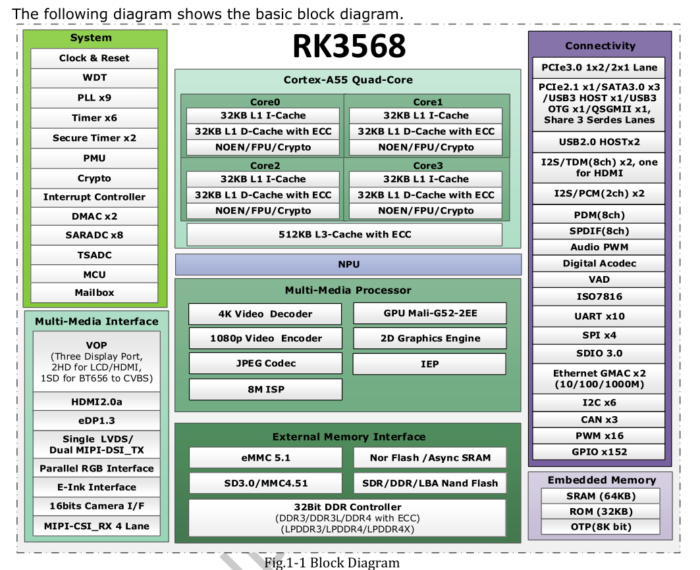

实 际 上 RK3568 一 共 有 152 个 GPIO ， 其 中 GPIO0_D2 ， GPIO0_D7 ， GPIO2_C7 ，GPIO4_D3~GPIO4_D7 是没有的，所以是 152 个 GPIO。

### GPIO电气属性

我们以 RK3568 为例，以具体 CPU 的数据手册为准。RK3568 上的 GPIO 可以设置为 3.3V，也可以设置为 1.8V。在实际编程时，高电平（3.3V 或 1.8V）用 1 表示，低电平用 0 表示。


如何确定 RK3568 的 GPIO 电平是 3.3V 还是 1.8V 呢？

看核心板原理图查找到引脚对应的 GPIO 和引脚所连接的电源域，如MIPI_CAM0_PDN_L_GPIO3_D5

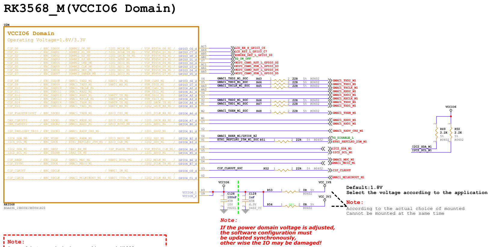

可以看到接到该GPIO的是VCCIO6

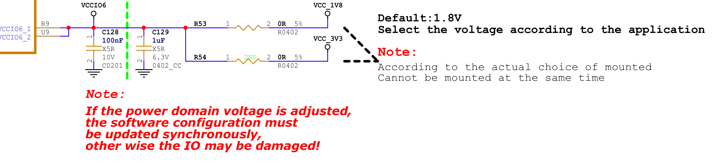

### GPIO电气特性

RK3568的TRM手册中提到

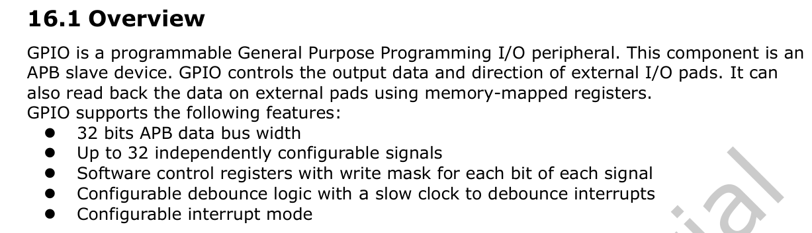

GPIO 是可编程的 GPIO，GPIO 除了 IO 电平，还有驱动强度，上拉和下拉，这些概念解释如下：

- **驱动强度（Drive Strength）**：GPIO 的驱动强度决定了**它可以提供的输出电流**。通过软件配置，您可以选择合适的驱动强度，以确保 GPIO 能够驱动所连接的外部设备或电路。

- **上拉（Pull-up）和下拉（Pull-down）**：GPIO 引脚可以通过上拉或下拉电阻来确定其默认电平状态。通过软件配置，您可以选择启用上拉或下拉电阻，以确保 **GPIO 在未连接外部设备时保持稳定的默认状态**。

- **中断（Interrupt）**：通过软件配置，您可以启用 GPIO 中断功能，以便**在 GPIO 状态发生变化时及时获得通知**。这对于实现事件驱动的应用程序非常有用，可以通过中断来处理 GPIO触发的事件。

- **多功能引脚（Multipurpose Pins）**：一些 GPIO 引脚可能具有多种功能，可以通过软件配置来选择不同的功能。例如，一个 GPIO 引脚可以配置为数字输入、数字输出、PWM 输出等。

  比如：

```c
sdmmc0 {
		/omit-if-no-ref/
		sdmmc0_bus4: sdmmc0-bus4 {
			rockchip,pins =
				/* sdmmc0_d0 */
				<1 RK_PD5 1 &pcfg_pull_up_drv_level_2>,
				/* sdmmc0_d1 */
				<1 RK_PD6 1 &pcfg_pull_up_drv_level_2>,
				/* sdmmc0_d2 */
				<1 RK_PD7 1 &pcfg_pull_up_drv_level_2>,
				/* sdmmc0_d3 */
				<2 RK_PA0 1 &pcfg_pull_up_drv_level_2>;
		};

		/omit-if-no-ref/
		sdmmc0_clk: sdmmc0-clk {
			rockchip,pins =
				/* sdmmc0_clk */
				<2 RK_PA2 1 &pcfg_pull_up_drv_level_2>;
		};
		...
	};

```

节点中描述了引脚的配置，比如说`<1 RK_PD5 1 &pcfg_pull_up_drv_level_2>`描述的是GPIO1_D5 引脚，复用模式为模式 1（复用模式可以查看 RK3568 的参考手册），GPIO 引脚的上拉驱动强度为 2。

## GPIO控制和操作

### 使用命令通过sysfs控制GPIO

首先需要底层驱动的支持，make menuconfig

```
Device Drivers
	->GPIO Support
		->/sys/class/gpio/xxxx
```

#### gpio编号计算

iTOP-RK3568 有 5 组 GPIO bank：GPIO0~GPIO4，每组又以 A0~A7, B0~B7, C0~C7, D0~D7 作为编号区分,常用以下公式计算引脚：

GPIO pin 脚计算公式：
$$
\text{pin} = \text{bank} \times 32 + \text{group} \times 8 + X
$$
以 GPIO0_PB7 为例，bank 为0，group 为B（A=0, B=1, C=2, D=3）， X为7，其中把 $\text{group} \times 8 + X$ 称为number


**举例**： GPIO0_PB7 pin 脚计算方法：

```
bank = 0;  //GPIO0_B7=> 0, bank ∈ [0,4]
group = 1; //GPIO0_B7 => 1, group ∈ {(A=0), (B=1), (C=2), (D=3)}
X = 7;     //GPIO4_D7 => 5, X ∈ [0,7]
number = group * 8 + X = 1 * 8 + 7 =15
pin = bank*32 + number= 0 * 32 + 15 = 15;
```

sysfs导出的内核对象

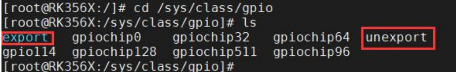

`/sys/class/gpio/export`用 于 将 GPIO 控 制 从 内 核 空 间 导 出 到 用 户 空 间 。

`/sys/class/gpio/unexport` 用于取消 GPIO 控制从内核空间到用户空间的导出。

`gpiochipX` 代表 GPIO 控制器。

> `export` 和`unexport`，他们都是**只写的**。

#### export

用于将指定编号的 GPIO 引脚导出。在使用 GPIO 引脚之前，需要将其导出，导出成功之后才能使用它。

注意 export 文件是只写文件，不能读取，将一个指定的gpio编号写入到 export 文件中即可将对应的 GPIO 引脚导出，以 GPIO0_PB7 为例（pin 计算值为 15）使用 export 文件进行导出:

```bash
echo 15 > export
```

会发现在`/sys/class/gpio` 目录下生成了一个名为 gpio15 的文件夹（gpioX，X 表示对应的编 号），该文件夹就是导出来的 GPIO 引脚对应的文件夹，用于管理、控制该 GPIO 引脚。

> 需要注意的是，并不是所有 GPIO 引脚都可以成功导出，如果对应的 GPIO 已经被导出或者在内核中被使用了，那便无法成功导出，导出失败提示：Device or resource busy
>
> 出现上图报错的原因是该 GPIO 已经被其他 GPIO 使用，需要在内核中找到使用 GPIO 的驱动，并取消该驱动才可以正常使用 GPIO。

gpio15 文件夹下分别有 `active_low`、`device`、`direction`、`edge`、`power`、`subsystem`、`uevent`、`value` 八个文件，需要关心的文件是 `active_low`、`direction`、`edge` 以及 `value` 这四个属性文件。

##### direction

**配置 GPIO 引脚为输入或输出模式**。该文件**可读、可写**，读表示查看 GPIO 当前是输入还是输出模式，写表示将 GPIO 配置为输入或输出模式；

读取或写入操作可取的值为"out"（输出模式）和"in"（输入模式）。

```bash
cat direction
echo out > direction
```

##### active_low

用于控制极性的属性文件，可读可写，默认情况下为 0

```bash
cat active_low
```

当 active_low 等于 0 时， value 值若为 1 则引脚输出高电平，value 值若为 0 则引脚输出低电平。

当 active_low 等于 1 时 ，value 值若为 0 则引脚输出高电平，value 值若为 1 则引脚输出低电平。

##### edge

控制中断的触发模式，该文件可读可写。

在配置 GPIO 引脚的中断触发模式之前，需将其设置为输入模式，四种触发模式的设置如下所示:

```bash
# 非中断引脚
echo "none" > edge
# 上升沿触发
echo "rising" > edge
# 下降沿触发
echo "falling" > edge
# 边沿触发
echo "both" > edge
```

##### value

设置高低电平，如果我们要把这个管脚设置成高电平，我们只需要给 value 设置成 1即可，反之，则设置成 0

```c
# 设置高电平
echo 1 > value
# 设置低电平
echo 0 > value
```


#### unexport

将导出的 GPIO 引脚删除。当使用完 GPIO 引脚之后，需要将导出的引脚删除，同样该文件也是只写文件、不可读，使用 unexport 文件进行删除 GPIO0_PB7：

```bash
echo 15 > unexport
```


### 使用C程序通过sysfs控制GPIO

主要思路是通过文件IO API

```c
#include <stdio.h>
#include <stdlib.h>
#include <sys/types.h>
#include <sys/stat.h>
#include <fcntl.h>
#include <unistd.h>
#include <string.h>
#include <poll.h>

int fd;              // 文件描述符
int ret;             // 返回值
char gpio_path[100]; // GPIO路径
int len;             // 字符串长度
char file_path[100]; // 文件路径
char buf[2];         // 缓冲区

struct pollfd fds[1]; // poll结构体数组

// 导出GPIO引脚
int gpio_export(char *argv)
{
    fd = open("/sys/class/gpio/export", O_WRONLY); // 打开export文件
    if (fd < 0)
    {
        printf("open /sys/class/gpio/export error \n"); // 打开文件失败
        return -1;
    }
    len = strlen(argv);         // 获取字符串长度
    ret = write(fd, argv, len); // 写入引脚号到export文件
    if (ret < 0)
    {
        printf("write /sys/class/gpio/export error \n"); // 写入失败
        return -2;
    }
    close(fd); // 关闭文件
}

// 取消导出GPIO引脚
int gpio_unexport(char *argv)
{
    fd = open("/sys/class/gpio/unexport", O_WRONLY); // 打开unexport文件
    if (fd < 0)
    {
        printf("open /sys/class/gpio/unexport error \n"); // 打开文件失败
        return -1;
    }
    len = strlen(argv);        // 获取字符串长度
    ret = write(fd, argv, len); // 写入引脚号到unexport文件
    if (ret < 0)
    {
        printf("write /sys/class/gpio/unexport error \n"); // 写入失败
        return -2;
    }
    close(fd); // 关闭文件
}

// 控制GPIO引脚的属性
int gpio_ctrl(char *arg, char *val)
{
    sprintf(file_path, "%s/%s", gpio_path, arg); // 构建属性文件的路径
    fd = open(file_path, O_WRONLY);              // 打开属性文件
    if (fd < 0)
    {
        printf("open file_path error \n"); // 打开文件失败
        return -1;
    }
    len = strlen(val);         // 获取字符串长度
    ret = write(fd, val, len); // 写入属性值到属性文件
    if (ret < 0)
    {
        printf("write file_path error\n"); // 写入失败
        return -2;
    }
    close(fd); // 关闭文件
}

// 监听GPIO引脚的中断事件
int gpio_interrupt(char *arg)
{
    sprintf(file_path, "%s/%s", gpio_path, arg); // 构建文件路径
    fd = open(file_path, O_RDONLY);              // 打开文件
    if (fd < 0)
    {
        printf("open file_path error \n"); // 打开文件失败
        return -1;
    }
    memset((void *)fds, 0, sizeof(fds)); // 清空poll结构体数组
    fds[0].fd = fd;                      // 设置poll结构体的文件描述符
    fds[0].events = POLLPRI;             // 设置poll结构体的事件类型为POLLPRI，表示有紧急数据可读

    read(fd, buf, 2); // 读取文件内容，清除中断事件

    ret = poll(fds, 1, -1); // 调用poll函数等待中断事件发生，阻塞直到事件发生
    if (ret <= 0)
    {
        printf("poll error \n"); // 调用poll失败或超时
        return -1;
    }
    if(fds[0].revents & POLLPRI)
    {
        lseek(fd, 0, SEEK_SET); // 重新定位文件指针到文件开头
        read(fd, buf, 2);       // 读取文件内容，获取中断事件的值
        buf[1] = '\0';
        printf("value is %s\n", buf); // 输出中断事件的值
    }
}

// 读取GPIO引脚的值
int gpio_read_value(char *arg)
{
    sprintf(file_path, "%s/%s", gpio_path, arg); // 构建文件路径
   fd = open(file_path, O_WRONLY); // 打开文件，以只写模式打开是一个错误，应该使用只读模式
    if (fd < 0)
    {
        printf("open file_path error\n"); // 打开文件失败
        return -1;
    }
    ret = read(fd, buf, 1); // 读取文件内容，获取引脚的值
    if (!strcmp(buf, "1"))
    {
        printf("The value is high\n"); // 引脚值为高电平
        return 1;
    }
    else if (!strcmp(buf, "0"))
    {
        printf("The value is low\n"); // 引脚值为低电平
        return 0;
    }
    return -1; // 这里应该返回读取到的引脚值（0或1），而不是返回固定的-1
    close(fd); // 关闭文件（这行代码无法执行到，应该放在read之前）
}

int main(int argc, char *argv[]) // 主函数
{
    int value;
    sprintf(gpio_path, "/sys/class/gpio/gpio%s", argv[1]); // 构建GPIO路径
    if (access(gpio_path, F_OK))                            // 检查GPIO路径是否存在
    {
        gpio_export(argv[1]); // 不存在则导出GPIO引脚
    }
    else
    {
        gpio_unexport(argv[1]); // 存在则取消导出GPIO引脚
    }

    gpio_ctrl("direction", "in"); // 设置GPIO引脚为输入模式
    gpio_ctrl("edge", "both");    // 设置GPIO引脚的中断触发方式为上升沿和下降沿
    gpio_interrupt("value");      // 监听GPIO引脚的中断事件

    gpio_unexport(argv[1]); // 最后取消导出GPIO引脚

    return 0; // 返回0表示程序正常退出
}
```


### 通过IO命令操作寄存器控制GPIO

#### IO命令

io 命令是一个用于 Linux 系统的命令行工具，用于读取和写入指定 I/O 端口的值。它主要用于与硬件设备进行低级别的交互和调试，在内核阶段读写寄存器。

该命令的语法如下：

```
io [选项] [地址] [操作] [数据]
```

- 选项
  - `-b`：以字节为单位进行 I/O 操作（默认为字）。
  - `-w`：以字为单位进行 I/O 操作。
  - `-l`：以双字为单位进行 I/O 操作。
- 地址：**要读取或写入的 I/O 端口的十六进制值**
- 操作：
  - `-r`：读取 I/O 端口的值。
  - `-w`：写入数据到 I/O 端口
- 数据：**要写入 I/O 端口的十六进制值**。

例子：

1. 读取 I/O 端口的值：
   `io -b -r 0x80`
   这将以字节为单位读取 I/O 端口 0x80 的值，并将其显示在终端上。
2. 向 I/O 端口写入数据：
   `io -b -w 0x80 0xAB`
   这将向 I/O 端口 0x80 写入十六进制值 0xAB。
3. 以字为单位进行读取：
   `io -w -r 0x1000`
   这将以字为单位读取 I/O 端口 0x1000 的值
4. 以双字为单位进行写入：
   `io -l -w 0x2000 0xDEADBEEF`
   这将以双字为单位向 I/O 端口 0x2000 写入十六进制值 0xDEADBEEF


#### LED引脚寄存器查找

控制 LED 灯的 GPIO 为 GPIO0_B7，我们需要对 GPIO 进行配置，一般情况下需要对 GPIO 的**复用寄存器**，**方向寄存器**，**数据寄存器**进行配置。

##### 复用寄存器

RK3568 TRM-Part1 GPIO Interface Description中可以看出

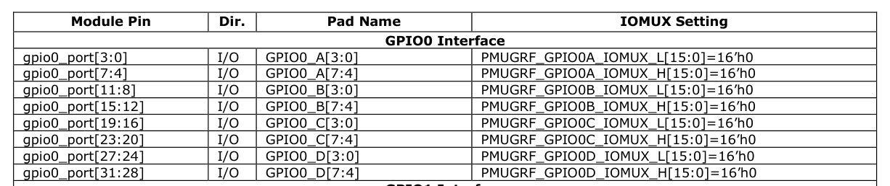

PMU_GRF Register Description如下

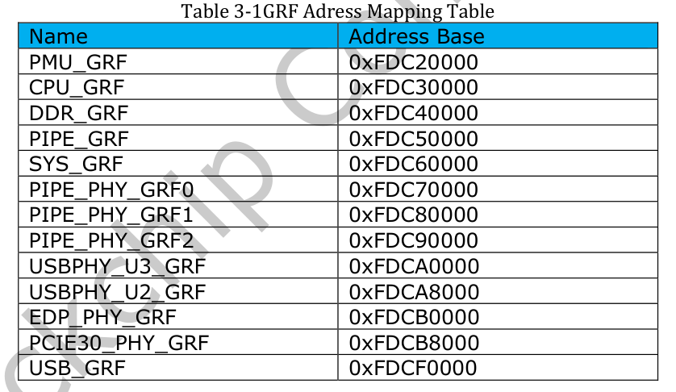

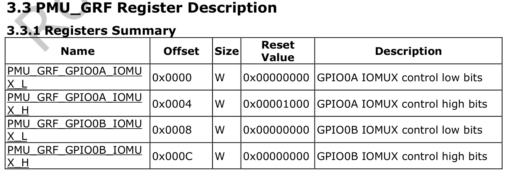

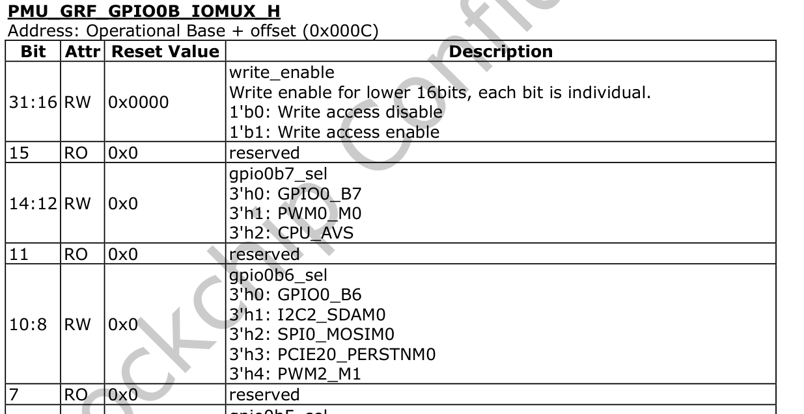

所以复用寄存器地址=基地址+偏移地址=0xFDC2000C 。

使用 io 命令查看此寄存器的地址：`io -r -4 0xFDC2000C`

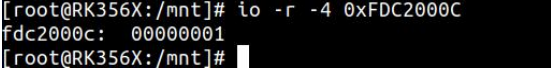

寄存器值为 00000001，[14:12]位为 000，所以默认设置的为 gpio 功能。


##### 方向寄存器

RK3568 TRM-Part1 GPIO Interface Description中可以看出，方向寄存器应为GPIO_SWPORT_DDR_L或GPIO_SWPORT_DDR_H

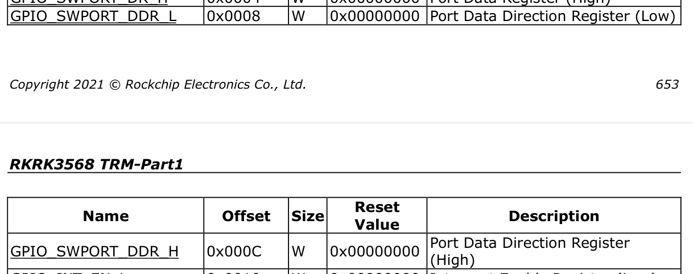

GPIO 有四组 GPIO，分别是 GPIOA，GPIOB，GPIOC，GPIOD。每组又以 A0~A7, B0~B7, C0~C7, D0~D7 作为编号区分。GPIO0B7 在 GPIO_SWPORT_DDR_L 上所以，方向寄存器的偏移地址为 0x0008。

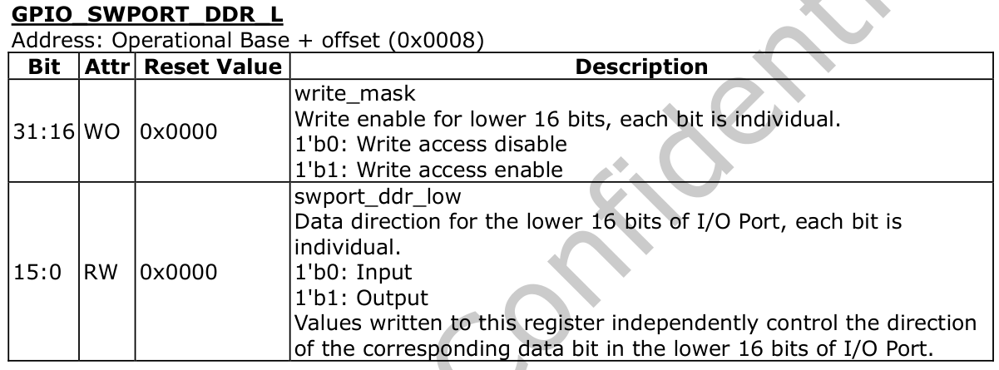

[31:16]位属性是 WO，也就是只可写入。这[31:16]位是写标志位，是低 16 位的写使能。如果低 16 位中某一位要设置输入输入输出，则对应高位写标志也应该设置为 1。

 [15：0] 是数据方向控制寄存器低位，如果要设置某个 GPIO 为输出，则对应位置 1，如果要设置某个 GPIO 为输入，则对应位置 0。那么 GPIO0 B7 ，我们要设置第 15 位为输入还是输出，那么对应的[31:16]位写使能也要置 1。

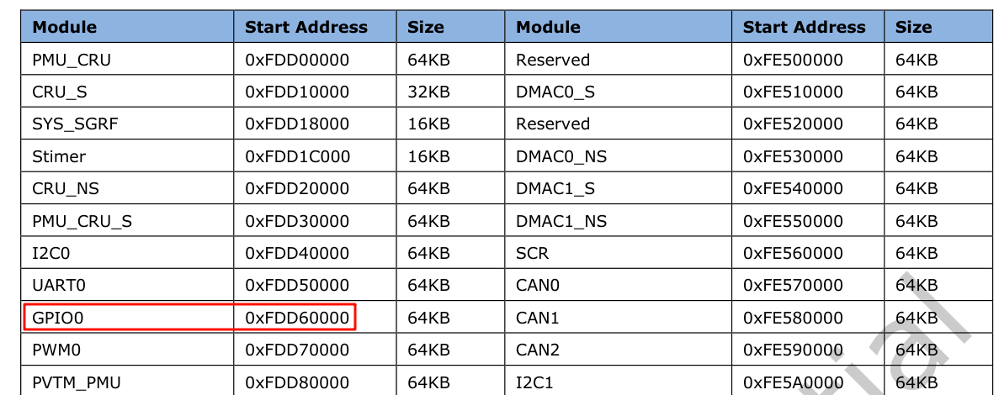

GPIO0 的基地址为 0xFDD60000。因此方向寄存器的地址=基地址+偏移地址=0xFDD60000+0x0008=0xFDD60008

##### 数据寄存器

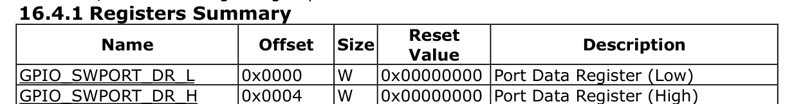

所以数据寄存器的地址为基地址+偏移地址=0xFDD60000。

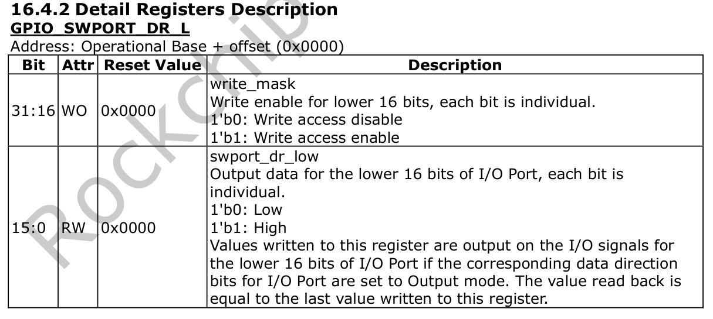

上图的方法和在分析方向寄存器的方法同理，由上图可知，如果要控制第 15 位为高电平（置 1），还需要设置 31 位为 1，那么点亮灯，需要向数据寄存器写入 0x8000c040

##### 总结

- 复用关系寄存器的基地址为 0xFDC20000 ，偏移地址为 000C ，所以要操作的地址为基地址+偏移地址=0xFDC2000C
- GPIO 的基地址为 0xFDD60000，偏移地址为 0x0008，所以方向寄存器要操作的地址为基地址+偏移地址=0xFDD60008，我们要给方向寄存器写入 0x80000044 设置为输出。
- GPIO 的基地址为 0xFDD60000，偏移地址为 0x0000，所以数据寄存器要操作的地址为基地址+偏移地址=0xFDD60000
- 默认的数据寄存器的值：0x8000c040 亮灯，0x80004040 灭灯

```bash
# 默认 GPIO0_B7 是 GPIO 模式，然后输入以下命令将方向寄存器设置为输出。
io -w -4 0xFDD60008 0x80008044
# 接下来设置 GPIO 是输出高电平还是低电平，首先查看数据寄存器的值，输入以下命令：
io -r -4 0xFDD60000
# 给数据寄存器写入 0x80008040 输出高电平，灯亮。
io -w -4 0xFDD60000 0x8000c040
# 给数据寄存器写入 0x80008040 输出高电平，灯灭。
io -w -4 0xFDD60000 0x80004040
```


### 通过mem设备和mmap控制GPIO

通过打开`/dev/mem` 设备文件，并将其映射到用户空间的内存中，我们可以直接读写物理内存地址，从而实现对 GPIO 寄存器的控制。这种方法相对于 IO 命令更加灵活，可以使用更高级的编程语言（如 C/C++）来编写控制逻辑。

#### Linux系统用户态访问内核态的方式

1. **通过 read/write/ioctl**：使用这种方式，用户态程序可以通过读写文件描述符或使用 ioctl 系统调用与内核进行通信。例如，可以通过读写特定文件描述符来控制设备或获取设备状态。

2. **通过 sysfs 虚拟文件系统**：sysfs 是一种以文件的形式表示设备和内核信息的虚拟文件系统。通过在 sysfs 中的特定路径下读写文件，用户态程序可以与内核进行交互，例如控制 GPIO 引脚或获取系统信息。
3. **通过内存映射**：内存映射是将用户空间的一段内存区域映射到内核空间的一种机制。通过内存映射，用户态程序可以直接修改内存区域的内容，从而与内核进行通信。这种方式可以实现高效的数据传输和共享。
4. **通过 Netlink**：Netlink 是 Linux 内核提供的一种通信机制，用于用户态程序与内核之间的双向通信。通过创建 Netlink 套接字，用户态程序可以与内核进行交互，发送请求、接收事件通知等。这种方式适用于需要与内核进行复杂交互的场景，例如配置系统参数或发送命令。

#### `/dev/mem` 设备

`/dev/mem` 是 Linux 系统中的一个虚拟设备，通常与 mmap 结合使用，可以**将设备的物理内存映射到用户态**，以实现用户空间对内核态的直接访问。无论是标准 Linux 系统还是嵌入式Linux 系统，都支持使用`/dev/mem` 设备。

直接访问内核空间是一项潜在危险的操作，因此只有 root 用户才能访问`/dev/mem`设备。此外有些系统可能需要单独启动/dev/mem 设备的功能。

```bash
Device Drivers --->
	Character devices--->
		[*] /dev/mem virtual device support
```

IO 命令实际上就是基于`/dev/mem`设备实现的。如果 Linux 内核源码没有配置支持`/dev/mem`，IO 命令是不能使用的。

使用 `/dev/mem` 设备需要 **root 权限**，并且必须**谨慎操作**，因为直接访问物理内存（内核空间）是一项潜在的危险操作，可能导致系统崩溃或数据损坏。

以下是使用 `/dev/mem` 的基本步骤：

**步骤一：打开 `/dev/mem` 文件**

使用 `open()` 函数以适当的权限和模式打开 `/dev/mem`，获取文件描述符。

```c
int fd = 0;
fd = open("/dev/mem", O_RDWR | O_NDELAY);  /* 读写权限，非阻塞模式 */
```

- **访问权限选项**：
  - `O_RDONLY`：只读
  - `O_WRONLY`：只写
  - `O_RDWR`：读写
- **阻塞模式选项**：
  - 默认为阻塞
  - `O_NDELAY` 或 `O_NONBLOCK`：非阻塞

> 可以根据实际需求选择适当的访问权限和阻塞方式

**步骤二：映射物理内存到用户空间**

使用 `mmap()` 将目标物理地址映射到进程的虚拟地址空间：

```c
char *mmap_addr = NULL;
mmap_addr = (char *)mmap(
    NULL,                // 让内核选择映射地址
    MMAP_SIZE,           // 映射区域大小（字节）
    PROT_READ | PROT_WRITE,  // 读写权限
    MAP_SHARED,          // 共享映射（对其他进程可见）
    fd,                  // /dev/mem 的文件描述符
    MMAP_ADDR            // 要映射的物理地址（需页对齐）
);
```

- `MMAP_ADDR`：目标物理地址（通常需按页对齐，如 4KB 对齐）
- `MMAP_SIZE`：映射长度（建议至少一个内存页，如 4096 字节）
- 若 `mmap()` 返回 `MAP_FAILED`，表示映射失败，应检查错误码（`errno`）

**步骤三：读写映射的内存（寄存器操作）**

通过返回的指针直接访问硬件寄存器或物理内存：

```c
int a = 0;

*(int *)mmap_addr = 0xff;   // 写操作：向映射地址写入 0xff
a = *(int *)mmap_addr;      // 读操作：从映射地址读取值到变量 a
```

- 指针类型可根据寄存器宽度调整（如 `uint32_t*`、`volatile uint8_t*` 等）

- 建议使用 `volatile` 修饰符防止编译器优化导致访问异常：


```c
volatile uint32_t *reg = (volatile uint32_t *)mmap_addr;
*reg = 0x12345678;
```

**注意事项**

1. **权限要求**：必须以 root 用户运行，或具备 `CAP_SYS_RAWIO` 能力。
2. **地址对齐**：`mmap()` 要求偏移量（即物理地址）是页大小（通常 4096）的整数倍。
3. **安全风险**：错误的读写可能引发系统崩溃、硬件异常或安全漏洞。
4. **资源释放**：使用完毕后应调用 `munmap()` 解除映射，并 `close()` 文件描述符。

#### mmap()函数


#### `mmap()` 函数总结

**功能**：将文件或设备（如 `/dev/mem`）映射到进程的虚拟地址空间，实现直接内存访问。

**函数原型**：

```c
void *mmap(void *start, size_t length, int prot, int flags, int fd, off_t offset);
```

**参数说明**：

| 参数     | 说明                                                         |
| -------- | ------------------------------------------------------------ |
| `start`  | 建议映射的起始地址。通常设为 `NULL`，由内核自动选择。        |
| `length` | 要映射的字节数。                                             |
| `prot`   | 内存保护标志（可组合）： • `PROT_READ`：可读 • `PROT_WRITE`：可写 • `PROT_EXEC`：可执行 • `PROT_NONE`：不可访问 |
| `flags`  | 映射类型（必须指定其一）： • `MAP_SHARED`：修改对其他进程可见，会写回文件/设备 • `MAP_PRIVATE`：写时复制，修改不共享 • `MAP_FIXED`：强制使用 `start` 地址（**不推荐**） |
| `fd`     | 文件描述符（由 `open()` 返回），若映射匿名内存可设为 `-1`（需配合 `MAP_ANONYMOUS`）。 |
| `offset` | 文件/设备中的偏移量，**必须是系统页大小（如 4096）的整数倍**。 |

**返回值**：

- 成功：返回指向映射区域的指针（`void*`）
- 失败：返回 `MAP_FAILED`（即 `(void*) -1`），并设置 `errno`

**典型用途**：

- 访问硬件寄存器（通过 `/dev/mem`）
- 高效文件 I/O（避免 `read`/`write` 系统调用开销）
- 进程间共享内存（配合 `MAP_SHARED`）

**注意事项**：

- 使用完毕应调用 `munmap()` 释放映射。
- `offset` 和映射长度需注意对齐和边界。
- 操作物理内存需 root 权限，存在安全风险。


#### 示例

```c
#include <stdio.h>
#include <stdlib.h>
#include <sys/types.h>
#include <sys/stat.h>
#include <fcntl.h>
#include <unistd.h>
#include <string.h>
#include <sys/mman.h>

#define GPIO_REG_BASE 0xFDD60000
#define GPIO_SWPORT_DDR_L_OFFSET 0x0008
#define GPIO_SWPORT_DR_L_OFFSET 0x0000
#define SIZE_MAP 0x1000

// 打开LED灯
void LED_ON(unsigned char *base)
{
    // 设置LED灯的方向为输出
    *(volatile unsigned int *)(base + GPIO_SWPORT_DDR_L_OFFSET) = 0x80008044;
    // 将LED灯打开
    *(volatile unsigned int *)(base + GPIO_SWPORT_DR_L_OFFSET) = 0x80008040;
}

// 关闭LED灯
void LED_OFF(unsigned char *base)
{
    // 设置LED灯的方向为输出
    *(volatile unsigned int *)(base + GPIO_SWPORT_DDR_L_OFFSET) = 0x80008044;
    // 将LED灯关闭
    *(volatile unsigned int *)(base + GPIO_SWPORT_DR_L_OFFSET) = 0x80000040;
}

int main(int argc, char *argv[])
{
    int fd;
    unsigned char *map_base;

    // 打开/dev/mem设备
    fd = open("/dev/mem", O_RDWR);
    if (fd < 0)
    {
        printf("open /dev/mem error \n");
        return -1;
    }

    // 将物理地址映射到用户空间
    map_base = (unsigned char *)mmap(NULL, SIZE_MAP, PROT_READ | PROT_WRITE, MAP_SHARED, fd, GPIO_REG_BASE);
    if (map_base == MAP_FAILED)
    {
        printf("map_base error \n");
        return -2;
    }

    while (1)
    {
        // 打开LED灯
        LED_ON(map_base);
        // 等待1秒
        usleep(1000000);
        // 关闭LED灯
        LED_OFF(map_base);
        // 等待1秒
        usleep(1000000);
    }

    // 解除映射
    munmap(map_base, SIZE_MAP);

    // 关闭文件描述符
    close(fd);

    return 0; // 返回0表示程序正常退出
}
```


## GPIO调试

### debugfs

debugfs 是 Linux 内核提供的一个调试文件系统，可以用于查看和调试内核中的各种信息，包括 GPIO 的使用情况。通过挂载 debugfs 文件系统，并查看`/sys/kernel/debug/`目录下的相关文件，可以获取 GPIO 的状态，配置和其他调试信息，如图所示

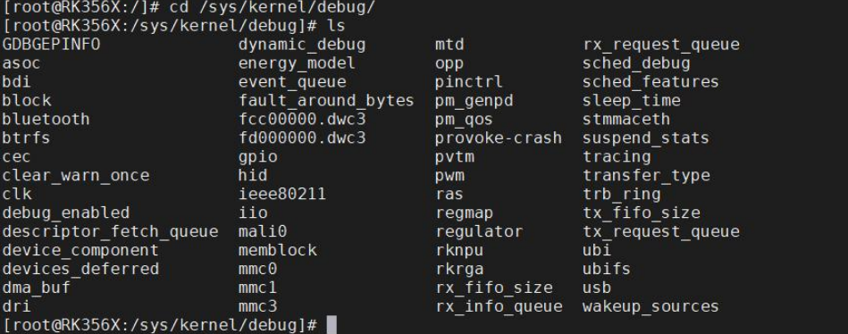

如果上图目录`/sys/kernel/debug` 目录下没有文件，需要在 Linux 内核源码配置 debugfs，勾选`Debug Filesystem`配置好之后，重新编译内核源码，烧写内核镜像。

如果没有 debugfs，可以使用以下命令进行挂载:

```bash
mount -t debugfs none /sys/kernel/debug/
```

如果有 debugfs，可以使用以下命令查看 GPIO 的信息。

```bash
cat /sys/kernel/debug/gpio
```


进入`/sys/kernel/debug/pinctrl` 目录时，你可以获取有关 GPIO 控制器的调试信息。在该目录下，通常会有以下文件和目录：

1. `/sys/kernel/debug/pinctrl/*/pinmux-pins`：这些文件列出了每个 GPIO 引脚的引脚复用配置。可以查看每个引脚的功能模式、引脚复用选择以及其他相关的配置信息。我们进入到`/sys/kernel/debug/pinctrl/pinctrl-rockchip-pinctrl/`下面，输入“cat pinmux-pins”，如下图所示：

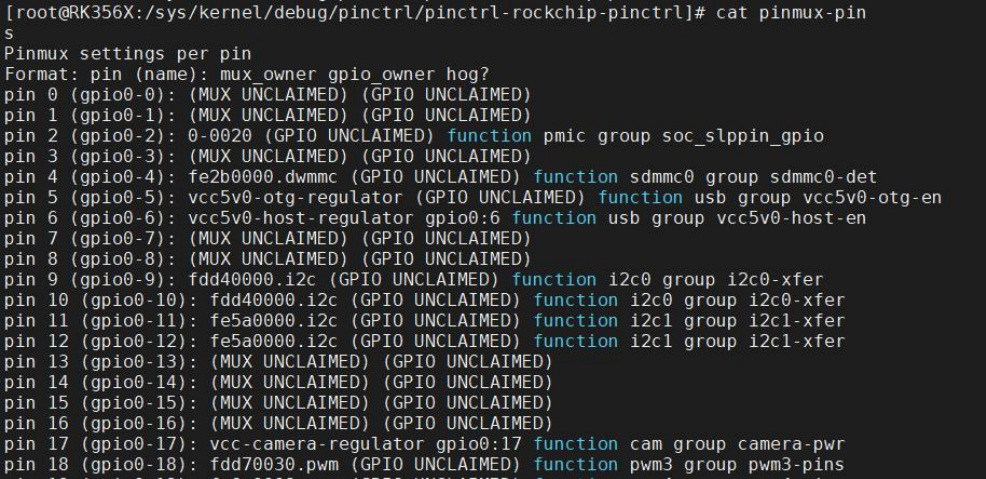


2. `/sys/kernel/debug/pinctrl/*/pins`：这些文件列出了 GPIO 的引脚编号，可以查看 GPIO 编号。我们进入到`/sys/kernel/debug/pinctrl/pinctrl-rockchip-pinctrl/`下面，输入“cat pins”，如下图所示：

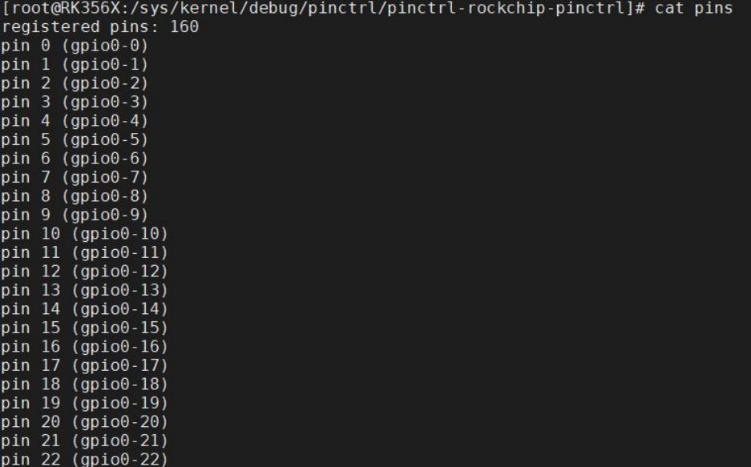

3. `/sys/kernel/debug/pinctrl/*/gpio-ranges`：这些文件列出了每个 GPIO 控制器支持的 GPIO 范围。
   你可以查看GPIO 编号的范围和对应的控制器名称 。我们进入到`/sys/kernel/debug/pinctrl/pinctrl-rockchip-pinctrl/`下面，输入“cat gpio-ranges”，如下图所示：

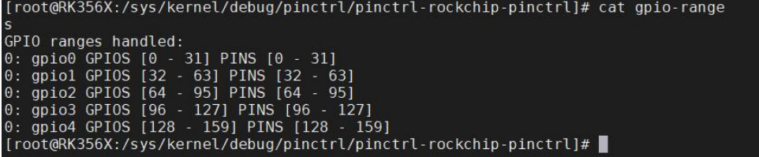

4. `/sys/kernel/debug/pinctrl/*/pinmux-functions`：这些文件列出了每个功能模式的名称以及与之关联的 GPIO 引脚。你可以查看各个功能模式的名称和对应的引脚列表。我们进入到`/sys/kernel/debug/pinctrl/pinctrl-rockchip-pinctrl/`下面，输入“cat pinmux-functions”，如下图所示：

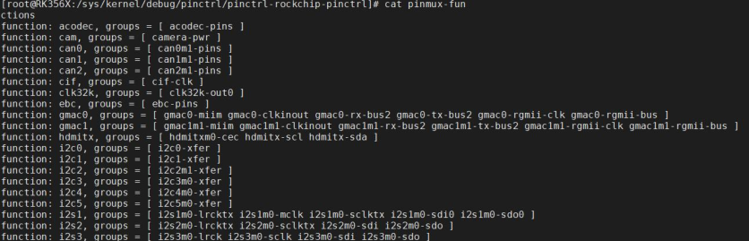

5. `/sys/kernel/debug/pinctrl/*/pingroups`：该路径提供有关用于配置和控制系统上的 GPIO 引脚的引脚组的信息。我们进入到`/sys/kernel/debug/pinctrl/pinctrl-rockchip-pinctrl/`下面，输入“cat pingroups”，如下图所示：

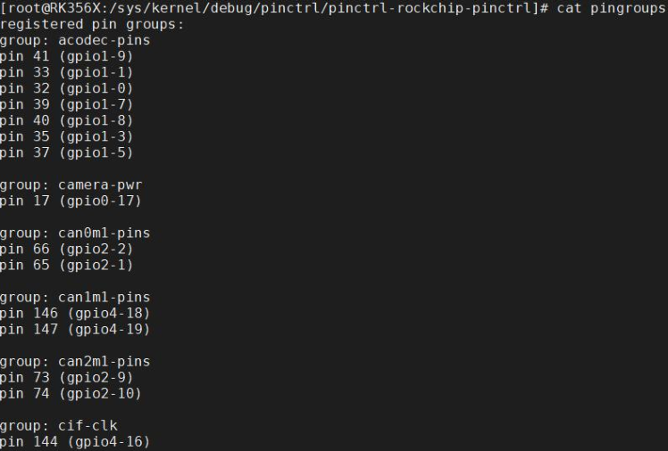

6. `/sys/kernel/debug/pinctrl/*/pinconf-pins`：这些文件包含了 GPIO 引脚的配置信息，如输入/输出模式、上拉/下拉设置等。你可以查看和修改 GPIO 的电气属性，以便进行 GPIO 的调试和配置。我们进入到`/sys/kernel/debug/pinctrl/pinctrl-rockchip-pinctrl/`下面，输入“cat pinconf-pins”，如下图所示：

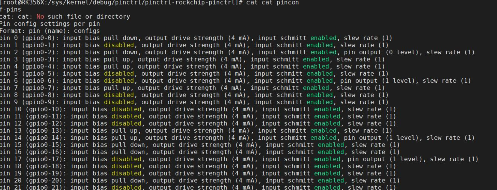


## GPIO子系统API


在目前的 Linux 内核主线中，GPIO（通用输入/输出）子系统存在两个版本，这里将两个版本区分为新版本和旧版本。新版本 GPIO 子系统接口是基于描述符（descriptor-based）来实现的，而旧版本的 GPIO 子系统接口是基于整数（integer-based）来实现的，在 Linux 内核中为了保持向下的兼容性，旧版本的接口在最新的内核版本中仍然得到支持，而随着时间的推移，新版本的 GPIO 子系统接口会越来越完善，最终完全取代旧版本。

新的 GPIO 子系统接口需要与与设备树（Device Tree）结合使用。使用设备树和新的 GPIO接口可以更加灵活地配置和管理系统中的 GPIO 资源，提供了更好的可扩展性和可移植性。所以**如果没有设备树，就无法使用新的 GPIO 接口**。

一个明显的区别是新的 GPIO 子系统接口使用了以`gpiod_`作为前缀的函数命名约定，而旧的 GPIO 子系统接口使用了以`gpio_`作为前缀的函数命名约定。

### gpio_desc 结构体

```c
struct gpio_desc {
	struct gpio_device	*gdev; // GPIO 设备结构体
	unsigned long		flags; // 标志位，用于表示不同的属性
/* flag symbols are bit numbers */
#define FLAG_REQUESTED	0
#define FLAG_IS_OUT	1
#define FLAG_EXPORT	2	/* protected by sysfs_lock */
#define FLAG_SYSFS	3	/* exported via /sys/class/gpio/control */
#define FLAG_ACTIVE_LOW	6	/* value has active low */
#define FLAG_OPEN_DRAIN	7	/* Gpio is open drain type */
#define FLAG_OPEN_SOURCE 8	/* Gpio is open source type */
#define FLAG_USED_AS_IRQ 9	/* GPIO is connected to an IRQ */
#define FLAG_IRQ_IS_ENABLED 10	/* GPIO is connected to an enabled IRQ */
#define FLAG_IS_HOGGED	11	/* GPIO is hogged */
#define FLAG_TRANSITORY 12	/* GPIO may lose value in sleep or reset */
#define FLAG_PULL_UP    13	/* GPIO has pull up enabled */
#define FLAG_PULL_DOWN  14	/* GPIO has pull down enabled */
#define FLAG_BIAS_DISABLE    15	/* GPIO has pull disabled */
#define FLAG_EDGE_RISING     16	/* GPIO CDEV detects rising edge events */
#define FLAG_EDGE_FALLING    17	/* GPIO CDEV detects falling edge events */

	/* Connection label */
	const char		*label; // 表示 GPIO 的标签或名称
	/* Name of the GPIO */
	const char		*name; // GPIO 的名称
#ifdef CONFIG_OF_DYNAMIC
	struct device_node	*hog;
#endif
#ifdef CONFIG_GPIO_CDEV
	/* debounce period in microseconds */
	unsigned int		debounce_period_us;
#endif
};

```

### gpio_device 结构体

```c
/**
 * struct gpio_device - internal state container for GPIO devices
 * @id: numerical ID number for the GPIO chip
 * @dev: the GPIO device struct
 * @chrdev: character device for the GPIO device
 * @mockdev: class device used by the deprecated sysfs interface (may be
 * NULL)
 * @owner: helps prevent removal of modules exporting active GPIOs
 * @chip: pointer to the corresponding gpiochip, holding static
 * data for this device
 * @descs: array of ngpio descriptors.
 * @ngpio: the number of GPIO lines on this GPIO device, equal to the size
 * of the @descs array.
 * @base: GPIO base in the DEPRECATED global Linux GPIO numberspace, assigned
 * at device creation time.
 * @label: a descriptive name for the GPIO device, such as the part number
 * or name of the IP component in a System on Chip.
 * @data: per-instance data assigned by the driver
 * @list: links gpio_device:s together for traversal
 *
 * This state container holds most of the runtime variable data
 * for a GPIO device and can hold references and live on after the
 * GPIO chip has been removed, if it is still being used from
 * userspace.
 */
struct gpio_device {
	int			id; // GPIO 设备 ID。每个 GPIO 设备可以有一个唯一的 ID
	struct device		dev;// 对应的设备结构体指针
	struct cdev		chrdev;// 字符设备结构体，用于实现 GPIO 设备的字符设备接口
	struct device		*mockdev;// 模拟设备结构体指针，用于表示 GPIO 设备的模拟设备结构体
	struct module		*owner;// 拥有该 GPIO 设备的内核模块指针
	struct gpio_chip	*chip;// 对应的 GPIO 芯片结构体指针，示与 GPIO 设备关联的 GPIO 芯片（GPIO 控制器）结构体
	struct gpio_desc	*descs;// GPIO 描述符数组指针。每个 GPIO 描述符用于描述 GPIO 的属性和状态
	int			base;// GPIO 编号的起始值
	u16			ngpio;// GPIO 的数量
	const char		*label;// GPIO 设备的标签
	void			*data;// 与 GPIO 设备相关的数据指针
	struct list_head        list;// 用于将 GPIO 设备结构体连接到链表中
	struct blocking_notifier_head notifier;

#ifdef CONFIG_PINCTRL
	/*
	 * If CONFIG_PINCTRL is enabled, then gpio controllers can optionally
	 * describe the actual pin range which they serve in an SoC. This
	 * information would be used by pinctrl subsystem to configure
	 * corresponding pins for gpio usage.
	 */
    /*
    * 如果启用了 CONFIG_PINCTRL 选项，GPIO 控制器可以选择描述它们在 SoC 中服务的实际引脚范围。
	* 此信息将由 pinctrl 子系统用于配置相应的 GPIO 引脚。
	*/
	struct list_head pin_ranges;// 描述 GPIO 控制器引脚范围的链表
#endif
};

```

在上面一系列的参数中，要重点关注的是 `struct gpio_chip *chip` 这一结构体，表示与 GPIO 设备关联的 GPIO 芯片（GPIO 控制器）结构体。

### gpio_chip结构体

```c
struct gpio_chip {
	const char		*label;// GPIO 芯片标签
	struct gpio_device	*gpiodev;// GPIO 设备
	struct device		*parent;// 父设备指针
	struct module		*owner;// 拥有者模块指针

	int			(*request)(struct gpio_chip *gc,
						unsigned int offset);// 请求 GPIO
	void			(*free)(struct gpio_chip *gc,
						unsigned int offset);// 释放 GPIO
	int			(*get_direction)(struct gpio_chip *gc,
						unsigned int offset);// 获取 GPIO 方向
	int			(*direction_input)(struct gpio_chip *gc,
						unsigned int offset);// 设置 GPIO 为输入
	int			(*direction_output)(struct gpio_chip *gc,
						unsigned int offset, int value);// 设置 GPIO 为输出
	int			(*get)(struct gpio_chip *gc,
						unsigned int offset);// 获取 GPIO 值
	int			(*get_multiple)(struct gpio_chip *gc,
						unsigned long *mask,
						unsigned long *bits);// 获取多个 GPIO 的值
	void			(*set)(struct gpio_chip *gc,
						unsigned int offset, int value);// 设置 GPIO 值
	void			(*set_multiple)(struct gpio_chip *gc,
						unsigned long *mask,
						unsigned long *bits);// 设置多个 GPIO
	int			(*set_config)(struct gpio_chip *gc,
					      unsigned int offset,
					      unsigned long config);// 设置 GPIO 配置
	int			(*to_irq)(struct gpio_chip *gc,
						unsigned int offset);// 将 GPIO 转换为中断

	void			(*dbg_show)(struct seq_file *s,
						struct gpio_chip *gc);// 在调试信息中显示 GPIO

	int			(*init_valid_mask)(struct gpio_chip *gc,
						   unsigned long *valid_mask,
						   unsigned int ngpios);

	int			(*add_pin_ranges)(struct gpio_chip *gc);

	int			base;// GPIO 编号的基准值
	u16			ngpio;// GPIO 的数量
	const char		*const *names;// GPIO 的名称数组
	bool			can_sleep;

#if IS_ENABLED(CONFIG_GPIO_GENERIC)
	unsigned long (*read_reg)(void __iomem *reg);
	void (*write_reg)(void __iomem *reg, unsigned long data);
	bool be_bits;
	void __iomem *reg_dat;
	void __iomem *reg_set;
	void __iomem *reg_clr;
	void __iomem *reg_dir_out;
	void __iomem *reg_dir_in;
	bool bgpio_dir_unreadable;
	int bgpio_bits;
	spinlock_t bgpio_lock;
	unsigned long bgpio_data;
	unsigned long bgpio_dir;
#endif /* CONFIG_GPIO_GENERIC */

#ifdef CONFIG_GPIOLIB_IRQCHIP
	/*
	 * With CONFIG_GPIOLIB_IRQCHIP we get an irqchip inside the gpiolib
	 * to handle IRQs for most practical cases.
	 */

	/**
	 * @irq:
	 *
	 * Integrates interrupt chip functionality with the GPIO chip. Can be
	 * used to handle IRQs for most practical cases.
	 */
	struct gpio_irq_chip irq;
#endif /* CONFIG_GPIOLIB_IRQCHIP */

	/**
	 * @valid_mask:
	 *
	 * If not %NULL holds bitmask of GPIOs which are valid to be used
	 * from the chip.
	 */
	unsigned long *valid_mask;

#if defined(CONFIG_OF_GPIO)
	/*
	 * If CONFIG_OF is enabled, then all GPIO controllers described in the
	 * device tree automatically may have an OF translation
	 */

	/**
	 * @of_node:
	 *
	 * Pointer to a device tree node representing this GPIO controller.
	 */
	struct device_node *of_node;

	/**
	 * @of_gpio_n_cells:
	 *
	 * Number of cells used to form the GPIO specifier.
	 */
	unsigned int of_gpio_n_cells;

	/**
	 * @of_xlate:
	 *
	 * Callback to translate a device tree GPIO specifier into a chip-
	 * relative GPIO number and flags.
	 */
	int (*of_xlate)(struct gpio_chip *gc,
			const struct of_phandle_args *gpiospec, u32 *flags);
#endif /* CONFIG_OF_GPIO */

	ANDROID_KABI_RESERVE(1);
	ANDROID_KABI_RESERVE(2);
};

```

`struct gpio_chip *chip` 这一结构体用于描述 GPIO 芯片的属性和操作函数，可以通过函数指针调用相应的函数来请求、释放、设置、获取 GPIO 的状态和数值等操作，从而实现对 GPIO 的控制和管理，需要注意的是这个结构体中的一系列函数都不需要我们来填充，这些工作都是由芯片原厂工程师来完成的，我们只需要学会新 gpio 子系统相应 API 函数的使用即可。


### 获取单个GPIO描述

#### gpiod_get()

**函数原型**

```c
struct gpio_desc *__must_check gpiod_get(
    struct device *dev,
    const char *con_id,
    enum gpiod_flags flags
);
```

**头文件**

```c
#include <linux/gpio/consumer.h>
```

**功能**

根据设备和连接标识符（con_id）获取一个必需的 GPIO 描述符，并按指定标志配置其模式。

**参数**

- **`dev`**：指向关联设备的 `struct device` 指针。
- **`con_id`**：连接标识符（connection ID），通常在设备树（Device Tree）中定义，用于匹配具体的 GPIO。
- **`flags`**：GPIO 配置标志，类型为 `enum gpiod_flags`，常用值包括：
  - `GPIOD_IN` 或 `GPIOD_INPUT`：配置为输入。
  - `GPIOD_OUT_LOW` / `GPIOD_OUT_HIGH`（旧版用 `GPIOD_OUTPUT`）：配置为输出，默认初始电平为低/高。
  - `GPIOD_ACTIVE_LOW`：逻辑高对应物理低电平（反相）。
  - `GPIOD_OPEN_DRAIN`：开漏输出。
  - `GPIOD_OPEN_SOURCE`：开源输出。

> ⚠️ 注意：现代内核推荐使用 `GPIOD_OUT_LOW` / `GPIOD_OUT_HIGH` 替代 `GPIOD_OUTPUT`，因为后者不指定初始电平。

**示例设备树片段**

```c
/ {
    my_device: my-device@0 {
        compatible = "myvendor,my-device";
        /* 定义3个GPIO，分别对应 index 0, 1, 2 */
        my-gpios = <&gpio1 5 GPIO_ACTIVE_HIGH>,   // index 0
                   <&gpio1 6 GPIO_ACTIVE_LOW>,    // index 1
                   <&gpio2 12 GPIO_ACTIVE_HIGH>;  // index 2
    };
};
```

**返回值**

- 成功：返回指向 `struct gpio_desc` 的指针。
- 失败：返回 `ERR_PTR()` 编码的错误指针（如 `-ENOENT`, `-EPROBE_DEFER` 等），**不是 NULL**。

> ✅ 使用建议：应使用 `IS_ERR()` 判断返回值是否出错，而非检查 `NULL`。

#### gpiod_get_index()

**函数原型**

```c
struct gpio_desc *__must_check gpiod_get_index(
    struct device *dev,
    const char *con_id,
    unsigned int idx,
    enum gpiod_flags flags
);
```

**功能**

获取与设备、连接标识符及索引 `idx` 对应的 GPIO 描述符。适用于一个 `con_id` 对应多个 GPIO（如 "leds", "buttons" 等数组型 GPIO 组）。

**参数**

- **`idx`**：GPIO 在该连接中的索引（从 0 开始）。

**返回值**

- 同 `gpiod_get`：成功返回 `gpio_desc*`，失败返回错误指针。

#### gpiod_get_optional()

函数原型

```c
struct gpio_desc *__must_check gpiod_get_optional(
    struct device *dev,
    const char *con_id,
    enum gpiod_flags flags
);
```

**功能**

尝试获取指定的 GPIO，但如果设备树中未定义该 GPIO，则**不视为错误**，而是返回 `NULL`。

**适用场景**

用于可选 GPIO（例如某些硬件版本有，某些没有）。

**返回值**

- 成功获取：返回 `struct gpio_desc*`。
- 未定义或不存在：返回 `NULL`。
- 其他错误（如 defer）：返回错误指针（需用 `IS_ERR()` 检查）。

> ✅ 安全使用方式：
>
> ```c
> desc = gpiod_get_optional(dev, "reset", GPIOD_OUT_HIGH);
> if (IS_ERR(desc))
>  return PTR_ERR(desc);
> if (!desc)
>  dev_info(dev, "No optional reset GPIO\n");
> ```

#### gpiod_get_index_optional()

**函数原型**

```c
struct gpio_desc *__must_check gpiod_get_index_optional(
    struct device *dev,
    const char *con_id,
    unsigned int idx,
    enum gpiod_flags flags
);
```

**功能**

`gpiod_get_index` 的可选版本：若指定索引的 GPIO 不存在，不报错，返回 `NULL`。

**返回值**

- 存在且成功：`gpio_desc*`
- 不存在：`NULL`
- 其他错误：错误指针（需 `IS_ERR()` 判断）

#### gpiod_put()

**函数原型**

```c
void gpiod_put(struct gpio_desc *desc);
```

**头文件**

```c
#include <linux/gpio/consumer.h>
```

**功能**

释放一个通过 `gpiod_get()`、`gpiod_get_index()`、`gpiod_get_optional()` 或 `gpiod_get_index_optional()` 获取的 GPIO 描述符。

该函数会：

- 释放对该 GPIO 的引用；
- 如果这是最后一个引用，则将 GPIO 恢复到未使用状态（如释放中断、取消映射等）；
- 不会自动改变 GPIO 的电平或方向（除非底层驱动实现特殊行为）。

> ⚠️ 注意：即使 GPIO 是“可选”的（通过 `_optional` 函数获取），只要返回值非 `NULL` 且非错误指针，就应调用 `gpiod_put()`。

**参数**

- **`desc`**：指向要释放的 `struct gpio_desc` 的指针。
  - 若为 `NULL`，函数安全地不做任何操作（**允许传入 NULL**）。
  - 若为错误指针（如 `ERR_PTR(-ENOENT)`），**不应调用 `gpiod_put()`**。

#### 示例

新版本的 gpio 子系统 api 接口要与设备树结合才能使用，所以需要在设备树中将用于获取 GPIO 描述符的引脚复用为 GPIO 模式。这里选择 RK3568 开发板背面 20Pin GPIO 座子的 1 号引脚，右边对应的丝印为 I2C3_SDA_M0。

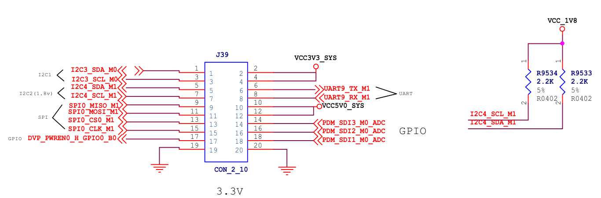

可以看到 1 号管脚的网络标号为 I2C3_SDA_M0，然后打开核心板原理图，根据这个网络标号进行搜索，查找到的核心板内容如下所示：

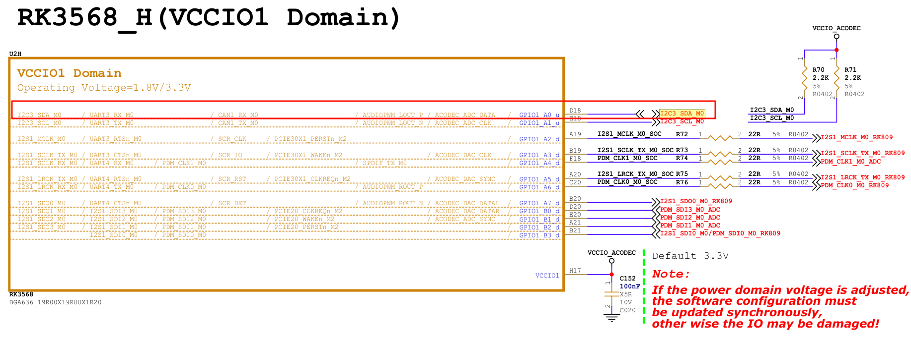

首先根据上图中的复用功能查看设备树中是否已经对该引脚进行了复用，在确保该引脚无任何复用之后，对 topeet-rk3568-linux.dtsi 设备树进行内容的添加，在根节点的结尾添加以下内容：

```dts
my_gpio:gpiol_a0 {
	compatible = "mygpio";
	my-gpios = <&gpio1 RK_PA0 GPIO_ACTIVE_HIGH>;
	pinctrl-names = "default";
	pinctrl-0 = <&mygpio_ctrl>;
}
```

- `compatible`: 用于指定设备的兼容性字符串，与驱动程序中的值相匹配。
- `my-gpios`: 指定了与该设备相关联的 GPIO。&gpiol 表示 GPIO 控制器的句柄（handle），RK_PA0 是与该 GPIO 相关的资源描述符（resource specifier），GPIO_ACTIVE_HIGH 表示 GPIO 的默认电平为高电平。

> 注意这里必须为my-gpios而不是gpios，必须有中间的"-"

- `pinctrl-names` 和 pinctrl-0: 用于指定引脚控制器（pinctrl）的配置。pinctrl-names 表示引脚控制器配置的名称，这里为 "default"。pinctrl-0 指定了与该配置相关联的引脚控制器句柄，这里为 &mygpio_ctrl。

然后找到pinctrl子节点

```dts
mygpio {
	mygpio_ctrl: my-gpio-ctrl {
		rockchip,pins = <1 RK_PA0 RK_FUNC_GPIO &pcfg_pull_none>;
	};
}
```

- `1` 表示引脚索引
- RK_PA0 表示资源描述符，用于标识与该引脚相关联的物理资源，表示引脚所属的功能组
- `RK _FUNC_GPIO` 表示将引脚的功能设置为 GPIO
- `&pcfg_pull_none` 表示引脚配置为无上下拉。

驱动程序

```c
#include <linux/module.h>
#include <linux/platform_device.h>
#include <linux/mod_devicetable.h>
#include <linux/gpio/consumer.h>

struct gpio_desc *mygpio1;  // GPIO 描述符指针
struct gpio_desc *mygpio2;  // GPIO 描述符指针
int num;  // GPIO 编号


// 平台设备初始化函数
#include <linux/gpio/consumer.h>
#include <linux/platform_device.h>
#include <linux/module.h>

static struct gpio_desc *mygpio1, *mygpio2;

static int my_platform_probe(struct platform_device *pdev)
{
    int num;
    int ret = 0;

    printk("This is my_platform_probe\n");

    /* 获取可选 GPIO */
    mygpio1 = gpiod_get_optional(&pdev->dev, "my", GPIOD_IN);
    if (IS_ERR(mygpio1)) {
        dev_err(&pdev->dev, "Failed to get optional 'my' GPIO: %ld\n", PTR_ERR(mygpio1));
        return PTR_ERR(mygpio1);
    }

    if (mygpio1) {
        num = desc_to_gpio(mygpio1);
        printk("Optional GPIO num is %d\n", num);
        gpiod_put(mygpio1);
    } else {
        printk("Optional 'my' GPIO not specified in DT\n");
    }

    /* 获取索引为 0 的必需 GPIO */
    mygpio2 = gpiod_get_index(&pdev->dev, "my", 0, GPIOD_IN);
    if (IS_ERR(mygpio2)) {
        dev_err(&pdev->dev, "Failed to get indexed 'my' GPIO[0]: %ld\n", PTR_ERR(mygpio2));
        return PTR_ERR(mygpio2);
    }

    num = desc_to_gpio(mygpio2);
    printk("Indexed GPIO num is %d\n", num);

    /* 注意：这里没有释放 mygpio2！通常应在 remove() 中释放 */
    /* 如果只是测试，至少在出错路径释放，或在此处释放（但无后续使用） */
    gpiod_put(mygpio2);

    return 0;
}

// 平台设备的移除函数
static int my_platform_remove(struct platform_device *pdev)
{
    /* 实际驱动中，应在 remove 中释放所有获取的 GPIO */
    printk(KERN_INFO "my_platform_remove: Removing platform device\n");
    return 0;
}


const struct of_device_id of_match_table_id[]  = {
	{.compatible="mygpio"},
};

// 定义平台驱动结构体
static struct platform_driver my_platform_driver = {
    .probe = my_platform_probe,
    .remove = my_platform_remove,
    .driver = {
        .name = "my_platform_device",
        .owner = THIS_MODULE,
		.of_match_table =  of_match_table_id,
    },
};

// 模块初始化函数
static int __init my_platform_driver_init(void)
{
    int ret;

    // 注册平台驱动
    ret = platform_driver_register(&my_platform_driver);
    if (ret) {
        printk(KERN_ERR "Failed to register platform driver\n");
        return ret;
    }

    printk(KERN_INFO "my_platform_driver: Platform driver initialized\n");

    return 0;
}

// 模块退出函数
static void __exit my_platform_driver_exit(void)
{
    // 注销平台驱动
	gpiod_put(mygpio2);
    platform_driver_unregister(&my_platform_driver);

    printk(KERN_INFO "my_platform_driver: Platform driver exited\n");
}

module_init(my_platform_driver_init);
module_exit(my_platform_driver_exit);

MODULE_LICENSE("GPL");
MODULE_AUTHOR("topeet");

```

### GPIO操作函数

**头文件统一为：** `#include <linux/gpio/consumer.h>`

#### 获取 GPIO 方向

**函数**

```c
int gpiod_get_direction(struct gpio_desc *desc);
```

**功能**

查询 GPIO 当前配置为输入还是输出。

**返回值**

- `GPIO_LINE_DIRECTION_IN`（0）：输入模式
- `GPIO_LINE_DIRECTION_OUT`（1）：输出模式
- 负数：错误码（如 `-EINVAL`）

#### 配置 GPIO 方向

##### 配置为输入

```c
int gpiod_direction_input(struct gpio_desc *desc);
```

##### 配置为输出（带初始电平）

```c
int gpiod_direction_output(struct gpio_desc *desc, int value);
```

- `value`：0（低电平）或 1（高电平）

**返回值（两者相同）**

- `0`：成功
- 负数：失败（如 `-EINVAL`, `-ENODEV`）

**注意事项**

- 必须在读写 GPIO 前正确设置方向。
- 输出模式需指定初始电平，避免毛刺。

------

#### 读取 GPIO 电平（输入）

```c
int gpiod_get_value(const struct gpio_desc *desc);
```

**功能**

读取 GPIO 引脚当前物理电平（考虑 `ACTIVE_LOW` 映射后逻辑值）。

**返回值**

- `0`：逻辑低电平
- `1`：逻辑高电平
- 负数：错误（罕见，通常仅在硬件异常时发生）

**说明**

- 即使 GPIO 配置为输出，也可读回其输出状态（部分控制器支持）。
- 返回的是**逻辑值**，已自动处理设备树中 `GPIO_ACTIVE_LOW` 的反转。

#### 设置 GPIO 电平（输出）

```c
void gpiod_set_value(struct gpio_desc *desc, int value);
```

**参数**

- `value`：0（逻辑低）或 1（逻辑高）

**返回值**

- 无（`void`）

**关键前提**

- **必须先将 GPIO 配置为输出模式**（通过 `gpiod_direction_output()`）。
- 同样使用**逻辑值**，内核自动处理 `ACTIVE_LOW` 反转。

#### 将 GPIO 转换为中断号

```c
int gpiod_to_irq(const struct gpio_desc *desc);
```

**功能**

获取与该 GPIO 关联的 Linux 中断号（IRQ number），用于注册中断处理程序。

**返回值**

- ≥ 0：有效的中断号
- 负数：不支持中断或转换失败（如 `-ENXIO`

#### 示例

```c
#include <linux/module.h>
#include <linux/platform_device.h>
#include <linux/mod_devicetable.h>
#include <linux/gpio/consumer.h>
#include <uapi/linux/gpio.h>  // for GPIO_LINE_DIRECTION_*

static struct gpio_desc *mygpio1;

// 平台设备初始化函数
static int my_platform_probe(struct platform_device *pdev)
{
    int dir, value, irq;
    int ret;

    printk("This is my_platform_probe\n");

    // 获取可选 GPIO（配置为输出，初始低电平）
    mygpio1 = gpiod_get_optional(&pdev->dev, "my", GPIOD_OUT_LOW);
    if (IS_ERR(mygpio1)) {
        dev_err(&pdev->dev, "Failed to get GPIO: %ld\n", PTR_ERR(mygpio1));
        return PTR_ERR(mygpio1);
    }

    if (!mygpio1) {
        dev_info(&pdev->dev, "Optional 'my' GPIO not present\n");
        return 0;
    }

    // 设置为高电平（可选，因为 GPIOD_OUT_LOW 初始为低）
    gpiod_set_value(mygpio1, 1);

    // 获取方向
    dir = gpiod_get_direction(mygpio1);
    if (dir == GPIO_LINE_DIRECTION_IN) {
        printk("dir is INPUT\n");
    } else if (dir == GPIO_LINE_DIRECTION_OUT) {
        printk("dir is OUTPUT\n");
    } else {
        dev_err(&pdev->dev, "Failed to get direction: %d\n", dir);
        gpiod_put(mygpio1);
        return dir;
    }

    // 读取当前值
    value = gpiod_get_value(mygpio1);
    printk("value is %d\n", value);

    // 获取中断号
    irq = gpiod_to_irq(mygpio1);
    if (irq < 0) {
        printk("GPIO does not support IRQ (err=%d)\n", irq);
    } else {
        printk("irq is %d\n", irq);
    }

    return 0;
}

// 平台设备的移除函数
static int my_platform_remove(struct platform_device *pdev)
{
    if (mygpio1 && !IS_ERR(mygpio1)) {
        gpiod_put(mygpio1);
        mygpio1 = NULL;
    }
    printk(KERN_INFO "my_platform_remove: Platform device removed\n");
    return 0;
}

// 设备树匹配表
static const struct of_device_id my_of_match[] = {
    { .compatible = "mygpio" },
    { /* sentinel */ }
};
MODULE_DEVICE_TABLE(of, my_of_match);

// 平台驱动结构体
static struct platform_driver my_platform_driver = {
    .probe = my_platform_probe,
    .remove = my_platform_remove,
    .driver = {
        .name = "my_platform_device",
        .of_match_table = my_of_match,
        .owner = THIS_MODULE,
    },
};

// 模块初始化与退出
static int __init my_platform_driver_init(void)
{
    int ret = platform_driver_register(&my_platform_driver);
    if (ret) {
        printk(KERN_ERR "Failed to register platform driver\n");
        return ret;
    }
    printk(KERN_INFO "my_platform_driver: Platform driver initialized\n");
    return 0;
}

static void __exit my_platform_driver_exit(void)
{
    platform_driver_unregister(&my_platform_driver);
    printk(KERN_INFO "my_platform_driver: Platform driver exited\n");
}

module_init(my_platform_driver_init);
module_exit(my_platform_driver_exit);

MODULE_LICENSE("GPL");
MODULE_AUTHOR("topeet");
MODULE_DESCRIPTION("My GPIO Platform Driver Example");
```


### 三级节点操作函数

在前面的示例中获取的都是二级节点的 GPIO 描述，那如果我们要如何获取下面 led1 和 led2 两个三级节点的 gpio 描述呢？

```dts
my_gpio:gpio1_a0 {
	compatible = "mygpio";
	
	led1{
		my-gpios = <&gpio1 RK_PA0 GPIO_ACTIVE_HIGH>, <&gpio1 RK_PB1 GPIO_ACTIVE_HIGH>;
		pinctrl-names = "default";
		pinctrl-0 = <&mygpio_ctrl>;
	};
	
	led2{
		my-gpios = <&gpio1 RK_PB0 GPIO_ACTIVE_HIGH>;
	};
};
```

#### device_get_child_node_count()

**功能：获取设备的子节点数量**

**函数原型**

```c
unsigned int device_get_child_node_count(struct device *dev);
```

**头文件**

```c
#include <linux/device.h>
```

**参数**

- `dev`：指向父设备的 `struct device` 指针。

**返回值**

- **成功**：返回子节点数量（≥ 0 的无符号整数）。
- **无子节点或失败**：返回 `0`。

**说明**

- 用于判断设备在设备树中是否包含子节点（如 LED、按键等子设备）。
- 常用于动态分配资源或决定是否进入子节点遍历逻辑。

 **示例**

```c
if (device_get_child_node_count(&pdev->dev) == 0) {
    dev_info(&pdev->dev, "No child nodes\n");
    return 0;
}
```

#### fwnode_get_named_gpiod()

**功能：从指定 firmware 节点（如设备树子节点）中获取命名 GPIO**

**函数原型**

```c
struct gpio_desc *fwnode_get_named_gpiod(
    struct fwnode_handle *fwnode,
    const char *propname,
    int index,
    enum gpiod_flags dflags,
    const char *label
);
```

**头文件**

```c
#include <linux/gpio/consumer.h>
```

**参数**

| 参数       | 说明                                                         |
| ---------- | ------------------------------------------------------------ |
| `fwnode`   | 指向子节点的 `fwnode_handle`（通常来自 `device_get_next_child_node()`） |
| `propname` | GPIO 属性名（如 `"led-gpios"`、`"enable-gpios"`、`"my-gpios"`） |
| `index`    | 在属性中的索引（0 表示第一个 GPIO）                          |
| `dflags`   | 初始化标志： • `GPIOD_IN` • `GPIOD_OUT_LOW` • `GPIOD_OUT_HIGH` • `GPIOD_ASIS`（不配置方向） |
| `label`    | GPIO 标签（用于调试，如 `"my-led"`）                         |

返回值

- 成功：返回 `struct gpio_desc *`
- 失败：返回 `ERR_PTR(...)`（注意：**不是 NULL**）

> ⚠️ **重要**：该函数返回的是 **错误指针（ERR_PTR）**，应使用 `IS_ERR()` 判断，而非检查 `NULL`。

**使用场景**

- 当设备树结构为“父设备 + 多个子节点”，每个子节点定义自己的 GPIO 时（如多个 LED）：

  

  ```
  my_device {
      compatible = "myvendor,my-device";
      #address-cells = <1>;
      #size-cells = <0>;
  
      led@0 {
          reg = <0>;
          led-gpios = <&gpio1 10 GPIO_ACTIVE_HIGH>;
      };
      led@1 {
          reg = <1>;
          led-gpios = <&gpio1 11 GPIO_ACTIVE_LOW>;
      };
  };
  ```

驱动:

```c
desc = fwnode_get_named_gpiod(child, "led-gpios", 0, GPIOD_OUT_LOW, "my-led");
if (IS_ERR(desc)) {
    dev_err(dev, "Failed to get GPIO: %ld\n", PTR_ERR(desc));
    return PTR_ERR(desc);
}
```


#### device_get_next_child_node()

**功能：遍历设备的所有子节点**

**函数原型**

```c
struct fwnode_handle *device_get_next_child_node(
    struct device *dev,
    struct fwnode_handle *child
);
```

**头文件**

```c
#include <linux/device.h>
```

**参数**

- `dev`：父设备指针。
- `child`：当前子节点指针；**首次调用时传 `NULL`**。

**返回值**

- 成功：返回下一个子节点的 `fwnode_handle *`
- 遍历结束：返回 `NULL`

**遍历模式（标准用法）**


```c
struct fwnode_handle *child = NULL;

while ((child = device_get_next_child_node(&pdev->dev, child))) {
    // 处理子节点，例如获取其 GPIO
    struct gpio_desc *desc = fwnode_get_named_gpiod(child, "gpios", 0, GPIOD_OUT_LOW, "sub-gpio");
    if (!IS_ERR(desc)) {
        /* 使用 desc */
        gpiod_put(desc);
    }

    // 注意：不需要手动释放 child，内核自动管理
}
```

> 🔔 **注意**：
>
> - `fwnode_handle` 由内核管理，**不要手动释放**。
> - 遍历结束后自动停止，无需额外清理。

#### 完整示例

```c
static int my_probe(struct platform_device *pdev)
{
    struct fwnode_handle *child = NULL;
    unsigned int count;

    count = device_get_child_node_count(&pdev->dev);
    if (count == 0) {
        dev_info(&pdev->dev, "No child nodes\n");
        return 0;
    }

    dev_info(&pdev->dev, "Found %u child nodes\n", count);

    while ((child = device_get_next_child_node(&pdev->dev, child))) {
        struct gpio_desc *desc;

        desc = fwnode_get_named_gpiod(child, "my-gpios", 0,
                                      GPIOD_OUT_LOW, "child-enable");
        if (IS_ERR(desc)) {
            dev_warn(&pdev->dev, "Skip child: failed to get GPIO (%ld)\n", PTR_ERR(desc));
            continue;
        }

        gpiod_set_value(desc, 1); // 启用子设备
        msleep(10);
        gpiod_set_value(desc, 0);

        gpiod_put(desc);
    }

    return 0;
}
```

### GPIO子系统与pinctrl

**头文件统一为：**

```c
#include <linux/pinctrl/pinctrl.h>
```

#### 获取 pinctrl 实例

```c
struct pinctrl *pinctrl_get(struct device *dev);
```

**功能**

获取与设备 `dev` 关联的 pinctrl 控制器实例。

**参数**

- `dev`：指向设备的 `struct device` 指针（通常为 `&pdev->dev`）。

**返回值**

- 成功：返回 `struct pinctrl *`
- 失败或设备无 pinctrl 支持：返回 `ERR_PTR(...)`（**注意：不是 NULL**）

> ⚠️ **重要**：该函数返回的是 **错误指针（ERR_PTR）**，应使用 `IS_ERR()` 判断！

**用法示例**

```c
p = pinctrl_get(&pdev->dev);
if (IS_ERR(p)) {
    dev_err(&pdev->dev, "Failed to get pinctrl\n");
    return PTR_ERR(p);
}
```

#### 释放 pinctrl 实例

**函数**

```c
void pinctrl_put(struct pinctrl *p);
```

**功能**

释放由 `pinctrl_get()` 获取的 pinctrl 实例，减少引用计数，必要时释放资源。

**参数**

- `p`：要释放的 `struct pinctrl *` 指针。

**注意事项**

- 允许传入 `NULL` 或 `ERR_PTR`（内部会安全处理）。
- 通常在驱动 `remove()` 或出错路径中调用。

**示例**

```c
if (!IS_ERR(p))
    pinctrl_put(p);
```

#### 查找 pinctrl 状态

**函数**

```c
struct pinctrl_state *pinctrl_lookup_state(struct pinctrl *p, const char *name);
```

**功能**

在 pinctrl 实例 `p` 中查找名为 `name` 的状态（如 `"default"`、`"sleep"`）。

**参数**

- `p`：有效的 pinctrl 实例指针。
- `name`：状态名称（字符串），必须与设备树中定义的 state 名称一致。

**返回值**

- 成功：返回 `struct pinctrl_state *`
- 失败（未找到或错误）：返回 `ERR_PTR(...)`

> ⚠️ 同样需用 `IS_ERR()` 判断！

**示例**

```c
state = pinctrl_lookup_state(p, "default");
if (IS_ERR(state)) {
    dev_err(&pdev->dev, "Failed to lookup 'default' state\n");
    return PTR_ERR(state);
}
```

#### 应用 pinctrl 状态到硬件

**函数**

```c
int pinctrl_select_state(struct pinctrl *p, struct pinctrl_state *s);
```

**功能**

将指定的状态 `s` 配置到硬件引脚控制器上，实际生效引脚复用和电气设置。

**参数**

- `p`：pinctrl 实例
- `s`：目标状态

**返回值**

- `0`：成功
- 负数：错误码（如 `-EINVAL`, `-ENODEV`）

**示例**

```c
ret = pinctrl_select_state(p, state);
if (ret) {
    dev_err(&pdev->dev, "Failed to select pinctrl state: %d\n", ret);
    return ret;
}
```

#### 完整使用流程示例

```c
#include <linux/pinctrl/pinctrl.h>

static struct pinctrl *pinctrl;
static struct pinctrl_state *pins_default;
static struct pinctrl_state *pins_sleep;

static int my_driver_probe(struct platform_device *pdev)
{
    int ret;

    /* 1. 获取 pinctrl */
    pinctrl = pinctrl_get(&pdev->dev);
    if (IS_ERR(pinctrl)) {
        dev_err(&pdev->dev, "Failed to get pinctrl\n");
        return PTR_ERR(pinctrl);
    }

    /* 2. 查找状态 */
    pins_default = pinctrl_lookup_state(pinctrl, "default");
    if (IS_ERR(pins_default)) {
        dev_err(&pdev->dev, "Failed to lookup 'default' state\n");
        ret = PTR_ERR(pins_default);
        goto err_put_pinctrl;
    }

    pins_sleep = pinctrl_lookup_state(pinctrl, "sleep");
    if (IS_ERR(pins_sleep)) {
        dev_info(&pdev->dev, "No 'sleep' state defined\n");
        pins_sleep = NULL; // 可选状态
    }

    /* 3. 应用默认状态 */
    ret = pinctrl_select_state(pinctrl, pins_default);
    if (ret) {
        dev_err(&pdev->dev, "Failed to select default state\n");
        goto err_put_pinctrl;
    }

    return 0;

err_put_pinctrl:
    pinctrl_put(pinctrl);
    return ret;
}

static int my_driver_remove(struct platform_device *pdev)
{
    if (!IS_ERR(pinctrl))
        pinctrl_put(pinctrl);
    return 0;
}
```

#### 对应的设备树示例

```dts
my_device: my-device@0 {
    compatible = "myvendor,my-device";
    pinctrl-names = "default", "sleep";
    pinctrl-0 = <&my_pins_default>;
    pinctrl-1 = <&my_pins_sleep>;

    /* 其他属性 */
};

&pinctrl {
    my_pins_default: my-pins-default {
        pinmux = <PIN_FUNC_3(PIN_X)>, /* 复用为功能3 */
                 <PIN_FUNC_1(PIN_Y)>;
        bias-pull-up;      /* 上拉 */
        drive-strength = <8>; /* 8mA 驱动能力 */
    };

    my_pins_sleep: my-pins-sleep {
        pinmux = <PIN_FUNC_0(PIN_X)>, /* 进入 GPIO 模式 */
                 <PIN_FUNC_0(PIN_Y)>;
        bias-disable;      /* 禁用上下拉 */
    };
};
```

> 🔑 关键点：
>
> - `pinctrl-names` 定义状态名称列表
> - `pinctrl-0`, `pinctrl-1` 对应索引 0、1 的状态
> - 驱动中通过名称（如 `"default"`）查找状态

------

#### 补充说明

| 场景             | 建议                                                         |
| ---------------- | ------------------------------------------------------------ |
| **仅需默认配置** | 可不显式调用 pinctrl API，内核会在 probe 时自动应用 `pinctrl-0`（若 `pinctrl-names` 包含 `"default"`） |
| **动态切换状态** | 如 suspend/resume 时切换到 `"sleep"` 状态                    |
| **错误处理**     | 所有返回指针的函数都可能返回 `ERR_PTR`，务必用 `IS_ERR()` 检查 |
| **资源释放**     | 在 `remove()` 中调用 `pinctrl_put()`                         |

### 实现动态切换引脚复用功能

这里仍使用 RK3568 底板背面的 20 pin GPIO 底座的 1 号管脚来完成本章节要进行的动态切换引脚复用的功能

```dts
my_gpio:gpio1_a0 {
	compatible = "mygpio";
	my-gpios = <&gpio1 RK_PA0 GPIO_ACTIVE_HIGH>;
	pinctrl-names = "mygpio_func1", "mygpio_func2";
	pinctrl-0 = <&mygpio_ctrl>;
	pinctrl-1 = <&i2c3_sda>;
};
```

- `pinctrl-names` 表示引脚控制器配置的名称，这里有两个值，分别对应复用 1 和复用 2。
- `pinctrl-0` 指定了与该配置相关联的引脚控制器句柄，这里为 `&mygpio_ctrl`，表示复用为 gpio 功能。
- `pinctrl-1` 指定了与该配置相关联的引脚控制器句柄，这里为 `&i2c3_sda`，表示复用为`i2c3_sda` 功能。

```dts
	mygpio_func1 {
		mygpio_ctrl: my-gpio-ctrl {
			rockchip,pins = <1 RK_PA0 RK_FUNC_GPIO &pcfg_pull_none>;
		};
	};
	
	mygpio_func2 {
		i2c3_sda: i2c3_sda {
			rockchip,pins = <1 RK_PA0 1 &pcfg_pull_none>;
		};
	}
```


驱动

```c
#include <linux/module.h>
#include <linux/platform_device.h>
#include <linux/mod_devicetable.h>
#include <linux/gpio/consumer.h>
#include <linux/gpio.h>
#include <linux/device.h>

struct pinctrl *gpio_pinctrl;          // GPIO pinctrl 实例指针
struct pinctrl_state *func1_state;     // 功能1状态
struct pinctrl_state *func2_state;     // 功能2状态
int ret;

ssize_t selectmux_store(struct device *dev, struct device_attribute *attr, const char *buf, size_t count)
{
    unsigned long select;
    select = simple_strtoul(buf, NULL, 10);
    if (select == 1) {
        pinctrl_select_state(gpio_pinctrl, func1_state);     // 选择功能1状态
    } else if (select == 0) {
        pinctrl_select_state(gpio_pinctrl, func2_state);     // 选择功能2状态
    }
    return count;
}

// 定义可写的设备属性 selectmux
DEVICE_ATTR_WO(selectmux);       
// 等价于
// static struct device_attribute dev_attr_selectmux = {
//    .attr = { .name = "selectmux", .mode = S_IWUSR },  // 只写，权限 0200
//    .show = NULL,
//    .store = selectmux_store,   
//};

int pinctrl_get_and_lookstate(struct device *dev)
{
    gpio_pinctrl = pinctrl_get(dev);    // 获取GPIO pinctrl实例
    if (IS_ERR(gpio_pinctrl)) {
        printk("pinctrl_get is error\n");
        return -1;
    }

    func1_state = pinctrl_lookup_state(gpio_pinctrl, "mygpio_func1");    // 查找功能1状态
    if (IS_ERR(func1_state)) {
        printk("pinctrl_lookup_state is error\n");
        return -2;
    }

    func2_state = pinctrl_lookup_state(gpio_pinctrl, "mygpio_func2");    // 查找功能2状态
    if (IS_ERR(func2_state)) {
        printk("pinctrl_lookup_state is error\n");
        return -2;
    }

    return 0;
}

// 平台设备初始化函数
static int my_platform_probe(struct platform_device *dev)
{
    printk("This is mydriver_probe\n");
    pinctrl_get_and_lookstate(&dev->dev);     // 获取并查找GPIO pinctrl实例和状态
    device_create_file(&dev->dev, &dev_attr_selectmux);    // 在设备上创建属性文件
    return 0;
}

// 平台设备的移除函数
static int my_platform_remove(struct platform_device *pdev)
{
    printk(KERN_INFO "my_platform_remove: Removing platform device\n");

    // 清理设备特定的操作
    // ...

    return 0;
}


const struct of_device_id of_match_table_id[]  = {
	{.compatible="mygpio"},
};

// 定义平台驱动结构体
static struct platform_driver my_platform_driver = {
    .probe = my_platform_probe,
    .remove = my_platform_remove,
    .driver = {
        .name = "my_platform_device",
        .owner = THIS_MODULE,
		.of_match_table =  of_match_table_id,
    },
};

// 模块初始化函数
static int __init my_platform_driver_init(void)
{
    int ret;

    // 注册平台驱动
    ret = platform_driver_register(&my_platform_driver);
    if (ret) {
        printk(KERN_ERR "Failed to register platform driver\n");
        return ret;
    }

    printk(KERN_INFO "my_platform_driver: Platform driver initialized\n");

    return 0;
}

// 模块退出函数
static void __exit my_platform_driver_exit(void)
{
    // 注销平台驱动
    platform_driver_unregister(&my_platform_driver);

    printk(KERN_INFO "my_platform_driver: Platform driver exited\n");
}

module_init(my_platform_driver_init);
module_exit(my_platform_driver_exit);

MODULE_LICENSE("GPL");
MODULE_AUTHOR("topeet");

```

