# 输入子系统

在 Linux 中，input 子系统是专门为处理输入类设备而设计的一个子系统或框架。它提供了一套通用的接口和机制，用于驱动开发人员编写和管理输入设备的驱动程序。输入设备包括键盘、鼠标、触摸屏、游戏手柄等。

使用 input 子系统的主要目的是规范和简化输入设备驱动的开发过程，以提高驱动的通用性和兼容性。它通过**将输入设备的共同功能和处理逻辑提取出来，编写成通用的代码，将差异化的代码留给具体的设备驱动开发人员**，这种分工合作的方式使得驱动开发人员可以更专注地处理设备特定的细节，从而大大降低工程师的开发难度。

综上使用 input 子系统的作用如下所示：

- **兼容性**： 输入子系统提供了一个统一的框架和接口，使得不同厂家的输入设备都可以按照相同的规范进行驱动开发。无论是键盘、鼠标还是其他输入设备，只要符合输入子系统定义的接口和事件格式，都可以在 Linux 系统中正常工作。这样一来，工程师不需要针对每个厂家的设备编写和维护不同的驱动代码，大大提高了设备的兼容性。
- **统一的驱动编程方式**： 输入子系统定义了一套通用的驱动编程方式，工程师只需要按照输入子系统的规范进行开发即可。输入设备的驱动模块需要实现相应的接口函数，如初始化函数、事件处理函数等。这些接口函数的实现方式是相同的，不论是键盘驱动还是鼠标驱动，都可以按照统一的方式进行开发。这样一来，工程师可以更加专注于设备特定的细节，而无需关心通用的驱动框架，简化了开发过程。
- **统一的应用操作接口**： 输入子系统通过提供一组统一的应用操作接口，如`/dev/input/eventX`，使得应用程序可以方便地与输入设备进行交互。应用程序可以通过读取这些设备节点，获取输入事件的信息，并进行相应的处理。无论是哪种类型的输入设备，应用程
  序都可以使用相同的方式进行访问和操作。这样一来，应用程序的开发人员不需要关心底层输入设备的细节，可以更加专注于应用程序的逻辑开发。

## 如何确定输入设备和节点之间的关系

在输入子系统中，输入设备与设备节点之间有一定的对应关系。以下是判断设备节点与输入设备的方法：

1. **设备名**： 输入子系统的设备节点可以分为**通用设备名**和**专用设备名**。专用设备名通常可以从设备名中直接识别出设备类型，例如"keyboard"（键盘）或"mouse"（鼠标）。而通用设备名则不能直接确定设备类型。如下图所示，event0-event4 属于通用设备名，而 mouse0 和mouse2 属于专用设备名。

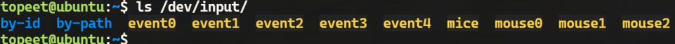

2. 试探性方法： 可以使用"cat"命令打开设备节点文件，然后对物理设备进行操作，观察终 端 是 否 有 输 出 。 例 如 ， 对 于 键 盘 设 备 ， 你 可 以 运 行 `cat /dev/input/eventX` ， 其 中`/dev/input/eventX`是设备节点的路径，然后按下键盘按键，观察终端是否输出相应的字符。通过这种试探性的方法，你可以判断设备节点与具体设备之间的对应关系。例如使用以下命令来测试鼠标，如下所示：

```bash
sudo cat /dev/input/mouse0
sudo hexdump /dev/input/mouse0
```

3. 查看输入设备信息：可以使用以下命令查看`/proc/bus/input/devices`文件：

```bash
cat /proc/bus/input/devices
```


部分打印截图如下所示：

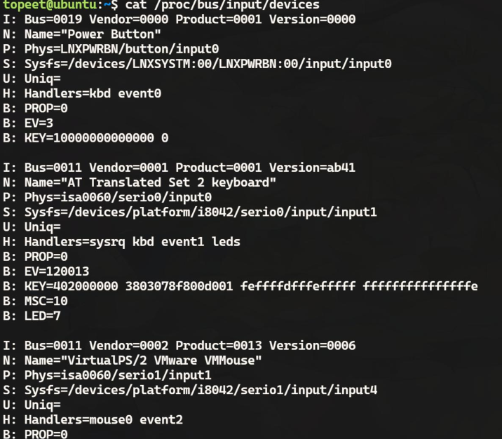

该文件记录了当前系统的所有输入设备的信息在该文件中，你可以找到与设备节点相关的信息，例如设备名称、供应商 ID、产品 ID 等。通过对比设备节点的路径和设备信息中的对应字段，可以确定设备节点与特定输入设备之间的关系，例如可以通过上述打印信息查看到，
键盘对应的设备节点为`/dev/input/event1`，如下图所示

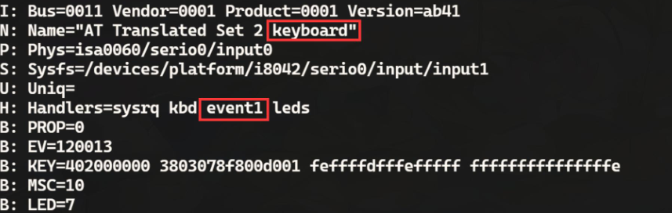


- `I: Bus=0011 Vendor=0001 Product=0001 Version=ab41`

这一行显示了设备的总线类型、供应商 ID、产品 ID 和固件版本。在这个例子中，该设备的总线类型为 0011，供应商 ID 为 0001，
产品 ID 为 0001，固件版本为 ab41。

- `N: Name="AT Translated Set 2 keyboard"`

这一行显示了设备的名称。在这个例子中，该设备的名称为"AT Translated Set 2 keyboard"。

- `P: Phys=isa0060/serio0/input0`

这一行显示了设备的物理位置。在这个例子中，该设备的物理位置是 `isa0060/serio0/input0`。

- `S: Sysfs=/devices/platform/i8042/serio0/input/input1`

这一行显示了设备在 sysfs 文件系统中的路径。在这个例子中，该设备的路径是`/devices/platform/i8042/serio0/input/input1`。

- `U: Uniq=`: 

这一行显示了设备的唯一标识符。在这个例子中，唯一标识符为空。

- `H: Handlers=sysrq kbd event1 leds`

 这一行显示了设备的处理程序。它指示了处理设备输入事件的程序或模块。在这个例子中，设备有 sysrq、kbd、event1 和 leds 这些处理程序，其中 event1就表示设备节点为`/dev/input/event1`。

- `B: PROP=0`

 这一行显示了设备的属性。在这个例子中，设备的属性值为 0。

- `B: EV=120013`

这一行显示了设备支持的事件类型。在这个例子中，设备支持 EV_SYN、EV_KEY、EV_MSC 和 EV_LED 这些事件类型。

- `B: KEY=402000000 3803078f800d001 feffffdfffefffff fffffffffffffffe`

这一行显示了设备支持的按键。每个按键对应一个位，1 表示按键被按下，0 表示按键未被按下。该行显示了按键的状态，以 16 进制表示。

- `B: MSC=10`

这一行显示了设备支持的杂项事件。在这个例子中，设备支持 MSC_SCAN事件。

- `B: LED=7`

这一行显示了设备支持的 LED 灯。在这个例子中，设备支持 3 个 LED 灯，使用一个 7 位的二进制数表示灯的状态。

## 输入子系统框架


- **事件处理层（Event Handling Layer）**

事件处理层是输入子系统的最上层，可以**处理输入设备产生的事件并将其传递给上层应用程序**，并**在操作系统中创建设备节点**，以便应用程序可以通过设备节点与输入设备进行通信。它接收来自核心层的输入事件，并根据事件的类型和属性进行相应的处理。

- **核心层（Core Layer）**

  核心层的主要功能是**作为匹配器位于事件处理层和设备驱动层之间**。它起到协调和连接这两个层级的作用，以**确保输入设备的事件能够正确地传递给相应的事件处理程序**。以下是核心层在输入子系统中的主要功能：

  - **事件匹配**： 核心层负责**将输入设备产生的原始输入数据与相应的事件处理程序进行匹配**。它会解析原始输入数据，并根据预定义的规则和配置信息，确定应该将输入数据传递给哪个事件处理程序进行处理。
  - **设备管理和控制**： 核心层负责**维护输入设备的状态、属性和配置信息，并提供设备的注册、注销和管理功能**。它与设备驱动层进行交互，接收来自设备驱动层的输入事件，并将其转化为抽象化的事件表示形式。核心层提供一致的接口，使得上层应用程序可以独立于具体的硬件设备进行操作。
  - **事件处理和分发**： 核心层**负责事件的处理和分发，将输入事件传递给对应的事件处理层**。它通过事件队列的机制，接收和缓存来自设备驱动层的输入事件，并按照特定的规则将事件分发给对应的事件处理层或应用程序。这样，事件处理层可以通过核心层提供的接口，获取输入事件并进行相应的处理。
  - **抽象化接口和事件处理机制**： 核心层**为上层应用程序和事件处理层提供了一组抽象化的接口和事件处理机制**。它提供了统一的事件表示形式，使得不同类型的输入设备（如键盘、鼠标、触摸屏等）的事件可以被表示和处理。通过核心层的接口，事件处理层可以注册事件监听器、订阅特定类型的事件，并获取输入设备的状态信息。

- **设备驱动层（Device Driver Layer）**

设备驱动层是输入子系统的最底层，负责**与硬件设备进行通信和交互**。它的主要职责是将硬件设备的操作和功能抽象为统一的接口，以便核心层和事件处理层可以与之交互。设备驱动层的代码通常包括硬件的初始化、中断处理、数据传输等操作，以确保输入设备的正常工作。开发者在这一层编写驱动程序，以适配特定的硬件设备。


Linux 源码中已经写好了核心层相关的代码，所以在后续编写输入子系统驱动的时候，**核心层的代码是不需要编写的**，而事件处理层在 Linux 中也为我们提供了一个模板，除了一些例如固定设备节点的需求外，**一般不需要编写事件处理层的代码**，而设备驱动层由于要面对不同的硬件，每个硬件的初始化方式又都都不同，所以**设备驱动层的代码在编写输入子系统驱动的时候是需要填充的**。

## 输入子系统数据结构

事件处理层的代码位于 `drivers/input/evdev.c` 文件中,为上层的应用程序提供了统一的事件处理机制。它定义了处理输入设备事件的函数，并提供了读取事件、控制设备等功能的接口。

```c
// drivers/input/evdev.c
static struct input_handler evdev_handler = {
	.event		= evdev_event, // 事件处理函数指针，指向名为 evdev_event 的函数，用于处理输入事件
	.events		= evdev_events,// 批量事件处理函数指针，指向名为 evdev_events 的函数，用于处理输入设备的多个事件
	.connect	= evdev_connect,
	.disconnect	= evdev_disconnect,
	.legacy_minors	= true,
	.minor		= EVDEV_MINOR_BASE,
	.name		= "evdev",// 设备名称，设置为字符串 "evdev"
	.id_table	= evdev_ids,// 输入设备 ID 表，指向名为 evdev_ids 的表，用于匹配输入设备的 ID
};

static int __init evdev_init(void)
{
	return input_register_handler(&evdev_handler);
}

static void __exit evdev_exit(void)
{
	input_unregister_handler(&evdev_handler);
}

module_init(evdev_init);
module_exit(evdev_exit);
```

这里的 `input_register_handler` 函数会将 `evdev handler` 添加到输入子系统的 `handler` 列表中，并分配一个唯一的 `handler` 编号：

### input_register_handler()

```c
// drivers/input/input.c
/**
 * input_register_handler - register a new input handler
 * @handler: handler to be registered
 *
 * This function registers a new input handler (interface) for input
 * devices in the system and attaches it to all input devices that
 * are compatible with the handler.
 */
int input_register_handler(struct input_handler *handler)
{
	struct input_dev *dev;
	int error;
	// 尝试获取输入互斥锁，以确保在注册处理程序时不会被中断
	error = mutex_lock_interruptible(&input_mutex);
	if (error)
		return error;
	// 初始化处理程序链表头
	INIT_LIST_HEAD(&handler->h_list);
	// 将处理程序添加到全局处理程序链表的末尾，使其能够与输入子系统的其他组件进行交互
	list_add_tail(&handler->node, &input_handler_list);
	// 遍历输入设备链表，为每个设备附加处理程序，这样可以为每个输入设备建立与处理程序的连接，以便处理设备发送的输入事件
	list_for_each_entry(dev, &input_dev_list, node)
		input_attach_handler(dev, handler);
	// 唤醒 procfs 读取器，通知其有新的处理程序注册，以便读取器可以及时获取新的输入事件信息。
	input_wakeup_procfs_readers();
	
    // 释放输入互斥锁，以允许其他线程继续访问输入子系统
	mutex_unlock(&input_mutex);
	return 0;
}
EXPORT_SYMBOL(input_register_handler);

```

### input_handler 结构体

```c
// include/linux/input.h
/**
 * struct input_handler - implements one of interfaces for input devices
 * @private: driver-specific data
 * @event: event handler. This method is being called by input core with
 *	interrupts disabled and dev->event_lock spinlock held and so
 *	it may not sleep
 * @events: event sequence handler. This method is being called by
 *	input core with interrupts disabled and dev->event_lock
 *	spinlock held and so it may not sleep
 * @filter: similar to @event; separates normal event handlers from
 *	"filters".
 * @match: called after comparing device's id with handler's id_table
 *	to perform fine-grained matching between device and handler
 * @connect: called when attaching a handler to an input device
 * @disconnect: disconnects a handler from input device
 * @start: starts handler for given handle. This function is called by
 *	input core right after connect() method and also when a process
 *	that "grabbed" a device releases it
 * @legacy_minors: set to %true by drivers using legacy minor ranges
 * @minor: beginning of range of 32 legacy minors for devices this driver
 *	can provide
 * @name: name of the handler, to be shown in /proc/bus/input/handlers
 * @id_table: pointer to a table of input_device_ids this driver can
 *	handle
 * @h_list: list of input handles associated with the handler
 * @node: for placing the driver onto input_handler_list
 *
 * Input handlers attach to input devices and create input handles. There
 * are likely several handlers attached to any given input device at the
 * same time. All of them will get their copy of input event generated by
 * the device.
 *
 * The very same structure is used to implement input filters. Input core
 * allows filters to run first and will not pass event to regular handlers
 * if any of the filters indicate that the event should be filtered (by
 * returning %true from their filter() method).
 *
 * Note that input core serializes calls to connect() and disconnect()
 * methods.
 */
struct input_handler {

	void *private;// 私有数据指针，用于存储特定处理程序的私有数据
	// 事件处理函数指针，当输入事件发生时调用，参数包括输入句柄、事件类型、事件代码和事件值
	void (*event)(struct input_handle *handle, unsigned int type, unsigned int code, int value);
	// 批量事件处理函数指针，当输入设备有多个事件同时发生时调用，参数包括输入句柄、事件值数组和事件数量
    void (*events)(struct input_handle *handle,
		       const struct input_value *vals, unsigned int count);
	// 事件过滤函数指针，用于确定是否接收和处理特定类型和代码的事件，返回值为布尔类型，表示是否接受该事件
    bool (*filter)(struct input_handle *handle, unsigned int type, unsigned int code, int value);
	// 匹配函数指针，用于确定处理程序是否适用于给定的输入设备，返回值为布尔类型，表示是否适用
    bool (*match)(struct input_handler *handler, struct input_dev *dev);
	// 连接函数指针，用于建立输入设备和处理程序之间的连接，返回值为整数类型，表示连接的结果
    int (*connect)(struct input_handler *handler, struct input_dev *dev, const struct input_device_id *id);
    // 断开连接函数指针，用于断开输入设备和处理程序之间的连接
	void (*disconnect)(struct input_handle *handle);
    // 启动函数指针，用于启动输入设备的数据传输或处理过程
	void (*start)(struct input_handle *handle);

	bool legacy_minors;// 是否使用旧版次设备号
	int minor;// 设备次设备号
	const char *name;// 设备名称

	const struct input_device_id *id_table;// 输入设备 ID 表

	struct list_head	h_list;// 处理程序链表头
	struct list_head	node;// 处理程序链表节点

	ANDROID_KABI_RESERVE(1);
};

```

### input_attach_handler()

```c
// drivers/input/input.c
static int input_attach_handler(struct input_dev *dev, struct input_handler *handler)
{
	const struct input_device_id *id;
	int error;
	// 通过输入设备和处理程序的匹配函数来确定是否适用于该设备
    // 这个函数将在处理程序的输入设备 ID 表中查找与给定的输入设备匹配的 ID，
    // 并返回匹配的 ID。如果没有找到匹配的 ID，则返回 NULL
	id = input_match_device(handler, dev);
	if (!id)
		return -ENODEV;
	// 调用处理程序的连接函数来建立设备和处理程序之间的连接
	error = handler->connect(handler, dev, id);
	if (error && error != -ENODEV)
		pr_err("failed to attach handler %s to device %s, error: %d\n",
		       handler->name, kobject_name(&dev->dev.kobj), error);

	return error;
}
```

### input_match_device()

这个函数在输入子系统中的作用是在给定的输入事件处理程序（`input_handler）`中查找与指定输入设备匹配的输入设备 ID（input device ID）。

处理程序的输入设备 ID 表是一个以 `struct input_device_id` 结构为元素的数组，每个元素表示一个可能的输入设备 ID

```c
// drivers/input/input.c
static const struct input_device_id *input_match_device(struct input_handler *handler,
							struct input_dev *dev)
{
	const struct input_device_id *id;
	// 遍历处理程序的输入设备 ID 表，直到找到匹配的 ID 或遍历完所有 ID 为止
	for (id = handler->id_table; id->flags || id->driver_info; id++) {
		if (input_match_device_id(dev, id) &&// 使用输入设备 ID 匹配函数判断给定的输入设备是否与当前 ID 匹配
		    (!handler->match || handler->match(handler, dev))) {// 如果输入设备与 ID 匹配，并且处理程序的匹配函数返回 true（或者没有匹配函数），则返回该 ID
			return id;
		}
	}

	return NULL;
}
```

#### input_match_device_id()

`input_match_device_id(dev, id)`调用输入设备 ID 匹配函数来判断给定的输入设备是否与当前 ID 匹配。匹配函数的作用是比较输入设备的属性与 ID 中指定的属性是否一致，例如厂商 ID、产品 ID 等。

```c
bool input_match_device_id(const struct input_dev *dev,
			   const struct input_device_id *id)
{
	if (id->flags & INPUT_DEVICE_ID_MATCH_BUS)
		if (id->bustype != dev->id.bustype)
			return false;

	if (id->flags & INPUT_DEVICE_ID_MATCH_VENDOR)
		if (id->vendor != dev->id.vendor)
			return false;

	if (id->flags & INPUT_DEVICE_ID_MATCH_PRODUCT)
		if (id->product != dev->id.product)
			return false;

	if (id->flags & INPUT_DEVICE_ID_MATCH_VERSION)
		if (id->version != dev->id.version)
			return false;

	if (!bitmap_subset(id->evbit, dev->evbit, EV_MAX) ||
	    !bitmap_subset(id->keybit, dev->keybit, KEY_MAX) ||
	    !bitmap_subset(id->relbit, dev->relbit, REL_MAX) ||
	    !bitmap_subset(id->absbit, dev->absbit, ABS_MAX) ||
	    !bitmap_subset(id->mscbit, dev->mscbit, MSC_MAX) ||
	    !bitmap_subset(id->ledbit, dev->ledbit, LED_MAX) ||
	    !bitmap_subset(id->sndbit, dev->sndbit, SND_MAX) ||
	    !bitmap_subset(id->ffbit, dev->ffbit, FF_MAX) ||
	    !bitmap_subset(id->swbit, dev->swbit, SW_MAX) ||
	    !bitmap_subset(id->propbit, dev->propbit, INPUT_PROP_MAX)) {
		return false;
	}

	return true;
}
EXPORT_SYMBOL(input_match_device_id);

```

### input_dev 结构体

```c
// input/linux/input.h
struct input_dev {
	const char *name;// 设备的名称
	const char *phys;// 设备的物理位置
	const char *uniq;// 设备的唯一标识符
	struct input_id id;// 输入设备的标识信息

	unsigned long propbit[BITS_TO_LONGS(INPUT_PROP_CNT)];// 设备的属性位图

	unsigned long evbit[BITS_TO_LONGS(EV_CNT)];// 设备支持的事件类型位图
	unsigned long keybit[BITS_TO_LONGS(KEY_CNT)];// 设备支持的按键位图
	unsigned long relbit[BITS_TO_LONGS(REL_CNT)];// 设备支持的相对坐标位图
	unsigned long absbit[BITS_TO_LONGS(ABS_CNT)];// 设备支持的绝对坐标位图
	unsigned long mscbit[BITS_TO_LONGS(MSC_CNT)];// 设备支持的杂项事件位图
	unsigned long ledbit[BITS_TO_LONGS(LED_CNT)];// 设备支持的 LED 位图
	unsigned long sndbit[BITS_TO_LONGS(SND_CNT)];// 设备支持的声音位图
	unsigned long ffbit[BITS_TO_LONGS(FF_CNT)];// 设备支持的力反馈位图
	unsigned long swbit[BITS_TO_LONGS(SW_CNT)];// 设备支持的开关位图

	unsigned int hint_events_per_packet;// 每个输入事件报告中的事件数量提示

	unsigned int keycodemax;// 支持的按键编码的最大值
	unsigned int keycodesize;// 按键编码的字节大小
	void *keycode;// 按键编码数据的指针

	int (*setkeycode)(struct input_dev *dev,
			  const struct input_keymap_entry *ke,
			  unsigned int *old_keycode);// 设置按键编码的回调函数
	int (*getkeycode)(struct input_dev *dev,
			  struct input_keymap_entry *ke);// 获取按键编码的回调函数

	struct ff_device *ff;// 力反馈设备

	struct input_dev_poller *poller;

	unsigned int repeat_key;// 重复按键的编码
	struct timer_list timer;// 定时器用于处理重复按键

	int rep[REP_CNT];// 按键重复设置

	struct input_mt *mt;// 多点触摸信息

	struct input_absinfo *absinfo;// 绝对坐标信息

	unsigned long key[BITS_TO_LONGS(KEY_CNT)];// 当前按键状态位图
	unsigned long led[BITS_TO_LONGS(LED_CNT)];// 当前 LED 状态位图
	unsigned long snd[BITS_TO_LONGS(SND_CNT)];// 当前声音状态位图
	unsigned long sw[BITS_TO_LONGS(SW_CNT)];// 当前开关状态位图

	int (*open)(struct input_dev *dev);// 打开设备的回调函数
	void (*close)(struct input_dev *dev);// 关闭设备的回调函数
	int (*flush)(struct input_dev *dev, struct file *file);// 刷新设备的回调函数
	int (*event)(struct input_dev *dev, unsigned int type, unsigned int code, int value);// 处理输入事件的回调函数

	struct input_handle __rcu *grab;// 设备的当前占用者

	spinlock_t event_lock;// 事件锁，用于保护事件队列
	struct mutex mutex;// 互斥锁，用于保护设备状态

	unsigned int users;// 设备的使用者数量
	bool going_away;// 设备是否即将被移除

	struct device dev;// 设备结构体

	struct list_head	h_list;// 用于设备管理的链表
	struct list_head	node;// 用于设备管理的链表

	unsigned int num_vals;// 输入值的数量
	unsigned int max_vals;// 最大输入值的数量
	struct input_value *vals;// 输入值的数组

	bool devres_managed;// 是否由设备资源管理

	ktime_t timestamp[INPUT_CLK_MAX];// 输入事件的时间戳数组
};
#define to_input_dev(d) container_of(d, struct input_dev, dev)

```

### input_handle 结构体

在调用 connect 函数（evdev的connect函数）之后，会创建一个 `input_handle` 结构体，用于记录匹配成功的输入处理程序（`input_handler`）和输入设备（`input_dev`），并建立它们之间的关系。下面是 `input_handle` 结构体的定义（位于 `include/linux/input.h`）

```c
/**
 * struct input_handle - links input device with an input handler
 * @private: handler-specific data
 * @open: counter showing whether the handle is 'open', i.e. should deliver
 *	events from its device
 * @name: name given to the handle by handler that created it
 * @dev: input device the handle is attached to
 * @handler: handler that works with the device through this handle
 * @d_node: used to put the handle on device's list of attached handles
 * @h_node: used to put the handle on handler's list of handles from which
 *	it gets events
 */
struct input_handle {

	void *private;// 私有数据指针

	int open;// 打开计数
	const char *name;// 名称

	struct input_dev *dev;// 输入设备
	struct input_handler *handler;// 输入处理程序

	struct list_head	d_node;// 指向输入设备链表的节点
	struct list_head	h_node;// 指向输入处理程序链表的节点

};
```

### evdev_connect()

`input_handler`的connect函数

该函数的主要功能是建立与输入设备的连接，初始化并注册输入句柄，设置设备属性，并添加字符设备到系统中

```c
struct evdev {
	int open;
	struct input_handle handle;
	struct evdev_client __rcu *grab;
	struct list_head client_list;
	spinlock_t client_lock; /* protects client_list */
	struct mutex mutex;
	struct device dev;
	struct cdev cdev;
	bool exist;
};

struct evdev_client {
	unsigned int head;
	unsigned int tail;
	unsigned int packet_head; /* [future] position of the first element of next packet */
	spinlock_t buffer_lock; /* protects access to buffer, head and tail */
	wait_queue_head_t wait;
	struct fasync_struct *fasync;
	struct evdev *evdev;
	struct list_head node;
	enum input_clock_type clk_type;
	bool revoked;
	unsigned long *evmasks[EV_CNT];
	unsigned int bufsize;
	struct input_event buffer[];
};

/*
 * Create new evdev device. Note that input core serializes calls
 * to connect and disconnect.
 */
static int evdev_connect(struct input_handler *handler, struct input_dev *dev,
			 const struct input_device_id *id)
{
	struct evdev *evdev;
	int minor;
	int dev_no;
	int error;
	// 获取一个新的次设备号
	minor = input_get_new_minor(EVDEV_MINOR_BASE, EVDEV_MINORS, true);
	if (minor < 0) {
		error = minor;
		pr_err("failed to reserve new minor: %d\n", error);
		return error;
	}
    // 分配并初始化 evdev 结构体
	evdev = kzalloc(sizeof(struct evdev), GFP_KERNEL);
	if (!evdev) {
		error = -ENOMEM;
		goto err_free_minor;
	}
	// 初始化 evdev 结构体中的成员
	INIT_LIST_HEAD(&evdev->client_list);// 初始化客户端链表
	spin_lock_init(&evdev->client_lock);// 初始化客户端链表的自旋锁
	mutex_init(&evdev->mutex);// 初始化互斥锁
	evdev->exist = true;// 设置 evdev 存在标志为 true

	dev_no = minor;
	/* Normalize device number if it falls into legacy range */
	if (dev_no < EVDEV_MINOR_BASE + EVDEV_MINORS)// 如果设备号在旧版范围内，则进行标准化处理
		dev_no -= EVDEV_MINOR_BASE;
	dev_set_name(&evdev->dev, "event%d", dev_no);// 设置设备名称

	evdev->handle.dev = input_get_device(dev);// 设置输入句柄的输入设备
	evdev->handle.name = dev_name(&evdev->dev);// 设置输入句柄的名称为设备名称
	evdev->handle.handler = handler;// 设置输入句柄的处理程序为传入的处理程序
	evdev->handle.private = evdev;//  设置输入句柄的私有数据指针为 evdev 结构体的指针

	evdev->dev.devt = MKDEV(INPUT_MAJOR, minor);// 设置设备号
	evdev->dev.class = &input_class;// 设置设备的类
	evdev->dev.parent = &dev->dev;// 设置设备的父设备
	evdev->dev.release = evdev_free;// 设置设备的释放函数为 evdev_free
	device_initialize(&evdev->dev);// 初始化设备

	error = input_register_handle(&evdev->handle);// 注册输入句柄
	if (error)
		goto err_free_evdev;

	cdev_init(&evdev->cdev, &evdev_fops);// 初始化字符设备结构体

	error = cdev_device_add(&evdev->cdev, &evdev->dev);// 添加字符设备
	if (error)
		goto err_cleanup_evdev;

	return 0;

 err_cleanup_evdev:
	evdev_cleanup(evdev);// 清理 evdev 结构体
	input_unregister_handle(&evdev->handle);// 取消注册输入句柄
 err_free_evdev:
	put_device(&evdev->dev);// 释放设备
 err_free_minor:
	input_free_minor(minor);// 释放次设备号
	return error;
}

```


### input_register_handle()

```c
/**
 * input_register_handle - register a new input handle
 * @handle: handle to register
 *
 * This function puts a new input handle onto device's
 * and handler's lists so that events can flow through
 * it once it is opened using input_open_device().
 *
 * This function is supposed to be called from handler's
 * connect() method.
 */
int input_register_handle(struct input_handle *handle)
{
	struct input_handler *handler = handle->handler;// 获取输入处理程序
	struct input_dev *dev = handle->dev;// 获取输入设备
	int error;

	/*
	 * We take dev->mutex here to prevent race with
	 * input_release_device().
	 */
    /*
	* 在这里获取 dev->mutex 锁，以防止与 input_release_device() 的竞争。
	*/
	error = mutex_lock_interruptible(&dev->mutex);
	if (error)
		return error;

	/*
	 * Filters go to the head of the list, normal handlers
	 * to the tail.
	 */
    /*
	* 将过滤器添加到链表头部，普通处理程序添加到链表尾部。
	*/
	if (handler->filter)
		list_add_rcu(&handle->d_node, &dev->h_list);
	else
		list_add_tail_rcu(&handle->d_node, &dev->h_list);

	mutex_unlock(&dev->mutex);

	/*
	 * Since we are supposed to be called from ->connect()
	 * which is mutually exclusive with ->disconnect()
	 * we can't be racing with input_unregister_handle()
	 * and so separate lock is not needed here.
	 */
    /*
	* 由于我们假设被从 ->connect() 调用，这与 ->disconnect() 是互斥的，
	* 所以我们不能与 input_unregister_handle() 竞争，因此此处不需要额外的锁定。
	*/
	list_add_tail_rcu(&handle->h_node, &handler->h_list);

	if (handler->start)
		handler->start(handle);

	return 0;
}
EXPORT_SYMBOL(input_register_handle);

```

该函数的主要作用是将输入处理程序（`input_handler`）和输入设备（`input_dev`）建立关联。对于输入设备来说，可以通过遍历 `handler->h_list` 链表来查找与之匹配的输入处理程序。这意味着输入设备可以通过遍历与之相关联的输入处理程序链表来找到相应的处理程序。

对于输入处理程序来说，可以通过遍历 `dev->h_list` 链表来查找与之匹配的输入设备。这意味着输入处理程序可以通过遍历与之相关联的输入设备链表来找到相应的设备。这样，通过建立输入处理程序和输入设备之间的关联关系，可以实现输入处理程序对特定输入设备的处理和控制。

### input_register_device()

`input_handler` 结构体要使用 `input_register_handler` 来注册;

输入处理程序（`input_handler`）和输入设备（`input_dev`）链接的结构体 `input_handle` 也需要 `input_register_handle` 函数来注册

输入设备 `input_dev` 结构体肯定也需要一个函数来注册，`input_dev` 结构体的注册函数为`input_register_device`，定义在 `drivers/input/input.c` 文件中

```c
int input_register_device(struct input_dev *dev)
{
	struct input_devres *devres = NULL;// 输入设备资源结构体指针
	struct input_handler *handler;// 输入处理程序指针
	unsigned int packet_size;// 数据包大小
	const char *path;// 设备路径字符串指针
	int error;

	if (test_bit(EV_ABS, dev->evbit) && !dev->absinfo) {
		dev_err(&dev->dev,
			"Absolute device without dev->absinfo, refusing to register\n");
		return -EINVAL;
	}

	if (dev->devres_managed) {// 如果设备资源是由管理的，则分配设备资源结构体
		devres = devres_alloc(devm_input_device_unregister,
				      sizeof(*devres), GFP_KERNEL);
		if (!devres)
			return -ENOMEM;

		devres->input = dev;
	}

	/* Every input device generates EV_SYN/SYN_REPORT events. */
    /* 每个输入设备都会产生 EV_SYN/SYN_REPORT 事件。 */
	__set_bit(EV_SYN, dev->evbit);

	/* KEY_RESERVED is not supposed to be transmitted to userspace. */
    /* KEY_RESERVED 不应传递给用户空间。 */
	__clear_bit(KEY_RESERVED, dev->keybit);

	/* Make sure that bitmasks not mentioned in dev->evbit are clean. */
    /* 确保未在 dev->evbit 中提及的位掩码是干净的。 */
	input_cleanse_bitmasks(dev);

	packet_size = input_estimate_events_per_packet(dev);
	if (dev->hint_events_per_packet < packet_size)
		dev->hint_events_per_packet = packet_size;

	dev->max_vals = dev->hint_events_per_packet + 2;
	dev->vals = kcalloc(dev->max_vals, sizeof(*dev->vals), GFP_KERNEL);
	if (!dev->vals) {
		error = -ENOMEM;
		goto err_devres_free;
	}

	/*
	 * If delay and period are pre-set by the driver, then autorepeating
	 * is handled by the driver itself and we don't do it in input.c.
	 */
    /*
	* 如果延迟和周期由驱动程序预设，
    * 则自动重复由驱动程序自己处理，我们不在 input.c 中处理。
	*/
	if (!dev->rep[REP_DELAY] && !dev->rep[REP_PERIOD])
		input_enable_softrepeat(dev, 250, 33);

	if (!dev->getkeycode)
		dev->getkeycode = input_default_getkeycode;

	if (!dev->setkeycode)
		dev->setkeycode = input_default_setkeycode;

	if (dev->poller)
		input_dev_poller_finalize(dev->poller);

	error = device_add(&dev->dev);
	if (error)
		goto err_free_vals;

	path = kobject_get_path(&dev->dev.kobj, GFP_KERNEL);
	pr_info("%s as %s\n",
		dev->name ? dev->name : "Unspecified device",
		path ? path : "N/A");
	kfree(path);

	error = mutex_lock_interruptible(&input_mutex);
	if (error)
		goto err_device_del;

	list_add_tail(&dev->node, &input_dev_list);
	// 遍历输入处理程序链表，将输入设备与每个处理程序建立关联
	list_for_each_entry(handler, &input_handler_list, node)
		input_attach_handler(dev, handler);

	input_wakeup_procfs_readers();

	mutex_unlock(&input_mutex);

	if (dev->devres_managed) {
		dev_dbg(dev->dev.parent, "%s: registering %s with devres.\n",
			__func__, dev_name(&dev->dev));
		devres_add(dev->dev.parent, devres);
	}
	return 0;

err_device_del:
	device_del(&dev->dev);
err_free_vals:
	kfree(dev->vals);
	dev->vals = NULL;
err_devres_free:
	devres_free(devres);
	return error;
}
EXPORT_SYMBOL(input_register_device);

```

`input_register_device` 函数用于注册输入设备（`input_dev`），将输入设备添加到输入子系统中

### 数据结构关系图

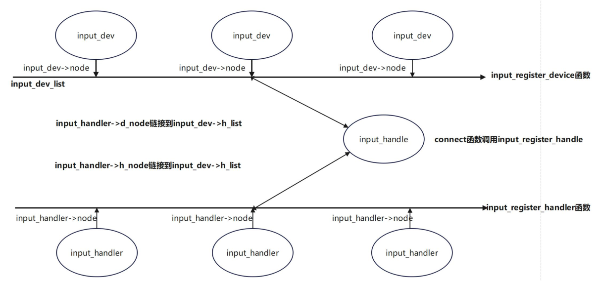

## 输入子系统源码

路径：`kernel/drivers/input`

| 文件/目录         | 作用                                                         |
| ----------------- | ------------------------------------------------------------ |
| `apm-power.c`     | 提供与 Advanced Power Management (APM) 相关的输入设备接口。  |
| `evbug.c`         | 提供用于调试的虚拟输入设备，可以模拟按键、鼠标移动等事件。   |
| `evdev.c`         | 提供通用的输入事件层，将所有输入设备的事件转化为标准化的输入事件格式，并提供给上层用户空间程序使用。 |
| `ff-core.c`       | 提供力反馈设备的支持，允许输入设备发送力反馈信息。           |
| `ff-memless.c`    | 提供一种无需分配内存的力反馈设备支持，适用于资源受限的嵌入式系统。 |
| `gameport/`       | 包含支持游戏控制器的驱动程序的目录。                         |
| `input.c`         | 提供输入子系统的初始化和事件处理等操作。                     |
| `input-leds.c`    | 提供 LED 指示灯设备的支持，允许控制 LED 指示灯的状态。       |
| `joydev.c`        | 提供支持游戏杆的驱动程序，处理游戏杆设备的输入事件。         |
| `keyboard/`       | 包含支持键盘的驱动程序的目录。                               |
| `misc/`           | 包含其他类型输入设备的驱动程序的目录，如红外线遥控器、输入音频等。 |
| `remotectl/`      | 提供支持远程控制的驱动程序，处理通过遥控器发送的输入事件。   |
| `serio/`          | 提供支持通过串行端口接入的输入设备的驱动程序，处理串行输入设备的通信和处理。 |
| `sensors/`        | 包含与传感器相关的驱动程序的目录，用于与各种传感器设备通信和处理。 |
| `sparse-keymap.c` | 提供稀疏键映射的支持，允许按任意键码分配键位，适用于具有非标准键盘布局或特殊功能键的设备。 |
| `tablet/`         | 提供支持绘图板和其他类型图形输入设备的驱动程序，处理绘图板设备的输入事件。 |
| `touchscreen/`    | 提供支持触摸屏的驱动程序，处理触摸屏设备的输入事件。         |

在menuconfig中：

```
Device Drivers --->
	Input device support --->
```

如下：

```
-*- Generic input layer (needed for keyboard, mouse, ...)//input 核心层
│ │   <*>   Export input device LEDs in sysfs
│ │   <*>   Support for memoryless force-feedback devices
│ │   -*-   Polled input device skeleton
│ │   < >   Sparse keymap support library
│ │   -*-   Matrix keymap support library
│ │
	*** Userland interfaces ***
│ │  < >     Mouse interface
│ │  < >     Joystick interface
│ │  <*>     Event interface
│ │  < >     Event debugging
│ │
	*** Input Device Drivers ***
│ │  [*]   Keyboards  --->
│ │  [*]   Mice  --->
│ │  [ ]   Joysticks/Gamepads  ----
│ │  [ ]   Tablets  ----
│ │  [*]   Touchscreens  --->
│ │  <*>   rockchip remotectl  --->
│ │
	*** handle all sensors ***
│ │  < >     handle angle,accel,compass,gyroscope,lsensor psensor etc
│ │  [*]   Miscellaneous devices  --->
│ │  < >     Synaptics RMI4 bus support
│ │
│ │     Hardware I/O ports  --->
```

如果想要对内核裁剪和配置，只需要勾选和取消即可。


## 编写最简单的设备驱动层代码

### 步骤

1. 步骤一：**创建输入设备结构体变量** 在设备驱动的开发中，首先需要创建一个输入设备的结 构 体 变 量 ， 该 结 构 体 变 量 将 用 于 表 示 和 管 理 设 备 的 属 性 和 状 态 。 可 以 使 用`input_allocate_device` 函数来分配输入设备结构体的内存。
2. 步骤二：**初始化输入设备结构体变量** 在创建输入设备结构体变量后，需要对其进行初始化。这包括设置设备的名称、支持的事件类型、事件处理函数等。可以使用结构体提供的成员变量和函数来完成初始化过程。
3. 步骤三：**注册输入设备结构体变量** 在初始化输入设备结构体变量后，需要将其注册到系统中，以便系统能够正确地识别和使用该设备。可以使用 input_register_device 函数来注册输入设备结构体变量。在注册过程中，系统将完成设备的匹配和初始化工作。
4. 步骤四：**上报事件** 一旦设备注册成功，就可以通过输入设备结构体变量上报事件。这可以通过调用输入设备结构体提供的函数来完成，例如 input_event 函数。根据设备类型和事件类型，可以生成相应的输入事件，并通过调用该函数将事件发送给系统。
5. 步骤五：**注销和释放输入设备结构体变量** 当设备不再需要使用时，应该进行注销和释放操作，以确保资源的正确释放。可以使用 `input_unregister_device` 函数来注销输入设备结构体变量，并使用 `input_free_device` 函数来释放相关资源和内存。

### input_allocate_device()

```c
// drivers/input/input.c
/**
 * input_allocate_device - allocate memory for new input device
 *
 * Returns prepared struct input_dev or %NULL.
 *
 * NOTE: Use input_free_device() to free devices that have not been
 * registered; input_unregister_device() should be used for already
 * registered devices.
 */
struct input_dev *input_allocate_device(void)
{
	static atomic_t input_no = ATOMIC_INIT(-1);
	struct input_dev *dev;
	// 分配输入设备结构体的内存
	dev = kzalloc(sizeof(*dev), GFP_KERNEL);
	if (dev) {
        // 设置设备类型和设备类
		dev->dev.type = &input_dev_type;
		dev->dev.class = &input_class;
        
        // 初始化设备
		device_initialize(&dev->dev);
        
        // 初始化互斥锁和事件自旋锁
		mutex_init(&dev->mutex);
		spin_lock_init(&dev->event_lock);
        
        // 初始化定时器
		timer_setup(&dev->timer, NULL, 0);
        
        // 初始化链表头
		INIT_LIST_HEAD(&dev->h_list);
		INIT_LIST_HEAD(&dev->node);
	
        // 设置设备名称，使用原子变量递增来保证唯一性
		dev_set_name(&dev->dev, "input%lu",
			     (unsigned long)atomic_inc_return(&input_no));
		// 增加模块引用计数
		__module_get(THIS_MODULE);
	}

	return dev;
}
EXPORT_SYMBOL(input_allocate_device);
```

### 初始化input_dev结构体

在使用 `input_allocate_device` 函数创建了一个 `input_dev` 结构体之后，接下来就要初始化`input_dev` 结构体内容了，在该步骤中又有两个内容，分别为**设置事件类型**和**设置具体类型**。

#### 设置事件类型

在头文件 `include/uapi/linux/input-event-codes.h` 中，Linux 内核已经为我们定义了一些输入事件类型，它们的含义如下：

- EV_SYN (0x00): 用于**同步事件**，表示一组输入事件的结束。
- EV_KEY (0x01): 用于**按键事件**，表示按下、释放或重复一个键。
- EV_REL (0x02): 用于**相对位移事件**，表示设备的相对位置变化，例如鼠标的移动。
- EV_ABS (0x03): 用于**绝对位移事件**，表示设备的绝对位置变化，例如触摸屏的坐标。
- EV_MSC (0x04): 用于**杂项事件**，包含一些特殊目的的事件类型，例如设备状态变化等。
- EV_SW (0x05): 用于**开关事件**，表示开关的状态变化，例如电源按钮、开合盖等。
- EV_LED (0x11): 用于 **LED 事件**，表示 LED 灯的状态变化。
- EV_SND (0x12): 用于**声音事件**，表示声音的播放相关事件。
- EV_REP (0x14): 用于**重复事件**，表示键盘重复发送事件。
- EV_FF (0x15): 用于**力反馈事件**，表示力反馈设备的输出事件。
- EV_PWR (0x16): 用于**电源事件**，表示电源状态变化。
- EV_FF_STATUS (0x17): 用于**力反馈状态事件**，表示力反馈设备的状态变化。
- EV_MAX (0x1f): 输入事件类型的最大值。
- EV_CNT: 输入事件类型的数量。

而在 `input_dev` 结构体中定义了一系列的位图，在输入子系统中用于表示输入设备的能力和支持的功能，具体定义如下所示：

```c
unsigned long propbit[BITS_TO_LONGS(INPUT_PROP_CNT)]; // 设备的属性位图
unsigned long evbit[BITS_TO_LONGS(EV_CNT)]; // 设备支持的事件类型位图
unsigned long keybit[BITS_TO_LONGS(KEY_CNT)]; // 设备支持的按键位图
unsigned long relbit[BITS_TO_LONGS(REL_CNT)]; // 设备支持的相对坐标位图
unsigned long absbit[BITS_TO_LONGS(ABS_CNT)]; // 设备支持的绝对坐标位图
unsigned long mscbit[BITS_TO_LONGS(MSC_CNT)]; // 设备支持的杂项事件位图
unsigned long ledbit[BITS_TO_LONGS(LED_CNT)]; // 设备支持的 LED 位图
unsigned long sndbit[BITS_TO_LONGS(SND_CNT)]; // 设备支持的声音位图
unsigned long ffbit[BITS_TO_LONGS(FF_CNT)]; // 设备支持的力反馈位图
unsigned long swbit[BITS_TO_LONGS(SW_CNT)]; // 设备支持的开关位图
```

- evbit（事件类型位图）是一个长度为 EV_CNT 的数组，每个元素对应一个事件类型。通过设置相应的位，可以指示设备支持的事件类型，如按键事件、相对位移事件、绝对位移事件、杂项事件等。
- keybit（按键类型位图）表示输入设备支持的按键类型，通常与 EV_KEY 事件类型相关。通过设置相应的位，可以指示设备支持的按键。
- relbit（相对位移类型位图）表示输入设备支持的相对位移类型，通常与 EV_REL 事件类型相关。通过设置相应的位，可以指示设备支持的相对位移，例如鼠标的移动。
- absbit（绝对位移类型位图）表示输入设备支持的绝对位移类型，通常与 EV_ABS 事件类型相关。通过设置相应的位，可以指示设备支持的绝对位移，例如触摸屏的坐标。
- mscbit（杂项类型位图）表示输入设备支持的杂项类型，通常与 EV_MSC 事件类型相关。通过设置相应的位，可以指示设备支持的杂项事件，例如设备状态变化等。
- ledbit（LED 类型位图）表示输入设备支持的 LED 类型，通常与 EV_LED 事件类型相关。通过设置相应的位，可以指示设备支持的 LED 灯控制。
- sndbit（声音类型位图）表示输入设备支持的声音类型，通常与 EV_SND 事件类型相关。通过设置相应的位，可以指示设备支持的声音事件。
- ffbit（力反馈类型位图）表示输入设备支持的力反馈类型，通常与 EV_FF 事件类型相关。通过设置相应的位，可以指示设备支持的力反馈事件。
- swbit（开关类型位图）表示输入设备支持的开关类型，通常与 EV_SW 事件类型相关。通过设置相应的位，可以指示设备支持的开关状态变化。

`__set_bit` 是一个位操作函数，用于设置一个位图中的特定位，例如可以通过下面的代码将输入设备设置为支持按键事件：

```c
__set_bit(EV_KEY,myinput_dev->evbit)
```

#### 设置具体类型

设 置 完 事 件 类 型 之 后 ， 还 需 要 设 置 具 体 类 型 ， 宏 定 义 仍 旧 定 义 在 头 文 件`include/uapi/linux/input-event-codes.h` 中，部分内容如下所示:

```c
#define KEY_RESERVED 0
#define KEY_ESC 1
#define KEY_1 2
#define KEY_2 3
#define KEY_3 4
#define KEY_4 5
#define KEY_5 6
#define KEY_6 7
#define KEY_7 8
#define KEY_8 9
#define KEY_9 10
```

上一小节只是将输入设备设置为了按键事件，但具体要表示什么呢，是按键 1 还是按键 2亦或者其他按键，都无法确定，所以仍旧需要使用`__set_bit` 函数来确定具体类型，例如使用以下程序将该输入设备设置为按键 1

```c
__set_bit(KEY_1,myinput_dev->keybit)
```

### 示例

```c
#include <linux/input.h>
#include <linux/module.h>

struct input_dev *myinput_dev;

static int myinput_dev_init(void)
{
    int ret;

    // 分配输入设备结构体
    myinput_dev = input_allocate_device();
    if (myinput_dev == NULL) {
        printk("input_allocate_device error\n");
        return -1;
    }

    // 设置输入设备的名称
    myinput_dev->name = "myinput_dev";

    // 设置输入设备支持的事件类型
    __set_bit(EV_KEY, myinput_dev->evbit);    // 设置支持按键事件
    __set_bit(KEY_1, myinput_dev->keybit);    // 设置支持按键1

    // 注册输入设备
    ret = input_register_device(myinput_dev);
    if (ret < 0) {
        printk("input_register_device error\n");
        goto error;
    }

    return 0;

error:
    // 注册失败，释放输入设备结构体
    input_free_device(myinput_dev);
    return ret;
}
static void myinput_dev_exit(void)
{
    // 注销输入设备
    input_unregister_device(myinput_dev);
}

module_init(myinput_dev_init);
module_exit(myinput_dev_exit);

MODULE_LICENSE("GPL");
MODULE_AUTHOR("topeet");
```

注意这里没有上报事件。

## 分析匹配规则

```c
int input_register_device(struct input_dev *dev)
{
	struct input_devres *devres = NULL;// 输入设备资源结构体指针
	struct input_handler *handler;// 输入处理程序指针
	unsigned int packet_size;// 数据包大小
	const char *path;// 设备路径字符串指针
	int error;

	if (test_bit(EV_ABS, dev->evbit) && !dev->absinfo) {
		dev_err(&dev->dev,
			"Absolute device without dev->absinfo, refusing to register\n");
		return -EINVAL;
	}

	if (dev->devres_managed) {// 如果设备资源是由管理的，则分配设备资源结构体
		devres = devres_alloc(devm_input_device_unregister,
				      sizeof(*devres), GFP_KERNEL);
		if (!devres)
			return -ENOMEM;

		devres->input = dev;
	}

	/* Every input device generates EV_SYN/SYN_REPORT events. */
    /* 每个输入设备都会产生 EV_SYN/SYN_REPORT 事件。 */
	__set_bit(EV_SYN, dev->evbit);

	/* KEY_RESERVED is not supposed to be transmitted to userspace. */
    /* KEY_RESERVED 不应传递给用户空间。 */
	__clear_bit(KEY_RESERVED, dev->keybit);

	/* Make sure that bitmasks not mentioned in dev->evbit are clean. */
    /* 确保未在 dev->evbit 中提及的位掩码是干净的。 */
	input_cleanse_bitmasks(dev);

	packet_size = input_estimate_events_per_packet(dev);
	if (dev->hint_events_per_packet < packet_size)
		dev->hint_events_per_packet = packet_size;

	dev->max_vals = dev->hint_events_per_packet + 2;
	dev->vals = kcalloc(dev->max_vals, sizeof(*dev->vals), GFP_KERNEL);
	if (!dev->vals) {
		error = -ENOMEM;
		goto err_devres_free;
	}

	/*
	 * If delay and period are pre-set by the driver, then autorepeating
	 * is handled by the driver itself and we don't do it in input.c.
	 */
    /*
	* 如果延迟和周期由驱动程序预设，
    * 则自动重复由驱动程序自己处理，我们不在 input.c 中处理。
	*/
	if (!dev->rep[REP_DELAY] && !dev->rep[REP_PERIOD])
		input_enable_softrepeat(dev, 250, 33);

	if (!dev->getkeycode)
		dev->getkeycode = input_default_getkeycode;

	if (!dev->setkeycode)
		dev->setkeycode = input_default_setkeycode;

	if (dev->poller)
		input_dev_poller_finalize(dev->poller);

	error = device_add(&dev->dev);
	if (error)
		goto err_free_vals;

	path = kobject_get_path(&dev->dev.kobj, GFP_KERNEL);
	pr_info("%s as %s\n",
		dev->name ? dev->name : "Unspecified device",
		path ? path : "N/A");
	kfree(path);

	error = mutex_lock_interruptible(&input_mutex);
	if (error)
		goto err_device_del;

	list_add_tail(&dev->node, &input_dev_list);
	// 遍历输入处理程序链表，将输入设备与每个处理程序建立关联
	list_for_each_entry(handler, &input_handler_list, node)
		input_attach_handler(dev, handler);

	input_wakeup_procfs_readers();

	mutex_unlock(&input_mutex);

	if (dev->devres_managed) {
		dev_dbg(dev->dev.parent, "%s: registering %s with devres.\n",
			__func__, dev_name(&dev->dev));
		devres_add(dev->dev.parent, devres);
	}
	return 0;

err_device_del:
	device_del(&dev->dev);
err_free_vals:
	kfree(dev->vals);
	dev->vals = NULL;
err_devres_free:
	devres_free(devres);
	return error;
}
EXPORT_SYMBOL(input_register_device);

```

重点是`input_attach_handler()`函数

### input_attach_handler()

```c
// drivers/input/input.c
static int input_attach_handler(struct input_dev *dev, struct input_handler *handler)
{
	const struct input_device_id *id;
	int error;
    
	// 通过输入设备和处理程序的匹配函数来确定是否适用于该设备
    // 这个函数将在处理程序的输入设备 ID 表中查找与给定的输入设备匹配的 ID，
    // 并返回匹配的 ID。如果没有找到匹配的 ID，则返回 NULL
	id = input_match_device(handler, dev);
	if (!id)
		return -ENODEV;
    
	// 调用处理程序的连接函数来建立设备和处理程序之间的连接
	error = handler->connect(handler, dev, id);
    
	if (error && error != -ENODEV)
		pr_err("failed to attach handler %s to device %s, error: %d\n",
		       handler->name, kobject_name(&dev->dev.kobj), error);

	return error;
}
```

### input_match_device()

这个函数在输入子系统中的作用是在给定的输入事件处理程序（`input_handler）`中查找与指定输入设备匹配的输入设备 ID（input device ID）。

处理程序的输入设备 ID 表是一个以 `struct input_device_id` 结构为元素的数组，每个元素表示一个可能的输入设备 ID

```c
// drivers/input/input.c
static const struct input_device_id *input_match_device(struct input_handler *handler,
							struct input_dev *dev)
{
	const struct input_device_id *id;
	// 遍历处理程序的输入设备 ID 表，直到找到匹配的 ID 或遍历完所有 ID 为止
	for (id = handler->id_table; id->flags || id->driver_info; id++) {
		if (input_match_device_id(dev, id) && // 使用输入设备 ID 匹配函数判断给定的输入设备是否与当前 ID 匹配
		    (!handler->match || handler->match(handler, dev))) {// 如果输入设备与 ID 匹配，并且处理程序的匹配函数返回 true（或者没有匹配函数），则返回该 ID
			return id;
		}
	}

	return NULL;
}
```

我们看下evdev的`input_handler`

```c
static const struct input_device_id evdev_ids[] = {
	{ .driver_info = 1 },	/* Matches all devices */
	{ },			/* Terminating zero entry */
};

MODULE_DEVICE_TABLE(input, evdev_ids);

static struct input_handler evdev_handler = {
	.event		= evdev_event,
	.events		= evdev_events,
	.connect	= evdev_connect,
	.disconnect	= evdev_disconnect,
	.legacy_minors	= true,
	.minor		= EVDEV_MINOR_BASE,
	.name		= "evdev",
	.id_table	= evdev_ids,
};
```

由于 `driver_info` 为 1，所以`input_match_device()`中的 for 循环的条件就会一直成立，在每一次的循环中都会判定 id 是不是匹配，即匹配所有的`input_dev`。

### input_match_device_id()

`input_match_device_id(dev, id)`调用输入设备 ID 匹配函数来判断给定的输入设备是否与当前 ID 匹配。匹配函数的作用是比较输入设备的属性与 ID 中指定的属性是否一致，例如厂商 ID、产品 ID 等。

```c
bool input_match_device_id(const struct input_dev *dev,
			   const struct input_device_id *id)// id = handler->id_table数组中的一项
{
	if (id->flags & INPUT_DEVICE_ID_MATCH_BUS)
		if (id->bustype != dev->id.bustype)
			return false;

	if (id->flags & INPUT_DEVICE_ID_MATCH_VENDOR)
		if (id->vendor != dev->id.vendor)
			return false;

	if (id->flags & INPUT_DEVICE_ID_MATCH_PRODUCT)
		if (id->product != dev->id.product)
			return false;

	if (id->flags & INPUT_DEVICE_ID_MATCH_VERSION)
		if (id->version != dev->id.version)
			return false;

	if (!bitmap_subset(id->evbit, dev->evbit, EV_MAX) ||
	    !bitmap_subset(id->keybit, dev->keybit, KEY_MAX) ||
	    !bitmap_subset(id->relbit, dev->relbit, REL_MAX) ||
	    !bitmap_subset(id->absbit, dev->absbit, ABS_MAX) ||
	    !bitmap_subset(id->mscbit, dev->mscbit, MSC_MAX) ||
	    !bitmap_subset(id->ledbit, dev->ledbit, LED_MAX) ||
	    !bitmap_subset(id->sndbit, dev->sndbit, SND_MAX) ||
	    !bitmap_subset(id->ffbit, dev->ffbit, FF_MAX) ||
	    !bitmap_subset(id->swbit, dev->swbit, SW_MAX) ||
	    !bitmap_subset(id->propbit, dev->propbit, INPUT_PROP_MAX)) {
		return false;
	}

	return true;
}
EXPORT_SYMBOL(input_match_device_id);

```

而我们上面写的最简单的输入设备驱动层代码并没有由于在编写的最简单的设备驱动层代码中并未定义 id 的 flags 参数，所以第 5、10、15、20 中的判断都不成立。

> `bitmap_subset`是一个内联函数，用于判断两个位图是否具有子集关系，即**判断第一个位图是否是第二个位图的子集**。

id 中并未定义 evbit、keybit、relbit 等，所以 25-34 行的 if 判断也不成立，最终该函数会返回 true，当然这仅仅只是对 evdev.c 这一通用事件处理代码进行的分析，返回 true， 之后然后回到 `input_attach_handler` 函数，然后会调用 `handler->connect` 建立与输入设备的连接。

## 多对多匹配分析

`drivers/input/joydev.c` 文件的 `input_handler` 结构体内容如下所示

```c
static const struct input_device_id joydev_ids[] = {
	{// 第一个标识符，匹配 X 轴（ABS_X）的绝对事件
		.flags = INPUT_DEVICE_ID_MATCH_EVBIT |
				INPUT_DEVICE_ID_MATCH_ABSBIT,
		.evbit = { BIT_MASK(EV_ABS) },// 匹配的事件类型是 EV_ABS（绝对事件）
		.absbit = { BIT_MASK(ABS_X) },// 匹配的绝对事件类型是 ABS_X（X 轴
	},
	{// 第二个标识符，匹配 Z 轴（ABS_Z）的绝对事件
		.flags = INPUT_DEVICE_ID_MATCH_EVBIT |
				INPUT_DEVICE_ID_MATCH_ABSBIT,
		.evbit = { BIT_MASK(EV_ABS) },// 匹配的事件类型是 EV_ABS（绝对事件）
		.absbit = { BIT_MASK(ABS_Z) },// 匹配的绝对事件类型是 ABS_Z（Z 轴）
	},
	{// 第三个标识符，匹配滚轮（ABS_WHEEL）的绝对事件
		.flags = INPUT_DEVICE_ID_MATCH_EVBIT |
				INPUT_DEVICE_ID_MATCH_ABSBIT,
		.evbit = { BIT_MASK(EV_ABS) },// 匹配的事件类型是 EV_ABS（绝对事件
		.absbit = { BIT_MASK(ABS_WHEEL) },// 匹配的绝对事件类型是 ABS_WHEEL（滚轮）
	},
	{// 第四个标识符，匹配油门（ABS_THROTTLE）的绝对事件
		.flags = INPUT_DEVICE_ID_MATCH_EVBIT |
				INPUT_DEVICE_ID_MATCH_ABSBIT,
		.evbit = { BIT_MASK(EV_ABS) },// 匹配的事件类型是 EV_ABS（绝对事件）
		.absbit = { BIT_MASK(ABS_THROTTLE) },// 匹配的绝对事件类型是 ABS_THROTTLE（油门）
	},
	{// 第五个标识符，匹配游戏杆（BTN_JOYSTICK）的按键事件
		.flags = INPUT_DEVICE_ID_MATCH_EVBIT |
				INPUT_DEVICE_ID_MATCH_KEYBIT,
		.evbit = { BIT_MASK(EV_KEY) },// 匹配的事件类型是 EV_KEY（按键事件）
		.keybit = {[BIT_WORD(BTN_JOYSTICK)] = BIT_MASK(BTN_JOYSTICK) },// 匹配的按键类型是BTN_JOYSTICK（游戏杆）
	},
	{// 第六个标识符，匹配游戏手柄（BTN_GAMEPAD）的按键事件
		.flags = INPUT_DEVICE_ID_MATCH_EVBIT |
				INPUT_DEVICE_ID_MATCH_KEYBIT,
		.evbit = { BIT_MASK(EV_KEY) },// 匹配的事件类型是 EV_KEY（按键事件）
		.keybit = { [BIT_WORD(BTN_GAMEPAD)] = BIT_MASK(BTN_GAMEPAD) },// 匹配的按键类型是BTN_GAMEPAD（游戏手柄）
	},
	{// 第七个标识符，匹配快乐键（BTN_TRIGGER_HAPPY）的按键事件
		.flags = INPUT_DEVICE_ID_MATCH_EVBIT |
				INPUT_DEVICE_ID_MATCH_KEYBIT,
		.evbit = { BIT_MASK(EV_KEY) },// 匹配的事件类型是 EV_KEY（按键事件
		.keybit = { [BIT_WORD(BTN_TRIGGER_HAPPY)] = BIT_MASK(BTN_TRIGGER_HAPPY) },// 匹配的按键类型是 BTN_TRIGGER_HAPPY（快乐键）
	},
	{ }	/* Terminating entry */
};

MODULE_DEVICE_TABLE(input, joydev_ids);

static struct input_handler joydev_handler = {
	.event		= joydev_event,
	.match		= joydev_match,
	.connect	= joydev_connect,
	.disconnect	= joydev_disconnect,
	.legacy_minors	= true,
	.minor		= JOYDEV_MINOR_BASE,
	.name		= "joydev",
	.id_table	= joydev_ids,
};

static int __init joydev_init(void)
{
	return input_register_handler(&joydev_handler);
}

static void __exit joydev_exit(void)
{
	input_unregister_handler(&joydev_handler);
}

module_init(joydev_init);
module_exit(joydev_exit);
```

与上面的通用设备驱动层 `evdev.c` 的 `evdev_handler` 结构体不同的是，`joydev_handler`结构体中有着对应的匹配函数，也就是说当设备驱动层与事件处理层进行匹配的时候，需要joydev_ids 结构体数组和相应的匹配函数共同决定。

```c
// drivers/input/evdev.c
static const struct input_device_id evdev_ids[] = {
	{ .driver_info = 1 },	/* Matches all devices */
	{ },			/* Terminating zero entry */
};
```

结构体 `input_device_id` 的作用是**描述输入设备的特征**，以便内核能够识别和匹配正确的驱动程序。在通用设备驱动层 evdev.c 中的 evdev_ids 结构体数组设置的是 `driver_info` 表示匹配全部设备，而 joydev.c 中的 `joydev_ids` 结构体数组包含以下字段：

- flags ： 标 识 符 的 标 志 位 ， 用 于 指 定 匹 配 方 式 。 在 这 里 ， 使 用 flags 字 段 的`INPUT_DEVICE_ID_MATCH_EVBIT` 和 `INPUT_DEVICE_ID_MATCH_ABSBIT` 标志表示匹配事件类型和绝对事件类型。
- evbit：事件类型的位掩码，用于指定要匹配的事件类型。在这里，evbit 字段的位掩码表示匹配的事件类型是 EV_ABS（绝对事件）或 EV_KEY（按键事件）。
- absbit：绝对事件类型的位掩码，用于指定要匹配的绝对事件类型。在这里，absbit字段的位掩码表示匹配的绝对事件类型是 ABS_X（X 轴）、ABS_Z（Z 轴）、ABS_WHEEL（滚轮）或 ABS_THROTTLE（油门）。
- keybit：按键类型的位掩码，用于指定要匹配的按键类型。在这里，keybit 字段的位掩码表示匹配的按键类型是 BTN_JOYSTICK（游戏杆）、BTN_GAMEPAD（游戏手柄）或BTN_TRIGGER_HAPPY（快乐键）。


对于我们之前写的最简单的input设备驱动层代码：

`input_match_device()`中的 for 循环中由于每个 `joydev_ids` 结构体数组中虽然`driver_info`没有设置，但是 flags 参数都存在且值不为零，所以 for 循环的条件是成立的，在 for 循环中会调用 `input_match_device_id` 函数判定给定的输入设备是否与当前 ID 匹配。

由于`id_table`中没有设置bustype, vendor, product, version, 因此检查设备的总线类型，厂商ID，产品ID，设备的版本号是否匹配都能匹配成功。但是：

```c
	if (!bitmap_subset(id->evbit, dev->evbit, EV_MAX) ||
	    !bitmap_subset(id->keybit, dev->keybit, KEY_MAX) ||
	    !bitmap_subset(id->relbit, dev->relbit, REL_MAX) ||
	    !bitmap_subset(id->absbit, dev->absbit, ABS_MAX) ||
	    !bitmap_subset(id->mscbit, dev->mscbit, MSC_MAX) ||
	    !bitmap_subset(id->ledbit, dev->ledbit, LED_MAX) ||
	    !bitmap_subset(id->sndbit, dev->sndbit, SND_MAX) ||
	    !bitmap_subset(id->ffbit, dev->ffbit, FF_MAX) ||
	    !bitmap_subset(id->swbit, dev->swbit, SW_MAX) ||
	    !bitmap_subset(id->propbit, dev->propbit, INPUT_PROP_MAX)) {
		return false;
	}
```

`bitmap_subset` 用于**判断第一个位图是否是第二个位图的子集**。在编写的最简单的设备驱动层代码中的设置如下所示：

```c
__set_bit(EV_KEY, myinput_dev->evbit); // 设置支持按键事件
__set_bit(KEY_1, myinput_dev->keybit); // 设置支持按键 1
```

判断`input_handler`的事件位图是否为`input_dev`设置的事件位图的子集，这是要求事件处理层要求的事件处理设备驱动层必须都要支持。

可以加一个打印：

```c
	if (!bitmap_subset(id->evbit, dev->evbit, EV_MAX) ||
		!bitmap_subset(id->keybit, dev->keybit, KEY_MAX) ||
		!bitmap_subset(id->relbit, dev->relbit, REL_MAX) ||
		!bitmap_subset(id->absbit, dev->absbit, ABS_MAX) ||
		!bitmap_subset(id->mscbit, dev->mscbit, MSC_MAX) ||
		!bitmap_subset(id->ledbit, dev->ledbit, LED_MAX) ||
		!bitmap_subset(id->sndbit, dev->sndbit, SND_MAX) ||
		!bitmap_subset(id->ffbit, dev->ffbit, FF_MAX) ||
		!bitmap_subset(id->swbit, dev->swbit, SW_MAX) ||
		!bitmap_subset(id->propbit, dev->propbit, INPUT_PROP_MAX)) {
			printk("input dev is error %s\n", dev->name);
			return false;
		}

	printk("input dev is ok %s\n", dev->name);
```

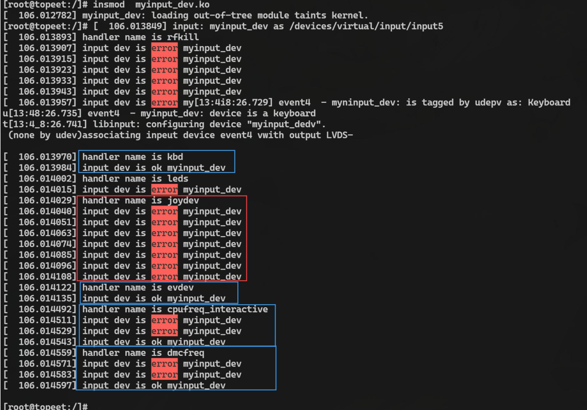

总结：

在输入子系统中，输入设备和输入处理器之间的关系是多对多的。

这意味着**一个输入设备可以与多个输入处理器关联，而一个输入处理器也可以处理多个输入设备的事件**。


## 完善设备驱动层代码

### 上报事件

**上报事件是指在设备驱动层中，当输入设备产生事件时，将该事件通知给输入子系统**。

在上报事件之前，首先要确定要上报的事件类型。事件类型可以是按键事件、相对位置事件、绝对位置事件等，取决于输入设备的特性和能力。

在 Linux 内核中，事件类型由预定义的常量表示，如 EV_KEY 表示按键事件，EV_REL 表示相对位置事件，EV_ABS 表示绝对位置事件等。
在前面编写的最简单的设备驱动层代码的第二个步骤中已经对事件类型和具体事件进行了确认。 

而在确定事件类型之后，就需要使用相应的上报函数将事件数据传递给输入子系统。常用的上报函数包括：

- `input_report_key()`：上报按键事件，用于通知按键的按下和释放状态。
- `input_report_rel()`：上报相对位置事件，用于通知设备的相对移动量，如鼠标的移动。
- `input_report_abs()`：上报绝对位置事件，用于通知设备的绝对位置，如触摸屏的坐标。


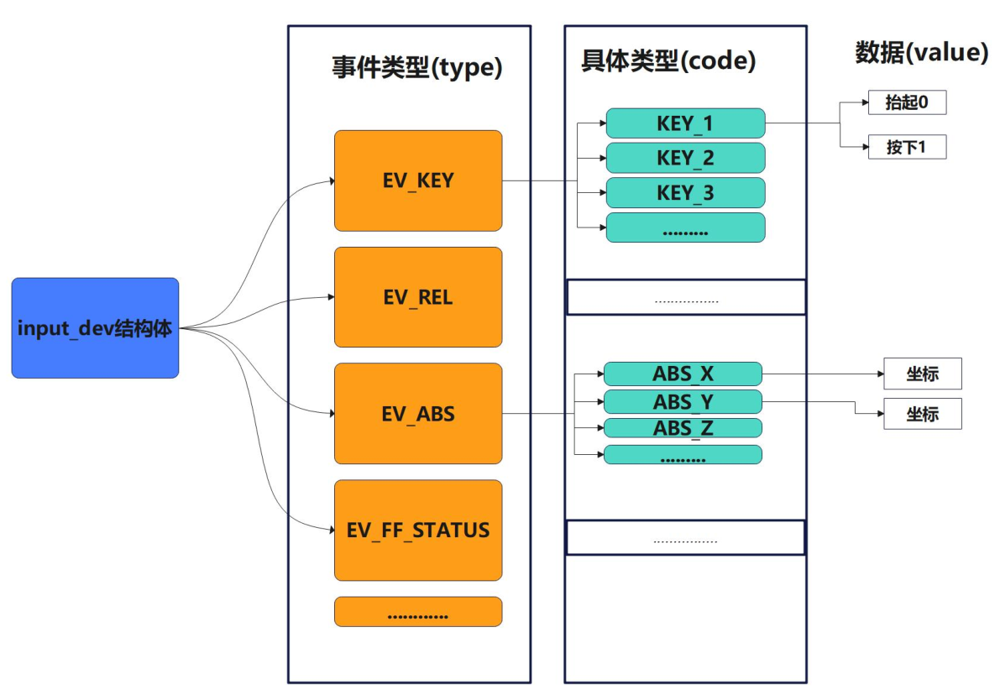

### 上报函数

#### input_report_key()

| 项目         | 说明                                                         |
| ------------ | ------------------------------------------------------------ |
| **头文件**   | `<linux/input.h>`                                            |
| **函数原型** | `void input_report_key(struct input_dev *dev, unsigned int code, int value)` |
| **参数**     | - `dev`：指向输入设备结构体 `input_dev` 的指针 - `code`：按键事件码（如 `KEY_A`, `BTN_TOUCH` 等） - `value`：按键状态（0 = 释放，非 0 = 按下） |
| **返回值**   | 无（`void`）                                                 |
| **作用**     | 上报一个 **按键事件（EV_KEY）**。用于键盘、按钮、触摸屏点击等场景。 |

------

#### input_report_rel()

| 项目         | 说明                                                         |
| ------------ | ------------------------------------------------------------ |
| **头文件**   | `<linux/input.h>`                                            |
| **函数原型** | `void input_report_rel(struct input_dev *dev, unsigned int code, int value)` |
| **参数**     | - `dev`：指向 `input_dev` 的指针 - `code`：相对轴类型（如 `REL_X`, `REL_Y`, `REL_WHEEL`） - `value`：相对于上一次位置的偏移量（可正可负） |
| **返回值**   | 无（`void`）                                                 |
| **作用**     | 上报一个 **相对坐标事件（EV_REL）**。常用于鼠标、滚轮等设备。 |

#### input_report_abs()

| 项目         | 说明                                                         |
| ------------ | ------------------------------------------------------------ |
| **头文件**   | `<linux/input.h>`                                            |
| **函数原型** | `void input_report_abs(struct input_dev *dev, unsigned int code, int value)` |
| **参数**     | - `dev`：指向 `input_dev` 的指针 - `code`：绝对轴类型（如 `ABS_X`, `ABS_Y`, `ABS_MT_POSITION_X`） - `value`：当前的绝对坐标值 |
| **返回值**   | 无（`void`）                                                 |
| **作用**     | 上报一个 **绝对坐标事件（EV_ABS）**。用于触摸屏、手写板、游戏手柄摇杆等设备。 |

------

#### input_report_ff_status()

| 项目         | 说明                                                         |
| ------------ | ------------------------------------------------------------ |
| **头文件**   | `<linux/input.h>`                                            |
| **函数原型** | `void input_report_ff_status(struct input_dev *dev, unsigned int code, int value)` |
| **参数**     | - `dev`：指向 `input_dev` 的指针 - `code`：力反馈效果 ID（通常由用户空间分配） - `value`：力反馈状态（0 = 停止，非 0 = 正在播放） |
| **返回值**   | 无（`void`）                                                 |
| **作用**     | 上报 **力反馈（Force Feedback）状态事件（EV_FF_STATUS）**，用于通知用户空间某个力反馈效果的当前运行状态。 |

> ⚠️ 注：该函数较少使用，多数力反馈由内核主动控制，而非设备上报状态。

------

#### input_report_switch()

| 项目         | 说明                                                         |
| ------------ | ------------------------------------------------------------ |
| **头文件**   | `<linux/input.h>`                                            |
| **函数原型** | `void input_report_switch(struct input_dev *dev, unsigned int code, int value)` |
| **参数**     | - `dev`：指向 `input_dev` 的指针 - `code`：开关类型（如 `SW_LID`, `SW_TABLET_MODE`） - `value`：开关状态（0 = 关闭/打开盖子，非 0 = 打开/合上盖子，具体含义依类型而定） |
| **返回值**   | 无（`void`）                                                 |
| **作用**     | 上报一个 **开关状态事件（EV_SW）**。常用于笔记本翻盖检测、平板模式切换等硬件开关。 |

------

#### input_sync()

| 项目         | 说明                                                         |
| ------------ | ------------------------------------------------------------ |
| **头文件**   | `<linux/input.h>`                                            |
| **函数原型** | `void input_sync(struct input_dev *dev)`                     |
| **参数**     | - `dev`：指向 `input_dev` 的指针                             |
| **返回值**   | 无（`void`）                                                 |
| **作用**     | 发送一个 **同步事件（EV_SYN / SYN_REPORT）**，表示一组相关事件已完整上报。用户空间会将此前所有未同步的事件视为“同一时间发生”的一个事件包。**每次上报完一组数据后必须调用此函数**，否则事件可能不会被处理。 |


#### input_event()

```c
/**
 * input_event() - report new input event
 * @dev: device that generated the event
 * @type: type of the event
 * @code: event code
 * @value: value of the event
 *
 * This function should be used by drivers implementing various input
 * devices to report input events. See also input_inject_event().
 *
 * NOTE: input_event() may be safely used right after input device was
 * allocated with input_allocate_device(), even before it is registered
 * with input_register_device(), but the event will not reach any of the
 * input handlers. Such early invocation of input_event() may be used
 * to 'seed' initial state of a switch or initial position of absolute
 * axis, etc.
 */
void input_event(struct input_dev *dev,
		 unsigned int type, unsigned int code, int value)
{
	unsigned long flags;

	if (is_event_supported(type, dev->evbit, EV_MAX)) {

		spin_lock_irqsave(&dev->event_lock, flags);
		input_handle_event(dev, type, code, value);
		spin_unlock_irqrestore(&dev->event_lock, flags);
	}
}
EXPORT_SYMBOL(input_event);

```

#### 补充说明

- 所有上述函数均为 **内联函数（inline）**，内部最终调用 `input_event(dev, type, code, value)`。
- 事件类型（`type`）由函数隐式确定：
  - `input_report_key` → `EV_KEY`
  - `input_report_rel` → `EV_REL`
  - `input_report_abs` → `EV_ABS`
  - `input_report_ff_status` → `EV_FF_STATUS`
  - `input_report_switch` → `EV_SW`
  - `input_sync` → `EV_SYN`（`code = SYN_REPORT`）

这些函数是 Linux 输入子系统驱动开发中最核心的 API，用于将硬件产生的原始数据转换为标准输入事件供用户空间（如 evdev、libinput、X11/Wayland）使用。

在使用上报函数之后，通常会调用 `input_sync()`函数进行同步。同步事件的目的是告知输入子系统事件的结束，以便子系统可以将事件传递给相应的应用程序或系统组件进行处理。同步事件的调用可以防止事件数据的丢失或混乱。

### 示例

驱动，使用定时器每隔一段时间上报事件。

```c
#include <linux/module.h>
#include <linux/init.h>
#include <linux/input.h>
#include <linux/timer.h>

struct input_dev *myinput_dev;  // 输入设备结构体指针

static void timer_function(struct timer_list *t);

DEFINE_TIMER(test_timer, timer_function);  // 定义定时器

static void timer_function(struct timer_list *t)
{
    static int value = 0;  // 静态变量用于切换键值

    value = value ? 0 : 1;
    input_event(myinput_dev, EV_KEY, KEY_1, value);      // 发送按键事件
    input_event(myinput_dev, EV_SYN, SYN_REPORT, 0);     // 发送同步事件

    mod_timer(&test_timer, jiffies + msecs_to_jiffies(1000));  // 更新定时器
}

static int myinput_dev_init(void)
{
    int ret;

    myinput_dev = input_allocate_device();  // 分配输入设备
    if (myinput_dev == NULL) {
        printk("input_allocate_device error\n");
        return -ENOMEM;
    }

    myinput_dev->name = "myinput_dev";  // 设置设备名

    set_bit(EV_KEY, myinput_dev->evbit);   // 支持按键事件
    set_bit(EV_SYN, myinput_dev->evbit);   // 支持同步事件
    set_bit(KEY_1, myinput_dev->keybit);   // 支持 KEY_1 按键

    ret = input_register_device(myinput_dev);  // 注册输入设备
    if (ret < 0) {
        printk("input_register_device error\n");
        goto error;
    }

    mod_timer(&test_timer, jiffies + msecs_to_jiffies(1000));  // 启动定时器
    return 0;

error:
    input_free_device(myinput_dev);
    return ret;
}

static void myinput_dev_exit(void)
{
    del_timer(&test_timer);           // 删除定时器
    input_unregister_device(myinput_dev);  // 取消注册输入设备
    input_free_device(myinput_dev);   // 释放输入设备内存
}

module_init(myinput_dev_init);
module_exit(myinput_dev_exit);

MODULE_LICENSE("GPL");
MODULE_AUTHOR("topeet");
```


## 应用层获取上报数据

### input_event 结构体

应用层读取的数据为`input_event`结构体:

```c
struct input_event {
#if (__BITS_PER_LONG != 32 || !defined(__USE_TIME_BITS64)) && !defined(__KERNEL__)
	struct timeval time;
#define input_event_sec time.tv_sec
#define input_event_usec time.tv_usec
#else
	__kernel_ulong_t __sec;
#if defined(__sparc__) && defined(__arch64__)
	unsigned int __usec;
	unsigned int __pad;
#else
	__kernel_ulong_t __usec;
#endif
#define input_event_sec  __sec
#define input_event_usec __usec
#endif
	__u16 type;// 类型
	__u16 code;// 具体事件
	__s32 value;// 对应的取值
};
```

- **type**：type 用于描述发生了哪一种类型的事件（对事件的分类），Linux 系统所支持的输入事件类型如下所示，这些宏定义同样在`<linux/input.h>`头文件中，所以在应用程序中需要包含该头文件；
  - EV_SYN (0x00): 用于**同步事件**，表示一组输入事件的结束。
  - EV_KEY (0x01): 用于**按键事件**，表示按下、释放或重复一个键。
  - EV_REL (0x02): 用于**相对位移事件**，表示设备的相对位置变化，例如鼠标的移动。
  - EV_ABS (0x03): 用于**绝对位移事件**，表示设备的绝对位置变化，例如触摸屏的坐标。
  - EV_MSC (0x04): 用于**杂项事件**，包含一些特殊目的的事件类型，例如设备状态变化等。
  - EV_SW (0x05): 用于**开关事件**，表示开关的状态变化，例如电源按钮、开合盖等。
  - EV_LED (0x11): 用于 **LED 事件**，表示 LED 灯的状态变化。
  - EV_SND (0x12): 用于**声音事件**，表示声音的播放相关事件。
  - EV_REP (0x14): 用于**重复事件**，表示键盘重复发送事件。
  - EV_FF (0x15): 用于**力反馈事件**，表示力反馈设备的输出事件。
  - EV_PWR (0x16): 用于**电源事件**，表示电源状态变化。
  - EV_FF_STATUS (0x17): 用于**力反馈状态事件**，表示力反馈设备的状态变化。
  - EV_MAX (0x1f): 输入事件类型的最大值。
  - EV_CNT: 输入事件类型的数量。
- **code**：code 表示该类事件中的哪一个具体事件，以上列举的每一种事件类型中都包含了一系列具体事件，譬如一个键盘上通常有很多按键，而 code 变量则告知应用程序是哪一个按键发生了输入事件。

```c
#define KEY_RESERVED 0
#define KEY_ESC 1 //ESC 键
#define KEY_1 2  //数字 1 键
#define KEY_2 3  //数字 2 键
#define KEY_3 4  //数字 3 键
#define KEY_4 5  //数字 4 键
#define KEY_5 6  //数字 5 键
#define KEY_6 7 //数字 6 键
#define KEY_7 8 //数字 7 键
#define KEY_8 9 //数字 8 键
#define KEY_9 10 //数字 9 键
#define KEY_0 11 //数字 0 键
#define KEY_MINUS 12 //减号键
#define KEY_EQUAL 13//加号键
#define KEY_BACKSPACE 14 //回退键
```

对于其他输入事件的 code 值 ，可以查看 `input-event-codes.h` 头文件 （该头文件被`<linux/input.h>`所包含）。

- **value**: 核每次上报事件都会向应用层发送一个数据 value，对 value 值的解释随着 code的变化而变化。
  - 譬如对于按键事件来说，如果 value 等于 1，则表示按键按下；value 等于 0 表示按键松开，如果 value 等于 2 则表示按键长按。
  - 而在绝对位移事件中（type=3），如果code=0（触摸点 X 坐标 ABS_X），那么 value 值就等于触摸点的 X 轴坐标值；如果 code=1（触摸点 Y 坐标 ABS_Y），此时 value 值便等于触摸点的 Y 轴坐标值。


### 示例

```c
#include <stdio.h>
#include <fcntl.h>
#include <unistd.h>
#include <linux/input.h>

int main() {
    int fd;  // 文件描述符
    int ret;  // 返回值
    struct input_event event;  // 输入事件结构体

    fd = open("/dev/input/event4", O_RDWR);  // 打开输入设备文件
    if (fd < 0) {
        printf("打开错误\n");
        return -1;
    }

    while (1) {
        ret = read(fd, &event, sizeof(struct input_event));  // 读取输入事件
        if (ret < 0) {
            printf("读取错误\n");
            return -2;
        }

        if (event.type == EV_KEY) {  // 判断事件类型为键盘事件
            if (event.code == KEY_1) {  // 判断键码为1
                if (event.value == 1)
                    printf("值为1\n");
                else if (event.value == 0)
                    printf("值为0\n");
            }
        }
    }

    return 0;
}

```


### 上报数据格式

以使用命令`hexdump /dev/input/event4`来查看上报的信息。

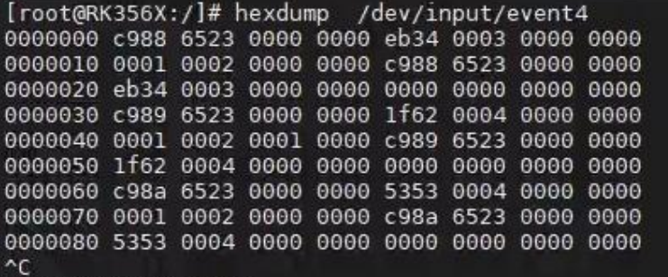

```c
struct input_event {
#if (__BITS_PER_LONG != 32 || !defined(__USE_TIME_BITS64)) && !defined(__KERNEL__)
	struct timeval time;
#define input_event_sec time.tv_sec
#define input_event_usec time.tv_usec
#else
	__kernel_ulong_t __sec;
#if defined(__sparc__) && defined(__arch64__)
	unsigned int __usec;
	unsigned int __pad;
#else
	__kernel_ulong_t __usec;
#endif
#define input_event_sec  __sec
#define input_event_usec __usec
#endif
	__u16 type;// 类型
	__u16 code;// 具体事件
	__s32 value;// 对应的取值
};
```

- 在 `input_event` 数据包中，有四个成员变量：time, type, code, value。
  - `time.tv_sec` 和 `time.tv_usec` 的类型是 long int,占 8 个字节，所以`time`占16个字节
  - `__u16 type` 的类型是 unsigned short int,占 2 个字节
  - `__u16 code` 的类型是 unsigned short int,占 2 个字节
  - `__s32 value` 的类型是 unsigned int，占 4 个字节

因此，一个 input_event 数据包所占字节的大小为 8+8+2+2+4 =24 个字节

>  一般情况下，`input_event` 数据包的字节顺序是小端字节序（Little Endian）。这意味着较低的字节位于较高的内存地址处。

假设 hexdump 输出的数据（以 16 进制表示）如下：

```c
root@topeet:~$ hexdump /dev/input/event2
0000000 0f09 65d3 0000 0000 36fb 0001 0000 0000
0000010 0003 0039 0000 0000 0f09 65d3 0000 0000
0000020 36fb 0001 0000 0000 0003 0035 00f5 0000
0000030 0f09 65d3 0000 0000 36fb 0001 0000 0000
0000040 0003 0036 02b2 0000 0f09 65d3 0000 0000
0000050 36fb 0001 0000 0000 0003 0030 0021 0000
```

第一个`input_event`对应成员如下：

- **tv_sec**        0f09 65d3 0000 0000
- **tv_usec**     36fb 0001 0000 0000
- **type**           0003
- **code**           0039
- **value**         0000 0000


## 通用事件处理层 evdev

### connect 函数分析


```c
// drivers/input/evdev.c
static struct input_handler evdev_handler = {
	.event		= evdev_event, // 事件处理函数指针，指向名为 evdev_event 的函数，用于处理输入事件
	.events		= evdev_events,// 批量事件处理函数指针，指向名为 evdev_events 的函数，用于处理输入设备的多个事件
	.connect	= evdev_connect,// 当 input_dev 和 input_handler 匹配成功之后执行的连接处理函数
	.disconnect	= evdev_disconnect,// 断开连接处理函数
	.legacy_minors	= true,// 设置为 true,表示支持传统次设备号，如果设置为 false,则使用动态的次设备号分配方式
	.minor		= EVDEV_MINOR_BASE,// 输入设备的基础次设备号
	.name		= "evdev",// 设备名称，设置为字符串 "evdev"
	.id_table	= evdev_ids,// 输入设备 ID 表，指向名为 evdev_ids 的表，用于匹配输入设备的 ID
};
static int __init evdev_init(void)
{
	return input_register_handler(&evdev_handler);
}

```


#### evdev 结构体

```c
struct evdev {
	int open;// 记录 evdev 设备打开的状态
	struct input_handle handle;// 输入事件处理器的句柄
	struct evdev_client __rcu *grab;// 指向当前占用 evdev 设备的客户端
	struct list_head client_list;// 与 evdev 设备关联的客户端链表
	spinlock_t client_lock; /* protects client_list */ // 用于保护客户端链表的自旋锁
	struct mutex mutex;// 用于保护对 evdev 设备的互斥访问
	struct device dev;// 与 evdev 设备关联的设备结构
	struct cdev cdev;// evdev 设备的字符设备结构
	bool exist;// 表示 evdev 设备是否存在
};
```

- **open**: 记录 evdev 设备的打开状态，可能的取值为 0（关闭）或 1（打开）。
- **handle**: 用于处理输入事件的句柄，包含了与事件处理器相关的信息，如打开的输入设备和事件处理函数等。
- **grab**: 指向当前占用 evdev 设备的客户端。当某个客户端占用了 evdev 设备时，其他客户端无法访问该设备。
- **client_list**:  与 evdev 设备关联的客户端链表，用于管理连接到该设备的客户端。
- **client_lock**: 用于保护客户端链表的自旋锁，确保在多线程环境下对客户端链表的操作线程是安全的。
- **mutex**: 用于保护对 evdev 设备的互斥访问，确保在多线程环境下对设备的操作是互斥的。
- **dev**: 与 evdev 设备关联的设备结构体，用于表示设备的特定信息，如设备名称，设备号等。
- **cdev**: evdev 设备的字符设备结构，用于注册和管理字符设备。
- **exist**: 表示 evdev 设备是否存在的标志。如果设备存在，则为 true;否则为 false。


#### evdev_client 结构体

这个结构体定义了一个 evdev 客户端的相关信息和状态，用于管理与 evdev 设备相关联的客户端，**在应用程序中每打开一遍 event 设备节点，就会用一个 `evdev_client` 结构体来表示**，系统可以为每个 evdev 设备维护多个客户端，并管理每个客户端的状态和属性。

在 evdev.c 中，也会对这个结构体进行操作，并根据客户端的状态和属性，将接收到的事件写入缓冲区或通知客户端。

```c
struct evdev_client {
	unsigned int head; // 缓冲区的头指针，指向下一个可写入的位置
	unsigned int tail; // 缓冲区的尾指针，指向下一个可读取的位置
	unsigned int packet_head; /* [future] position of the first element of next packet */ // [未来] 下一个数据包的第一个元素的位置
	spinlock_t buffer_lock; /* protects access to buffer, head and tail */ // 用于保护对缓冲区、头指针和尾指针的访问的自旋锁
	wait_queue_head_t wait;
	struct fasync_struct *fasync;// 用于异步通知的结构体指针
	struct evdev *evdev;// 与客户端关联的 evdev 设备指针
	struct list_head node;// 与 evdev 设备关联的客户端链表节点
	enum input_clock_type clk_type;// 输入时钟类型
	bool revoked;// 标志，指示客户端是否被撤销
	unsigned long *evmasks[EV_CNT];// 用于事件掩码的数组
	unsigned int bufsize;// 缓冲区的大小
	struct input_event buffer[];// 输入事件缓冲区，可变长度数组
};
```

- **head**: 缓冲区的头指针，指向下一个可写入的位置。
- **tail**:缓冲区的尾指针，指向下一个可读取的位置。
- **packet_head**:下一个数据包的第一个元素的位置。
- **buffer_lock**：用于保护对缓冲区，头指针和尾指针的访问的自旋锁，在多线程环境下确保对缓冲区的操作线程是安全的。
- **fasync**:用于异步通知的结构体指针，在需要异步通知时，将其设置为相应的值。
- **evdev**:与客户端关联的 evdev 设备指针，表示客户端所属的 evdev 设备。
- **node**:与 evdev 设备关联的客户端链表节点，用于管理与设备关联的客户端。
- **clk_type**:输入时钟类型，表示客户端使用的输入时钟类型。
- **revoked**:标志，指示客户端是否被撤销。
- **evmasks**:用于事件掩码的数组，存储了不同类型事件的掩码，数组的大小由 EV_CNT 定义。
- **bufsize**:缓冲区的大小，表示缓冲区可以容纳的输入事件数量。
- **buffer[]**:输入事件缓冲区，是一个可变长度数组，存储了输入事件数据。


#### evdev_connect()

`input_handler`的connect函数。

`input_register_handler()`中调用`input_attach_handler()`，该函数又调用`input_handler`的connect函数，`error = handler->connect(handler, dev, id)`即`evdev_connect()`

该函数的主要功能是建立与输入设备的连接，初始化并注册输入句柄，设置设备属性，并添加字符设备到系统中

```c
#define EVDEV_MINOR_BASE	64
#define EVDEV_MINORS		32
/*
 * Create new evdev device. Note that input core serializes calls
 * to connect and disconnect.
 */
static int evdev_connect(struct input_handler *handler, struct input_dev *dev,
			 const struct input_device_id *id)
{
	struct evdev *evdev;
	int minor;
	int dev_no;
	int error;
	// 获取一个新的次设备号
	minor = input_get_new_minor(EVDEV_MINOR_BASE, EVDEV_MINORS, true);
	if (minor < 0) {
		error = minor;
		pr_err("failed to reserve new minor: %d\n", error);
		return error;
	}
    // 分配并初始化 evdev 结构体
	evdev = kzalloc(sizeof(struct evdev), GFP_KERNEL);
	if (!evdev) {
		error = -ENOMEM;
		goto err_free_minor;
	}
	// 初始化 evdev 结构体中的成员
	INIT_LIST_HEAD(&evdev->client_list);// 初始化客户端链表
	spin_lock_init(&evdev->client_lock);// 初始化客户端链表的自旋锁
	mutex_init(&evdev->mutex);// 初始化互斥锁
	evdev->exist = true;// 设置 evdev 存在标志为 true，表示 evdev 存在。

	dev_no = minor;// 根据次设备号计算设备号 dev_no,并根据情况将其归一化为传统范围内的设备号。
	/* Normalize device number if it falls into legacy range */
	if (dev_no < EVDEV_MINOR_BASE + EVDEV_MINORS)// 如果设备号在旧版范围内，则进行标准化处理
		dev_no -= EVDEV_MINOR_BASE;
	dev_set_name(&evdev->dev, "event%d", dev_no);// 设置设备名称

	evdev->handle.dev = input_get_device(dev);// 设置输入句柄的输入设备
	evdev->handle.name = dev_name(&evdev->dev);// 设置输入句柄的名称为设备名称
	evdev->handle.handler = handler;// 设置输入句柄的处理程序为传入的处理程序
	evdev->handle.private = evdev;//  设置输入句柄的私有数据指针为 evdev 结构体的指针

	evdev->dev.devt = MKDEV(INPUT_MAJOR, minor);// 设置设备号
	evdev->dev.class = &input_class;// 设置设备的类
	evdev->dev.parent = &dev->dev;// 设置设备的父设备
	evdev->dev.release = evdev_free;// 设置设备的释放函数为 evdev_free
	device_initialize(&evdev->dev);// 初始化设备

	error = input_register_handle(&evdev->handle);// 注册输入句柄
	if (error)
		goto err_free_evdev;

	cdev_init(&evdev->cdev, &evdev_fops);// 初始化字符设备结构体

	error = cdev_device_add(&evdev->cdev, &evdev->dev);// 添加字符设备
	if (error)
		goto err_cleanup_evdev;

	return 0;

 err_cleanup_evdev:
	evdev_cleanup(evdev);// 清理 evdev 结构体
	input_unregister_handle(&evdev->handle);// 取消注册输入句柄
 err_free_evdev:
	put_device(&evdev->dev);// 释放设备
 err_free_minor:
	input_free_minor(minor);// 释放次设备号
	return error;
}

```

可见 `connect` 函数的主要任务是将输入设备与事件处理器关联起来，以便在事件发生时调用相应的处理函数。

它通过注册输入处理器和设置回调函数来实现这一关联，并确保正确的事件处理器被调用。这种关联机制允许开发者根据需要自定义处理函数，以便根据输入设备上报的事件进行相应的处理。

### 分配设备号分析

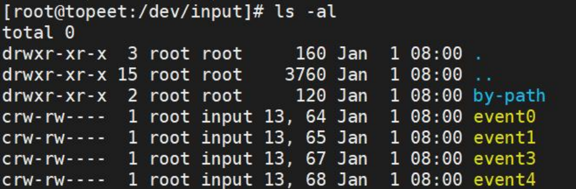

从上图中可以发现由 evdev.c 程序创建的设备节点 event0,event1,event2,event3 的主设备号都是 13，次设备号是 64,65,66,67。所有设备号的规律是主设备号全部都是 13，次设备号从 64 开始依次往后类推。

#### 主设备号

在 connect 函数中，使用 `	evdev->dev.devt = MKDEV(INPUT_MAJOR, minor);`设置了主设备号，主设备号为INPUT_MAJOR,也就是 13

```c
// include/uapi/linux/major.h
#define INPUT_MAJOR		13
```

#### 次设备号

在 connect 函数中，使用了`minor = input_get_new_minor(EVDEV_MINOR_BASE, EVDEV_MINORS, true);`函数获取了次设备号。而

```c
#define EVDEV_MINOR_BASE	64
#define EVDEV_MINORS		32
```


##### input_get_new_minor()

```c
/**
 * input_get_new_minor - allocates a new input minor number
 * @legacy_base: beginning or the legacy range to be searched
 * @legacy_num: size of legacy range
 * @allow_dynamic: whether we can also take ID from the dynamic range
 *
 * This function allocates a new device minor for from input major namespace.
 * Caller can request legacy minor by specifying @legacy_base and @legacy_num
 * parameters and whether ID can be allocated from dynamic range if there are
 * no free IDs in legacy range.
 */
int input_get_new_minor(int legacy_base, unsigned int legacy_num,
			bool allow_dynamic)
{
	/*
	 * This function should be called from input handler's ->connect()
	 * methods, which are serialized with input_mutex, so no additional
	 * locking is needed here.
	 */
	if (legacy_base >= 0) {
		int minor = ida_simple_get(&input_ida,
					   legacy_base,
					   legacy_base + legacy_num,
					   GFP_KERNEL);
		if (minor >= 0 || !allow_dynamic)
			return minor;
	}

	return ida_simple_get(&input_ida,
			      INPUT_FIRST_DYNAMIC_DEV, INPUT_MAX_CHAR_DEVICES,
			      GFP_KERNEL);
}
EXPORT_SYMBOL(input_get_new_minor);
```

上面的函数用于获取一个新的次设备号。主要功能是根据指定的条件获取一个新的次设备号。如果指定了 legacy_base，则优先从该范围内获取次设备号，如果获取失败或不允许动态分配，则尝试从动态分配的范围内获取次设备号。最终返回获取到的次设备号。

- 如果 legacy_base 大于等于 0，则执行以下逻辑：

  - 使用 `ida_simple_get()` 函数从 `input_ida` 中获取一个次设备号 `minor`,范围为 `legacy_base` 到 `legacy_base+legacy_num`

  - 如果获取到的次设备号 minor 大于等于 0 或者不允许动态分配（`allow_dynamic` 为 false），则返回次设备号 minor。

- 如果上述条件不满足，则执行以下逻辑：
  - 使 用 `ida_simple_get()` 函 数 从`input_ida` 中 获 取 一 个 次 设 备 号`minor` ， 范 围 为`INPUT_FIRST_DYNAMIC_DEV` 到 `INPUT_MAX_CHAR_DEVICES`。

而`ida_simple_get()`定义为:

```c
#define ida_simple_get(ida, start, end, gfp)	\
			ida_alloc_range(ida, start, (end) - 1, gfp)
```

`ida_alloc_range`函数用于在 ID 分配器中分配一个连续的 ID 范围。宏的参数解释如下：

- **ida**:    表示 IDA 对象的指针，用于管理 ID 范围的分配和释放。
- **start**: 表示分配的 ID 范围的起始 ID。
- **end**:  表示分配的 ID 范围的结束 ID。
- **gfp**:   表示用于内存分配的 GFP 标志。

### 文件操作集函数

在 `connect` 函数中，通过`	cdev_init(&evdev->cdev, &evdev_fops);`创建字符设备，创建字符设备中最重要的操作是实现文件操作集中的函数，如下:

```c
static const struct file_operations evdev_fops = {
	.owner		= THIS_MODULE,
	.read		= evdev_read,
	.write		= evdev_write,
	.poll		= evdev_poll,
	.open		= evdev_open,
	.release	= evdev_release,
	.unlocked_ioctl	= evdev_ioctl,
#ifdef CONFIG_COMPAT
	.compat_ioctl	= evdev_ioctl_compat,
#endif
	.fasync		= evdev_fasync,
	.llseek		= no_llseek,
};
```

#### open 函数分析

在 `connect` 函数中，通过`	cdev_init(&evdev->cdev, &evdev_fops);`创建字符设备，创建字符设备中最重要的操作是实现文件操作集中的函数，如下:

```c
static const struct file_operations evdev_fops = {
	.owner		= THIS_MODULE,
	.read		= evdev_read,
	.write		= evdev_write,
	.poll		= evdev_poll,
	.open		= evdev_open,
	.release	= evdev_release,
	.unlocked_ioctl	= evdev_ioctl,
#ifdef CONFIG_COMPAT
	.compat_ioctl	= evdev_ioctl_compat,
#endif
	.fasync		= evdev_fasync,
	.llseek		= no_llseek,
};
```

##### evdev_open()

```c
static int evdev_open(struct inode *inode, struct file *file)
{
    // 从 inode 的 i_cdev 成员中获取 evdev 结构体的指针
	struct evdev *evdev = container_of(inode->i_cdev, struct evdev, cdev);
    // 计算缓冲区大小
	unsigned int bufsize = evdev_compute_buffer_size(evdev->handle.dev);
    // 定义 evdev_client 结构体指针
	struct evdev_client *client;
	int error;
	
    // 分配内存用于存储 evdev_client 结构体和输入事件缓冲区
	client = kvzalloc(struct_size(client, buffer, bufsize), GFP_KERNEL);
	if (!client)
		return -ENOMEM;

    // 等待队列初始化
	init_waitqueue_head(&client->wait);
    // 初始化 client 结构体的成员变量
	client->bufsize = bufsize;
	spin_lock_init(&client->buffer_lock);
	client->evdev = evdev;
    // 将 client 添加到 evdev 的客户端列表中
	evdev_attach_client(evdev, client);
	
    // 打开底层设备
	error = evdev_open_device(evdev);
	if (error)
		goto err_free_client;
	
    // 将 client 结构体设置为文件的私有数据
	file->private_data = client;
    // 使用stream_open打开,标记文件是no_seekable的，不支持随机访问
	stream_open(inode, file);

	return 0;

 err_free_client:
    // 打开设备失败，需要进行错误处理，从 evdev 的客户端列表中移除 client
	evdev_detach_client(evdev, client);
    // 释放 client 分配的内存
	kvfree(client);
	return error;
}
```

##### stream_open()

```c
/*
 * stream_open is used by subsystems that want stream-like file descriptors.
 * Such file descriptors are not seekable and don't have notion of position
 * (file.f_pos is always 0 and ppos passed to .read()/.write() is always NULL).
 * Contrary to file descriptors of other regular files, .read() and .write()
 * can run simultaneously.
 *
 * stream_open never fails and is marked to return int so that it could be
 * directly used as file_operations.open .
 */
int stream_open(struct inode *inode, struct file *filp)
{
	filp->f_mode &= ~(FMODE_LSEEK | FMODE_PREAD | FMODE_PWRITE | FMODE_ATOMIC_POS);
	filp->f_mode |= FMODE_STREAM;
	return 0;
}

EXPORT_SYMBOL(stream_open);
```

##### edev_open_device()

```c
static int evdev_open_device(struct evdev *evdev)
{
	int retval;

	retval = mutex_lock_interruptible(&evdev->mutex);// 获取输入设备的互斥锁
	if (retval)// 如果无法获取锁，函数将返回相应的错误码
		return retval;

	if (!evdev->exist)// 如果该字段为假（0），表示输入设备不存在
		retval = -ENODEV;
	else if (!evdev->open++) {
		retval = input_open_device(&evdev->handle);// 调用 input_open_device 函数打开输入设备，并将返回值存储在 retval 变量中
		if (retval)// 如果打开设备失败，函数会将 evdev->open 减一，表示设备的打开计数器递减
			evdev->open--;
	}

	mutex_unlock(&evdev->mutex); // 释放输入设备的互斥锁
	return retval;
}

```

##### input_open_device()

`evdev_open_device()`中调用 `input_open_device()` 函数打开输入设备。该函数会调用`input_dev`的 `open()` 函数

```c
/**
 * input_open_device - open input device
 * @handle: handle through which device is being accessed
 *
 * This function should be called by input handlers when they
 * want to start receive events from given input device.
 */
int input_open_device(struct input_handle *handle)
{
	struct input_dev *dev = handle->dev;
	int retval;

	retval = mutex_lock_interruptible(&dev->mutex);
	if (retval)
		return retval;

	if (dev->going_away) {
		retval = -ENODEV;
		goto out;
	}

	handle->open++;

	if (dev->users++) {
		/*
		 * Device is already opened, so we can exit immediately and
		 * report success.
		 */
		goto out;
	}

	if (dev->open) {
		retval = dev->open(dev);
		if (retval) {
			dev->users--;
			handle->open--;
			/*
			 * Make sure we are not delivering any more events
			 * through this handle
			 */
			synchronize_rcu();
			goto out;
		}
	}

	if (dev->poller)
		input_dev_poller_start(dev->poller);

 out:
	mutex_unlock(&dev->mutex);
	return retval;
}
EXPORT_SYMBOL(input_open_device);

```


#### ioctl 函数分析

##### evdev_ioctl()

```c
static long evdev_ioctl(struct file *file, unsigned int cmd, unsigned long arg)
{
    // 调用 evdev_ioctl_handler 函数来处理 IO 控制操作，传递给它 file 指针，cmd 和
    // 类型转换后的 arg 作为参数。函数将 arg 转换为 void __user *类型，以便在用户空间和内核空
    // 间之间传递指针。函数将 evdev_ioctl_handler 的返回值作为自己的返回值，并将其直接返回给调用者
	return evdev_ioctl_handler(file, cmd, (void __user *)arg, 0);
}
```


##### evdev_ioctl_handler()

```c
static long evdev_ioctl_handler(struct file *file, unsigned int cmd,
				void __user *p, int compat_mode)
{
    // 从文件结构获取指向 evdev_client 的指针
	struct evdev_client *client = file->private_data;
    // 从 evdev_client 获取指向 evdev 的指针
	struct evdev *evdev = client->evdev;
	int retval;

    // 尝试获取 evdev 的互斥锁，如果无法获取则返回相应的错误码
	retval = mutex_lock_interruptible(&evdev->mutex);
	if (retval)
		return retval;
    
	// 检查设备是否存在或者客户端是否已被撤销
	if (!evdev->exist || client->revoked) {
		retval = -ENODEV;// 如果设备不存在或客户端已被撤销，则返回设备不存在的错误码
		goto out;
	}
	// 调用 evdev_do_ioctl 函数来执行实际的 IO 控制操作，并将返回值存储在 retval 变量中
	retval = evdev_do_ioctl(file, cmd, p, compat_mode);

 out:
	mutex_unlock(&evdev->mutex);// 解锁 evdev 的互斥锁
	return retval;
}
```


##### evdev_do_ioctl()

```c
static long evdev_do_ioctl(struct file *file, unsigned int cmd,
			   void __user *p, int compat_mode)
{
	struct evdev_client *client = file->private_data;
	struct evdev *evdev = client->evdev;
	struct input_dev *dev = evdev->handle.dev;
	struct input_absinfo abs;
	struct input_mask mask;
	struct ff_effect effect;
	int __user *ip = (int __user *)p;
	unsigned int i, t, u, v;
	unsigned int size;
	int error;

	/* First we check for fixed-length commands */
	switch (cmd) {

	case EVIOCGVERSION:
		return put_user(EV_VERSION, ip);

	case EVIOCGID:
		if (copy_to_user(p, &dev->id, sizeof(struct input_id)))
			return -EFAULT;
		return 0;

	case EVIOCGREP:
		if (!test_bit(EV_REP, dev->evbit))
			return -ENOSYS;
		if (put_user(dev->rep[REP_DELAY], ip))
			return -EFAULT;
		if (put_user(dev->rep[REP_PERIOD], ip + 1))
			return -EFAULT;
		return 0;

	case EVIOCSREP:
		if (!test_bit(EV_REP, dev->evbit))
			return -ENOSYS;
		if (get_user(u, ip))
			return -EFAULT;
		if (get_user(v, ip + 1))
			return -EFAULT;

		input_inject_event(&evdev->handle, EV_REP, REP_DELAY, u);
		input_inject_event(&evdev->handle, EV_REP, REP_PERIOD, v);

		return 0;

	case EVIOCRMFF:
		return input_ff_erase(dev, (int)(unsigned long) p, file);

	case EVIOCGEFFECTS:
		i = test_bit(EV_FF, dev->evbit) ?
				dev->ff->max_effects : 0;
		if (put_user(i, ip))
			return -EFAULT;
		return 0;

	case EVIOCGRAB:
		if (p)
			return evdev_grab(evdev, client);
		else
			return evdev_ungrab(evdev, client);

	case EVIOCREVOKE:
		if (p)
			return -EINVAL;
		else
			return evdev_revoke(evdev, client, file);

	case EVIOCGMASK: {
		void __user *codes_ptr;

		if (copy_from_user(&mask, p, sizeof(mask)))
			return -EFAULT;

		codes_ptr = (void __user *)(unsigned long)mask.codes_ptr;
		return evdev_get_mask(client,
				      mask.type, codes_ptr, mask.codes_size,
				      compat_mode);
	}

	case EVIOCSMASK: {
		const void __user *codes_ptr;

		if (copy_from_user(&mask, p, sizeof(mask)))
			return -EFAULT;

		codes_ptr = (const void __user *)(unsigned long)mask.codes_ptr;
		return evdev_set_mask(client,
				      mask.type, codes_ptr, mask.codes_size,
				      compat_mode);
	}

	case EVIOCSCLOCKID:
		if (copy_from_user(&i, p, sizeof(unsigned int)))
			return -EFAULT;

		return evdev_set_clk_type(client, i);

	case EVIOCGKEYCODE:
		return evdev_handle_get_keycode(dev, p);

	case EVIOCSKEYCODE:
		return evdev_handle_set_keycode(dev, p);

	case EVIOCGKEYCODE_V2:
		return evdev_handle_get_keycode_v2(dev, p);

	case EVIOCSKEYCODE_V2:
		return evdev_handle_set_keycode_v2(dev, p);
	}

	size = _IOC_SIZE(cmd);

	/* Now check variable-length commands */
#define EVIOC_MASK_SIZE(nr)	((nr) & ~(_IOC_SIZEMASK << _IOC_SIZESHIFT))
	switch (EVIOC_MASK_SIZE(cmd)) {

	case EVIOCGPROP(0):
		return bits_to_user(dev->propbit, INPUT_PROP_MAX,
				    size, p, compat_mode);

	case EVIOCGMTSLOTS(0):
		return evdev_handle_mt_request(dev, size, ip);

	case EVIOCGKEY(0):
		return evdev_handle_get_val(client, dev, EV_KEY, dev->key,
					    KEY_MAX, size, p, compat_mode);

	case EVIOCGLED(0):
		return evdev_handle_get_val(client, dev, EV_LED, dev->led,
					    LED_MAX, size, p, compat_mode);

	case EVIOCGSND(0):
		return evdev_handle_get_val(client, dev, EV_SND, dev->snd,
					    SND_MAX, size, p, compat_mode);

	case EVIOCGSW(0):
		return evdev_handle_get_val(client, dev, EV_SW, dev->sw,
					    SW_MAX, size, p, compat_mode);

	case EVIOCGNAME(0):
		return str_to_user(dev->name, size, p);

	case EVIOCGPHYS(0):
		return str_to_user(dev->phys, size, p);

	case EVIOCGUNIQ(0):
		return str_to_user(dev->uniq, size, p);

	case EVIOC_MASK_SIZE(EVIOCSFF):
		if (input_ff_effect_from_user(p, size, &effect))
			return -EFAULT;

		error = input_ff_upload(dev, &effect, file);
		if (error)
			return error;

		if (put_user(effect.id, &(((struct ff_effect __user *)p)->id)))
			return -EFAULT;

		return 0;
	}

	/* Multi-number variable-length handlers */
	if (_IOC_TYPE(cmd) != 'E')
		return -EINVAL;

	if (_IOC_DIR(cmd) == _IOC_READ) {

		if ((_IOC_NR(cmd) & ~EV_MAX) == _IOC_NR(EVIOCGBIT(0, 0)))
			return handle_eviocgbit(dev,
						_IOC_NR(cmd) & EV_MAX, size,
						p, compat_mode);

		if ((_IOC_NR(cmd) & ~ABS_MAX) == _IOC_NR(EVIOCGABS(0))) {

			if (!dev->absinfo)
				return -EINVAL;

			t = _IOC_NR(cmd) & ABS_MAX;
			abs = dev->absinfo[t];

			if (copy_to_user(p, &abs, min_t(size_t,
					size, sizeof(struct input_absinfo))))
				return -EFAULT;

			return 0;
		}
	}

	if (_IOC_DIR(cmd) == _IOC_WRITE) {

		if ((_IOC_NR(cmd) & ~ABS_MAX) == _IOC_NR(EVIOCSABS(0))) {

			if (!dev->absinfo)
				return -EINVAL;

			t = _IOC_NR(cmd) & ABS_MAX;

			if (copy_from_user(&abs, p, min_t(size_t,
					size, sizeof(struct input_absinfo))))
				return -EFAULT;

			if (size < sizeof(struct input_absinfo))
				abs.resolution = 0;

			/* We can't change number of reserved MT slots */
			if (t == ABS_MT_SLOT)
				return -EINVAL;

			/*
			 * Take event lock to ensure that we are not
			 * changing device parameters in the middle
			 * of event.
			 */
			spin_lock_irq(&dev->event_lock);
			dev->absinfo[t] = abs;
			spin_unlock_irq(&dev->event_lock);

			return 0;
		}
	}

	return -EINVAL;
}

```

上述代码中的这些命令解释如下

- EVIOCGVERSION: 获取去掉版本号
- EVIOCGID：获取输入设备的 ID 信息
- EVIOCSREP：获取按键重复设置
- EVIOCGKEYCODE: 获取按键码
- EVIOCGKEYCODE_V2: 获取按键映射表
- EVIOCSKEYCODE：设置按键值
- EVIOCSKEYCODE_V2：设置按键映射表
- EVIOCGNAME(len)：获取设备名称
- EVIOCGPHYS(len)：获取物理位置
- EVIOCGUNIQ(len)：获取唯一标识符
- EVIOCGPROP(len)：获取设备属性
- EVIOCGMTSLOTS(len)：获取多点触控信息
- EVIOCGKEY(len)：获取全局按键状态
- EVIOCGLED(len)：获取所有 LED 状态
- EVIOCGSND(len)：获取所有声音状态
- EVIOCGSW(len)：获取所有开关状态
- EVIOCGBIT(ev,len)：获取事件位图
- EVIOCGABS(abs)：获取绝对值/范围
- EVIOCSABS(abs)：设置绝对值/范围
- EVIOCSFF：发送力反馈效果到力反馈设备
- EVIOCRMFF：删除力反馈效果
- EVIOCGEFFECTS：报告同时可播放的效果数量
- EVIOCGRAB：占用/释放输入设备
- EVIOCREVOKE：撤销设备访问权限
- EVIOCGMASK：检索当前事件掩码
- EVIOCSMASK：设置事件掩码
- EVIOCSCLOCKID：设置用于时间戳的时钟标识


#### poll 函数分析

```c
/* No kernel lock - fine */
static __poll_t evdev_poll(struct file *file, poll_table *wait)
{
    // 获取文件私有数据中的 evdev_client 结构体指针
	struct evdev_client *client = file->private_data;
    // 获取 evdev_client 结构体中的 evdev 指针
	struct evdev *evdev = client->evdev;
	__poll_t mask;
	
    // 将当前进程加入到等待队列中，等待 evdev->wait 的唤醒事件
	poll_wait(file, &client->wait, wait);
	
    // 检查 evdev->exist 和 client->revoked 的值
	if (evdev->exist && !client->revoked)
        // 如果 evdev 存在且 client 未被撤销，设置 mask 为 EPOLLOUT | EPOLLWRNORM
		mask = EPOLLOUT | EPOLLWRNORM;
	else
        // 否则，设置 mask 为 EPOLLHUP | EPOLLERR
		mask = EPOLLHUP | EPOLLERR;
	
    // 检查 client 中的 packet_head 和 tail 的值
	if (client->packet_head != client->tail)
        // 如果 packet_head 和 tail 不相等，设置 mask 为 mask | EPOLLIN | EPOLLRDNORM
		mask |= EPOLLIN | EPOLLRDNORM;

	return mask;
}

```


#### fasync 函数分析

```c
static int evdev_fasync(int fd, struct file *file, int on)
{
    // 获取文件私有数据中的 evdev_client 结构体指针
	struct evdev_client *client = file->private_data;

    // 调用 fasync_helper 函数来处理进程的异步通知
	// 该函数会根据 on 的值，将进程添加到或从异步通知的列表中
	// 并将通知相关的数据存储在 client->fasync 
	return fasync_helper(fd, file, on, &client->fasync);
}
```


#### llseek 函数分析

```c
loff_t no_llseek(struct file *file, loff_t offset, int whence)
{
	return -ESPIPE;
}
```

将`-ESPIPE` 作为返回值直接返回。这个函数的作用是阻止对设备文件执行 llseek 操作，也就是不允许通过改变文件位置指针来随机访问设备文件。


#### release 函数分析

```c
static int evdev_release(struct inode *inode, struct file *file)
{
    // 获取文件私有数据中的 evdev_client 结构体指针
	struct evdev_client *client = file->private_data;
    // 获取 evdev_client 结构体中的 evdev 指针
	struct evdev *evdev = client->evdev;
	unsigned int i;

    // 获取 evdev 的互斥锁，确保对 evdev 的操作是原子的
	mutex_lock(&evdev->mutex);
	
    // 检查 evdev->exist 和 client->revoked 的值
	if (evdev->exist && !client->revoked)
        // 如果 evdev 存在且 client 未被撤销，调用 input_flush_device 函数刷新设备的输入缓冲区
		input_flush_device(&evdev->handle, file);
	// 释放 evdev 的抢占状态，将客户端从抢占列表中移除
	evdev_ungrab(evdev, client);
    // 解锁 evdev 的互斥锁
	mutex_unlock(&evdev->mutex);
	
    // 从 evdev 中分离并释放客户端
	evdev_detach_client(evdev, client);
	
    // 释放客户端的事件掩码内存
	for (i = 0; i < EV_CNT; ++i)
		bitmap_free(client->evmasks[i]);
	
    // 释放客户端的内存
	kvfree(client);
	
    // 关闭 evdev 设备
	evdev_close_device(evdev);

	return 0;
}

```

### 数据上报流程

使用读函数来读取输入设备上报的数据时，驱动程序中的文件操作集会执行 `evdev_read` 函数。同样地，当我们使用写函数向输入设备写入数据时，驱动程序中的文件操作集会执行 `evdev_write` 函数。

设备输入层负责处理输入设备的数据，并将其传递给驱动程序。当输入设备上报数据时，设备输入层会接收到这些数据，并将其转发给注册的驱动程序。


#### event 函数分析

##### input_event()

上报事件时需要调用`input_event`

```c
/**
 * input_event() - report new input event
 * @dev: device that generated the event
 * @type: type of the event
 * @code: event code
 * @value: value of the event
 *
 * This function should be used by drivers implementing various input
 * devices to report input events. See also input_inject_event().
 *
 * NOTE: input_event() may be safely used right after input device was
 * allocated with input_allocate_device(), even before it is registered
 * with input_register_device(), but the event will not reach any of the
 * input handlers. Such early invocation of input_event() may be used
 * to 'seed' initial state of a switch or initial position of absolute
 * axis, etc.
 */
void input_event(struct input_dev *dev,
		 unsigned int type, unsigned int code, int value)
{
	unsigned long flags; // 用于保存中断标志
    
	// 检查输入设备是否支持指定的事件类型
	if (is_event_supported(type, dev->evbit, EV_MAX)) {
		// 获取事件锁，确保对事件的处理是原子的
		spin_lock_irqsave(&dev->event_lock, flags);
        // 调用 input_handle_event 函数处理输入事件
		input_handle_event(dev, type, code, value);
        // 释放事件锁
		spin_unlock_irqrestore(&dev->event_lock, flags);
	}
}
EXPORT_SYMBOL(input_event);
```

##### input_handle_event()

```c
static void input_handle_event(struct input_dev *dev,
			       unsigned int type, unsigned int code, int value)
{
    // 获取输入事件的处理方式, 即判断事件是应该被忽略、传递给设备还是传递给处理程序
	int disposition = input_get_disposition(dev, type, code, &value);
	
    // 如果事件不应被忽略且不是 EV_SYN 类型的事件，则将事件的类型、代码和值添加到输入随机数池中
	if (disposition != INPUT_IGNORE_EVENT && type != EV_SYN)
		add_input_randomness(type, code, value);
	// 如果事件应该传递给设备且设备有事件处理函数，则调用事件处理函数
	if ((disposition & INPUT_PASS_TO_DEVICE) && dev->event)
		dev->event(dev, type, code, value);
	// 如果输入设备没有值列表，则直接返回
	if (!dev->vals)
		return;
	// 如果事件应该传递给处理程序
	if (disposition & INPUT_PASS_TO_HANDLERS) {
		struct input_value *v;

        // 如果事件需要传递给处理程序的槽位，则将槽位信息添加到值列表中
		if (disposition & INPUT_SLOT) {
			v = &dev->vals[dev->num_vals++];
			v->type = EV_ABS;
			v->code = ABS_MT_SLOT;
			v->value = dev->mt->slot;
		}
		// 将事件的类型、代码和值添加到值列表中
		v = &dev->vals[dev->num_vals++];
		v->type = type;
		v->code = code;
		v->value = value;
	}
	// 如果事件需要刷新值列表
	if (disposition & INPUT_FLUSH) {
        // 如果值列表中的值大于等于 2，则传递值列表中的值给设备的处理函数
		if (dev->num_vals >= 2)
			input_pass_values(dev, dev->vals, dev->num_vals);
		dev->num_vals = 0;
		/*
		 * Reset the timestamp on flush so we won't end up
		 * with a stale one. Note we only need to reset the
		 * monolithic one as we use its presence when deciding
		 * whether to generate a synthetic timestamp.
		 */
        /*
		* 重置刷新时的时间戳，以避免出现过时的时间戳。
		* 注意，我们只需要重置单一时间戳（INPUT_CLK_MONO），
		* 因为在决定是否生成合成时间戳时，我们使用它的存在。
		*/
		dev->timestamp[INPUT_CLK_MONO] = ktime_set(0, 0);
	} else if (dev->num_vals >= dev->max_vals - 2) {// 如果值列表中的值大于等于设备的最大值减去 2
        // 将同步事件添加到值列表中
		dev->vals[dev->num_vals++] = input_value_sync;
        // 传递值列表中的值给设备的处理函数
		input_pass_values(dev, dev->vals, dev->num_vals);
		dev->num_vals = 0;
	}

}

```

##### input_get_disposition()

```c
static int input_get_disposition(struct input_dev *dev,
			  unsigned int type, unsigned int code, int *pval)
{
	int disposition = INPUT_IGNORE_EVENT;// 事件的处理方式，默认为忽略
	int value = *pval;

	switch (type) {

	case EV_SYN:
		switch (code) {
		case SYN_CONFIG:
			disposition = INPUT_PASS_TO_ALL;// 将事件传递给所有处理程序
			break;

		case SYN_REPORT:
			disposition = INPUT_PASS_TO_HANDLERS | INPUT_FLUSH;// 将事件传递给处理程序，并刷新值列表
			break;
		case SYN_MT_REPORT:
			disposition = INPUT_PASS_TO_HANDLERS;// 将事件传递给处理程序
			break;
		}
		break;

	case EV_KEY:
		if (is_event_supported(code, dev->keybit, KEY_MAX)) {

			/* auto-repeat bypasses state updates */
            // 自动重复事件不更新状态，直接传递给处理程序
			if (value == 2) {
				disposition = INPUT_PASS_TO_HANDLERS;
				break;
			}
			// 判断按键状态是否改变，若改变则更新状态并传递给处理程序
			if (!!test_bit(code, dev->key) != !!value) {

				__change_bit(code, dev->key);
				disposition = INPUT_PASS_TO_HANDLERS;
			}
		}
		break;

	case EV_SW:
		if (is_event_supported(code, dev->swbit, SW_MAX) &&
		    !!test_bit(code, dev->sw) != !!value) {
			// 判断开关状态是否改变，若改变则更新状态并传递给处理程序
			__change_bit(code, dev->sw);
			disposition = INPUT_PASS_TO_HANDLERS;
		}
		break;

	case EV_ABS:
		if (is_event_supported(code, dev->absbit, ABS_MAX))
			disposition = input_handle_abs_event(dev, code, &value);// 处理绝对事件的特殊情况

		break;

	case EV_REL:
		if (is_event_supported(code, dev->relbit, REL_MAX) && value)
			disposition = INPUT_PASS_TO_HANDLERS;// 将事件传递给处理程序

		break;

	case EV_MSC:
		if (is_event_supported(code, dev->mscbit, MSC_MAX))
			disposition = INPUT_PASS_TO_ALL;// 将事件传递给所有处理程序

		break;

	case EV_LED:
		if (is_event_supported(code, dev->ledbit, LED_MAX) &&
		    !!test_bit(code, dev->led) != !!value) {
			// 判断 LED 状态是否改变，若改变则更新状态并传递给所有处理程序
			__change_bit(code, dev->led);
			disposition = INPUT_PASS_TO_ALL;
		}
		break;

	case EV_SND:
		if (is_event_supported(code, dev->sndbit, SND_MAX)) {
			// 判断声音状态是否改变，若改变则更新状态并传递给所有处理程序
			if (!!test_bit(code, dev->snd) != !!value)
				__change_bit(code, dev->snd);
			disposition = INPUT_PASS_TO_ALL;
		}
		break;

	case EV_REP:
		if (code <= REP_MAX && value >= 0 && dev->rep[code] != value) {
            // 更新重复事件的设置，并将事件传递给所有处理程序
			dev->rep[code] = value;
			disposition = INPUT_PASS_TO_ALL;
		}
		break;

	case EV_FF:
		if (value >= 0)
			disposition = INPUT_PASS_TO_ALL;// 将事件传递给所有处理程序
		break;

	case EV_PWR:
		disposition = INPUT_PASS_TO_ALL;// 将事件传递给所有处理程序
		break;
	}

	*pval = value; // 将事件的值更新为处理后的值
	return disposition; // 返回事件的处理方式
}

```

该函数用于根据输入设备的类型、代码和值，确定事件的处理方式。首先，根据事件的类型进行分支判断。每个分支中会根据事件的类型和代码判断事件的处理方式，并相应地更新 disposition（事件的处理方式）。disposition 有以下几种方式

- `INPUT_IGNORE_EVENT`：表示忽略该输入事件，不进行任何处理
- `INPUT_PASS_TO_HANDLERS` ：表示将输入事件传递给处理程序进行处理。处理程序可以是输入驱动程序中的回调函数，也可以是用户空间的应用程序或服务进程。
- `INPUT_PASS_TO_DEVICE` ：表示将输入事件传递给设备进行处理。设备可能包括物理设备（如键盘，鼠标）或虚拟设备（如触摸屏模拟器）。
- `INPUT_SLOT`：用于触摸屏模拟器，表示输入事件是触摸屏幕上的特定槽位的事件，通常，在处理多点触摸事件时，每个触点都对应一个槽位。
- `INPUT_FLUSH`：表示需要刷新输入事件队列。当输入事件队列积累到一定数量或满时，以使用此标志刷新队列，将事件传递给设备进行处理。
- `INPUT_PASS_TO_ALL` (`INPUT_PASS_TO_HANDLERS` | `INPUT_PASS_TO_DEVICE`)：表示将输入事件同时传递给处理程序和设备进行处理，即综合使用 `INPUT_PASS_TO_HANDLERS` 和 `INPUT_PASS_TO_DEVICE` 的功能。


##### input_pass_values()

该函数用于将输入设备的值传递给相应的句柄进行处理，并触发按键事件的自动重复。

```c
/*
 * Pass values first through all filters and then, if event has not been
 * filtered out, through all open handles. This function is called with
 * dev->event_lock held and interrupts disabled.
 */
static void input_pass_values(struct input_dev *dev,
			      struct input_value *vals, unsigned int count)
{
	struct input_handle *handle;// 输入设备的句柄
	struct input_value *v;// 当前处理的值

	if (!count)
		return;// 如果值的数量为 0，则直接返回

	rcu_read_lock();// 读取 RCU 锁

	handle = rcu_dereference(dev->grab);// 获取设备的句柄
	if (handle) {
		count = input_to_handler(handle, vals, count);// 将值传递给句柄进行处理，并更新值的数量
	} else {
        // 遍历设备的句柄列表，将值传递给每个已打开的句柄进行处理，并更新值的数量
		list_for_each_entry_rcu(handle, &dev->h_list, d_node)
			if (handle->open) {
				count = input_to_handler(handle, vals, count);
				if (!count)
					break;
			}
	}

	rcu_read_unlock();// 解锁 RCU 锁

	/* trigger auto repeat for key events */
    /* 触发按键事件的自动重复 */
	if (test_bit(EV_REP, dev->evbit) && test_bit(EV_KEY, dev->evbit)) {
        // 遍历值列表，对于类型为 EV_KEY 且值不为 2 的事件：
        // 如果值为真，则启动按键的自动重复；
        // 如果值为假，则停止按键的自动重复
		for (v = vals; v != vals + count; v++) {
			if (v->type == EV_KEY && v->value != 2) {
				if (v->value)
					input_start_autorepeat(dev, v->code);
				else
					input_stop_autorepeat(dev);
			}
		}
	}
}

```

##### input_to_handler()

```c
/*
 * Pass event first through all filters and then, if event has not been
 * filtered out, through all open handles. This function is called with
 * dev->event_lock held and interrupts disabled.
 */
static unsigned int input_to_handler(struct input_handle *handle,
			struct input_value *vals, unsigned int count)
{
	struct input_handler *handler = handle->handler; // 输入句柄对应的处理程序
	struct input_value *end = vals; // 已处理的值的末尾
	struct input_value *v; // 当前处理的值

	if (handler->filter) {
        // 如果处理程序定义了过滤器函数，则对值列表中的每个值进行过滤
		for (v = vals; v != vals + count; v++) {
			if (handler->filter(handle, v->type, v->code, v->value))
				continue;// 如果过滤器函数返回真，则跳过当前值
			if (end != v)
				*end = *v;// 将当前值复制到已处理的值的末尾
			end++;
		}
		count = end - vals;// 更新处理后的值的数量
	}

	if (!count)
		return 0;// 如果处理后的值的数量为 0，则直接返回

	if (handler->events)
		handler->events(handle, vals, count);// 如果处理程序定义了事件处理函数，则将处理后的值传递给事件处理函数
	else if (handler->event)//// 如果处理程序定义了单个事件处理函数，则对每个值调用事件处理函数
		for (v = vals; v != vals + count; v++)
			handler->event(handle, v->type, v->code, v->value);

	return count;
}

```

可以看到：根据处理程序的定义，如果定义了事件处理函数（events 不为 NULL），它将处理后的值传递给事件处理函数。否则，如果只定义了单个事件处理函数（event 不为 NULL），它将对每个值调用事件处理函数，传递句柄、类型、代码和值作为参数。

##### evdev_event()

```c
static void evdev_event(struct input_handle *handle,
			unsigned int type, unsigned int code, int value)
{
	struct input_value vals[] = { { type, code, value } };

	evdev_events(handle, vals, 1);
}
```

`edev_event`就是调用`evdev_events`

##### evdev_events()

```c
/*
 * Pass incoming events to all connected clients.
 */
static void evdev_events(struct input_handle *handle,
			 const struct input_value *vals, unsigned int count)
{
	struct evdev *evdev = handle->private;// 获取输入句柄的私有数据，这里是 evdev 结构体类型
	struct evdev_client *client;// 定义 evdev 客户端指针
	ktime_t *ev_time = input_get_timestamp(handle->dev);// 获取输入设备的时间戳

	rcu_read_lock();// 开始读取 RCU 保护区域

	client = rcu_dereference(evdev->grab);// RCU 安全地获取当前的 evdev 客户端

	if (client)// 如果存在抢占的客户端，则将值传递给抢占的客户端
		evdev_pass_values(client, vals, count, ev_time);
	else
		list_for_each_entry_rcu(client, &evdev->client_list, node)
			evdev_pass_values(client, vals, count, ev_time);// 否则，将值传递给所有注册的客户端

	rcu_read_unlock();// 结束读取 RCU 保护区域
}
```

##### edev_pass_values()

```c
static void evdev_pass_values(struct evdev_client *client,
			const struct input_value *vals, unsigned int count,
			ktime_t *ev_time)
{
	const struct input_value *v;// 当前处理的输入值
	struct input_event event;// 输入事件结构体
	struct timespec64 ts;// 时间戳
	bool wakeup = false;// 是否需要唤醒等待线程

	if (client->revoked)
		return;// 如果客户端已被撤销，则直接返回

	ts = ktime_to_timespec64(ev_time[client->clk_type]);// 将 ev_time 转换为 struct timespec64 类型的时间戳
	event.input_event_sec = ts.tv_sec;// 输入事件的秒字段设置为时间戳的秒值
	event.input_event_usec = ts.tv_nsec / NSEC_PER_USEC;// 输入事件的微秒字段设置为时间戳的纳秒值除以 1000 得到的值

	/* Interrupts are disabled, just acquire the lock. */
    /* 关中断，只需获取锁即可。 */
	spin_lock(&client->buffer_lock);// 获取客户端的缓冲区锁

	for (v = vals; v != vals + count; v++) {
		if (__evdev_is_filtered(client, v->type, v->code))
			continue;// 如果输入值被过滤，则跳过当前值的处理

		if (v->type == EV_SYN && v->code == SYN_REPORT) {
			/* drop empty SYN_REPORT */
            /* 丢弃空的 SYN_REPORT */
			if (client->packet_head == client->head)
				continue;// 如果客户端的数据包头和数据头相同，则跳过当前值的处理

			wakeup = true;// 设置唤醒标志为真
		}

		event.type = v->type;// 设置输入事件的类型字段为当前值的类型
		event.code = v->code;// 设置输入事件的代码字段为当前值的代码
		event.value = v->value;// 设置输入事件的值字段为当前值的值
		__pass_event(client, &event);// 将输入事件传递给客户端的事件处理函数
	}

	spin_unlock(&client->buffer_lock);// 释放客户端的缓冲区锁

	if (wakeup)// 如果需要唤醒等待线程，则唤醒等待队列中的线程
		wake_up_interruptible_poll(&client->wait,
			EPOLLIN | EPOLLOUT | EPOLLRDNORM | EPOLLWRNORM);
}

```

##### __pass_event()

```c
static void __pass_event(struct evdev_client *client,
			 const struct input_event *event)
{
	client->buffer[client->head++] = *event;// 将事件复制到客户端的缓冲区中，然后将缓冲区头指针递增
	client->head &= client->bufsize - 1; // 将缓冲区头指针掩码处理，确保其在缓冲区范围内

	if (unlikely(client->head == client->tail)) {
		/*
		 * This effectively "drops" all unconsumed events, leaving
		 * EV_SYN/SYN_DROPPED plus the newest event in the queue.
		 */
        /*
		* 这实际上"丢弃"了所有未消耗的事件，只保留了 EV_SYN/SYN_DROPPED 加上最新的事件。
		*/
		client->tail = (client->head - 2) & (client->bufsize - 1);// 更新缓冲区尾指针，使其指向倒数第二个事件

		client->buffer[client->tail] = (struct input_event) {
			.input_event_sec = event->input_event_sec,
			.input_event_usec = event->input_event_usec,
			.type = EV_SYN,
			.code = SYN_DROPPED,
			.value = 0,
		};// 在缓冲区尾指针位置插入一个 EV_SYN/SYN_DROPPED 事件，表示丢弃了事件

		client->packet_head = client->tail;// 更新数据包头指针为缓冲区尾指针
	}

	if (event->type == EV_SYN && event->code == SYN_REPORT) {
		client->packet_head = client->head;// 更新数据包头指针为缓冲区头指针
		kill_fasync(&client->fasync, SIGIO, POLL_IN);// 向注册的异步通知处理函数发送 SIGIO 信号，通知有新的事件可读取
	}
}

```


#### read 函数分析

驱动程序可以通过注册到设备输入层的回调函数来获取输入设备上报的数据。在驱动程序中，`evdev_read` 函数就是用于从设备输入层获取输入设备上报的数据的函数。

##### edev_read()

`edev_read()`从 evdev 设备读取输入事件

```c
static ssize_t evdev_read(struct file *file, char __user *buffer,
			  size_t count, loff_t *ppos)
{
	struct evdev_client *client = file->private_data;// 获取文件私有数据中的 evdev 客户端结构体指针
	struct evdev *evdev = client->evdev;// 获取客户端结构体中的 evdev 结构体指针
	struct input_event event;// 定义一个输入事件结构体
	size_t read = 0;// 已读取的字节数
	int error;

	if (count != 0 && count < input_event_size())
		return -EINVAL;// 如果 count 不为 0 且小于输入事件大小，返回无效参数错误

	for (;;) {// 循环读取输入事件并将其复制到用户空间缓冲区中
		if (!evdev->exist || client->revoked)
			return -ENODEV;// 如果 evdev 设备不存在或客户端已撤销，则返回设备不存在错误码

		if (client->packet_head == client->tail &&
		    (file->f_flags & O_NONBLOCK))
			return -EAGAIN;// 如果数据包头等于尾且文件标志中设置了非阻塞标志，返回暂无数据可读错误码

		/*
		 * count == 0 is special - no IO is done but we check
		 * for error conditions (see above).
		 */
		if (count == 0)// 如果 count 为 0，退出循环，不执行 IO 操作，但仍检查错误条件
			break;

		while (read + input_event_size() <= count &&
		       evdev_fetch_next_event(client, &event)) {

			if (input_event_to_user(buffer + read, &event))// 将输入事件数据复制到用户空间缓冲区中
				return -EFAULT;

			read += input_event_size();// 更新已读取的字节数
		}

		if (read)
			break;// 如果已读取的字节数大于 0，退出循环

		if (!(file->f_flags & O_NONBLOCK)) {
			error = wait_event_interruptible(client->wait,
					client->packet_head != client->tail ||
					!evdev->exist || client->revoked);// 等待事件的发生，阻塞当前线程
			if (error)
				return error;// 如果等待被中断，返回错误码
		}
	}

	return read;// 返回已读取的字节数
}

```


#### write 函数分析

当我们在应用程序中使用写函数向输入设备写入数据时，输入数据会被传递到驱动程序的 `evdev_write` 函数。驱动程序可以根据需要对这些写入的数据进行处理和响应。

##### edev_write()

该函数将输入事件写入到 evdev 设备的缓冲区中

```c
static ssize_t evdev_write(struct file *file, const char __user *buffer,
			   size_t count, loff_t *ppos)
{
	struct evdev_client *client = file->private_data;// 获取文件私有数据中的 evdev 客户端结构体指针
	struct evdev *evdev = client->evdev;// 获取客户端结构体中的 evdev 结构体指针
	struct input_event event;// 定义一个输入事件结构体
	int retval = 0;// 返回值变量，默认为 0

	if (count != 0 && count < input_event_size())
		return -EINVAL;// 如果 count 不为 0 且小于输入事件大小，返回无效参数错误

	retval = mutex_lock_interruptible(&evdev->mutex);// 对 evdev 的互斥锁进行上锁，可中断
	if (retval)
		return retval;// 如果上锁失败，返回错误码

	if (!evdev->exist || client->revoked) {// 如果 evdev 设备不存在或客户端已撤销，则返回设备不存在的错误码
		retval = -ENODEV;
		goto out;
	}

	while (retval + input_event_size() <= count) {

		if (input_event_from_user(buffer + retval, &event)) {// 从用户空间复制输入事件到 event 结构体中
			retval = -EFAULT;
			goto out;
		}
		retval += input_event_size();// 更新 retval，增加一个输入事件的大小

		input_inject_event(&evdev->handle,
				   event.type, event.code, event.value);// 将输入事件注入到evdev 事件处理器中
		cond_resched();// 条件调度，让出 CPU 给其他线程执行
	}

 out:
	mutex_unlock(&evdev->mutex);// 解锁 evdev 的互斥锁
	return retval;// 返回 retval 作为写入的字节数或错误码
}
```


## 核心层代码分析

输入子系统的核心层主要由 `kernel/drivers/input/input.c` 文件实现的，它是 Linux 内核中处理输入设备的关键组件之一。input.c 文件负责注册，管理和处理输入设备，提供与输入设备相关的核心功能和接口。

核心层的主要作用如下：

1. **设备注册和管理**：核心层负责注册和管理输入设备。它通过与设备驱动程序进行交互，将输入设备与相应的驱动程序进行匹配，并创建与设备相关的数据结构。这些数据结构包含设备的状态，属性和操作函数等信息。
2. **事件处理**：核心层负责处理输入设备产生的事件。当输入设备发生触摸，按键或其他操作时，核心层会收到相应的事件数据，并进行处理。它将事件数据传递给上层应用程序或其他子系统，以便实现相应的交互操作。
3. **事件分发**：核心层负责将事件分发给注册了对应设备的应用程序或子系统。它根据设备的类型和属性，将事件传递给相应的处理程序。这样，应用程序或子系统就可以根据事件类型来执行相应的操作，例如处理触摸事件，响应按键输入等。
4. **设备节点管理**：核心层负责创建和管理输入设备的设备节点。设备节点通常位于`/dev/input`目录下，提供了对输入设备的访问接口。核心层会根据设备的类型和属性，在设备节点中创建相应的信息，并确保设备节点的正确性和一致性。
5. **设备驱动程序的接口**：核心层为设备驱动程序提供了接口，使其可以与输入子系统进行交互。驱动程序可以通过注册回调函数等方式，与核心层进行通信和数据交换，实现了输入设备的初始化，事件处理等功能。

### input_init()

```c
// drivesr/input/input.c
static int __init input_init(void)
{
	int err;

	err = class_register(&input_class);// 尝试注册 input_dev 类
	if (err) {
		pr_err("unable to register input_dev class\n");
		return err;
	}

	err = input_proc_init();// 初始化输入子系统的 proc 文件系统接口。这个接口用于在/proc 文件系统中提供有关输入设备的信息
	if (err)
		goto fail1;

	err = register_chrdev_region(MKDEV(INPUT_MAJOR, 0),
				     INPUT_MAX_CHAR_DEVICES, "input");
	if (err) {
		pr_err("unable to register char major %d", INPUT_MAJOR);
		goto fail2;
	}

	return 0;

 fail2:	input_proc_exit();
 fail1:	class_unregister(&input_class);
	return err;
}

static void __exit input_exit(void)
{
	input_proc_exit();
	unregister_chrdev_region(MKDEV(INPUT_MAJOR, 0),
				 INPUT_MAX_CHAR_DEVICES);
	class_unregister(&input_class);
}

subsys_initcall(input_init);// 在内核启动时被调用
module_exit(input_exit);

```

### input_proc_init()

```c
static int __init input_proc_init(void)
{
	struct proc_dir_entry *entry;

	proc_bus_input_dir = proc_mkdir("bus/input", NULL);// 创建一个名为”bus/input”的目录，表示输入设备的总线类型
	if (!proc_bus_input_dir)
		return -ENOMEM;

	entry = proc_create("devices", 0, proc_bus_input_dir,
			    &input_devices_proc_ops);//创建一个名 为 “ device”的文件，并将其与之前创建的“bus/input”目录相关联 
	if (!entry)
		goto fail1;

	entry = proc_create("handlers", 0, proc_bus_input_dir,
			    &input_handlers_proc_ops);//创建一个名为"handlers"的文件，并将其与"bus/input"目录相关联。
	if (!entry)
		goto fail2;

	return 0;

 fail2:	remove_proc_entry("devices", proc_bus_input_dir);
 fail1: remove_proc_entry("bus/input", NULL);
	return -ENOMEM;
}

```


## 固定输入设备的设备节点

### 需求

在进行嵌入式 Linux 开发时，不同厂家和型号的外设在内核启动时加载的顺序可能会不同。例如，触摸板和 USB 转串口等设备，这会导致在`/dev/input` 目录下创建的 evdevx 节点（其中 x=0,1,2,3...）不同。然而应用程序通常打开的是固定的设备节点，如果设备节点发生变化，就会导致应用程序打开错误的设备节点，因此，需要对输入设备创建的设备节点进行固定。

### 解决方法

通过分析 evdev.c 驱动程序，我们确定**设备节点是在 `evdev_connect` 函数中创建的**。因此，只需要**在 `evdev_connect` 函数中针对需要固定设备节点的设备单独创建一个设备节点即可**。

首先确定想要固定设备节点的设备名称，使用 `cat /proc/bus/input/devices` 命令找到设备名称。

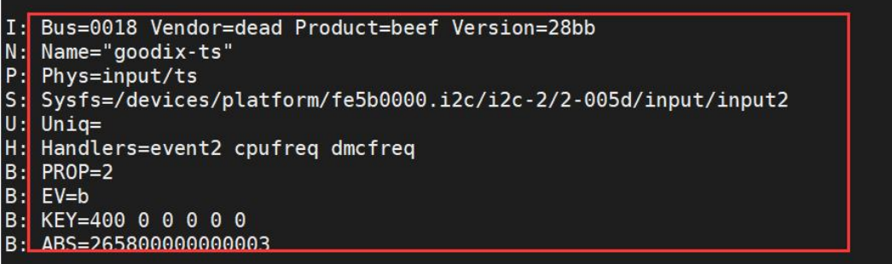

修改 `evdev_connect 函数`，根据设备名称来判断是否为想要固定的那个节点的名称，然后使用 `dev_set_name` 函数来固定设备节点

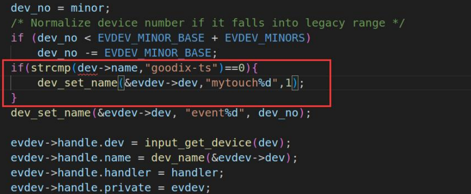


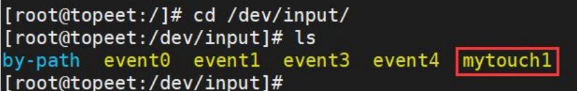

## 固定USB设备的设备节点

### 需求

在 Linux 系统中，当使用多个 USB 转串口设备时，经常会遇到插拔 USB 转串口的顺序变化导致设备节点不稳定的情况。为了解决这个问题，我们可以通过使用 udev 来固定设备节点，以确保设备节点不受 USB 转串口插拔顺序的影响

### 解决方法

插入USB设备：

```bash
udevadm info -a -n /dev/ttyUSB0
```


`udevadm info -a -n /dev/ttyUSB0` 是一个用于获取有关特定设备节点的详细信息的命令，包括设备的属性、驱动程序、设备路径等。这些命令的参数含义如下所示：

- `-a`：显示与指定设备节点相关联的所有属性。
- `-n`：指定设备节点的路径或名称。

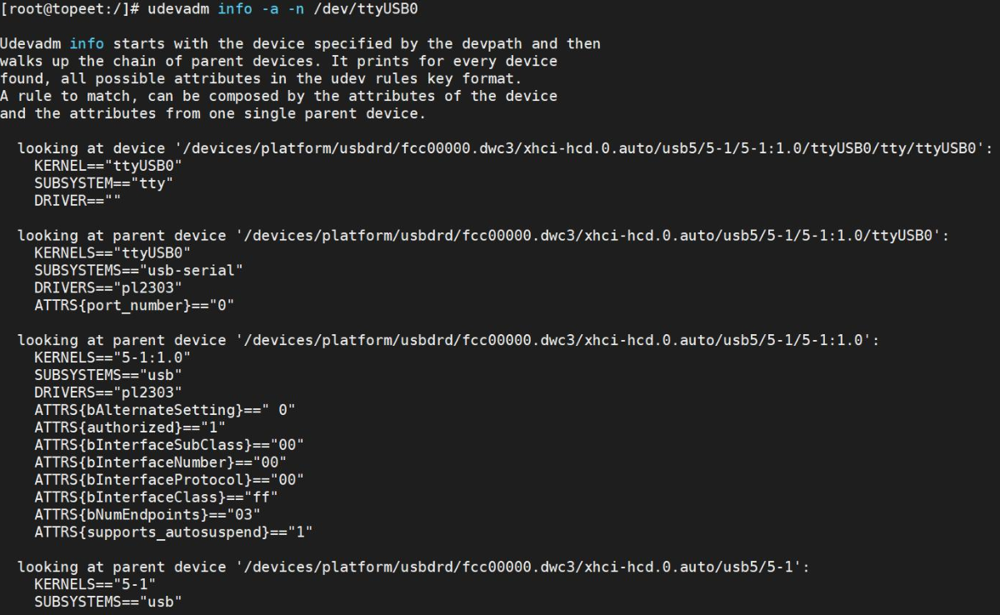

这个命令的输出可能会包含以下信息:

1. 设备路径（DEVPATH）：设备在系统中的路径，例如`/devices/pci0000:00/0000:00:1d.0/usb2/2-1/2-1.2/2-1.2:1.0/ttyUSB0/tty/ttyUSB0`。
2. 设备节点（DEVNAME）：设备在文件系统中的节点，即`/dev/ttyUSB0`。
3. 设备的属性（Device Attributes）：包括设备的供应商 ID、产品 ID、序列号等信息。
4. 设备的驱动程序（Device Driver）：设备所使用的驱动程序的名称和路径。
5. 设备类型（SUBSYSTEM）：usb

接下来在开发板的 `etc/udev/rules.d/`目录下，创建一个名为 001.rules 的规则文件:
```
KERNELS==”5-1:1.0”,SUBSYSTEMS==”usb”,MODE:=”0777”,SYMLINK+=”myusb”
```

1. `KERNELS=="5-1:1.0"`

- 匹配设备的 **内核设备名（Kernel Device Name）**
- `5-1:1.0` 是 USB 设备在内核中的路径标识：
  - `5`: USB 总线号（Bus）
  - `1`: USB 设备号（Device）
  - `1.0`: 接口编号（Interface），表示第 1 个接口的第 0 个端点
- 这个值来自 `udevadm info` 输出中的 `KERNELS` 字段

------

2. `SUBSYSTEMS=="usb"`

- 匹配设备所属的 **子系统（Subsystem）**
- 表示这是一个 USB 类型的设备
- 可以用来过滤所有 USB 设备

------

3. `MODE:="0777"`

- 设置该设备文件的 **权限（mode）**
- `0777` 表示：
  - 所有用户（root、普通用户、其他用户）都拥有读、写、执行权限
  - 即：`rwxrwxrwx`
- 这样任何程序都可以直接访问该设备（如 `/dev/ttyUSB0`）

> ⚠️ 注意：`MODE` 前面是 `:=`，不是 `==`。`:=` 表示“赋值”，而 `==` 是“匹配”。

------

4. `SYMLINK+="myusb"`

- 为设备创建一个 **符号链接（symbolic link）**
- 比如原本设备是 `/dev/ttyUSB0`，现在会多一个软链接：`/dev/myusb -> /dev/ttyUSB0`
- 可以用 `myusb` 来代替 `ttyUSB0`，更方便命名和脚本调用


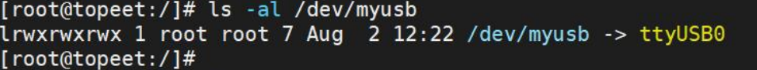
