# 单总线简介

## 单总线概述

**单总线（One-Wire）是一种串行通信协议和硬件总线**，用于在电子设备之间传输数据和控制信号。它是由独立的芯片制造商 Dallas Semiconductor 开发的，并且在多种应用中得到了广泛应用。

与 SPI I2C 等串行数据通信方式不同，单总线的特点是**只需要一根信号线，既可以传输时钟又可以传输数据，而且数据是双向的**。所以单总线具有节省 IO 口，结构简单，便于扩展和维护等特点。

单总线用于各种应用，包括**温度传感器，湿度传感器，EEPROM 存储器，时钟**等。它在许多领域中得到了广泛应用，例如工业自动化，家庭自动化，物联网和电子设备监测等。本篇使用温度传感器 DS18b20 进行举例学习单总线。

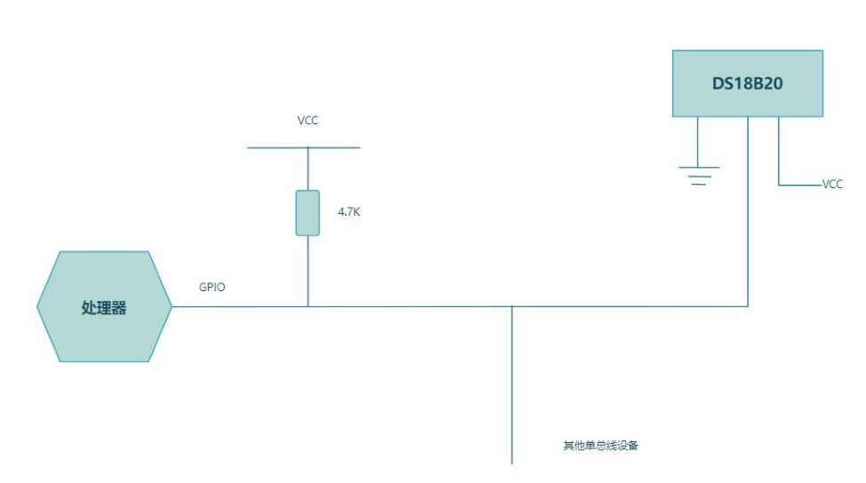

1. **信号线**：单总线使用一根信号线进行数据传输和通信。这根线被称为数据线，也是提供电源的线路。单总线上的所有设备都连接到这根信号线上。
2. **上拉电阻**：单总线需要一个上拉电阻连接到信号线和电源之间，以确保在没有设备发送数据时，信号线上的电平保持为高电平（逻辑 1）。上拉电阻的值通常在 4.7 千欧姆到 10 千欧姆之间。(GPIO设置成上拉)
3. **设备**：单总线支持多个设备连接到信号线上。每个设备都具有唯一的 64 位地址，通过这个地址来识别和选择通信的目标设备。设备可以是各种类型的传感器，存储器，时钟等。
4. **处理器**：处理器是单总线上的控制器，处理器负责发送命令，读取响应和控制单总线上的从设备

## 单总线的通信步骤

单总线是**主从结构**，**当主机呼叫从机时，从机才会应答**，所以**主机都必须严格遵循单总线的命令时序**。如果命令时序不对，则器件不会响应。

单总线的通信步骤通常包括以下几个阶段。

1. **初始化**：通信开始之前，**主设备会发送初始化信号来确保单总线上没有其他设备正在通信**。初始化信号是一个特定的序列，通常是将数据线拉低一段时间然后释放。
2. **ROM 操作命令**
3. **功能命令**

# DS18B20 介绍

## DS18b20 芯片概述

DS18b20 是一种数字温度传感器芯片，**提供 9 到 12bit 分辨率的温度测量**，可以通过**可编程非易失性存储单元**实现温度的下限和上限报警。

它是基于单总线通信协议的设备，只需要一根信号线和一根地线。

DS18b20 能够以较高的精度测量温度精确到 0.0625°C。它具有广泛的测量范围，通常介于-55°C 到+125°C 之间。

DS18B20 芯片可以通过单总线从主设备获取供电，也可以通过外部电源进行供电。这使得它在一些低功耗应用中能够灵活选择供电方式。

每个DS18b20 都会有一个全球唯一的 64 位序列号，可以将多个 DS18b20 串联在同一根单总线上进行组网，只需要一个处理器就可以控制分布在大面积区域中的多颗 DS18b20。这种组网方式特别适合 HVAC 环境控制，建筑，设备，粮情测温和工业测温以及过程监测控制等应用领域。

## DS18b20 基本性能

DS18B20 是一款数字温度传感器芯片，具有以下基本性能特点：

- 采用单总线接口仅需一个端口引脚进行通信
- 每颗芯片具有全球唯一的 64 位的序列号
- 具有多点分布式测温功能无需外围元器件
- 可通过数据线供电，供电电压范围为 2.5V~5.5V
- 测度测量范围为-55°C 到+125°C
- 在-10°C~ 70°C 范围内精确度为±0.4°C
- 温度分辨率 9-12 位可选
- 最高 12 位精度下，温度转换速度小于 750ms
- 具有用户自定义的非易失性温度报警设置
- 报警搜索命令识别并标识超过程序设定温度的器件
- 超强静电保护能力：HBM 8000V MM 800V
- 可提供贴片的 MSOP8，SOP8 封装和 3 脚的 TO-92、TO-92S 封装。

## DS18b20 引脚配置和封装

DS18B20 芯片引脚配置：

- **VDD**：供电引脚，用于提供芯片的正电源。
- **DQ**：数据引脚，用于单总线通信和数据传输。
- **GND**：地引脚，连接芯片的地（负电源）。

DS18B20 芯片可用于不同的封装类型，其中最常见的封装是 TO-92 封装和 TO-92-3 封装。这些封装都是具有三个引脚的小型封装，适用于直插式安装和表面贴装。

TO-92 封装是一种常见的小型塑料封装，引脚按照顺序排列，依次为 VDD、DQ 和 GND。

TO-92-3 封装与 TO-92 封装类似，但引脚顺序略有不同。TO-92-3 封装的引脚顺序为 GND、DQ 和 VDD。

除了这些常见的封装类型，DS18B20 还可以在其他封装类型中使用，例如 SOT-23 封装和TO-263 封装等，这些封装类型可能具有不同的引脚排列和尺寸。如下图所示：

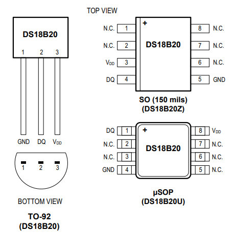

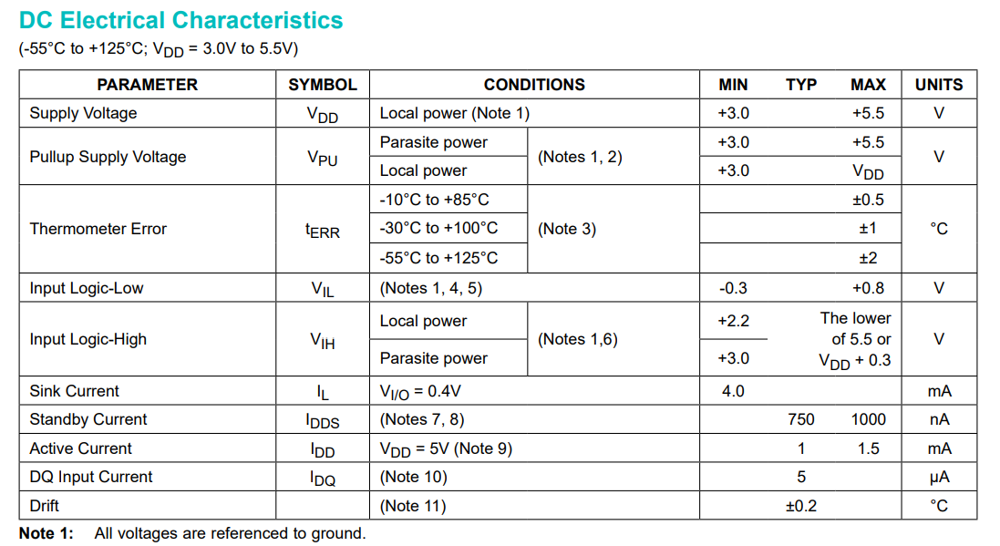

## DS18b20 内部结构

DS18b20 是一种数字温度传感器芯片，其内部结构主要包括以下组成部分，如下图所示：

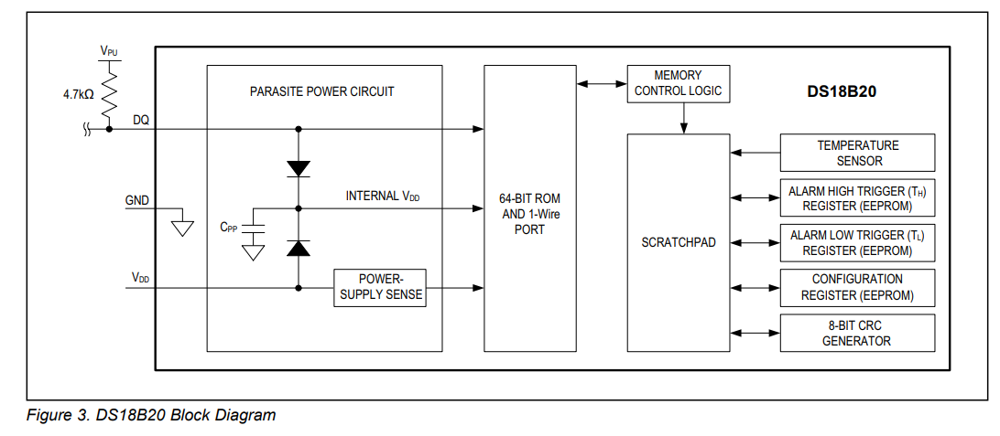

- **温度传感器**：DS18B20 内部集成了温度传感器，用于测量环境的温度。传感器通常基于基准电压的变化来检测温度，并将其转换为数字信号。
- **A/D 转换器**：DS18B20 芯片内部包含了一种模数转换器（A/D 转换器），用于将传感器测量到的模拟温度值转换为相应的数字表示。这使得温度数据能够以数字形式进行处理和传输。
- **存储器**：DS18B20 芯片还具有内部存储器，用于存储配置信息和温度测量结果。存储器可以存储唯一的 64 位地址、温度分辨率和其他相关设置。
- **控制逻辑**：DS18B20 芯片包含了控制逻辑电路，用于管理温度测量、通信和其他相关功能。控制逻辑协调各个部分的操作，并与主设备进行通信。
- **单总线接口**：DS18B20 采用了单总线通信协议，其内部结构包括一条数据线和一个上拉电阻，用于与主设备进行通信。单总线接口简化了连接和通信的布线，使得多个 DS18B20 传感器能够方便地串联在同一条总线上。

存储器由 9 个字节组成，其分配如下表所示

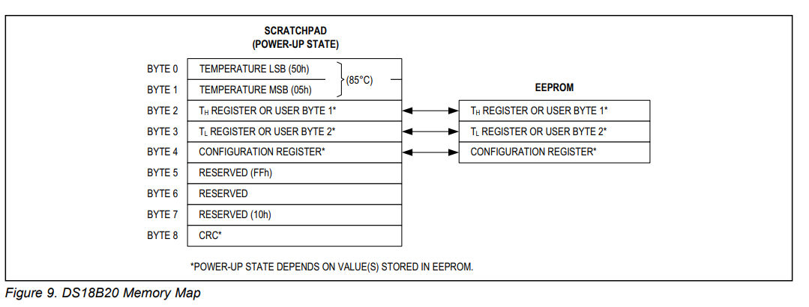

当温度转换命令发布后，经转换所得的温度值以**二字节补码形式**存放在高速暂存存储器的第 0 和第 1 个字节，单片机可通过单线接口读到该数据，读取时低位在前，高位在后，数据格式如下表所示。

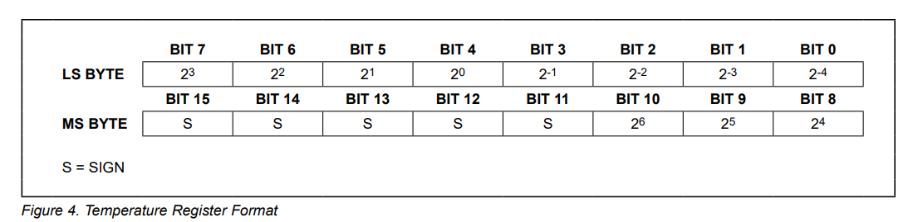

## DS18b20 寄存器介绍

DS18B20 芯片具有几个重要的寄存器，用于配置和控制传感器的功能。以下是 DS18B20常用的寄存器介绍：

- **温度寄存器（Temperature Register）**：温度寄存器存储了最近一次温度测量的结果。它是一个 16 位的寄存器，包含了温度值的原始数据。通过读取温度寄存器中的数据，并结合分辨率设置，可以计算出实际的温度值。
- **配置寄存器（Configuration Register）**：配置寄存器用于设置 DS18B20 的工作模式和温度分辨率。它是一个 8 位的寄存器，每个位对应一个配置选项。通过写入配置寄存器，可以选择温度分辨率、触发温度转换和使用电源供电模式等。
- **精度寄存器（Resolution Register）**：精度寄存器用于设置温度分辨率。它是一个 8 位的寄存器，每个位对应一种分辨率选项。通过写入精度寄存器，可以选择不同的温度分辨率，例如 9 位、10 位、11 位或 12 位。

- **唯一地址寄存器（Unique Address Register）**：唯一地址寄存器存储了 DS18B20 芯片的唯一64 位地址。每个 DS18B20 芯片都有唯一的地址，通过读取唯一地址寄存器中的数据，可以获取芯片的地址信息。

### 配置寄存器

配置寄存器用于设置 DS18B20 的工作模式和温度分辨率。它是一个 8 位的寄存器，每个位对应一个配置选项。如下图所示

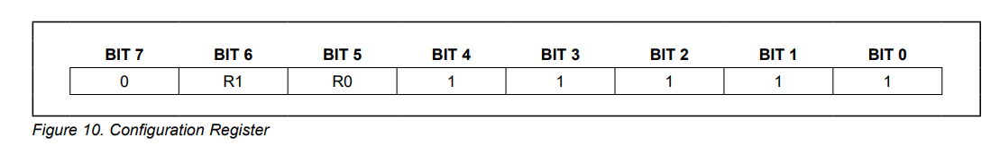

> 注意：上电默认设置 R0=1,R1=1(12 位精度)。

**精度和转换时间之间有直接关系**。配置寄存器的位 7 和位 0 到 4 被器件保留，禁止写入。温度分辨率设置表如下所示：

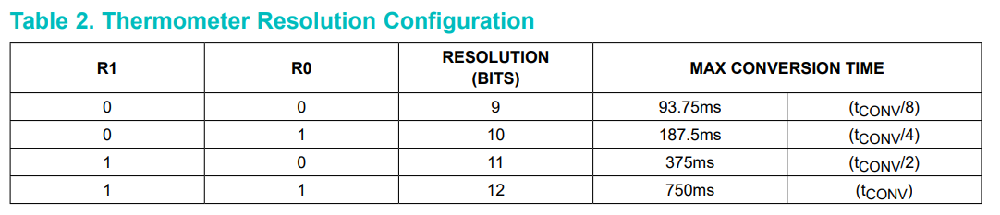

### 温度测量寄存器

DS18B20 芯片的温度寄存器是一个 16 位的寄存器，用于存储最近一次温度测量的原始数据。温度寄存器的位布局如下所示：

温度寄存器的最低有效位（LSB）是 2^-4 位，表示温度的最小精度为 0.0625°C。其他位依次表示更高的温度精度，分别为: 

- 2^-3^（0.125）
- 2^-2^（0.25）
- 2^-1^（0.5）
- 2^0^（1）
- 2^1^（2）
- 2^2^（4）
- 2^3^（8）

DS18B20 芯片的温度寄存器中存储的原始数据可以通过以下步骤计算出实际温度值：

1. 从温度寄存器读取的 16 位数据可以解释为一个有符号整数，其中最高位（MSB）表示符号位。如果符号位为 0，表示正温度；如果符号位为 1，表示负温度。
2. 取出温度寄存器中的低 11 位（位 4 到位 15），这些位表示温度的绝对值，其中位值为 1 表示该位对应的温度分辨率有效。
3. 将这 11 位数据与符号位组合成一个有符号整数。
4. 根据所选择的温度分辨率，**将有符号整数乘以相应的分辨率因子**，以获得实际的温度值。
5. 当温度大于 0 时，符号位为 0，测量到的温度值乘以分辨率因子即可得到实际的温度。
6. 当温度小于 0 时，符号位为 1，测量得到的温度值取反加一再乘以分辨率因子即可得到实际的温度。

> 举个例子，假设选择了 12 位的温度分辨率，并从温度寄存器读取的数据为 0x1FFF。
>
> 0x1FFF 的二进制表示为：0001 1111 1111 1111。最高位为 0，表示正温度。取出低 11 位：111 1111 1111。将这 11 位与符号位组合，得到有符号整数为：0111 1111 1111（对应 0x07FF）。
>
> 对于 12 位的温度分辨率，分辨率因子为 0.0625°C。将有符号整数 0x07FF乘以分辨率因子：0x07FF * 0.0625 = 127.9375°C。
>
> 因此，从温度寄存器读取的数据 0x1FFF 对应着约 127.94°C 的实际温度值。

## DS18b20 指令介绍

### 指令

根据 DS18B20 的通讯协议，主机（单片机）控制 DS18B20 完成温度转换必须经过三个步骤：

- 每一次读写之前都要对 DS18B20 进行复位操作
- 复位成功后发送一条 ROM 指令
- 最后发送 RAM 指令，这样才能对 DS18B20 进行预定的操作。

复位要求主 CPU 将数据线下拉 500 微秒，然后 释放，当 DS18B20 收到信号后等待 16～60 微秒左右，后发出 60～240 微秒的存在低脉冲，主 CPU 收到此信号表示复位成功。

ROM指令

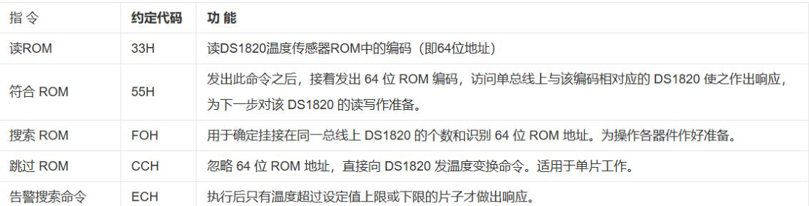

RAM指令

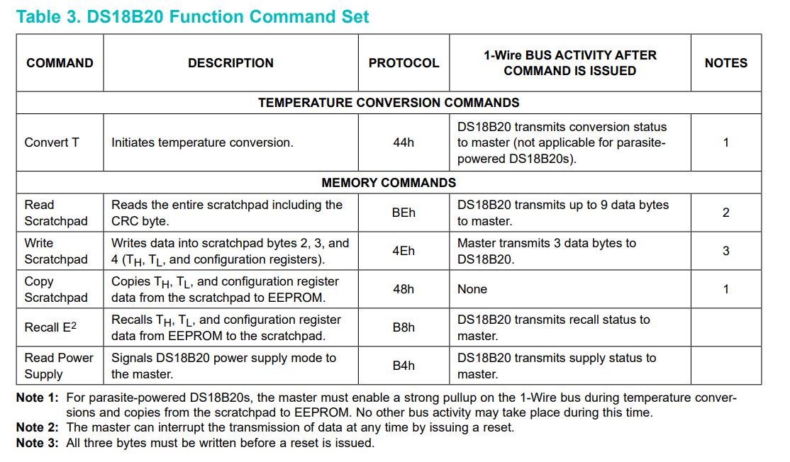

### 操作举例

**当单总线上只有一个 DS18b20 的时候**：

1. 开始进行温度转换：
   - 复位信号
   - 发送 ROM 指令 OXCC 跳过搜索
   - 发送 RAM 指令 0x44 进行温度转换。
2. 读温度：
   - 复位信号
   - 发送 ROM 指令 OXCC 跳过搜索
   - 发送 RAM 指令 0xbe 读暂存器。
3. 设置 ds18b20:
   - 复位信号
   - 发送 ROM 指令 OXCC 跳过搜索
   - 发送 RAM 指令 0x4e 写暂存器
   - 要写的数据。

**当单总线上有多个 ds18b20 的时候**

1. 开始进行温度转换：
   - 复位信号
   - 发送 ROM 指令 0x55 匹配指令
   - 发送 DS18b20 的地址
   - 发送 RAM 指令 0x44 进行温度转换。
2. 读温度：
   - 复位信号
   - 发送 ROM 指令 0x55 匹配指令
   - 发送 DS18b20 的地址
   - 发送 RAM 指令 0xbe 读暂存器。
3. 设置 ds18b20:
   - 复位信号
   - 发送 ROM 指令 0x55 匹配指令
   - 发送 DS18b20 的地址
   - 发送RAM 指令 0x4e 写暂存器
   - 要写的数据。

## 时序

### 复位时序

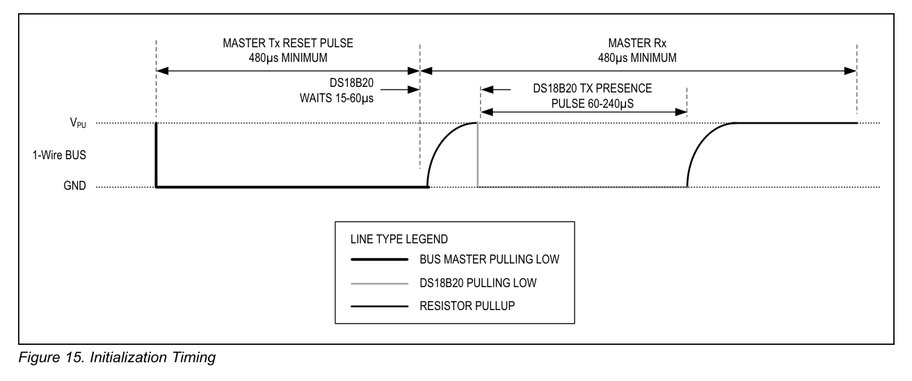

### 读写时序

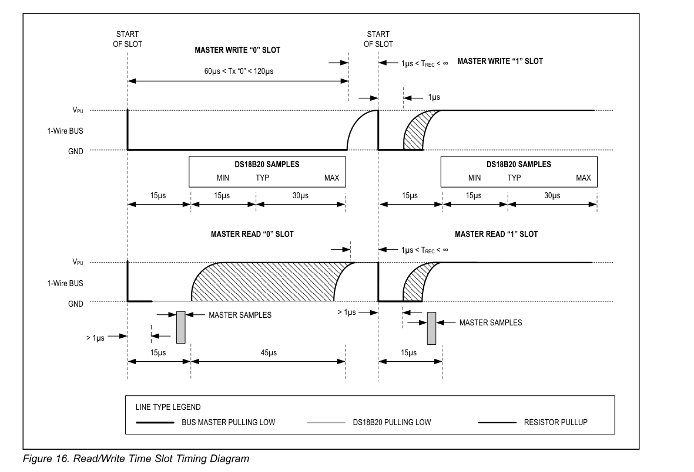