# I2C简介

荷兰著名电子公司飞利浦(Philips)公司发明了一种名为I2C(Inter-Integrated Circuit)的集成电路互连通信协议。

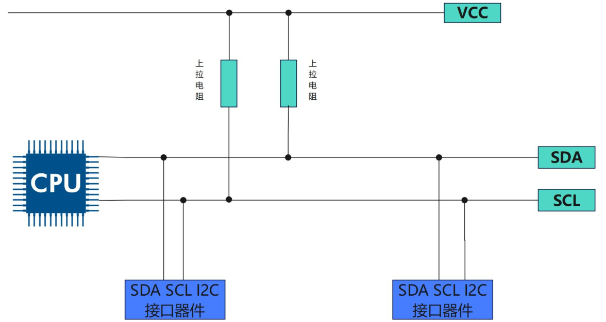


在**空闲状态下**，**SDA 和 SCL 一般被上拉电阻拉高，保持高电平状态**，在需要进行数据传输的时候，通过 SCL 和 SDA 的高低电平来产生 I2C 总线所需要的信号进行数据传递。

## 特点

- **总线拓扑结构**

I2C 总线采用主从式架构,由一个主设备(Master)和一个或多个从设备(Slave)组成。主设备负责发起数据传输,从设备则响应主设备的请求。

- **物理层接口**
  I2C 总线使用两根线路进行通信:
  - SCL(Serial Clock Line)时钟线,由主设备提供时钟信号。

  - SDA(Serial Data Line)数据线,用于双向传输数据。

这两根线通常需要上拉电阻来保持信号的高电平状态。

- **通信协议**

I2C 采用**同步串行通信**方式, 主设备发起通信并提供时钟。主设备首先发送一个"启动"信号,然后发送从设备地址和数据传输方向(读或写)。从设备在收到自己的地址后,会发送应答信号,表示已准备好接收或发送数据。之后主设备和从设备就可以开始传输数据。通信结束时,主设
备发送"停止"信号。

- **时钟频率**
  I2C 总线支持多种通信速率,常见的有:

  - 标准模式(Standard mode):100kbps

  - 快速模式(Fast mode):400kbps

  - 高速模式(High-speed mode):3.4Mbps

- **寻址机制**
  I2C 使用 7 位地址空间,最多可寻址 127 个从设备。地址空间的前 7 位用于指定从设备,最后1 位用于表示读/写方向。
  每一个 12C 外设都会对应一个唯一的地址(这个地址可以从 I2C 外设器件的数据手册中得到），主机和从机之间的通信就是通过这个地址来确定主机要和哪个从机进行通信的。

- **多主机支持**
  I2C 总线支持多个主设备共享同一总线, **通过仲裁机制避免冲突**。当多个主设备同时试图占用总线时,**优先级最高的主设备将获得总线控制权**。

- 其他特点:

  - **总线最大电容限制为 400pF**。
  - **以字节为单位传输数据**。
  - 存在硬件 I2C 和软件 I2C 两种实现方式。


## RK3568 上的I2C

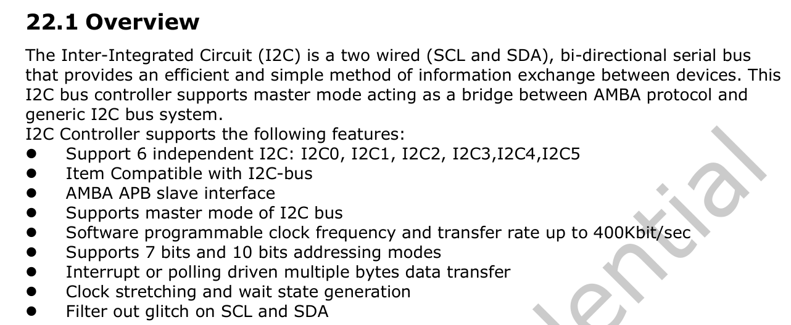

- 支持 6 路 I2C 接口，分别为 I2C0、I2C1、I2C2、I2C3、I2C4、I2C5
- 支持 7 位和 10 位地址模式
- 软件可编程时钟频率
- I2C 总线上的数据传输速率可达
  - 标准模式最高 100Kbit/s
  - 快速模式最高 400Kbit/s
  - 快速模式加最高 1Mbit/s

### 硬件I2C与软件I2C

这里的 6 路 I2C 接口指的是**硬件 I2C**，**在 SOC 上有专用的硬件 I2C 电路**，关于硬件 I2C的介绍如下所示


#### 硬件 I2C

**硬件 I2C**，**在 SOC 上有专用的硬件 I2C 电路**

- **实现方式**:通过专用的硬件 I2C 接口电路来实现 I2C 总线协议。
- **优点**: CPU 占用低,I2C 总线由硬件电路自动完成。传输速率高,可以达到 400kbit/s 或 3.4Mbit/s。更加可靠和稳定,不易受外部干扰。
- **缺点**: 需要专用的硬件 I2C 接口电路支持,成本相对较高。接口固定,不如软件 I2C 那么灵活。
- **适用范围**：适用于高速、大量数据传输的场合,如 LCD、EEPROM 等外设的连接。


#### 软件 I2C 

指的是**通过 GPIO 口模拟 SCL 和 SDA 信号线**，在硬件 I2C 不够用的情况下，可以通过 GPIO 来模拟软件 I2C,关于软件 I2C 的介绍如下所示：


- **实现方式**: 通过软件模拟 I2C 总线协议,使用通用 I/O 口来模拟 SCL 和 SDA 信号线。
- **优点**: 灵活性强,可以在任何 I/O 口上实现 I2C 接口。成本低,不需要额外的硬件支持。
- **缺点**: CPU 占用较高,因为需要在软件中模拟 I2C 时序。传输速率较低,受 CPU 性能限制,一般在 100kbit/s 左右。
- **适用范围**：适用于低速、少量数据传输的场合。


## I2C的上拉电阻


在I2C中在 SDA 数据线和 SCL 时钟线上都需要接一个上拉电阻

### 接上拉电阻的作用

- **保证总线空闲时保持高电平** 

**I2C 总线采用开漏/开集电极输出, 当没有设备驱动总线时, 总线会处于高阻态**。如果不接上拉电阻,总线电平将不确定,很容易受到噪声干扰。接上拉电阻可以**确保总线空闲时保持稳定的高电平**。

- **实现线与功能**

**I2C 总线允许多个设备挂载在同一总线上**。**当一个设备拉低总线时,其他设备的输出也会被拉低。这就是线与功能,实现总线仲裁**。如果不接上拉电阻,当总线空闲时电平不确定,一个设备拉低总线时其他设备无法感知到总线电平变化,无法实现线与功能。


而这里的上拉电阻也并不能随意进行取值,需要考虑**总线电容**的影响。I2C 总线上存在各种寄生电容,可以等效成一个 RC 充电电路，如下图所示

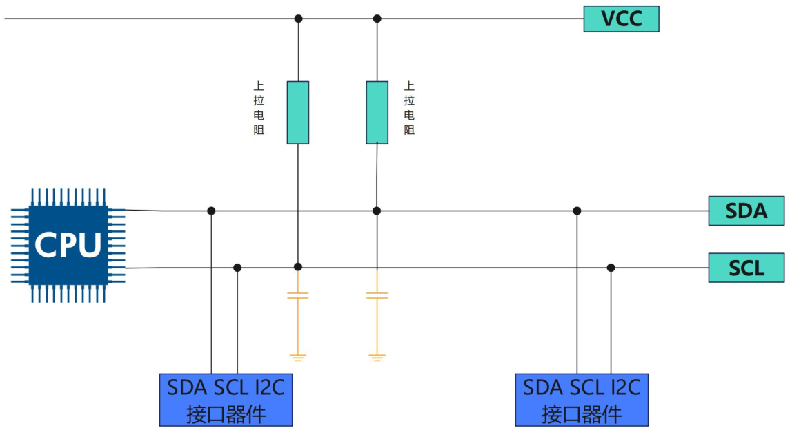


**当总线从低电平转为高电平时,需要通过上拉电阻为总线供电**,充电总线电容。

- 如果上拉电阻取值过大,充电时间过长,会导致上升沿过慢,可能影响通信；

- 如果上拉电阻取值过小，则无法产生低电平

所以在 I2C 规范中要求总线电容不能超过 400PF,通常建议在 1k 至 10k 欧姆之间选择,能够既保证上升沿速度,又能够可靠拉低总线电平


### I2C上拉电阻阻值计算

#### 最小值

公式：
$$
R_{\text{p(min)}} = \frac{V_{\text{DD}} - V_{\text{OL(max)}}}{I_{\text{O}}}
$$

- $ V_{\text{DD} }$          通常为 5V 或 3.3V 等常用的供电电压,在 iTOP-RK3568开发板上为 3.3V
- $V_{\text{OL(max)}}$  表示器件在低电平时的最大输出电压,具体数值表格如下所示，由于 VDD 为3.3V，所以 VOL 的最大值为 0.4

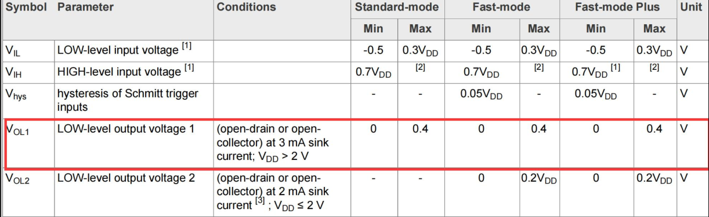

- $I_{\text{O}}$         器件在低电平时的最大灌入电流,具体数值表格如下所示，通过$V_{\text{OL}}$ 值为 0.4，可以得到 $I_{\text{O}}$在常规模式下和快速模式下的值为 3ma。

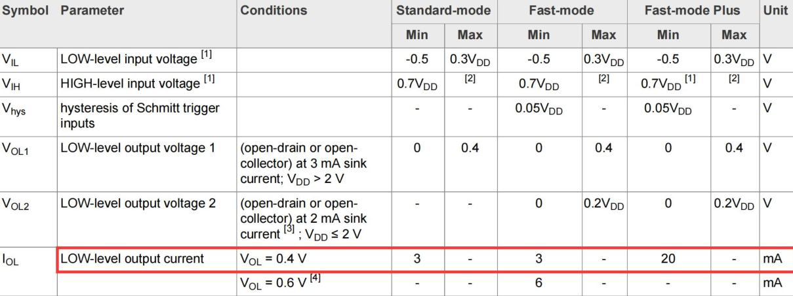

**计算**：

1. 确定 $V_{\text{DD}}$、$V_{\text{OL(max)}}$ 和 $I_{\text{OL}}$ 的值： 在 RK3568 中，$V_{\text{DD}} = 3.3\,\text{V}$，取 $V_{\text{OL(max)}} = 0.4\,\text{V}$，对应的 $I_{\text{OL}} = 3\,\text{mA}$。 
2. 代入公式： \[ R_{\text{p(min)}} = \frac{V_{\text{DD}} - V_{\text{OL(max)}}}{I_{\text{OL}}} \] 计算得到上拉电阻的最小值： \[ R_{\text{p(min)}} = \frac{3.3\,\text{V} - 0.4\,\text{V}}{3\,\text{mA}} = \frac{2.9\,\text{V}}{0.003\,\text{A}} \approx 966.7\,\Omega \] 通常可取标准电阻值 **910 Ω** 或 **1 kΩ**（若允许略低于理论最小值，需结合实际总线电容和速度要求）。

#### 最大值


公式：
\[
R_{\text{p(max)}} = \frac{0.8473 \cdot C_{\text{b}}}{t_{\text{r}}}
\]

- $R_{\text{p(max)}}$：上拉电阻的最大值（单位：Ω）  
- $C_{\text{b}}$：总线电容（单位：F），包括 PCB 走线电容、引脚电容和器件输入电容之和  
- $t_{\text{r}}$：高电平上升时间（单位：s），一般上升时间是从 0.3VDD 到 0.7VDD，具体可以从数据手册获得


根据上图可以得到

- 在标准模式下 $t_{\text{r}}$的取值为 ≤ 1000ns。
- 在快速模式下$t_{\text{r}}$ 的取值为 ≤ 300ns。
- 在超快速模式下 $t_{\text{r}}$ 的取值为≤ 120ns


**计算**：

I²C 工作在标准模式下，上拉电压为 $3.3\,\text{V}$，引脚电容为 $10\,\text{pF}$，连接电容为 $30\,\text{pF}$，高电平上升时间 $t_{\text{r}} = 1000\,\text{ns}$。计算上拉电阻的最大值。

1. **计算总线电容**：   \[   C_{\text{b}} = 10\,\text{pF} + 30\,\text{pF} = 40\,\text{pF} = 40 \times 10^{-12}\,\text{F}   \] 
2. **代入公式**：   \[   R_{\text{p(max)}} = \frac{0.8473 \cdot C_{\text{b}}}{t_{\text{r}}}   \] 
3. **代入数值计算**：   \[   R_{\text{p(max)}} = \frac{0.8473 \times 40 \times 10^{-12}\,\text{F}}{1000 \times 10^{-9}\,\text{s}} = \frac{33.892 \times 10^{-12}}{10^{-6}}\,\Omega = 33.892 \times 10^{3}\,\Omega \approx 33.89\,\text{k}\Omega   \] 

因此，上拉电阻的最大值约为 **33.89 kΩ**。


#### 具体选择

一般来说,I2C 总线速度越快,所需的上拉电阻值越小，具体选择如下所示：

- 100kbps: 一般选择 10k 上拉电阻

- 400kbps: 一般选择 4.7k 上拉电阻
- 1Mbps: 一般选择 2.2k 上拉电阻

当然上述选择未必正确,需要根据实际测试结果进行调整。在实际使用中,可以先根据经验选择一个上拉电阻值试用,无需过于纠结于计算公式


## I2C通信时序

### 起始信号与终止信号

所有的交互都是**以 START(S) 信号开始**, 并**以 STOP(P)信号终止**，具体的起始信号和终止信号通信时序图如下所示：

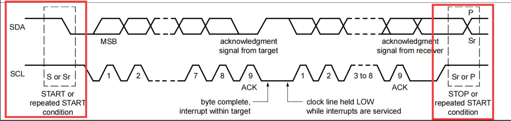

- **起始信号(START)**：是由总线控制器生成（即主机）的,定义为 **SDA 线从高电平到低电平的跳变,同时 SCL线保持高电平**。
- **终止信号(STOP)**：是由总线控制器生成的,定义为 **SDA 线从低电平到高电平的跳变,同时 SCL线保持高电平**。

> 在 START 信号之后,总线被认为是忙碌状态,直到 STOP 信号出现后总线才被认为空闲

### 数据格式

1. **每一个传输到 SDA 线上的字节长度都必须是 8 位**。每次传输可以包含任意数量的字节。
2. **每个字节之后都必须跟一个应答位(Acknowledge bit)**。
3. 数据以**最高有效位(MSB)优先的顺序**传输。
4. 如果目标设备在处理内部中断等操作时无法立即接收或发送另一个完整的字节数据,它**可以通过拉低 SCL 线来将控制器置于等待状态**。当目标设备准备好接收下一字节数据时**,释放 SCL 线即可继续数据传输**。

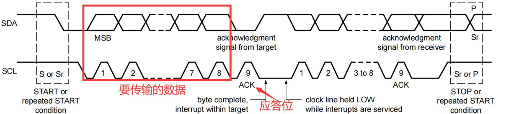


### 应答信号和非应答信号

- 应答信号发生在每个字节传输之后。应答位让接收设备向发送设备表明字节数据已经成功接收,可以发送下一个字节了。
  - **应答信号**：当**发送设备在第 9 个时钟脉冲期间释放 SDA 线时**, **接收设备可以拉低 SDA 线并在此时钟高电平期间保持稳定低电平**
  - **非应答信号**：**在第 9 个时钟脉冲期间 SDA 线保持高电平**, 控制器可以产生停止信号中止传输,或者重复启动信号开始新的传输

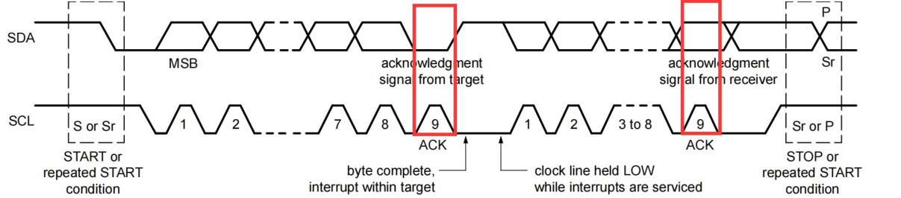

导致产生 NACK 信号的 5 种情况包括:

- 总线上没有接收设备响应发送的地址
- 接收设备正忙于其他实时功能而无法开始通信
- 接收设备在传输过程中收到不能理解的数据或命令
- 接收设备无法再接收更多数据字节
- 控制器-接收器必须向目标发送器表明传输结束。

### 读写方向

1. 数据传输格式，首先**发送一个 7 位的目标地址**, **后跟一个读/写方向位(R/W 位)**。

2. 读/写方向位是第 8 位, **0 表示写操作(WRITE)**，**1 表示读操作(READ)**。

> 数据传输总是**由控制器产生的停止信号(P)来结束**。但**如果控制器需要继续在总线上通信,它可以产生一个重复起始信号(Sr)来寻址其他目标设备,而无需先产生停止条件**。
>
> 这样就可以在同一次传输过程中实现各种读/写格式的组合

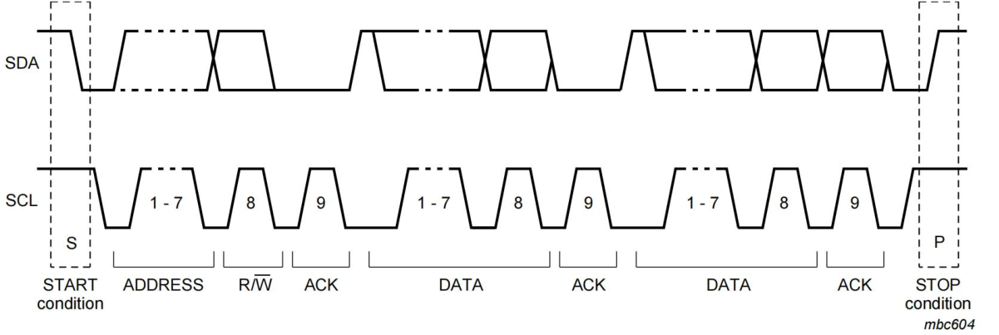


## I2C波形

### 写操作

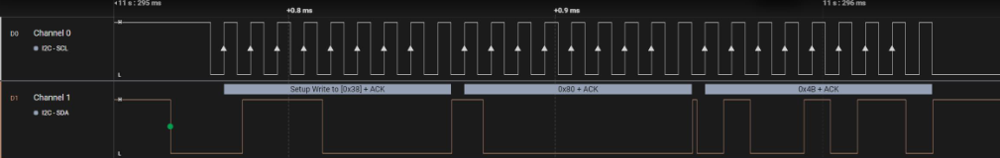

在数据传输之前，主机要先**发送一个起始信号**，起始信号为 SDA 线从高电平到低电平的跳变,同时 SCL 线保持高电平，就对应图所示部分,逻辑分析仪软件也用一个绿色的远点进行了标注。

可以将写操作分为以下步骤：

1. **主机发送一个起始信号**
2. **主机发送 I2C 外设的地址和写操作，等待应答信号**
3. 从机发送应答信号
4. **主机要发送寄存器的地址，等待应答信号**
5. 从机发送应答信号
6. **主机发送要写入的寄存器的数据，等待应答信号**
7. 从机发送应答信号
8. **主机要发送终止信号，如果写多个寄存器，重复 6,7 步骤**

### 读操作

**无论是读操作还是写操作，都要先写入 I2C 外设地址，所以最开始的波形是相同的**

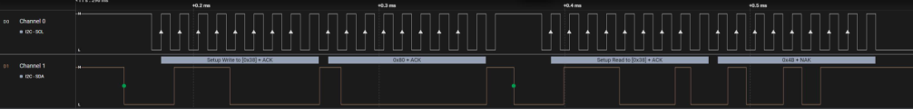

可以将读操作分为以下步骤：

1. **主机发送一个起始信号**
2. **主机要发送 12C 外设地址和写操作，等待应答信号**
3. 从机发送应答信号
4. **主机要发送要读取的寄存器的地址，等待应答信号**
5. 从机发送应答信号
6. **主机发送起始信号**
7. **主机发送要读取的 12C 外设的地址和读操作，等待应答信号**
8. 从机发送应答信号
9. 从机发送数据，也就是要读取的寄存器的数据，等待应答或者非应答信号
10. **主机如果不在读取数据，就要发送非应答信号，如果继续读取，就发送应答信号**

# I2C子系统框架

## 分层结构

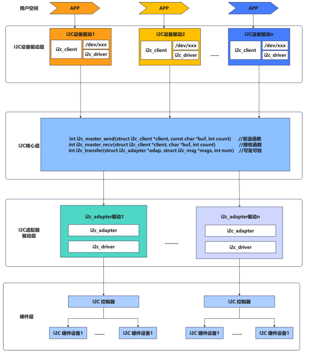

### I2C设备驱动层

I2C 设备驱动层的主要作用为编写驱动程序,**使 I2C 外设能够正常工作**，然后**创建了对应的设备节点**，提供了标准化的接口,使得上层应用程序能够方便地与 I2C 设备进行交互。

具体来说,I2C 设备驱动层包含以下几个关键部分:

- **i2c_client**
  - **代表一个连接到 I2C 总线上的从设备**
  - 包含从设备的地址、所属的 I2C 适配器等信息
- **`/dev/i2X` 设备节点**
  - 为上层应用程序提供设备访问的接口
  - 通过打开/读写/控制设备节点,应用程序可以与 I2C 设备进行交互
  - 内核 I2C 子系统负责将应用程序的操作转发到对应的 i2c_driver
- **`i2c_driver`**
  - 实现了具体 I2C 从设备的驱动程序
  - 负责设备的初始化、读写、配置等操作
  - 通过 i2c_client 与设备进行交互
  - 向上层提供设备访问的标准化接口
- **I2C 总线子系统**
  - 管理整个 I2C 总线,包括注册/注销 I2C 适配器和从设备
  - 协调 i2c_client 和 i2c_driver 之间的交互
  - 为上层提供统一的 I2C 访问接口


### I2C 核心层

I2C 核心层位于 I2C 设备驱动层和 I2C 适配器驱动层中间，起到了承上启下的作用，负责 I2C 设备驱动层和 I2C 适配器驱动层之间数据的传递，I2C 核心层的主要函数为 

- `i2c_master_send`
- ``i2c_master_recv`
-  `i2c_transfer`

`i2c_master_send`和`i2c_master_recv`这两个函数负责**生成符合 I2C 协议的时序和数据帧**,并通过对应的 I2C 适配器驱动程序进行实际的总线操作。

> 其中 `i2c_master_send` 和`i2c_master_recv` 函数，是 I2C 核心层提供的基本读写接口。
>
> `i2c_master_send` 用于向 I2C 从设备发送数据, `i2c_master_recv` 用于从从设备接收数据。
>
> 它们分别接受如下参数:
>
> - `struct i2c_client *client`: 指向目标 I2C 从设备的指针
> - `const char *buf/char *buf`: 数据缓冲区
> - `int count`: 要发送/接收的字节数


而 `i2c_transfer` 函数是一个更加综合的 I2C 传输函数，`i2c_master_send` 和 `i2c_master_recv`函数实际上便是调用的 `i2c_transfer`

> i2c_transfer 函数它接受如下参数:
>
> - `struct i2c_adapter *adap`: 指向目标 I2C 适配器的指针
> - `struct i2c_msg *msgs`: 指向一个 I2C 消息数组的指针
> - `int num`: 消息数组中的消息数量

既然已经在 I2C 设备驱动层中创建了对应的设备节点，有了驱动程序就可以直接对 I2C 具体硬件进行操作了，但是在 I2C 子系
统并不是这样实现的，而是添加了 I2C 核心层和 I2C 适配器驱动层，那为什么要这样设计呢？

最主要的原因是通过驱动分层可以**解决多个应用同时访问一个 I2C 设备冲突的问题**，除此之外通过这种**模块化设计**,可以提高了代码的复用性和可维护性，使得 I2C 核心层和设备驱动程序可以独立开发和升级，I2C 适配器驱动程序也可以针对不同的硬件平台进行优化。


### I2C适配器驱动层

I2C 适配器驱动层是 I2C 子系统的另一个重要组成部分,它负责**实现具体的 I2C 硬件控制器的驱动程序**。I2C 适配器驱动程序的作用如下所示：

- 提供标准化的 I2C 传输接口,供 I2C 核心层调用
- 实现 I2C 总线协议的时序控制和数据收发
- 管理 I2C 总线上的从设备
- 处理 I2C 总线错误和异常情况


## I2C client 代码编写(设备树)

### 设备树

在 `rk3568.dtsi` 设备树中有关于 I2C0、I2C1、I2C2、I2C3、I2C4、I2C5 的设备树节点，这里只列举出了 I2C1 的设备树节点，具体如下所示：

```dts
	i2c1: i2c@fe5a0000 {
		compatible = "rockchip,rk3399-i2c";
		reg = <0x0 0xfe5a0000 0x0 0x1000>;
		clocks = <&cru CLK_I2C1>, <&cru PCLK_I2C1>;
		clock-names = "i2c", "pclk";
		interrupts = <GIC_SPI 47 IRQ_TYPE_LEVEL_HIGH>;
		pinctrl-names = "default";
		pinctrl-0 = <&i2c1_xfer>;
		#address-cells = <1>;
		#size-cells = <0>;
		status = "disabled";
	};
```

`i2c1: i2c@fe5a0000` 节点代表 I2C1 控制器，如果 I2C 外设挂载到了 I2C1 上，就可以直接在 I2C1 控制器的节点下添加 I2C 外设的子节点，FT5X06 的设备树节点就在 `kernel/arch/arm64/boot/dts/rockchip/topeet-screen-lcds.dts` 中，具体如下所示：

```c
&i2c1 {
    status = "okay";
    
	ft5x061:ft5x06@38 {
				status = "disabled";
				compatible = "edt,edt-ft5306";
				reg = <0x38>;
				touch-gpio = <&gpio3 RK_PA5 IRQ_TYPE_EDGE_RISING>;
				interrupt-parent = <&gpio3>;
				interrupts = <RK_PA5 IRQ_TYPE_LEVEL_LOW>;
				reset-gpio = <&gpio0 RK_PB6 GPIO_ACTIVE_LOW>;
				touchscreen-size-x = <800>;
				touchscreen-size-y = <1280>;

    };
};

```

该节点向 I2C1 控制器节点追加了 FT5X06 触摸芯片相关的节点。即**ft5x06作为i2c1的子节点**

### 取消rk3568原本的驱动

1. 在menuconfig中取消FT5X06驱动的勾选
2. 在`topeet-screen-lcds.dts`中选用`LCD_TYPE_MIPI`

```c
#define LCD_TYPE_MIPI       //in vp 1
//#define LCD_TYPE_LVDS_10_1_1024X600  //in vp 2
//#define LCD_TYPE_LVDS_10_1_1280X800_gt9271 //in vp 2
//#define LCD_TYPE_LVDS_7_0   //in vp 2
//#define LCD_TYPE_EDP_VGA  //in vp 0
//#define LCD_TYPE_HDMI_VP0   //hdmi in vp 0
//#define LCD_TYPE_HDMI_VP1   //hdmi in vp 1
```

3. 原本的ft5x06设备树节点status从okay设置为disabled

```dts
#if defined(LCD_TYPE_MIPI)
...
&ft5x061
{
    status = "okay";
};
...
#endif
```

### FT5X06 Client编写

```dts
&i2c1 {
	status = "okay";
	myft5x06: my-ft5x06@38 {
		compatible = "my-ft5x06";
		reg = <0x38>;
	};
};
```


关于追加的设备树节点描述如下所示：

- `&i2c1`: 表示对 I2C 控制器 1 进行引用。
- `status = "okay";`: 表示启用 I2C 控制器 1。
- `myft5x06: my-ft5x06@38`: 定义了一个设备节点,命名为 myft5x06。`my-ft5x06@38`表示这个设备的 I2C 地址为 0x38。
- `compatible = "my-ft5x06";`: 这个属性用于标识设备的类型,这里表示这是一个名为"my-ft5x06"的设备。
- `reg = <0x38>;`: 这个属性定义了设备在 I2C 总线上的地址,这里为 0x38

而 FT5X06 触摸芯片除了 I2C 部分，还有另外两个 GPIO 分别为中断引脚和复位引脚，每个引脚对应的功能匹配表格如下所示

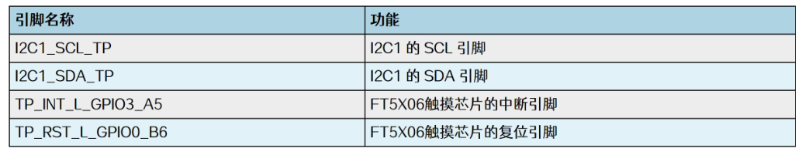

因此我们在设备树中也要描述

```dts
&i2c1 {
	status = "okay";
	myft5x06: my-ft5x06@38 {
		compatible = "my-ft5x06";
		reg = <0x38>;
		reset-gpios = <&gpio0 RK_PB6 GPIO_ACTIVE_LOW>;
		interrupt-parent = <&gpio3>;
		interrupts-gpio = <&gpio3 RK_PA5 GPIO_ACTIVE_LOW>;
		interrupts = <RK_PA5 IRQ_TYPE_LEVEL_LOW>;
		pinctrl-names = "default";
		pinctrl-0 = <&myft5x06_pins>;
	};
};
```

- `reset-gpios = <&gpio0 RK_PB6 GPIO_ACTIVE_LOW>;`: 定义了设备的复位引脚,连接到`GPIO0` 的 RK_PB6 引脚,电平为低电平有效。
- `interrupt-parent = <&gpio3>;`: 指定中断的父节点为 GPIO3。
- `interrupts-gpio = <&gpio3 RK_PA5 GPIO_ACTIVE_LOW>;`: 定义了设备的中断引脚,连接到 GPIO3 的 RK_PA5 引脚,电平为低电平触发。
- `interrupts = <RK_PA5 IRQ_TYPE_LEVEL_LOW>;`: 进一步描述了中断的触发方式,为电平低电平触发。
- `pinctrl-names = "default";` 和`pinctrl-0 = <&myft5x06_pins>;`: 指定了设备使用的默认针脚配置。

这里指定的 pinctrl 节点名为 `myft5x06_pins`，所以还需要对 pinctrl 节点进行追加，追加内容如下所示：

```dts
&pinctrl {
	myft5x06 {
		myft5x06_pins: myft5x06-pins {
			rockchip,pins =
				<0 RK_PB6 RK_FUNC_GPIO &pcfg_pull_none>,
				<0 RK_PB6 RK_FUNC_GPIO &pcfg_pull_none>;
		}
	};
}
```

### struct i2c_client

```c
/**
 * struct i2c_client - represent an I2C slave device
 * @flags: see I2C_CLIENT_* for possible flags
 * @addr: Address used on the I2C bus connected to the parent adapter.
 * @name: Indicates the type of the device, usually a chip name that's
 *	generic enough to hide second-sourcing and compatible revisions.
 * @adapter: manages the bus segment hosting this I2C device
 * @dev: Driver model device node for the slave.
 * @init_irq: IRQ that was set at initialization
 * @irq: indicates the IRQ generated by this device (if any)
 * @detected: member of an i2c_driver.clients list or i2c-core's
 *	userspace_devices list
 * @slave_cb: Callback when I2C slave mode of an adapter is used. The adapter
 *	calls it to pass on slave events to the slave driver.
 *
 * An i2c_client identifies a single device (i.e. chip) connected to an
 * i2c bus. The behaviour exposed to Linux is defined by the driver
 * managing the device.
 */
struct i2c_client {
	unsigned short flags;		/* div., see below		*/
#define I2C_CLIENT_PEC		0x04	/* Use Packet Error Checking */
#define I2C_CLIENT_TEN		0x10	/* we have a ten bit chip address */
					/* Must equal I2C_M_TEN below */
#define I2C_CLIENT_SLAVE	0x20	/* we are the slave */
#define I2C_CLIENT_HOST_NOTIFY	0x40	/* We want to use I2C host notify */
#define I2C_CLIENT_WAKE		0x80	/* for board_info; true iff can wake */
#define I2C_CLIENT_SCCB		0x9000	/* Use Omnivision SCCB protocol */
					/* Must match I2C_M_STOP|IGNORE_NAK */

	unsigned short addr;		/* chip address - NOTE: 7bit	*/
					/* addresses are stored in the	*/
					/* _LOWER_ 7 bits		*/
	char name[I2C_NAME_SIZE];
	struct i2c_adapter *adapter;	/* the adapter we sit on	*/
	struct device dev;		/* the device structure		*/
	int init_irq;			/* irq set at initialization	*/
	int irq;			/* irq issued by device		*/
	struct list_head detected;
#if IS_ENABLED(CONFIG_I2C_SLAVE)
	i2c_slave_cb_t slave_cb;	/* callback for slave mode	*/
#endif
};
```


### 用C编写I2C Client

一般使用设备树编写I2C Client，不过在引入设备树之前使用C文件也可以

#### i2c_get_adapter()

`i2c_get_adapter` 函数的主要作用是根据给定的 I2C 适配器编号 nr 从 `i2c_adapter_idr` 中查找对应的 `i2c_adapter` 结构体，该函数定义在`drivers/i2c/i2c-core-base.c`文件中，具体内容如下所示

```c
struct i2c_adapter *i2c_get_adapter(int nr)
{
	struct i2c_adapter *adapter;
	// 获取 i2c_adapter_idr 中的锁
	mutex_lock(&core_lock);
    // 在 i2c_adapter_idr 中查找指定编号的适配器
	adapter = idr_find(&i2c_adapter_idr, nr);
	if (!adapter)
		goto exit;
	// 尝试获取适配器所属模块的引用计数
	if (try_module_get(adapter->owner))
        // 增加适配器 device 的引用计数
		get_device(&adapter->dev);
	else
		adapter = NULL;

 exit:
    // 释放 i2c_adapter_idr 中的锁
	mutex_unlock(&core_lock);
	return adapter;
}
EXPORT_SYMBOL(i2c_get_adapter);
```

#### i2c_put_adapter()

```c
void i2c_put_adapter(struct i2c_adapter *adap)
{
	if (!adap)
		return;

	module_put(adap->owner);
	/* Should be last, otherwise we risk use-after-free with 'adap' */
	put_device(&adap->dev);
}
EXPORT_SYMBOL(i2c_put_adapter);
```

当驱动卸载时 `i2c_adapter`结构体需要被释放，而当结构体 `i2c_put_adapter` 函数用于释放 `i2c_adapter` 结构体,`i2c_put_adapter` 函数也定义在`drivers/i2c/i2c-core-base.c`文件中

#### struct i2c_adaper

```c
/*
 * i2c_adapter is the structure used to identify a physical i2c bus along
 * with the access algorithms necessary to access it.
 */
struct i2c_adapter {
	struct module *owner;
	unsigned int class;		  /* classes to allow probing for */
	const struct i2c_algorithm *algo; /* the algorithm to access the bus */
	void *algo_data;

	/* data fields that are valid for all devices	*/
	const struct i2c_lock_operations *lock_ops;
	struct rt_mutex bus_lock;
	struct rt_mutex mux_lock;

	int timeout;			/* in jiffies */
	int retries;
	struct device dev;		/* the adapter device */
	unsigned long locked_flags;	/* owned by the I2C core */
#define I2C_ALF_IS_SUSPENDED		0
#define I2C_ALF_SUSPEND_REPORTED	1

	int nr;
	char name[48];
	struct completion dev_released;

	struct mutex userspace_clients_lock;
	struct list_head userspace_clients;

	struct i2c_bus_recovery_info *bus_recovery_info;
	const struct i2c_adapter_quirks *quirks;

	struct irq_domain *host_notify_domain;
};
```


#### i2c_new_client_device()

`i2c_new_client_device` 函数用于创建和注册与 I2C 总线上对应的设备。注册完成后,I2C 子系统会自动为该设备创建相应的设备节点,供上层应用程序进行访问和控制，该函数同样定义在定义在`drivers/i2c/i2c-core-base.c`文件中

```c
/**
 * i2c_new_client_device - instantiate an i2c device
 * @adap: the adapter managing the device
 * @info: describes one I2C device; bus_num is ignored
 * Context: can sleep
 *
 * Create an i2c device. Binding is handled through driver model
 * probe()/remove() methods.  A driver may be bound to this device when we
 * return from this function, or any later moment (e.g. maybe hotplugging will
 * load the driver module).  This call is not appropriate for use by mainboard
 * initialization logic, which usually runs during an arch_initcall() long
 * before any i2c_adapter could exist.
 *
 * This returns the new i2c client, which may be saved for later use with
 * i2c_unregister_device(); or an ERR_PTR to describe the error.
 */
struct i2c_client *
i2c_new_client_device(struct i2c_adapter *adap, struct i2c_board_info const *info)
{
	struct i2c_client	*client;
	int			status;
	// 分配 i2c_client 结构体空间
	client = kzalloc(sizeof *client, GFP_KERNEL);
	if (!client)
		return ERR_PTR(-ENOMEM);
	// 设置 i2c_client 的适配器指针
	client->adapter = adap;
	// 从 i2c_board_info 结构体中拷贝相关信息到 i2c_client
	client->dev.platform_data = info->platform_data;
	client->flags = info->flags;
	client->addr = info->addr;

	client->init_irq = info->irq;
	if (!client->init_irq)
		client->init_irq = i2c_dev_irq_from_resources(info->resources,
							 info->num_resources);

	strlcpy(client->name, info->type, sizeof(client->name));
	// 检查地址是否有效
	status = i2c_check_addr_validity(client->addr, client->flags);
	if (status) {
		dev_err(&adap->dev, "Invalid %d-bit I2C address 0x%02hx\n",
			client->flags & I2C_CLIENT_TEN ? 10 : 7, client->addr);
		goto out_err_silent;
	}

	/* Check for address business */
    // 检查地址是否已被其他设备占用
	status = i2c_check_addr_ex(adap, i2c_encode_flags_to_addr(client));
	if (status)
		dev_err(&adap->dev,
			"%d i2c clients have been registered at 0x%02x",
			status, client->addr);
	// 设置 i2c_client 的设备信息
	client->dev.parent = &client->adapter->dev;
	client->dev.bus = &i2c_bus_type;
	client->dev.type = &i2c_client_type;
	client->dev.of_node = of_node_get(info->of_node);
	client->dev.fwnode = info->fwnode;

	i2c_dev_set_name(adap, client, info, status);
	// 如果有设备属性,添加到设备
	if (info->properties) {
		status = device_add_properties(&client->dev, info->properties);
		if (status) {
			dev_err(&adap->dev,
				"Failed to add properties to client %s: %d\n",
				client->name, status);
			goto out_err_put_of_node;
		}
	}
	// 注册设备
	status = device_register(&client->dev);
	if (status)
		goto out_free_props;

	dev_dbg(&adap->dev, "client [%s] registered with bus id %s\n",
		client->name, dev_name(&client->dev));

	return client;

out_free_props:
	if (info->properties)
		device_remove_properties(&client->dev);
out_err_put_of_node:
	of_node_put(info->of_node);
out_err_silent:
	kfree(client);
	return ERR_PTR(status);
}
EXPORT_SYMBOL_GPL(i2c_new_client_device);

```

##### i2c_bus_probe()

`i2c_new_client_device()`中client->dev->bus被赋值为`i2c_bus_type`,执行`i2c_driver`的probe之前会先执行`i2c_bus_probe()`。在这里，对client的irq进行了赋值操作

```c
struct bus_type i2c_bus_type = {
	.name		= "i2c",
	.match		= i2c_device_match,
	.probe		= i2c_device_probe,
	.remove		= i2c_device_remove,
	.shutdown	= i2c_device_shutdown,
};
EXPORT_SYMBOL_GPL(i2c_bus_type);

struct device_type i2c_client_type = {
	.groups		= i2c_dev_groups,
	.uevent		= i2c_device_uevent,
	.release	= i2c_client_dev_release,
};
EXPORT_SYMBOL_GPL(i2c_client_type);


static int i2c_device_probe(struct device *dev)
{
    // 从 device 结构体中获取 i2c_client 结构体
	struct i2c_client	*client = i2c_verify_client(dev);
    // 从 device 结构体中获取 i2c_driver 结构体
	struct i2c_driver	*driver;
	int status;

	if (!client)// 如果 client 不存在,则返回 0
		return 0;

	client->irq = client->init_irq;
	// 如果 client 没有中断号，则尝试获取中断号
	if (!client->irq) {
		int irq = -ENOENT;
		// 如果 client 使用 Host Notify 中断,则使用 i2c_smbus_host_notify_to_irq 获取中断号
		if (client->flags & I2C_CLIENT_HOST_NOTIFY) {
			dev_dbg(dev, "Using Host Notify IRQ\n");
			/* Keep adapter active when Host Notify is required */
			pm_runtime_get_sync(&client->adapter->dev);
			irq = i2c_smbus_host_notify_to_irq(client);
        // 如果设备有 DT 节点,则尝试从 DT 节点获取中断号
		} else if (dev->of_node) {
			irq = of_irq_get_byname(dev->of_node, "irq");
			if (irq == -EINVAL || irq == -ENODATA)
				irq = of_irq_get(dev->of_node, 0);
        // 如果设备有 ACPI 关联,则尝试从 ACPI 获取中断号
		} else if (ACPI_COMPANION(dev)) {
			irq = i2c_acpi_get_irq(client);
		}
        // 如果获取中断号失败,则设置为 0
		if (irq == -EPROBE_DEFER) {
			status = irq;
			goto put_sync_adapter;
		}

		if (irq < 0)
			irq = 0;
		// 将获取到的中断号设置到 client 结构体中
		client->irq = irq;
	}
	// 将 dev->driver 转换为 i2c_driver 类型
	driver = to_i2c_driver(dev->driver);

	/*
	 * An I2C ID table is not mandatory, if and only if, a suitable OF
	 * or ACPI ID table is supplied for the probing device.
	 */
    // 如果 driver 没有 ID 表,且设备也没有匹配的 OF 或 ACPI ID 表,则返回 -ENODEV
	if (!driver->id_table &&
	    !acpi_driver_match_device(dev, dev->driver) &&
	    !i2c_of_match_device(dev->driver->of_match_table, client)) {
		status = -ENODEV;
		goto put_sync_adapter;
	}

    // 如果 client 需要唤醒功能,则尝试设置唤醒中断
	if (client->flags & I2C_CLIENT_WAKE) {
		int wakeirq;

		wakeirq = of_irq_get_byname(dev->of_node, "wakeup");
		if (wakeirq == -EPROBE_DEFER) {
			status = wakeirq;
			goto put_sync_adapter;
		}
		// 启用设备的唤醒功能
		device_init_wakeup(&client->dev, true);
		// 如果获取到了唤醒中断号,且与普通中断号不同,则设置专用唤醒中断
		if (wakeirq > 0 && wakeirq != client->irq)
			status = dev_pm_set_dedicated_wake_irq(dev, wakeirq);
		else if (client->irq > 0)// 否则,使用普通中断作为唤醒中断
			status = dev_pm_set_wake_irq(dev, client->irq);
		else
			status = 0;
		// 如果设置唤醒中断失败,则输出警告
		if (status)
			dev_warn(&client->dev, "failed to set up wakeup irq\n");
	}

	dev_dbg(dev, "probe\n");
	// 设置设备的时钟默认值
	status = of_clk_set_defaults(dev->of_node, false);
	if (status < 0)
		goto err_clear_wakeup_irq;
	// 附加 PM 域
	status = dev_pm_domain_attach(&client->dev, true);
	if (status)
		goto err_clear_wakeup_irq;

	/*
	 * When there are no more users of probe(),
	 * rename probe_new to probe.
	 */
	if (driver->probe_new)// 调用 driver 的 probe_new 或 probe 函数
		status = driver->probe_new(client);
	else if (driver->probe)
		status = driver->probe(client,
				       i2c_match_id(driver->id_table, client));
	else
		status = -EINVAL;

	if (status)// 如果 probe 函数失败,则清除唤醒中断并分离 PM 域
		goto err_detach_pm_domain;

	return 0;

err_detach_pm_domain:
	dev_pm_domain_detach(&client->dev, true);
err_clear_wakeup_irq:
	dev_pm_clear_wake_irq(&client->dev);
	device_init_wakeup(&client->dev, false);
put_sync_adapter:
	if (client->flags & I2C_CLIENT_HOST_NOTIFY)
		pm_runtime_put_sync(&client->adapter->dev);

	return status;
}
```


#### struct i2c_board_info

```c
// include/linux/i2c.h
/**
 * struct i2c_board_info - template for device creation
 * @type: chip type, to initialize i2c_client.name
 * @flags: to initialize i2c_client.flags
 * @addr: stored in i2c_client.addr
 * @dev_name: Overrides the default <busnr>-<addr> dev_name if set
 * @platform_data: stored in i2c_client.dev.platform_data
 * @of_node: pointer to OpenFirmware device node
 * @fwnode: device node supplied by the platform firmware
 * @properties: additional device properties for the device
 * @resources: resources associated with the device
 * @num_resources: number of resources in the @resources array
 * @irq: stored in i2c_client.irq
 *
 * I2C doesn't actually support hardware probing, although controllers and
 * devices may be able to use I2C_SMBUS_QUICK to tell whether or not there's
 * a device at a given address.  Drivers commonly need more information than
 * that, such as chip type, configuration, associated IRQ, and so on.
 *
 * i2c_board_info is used to build tables of information listing I2C devices
 * that are present.  This information is used to grow the driver model tree.
 * For mainboards this is done statically using i2c_register_board_info();
 * bus numbers identify adapters that aren't yet available.  For add-on boards,
 * i2c_new_client_device() does this dynamically with the adapter already known.
 */
struct i2c_board_info {
	char		type[I2C_NAME_SIZE];// I2C 设备的类型名称,最大长度为 I2C_NAME_SIZE
	unsigned short	flags;// I2C 设备的标志位,用于指定设备的特殊属性
	unsigned short	addr;// I2C 设备的地址
	const char	*dev_name;// I2C 设备的设备名称
	void		*platform_data;// I2C 设备的平台数据,可为 NUL
	struct device_node *of_node;// I2C 设备节点在设备树中的节点指针
	struct fwnode_handle *fwnode;// I2C 设备节点在 ACPI 中的 fwnode 句柄
	const struct property_entry *properties;// I2C 设备的属性列表
	const struct resource *resources;// I2C 设备使用的资源列表
	unsigned int	num_resources;// I2C 设备使用的资源数量
	int		irq;
};
```


#### 示例

```c
#include <linux/module.h>
#include <linux/init.h>
#include <linux/i2c.h>

// 定义一个 i2c_adapter 结构体指针
struct i2c_adapter *i2c_ada;

// 定义 i2c_board_info 结构体数组,用于描述 ft5x06 设备
static struct i2c_board_info ft5x06[] = {
    {
        .type = "my-ft5x06",
        .addr = 0x38, // ft5x06 设备的 I2C 地址
    },
};

// 驱动的初始化函数
static int ft5x06_client_init(void)
{
    // 获取 I2C 适配器
    i2c_ada = i2c_get_adapter(1); 
    if (!i2c_ada)
    {
        printk(KERN_ERR "Failed to get I2C adapter\n");
        return -ENODEV;
    }

    // 注册 ft5x06 设备
    i2c_new_device(i2c_ada, ft5x06);

    return 0;
}

// 驱动的退出函数
static void ft5x06_client_exit(void)
{
     // 释放 I2C 适配器
    i2c_put_adapter(i2c_ada);
}

// 驱动的初始化和退出入口函数
module_init(ft5x06_client_init);
module_exit(ft5x06_client_exit);

MODULE_LICENSE("GPL");
```

## 核心层 I2C 通信

I2C 核心层的主要函数为 `i2c_master_send`、`i2c_master_recv` 和 `i2c_transfer`，其中 `i2c_master_send` 和`i2c_master_recv` 函数，是 I2C 核心层提供的基本读写接口。这两个函数负责生成符合 I2C 协议的时序和数据帧,并通过对应的 I2C 适配器驱动程序进行实际的总线操作。两个函数定义在`include/linux/i2c.h`文件当中

### i2c_master_recv()

```c
// include/linux/i2c.h
/**
 * i2c_master_recv - issue a single I2C message in master receive mode
 * @client: Handle to slave device
 * @buf: Where to store data read from slave
 * @count: How many bytes to read, must be less than 64k since msg.len is u16
 *
 * Returns negative errno, or else the number of bytes read.
 */
static inline int i2c_master_recv(const struct i2c_client *client,
				  char *buf, int count)
{
	return i2c_transfer_buffer_flags(client, buf, count, I2C_M_RD);
};
```

### i2c_master_send()

```c
/**
 * i2c_master_send - issue a single I2C message in master transmit mode
 * @client: Handle to slave device
 * @buf: Data that will be written to the slave
 * @count: How many bytes to write, must be less than 64k since msg.len is u16
 *
 * Returns negative errno, or else the number of bytes written.
 */
static inline int i2c_master_send(const struct i2c_client *client,
				  const char *buf, int count)
{
	return i2c_transfer_buffer_flags(client, (char *)buf, count, 0);
};
```

### i2c_transfer_buffer_flags()

`i2c_master_recv()`和`i2c_master_send()`实际调用了`i2c_transfer_buffer_flags()`这个函数

```c
// drivers/i2c/i2c-core-base.c
/**
 * i2c_transfer_buffer_flags - issue a single I2C message transferring data
 *			       to/from a buffer
 * @client: Handle to slave device
 * @buf: Where the data is stored
 * @count: How many bytes to transfer, must be less than 64k since msg.len is u16
 * @flags: The flags to be used for the message, e.g. I2C_M_RD for reads
 *
 * Returns negative errno, or else the number of bytes transferred.
 */
int i2c_transfer_buffer_flags(const struct i2c_client *client, char *buf,
			      int count, u16 flags)
{
	int ret;
    // 构建 i2c_msg 结构体,描述本次传输操作
	struct i2c_msg msg = {
		.addr = client->addr, // 设置从设备地址
		.flags = flags | (client->flags & I2C_M_TEN),// 设置传输标志位,包括用户传入的标志位和客户端对象自身的标志位
		.len = count,// 设置传输数据长度
		.buf = buf,// 设置数据缓冲区
	};
    
	// 调用 i2c_transfer 函数进行数据传输
    // 该函数会根据传输的消息数量返回实际传输成功的消息数量
	ret = i2c_transfer(client->adapter, &msg, 1);

	/*
	 * If everything went ok (i.e. 1 msg transferred), return #bytes
	 * transferred, else error code.
	 */
	return (ret == 1) ? count : ret;
}
EXPORT_SYMBOL(i2c_transfer_buffer_flags);

```

这个函数用于通过 I2C 总线传输数据。它首先构建了一个 `i2c_msg` 结构体,描述本次传输操作,包括从设备地址、传输标志位、数据长度和数据缓冲区。然后调用 `i2c_transfer` 函数进行实际的数据传输。

### i2c_transfer()

```c
/**
 * i2c_transfer - execute a single or combined I2C message
 * @adap: Handle to I2C bus
 * @msgs: One or more messages to execute before STOP is issued to
 *	terminate the operation; each message begins with a START.
 * @num: Number of messages to be executed.
 *
 * Returns negative errno, else the number of messages executed.
 *
 * Note that there is no requirement that each message be sent to
 * the same slave address, although that is the most common model.
 */
int i2c_transfer(struct i2c_adapter *adap, struct i2c_msg *msgs, int num)
{
	int ret;

	if (!adap->algo->master_xfer) {// 如果适配器不支持 master_xfer 操作,直接返回错误
		dev_dbg(&adap->dev, "I2C level transfers not supported\n");
		return -EOPNOTSUPP;
	}

	/* REVISIT the fault reporting model here is weak:
	 *
	 *  - When we get an error after receiving N bytes from a slave,
	 *    there is no way to report "N".
	 *
	 *  - When we get a NAK after transmitting N bytes to a slave,
	 *    there is no way to report "N" ... or to let the master
	 *    continue executing the rest of this combined message, if
	 *    that's the appropriate response.
	 *
	 *  - When for example "num" is two and we successfully complete
	 *    the first message but get an error part way through the
	 *    second, it's unclear whether that should be reported as
	 *    one (discarding status on the second message) or errno
	 *    (discarding status on the first one).
	 */
	ret = __i2c_lock_bus_helper(adap);
	if (ret)
		return ret;
	// 调用__i2c_transfer 执行实际的消息传输
	ret = __i2c_transfer(adap, msgs, num);
	i2c_unlock_bus(adap, I2C_LOCK_SEGMENT);// 解锁 I2C 总线

	return ret;
}
EXPORT_SYMBOL(i2c_transfer);
```

- `struct i2c_adapter *adap`: 表示要使用的 I2C 适配器。每个 I2C 控制器对应一个 `i2c_adapter` 结构体,里面包含了这个适配器的各种属性和操作函数。
- `struct i2c_msg *msgs`: 指向一个 i2c_msg 结构体数组,用于描述要传输的一个或多个 I2C消息。

#### struct i2c_msg

```c
// include/uapi/linux/i2c.h
/**
 * struct i2c_msg - an I2C transaction segment beginning with START
 * @addr: Slave address, either seven or ten bits.  When this is a ten
 *	bit address, I2C_M_TEN must be set in @flags and the adapter
 *	must support I2C_FUNC_10BIT_ADDR.
 * @flags: I2C_M_RD is handled by all adapters.  No other flags may be
 *	provided unless the adapter exported the relevant I2C_FUNC_*
 *	flags through i2c_check_functionality().
 * @len: Number of data bytes in @buf being read from or written to the
 *	I2C slave address.  For read transactions where I2C_M_RECV_LEN
 *	is set, the caller guarantees that this buffer can hold up to
 *	32 bytes in addition to the initial length byte sent by the
 *	slave (plus, if used, the SMBus PEC); and this value will be
 *	incremented by the number of block data bytes received.
 * @buf: The buffer into which data is read, or from which it's written.
 *
 * An i2c_msg is the low level representation of one segment of an I2C
 * transaction.  It is visible to drivers in the @i2c_transfer() procedure,
 * to userspace from i2c-dev, and to I2C adapter drivers through the
 * @i2c_adapter.@master_xfer() method.
 *
 * Except when I2C "protocol mangling" is used, all I2C adapters implement
 * the standard rules for I2C transactions.  Each transaction begins with a
 * START.  That is followed by the slave address, and a bit encoding read
 * versus write.  Then follow all the data bytes, possibly including a byte
 * with SMBus PEC.  The transfer terminates with a NAK, or when all those
 * bytes have been transferred and ACKed.  If this is the last message in a
 * group, it is followed by a STOP.  Otherwise it is followed by the next
 * @i2c_msg transaction segment, beginning with a (repeated) START.
 *
 * Alternatively, when the adapter supports I2C_FUNC_PROTOCOL_MANGLING then
 * passing certain @flags may have changed those standard protocol behaviors.
 * Those flags are only for use with broken/nonconforming slaves, and with
 * adapters which are known to support the specific mangling options they
 * need (one or more of IGNORE_NAK, NO_RD_ACK, NOSTART, and REV_DIR_ADDR).
 */
struct i2c_msg {
	__u16 addr;	/* slave address			*/
	__u16 flags;
#define I2C_M_RD		0x0001	/* read data, from slave to master */
					/* I2C_M_RD is guaranteed to be 0x0001! */
#define I2C_M_TEN		0x0010	/* this is a ten bit chip address */
#define I2C_M_DMA_SAFE		0x0200	/* the buffer of this message is DMA safe */
					/* makes only sense in kernelspace */
					/* userspace buffers are copied anyway */
#define I2C_M_RECV_LEN		0x0400	/* length will be first received byte */
#define I2C_M_NO_RD_ACK		0x0800	/* if I2C_FUNC_PROTOCOL_MANGLING */
#define I2C_M_IGNORE_NAK	0x1000	/* if I2C_FUNC_PROTOCOL_MANGLING */
#define I2C_M_REV_DIR_ADDR	0x2000	/* if I2C_FUNC_PROTOCOL_MANGLING */
#define I2C_M_NOSTART		0x4000	/* if I2C_FUNC_NOSTART */
#define I2C_M_STOP		0x8000	/* if I2C_FUNC_PROTOCOL_MANGLING */
	__u16 len;		/* msg length				*/
	__u8 *buf;		/* pointer to msg data			*/
};
```


根据 `i2c_master_send` 函数传入参数可推断出 0 为写操作


#### struct i2c_algorithm

`i2c_transfer` 函数自身并没有控制硬件的能力，
实际上 `master_xfer` 才是真正驱动硬件工作的函数，从而实现 I2C 通信，`master_xfer` 定义在`i2c_adapter` 结构体的 `i2c_algorithm `结构体中，具体内容如下所示：

```c
/**
 * struct i2c_algorithm - represent I2C transfer method
 * @master_xfer: Issue a set of i2c transactions to the given I2C adapter
 *   defined by the msgs array, with num messages available to transfer via
 *   the adapter specified by adap.
 * @master_xfer_atomic: same as @master_xfer. Yet, only using atomic context
 *   so e.g. PMICs can be accessed very late before shutdown. Optional.
 * @smbus_xfer: Issue smbus transactions to the given I2C adapter. If this
 *   is not present, then the bus layer will try and convert the SMBus calls
 *   into I2C transfers instead.
 * @smbus_xfer_atomic: same as @smbus_xfer. Yet, only using atomic context
 *   so e.g. PMICs can be accessed very late before shutdown. Optional.
 * @functionality: Return the flags that this algorithm/adapter pair supports
 *   from the ``I2C_FUNC_*`` flags.
 * @reg_slave: Register given client to I2C slave mode of this adapter
 * @unreg_slave: Unregister given client from I2C slave mode of this adapter
 *
 * The following structs are for those who like to implement new bus drivers:
 * i2c_algorithm is the interface to a class of hardware solutions which can
 * be addressed using the same bus algorithms - i.e. bit-banging or the PCF8584
 * to name two of the most common.
 *
 * The return codes from the ``master_xfer{_atomic}`` fields should indicate the
 * type of error code that occurred during the transfer, as documented in the
 * Kernel Documentation file Documentation/i2c/fault-codes.rst.
 */
struct i2c_algorithm {
	/*
	 * If an adapter algorithm can't do I2C-level access, set master_xfer
	 * to NULL. If an adapter algorithm can do SMBus access, set
	 * smbus_xfer. If set to NULL, the SMBus protocol is simulated
	 * using common I2C messages.
	 *
	 * master_xfer should return the number of messages successfully
	 * processed, or a negative value on error
	 */
	int (*master_xfer)(struct i2c_adapter *adap, struct i2c_msg *msgs,
			   int num);
	int (*master_xfer_atomic)(struct i2c_adapter *adap,
				   struct i2c_msg *msgs, int num);
	int (*smbus_xfer)(struct i2c_adapter *adap, u16 addr,
			  unsigned short flags, char read_write,
			  u8 command, int size, union i2c_smbus_data *data);
	int (*smbus_xfer_atomic)(struct i2c_adapter *adap, u16 addr,
				 unsigned short flags, char read_write,
				 u8 command, int size, union i2c_smbus_data *data);

	/* To determine what the adapter supports */
	u32 (*functionality)(struct i2c_adapter *adap);

#if IS_ENABLED(CONFIG_I2C_SLAVE)
	int (*reg_slave)(struct i2c_client *client);
	int (*unreg_slave)(struct i2c_client *client);
#endif
};
```

`master_xfer`和`smbus_xfer`两个函数都是 I2C 设备驱动层控制硬件的函数，由原厂工程师进行编写，rk3568 的实现函数定义在`drivers/i2c/busses/i2c-rk3x.c`文件中，一般情况下只需使用`i2c_transfer` 函数间接调用即可。

#### __i2c_lock_bus_helper

`i2c_transfer`中调用实际执行传输的函数`__i2c_transfer`之前要调用`__i2c_lock_bus_helper`

```c
/*
 * We only allow atomic transfers for very late communication, e.g. to access a
 * PMIC when powering down. Atomic transfers are a corner case and not for
 * generic use!
 */
static inline bool i2c_in_atomic_xfer_mode(void)
{
	return system_state > SYSTEM_RUNNING && irqs_disabled();
}

static inline int __i2c_lock_bus_helper(struct i2c_adapter *adap)
{
	int ret = 0;

	if (i2c_in_atomic_xfer_mode()) {
		WARN(!adap->algo->master_xfer_atomic && !adap->algo->smbus_xfer_atomic,
		     "No atomic I2C transfer handler for '%s'\n", dev_name(&adap->dev));
		ret = i2c_trylock_bus(adap, I2C_LOCK_SEGMENT) ? 0 : -EAGAIN;
	} else {
		i2c_lock_bus(adap, I2C_LOCK_SEGMENT);
	}

	return ret;
}
```

这段代码的目的是在保证系统的稳定性的前提下,通过适当的锁定机制来管理对 I2C 总线的访问,防止多个操作之间的竞争条件.

- 如果**当前处于原子上下文或者中断被禁用**, 在这两种情况下,**内核通常不允许执行可能导致上下文切换的操作**。

代码使用`i2c_trylock_bus()` 函数来尝试获取 I2C总线的锁定。`I2C_LOCK_SEGMENT` 是用于指定锁定标志的。如果`i2c_trylock_bus()` 返回失败(返回值为 false),表示 I2C 总线上正在进行活动,此时函数返回错误码 -EAGAIN,表示暂时无法获取锁。

- 如果不处于原子上下文或者中断被禁用

代码直接调用 i2c_lock_bus() 函数来获取 I2C 总线的锁,而不进行条件检查。这是因为在这种情况下,系统允许执行可能导致上下文切换的操作。

#### __i2c_transfer

```c
/**
 * __i2c_transfer - unlocked flavor of i2c_transfer
 * @adap: Handle to I2C bus
 * @msgs: One or more messages to execute before STOP is issued to
 *	terminate the operation; each message begins with a START.
 * @num: Number of messages to be executed.
 *
 * Returns negative errno, else the number of messages executed.
 *
 * Adapter lock must be held when calling this function. No debug logging
 * takes place. adap->algo->master_xfer existence isn't checked.
 */
int __i2c_transfer(struct i2c_adapter *adap, struct i2c_msg *msgs, int num)
{
	unsigned long orig_jiffies;// 记录初始的 jiffies 值
	int ret, try;// 返回值和重试次数
	// 如果 msgs 为空或 num 小于 1,返回无效参数错误
	if (WARN_ON(!msgs || num < 1))
		return -EINVAL;

	ret = __i2c_check_suspended(adap);
	if (ret)
		return ret;
	// 如果适配器有特殊需求,检查是否支持当前的 I2C 消息
	if (adap->quirks && i2c_check_for_quirks(adap, msgs, num))
		return -EOPNOTSUPP;

	/*
	 * i2c_trace_msg_key gets enabled when tracepoint i2c_transfer gets
	 * enabled.  This is an efficient way of keeping the for-loop from
	 * being executed when not needed.
	 */
    /*
	* 如果启用了 i2c_trace_msg_key 这个分支点(用于跟踪 I2C 传输消息),
	* 则遍历所有消息,分别记录读操作和写操作的跟踪信息
	*/
	if (static_branch_unlikely(&i2c_trace_msg_key)) {
		int i;
		for (i = 0; i < num; i++)
			if (msgs[i].flags & I2C_M_RD)
				trace_i2c_read(adap, &msgs[i], i);
			else
				trace_i2c_write(adap, &msgs[i], i);
	}

	/* Retry automatically on arbitration loss */ // 自动重试仲裁丢失错误
	orig_jiffies = jiffies;
	for (ret = 0, try = 0; try <= adap->retries; try++) {
        // 调用适配器的 master_xfer 函数完成 I2C 传输
		if (i2c_in_atomic_xfer_mode() && adap->algo->master_xfer_atomic)
			ret = adap->algo->master_xfer_atomic(adap, msgs, num);
		else
			ret = adap->algo->master_xfer(adap, msgs, num);

		if (ret != -EAGAIN)// 如果不是仲裁丢失错误,退出循环
			break;
		if (time_after(jiffies, orig_jiffies + adap->timeout))// 如果超时,退出循环
			break;
	}
	// 如果启用了 i2c_trace_msg_key 这个分支点,记录 I2C 传输的结果
	if (static_branch_unlikely(&i2c_trace_msg_key)) {
		int i;
		for (i = 0; i < ret; i++)
			if (msgs[i].flags & I2C_M_RD)
				trace_i2c_reply(adap, &msgs[i], i);
		trace_i2c_result(adap, num, ret);
	}

	return ret;
}
EXPORT_SYMBOL(__i2c_transfer);

```

`__i2c_transfer`中会 记 录 当 前 的 时 间 戳 `orig_jiffies`, 并 循 环 最多 `adap->retries` 次重试。在每次重试时,调用适配器的 `master_xfer` 函数完成 I2C 传输。如果返回值不是 `-EAGAIN`(表示仲裁丢失错误),或者已经超时,则退出循环。

## I2C 驱动

###  i2c_add_driver()

```c
// include/linux/i2c.h
/* use a define to avoid include chaining to get THIS_MODULE */
#define i2c_add_driver(driver) \
	i2c_register_driver(THIS_MODULE, driver)
```


具体实现：

```c
// drivers/i2c/i2c-core-base.c
/*
 * An i2c_driver is used with one or more i2c_client (device) nodes to access
 * i2c slave chips, on a bus instance associated with some i2c_adapter.
 */

int i2c_register_driver(struct module *owner, struct i2c_driver *driver)
{
	int res;

	/* Can't register until after driver model init */
	if (WARN_ON(!is_registered))
		return -EAGAIN;

	/* add the driver to the list of i2c drivers in the driver core */
	driver->driver.owner = owner;
	driver->driver.bus = &i2c_bus_type;
	INIT_LIST_HEAD(&driver->clients);

	/* When registration returns, the driver core
	 * will have called probe() for all matching-but-unbound devices.
	 */
	res = driver_register(&driver->driver);
	if (res)
		return res;

	pr_debug("driver [%s] registered\n", driver->driver.name);

	/* Walk the adapters that are already present */
	i2c_for_each_dev(driver, __process_new_driver);

	return 0;
}
EXPORT_SYMBOL(i2c_register_driver);

```

该函数的主要作用是将 I2C 设备驱动程序注册到驱动核心中,并初始化相关数据结构,这里传入的数据结构类型为 `i2c_driver`，需要我们在驱动程序编写的时候进行填充，该结构体定义在`include/linux/i2c.h`头文件中，具体内容如下所示：

### struct i2c_driver

```c
// include/linux/i2c.h
/**
 * struct i2c_driver - represent an I2C device driver
 * @class: What kind of i2c device we instantiate (for detect)
 * @probe: Callback for device binding - soon to be deprecated
 * @probe_new: New callback for device binding
 * @remove: Callback for device unbinding
 * @shutdown: Callback for device shutdown
 * @alert: Alert callback, for example for the SMBus alert protocol
 * @command: Callback for bus-wide signaling (optional)
 * @driver: Device driver model driver
 * @id_table: List of I2C devices supported by this driver
 * @detect: Callback for device detection
 * @address_list: The I2C addresses to probe (for detect)
 * @clients: List of detected clients we created (for i2c-core use only)
 *
 * The driver.owner field should be set to the module owner of this driver.
 * The driver.name field should be set to the name of this driver.
 *
 * For automatic device detection, both @detect and @address_list must
 * be defined. @class should also be set, otherwise only devices forced
 * with module parameters will be created. The detect function must
 * fill at least the name field of the i2c_board_info structure it is
 * handed upon successful detection, and possibly also the flags field.
 *
 * If @detect is missing, the driver will still work fine for enumerated
 * devices. Detected devices simply won't be supported. This is expected
 * for the many I2C/SMBus devices which can't be detected reliably, and
 * the ones which can always be enumerated in practice.
 *
 * The i2c_client structure which is handed to the @detect callback is
 * not a real i2c_client. It is initialized just enough so that you can
 * call i2c_smbus_read_byte_data and friends on it. Don't do anything
 * else with it. In particular, calling dev_dbg and friends on it is
 * not allowed.
 */
struct i2c_driver {
	unsigned int class; // 驱动程序所属的设备类型

	/* Standard driver model interfaces */
	int (*probe)(struct i2c_client *client, const struct i2c_device_id *id);// 探测并绑定设备的回调函数
	int (*remove)(struct i2c_client *client);// 从设备上解绑驱动程序的回调函数

	/* New driver model interface to aid the seamless removal of the
	 * current probe()'s, more commonly unused than used second parameter.
	 */
	int (*probe_new)(struct i2c_client *client);// 新的探测设备并绑定的回调函数

	/* driver model interfaces that don't relate to enumeration  */
	void (*shutdown)(struct i2c_client *client); // 设备关闭时调用的回调函数

	/* Alert callback, for example for the SMBus alert protocol.
	 * The format and meaning of the data value depends on the protocol.
	 * For the SMBus alert protocol, there is a single bit of data passed
	 * as the alert response's low bit ("event flag").
	 * For the SMBus Host Notify protocol, the data corresponds to the
	 * 16-bit payload data reported by the slave device acting as master.
	 */
	void (*alert)(struct i2c_client *client, enum i2c_alert_protocol protocol,
		      unsigned int data);// 设备报警时调用的回调函数,格式和含义取决于所使用的协议

	/* a ioctl like command that can be used to perform specific functions
	 * with the device.
	 */
	int (*command)(struct i2c_client *client, unsigned int cmd, void *arg);

	struct device_driver driver;// 设备驱动程序基础结构
	const struct i2c_device_id *id_table;// 与该驱动程序匹配的设备 ID 表

	/* Device detection callback for automatic device creation */
	int (*detect)(struct i2c_client *client, struct i2c_board_info *info);// 用于自动创建设备的探测回调函数
	const unsigned short *address_list;// 与该驱动程序匹配的设备地址列表
	struct list_head clients;// 与该驱动程序绑定的 I2C 设备列表
};

```

在调用 `i2c_add_driver` 函数注册 I2C 设备之前，需要先填充 `i2c_driver` 结构体，然后实现的各种回调函数，跟前面讲解的平台总线内容相同

### 示例

```c
#include <linux/init.h>
#include <linux/module.h>
#include <linux/i2c.h>
#include <linux/gpio.h>
#include <linux/gpio/consumer.h>
#include <linux/interrupt.h>
#include <linux/delay.h>
#include <linux/input.h>
#include <linux/workqueue.h>

// 声明一个工作结构体
static DECLARE_WORK(ft5x06_work, ft5x06_func);

// 定义 ft5x06 设备的 GPIO 描述符
// 用于保存 reset 和 interrupt 引脚的 GPIO 描述符
struct gpio_desc *reset_gpio, *irq_gpio;

// 保存 ft5x06 设备的 i2c 客户端对象指针
struct i2c_client *ft5x06_client;

// 保存 ft5x06 输入设备的dev指针
struct input_dev *ft5x06_input_dev;

// 读取 ft5x06 设备寄存器的函数
int ft5x06_read_reg(u8 reg_addr)
{
    u8 data;
    // 定义两个 i2c_msg 结构体,分别表示写操作和读操作
    struct i2c_msg msgs[2] = {
        [0] = {
            .addr = ft5x06_client->addr, // 设备地址
            .flags = 0,        // 写操作
            .len = sizeof(reg_addr),
            .buf = &reg_addr,  // 写入要读取的寄存器地址
        },
        [1] = {
            .addr = ft5x06_client->addr,
            .flags = I2C_M_RD, // 读操作
            .len = sizeof(data),
            .buf = &data,      // 读取到的数据存储位置
        },
    };

   // 使用 i2c_transfer 函数进行 i2c 总线读取操作
   // 如果读取失败,返回 -EIO 错误码
   if (i2c_transfer(ft5x06_client->adapter, msgs, ARRAY_SIZE(msgs)) != ARRAY_SIZE(msgs)){
        return -EIO;
    }

    return data; // 返回读取到的寄存器值
}

// 向 ft5x06 设备写入寄存器的函数
void ft5x06_write_reg(u8 reg_addr, u8 *data, u16 len)
{
    u8 buff[256];
    struct i2c_msg msgs[] = {
        [0] = {
            .addr = ft5x06_client->addr, // 设备地址
            .flags = 0,        // 写操作
            .len = len + 1,    // 数据长度 + 寄存器地址长度
            .buf = buff,       // 数据缓冲区
        },
    };

    buff[0] = reg_addr;       // 写入寄存器地址
    memcpy(&buff[1], data, len); // 写入数据

    // 使用 i2c_transfer 函数进行 i2c 总线写入操作
    // 如果写入失败,直接返回
    if (i2c_transfer(ft5x06_client->adapter, msgs, ARRAY_SIZE(msgs)) != ARRAY_SIZE(msgs)) {
        return;
    }
}

// ft5x06 中断处理函数
irqreturn_t ft5x06_handler(int irq, void *args)
{
    // 将 ft5x06_work 工作结构体提交到工作队列中
    schedule_work(&ft5x06_work);

    // 表示中断已经被处理
    return IRQ_RETVAL(IRQ_HANDLED);
}

// 工作函数
void ft5x06_func(struct work_struct *work)
{
    int TOUCH1_XH, TOUCH1_XL, x;
    int TOUCH1_YH, TOUCH1_YL, y;
    int TD_STATUS;

    // 从寄存器中读取触摸坐标数据
    TOUCH1_XH = ft5x06_read_reg(0x03);
    TOUCH1_XL = ft5x06_read_reg(0x04);
    x = ((TOUCH1_XH << 8) | TOUCH1_XL) & 0xfff;

    TOUCH1_YH = ft5x06_read_reg(0x05);
    TOUCH1_YL = ft5x06_read_reg(0x06);
    y = ((TOUCH1_YH << 8) | TOUCH1_YL) & 0xfff;

    // 读取触摸状态寄存器
    TD_STATUS = ft5x06_read_reg(0x02);
    TD_STATUS = TD_STATUS & 0xf;

    // 根据触摸状态更新输入设备
    if (TD_STATUS == 0) {
        // 触摸释放
        input_report_key(ft5x06_input_dev, BTN_TOUCH, 0);
        input_sync(ft5x06_input_dev);
    } else {
        // 触摸按下
        input_report_key(ft5x06_input_dev, BTN_TOUCH, 1);
        input_report_abs(ft5x06_input_dev, ABS_X, x);
        input_report_abs(ft5x06_input_dev, ABS_Y, y);
        input_sync(ft5x06_input_dev);
    }
}
// ft5x06 设备的初始化函数
int ft5x06_probe(struct i2c_client *client, const struct i2c_device_id *id)
{
    int ret;
    printk("This is ft5x06 probe\n");
    ft5x06_client = client; // 保存 i2c 客户端对象指针

    // 获取 reset GPIO 描述符
    // gpiod_get_optional 函数尝试获取设备树中名为 "reset" 的 GPIO 描述符,
    // 如果获取失败则返回 NULL
    reset_gpio = gpiod_get_optional(&client->dev, "reset", 0);
    if (!reset_gpio) {
        printk("gpiod_get_optional reset gpio is error\n");
        return -1;
    }

    // 获取 irq GPIO 描述符
    // gpiod_get_optional 函数尝试获取设备树中名为 "interrupts" 的 GPIO 描述符,
    // 如果获取失败则返回 NULL
    irq_gpio = gpiod_get_optional(&client->dev, "interrupts", 0);
    if (!irq_gpio) {
        printk("gpiod_get_optional irq gpio is error\n");
        return -1;
    }

    // 设置 reset GPIO 为输出,并拉低 5ms 后拉高
    // 这是一个复位操作,用于初始化 ft5x06 设备
    gpiod_direction_output(reset_gpio, 0);
    msleep(5);
    gpiod_direction_output(reset_gpio, 1);

    // 请求中断,设置为下降沿触发,单次触发
    // 当 ft5x06 设备产生中断时,会调用 ft5x06_handler 函数处理
    ret = request_irq(client->irq, ft5x06_handler,
                     IRQ_TYPE_EDGE_FALLING | IRQF_ONESHOT, "ft5x06 irq", NULL);
    if (ret < 0) {
        printk("request irq is error\n");
        return -2;
    }

    // 分配一个 input 设备
    ft5x06_input_dev = input_allocate_device();
    if (ft5x06_input_dev == NULL) {
        printk("input allocate device is error\n");
        return -2;
    }

    // 设置 input 设备的名称
    ft5x06_input_dev->name = "ft5x06_dev";

    // 设置 input 设备支持的事件类型和事件
    set_bit(EV_KEY, ft5x06_input_dev->evbit);
    set_bit(BTN_TOUCH, ft5x06_input_dev->keybit);
    set_bit(EV_ABS, ft5x06_input_dev->evbit);
    set_bit(ABS_X, ft5x06_input_dev->absbit);
    set_bit(ABS_Y, ft5x06_input_dev->absbit);

    // 设置 input 设备的绝对坐标范围
    input_set_abs_params(ft5x06_input_dev, ABS_X, 0, 800, 0, 0);
    input_set_abs_params(ft5x06_input_dev, ABS_Y, 0, 1280, 0, 0);

    // 注册 input 设备
    ret = input_register_device(ft5x06_input_dev);
    if (ret < 0) {
        printk("input register device is error\n");
        goto error_0;
    }

    return 0;

error_0:
    input_free_device(ft5x06_input_dev);
    free_irq(client->irq, NULL);
    gpiod_put(reset_gpio);
    gpiod_put(irq_gpio);
    
    return ret;
}

// ft5x06 设备的移除函数
// 参数 client 是 i2c 客户端对象指针
int ft5x06_remove(struct i2c_client *client)
{
    // 释放中断
    free_irq(client->irq, NULL);
    // 释放 GPIO 资源
    gpiod_put(reset_gpio);
    gpiod_put(irq_gpio);
    return 0;
}

// 定义 i2c_device_id 结构体数组,用于标识 ft5x06 设备
static const struct i2c_device_id ft5x06_id[] = {
    { "my-ft5x06", 0 },
    { }
};

// 定义 i2c_driver 结构体,描述 ft5x06 设备驱动
static struct i2c_driver ft5x06_driver = {
    .driver = {
        .name = "my-ft5x06",
        .owner = THIS_MODULE,
    },
    .probe = ft5x06_probe,
    .remove = ft5x06_remove,
    .id_table = ft5x06_id,
};

// 驱动初始化函数
static int __init ft5x06_driver_init(void)
{
    int ret;
    // 注册 I2C 设备驱动
    ret = i2c_add_driver(&ft5x06_driver);
    if (ret < 0) {
        printk("i2c_add_driver is error\n");
        return ret;
    }
    return 0;
}

// 驱动退出函数
static void ft5x06_driver_exit(void)
{
    /* 释放中断 */
    free_irq(ft5x06_client->irq, NULL);

    /* 注销输入设备 */
    input_unregister_device(ft5x06_input_dev);

    /* 释放 GPIO */
    gpiod_put(reset_gpio);
    gpiod_put(irq_gpio);

    /* 删除 I2C 驱动 */
    i2c_del_driver(&ft5x06_driver);
}

module_init(ft5x06_driver_init);
module_exit(ft5x06_driver_exit);
MODULE_LICENSE("GPL");
```

## 在应用程序中使用I2C

### ioctl 控制 I2C

ioctl 是设备驱动程序中用来控制设备的接口函数，可以在应用程序中通过 ioctl 控制 I2C控制器从而对 I2C 设备进行读写。RK3568 的 I2C 控制器节点如下所示：
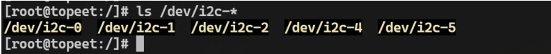

对于 I2C 控制器的控制命令 CMD 定义在`include/uapi/linux/i2c-dev.h`文件中：

```c

/* /dev/i2c-X ioctl commands.  The ioctl's parameter is always an
 * unsigned long, except for:
 *	- I2C_FUNCS, takes pointer to an unsigned long
 *	- I2C_RDWR, takes pointer to struct i2c_rdwr_ioctl_data
 *	- I2C_SMBUS, takes pointer to struct i2c_smbus_ioctl_data
 */
//设置重试次数,即当从设备没有响应时要重新轮询的次数
#define I2C_RETRIES	0x0701	/* number of times a device address should
				   be polled when not acknowledging */
//设置超时时间,单位为 10 毫秒
#define I2C_TIMEOUT	0x0702	/* set timeout in units of 10 ms */

/* NOTE: Slave address is 7 or 10 bits, but 10-bit addresses
 * are NOT supported! (due to code brokenness)
 */
//使用此从机地址
#define I2C_SLAVE	0x0703	/* Use this slave address */
//强制使用此从机地址
#define I2C_SLAVE_FORCE	0x0706	/* Use this slave address, even if it
				   is already in use by a driver! */
//0 表示 7 位地址, 非 0 表示 10 位地址
#define I2C_TENBIT	0x0704	/* 0 for 7 bit addrs, != 0 for 10 bit */
//获取适配器功能掩码
#define I2C_FUNCS	0x0705	/* Get the adapter functionality mask */
//执行合并读写传输(只有一个 STOP 信号)
#define I2C_RDWR	0x0707	/* Combined R/W transfer (one STOP only) */
//使用 PEC(校验码)进行 SMBus 传输
#define I2C_PEC		0x0708	/* != 0 to use PEC with SMBus */
//执行 SMBus 传输
#define I2C_SMBUS	0x0720	/* SMBus transfer */


/* This is the structure as used in the I2C_SMBUS ioctl call */
struct i2c_smbus_ioctl_data {
	__u8 read_write;
	__u8 command;
	__u32 size;
	union i2c_smbus_data __user *data;
};

/* This is the structure as used in the I2C_RDWR ioctl call */
struct i2c_rdwr_ioctl_data {
	struct i2c_msg __user *msgs;	/* pointers to i2c_msgs */
	__u32 nmsgs;			/* number of i2c_msgs */
};

#define  I2C_RDWR_IOCTL_MAX_MSGS	42
/* Originally defined with a typo, keep it for compatibility */
#define  I2C_RDRW_IOCTL_MAX_MSGS	I2C_RDWR_IOCTL_MAX_MSGS
```

`i2c_rdwr_ioctl_data`这 个 结 构 体 用 于 在`I2C_RDWR ioctl` 调 用 中 传 递I2C 消 息 。 其 中

- `msgs` 是 一 个 指向 `i2c_msg` 结构体数组的指针,用于存储一个或多个 I2C 消息。
- `nmsgs` 是 `i2c_msg` 结构体数组的长度,即 I2C 消息的数量。


### 示例

```c
#include <stdio.h>
#include <linux/i2c.h>
#include <linux/i2c-dev.h>
#include <sys/ioctl.h>
#include <sys/types.h>
#include <sys/stat.h>
#include <fcntl.h>
#include <string.h>

/**
 * @brief 从 I2C 设备的寄存器中读取数据
 * @param fd 打开的 I2C 设备文件描述符
 * @param slave_addr I2C 设备的从机地址
 * @param reg_addr 要读取的寄存器地址
 * @return 寄存器的值
 */
int ft5x06_read_reg(int fd, unsigned char slave_addr, unsigned char reg_addr) {
    unsigned char data;
    struct i2c_rdwr_ioctl_data i2c_msgs;
    int ret;

    // 定义两个 i2c_msg 结构体, 第一个用于写入寄存器地址, 第二个用于读取数据
    struct i2c_msg dev_msgs[] = {
        [0] = {
            .addr = slave_addr,
            .flags = 0,
            .len = sizeof(reg_addr),
            .buf = &reg_addr,
        },
        [1] = {
            .addr = slave_addr,
            .flags = I2C_M_RD, // 设置读取标志
            .len = sizeof(data),
            .buf = &data,
        }
    };

    i2c_msgs.msgs = dev_msgs;
    i2c_msgs.nmsgs = 2; // 两个 i2c_msg 结构体

    // 调用 ioctl 函数执行读取操作
    ret = ioctl(fd, I2C_RDWR, &i2c_msgs);
    if (ret < 0) {
        printf("read error\n");
        return ret;
    }

    return data;
}

/**
 * @brief 向 I2C 设备的寄存器写入数据
 * @param fd 打开的 I2C 设备文件描述符
 * @param slave_addr I2C 设备的从机地址
 * @param reg_addr 要写入的寄存器地址
 * @param data 要写入的数据
 * @param len 数据长度
 */
void ft5x06_write_reg(int fd, unsigned char slave_addr, unsigned char reg_addr, unsigned char *data, int len)
{
    unsigned char buff[256];
    struct i2c_rdwr_ioctl_data i2c_msgs;
    int ret;

    // 定义一个 i2c_msg 结构体, 用于写入寄存器地址和数据
    struct i2c_msg dev_msgs[] = {
        [0] = {
            .addr = slave_addr,
            .flags = 0,
            .len = len + 1,
            .buf = buff,
        }
    };

    // 将寄存器地址和数据拷贝到 buff 数组中
    buff[0] = reg_addr;
    memcpy(&buff[1], data, len);

    i2c_msgs.msgs = dev_msgs;
    i2c_msgs.nmsgs = 1;

    // 调用 ioctl 函数执行写入操作
    ret = ioctl(fd, I2C_RDWR, &i2c_msgs);
    if (ret < 0) {
        printf("write error\n");
    }
}

int main(int argc, char *argv[])
{
    int fd;
    int ID_G_THGROUP;

    // 打开 I2C 设备文件
    fd = open("/dev/i2c-1", O_RDWR);
    if (fd < 0) {
        printf("open error\n");
        return fd;
    }

    // 向 0x38 地址的寄存器 0x80 写入 0x55
    unsigned char data = 0x55;
    ft5x06_write_reg(fd, 0x38, 0x80, &data, 1);

    // 从 0x38 地址的寄存器 0x80 读取数据
    ID_G_THGROUP = ft5x06_read_reg(fd, 0x38, 0x80);
    printf("ID_G_THGROUP is 0x%02X\n", ID_G_THGROUP);

    return 0;
}
```


## 通用I2C驱动

通用 I2C 驱动文件为 `drivers/i2c/i2c-dev.c`，它为 I2C 外设提供了统一的驱动框架,分为 I2C客户端 (I2C client) 和 I2C 驱动 (I2C driver)。

它为上层应用程序提供了通用的设备节点 `/dev/i2c-X`(X 代表 I2C 总线号)。

应用程序可以直接通过打开这个设备节点 `/dev/i2c-X`，并使用标准的 I/O 操作如 open()、ioctl()、read()、write() 等来与 I2C 从设备进行通信。

该驱动程序一般情况下都是默认使能的，具体路径如下所示：

```
Device Drivers
	I2C Support
		I2C Device interface
```

### i2c_dev_init()

驱动初始化函数

```c
static int __init i2c_dev_init(void)
{
	int res;
	// 打印内核日志,表示 i2c /dev 条目驱动已经初始化
	printk(KERN_INFO "i2c /dev entries driver\n");
	// 注册字符设备驱动,主设备号为 I2C_MAJOR,次设备号范围为 0 到 I2C_MINORS-1,设备名为"i2c"
	res = register_chrdev_region(MKDEV(I2C_MAJOR, 0), I2C_MINORS, "i2c");
	if (res)
		goto out;
	// 创建一个 class 对象,名称为 "i2c-dev",用于在用户空间创建设备节点
	i2c_dev_class = class_create(THIS_MODULE, "i2c-dev");
	if (IS_ERR(i2c_dev_class)) {
		res = PTR_ERR(i2c_dev_class);
		goto out_unreg_chrdev;
	}
    // 将 i2c_groups 数组设置为该 class 的 dev_groups 属性
	i2c_dev_class->dev_groups = i2c_groups;

	/* Keep track of adapters which will be added or removed later */
    // 注册一个总线通知函数 i2cdev_notifier,用于追踪 i2c 总线上新添加或删除的适配器
	res = bus_register_notifier(&i2c_bus_type, &i2cdev_notifier);
	if (res)
		goto out_unreg_class;

	/* Bind to already existing adapters right away */
    // 立即绑定已经存在的 i2c 适配器到 i2c 设备
	i2c_for_each_dev(NULL, i2cdev_attach_adapter);

	return 0;

out_unreg_class:
    // 销毁创建的 class 对象
	class_destroy(i2c_dev_class);
out_unreg_chrdev:
    // 注销已注册的字符设备驱动
	unregister_chrdev_region(MKDEV(I2C_MAJOR, 0), I2C_MINORS);
out:
    // 打印初始化失败的内核日志
	printk(KERN_ERR "%s: Driver Initialisation failed\n", __FILE__);
	return res;
}
```


### i2c_dev_adapter()

`i2c_dev_init()`函数中最后调用`i2cdev_attach_adapter()`函数来绑定已存在的i2c适配器到i2c设备

```c
static int i2cdev_attach_adapter(struct device *dev, void *dummy)
{
	struct i2c_adapter *adap;
	struct i2c_dev *i2c_dev;
	int res;
	// 检查设备类型是否为 i2c_adapter_type,如果不是则返回
	if (dev->type != &i2c_adapter_type)
		return 0;
	adap = to_i2c_adapter(dev);
	// 从 i2c_dev_list 中获取一个空闲的 i2c_dev 结构体
	i2c_dev = get_free_i2c_dev(adap);
	if (IS_ERR(i2c_dev))
		return PTR_ERR(i2c_dev);
	// 初始化 i2c_dev 结构体中的 cdev 字段,设置文件操作函数为 i2cdev_fops
	cdev_init(&i2c_dev->cdev, &i2cdev_fops);
	i2c_dev->cdev.owner = THIS_MODULE;
	// 初始化设备对象 i2c_dev->dev
	device_initialize(&i2c_dev->dev);
    // 设置设备号为主设备号 I2C_MAJOR 和次设备号 adap->nr
	i2c_dev->dev.devt = MKDEV(I2C_MAJOR, adap->nr);
	i2c_dev->dev.class = i2c_dev_class;
	i2c_dev->dev.parent = &adap->dev;
	i2c_dev->dev.release = i2cdev_dev_release;
    // 设置设备名称为 "i2c-{adap->nr}"
	dev_set_name(&i2c_dev->dev, "i2c-%d", adap->nr);
	// 将 i2c_dev 设备添加到设备树中
	res = cdev_device_add(&i2c_dev->cdev, &i2c_dev->dev);
	if (res) {
        // 如果添加失败,则释放 i2c_dev 结构体
		put_i2c_dev(i2c_dev, false);
		return res;
	}
	// 打印调试信息,表示适配器 [adap->name] 已注册为次设备号 adap->nr
	pr_debug("i2c-dev: adapter [%s] registered as minor %d\n",
		 adap->name, adap->nr);
	return 0;
}
```

这个函数的作用是在系统总线上发现新的 i2c 适配器时,为其创建对应的字符设备节点。

### struct file_operations i2cdev_fops

`i2c_dev` 结构体中的 cdev 字段指定的文件操作集结构体为 `i2cdev_fops`，具体内容如下所示：

```c
static const struct file_operations i2cdev_fops = {
	.owner		= THIS_MODULE,
	.llseek		= no_llseek,
	.read		= i2cdev_read,
	.write		= i2cdev_write,
	.unlocked_ioctl	= i2cdev_ioctl,
	.compat_ioctl	= compat_i2cdev_ioctl,
	.open		= i2cdev_open,
	.release	= i2cdev_release,
};
```


#### i2cdev_open()

```c
static int i2cdev_open(struct inode *inode, struct file *file)
{
	unsigned int minor = iminor(inode);// 获取次设备号
	struct i2c_client *client;// 声明 i2c_client 和 i2c_adapter 结构体指针
	struct i2c_adapter *adap;
	// 根据次设备号获取对应的 i2c_adapter
	adap = i2c_get_adapter(minor);
    // 如果没有找到对应的 i2c_adapter，返回 -ENODEV 错误
	if (!adap)
		return -ENODEV;

	/* This creates an anonymous i2c_client, which may later be
	 * pointed to some address using I2C_SLAVE or I2C_SLAVE_FORCE.
	 *
	 * This client is ** NEVER REGISTERED ** with the driver model
	 * or I2C core code!!  It just holds private copies of addressing
	 * information and maybe a PEC flag.
	 */
	client = kzalloc(sizeof(*client), GFP_KERNEL);
	if (!client) {// 如果内存分配失败，释放 i2c_adapter 并返回 -ENOMEM 错误
		i2c_put_adapter(adap);
		return -ENOMEM;
	}
    // 设置 i2c_client 的名称
	snprintf(client->name, I2C_NAME_SIZE, "i2c-dev %d", adap->nr);

	client->adapter = adap;// 将 i2c_adapter 赋值给 i2c_client 的 adapter 字段
	file->private_data = client;// 将 i2c_client 指针保存到 file 的 private_data 字段

	return 0;
}
```


#### i2cdev_read()

```c
/*
 * After opening an instance of this character special file, a file
 * descriptor starts out associated only with an i2c_adapter (and bus).
 *
 * Using the I2C_RDWR ioctl(), you can then *immediately* issue i2c_msg
 * traffic to any devices on the bus used by that adapter.  That's because
 * the i2c_msg vectors embed all the addressing information they need, and
 * are submitted directly to an i2c_adapter.  However, SMBus-only adapters
 * don't support that interface.
 *
 * To use read()/write() system calls on that file descriptor, or to use
 * SMBus interfaces (and work with SMBus-only hosts!), you must first issue
 * an I2C_SLAVE (or I2C_SLAVE_FORCE) ioctl.  That configures an anonymous
 * (never registered) i2c_client so it holds the addressing information
 * needed by those system calls and by this SMBus interface.
 */

static ssize_t i2cdev_read(struct file *file, char __user *buf, size_t count,
		loff_t *offset)
{
	char *tmp;// 声明一个临时缓冲区指针
	int ret;// 保存 i2c_master_recv 的返回值

	struct i2c_client *client = file->private_data;// 从 file 的 private_data 字段获取 i2c_client 指针
	// 限制最大读取字节数为 8192
	if (count > 8192)
		count = 8192;
	// 分配临时缓冲区
	tmp = kzalloc(count, GFP_KERNEL);
    // 如果内存分配失败,返回 -ENOMEM 错误
	if (tmp == NULL)
		return -ENOMEM;
	// 打印调试信息
	pr_debug("i2c-dev: i2c-%d reading %zu bytes.\n",
		iminor(file_inode(file)), count);
	// 使用 i2c_master_recv 函数从 i2c_client 设备读取数据
	ret = i2c_master_recv(client, tmp, count);
    // 如果读取成功
	if (ret >= 0)
		if (copy_to_user(buf, tmp, ret))// 将读取的数据拷贝到用户空间缓冲区
			ret = -EFAULT;// 如果拷贝失败,返回 -EFAULT 错误
	kfree(tmp);// 释放临时缓冲区
	return ret;// 返回实际读取的字节数,或者错误码
}
```

#### i2cdev_write()

```c
static ssize_t i2cdev_write(struct file *file, const char __user *buf,
		size_t count, loff_t *offset)
{
	int ret;// 保存 i2c_master_send 的返回值
	char *tmp;// 声明一个临时缓冲区指针
	struct i2c_client *client = file->private_data;// 从 file 的 private_data 字段获取 i2c_client 指针

	if (count > 8192)// 限制最大写入字节数为 8192
		count = 8192;
	// 分配一个临时缓冲区,并从用户空间拷贝数据到该缓冲区
	tmp = memdup_user(buf, count);
	if (IS_ERR(tmp))// 如果内存拷贝失败,返回错误码
		return PTR_ERR(tmp);
	// 打印调试信息
	pr_debug("i2c-dev: i2c-%d writing %zu bytes.\n",
		iminor(file_inode(file)), count);
	// 使用 i2c_master_send 函数将数据写入 i2c_client 设备
	ret = i2c_master_send(client, tmp, count);
    // 释放临时缓冲区
	kfree(tmp);
    // 返回实际写入的字节数,或者错误码
	return ret;
}
```

#### i2cdev_ioctl()

```c
static long i2cdev_ioctl(struct file *file, unsigned int cmd, unsigned long arg)
{
    // 从 file 的 private_data 字段获取 i2c_client 指针
	struct i2c_client *client = file->private_data;
    // 声明一个无符号长整型变量,用于保存设备功能
	unsigned long funcs;
	// 打印调试信息
	dev_dbg(&client->adapter->dev, "ioctl, cmd=0x%02x, arg=0x%02lx\n",
		cmd, arg);
	// 根据不同的 ioctl 命令进行处理
	switch (cmd) {
	case I2C_SLAVE:
	case I2C_SLAVE_FORCE:
        // 检查从设备地址是否合法
		if ((arg > 0x3ff) ||
		    (((client->flags & I2C_M_TEN) == 0) && arg > 0x7f))
			return -EINVAL;
        // 如果是 I2C_SLAVE 命令,检查地址是否被占用
		if (cmd == I2C_SLAVE && i2cdev_check_addr(client->adapter, arg))
			return -EBUSY;
		/* REVISIT: address could become busy later */
        // 设置从设备地址
		client->addr = arg;
		return 0;
	case I2C_TENBIT:
		if (arg)// 设置 10 位地址模式
			client->flags |= I2C_M_TEN;
		else
			client->flags &= ~I2C_M_TEN;
		return 0;
	case I2C_PEC:// 设置 PEC 标志
		/*
		 * Setting the PEC flag here won't affect kernel drivers,
		 * which will be using the i2c_client node registered with
		 * the driver model core.  Likewise, when that client has
		 * the PEC flag already set, the i2c-dev driver won't see
		 * (or use) this setting.
		 */
		if (arg)
			client->flags |= I2C_CLIENT_PEC;
		else
			client->flags &= ~I2C_CLIENT_PEC;
		return 0;
	case I2C_FUNCS:
		funcs = i2c_get_functionality(client->adapter);// 获取 i2c 适配器的功能
		return put_user(funcs, (unsigned long __user *)arg);// 将结果写入用户空间的地址

	case I2C_RDWR: {// 处理 I2C_RDWR 命令
		struct i2c_rdwr_ioctl_data rdwr_arg;
		struct i2c_msg *rdwr_pa;
		// 从用户空间拷贝参数结构体
		if (copy_from_user(&rdwr_arg,
				   (struct i2c_rdwr_ioctl_data __user *)arg,
				   sizeof(rdwr_arg)))
			return -EFAULT;
		// 检查参数合法性
		if (!rdwr_arg.msgs || rdwr_arg.nmsgs == 0)// 限制最大消息数为 I2C_RDWR_IOCTL_MAX_MSGS
			return -EINVAL;

		/*
		 * Put an arbitrary limit on the number of messages that can
		 * be sent at once
		 */
		if (rdwr_arg.nmsgs > I2C_RDWR_IOCTL_MAX_MSGS)
			return -EINVAL;

		rdwr_pa = memdup_user(rdwr_arg.msgs,
				      rdwr_arg.nmsgs * sizeof(struct i2c_msg));// 将用户空间的消息数组复制到内核空间
		if (IS_ERR(rdwr_pa))
			return PTR_ERR(rdwr_pa);
		// 调用 i2cdev_ioctl_rdwr 函数进行 i2c 读写操作
		return i2cdev_ioctl_rdwr(client, rdwr_arg.nmsgs, rdwr_pa);
	}

	case I2C_SMBUS: {// 处理 I2C_SMBUS 命令
		struct i2c_smbus_ioctl_data data_arg;
		if (copy_from_user(&data_arg,
				   (struct i2c_smbus_ioctl_data __user *) arg,
				   sizeof(struct i2c_smbus_ioctl_data)))
			return -EFAULT;
		return i2cdev_ioctl_smbus(client, data_arg.read_write,
					  data_arg.command,
					  data_arg.size,
					  data_arg.data);
	}
	case I2C_RETRIES:// 设置 i2c 适配器的重试次数
		if (arg > INT_MAX)
			return -EINVAL;

		client->adapter->retries = arg;
		break;
	case I2C_TIMEOUT:// 设置 i2c 适配器的超时时间
		if (arg > INT_MAX)
			return -EINVAL;

		/* For historical reasons, user-space sets the timeout
		 * value in units of 10 ms.
		 */
        // 用户空间设置的单位是 10 ms
		client->adapter->timeout = msecs_to_jiffies(arg * 10);
		break;
	default:// 不支持的 ioctl 命令
		/* NOTE:  returning a fault code here could cause trouble
		 * in buggy userspace code.  Some old kernel bugs returned
		 * zero in this case, and userspace code might accidentally
		 * have depended on that bug.
		 */
		return -ENOTTY;
	}
	return 0;
}

```

## I2C_tools




编译：

```bash
make CC=/home/topeet/Linux/linux_sdk/prebuilts/gcc/linux-x86/aarch64/gcc-linaro-6.3.1-2017.05-x86_64_aarc
h64-linux-gnu/bin/aarch64-linux-gnu-gcc \
AR=/home/topeet/Linux/linux_sdk/prebuilts/gcc/linux-x86/aarch64/gcc-linaro-6.3.1-2017.05-x86_64_aarch64-lin
ux-gnu/bin/aarch64-linux-gnu-ar \
USE_STATIC_LIB=1
```

如果使用的是 ubuntu 或者 Debian 系统只需要使用命令`sudo apt install i2c-tools`进行安装即可

### i2cdetect

i2cdetect 可以用来检测和探测 I2C 总线上连接的设备。

- `i2cdetect -V`: **输出版本信息**

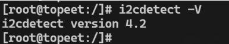

- `i2cdetect -l`:**列出所有的i2c总线**

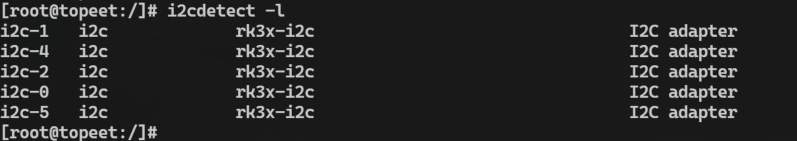

- `i2cdetect -F` **查询总线上设备支持的功能集**，例如 `i2cdetect -F 1` 将列出总线 1 上设备支持的功能

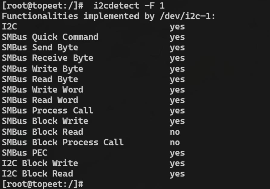

- `i2cdetect -a` 扫描总线上 0x00 到 0xFF 范围内的所有 I2C 设备地址。例如: `i2cdetect -a -y 1`将扫描 I2C1 总线上全部的 I2C 设备地址

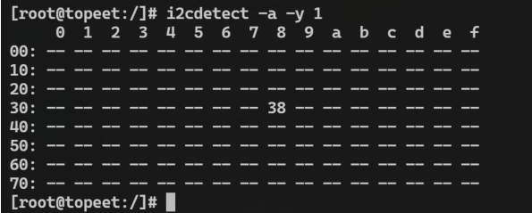

这里的 0x38 就是 FT5X06 触摸芯片的 I2C 设备地址

### i2cdump

i2cdump 可以读取设备上所有寄存器的值，具体用法如下：

- `i2cdump -V` 查看版本号

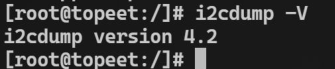

- `i2cdump -f -a`读取设备寄存器,使用 `i2cdump -f -a 1 0x38` 命令可以读取 I2C 设备地址为 0x38 的所有寄存
  器值(从 0x00 到 0xFF)。
  - -f 选项用于强制使用设备地址
  - -a 选项则是用于读取整个地址范围。

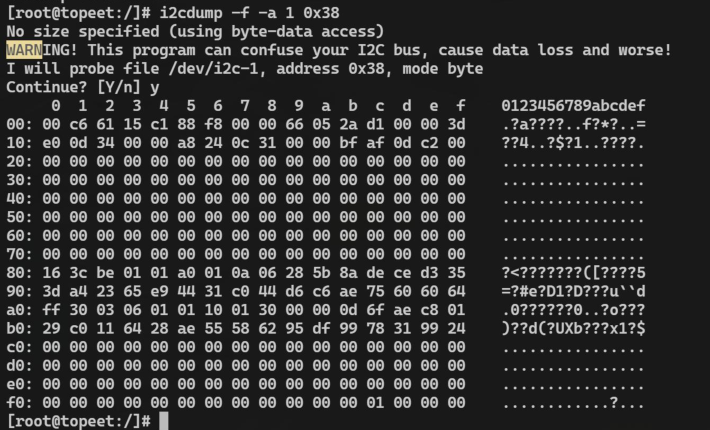


- `i2cdump -f -r`指定寄存器范围读取，使用 `i2cdump -f -r 0x80-0xff 1 0x38` 命令可以只读取 I2C 设备地址为0x38 的 0x80 到 0xff 范围内的寄存器值。-r 选项用于指定要读取的寄存器地址范围

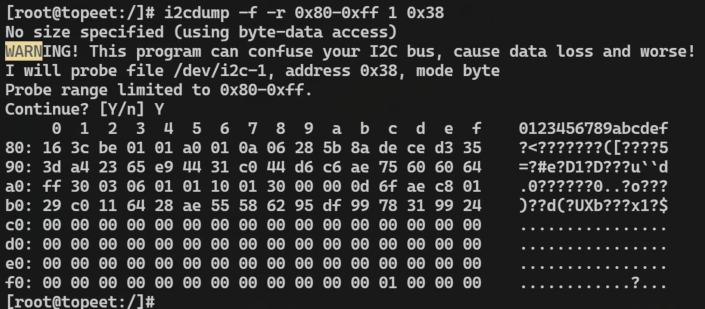


### i2cset

i2cset 命令用于向 I2C 设备的特定寄存器写入数据。它的用法如下:

```bash
i2cset -f -r 1 0x38 0x80 0x11
```

这条命令的意思是:

- 强制使用 I2C 总线 1 上的设备地址 0x38
- 向该设备的寄存器地址 0x80 写入值 0x11

写入完成后,该命令会返回一个确认信息,表示写入是否成功。如果写入失败,则会返回一个错误信息。


### i2cget

i2cget 命令用于从 I2C 设备的指定寄存器中读取数据它的用法如下:

```bash
i2cget -f 1 0x38 0x80
```

这条命令的意思是:

- 强制使用 I2C 总线 1 上的设备地址 0x38
- 从该设备的寄存器地址 0x80 读取数据

该命令会返回寄存器 0x80 的值。读取成功后,会显示类似 0x11 的十六进制值。如果读取失败,则会返回一个错误信息。


### i2ctransfer

i2ctransfer 是一个更加强大和灵活的 I2C 操作工具,与之前介绍的 i2cset 和 i2cget 命令相比,它可以在单个命令中完成读写操作。具体用法如下所示：
**写操作**

```bash
i2ctransfer 1 w2@0x38 0x80 0x22
```

- `1` 表示操作的 I2C 总线编号为 1
- `w2` 表示写入 2 个字节的数据
- `@0x38` 表示设备地址为 0x38
- `0x80` 表示要写入的寄存器地址为 0x80
- `0x22` 表示要写入寄存器的值为 0x22


**读操作**

```bash
i2ctransfer 1 w1@0x38 0x80 r1
```

- `1` 表示操作的 I2C 总线编号为 1
- `w1` 表示写入 1 个字节的数据
- `@0x38` 表示设备地址为 0x38
- `0x80` 表示要写入的寄存器地址为 0x80
- `r1` 表示读取 1 个字节的数据

## 使用 GPIO 模拟 I2C 驱动

由于要使用软件 I2C，所以要取消掉在设备树中硬件 I2C1 的使能，要在设备树中把ft5x06和i2c1的status都设置为disabled。

此时 I2C1 的两个复用引脚 GPIO0 B3、GPIO0 B4 会设置为默认的 GPIO 功能。

```c
#include <linux/init.h>
#include <linux/module.h>
#include <linux/gpio/consumer.h>
#include <linux/gpio.h>
#include <linux/delay.h>
#include <linux/jiffies.h>

// 定义 I2C 总线的时钟线和数据线对应的 GPIO 引脚编号
#define I2C_SCL 11
#define I2C_SDA 12

// 声明两个 GPIO 描述符变量,用于保存 SCL 和 SDA 引脚的描述符
struct gpio_desc *i2c_scl_desc;
struct gpio_desc *i2c_sda_desc;


// I2C 起始条件函数
void i2c_start(void)
{
    // 将 SCL 和 SDA 引脚设置为输出模式,并初始化为高电平
    // 这是 I2C 总线的空闲状态
    gpiod_direction_output(i2c_scl_desc, 1);
    gpiod_direction_output(i2c_sda_desc, 1);
    mdelay(1); // 延时 1 毫秒

    // 将 SDA 引脚设置为低电平,保持 SCL 为高电平
    // 这将产生 I2C 总线的起始条件
    gpiod_direction_output(i2c_sda_desc, 0);
    mdelay(1); // 延时 1 毫秒

    // 将 SCL 引脚设置为低电平
    // 起始条件建立完成
    gpiod_direction_output(i2c_scl_desc, 0);
    mdelay(1); // 延时 1 毫秒
}

// I2C 停止条件函数
void i2c_stop(void)
{
    // 将 SCL 和 SDA 引脚设置为低电平
    gpiod_direction_output(i2c_scl_desc, 0);
    gpiod_direction_output(i2c_sda_desc, 0);
    mdelay(1); // 延时 1 毫秒

    // 将 SCL 引脚设置为高电平
    gpiod_direction_output(i2c_scl_desc, 1);
    mdelay(1); // 延时 1 毫秒

    // 将 SDA 引脚设置为高电平
    // 这将产生 I2C 总线的停止条件
    gpiod_direction_output(i2c_sda_desc, 1);
    mdelay(1); // 延时 1 毫秒
}

// 发送ACK信号
void i2c_send_ack(int ack) {
    // 设置SDA线为输出模式
    gpiod_direction_output(i2c_sda_desc, 0);
    
    if (ack) {
        // 发送ACK信号, SDA线拉低
        gpiod_direction_output(i2c_sda_desc, 0);
    } else {
        // 发送NACK信号, SDA线拉高
        gpiod_direction_output(i2c_sda_desc, 1);
    }
    
    // 拉高SCL线1ms,然后拉低
    gpiod_direction_output(i2c_scl_desc, 1);
    mdelay(1);
    gpiod_direction_output(i2c_scl_desc, 0);
}

// 接收ACK信号
int i2c_recv_ack(void) {
    int value = 0;
    
    // 设置SDA线为输入模式
    gpiod_direction_input(i2c_sda_desc);
    
    // 拉高SCL线1ms
    gpiod_direction_output(i2c_scl_desc, 1);
    mdelay(1);
    
    // 读取SDA线的电平状态
    if (gpiod_get_value(i2c_sda_desc)) {
        value = 1; // 接收到NACK信号
    } else {
        value = 0; // 接收到ACK信号
    }
    
    // 拉低SCL线
    gpiod_direction_output(i2c_scl_desc, 0);
    
    // 设置SDA线为输出模式并拉高
    gpiod_direction_output(i2c_sda_desc, 1);
    
    return value;
}

void i2c_send_data(int data) {
    int i;
    int value;

    // 设置SCL线为输出模式并拉低
    gpiod_direction_output(i2c_scl_desc, 0);

    // 发送8位数据
    for (i = 0; i < 8; i++) {
        // 获取当前位的值
        value = (data << i) & 0x80;

        // 根据当前位的值设置SDA线
        if (value) {
            gpiod_direction_output(i2c_sda_desc, 1);
        } else {
            gpiod_direction_output(i2c_sda_desc, 0);
        }

        // 拉高SCL线1ms,然后拉低
        gpiod_direction_output(i2c_scl_desc, 1);
        mdelay(1);
        gpiod_direction_output(i2c_scl_desc, 0);
        mdelay(1);
    }
}

int i2c_recv_data(void) {
    int i;
    int temp = 0;
    int data = 0;

    // 设置SDA线为输入模式
    gpiod_direction_input(i2c_sda_desc);
    mdelay(1);

    // 接收8位数据
    for (i = 0; i < 8; i++) {
        // 拉低SCL线1ms
        gpiod_direction_output(i2c_scl_desc, 0);
        mdelay(1);

        // 拉高SCL线1ms
        gpiod_direction_output(i2c_scl_desc, 1);
        mdelay(1);

        // 读取SDA线的电平状态
        data = gpiod_get_value(i2c_sda_desc);

        // 根据当前位的值更新接收数据
        if (data) {
            temp = (temp << 1) | data;
        } else {
            temp = (temp << 1) & ~data;
        }
    }

    // 拉低SCL线
    gpiod_direction_output(i2c_scl_desc, 0);
    mdelay(1);

    // 设置SDA线为输出模式并拉高
    gpiod_direction_output(i2c_sda_desc, 1);

    return temp;
}

// ft5x06 触摸屏写寄存器函数
void ft5x06_write_reg(int addr, int reg, int value) {
    int ack;

    // 开始 I2C 通信
    i2c_start();

    // 发送触摸屏设备地址(写操作)
    i2c_send_data(addr << 1 | 0x00);
    ack = i2c_recv_ack();
    if (ack) {
        printk("send write + addr error\n");
        goto end;
    }

    // 发送寄存器地址
    i2c_send_data(reg);
    ack = i2c_recv_ack();
    if (ack) {
        printk("send reg error\n");
        goto end;
    }

    // 发送要写入的值
    i2c_send_data(value);
    ack = i2c_recv_ack();
    if (ack) {
        printk("send value error\n");
    }

end:
    // 结束 I2C 通信
    i2c_stop();
}

//  ft5x06 触摸屏读寄存器函数
int ft5x06_read_reg(int addr, int reg) {
    int ack;
    int data;

    // 开始 I2C 通信
    i2c_start();

    // 发送触摸屏设备地址(写操作)
    i2c_send_data(addr << 1 | 0x00);
    ack = i2c_recv_ack();
    if (ack) {
        printk("send write + addr error\n");
        goto end;
    }

    // 发送要读取的寄存器地址
    i2c_send_data(reg);
    ack = i2c_recv_ack();
    if (ack) {
        printk("send reg error\n");
        goto end;
    }

    // 重新开始 I2C 通信,发送读操作地址
    i2c_start();
    i2c_send_data(addr << 1 | 0x01);
    ack = i2c_recv_ack();
    if (ack) {
        printk("send read + addr error\n");
        goto end;
    }

    // 读取寄存器值
    data = i2c_recv_data();
    printk("data is %d\n", data);

    // 发送 ACK 以结束读操作
    i2c_send_ack(0);

end:
    // 结束 I2C 通信
    i2c_stop();

    return data;
}

// 驱动初始化函数
static int ft5x06_driver_init(void)
{
    // 将 GPIO 编号转换为 GPIO 描述符
    i2c_scl_desc = gpio_to_desc(I2C_SCL);
    if (i2c_scl_desc == NULL) {
        printk("gpio_to_desc error for SCL pin\n");
        return -1;
    }

    i2c_sda_desc = gpio_to_desc(I2C_SDA);
    if (i2c_sda_desc == NULL) {
        printk("gpio_to_desc error for SDA pin\n");
        return -1;
    }

    // 将 GPIO 引脚设置为输出模式,并初始化为高电平
    // 这是 I2C 总线的空闲状态
    gpiod_direction_output(i2c_scl_desc, 1);
    gpiod_direction_output(i2c_sda_desc, 1);

	ft5x06_write_reg(0x38,0x80,0x33);
	ft5x06_read_reg(0x38,0x80);
    return 0;
}

// 驱动退出函数
static void ft5x06_driver_exit(void)
{
    // 释放 GPIO 描述符
    gpiod_put(i2c_scl_desc);
    gpiod_put(i2c_sda_desc);
}

// 注册驱动初始化和退出函数
module_init(ft5x06_driver_init);
module_exit(ft5x06_driver_exit);

MODULE_LICENSE("GPL");
```

## 使用Linux默认的模拟I2C程序

```bash
export ARCH=arm64
make rockchip_linux_defconfig
make menuconfig

> Device Drivers
	> I2C support
		> I2C Hardware Bus support
			<*> GPIO-based bitbanging I2C
			
			
cp .config arch/arm64/configs/rockchip_linux_defconfig
```

设备树修改
```dts
i2c6:i2c6@gpio {
	compatible = "i2c-gpio";
	#address-cells = <1>;
	#size-cells = <0>;
	gpios = <&gpi00 RK PB4 GPIO ACTIVE_HIGH>;
			<&gpi00 RK PB3 GPIO ACTIVE_HIGH>;
	i2c-gpio,delay-us = <5>;
	status = "disabled";
};
```

对 I2C6 节点进行追加，最佳 FT5X06 触摸芯片相关的内容，添加内容如下所示：

```dts
&i2c6 {
	status = "okay";
	myft5x06: my-ft5x06@38 {
		compatible = "my-ft5x06";
		reg = <0x38>;
	};
};
```

> 需要注意的是，由于之前编写的设备树节点名也叫 myft5x06，会产生命名冲突，所以需要将之前编写的 myft5x06 设备树节点注释掉


编写驱动程序如下：

```c
#include <linux/init.h>
#include <linux/module.h>
#include <linux/i2c.h>
#include <linux/gpio.h>
#include <linux/gpio/consumer.h>
#include <linux/interrupt.h>
#include <linux/delay.h>

// 保存 ft5x06 设备的 i2c 客户端对象指针
struct i2c_client *ft5x06_client;

// 读取 ft5x06 设备寄存器的函数
int ft5x06_read_reg(u8 reg_addr)
{
    u8 data;
    // 定义两个 i2c_msg 结构体,分别表示写操作和读操作
    struct i2c_msg msgs[2] = {
        [0] = {
            .addr = ft5x06_client->addr, // 设备地址
            .flags = 0,        // 写操作
            .len = sizeof(reg_addr),
            .buf = &reg_addr,  // 写入要读取的寄存器地址
        },
        [1] = {
            .addr = ft5x06_client->addr,
            .flags = I2C_M_RD, // 读操作
            .len = sizeof(data),
            .buf = &data,      // 读取到的数据存储位置
        },
    };

   // 使用 i2c_transfer 函数进行 i2c 总线读取操作
   // 如果读取失败,返回 -EIO 错误码
   if (i2c_transfer(ft5x06_client->adapter, msgs, ARRAY_SIZE(msgs)) != ARRAY_SIZE(msgs)){
        return -EIO;
    }

    return data; // 返回读取到的寄存器值
}

// 向 ft5x06 设备写入寄存器的函数
void ft5x06_write_reg(u8 reg_addr, u8 *data, u16 len)
{
    u8 buff[256];
    struct i2c_msg msgs[] = {
        [0] = {
            .addr = ft5x06_client->addr, // 设备地址
            .flags = 0,        // 写操作
            .len = len + 1,    // 数据长度 + 寄存器地址长度
            .buf = buff,       // 数据缓冲区
        },
    };

    buff[0] = reg_addr;       // 写入寄存器地址
    memcpy(&buff[1], data, len); // 写入数据

    // 使用 i2c_transfer 函数进行 i2c 总线写入操作
    // 如果写入失败,直接返回
    if (i2c_transfer(ft5x06_client->adapter, msgs, ARRAY_SIZE(msgs)) != ARRAY_SIZE(msgs)) {
        return;
    }
}

// ft5x06 设备的探测函数
int ft5x06_probe(struct i2c_client *client, const struct i2c_device_id *id)
{
    int value;
    printk("This is ft5x06 probe\n");
    ft5x06_client = client; // 保存 i2c 客户端对象指针

    // 写寄存器
    ft5x06_write_reg(0x80, &(u8){0x4b}, 1);

    // 读寄存器
    value = ft5x06_read_reg(0x80);
    printk("reg 0x80 is %x\n", value);

    return 0;
}

// ft5x06 设备的移除函数
// 参数 client 是 i2c 客户端对象指针
int ft5x06_remove(struct i2c_client *client)
{
    // 释放中断
    return 0;
}

// 定义 i2c_device_id 结构体数组,用于标识 ft5x06 设备
static const struct i2c_device_id ft5x06_id[] = {
    { "my-ft5x06", 0 },
    { }
};

// 定义 i2c_driver 结构体,描述 ft5x06 设备驱动
static struct i2c_driver ft5x06_driver = {
    .driver = {
        .name = "my-ft5x06",
        .owner = THIS_MODULE,
    },
    .probe = ft5x06_probe,
    .remove = ft5x06_remove,
    .id_table = ft5x06_id,
};

// 驱动初始化函数
static int __init ft5x06_driver_init(void)
{
    int ret;
    // 注册 I2C 设备驱动
    ret = i2c_add_driver(&ft5x06_driver);
    if (ret < 0) {
        printk("i2c_add_driver is error\n");
        return ret;
    }
    return 0;
}

// 驱动退出函数
static void __exit ft5x06_driver_exit(void)
{
    // 注销 I2C 设备驱动
    i2c_del_driver(&ft5x06_driver);
}

module_init(ft5x06_driver_init);
module_exit(ft5x06_driver_exit);
MODULE_LICENSE("GPL");
```

## SMBus总线

SMBus(System Management Bus)是由 Intel 在 1995 年发布的一种基于 I2C 总线的串行总线协议。它最初被设计用于在电脑系统内部连接智能电池和其他系统管理设备。

SMBus 与 I2C 总线非常相似,它们都采用两线式串行通信。SMBus 使用 SMBDAT 和 SMBCLK 作为数据线和时钟线,与 I2C 的 SDA 和 SCL 很相似，如下图所示：

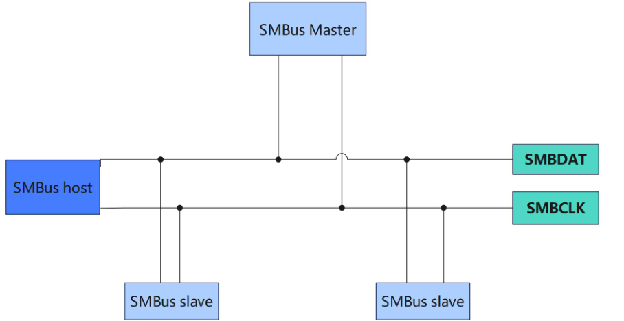

### SMBus特点

SMBus 的主要特点如下所示：

**电气特性**:

- 采用开漏输出,需要外部上拉电阻
- 电压范围:0V 到 5.5V
- 最大时钟频率:100kHz

**通信协议:**

- 主从式通信,一个主设备控制多个从设备
- 地址空间:7 位或 10 位
- 支持读/写操作
- 支持块传输和字节传输
- 支持多种事务类型,如快速命令、写字节、读字节等

**功能特性:**

- 简单、低成本、低功耗
- 面向系统管理应用,如电源管理、温度监控等
- 与 I2C 高度兼容,可以复用 I2C 硬件

**时序特性**:

- Start 和 Stop 条件与 I2C 相同
- 地址和数据传输时序也与 I2C 相似
- 但有一些特殊的时序,如快速命令、块传输等

### SMBus 和 I2C 的区别

- **速度范围**:
  I2C 支持从 10kHz 到 3.4MHz 不等的速度范围,覆盖了更广泛的应用场景。SMBus 则只支持 10kHz 到 100kHz 的速度范围,主要面向低速的系统管理应用场景。
- **ACK 应答:**
  I2C 不强制从机发送 ACK 应答,这样可以提高灵活性。但如果从机没有应答,主机可能会产生错误。SMBus 要求从机必须发送 ACK 应答,这可以确保主机能够检测到从机是否存在,避免误操作。
- **时间限制**:
  SMBus 规定,从机不能将 SCL 线拉低超过 35ms,否则会复位正在进行的通信。I2C 没有这样的时间限制,主机和从机可以自主控制 SCL 线的状态。
- **其他区别:**
  SMBus 有一些专门为系统管理设计的命令和事务类型,如快速命令、块传输等。SMBus 的地址空间相比 I2C 更小,只支持 7 位或 10 位地址。SMBus 在电气特性上也有一些差异,如电压范围等


### SMBus 总线软件实现

在 Linux 内核中,**I2C 和 SMBus 是共用的总线架构**,**通过 i2c-core 子系统进行管理和抽象**，在 `i2c.h` 头文件中定义了` i2c_algorithm` 结构体中，具体内容如下所示:

```c
/**
 * struct i2c_algorithm - represent I2C transfer method
 * @master_xfer: Issue a set of i2c transactions to the given I2C adapter
 *   defined by the msgs array, with num messages available to transfer via
 *   the adapter specified by adap.
 * @master_xfer_atomic: same as @master_xfer. Yet, only using atomic context
 *   so e.g. PMICs can be accessed very late before shutdown. Optional.
 * @smbus_xfer: Issue smbus transactions to the given I2C adapter. If this
 *   is not present, then the bus layer will try and convert the SMBus calls
 *   into I2C transfers instead.
 * @smbus_xfer_atomic: same as @smbus_xfer. Yet, only using atomic context
 *   so e.g. PMICs can be accessed very late before shutdown. Optional.
 * @functionality: Return the flags that this algorithm/adapter pair supports
 *   from the ``I2C_FUNC_*`` flags.
 * @reg_slave: Register given client to I2C slave mode of this adapter
 * @unreg_slave: Unregister given client from I2C slave mode of this adapter
 *
 * The following structs are for those who like to implement new bus drivers:
 * i2c_algorithm is the interface to a class of hardware solutions which can
 * be addressed using the same bus algorithms - i.e. bit-banging or the PCF8584
 * to name two of the most common.
 *
 * The return codes from the ``master_xfer{_atomic}`` fields should indicate the
 * type of error code that occurred during the transfer, as documented in the
 * Kernel Documentation file Documentation/i2c/fault-codes.rst.
 */
struct i2c_algorithm {
	/*
	 * If an adapter algorithm can't do I2C-level access, set master_xfer
	 * to NULL. If an adapter algorithm can do SMBus access, set
	 * smbus_xfer. If set to NULL, the SMBus protocol is simulated
	 * using common I2C messages.
	 *
	 * master_xfer should return the number of messages successfully
	 * processed, or a negative value on error
	 */
	int (*master_xfer)(struct i2c_adapter *adap, struct i2c_msg *msgs,
			   int num);
	int (*master_xfer_atomic)(struct i2c_adapter *adap,
				   struct i2c_msg *msgs, int num);
	int (*smbus_xfer)(struct i2c_adapter *adap, u16 addr,
			  unsigned short flags, char read_write,
			  u8 command, int size, union i2c_smbus_data *data);
	int (*smbus_xfer_atomic)(struct i2c_adapter *adap, u16 addr,
				 unsigned short flags, char read_write,
				 u8 command, int size, union i2c_smbus_data *data);

	/* To determine what the adapter supports */
	u32 (*functionality)(struct i2c_adapter *adap);

#if IS_ENABLED(CONFIG_I2C_SLAVE)
	int (*reg_slave)(struct i2c_client *client);
	int (*unreg_slave)(struct i2c_client *client);
#endif
};
```

其中 smbus_xfer 函数用于实现 SMBus 特有的一些操作,如快速命令、写字节、读字节等。

**当 I2C 控制器工作在 SMBus 模式时,会通过 smbus_xfer 函数来执行 SMBus 的特殊事务。**


###  SMBus 总线 API 函数

1. **`i2c_smbus_read_byte(const struct i2c_client *client)`**
   - 发送 **SMBus Read Byte** 协议。
   - 不发送寄存器地址，直接读取设备当前指向的数据字节。
   - 适用于：设备支持自动递增地址（如某些 EEPROM 连续读），或之前已通过其他方式设置好地址指针。
   - ⚠️ 大多数现代 I2C 设备**不支持**这种无地址读取，因此**较少使用**。
2. **`i2c_smbus_write_byte(const struct i2c_client *client, u8 value)`**
   - 发送 **SMBus Send Byte** 协议。
   - 仅发送一个字节（`value` 作为命令），**不带数据阶段**。
   - 注意：这里的 `value` 被当作 **command**，而不是写入的数据！
   - 常用于触发设备动作（如复位、启动转换），**不是写寄存器值**。
   - ❗容易误解！若想“向寄存器写值”，应使用 `i2c_smbus_write_byte_data`。
3. **`i2c_smbus_read_byte_data(const struct i2c_client *client, u8 command)`**
   - 发送 **SMBus Read Byte Data** 协议。
   - 先发送 `command`（寄存器地址），再读回 1 字节数据。
   - ✅ **最常用的读寄存器方式**。
4. **`i2c_smbus_write_byte_data(const struct i2c_client *client, u8 command, u8 value)`**
   - 发送 **SMBus Write Byte Data** 协议。
   - 发送 `command`（寄存器地址） + `value`（要写入的数据）。
   - ✅ **最常用的写寄存器方式**。
