# SPI基础

## SPI特点

SPI（Serial Peripheral Interface）最初是由摩托罗拉公司在上世纪 80 年代末期提出和开发的一种串行通信协议。当时,随着微控制器技术的发展,越来越多的外围设备需要与微控制器进行数据交换。

但传统的并行总线接口存在着引脚数量多、接线麻烦、功耗高等问题,不太适合嵌入式系统的需求。

为此,摩托罗拉公司设计了 SPI 这种简单高效的串行通信总线协议,以解决当时嵌入式系统中通信接口的痛点。SPI 的核心设计思路如下:

- **使用最少的引脚数实现全双工通信**

  - **单工通信**： 指信号只在一个方向上传输，仅能发送或接收

  - **半双工通信**：信号可以在俩个方向上传输，但某一个时刻只允许发送或接收(单总线和 I2C 都是半双工通信)

  - **全双工通信**：全双工通信指数据同时在两个方向上传输，SPI 只需要 4 根信号线(**SCLK、MOSI、MISO、CS**)即可完成主从设备之间的数据交换，实现全双工通信。这大大减少了引脚数,简化了接线。

- **采用同步通信机制**

  - **同步通信**: **指数据传输的发送方和接收方使用相同的时钟信号进行协调**。每**个时钟周期都会发送或接收一个数据位**，因此，数据传输严格依赖于时钟信号的节奏。

  - **异步通信**: **不依赖一个共同的时钟信号进行数据传输**，发送方和接收方独立运行，通过特定的协议进行数据同步，具体示意图如下所示：

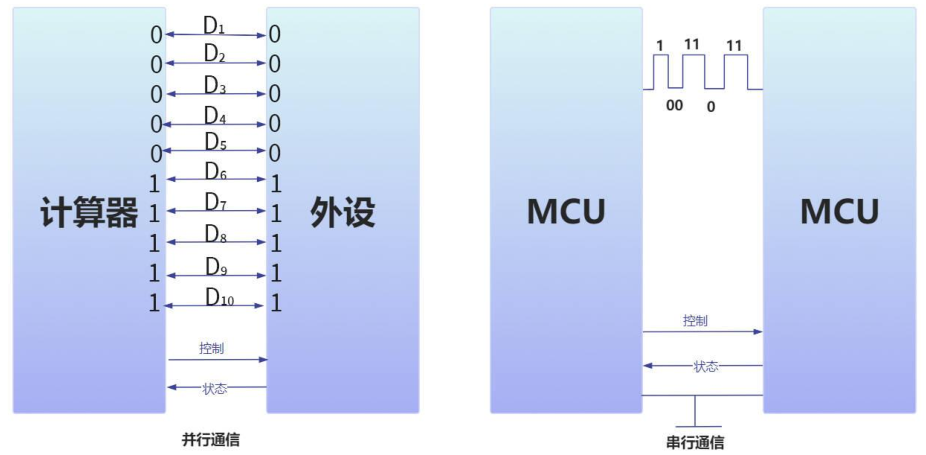


- **主从结构设计**: SPI 协议将通信设备分为主设备和从设备

  - 主设备负责**提供时钟信号和控制通信过程**
  - 从设备**被动响应主设备的操作。**

- **支持多从设备接入**: SPI 有多种连接模式，主要分为常规模式和菊花链模式（菊花链模式不常用），

  - 在**常规模式**下，每个从设备（Slave）都有独立的片选（Chip Select, CS）信号线。主设备（Master）通过拉低相应的 CS 线来选择从设备进行通信，具体示意图如下所示：

    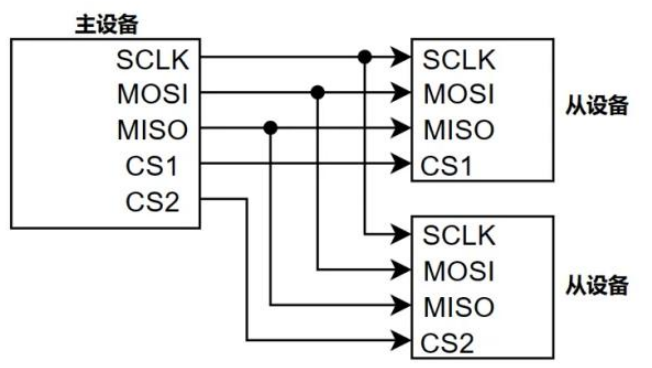

  - **菊花链模式**下，，数据从主设备传输到第一个从设备，然后从第一个从设备传输到下一个，从而形成链式结构，具体连接示意图如下所示：

  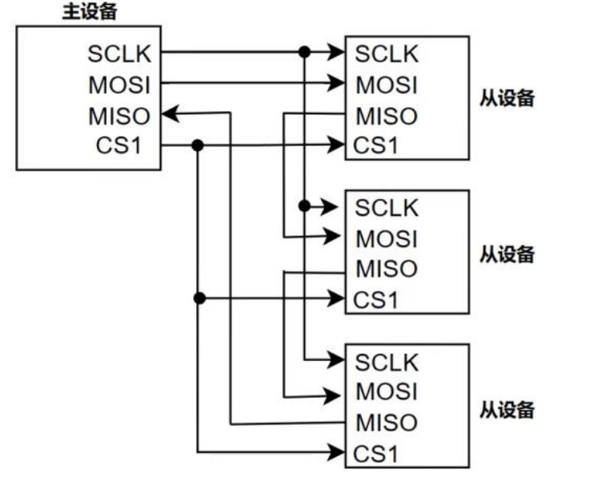

## SPI硬件连接

 SPI 使用 4 根信号线进行通信,分别是 **SCLK**、**MOSI**、**MISO** 和 **CS**，现在对每根信号线的具体作用和功能进行介绍。

- **SCLK (Serial Clock)：时钟信号线**

这是由主设备产生的同步时钟信号,用于驱动数据的收发。。从设备需要使用这个时钟信号来对齐和采样数据。

- **MOSI (Master Output Slave Input)：主->从数据传输线**

这是主设备向从设备传输数据的线路。主设备将要发送的数据放在这条线上,从设备则从这条线上读取数据。

- **MISO (Master Input Slave Output)：从->主数据传输线**

这是从设备向主设备传输数据的线路。从设备将要发送的数据放在这条线上,主设备则从这条线上读取数据。

- **CS (Chip Select) 或 SS (Slave Select)：片选/从设备选择信号**

这是主设备用来选择与之通信的从设备的信号线。当主设备拉低某个从设备的 CS/SS 线时,表示选中了该从设备进行通信。主设备可以通过控制多个 CS/SS 线来选择与不同从设备通信。


主设备和从设备之间的连接关系如下所示:

- SCLK 线连接主设备的 SCLK 输出到从设备的 SCLK 输入

- MOSI 线连接主设备的 MOSI 输出到从设备的 MOSI 输入

- MISO 线连接主设备的 MISO 输入到从设备的 MISO 输出

- CS/SS 线连接主设备的片选输出到从设备的片选输入

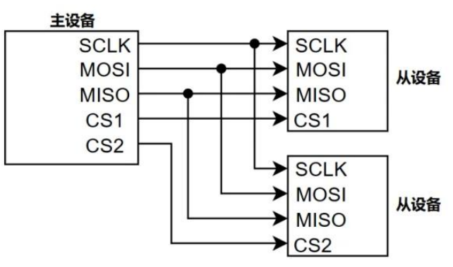


## SPI 通信原理

SPI 总线在进行数据传输时，具有以下特点：

- **传输顺序**：默认情况下，SPI 总线先传输高位（MSB，Most Significant Bit），然后传输低位（LSB，Least Significant Bit）。
- **逻辑电平**：数据线为高电平表示逻辑 1，数据线为低电平表示逻辑 0。
- **字节传输**：


SPI 是单通信协议，意味着总线中只有一个主设备能发起通信，而 SPI 主设备和从设备都有一个**串行移位寄存器**，如下图所示：

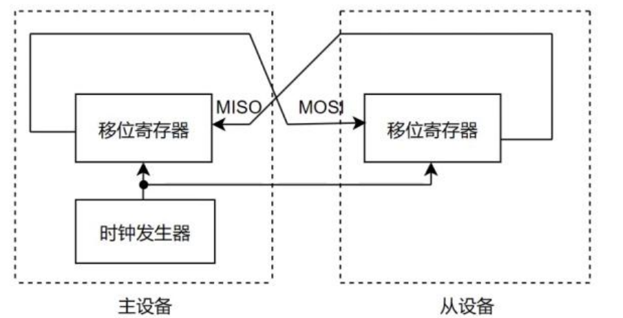

当 SPI 主设备想读/写从设备时，它**首先要拉低从设备对应的 CS 线**（CS 线是低电平有效），接着开始发送工作脉冲到时钟线上，在相应的脉冲时间上，**主设备把信号发送到 MOSI 实现“写”，同时可对 MISO 采样实现“读”**。

**在一个 SPI时钟周期内，收发是同时进行的**：

- 主机通过 MOSI 线发送 1bit 数据，从机通过该线读取这 1bit数据；
- 从机通过 MISO 线发送 1bit 数据，主机通过该线读取这 1bit 数据；

当寄存器中的内容全部移出时，相当于完成了俩个寄存器内容的交换。如果主设备要给从设备传输数据，主设备只需要忽略掉从设备接收到的数据即可。如果主设备要从从设备接收数据，主设备向从设备随机发送数据，从设备忽略掉从主设备接收的数据即可。

## SPI极性和相位

在 SPI 的通信之前需要先**确定时钟信号的默认状态**以及**时钟信号的采样时间**，这两个参数由 **CPOL(时钟极性 Clock Polarity)**和 **CPHA(时钟相位 Clock Phase)**来确定

1. **CPOL(时钟极性 Clock Polarity)**：CPOL 定义了。
   - CPOL = 0 时,表示时钟信号在空闲状态下为低电平(0)。
   - CPOL = 1 时,表示时钟信号在空闲状态下为高电平(1)。
2. **CPHA(时钟相位 Clock Phase)**：CPHA 定义了。
   - CPHA = 0 时,表示数据在时钟的**第一个边沿(上升或下降)被采样**。
   - CPHA = 1 时,表示数据在时钟的**第二个边沿(上升或下降)被采样**。

四种组合模式：

1. CPOL=0, CPHA=0: 时钟空闲为低电平,数据在时钟的第一个边沿(上升沿)被采样

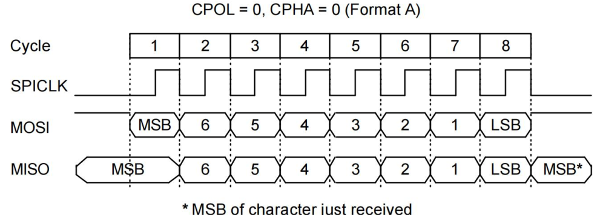

2. CPOL=0, CPHA=1: 时钟空闲为低电平,数据在时钟的第二个边沿(下降沿)被采样

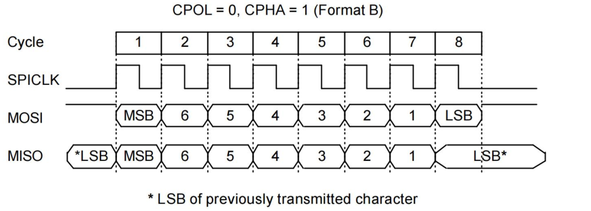


3. CPOL=1, CPHA=0: 时钟空闲为高电平,数据在时钟的第一个边沿(下降沿)被采样

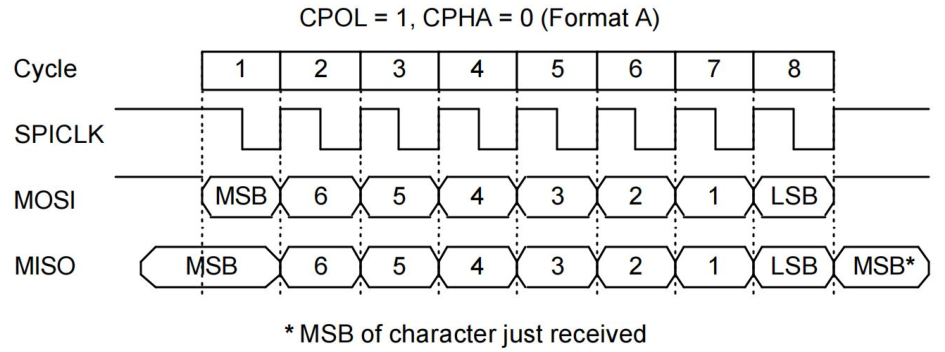


4. CPOL=1, CPHA=1: 时钟空闲为高电平,数据在时钟的第二个边沿(上升沿)被采样

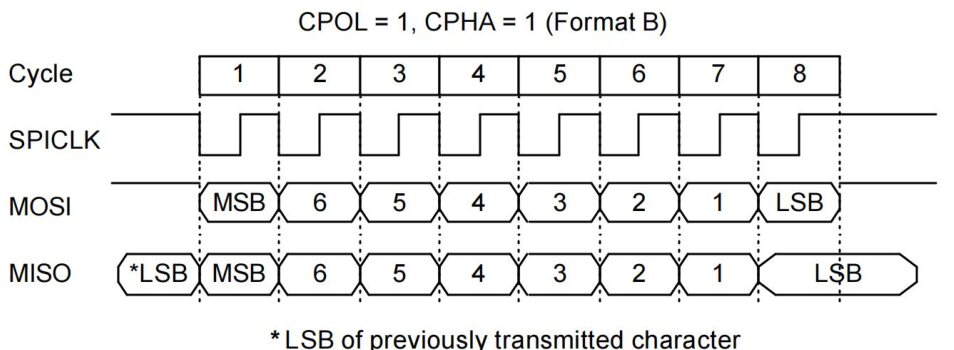

> 注意：**主设备和从设备必须配置相同的 CPOL 和 CPHA,否则无法正常通信。**
>
> 而在一般情况下,主设备会配置 CPOL 和 CPHA,从设备则需要根据主设备的设置进行匹配


## iTOP-RK3568 处理器中的 SPI 接口

iTOP-RK3568支持 4 个 SPI 控制器

- 1 个控制器支持 1 个片选输出其余 3 个控制器各支持 2 个片选输出
- 支持主机模式和从机模式,可通过软件进行配置切换

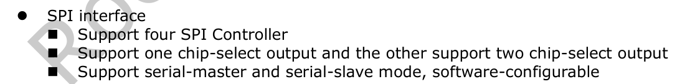

其中这里的 4 路 SPI 接口指的是硬件 SPI，在 SOC 上有专用的硬件 SPI 电路，关于硬件 I2C的介绍如下所示：

**硬件 SPI**:

- 实现方式: 通过专门的硬件电路来实现 SPI 通信协议。
- 优点:
  - CPU 占用低: SPI 总线由硬件电路自动完成，CPU 无需直接介入。
  - 传输速率高: 可以达到几十 MHz 甚至更高的通信速率。
  - 灵活配置: 硬件 SPI 通常提供 CPOL 和 CPHA 的配置选项，用于设置时钟极性和相位。
- 缺点:
  - 需要专用硬件: 需要专用的硬件 SPI 接口模块支持，成本相对较高。
  - 接口固定: 接口固定，不如软件 SPI 灵活。
- 适用范围: 适用于高速、大量数据传输的场合，如 LCD、EEPROM 等外设的连接。

软件 SPI 指的是通过 GPIO 口模拟 SPI 的四根信号线，在硬件 SPI 不够用的情况下，可以通过 GPIO 来模拟软件 SPI,关于软件 SPI 的介绍如下所示：

**软件 SPI:**

- 实现方式: 通过 CPU 的 GPIO 引脚模拟 SPI 通信协议。
- 优点
  - 灵活性高: 可以灵活配置 CPOL 和 CPHA，适用于高度定制化的 SPI 通信。
  - 无专用硬件要求: 不需要专用的硬件 SPI 接口模块，适用于没有内置硬件 SPI 接口的系统。
- 缺点:
  - CPU 占用高: 需要 CPU 程序完成时钟信号的生成、数据的读写等全部操作。
  - 传输速率低: 速度受到 CPU 执行程序的速度限制，通常较硬件 SPI 要慢。
- 适用范围: 适用于没有内置硬件 SPI 接口的系统，或需要高度定制化 SPI 通信的场景。


RK3568 开发板上的 SPI 接口具体使用情况如下表所示

### **SPI0**

| pinctrl function | 网络标号              | 对应的 GPIO | 功能                  |
| ---------------- | --------------------- | ----------- | --------------------- |
| SPI0_CLK_M0      | TP_INT_L_GPI00_B5     | GPIO00_B5   | PCIE2.0 唤醒          |
| SPI0_MISO_M0     | LCD1_PWREN_H_GPI00_C5 | GPIO00_C5   | 未使用                |
| SPI0_MOSI_M0     | TP_RST_L_GPI00_B6     | GPIO00_B6   | MIPI 屏幕触摸复位引脚 |
| SPI0_CS0_M0      | 4G_PWREN_H_GPI00_C6   | GPIO00_C6   | 未使用                |
| SPI0_CS1_M0      | LCD1_BL_PWM5          | GPIO00_C4   | MIPI 屏幕使能引脚     |
| SPI0_CLK_M1      | PCIE30X1_WAKEn_M1     | GPIO2_D3    | 底板背面 SPI          |
| SPI0_MISO_M1     | PCIE20_CLKREQn_M1     | GPIO2_D0    | 底板背面 SPI          |
| SPI0_MOSI_M1     | PCIE20_WAKEn_M1       | GPIO2_D1    | 底板背面 SPI          |
| SPI0_CS0_M1      | PCIE30X1_CLKREQn_M1   | GPIO2_D2    | 底板背面 SPI          |

### **SPI1**

| pinctrl function | 网络标号           | 对应的 GPIO | 功能    |
| ---------------- | ------------------ | ----------- | ------- |
| SPI1_CLK_M0      | GMAC0_TXEN         | GPIO2_B5    | 网口 0  |
| SPI1_MISO_M0     | GMAC0_RXD0         | GPIO2_B6    | 网口 0  |
| SPI1_MOSI_M0     | GMAC0_RXD1         | GPIO2_B7    | 网口 0  |
| SPI1_CS0_M0      | GMAC0_RXDV_CRS     | GPIO2_C0    | 网口 0  |
| SPI1_CS1_M0      | CLK32K_OUT1_WIFI   | GPIO2_C6    | 未使用  |
| SPI1_CLK_M1      | GMAC0_TXEN         | GPIO3_C3    | 网口 0  |
| SPI1_MISO_M1     | SPK_CTL_H_GPI03_C3 | GPIO2_B6    | 5G 复位 |
| SPI1_MOSI_M1     | PCIE20_PERSTn_M1   | GPIO3_C1    | 未使用  |
| SPI1_CS0_M1      | PCIE30X1_PERSTn_M1 | GPIO3_A1    | 未使用  |

### **SPI2**

| pinctrl function | 网络标号                  | 对应的 GPIO | 功能              |
| ---------------- | ------------------------- | ----------- | ----------------- |
| SPI2_CLK_M0      | ETH0_REFCLK0_25M          | GPIO2_C1    | 网口 0 时钟       |
| SPI2_MISO_M0     | GMAC0_MCLKINOUT           | GPIO2_C2    | 网口 0 时钟       |
| SPI2_MOSI_M0     | GMAC0_MDC                 | GPIO2_C3    | 网口 0            |
| SPI2_CS0_M0      | GMAC0_MDIO                | GPIO2_C4    | 网口 0            |
| SPI2_CS1_M0      | GPIO2_C5                  | GPIO2_C5    | PCIE 电源使能引脚 |
| SPI2_CLK_M1      | PCIE30X1_PRSNT_L_GPI03_A0 | GPIO3_A0    | PCIE2.0           |
| SPI2_MISO_M1     | PCIE30X2_PRSNT_L_GPI02_D7 | GPIO2_D7    | PCIE3.0           |
| SPI2_MOSI_M1     | PCIE30X2_PERSTn_M1        | GPIO2_D6    | PCIE3.0           |
| SPI2_CS0_M1      | PCIE30X2_WAKEn_M1         | GPIO2_D5    | PCIE3.0           |
| SPI2_CS1_M1      | PCIE30X2_CLKREQn_M1       | GPIO2_D4    | PCIE3.0           |

### **SPI3**

| pinctrl function | 网络标号               | 对应的 GPIO | 功能          |
| ---------------- | ---------------------- | ----------- | ------------- |
| SPI3_CLK_M0      | ETH1_REFCLK0_25M_M1    | GPIO4_B3    | 网口 1 时钟   |
| SPI3_MISO_M0     | GMAC1_RXD1_M1          | GPIO4_B0    | 网口 1        |
| SPI3_MOSI_M0     | GPIO4_B2               | GPIO4_B2    | 未使用        |
| SPI3_CS0_M0      | GMAC1_TXEN_M1          | GPIO4_A6    | 网口 1        |
| SPI3_CS1_M0      | GMAC1_RXD0_M1          | GPIO4_A7    | 网口 1        |
| SPI3_CLK_M1      | 4G_DISABLE_GPI04_C2    | GPIO4_C2    | CAN1_RX       |
| SPI3_MISO_M1     | GPIO4_C5               | GPIO4_C5    | 未使用        |
| SPI3_MOSI_M1     | HDMI_RX_INT_L_GPI04_C3 | GPIO4_C3    | CAN1_TX       |
| SPI3_CS0_M1      | GPIO4_C6               | GPIO4_C6    | 未使用        |
| SPI3_CS1_M1      | HDMI_TX_CEC_M0         | GPIO4_D1    | HDMI CEC 引脚 |

**每个 SPI 控制器各自有两组 pinctrl，但某一个硬件 SPI 只能由一组 pinctrl 引脚进行复用**。


## mcp2515

该模块不仅可以实现 SPI 转 CAN 的功能，还可以实现 TTL 转 485 的功能，相关的原理图如下所示：


上述原理图中总共涉及到了两个芯片，分别为 **MCP2515 SPI 转 CAN 芯片**和 **MCP2551 CAN 收发器芯片**，这里主要对 MCP2515 芯片进行介绍。

MCP2515 是一款独立的 CAN 协议控制器，完全支持 CAN V2.0B 技术规范。它通过标准的SPI 接口与控制器连接。主要特点如下：

1. 完全支持 CAN V2.0B：支持标准和扩展数据帧及远程帧的发送和接收。
2. 高效的滤波功能：内置两个验收屏蔽寄存器和六个验收滤波寄存器，可以过滤掉不需要的报文，减少主 MCU 的处理负担。
3. SPI 接口：通过 SPI 接口与主控制器进行通信，提供高效的数据传输。
4. 多种操作模式：包括正常模式、休眠模式、监听模式和环回模式，以满足不同应用需求。
5. 自动重传：在发送失败时自动重传，确保数据传输的可靠性。
6. 错误检测和处理：内置错误检测和处理机制，保证数据传输的准确性。


SPI 转 CAN 模块与 iTOP-RK3568 开发板具体的连接示意图如下所示

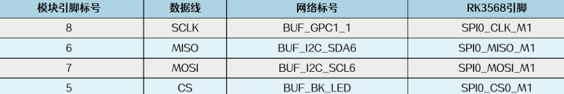

# SPI子系统框架

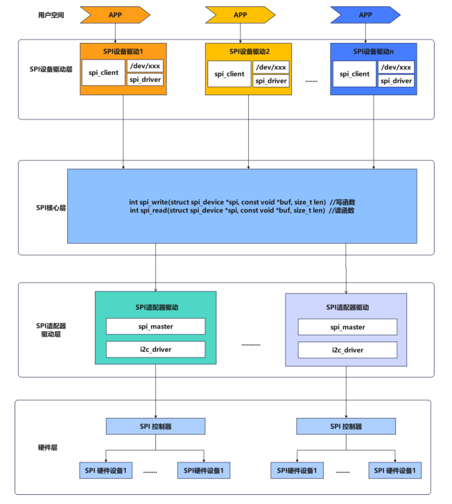

可以将上面这一 SPI 子系统划分为三个层次，分别为用户空间、内核空间和硬件层，内核空间就包括 SPI 设备驱动层、SPI 核心层和 SPI 适配器驱动层，而本章的主要内容就是介绍 SPI 子系统框架中的内核空间。

## SPI设备驱动层

SPI 设备驱动层的主要作用是编写驱动程序，使 SPI 外设能够正常工作。它创建了对应的设备节点，提供了标准化的接口，使得上层应用程序能够方便地与 SPI 设备进行交互。

具体来说，SPI 设备驱动层包含以下几个关键部分：

- `spi_device`
  - 代表一个连接到 SPI 总线上的从设备
  - 包含从设备的地址、所属的 SPI 主设备等信息。
- `/dev/spiX` 设备节点
  - 为上层应用程序提供设备访问的接口
  - 通过打开/读写/控制设备节点，应用程序可以与 SPI 设备进行交互。
  - 内核 SPI 子系统负责将应用程序的操作转发到对应的 spi_driver。
- `spi_driver`
  - 实现了具体 SPI 从设备的驱动程序
  - 负责设备的初始化、读写、配置等操作。
  - 通过 spi_device 与设备进行交互。
  - 向上层提供设备访问的标准化接口。

## SPI适配器驱动层

SPI 适配器驱动层是 SPI 子系统的重要组成部分，负责实现具体的 SPI 硬件控制器的驱动程序。SPI 适配器驱动程序的作用如下：

- **提供标准化的 SPI 传输接口**
  - 适配器驱动层为 SPI 核心层提供标准化的传输接口，确保不同的 SPI 控制器可以统一使用这些接口进行数据传输。
- **实现 SPI 总线协议的时序控制和数据收发**
  - 负责实现 SPI 总线协议的时序控制，包括时钟极性（CPOL）和时钟相位（CPHA）的配置。
  - 管理数据的发送和接收，确保数据传输的准确性和可靠性。
  - 通过硬件 SPI 模块自动完成时钟信号的生成和数据收发，提高通信效率。
- **管理 SPI 总线上的从设备**
  - 适配器驱动层负责管理 SPI 总线上的所有从设备，包括注册和注销从设备。
  - 确保 SPI 总线上的从设备可以正确地进行通信，协调主设备和从设备之间的交互。
- **处理 SPI 总线错误和异常情况**
  - 适配器驱动层负责监控和处理 SPI 总线上的错误和异常情况。
  - 提供错误恢复和重试机制，确保系统的稳定性和可靠性。
  - 处理硬件中断，及时响应数据传输中的各种异常情况。


## SPI 核心层

SPI 核心层位于 SPI 设备驱动层和 SPI 适配器驱动层之间，起到了承上启下的作用，负责SPI 设备驱动层和 SPI 适配器驱动层之间的数据传递。

SPI 核心层的主要函数为 `spi_write` 和`spi_read`，这些函数提供了基本的读写接口。核心函数介绍：

- `spi_write`
  - 函数作用：用于向 SPI 从设备发送数据。
  - 函数参数介绍：
    - `struct spi_device *spi`: 指向目标 SPI 从设备的指针。
    - `const void *buf`: 数据缓冲区。
    - `size_t len`: 要发送的字节数。
  - 这个函数负责生成符合 SPI 协议的时序和数据帧，并通过对应的 SPI 适配器驱动程序进行实际的总线操作。
- `spi_read`
  - 函数作用：用于从 SPI 从设备接收数据。
  - 函数参数介绍：
    - `struct spi_device *spi`: 指向目标 SPI 从设备的指针。
    - `void *buf`: 数据缓冲区。
    - `size_t len`: 要接收的字节数。
  - 这个函数同样负责生成符合 SPI 协议的时序和数据帧，并通过对应的 SPI 适配器驱动程序进行实际的总线操作。

核心层的具体作用如下：

- 核心层负责在设备驱动层和适配器驱动层之间传递数据。通过 `spi_write` 和 `spi_read`函数，核心层将设备驱动层的数据传递给适配器驱动层进行实际的硬件操作。
- 核心层生成符合 SPI 协议的时序和数据帧，确保数据能够正确地在 SPI 总线上传输。
- 核心层提供标准化的接口，使得上层的设备驱动程序可以方便地进行数据传输，而无需关心底层硬件的具体实现。


# 通用SPI外设框架编写

## 设备树

SPI 转 CAN 模块要接的 iTOP-RK3568 的引脚

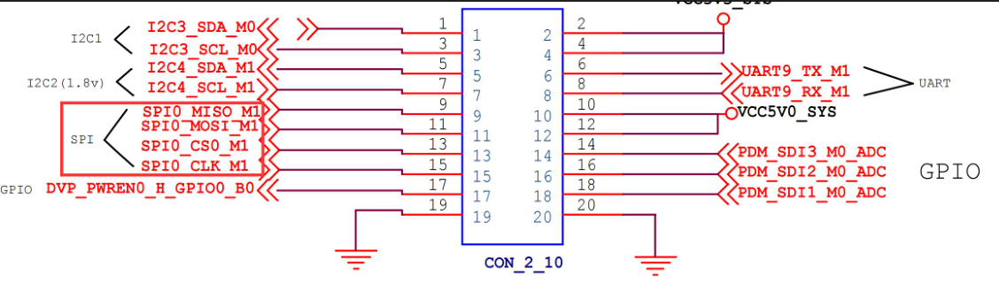

可以根据引脚的网络标号得到要使能的 SPI 控制器为 SPI0，然后开始对 iTOP-RK3568 的设备树进行修改

```dts
&spi0 {
	status = "okay";
	pinctrl-0 = <&spi0m1_cs0 &spi0m1_pins>;
	pinctrl-1 = <&spi0m1_cs0 &spi0m1_pins_hs>;
	
	mcp2515:mcp2515@0 {
		compatible = "my-mcp2515";
		reg = <0>;
		spi-max-frequency = <10000000>;
		status = "okay";
	};
};
```

第 3-4 行，指定了要使用的 `spi pinctrl` 引脚，默认情况下使用的 spi0 控制器 pinctrl 引脚为 `spi0m0_cs0` 和 `spi0m0_pins`，而实际用的是第二组 pinctrl 引脚。

第 7 行，表述指定片选 0。

第 9 行，设置 `spi clk` 输出的时钟频率，这里设置的是 10M，RK3568 最大设置不超过 50M。如果 `reg` 属性和 `spi-max-frequency` 不设置在驱动加载时将无法进入 `probe spi` 初始化函数（驱动中匹配函数）。

### `reg` 和 `spi-max-frequency`属性

在rk3568.dtsi中：

```dts
spi0: spi@fe610000 {
		compatible = "rockchip,rk3066-spi";
		reg = <0x0 0xfe610000 0x0 0x1000>;
		interrupts = <GIC_SPI 103 IRQ_TYPE_LEVEL_HIGH>;
		#address-cells = <1>;
		#size-cells = <0>;
		clocks = <&cru CLK_SPI0>, <&cru PCLK_SPI0>;
		clock-names = "spiclk", "apb_pclk";
		dmas = <&dmac0 20>, <&dmac0 21>;
		dma-names = "tx", "rx";
		pinctrl-names = "default", "high_speed";
		pinctrl-0 = <&spi0m0_cs0 &spi0m0_cs1 &spi0m0_pins>;
		pinctrl-1 = <&spi0m0_cs0 &spi0m0_cs1 &spi0m0_pins_hs>;
		num-cs = <2>;
		status = "disabled";
	};
```

根据设备树的 `compatible` 属性来寻找对应的 SPI 控制器驱动程序，找到的具体驱动文件路径为 `spi/spi-rockchip.c`，该驱动程序的 probe 函数内容如下所示：

#### rockchip_spi_probe()

```c
static int rockchip_spi_probe(struct platform_device *pdev)
{
	int ret;
	struct rockchip_spi *rs;
	struct spi_controller *ctlr;
	struct resource *mem;
	struct device_node *np = pdev->dev.of_node;
	u32 rsd_nsecs, num_cs, csm;
	bool slave_mode;
	struct pinctrl *pinctrl = NULL;
	const struct rockchip_spi_quirks *quirks_cfg;
	// 检查设备节点是否配置为 SPI 从模式
	slave_mode = of_property_read_bool(np, "spi-slave");
	// 根据从模式或主模式分配 SPI 控制器
	if (slave_mode)
		ctlr = spi_alloc_slave(&pdev->dev,
				sizeof(struct rockchip_spi));
	else
		ctlr = spi_alloc_master(&pdev->dev,
				sizeof(struct rockchip_spi));

	if (!ctlr)
		return -ENOMEM;
	// 设置平台设备的驱动数据
	platform_set_drvdata(pdev, ctlr);

	rs = spi_controller_get_devdata(ctlr);
	ctlr->slave = slave_mode;

	/* Get basic io resource and map it */
    // 获取基本的 IO 资源并映射
	mem = platform_get_resource(pdev, IORESOURCE_MEM, 0);
	rs->regs = devm_ioremap_resource(&pdev->dev, mem);
	if (IS_ERR(rs->regs)) {
		ret =  PTR_ERR(rs->regs);
		goto err_put_ctlr;
	}
	rs->base_addr_phy = mem->start;

	if (!has_acpi_companion(&pdev->dev))
		rs->apb_pclk = devm_clk_get(&pdev->dev, "apb_pclk");
	if (IS_ERR(rs->apb_pclk)) {
		dev_err(&pdev->dev, "Failed to get apb_pclk\n");
		ret = PTR_ERR(rs->apb_pclk);
		goto err_put_ctlr;
	}

	if (!has_acpi_companion(&pdev->dev))
		rs->spiclk = devm_clk_get(&pdev->dev, "spiclk");
	if (IS_ERR(rs->spiclk)) {
		dev_err(&pdev->dev, "Failed to get spi_pclk\n");
		ret = PTR_ERR(rs->spiclk);
		goto err_put_ctlr;
	}

	rs->sclk_in = devm_clk_get_optional(&pdev->dev, "sclk_in");
	if (IS_ERR(rs->sclk_in)) {
		dev_err(&pdev->dev, "Failed to get sclk_in\n");
		ret = PTR_ERR(rs->sclk_in);
		goto err_put_ctlr;
	}
	// 启用 APB PCLK
	ret = clk_prepare_enable(rs->apb_pclk);
	if (ret < 0) {
		dev_err(&pdev->dev, "Failed to enable apb_pclk\n");
		goto err_put_ctlr;
	}
	// 启用 SPI CLK
	ret = clk_prepare_enable(rs->spiclk);
	if (ret < 0) {
		dev_err(&pdev->dev, "Failed to enable spi_clk\n");
		goto err_disable_apbclk;
	}

	ret = clk_prepare_enable(rs->sclk_in);
	if (ret < 0) {
		dev_err(&pdev->dev, "Failed to enable sclk_in\n");
		goto err_disable_spiclk;
	}
	// 禁用 SPI 芯片
	spi_enable_chip(rs, false);
	// 获取平台中断资源
	ret = platform_get_irq(pdev, 0);
	if (ret < 0)
		goto err_disable_sclk_in;
	// 请求中断
	ret = devm_request_threaded_irq(&pdev->dev, ret, rockchip_spi_isr, NULL,
			IRQF_ONESHOT, dev_name(&pdev->dev), ctlr);
	if (ret)
		goto err_disable_sclk_in;

	rs->dev = &pdev->dev;

	rs->freq = clk_get_rate(rs->spiclk);
	if (!rs->freq) {
		ret = device_property_read_u32(&pdev->dev, "clock-frequency", &rs->freq);
		if (ret) {
			dev_warn(rs->dev, "Failed to get clock or clock-frequency property\n");
			goto err_disable_sclk_in;
		}
	}
	// 读取接收采样延迟（以纳秒为单位）
	if (!device_property_read_u32(&pdev->dev, "rx-sample-delay-ns", &rsd_nsecs)) {
		/* rx sample delay is expressed in parent clock cycles (max 3) */
		u32 rsd = DIV_ROUND_CLOSEST(rsd_nsecs * (rs->freq >> 8),
				1000000000 >> 8);
		if (!rsd) {
			dev_warn(rs->dev, "%u Hz are too slow to express %u ns delay\n",
					rs->freq, rsd_nsecs);
		} else if (rsd > CR0_RSD_MAX) {
			rsd = CR0_RSD_MAX;
			dev_warn(rs->dev, "%u Hz are too fast to express %u ns delay, clamping at %u ns\n",
					rs->freq, rsd_nsecs,
					CR0_RSD_MAX * 1000000000U / rs->freq);
		}
		rs->rsd = rsd;
	}

	if (!device_property_read_u32(&pdev->dev, "csm", &csm)) {
		if (csm > CR0_CSM_ONE)	{
			dev_warn(rs->dev, "The csm value %u exceeds the limit, clamping at %u\n",
				 csm, CR0_CSM_ONE);
			csm = CR0_CSM_ONE;
		}
		rs->csm = csm;
	}

	rs->version = readl_relaxed(rs->regs + ROCKCHIP_SPI_VERSION);
	rs->fifo_len = get_fifo_len(rs);// 获取 FIFO 长度
	if (!rs->fifo_len) {
		dev_err(&pdev->dev, "Failed to get fifo length\n");
		ret = -EINVAL;
		goto err_disable_sclk_in;
	}
	quirks_cfg = device_get_match_data(&pdev->dev);
	if (quirks_cfg)
		rs->max_baud_div_in_cpha = quirks_cfg->max_baud_div_in_cpha;
	// 设置并启用运行时电源管理
	pm_runtime_set_active(&pdev->dev);
	pm_runtime_enable(&pdev->dev);

	ctlr->auto_runtime_pm = true;
	ctlr->bus_num = pdev->id;
	ctlr->mode_bits = SPI_CPOL | SPI_CPHA | SPI_LOOP | SPI_LSB_FIRST;
	if (slave_mode) {
		ctlr->mode_bits |= SPI_NO_CS;
		ctlr->slave_abort = rockchip_spi_slave_abort;
	} else {
		ctlr->flags = SPI_MASTER_GPIO_SS;
		ctlr->max_native_cs = ROCKCHIP_SPI_MAX_CS_NUM;
		/*
		 * rk spi0 has two native cs, spi1..5 one cs only
		 * if num-cs is missing in the dts, default to 1
		 */
		if (device_property_read_u32(&pdev->dev, "num-cs", &num_cs))
			num_cs = 1;
		ctlr->num_chipselect = num_cs;
		ctlr->use_gpio_descriptors = true;
	}
	ctlr->dev.of_node = pdev->dev.of_node;
	ctlr->bits_per_word_mask = SPI_BPW_MASK(16) | SPI_BPW_MASK(8) | SPI_BPW_MASK(4);
	ctlr->min_speed_hz = rs->freq / BAUDR_SCKDV_MAX;
	ctlr->max_speed_hz = min(rs->freq / BAUDR_SCKDV_MIN, MAX_SCLK_OUT);

	ctlr->setup = rockchip_spi_setup;
	ctlr->set_cs = rockchip_spi_set_cs;
	ctlr->transfer_one = rockchip_spi_transfer_one;
	ctlr->max_transfer_size = rockchip_spi_max_transfer_size;
	ctlr->handle_err = rockchip_spi_handle_err;
	// 请求 TX DMA 通道
	ctlr->dma_tx = dma_request_chan(rs->dev, "tx");
	if (IS_ERR(ctlr->dma_tx)) {
		/* Check tx to see if we need defer probing driver */
		if (PTR_ERR(ctlr->dma_tx) == -EPROBE_DEFER) {
			ret = -EPROBE_DEFER;
			goto err_disable_pm_runtime;
		}
		dev_warn(rs->dev, "Failed to request TX DMA channel\n");
		ctlr->dma_tx = NULL;
	}
	// 请求 RX DMA 通道
	ctlr->dma_rx = dma_request_chan(rs->dev, "rx");
	if (IS_ERR(ctlr->dma_rx)) {
		if (PTR_ERR(ctlr->dma_rx) == -EPROBE_DEFER) {
			ret = -EPROBE_DEFER;
			goto err_free_dma_tx;
		}
		dev_warn(rs->dev, "Failed to request RX DMA channel\n");
		ctlr->dma_rx = NULL;
	}
	// 如果 TX 和 RX DMA 通道均成功请求
	if (ctlr->dma_tx && ctlr->dma_rx) {
		rs->dma_addr_tx = mem->start + ROCKCHIP_SPI_TXDR;
		rs->dma_addr_rx = mem->start + ROCKCHIP_SPI_RXDR;
		ctlr->can_dma = rockchip_spi_can_dma;
	}

	rs->poll = device_property_read_bool(&pdev->dev, "rockchip,poll-only");
	// 检查 SPI 版本并设置 cs_inactive
	switch (rs->version) {
	case ROCKCHIP_SPI_VER2_TYPE2:
		rs->cs_high_supported = true;
		ctlr->mode_bits |= SPI_CS_HIGH;
		if (slave_mode)
			rs->cs_inactive = true;
		else
			rs->cs_inactive = false;
		break;
	default:
		rs->cs_inactive = false;
		break;
	}
	// 获取引脚控制
	pinctrl = devm_pinctrl_get(&pdev->dev);
	if (!IS_ERR(pinctrl)) {
		rs->high_speed_state = pinctrl_lookup_state(pinctrl, "high_speed");
		if (IS_ERR_OR_NULL(rs->high_speed_state)) {
			dev_warn(&pdev->dev, "no high_speed pinctrl state\n");
			rs->high_speed_state = NULL;
		}
	}
	// 注册 SPI 控制器
	ret = devm_spi_register_controller(&pdev->dev, ctlr);
	if (ret < 0) {
		dev_err(&pdev->dev, "Failed to register controller\n");
		goto err_free_dma_rx;
	}

	if (IS_ENABLED(CONFIG_SPI_ROCKCHIP_MISCDEV)) {
		char misc_name[20];

		snprintf(misc_name, sizeof(misc_name), "rkspi-dev%d", ctlr->bus_num);
		rs->miscdev.minor = MISC_DYNAMIC_MINOR;
		rs->miscdev.name = misc_name;
		rs->miscdev.fops = &rockchip_spi_misc_fops;
		rs->miscdev.parent = &pdev->dev;

		ret = misc_register(&rs->miscdev);
		if (ret)
			dev_err(&pdev->dev, "failed to register misc device %s\n", misc_name);
		else
			dev_info(&pdev->dev, "register misc device %s\n", misc_name);
	}

	dev_info(rs->dev, "probed, poll=%d, rsd=%d\n", rs->poll, rs->rsd);

	return 0;

err_free_dma_rx:
	if (ctlr->dma_rx)
		dma_release_channel(ctlr->dma_rx);
err_free_dma_tx:
	if (ctlr->dma_tx)
		dma_release_channel(ctlr->dma_tx);
err_disable_pm_runtime:
	pm_runtime_disable(&pdev->dev);
err_disable_sclk_in:
	clk_disable_unprepare(rs->sclk_in);
err_disable_spiclk:
	clk_disable_unprepare(rs->spiclk);
err_disable_apbclk:
	clk_disable_unprepare(rs->apb_pclk);
err_put_ctlr:
	spi_controller_put(ctlr);

	return ret;
}

```

#### devm_spi_register_controller()

```c
/**
 * devm_spi_register_controller - register managed SPI master or slave
 *	controller
 * @dev:    device managing SPI controller
 * @ctlr: initialized controller, originally from spi_alloc_master() or
 *	spi_alloc_slave()
 * Context: can sleep
 *
 * Register a SPI device as with spi_register_controller() which will
 * automatically be unregistered and freed.
 *
 * Return: zero on success, else a negative error code.
 */
int devm_spi_register_controller(struct device *dev,
				 struct spi_controller *ctlr)
{
	struct spi_controller **ptr;
	int ret;
	// 分配设备资源管理器(devres)内存，用于自动释放控制器资源
	ptr = devres_alloc(devm_spi_unregister, sizeof(*ptr), GFP_KERNEL);
	if (!ptr)
		return -ENOMEM;// 内存分配失败
	// 注册 SPI 控制器
	ret = spi_register_controller(ctlr);
	if (!ret) {
		*ptr = ctlr;// 注册成功，将指针存储在设备资源管理器中
		devres_add(dev, ptr);
	} else {
		devres_free(ptr);// 注册失败，释放分配的资源
	}

	return ret;// 返回注册结果
}
EXPORT_SYMBOL_GPL(devm_spi_register_controller);

```

#### spi_register_controller()

```c
int spi_register_controller(struct spi_controller *ctlr)
{
	struct device		*dev = ctlr->dev.parent;
	struct boardinfo	*bi;
	int			status;
	int			id, first_dynamic;

	if (!dev)
		return -ENODEV;

	/*
	 * Make sure all necessary hooks are implemented before registering
	 * the SPI controller.
	 */
    /*
	* 在注册 SPI 控制器之前，确保所有必要的操作已实现
	*/
	status = spi_controller_check_ops(ctlr);
	if (status)
		return status;

	if (ctlr->bus_num >= 0) {
		/* devices with a fixed bus num must check-in with the num */
		mutex_lock(&board_lock);/* 固定总线编号的设备必须使用该编号进行检查 */
		id = idr_alloc(&spi_master_idr, ctlr, ctlr->bus_num,
			ctlr->bus_num + 1, GFP_KERNEL);
		mutex_unlock(&board_lock);
		if (WARN(id < 0, "couldn't get idr"))
			return id == -ENOSPC ? -EBUSY : id;
		ctlr->bus_num = id;
	} else if (ctlr->dev.of_node) {
		/* allocate dynamic bus number using Linux idr */
		id = of_alias_get_id(ctlr->dev.of_node, "spi");
		if (id >= 0) {
			ctlr->bus_num = id;
			mutex_lock(&board_lock);
			id = idr_alloc(&spi_master_idr, ctlr, ctlr->bus_num,
				       ctlr->bus_num + 1, GFP_KERNEL);
			mutex_unlock(&board_lock);
			if (WARN(id < 0, "couldn't get idr"))
				return id == -ENOSPC ? -EBUSY : id;
		}
	}
	if (ctlr->bus_num < 0) {
		first_dynamic = of_alias_get_highest_id("spi");
		if (first_dynamic < 0)
			first_dynamic = 0;
		else
			first_dynamic++;

		mutex_lock(&board_lock);
		id = idr_alloc(&spi_master_idr, ctlr, first_dynamic,
			       0, GFP_KERNEL);
		mutex_unlock(&board_lock);
		if (WARN(id < 0, "couldn't get idr"))
			return id;
		ctlr->bus_num = id;
	}
	INIT_LIST_HEAD(&ctlr->queue);
	spin_lock_init(&ctlr->queue_lock);
	spin_lock_init(&ctlr->bus_lock_spinlock);
	mutex_init(&ctlr->bus_lock_mutex);
	mutex_init(&ctlr->io_mutex);
	ctlr->bus_lock_flag = 0;
	init_completion(&ctlr->xfer_completion);
	if (!ctlr->max_dma_len)
		ctlr->max_dma_len = INT_MAX;

	/* register the device, then userspace will see it.
	 * registration fails if the bus ID is in use.
	 */
	dev_set_name(&ctlr->dev, "spi%u", ctlr->bus_num);

	if (!spi_controller_is_slave(ctlr)) {
		if (ctlr->use_gpio_descriptors) {
			status = spi_get_gpio_descs(ctlr);
			if (status)
				goto free_bus_id;
			/*
			 * A controller using GPIO descriptors always
			 * supports SPI_CS_HIGH if need be.
			 */
			ctlr->mode_bits |= SPI_CS_HIGH;
		} else {
			/* Legacy code path for GPIOs from DT */
			status = of_spi_get_gpio_numbers(ctlr);
			if (status)
				goto free_bus_id;
		}
	}

	/*
	 * Even if it's just one always-selected device, there must
	 * be at least one chipselect.
	 */
	if (!ctlr->num_chipselect) {
		status = -EINVAL;
		goto free_bus_id;
	}

	status = device_add(&ctlr->dev);
	if (status < 0)
		goto free_bus_id;
	dev_dbg(dev, "registered %s %s\n",
			spi_controller_is_slave(ctlr) ? "slave" : "master",
			dev_name(&ctlr->dev));

	/*
	 * If we're using a queued driver, start the queue. Note that we don't
	 * need the queueing logic if the driver is only supporting high-level
	 * memory operations.
	 */
	if (ctlr->transfer) {
		dev_info(dev, "controller is unqueued, this is deprecated\n");
	} else if (ctlr->transfer_one || ctlr->transfer_one_message) {
		status = spi_controller_initialize_queue(ctlr);
		if (status) {
			device_del(&ctlr->dev);
			goto free_bus_id;
		}
	}
	/* add statistics */
	spin_lock_init(&ctlr->statistics.lock);

	mutex_lock(&board_lock);
	list_add_tail(&ctlr->list, &spi_controller_list);
	list_for_each_entry(bi, &board_list, list)
		spi_match_controller_to_boardinfo(ctlr, &bi->board_info);
	mutex_unlock(&board_lock);

	/* Register devices from the device tree and ACPI */
	of_register_spi_devices(ctlr);
	acpi_register_spi_devices(ctlr);
	return status;

free_bus_id:
	mutex_lock(&board_lock);
	idr_remove(&spi_master_idr, ctlr->bus_num);
	mutex_unlock(&board_lock);
	return status;
}
EXPORT_SYMBOL_GPL(spi_register_controller);
```

在该函数的第 132行会调用设备树资源注册函数 `of_register_spi_devices` 对 SPI 的子节点设备树进行注册，该函数的具体内容如下所示：

#### of_register_spi_devices()

```c
/**
 * of_register_spi_devices() - Register child devices onto the SPI bus
 * @ctlr:	Pointer to spi_controller device
 *
 * Registers an spi_device for each child node of controller node which
 * represents a valid SPI slave.
 */
static void of_register_spi_devices(struct spi_controller *ctlr)
{
	struct spi_device *spi;
	struct device_node *nc;

	if (!ctlr->dev.of_node)// 如果控制器没有设备树节点，则直接返回
		return;

    // 遍历控制器设备树节点下的每个子节点
	for_each_available_child_of_node(ctlr->dev.of_node, nc) {
		if (of_node_test_and_set_flag(nc, OF_POPULATED))// 如果该节点已被标记为已填充，则跳过该节点
			continue;
		spi = of_register_spi_device(ctlr, nc);// 为该节点注册一个 SPI 设备
		if (IS_ERR(spi)) {// 如果注册失败，记录警告信息并清除该节点的已填充标记
			dev_warn(&ctlr->dev,
				 "Failed to create SPI device for %pOF\n", nc);
			of_node_clear_flag(nc, OF_POPULATED);
		}
	}
}
```

第17 行会遍历控制器设备树节点下的每个子节点，通过 `of_register_spi_device` 函数注册该 SPI 子节点，`of_register_spi_device` 函数具体内容如下所示：

#### of_register_spi_device()

```c
static struct spi_device *
of_register_spi_device(struct spi_controller *ctlr, struct device_node *nc)
{
	struct spi_device *spi;
	int rc;

	/* Alloc an spi_device */
	spi = spi_alloc_device(ctlr);/* 分配一个 spi_device */
	if (!spi) {
		dev_err(&ctlr->dev, "spi_device alloc error for %pOF\n", nc);
		rc = -ENOMEM;
		goto err_out;
	}

	/* Select device driver */
    /* 选择设备驱动 */
	rc = of_modalias_node(nc, spi->modalias,
				sizeof(spi->modalias));
	if (rc < 0) {
		dev_err(&ctlr->dev, "cannot find modalias for %pOF\n", nc);
		goto err_out;
	}

	rc = of_spi_parse_dt(ctlr, spi, nc);/* 解析设备树中的 SPI 信息 */
	if (rc)
		goto err_out;

	/* Store a pointer to the node in the device structure */
	of_node_get(nc);/* 在设备结构中存储指向节点的指针 */
	spi->dev.of_node = nc;
	spi->dev.fwnode = of_fwnode_handle(nc);

	/* Register the new device */
	rc = spi_add_device(spi);/* 注册新设备 */
	if (rc) {
		dev_err(&ctlr->dev, "spi_device register error %pOF\n", nc);
		goto err_of_node_put;
	}

	return spi;

err_of_node_put:
	of_node_put(nc);
err_out:
	spi_dev_put(spi);
	return ERR_PTR(rc);
}

```

第 24 行调用了 `of_spi_parse_dt` 函数来解析设备树子节点中的 SPI 信息，`of_spi_parse_dt` 函数具体内容如下所示

#### of_spi_parse_dt()

```c
static int of_spi_parse_dt(struct spi_controller *ctlr, struct spi_device *spi,
			   struct device_node *nc)
{
	u32 value;
	int rc;

	/* Mode (clock phase/polarity/etc.) */ /* 设置模式 (时钟相位/极性等) */
	if (of_property_read_bool(nc, "spi-cpha"))
		spi->mode |= SPI_CPHA;
	if (of_property_read_bool(nc, "spi-cpol"))
		spi->mode |= SPI_CPOL;
	if (of_property_read_bool(nc, "spi-3wire"))
		spi->mode |= SPI_3WIRE;
	if (of_property_read_bool(nc, "spi-lsb-first"))
		spi->mode |= SPI_LSB_FIRST;
	if (of_property_read_bool(nc, "spi-cs-high"))
		spi->mode |= SPI_CS_HIGH;

	/* Device DUAL/QUAD mode */
    /* 设置设备的 DUAL/QUAD 模式 */
	if (!of_property_read_u32(nc, "spi-tx-bus-width", &value)) {
		switch (value) {
		case 1:
			break;
		case 2:
			spi->mode |= SPI_TX_DUAL;
			break;
		case 4:
			spi->mode |= SPI_TX_QUAD;
			break;
		case 8:
			spi->mode |= SPI_TX_OCTAL;
			break;
		default:
			dev_warn(&ctlr->dev,
				"spi-tx-bus-width %d not supported\n",
				value);
			break;
		}
	}

	if (!of_property_read_u32(nc, "spi-rx-bus-width", &value)) {
		switch (value) {
		case 1:
			break;
		case 2:
			spi->mode |= SPI_RX_DUAL;
			break;
		case 4:
			spi->mode |= SPI_RX_QUAD;
			break;
		case 8:
			spi->mode |= SPI_RX_OCTAL;
			break;
		default:
			dev_warn(&ctlr->dev,
				"spi-rx-bus-width %d not supported\n",
				value);
			break;
		}
	}
	/* 如果是 SPI 从设备 */
	if (spi_controller_is_slave(ctlr)) {
		if (!of_node_name_eq(nc, "slave")) {
			dev_err(&ctlr->dev, "%pOF is not called 'slave'\n",
				nc);
			return -EINVAL;
		}
		return 0;
	}

	/* Device address */
	rc = of_property_read_u32(nc, "reg", &value);/* 获取设备地址 */
	if (rc) {
		dev_err(&ctlr->dev, "%pOF has no valid 'reg' property (%d)\n",
			nc, rc);
		return rc;
	}
	spi->chip_select = value;

	/* Device speed */
	if (!of_property_read_u32(nc, "spi-max-frequency", &value))/* 获取设备速度 */
		spi->max_speed_hz = value;

	return 0;
}
```

如果设备树不存在 `reg` 和 `spi-max-frequency` 两个属性则会返回 rc，这就导致上一级函数 `of_register_spi_device` 会返回错误，从而无法成功注册 SPI 设备、不能成功解析设备树节点，最终导致编写的 SPI 设备驱动无法正常匹配。


## 示例

```c
#include <linux/init.h>
#include <linux/module.h>
#include <linux/spi/spi.h>

// MCP2515设备初始化函数
static int mcp2515_probe(struct spi_device *spi)
{
    // 打印一条消息,表示探测成功
    printk("This is mcp2515 probe\n");
    return 0;
}

// MCP2515设备移除函数
static int mcp2515_remove(struct spi_device *spi)
{
    return 0;
}

// MCP2515设备匹配表,用于设备树匹配
static const struct of_device_id mcp2515_of_match_table[] = {
    { .compatible = "my-mcp2515" },
    { /* sentinel */ }
};

// MCP2515设备ID匹配表,用于总线匹配
static const struct spi_device_id mcp2515_id_table[] = {
    { "mcp2515", 0 },
    { /* sentinel */ }
};

// MCP2515 SPI驱动结构体
static struct spi_driver spi_mcp2515 = {
    .probe = mcp2515_probe, // 探测函数
    .remove = mcp2515_remove, // 移除函数
    .driver = {
        .name = "mcp2515", // 驱动名称
        .owner = THIS_MODULE, // 所属模块
        .of_match_table = mcp2515_of_match_table, // 设备树匹配表
    },
    .id_table = mcp2515_id_table, // 设备ID匹配表
};

// 驱动初始化函数
static int __init mcp2515_init(void)
{
    int ret;

    // 注册SPI驱动
    ret = spi_register_driver(&spi_mcp2515);
    if (ret < 0) {
        // 注册失败,打印错误信息
        printk("spi_register_driver error\n");
        return ret;
    }

    return ret;
}

// 驱动退出函数
static void __exit mcp2515_exit(void)
{
    // 注销SPI驱动
    spi_unregister_driver(&spi_mcp2515);
}

module_init(mcp2515_init);
module_exit(mcp2515_exit);

MODULE_LICENSE("GPL");
```


## 注册字符设备示例

```c
#include <linux/init.h>
#include <linux/module.h>
#include <linux/spi/spi.h>
#include <linux/cdev.h>
#include <linux/fs.h>
#include <linux/kdev_t.h>

dev_t dev_num; // 设备号
struct cdev mcp2515_cdev; // 字符设备结构体
struct class *mcp2515_class; // 设备类
struct device *mcp2515_device; // 设备
struct spi_device *spi_dev; // SPI设备指针

// MCP2515芯片复位函数
void mcp2515_reset(void){
    int ret;
    char write_buf[] = {0xc0}; // 复位指令0x11000000即0xc0
    ret = spi_write(spi_dev, write_buf, sizeof(write_buf)); // 发送复位命令
    if(ret < 0){
        printk("spi_write is error\n"); // 打印错误信息
    }
}

// MCP2515读寄存器函数
char mcp2515_read_reg(char reg) {
    char write_buf[] = {0x03, reg};  // SPI写缓冲区写入SPI读指令0x03
    char read_buf;                   // SPI读缓冲区
    int ret;

    ret = spi_write_then_read(spi_dev, write_buf, sizeof(write_buf), &read_buf, sizeof(read_buf));  // 调用SPI写读函数
    if (ret < 0) {
        printk("spi_write_then_read error\n");
        return ret;
    }

    return read_buf;
}


// 打开设备文件的回调函数
int mcp2515_open(struct inode *inode, struct file *file) {
    return 0; // 返回成功
}

// 读取设备文件的回调函数
ssize_t mcp2515_read(struct file *file, char __user *buf, size_t size, loff_t *offset) {
    return 0; // 返回成功
}

// 写入设备文件的回调函数
ssize_t mcp2515_write(struct file *file, const char __user *buf, size_t size, loff_t *offset) {
    return 0; // 返回成功
}

// 关闭设备文件的回调函数
int mcp2515_release(struct inode *inode, struct file *file) {
    return 0; // 返回成功
}

// 设备文件操作集合
struct file_operations mcp2515_fops = {
    .open = mcp2515_open,
    .read = mcp2515_read,
    .write = mcp2515_write,
    .release = mcp2515_release,
};

// MCP2515设备初始化函数
int mcp2515_probe(struct spi_device *spi) {
    int ret;
    int value;

    printk("This is mcp2515_probe\n");

    spi_dev = spi; // 保存SPI设备指针
    // 分配字符设备号
    ret = alloc_chrdev_region(&dev_num, 0, 1, "mcp2515");
    if (ret < 0) {
        printk("alloc_chrdev_region error\n");
    }

    // 初始化字符设备
    cdev_init(&mcp2515_cdev, &mcp2515_fops);
    mcp2515_cdev.owner = THIS_MODULE;

    // 添加字符设备
    ret = cdev_add(&mcp2515_cdev, dev_num, 1);
    if (ret < 0) {
        printk("cdev_add error\n");
        return -1;
    }

    // 创建设备类
    mcp2515_class = class_create(THIS_MODULE, "spi_to_can");
    if (IS_ERR(mcp2515_class)) {
        printk("mcp2515_class error\n");
        return PTR_ERR(mcp2515_class);
    }

    // 创建设备
    mcp2515_device = device_create(mcp2515_class, NULL, dev_num, NULL, "mcp2515");
    if (IS_ERR(mcp2515_device)) {
        printk("mcp2515_device error\n");
        return PTR_ERR(mcp2515_device);
    }

    mcp2515_reset();             // 复位MCP2515设备
    value = mcp2515_read_reg(0x0e);  // 读取寄存器值
    printk("value is %x\n", value);  // 打印读取的值
	
    return 0; // 返回成功
}

// MCP2515 SPI设备的移除函数
static int mcp2515_remove(struct spi_device *spi) {
    device_destroy(mcp2515_class, dev_num);
    class_destroy(mcp2515_class);
    cdev_del(&mcp2515_cdev);
    unregister_chrdev_region(dev_num, 1);
    return 0;
}

// MCP2515设备匹配表,用于设备树匹配
static const struct of_device_id mcp2515_of_match_table[] = {
    { .compatible = "my-mcp2515" },
    {}
};

// MCP2515设备ID匹配表,用于总线匹配
static const struct spi_device_id mcp2515_id_table[] = {
    { "mcp2515", 0 },
    {}
};

// MCP2515 SPI驱动结构体
static struct spi_driver spi_mcp2515 = {
    .probe = mcp2515_probe, // 探测函数
    .remove = mcp2515_remove, // 移除函数
    .driver = {
        .name = "mcp2515", // 驱动名称
        .owner = THIS_MODULE, // 所属模块
        .of_match_table = mcp2515_of_match_table, // 设备树匹配表
},
    .id_table = mcp2515_id_table, // 设备ID匹配表
};

// 驱动初始化函数
static int __init mcp2515_init(void)
{
    int ret;

    // 注册SPI驱动
    ret = spi_register_driver(&spi_mcp2515);
    if (ret < 0) {
        // 注册失败,打印错误信息
        printk("spi_register_driver error\n");
        return ret;
    }

    return ret;
}

// 驱动退出函数
static void __exit mcp2515_exit(void)
{
    // 注销SPI驱动
    spi_unregister_driver(&spi_mcp2515);
}

module_init(mcp2515_init);
module_exit(mcp2515_exit);

MODULE_LICENSE("GPL");
```

# SPI通信流程

在 Linux 驱动中可以使用 `spi_write` 函数来实现向 SPI 从设备发送数据，`spi_write` 函数定义在 `include/linux/spi/spi.h` 文件中，具体内容如下所示

## spi_write()

```c
/**
 * spi_write - SPI synchronous write
 * @spi: device to which data will be written
 * @buf: data buffer
 * @len: data buffer size
 * Context: can sleep
 *
 * This function writes the buffer @buf.
 * Callable only from contexts that can sleep.
 *
 * Return: zero on success, else a negative error code.
 */
static inline int
spi_write(struct spi_device *spi, const void *buf, size_t len)
{
	struct spi_transfer	t = {
			.tx_buf		= buf,
			.len		= len,
		};

	return spi_sync_transfer(spi, &t, 1);
}
```

该函数首先会对要传输的数据以及传输的数据大小进行封装，然后调用 `spi_sync_transfer`函数进行输入传输，`spi_write` 函数传入的第一个参数为 `spi_device` 类型的结构体变量。

`struct spi_device` 是 Linux 内核中用于描述 SPI 从设备的结构体。它包含了与 SPI 设备相关的各种信息和配置选项，该结构体的具体内容如下所示：

## struct spi_device

```c
/**
 * struct spi_device - Controller side proxy for an SPI slave device
 * @dev: Driver model representation of the device.
 * @controller: SPI controller used with the device.
 * @master: Copy of controller, for backwards compatibility.
 * @max_speed_hz: Maximum clock rate to be used with this chip
 *	(on this board); may be changed by the device's driver.
 *	The spi_transfer.speed_hz can override this for each transfer.
 * @chip_select: Chipselect, distinguishing chips handled by @controller.
 * @mode: The spi mode defines how data is clocked out and in.
 *	This may be changed by the device's driver.
 *	The "active low" default for chipselect mode can be overridden
 *	(by specifying SPI_CS_HIGH) as can the "MSB first" default for
 *	each word in a transfer (by specifying SPI_LSB_FIRST).
 * @bits_per_word: Data transfers involve one or more words; word sizes
 *	like eight or 12 bits are common.  In-memory wordsizes are
 *	powers of two bytes (e.g. 20 bit samples use 32 bits).
 *	This may be changed by the device's driver, or left at the
 *	default (0) indicating protocol words are eight bit bytes.
 *	The spi_transfer.bits_per_word can override this for each transfer.
 * @rt: Make the pump thread real time priority.
 * @irq: Negative, or the number passed to request_irq() to receive
 *	interrupts from this device.
 * @controller_state: Controller's runtime state
 * @controller_data: Board-specific definitions for controller, such as
 *	FIFO initialization parameters; from board_info.controller_data
 * @modalias: Name of the driver to use with this device, or an alias
 *	for that name.  This appears in the sysfs "modalias" attribute
 *	for driver coldplugging, and in uevents used for hotplugging
 * @driver_override: If the name of a driver is written to this attribute, then
 *	the device will bind to the named driver and only the named driver.
 * @cs_gpio: LEGACY: gpio number of the chipselect line (optional, -ENOENT when
 *	not using a GPIO line) use cs_gpiod in new drivers by opting in on
 *	the spi_master.
 * @cs_gpiod: gpio descriptor of the chipselect line (optional, NULL when
 *	not using a GPIO line)
 * @word_delay: delay to be inserted between consecutive
 *	words of a transfer
 *
 * @statistics: statistics for the spi_device
 *
 * A @spi_device is used to interchange data between an SPI slave
 * (usually a discrete chip) and CPU memory.
 *
 * In @dev, the platform_data is used to hold information about this
 * device that's meaningful to the device's protocol driver, but not
 * to its controller.  One example might be an identifier for a chip
 * variant with slightly different functionality; another might be
 * information about how this particular board wires the chip's pins.
 */
struct spi_device {
	struct device		dev; // 通用设备模型的设备结构体
	struct spi_controller	*controller; // 指向控制器的指针
	struct spi_controller	*master;	/* compatibility layer */ // 兼容层，指向控制器的指针（与 controller 相同）
	u32			max_speed_hz;// 设备支持的最大速度（以赫兹为单位
	u8			chip_select;// 片选编号
	u8			bits_per_word;// 每个字的位数
	bool			rt;
	u32			mode;// SPI 模式配置（包括时钟相位和极性等）
#define	SPI_CPHA	0x01			/* clock phase */
#define	SPI_CPOL	0x02			/* clock polarity */
#define	SPI_MODE_0	(0|0)			/* (original MicroWire) */
#define	SPI_MODE_1	(0|SPI_CPHA)
#define	SPI_MODE_2	(SPI_CPOL|0)
#define	SPI_MODE_3	(SPI_CPOL|SPI_CPHA)
#define	SPI_CS_HIGH	0x04			/* chipselect active high? */
#define	SPI_LSB_FIRST	0x08			/* per-word bits-on-wire */
#define	SPI_3WIRE	0x10			/* SI/SO signals shared */
#define	SPI_LOOP	0x20			/* loopback mode */
#define	SPI_NO_CS	0x40			/* 1 dev/bus, no chipselect */
#define	SPI_READY	0x80			/* slave pulls low to pause */
#define	SPI_TX_DUAL	0x100			/* transmit with 2 wires */
#define	SPI_TX_QUAD	0x200			/* transmit with 4 wires */
#define	SPI_RX_DUAL	0x400			/* receive with 2 wires */
#define	SPI_RX_QUAD	0x800			/* receive with 4 wires */
#define	SPI_CS_WORD	0x1000			/* toggle cs after each word */
#define	SPI_TX_OCTAL	0x2000			/* transmit with 8 wires */
#define	SPI_RX_OCTAL	0x4000			/* receive with 8 wires */
#define	SPI_3WIRE_HIZ	0x8000			/* high impedance turnaround */
	int			irq;
	void			*controller_state; // 控制器状态的私有数据
	void			*controller_data; // 控制器数据的私有数据
	char			modalias[SPI_NAME_SIZE];// 设备别名
	const char		*driver_override;// 驱动程序覆盖
	int			cs_gpio;	/* LEGACY: chip select gpio */ // 片选 GPIO 引脚
	struct gpio_desc	*cs_gpiod;	/* chip select gpio desc */ // 片选 GPIO 引脚
	struct spi_delay	word_delay;

	/* the statistics */
	struct spi_statistics	statistics;// 统计数据

	/*
	 * likely need more hooks for more protocol options affecting how
	 * the controller talks to each chip, like:
	 *  - memory packing (12 bit samples into low bits, others zeroed)
	 *  - priority
	 *  - chipselect delays
	 *  - ...
	 */
};

```

`spi_write` 函数可以向 SPI 从设备发送数据，而 `spi_read` 函数可以接收从设备发送的数据，`spi_read` 函数具体内容如下所示：

## spi_read()

```c
/**
 * spi_read - SPI synchronous read
 * @spi: device from which data will be read
 * @buf: data buffer
 * @len: data buffer size
 * Context: can sleep
 *
 * This function reads the buffer @buf.
 * Callable only from contexts that can sleep.
 *
 * Return: zero on success, else a negative error code.
 */
static inline int
spi_read(struct spi_device *spi, void *buf, size_t len)
{
	struct spi_transfer	t = {
			.rx_buf		= buf,
			.len		= len,
		};

	return spi_sync_transfer(spi, &t, 1);
}
```

跟 `spi_write` 函数相同，`spi_read` 函数也会对数据进行封包的操作，将数据 buf 以及数据大小 len 封包成 `spi_transfer` 类型的结构体，`struct spi_transfer` 是一个描述 SPI 数据传输的结构体，用于配置一次 SPI 数据传输的各种参数，该结构体的具体内容如下所示：

### struct spi_transfer

```c
struct spi_transfer {
	/* it's ok if tx_buf == rx_buf (right?)
	 * for MicroWire, one buffer must be null
	 * buffers must work with dma_*map_single() calls, unless
	 *   spi_message.is_dma_mapped reports a pre-existing mapping
	 */
	const void	*tx_buf;// 发送缓冲区
	void		*rx_buf;// 接收缓冲区
	unsigned	len;// 传输数据的长度

	dma_addr_t	tx_dma;// 发送缓冲区的 DMA 地址
	dma_addr_t	rx_dma;// 接收缓冲区的 DMA 地址
	struct sg_table tx_sg;// 发送缓冲区的散列-聚集表
	struct sg_table rx_sg;// 接收缓冲区的散列-聚集表

	unsigned	cs_change:1;// 是否在传输后改变片选状态
	unsigned	tx_nbits:3;// 发送的位数（单线、双线或四线传输）
	unsigned	rx_nbits:3;// 接收的位数（单线、双线或四线传输）
#define	SPI_NBITS_SINGLE	0x01 /* 1bit transfer */
#define	SPI_NBITS_DUAL		0x02 /* 2bits transfer */
#define	SPI_NBITS_QUAD		0x04 /* 4bits transfer */
	u8		bits_per_word;// 每个字的位数
	u16		delay_usecs;// 传输之间的延迟（微秒）
	struct spi_delay	delay;
	struct spi_delay	cs_change_delay;
	struct spi_delay	word_delay;// 每个字之间的延迟
	u32		speed_hz;// 传输速度（赫兹）

	u32		effective_speed_hz;

	unsigned int	ptp_sts_word_pre;
	unsigned int	ptp_sts_word_post;

	struct ptp_system_timestamp *ptp_sts;

	bool		timestamped;

	struct list_head transfer_list;

#define SPI_TRANS_FAIL_NO_START	BIT(0)
	u16		error;
};

```

### spi_sync_transfer()

而 `spi_write` 函数和 `spi_read` 函数只差在`struct spi_transfer` 结构体参数的不同，而封装为`struct spi_transfer` 之后还需要再一次进行封装，`spi_write` 函数和 `spi_read` 函数最后都会调用`spi_sync_transfer` 函数，该函数的具体内容如下所示：

```c
/**
 * spi_sync_transfer - synchronous SPI data transfer
 * @spi: device with which data will be exchanged
 * @xfers: An array of spi_transfers
 * @num_xfers: Number of items in the xfer array
 * Context: can sleep
 *
 * Does a synchronous SPI data transfer of the given spi_transfer array.
 *
 * For more specific semantics see spi_sync().
 *
 * Return: zero on success, else a negative error code.
 */
static inline int
spi_sync_transfer(struct spi_device *spi, struct spi_transfer *xfers,
	unsigned int num_xfers)
{
	struct spi_message msg;
	// 使用给定的传输初始化 SPI 消息
	spi_message_init_with_transfers(&msg, xfers, num_xfers);
	// 同步方式发送 SPI 消息
	return spi_sync(spi, &msg);
}

```

这个函数主要用于封装 SPI 同步传输操作，简化了调用过程。调用了 `spi_message_init_with_transfers` 函数进行 SPI 传输数据的初始化，最后调用 `spi_sync` 函数采用同步的方式发送 SPI 数据，`spi_sync` 函数的具体内容如下所示：

### spi_sync()

```c
/**
 * spi_sync - blocking/synchronous SPI data transfers
 * @spi: device with which data will be exchanged
 * @message: describes the data transfers
 * Context: can sleep
 *
 * This call may only be used from a context that may sleep.  The sleep
 * is non-interruptible, and has no timeout.  Low-overhead controller
 * drivers may DMA directly into and out of the message buffers.
 *
 * Note that the SPI device's chip select is active during the message,
 * and then is normally disabled between messages.  Drivers for some
 * frequently-used devices may want to minimize costs of selecting a chip,
 * by leaving it selected in anticipation that the next message will go
 * to the same chip.  (That may increase power usage.)
 *
 * Also, the caller is guaranteeing that the memory associated with the
 * message will not be freed before this call returns.
 *
 * Return: zero on success, else a negative error code.
 */
int spi_sync(struct spi_device *spi, struct spi_message *message)
{
	int ret;
	// 锁定 SPI 控制器的总线锁互斥体
	mutex_lock(&spi->controller->bus_lock_mutex);
    // 执行同步 SPI 传输
	ret = __spi_sync(spi, message);
    // 解锁 SPI 控制器的总线锁互斥体
	mutex_unlock(&spi->controller->bus_lock_mutex);

	return ret;
}
EXPORT_SYMBOL_GPL(spi_sync);

```

该函数的主要作用是确保 SPI 数据传输操作在一个互斥锁的保护下进行，以避免并发传输导致的冲突和数据错误。

通过调用内部的 `__spi_sync` 函数来执行实际的数据传输。`__spi_sync`函数如下所示

### __spi_sync()

```c
static int __spi_sync(struct spi_device *spi, struct spi_message *message)
{
    // 声明并初始化一个完成变量
	DECLARE_COMPLETION_ONSTACK(done);
	int status;
	struct spi_controller *ctlr = spi->controller;
	unsigned long flags;
	// 验证 SPI 设备和消息
	status = __spi_validate(spi, message);
	if (status != 0)
		return status;
	
    // 设置消息完成回调和上下文
	message->complete = spi_complete;
	message->context = &done;
	message->spi = spi;
	
    // 更新统计信息
	SPI_STATISTICS_INCREMENT_FIELD(&ctlr->statistics, spi_sync);
	SPI_STATISTICS_INCREMENT_FIELD(&spi->statistics, spi_sync);

	/* If we're not using the legacy transfer method then we will
	 * try to transfer in the calling context so special case.
	 * This code would be less tricky if we could remove the
	 * support for driver implemented message queues.
	 */
	if (ctlr->transfer == spi_queued_transfer) {
		spin_lock_irqsave(&ctlr->bus_lock_spinlock, flags);// 锁定总线锁旋转锁并保存中断标志

		trace_spi_message_submit(message);// 记录 SPI 消息提交的跟踪信息

		status = __spi_queued_transfer(spi, message, false);// 执行队列传输

		spin_unlock_irqrestore(&ctlr->bus_lock_spinlock, flags);// 解锁总线锁旋转锁并恢复中断标志
	} else {
		status = spi_async_locked(spi, message);// 异步锁定传输
	}

	if (status == 0) {
		/* Push out the messages in the calling context if we
		 * can.
		 */
		if (ctlr->transfer == spi_queued_transfer) {/* 如果可以，则在调用上下文中推送消息 */
            // 更新同步立即传输的统计信息
			SPI_STATISTICS_INCREMENT_FIELD(&ctlr->statistics,
						       spi_sync_immediate);
			SPI_STATISTICS_INCREMENT_FIELD(&spi->statistics,
						       spi_sync_immediate);
            // 推送消息
			__spi_pump_messages(ctlr, false);
		}
		// 等待完成
		wait_for_completion(&done);
        // 获取消息的状态
		status = message->status;
	}
    // 清除消息的上下文
	message->context = NULL;
	return status;
}

```

该函数的主要作用是在锁定的上下文中同步执行 SPI 消息传输。它负责初始化传输消息，验证消息和设备的有效性，处理传输，并在完成后返回传输的状态。该函数的重点在`__spi_pump_messages` 推送消息函数，该函数的具体内容如下所示：


### __spi_pump_messages()

```c
/**
 * __spi_pump_messages - function which processes spi message queue
 * @ctlr: controller to process queue for
 * @in_kthread: true if we are in the context of the message pump thread
 *
 * This function checks if there is any spi message in the queue that
 * needs processing and if so call out to the driver to initialize hardware
 * and transfer each message.
 *
 * Note that it is called both from the kthread itself and also from
 * inside spi_sync(); the queue extraction handling at the top of the
 * function should deal with this safely.
 */
static void __spi_pump_messages(struct spi_controller *ctlr, bool in_kthread)
{
	struct spi_transfer *xfer;
	struct spi_message *msg;
	bool was_busy = false;
	unsigned long flags;
	int ret;

	/* Lock queue */
	spin_lock_irqsave(&ctlr->queue_lock, flags);/* 锁定消息队列 */

	/* Make sure we are not already running a message */
	if (ctlr->cur_msg) {/* 确保没有其他消息正在处理 */
		spin_unlock_irqrestore(&ctlr->queue_lock, flags);
		return;
	}

	/* If another context is idling the device then defer */
	if (ctlr->idling) {/* 如果另一个上下文正在空闲设备，则推迟处理 */
		kthread_queue_work(ctlr->kworker, &ctlr->pump_messages);
		spin_unlock_irqrestore(&ctlr->queue_lock, flags);
		return;
	}

	/* Check if the queue is idle */
	if (list_empty(&ctlr->queue) || !ctlr->running) {/* 检查队列是否空闲 */
		if (!ctlr->busy) {
			spin_unlock_irqrestore(&ctlr->queue_lock, flags);
			return;
		}

		/* Defer any non-atomic teardown to the thread */
		if (!in_kthread) {/* 只有在线程中执行拆除操作 */
			if (!ctlr->dummy_rx && !ctlr->dummy_tx &&
			    !ctlr->unprepare_transfer_hardware) {
				spi_idle_runtime_pm(ctlr);
				ctlr->busy = false;
				trace_spi_controller_idle(ctlr);
			} else {
				kthread_queue_work(ctlr->kworker,
						   &ctlr->pump_messages);
			}
			spin_unlock_irqrestore(&ctlr->queue_lock, flags);
			return;
		}

		ctlr->busy = false;
		ctlr->idling = true;
		spin_unlock_irqrestore(&ctlr->queue_lock, flags);

		kfree(ctlr->dummy_rx);
		ctlr->dummy_rx = NULL;
		kfree(ctlr->dummy_tx);
		ctlr->dummy_tx = NULL;
		if (ctlr->unprepare_transfer_hardware &&
		    ctlr->unprepare_transfer_hardware(ctlr))
			dev_err(&ctlr->dev,
				"failed to unprepare transfer hardware\n");
		spi_idle_runtime_pm(ctlr);
		trace_spi_controller_idle(ctlr);

		spin_lock_irqsave(&ctlr->queue_lock, flags);
		ctlr->idling = false;
		spin_unlock_irqrestore(&ctlr->queue_lock, flags);
		return;
	}

	/* Extract head of queue */
	msg = list_first_entry(&ctlr->queue, struct spi_message, queue);/* 从队列中获取第一个消息 */
	ctlr->cur_msg = msg;

	list_del_init(&msg->queue);
	if (ctlr->busy)
		was_busy = true;
	else
		ctlr->busy = true;
	spin_unlock_irqrestore(&ctlr->queue_lock, flags);

	mutex_lock(&ctlr->io_mutex);

	if (!was_busy && ctlr->auto_runtime_pm) {
		ret = pm_runtime_get_sync(ctlr->dev.parent);
		if (ret < 0) {
			pm_runtime_put_noidle(ctlr->dev.parent);
			dev_err(&ctlr->dev, "Failed to power device: %d\n",
				ret);
			mutex_unlock(&ctlr->io_mutex);
			return;
		}
	}

	if (!was_busy)
		trace_spi_controller_busy(ctlr);

	if (!was_busy && ctlr->prepare_transfer_hardware) {
		ret = ctlr->prepare_transfer_hardware(ctlr);
		if (ret) {
			dev_err(&ctlr->dev,
				"failed to prepare transfer hardware: %d\n",
				ret);

			if (ctlr->auto_runtime_pm)
				pm_runtime_put(ctlr->dev.parent);

			msg->status = ret;
			spi_finalize_current_message(ctlr);

			mutex_unlock(&ctlr->io_mutex);
			return;
		}
	}

	trace_spi_message_start(msg);

	if (ctlr->prepare_message) {
		ret = ctlr->prepare_message(ctlr, msg);
		if (ret) {
			dev_err(&ctlr->dev, "failed to prepare message: %d\n",
				ret);
			msg->status = ret;
			spi_finalize_current_message(ctlr);
			goto out;
		}
		ctlr->cur_msg_prepared = true;
	}

	ret = spi_map_msg(ctlr, msg);
	if (ret) {
		msg->status = ret;
		spi_finalize_current_message(ctlr);
		goto out;
	}

	if (!ctlr->ptp_sts_supported && !ctlr->transfer_one) {
		list_for_each_entry(xfer, &msg->transfers, transfer_list) {
			xfer->ptp_sts_word_pre = 0;
			ptp_read_system_prets(xfer->ptp_sts);
		}
	}

	ret = ctlr->transfer_one_message(ctlr, msg);
	if (ret) {
		dev_err(&ctlr->dev,
			"failed to transfer one message from queue\n");
		goto out;
	}

out:
	mutex_unlock(&ctlr->io_mutex);

	/* Prod the scheduler in case transfer_one() was busy waiting */
	if (!ret)/* 如果成功传输，则唤醒调度器 *
		cond_resched();
}

```

代码 `ctlr->transfer_one_message` 是一个函数指针，它指向了 SPI 控制器中负责执行 SPI 消息传输的函数。通过调用这个函数，将当前的 SPI 消息 `ctlr->cur_msg` 传递给该函数进行处理。这个函数通常会负责将消息的数据发送到 SPI 设备或从设备接收数据，并与硬件设备进行通信。

因此，`ctlr->transfer_one_message(ctlr, ctlr->cur_msg)`这一行代码的作用是将当前的 SPI 消息传递给 SPI 控制器中的传输函数进行处理，以完成消息的传输操作。


### spi_write_then_read()

```c
/**
 * spi_write_then_read - SPI synchronous write followed by read
 * @spi: device with which data will be exchanged
 * @txbuf: data to be written (need not be dma-safe)
 * @n_tx: size of txbuf, in bytes
 * @rxbuf: buffer into which data will be read (need not be dma-safe)
 * @n_rx: size of rxbuf, in bytes
 * Context: can sleep
 *
 * This performs a half duplex MicroWire style transaction with the
 * device, sending txbuf and then reading rxbuf.  The return value
 * is zero for success, else a negative errno status code.
 * This call may only be used from a context that may sleep.
 *
 * Parameters to this routine are always copied using a small buffer.
 * Performance-sensitive or bulk transfer code should instead use
 * spi_{async,sync}() calls with dma-safe buffers.
 *
 * Return: zero on success, else a negative error code.
 */
int spi_write_then_read(struct spi_device *spi,
		const void *txbuf, unsigned n_tx,
		void *rxbuf, unsigned n_rx)
{
	static DEFINE_MUTEX(lock);// 定义一个静态互斥锁

	int			status;
	struct spi_message	message;
	struct spi_transfer	x[2];
	u8			*local_buf;

	/* Use preallocated DMA-safe buffer if we can.  We can't avoid
	 * copying here, (as a pure convenience thing), but we can
	 * keep heap costs out of the hot path unless someone else is
	 * using the pre-allocated buffer or the transfer is too large.
	 */
	if ((n_tx + n_rx) > SPI_BUFSIZ || !mutex_trylock(&lock)) {
		local_buf = kmalloc(max((unsigned)SPI_BUFSIZ, n_tx + n_rx),
				    GFP_KERNEL | GFP_DMA);
		if (!local_buf)
			return -ENOMEM; // 如果内存分配失败，返回错误码
	} else {
		local_buf = buf;
	}

	spi_message_init(&message);// 初始化 SPI 消息
	memset(x, 0, sizeof(x));
	if (n_tx) {
		x[0].len = n_tx;
		spi_message_add_tail(&x[0], &message);
	}
	if (n_rx) {
		x[1].len = n_rx;
		spi_message_add_tail(&x[1], &message);
	}

	memcpy(local_buf, txbuf, n_tx);// 将发送数据复制到本地缓冲区
	x[0].tx_buf = local_buf;
	x[1].rx_buf = local_buf + n_tx;

	/* do the i/o */
	status = spi_sync(spi, &message);/* 执行 I/O 操作 */
	if (status == 0)
		memcpy(rxbuf, x[1].rx_buf, n_rx);// 如果传输成功，将接收数据复制到接收缓冲区

	if (x[0].tx_buf == buf)// 释放锁或释放内存
		mutex_unlock(&lock);
	else
		kfree(local_buf);

	return status;// 返回传输状态
}
EXPORT_SYMBOL_GPL(spi_write_then_read);
```

## 


# mcp2515 驱动编写

## 复位函数

MCP2515 具有五种模式，分别为：

- 配置模式
- 正常模式
- 休眠模式
- 仅监听模式
- 环回模式

，当 MCP2515 上电或者复位时，器件会自动进入配置模式，而 MCP2515 提供了一系列的 SPI 指令，SPI 指令表如下图所示：

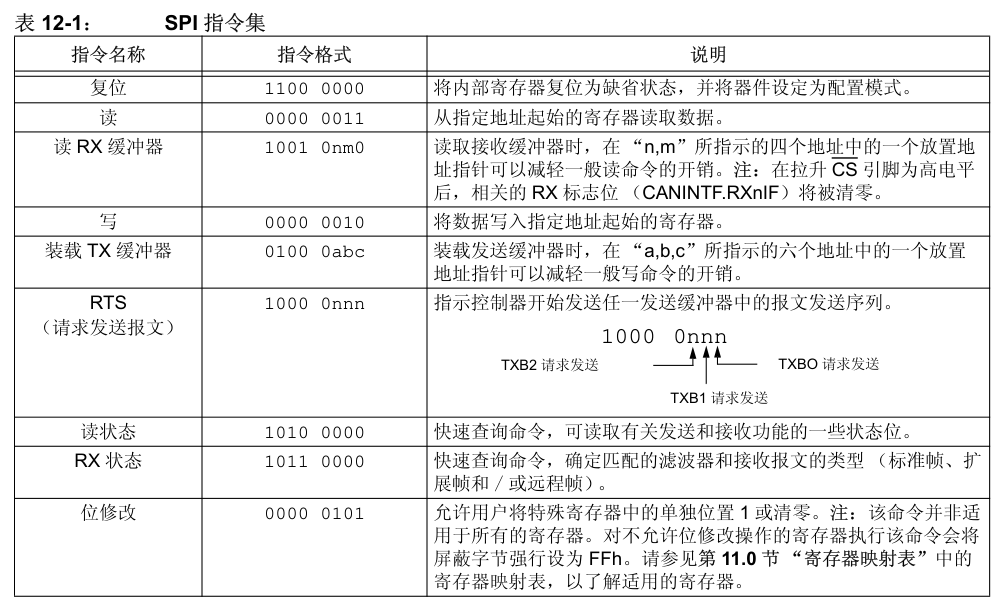通过向 MCP2515 发送上述 SPI 指令就能实现复位、读、写等操作，复位操作对应的指令格式为 `11000000`。示例

```c
struct spi_device *spi_dev; // SPI 设备指针
// MCP2515 芯片复位函数
void mcp2515_reset(void){
	int ret;
	char write_buf[] = {0xc0}; // 复位指令 0x11000000 即 0xc0
	ret = spi_write(spi_dev, write_buf, sizeof(write_buf)); // 发送复位命令
	if(ret < 0){
		printk("spi_write is error\n"); // 打印错误信息
	}
}
```

## 读寄存器函数

TODO

## 配置模式下寄存器的配置

TOOD


## 修改工作模式


TODO

## 完善 write 和 read 函数

TODO


#  Linux 中通用 SPI 设备驱动

跟 I2C 设备类似，在 Linux内核中也有着通用 SPI 设备驱动，menuconfig路径如下：

```
> Device Drivers
	> SPI support
		[] User mode SPI device driver support
```

除了内核支持之外，还需要修改设备树，由于之前已经使能了 SPI0，所以这直接修改之前编写的 mcp2515 设备树节点，修改完成的 mcp2515 节点如下所示：`rockchip,spidev`

```dts
&spi0 {
	status = "okay";
	pinctrl-0 = <&spi0m1_cs0 &spi0m1_pins>;
	pinctrl-1 = <&spi0m1_cs0 &spi0m1_pins_hs>;
	
	mcp2515:mcp2515@0 {
		compatible = "rockchip,spidev";
		reg = <0>;
		spi-max-frequency = <10000000>;
		status = "okay";
	};
}
```

开发板启动之后，如果存在/dev/spidev0.0 设备节点，证明设备树及内核配置正确，

`/dev/spidev0.0` 表示一个 SPI 总线上的具体设备。0.0 是一个标识符，用于区分系统中的不同 SPI 控制器和设备。这个标识符由两部分组成：

- 第一个数字 0：表示 SPI 总线的编号。一个系统中可能有多个 SPI 控制器，每个控制器对应一个总线编号，从 0 开始。
- 第二个数字 0：表示连接在该 SPI 总线上的具体设备编号。一个 SPI 总线上可以连接多个设备，每个设备通过片选信号（Chip Select, CS）进行区分，设备编号从 0 开始。

## spidev_test 工具

`spidev_test` 是一个用于测试和调试 SPI 设备的命令行工具，通常在 Linux 系统上使用，它允许用户直接通过 SPI 总线与设备进行通信，可以发送数据并接收来自设备的响应。`spidev_test` 源码位于topeet Linux 源码的 `kernel/tools/spi` 目录下，编译要交叉编译

```bash
make
CC=/home/topeet/Linux/linux_sdk/prebuilts/gcc/linux-x86/aarch64/gcc-linaro-6.3.1-2017.05-x86_64_aarch64-lin
ux-gnu/bin/aarch64-linux-gnu-gcc
LD=/home/topeet/Linux/linux_sdk/prebuilts/gcc/linux-x86/aarch64/gcc-linaro-6.3.1-2017.05-x86_64_aarch64-lin
ux-gnu/bin/aarch64-linux-gnu-ld
```


- **基本介绍**：spidev_test 是一个用于测试和验证 Linux 中 SPI 设备驱动程序的用户空间工具。它使用 spidev 接口与 SPI 设备通信。这个工具主要用来检查 SPI 设备是否工作正常，以及对 SPI 设备进行基本的读写操作。
- **主要选项和参数**：
  - `-D /dev/spidevX.Y`：指定要测试的 SPI 设备节点。
  - `-s <speed>`：设置 SPI 时钟频率（以 Hz 为单位），例如 -s 1000000 表示 1 MHz。
  - `-d <delay>`：设置数据传输之间的延迟时间（以微秒为单位）。
  - `-b <bits per word>`：设置每个数据字的位数，通常是 8 或 16。
  - `-H`：以十六进制模式显示传输的数据。

- **示例操作**

  - 读取设备信息：`spidev_test -D /dev/spidevX.Y -s 1000000`

  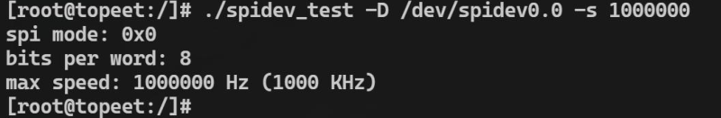

  这会使用 1 MHz 的时钟频率从 SPI 设备读取数据，默认情况下以十六进制显示

  - 写入和读取数据：`spidev_test -D /dev/spidevX.Y -s 1000000 -b 8 -d 1000 -H -p 'hello'`

  

  这条命令会向 SPI 设备写入字符串 'hello'，并以十六进制模式显示设备的响应数据。`-b 8`指定每个字的位数为 8，`-d 1000` 设置 1000 微秒的延迟。

- **连续传输**：`spidev_test -D /dev/spidevX.Y -s 1000000 -b 8 -p 'abcdefgh'`

  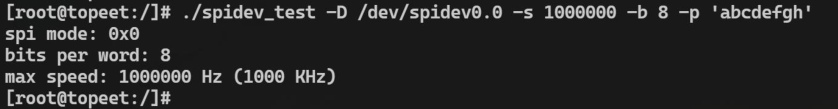

这个示例将连续发送字节 'abcdefgh' 到 SPI 设备。


## spidev_fdx 工具


- **基本介绍**：spidev_fdx 是一个用于全双工 SPI 通信测试的命令行工具，主要用于在Linux 系统上与 SPI 设备进行双向数据传输和测试。
- **主要选项和参数**
  - `-D /dev/spidevX.Y`：指定要测试的 SPI 设备节点。
  - `-s <speed>`：设置 SPI 时钟频率（以 Hz 为单位），例如 -s 1000000 表示 1 MHz。
  - `-w <write_data>`：指定要写入到 SPI 设备的数据，可以是十六进制或 ASCII 格式的字符串。
  - `-r <read_size>`：指定从 SPI 设备读取的数据大小（以字节为单位）。
  - `-b <bits per word>`：设置每个数据字的位数，通常是 8 或 16。
  - `-d <delay>`：设置数据传输之间的延迟时间（以微秒为单位）。

- **示例操作**

  - **发送和接收数据**：`spidev_fdx -D /dev/spidevX.Y -s 1000000 -w 'hello' -r 5`

    这会向 SPI 设备写入字符串 'hello'，并从设备读取 5 个字节的响应数据。

  - 设置时钟频率和延迟：`spidev_fdx -D /dev/spidevX.Y -s 500000 -d 200 -w 'abcdef' -r 10`

    这个示例将 SPI 时钟频率设置为 500 kHz，数据写入延迟为 200 微秒，并向设备写入字符串 'abcdef'，然后读取 10 个字节的响应数据。


## 应用程序中如何使用 SPI

可以参考 `spidev_test` 工具的源码

# Linux中使用模拟SPI

首先将模拟 SPI 驱动编译进内核，在 make menuconfig 图形化配置界面中选中如下选项
```
Device Drivers --->
	[*]SPI support -->
		<*> GPIO-based bitbanging SPI Master //选中
```

软件 SPI 选定的引脚为开发板背面的 4 个 GPIO，具体引脚功能图如下所示：

| RK3568 网络标号       | 对应 GPIO | 模拟功能 |
| --------------------- | --------- | -------- |
| DVP_PWREN0_H_GPIO0_B0 | GPIO0_B0  | SCLK     |
| PDM_SDI3_M0_ADC       | GPIO1_B0  | MISO     |
| PDM_SDI2_M0_ADC       | GPIO1_B1  | MOSI     |
| PDM_SDI1_M0_ADC       | GPIO1_B2  | CS       |

设备树修改步骤如下所示：

```dts
spi5: spi@gpiol {
	compatible = "spi-gpio";
	#address-cells = <1>;
	gpio-sck = <&gpio0 RK_PB0_GPIO_ACTIVE_LOW>;
	gpio-miso = <&gpio1 RK_PB0_GPIO_ACTIVE_LOW>;
	gpio-mosi = <&gpio1 RK_PB1_GPIO_ACTIVE_LOW>;
	cs-gpios = <&gpio1 RK_PB2_GPIO_ACTIVE_LOW>;
	num-chipselects = <1>;
	pinctrl-names = "default";
	pinctrl-0 = <&spi5_gpios>;
	status = "disabled";
};
```

然后对 pinctrl 节点进行追加，设置引脚复用：

```dts
spi5_gpios: gpios {
	rockchip,pins = <0 RK_PB0 0 &pcfg_pull_none>,
					<1 RK_PB0 0 &pcfg_pull_none>,
					<1 RK_PB1 0 &pcfg_pull_none>,
					<1 RK_PB2 0 &pcfg_pull_none>,
	>;
};
```

最后修改之前编写的 mcp2515 节点

```dts
&spi5 {
	status = "okay";
	mcp2515:mcp2515@0 {
		compatible = "rockchip,spidev";
		reg = <0>;
		spi-max-frequency = <10000000>;
		status = "okay";
	};
}
```

测试：

```bash
ls /dev/spidev5.0
./spidev_test -D /dev/spidev5.0 -v
```


# 移植官方 mcp2515 驱动

Linux 内 核 源 码 中 默 认 已 经 有 了 MCP2515 的 驱 动 程 序 ， 驱 动 具 体 路 径 为`drivers/net/can/spi/mcp251x.c`，所以只需要在`make menuconfig` 图形化配置界面选中即可：

```
> Networking support
	> CAN bus subsystem support
		> CAN Device Drivers
			> CAN SPI interfaces
				<*> Microchip MCP251x and MCP25625 SPI CAN controllers
```

然后在设备树中添加如下节点：

```dts
&spi0 {
	status = "okay";
	pinctrl-0 = <&spi0m1_cs0 &spi0m1_pins>;
	pinctrl-1 = <&spi0m1_cs0 &spi0m1_pins_hs>;

	mcp2515: mcp2515@0 {
		compatible = "microchip,mcp2515";
		reg = <0>;
		spi-max-frequency = <10000000>;
		interrupt-parent = <&gpio0>;
		interrupts = <RK_PB0 IRQ_TYPE_EDGE_FALLING>;
		pinctrl-names = "default";
		pinctrl-0 = <&mcp2515_int>;
		clocks = <&clk8m>;
		status = "okay";
	};
	
	clk8m: clk8m {
		compatible = "fixed-clock";
		#clock-cells = <0>;
		clock-frequency = <8000000>;
	};
};
```

在 pinctrl 节点下添加以下内容

```dts
mcp2515-gpio{
	mcp2515_int:mcp2515-int {
		rockchip,pins = <0 RK_PB0 RK_FUNC_GPIO &pcfg_pull_none>;
	};
};
```

测试

```bash
ifconfig -a
# 回环测试
ip link set can1 down
ip link set can1 type can bitrate 250000
ip link set can1 type can loopback on
ip link set up can1
candump can1 -L &
cansend can1 123#1122334455667788
```

