# UART

串口（Serial Port）也叫串行通信接口，通常也叫做 **COM 接口**，是一种计算机与外部设备(如串口通信设备)进行数据通信的**异步全双工接口**。它通过**串行传输**方式，即一次只发送一个比特位（bit）来进行数据传输。

具体来说，典型的串口通信只需要 3 根线，分别是地线（GND），发送线（TX），接收线（RX），如下图所示，发送和接收各用一条线，**没有时钟线**。

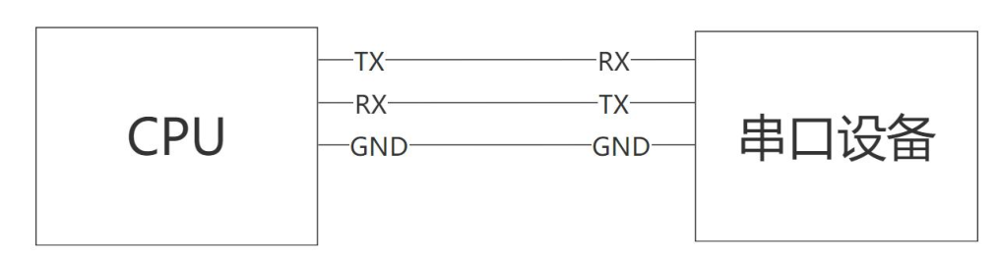

## 波特率

波特率（Baud Rate）是串口通信中的关键参数，它指的是每秒传输的比特位数或者码元速率。

在数字信道中，一个脉冲信号就是一个码元，如下图所示。码元速率表示在 1 秒内能发送多少码元或脉冲信号。

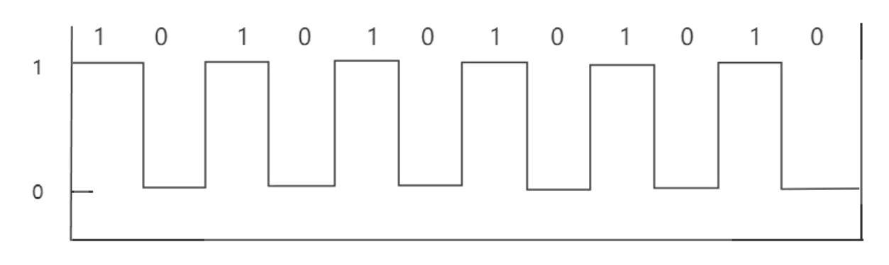

通信的双方必须设定相同的波特率才能确保数据能够正确传输。常见的标准波特率如 9600、115200 等，通常满足大多数应用需求。

> 但在特定情况下，可能需要设置非标准的波特率，此时需确保所有通信设备都能支持和正确配置该波特率。
>
> 对于高于 1.5Mbps 的波特率的设置，可能需要通过时钟的小数分频或整数分频来实现。
>
> 如果无法通过分频来达到所需波特率，则可能需要调整 PLL（锁相环）设置，调整 PLL 存在一定风险，因为它可能会影响到设备的其他模块。


**比特率**是指**单位时间内传输的比特数量**，通常用 bps(bit per second)表示，单位是 bit/s。与之相比，**波特率**则是**每秒钟传输的码元或脉冲信号的数量**。这俩者之间的关系可以用公式表示为**比特率=波特率*log2(M)**，其中 M 表示每个码元承载的信息量。

一个码元实际上就是一个脉冲信号，它可能携带 1 个 bit，2 个bit 或者更多 bit 的数据，这取决于通信系统的具体实现方式。**在二进制系统中，比特率等于波特率，因为每个码元正好承载 1 个 bit 的信息**。


举例：假如串口的波特率为 9600，那么在二进制系统中，一秒钟可以传送多少个字节呢？

一个字节等于 8 个 bit，也就是 8 个高低电平变化，因为在二进制系统中，比特率等于波特率。因此一秒钟可以传输的字节数为 9600/8=1200 字节。


## 串口通讯协议

### 数据流结构

在串口通信中，除了关注波特率外，数据流的结构也至关重要。

每帧数据包括 11 位：

- 1位起始位
- 8 位数据位
- 1 位奇偶校验位
- 1 位停止位

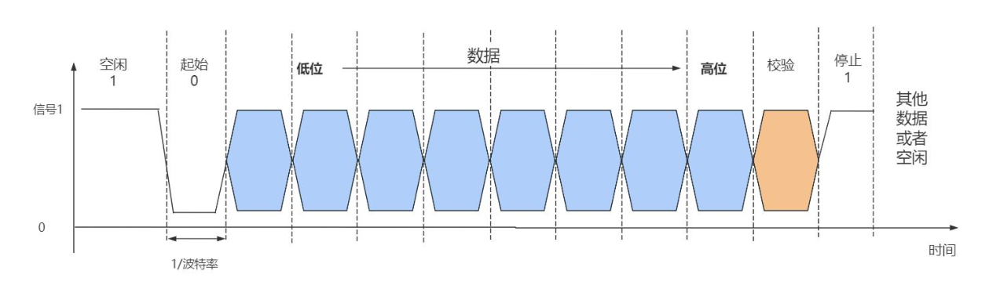

- **起始位**：表示数据传输的开始，数据线上空闲状态是 1，从高电平（空闲状态）拉低表示开始传输数据。

- **数据位**：指每个字节中的数据位数，通常为 7 或 8 位。

- **校验位**：用于验证传输数据的准确性，其类型包括奇校验、偶校验、0 校验、和 1 校验。

- **奇校验（odd parity）**: 当实际数据中 1 的个数为偶数的时候，校验位为 1，否则这个校验位就是 0。

- **偶校验（even parity）**: 当实际数据中 1 的个数为偶数的时候，校验位为 0，否则这个校验位就是 1。

- **0 校验（space parity）**: 校验位恒为 0，如果为 1 表示错误。

- **1 校验（mark parity）**: 校验位恒为 1，如果为 0 表示错误。

- **停止位**：指在每个数据字节传输结束后发送的位数，通常为 1 或 2 位。

### 时序波形分析


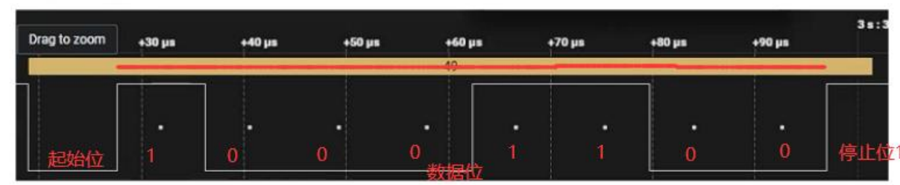

当**数据线空闲时是高电平**，而在**数据传输时则会被拉低**，图中的第一个脉冲对应于起始位。紧随其后的是 8 位数据位，它们按照最低有效位（LSB）优先的顺序传输。

例如，数据位“00110001”转换成十六进制是 0x31，换算成十进制是 49。在 ASCII码中，49 对应的字符是’1’，因此传输的数据是 1。数据传输完成之后，总线被拉高。

## 串口通信接口的类型

UART 只规定了收发的时序，即“先发起始位，再发数据位，校验位，最后发停止位”，只规定了高低电平，但是并没有规定高电平指的是多少伏，低电平指的是多少伏。

串口一般的接口电平有 **TTL**，**RS232**,**RS485**,**RS422**，并且**每种接口通常需要相应的电平转换芯片**。直**接使用处理器引出的串口接口时，通常是 TTL 电平**。

然而，处理器的不同型号或供应商可能存在电平差异，这意味着在某些情况下不能直接连接设备。因此，为了确保正常通信必须进行适当的电平转换。一般的串口接口电平对比如下表所示：

| 电平标准   | 逻辑电平定义                                                 | 典型高/低电平电压                                            | 信号类型                                  | 最大传输距离                                          | 主要特点                                                     |
| ---------- | ------------------------------------------------------------ | ------------------------------------------------------------ | ----------------------------------------- | ----------------------------------------------------- | ------------------------------------------------------------ |
| **TTL**    | 0 = 低电平<br /> 1 = 高电平                                  | 低电平：0 V 高电平：1.8 V / 2.5 V / 3.3 V / 5 V（取决于供电） | 单端信号                                  | 几米（通常 ≤ 2–5 m）                                  | 板内或板间短距离通信 ，与 MCU、传感器等直接兼容 ， 抗干扰能力弱，不适用于长距离 |
| **RS-232** | 0 = **正电压**（+3 V ~ +15 V） <br />1 = **负电压**（-3 V ~ -15 V） | 逻辑 0（空号）：+3 V ~ +15 V 逻辑 1（传号）：-3 V ~ -15 V 常用 ±12 V | 单端（但使用正负电压）                    | 约 15–50 米（速率越低距离越长）                       | 支持点对点通信，抗干扰能力较强于 TTL，需电平转换芯片（如 MAX232），已逐渐被 USB 等替代 |
| **RS-422** | 差分信号： <br />1 = A > B（+2 V ~ +6 V）<br /> 0 = A < B（-2 V ~ -6 V） | 差分电压：±2 V ~ ±6 V                                        | **差分信号**（全双工，4 线）              | 最大约 **1200 米**（@ 100 kbps）                      | 支持全双工通信，强抗共模干扰能力，适用于工业环境，通常为 1 发送器，多接收器 |
| **RS-485** | 差分信号：<br /> 1 = A > B（+1.5 V ~ +5 V）<br /> 0 = A < B（-1.5 V ~ -5 V） | 差分电压：≥ ±1.5 V（典型 ±2 V ~ ±5 V）                       | **差分信号**（半双工或全双工，2 或 4 线） | 最大约 **1200 米**（@ 100 kbps） （理论可达 1219 米） | 支持多点通信（最多 32~256 节点） ，广泛用于工业总线（如 Modbus），抗干扰强，适合长距离、噪声环境 |

### RS232接口

**RS232（Recommended Standard 232）** 协议是由美国电子工业协会在 1970 年制定的串行通信标准。该标准**统一了串口通信的连接器和引脚定义**，如下图所示，并明确规定了每个连接器引脚的电平标准

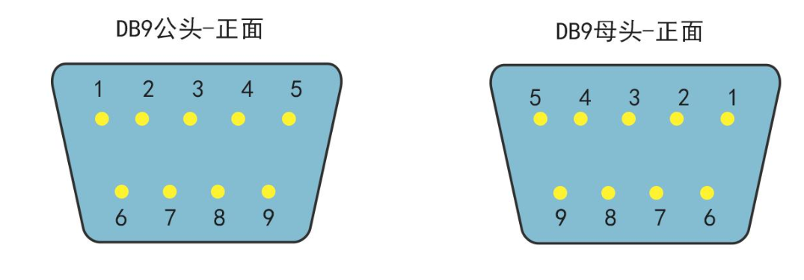


#### **DB9 引脚说明**

DB9 是一种常见的串口连接器，通常用于 RS-232 串口通信和其他串行通信应用。它包含 9个引脚，每个引脚都有特定的功能。下面是 DB9 连接器的引脚说明：

- **Pin 1 - DCD (Data Carrier Detect)**:数据载波检测。指示远程设备是否准备好进行通信。
- **Pin 2 - RXD (Receive Data)**:接收数据。从远程设备接收数据流。
- **Pin 3 - TXD (Transmit Data)**:发送数据。向远程设备发送数据流。
- **Pin 4 - DTR (Data Terminal Ready)**:数据终端就绪。指示数据终端设备（如计算机）准备好进行通信。
- **Pin 5 - GND (Ground)**:地线。电气接地，用于电路的参考和屏蔽。
- **Pin 6 - DSR (Data Set Ready)**:数据集准备好。指示远程设备准备好接收和发送数据。
- **Pin 7 - RTS (Request to Send)**:请求发送。发送方使用此信号请求开始发送数据。
- **Pin 8 - CTS (Clear to Send)**:清除发送。接收方使用此信号表示准备好接收数据。
- **Pin 9 - RI (Ring Indicator)**:铃信号指示器。指示远程设备发送了铃响信号。


RS232 本质上也是串口协议，与串口协议相同。但它规定了串口的物理接口和电平特性，因此在硬件层面有所不同，但在软件编程和串口通信的实现上并无区别

#### 电平特性

- RS232 接收-发送端的电信号是{ % emp 相对于公共地线（GND）的电压信号 %}。
  - 在 RS232 标准中，**电压差值在+3V 至+15V 之间被定义为逻辑“0”**，而在**-3V 至-15V 之间则表示逻辑“1”**。电压差值在-3V 至+3V 之间的情况未定义。
  - 通常，实际应用中希望电压差的绝对值在 5V 至 15V 之间，以确保可靠的信号传输。
  - 在数据发送时，发送端驱动器输出+5V 至+15V 的正电压信号表示逻辑“0”，而-5V 至-15V 的负电压信号表示逻辑“1”。
  - 在数据接收时，只要检测到大于3V 的电信号，即视为有效信号。
- RS232 接口在发送和接收时具有相对较高的电流能力，可以处理相对较大的电流负载，这使得它适合于长距离通信和连接外部设备。
- RS232 信号具有较高的抗干扰能力，能够在工业环境中稳定运行，不易受到电磁干扰的影响。

- RS232 包括以下信号线：
  - 发送线（Tx）
  - 接收线（Rx）
  - 地线（Ground）
  - 数据终端就绪（DTR）
  - 数据就绪（DSR）
  - 请求发送（RTS）
  - 清除发送（CTS）
  - 环路信号检测（DSR）
- RS232 支持各种波特率，通常从低速率到较高速率，最高可以达到数百千位每秒（kbps）


 iTOP-RK3568 开发板上，调试串口使用了 MAX3232 芯片将 TTL 电平转换成 232 电平，调试串口的原理图如下图所示

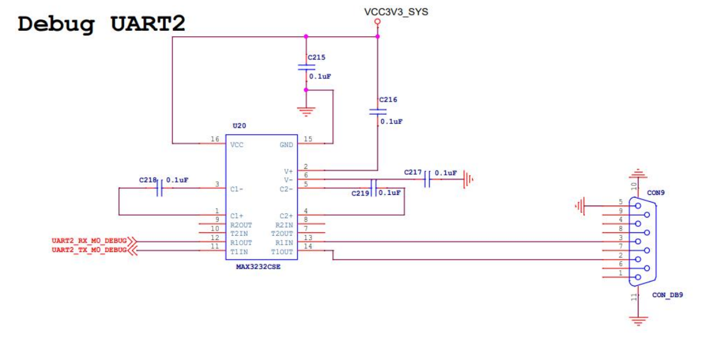


### RS485接口

RS485 标准是由电信行业协会（Telecommunications Industry Association, TIA）和电子工业联盟（Electronic Industries Alliance, EIA）共同制定的。该标准的主要目的是。


#### 特点和优势

- **长距离通信能力**：RS485 能够在理想条件下实现长达 1200 米的通信距离，适用于需要远距离数据传输的场合。
- **抗干扰能力强**：由于采用差分信号传输方式，RS485 能有效抵御电磁干扰（EMI）和射频干扰（RFI），保证数据传输的稳定性和可靠性。
- **多站能力**：RS485 支持多个设备（最多 32 个）在同一条总线上进行通信，每个设备可以独立地发送和接收数据，从而实现灵活的网络组网。
- 应用广泛：RS485 广泛应用于工业自动化控制系统、建筑自动化、智能家居系统、电力系统监控等领域，满足对长距离、高速和可靠通信的要求


#### 电平特性

RS485 的电平特性如下：

- **差分信号传输**：RS485 使用差分信号进行数据传输，即数据信号是相对于两条信号线（通常标记为 A 和 B 线）之间的电压差来表示的。这种差分信号传输方式使得 RS485 具有良好的抗干扰能力和长距离传输能力。
- **电压范围**：
  - **逻辑“ 1”以两线间的电压差为+(2~6)V 表示**；
  - **逻辑“ 0”以两线间的电压差为-(2~6)V表示**。
  - ，不易损坏接口电路的芯片，且**该电平与 TTL 电平兼容**，可方便与 TTL 电路连接。
- 电流能力：RS485 发送器具有较强的驱动能力，能够推动较长的通信线路和多个接收器。接收器能够处理较大的输入电流，以确保信号的可靠接收。
- 电气特性：RS485 支持。支持长达 1200米的通信距离，在特定情况下甚至可以更长

 iTOP-RK3568 开发板上使用 **SIT3485E 芯片**将 TTL 电平转换为 485 电平，原理图如下图所示：

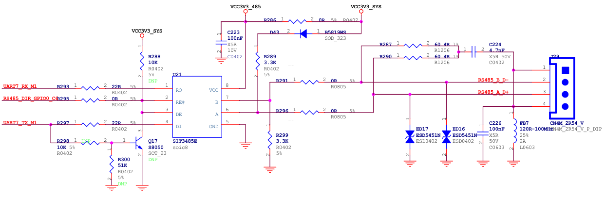

可知 RK3568 开发板的 RS485 接口实际上是通过 SIT3485E 芯片转接的串口 7。

#### SIT3485E芯片

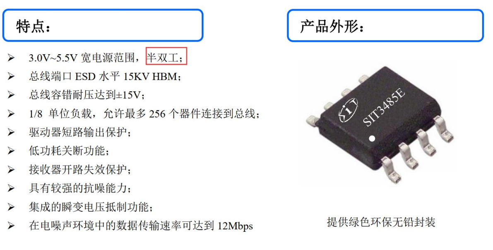

SIT3485E 是一款 3.0V~5.5V 宽电源供电、总线端口 ESD 水平达到 15KV HBM 以上、总线耐压范围达到±15V、**半双工**、**低功耗**，**功能完全满足 TIA/EIA-485 标准要求的 RS-485 收发器**。

SIT3485E 包括**一个驱动器**和**一个接收器**，两者均可**独立使能与关闭**。当两者均禁用时，驱动器与接收器均输出高阻态。

SIT3485E 具有 1/8 负载，允许 256 个 SIT3485E 收发器并接在同一通信总线上。可实现高达 12Mbps 的无差错数据传输。

SIT3485E 工作电压范围为 3.0~5.5 V，具备失效安全（fail-safe）、限流保护、过压保护等功能。

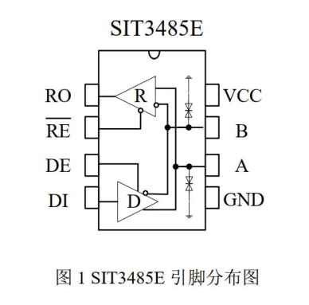


| 引脚序号 | 引脚名称 | 引脚功能                                                     |
| -------- | -------- | ------------------------------------------------------------ |
| 1        | RO       | **接收器输出端**。 当 /RE 为低电平时，若 A-B ≥ -10mV，RO 输出为高电平； 若 A-B ≤ -200mV，RO 输出为低电平。 |
| 2        | /RE      | **接收器输出使能控制**。 当 /RE 接低电平时，接收器输出使能，RO 输出有效； 当 /RE 接高电平时，接收器输出禁能，RO 为高阻态； /RE 接高电平且 DE 接低电平时，器件进入低功耗关断模式。 |
| 3        | DE       | **驱动器输出使能控制**。 DE 接高电平时驱动器输出有效，DE 为低电平时输出为高阻态； /RE 接高电平且 DE 接低电平时，器件进入低功耗关断模式。 |
| 4        | DI       | **DI 驱动器输入**。 DE 为高电平时，DI 上的低电平使驱动器同相端 A 输出为低电平，驱动器反相端 B 输出为高电平； DI 上的高电平将使同相端输出为高电平，反相端输出为低。 |
| 5        | GND      | **接地**                                                     |
| 6        | A        | **接收器同相输入和驱动器同相输出端**                         |
| 7        | B        | **接收器反相输入和驱动器反相输出端**                         |
| 8        | VCC      | **接电源**                                                   |

由引脚定义图可知：

- RO 引脚为接收器输出端，在原理图上连接到 UART7_RX_M1 引脚。
- DI引脚为 DI 驱动器输入引脚，在原理图上连接到 UART7_TX_M1 引脚。
- A 引脚是接收器同向输入和驱动器同向输出端
- B 引脚是接收器反向输入和驱动器反向输出端，A 和 B 就是 RS485 的差分对了。
-  引脚是接收器输出使能控制引脚
  - 当/RE 接低电平时，接收器输出使能，RO 输出有效
  - 当/RE 接高电平时，接收器输出禁能，RO 为高阻态。
- DE 引脚是驱动器输出使能控制引脚，DE 接高电平时驱动器输出有效，DE 为低电平时输出为高阻态。
- 接高电平且 DE 接低电平时，器件进入低功耗模式。

简单来说：

- 为低电平时，RO 输出有效。反之 RO 高阻态，也就是无效。RO 接的 UART7_RX_M1，UART7_RX_M1 是串口的接收引脚。因此，/RE 低电平时，串口可以接收数据，反之串口无法接收数据。
- DE 是高电平时，DI 有效，DI 接的是 UART7_TX_M1，UART7_RX_M1 是串口发送引脚，因此，DE 是高电平时，DI 上的低电平使驱动器 同向端 A 输出为低电平，驱动器反向端 B 输出为高电平，串口可以发送数据，反之串口无法发送数据。

** 和 DE 有效电平刚好相反**，又因为 485 是**半双工**，不能同时收发。所以 和 DE 肯定不能同时开启，**即 和 DE 的电平必须相同**。这样开启，就等于 DE 关闭，所以这两个引脚连在了一起。

这样就很清晰了，如果 GPIO0_C6 输出低电平， 和 DE 是低电平， 是低电平时，串口可以接收数据，DE 是低电平时，串口不能发送数据。

如果 GPIO0_C6 输出高电平，和 DE 是高电平， 是高电平时，串口不能接收数据，DE 是高电平时，串口可以发送数据。

也就是说，我们需要用 GPIO0_C6 这个引脚的高低电平来控制 RS485 是发送还是接收。因此，我们需要编写一个驱动来达到这个目的。迅为提供的源码中默认配置了驱动来控制GPIO0_C6。


##### 自收发 485 电路

除了软件控制外，还可以通过硬件实现自动切换，以实现 RS485 的自动收发功能。软件控制发送和接收存在一定的时间差，为了减少这种时间差，迅为开发板的底板原理图进行了优化，兼容了硬件实现自动收发。具体的修改方式是将 R295 去掉，并将下图中标记为 DNP 的元件都进行焊接。

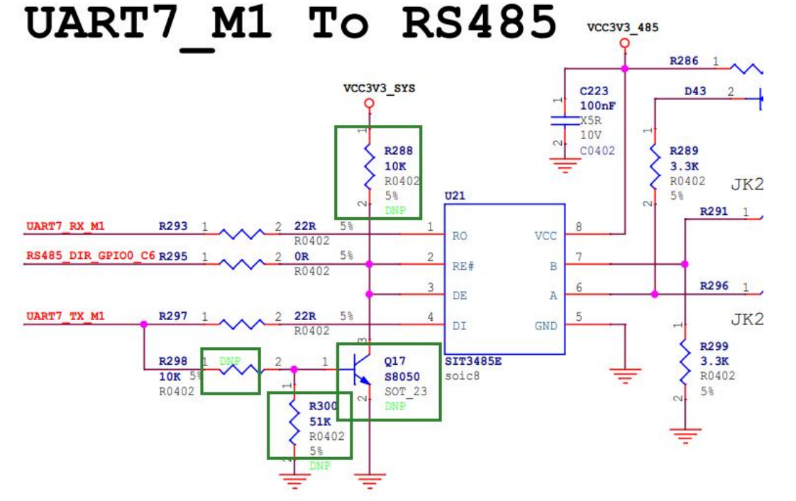

- 当 UART_TX_M1 为高电平时，Q17 的基极也为高电平，导致 Q17 导通， 和 DE 为低电平，从而串口处于接收数据模式
- 当 UART_TX_M1 为低电平时，Q17的基极为低电平，导致Q17截止， 和DE为高电平，串口处于发送数据模式。由于UART_TX_M1 在空闲时为高电平，表明串口处于接收数据状态；当 UART_TX_M1 被拉低时，串口则处于发送数据状态。

> 既然 UART_TX_M1 高电平表示接收模式，那发送 1 时也是高电平。这样芯片会一直处于接收模式，导致 1 无法发送出去，是吗？
>
> **当转接芯片处于接收模式时，A 和 B 两个引脚会处于高阻态模式**。
>
> 高阻态意味着非常大的电阻，几乎等同于断路。**此时，A 由上拉电阻拉高，B 由下拉电阻拉低**。
>
> 因此，**A 高、B 低表示通信中的 1**。通过这种“接收模式”，我们巧妙地将“1”发送出去了。
>
> 这一优化省去了一个 RS485 收发控制 IO，将 RS485 完全当作串口使用，方便编写驱动。


# 串口子系统框架

串口子系统框架是 Linux 内核中专门用于处理串口设备的模块化框架，框架图如下图所示。

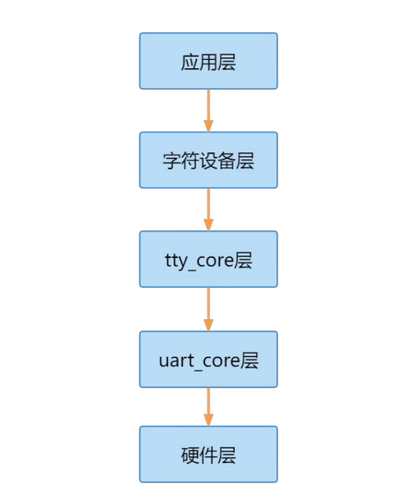


- **应用层**：位于最顶层，是串口子系统中用户空间应用程序与内核空间之间的接口，应用层包括了用户空间的串口应用程序，如串口通信工具 minicom 等。
- **字符设备层**：位于应用层的下方，负责将用户空间的串口读写请求传递给内核空间的tty_core 层。字符设备层将串口设备看作一个特殊的字符设备，通过字符设备接口来进行操作。
- **tty_core 层**：位于字符设备层的下方，是 Linux 内核中用于管理串口设备的核心模块，它处理串口设备的基本功能，如数据传输，控制，缓冲管理等。tty_core 层与具体的串口硬件无关，是串口设备的通用处理层。
- **uart_core 层**：位于 tty_core 层的下方，提供了串口设备的底层驱动接口，负责与具体的串口硬件进行通信。uart_core 层负责控制串口数据的发送和接收、中断处理、时钟管理等底层操作。
- **硬件层**：位于最底层，是串口子系统中与具体硬件有关的部分。硬件层包括了串口硬件的驱动程序，与具体的串口控制器进行通信，实现对硬件的底层控制和操作。


## 配置串口驱动

在瑞芯微官方提供的 SDK 内核源码里面，串口驱动使用的是 8250 通用串口驱动，以下是主要驱动文件

- `drivers/tty/serial/8250/8250_core.c`     8250 串口驱动核心
- `drivers/tty/serial/8250/8250_dw.c`         Synopsis DesignWare 8250 串口驱动
- `drivers/tty/serial/8250/8250_dma.c`       8250 串口 DMA 驱动
- `drivers/tty/serial/8250/8250_port.c`     8250 串口端口操作
- `drivers/tty/serial/8250/8250_early.c`   8250 串口 early console 驱动


make menuconfig中选中驱动

```
Device Driver / Character devices / Serial drivers
	[*] Console on 8250/16550 and compatible serial port
```


迅为提供的 SDK 源码设备树中默认打开了串口 9，打开`arch/arm64/boot/dts/rockchip/rk3568.dtsi`设备树文件，串口 9 控制器的设备树节点如下所示：

```dts
	uart9: serial@fe6d0000 {
		compatible = "rockchip,rk3568-uart", "snps,dw-apb-uart";
		reg = <0x0 0xfe6d0000 0x0 0x100>;
		interrupts = <GIC_SPI 125 IRQ_TYPE_LEVEL_HIGH>;
		clocks = <&cru SCLK_UART9>, <&cru PCLK_UART9>;
		clock-names = "baudclk", "apb_pclk";
		reg-shift = <2>;
		reg-io-width = <4>;
		dmas = <&dmac0 18>, <&dmac0 19>;
		pinctrl-names = "default";
		pinctrl-0 = <&uart9m0_xfer>;
		status = "disabled";
	};
```

- `compatible`：指定设备的兼容性字符串，表示此串口设备兼容于 `rockchip,rk3568-uart` 和`snps,dw-apb-uart` 两种串口控制器。这有助于设备树绑定相应的驱动程序。
- `reg`：指定串口设备的地址和大小，0xfe6d0000 是串口设备的基地址，0x100 表示地址空间的大小。
- `interrupts`：指定串口设备的中断信息，包括中断类型和中断号。
- `clocks`：指定串口设备所使用的时钟源，包括波特率时钟和 APB 时钟。
- `clock-names`：指定时钟源的名称，用于与时钟源的具体配置相匹配。
- `reg-shift`：表示地址偏移量的位数，即每个寄存器的偏移量是按字节还是按字（byte）。
- `reg-io-width`：表示对设备地址和数据的访问宽度，这里是 4 表示 4 字节宽度。
- `dmas`：指定串口设备使用的 DMA 控制器以及 DMA 通道号，用于数据传输的 DMA 操作。
- `dma-names`:可选值为
  - `tx`打开 tx dma
  - `rx`打开 rx dma
  - `!tx`关闭 tx dma
  - `!rx`关闭 rx dma
- `pinctrl-names` 和 `pinctrl-0`：用于串口设备的管脚控制，以配置和管理串口设备的引脚设置。可选参数为如下所示：
  - `&uart9m0_xfer` 配置 tx 和 rx 引脚为 iomux group 0
  - `&uart9m1_xfer` 配置 tx 和 rx 引脚为 iomux group 1
  - `&uart9m0_ctsn` 和`&uart1m0_rtsn` 配置硬件自动流控 cts 和 rts 引脚为 iomux group 0
  - `&uart9m1_ctsn`和`&uart1m1_rtsn` 配置硬件自动流控 cts 和 rts 引脚为 iomux group 1
- `status`：表示串口设备的状态，这里是 "disabled" 表示设备当前处于禁用状态。如果设置为“okay”表示打开设备


## uart_driver 注册流程分析

### uart 相关底层结构体

uart 相关底层结构体之间的关系如下所示

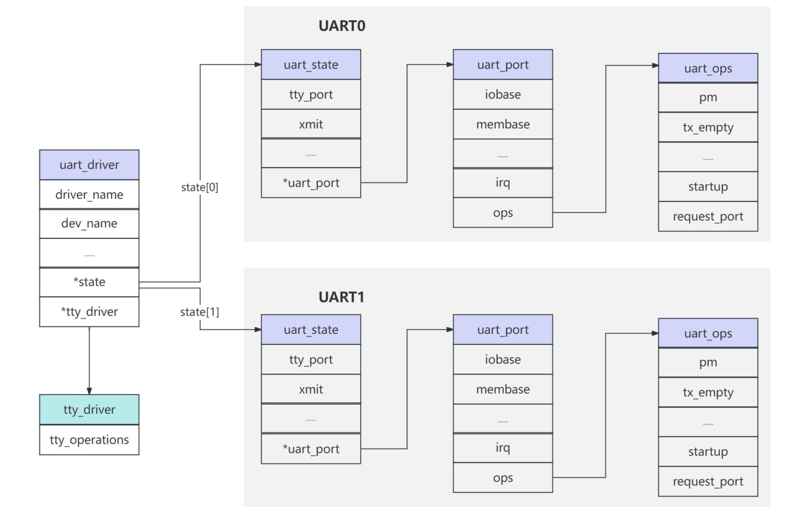

#### struct uart_driver

`uart_driver` 结构体代 表 UART 驱动，`uart_driver` 定义在 `include/linux/serial_core.h` 文件中，内容如下：

```c
struct uart_driver {
	struct module		*owner;// 模块所有者
	const char		*driver_name;// 驱动程序名称
	const char		*dev_name;// 设备名称
	int			 major;// 设备分配的主设备号
	int			 minor;// 设备分配的次设备号
	int			 nr;// 设备的唯一标识符
	struct console		*cons;// 控制台的指针

	/*
	 * these are private; the low level driver should not
	 * touch these; they should be initialised to NULL
	 */
	struct uart_state	*state;// 指向 UART 驱动程序状态的指针
	struct tty_driver	*tty_driver;// 指向 TTY 驱动程序的指针
};
```

`struct uart_driver` 封装了 `tty_driver`，使得底层的 UART 驱动不需要关心 `tty_driver`。

#### struct uart_port

uart_port 是针对一个串口的抽象，定义在 `kernel/include/linux/serial_core.h`，其内部包含一个 `uart_state` 类型的成员变量，内容如下：

```c
struct uart_port {
	spinlock_t		lock;			/* port lock */
	unsigned long		iobase;			/* in/out[bwl] *//* io 端口基地址（物理） */
	unsigned char __iomem	*membase;		/* read/write[bwl] *//* io 内存基地址（虚拟） */
	unsigned int		(*serial_in)(struct uart_port *, int);
	void			(*serial_out)(struct uart_port *, int, int);
	void			(*set_termios)(struct uart_port *,
				               struct ktermios *new,
				               struct ktermios *old);
	void			(*set_ldisc)(struct uart_port *,
					     struct ktermios *);
	unsigned int		(*get_mctrl)(struct uart_port *);
	void			(*set_mctrl)(struct uart_port *, unsigned int);
	unsigned int		(*get_divisor)(struct uart_port *,
					       unsigned int baud,
					       unsigned int *frac);
	void			(*set_divisor)(struct uart_port *,
					       unsigned int baud,
					       unsigned int quot,
					       unsigned int quot_frac);
	int			(*startup)(struct uart_port *port);
	void			(*shutdown)(struct uart_port *port);
	void			(*throttle)(struct uart_port *port);
	void			(*unthrottle)(struct uart_port *port);
	int			(*handle_irq)(struct uart_port *);
	void			(*pm)(struct uart_port *, unsigned int state,
				      unsigned int old);
	void			(*handle_break)(struct uart_port *);
	int			(*rs485_config)(struct uart_port *,
						struct serial_rs485 *rs485);
	int			(*iso7816_config)(struct uart_port *,
						  struct serial_iso7816 *iso7816);
	unsigned int		irq;			/* irq number */
	unsigned long		irqflags;		/* irq flags  */
	unsigned int		uartclk;		/* base uart clock */
	unsigned int		fifosize;		/* tx fifo size */
	unsigned char		x_char;			/* xon/xoff char */
	unsigned char		regshift;		/* reg offset shift */
	unsigned char		iotype;			/* io access style */
	unsigned char		quirks;			/* internal quirks */

#define UPIO_PORT		(SERIAL_IO_PORT)	/* 8b I/O port access */
#define UPIO_HUB6		(SERIAL_IO_HUB6)	/* Hub6 ISA card */
#define UPIO_MEM		(SERIAL_IO_MEM)		/* driver-specific */
#define UPIO_MEM32		(SERIAL_IO_MEM32)	/* 32b little endian */
#define UPIO_AU			(SERIAL_IO_AU)		/* Au1x00 and RT288x type IO */
#define UPIO_TSI		(SERIAL_IO_TSI)		/* Tsi108/109 type IO */
#define UPIO_MEM32BE		(SERIAL_IO_MEM32BE)	/* 32b big endian */
#define UPIO_MEM16		(SERIAL_IO_MEM16)	/* 16b little endian */

	/* quirks must be updated while holding port mutex */
#define UPQ_NO_TXEN_TEST	BIT(0)

	unsigned int		read_status_mask;	/* driver specific */
	unsigned int		ignore_status_mask;	/* driver specific */
	struct uart_state	*state;			/* pointer to parent state */
	struct uart_icount	icount;			/* statistics */

	struct console		*cons;			/* struct console, if any */
	/* flags must be updated while holding port mutex */
	upf_t			flags;

	/*
	 * These flags must be equivalent to the flags defined in
	 * include/uapi/linux/tty_flags.h which are the userspace definitions
	 * assigned from the serial_struct flags in uart_set_info()
	 * [for bit definitions in the UPF_CHANGE_MASK]
	 *
	 * Bits [0..UPF_LAST_USER] are userspace defined/visible/changeable
	 * The remaining bits are serial-core specific and not modifiable by
	 * userspace.
	 */
#define UPF_FOURPORT		((__force upf_t) ASYNC_FOURPORT       /* 1  */ )
#define UPF_SAK			((__force upf_t) ASYNC_SAK            /* 2  */ )
#define UPF_SPD_HI		((__force upf_t) ASYNC_SPD_HI         /* 4  */ )
#define UPF_SPD_VHI		((__force upf_t) ASYNC_SPD_VHI        /* 5  */ )
#define UPF_SPD_CUST		((__force upf_t) ASYNC_SPD_CUST   /* 0x0030 */ )
#define UPF_SPD_WARP		((__force upf_t) ASYNC_SPD_WARP   /* 0x1010 */ )
#define UPF_SPD_MASK		((__force upf_t) ASYNC_SPD_MASK   /* 0x1030 */ )
#define UPF_SKIP_TEST		((__force upf_t) ASYNC_SKIP_TEST      /* 6  */ )
#define UPF_AUTO_IRQ		((__force upf_t) ASYNC_AUTO_IRQ       /* 7  */ )
#define UPF_HARDPPS_CD		((__force upf_t) ASYNC_HARDPPS_CD     /* 11 */ )
#define UPF_SPD_SHI		((__force upf_t) ASYNC_SPD_SHI        /* 12 */ )
#define UPF_LOW_LATENCY		((__force upf_t) ASYNC_LOW_LATENCY    /* 13 */ )
#define UPF_BUGGY_UART		((__force upf_t) ASYNC_BUGGY_UART     /* 14 */ )
#define UPF_MAGIC_MULTIPLIER	((__force upf_t) ASYNC_MAGIC_MULTIPLIER /* 16 */ )

#define UPF_NO_THRE_TEST	((__force upf_t) (1 << 19))
/* Port has hardware-assisted h/w flow control */
#define UPF_AUTO_CTS		((__force upf_t) (1 << 20))
#define UPF_AUTO_RTS		((__force upf_t) (1 << 21))
#define UPF_HARD_FLOW		((__force upf_t) (UPF_AUTO_CTS | UPF_AUTO_RTS))
/* Port has hardware-assisted s/w flow control */
#define UPF_SOFT_FLOW		((__force upf_t) (1 << 22))
#define UPF_CONS_FLOW		((__force upf_t) (1 << 23))
#define UPF_SHARE_IRQ		((__force upf_t) (1 << 24))
#define UPF_EXAR_EFR		((__force upf_t) (1 << 25))
#define UPF_BUG_THRE		((__force upf_t) (1 << 26))
/* The exact UART type is known and should not be probed.  */
#define UPF_FIXED_TYPE		((__force upf_t) (1 << 27))
#define UPF_BOOT_AUTOCONF	((__force upf_t) (1 << 28))
#define UPF_FIXED_PORT		((__force upf_t) (1 << 29))
#define UPF_DEAD		((__force upf_t) (1 << 30))
#define UPF_IOREMAP		((__force upf_t) (1 << 31))

#define __UPF_CHANGE_MASK	0x17fff
#define UPF_CHANGE_MASK		((__force upf_t) __UPF_CHANGE_MASK)
#define UPF_USR_MASK		((__force upf_t) (UPF_SPD_MASK|UPF_LOW_LATENCY))

#if __UPF_CHANGE_MASK > ASYNC_FLAGS
#error Change mask not equivalent to userspace-visible bit defines
#endif

	/*
	 * Must hold termios_rwsem, port mutex and port lock to change;
	 * can hold any one lock to read.
	 */
	upstat_t		status;

#define UPSTAT_CTS_ENABLE	((__force upstat_t) (1 << 0))
#define UPSTAT_DCD_ENABLE	((__force upstat_t) (1 << 1))
#define UPSTAT_AUTORTS		((__force upstat_t) (1 << 2))
#define UPSTAT_AUTOCTS		((__force upstat_t) (1 << 3))
#define UPSTAT_AUTOXOFF		((__force upstat_t) (1 << 4))
#define UPSTAT_SYNC_FIFO	((__force upstat_t) (1 << 5))

	int			hw_stopped;		/* sw-assisted CTS flow state */
	unsigned int		mctrl;			/* current modem ctrl settings */
	unsigned int		timeout;		/* character-based timeout */
	unsigned int		type;			/* port type */
	const struct uart_ops	*ops;
	unsigned int		custom_divisor;
	unsigned int		line;			/* port index */
	unsigned int		minor;
	resource_size_t		mapbase;		/* for ioremap */
	resource_size_t		mapsize;
	struct device		*dev;			/* parent device */

	unsigned long		sysrq;			/* sysrq timeout */
	unsigned int		sysrq_ch;		/* char for sysrq */
	unsigned char		has_sysrq;
	unsigned char		sysrq_seq;		/* index in sysrq_toggle_seq */

	unsigned char		hub6;			/* this should be in the 8250 driver */
	unsigned char		suspended;
	unsigned char		console_reinit;
	const char		*name;			/* port name */
	struct attribute_group	*attr_group;		/* port specific attributes */
	const struct attribute_group **tty_groups;	/* all attributes (serial core use only) */
	struct serial_rs485     rs485;
	struct gpio_desc	*rs485_term_gpio;	/* enable RS485 bus termination */
	struct serial_iso7816   iso7816;
	void			*private_data;		/* generic platform data pointer */
};

```

#### struct uart_state

`struct uart_state` 是一个结构体，定义在 `include/linux/serial_core.h`，其内部包含一个 `tty_port` 类型的成员变量，通常用于表示UART 驱动程序的状态信息。通过 `uart_driver` 结构体中的 state 成员指针，可以访问和操作与UART 设备状态有关的数据。

```c
/*
 * This is the state information which is persistent across opens.
 */
struct uart_state {
	struct tty_port		port;

	enum uart_pm_state	pm_state;
	struct circ_buf		xmit;

	atomic_t		refcount;
	wait_queue_head_t	remove_wait;
	struct uart_port	*uart_port;
};

```

#### struct uart_ops 

结构体 `uart_ops` 包含了一系列函数指针，这些函数指针定义了对 UART 端口进行操作的接口。每个函数指针对应一个特定的操作，例如发送数据、设置控制信号、启动或停止传输等。

通过 `uart_ops` 结构体，上层应用程序或驱动程序可以调用这些函数指针来操作 UART 端口，实现数据传输和控制操作。

```c
/*
 * This structure describes all the operations that can be done on the
 * physical hardware.  See Documentation/driver-api/serial/driver.rst for details.
 */
struct uart_ops {
	unsigned int	(*tx_empty)(struct uart_port *);// 检查发送缓冲区是否为空的函数指针
	void		(*set_mctrl)(struct uart_port *, unsigned int mctrl);// 设置 modem 控制信号的函数指针
	unsigned int	(*get_mctrl)(struct uart_port *);// 获取 modem 控制信号的函数指针
	void		(*stop_tx)(struct uart_port *);// 停止发送函数指针
	void		(*start_tx)(struct uart_port *);// 启动发送函数指针
	void		(*throttle)(struct uart_port *);// 限流函数指针
	void		(*unthrottle)(struct uart_port *);// 解除限流函数指针
	void		(*send_xchar)(struct uart_port *, char ch);// 发送特殊字符函数指针
	void		(*stop_rx)(struct uart_port *);// 停止接收函数指针
	void		(*enable_ms)(struct uart_port *);// 启用 RTS/CTS(硬件流控)函数指针
	void		(*break_ctl)(struct uart_port *, int ctl);// 控制发送 BREAK 信号函数指针
	int		(*startup)(struct uart_port *);// 启动函数指针
	void		(*shutdown)(struct uart_port *);// 关闭函数指针
	void		(*flush_buffer)(struct uart_port *);// 刷新缓冲区函数指针
	void		(*set_termios)(struct uart_port *, struct ktermios *new,
				       struct ktermios *old);// 设置终端信息函数指针
	void		(*set_ldisc)(struct uart_port *, struct ktermios *);// 设置行规则函数指针
	void		(*pm)(struct uart_port *, unsigned int state,
			      unsigned int oldstate);// 电源管理函数指针

	/*
	 * Return a string describing the type of the port
	 */
	const char	*(*type)(struct uart_port *);// 获取端口类型的函数指针

	/*
	 * Release IO and memory resources used by the port.
	 * This includes iounmap if necessary.
	 */
	void		(*release_port)(struct uart_port *);// 释放端口函数指针

	/*
	 * Request IO and memory resources used by the port.
	 * This includes iomapping the port if necessary.
	 */
	int		(*request_port)(struct uart_port *);// 请求端口函数指针
	void		(*config_port)(struct uart_port *, int);// 配置端口函数指针
	int		(*verify_port)(struct uart_port *, struct serial_struct *);// 验证端口函数指针
	int		(*ioctl)(struct uart_port *, unsigned int, unsigned long);// 控制操作函数指针
#ifdef CONFIG_CONSOLE_POLL
	int		(*poll_init)(struct uart_port *);// 轮询初始化函数指针
	void		(*poll_put_char)(struct uart_port *, unsigned char);// 轮询发送字符函数指针
	int		(*poll_get_char)(struct uart_port *);// 轮询获取字符函数指针
#endif
};
```

### uart_driver 注册分析

`drivers/tty/serial/8250/8250_core.c` 文件中的函数主要是与 8250 系列 UART 驱动程序的核心功能相关的。这个文件实现了 8250 这种串行通信设备的核心操作，包括初始化、配置、中断处理、数据传输等功能。

#### serial8250_init()

```c
static int __init serial8250_init(void)
{
	int ret;

	if (nr_uarts == 0)// 检查是否有 UART 端口被定义，如果没有则返回-ENODEV 错误
		return -ENODEV;
	
    // 初始化 8250/16550 串口
	serial8250_isa_init_ports();
	
    // 打印串口驱动信息，包括端口数量和 IRQ 共享状态
	pr_info("Serial: 8250/16550 driver, %d ports, IRQ sharing %sabled\n",
		nr_uarts, share_irqs ? "en" : "dis");

#ifdef CONFIG_SPARC
    // 如果是 SPARC 架构，注册串口设备的次设备号
	ret = sunserial_register_minors(&serial8250_reg, UART_NR);
#else
    // 否则，在当前平台上注册 UART 驱动程序
	serial8250_reg.nr = UART_NR;
	ret = uart_register_driver(&serial8250_reg);
#endif
	if (ret)
		goto out;

	ret = serial8250_pnp_init();// 初始化 PNP 设备（如果存在）
	if (ret)
		goto unreg_uart_drv;

    // 分配 ISA 平台设备结构体并注册
	serial8250_isa_devs = platform_device_alloc("serial8250",
						    PLAT8250_DEV_LEGACY);
	if (!serial8250_isa_devs) {
		ret = -ENOMEM;
		goto unreg_pnp;
	}
	// 将平台设备添加到系统
	ret = platform_device_add(serial8250_isa_devs);
	if (ret)
		goto put_dev;
	// 注册串口端口
	serial8250_register_ports(&serial8250_reg, &serial8250_isa_devs->dev);
	// 注册平台驱动程序
	ret = platform_driver_register(&serial8250_isa_driver);
	if (ret == 0)
		goto out;
	// 如果注册失败，删除已添加的 ISA 平台设备
	platform_device_del(serial8250_isa_devs);
put_dev:
	platform_device_put(serial8250_isa_devs);
unreg_pnp:
	serial8250_pnp_exit();// 退出时释放 PNP 设备
unreg_uart_drv:
#ifdef CONFIG_SPARC
	sunserial_unregister_minors(&serial8250_reg, UART_NR);// 如果是 SPARC 架构，注销串口设备的次设备号
#else
	uart_unregister_driver(&serial8250_reg);// 否则，在当前平台上注销 UART 驱动程序
#endif
out:
	return ret;// 返回初始化结果
}
```


#### 初始化8250串口

##### serial8250_isa_init_ports()

`serial8250_init(void)`函数主要负责在系统启动时初始化和注册 8250/16550 串口设备驱动，其中第 10 行的 `serial8250_isa_init_ports()`;函数初始化 8250 串口，函数如下所示:

```c
static void __init serial8250_isa_init_ports(void)
{
	struct uart_8250_port *up;// UART 8250 端口结构体指针
	static int first = 1;// 静态变量，用于标记是否首次初始化
	int i, irqflag = 0;// 循环变量和 IRQ 标志位初始化为 0

	if (!first)// 如果不是首次初始化，则直接返回，避免重复初始化
		return;
	first = 0;// 标记为不是首次初始化

    // 如果系统定义的 UART 端口数量大于硬件支持的最大数量，将其限制为最大支持数量
	if (nr_uarts > UART_NR)
		nr_uarts = UART_NR;

    // 遍历所有定义的 UART 端口数量，初始化每个端口
	for (i = 0; i < nr_uarts; i++) {
		struct uart_8250_port *up = &serial8250_ports[i];// 获取第 i 个 UART 端口结构体指针
		struct uart_port *port = &up->port;// 获取端口的通用 UART 端口结构体

		port->line = i;// 设置 UART 端口的逻辑线号
		serial8250_init_port(up);// 初始化 UART 端口
        
        // 如果 base_ops 尚未设置，则使用当前端口的操作函数作为基本操作函数
		if (!base_ops)
			base_ops = port->ops;
		port->ops = &univ8250_port_ops;// 设置 UART 端口的操作函数为 univ8250_port_ops
		
        // 初始化定时器
		timer_setup(&up->timer, serial8250_timeout, 0);

        // 设置 UART 端口的驱动操作函数为 univ8250_driver_ops
		up->ops = &univ8250_driver_ops;

		/*
		 * ALPHA_KLUDGE_MCR needs to be killed.
		 */
		up->mcr_mask = ~ALPHA_KLUDGE_MCR;// 设置 UART 端口的 MCR 屏蔽位，屏蔽ALPHA_KLUDGE_MCR
		up->mcr_force = ALPHA_KLUDGE_MCR;// 设置 UART 端口的 MCR 强制位，设置为ALPHA_KLUDGE_MCR
		serial8250_set_defaults(up);// 设置 UART 端口的默认参数
	}

	/* chain base port ops to support Remote Supervisor Adapter */
	univ8250_port_ops = *base_ops;// 将基本端口操作链到支持远程监控适配器（RSA）
	univ8250_rsa_support(&univ8250_port_ops);

    // 如果设置了共享 IRQ 标志，设置 IRQ 标志位
	if (share_irqs)
		irqflag = IRQF_SHARED;

    // 遍历旧的串口端口数组，初始化对应的 UART 端口
	for (i = 0, up = serial8250_ports;
	     i < ARRAY_SIZE(old_serial_port) && i < nr_uarts;
	     i++, up++) {
		struct uart_port *port = &up->port;
		// 设置 UART 端口的 IO 基地址、IRQ、IRQ 标志、时钟频率、标志、hub6 等参数
		port->iobase   = old_serial_port[i].port;
		port->irq      = irq_canonicalize(old_serial_port[i].irq);// 规范化 IRQ
		port->irqflags = 0;
		port->uartclk  = old_serial_port[i].baud_base * 16;// 设置 UART 时钟频率
		port->flags    = old_serial_port[i].flags;// 设置 UART 端口标志
		port->hub6     = 0;
		port->membase  = old_serial_port[i].iomem_base;
		port->iotype   = old_serial_port[i].io_type;
		port->regshift = old_serial_port[i].iomem_reg_shift;

		port->irqflags |= irqflag;// 设置 IRQ 标志位
        // 如果定义了 ISA 配置函数，调用配置函数进行额外的配置
		if (serial8250_isa_config != NULL)
			serial8250_isa_config(i, &up->port, &up->capabilities);
	}
}
```

##### serial8250_init_port()

在上面的第 21 行代码执行了 `serial8250_init_port` 函数:

```c
/*
* 初始化 UART 8250 端口的函数。
*/
void serial8250_init_port(struct uart_8250_port *up)
{
	struct uart_port *port = &up->port;// 获取 UART 8250 端口结构体

	spin_lock_init(&port->lock);// 初始化端口锁
	port->pm = NULL;
	port->ops = &serial8250_pops;// 设置端口操作函数为 serial8250_pops
	port->has_sysrq = IS_ENABLED(CONFIG_SERIAL_8250_CONSOLE);

	up->cur_iotype = 0xFF;// 设置当前端口的 IO 类型为 0xFF
}
EXPORT_SYMBOL_GPL(serial8250_init_port);
```


`serial8250_pop`如下：

```c
static const struct uart_ops serial8250_pops = {
	.tx_empty	= serial8250_tx_empty,// 传输缓冲区是否为空
	.set_mctrl	= serial8250_set_mctrl, // 设置控制信号
	.get_mctrl	= serial8250_get_mctrl, // 获取控制信号
	.stop_tx	= serial8250_stop_tx,// 停止发送
	.start_tx	= serial8250_start_tx,// 启动发送
	.throttle	= serial8250_throttle,// 限流
	.unthrottle	= serial8250_unthrottle,// 解除限流
	.stop_rx	= serial8250_stop_rx,// 停止接收
	.enable_ms	= serial8250_enable_ms, // 启用 RTS/CTS
	.break_ctl	= serial8250_break_ctl,// 控制发送 BREAK 信号
	.startup	= serial8250_startup,// 启动
	.shutdown	= serial8250_shutdown, // 关闭
	.flush_buffer	= serial8250_flush_buffer,
	.set_termios	= serial8250_set_termios,
	.set_ldisc	= serial8250_set_ldisc,// 设置终端参数
	.pm		= serial8250_pm, // 电源管理
	.type		= serial8250_type, // 返回端口类型的字符串
	.release_port	= serial8250_release_port,// 释放端口资源
	.request_port	= serial8250_request_port,// 请求端口资源
	.config_port	= serial8250_config_port,// 配置端口
	.verify_port	= serial8250_verify_port,// 验证端口
#ifdef CONFIG_CONSOLE_POLL
	.poll_get_char = serial8250_get_poll_char,// 获取字符（用于轮询）
	.poll_put_char = serial8250_put_poll_char,// 发送字符（用于轮询
#endif
};

```

#### 注册 UART 驱动程序

`serial8250_init(void)`函数主要负责在系统启动时初始化和注册 8250/16550 串口设备驱动，其中的 `uart_register_driver(&serial8250_reg)`，通过 `uart_register_driver` 函数向系统注册这个 uart_driver，函数原型如下

```c
int uart_register_driver(struct uart_driver *uart)
```

函数参数和返回值含义如下所示：

- **uart**：要注册的 uart_driver。
- **返回值**：0，成功；负值，失败。

注销驱动的时候也需要注销掉前面注册的 `uart_driver`，需要用到 `uart_unregister_driver`函数原型如下：

```c
void uart_unregister_driver(struct uart_driver *uart)
```

函数参数和返回值含义如下所示：

- **uart**：要注销的 uart_driver。
- **返回值**：无


`serial8250_init(void)`函数中 `uart_register_driver` 函数传入的参数是 `serial8250_reg`

```c
static struct uart_driver serial8250_reg = {
	.owner			= THIS_MODULE,// 模块的所有者
	.driver_name		= "serial",// 驱动程序名称
	.dev_name		= "ttyS",// 设备名称
	.major			= TTY_MAJOR,// 主设备号
	.minor			= 64,// 次设备号
	.cons			= SERIAL8250_CONSOLE,// 控制台
};
```


##### uart_register_driver()

`uart_register_driver` 函数内容如下所示，定义在在源码 `drivers/tty/serial/serial_core.c`中。

```c
/**
 *	uart_register_driver - register a driver with the uart core layer
 *	@drv: low level driver structure
 *
 *	Register a uart driver with the core driver.  We in turn register
 *	with the tty layer, and initialise the core driver per-port state.
 *
 *	We have a proc file in /proc/tty/driver which is named after the
 *	normal driver.
 *
 *	drv->port should be NULL, and the per-port structures should be
 *	registered using uart_add_one_port after this call has succeeded.
 */
int uart_register_driver(struct uart_driver *drv)
{
	struct tty_driver *normal;
	int i, retval = -ENOMEM;

	BUG_ON(drv->state);// 检查驱动状态是否已被占用

	/*
	 * Maybe we should be using a slab cache for this, especially if
	 * we have a large number of ports to handle.
	 */
	drv->state = kcalloc(drv->nr, sizeof(struct uart_state), GFP_KERNEL);// 为 UART 状态分配内存空间
	if (!drv->state)
		goto out;

    // 分配 tty 驱动器
	normal = alloc_tty_driver(drv->nr);
	if (!normal)
		goto out_kfree;

	drv->tty_driver = normal;

    // 设置 tty 驱动器的属性
	normal->driver_name	= drv->driver_name;
	normal->name		= drv->dev_name;
	normal->major		= drv->major;
	normal->minor_start	= drv->minor;
	normal->type		= TTY_DRIVER_TYPE_SERIAL;
	normal->subtype		= SERIAL_TYPE_NORMAL;
	normal->init_termios	= tty_std_termios;
	normal->init_termios.c_cflag = B9600 | CS8 | CREAD | HUPCL | CLOCAL;
	normal->init_termios.c_ispeed = normal->init_termios.c_ospeed = 9600;
	normal->flags		= TTY_DRIVER_REAL_RAW | TTY_DRIVER_DYNAMIC_DEV;
	normal->driver_state    = drv;
	tty_set_operations(normal, &uart_ops);

	/*
	 * Initialise the UART state(s).
	 */
	for (i = 0; i < drv->nr; i++) {// 遍历每个 UART 状态并初始化对应的 tty 端口
		struct uart_state *state = drv->state + i;
		struct tty_port *port = &state->port;

		tty_port_init(port);
		port->ops = &uart_port_ops;
	}

	retval = tty_register_driver(normal);// 注册 tty 驱动器
	if (retval >= 0)
		return retval;

    // 注册失败时，销毁已初始化的 tty 端口并释放内存
	for (i = 0; i < drv->nr; i++)
		tty_port_destroy(&drv->state[i].port);
	put_tty_driver(normal);
out_kfree:
	kfree(drv->state);
out:
	return retval;
}

```

`uart_register_driver` 函数中的第 48 行代码设置 tty 驱动器的操作函数，这些操作函数定义了与特定设备相关的操作，如读写、控制等

```c
static const struct tty_operations uart_ops = {
	.install	= uart_install,// 安装 tty 设备
	.open		= uart_open,// 打开 tty 设备
	.close		= uart_close,// 关闭 tty 设备
	.write		= uart_write,// 写入数据到 tty 设备
	.put_char	= uart_put_char,// 将字符写入 tty 设备输出缓冲区
	.flush_chars	= uart_flush_chars,// 刷新 tty 设备输出缓冲区
	.write_room	= uart_write_room,// 获取 tty 设备输出缓冲区剩余空间大小
	.chars_in_buffer= uart_chars_in_buffer, // 获取 tty 设备输入缓冲区中的字符数量
	.flush_buffer	= uart_flush_buffer,// 刷新 tty 设备输入缓冲区
	.ioctl		= uart_ioctl,// 控制 tty 设备的操作
	.throttle	= uart_throttle,// 控制 tty 设备的流控状态
	.unthrottle	= uart_unthrottle,// 控制 tty 设备的流控状态
	.send_xchar	= uart_send_xchar,// 发送特殊字符到 tty 设备
	.set_termios	= uart_set_termios,// 设置 tty 设备的终端参数
	.set_ldisc	= uart_set_ldisc,// 设置 tty 设备的行规则
	.stop		= uart_stop,// 停止 tty 设备
	.start		= uart_start,// 启动 tty 设备
	.hangup		= uart_hangup,// 关闭 tty 设备的连接	
	.break_ctl	= uart_break_ctl,// 控制 tty 设备的发送中断
	.wait_until_sent= uart_wait_until_sent,// 等待 tty 设备发送完所有数据
#ifdef CONFIG_PROC_FS
	.proc_show	= uart_proc_show,// 显示与 uart 相关的 proc 文件系统信息
#endif
	.tiocmget	= uart_tiocmget,// 获取 tty 设备的 modem 状态
	.tiocmset	= uart_tiocmset,// 设置 tty 设备的 modem 状态
	.set_serial	= uart_set_info_user,
	.get_serial	= uart_get_info_user,
	.get_icount	= uart_get_icount,// 获取 tty 设备的计数信息
#ifdef CONFIG_CONSOLE_POLL
	.poll_init	= uart_poll_init,// 初始化 tty 设备的轮询模式
	.poll_get_char	= uart_poll_get_char,// 从 tty 设备获取字符（轮询模式）
	.poll_put_char	= uart_poll_put_char,// 将字符写入 tty 设备（轮询模式）
#endif
};

```

`uart_register_driver` 函 数 中 的 第 61 行 代 码调用 `tty_register_driver` 函 数 如 下 所 示 ， 定 义 在`drivers/tty/tty_io.c`

##### tty_register_dirver()

```c
/*
 * Called by a tty driver to register itself.
 */
/*
* 当 tty 驱动程序调用此函数以注册自身时被调用。
*/
int tty_register_driver(struct tty_driver *driver)
{
	int error;
	int i;
	dev_t dev;
	struct device *d;

	if (!driver->major) {// 如果驱动程序没有指定主设备号，则分配一个
		error = alloc_chrdev_region(&dev, driver->minor_start,
						driver->num, driver->name);
		if (!error) {
			driver->major = MAJOR(dev);
			driver->minor_start = MINOR(dev);
		}
	} else {
		dev = MKDEV(driver->major, driver->minor_start);
		error = register_chrdev_region(dev, driver->num, driver->name);
	}
	if (error < 0)
		goto err;
	// 如果驱动标志为 TTY_DRIVER_DYNAMIC_ALLOC，则动态添加 tty 字符设备
	if (driver->flags & TTY_DRIVER_DYNAMIC_ALLOC) {
		error = tty_cdev_add(driver, dev, 0, driver->num);
		if (error)
			goto err_unreg_char;
	}

	mutex_lock(&tty_mutex);
    // 将驱动程序添加到 tty 驱动程序列表中
	list_add(&driver->tty_drivers, &tty_drivers);
	mutex_unlock(&tty_mutex);
	
    // 如果驱动标志没有设置为 TTY_DRIVER_DYNAMIC_DEV，则注册 tty 设备
	if (!(driver->flags & TTY_DRIVER_DYNAMIC_DEV)) {
		for (i = 0; i < driver->num; i++) {
			d = tty_register_device(driver, i, NULL);
			if (IS_ERR(d)) {
				error = PTR_ERR(d);
				goto err_unreg_devs;
			}
		}
	}
    // 注册 TTY 驱动程序到 proc 文件系统
	proc_tty_register_driver(driver);
	driver->flags |= TTY_DRIVER_INSTALLED;
	return 0;

err_unreg_devs:
    // 注销已注册的 tty 设备
	for (i--; i >= 0; i--)
		tty_unregister_device(driver, i);

	mutex_lock(&tty_mutex);
    // 从 tty 驱动程序列表中移除驱动程序
	list_del(&driver->tty_drivers);
	mutex_unlock(&tty_mutex);

err_unreg_char:
	unregister_chrdev_region(dev, driver->num);// 注销已注册的字符设备
err:
	return error;
}
EXPORT_SYMBOL(tty_register_driver);
```

#### 分配平台设备结构体并注册


`serial8250_init(void)`函数主要负责在系统启动时初始化和注册 8250/16550 串口设备驱动:

```c
    // 分配 ISA 平台设备结构体并注册
	serial8250_isa_devs = platform_device_alloc("serial8250",
						    PLAT8250_DEV_LEGACY);
	if (!serial8250_isa_devs) {
		ret = -ENOMEM;
		goto unreg_pnp;
	}
	// 将平台设备添加到系统
	ret = platform_device_add(serial8250_isa_devs);
	if (ret)
		goto put_dev;
```

`platform_device_alloc` 函数用于**分配一个平台设备结构体，但不会将其注册到平台总线上**。返回的结构体可以在之后使用函数 `platform_device_add()`来将其注册到平台总线上。


#### 注册串口端口

`serial8250_init(void)`函数主要负责在系统启动时初始化和注册 8250/16550 串口设备驱动，其中第 42 行代码，如下所示:

```c
	// 注册串口端口
	serial8250_register_ports(&serial8250_reg, &serial8250_isa_devs->dev);
```

##### serial8250_register_ports()

`serial8250_register_ports` 函数内容如下所示:

```c
static void __init
serial8250_register_ports(struct uart_driver *drv, struct device *dev)
{
	int i;

	for (i = 0; i < nr_uarts; i++) {// 遍历所有串口
		struct uart_8250_port *up = &serial8250_ports[i];

		if (up->port.type == PORT_8250_CIR)// 如果是 CIR 端口，则跳过
			continue;

		if (up->port.dev)// 如果端口已经分配了设备，则跳过
			continue;

		up->port.dev = dev;// 将设备指针与端口关联起来

		if (uart_console_enabled(&up->port))
			pm_runtime_get_sync(up->port.dev);

		serial8250_apply_quirks(up);// 应用串口 8250 的特殊处理
		uart_add_one_port(drv, &up->port);// 向 UART 驱动注册一个串口
	}
}
```

#### 注册 platform_driver 驱动

`serial8250_init(void)`函数主要负责在系统启动时初始化和注册 8250/16550 串口设备驱动，其中第 44 行代码，如下所示

```c
	// 注册平台驱动程序
	ret = platform_driver_register(&serial8250_isa_driver);
```

## 端口注册流程分析

迅为提供的 SDK 源码设备树中默认打开了串口 9，打开`arch/arm64/boot/dts/rockchip/rk3568.dtsi` 设备树文件，串口 9 控制器的设备树节点如下所示：

```dts
uart9: serial@fe6d0000 {
	compatible = "rockchip,rk3568-uart", "snps,dw-apb-uart";
	reg = <0x0 0xfe6d0000 0x0 0x100>;
	interrupts = <GIC_SPI 125 IRQ_TYPE_LEVEL_HIGH>;
	clocks = <&cru SCLK_UART9>, <&cru PCLK_UART9>;
	clock-names = "baudclk", "apb_pclk";
	reg-shift = <2>;
	reg-io-width = <4>;
	dmas = <&dmac0 18>, <&dmac0 19>;
	pinctrl-names = "default";
	pinctrl-0 = <&uart9m0_xfer>;
	status = "disabled";
}
```

第 2 行 compatible 属性值为`snps,dw-apb-uart`。在 Linux 源码中搜索这个值即可找到对应的 UART 驱动文件，此文件为 `drivers/tty/serial/8250/8250_dw.c`

```c
static struct platform_driver dw8250_platform_driver = {
	.driver = {
		.name		= "dw-apb-uart",
		.pm		= &dw8250_pm_ops,
		.of_match_table	= dw8250_of_match,
		.acpi_match_table = dw8250_acpi_match,
	},
	.probe			= dw8250_probe,
	.remove			= dw8250_remove,
};

module_platform_driver(dw8250_platform_driver);
```

可以看出瑞芯微的 UART 本质上是一个 platform 驱动，当节点匹配成功之后，执行`dw_probe` 函数，函数内容如下所示：

### dw_probe()

```c
static int dw8250_probe(struct platform_device *pdev)
{
	struct uart_8250_port uart = {}, *up = &uart;// 初始化一个 uart_8250_port 结构体
	struct resource *regs = platform_get_resource(pdev, IORESOURCE_MEM, 0);// 获取设备资源信息
	struct uart_port *p = &up->port;// 获取 uart_port 指针
	struct device *dev = &pdev->dev;// 获取设备指针
	struct dw8250_data *data; // 定义 dw8250_data 结构体指针
	int irq;
	int err;
	u32 val;

    // 检查是否获取到了设备资源信息
	if (!regs) {
		dev_err(dev, "no registers defined\n");
		return -EINVAL;
	}

	irq = platform_get_irq(pdev, 0);
	if (irq < 0)// 检查是否获取到了中断号
		return irq;

	spin_lock_init(&p->lock); // 初始化锁
	p->mapbase	= regs->start;// 设置设备的物理地址
	p->irq		= irq;// 设置设备的中断号
	p->handle_irq	= dw8250_handle_irq;// 设置中断处理函数
	p->pm		= dw8250_do_pm; // 设置设备的电源管理函数
	p->type		= PORT_8250; // 设置设备类型
	p->flags	= UPF_SHARE_IRQ | UPF_FIXED_PORT;// 设置设备标志
	p->dev		= dev;// 设置设备指针
	p->iotype	= UPIO_MEM; // 设置 IO 类型
	p->serial_in	= dw8250_serial_in;// 设置读函数
	p->serial_out	= dw8250_serial_out;// 设置写函数
	p->set_ldisc	= dw8250_set_ldisc; // 设置行规则函数
	p->set_termios	= dw8250_set_termios;// 设置终端参数函数

    // 将设备的物理地址映射到内存空间
	p->membase = devm_ioremap(dev, regs->start, resource_size(regs));
	if (!p->membase)
		return -ENOMEM;

    // 分配 dw8250_data 结构体内存空间
	data = devm_kzalloc(dev, sizeof(*data), GFP_KERNEL);
	if (!data)
		return -ENOMEM;

	data->data.dma.fn = dw8250_fallback_dma_filter;// 设置 DMA 函数指针
	data->usr_reg = DW_UART_USR;// 设置 UART 状态寄存器地址
	p->private_data = &data->data;// 设置设备的私有数据指针

    // 读取设备属性"snps,uart-16550-compatible"，判断是否兼容 16550
	data->uart_16550_compatible = device_property_read_bool(dev,
						"snps,uart-16550-compatible");

    // 读取设备属性"reg-shift"，获取地址偏移值
	err = device_property_read_u32(dev, "reg-shift", &val);
	if (!err)
		p->regshift = val;

    // 读取设备属性"reg-io-width"，获取 IO 宽度
	err = device_property_read_u32(dev, "reg-io-width", &val);
	if (!err && val == 4) {
		p->iotype = UPIO_MEM32;// 设置 IO 类型为 32 位
		p->serial_in = dw8250_serial_in32;// 设置读函数为 32 位
		p->serial_out = dw8250_serial_out32;// 设置写函数为 32 位
	}

    // 如果属性"dcd-override"存在，则始终将 DCD 状态设置为活动状态
	if (device_property_read_bool(dev, "dcd-override")) {
		/* Always report DCD as active */
		data->msr_mask_on |= UART_MSR_DCD;
		data->msr_mask_off |= UART_MSR_DDCD;
	}

    // 如果属性"dsr-override"存在，则始终将 DSR 状态设置为活动状态
	if (device_property_read_bool(dev, "dsr-override")) {
		/* Always report DSR as active */
		data->msr_mask_on |= UART_MSR_DSR;
		data->msr_mask_off |= UART_MSR_DDSR;
	}

    // 如果属性"cts-override"存在，则始终将 CTS 状态设置为活动状态
	if (device_property_read_bool(dev, "cts-override")) {
		/* Always report CTS as active */
		data->msr_mask_on |= UART_MSR_CTS;
		data->msr_mask_off |= UART_MSR_DCTS;
	}

    // 如果属性"ri-override"存在，则始终将 RI 状态设置为非活动状态
	if (device_property_read_bool(dev, "ri-override")) {
		/* Always report Ring indicator as inactive */
		data->msr_mask_off |= UART_MSR_RI;
		data->msr_mask_off |= UART_MSR_TERI;
	}

	/* Always ask for fixed clock rate from a property. */
    // 读取属性"clock-frequency"，获取时钟频率
	device_property_read_u32(dev, "clock-frequency", &p->uartclk);

	/* If there is separate baudclk, get the rate from it. */
	data->clk = devm_clk_get_optional(dev, "baudclk");// 如果存在"baudclk"时钟，则从中获取时钟频率
	if (data->clk == NULL)// 如果没有定义时钟频率，则失败
		data->clk = devm_clk_get_optional(dev, NULL);
	if (IS_ERR(data->clk))
		return PTR_ERR(data->clk);

	INIT_WORK(&data->clk_work, dw8250_clk_work_cb);
	data->clk_notifier.notifier_call = dw8250_clk_notifier_cb;

	err = clk_prepare_enable(data->clk);
	if (err)
		dev_warn(dev, "could not enable optional baudclk: %d\n", err);

	if (data->clk)
		p->uartclk = clk_get_rate(data->clk);

	/* If no clock rate is defined, fail. */
	if (!p->uartclk) {
		dev_err(dev, "clock rate not defined\n");
		err = -EINVAL;
		goto err_clk;
	}

	data->pclk = devm_clk_get_optional(dev, "apb_pclk");
	if (IS_ERR(data->pclk)) {
		err = PTR_ERR(data->pclk);
		goto err_clk;
	}

	err = clk_prepare_enable(data->pclk);
	if (err) {
		dev_err(dev, "could not enable apb_pclk\n");
		goto err_clk;
	}

	data->rst = devm_reset_control_get_optional_exclusive(dev, NULL);
	if (IS_ERR(data->rst)) {
		err = PTR_ERR(data->rst);
		goto err_pclk;
	}
	reset_control_deassert(data->rst);
	// 应用特定的 quirks
	dw8250_quirks(p, data);

	/* If the Busy Functionality is not implemented, don't handle it */
	if (data->uart_16550_compatible)// 如果设备不兼容 16550，则不处理忙标志
		p->handle_irq = NULL;

	if (!data->skip_autocfg)// 如果不跳过自动配置，则进行端口配置
		dw8250_setup_port(p);

	/* If we have a valid fifosize, try hooking up DMA */
	if (p->fifosize) {// 如果有有效的 FIFO 大小，则尝试连接 DMA
		data->data.dma.rxconf.src_maxburst = p->fifosize / 4;
		data->data.dma.txconf.dst_maxburst = p->fifosize / 4;
		up->dma = &data->data.dma;
	}

    // 注册 8250 端口
	data->data.line = serial8250_register_8250_port(up);
	if (data->data.line < 0) {
		err = data->data.line;
		goto err_reset;
	}

	/*
	 * Some platforms may provide a reference clock shared between several
	 * devices. In this case any clock state change must be known to the
	 * UART port at least post factum.
	 */
	if (data->clk) {
		err = clk_notifier_register(data->clk, &data->clk_notifier);
		if (err)
			dev_warn(p->dev, "Failed to set the clock notifier\n");
		else
			queue_work(system_unbound_wq, &data->clk_work);
	}

    // 设置平台设备的私有数据
	platform_set_drvdata(pdev, data);

    // 设置电源管理为激活状态
	pm_runtime_set_active(dev);
	pm_runtime_enable(dev);

	return 0;

err_reset:
	reset_control_assert(data->rst);

err_pclk:
	clk_disable_unprepare(data->pclk);

err_clk:
	clk_disable_unprepare(data->clk);

	return err;
}

```

其中 159行代码使用 `serial8250_register_8250_port` 函数注册了 8250 端口，`serial8250_register_8250_port` 函数内容如下所示：

### serial8250_register_8250_port()

```c
/**
 *	serial8250_register_8250_port - register a serial port
 *	@up: serial port template
 *
 *	Configure the serial port specified by the request. If the
 *	port exists and is in use, it is hung up and unregistered
 *	first.
 *
 *	The port is then probed and if necessary the IRQ is autodetected
 *	If this fails an error is returned.
 *
 *	On success the port is ready to use and the line number is returned.
 */
int serial8250_register_8250_port(struct uart_8250_port *up)
{
	struct uart_8250_port *uart;
	int ret = -ENOSPC;

	if (up->port.uartclk == 0)
		return -EINVAL;

	mutex_lock(&serial_mutex);

	uart = serial8250_find_match_or_unused(&up->port);
	if (uart && uart->port.type != PORT_8250_CIR) {
		....
        if (uart->port.type != PORT_8250_CIR) {
			if (serial8250_isa_config != NULL)
				serial8250_isa_config(0, &uart->port,
						&uart->capabilities);

			serial8250_apply_quirks(uart);
			ret = uart_add_one_port(&serial8250_reg,
						&uart->port);
			if (ret)
				goto err;

			ret = uart->port.line;
		} else {
			dev_info(uart->port.dev,
				"skipping CIR port at 0x%lx / 0x%llx, IRQ %d\n",
				uart->port.iobase,
				(unsigned long long)uart->port.mapbase,
				uart->port.irq);

			ret = 0;
		}

		/* Initialise interrupt backoff work if required */
		if (up->overrun_backoff_time_ms > 0) {
			uart->overrun_backoff_time_ms =
				up->overrun_backoff_time_ms;
			INIT_DELAYED_WORK(&uart->overrun_backoff,
					serial_8250_overrun_backoff_work);
		} else {
			uart->overrun_backoff_time_ms = 0;
		}
	}

	mutex_unlock(&serial_mutex);

	return ret;

err:
	uart->port.dev = NULL;
	mutex_unlock(&serial_mutex);
	return ret;
}
EXPORT_SYMBOL(serial8250_register_8250_port);

```

其中 `serial8250_find_match_or_unused `函数内容如下所示

### serial8250_find_match_or_unused()

```c
static struct uart_8250_port *serial8250_find_match_or_unused(struct uart_port *port)
{
	int i;

	/*
	 * First, find a port entry which matches.
	 */
    /*
	* 首先，查找一个匹配的端口条目。
	*/
	for (i = 0; i < nr_uarts; i++)
		if (uart_match_port(&serial8250_ports[i].port, port))
			return &serial8250_ports[i];

	/* try line number first if still available */
	i = port->line;/* 如果还有空闲的端口号，尝试使用 */
	if (i < nr_uarts && serial8250_ports[i].port.type == PORT_UNKNOWN &&
			serial8250_ports[i].port.iobase == 0)
		return &serial8250_ports[i];
	/*
	 * We didn't find a matching entry, so look for the first
	 * free entry.  We look for one which hasn't been previously
	 * used (indicated by zero iobase).
	 */
	for (i = 0; i < nr_uarts; i++)
		if (serial8250_ports[i].port.type == PORT_UNKNOWN &&
		    serial8250_ports[i].port.iobase == 0)
			return &serial8250_ports[i];

	/*
	 * That also failed.  Last resort is to find any entry which
	 * doesn't have a real port associated with it.
	 */
    /*
	* 如果仍然没有找到，最后的尝试是找到一个没有实际端口相关联的条目。
	*/
	for (i = 0; i < nr_uarts; i++)
		if (serial8250_ports[i].port.type == PORT_UNKNOWN)
			return &serial8250_ports[i];

	return NULL;
}

```

`serial8250_register_8250_port()`第 33 行 `uart_add_one_port()` 函数向 tty 核心层注册一个 UART 端口，`uart_add_one_port()` 函数内容如下所示:

```c
/**
 *	uart_add_one_port - attach a driver-defined port structure
 *	@drv: pointer to the uart low level driver structure for this port
 *	@uport: uart port structure to use for this port.
 *
 *	This allows the driver to register its own uart_port structure
 *	with the core driver.  The main purpose is to allow the low
 *	level uart drivers to expand uart_port, rather than having yet
 *	more levels of structures.
 */
int uart_add_one_port(struct uart_driver *drv, struct uart_port *uport)
{
	struct uart_state *state;
	struct tty_port *port;
	int ret = 0;
	struct device *tty_dev;
	int num_groups;

	...

	/*
	 * Register the port whether it's detected or not.  This allows
	 * setserial to be used to alter this port's parameters.
	 */
	tty_dev = tty_port_register_device_attr_serdev(port, drv->tty_driver,
			uport->line, uport->dev, port, uport->tty_groups);

    ...

	return ret;
}

```

`tty_port_register_device_attr_serdev `函数内容如下所示：

### tty_port_register_device_attr_serdev()

```c
/**
 * tty_port_register_device_attr_serdev - register tty or serdev device
 * @port: tty_port of the device
 * @driver: tty_driver for this device
 * @index: index of the tty
 * @device: parent if exists, otherwise NULL
 * @drvdata: driver data for the device
 * @attr_grp: attribute group for the device
 *
 * Register a serdev or tty device depending on if the parent device has any
 * defined serdev clients or not.
 */
/*
* 注册一个 tty 设备到 tty 核心层，如果注册的设备是 serdev 设备，则不创建 cdev。
*/
struct device *tty_port_register_device_attr_serdev(struct tty_port *port,
		struct tty_driver *driver, unsigned index,
		struct device *device, void *drvdata,
		const struct attribute_group **attr_grp)
{
	struct device *dev;

	tty_port_link_device(port, driver, index);// 将 tty 端口链接到设备
	// 注册 serdev 设备
	dev = serdev_tty_port_register(port, device, driver, index);
	if (PTR_ERR(dev) != -ENODEV) {
		/* Skip creating cdev if we registered a serdev device */
		return dev;/* 如果注册的是 serdev 设备，则不创建 cdev */
	}
	// 如果注册的不是 serdev 设备，则创建 cdev
	return tty_register_device_attr(driver, index, device, drvdata,
			attr_grp);
}
EXPORT_SYMBOL_GPL(tty_port_register_device_attr_serdev);

```

该函数用于注册一个 tty 设备到 tty 核心层，如果注册的设备是 serdev 设备，则不创建 cdev。

首先，它将 tty 端口链接到设备，然后尝试注册 serdev 设备。如果注册的是 serdev 设备，则直接返回注册结果；否则，通过调用 `tty_register_device_attr()` 函数创建 cdev 并注册该设备到 tty 核心层。`tty_register_device_attr` 函数内容如下所示：


### tty_register_device_attr()

```c
/**
 *	tty_register_device_attr - register a tty device
 *	@driver: the tty driver that describes the tty device
 *	@index: the index in the tty driver for this tty device
 *	@device: a struct device that is associated with this tty device.
 *		This field is optional, if there is no known struct device
 *		for this tty device it can be set to NULL safely.
 *	@drvdata: Driver data to be set to device.
 *	@attr_grp: Attribute group to be set on device.
 *
 *	Returns a pointer to the struct device for this tty device
 *	(or ERR_PTR(-EFOO) on error).
 *
 *	This call is required to be made to register an individual tty device
 *	if the tty driver's flags have the TTY_DRIVER_DYNAMIC_DEV bit set.  If
 *	that bit is not set, this function should not be called by a tty
 *	driver.
 *
 *	Locking: ??
 */
/*
* 注册一个 tty 设备到 tty 核心层，包括创建 cdev，并添加属性组。
*/
struct device *tty_register_device_attr(struct tty_driver *driver,
				   unsigned index, struct device *device,
				   void *drvdata,
				   const struct attribute_group **attr_grp)
{
	char name[64];// 设备名称缓冲区
	dev_t devt = MKDEV(driver->major, driver->minor_start) + index;// 计算设备号
	struct ktermios *tp;
	struct device *dev;
	int retval;

	if (index >= driver->num) {// 检查索引是否超出范围
		pr_err("%s: Attempt to register invalid tty line number (%d)\n",
		       driver->name, index);
		return ERR_PTR(-EINVAL);
	}

	if (driver->type == TTY_DRIVER_TYPE_PTY)// 根据驱动类型生成设备名称
		pty_line_name(driver, index, name);
	else
		tty_line_name(driver, index, name);

	dev = kzalloc(sizeof(*dev), GFP_KERNEL);// 分配设备结构体内存空间
	if (!dev)
		return ERR_PTR(-ENOMEM);

    // 设置设备结构体的各个属性
	dev->devt = devt;
	dev->class = tty_class;
	dev->parent = device;
	dev->release = tty_device_create_release;
	dev_set_name(dev, "%s", name);// 设置设备名称
	dev->groups = attr_grp;// 设置属性组
	dev_set_drvdata(dev, drvdata);

	dev_set_uevent_suppress(dev, 1);// 设置抑制 uevent

    // 注册设备到内核
	retval = device_register(dev);
	if (retval)
		goto err_put;

	if (!(driver->flags & TTY_DRIVER_DYNAMIC_ALLOC)) {
		/*
		 * Free any saved termios data so that the termios state is
		 * reset when reusing a minor number.
		 */
        /*
		* 如果驱动不是动态分配的，则释放任何保存的终端参数数据，
		* 这样当重用一个次设备号时，终端参数状态将被重置。
		*/
		tp = driver->termios[index];
		if (tp) {
			driver->termios[index] = NULL;
			kfree(tp);
		}
		// 添加 cdev 到 tty 核心层
		retval = tty_cdev_add(driver, devt, index, 1);
		if (retval)
			goto err_del;
	}

	dev_set_uevent_suppress(dev, 0);// 取消抑制 uevent
	kobject_uevent(&dev->kobj, KOBJ_ADD);// 发送 uevent 通知设备已添加

	return dev;

err_del:
	device_del(dev); // 删除设备
err_put:
	put_device(dev);// 释放设备结构体内存空间

	return ERR_PTR(retval);
}
EXPORT_SYMBOL_GPL(tty_register_device_attr);
```

该函数用于注册一个 tty 设备到 tty 核心层，包括创建 cdev，并添加属性组。

首先，它会根据驱动类型生成设备名称，并分配设备结构体内存空间，并设置设备的各个属性。

然后，它注册设备到内核，并根据驱动是否动态分配来决定是否添加 cdev 到 tty 核心层。

最后，取消抑制 uevent 并发送 uevent 通知设备已添加，并返回设备结构体指针。


### tty_cdev_add()

添加 cdev 到 tty 核心层使用 `tty_cdev_add` 函数，内容如下所示：

```c
/*
* 向 tty 核心层添加 cdev。
*/
static int tty_cdev_add(struct tty_driver *driver, dev_t dev,
		unsigned int index, unsigned int count)
{
	int err;

	/* init here, since reused cdevs cause crashes */
	driver->cdevs[index] = cdev_alloc();// 分配一个 cdev 结构体
	if (!driver->cdevs[index])// 如果分配失败则返回错误
		return -ENOMEM;
	driver->cdevs[index]->ops = &tty_fops; // 设置 cdev 的操作
	driver->cdevs[index]->owner = driver->owner;// 设置 cdev 的所有者
	err = cdev_add(driver->cdevs[index], dev, count);// 添加 cdev 到内核
	if (err)
		kobject_put(&driver->cdevs[index]->kobj);// 添加失败时释放资源
	return err;
}

```

该函数用于向 tty 核心层添加 cdev。首先，它分配一个 cdev 结构体，并设置其操作和所有者。然后，它通过调用 `cdev_add()` 函数将 cdev 添加到内核中。如果添加失败，则释放已分配的资源。


在上面代码第 13 行中，`tty_fops` 是 tty 驱动中的文件操作结构体，它定义了 tty 设备文件的操作函数。

这些函数包括了对 tty 设备文件进行打开、关闭、读取、写入、控制等操作的实现。一般来说，这些函数会调用相应的 tty 核心层函数来完成对底层 tty 设备的操作。

`tty_fops` 结构体如下所示：

```c
static const struct file_operations tty_fops = {
	.llseek		= no_llseek,
	.read_iter	= tty_read,
	.write_iter	= tty_write,
	.splice_read	= generic_file_splice_read,
	.splice_write	= iter_file_splice_write,
	.poll		= tty_poll,
	.unlocked_ioctl	= tty_ioctl,
	.compat_ioctl	= tty_compat_ioctl,
	.open		= tty_open,
	.release	= tty_release,
	.fasync		= tty_fasync,
	.show_fdinfo	= tty_show_fdinfo,
};
```

当用户空间对 tty 设备文件进行操作时，实际上是在调用对应的 tty_fops 中的操作函数。下面是一个简单的示例，展示了如何在用户空间对 tty 设备文件进行操作

```c
#include <stdio.h>
#include <fcntl.h>
#include <unistd.h>
int main() {
	int fd;
	char buffer[128];
	// 打开 tty 设备文件
	fd = open("/dev/ttyS0", O_RDWR);
	if (fd < 0) {
		perror("Failed to open tty device");
		return -1;
	}
	// 向 tty 设备文件写入数据
	write(fd, "Hello, tty device!", 18);
	// 从 tty 设备文件读取数据
	read(fd, buffer, sizeof(buffer));
    printf("Received data: %s\n", buffer);
	// 关闭 tty 设备文件
	close(fd);
	return 0;
}
```

# 串口编程

在 Linux 系统中，可以使用文件 I/O 操作和ioctl 操作来进行串口编程。

- 文件 I/O 操作可以用于读取和写入串口数据

- ioctl 操作可以用于设置串口参数、控制流控制和获取串口状态等操作

## 串口设备节点

在 Linux 系统中，每个设备都由一个设备节点（device node）来表示，设备节点是与设备相关联的一个文
件，以/dev 目录下的文件形式存在。

串口设备节点通常以 tty 开头，具体命名方式根据串口的类型和数量不同而不同。开发板系统启动之后，使用以下命令打印终端设备节点，如下图所示：

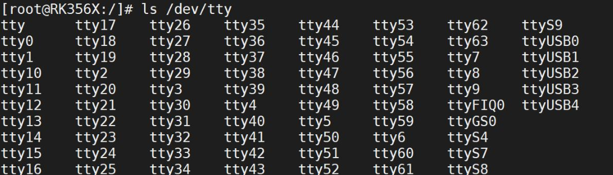

- **dev/ttyX（X 是一个数字编号，譬如 0、1、2、3 等）设备节点**：tty 是 teletype 的简称，在 Linux 中，`/dev/ttyX` 代表的都是本地终端， Linux 内核在初始化时所生成的 63 个本地终端，包括`/dev/tty1`~`/dev/tty63` 一共 63 个本地终端，可以是连接到开发板的 LCD 显示器、键盘和鼠标等。

- **串口终端设备节点**：从开发板原理图可以了解到，在 iTOP-3568 开发板上有四个串口，分别 UART2、UART4、UART7、UART9，其中 UART2 为串口调试终端，对应的设备节点为`/dev/ttyFIQ0`,其他三个串口 UART4、UART7、UART9 分别对应`/dev/ttyS4`、`/dev/ttyS7`、`/dev/ttyS9`。

- **基于 USB 的虚拟串口**：`ttyGS0` 以及 `ttyUSBX`（X 是一个数字编号，譬如 0、1、2、3 等）都是 USB 的虚拟串口，其中 ttyGS0 为烧写 usb 虚拟出的串口，在系统启动之后可以在 windows 终端通过“adb shell”命令进入开发板控制台。ttyUSBX 在这里为 4G 模块的虚拟串口。

## struct termios 结构体

`struct termios` 是 Linux 内核中用于描述终端设备（包括串口设备）参数的结构体。

它定义在 `<linux/termios.h>` 头文件中，包含了多个字段，用于配置和管理终端设备的属性和行为，包括了输入输出波特率、数据位、校验位、停止位等。其定义如下：

```c
struct termios {
	tcflag_t c_iflag; // 输入模式标志
	tcflag_t c_oflag; // 输出模式标志
	tcflag_t c_cflag; // 控制模式标志
	tcflag_t c_lflag; // 本地模式标志
	cc_t c_cc[NCCS]; // 控制字符数组
};
```

下面是 struct termios 结构体的一些重要字段：


- `tcflag_t c_iflag`：该字段包含了输入模式标志，用于配置终端设备的输入行为，如输入控制字符、输入数据处理等。
- `tcflag_t c_oflag`：该字段包含了输出模式标志，用于配置终端设备的输出行为，如输出数据处理、输出控制字符等。
- `tcflag_t c_cflag`：该字段包含了控制模式标志，用于配置终端设备的控制参数，如波特率、数据位数、停止位数、校验位等。
- `tcflag_t c_lflag`：该字段包含了本地模式标志，用于配置终端设备的本地操作以及输入输出行为。
- `cc_t c_cc[NCCS]`：该字段包含了特殊控制字符数组，用于配置终端设备的控制字符，如终端的擦除字符、结束字符、停止字符等。

### 输入模式

输入模式设置

| 成员   | 对应成员的含义                                      |
| ------ | --------------------------------------------------- |
| IGNBRK | 忽略输入终止条件                                    |
| BRKINT | 当检测到输入终止条件时发送 SIGINT 信号              |
| IGNPAR | 忽略帧错误和奇偶校验错误                            |
| PARMRK | 对奇偶校验错误做出标记                              |
| INPCK  | 对接收到的数据执行奇偶校验                          |
| ISTRIP | 将所有接收到的数据裁剪为 7 比特位、也就是去除第八位 |
| INLCR  | 将接收到的 NL（换行符）转换为 CR（回车符）          |
| IGNCR  | 忽略接收到的 CR（回车符）                           |
| ICRNL  | 将接收到的 CR（回车符）转换为 NL（换行符）          |
| IUCLC  | 将接收到的大写字符映射为小写字符                    |
| IXON   | 启动输出软件流控                                    |

### 输出模式

输出模式控制输出字符的处理方式，即由应用程序发送出去的字符数据在传递到串口或屏幕之前是如何处理的。可用于 `c_oflag` 成员的宏如下所示：

| 成员   | 对应成员的含义                                              |
| ------ | ----------------------------------------------------------- |
| OPOST  | 启用输出处理功能，如果不设置该标志则其他标志都被忽略        |
| OLCUC  | 将输出字符中的大写字符转换成小写字符                        |
| ONLCR  | 将输出中的换行符（NL '\n'）转换成回车符（CR '\r'）          |
| OCRNL  | 将输出中的回车符（CR '\r'）转换成换行符（NL '\n'）          |
| ONOCR  | 在第 0 列不输出回车符（CR）                                 |
| ONLRET | 不输出回车符                                                |
| OFILL  | 发送填充字符以提供延时                                      |
| OFDEL  | 如果设置该标志，则表示填充字符为 DEL 字符，否则为 NULL 字符 |

### 控制模式

在这个结构体中，最重要的 `c_cflag`，可以控制模式控制终端设备的硬件特性，譬如对于串口来说，该字段比较重要，可设置串口波特率、数据位、校验位、停止位等硬件特性。通过设置 `struct termios` 结构中 `c_cflag` 成员的标志对控制模式进行配置。可用于 `c_cflag` 成员的标志如下所示：

#### **波特率（Baud Rate）位掩码**

| 常量名称 | 含义                 |
| -------- | -------------------- |
| B0       | 0 波特率（放弃 DTR） |
| B1800    | 1800 波特率          |
| B2400    | 2400 波特率          |
| B4800    | 4800 波特率          |
| B9600    | 9600 波特率          |
| B19200   | 19200 波特率         |
| B38400   | 38400 波特率         |
| B57600   | 57600 波特率         |
| B115200  | 115200 波特率        |

#### **数据位（Data Bits）位掩码**

| 常量名称 | 含义       |
| -------- | ---------- |
| CS5      | 5 个数据位 |
| CS6      | 6 个数据位 |
| CS7      | 7 个数据位 |
| CS8      | 8 个数据位 |

#### **停止位（Stop Bits）位掩码**

| 常量名称 | 含义                              |
| -------- | --------------------------------- |
| CSTOPB   | 2 个停止位（不设则是 1 个停止位） |

#### **其他控制标志**

| 常量名称    | 含义                         |
| ----------- | ---------------------------- |
| CREAD       | 接收使能                     |
| PARENB      | 校验位使能                   |
| PARODD      | 使用奇校验而不使用偶校验     |
| HUPCL       | 最后关闭时挂线（放弃 DTR）   |
| CLOCAL      | 本地连接（不改变端口所有者） |
| LOBLK       | 块作业控制输出               |
| CNET_CTSRTS | 硬件流控制使能               |


### 本地模式

本地模式用于控制终端的本地数据处理和工作模式。通过设置 `struct termios` 结构体中`c_lflag` 成员的标 志对本地模式进行配置。可用于 `c_lflag` 成员的标志如下所示：

| 常量名称   | 含义说明                                                     |
| ---------- | ------------------------------------------------------------ |
| **INPCK**  | 启用奇偶校验功能。当启用时，系统会检查接收到的数据是否有奇偶校验错误。 |
| **IGNPAR** | 忽略奇偶校验错误。即使检测到校验错误，也不丢弃数据或产生异常。 |
| **PARMRK** | 当发生奇偶校验错误时，标记该字符（通常在前面插入 `\033` 和 `\000`）。用于调试。 |
| **ISTRIP** | 将所有接收到的数据字节的第8位（最高位）清零，即只保留低7位（用于7位字符集）。 |
| **IXON**   | 启动**输出软件流控**（XON/XOFF）。当缓冲区满时，发送 XOFF（^S）暂停发送；空闲时发送 XON（^Q）恢复。 |
| **IXOFF**  | 启动**输入软件流控**。允许设备在接收端主动发送 XON/XOFF 控制字符来控制发送方。 |
| **IXANY**  | 允许任意字符（不仅仅是 XON）触发流控重启。默认情况下只有 XON 才能重启传输。 |
| **IGNBRK** | 忽略中断条件（Break Condition）。即忽略线路中断信号（如长时间低电平）。 |
| **BRKINT** | 当检测到中断（Break）时，向进程发送 `SIGINT` 信号（通常用于中断程序执行）。 |
| **INLCR**  | 将输入中的换行符（NL, `\n`）转换为回车符（CR, `\r`）。常见于某些旧式终端。 |
| **IGNCR**  | 忽略输入中的回车符（CR, `\r`），不作任何处理。               |
| **ICRNL**  | 将输入中的回车符（CR, `\r`）转换为换行符（NL, `\n`）。这是常见的行末处理方式。 |
| **ICANON** | 启用“规范模式”（Canonical Mode）。在此模式下，输入按行处理（以换行符结束），支持编辑（如退格、删除）、回显等功能。关闭后进入“原始模式” |

### 特殊控制字符

特殊控制字符是一些字符组合，如 Ctrl+C、Ctrl+Z 等，当用户键入这样的组合键，终端会采取特殊处理方式。`struct termios` 结构体中 `c_cc` 数组将各种特殊字符映射到对应的支持函数。每个字符位置（数组下标）由对应的宏定义的，如下所示

| 常量名     | 功能       | 默认键    | 使用场景           |
| ---------- | ---------- | --------- | ------------------ |
| **VKILL**  | 删除整行   | Ctrl+U    | 编辑长命令         |
| **VEOF**   | 文件结束   | Ctrl+D    | 提交输入或关闭     |
| **VEOL**   | 行尾标记   | CR        | 兼容旧终端         |
| **VEOL2**  | 第二行尾   | LF        | 多种换行格式       |
| **VMIN**   | 最小字符数 | -         | 非规范模式读取控制 |
| **VTIME**  | 超时时间   | -         | 非规范模式读取控制 |
| **VINTR**  | 中断       | Ctrl+C    | 终止程序           |
| **VQUIT**  | 暂停       | Ctrl+Z    | 挂起进程           |
| **VERASE** | 删除字符   | Backspace | 单字符编辑         |

## 常用串口控制函数

### tcgetattr()

**功能**：获取当前终端（或串口设备）的属性配置。
**原型**：

```c
#include <termios.h>
int tcgetattr(int fd, struct termios *termios_p);
```

- **参数**：
  - `fd`：文件描述符（如打开的串口 `/dev/ttyS0`）
  - `termios_p`：指向 `struct termios` 的指针，用于存储当前配置
- **返回值**：成功返回 0，失败返回 -1
- **用途**：读取当前串口的波特率、数据位、校验位、流控、输入/输出模式等设置。

> 通常在修改串口前先调用此函数保存原始配置，以便程序退出时恢复。

------

### tcsetattr()

**功能**：设置终端（或串口）的属性配置。
**原型**：

```c
int tcsetattr(int fd, int optional_actions, const struct termios *termios_p);
```

- **参数**：
  - `fd`：文件描述符
  - `optional_actions`：指定何时应用新设置，常见值：
    - `TCSANOW`：立即生效
    - `TCSADRAIN`：等待输出完成后再生效（常用于输出相关设置）
    - `TCSAFLUSH`：清空输入/输出缓冲区后立即生效
  - `termios_p`：包含新配置的 `struct termios` 指针
- **返回值**：成功返回 0，失败返回 -1
- **用途**：应用新的串口参数（如波特率、8N1 配置、原始模式等）

> ⚠️ 修改后建议检查返回值，确保设置成功。

------

### cfgetispeed() 和 cfgetospeed()

**功能**：分别获取输入（接收）和输出（发送）波特率。
**原型**：

```c
speed_t cfgetispeed(const struct termios *termios_p);
speed_t cfgetospeed(const struct termios *termios_p);
```

- **返回值**：波特率常量（如 `B9600`, `B115200`），不是实际数值（如 9600）
- **注意**：返回的是 `speed_t` 类型的**掩码值**，不能直接当作整数使用

> 实际波特率需通过查表或系统特定方式转换（某些系统提供 `cfmakeraw()` 或 `ioctl` 获取真实速率）。

------

### cfsetispeed()和 cfsetospeed()

**功能**：分别设置输入和输出波特率。

**原型**：

```c
int cfsetispeed(struct termios *termios_p, speed_t speed);
int cfsetospeed(struct termios *termios_p, speed_t speed);
```

- **参数**：

  - `termios_p`：指向要修改的 `termios` 结构
  - `speed`：波特率常量（如 `B9600`, `B115200`）

- **返回值**：成功返回 0，失败返回 -1

- **典型用法**：

  ```c
  struct termios tty;
  tcgetattr(fd, &tty);
  cfsetospeed(&tty, B115200);
  cfsetispeed(&tty, B115200);
  tcsetattr(fd, TCSANOW, &tty);
  ```

> 通常收发波特率设为相同（全双工通信），除非特殊需求。

------

### tcflush() 和 tcflow()

#### tcflush()

**功能**：清空终端的输入或输出队列。
**原型**：

```c
int tcflush(int fd, int queue_selector);
```

- **`queue_selector` 取值**：
  - `TCIFLUSH`：清空**输入队列**（已收到但未读取的数据）
  - `TCOFLUSH`：清空**输出队列**（待发送但未发出的数据）
  - `TCIOFLUSH`：同时清空输入和输出队列
- **用途**：在重新配置串口或重启通信前清除脏数据。

#### tcflow()

**功能**：控制串口的数据流（暂停/恢复传输）。
**原型**：

```c
int tcflow(int fd, int action);
```

- **`action` 取值**：
  - `TCOOFF`：暂停**输出**（发送端停止发送）
  - `TCOON`：恢复**输出**
  - `TCIOFF`：暂停**输入**（向对端发送 XOFF，要求对方暂停）
  - `TCION`：恢复**输入**（向对端发送 XON，允许继续发送）
- **用途**：手动实现软件流控（XON/XOFF），或应对缓冲区溢出。

> 💡 注意：`tcflow()` 依赖 `IXON/IXOFF` 标志是否启用。

## 串口操作流程

### 设置串口的波特率

在编写串口应用程序时，设置串口波特率是必须的步骤之一，它决定了数据传输的速率。

在 Linux 中，设置波特率通常使用 cfsetspeed() 函数，cfsetspeed()函数所需头文件和函数原型如下所示：

```c
#include <termios.h>
#include <unistd.h>
int cfsetspeed(struct termios *termios_p, speed_t speed);
```

它接受一个 `struct termios` 结构体作为输入参数，同时返回一个整数值，表示操作是否成功。

该函数实际上是对 `c_cflag` 字段中的波特率进行设置。例如，如果要将波特率设置为115200，可以调用以下代码:

```c
struct termios options;
// 获取当前终端配置
tcgetattr(fd, &options);
// 设置波特率为 115200
cfsetspeed(&options, B115200);
// 将新的终端配置写入终端
tcsetattr(fd, TCSANOW, &options);
```

需要注意以下几点：

- 需要先打开串口设备文件并且获取串口的属性，包括波特率在内的其他属性。可以使用 `tcgetattr()` 函数获取属性值，并存储在一个 `termios` 结构体变量中。
- 设置波特率时需要调用 `cfsetspeed()` 函数，并传入一个波特率常量作为参数。常用的波特率常量包括 B9600、B115200 等。这些常量可以在头文件 `termios.h` 中找到。
- 设置完成后，需要使用 `tcsetattr()` 函数将属性值写回到串口设备中。


### 设置数据位大小

在串口通讯中，数据位指的是每个字符（byte）中实际包含的数据位数。通常情况下，一个字符包含 8 个位（即 8 个 0 或 1），但有时也可能为 7 个位或其他值。

在编写串口应用程序时，需要使用 `struct termios` 结构体中的 `c_cflag` 成员变量来设置数据位大小。具体来说，需要将 `c_cflag` 成员变量中与数据位相关的位清零，然后再根据需要设置相应的值。

清零操作通常使用按位与（&）运算符和位运算中的“非”运算符（~），具体步骤如下：

```c
new_cfg.c_cflag &= ~CSIZE; // 将数据位相关的比特位清零
```

其中，CSIZE 是一个宏定义，表示数据位的位掩码。宏定义通常定义在 `termios.h` 头文件中，其取值如下：

```c
#define CSIZE 0x00000300 /* 字符长度掩码 */
```

通过清零操作，将数据位相关的位全部置为 0。接下来，可以使用按位或（|）运算符和宏定义来设置具体的数据位数，例如：

```c
new_cfg.c_cflag |= CS8; // 将数据位数设置为 8 位
```

此时，CS8 宏定义将会被解释为一个包含 8 位的位掩码，通过按位或运算，将其设置到 `c_cflag` 成员变量中，从而完成数据位的设置。

### 设置奇偶校验位


串口的奇偶校验位配置一共涉及到 `struct termios` 结构体中的两个成员变量：`c_cflag` 和`c_iflag`。

首先对于 `c_cflag` 成员，需要添加 `PARENB` 标志以使能串口的奇偶校验功能，只有使能奇偶校验功能之后才会对输出数据产生校验位，从而对输入数据进行校验检查；

同时对于`c_iflag` 成员来说，还需要添加 `INPCK` 标志，这样才能对接收到的数据执行奇偶校验，代码如下所示：

#### 奇校验使能

```c
new_cfg.c_cflag |= (PARODD | PARENB); // 设置为奇校验
new_cfg.c_iflag |= INPCK; // 使能奇偶校验
```

#### 偶校验使能

```c
new_cfg.c_cflag &= ~PARODD; // 设置为偶校验
new_cfg.c_cflag |= PARENB; // 使能奇偶校验
new_cfg.c_iflag |= INPCK; // 对输入数据执行奇偶校验
```

#### 无校验

```c
new_cfg.c_cflag &= ~PARENB; // 禁用奇偶校验
new_cfg.c_iflag &= ~INPCK; // 不执行奇偶校验
```


### 设置停止位

在串口通信中，停止位用于指定每个数据帧的结束位置。

在传输一个完整的数据字节后，通常需要一个或多个停止位，以便接收端能够确定一个数据帧的结束。

停止位的数量通常为 1位或 2 位，其中 1 位停止位被广泛使用，而 2 位停止位则较少使用。

在 Linux 中，通过在 `struct termios` 结构体中设置 `c_cflag` 成员变量的 `CSTOPB` 标志位来控制停止位的数量。当 `CSTOPB` 为 0 时，仅使用 1 位停止位；当 `CSTOPB` 为 1 时，则使用 2位停止位。

例如，以下代码将串口的停止位设置为 1 位：

```c
new_cfg.c_cflag &= ~CSTOPB; // 设置停止位为 1 位
```


### 示例


```c
#include <stdio.h>
#include <termios.h>
#include <string.h>
#include <fcntl.h>
#include <unistd.h>

/* 设置串口参数的函数 */
int set_uart(int fd, int speed, int bits, char check, int stop) {
    struct termios newtio, oldtio;

    // 步骤一：保存原来的串口配置
    if(tcgetattr(fd, &oldtio) != 0) {
        printf("tcgetattr oldtio error\n");
        return -1;
    }

    bzero(&newtio, sizeof(newtio));
    
    // 步骤二：设置控制模式标志
    newtio.c_cflag |= CLOCAL | CREAD;
    newtio.c_cflag &= ~CSIZE;

    // 步骤三：设置数据位
    switch(bits) {
        case 7:
            newtio.c_cflag |= CS7;
            break;
        case 8:
            newtio.c_cflag |= CS8;
            break;
    }
    
    // 步骤四：设置奇偶校验位
    switch(check) {
        case 'O': // 偶校验位
            newtio.c_cflag |= PARENB;
            newtio.c_cflag |= PARODD;
            newtio.c_iflag |= (INPCK | ISTRIP);
            break;
        case 'E': // 奇校验位
            newtio.c_cflag |= PARENB;
            newtio.c_cflag &= ~PARODD;
            newtio.c_iflag |= (INPCK | ISTRIP);
            break;
        case 'N': // 无校验
            newtio.c_cflag &= ~PARENB;
            break;
    }
    
    // 步骤五：设置波特率
    switch(speed) {
        case 9600:
            cfsetispeed(&newtio, B9600);
            cfsetospeed(&newtio, B9600);
            break;
        case 115200:
            cfsetispeed(&newtio, B115200);
            cfsetospeed(&newtio, B115200);
            break;
    }
    
    // 步骤六：设置停止位
    switch(stop) {
        case 1:
            newtio.c_cflag &= ~CSTOPB; // 1位停止位
            break;
        case 2:
            newtio.c_cflag |= CSTOPB; // 2位停止位
            break;
    }
    
    // 步骤七：刷新输入队列
    tcflush(fd, TCIFLUSH);
    
    // 步骤八：设置配置立刻生效
    if (tcsetattr(fd, TCSANOW, &newtio) != 0) {
        printf("tcsetattr newtio error\n");
        return -2;
    }
    
    return 0;
}

int main(int argc, char *argv[]) {
    int fd;
    char buf[128];
    int count;
    
    // 步骤九：打开串口设备
    fd = open("/dev/ttyS9", O_RDWR | O_NOCTTY | O_NDELAY);
    
    if (fd < 0) {
        printf("open error \n");
        return -1;
    }

    // 设置串口参数
    set_uart(fd, 115200, 8, 'N', 1);
    
    // 写入数据
    write(fd, argv[1], strlen(argv[1]));
    sleep(1);
    
    // 读取数据
    count = read(fd, buf, sizeof(buf));
    buf[count] = '\0';
    
    // 输出读取的数据
    printf("read message is %s\n", buf);
    
    // 关闭串口设备
    close(fd);
    
    return 0;
}

```

# GPS模块编程

全球卫星导航系统是一种利用卫星技术为全球用户提供精确时间和位置信息的系统。

定位模块往往和 CPU 通过串口相连，然后 CPU 通过 wifi 蓝牙等其他方式将坐标进行上传。


GPS模块原理图如下

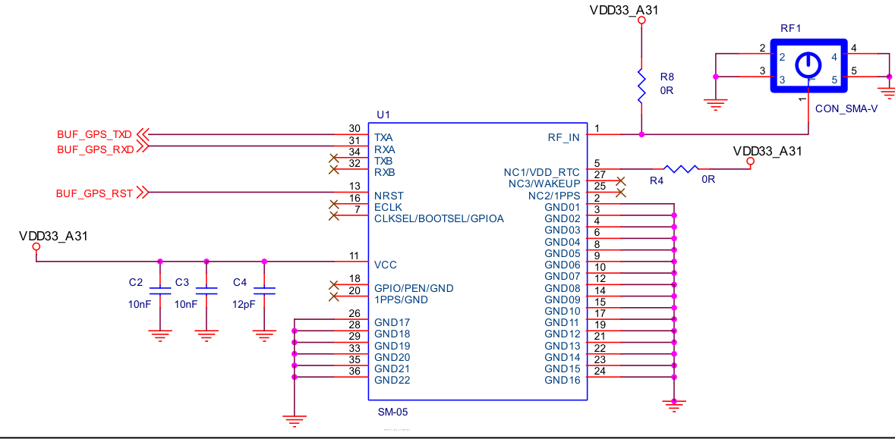


其中 `BUF_GPS_RST` 接口悬空不接，以下为 20pin 底座连接到 RK3568 开发板 GPIO 接口连接表如下所示：

| GPS 模块引脚编号 | GPS 模块引脚名称 | 连接到的开发板引脚编号 | 连接到的开发板引脚名称 |
| ---------------- | ---------------- | ---------------------- | ---------------------- |
| 2                | BUF_GPS_TXD      | 8                      | UART9_RX_M1            |
| 3                | BUF_GPS_RXD      | 6                      | UART9_TX_M1            |
| 11               | GND              | 19/20                  | GND                    |
| 19               | VDD33_A31        | 2/4                    | VCC3V3_SYS             |

>  GPS 模块连接好之后，天线要放到户外


## GPS 数据帧介绍

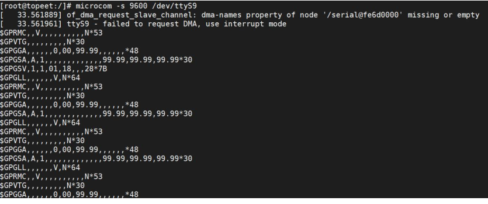

这里列举的是 GPS NMEA 格式中常见的数据类型，其中包括：

- **GPRMC (Recommended Minimum Specific GPS/Transit data)**：GPRMC 数据类型提供了位置、速度、航向等最基本的 GPS 定位信息。这个数据类型常用于导航系统和船舶自动导航系统。
- **GPVTG (Track Made Good and Ground Speed)**：GPVTG 数据类型提供了航向角和地面速度信息，用于显示船、车等运动物体的导航信息。 它提供了地面航向角和相对地面的速度。
- **GPGGA (Global Positioning System Fix Data)**：GPGGA 数据类型包括了定位解、时间、位置准确度、海拔等位置信息，通常被用于接收机实时显示当前位置。
- **GPGSA (GPS DOP and Active Satellites)**：GPGSA 数据类型包括了 DOP 值和当前卫星定位状态。它用于提供 GPS 卫星测量数据中可用卫星数量、解算出的位置几何因子 DOP 等信息。
- **GPGSV (GPS Satellites in View)**：GPGSV 数据类型提供了现时可视卫星的信息，包括卫星的PRN、仰角、方位角、信号强度等信息。这些信息有助于接收器找到更多卫星并提高位置定位的准确性。
- **GPGLL (Geographic Position - Latitude/Longitude)**：GPGLL 数据类型提供了经度和纬度信息，用于描述接收机的当前经纬度位置。


我们只需要关注 GPRMC 这条信息即可，如下图所示：

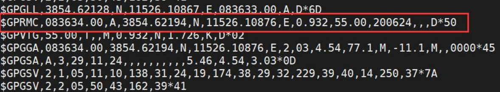

GPRMC（Recommended Minimum Specific GNSS Data）是一种常见的 GPS 数据帧格式，用于在 GPS 设备之间或者 GPS 设备与其他设备之间传输 GPS 位置信息。以下是 GPRMC 数据帧中包含的信息：

| 字段编号 | 字段值（示例） | 含义           | 详细解释                                                     |
| -------- | -------------- | -------------- | ------------------------------------------------------------ |
| 0        | `$GPRMC`       | 消息 ID        | 表示这是“推荐最小定位信息”帧。`GP` 表示由 GPS 系统提供；其他系统如 GLONASS 用 `GL`，北斗用 `BD` 或 `GB`。 |
| 1        | `083634.00`    | UTC 时间       | 格式：`hhmmss.sss` 表示 **08:36:34.000 UTC** → 北京时间 = UTC + 8 小时 → **16:36:34（下午 4 点 36 分）** |
| 2        | `A`            | 状态指示       | - `A`：**有效定位**（Active / Valid） - `V`：**无效定位**（Void / Invalid），可能因信号弱或未锁定卫星 |
| 3        | `3854.62194`   | 纬度（数值）   | 格式：`ddmm.mmmm` 即 **38°54.62194′** 转换为十进制度： `38 + 54.62194/60 ≈ 38.910366° N` |
| 4        | `N`            | 纬度半球       | - `N`：北纬（North） - `S`：南纬（South）                    |
| 5        | `11526.10876`  | 经度（数值）   | 格式：`dddmm.mmmm` 即 **115°26.10876′** 转换为十进制度： `115 + 26.10876/60 ≈ 115.435146° E` |
| 6        | `E`            | 经度半球       | - `E`：东经（East） - `W`：西经（West）                      |
| 7        | `0.932`        | 地面速率（节） | 单位：**knots（节）** 1 节 = 1 海里/小时 ≈ 1.852 km/h → `0.932 × 1.852 ≈ 1.73 km/h`（步行速度） |
| 8        | `55.00`        | 地面航向       | 单位：**度（°）**，以**真北为 0°** 范围：0.0 ~ 359.9° 55° 表示东北方向 |
| 9        | `200624`       | UTC 日期       | 格式：`ddmmyy` → **2024 年 6 月 20 日**                      |
| 10       | （空）         | 磁偏角         | 可选字段，表示磁北与真北之间的夹角（单位：度）               |
| 11       | （空）         | 磁偏角方向     | `E` 或 `W`，配合字段 10 使用                                 |
| 12       | （空）         | 定位模式       | - `A`：自主定位（Autonomous） - `D`：差分定位（DGPS） - `E`：估算（Dead Reckoning） - `N`：无定位 （注：部分模块在此字段输出，有些放在 `$GPGSA` 中） |
| 13       | `D*50`         | 校验和         | 从 `$` 后第一个字符到 `*` 前所有字符做 **异或（XOR）校验** 用于验证数据完整性 |

## 示例

### gps.h

```c
#ifndef __GPS_H__
#define __GPS_H__

// 定义结构体 gprmc_data，用于存储解析后的 GPS 数据
struct gprmc_data {
    char id;         // 数据标识（未使用）
    int time;      // UTC 时间（hhmmss.sss 格式）
    char state;      // 状态指示（A=有效，V=无效）
    float latitude;  // 纬度（ddmm.mmmm 格式）
    char NS;         // 纬度半球（N=北半球，S=南半球）
    float longitude; // 经度（dddmm.mmmm 格式）
    char EW;         // 经度半球（E=东经，W=西经）
    float speed;     // 地面速率（节）
    int date;        // UTC 日期（ddmmyy 格式）
    char mode;       // 模式指示（A=自主定位，D=差分定位）
    char check;      // 校验位（未使用）
};

// 声明函数原型：设置串口参数
extern int set_uart(int fd, int speed, int bits, char check, int stop);

// 声明函数原型：解析 GPS 数据
extern void get_gps_data(char *buff, struct gprmc_data *gps_data);

#endif

```

### gps.c

```c
#include <stdio.h>
#include <termios.h>
#include <string.h>
#include <sys/types.h>
#include <sys/stat.h>
#include <fcntl.h>
#include <unistd.h>
#include "gps.h"

// 函数：get_gps_data
// 描述：从数据缓冲区解析GPS数据，并填充到结构体中
// 参数：
//   - buff: 指向包含GPS数据的缓冲区的指针
//   - gps_data: 指向结构体 gprmc_data 的指针，用于存储解析后的GPS数据
// 返回值：无
void get_gps_data(char *buff, struct gprmc_data *gps_data) {
    char *p=NULL;
    // 在缓冲区中查找以 "$GPRMC" 开头的位置
    p = strstr(buff, "$GPRMC");
    if (p == NULL) {
       // printf("Error: $GPRMC not found in buffer.\n");
        return;  // 如果未找到 "$GPRMC"，直接返回
    }
    // 使用 sscanf 函数从字符串 p 开始按指定格式解析数据，并存储到 gps_data 结构体中对应的成员变量中
    sscanf(p,"$GPRMC,%d.00,%c,%f,%c,%f,%c,%f,,%d,,,%c,%*c",\
    &(gps_data->time),\
    &(gps_data->state),\
    &(gps_data->latitude),\
    &(gps_data->NS),\
    &(gps_data->longitude),\
    &(gps_data->EW),\
    &(gps_data->speed),\
    &(gps_data->date),\
    &(gps_data->mode));
    

    // 打印解析后的部分 GPS 数据，用于验证解析是否正确（可选）
    printf("state:%c, %c:%f, %c:%f\n", gps_data->state, gps_data->NS,
           gps_data->latitude, gps_data->EW, gps_data->longitude);

}
```

### uart.c

```c
#include <stdio.h>
#include <termios.h>
#include <string.h>
#include <fcntl.h>
#include <unistd.h>

/* 设置串口参数的函数 */
int set_uart(int fd, int speed, int bits, char check, int stop) {
    struct termios newtio, oldtio;
    
    // 步骤一：保存原来的串口配置
    if(tcgetattr(fd, &oldtio) != 0) {
        printf("tcgetattr oldtio error\n");
        return -1;
    }

    bzero(&newtio, sizeof(newtio));
    
    // 步骤二：设置控制模式标志
    newtio.c_cflag |= CLOCAL | CREAD;
    newtio.c_cflag &= ~CSIZE;

    // 步骤三：设置数据位
    switch(bits) {
        case 7:
            newtio.c_cflag |= CS7;
            break;
        case 8:
            newtio.c_cflag |= CS8;
            break;
    }
    
    // 步骤四：设置奇偶校验位
    switch(check) {
        case 'O': // 偶校验位
            newtio.c_cflag |= PARENB;
            newtio.c_cflag |= PARODD;
            newtio.c_iflag |= (INPCK | ISTRIP);
            break;
        case 'E': // 奇校验位
            newtio.c_cflag |= PARENB;
            newtio.c_cflag &= ~PARODD;
            newtio.c_iflag |= (INPCK | ISTRIP);
            break;
        case 'N': // 无校验
            newtio.c_cflag &= ~PARENB;
            break;
    }
    
    // 步骤五：设置波特率
    switch(speed) {
        case 9600:
            cfsetispeed(&newtio, B9600);
            cfsetospeed(&newtio, B9600);
            break;
        case 115200:
            cfsetispeed(&newtio, B115200);
            cfsetospeed(&newtio, B115200);
            break;
    }
    
    // 步骤六：设置停止位
    switch(stop) {
        case 1:
            newtio.c_cflag &= ~CSTOPB; // 1位停止位
            break;
        case 2:
            newtio.c_cflag |= CSTOPB; // 2位停止位
            break;
    }
    
    // 步骤七：刷新输入队列
    tcflush(fd, TCIFLUSH);
    
    // 步骤八：设置配置立刻生效
    if (tcsetattr(fd, TCSANOW, &newtio) != 0) {
        printf("tcsetattr newtio error\n");
        return -2;
    }
    
    return 0;
}
```

