# PWM基础

**PWM** 全称为 **Pulse Width Modulation**，翻译成中文为脉冲宽度调制，它是一种数字信号控制模拟电路的技术，可以通过改变高/低电平的占空比来控制平均电压或功率,从而达到对模拟量的控制目的。

PWM 信号由一个矩形波组成,它包括高电平时间和低电平时间，PWM 信号可以由周期和占空比两个单位进行描述，两个单位的具体描述如下所示：

- **周期(T)**：指一个完整的高低电平循环所需要的时间,而频率为周期的倒数，指在 1 秒钟有多少个周期，单位为 Hz，例如一个周期是 20ms，那么一秒钟就有 50 次 PWM 周期。
- **占空比(Duty Cycle)**：是指高电平时间与周期的比例,通常以百分比表示，例如周期为 20ms，高电平所占的时间为 10ms，那占空比就是 50%。

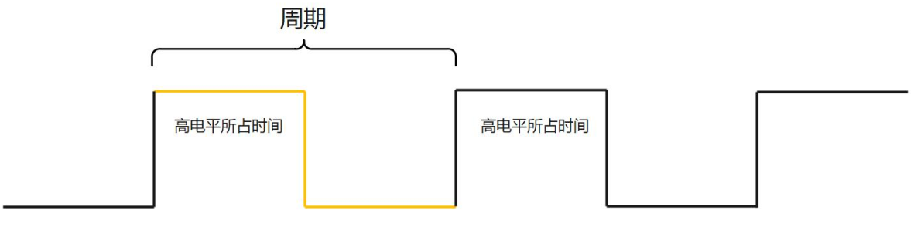


## 面积等效原理

面积等效原理的定义为即使脉冲信号的宽度和幅度不同,只要它们的面积(脉冲宽度 × 脉冲幅度)相同,**对于惯性环节的响应**也是基本一致的，如下图所示


例如：RK3568 IO 口高电平为 3.3V,低电平为 0V。如果我们想要输出不同的模拟电压,就可以利用 PWM 的面积等效原理技术来实现，通过改变 PWM 信号的占空比,可以调节输出信号的平均电压。

- 当占空比为 50%时,高电平时间和低电平时间相等,平均输出电压为 1.65V (3.3V × 50%)。

- 占空比为 75%时,高电平时间占总周期的 75%,平均输出电压为 2.47V (3.3V × 75%)。


而除了对电压的控制之外，PWM 还有着以下的工作场景：

- 电机控制:控制电机转速和转矩。
- 照明控制:控制 LED 亮度。
- 信号调制:用于无线电通讯中的调制。

## iTOP-RK3568 PWM 接口

在 RK3568 芯片内置 16 路 PWM 通道,可以独立控制和输出 PWM 波形。并支持中断驱动,可以灵活响应中断事件。

- PWM 通道采用可编程的预分频器,可以先对总线时钟进行分频,然后再进行二次分频。
- PWM 通道内置了 32 位的定时/计数器功能。
- PWM 通道支持捕获模式,可以捕获外部输入信号的脉冲宽度等信息。
- PWM 通道支持连续输出模式和一次性输出模式。
- PWM 通道提供参考模式,可以输出各种占空比的波形。
- PWM3、PWM7、PWM11 和 PWM15 这 4 路 PWM 通道经过优化,特别适用于红外应用。

上面的 16 路 PWM 都属于硬件 PWM，即由专门的 PWM 硬件模块来实现 PWM 输出，关于硬件 PWM 的介绍如下所示：

**硬件 PWM**:

1. **实现方式**：硬件 PWM 是由专门的 PWM 硬件模块实现 PWM 输出的方式。
2. **优点**:
   - CPU 占用低,PWM 输出由硬件模块自动完成,无需 CPU 介入。
   - PWM 输出频率和分辨率高,可以达到高达 MHz 级的频率和 ns 级的分辨率。
   - 输出波形稳定可靠,不易受 CPU 负载的影响。
3. **缺点**:
   - 需要专门的硬件 PWM 模块,成本较高。
   - PWM 输出引脚受限,只能在预定义的引脚上输出。

iTOP-RK3568 关于硬件 PWM 引脚复用功能表如下所示，可以根据该表格对 PWM 进行选用：

| PWM 接口 | pinctrl function | 网络标号                 | 对应的 GPIO | 功能                  |
| -------- | ---------------- | ------------------------ | ----------- | --------------------- |
| PWM0     | PWM0_M0          | Working_LEDEN_H_GPIO0_B7 | GPIO0_B7    | LED 灯控制引脚        |
|          | PWM0_M1          | LCD0_PWREN_H_GPIO0_C7    | GPIO0_C7    | LVDS 屏幕供电使能引脚 |
| PWM1     | PWM1_M0          | VGA_HPDIN_GPIO0_C0       | GPIO0_C0    | VGA 热插拔判断引脚    |
|          | PWM1_M1          | PCIE20_WAKEN_M0          | GPIO0_B5    | PCIE2.0 唤醒          |
| PWM2     | PWM2_M0          | PCIE20_PERSTn_GPIO0_C1   | GPIO0_C1    | PCIE2.0 复位引脚      |
|          | PWM2_M1          | TP_RST_L_GPIO0_B6        | GPIO0_B6    | MIPI 触摸屏复位引脚   |
| PWM3_IR  | PWM3_IR          | PWM3_IR                  | GPIO0_C2    | 红外接收头            |
| PWM4     | PWM4             | LCD0_BL_PWM4             | GPIO0_C3    | LVDS 屏幕背光         |
| PWM5     | PWM5             | LCD1_BL_PWM5             | GPIO0_C4    | MIPI 屏幕背光         |
| PWM6     | PWM6             | PWM_FAN                  | GPIO0_C5    | 散热风扇转速调节      |
| PWM7_IR  | PWM7_IR          | RS485_DIR_GPIO0_C6       | GPIO0_C6    | 485 收发控制引脚      |
| PWM8     | PWM8_M0          | UART4_RX_M1              | GPIO3_B1    | 串口 4 接收引脚       |
|          | PWM8_M1          | SDMWC0_D0                | GPIO1_D5    | SD 卡数据线           |
| PWM9     | PWM9_M0          | UART4_TX_M1              | GPIO3_B2    | 串口 4 发送引脚       |
|          | PWM9_M1          | SDMWC0_D1                | GPIO1_D5    | SD 卡数据线           |
| PWM10    | PWM10_M0         | GPIO3_B5                 | GPIO3_B5    | 未使用                |
|          | PWM10_M1         | SDMWC0_CMD               | GPIO2_A1    | SD 卡 CMD 引脚        |
| PWM11    | PWM11_IR_M0      | GPIO3_B6                 | GPIO3_B6    | 未使用                |
|          | PWM11_IR_M1      | CIF_CLKOUT               | GPIO4_C0    | 未使用                |
| PWM12    | PWM12_M0         | GMAC0_RSTn_GPIO3_B7      | GPIO3_B7    | 网卡 0 复位引脚       |
|          | PWM12_M1         | GPIO4_C5                 | GPIO4_C5    | 串口 9 发送引脚       |
| PWM13    | PWM13_M0         | GMAC0_INT/PMEB_GPIO3_C0  | GPIO3_C0    | 网卡 0 中断引脚       |
|          | PWM13_M1         | GPIO4_C6                 | GPIO4_C6    | 串口 9 接收引脚       |
| PWM14    | PWM14_M0         | UART7_TX_M1              | GPIO3_C4    | 串口 7 发送引脚       |
|          | PWM14_M1         | 4G_DISABLE_GPIO4_C2      | GPIO4_C2    | CAN1 RX               |
| PWM15    | PWM15_IR_M0      | UART7_RX_M1              | GPIO3_C5    | 串口 7 接收引脚       |
|          | PWM15_IR_M1      | HDMI_RX_INT_L_GPIO4_C3   | GPIO4_C3    | CAN1 TX               |

而当硬件 PWM 不够用的时候，可以使用 GPIO 来模拟实现 PWM，也可以称之为软件 PWM，关于软件 PWM 的介绍如下所示：

**软件 PWM**:

1. **实现方式**：软件 PWM 是通过软件编程实现 PWM 输出的方式。利用定时器中断或者循环计数的方式,在软件中控制输出引脚的高低电平切换时间,从而生成 PWM 波形。
2. **优点:**
   - 灵活性强,可以在任意 GPIO 引脚上生成 PWM 波形。
   - 成本低,不需要额外的硬件 PWM 模块。
3. **缺点**:
   - CPU 占用较高,因为需要在中断服务程序或者循环中实时控制引脚电平。
   - PWM 输出的频率和分辨率受 CPU 主频和中断响应时间的影响,无法高频高分辨率。
   - 对 CPU 性能和实时性要求较高。

# PWM 子系统框架

PWM 子系统可以划分成三个层次，分别为用户空间、内核空间和硬件层。

内核空间包括 PWM 设备驱动层、PWM 核心层和 PWM 适配器驱动层。

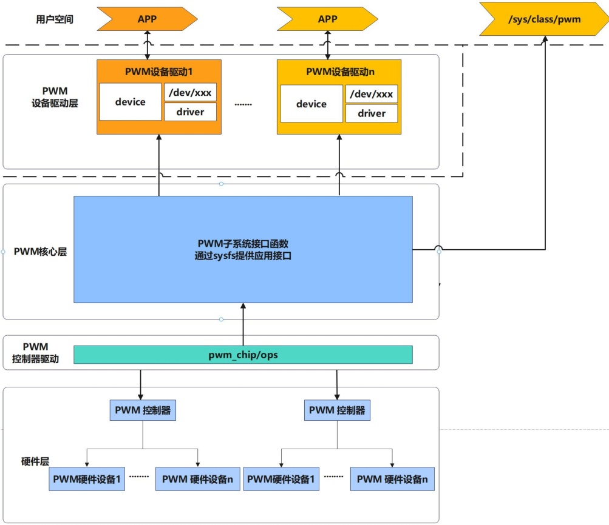

## PWM设备驱动层

PWM 设备驱动层在 Linux 内核中扮演了一个关键的角色,它为上层应用程序提供了一个统一、灵活和高效的 PWM 设备访问接口

- `pwm_device`
  - 代表一个连接到 PWM 总线上的从设备。
  - 包含从设备的 PWM 通道号、所属的 PWM 控制器等信息。
- `pwm_driver`
  - 实现了具体 PWM 设备的驱动程序。
  - 负责 PWM 设备的初始化、配置、启停等操作。
  - 通过 pwm_chip 与 PWM 硬件设备进行交互。
  - 向上层提供标准化的 PWM 设备访问接口。
- `/dev/xxx` 设备节点
  - 为上层应用程序提供 PWM 设备访问的接口
  - 通过打开/读写/控制设备节点,应用程序可以与 PWM 设备进行交互
  - 内核 PWM 子系统负责将应用程序的操作转发到对应的 pwm_chip 驱动

## PWM核心层

PWM 核心层是 Linux 内核中负责管理和控制 PWM 设备的重要组件。它的主要作用如下:

- **PWM 设备管理**
  通过 `struct pwm_device` 统一描述 PWM 设备的信息,如设备名称、所属控制器等。为上层应用程序提供标准化的 PWM 设备访问 API。
- **PWM 参数配置**
  提供 `pwm_config` 接口,用于配置 PWM 设备的工作参数,如周期、占空比、极性等。将上层配置参数转换为底层硬件可以理解的形式,并通过适配器驱动进行设置。
- **PWM 输出控制**
  提供 `pwm_enable` 和 `pwm_disable` 接口,用于控制 PWM 输出的开启和关闭。负责调用适配器驱动程序的相应函数来执行实际的输出控制。
- **PWM sysfs 接口**
  PWM 核心层还提供了一组基于 sysfs 的接口,用于上层应用程序对 PWM 设备进行配置和控制。这些 sysfs 接口包括:
  - `/sys/class/pwm/pwmX/period`: 设置 PWM 周期
  - `/sys/class/pwm/pwmX/duty_cycle`: 设置 PWM 占空比
  - `/sys/class/pwm/pwmX/polarity`: 设置 PWM 极性
  - `/sys/class/pwm/pwmX/enable`: 控制 PWM 输出的开启和关闭

##  PWM控制器驱动层

PWM 控制器驱动层是连接 PWM 硬件和上层 PWM 核心层的关键组件, 它负责对底层 PWM硬件进行抽象化封装, 并适配不同类型的 PWM 设备, 为上层提供标准化的硬件控制接口, 同时还需要处理一些硬件相关的初始化、状态管理和电源管理等任务。

**硬件抽象化**

PWM 适配器驱动层负责对底层 PWM 硬件设备进行抽象化封装。它定义了一组标准化的 `pwm_chip` 接口,包括设备初始化、参数配置、输出控制等功能。

上层 PWM 核心层可以通过调用这些标准接口来间接控制底层 PWM 硬件, 而不需要关注具体的硬件实现细节。

**硬件适配**

PWM适配器驱动程序需要实现 pwm_chip 接口中定义的各个函数,以适配底层PWM硬件的具体工作方式。这些适配函数将上层 PWM 核心层的标准化请求, 转换为底层硬件可以理解的操作指令。

通过这种适配层, PWM 核心层可以无缝地支持不同类型的 PWM 硬件设备。

**硬件初始化**

PWM 适配器驱动程序负责完成 PWM 硬件设备的初始化工作, 包括 GPIO、时钟、电源等相关资源的配置和初始化。

在 PWM 设备注册时,适配器驱动会执行初始化操作,确保硬件设备处于可用状态。

**状态管理**

适配器驱动程序需要维护 PWM 硬件设备的当前状态,如设备是否已经被使能、当前的工作参数等。这些状态信息会反馈给上层 PWM 核心层,以确保核心层能够正确地控制和管理 PWM设备。

至此对于 PWM 子系统框架的讲解就完成了，在下个章节将会对 sysfs 接口操作 PWM 的方式进行讲解。

## 使用 sysfs 接口操作 pwm

PWM核心层提供了sysfs操作pwm的接口，不过要想操作 PWM，首先需要将对应的 IO 口配置为 PWM 功能，选用的 IO 口为 iTOP-RK3568 背板 20 PIN GPIO 接口的 6 号引脚，如下图所示：

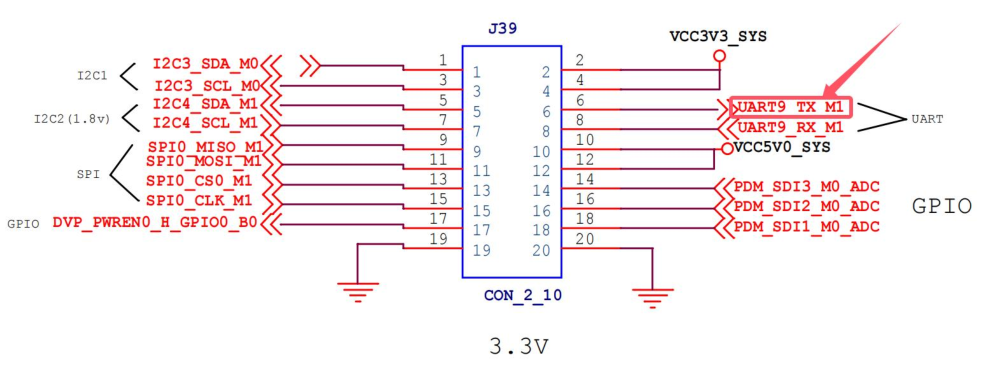

根据 PWM 引脚复用表可知，PWM12_M1 功能引脚默认被复用为了串口 9，所以需要修改设备树将复用功能设置为 PWM

找到 uart9 节点，将 status 从 okay 修改为 disabled，然后设置PWM12

```dts
&pwm12 {
	status = "okay";
	pinctrl-0 = <&pwm12m1_pins>;
};
```


### /sys/class/pwm/

首先来到`/sys/class/pwm/`目录下，如下图所示：

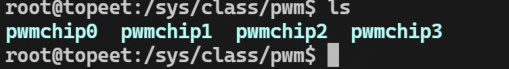

对应关系如下

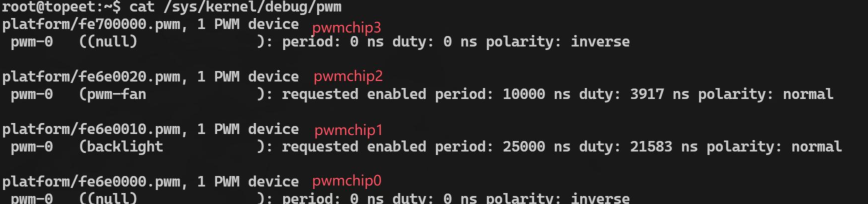

PWM12_M1 对应为 pwmchip3，进入 pwmchip3 目录之后如下图所示

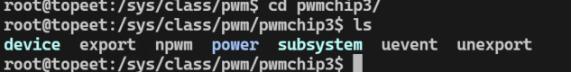

在这个目录下总共有七个文件分别为 **device**、**export**、**npwm**、**power**、**subsystem**、**uevent** 和 **unexport**。需要关注的是 export、npwm 以及 unexport 这三个属性文件

- **npwm**：是一个只读属性，读取该文件可以得知该 PWM 控制器下共有几路 PWM 输出，如下所示：


- **export**：在使用 PWM 之前，通过 export 属性进行导出，以下所示：

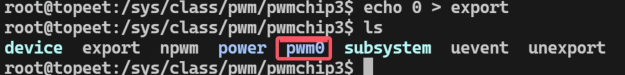

- **unexport**：当使用完 PWM 之后，需要将导出的 PWM 删除，譬如：

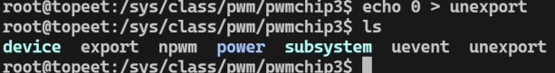

> 需要注意的是，export 文件和 unexport 文件都是只写的、没有读权限。

再次使用以下命令导出 pwm0 目录，导出成功之后进入该文件夹如下图所示：

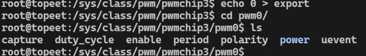

- **polarity**：用于 PWM 极性的查看，有 normal 和 inversed 可选
  - normal 表示 PWM 信号为正极性,即高电平为有效信号
  - inversed 表示 PWM 信号为负极性,即低电平为有效信号。
- **period**：用于配置 PWM 周期，可读可写；写入一个字符串数字值，以 ns（纳秒）为单位
- **duty_cycle**：用于配置 PWM 的占空比，可读可写；写入一个字符串数字值，同样也是以ns 为单位。
- **enable**：使能 PWM 输出通常配置好 PWM 之后，再使能 PWM。可读可写。
  - 写入"0"表示禁止 PWM；
  - 写入"1"表示使能 PWM


### SG-90 舵机介绍

SG90 舵机是一种广泛应用于机器人、遥控飞机、遥控汽车等领域的小型伺服电机。它以其小巧的尺寸、轻便的重量、低功耗和高性价比而备受青睐。

**工作原理**

SG90 舵机通过脉宽调制（PWM）信号来控制位置。**PWM 信号的宽度决定了舵机的旋转角度**。

典型的控制信号周期为 20ms，其中高电平部分的持续时间（0.5ms 至 2.5ms）对应舵机从 0 度到 180 度的转动范围，具体对应 关系如下所示

| 高电平持续时间 | 转动角度 |
| -------------- | -------- |
| 0.5 ms         | 0°       |
| 1.0 ms         | 45°      |
| 1.5 ms         | 90°      |
| 2.0 ms         | 135°     |
| 2.5 ms         | 180°     |

**硬件连接**

| 线缆颜色 | 功能                  | 背板 20pin 引脚编号 | 网络标号              |
| -------- | --------------------- | ------------------- | --------------------- |
| 红线     | 电源正极 (5V)         | 10/12               | VCC5V0_SYS            |
| 棕线     | 电源负极 (GND)        | 19/20               | GND                   |
| 橙线     | 控制信号线 (PWM 信号) | 6                   | UART9_TX_M1(GPIO4_C5) |

**应用场景**

- 机器人: 用于机器人中的关节或其他可动部件，因其精确的角度控制使其适合多自由度运动的实现。
- 遥控模型: 用于控制舵面或车轮方向，实现灵活的操控。

### 例子

通过以下命令让舵机转动 135 度：

```bash
# 设置 PWM 周期为 20 ms
echo 20000000 > period
# 设置 PWM 高电平持续时间为 2 ms
echo 2000000 > duty_cycle
# 设置 PWM 极性为正极性（normal）
echo normal > polarity
# 启用 PWM 输出
echo 1 > enable
```


## PWM 控制器注册流程分析

rk3568.dtsi 设备树，pwm 相关的节点如下所示：

```dts
	pwm0: pwm@fdd70000 {
		compatible = "rockchip,rk3568-pwm", "rockchip,rk3328-pwm";
		reg = <0x0 0xfdd70000 0x0 0x10>;
		#pwm-cells = <3>;
		pinctrl-names = "active";
		pinctrl-0 = <&pwm0m0_pins>;
		clocks = <&pmucru CLK_PWM0>, <&pmucru PCLK_PWM0>;
		clock-names = "pwm", "pclk";
		status = "disabled";
	};

	pwm1: pwm@fdd70010 {
		compatible = "rockchip,rk3568-pwm", "rockchip,rk3328-pwm";
		reg = <0x0 0xfdd70010 0x0 0x10>;
		#pwm-cells = <3>;
		pinctrl-names = "active";
		pinctrl-0 = <&pwm1m0_pins>;
		clocks = <&pmucru CLK_PWM0>, <&pmucru PCLK_PWM0>;
		clock-names = "pwm", "pclk";
		status = "disabled";
	};
```

根据 PWM 节点的 compatible 属性进行查找，可以找到瑞芯微的 PWM 驱动路径为内核目录下的 `drivers/pwm/pwm-rockchip.c`

```c
static struct platform_driver rockchip_pwm_driver = {
	.driver = {
		.name = "rockchip-pwm",
		.of_match_table = rockchip_pwm_dt_ids,
	},
	.probe = rockchip_pwm_probe,
	.remove = rockchip_pwm_remove,
};
```


然后来看该驱动程序的 probe 函数，具体内容如下所示：

### rockchip_pwm_probe()

```c
static int rockchip_pwm_probe(struct platform_device *pdev)
{
	const struct of_device_id *id;// 设备树匹配 ID
	struct rockchip_pwm_chip *pc;// PWM 芯片结构体
	struct resource *r;// 资源信息
	u32 enable_conf, ctrl;
	bool enabled;
	int ret, count;// 返回值和计数变量

    // 检查设备树匹配
	id = of_match_device(rockchip_pwm_dt_ids, &pdev->dev);
	if (!id)
		return -EINVAL;

    // 分配 PWM 芯片结构体
	pc = devm_kzalloc(&pdev->dev, sizeof(*pc), GFP_KERNEL);
	if (!pc)
		return -ENOMEM;

    // 获取内存资源并映射 IO 地址
	r = platform_get_resource(pdev, IORESOURCE_MEM, 0);
	pc->base = devm_ioremap(&pdev->dev, r->start,
				resource_size(r));
	if (IS_ERR(pc->base))
		return PTR_ERR(pc->base);

    // 获取 PWM 总线时钟
	pc->clk = devm_clk_get(&pdev->dev, "pwm");
	if (IS_ERR(pc->clk)) {
		pc->clk = devm_clk_get(&pdev->dev, NULL);
		if (IS_ERR(pc->clk))
			return dev_err_probe(&pdev->dev, PTR_ERR(pc->clk),
					     "Can't get bus clk\n");
	}

    // 获取 APB 时钟
	count = of_count_phandle_with_args(pdev->dev.of_node,
					   "clocks", "#clock-cells");
	if (count == 2)
		pc->pclk = devm_clk_get(&pdev->dev, "pclk");
	else
		pc->pclk = pc->clk;

	if (IS_ERR(pc->pclk)) {
		ret = PTR_ERR(pc->pclk);
		if (ret != -EPROBE_DEFER)
			dev_err(&pdev->dev, "Can't get APB clk: %d\n", ret);
		return ret;
	}
	// 使能总线时钟
	ret = clk_prepare_enable(pc->clk);
	if (ret) {
		dev_err(&pdev->dev, "Can't prepare enable bus clk: %d\n", ret);
		return ret;
	}
	// 使能 APB 时钟
	ret = clk_prepare_enable(pc->pclk);
	if (ret) {
		dev_err(&pdev->dev, "Can't prepare enable APB clk: %d\n", ret);
		goto err_clk;
	}

	pc->channel_id = rockchip_pwm_get_channel_id(pdev->dev.of_node->full_name);
	if (pc->channel_id < 0 || pc->channel_id >= PWM_MAX_CHANNEL_NUM) {
		dev_err(&pdev->dev, "Channel id is out of range: %d\n", pc->channel_id);
		ret = -EINVAL;
		goto err_pclk;
	}

	if (IS_ENABLED(CONFIG_PWM_ROCKCHIP_ONESHOT)) {
		pc->irq = platform_get_irq(pdev, 0);
		if (pc->irq < 0) {
			dev_err(&pdev->dev, "Get oneshot mode irq failed\n");
			ret = pc->irq;
			goto err_pclk;
		}

		ret = devm_request_irq(&pdev->dev, pc->irq, rockchip_pwm_oneshot_irq,
				       IRQF_NO_SUSPEND | IRQF_SHARED,
				       "rk_pwm_oneshot_irq", pc);
		if (ret) {
			dev_err(&pdev->dev, "Claim oneshot IRQ failed\n");
			goto err_pclk;
		}
	}
	// 获取引脚控制器
	pc->pinctrl = devm_pinctrl_get(&pdev->dev);
	if (IS_ERR(pc->pinctrl)) {
		dev_err(&pdev->dev, "Get pinctrl failed!\n");
		ret = PTR_ERR(pc->pinctrl);
		goto err_pclk;
	}
	// 获取引脚控制器的活动状态
	pc->active_state = pinctrl_lookup_state(pc->pinctrl, "active");
	if (IS_ERR(pc->active_state)) {
		dev_err(&pdev->dev, "No active pinctrl state\n");
		ret = PTR_ERR(pc->active_state);
		goto err_pclk;
	}

    // 设置驱动数据
	platform_set_drvdata(pdev, pc);
	
    // 初始化 PWM 芯片结构体
	pc->data = id->data;
	pc->chip.dev = &pdev->dev;
	pc->chip.ops = &rockchip_pwm_ops;
	pc->chip.base = of_alias_get_id(pdev->dev.of_node, "pwm");
	pc->chip.npwm = 1;
	pc->clk_rate = clk_get_rate(pc->clk);
	
    // 如果支持极性设置, 则使用带有极性的 of_pwm_xlate 函数
	if (pc->data->supports_polarity) {
		pc->chip.of_xlate = of_pwm_xlate_with_flags;
		pc->chip.of_pwm_n_cells = 3;
	}

	enable_conf = pc->data->enable_conf;
	ctrl = readl_relaxed(pc->base + pc->data->regs.ctrl);
	enabled = (ctrl & enable_conf) == enable_conf;

    // 检查是否为中心对齐模式
	pc->center_aligned =
		device_property_read_bool(&pdev->dev, "center-aligned");

    // 添加 PWM 芯片
	ret = pwmchip_add(&pc->chip);
	if (ret < 0) {
		dev_err(&pdev->dev, "pwmchip_add() failed: %d\n", ret);
		goto err_pclk;
	}

	/* Keep the PWM clk enabled if the PWM appears to be up and running. */
	if (!enabled)// 如果 PWM 未启用, 则禁用总线时钟
		clk_disable(pc->clk);

	clk_disable(pc->pclk);

	return 0;

err_pclk:
	clk_disable_unprepare(pc->pclk);
err_clk:
	clk_disable_unprepare(pc->clk);

	return ret;
}

```

创建了一个 `struct rockchip_pwm_chip` 类型的指针变量，它主要用于描述 Rockchip 系列 SoC 上的 PWM 控制器的硬件特性和配置信息，具体内容如下所示：

#### struct rockchip_pwm_chip

```c
struct rockchip_pwm_chip {
	struct pwm_chip chip;// 通用 PWM 控制器芯片接口
	struct clk *clk;// PWM 控制器的主时钟
	struct clk *pclk;// PWM 控制器的外设时钟
	struct pinctrl *pinctrl;// PWM 控制器的引脚复用控制器
	struct pinctrl_state *active_state;// PWM 控制器当前使用的引脚状态
	const struct rockchip_pwm_data *data;// 特定于 Rockchip SoC 的 PWM 控制器配置信息
	void __iomem *base;// PWM 控制器寄存器空间的内核虚拟地址
	unsigned long clk_rate;// PWM 控制器当前使用的时钟频率
	bool vop_pwm_en; // 标识 VOP (视频输出处理器) 是否也使能了 PWM 功能
	bool center_aligned;// 标识 PWM 控制器是否支持中心对齐模式
	bool oneshot;// 标识 PWM 控制器是否支持单次触发模式
	int channel_id;
	int irq;
};
```

其中第二行的 `struct pwm_chip` 结构体是 PWM 子系统中对 PWM 控制器的一种抽象和封装。

它将 PWM 控制器的基本信息和操作函数集中到一个结构体中,方便上层 PWM 框架进行管理和调用，该结构体定义在`include/linux/pwm.h` 文件中，具体内容如下所示：

#### struct pwm_chip

```c
/**
 * struct pwm_chip - abstract a PWM controller
 * @dev: device providing the PWMs
 * @ops: callbacks for this PWM controller
 * @base: number of first PWM controlled by this chip
 * @npwm: number of PWMs controlled by this chip
 * @of_xlate: request a PWM device given a device tree PWM specifier
 * @of_pwm_n_cells: number of cells expected in the device tree PWM specifier
 * @list: list node for internal use
 * @pwms: array of PWM devices allocated by the framework
 */
struct pwm_chip {
	struct device *dev;// PWM 控制器所属的设备
	const struct pwm_ops *ops;// PWM 控制器的操作函数集
	int base;// PWM 控制器的寄存器基地址偏移
	unsigned int npwm;// PWM 控制器提供的 PWM 通道数量

	struct pwm_device * (*of_xlate)(struct pwm_chip *pc,
					const struct of_phandle_args *args);
	unsigned int of_pwm_n_cells;// 设备树中 PWM 属性描述所需的属性数量

	/* only used internally by the PWM framework */
	struct list_head list;// PWM 控制器所在的全局链表
	struct pwm_device *pwms;// PWM 通道设备数组
};

```

其中`pwm_ops`表示PWM 控制器的操作函数集

#### struct pwm_ops

```c
/**
 * struct pwm_ops - PWM controller operations
 * @request: optional hook for requesting a PWM
 * @free: optional hook for freeing a PWM
 * @capture: capture and report PWM signal
 * @apply: atomically apply a new PWM config
 * @get_state: get the current PWM state. This function is only
 *	       called once per PWM device when the PWM chip is
 *	       registered.
 * @get_output_type_supported: get the supported output type of this PWM
 * @owner: helps prevent removal of modules exporting active PWMs
 * @config: configure duty cycles and period length for this PWM
 * @set_polarity: configure the polarity of this PWM
 * @enable: enable PWM output toggling
 * @disable: disable PWM output toggling
 */
struct pwm_ops {
	int (*request)(struct pwm_chip *chip, struct pwm_device *pwm);
	void (*free)(struct pwm_chip *chip, struct pwm_device *pwm);
	int (*capture)(struct pwm_chip *chip, struct pwm_device *pwm,
		       struct pwm_capture *result, unsigned long timeout);
	int (*apply)(struct pwm_chip *chip, struct pwm_device *pwm,
		     const struct pwm_state *state);
	void (*get_state)(struct pwm_chip *chip, struct pwm_device *pwm,
			  struct pwm_state *state);
	int (*get_output_type_supported)(struct pwm_chip *chip,
			struct pwm_device *pwm);
	struct module *owner;

	/* Only used by legacy drivers */
	int (*config)(struct pwm_chip *chip, struct pwm_device *pwm,
		      int duty_ns, int period_ns);
	int (*set_polarity)(struct pwm_chip *chip, struct pwm_device *pwm,
			    enum pwm_polarity polarity);
	int (*enable)(struct pwm_chip *chip, struct pwm_device *pwm);
	void (*disable)(struct pwm_chip *chip, struct pwm_device *pwm);
};
```

然后回到 `drivers/pwm/pwm-rockchip.c` 文件中找到 `rockchip_pwm_ops` 操作集，可以发现瑞芯微只实现了状态获取和申请两个函数，具体内容如下所示

```c
static const struct pwm_ops rockchip_pwm_ops = {
	.get_state = rockchip_pwm_get_state,
	.apply = rockchip_pwm_apply,
	.owner = THIS_MODULE,
};
```

### pwmchip_add()

`rockchip_pwm_probe()` 中调用了`pwmchip_add` 函数将 PWM 控制器添加到 PWM 子系统中，`pwmchip_add` 函数定义在 `drivers/pwm/core.c` 文件中，具体内容如下所示：

```c
/**
 * pwmchip_add() - register a new PWM chip
 * @chip: the PWM chip to add
 *
 * Register a new PWM chip. If chip->base < 0 then a dynamically assigned base
 * will be used. The initial polarity for all channels is normal.
 *
 * Returns: 0 on success or a negative error code on failure.
 */
int pwmchip_add(struct pwm_chip *chip)
{
	return pwmchip_add_with_polarity(chip, PWM_POLARITY_NORMAL);
}
EXPORT_SYMBOL_GPL(pwmchip_add);


/**
 * pwmchip_add_with_polarity() - register a new PWM chip
 * @chip: the PWM chip to add
 * @polarity: initial polarity of PWM channels
 *
 * Register a new PWM chip. If chip->base < 0 then a dynamically assigned base
 * will be used. The initial polarity for all channels is specified by the
 * @polarity parameter.
 *
 * Returns: 0 on success or a negative error code on failure.
 */
int pwmchip_add_with_polarity(struct pwm_chip *chip,
			      enum pwm_polarity polarity)
{
	struct pwm_device *pwm;
	unsigned int i;
	int ret;

	if (!chip || !chip->dev || !chip->ops || !chip->npwm)// 检查 chip 结构体的有效性
		return -EINVAL;
	
    // 检查 pwm_ops 结构体的有效性
	if (!pwm_ops_check(chip))
		return -EINVAL;

    // 获取全局 pwm_lock 互斥锁
	mutex_lock(&pwm_lock);

    // 为 chip 分配 PWM 设备索引号
	ret = alloc_pwms(chip->base, chip->npwm);
	if (ret < 0)
		goto out;

    // 动态分配 chip->npwm 个 pwm_device 结构体
	chip->pwms = kcalloc(chip->npwm, sizeof(*pwm), GFP_KERNEL);
	if (!chip->pwms) {
		ret = -ENOMEM;
		goto out;
	}

    // 保存分配的 PWM 设备索引号
	chip->base = ret;

    // 初始化每个 PWM 设备
	for (i = 0; i < chip->npwm; i++) {
		pwm = &chip->pwms[i];

		pwm->chip = chip;
		pwm->pwm = chip->base + i;
		pwm->hwpwm = i;
		pwm->state.polarity = polarity;
		pwm->state.output_type = PWM_OUTPUT_FIXED;

        // 将 PWM 设备添加到全局 PWM 设备树中
		radix_tree_insert(&pwm_tree, pwm->pwm, pwm);
	}

    // 标记分配的 PWM 设备为已使用
	bitmap_set(allocated_pwms, chip->base, chip->npwm);

    // 将 PWM 控制器添加到全局 PWM 控制器链表
	INIT_LIST_HEAD(&chip->list);
	list_add(&chip->list, &pwm_chips);

	ret = 0;

    // 如果内核开启了 Device Tree 支持,则注册 PWM 控制器到 Device Tree
	if (IS_ENABLED(CONFIG_OF))
		of_pwmchip_add(chip);

out:
	mutex_unlock(&pwm_lock);// 释放全局 pwm_lock 互斥锁

	if (!ret)// 如果添加成功,则在 sysfs 中导出 PWM 控制器
		pwmchip_sysfs_export(chip);

	return ret;
}
EXPORT_SYMBOL_GPL(pwmchip_add_with_polarity);
```

这个函数的主要作用是初始化一个新的 PWM 控制器,并**调用 `list_add` 函数将其添加到 PWM 子系统的管理中**。


## PWM子系统API


### pwm_config()

> PWM 参数配置核心函数

| 项目     | 详情                                                         |
| -------- | ------------------------------------------------------------ |
| 函数原型 | `int pwm_config(struct pwm_device *pwm, int duty_ns, int period_ns);` |
| 核心作用 | 配置 PWM 信号的**占空比**和**周期**，是调整 PWM 输出特性的核心函数 |
| 参数说明 | 1. `pwm`：指向目标 PWM 设备结构体的指针（需先通过 `devm_of_pwm_get` 获取）<br />2. `duty_ns`：占空比时长，单位**纳秒 (ns)**，表示 PWM 一个周期内高电平持续的时间<br />3. `period_ns`：PWM 信号总周期，单位**纳秒 (ns)**，表示高电平 + 低电平的总时长 |
| 返回值   | 成功：返回 0；失败：返回负数错误码（如 -EINVAL 表示参数无效） |
| 使用说明 | 需在 PWM 使能（`pwm_enable`）前调用，确保输出的 PWM 信号参数已正确配置；通过调整 `duty_ns` 可改变输出平均电压（如控制 LED 亮度、电机转速），占空比计算公式：`占空比(%) = (duty_ns / period_ns) * 100%` |

### pwm_set_polarity()

> PWM 极性设置函数

| 项目     | 详情                                                         |
| -------- | ------------------------------------------------------------ |
| 函数原型 | `int pwm_set_polarity(struct pwm_device *pwm, enum pwm_polarity polarity);` |
| 核心作用 | 设置 PWM 信号的极性，定义高低电平的逻辑含义                  |
| 参数说明 | 1. `pwm`：指向目标 PWM 设备结构体的指针<br />2. `polarity`：极性枚举值，仅支持两种：<br />- `PWM_POLARITY_NORMAL`：正极性（默认），高电平为 “有效 / 开启” 状态，低电平为 “无效 / 关闭” 状态<br />- `PWM_POLARITY_INVERSED`：负极性，低电平为 “有效 / 开启” 状态，高电平为 “无效 / 关闭” 状态 |
| 返回值   | 成功：返回 0；失败：返回负数错误码                           |
| 使用说明 | 适用于需要反向逻辑控制的场景（如某些电机正反转控制、LED 反向驱动电路），建议在 `pwm_config` 之后、`pwm_enable` 之前调用 |

### pwm_enable()

> PWM 使能函数

| 项目     | 详情                                                         |
| -------- | ------------------------------------------------------------ |
| 函数原型 | `int pwm_enable(struct pwm_device *pwm);`                    |
| 核心作用 | 使能 PWM 控制器，开始输出已配置好参数（占空比、周期、极性）的 PWM 信号 |
| 参数说明 | `pwm`：指向目标 PWM 设备结构体的指针                         |
| 返回值   | 成功：返回 0；失败：返回负数错误码                           |
| 使用说明 | 必须在 `pwm_config`（及 `pwm_set_polarity`，若需配置极性）之后调用，确保输出信号参数有效；调用后 PWM 持续输出，直至调用 `pwm_disable` 停止 |

### pwm_disable()

> PWM 关闭函数

| 项目     | 详情                                                         |
| -------- | ------------------------------------------------------------ |
| 函数原型 | `void pwm_disable(struct pwm_device *pwm);`                  |
| 核心作用 | 关闭 PWM 控制器，停止输出 PWM 信号                           |
| 参数说明 | `pwm`：指向目标 PWM 设备结构体的指针                         |
| 返回值   | 无返回值                                                     |
| 使用说明 | 当不需要 PWM 输出时调用（如设备休眠、功能关闭），可节省系统功耗；调用后 PWM 不再输出信号，再次启用需重新调用 `pwm_enable`（无需重新配置参数，参数会保留） |

### devm_of_pwm_get()

> PWM 设备获取函数

| 项目     | 详情                                                         |
| -------- | ------------------------------------------------------------ |
| 函数原型 | `struct pwm_device *devm_of_pwm_get(struct device *dev, struct device_node *np, const char *con_id);` |
| 核心作用 | 从 Linux 设备树（Device Tree）中获取 PWM 设备句柄，自动管理设备资源（无需手动释放） |
| 参数说明 | 1. `dev`：指向当前驱动对应的设备结构体指针（如平台驱动中的 `struct device` 实例）<br />2. `np`：指向 PWM 设备对应的设备树节点指针<br />3. `con_id`：连接 ID（字符串类型），用于区分同一设备的多个 PWM 通道（若只有一个 PWM 通道，可传 `NULL`） |
| 返回值   | 成功：返回指向 `struct pwm_device` 的有效指针；失败：返回 ERR_PTR 类型的错误指针（可通过 `IS_ERR()` 宏判断） |
| 使用说明 | 是设备驱动中获取 PWM 设备的首选方法，基于 `devm` 系列接口的特性，当设备卸载时，内核会自动释放该 PWM 设备资源，避免内存泄漏；必须在使用其他 PWM 函数（`pwm_config` 等）之前调用，先获取设备句柄才能进行后续操作 |


### 例子

首先修改设备树，同样先设置pwm12复用：

```c
&pwm12 {
	status = "okay";
	pinctrl-0 = <&pwm12m1_pins>;
};
```

然后新增sg90节点

```dts
sg90 {
	compatible = "sg90";
	pwms = <&pwm12 0 20000000 1>;
}
```

- `compatible` 用于指定设备的兼容性字符串，内核会根据这个字符串来匹配合适的驱动程序。
- `pwms` 用来配置 PWM 控制器的信息。
  - `&pwm12` 表示 PWM 控制器的引用
  - `0` 表示 PWM通道号
  - `20000000`: 表示 PWM 周期，单位为纳秒，即设置周期为 20ms
  - `1` 为极性，表示正极性（active high），即 PWM 信号的高电平表示“开”状态

**驱动程序**

```c
#include <linux/module.h>
#include <linux/init.h>
#include <linux/moduleparam.h>
#include <linux/fs.h>
#include <linux/kdev_t.h>
#include <linux/cdev.h>
#include <linux/device.h>
#include <linux/platform_device.h>
#include <linux/of.h>
#include <linux/uaccess.h>
#include <linux/pwm.h>

dev_t dev_num;
struct cdev cdev_test;
struct class *class;
struct device *device;

struct pwm_device *sg90_pwm_device;

// 打开设备时的回调函数
static int cdev_test_open(struct inode *inode, struct file *file) {
    printk("This is cdev test open\n");
    pwm_config(sg90_pwm_device, 500000, 20000000);    // 配置 PWM 参数:脉冲宽度为 50000000 纳秒, 周期为 20,000,000 纳秒
    pwm_set_polarity(sg90_pwm_device, PWM_POLARITY_NORMAL);    // 设置 PWM 极性为正常极性
    pwm_enable(sg90_pwm_device);    // 启动 PWM
    return 0;
}

// 写入设备时的回调函数
static ssize_t cdev_test_write(struct file *file, const char __user *buf, size_t size, loff_t *off) {
    int ret;
    unsigned char data[1];
    printk("This is cdev test write\n");
    // 从用户空间拷贝数据到内核空间
    ret = copy_from_user(data, buf, size);
    if (ret) {
        printk("copy_from_user failed\n");
        return -EFAULT;
    }
    // 更新 PWM 参数:脉冲宽度根据用户输入的数据调整
    pwm_config(sg90_pwm_device, 500000 + data[0] * 100000 / 9, 20000000);
    return size;
}

// 释放设备时的回调函数
static int cdev_test_release(struct inode *inode, struct file *file) {
    printk("This is cdev test release\n");

    pwm_config(sg90_pwm_device, 500000, 20000000);    // 回到初始的 PWM 参数配置
    pwm_disable(sg90_pwm_device);    // 停止 PWM
    return 0;
}

// 定义字符设备操作函数集合
static struct file_operations cdev_test_ops = {
    .owner = THIS_MODULE,
    .open = cdev_test_open,
    .write = cdev_test_write,
    .release = cdev_test_release,
};

// 设备探测函数
static int sg90_probe(struct platform_device *pdev) {
    int ret;

    // 获取 PWM 设备
    sg90_pwm_device = devm_pwm_get(&pdev->dev, NULL);
    if (IS_ERR(sg90_pwm_device)) {
        printk("Failed to get PWM device\n");
        return PTR_ERR(sg90_pwm_device);
    }

    // 申请设备号
    ret = alloc_chrdev_region(&dev_num, 0, 1, "alloc_name");
    if (ret < 0) {
        printk("alloc_chrdev_region is error\n");
        return ret;
    }
    printk("alloc_chrdev_region is ok\n");

    // 初始化字符设备
    cdev_init(&cdev_test, &cdev_test_ops);
    cdev_test.owner = THIS_MODULE;

    ret = cdev_add(&cdev_test, dev_num, 1);// 添加字符设备
    class = class_create(THIS_MODULE, "test");    // 创建设备类
    device = device_create(class, NULL, dev_num, NULL, "sg90");    // 创建设备

    printk("sg90_probe successful\n");
    return 0;
}

// 设备移除函数
static int sg90_remove(struct platform_device *pdev) {

    device_destroy(class, dev_num);    // 删除设备
    class_destroy(class);    // 删除设备类
    cdev_del(&cdev_test);    // 删除字符设备
    unregister_chrdev_region(dev_num, 1);    // 释放设备号
    printk("sg90_remove successful\n");
    return 0;
}

// 设备树匹配表
static const struct of_device_id sg90_of_device_id[] = {
    {.compatible = "sg90"},
    {},
};
MODULE_DEVICE_TABLE(of, sg90_of_device_id);

// 定义平台驱动
static struct platform_driver sg90_platform_driver = {
    .driver = {
        .name = "sg90",
        .of_match_table = sg90_of_device_id,
    },
    .probe = sg90_probe,
    .remove = sg90_remove,
};

// 模块初始化函数
static int __init modulecdev_init(void) {
    int ret;

    // 注册平台驱动
    ret = platform_driver_register(&sg90_platform_driver);
    if (ret) {
        printk("platform_driver_register is error\n");
        return ret;
    }
    printk("platform_driver_register is ok\n");

    return 0;
}

// 模块退出函数
static void __exit modulecdev_exit(void) {
    // 注销平台驱动
    platform_driver_unregister(&sg90_platform_driver);
    printk("bye bye\n");
}

// 声明模块许可证和作者
module_init(modulecdev_init);
module_exit(modulecdev_exit);

MODULE_LICENSE("GPL");
MODULE_AUTHOR("topeet");
```

**app**

```c
#include <fcntl.h>  
#include <unistd.h>  
#include <stdlib.h> 
#include <stdio.h> 

int main(int argc, char *argv[]) {
    // argc 表示命令行参数的数量,包括程序名本身
    // argv 是一个字符串数组,存储了各个命令行参数

    int fd;  // 文件描述符,用于标识打开的设备文件
    unsigned char buf[1];  // 存储要写入设备的单个字节数据

    // 如果命令行参数个数小于2,说明缺少要写入的值,打印用法并返回错误
    if (argc < 2) {
        printf("Usage: %s <value>\n", argv[0]);
        return -1;
    }

    // 以只写方式打开设备文件"/dev/sg90"
    fd = open("/dev/sg90", O_WRONLY);
    if (fd < 0) {  // 打开设备文件失败,输出错误信息并返回错误
        perror("open");
        return -1;
    }

    // 将命令行参数转换为整数,存储在buf[0]中
    buf[0] = (unsigned char)atoi(argv[1]);
    // 将buf中的1个字节数据写入打开的设备文件
    if (write(fd, buf, 1) != 1) {  // 写入失败,输出错误信息,关闭文件并返回错误
        perror("write");
        close(fd);
        return -1;
    }

    // 延迟3秒,模拟设备操作
    sleep(3);
    // 关闭设备文件
    close(fd);

    return 0;  // 程序执行成功
}
```


**测试**

使用`./app 90`运行编译的可执行程序，这里的 90 代表舵机转动的角度


# 模拟PWM

当硬件 PWM 不够用的时候，可以使用 GPIO 来模拟实现 PWM，也可以称之为软件 PWM，软件 PWM 是通过软件编程实现 PWM 输出的方式，利用定时器中断或者循环计数的方式, 在软件中控制输出引脚的高低电平切换时间, 从而生成 PWM 波形。

## 高精度定时器

软件 PWM 的实现需要依靠定时器中断来实现，而**传统的周期性定时器通常在 100Hz 到 1000Hz 之间, 只能提供毫秒级别的精度**, 这对于一些时间精度要求较高的应用场景来说（例如模拟 PWM）,精度还不够。

为了解决这一问题,Linux 内核引入了**高精度定时器(`hrtimers`)**机制。

**`hrtimers` 使用动态时钟(`CLOCK_MONOTONIC`)和动态时间戳(`ktime_t`)作为基准时间。通过利用底层硬件定时器(如 `HPET、LAPIC` 定时器等)提供纳秒级别的时间精度。**

高精度定时器结构体 `struct hrtimer` 内容如下所示：

```c
struct hrtimer {
	struct list_head node; // 定时器在时钟基准列表中的节点
	ktime_t _softexpires;// 软到期时间,实际到期时间可能稍晚
	enum hrtimer_restart (*function)(struct hrtimer *); // 定时器到期时的回调函数
	unsigned long	state; // 定时器的状态标志
	struct hrtimer_clock_base *base; // 定时器所属的时钟基准
}
```

### 高精度定时器工作流程

1. 初始化定时器

   使用 `hrtimer_init()` 函数初始化一个 `struct hrtimer` 对象, 指定使用的时钟源和工作模式。在初始化过程中,会为定时器分配一个所属的时钟基准(`hrtimer_clock_base`)。每个 CPU 都有自己的时钟基准管理器。

2. 设置定时器
   使用 `hrtimer_start()`或者 `hrtimer_set()` 函数设置定时器的到期时间。可以指定绝对时间或相对时间。定时器到期时间会被转换为对应时钟基准的软到期时间(`_softexpires`)。将定时器插入到时钟基准的定时器链表中,按照到期时间排序。

3. 定时器到期处理
   当系统时钟发生中断时,会调用 `hrtimer_interrupt()` 函数。`hrtimer_interrupt()`会遍历时钟基准的定时器链表,检查是否有到期的定时器。对于已到期的定时器,调用其回调函数(`function`)处理到期事件。如果定时器尚未到期,则更新下一个到期定时器的唤醒时间。
4. 定时器管理
   - `hrtimer_cancel()` 函数用于取消一个正在运行的定时器。
   - `hrtimer_forward()` 函数用于前滚定时器,即根据当前时间重新计算定时器的到期时间。
   - `hrtimer_start_range_ns()` 函数用于设置定时器的到期时间范围,以提高定时器的精度。


### 高精度定时器API

#### hrtimer_init

> 定时器初始化

| 项目     | 详情                                                         |
| -------- | ------------------------------------------------------------ |
| 函数原型 | `void hrtimer_init(struct hrtimer *timer, clockid_t clockid, enum hrtimer_mode mode);` |
| 核心作用 | 初始化`struct hrtimer`结构体，指定定时器的时钟源和工作模式   |
| 参数说明 | - `timer`：指向待初始化的`hrtimer`结构体指针<br />- `clockid`：时钟源，常用值：<br />   `CLOCK_MONOTONIC`：单调时钟（系统启动后不回退，推荐用于定时器）<br />   `CLOCK_REALTIME`：实时时钟（可被修改，不推荐用于高精度定时）<br />   `CLOCK_BOOTTIME`：包含系统挂起时间的单调时钟<br />- `mode`：工作模式，常用值：<br />   `HRTIMER_MODE_ABS`：绝对时间模式（定时器在指定绝对时间触发）<br />   `HRTIMER_MODE_REL`：相对时间模式（定时器在当前时间延后指定时长触发） |
| 返回值   | 无                                                           |
| 使用说明 | 必须在使用其他 hrtimer API 前调用，是定时器操作的前置步骤    |

#### hrtimer_set

> 设置定时器到期时间

| 项目     | 详情                                                         |
| -------- | ------------------------------------------------------------ |
| 函数原型 | `void hrtimer_set(struct hrtimer *timer, ktime_t time, const enum hrtimer_mode mode);` |
| 核心作用 | 为已初始化的定时器设置到期时间（通常配合`hrtimer_start`使用） |
| 参数说明 | - `timer`：指向`hrtimer`结构体的指针<br />- `time`：到期时间（`ktime_t`类型，需用`ktime_set(秒, 纳秒)`构造）<br />- `mode`：时间模式（`HRTIMER_MODE_ABS`/`HRTIMER_MODE_REL`，需与`hrtimer_init`的模式一致） |
| 返回值   | 无                                                           |
| 使用说明 | 可单独设置时间后再调用`hrtimer_start`，也可直接通过`hrtimer_start`的参数设置时间（更常用） |

####  hrtimer_start

> 启动定时器

| 项目     | 详情                                                         |
| -------- | ------------------------------------------------------------ |
| 函数原型 | `int hrtimer_start(struct hrtimer *timer, ktime_t time, const enum hrtimer_mode mode);` |
| 核心作用 | 将定时器加入内核定时器队列，启动定时（可直接设置到期时间）   |
| 参数说明 | - `timer`：指向`hrtimer`结构体的指针- `time`：到期时间（`ktime_t`类型）- `mode`：时间模式（同`hrtimer_init`） |
| 返回值   | 成功返回 0；失败返回负数错误码                               |
| 使用说明 | 是启动定时器的核心函数，支持 “设置时间 + 启动” 一步完成（替代`hrtimer_set`+`hrtimer_start`） |

#### hrtimer_forward

> 推进定时器到期时间

| 项目     | 详情                                                         |
| -------- | ------------------------------------------------------------ |
| 函数原型 | `ktime_t hrtimer_forward(struct hrtimer *timer, ktime_t now, ktime_t interval);` |
| 核心作用 | 在定时器回调函数中推进到期时间，实现**周期性定时器**         |
| 参数说明 | - `timer`：指向`hrtimer`结构体的指针<br />- `now`：当前时间（通常用`hrtimer_cb_get_time(timer)`获取）<br />- `interval`：周期时间间隔（`ktime_t`类型） |
| 返回值   | 返回新的到期时间（`ktime_t`类型）                            |
| 使用说明 | 必须在定时器回调函数中调用，配合`return HRTIMER_RESTART`实现周期性触发 |

#### hrtimer_cancel

> 取消定时器

| 项目     | 详情                                         |
| -------- | -------------------------------------------- |
| 函数原型 | `int hrtimer_cancel(struct hrtimer *timer);` |
| 核心作用 | 取消已启动的定时器，将其从内核队列中移除     |
| 参数说明 | - `timer`：指向`hrtimer`结构体的指针         |
| 返回值   | 定时器处于活动状态时返回 1；已停止时返回 0   |
| 使用说明 | 用于提前终止定时器（如模块卸载、功能关闭时） |

## 示例

我们用模拟PWM实现LED呼吸灯效果：

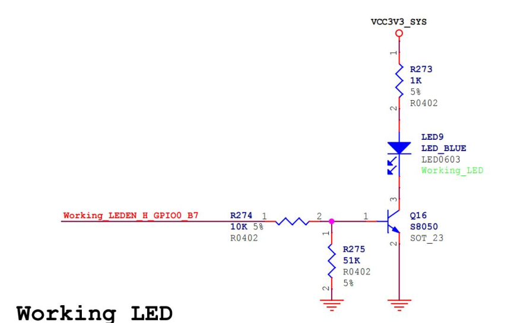

LED 使用的引脚为 `GPIO0_B7`,在设备树中使用 LED 子系统进行注册，而在本章节中由于要用模拟 PWM 对该引脚进行控制，所以需要对设备树进行修改:

原来是：

```dts
#if LED_PWM
        leds {                                                                                           				 compatible = "pwm-leds";
                work {
                        pwms = <&pwm0 0 500000 0>;
                        linux,default-trigger = "heartbeat";
                        default-state = "on";
                };
        };
#else
        leds {
                compatible = "gpio-leds";
                work {
                        gpios = <&gpio0 RK_PB7 GPIO_ACTIVE_HIGH>;
                        linux,default-trigger = "heartbeat";
                        default-state = "on";
                };
        };
#endif
```

改为：

```dts
leds {
	compatible = "pwm-leds";
	led-gpios = <&gpio0 RK_PB7 GPIO_ACTIVE_HIGH>;
};
```

**驱动程序**

```c
#include <linux/module.h>
#include <linux/init.h>
#include <linux/moduleparam.h>
#include <linux/fs.h>
#include <linux/kdev_t.h>
#include <linux/cdev.h>
#include <linux/device.h>
#include <linux/platform_device.h>
#include <linux/of.h>
#include <linux/uaccess.h>
#include <linux/pwm.h>
#include <linux/gpio/consumer.h>
#include <linux/hrtimer.h>
#include <linux/slab.h>

dev_t dev_num;
struct cdev cdev_test;
struct class *class;
struct device *device;

// 定义 PWM LED 数据结构体
struct pwm_led_data {
    int sum_count;  // PWM 周期总脉冲数
    int high_count;  // PWM 高电平持续脉冲数
    struct gpio_desc *gpiod;  // GPIO 描述符
    struct hrtimer pwm_timer;  // 高分辨率定时器
    ktime_t time;  // 定时器时间间隔
};

// 声明 PWM LED 数据结构体指针
struct pwm_led_data *data;

// PWM 定时器回调函数
enum hrtimer_restart pwm_timer_func(struct hrtimer *timer) {
    static int timer_count = 0;  // 定时器计数器
    struct pwm_led_data *mydata = container_of(timer, struct pwm_led_data, pwm_timer);

    // 如果计数器达到总脉冲数, 将 GPIO 设为高电平
    if (timer_count == mydata->sum_count) {
        gpiod_set_value(mydata->gpiod, 1);
        timer_count = 0;
    }
    // 如果计数器达到高电平持续脉冲数, 将 GPIO 设为低电平
    if (timer_count == mydata->high_count) {
        gpiod_set_value(mydata->gpiod, 0);
    }
    timer_count++;
    // 如果高电平持续脉冲数为 0, 则计数器重置为 0
    if (mydata->high_count == 0) {
        timer_count = 0;
    }

    // 将定时器向前移动 time 时间间隔, 并重新启动
    hrtimer_forward(timer, hrtimer_cb_get_time(timer), mydata->time);
    return HRTIMER_RESTART;
}

// 字符设备打开回调函数
static int cdev_test_open(struct inode *inode, struct file *file) {
    printk("This is cdev test open\n");
    return 0;
}

// 字符设备写入回调函数
static ssize_t cdev_test_write(struct file *file, const char __user *buf, size_t size, loff_t *off) {
    int ret;
    int kbuf[2];
    printk("This is cdev test write\n");
    // 从用户空间拷贝数据到内核空间
    ret = copy_from_user(kbuf, buf, size);
    if (ret != 0) {
        printk("copy_from_user failed\n");
        return -EFAULT;
    }
    // 更新 PWM LED 数据结构体
    data->sum_count = kbuf[0];
    data->high_count = kbuf[1];
    return size;
}

// 字符设备释放回调函数
static int cdev_test_release(struct inode *inode, struct file *file) {
    printk("This is cdev test release\n");
    return 0;
}

// 字符设备操作函数集
static struct file_operations cdev_test_ops = {
    .owner = THIS_MODULE,
    .open = cdev_test_open,
    .write = cdev_test_write,
    .release = cdev_test_release,
};

// 平台设备探测回调函数
static int led_probe(struct platform_device *pdev) {
    int ret;

    // 分配 PWM LED 数据结构体内存
    data = kmalloc(sizeof(struct pwm_led_data), GFP_KERNEL);
    if (!data) {
        printk("kmalloc failed\n");
        return -ENOMEM;
    }
    // 初始化 PWM LED 数据结构体
    data->sum_count = 20;
    data->high_count = 10;

    // 动态分配设备号
    ret = alloc_chrdev_region(&dev_num, 0, 1, "alloc_name");
    if (ret < 0) {
        printk("alloc_chrdev_region is error\n");
        kfree(data);
        return ret;
    }
    printk("alloc_chrdev_region is ok\n");

    // 初始化字符设备
    cdev_init(&cdev_test, &cdev_test_ops);
    cdev_test.owner = THIS_MODULE;

    ret = cdev_add(&cdev_test, dev_num, 1);    // 向内核注册字符设备
    if (ret) {
        printk("cdev_add is error\n");
        unregister_chrdev_region(dev_num, 1);
        kfree(data);
        return ret;
    }

    class = class_create(THIS_MODULE, "test");    // 创建设备类
    if (IS_ERR(class)) {
        printk("class_create is error\n");
        cdev_del(&cdev_test);
        unregister_chrdev_region(dev_num, 1);
        kfree(data);
        return PTR_ERR(class);
    }

    device = device_create(class, NULL, dev_num, NULL, "pwm-gpio");    // 创建设备节点
    if (IS_ERR(device)) {
        printk("device_create is error\n");
        class_destroy(class);
        cdev_del(&cdev_test);
        unregister_chrdev_region(dev_num, 1);
        kfree(data);
        return PTR_ERR(device);
    }

    data->gpiod = gpiod_get(&pdev->dev, "led", GPIOD_OUT_HIGH);    // 获取 GPIO 描述符
    if (IS_ERR(data->gpiod)) {
        printk("gpiod_get is error\n");
        device_destroy(class, dev_num);
        class_destroy(class);
        cdev_del(&cdev_test);
        unregister_chrdev_region(dev_num, 1);
        kfree(data);
        return PTR_ERR(data->gpiod);
    }
    gpiod_set_value(data->gpiod, 1);    // 将 GPIO 设为高电平

    // 初始化高分辨率定时器
    data->time = ktime_set(0, 1000000);  // 1 ms
    hrtimer_init(&data->pwm_timer, CLOCK_MONOTONIC, HRTIMER_MODE_REL);
    data->pwm_timer.function = pwm_timer_func;
    hrtimer_start(&data->pwm_timer, data->time, HRTIMER_MODE_REL);    // 启动高分辨率定时器

    printk("led_probe successful\n");
    return 0;
}

// 平台设备移除回调函数
static int led_remove(struct platform_device *pdev) {
    hrtimer_cancel(&data->pwm_timer);    // 停止高分辨率定时器
    gpiod_put(data->gpiod);    // 释放 GPIO 描述符
    device_destroy(class, dev_num);    // 删除设备节点
    class_destroy(class);    // 删除设备类
    cdev_del(&cdev_test);    // 从内核注销字符设备
    unregister_chrdev_region(dev_num, 1);    // 释放设备号
    kfree(data);    // 释放 PWM LED 数据结构体内存
    printk("led_remove successful\n");
    return 0;
}

// 设备树匹配表
static const struct of_device_id led_of_device_id[] = {
    {.compatible = "pwm-leds"},
    {},
};
MODULE_DEVICE_TABLE(of, led_of_device_id);

// 平台设备驱动结构体
static struct platform_driver led_platform_driver = {
    .driver = {
        .name = "pwm-leds",
        .of_match_table = led_of_device_id,
    },
    .probe = led_probe,
    .remove = led_remove,
};

// 模块初始化函数
static int __init modulecdev_init(void) {
    int ret;

    // 注册平台设备驱动
    ret = platform_driver_register(&led_platform_driver);
    if (ret) {
        printk("platform_driver_register is error\n");
        return ret;
    }
    printk("platform_driver_register is ok\n");

    return 0;
}

// 模块退出函数
static void __exit modulecdev_exit(void) {
    // 注销平台设备驱动
    platform_driver_unregister(&led_platform_driver);
    printk("bye bye\n");
}

// 模块初始化和退出函数注册
module_init(modulecdev_init);
module_exit(modulecdev_exit);

// 模块许可证、作者和描述信息
MODULE_LICENSE("GPL");
MODULE_AUTHOR("topeet");
```

**测试**

```c
#include <stdio.h>
#include <sys/types.h>
#include <sys/stat.h>
#include <fcntl.h>
#include <unistd.h>
#include <stdlib.h>

int main(int argc, char *argv[]) {
    int fd; // 文件描述符
    int buf[2]; // 缓冲区,存放两个整数值

    // 检查命令行参数个数是否正确
    if (argc != 3) {
        fprintf(stderr, "Usage: %s <sum_count> <high_count>\n", argv[0]);
        return -1;
    }

    // 打开 PWM GPIO 设备文件
    fd = open("/dev/pwm-gpio", O_WRONLY);
    if (fd < 0) {
        perror("open error");
        return -1;
    }

    // 将命令行参数转换为整数,存入缓冲区
    buf[0] = atoi(argv[1]);
    buf[1] = atoi(argv[2]);

    // 将缓冲区的数据写入 PWM GPIO 设备
    if (write(fd, buf, sizeof(buf)) != sizeof(buf)) {
        perror("write error");
        close(fd);
        return -1;
    }

    // 关闭设备文件
    close(fd);
    return 0;
}

```

**呼吸灯**

```c
#include <stdio.h>
#include <stdlib.h>
#include <unistd.h>
#include <fcntl.h>

int main(int argc, char *argv[]) {
    int fd;
    int buf[2];
    int i;

    // 检查参数个数
    if (argc != 3) {
        printf("Usage: %s <duty_cycle> <period>\n", argv[0]);
        return -1;
    }

    // 打开 /dev/pwm-gpio 设备
    fd = open("/dev/pwm-gpio", O_WRONLY);
    if (fd < 0) {
        printf("Error opening /dev/pwm-gpio\n");
        return -1;
    }

    // 设置 PWM 参数
    buf[0] = atoi(argv[1]);  // 占空比
    buf[1] = atoi(argv[2]);  // 周期

    // 进入死循环
    while (1) {
        // 递增占空比
        for (i = 0; i <= buf[0]; i++) {
            buf[1] = i;
            write(fd, buf, sizeof(buf));
            usleep(30000);  // 延迟 30 毫秒
        }

        // 递减占空比
        for (i = buf[0]; i > 0; i--) {
            buf[1] = i;
            write(fd, buf, sizeof(buf));
            usleep(30000);  // 延迟 30 毫秒
        }
    }

    // 关闭设备
    close(fd);

    return 0;
}
```

# PWM 输入捕获驱动

瑞芯微只实现了状态获取和申请两个函数，并没有实现输入捕获相关的函数，而输入捕获也是 PWM 的常用功能之一，要想在RK3568 上实现 PWM 的输入捕获，就需要我们自己来实现 PWM 输入捕获的驱动了。

## 设备树修改

RK3568 PWM 硬件介绍中提到只有 PWM3、PWM7、PWM11 和 PWM15这 4 路 PWM 通道可以进行输入捕获，我们将使用 PWM3 进行输入捕获演示，默认情况下PWM3 作为了红外接收的功能，具体硬件原理图如下所示：

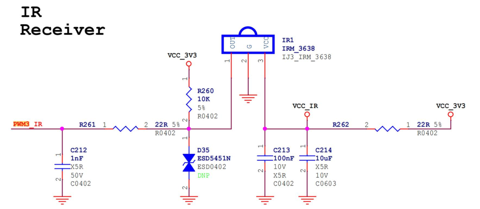

修改设备树，注释掉pwm3的节点，然后添加：

```dts
&pwm3 {
	status = "okay";
	compatible = "pwm-capture";
	pinctrl-names = "default";
	pwm-channel = <3>;
};
```


## 驱动程序

`rockchip_pwm_capture.h`

```c
/* SPDX-License-Identifier: GPL-2.0 */

#ifndef __RKXX_PWM_REMOTECTL_H__
#define __RKXX_PWM_REMOTECTL_H__

#include <linux/input.h>
#include <linux/pwm.h>
#include <linux/uaccess.h>
#include <linux/io.h>
#include <linux/slab.h>
#include <linux/fs.h>
#include <linux/kdev_t.h>
#include <linux/cdev.h>
#include <linux/device.h>
#include <linux/platform_device.h>

/* 最大按键数 */
#define MAX_NUM_KEYS                60
/* 最大PWM捕获数 */
#define PWM_PWR_KEY_CAPURURE_MAX    10

/* PWM寄存器定义 */
#define PWM_REG_CNTR                0x00  /* 计数器寄存器 */
#define PWM_REG_HPR                 0x04  /* 周期寄存器 */
#define PWM_REG_LPR                 0x08  /* 占空比寄存器 */
#define PWM_REG_CTRL                0x0c  /* 控制寄存器 */
#define PWM3_REG_INTSTS             0x10  /* PWM3中断状态寄存器 */
#define PWM2_REG_INTSTS             0x20  /* PWM2中断状态寄存器 */
#define PWM1_REG_INTSTS             0x30  /* PWM1中断状态寄存器 */
#define PWM0_REG_INTSTS             0x40  /* PWM0中断状态寄存器 */
#define PWM3_REG_INT_EN             0x14  /* PWM3中断使能寄存器 */
#define PWM2_REG_INT_EN             0x24  /* PWM2中断使能寄存器 */
#define PWM1_REG_INT_EN             0x34  /* PWM1中断使能寄存器 */
#define PWM0_REG_INT_EN             0x44  /* PWM0中断使能寄存器 */

/* 控制寄存器位定义 */
#define PWM_ENABLE                  (1 << 0) /* PWM使能 */
#define PWM_DISABLE                 (0 << 0) /* PWM禁用 */

/* 操作模式 */
#define PWM_MODE_ONESHOT            (0x00 << 1) /* 单次模式 */
#define PWM_MODE_CONTINUMOUS        (0x01 << 1) /* 连续模式 */
#define PWM_MODE_CAPTURE            (0x02 << 1) /* 捕获模式 */

/* 占空比输出极性 */
#define PWM_DUTY_POSTIVE            (0x01 << 3) /* 正极性 */
#define PWM_DUTY_NEGATIVE           (0x00 << 3) /* 负极性 */

/* 非活动状态输出极性 */
#define PWM_INACTIVE_POSTIVE        (0x01 << 4) /* 正极性 */
#define PWM_INACTIVE_NEGATIVE       (0x00 << 4) /* 负极性 */

/* 时钟源选择 */
#define PWM_CLK_SCALE               (1 << 9) /* 时钟分频 */
#define PWM_CLK_NON_SCALE           (0 << 9) /* 无时钟分频 */

#define PWM_CH0_INT                 (1 << 0)
#define PWM_CH1_INT                 (1 << 1)
#define PWM_CH2_INT                 (1 << 2)
#define PWM_CH3_INT                 (1 << 3)
#define PWM_PWR_KEY_INT             (1 << 7)

#define PWM_CH0_POL                 (1 << 8)
#define PWM_CH1_POL                 (1 << 9)
#define PWM_CH2_POL                 (1 << 10)
#define PWM_CH3_POL                 (1 << 11)

#define PWM_CH0_INT_ENABLE          (1 << 0)
#define PWM_CH0_INT_DISABLE         (0 << 0)

#define PWM_CH1_INT_ENABLE          (1 << 1)
#define PWM_CH1_INT_DISABLE         (0 << 1)

#define PWM_CH2_INT_ENABLE          (1 << 2)
#define PWM_CH2_INT_DISABLE         (0 << 2)

#define PWM_CH3_INT_ENABLE          (1 << 3)
#define PWM_CH3_INT_DISABLE         (0 << 3)

#define PWM_INT_ENABLE              1
#define PWM_INT_DISABLE             0

/* 预分频因子 */
#define PWMCR_MIN_PRESCALE          0x00
#define PWMCR_MAX_PRESCALE          0x07

#define PWMDCR_MIN_DUTY             0x0001
#define PWMDCR_MAX_DUTY             0xFFFF

#define PWMPCR_MIN_PERIOD           0x0001
#define PWMPCR_MAX_PERIOD           0xFFFF

enum pwm_div {
    PWM_DIV1    = (0x0 << 12),
    PWM_DIV2    = (0x1 << 12),
    PWM_DIV4    = (0x2 << 12),
    PWM_DIV8    = (0x3 << 12),
    PWM_DIV16   = (0x4 << 12),
    PWM_DIV32   = (0x5 << 12),
    PWM_DIV64   = (0x6 << 12),
    PWM_DIV128  = (0x7 << 12),
};

/* NEC 协议 */
#define RK_PWM_TIME_PRE_MIN         4000
#define RK_PWM_TIME_PRE_MAX         5000

#define RK_PWM_TIME_PRE_MIN_LOW     8000
#define RK_PWM_TIME_PRE_MAX_LOW     10000

#define RK_PWM_TIME_BIT0_MIN        390
#define RK_PWM_TIME_BIT0_MAX        730

#define RK_PWM_TIME_BIT1_MIN        1300
#define RK_PWM_TIME_BIT1_MAX        2000

#define RK_PWM_TIME_BIT_MIN_LOW     390
#define RK_PWM_TIME_BIT_MAX_LOW     730

#define RK_PWM_TIME_RPT_MIN         2000
#define RK_PWM_TIME_RPT_MAX         2500

#define RK_PWM_TIME_SEQ1_MIN        95000
#define RK_PWM_TIME_SEQ1_MAX        98000

#define RK_PWM_TIME_SEQ2_MIN        30000
#define RK_PWM_TIME_SEQ2_MAX        55000

#define PWM_REG_INTSTS(n)           ((3 - (n)) * 0x10 + 0x10)
#define PWM_REG_INT_EN(n)           ((3 - (n)) * 0x10 + 0x14)
#define RK_PWM_VERSION_ID(n)        ((3 - (n)) * 0x10 + 0x2c)
#define PWM_REG_PWRMATCH_CTRL(n)    ((3 - (n)) * 0x10 + 0x50)
#define PWM_REG_PWRMATCH_LPRE(n)    ((3 - (n)) * 0x10 + 0x54)
#define PWM_REG_PWRMATCH_HPRE(n)    ((3 - (n)) * 0x10 + 0x58)
#define PWM_REG_PWRMATCH_LD(n)      ((3 - (n)) * 0x10 + 0x5C)
#define PWM_REG_PWRMATCH_HD_ZERO(n) ((3 - (n)) * 0x10 + 0x60)
#define PWM_REG_PWRMATCH_HD_ONE(n)  ((3 - (n)) * 0x10 + 0x64)
#define PWM_PWRMATCH_VALUE(n)       ((3 - (n)) * 0x10 + 0x68)
#define PWM_PWRCAPTURE_VALUE(n)     ((3 - (n)) * 0x10 + 0x9c)

#define PWM_CH_INT(n)               BIT(n)
#define PWM_CH_POL(n)               BIT(n + 8)

#define PWM_CH_INT_ENABLE(n)        BIT(n)
#define PWM_PWR_INT_ENABLE          BIT(7)
#define CH3_PWRKEY_ENABLE           BIT(3)

/* PWM 数据结构 */
struct pwm_data {
    int period_ns; /* 周期（纳秒） */
    int duty_ns;   /* 占空比（纳秒） */
};

/* PWM 状态枚举 */
typedef enum _RMC_STATE {
    RMC_IDLE,   /* 空闲状态 */
    RMC_IDLE1,  /* 空闲状态1 */
    RMC_IDLE2,  /* 空闲状态2 */
    RMC_GETDATA,/* 获取数据状态 */
    RMC_DONE,   /* 完成状态 */
} eRMC_STATE;

/* PWM 捕获平台数据结构 */
struct RKxx_remotectl_platform_data {
    int nbuttons; /* 按钮数 */
    int rep;      /* 重复 */
    int timer;    /* 计时器 */
    int wakeup;   /* 唤醒 */
};

/* PWM 捕获字符设备数据结构 */
struct pwm_capture_cdev {
    dev_t dev_num;            /* 设备号 */
    struct cdev cdev_test;    /* 字符设备结构体 */
    struct class *class;      /* 设备类 */
    struct device *device;    /* 设备结构体 */
    struct rkxx_capture_drvdata *ddata; /* 驱动数据 */
};

/* PWM 捕获驱动数据结构 */
struct rkxx_capture_drvdata {
    void __iomem *base;       /* 基地址 */
    int irq;                  /* 中断号 */
    struct device dev;        /* 设备结构体 */
    int pwm_freq_nstime;      /* PWM 频率（纳秒） */
    int pwm_channel;          /* PWM 通道 */
    int hpr;                  /* 高电平周期 */
    int lpr;                  /* 低电平周期 */
    eRMC_STATE state;         /* PWM 状态 */
    struct clk *clk;          /* 时钟 */
    struct clk *p_clk;        /* 父时钟 */
    struct pwm_capture_cdev pwm_cdev; /* PWM 捕获字符设备 */
    struct pwm_data data;             /* PWM 数据结构 */
};

/* PWM 中断控制 */
static void rk_pwm_int_ctrl(void __iomem *pwm_base, uint pwm_id, int ctrl)
{
    int val;

    if (pwm_id > 3)
        return; /* 如果 PWM ID 超过 3，直接返回 */
    
    val = readl_relaxed(pwm_base + PWM_REG_INT_EN(pwm_id)); /* 读取当前中断使能状态 */
    
    if (ctrl) {
        val |= PWM_CH_INT_ENABLE(pwm_id); /* 设置中断使能 */
        writel_relaxed(val, pwm_base + PWM_REG_INT_EN(pwm_id)); /* 写入中断使能寄存器 */
    } else {
        val &= ~PWM_CH_INT_ENABLE(pwm_id); /* 清除中断使能 */
        writel_relaxed(val, pwm_base + PWM_REG_INT_EN(pwm_id)); /* 写入中断使能寄存器 */
    }
}

/* 初始化 PWM 捕获 */
static void rk_pwm_capture_init(void __iomem *pwm_base, uint pwm_id)
{
    int val;

    /* 禁用 PWM */
    val = readl_relaxed(pwm_base + PWM_REG_CTRL);
    val = (val & 0xFFFFFFFE) | PWM_DISABLE;
    writel_relaxed(val, pwm_base + PWM_REG_CTRL);

    /* 设置为捕获模式 */
    val = readl_relaxed(pwm_base + PWM_REG_CTRL);
    val = (val & 0xFFFFFFF9) | PWM_MODE_CAPTURE;
    writel_relaxed(val, pwm_base + PWM_REG_CTRL);

    /* 设置分频值 */
    val = readl_relaxed(pwm_base + PWM_REG_CTRL);
    val = (val & 0xFF0001FF) | PWM_DIV64;
    writel_relaxed(val, pwm_base + PWM_REG_CTRL);

    /* 启用中断 */
    rk_pwm_int_ctrl(pwm_base, pwm_id, PWM_INT_ENABLE);

    /* 这里可以启用 PWM 捕获（注释掉的代码） */
    /*
    val = readl_relaxed(pwm_base + PWM_REG_CTRL);
    val = (val & 0xFFFFFFFE) | PWM_ENABLE;
    writel_relaxed(val, pwm_base + PWM_REG_CTRL);
    */
}

#endif
```

`pwm-rockchip-capture.c`

```c
#include <linux/module.h>
#include <linux/init.h>
#include <linux/moduleparam.h>
#include <linux/fs.h>
#include <linux/kdev_t.h>
#include <linux/cdev.h>
#include <linux/device.h>
#include <linux/platform_device.h>
#include <linux/of.h>
#include <linux/pwm.h>
#include <linux/uaccess.h>
#include <linux/clk.h>
#include <linux/irq.h>
#include <linux/interrupt.h>
#include <linux/delay.h>
#include "rockchip_pwm_capture.h"

// 打开字符设备的回调函数
static int cdev_test_open(struct inode *inode, struct file *file) {
    struct rkxx_capture_drvdata *ddata;
    struct pwm_capture_cdev *pcdev;

    printk("This is cdev_test_open\n");

    // 从 inode 中获取设备数据
    pcdev = container_of(inode->i_cdev, struct pwm_capture_cdev, cdev_test);
    ddata = container_of(pcdev, struct rkxx_capture_drvdata, pwm_cdev);

    if (!ddata) {
        printk(KERN_ERR "Failed to get device data\n");
        return -ENODEV;
    }

    // 将设备数据保存到文件私有数据中
    file->private_data = ddata;

    return 0;
}

// 读取字符设备的回调函数
static ssize_t cdev_test_read(struct file *file, char __user *buf, size_t size, loff_t *off) {
    struct rkxx_capture_drvdata *ddata;
    int val, i, ret;

    ddata = file->private_data;

    if (!ddata) {
        printk(KERN_ERR "Device data is NULL\n");
        return -EINVAL;
    }

    // 初始化捕获数据
    ddata->lpr = 0;
    ddata->hpr = 0;
    ddata->state = RMC_IDLE1;

    // 启用 PWM
    val = readl_relaxed(ddata->base + PWM_REG_CTRL);
    val = (val & 0xFFFFFFFE) | PWM_ENABLE;
    writel_relaxed(val, ddata->base + PWM_REG_CTRL);

    // 等待数据捕获完成
    for (i = 0; i < 100; i++) {
        msleep(1);
        if (ddata->state == RMC_DONE && ddata->hpr && ddata->lpr) {
            printk("capture ok!\n");
            break;
        }
    }

    // 禁用 PWM
    val = readl_relaxed(ddata->base + PWM_REG_CTRL);
    val = (val & 0xFFFFFFFE) | PWM_DISABLE;
    writel_relaxed(val, ddata->base + PWM_REG_CTRL);

    if (ddata->hpr == 0 || ddata->lpr == 0) {
        printk(KERN_ERR "Failed to capture PWM data\n");
        return -EIO;
    }

    // 计算周期和占空比
    ddata->data.period_ns = (ddata->lpr + ddata->hpr) * ddata->pwm_freq_nstime;
    ddata->data.duty_ns = ddata->hpr * ddata->pwm_freq_nstime;

    // 将数据拷贝到用户空间
    ret = copy_to_user(buf, &ddata->data, size);
    if (ret) {
        printk(KERN_ERR "Failed to copy data to user space\n");
        return -EFAULT;
    }

    printk("This is cdev_test_read\n");

    ddata->state = RMC_IDLE;

    return size;
}

// 释放字符设备的回调函数
static int cdev_test_release(struct inode *inode, struct file *file) {
    printk("This is cdev_test_release\n");
    return 0;
}

// 字符设备操作函数结构体
static struct file_operations cdev_test_ops = {
    .owner = THIS_MODULE,
    .open = cdev_test_open,
    .read = cdev_test_read,
    .release = cdev_test_release
};

// PWM 捕获中断处理函数
irqreturn_t rk_pwm_capture(int irq, void *dev_id) {
    struct rkxx_capture_drvdata *ddata = dev_id;
    unsigned int channel = ddata->pwm_channel;
    int val, lpr, hpr;

    val = readl_relaxed(ddata->base + PWM_REG_INTSTS(channel));
    if ((val & PWM_CH_INT(channel)) == 0) {
        return IRQ_NONE;
    }

    // 根据极性读取 lpr 或 hpr
    if ((val & PWM_CH_POL(channel)) == 0) {
        if (ddata->state != RMC_DONE) {
            lpr = readl_relaxed(ddata->base + PWM_REG_LPR);
            ddata->lpr = lpr;
        }
    } else {
        if (ddata->state != RMC_DONE) {
            hpr = readl_relaxed(ddata->base + PWM_REG_HPR);
            ddata->hpr = hpr;
        }
    }

    // 清除中断状态
    writel_relaxed(PWM_CH_INT(channel), ddata->base + PWM_REG_INTSTS(channel));

    // 状态机处理
    switch (ddata->state) {
    case RMC_IDLE1:
        ddata->hpr = 0;
        ddata->lpr = 0;
        ddata->state = RMC_IDLE2;
        break;
    case RMC_IDLE2:
        ddata->hpr = 0;
        ddata->lpr = 0;
        ddata->state = RMC_GETDATA;
        break;
    case RMC_GETDATA:
        printk("ddata->hpr is %d, ddata->lpr is %d\n", ddata->hpr, ddata->lpr);
        if (ddata->hpr && ddata->lpr) {
            ddata->state = RMC_DONE;
        }
        break;
    default:
        break;
    }

    return IRQ_HANDLED;
}

// 驱动探测函数
int capture_probe(struct platform_device *pdev)
{
    int ret;
    struct rkxx_capture_drvdata *ddata;
    struct resource *r;
    struct clk *clk;
    struct clk *p_clk;
    struct device_node *np = pdev->dev.of_node;
    int pwm_channel;
    int irq;
    struct pwm_capture_cdev *pcdev;
    int freq;

    // 分配驱动数据结构
    ddata = devm_kzalloc(&pdev->dev, sizeof(struct rkxx_capture_drvdata), GFP_KERNEL);
    if (!ddata) {
        dev_err(&pdev->dev, "Failed to allocate memory for driver data\n");
        return -ENOMEM;
    }
    ddata->state = RMC_IDLE;

    // 获取资源
    r = platform_get_resource(pdev, IORESOURCE_MEM, 0);
    ddata->base = devm_ioremap_resource(&pdev->dev, r);
    if (IS_ERR(ddata->base)) {
        dev_err(&pdev->dev, "Failed to map memory resource\n");
        return PTR_ERR(ddata->base);
    }
    ddata->dev = pdev->dev;

    // 获取时钟
    clk = devm_clk_get(&pdev->dev, "pwm");
    if (IS_ERR(clk)) {
        dev_err(&pdev->dev, "Failed to get PWM clock\n");
        return PTR_ERR(clk);
    }
    ddata->clk = clk;

    p_clk = devm_clk_get(&pdev->dev, "pclk");
    if (IS_ERR(p_clk)) {
        dev_err(&pdev->dev, "Failed to get peripheral clock\n");
        return PTR_ERR(p_clk);
    }
    ddata->p_clk = p_clk;

    // 从设备树中读取 PWM 通道
    ret = of_property_read_u32(np, "pwm-channel", &pwm_channel);
    if (ret) {
        dev_err(&pdev->dev, "Failed to get PWM channel from device tree\n");
        return ret;
    }
    pwm_channel %= 4;
    ddata->pwm_channel = pwm_channel;

    // 获取中断号
    irq = platform_get_irq(pdev, 0);
    if (irq < 0) {
        dev_err(&pdev->dev, "Failed to get IRQ\n");
        return irq;
    }
    ddata->irq = irq;

    // 设置驱动数据
    platform_set_drvdata(pdev, ddata);

    // 请求中断
    ret = devm_request_irq(&pdev->dev, irq, rk_pwm_capture, IRQF_NO_SUSPEND, "rk_pwm_capture_irq", ddata);
    if (ret) {
        dev_err(&pdev->dev, "Failed to request IRQ\n");
        return ret;
    }

    // 启用时钟
    ret = clk_prepare_enable(ddata->clk);
    if (ret) {
        dev_err(&pdev->dev, "Failed to enable PWM clock\n");
        return ret;
    }

    ret = clk_prepare_enable(ddata->p_clk);
    if (ret) {
        clk_disable_unprepare(ddata->clk);
        dev_err(&pdev->dev, "Failed to enable peripheral clock\n");
        return ret;
    }

    // 计算 PWM 频率
    freq = clk_get_rate(ddata->clk) / 64;
    ddata->pwm_freq_nstime = 1000000000 / freq;

    // 注册字符设备
    pcdev = &ddata->pwm_cdev;
    ret = alloc_chrdev_region(&pcdev->dev_num, 0, 1, "alloc_name");
    if (ret < 0) {
        dev_err(&pdev->dev, "alloc_chrdev_region error\n");
        goto err_alloc_chrdev;
    }
    printk("alloc_chrdev_region success\n");

    pcdev->cdev_test.owner = THIS_MODULE;
    cdev_init(&pcdev->cdev_test, &cdev_test_ops);
    ret = cdev_add(&pcdev->cdev_test, pcdev->dev_num, 1);
    if (ret) {
        dev_err(&pdev->dev, "Failed to add cdev\n");
        goto err_cdev_add;
    }

    // 创建设备类
    pcdev->class = class_create(THIS_MODULE, "test");
    if (IS_ERR(pcdev->class)) {
        ret = PTR_ERR(pcdev->class);
        dev_err(&pdev->dev, "Failed to create class\n");
        goto err_class_create;
    }

    // 创建设备
    pcdev->device = device_create(pcdev->class, NULL, pcdev->dev_num, NULL, "capture");
    if (IS_ERR(pcdev->device)) {
        ret = PTR_ERR(pcdev->device);
        dev_err(&pdev->dev, "Failed to create device\n");
        goto err_device_create;
    }

    rk_pwm_capture_init(ddata->base, ddata->pwm_channel);

    return 0;

err_device_create:
    class_destroy(pcdev->class);
err_class_create:
    cdev_del(&pcdev->cdev_test);
err_cdev_add:
    unregister_chrdev_region(pcdev->dev_num, 1);
err_alloc_chrdev:
    clk_disable_unprepare(ddata->p_clk);
    clk_disable_unprepare(ddata->clk);
    return ret;
}

// 驱动移除函数
int capture_remove(struct platform_device *pdev)
{
    struct rkxx_capture_drvdata *ddata = platform_get_drvdata(pdev);
    struct pwm_capture_cdev *pcdev = &ddata->pwm_cdev;

    device_destroy(pcdev->class, pcdev->dev_num);
    class_destroy(pcdev->class);
    cdev_del(&pcdev->cdev_test);
    unregister_chrdev_region(pcdev->dev_num, 1);

    clk_disable_unprepare(ddata->p_clk);
    clk_disable_unprepare(ddata->clk);

    return 0;
}

// 设备树匹配表
const struct of_device_id capture_of_device_id[] = {
    {.compatible = "pwm-capture"},
    {}
};

// 平台驱动结构体
struct platform_driver capture_platform_driver = {
    .driver = {
        .name = "pwm-capture",
        .of_match_table = capture_of_device_id,
    },
    .probe = capture_probe,
    .remove = capture_remove,
};

// 模块初始化函数
static int __init modulecdev_init(void)
{
    return platform_driver_register(&capture_platform_driver);
}

// 模块退出函数
static void __exit modulecdev_exit(void)
{
    platform_driver_unregister(&capture_platform_driver);
}

module_init(modulecdev_init);
module_exit(modulecdev_exit);

MODULE_LICENSE("GPL");
MODULE_AUTHOR("topeet");

```

测试代码：

```c
#include <stdio.h>
#include <stdlib.h>
#include <stdint.h>
#include <fcntl.h>
#include <unistd.h>
#include <errno.h>
#include <string.h>

// 使用固定宽度类型，避免 ABI 问题
struct __attribute__((packed)) pwm_data {
    int32_t period_ns;
    int32_t duty_ns;
};

int main(int argc, char *argv[]) {
    const char *dev_path = "/dev/capture";
    int fd = open(dev_path, O_RDONLY);
    if (fd < 0) {
        fprintf(stderr, "无法打开设备 %s: %s\n", dev_path, strerror(errno));
        return EXIT_FAILURE;
    }

    struct pwm_data data;
    ssize_t n = read(fd, &data, sizeof(data));
    if (n < 0) {
        fprintf(stderr, "读取设备失败: %s\n", strerror(errno));
        close(fd);
        return EXIT_FAILURE;
    }
    if (n != sizeof(data)) {
        fprintf(stderr, "读取数据不完整: 期望 %zu 字节，实际 %zd 字节\n", 
                sizeof(data), n);
        close(fd);
        return EXIT_FAILURE;
    }

    printf("period_ns = %d ns, duty_ns = %d ns\n", data.period_ns, data.duty_ns);
    printf("占空比 = %.2f%%\n", 
           (data.period_ns > 0) ? (100.0 * data.duty_ns / data.period_ns) : 0.0);

    close(fd);
    return EXIT_SUCCESS;
}
```

我们需要另外一个PWM作为输入信号，接入PWM3，让其捕获。

