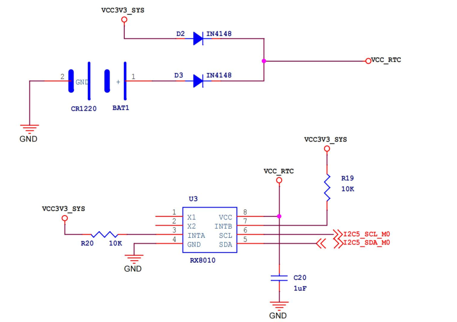
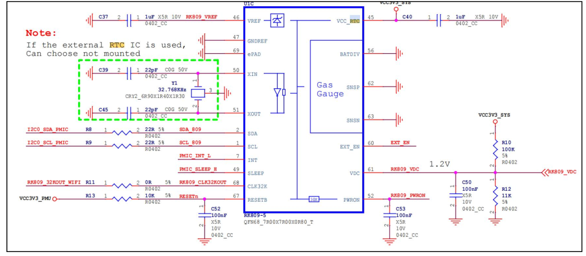
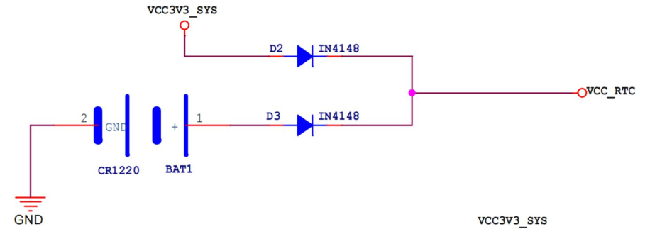
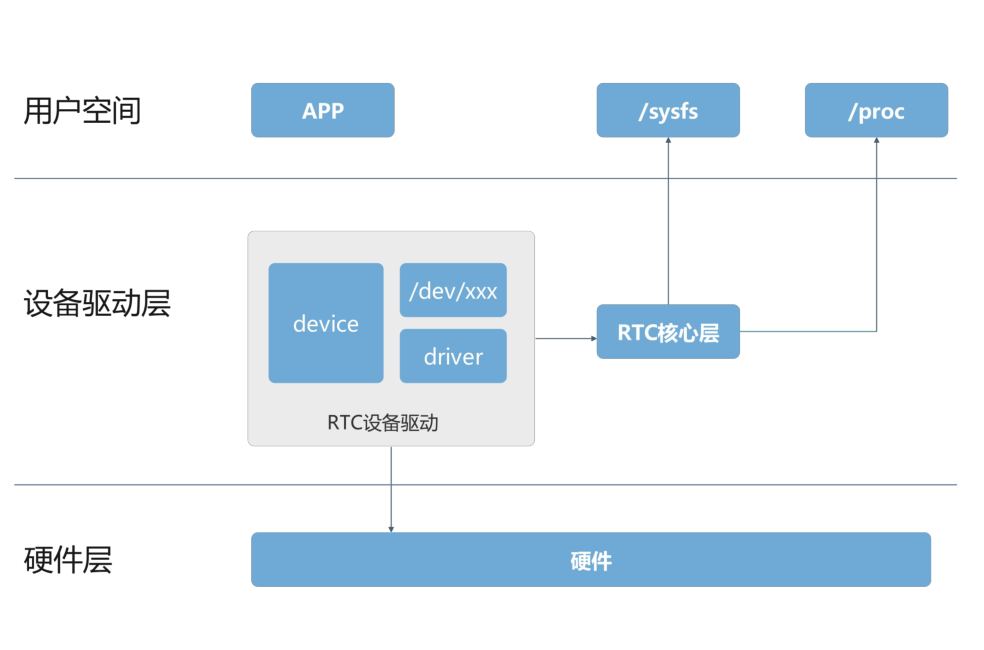
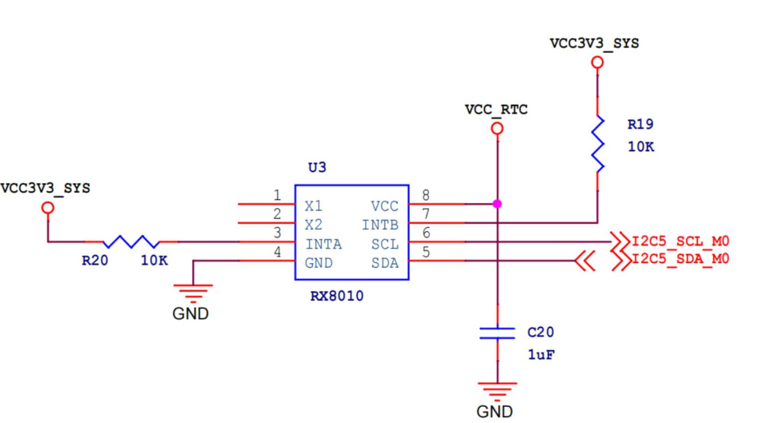
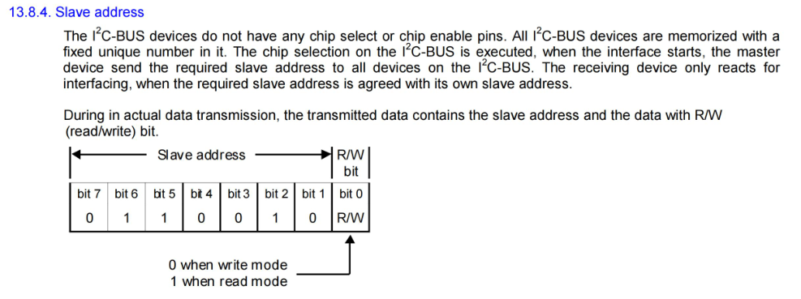

# RTC 基础

## RTC 介绍

**RTC（Real-Time Clock**）即**实时时钟**，是一种集成电路或模块，用于**在电子系统中提供精确的时间信息**。

与系统主处理器（CPU）不同，**RTC 主要负责维护系统的实时日期和时间**，

**RTC 的主要功能**：

1. ：RTC 能够持续跟踪当前的日期和时间，通常包括年、月、日、时、分、秒等信息。
2. ：RTC 通常配备有备用电池（如纽扣电池），即使主系统断电，RTC也能继续运行，确保时间信息不会丢失。

**RTC 的应用场景**：

1. 电子时钟：如电脑、手机、智能手表等设备中的时钟功能。
2. 嵌入式系统：在工业控制、物联网设备中，RTC 用于记录事件发生的时间。
3. 数据记录：在需要时间戳的场景中，RTC 提供准确的时间信息。
4. 定时任务：用于定时唤醒设备或执行特定操作。

**RTC 的特点**：

1. ：RTC 通常设计为低功耗运行，适合长时间使用。
2. ：能够提供较为精确的时间信息，误差较小。
3. ：即使主系统关闭，RTC 也能独立运行。

### 内部 RTC 和外部 RTC

实时时钟有着外部 RTC 和内部 RTC 这两种常见的实现方案。

**外部 RTC 是独立于主控芯片的专用 RTC 芯片，通过 I2C、SPI 等通信接口与主控芯片连接**。

- 优点
  - 具备高精度的特点，能够提供更准确的时间记录。
  - 外部 RTC 拥有独立的电源管理电路，可配备纽扣电池实现长时间独立运行，即使主控芯片断电或损坏，也能确保时间记录的连续性。
- 缺点
  - 外部 RTC 的成本较高，需要额外采购芯片及相关元件，同时增加了电路设计的复杂性和开发难度，并占用主控芯片的通信资源。

因此，外部 RTC 更适合对时间精度、可靠性和功能有较高要求的场景。在 iTOP-RK3568 开发板上就集成了外部 RTC，所使用的芯片是 RX8010，如下图所示：




**内部 RTC 是集成在主控芯片内部的实时时钟模块**

- 优点
  - 具有硬件集成的特点，无需额外硬件组件，因此设计简单、成本低且易于使用。
- 缺点
  - 内部 RTC 依赖主控芯片的供电，通常需要备用电池来维持断电后的时间记录
  - 。

因此，内部 RTC 更适合对时间精度要求不高、成本敏感的场景，例如家用电器、简单的物联网设备或实时性要求较低的系统。

而 iTOP-RK3568 核心板的电源管理芯片 RK809 默认是集成了内部 RTC 的，但由于上述内部 RTC 的种种缺点，且底板上已经有
了外部 RTC，所以内部 RTC 并没有被使能，RK809 电源管理芯片的内部 RTC 电路如下所示:




**总结**

| 类别     | 内部RTC                                                      | 外部RTC                                                      |
| -------- | ------------------------------------------------------------ | ------------------------------------------------------------ |
| 定义     | 集成在主控芯片内的RTC模块                                    | 独立的专用RTC芯片，通过I²C/SPI等接口连接                     |
| 特点     | - 硬件集成 <br />- 低功耗模式支持 <br />- 依赖主控电源 <br />- 精度有限 | - 独立运行<br />- 高精度<br />- 多功能扩展                   |
| 优点     | 1. 成本低<br />2. 设计简单<br />3. 易于使用                  | 1. 高精度<br />2. 独立性强<br />3. 功能丰富<br />4. 可靠性高 |
| 缺点     | 1. 精度不足<br />2. 可靠性较低<br />3. 缺乏独立性            | 1. 成本较高<br />2. 设计复杂<br />3. 占用资源                |
| 适用场景 | 对时间精度要求不高、成本敏感、实时性要求低的系统             | 对时间精度要求高、需长时间独立运行、需额外功能的场景         |

### RK3568 RTC 外设


可以将这个电路分为 RTC 电源供电部分以及 RTC 芯片电路部分，根据 RTC 芯片电路部分可以得到 RX8010 挂载到了 I2C5 上



该系统的主要功能是通过**主电源供电模式和备用电池供电模式的切换**，确保 RTC 模块在主电源（`VCC3V3_SYS`）断电时仍能通过备用电池（`CR1220`）继续工作，从而保持时间信息不丢失。分为以下两种情况。

1. 在系统正常运行时，`VCC3V3_SYS` 提供 3.3V 电源，二极管 D2 正向导通为 RTC 模块供电，同时二极管 D3 反向截止以防止主电源向电池充电或消耗电池电量；
2. 当系统断电（`VCC3V3_SYS` 失效）时，二极管 D2 反向截止以防止电池电量通过主电源回路消耗，同时二极管 D3 正向导通，由`CR1220` 电池为 RTC 模块供电，确保 RTC 继续运行。

# RX8010 驱动分析和移植

## RTC子系统框架



在上图中 RTC 子系统被划分为了三个层次，分别为用户空间、设备驱动层和硬件层，设备驱动层又包括 RTC 设备驱动和 PWM 核心层：

- 用户空间是应用程序运行的层级，在这一层，应用程序通过不同的接口与系统进行交互，比如访问 `/dev/xxx` 设备节点来读写 RTC 时间，或通过 `sysf`s 和 `proc` 文件系统来获取或设置硬件状态。

- 中间的设备驱动层又分为了 RTC 设备驱动和 RTC 核心层，，。
  - RTC 设备驱动负责操作硬件的具体细节通过与硬件（RTC 芯片）进行直接通信来实现硬件控制，设备驱动程序还负责将硬件设备暴露给上层系统，如 `device`（设备文件）和 `driver`（驱动程序）。
    - `/dev/xxx` 是指用于操作设备的接口文件，用户应用程序通过它与 RTC 硬件进行交互。
    - `driver` 部分则是系统内核的一个模块，负责具体的硬件控制操作。
  - RTC 核心层负责管理和协调 RTC 的时间管理功能。它确保系统正确地读取和设置时间，同时确保时钟在断电时继续运行。
- 在 RTC 硬件层代表实际的 RTC 硬件，通过硬件接口（如 I2C、SPI 等）与设备驱动层进行通信，提供实际的时间计时功能。

## RTC 驱动源码分析

### 设备树

```dts
//RTC 芯片使能
&i2c5 {
        status = "okay";

        rx8010: rx8010@32 {
                compatible = "epson,rx8010";
                reg = <0x32>;
                status = "okay";
                #clock-cells = <0>;
        };
};

```

通过再通过 compatible 属性`epson,rx8010`找到匹配的驱动文件，驱动的具体路径为 `drivers/rtc/rtc-rx8010.c`，先来找到驱动的入口函数：

```c
static struct i2c_driver rx8010_driver = {
	.driver = {
		.name = "rtc-rx8010",
		.of_match_table = of_match_ptr(rx8010_of_match),
	},
	.probe		= rx8010_probe,
	.id_table	= rx8010_id,
};

module_i2c_driver(rx8010_driver);
```

### module_i2c_driver()

这个宏是用来简化 I2C 设备驱动的注册和注销过程的，定义在 `include/linux/i2c.h` 文件中，具体如下所示

```c
/**
 * module_i2c_driver() - Helper macro for registering a modular I2C driver
 * @__i2c_driver: i2c_driver struct
 *
 * Helper macro for I2C drivers which do not do anything special in module
 * init/exit. This eliminates a lot of boilerplate. Each module may only
 * use this macro once, and calling it replaces module_init() and module_exit()
 */
#define module_i2c_driver(__i2c_driver) \
	module_driver(__i2c_driver, i2c_add_driver, \
			i2c_del_driver)

```

#### module_driver()

`module_driver` 宏也是一个用来简化的宏，对应的宏定义如下所示

`include/linux/device/driver.h`

```c
/**
 * module_driver() - Helper macro for drivers that don't do anything
 * special in module init/exit. This eliminates a lot of boilerplate.
 * Each module may only use this macro once, and calling it replaces
 * module_init() and module_exit().
 *
 * @__driver: driver name
 * @__register: register function for this driver type
 * @__unregister: unregister function for this driver type
 * @...: Additional arguments to be passed to __register and __unregister.
 *
 * Use this macro to construct bus specific macros for registering
 * drivers, and do not use it on its own.
 */
#define module_driver(__driver, __register, __unregister, ...) \
static int __init __driver##_init(void) \
{ \
	return __register(&(__driver) , ##__VA_ARGS__); \
} \
module_init(__driver##_init); \
static void __exit __driver##_exit(void) \
{ \
	__unregister(&(__driver) , ##__VA_ARGS__); \
} \
module_exit(__driver##_exit);
```

最后来对上述宏进行代入，展开可以得到如下内容：

```c
static int __init rx8010_driver_init(void)
{
	return i2c_add_driver(&rx8010_driver);
}
module_init(rx8010_driver_init);

static void __exit rx8010_driver_exit(void)
{
	i2c_del_driver(&rx8010_driver);
}
module_exit(rx8010_driver_exit);
```

- `rx8010_driver_init` 函数在模块加载时被调用，它通过 `i2c_add_driver` 函数将 `rx8010_driver`注册到内核中。

- `rx8010_driver_exit` 函数在模块卸载时被调用，它通过 `i2c_del_driver` 函数将 `rx8010_driver` 从内核中注销。

### rx8010_probe()

当 compatible 匹配之后会进入到 probe 函数，probe 函数内容如下所示

```c
static int rx8010_probe(struct i2c_client *client,
			const struct i2c_device_id *id)
{
	struct i2c_adapter *adapter = to_i2c_adapter(client->dev.parent);// 获取 I2C 适配器对象，用于检查功能支持
	const struct rtc_class_ops *rtc_ops;// RTC 操作函数指针
	struct rx8010_data *rx8010;// 用于存储设备私有数据的结构体
	int err = 0;// 错误码初始化为 0

    // 检查 I2C 适配器是否支持所需的 SMBus 功能
	if (!i2c_check_functionality(adapter, I2C_FUNC_SMBUS_BYTE_DATA
		| I2C_FUNC_SMBUS_I2C_BLOCK)) {
		dev_err(&adapter->dev, "doesn't support required functionality\n");
		return -EIO;// 如果不支持，打印错误信息并返回 -EIO（输入/输出错误）
	}

    // 分配一块清零的内存，并将其与设备生命周期绑定。
	rx8010 = devm_kzalloc(&client->dev, sizeof(struct rx8010_data),
			      GFP_KERNEL);
	if (!rx8010)// 如果内存分配失败，返回 -ENOMEM（内存不足错误）
		return -ENOMEM;
	// 初始化设备私有数据
	rx8010->client = client;
	i2c_set_clientdata(client, rx8010); // 将私有数据与 I2C 客户端关联
	// 初始化 RX8010 设备
	err = rx8010_init_client(client);
	if (err)
		return err;// 如果初始化失败，直接返回错误码

	if (client->irq > 0) {// 检查设备是否提供了中断号
		dev_info(&client->dev, "IRQ %d supplied\n", client->irq);
        // 请求线程化的中断处理程序
		err = devm_request_threaded_irq(&client->dev, client->irq, NULL,
						rx8010_irq_1_handler,
						IRQF_TRIGGER_LOW | IRQF_ONESHOT,
						"rx8010", client);

		if (err) {
            // 如果请求中断失败，打印错误信息并返回错误码
			dev_err(&client->dev, "unable to request IRQ\n");
			return err;
		}
		// 如果有中断支持，使用带有报警功能的 RTC 操作函数
		rtc_ops = &rx8010_rtc_ops_alarm;
	} else {
        // 如果没有中断支持，使用默认的 RTC 操作函数
		rtc_ops = &rx8010_rtc_ops_default;
	}

    // 注册 RTC 设备
	rx8010->rtc = devm_rtc_device_register(&client->dev, client->name,
					       rtc_ops, THIS_MODULE);

	if (IS_ERR(rx8010->rtc)) {
        // 如果注册失败，打印错误信息并返回错误码
		dev_err(&client->dev, "unable to register the class device\n");
		return PTR_ERR(rx8010->rtc);
	}

	rx8010->rtc->max_user_freq = 1;// 设置 RTC 设备的最大用户频率

	return err;// 返回成功状态
}

```

probe函数中定义了一个用于存储设备私有数据的 `rx8010_data` 结构体变量 rx8010，该结构体定义如下所示：

#### struct rx8010_data

```c
struct rx8010_data {
	struct i2c_client *client; // I2C 客户端，用于与 RX8010 设备通信
	struct rtc_device *rtc; // RTC 设备，用于管理实时时钟功能
	u8 ctrlreg;	// 控制寄存器的值，用于存储或配置 RX8010 的控制状态
};
```

`i2c_client` 是指向 I2C 客户端的指针，用于与 RX8010 设备通信，而 `rtc_device` 结构体表示与 RX8010 设备关联的 RTC（实时时
钟）设备，该结构体的定义如下所示：


##### struct rtc_device

```c
struct rtc_device {
	struct device dev;// 设备结构体，用于与设备模型集成
	struct module *owner;// 拥有该 RTC 设备的模块

	int id;// RTC 设备的 ID

	const struct rtc_class_ops *ops;// RTC 设备的操作函数集
	struct mutex ops_lock;// 用于保护操作函数集的互斥锁

	struct cdev char_dev;// 字符设备，用于用户空间访问 RTC 设备
	unsigned long flags;// RTC 设备的标志位

	unsigned long irq_data;// 中断相关数据
	spinlock_t irq_lock;// 用于保护中断数据的自旋锁
	wait_queue_head_t irq_queue;// 等待队列，用于处理中断事件
	struct fasync_struct *async_queue;// 异步通知队列

	int irq_freq;// 中断频率
	int max_user_freq;// 用户空间允许的最大中断频率

	struct timerqueue_head timerqueue;// 定时器队列，用于管理定时器事件
	struct rtc_timer aie_timer;	// 闹钟中断定时器
	struct rtc_timer uie_rtctimer; // 更新中断定时器
	struct hrtimer pie_timer; /* sub second exp, so needs hrtimer */ // 高精度定时器，用于处理亚秒级的中断
	int pie_enabled;// 高精度定时器是否启用
	struct work_struct irqwork;// 中断处理的工作队列
	/* Some hardware can't support UIE mode */
	int uie_unsupported;// 硬件是否不支持更新中断模式

	/* Number of nsec it takes to set the RTC clock. This influences when
	 * the set ops are called. An offset:
	 *   - of 0.5 s will call RTC set for wall clock time 10.0 s at 9.5 s
	 *   - of 1.5 s will call RTC set for wall clock time 10.0 s at 8.5 s
	 *   - of -0.5 s will call RTC set for wall clock time 10.0 s at 10.5 s
	 */
	long set_offset_nsec;/* 设置 RTC 时钟时的偏移时间（纳秒） */

	bool registered;// 设备是否已注册

	/* Old ABI support */
	bool nvram_old_abi;// 是否使用旧的 NVRAM ABI
	struct bin_attribute *nvram;// NVRAM 的二进制属性

	time64_t range_min;// RTC 设备支持的最小时间范围
	timeu64_t range_max;// RTC 设备支持的最大时间范围
	time64_t start_secs;// RTC 设备的起始时间（秒）
	time64_t offset_secs;// RTC 设备的偏移时间（秒）
	bool set_start_time;// 是否设置了起始时间

#ifdef CONFIG_RTC_INTF_DEV_UIE_EMUL
	struct work_struct uie_task;// 更新中断模拟任务
	struct timer_list uie_timer;// 更新中断模拟定时器
	/* Those fields are protected by rtc->irq_lock */  /* 以下字段由 rtc->irq_lock 保护 */
	unsigned int oldsecs;// 上一次读取的秒数
	unsigned int uie_irq_active:1;// 更新中断是否激活
	unsigned int stop_uie_polling:1;// 是否停止更新中断轮询
	unsigned int uie_task_active:1;// 更新中断任务是否激活
	unsigned int uie_timer_active:1;// 更新中断定时器是否激活
#endif
};
```

该结构体是 Linux 内核中 RTC 设备的核心数据结构，涵盖了 RTC 设备的所有功能和状态。


#### rx8010_init_client()

probe 函数中通过 `rx8010_init_client` 函数对 RX8010 芯片进行初始化和配置，由于不同的 RTC 芯片寄存器并不相同，因此初始化代码也不同。

```c
static int rx8010_init_client(struct i2c_client *client)
{
	struct rx8010_data *rx8010 = i2c_get_clientdata(client);
	u8 ctrl[2];
	int need_clear = 0, err = 0;

	u8 flag;
    flag = i2c_smbus_read_byte_data(client, RX8010_FLAG);
    if(err < 0)
        return err;

    flag &= ~(RX8010_FLAG_VLF);
        err = i2c_smbus_write_byte_data(client, RX8010_FLAG, flag);

	/* Initialize reserved registers as specified in datasheet */
	err = i2c_smbus_write_byte_data(client, RX8010_RESV17, 0xD8);
	if (err < 0)
		return err;

	err = i2c_smbus_write_byte_data(client, RX8010_RESV30, 0x00);
	if (err < 0)
		return err;

	err = i2c_smbus_write_byte_data(client, RX8010_RESV31, 0x08);
	if (err < 0)
		return err;

	err = i2c_smbus_write_byte_data(client, RX8010_IRQ, 0x00);
	if (err < 0)
		return err;

	err = i2c_smbus_read_i2c_block_data(rx8010->client, RX8010_FLAG,
					    2, ctrl);
	if (err != 2)
		return err < 0 ? err : -EIO;

	if (ctrl[0] & RX8010_FLAG_VLF)
		dev_warn(&client->dev, "Frequency stop was detected\n");

	if (ctrl[0] & RX8010_FLAG_AF) {
		dev_warn(&client->dev, "Alarm was detected\n");
		need_clear = 1;
	}

	if (ctrl[0] & RX8010_FLAG_TF)
		need_clear = 1;

	if (ctrl[0] & RX8010_FLAG_UF)
		need_clear = 1;

	if (need_clear) {
		ctrl[0] &= ~(RX8010_FLAG_AF | RX8010_FLAG_TF | RX8010_FLAG_UF);
		err = i2c_smbus_write_byte_data(client, RX8010_FLAG, ctrl[0]);
		if (err < 0)
			return err;
	}

	rx8010->ctrlreg = (ctrl[1] & ~RX8010_CTRL_TEST);

	return 0;
}

```

#### struct rtc_class_ops

```c
	if (client->irq > 0) {// 检查设备是否提供了中断号
		dev_info(&client->dev, "IRQ %d supplied\n", client->irq);
        // 请求线程化的中断处理程序
		err = devm_request_threaded_irq(&client->dev, client->irq, NULL,
						rx8010_irq_1_handler,
						IRQF_TRIGGER_LOW | IRQF_ONESHOT,
						"rx8010", client);

		if (err) {
            // 如果请求中断失败，打印错误信息并返回错误码
			dev_err(&client->dev, "unable to request IRQ\n");
			return err;
		}
		// 如果有中断支持，使用带有报警功能的 RTC 操作函数
		rtc_ops = &rx8010_rtc_ops_alarm;
	} else {
        // 如果没有中断支持，使用默认的 RTC 操作函数
		rtc_ops = &rx8010_rtc_ops_default;
	}
```

probe 函数中会根据设备是否提供了中断号来决定 RTC 芯片的操作模式，但无论是硬件连接还是设备树配置中没有使用中断，所以进入的是第二个判断，也就是`rtc_ops = &rx8010_rtc_ops_default;`

```c
static const struct rtc_class_ops rx8010_rtc_ops_default = {
	.read_time = rx8010_get_time, // 读取当前时间的函数指针
	.set_time = rx8010_set_time,  // 设置当前时间的函数指针
	.ioctl = rx8010_ioctl,	      // 提供额外控制功能的函数指针
};
```

`rx8010_rtc_ops_default` 为 RX8010 实时时钟芯片提供一组默认的操作函数接口，包括读取当前时间的函数指针、设置当前时间的函数指针以及 ioctl 外控制功能

#### devm_rtc_device_register()

在 probe 函数中，使用 `devm_rtc_device_register` 函数注册 rtc 设备，该函数在 `drivers/rtc/class.c` 文件中，函数具体内容如下所示:

```c
/**
 * devm_rtc_device_register - resource managed rtc_device_register()
 * @dev: the device to register
 * @name: the name of the device (unused)
 * @ops: the rtc operations structure
 * @owner: the module owner
 *
 * @return a struct rtc on success, or an ERR_PTR on error
 *
 * Managed rtc_device_register(). The rtc_device returned from this function
 * are automatically freed on driver detach.
 * This function is deprecated, use devm_rtc_allocate_device and
 * rtc_register_device instead
 */
struct rtc_device *devm_rtc_device_register(struct device *dev,
					    const char *name,
					    const struct rtc_class_ops *ops,
					    struct module *owner)
{
	struct rtc_device *rtc;
	int err;
	// 分配设备资源管理器的内存，用于存储 RTC 设备指针
	rtc = devm_rtc_allocate_device(dev);
	if (IS_ERR(rtc))
		return rtc;// 如果分配失败，返回错误指针（内存不足）

	rtc->ops = ops;

	err = __rtc_register_device(owner, rtc);// 调用 rtc_device_register 注册 RTC 设备
	if (err)
		return ERR_PTR(err);

	return rtc;
}
EXPORT_SYMBOL_GPL(devm_rtc_device_register);
```


##### __rtc_register_device()

```c
int __rtc_register_device(struct module *owner, struct rtc_device *rtc)
{
	struct rtc_wkalrm alrm;// 用于存储报警信息
	int err;

	if (!rtc->ops) {
		dev_dbg(&rtc->dev, "no ops set\n");
		return -EINVAL;
	}

	rtc->owner = owner;// 设置模块所有者
	rtc_device_get_offset(rtc);// 获取 RTC 设备的时间偏移量

	/* Check to see if there is an ALARM already set in hw */
    // 检查硬件中是否已经设置了报警
	err = __rtc_read_alarm(rtc, &alrm);// 尝试读取硬件中的报警信息
	if (!err && !rtc_valid_tm(&alrm.time))// 如果读取成功且时间有效
		rtc_initialize_alarm(rtc, &alrm);// 初始化报警

	rtc_dev_prepare(rtc);// 准备 RTC 设备的字符设备接口

    // 将 RTC 设备的字符设备和设备结构体添加到内核
	err = cdev_device_add(&rtc->char_dev, &rtc->dev);
	if (err)
		dev_warn(rtc->dev.parent, "failed to add char device %d:%d\n",
			 MAJOR(rtc->dev.devt), rtc->id);
	else
		dev_dbg(rtc->dev.parent, "char device (%d:%d)\n",
			MAJOR(rtc->dev.devt), rtc->id);

	rtc_proc_add_device(rtc);// 将 RTC 设备添加到 proc 文件系统中

	rtc->registered = true;
	dev_info(rtc->dev.parent, "registered as %s\n",
		 dev_name(&rtc->dev));

#ifdef CONFIG_RTC_HCTOSYS_DEVICE// 如果配置了 RTC 作为系统时间源，并且设备名称匹配，则同步硬件时钟到系统时钟
	if (!strcmp(dev_name(&rtc->dev), CONFIG_RTC_HCTOSYS_DEVICE))
		rtc_hctosys(rtc);
#endif

	return 0;
}
EXPORT_SYMBOL_GPL(__rtc_register_device);
```

该函数主要作用是注册一个 RTC 设备到 Linux 内核的 RTC 子系统中 。它完成了一系列初始化和资源分配工作，使得内核可以通过标准接口与该 RTC 设备交互。

重点是调用了`cdev_device_add` 函数，将 RTC 设备的字符设备和设备结构体注册到内核中，使RTC 设备正式成为内核的一部分，可供用户空间或其他内核模块使用。

然后是其中的 `rtc_proc_add_device`，将 RTC 设备的信息添加到 proc 子系统当中，便于调试和监控。

## 移植 RX8010 驱动



可以确定 RX8010 挂载到了 I2C5 上，所以需要在设备树的 i2c5 节点下添加 rx8010 的节点，添加内容如下所示：

```c
&i2c5 {
	status = "okay";
	rx8010: rx8010@32 {
		compatible = "epson,rx8010";
		reg = <0x32>;
		status = "okay";
		#clock-cells = <0>;
	};
};
```

reg 属性表示 RX8010 的地址为 0x32，这里的地址可以根据 RX8010 数据手册得到，具体如下所示：



这里总共有 8 位的数据，这是因为在实际的数据传输过程中，其中从设备地址占字节的高 7 位（bit 7 到 bit 1），所以从上图可以得到 RX8010 的地址为 0110010，换算就可以得到 0x32 了。

然后来到 Linux 内核源码的根目录，使用menuconfig打开RX8010驱动

```
Device Drivers
	Real Time Clock
		<*> Epson RX8010SJ
```

除此之外还要确保 RK 电源管理芯片的内部 RTC 没有被勾选，确保系统里面不会存在两个RTC 设备

```
Device Drivers
	Real Time Clock
		<*> Rockchip RK805/RK808/RK809/RK816/RK817/RK818 RTC
```

# 时间相关命令

## date 命令

date 是 Linux 系统中一个非常强大的命令行工具，用于显示或设置系统的日期和时间。它不仅可以查看当前的系统时间，还可以设置系统时间、格式化日期和时间的输出、解析时间字符串并进行时间计算。

- **显示当前日期和时间**

直接运行 date 命令会显示当前系统的日期和时间，格式为默认的本地时间格式，如下所示

```bash
$ date
Mon Jan  5 09:37:49 PM CST 2026
```

> CST表示时区（China Standard Time）

- **设置系统时间**

使用 date 命令可以设置系统时间的命令格式如下所示：

```bash
date [MMDDhhmm[[CC]YY][.ss]]
# MM：月份（两位数字，如 10 表示十月）。
# DD：日期（两位数字，如 30 表示 30 日）。
# hh：小时（24 小时制，两位数字，如 14 表示下午 2 点）。
# mm：分钟（两位数字，如 23 表示 23 分钟）。
# CC：世纪（可选，两位数字，如 20 表示 2000 年代）。
# YY：年份（两位数字，如 23 表示 2023 年）。
# .ss：秒数（可选，两位数字，如 .45 表示 45 秒）。
```


例如将系统时间设置为 2025 年 1 月 20 日 14:23:45：

```bash
date 012014232025.45
```

- **格式化输出**

date 命令支持通过格式化字符串自定义输出的日期和时间格式。在 date 命令后加上 + 和格式化字符串，可以指定输出格式。

| 格式符 | 描述                       | 示例    |
| ------ | -------------------------- | ------- |
| `%Y`   | 年份（四位数字）           | 2023    |
| `%m`   | 月份（两位数字）           | 10      |
| `%d`   | 日期（两位数字）           | 30      |
| `%H`   | 小时（24小时制，两位数字） | 14      |
| `%I`   | 小时（12小时制，两位数字） | 02      |
| `%M`   | 分钟（两位数字）           | 23      |
| `%S`   | 秒数（两位数字）           | 45      |
| `%A`   | 星期几（完整名称）         | Monday  |
| `%a`   | 星期几（缩写名称）         | Mon     |
| `%B`   | 月份（完整名称）           | October |
| `%b`   | 月份（缩写名称）           | Oct     |
| `%p`   | AM/PM                      | PM      |
| `%Z`   | 时区                       | CST     |

例如，将格式为 `YYYY-MM-DD HH:MM:SS`，并输出当前时间：

```bash
date "+%Y-%m-%d %H:%M:%S"
```

## hwclock 命令

hwclock 是 Linux 系统中用于**管理硬件时钟**的命令行工具。包括查看、设置和同步硬件时钟与系统时钟。

- **查看硬件时钟**

直接运行 hwclock 命令会显示当前硬件时钟的时间。

```bash
$ sudo hwclock
2026-01-05 21:52:44.991760+08:00
```

> hwclock 命令显示的是硬件时钟的时间。硬件时钟通常默认存储的是 UTC 时间，UTC 是目前全球使用的标准时间，它是基于原子时钟的精确时间定义，并且不受地球自转变化的影响。
>
> UTC 是全球时间的基准，不属于任何时区，因此它也被称为世界标准时间。
>
> 而 date 命令显示的是系统时钟的时间，系统时钟会根据操作系统的时区设置来调整时间。
>
> 上面打印的时区为 CST，即中国时区，那么 date 命令显示的时间会是 UTC+8。因此，系统时钟和硬件时钟使用不同的时间标准，导致二者之间的时间差。假设你在中国（UTC+8），那么两者的时间差正好是 8 小时。

- **同步硬件时钟与系统时钟**
  - `hwclock -s`将系统时钟同步到硬件时钟
  - `hwclock -w`将硬件时钟同步到系统时钟

每次系统上电启动之后，都会将 RTC 里面的硬件时间同步到系统时间，具体的实现在内核`drivers/rtc/class.c` 文件的 `rtc_hctosys` 函数实现的。该函数的具体内容如下所示：

```c
#ifdef CONFIG_RTC_HCTOSYS_DEVICE
/* Result of the last RTC to system clock attempt. */
int rtc_hctosys_ret = -ENODEV;

/* IMPORTANT: the RTC only stores whole seconds. It is arbitrary
 * whether it stores the most close value or the value with partial
 * seconds truncated. However, it is important that we use it to store
 * the truncated value. This is because otherwise it is necessary,
 * in an rtc sync function, to read both xtime.tv_sec and
 * xtime.tv_nsec. On some processors (i.e. ARM), an atomic read
 * of >32bits is not possible. So storing the most close value would
 * slow down the sync API. So here we have the truncated value and
 * the best guess is to add 0.5s.
 */

static void rtc_hctosys(struct rtc_device *rtc)
{
	int err;
	struct rtc_time tm;// 用于存储从 RTC 设备读取的时间
	struct timespec64 tv64 = {
		.tv_nsec = NSEC_PER_SEC >> 1, // 设置纳秒部分为 0.5 秒（用于时间精度调整）
	};

    // 从 RTC 设备读取当前时间
	err = rtc_read_time(rtc, &tm);
	if (err) {// 如果读取时间失败
		dev_err(rtc->dev.parent,
			"hctosys: unable to read the hardware clock\n");
		goto err_read;
	}
	// 将 RTC 时间转换为 Unix 时间戳（自 1970 年 1 月 1 日以来的秒数）
	tv64.tv_sec = rtc_tm_to_time64(&tm);

#if BITS_PER_LONG == 32 
	if (tv64.tv_sec > INT_MAX) {// 在 32 位系统上，检查时间戳是否超出范围
		err = -ERANGE; // 如果超出范围，设置错误码为 "超出范围"
		goto err_read;// 跳转到错误处理标签
	}
#endif

	err = do_settimeofday64(&tv64);// 将时间戳设置为系统时钟

	dev_info(rtc->dev.parent, "setting system clock to %ptR UTC (%lld)\n",
		 &tm, (long long)tv64.tv_sec);

err_read:
	rtc_hctosys_ret = err;
}
#endif

```

通过 `rtc_read_time` 函数读取 RTC 硬件里面存储的时间，然后通过`do_settimeofday64` 函数将转换之后的时间戳设置为系统时钟。


# RTC 应用程序编写

## `ioctl` 宏定义解析

### `RTC_RD_TIME`

```c
#define RTC_RD_TIME _IOR('p', 0x09, struct rtc_time)
```

- `_IOR(type, nr, data_type)`：表示 **从内核读取数据到用户空间**。
  - `'p'`：魔数（magic number），用于区分不同设备的 `ioctl` 命令（RTC 固定为 `'p'`）。
  - `0x09`：命令编号。
  - `struct rtc_time`：期望的数据类型。

> 功能：**读取 RTC 硬件当前时间**（注意：不是系统时间！）

------

### `RTC_SET_TIME`

```c
#define RTC_SET_TIME _IOW('p', 0x0a, struct rtc_time)
```

- `_IOW(type, nr, data_type)`：表示 **从用户空间写入数据到内核**。
- 其他参数同上。

> 功能：**将用户指定的时间写入 RTC 硬件**（通常需要 root 权限）。

------

## `struct rtc_time` 结构体

这是 Linux 内核定义的标准时间结构（位于 `<linux/rtc.h>`），与 C 标准库的 `struct tm` **几乎相同**，但**不保证完全兼容**（尤其在跨平台时）。

| 字段       | 范围            | 说明             | ⚠️ 注意             |
| ---------- | --------------- | ---------------- | ------------------ |
| `tm_sec`   | 0–59            | 秒               | —                  |
| `tm_min`   | 0–59            | 分钟             | —                  |
| `tm_hour`  | 0–23            | 小时（24小时制） | —                  |
| `tm_mday`  | 1–31            | 日期（1号起）    | 不是 0-based！     |
| `tm_mon`   | **0–11**        | 月份（0=Jan）    | **容易出错！**     |
| `tm_year`  | **年份 - 1900** | 如 2023 → `123`  | **必须减 1900！**  |
| `tm_wday`  | 0–6             | 星期（0=Sun）    | 驱动通常自动计算   |
| `tm_yday`  | 0–365           | 年内第几天       | 驱动通常自动计算   |
| `tm_isdst` | 通常为 0        | 夏令时标志       | RTC 硬件一般不支持 |

> **关键陷阱**：
>
> - 设置 2023 年 2 月 15 日 → `.tm_year = 123`, `.tm_mon = 1`
> - 打印时要加回去：`tm_year + 1900`, `tm_mon + 1`

------

## 示例

```c
#include <stdio.h>
#include <fcntl.h>
#include <unistd.h>
#include <sys/ioctl.h>
#include <linux/rtc.h>
#include <errno.h>
#include <string.h>
#include <stdlib.h>

int main() {
    int fd;
    struct rtc_time tm;

    // 必须以 O_RDWR 打开才能写 RTC
    fd = open("/dev/rtc0", O_RDWR);
    if (fd < 0) {
        perror("Failed to open /dev/rtc0 (try running as root)");
        return EXIT_FAILURE;
    }

    // 读取当前 RTC 时间
    if (ioctl(fd, RTC_RD_TIME, &tm) < 0) {
        perror("RTC_RD_TIME");
        close(fd);
        return EXIT_FAILURE;
    }

    printf("Current RTC time: %d-%02d-%02d %02d:%02d:%02d\n",
           tm.tm_year + 1900, tm.tm_mon + 1, tm.tm_mday,
           tm.tm_hour, tm.tm_min, tm.tm_sec);

    // === 安全修改时间示例：设置为 2023-06-15 12:00:00 ===
    // 注意：这里假设你要设置一个完整、合法的时间
    tm.tm_year = 123;   // 2023
    tm.tm_mon  = 5;     // June (0-based)
    tm.tm_mday = 15;    // 15th
    tm.tm_hour = 12;
    tm.tm_min  = 0;
    tm.tm_sec  = 0;
    // 可选：清零其他字段（驱动通常会自动计算 wday/yday）
    tm.tm_wday = tm.tm_yday = tm.tm_isdst = 0;

    // 写入 RTC
    if (ioctl(fd, RTC_SET_TIME, &tm) < 0) {
        if (errno == EPERM || errno == EACCES) {
            fprintf(stderr, "Error: Permission denied. Run as root or use 'sudo'.\n");
        } else {
            perror("RTC_SET_TIME");
        }
        close(fd);
        return EXIT_FAILURE;
    }

    // 验证写入结果
    if (ioctl(fd, RTC_RD_TIME, &tm) < 0) {
        perror("RTC_RD_TIME (after set)");
        close(fd);
        return EXIT_FAILURE;
    }

    printf("Modified RTC time: %d-%02d-%02d %02d:%02d:%02d\n",
           tm.tm_year + 1900, tm.tm_mon + 1, tm.tm_mday,
           tm.tm_hour, tm.tm_min, tm.tm_sec);

    close(fd);
    return EXIT_SUCCESS;
}
```

> - 读取：通常普通用户可读（取决于 udev 规则）。
>
> - 写入（`RTC_SET_TIME`）：**需要 root 权限** 或 `CAP_SYS_TIME` 能力。
