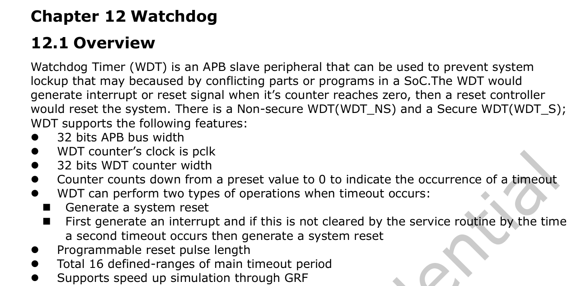
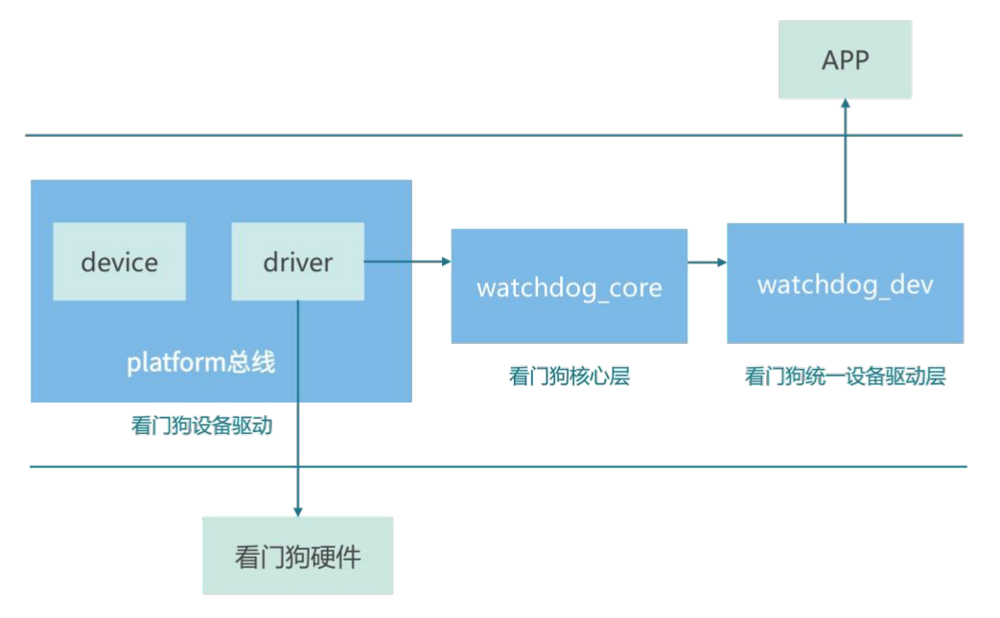

# 看门狗基础


**看门狗（Watchdog Timer，简称 WDT）**是嵌入式系统中**基于定时器实现的硬件保护机制**。

其核心构成是一个可编程计数器，通过周期性复位操作确保系统运行状态的可靠性。当系统遭遇异常情况时，比如电磁干扰导致程序跑飞，软件逻辑错误引发死循环，未知故障造成系统死锁，看门狗通过触发强制复位使系统恢复至初始状态，避免人工干预断电操作。

此机制显著提升了设备长期运行的稳定性。

> 注意！虽然有看门狗，但是看门狗是最后的一道防线，所以在设计产品时要避免这些问题。


运行流程如下所示：

1. 初始化配置

设置看门狗的超时时间，使能看门狗定时器

2. 正常工作状态

系统任务按时执行“投喂”动作（也就是主程序定期喂狗）每次投喂之后，计数器重置

2. 异常处理机制

若系统失控，无法投喂（也就是程序会跑飞/死锁），计数器归零时触发强制安全措施（也就是看门狗复位电路动作）系统恢复初始安全状态（也就是硬件复位）


现代处理器普遍采用 **SoC 集成方案实现看门狗模块**，以 iTOP-RK3568 开发平台为例，其芯片集成俩个看门狗，查看 RK3568 技术手册（TRM）如下所示：



在上图中，可以看到芯片中包含 WDT_NS 和 WDT_S 两个看门狗


# 看门狗子系统框架

Linux 看门狗子系统采用经典三层架构设计，有效解耦用户接口，核心逻辑和硬件操作。看门狗子系统框架图如下图所示。



其中最上层为用户空间，第二层是内核空间，而第三层则为硬件层。

就看门狗而言，与之对应的硬件驱动程序便是看门狗设备驱动，此驱动**属于字符设备驱动**范畴。在 Linux 内核当中，针对看门狗驱动进行了一系列处理操作，具体包括封装以及归纳整理，进而形成了一个完整的框架。该框架主要由三个重要部分构成，分别是：

- 负责与硬件直接交互的看门狗设备驱动层
- 承担核心逻辑处理的看门狗核心层
- 用于和用户空间进行交互的看门狗统一设备驱动层

##  watchdog 设备树配置

```dts
	wdt: watchdog@fe600000 {
		compatible = "snps,dw-wdt";
		reg = <0x0 0xfe600000 0x0 0x100>;
		clocks = <&cru TCLK_WDT_NS>, <&cru PCLK_WDT_NS>;
		clock-names = "tclk", "pclk";
		interrupts = <GIC_SPI 149 IRQ_TYPE_LEVEL_HIGH>;
		status = "okay";
	};
```

- `compatible` 属性用于设备驱动的匹配
- `reg` 指定了看门狗寄存器的地址范围
- `clocks` 和 `clock-names` 定义了相关的时钟，`interrupts` 则配置了中断信息。

## watchdog 设备驱动层

在 Linux 源码内核目录下搜索`snps,dw-wdt`找到 `drivers/watchdog/dw_wdt.c` 文件，此文件是 Watchdog 设备驱动层对应的驱动文件。`dw_wdt.c` 驱动文件如下所示：


```c
static struct platform_driver dw_wdt_driver = {
	.probe		= dw_wdt_drv_probe,
	.remove		= dw_wdt_drv_remove,
	.driver		= {
		.name	= "dw_wdt",
		.of_match_table = of_match_ptr(dw_wdt_of_match),
		.pm	= &dw_wdt_pm_ops,
	},
};

module_platform_driver(dw_wdt_driver);
```

`module_platform_driver(dw_wdt_driver)`宏将 `dw_wdt_driver` 注册为一个平台驱动

### dw_wdt_drv_probe()

```c
static int dw_wdt_drv_probe(struct platform_device *pdev)
{
    // 获取设备结构体指针，方便后续操作
	struct device *dev = &pdev->dev;
    // 定义指向看门狗设备结构体的指针
	struct watchdog_device *wdd;
    // 定义指向 dw_wdt 结构体的指针，dw_wdt 结构体可能包含看门狗设备的特定信息
	struct dw_wdt *dw_wdt;
	int ret;

    // 使用 devm_kzalloc 函数分配内存，用于存储 dw_wdt 结构体
	// dev 是设备结构体指针，用于提供内存分配的上下文
	// sizeof(*dw_wdt) 是要分配的内存大小，即 dw_wdt 结构体的大小
	// GFP_KERNEL 是内存分配标志，用于指定分配的内存类型（内核内存）
	dw_wdt = devm_kzalloc(dev, sizeof(*dw_wdt), GFP_KERNEL);
	if (!dw_wdt)// 如果内存分配失败，返回 -ENOMEM 错误码，表示内存不足
		return -ENOMEM;

    // 获取设备的内存资源
    // 使用 devm_ioremap_resource 函数将内存资源映射到内核虚拟地址空间
    // dev 是设备结构体指针，mem 是要映射的内存资源
	dw_wdt->regs = devm_platform_ioremap_resource(pdev, 0);
	if (IS_ERR(dw_wdt->regs))// 如果映射失败，返回 PTR_ERR(dw_wdt->regs) 错误码
		return PTR_ERR(dw_wdt->regs);

	/*
	 * Try to request the watchdog dedicated timer clock source. It must
	 * be supplied if asynchronous mode is enabled. Otherwise fallback
	 * to the common timer/bus clocks configuration, in which the very
	 * first found clock supply both timer and APB signals.
	 */
    /*
	* 尝试请求看门狗专用的定时器时钟源。如果启用了异步模式，必须提供该时钟源。
	* 否则，回退到通用定时器/总线时钟配置，在这种配置中，第一个找到的时钟同时为定时器和APB 信号提供时钟。
	*/
	dw_wdt->clk = devm_clk_get(dev, "tclk");// 获取名为 "tclk" 的时钟
	if (IS_ERR(dw_wdt->clk)) {// 如果获取失败
		dw_wdt->clk = devm_clk_get(dev, NULL);// 尝试获取默认时钟
		if (IS_ERR(dw_wdt->clk))// 如果再次失败，返回 PTR_ERR(dw_wdt->clk) 错误码
			return PTR_ERR(dw_wdt->clk);
	}

	ret = clk_prepare_enable(dw_wdt->clk);// 准备并启用时钟
	if (ret)
		return ret;

	dw_wdt->rate = clk_get_rate(dw_wdt->clk);// 获取时钟的速率
	if (dw_wdt->rate == 0) {// 如果时钟速率为 0，设置错误码并跳转到 out_disable_clk 标签处进行清理
		ret = -EINVAL;
		goto out_disable_clk;
	}

	/*
	 * Request APB clock if device is configured with async clocks mode.
	 * In this case both tclk and pclk clocks are supposed to be specified.
	 * Alas we can't know for sure whether async mode was really activated,
	 * so the pclk phandle reference is left optional. If it couldn't be
	 * found we consider the device configured in synchronous clocks mode.
	 */
    /*
	* 如果设备配置为异步时钟模式，请求 APB 时钟。
	* 在这种情况下，假设同时指定了 tclk 和 pclk 时钟。
	* 遗憾的是，我们不能确定是否真的启用了异步模式，
	* 所以 pclk 的 phandle 引用是可选的。如果找不到它，我们认为设备配置为同步时钟模式。
	*/
    // 尝试获取名为 "pclk" 的时钟，devm_clk_get_optional 函数用于获取可选的时钟
	dw_wdt->pclk = devm_clk_get_optional(dev, "pclk");
	if (IS_ERR(dw_wdt->pclk)) {// 如果获取失败
		ret = PTR_ERR(dw_wdt->pclk);// 设置错误码并跳转到 out_disable_clk 标签处进行清理
		goto out_disable_clk;
	}

    // 准备并启用 APB 时钟
	ret = clk_prepare_enable(dw_wdt->pclk);
	if (ret)// 如果准备或启用 APB 时钟失败，跳转到 out_disable_clk 标签处进行清理
		goto out_disable_clk;

    // 获取复位控制对象，devm_reset_control_get_optional_shared 函数用于获取可选的共享复位控制对象
	dw_wdt->rst = devm_reset_control_get_optional_shared(&pdev->dev, NULL);
	if (IS_ERR(dw_wdt->rst)) {// 如果获取失败
		ret = PTR_ERR(dw_wdt->rst);// 设置错误码并跳转到 out_disable_pclk 标签处进行清理
		goto out_disable_pclk;
	}

	/* Enable normal reset without pre-timeout by default. */
	dw_wdt_update_mode(dw_wdt, DW_WDT_RMOD_RESET);

	/*
	 * Pre-timeout IRQ is optional, since some hardware may lack support
	 * of it. Note we must request rising-edge IRQ, since the lane is left
	 * pending either until the next watchdog kick event or up to the
	 * system reset.
	 */
	ret = platform_get_irq_optional(pdev, 0);
	if (ret > 0) {
		ret = devm_request_irq(dev, ret, dw_wdt_irq,
				       IRQF_SHARED | IRQF_TRIGGER_RISING,
				       pdev->name, dw_wdt);
		if (ret)
			goto out_disable_pclk;

		dw_wdt->wdd.info = &dw_wdt_pt_ident;
	} else {
		if (ret == -EPROBE_DEFER)
			goto out_disable_pclk;

		dw_wdt->wdd.info = &dw_wdt_ident;
	}

    // 释放复位信号，使设备脱离复位状态
	reset_control_deassert(dw_wdt->rst);

	ret = dw_wdt_init_timeouts(dw_wdt, dev);
	if (ret)
		goto out_disable_clk;
	// 将 dw_wdt 结构体中的 wdd 成员赋值给 wdd 指针
	wdd = &dw_wdt->wdd;
	wdd->ops = &dw_wdt_ops;// 设置看门狗设备的操作函数集
	wdd->min_timeout = dw_wdt_get_min_timeout(dw_wdt);// 设置看门狗设备的最小超时时间
	wdd->max_hw_heartbeat_ms = dw_wdt_get_max_timeout_ms(dw_wdt);// 根据 dw_wdt 结构体和 DW_WDT_MAX_TOP 计算最大硬件心跳时间（以毫秒为单位）
	wdd->parent = dev;// 设置看门狗设备的父设备

	watchdog_set_drvdata(wdd, dw_wdt);// 将 dw_wdt 结构体与看门狗设备关联起来
	watchdog_set_nowayout(wdd, nowayout);// 设置看门狗设备的 nowayout 属性，nowayout 可能用于控制看门狗的一些行为
	watchdog_init_timeout(wdd, 0, dev);// 使用默认超时时间初始化看门狗设备

	/*
	 * If the watchdog is already running, use its already configured
	 * timeout. Otherwise use the default or the value provided through
	 * devicetree.
	 */
    /*
	* 如果看门狗已经在运行，使用其已配置的超时时间。
	* 否则，使用默认值或通过设备树提供的值。
	*/
	if (dw_wdt_is_enabled(dw_wdt)) {// 检查看门狗是否已经启用
        // 如果已经启用，获取当前的超时时间并设置到看门狗设备中
		wdd->timeout = dw_wdt_get_timeout(dw_wdt);
        // 设置看门狗设备的状态位，表示硬件正在运行
		set_bit(WDOG_HW_RUNNING, &wdd->status);
	} else {
        // 如果未启用，设置默认超时时间
		wdd->timeout = DW_WDT_DEFAULT_SECONDS;
        // 使用默认超时时间重新初始化看门狗设备
		watchdog_init_timeout(wdd, 0, dev);
	}

    // 将 dw_wdt 结构体与平台设备关联起来
	platform_set_drvdata(pdev, dw_wdt);

    // 设置看门狗设备的重启优先级为 128
	watchdog_set_restart_priority(wdd, 128);

    // 注册看门狗设备
	ret = watchdog_register_device(wdd);
	if (ret)// 如果注册失败，跳转到 out_disable_pclk 标签处进行清理
		goto out_disable_pclk;

	dw_wdt_dbgfs_init(dw_wdt);

	return 0;

out_disable_pclk:
	clk_disable_unprepare(dw_wdt->pclk);

out_disable_clk:
	clk_disable_unprepare(dw_wdt->clk);
	return ret;
}

```


#### struct watchdog_device

```c
/** struct watchdog_device - The structure that defines a watchdog device
 *
 * @id:		The watchdog's ID. (Allocated by watchdog_register_device)
 * @parent:	The parent bus device
 * @groups:	List of sysfs attribute groups to create when creating the
 *		watchdog device.
 * @info:	Pointer to a watchdog_info structure.
 * @ops:	Pointer to the list of watchdog operations.
 * @gov:	Pointer to watchdog pretimeout governor.
 * @bootstatus:	Status of the watchdog device at boot.
 * @timeout:	The watchdog devices timeout value (in seconds).
 * @pretimeout: The watchdog devices pre_timeout value.
 * @min_timeout:The watchdog devices minimum timeout value (in seconds).
 * @max_timeout:The watchdog devices maximum timeout value (in seconds)
 *		as configurable from user space. Only relevant if
 *		max_hw_heartbeat_ms is not provided.
 * @min_hw_heartbeat_ms:
 *		Hardware limit for minimum time between heartbeats,
 *		in milli-seconds.
 * @max_hw_heartbeat_ms:
 *		Hardware limit for maximum timeout, in milli-seconds.
 *		Replaces max_timeout if specified.
 * @reboot_nb:	The notifier block to stop watchdog on reboot.
 * @restart_nb:	The notifier block to register a restart function.
 * @driver_data:Pointer to the drivers private data.
 * @wd_data:	Pointer to watchdog core internal data.
 * @status:	Field that contains the devices internal status bits.
 * @deferred:	Entry in wtd_deferred_reg_list which is used to
 *		register early initialized watchdogs.
 *
 * The watchdog_device structure contains all information about a
 * watchdog timer device.
 *
 * The driver-data field may not be accessed directly. It must be accessed
 * via the watchdog_set_drvdata and watchdog_get_drvdata helpers.
 */
struct watchdog_device {// 定义表示看门狗设备的结构体
	int id;// 设备唯一标识符
	struct device *parent;// 指向父设备的指针
	const struct attribute_group **groups;// 指向属性组数组的指针，用于管理设备属性
	const struct watchdog_info *info;// 指向包含设备详细信息的结构体指针
	const struct watchdog_ops *ops;// 指向包含设备操作函数的结构体指针
	const struct watchdog_governor *gov;// 指向监管相关结构体指针，可能用于调控设备运行
    // 启动状态标志，具体含义由其他部分定义
	unsigned int bootstatus;
	unsigned int timeout;
	unsigned int pretimeout;
	unsigned int min_timeout;
	unsigned int max_timeout;
	unsigned int min_hw_heartbeat_ms;
	unsigned int max_hw_heartbeat_ms;
	struct notifier_block reboot_nb;
	struct notifier_block restart_nb;
	void *driver_data;
	struct watchdog_core_data *wd_data;
	unsigned long status;
/* Bit numbers for status flags */
#define WDOG_ACTIVE		0	/* Is the watchdog running/active */
#define WDOG_NO_WAY_OUT		1	/* Is 'nowayout' feature set ? */
#define WDOG_STOP_ON_REBOOT	2	/* Should be stopped on reboot */
#define WDOG_HW_RUNNING		3	/* True if HW watchdog running */
#define WDOG_STOP_ON_UNREGISTER	4	/* Should be stopped on unregister */
	struct list_head deferred;
};
```

##### struct watchdog_info

`watchdog_info` 成员指向一个包含看门狗设备详细信息的结构体，结构体

```c
// 定义一个名为 watchdog_info 的结构体，用于存储看门狗设备的相关特定信息
struct watchdog_info {
    // 用于存储看门狗设备或其驱动所支持的选项标志位信息
	// 通过不同的位设置来表示支持的各种功能、特性或工作模式等
	__u32 options;		/* Options the card/driver supports */
    // 用于存储看门狗设备的固件版本号
	// 随着设备固件的更新，该版本号会相应改变，以便区分不同版本的固件
	__u32 firmware_version;	/* Firmware version of the card */
    // 用于存储能够标识该看门狗设备所在电路板或设备本身的字符串信息
	// 最多可存储 32 个字节的字符内容，用于唯一识别该设备，比如设备名称、型号等
	__u8  identity[32];	/* Identity of the board */
};
```

##### struct watchdog_ops

`watchdog_ops` 成员指向一个包含看门狗设备各种操作函数的结构体，结构体如下所示：

```c
/** struct watchdog_ops - The watchdog-devices operations
 *
 * @owner:	The module owner.
 * @start:	The routine for starting the watchdog device.
 * @stop:	The routine for stopping the watchdog device.
 * @ping:	The routine that sends a keepalive ping to the watchdog device.
 * @status:	The routine that shows the status of the watchdog device.
 * @set_timeout:The routine for setting the watchdog devices timeout value (in seconds).
 * @set_pretimeout:The routine for setting the watchdog devices pretimeout.
 * @get_timeleft:The routine that gets the time left before a reset (in seconds).
 * @restart:	The routine for restarting the machine.
 * @ioctl:	The routines that handles extra ioctl calls.
 *
 * The watchdog_ops structure contains a list of low-level operations
 * that control a watchdog device. It also contains the module that owns
 * these operations. The start function is mandatory, all other
 * functions are optional.
 */
struct watchdog_ops {
    // 指向拥有此操作函数集的模块指针，通常用于模块引用计数等管理
	struct module *owner;
    
	/* mandatory operations */
    /* 以下是必须实现的操作函数指针 */
	int (*start)(struct watchdog_device *); //启动看门狗设备的函数指针，传入指向看门狗设备结构体的指针，返回操作结果
	
    /* optional operations */
    /* 以下是可选实现的操作函数指针 */
	int (*stop)(struct watchdog_device *);// 停止看门狗设备的函数指针，传入指向看门狗设备结构体的指针，返回操作结果
	int (*ping)(struct watchdog_device *);// 执行喂狗操作的函数指针，传入指向看门狗设备结构体的指针，返回操作结果
	unsigned int (*status)(struct watchdog_device *);// 获取看门狗设备当前状态的函数指针，传入指向看门狗设备结构体的指针，返回状态值
	int (*set_timeout)(struct watchdog_device *, unsigned int);// 设置看门狗设备超时时间的函数指针，传入指向看门狗设备结构体的指针和新的超时时间值，返回操作结果
	int (*set_pretimeout)(struct watchdog_device *, unsigned int);// 设置看门狗设备预超时时间的函数指针，传入指向看门狗设备结构体的指针和新的预超时时间值，返回操作结果
	unsigned int (*get_timeleft)(struct watchdog_device *);// 获取看门狗设备剩余时间的函数指针，传入指向看门狗设备结构体的指针，返回剩余时间值
	int (*restart)(struct watchdog_device *, unsigned long, void *);// 重启看门狗设备的函数指针，传入指向看门狗设备结构体的指针、重启相关参数等，返回操作结果
	long (*ioctl)(struct watchdog_device *, unsigned int, unsigned long);// 处理 ioctl 系统调用的函数指针，传入指向看门狗设备结构体的指针、ioctl 命令码及参数等，返回处理结果
};
```

##### struct watchdog_governor

`watchdog_governor` 成员指向一个用于对看门狗设备的运行进行某种管理和调控的结构体

```c
struct watchdog_governor {
	const char	name[WATCHDOG_GOV_NAME_MAXLEN];
	void		(*pretimeout)(struct watchdog_device *wdd);
};
```

其中，`pretimeout` 函数指针所指向的函数主要用于在看门狗设备即将达到超时时间之前执行特定的操作。

通常情况下，看门狗设备会设置一个超时时间，当在这个规定时间内没有进行相应的“喂狗”操作（即重置定时器等相关操作，以表明系统正常运行）时，看门狗会触发一些动作，比如复位系统等。而 **`pretimeout` 函数所指向的函数就是在接近这个超时时间的某个前置阶段（预超时阶段）被调用，来执行一些提前的处理动作**。

#### struct dw_wdt

`dw_wdt_drv_probe` 函数中定义了一个指向自定义的 `struct dw_wdt` 类型的指针 `dw_wdt`，该结构体包含了与这个特定看门狗设备相关的一些特定信息，结构体如下所示:

```c
// 定义名为 dw_wdt 的结构体，用于存储与特定看门狗设备相关的各种信息
struct dw_wdt {
	// 指向设备寄存器的内存映射地址，通过此指针可访问设备的寄存器
	void __iomem		*regs;
    // 指向主时钟源的指针，用于获取设备的主时钟信息
	struct clk		*clk;
    // 指向 APB 时钟源的指针，可能用于与 APB 相关的时钟操作（具体取决于设备）
	struct clk		*pclk;
    // 存储时钟频率相关的值，可能是当前设备所使用的时钟频率等信息
	unsigned long		rate;
	enum dw_wdt_rmod	rmod;
	struct dw_wdt_timeout	timeouts[DW_WDT_NUM_TOPS];
    // 包含看门狗设备通用信息和操作函数等的结构体，用于管理看门狗设备的基本属性和操作
	struct watchdog_device	wdd;
    // 指向复位控制结构体的指针，用于对设备进行复位相关的操作和控制
	struct reset_control	*rst;
	/* Save/restore */ /* 以下成员可能用于保存和恢复设备的某些状态信息 */
	u32			control;// 存储设备的控制相关信息
	u32			timeout;// 存储设备的超时设置相关信息

#ifdef CONFIG_DEBUG_FS
	struct dentry		*dbgfs_dir;
#endif
};
```

## watchdog核心层

### watchdog_register_device()

上面probe函数`dw_wdt_drv_probe()`中使用 `watchdog_register_device()` 函数对 `wdd` 指针所指向的 `struct watchdog_device` 结构体进行注册操作。

```c
/**
 * watchdog_register_device() - register a watchdog device
 * @wdd: watchdog device
 *
 * Register a watchdog device with the kernel so that the
 * watchdog timer can be accessed from userspace.
 *
 * A zero is returned on success and a negative errno code for
 * failure.
 */

int watchdog_register_device(struct watchdog_device *wdd)
{
	const char *dev_str;
	int ret = 0;

	mutex_lock(&wtd_deferred_reg_mutex);
	if (wtd_deferred_reg_done)//如果 wtd_deferred_reg_done 为真，则执行__watchdog_register_device(wdd)函数
		ret = __watchdog_register_device(wdd);
	else// 否则执行watchdog_deferred_registration_add(wdd);
		watchdog_deferred_registration_add(wdd);
	mutex_unlock(&wtd_deferred_reg_mutex);

	if (ret) {
		dev_str = wdd->parent ? dev_name(wdd->parent) :
			  (const char *)wdd->info->identity;
		pr_err("%s: failed to register watchdog device (err = %d)\n",
			dev_str, ret);
	}

	return ret;
}
EXPORT_SYMBOL_GPL(watchdog_register_device);
```


#### watchdog_deferred_registration()

在 `drivers/watchdog/watchdog_core.c` 文件中的 `watchdog_deferred_registration()` 函数中发现 `wtd_deferred_reg_done` 为 true

```c
static int __init watchdog_deferred_registration(void)
{
	mutex_lock(&wtd_deferred_reg_mutex);
	wtd_deferred_reg_done = true;
	while (!list_empty(&wtd_deferred_reg_list)) {
		struct watchdog_device *wdd;

		wdd = list_first_entry(&wtd_deferred_reg_list,
				       struct watchdog_device, deferred);
		list_del(&wdd->deferred);
		__watchdog_register_device(wdd);
	}
	mutex_unlock(&wtd_deferred_reg_mutex);
	return 0;
}
```

而该函数由`watchdog_core.c`的初始化函数调用

```c
static int __init watchdog_init(void)
{
	int err;

	err = watchdog_dev_init();
	if (err < 0)
		return err;

	watchdog_deferred_registration();
	return 0;
}

static void __exit watchdog_exit(void)
{
	watchdog_dev_exit();
	ida_destroy(&watchdog_ida);
}

subsys_initcall_sync(watchdog_init);
module_exit(watchdog_exit);

MODULE_AUTHOR("Alan Cox <alan@lxorguk.ukuu.org.uk>");
MODULE_AUTHOR("Wim Van Sebroeck <wim@iguana.be>");
MODULE_DESCRIPTION("WatchDog Timer Driver Core");
MODULE_LICENSE("GPL");
```


即，如果`watchdog_core.c`这个模块未加载，则延迟加载，`watchdog_register_device()`调用`watchdog_deferred_registration_add(wdd);`

#### __watchdog_register_device()

```c
static int __watchdog_register_device(struct watchdog_device *wdd)
{
	int ret, id = -1;

    // 参数有效性检查
	if (wdd == NULL || wdd->info == NULL || wdd->ops == NULL)
		return -EINVAL;

	/* Mandatory operations need to be supported */
    // 操作函数校验（必须实现 start 和 stop/max_hw_heartbeat_ms
	if (!wdd->ops->start || (!wdd->ops->stop && !wdd->max_hw_heartbeat_ms))
		return -EINVAL;

    // 检查超时时间的合法性
	watchdog_check_min_max_timeout(wdd);

	/*
	 * Note: now that all watchdog_device data has been verified, we
	 * will not check this anymore in other functions. If data gets
	 * corrupted in a later stage then we expect a kernel panic!
	 */

	/* Use alias for watchdog id if possible */
	if (wdd->parent) {// 获取 watchdog ID（优先使用设备树别名）
		ret = of_alias_get_id(wdd->parent->of_node, "watchdog");
		if (ret >= 0)
			id = ida_simple_get(&watchdog_ida, ret,
					    ret + 1, GFP_KERNEL);
	}

	if (id < 0)// 分配 ID 失败时的处理
		id = ida_simple_get(&watchdog_ida, 0, MAX_DOGS, GFP_KERNEL);

	if (id < 0)
		return id;
	wdd->id = id;

	ret = watchdog_dev_register(wdd);// 注册 watchdog 字符设备
	if (ret) {
		ida_simple_remove(&watchdog_ida, id);
		if (!(id == 0 && ret == -EBUSY))
			return ret;

		/* Retry in case a legacy watchdog module exists */
        // 处理旧版驱动冲突的特殊情况（id=0 时可能被占用）
		id = ida_simple_get(&watchdog_ida, 1, MAX_DOGS, GFP_KERNEL);
		if (id < 0)
			return id;
		wdd->id = id;

		ret = watchdog_dev_register(wdd);
		if (ret) {
			ida_simple_remove(&watchdog_ida, id);
			return ret;
		}
	}

	/* Module parameter to force watchdog policy on reboot. */
	if (stop_on_reboot != -1) {
		if (stop_on_reboot)
			set_bit(WDOG_STOP_ON_REBOOT, &wdd->status);
		else
			clear_bit(WDOG_STOP_ON_REBOOT, &wdd->status);
	}

    // 注册系统重启通知回调
	if (test_bit(WDOG_STOP_ON_REBOOT, &wdd->status)) {
		if (!wdd->ops->stop)
			pr_warn("watchdog%d: stop_on_reboot not supported\n", wdd->id);
		else {
			wdd->reboot_nb.notifier_call = watchdog_reboot_notifier;

			ret = register_reboot_notifier(&wdd->reboot_nb);
			if (ret) {
				pr_err("watchdog%d: Cannot register reboot notifier (%d)\n",
					wdd->id, ret);
				watchdog_dev_unregister(wdd);
				ida_simple_remove(&watchdog_ida, id);
				return ret;
			}
		}
	}

    // 注册系统重启处理函数
	if (wdd->ops->restart) {
		wdd->restart_nb.notifier_call = watchdog_restart_notifier;

		ret = register_restart_handler(&wdd->restart_nb);
		if (ret)
			pr_warn("watchdog%d: Cannot register restart handler (%d)\n",
				wdd->id, ret);
	}

	return 0;
}

```

`__watchdog_register_device`中调用 `watchdog_dev_register` 函数注册 `wdd` 指向的看门狗设备对应的字符设备。

若注册失败（ret 不为 0），先看是否因 ID 为 0 且返回-EBUSY。不是这情况就直接返回 ret给调用者；

若是，则重新分配 ID（1 到 MAX_DOGS）再注册设备。`watchdog_dev_register` 函数如下

#### watchdog_dev_register()

```c
/*
 *	watchdog_dev_register: register a watchdog device
 *	@wdd: watchdog device
 *
 *	Register a watchdog device including handling the legacy
 *	/dev/watchdog node. /dev/watchdog is actually a miscdevice and
 *	thus we set it up like that.
 */

int watchdog_dev_register(struct watchdog_device *wdd)
{
	int ret;
	// 1. 注册字符设备（创建/dev/watchdogX 节点
	ret = watchdog_cdev_register(wdd);
	if (ret)
		return ret;
	// 2. 注册预超时处理机制
	ret = watchdog_register_pretimeout(wdd);
	if (ret)
		watchdog_cdev_unregister(wdd); // 失败时回滚字符设备注册

	return ret;
}

```

在上述代码中，最重要的是使用 `watchdog_cdev_register` 函数注册字符设备，是实现watchdog 统一设备驱动层的关键

## watchdog 统一设备驱动层

### watchdog_cdev_register()

```c
/*
 *	watchdog_cdev_register: register watchdog character device
 *	@wdd: watchdog device
 *
 *	Register a watchdog character device including handling the legacy
 *	/dev/watchdog node. /dev/watchdog is actually a miscdevice and
 *	thus we set it up like that.
 */

static int watchdog_cdev_register(struct watchdog_device *wdd)
{
    // 核心数据结构（包含设备状态、定时器等）
	struct watchdog_core_data *wd_data;
	int err;

	wd_data = kzalloc(sizeof(struct watchdog_core_data), GFP_KERNEL);
	if (!wd_data)
		return -ENOMEM;
	mutex_init(&wd_data->lock);// 初始化保护锁

    // 建立双向关联（设备 ↔ 核心数据）
	wd_data->wdd = wdd;
	wdd->wd_data = wd_data;

    // 校验内核工作队列有效性（心跳维持机制依赖）
	if (IS_ERR_OR_NULL(watchdog_kworker)) {
		kfree(wd_data);
		return -ENODEV;
	}

    // 设备节点初始化
	device_initialize(&wd_data->dev);
	wd_data->dev.devt = MKDEV(MAJOR(watchdog_devt), wdd->id);// 分配设备号
	wd_data->dev.class = &watchdog_class;
	wd_data->dev.parent = wdd->parent;
	wd_data->dev.groups = wdd->groups;
	wd_data->dev.release = watchdog_core_data_release;
	dev_set_drvdata(&wd_data->dev, wdd);
	dev_set_name(&wd_data->dev, "watchdog%d", wdd->id);// 命名设备节点

    // 定时机制初始化
	kthread_init_work(&wd_data->work, watchdog_ping_work);// 心跳工作队列
	hrtimer_init(&wd_data->timer, CLOCK_MONOTONIC, HRTIMER_MODE_REL_HARD); // 初始化高精度定时器
	wd_data->timer.function = watchdog_timer_expired;

    // 传统设备注册（/dev/watchdog），注册为杂项设备
	if (wdd->id == 0) {
		old_wd_data = wd_data;
		watchdog_miscdev.parent = wdd->parent;
		err = misc_register(&watchdog_miscdev);// 注册 misc 设备（兼容旧版接口）
		if (err != 0) {
			pr_err("%s: cannot register miscdev on minor=%d (err=%d).\n",
				wdd->info->identity, WATCHDOG_MINOR, err);
			if (err == -EBUSY)// 处理设备号冲突的特殊情况（旧驱动存在时返回 EBUSY）
				pr_err("%s: a legacy watchdog module is probably present.\n",
					wdd->info->identity);
			old_wd_data = NULL;
			put_device(&wd_data->dev);
			return err;
		}
	}

	/* Fill in the data structures */
    // 字符设备注册（创建/dev/watchdogX 节点）
	cdev_init(&wd_data->cdev, &watchdog_fops); // 绑定文件操作接口

	/* Add the device */
	err = cdev_device_add(&wd_data->cdev, &wd_data->dev);// 添加至系统
	if (err) {
		pr_err("watchdog%d unable to add device %d:%d\n",
			wdd->id,  MAJOR(watchdog_devt), wdd->id);
		if (wdd->id == 0) {
			misc_deregister(&watchdog_miscdev);
			old_wd_data = NULL;
			put_device(&wd_data->dev);
		}
		return err;
	}

	wd_data->cdev.owner = wdd->ops->owner;

	/* Record time of most recent heartbeat as 'just before now'. */
	wd_data->last_hw_keepalive = ktime_sub(ktime_get(), 1);
	watchdog_set_open_deadline(wd_data);

	/*
	 * If the watchdog is running, prevent its driver from being unloaded,
	 * and schedule an immediate ping.
	 */
	if (watchdog_hw_running(wdd)) {// 运行状态处理
		__module_get(wdd->ops->owner); // 增加模块引用计数
		get_device(&wd_data->dev);
		if (handle_boot_enabled)// 根据配置启动定时器（用户空间接管前维持心跳）
			hrtimer_start(&wd_data->timer, 0,
				      HRTIMER_MODE_REL_HARD);
		else
			pr_info("watchdog%d running and kernel based pre-userspace handler disabled\n",
				wdd->id);
	}

	return 0;
}
```


#### watchdog_ping_work()

`watchdog_cdev_register()`定义的工作队列中`watchdog_ping_work` 函数中执行了与看门狗相关的任务操作。函数代码如下所示：

```c
static void watchdog_ping_work(struct kthread_work *work)
{
    // 通过工作项获取核心数据结构
	struct watchdog_core_data *wd_data;

	wd_data = container_of(work, struct watchdog_core_data, work);

    // 加锁保证操作原子性（防止并发访问）
	mutex_lock(&wd_data->lock);
    // 判断是否需要发送心跳信号：
	// 1. 设备存在
	// 2. 看门狗处于激活状态或硬件正在运行
	if (watchdog_worker_should_ping(wd_data))
		__watchdog_ping(wd_data->wdd);// 执行实际的心跳操作
    // 释放互斥锁
	mutex_unlock(&wd_data->lock);
}
```


#### watchdog_fops

`watchdog_cdev_register()`中通过`cdev_init(&wd_data->cdev, &watchdog_fops);`将cdev结构体中的设备操作函数设置为`watchdog_fops`

```c
static const struct file_operations watchdog_fops = {
	.owner		= THIS_MODULE,
	.write		= watchdog_write,
	.unlocked_ioctl	= watchdog_ioctl,
	.compat_ioctl	= compat_ptr_ioctl,
	.open		= watchdog_open,
	.release	= watchdog_release,
};
```

##### .open = watchdog_open

`open` 系统调用对应的操作函数指定为 `watchdog_open`。当用户空间程序尝试打开与该文件操作结构体关联的设备文件时，内核会调用 `watchdog_open` 函数来进行设备打开相关的初始化操作，比如可能会进行一些资源分配、状态初始化等工作，以确保设备在后续的读写、控制等操作中能够正常运行。

`watchdog_open` 函数如下所示：

```c
/*
 *	watchdog_open: open the /dev/watchdog* devices.
 *	@inode: inode of device
 *	@file: file handle to device
 *
 *	When the /dev/watchdog* device gets opened, we start the watchdog.
 *	Watch out: the /dev/watchdog device is single open, so we make sure
 *	it can only be opened once.
 */

static int watchdog_open(struct inode *inode, struct file *file)
{
	struct watchdog_core_data *wd_data;
	struct watchdog_device *wdd;
	bool hw_running;
	int err;

	/* Get the corresponding watchdog device */
	if (imajor(inode) == MISC_MAJOR)// 传统设备通过 miscdevice 获取，新设备通过字符设备结构获取
		wd_data = old_wd_data;
	else
		wd_data = container_of(inode->i_cdev, struct watchdog_core_data,
				       cdev);

	/* the watchdog is single open! */
    /* 单例模式检测 - 保证设备只能被打开一次 */
	if (test_and_set_bit(_WDOG_DEV_OPEN, &wd_data->status))/* 单例模式检测 - 保证设备只能被打开一次 */
		return -EBUSY;

	wdd = wd_data->wdd;

	/*
	 * If the /dev/watchdog device is open, we don't want the module
	 * to be unloaded.
	 */
	hw_running = watchdog_hw_running(wdd);/* 模块引用管理 */
    // 如果硬件未运行，增加模块引用计数防止卸载
	if (!hw_running && !try_module_get(wdd->ops->owner)) {
		err = -EBUSY;
		goto out_clear;
	}

    /* 启动看门狗硬件 */
	err = watchdog_start(wdd);
	if (err < 0)
		goto out_mod;

    /* 保存核心数据结构到文件私有数据 */
	file->private_data = wd_data;

    /* 更新设备引用计数 */
	if (!hw_running)
		get_device(&wd_data->dev);// 增加设备引用计数

	/*
	 * open_timeout only applies for the first open from
	 * userspace. Set open_deadline to infinity so that the kernel
	 * will take care of an always-running hardware watchdog in
	 * case the device gets magic-closed or WDIOS_DISABLECARD is
	 * applied.
	 */
	wd_data->open_deadline = KTIME_MAX;

	/* dev/watchdog is a virtual (and thus non-seekable) filesystem */
	return stream_open(inode, file);

out_mod:
	module_put(wd_data->wdd->ops->owner);
out_clear:
	clear_bit(_WDOG_DEV_OPEN, &wd_data->status);
	return err;
}
```

##### .write = watchdog_write,

write 系统调用对应的操作函数指定为 `watchdog_write`。当用户空间程序对与该文件操作结构体关联的设备文件（比如 `/dev/watchdog`）执行 write 操作时，内核会调用这里指定的`watchdog_write` 函数来处理具体的写入请求。这个函数用于执行喂狗操作等与写入相关的功能。`watchdog_write` 函数如下所示：

```c
/*
 *	watchdog_write: writes to the watchdog.
 *	@file: file from VFS
 *	@data: user address of data
 *	@len: length of data
 *	@ppos: pointer to the file offset
 *
 *	A write to a watchdog device is defined as a keepalive ping.
 *	Writing the magic 'V' sequence allows the next close to turn
 *	off the watchdog (if 'nowayout' is not set).
 */

static ssize_t watchdog_write(struct file *file, const char __user *data,
						size_t len, loff_t *ppos)
{
	struct watchdog_core_data *wd_data = file->private_data;
	struct watchdog_device *wdd;
	int err;
	size_t i;
	char c;

	if (len == 0)
		return 0;

	/*
	 * Note: just in case someone wrote the magic character
	 * five months ago...
	 */
    /* 清除上次遗留的魔术字符标记 */
	clear_bit(_WDOG_ALLOW_RELEASE, &wd_data->status);

	/* scan to see whether or not we got the magic character */
	for (i = 0; i != len; i++) {/* 扫描用户数据寻找魔术字符'V' */
		if (get_user(c, data + i))// 从用户空间安全复制数据
			return -EFAULT;
		if (c == 'V')// 检测到魔术字符
			set_bit(_WDOG_ALLOW_RELEASE, &wd_data->status);// 允许安全关闭
	}

	/* someone wrote to us, so we send the watchdog a keepalive ping */

    /* 触发看门狗心跳维持 */
	err = -ENODEV;
	mutex_lock(&wd_data->lock);// 加锁保护设备状态
	wdd = wd_data->wdd;
	if (wdd)
		err = watchdog_ping(wdd);// 执行底层心跳操作
	mutex_unlock(&wd_data->lock);// 释放锁

	if (err < 0)
		return err;

	return len;// 返回实际写入长度（成功时返回请求长度）
}
```

##### .unlocked_ioctl = watchdog_ioctl,

`ioctl` 系统调用对应的操作函数指定为 `watchdog_ioctl`。

`ioctl` 是一种在 Linux 中用于对设备进行特定控制操作的接口，用户空间程序可以通过 ioctl 向设备发送各种自定义的命令。

当对关联的设备文件执行 ioctl 操作时，内核会调用 `watchdog_ioctl` 函数来处理这些特定的控制请求。

对于看门狗设备，这个函数用于设置超时时间、获取设备状态等各种需要通过 ioctl 实现的功能。`watchdog_ioctl` 函数如下所示：

```c
/*
 *	watchdog_ioctl: handle the different ioctl's for the watchdog device.
 *	@file: file handle to the device
 *	@cmd: watchdog command
 *	@arg: argument pointer
 *
 *	The watchdog API defines a common set of functions for all watchdogs
 *	according to their available features.
 */

static long watchdog_ioctl(struct file *file, unsigned int cmd,
							unsigned long arg)
{
	struct watchdog_core_data *wd_data = file->private_data;
	void __user *argp = (void __user *)arg;
	struct watchdog_device *wdd;
	int __user *p = argp;
	unsigned int val;
	int err;

	mutex_lock(&wd_data->lock);// 获取设备状态锁

	wdd = wd_data->wdd;
	if (!wdd) {
		err = -ENODEV;// 设备未就绪
		goto out_ioctl;
	}

    /* 优先处理驱动自定义的 ioctl 操作 */
	err = watchdog_ioctl_op(wdd, cmd, arg);
	if (err != -ENOIOCTLCMD)// 已处理或错误
		goto out_ioctl;

    /* 标准 ioctl 命令处理 */
	switch (cmd) {
	case WDIOC_GETSUPPORT:	// 获取看门狗能力信息
		err = copy_to_user(argp, wdd->info,
			sizeof(struct watchdog_info)) ? -EFAULT : 0;
		break;
	case WDIOC_GETSTATUS:	// 获取设备状态标志
		val = watchdog_get_status(wdd);
		err = put_user(val, p);
		break;
	case WDIOC_GETBOOTSTATUS:	// 获取启动状态
		err = put_user(wdd->bootstatus, p);
		break;
	case WDIOC_SETOPTIONS:	// 设置设备选项
		if (get_user(val, p)) {
			err = -EFAULT;
			break;
		}
		if (val & WDIOS_DISABLECARD) {// 停用看门狗
			err = watchdog_stop(wdd);
			if (err < 0)
				break;
		}
		if (val & WDIOS_ENABLECARD)// 启用看门狗
			err = watchdog_start(wdd);
		break;
	case WDIOC_KEEPALIVE:// 手动触发心跳
		if (!(wdd->info->options & WDIOF_KEEPALIVEPING)) {
			err = -EOPNOTSUPP;// 设备不支持该操作
			break;
		}
		err = watchdog_ping(wdd);
		break;
	case WDIOC_SETTIMEOUT:// 设置超时时间
		if (get_user(val, p)) {
			err = -EFAULT;
			break;
		}
		err = watchdog_set_timeout(wdd, val);
		if (err < 0)
			break;
		/* If the watchdog is active then we send a keepalive ping
		 * to make sure that the watchdog keep's running (and if
		 * possible that it takes the new timeout) */
		err = watchdog_ping(wdd);/* 设置成功后立即发送心跳，确保新超时生效 */
		if (err < 0)
			break;
		fallthrough;
	case WDIOC_GETTIMEOUT:
		/* timeout == 0 means that we don't know the timeout */
		if (wdd->timeout == 0) {
			err = -EOPNOTSUPP;
			break;
		}
		err = put_user(wdd->timeout, p);
		break;
	case WDIOC_GETTIMELEFT:
		err = watchdog_get_timeleft(wdd, &val);
		if (err < 0)
			break;
		err = put_user(val, p);
		break;
	case WDIOC_SETPRETIMEOUT:
		if (get_user(val, p)) {
			err = -EFAULT;
			break;
		}
		err = watchdog_set_pretimeout(wdd, val);
		break;
	case WDIOC_GETPRETIMEOUT:
		err = put_user(wdd->pretimeout, p);
		break;
	default:
		err = -ENOTTY;// 未知 ioctl 命令
		break;
	}

out_ioctl:
	mutex_unlock(&wd_data->lock);// 释放设备状态锁
	return err;
}
```


# 看门狗应用编写

1. 打开设备文件：打开`/dev/watchdog0`，以可读可写模式打开，失败则输出`open error`并返回 -1。
2. 设置超时时间：成功打开后，通过系统调用设超时时间为 2 秒，失败输出`set time out error`并返回 -2。
3. 喂狗操作：设置好超时后，循环 5 次执行喂狗操作（用合适系统调用），成功输出`feed dog ok`并暂停 1 秒，失败输出`feed dog error`并返回 -2。
4. 结束提示：完成喂狗循环后，输出`hungry dog`，最后程序以返回值 0 正常结束。


```c
#include <stdio.h>
#include <sys/types.h>
#include <sys/stat.h>
#include <fcntl.h>
#include <unistd.h>
#include <stdlib.h>
#include <sys/ioctl.h>
#include <linux/watchdog.h>

int main(int argc,char *argv[]){
	int fd;
	int time_out;
	int ret;
	int i=5;
	fd = open("/dev/watchdog0",O_RDWR);
	if(fd < 0){
		printf("open error\n");
		return -1;
	}
	
	time_out = 2;
	ret = ioctl(fd,WDIOC_SETTIMEOUT,&time_out);
	if(ret<0){
		printf("set time out error\n");
		return -2;
	}
	while(i--){
		ret = ioctl(fd,WDIOC_KEEPALIVE,NULL);
		if(ret < 0){
		printf("feed dog error\n");
		return -2;
		}
		printf("feed dog ok\n");
		sleep(1);
	}
	
	printf("hungry dog\n");
	
	
	return 0;

}
```

