# CAN 总线介绍

**CAN（Controller Area Network）**是由博世（Bosch）公司于 1986 年推出的串行通信协议，专为汽车电子系统设计，旨在减少车辆中线束数量，实现多个电子控制单元（ECU）之间的高效通信。


**核心特点**

- CAN 总线支持多主通信，所有节点（ECU）均可主动发送数据，无需依赖中心控制器。
- 其采用非破坏性仲裁机制，通过 ID 优先级解决总线冲突，确保高优先级数据优先传输。
- 总线具备高可靠性，内置 CRC 校验、错误检测与恢复机制，同时采用差分信号增强抗电磁干扰能力。
- CAN 总线通过简化布线和降低系统复杂度，实现了低成本的优势。


**应用领域**

- 汽车电子：发动机控制、车身模块（灯光/门窗）、诊断系统（OBD-II）等。
- 工业自动化：PLC、传感器网络、机器人控制。
- 其他领域：医疗设备、航空航天、智能楼宇。


**发展历程**

- 1983 年：Bosch 启动汽车网络技术研究。
- 1986 年：正式发布 CAN 协议。
- 1987 年：英特尔与飞利浦推出首款 CAN 控制器芯片。
- 1991 年：CAN 2.0 规范发布，首次应用于奔驰 S 级轿车。
- 1993 年：成为国际标准（ISO 11898）。
- 2015 年：CAN FD（Flexible Data Rate）标准化（支持更高速率与 64 字节数据）
- 2020 年：下一代 CAN XL 发布，带宽进一步提升。


## CAN 硬件连接

在 CAN 硬件连接中，有 CPU 自带 CAN 控制器和 CPU 没有 CAN 控制器需外设转接（如 SPI转 CAN）这两种情况

### CPU 自带 CAN 控制器

CPU 自带 CAN 控制器连接图如下所示，CPU 通过集成的 CAN 控制器直接与 CAN 收发器进行通信，CAN 收发器负责将数字信号转换为适合 CAN 总线传输的差分信号（CAN_H 和 CAN_L）。**CPU 可以直接与 CAN 总线进行通信**

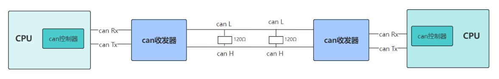


| 组件               | 描述                                                         |
| ------------------ | ------------------------------------------------------------ |
| **CPU与CAN控制器** | 每个CPU都通过CAN控制器与CAN总线通信。CPU负责处理控制逻辑和数据处理任务，而CAN控制器则负责管理CAN协议的通信细节。 |
| **CAN Tx**         | 发送数据的信号线。CPU通过CAN控制器将数据发送到CAN总线上，该信号线用于传输发送的数据。 |
| **CAN Rx**         | 接收数据的信号线。CPU通过CAN控制器从CAN总线接收数据，该信号线用于接收来自总线的数据。 |
| **CAN收发器**      | CAN收发器连接在CPU的CAN控制器和CAN总线之间，其主要作用是：<br />将CPU输出的数字信号转换为适合在CAN总线上传输的差分电平信号（电平转换）；<br />同时将总线上的差分信号转换回CPU可识别的数字信号。 |
| **CAN H 和 CAN L** | 这是CAN总线的两条主要物理信号线：<br />CAN H：用于传输高电平信号； <br />CAN L：用于传输低电平信号。 <br />通过这两条线之间的电压差来实现数据传输（差分信号），提高了抗干扰能力。 |
| **120Ω 电阻**      | 在CAN总线的两端各接一个120Ω的终端电阻，目的是： • 防止信号在总线末端发生反射（阻抗匹配）； • 保证信号完整性，提高通信稳定性。 尤其在长距离或多个设备连接的情况下，这些终端电阻非常重要。 |

### CPU 没有 CAN 控制器

CPU 没有 CAN 控制器的连接示意图如下所示，**CPU 通过 SPI 控制器与 SPI 转 CAN 模块进行通信**，后者将 SPI 数据转换为 CAN 总线所需的格式。

通过这种结构，CPU 可以通过 SPI 协议与CAN 总线进行通信，适用于需要在没有直接 CAN 控制器的情况下与 CAN 网络连接的应用场景。总线两端的终端电阻确保了 CAN 通信的稳定性。

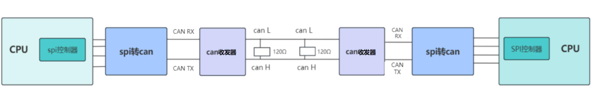

| 组件               | 描述                                                         |
| ------------------ | ------------------------------------------------------------ |
| **CPU与SPI控制器** | CPU 通过 SPI 控制器与 SPI 接口的外围设备通信。SPI（Serial Peripheral Interface）是一种同步串行通信协议，常用于微控制器与传感器、存储器等外设之间的高速数据交换。 |
| **SPI到CAN转换器** | 这是一个关键的桥接模块，连接在 SPI 控制器和 CAN 总线之间。 它的作用是：将 SPI 协议的数据格式转换为 CAN 协议格式，使得原本只能使用 SPI 通信的设备能够通过 CAN 总线与其他节点通信。 |
| **CAN Tx**         | 发送数据的信号线，用于将从 SPI 转 CAN 模块接收到的数据发送到 CAN 总线上。 |
| **CAN Rx**         | 接收数据的信号线，用于从 CAN 总线接收数据，并将其传送给 SPI 转 CAN 模块进行处理。 |
| **CAN收发器**      | 连接在 CAN 总线和 SPI 转 CAN 模块之间，负责：<br />将逻辑电平信号（来自转换器）转换为适合 CAN 总线传输的差分信号； <br />同时将总线上的差分信号还原为逻辑电平信号传回模块。 |
| **CAN H 和 CAN L** | CAN 总线的两条差分信号线： <br />CAN H：高电平信号线； <br />CAN L：低电平信号线。 通过两者之间的电压差来传输数据，具有较强的抗干扰能力。 |
| **120Ω 电阻**      | 在 CAN 总线两端各接入一个 120Ω 的终端电阻，目的是： <br />阻抗匹配，防止信号反射； <br />提高通信稳定性，尤其是在长距离或多个节点连接的情况下。 |


## CAN 电器属性

**CAN 总线使用差分信号传输数据。**

1. **CAN 信号电平**

CAN 总线使用两条信号线进行数据传输：CAN_H（高电平）和 CAN_L（低电平）。

CAN_H和 CAN_L 之间的电压差异决定了逻辑信号的状态。这使得 CAN 总线具有更好的抗干扰能力，尤其适合在噪声较大的环境中工作。

- **CAN_H：高电平信号线，通常电压范围为 2.5V 至 3.5V。**
- **CAN_L：低电平信号线，通常电压范围为 1.5V 至 2.5V。**

2. **差分信号和抗干扰**

CAN 总线通过差分信号进行数据传输，这意味着信息的传输依赖于 CAN_H 与 CAN_L 之间的电压差，而不是单独的电压值。差分信号的特性使得 CAN 总线在噪声环境中具有极强的抗干扰能力。


**差分信号的优点**：

1. 噪声通常同时影响 CAN_H 和 CAN_L，但由于差分信号依赖于两者的电压差，**噪声对两者的影响会相互抵消**，从而保持信号的完整性。
2. 这种特性使得 CAN 总线在汽车、工业控制等噪声较大的环境中表现出色。


### 电气属性和工作状态

CAN 总线的电气属性决定了其工作状态，具体表现为隐性状态和显性状态。

- **隐性状态（逻辑"1"）**：，表示**总线处于空闲状态**。此时，总线没有数据传输，所有设备都在等待通信。隐性状态也被称为“空闲电平”或“逻辑 1”。
- **显性状态（逻辑"0"）**：，表示**数据正在传输**。具体来说，CAN_H 为 3.5V，CAN_L 为 1.5V，表示逻辑“0”。显性状态表示总线正在传输数据，且**具有较高的优先级**。

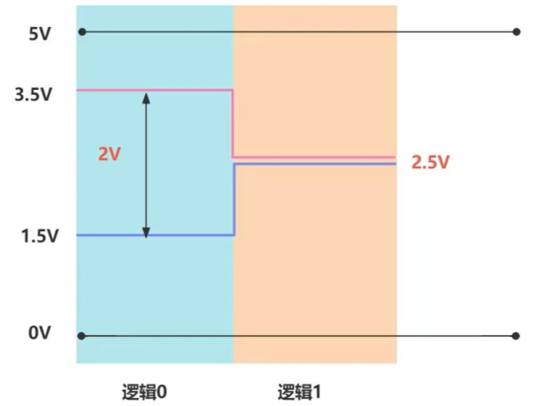

## iTOP-RK3568 开发板 can 接口

RK3568 这颗 SOC 至多可以使用 3 个 CAN 接口

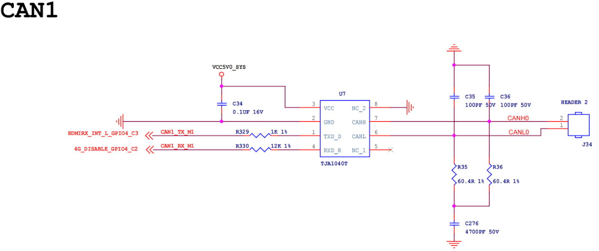

其中 **TJA1040T** 是一款由恩智浦（NXP）公司生产的高速 CAN 收发器芯片。负责将 CPU 的数字信号转换为适合 CAN 总线传输的信号并且接收总线上的数据，而根据网络标号可以得到开发板使用的是 CAN1

| CAN接口 | pinctrl function | 网络标号                     | 对应的GPIO     | 功能               |
|---------|------------------|------------------------------|----------------|--------------------|
| CAN0    | CAN0_TX_M0       | I2C1_SCL_TP                  | GPIO0_B3_u     | MIPI屏幕触摸I2C    |
|         | CAN0_RX_M0       | I2C1_SDA_TP                  | GPIO0_B4_u     | MIPI屏幕触摸I2C    |
|         | CAN0_TX_M1       | SDMMC0_CMD                   | GPIO2_A1       | TF卡 CMD引脚       |
|         | CAN0_RX_M1       | SDMMC0_CLK                   | GPIO2_A2       | TF卡时钟引脚       |
| CAN1    | CAN1_TX_M0       | I2C3_SCL_M0                  | GPIO1_A1_u     | 底板背面20pinGPIO  |
|         | CAN1_RX_M0       | I2C3_SDA_M0                  | GPIO1_A0_u     | 底板背面20pinGPIO  |
|         | CAN1_TX_M1       | HDMI_RX_INT_L_GPIO4_C3       | GPIO4_C3_d     | CAN TX             |
|         | CAN1_RX_M1       | 4G_DISABLE_GPIO4_C2          | GPIO4_C2_d     | CAN RX             |
| CAN2    | CAN2_TX_M0       | I2C2_SCL_M1                  | GPIO4_B5_d     | MIPI屏幕触摸I2C    |
|         | CAN2_RX_M0       | I2C2_SDA_M1                  | GPIO4_B4_d     | MIPI屏幕触摸I2C    |
|         | CAN2_TX_M1       | WIFI_WAKE_HOST_H_GPIO2_B2    | GPIO2_B2_u     | 底板引出未使用     |
|         | CAN2_RX_M1       | WIFI_REG_ON_H_GPIO2_B1       | GPIO2_B1_u     | 底板引出未使用     |


# CAN 协议帧结构

## 帧的种类

帧是 CAN 通信中数据传输的基本单位，在 CAN 通信中使用了五种不同类型的帧来实现不同的功能。以下是每种帧的简要说明及其用途：

- **数据帧（Data Frame）**：数据帧是 CAN 通信中最常用的帧类型，用于发送单元向接收单元传递数据。数据帧有两种格式：
  - 标准格式（11 位标识符）适用于较简单的网络
  - 扩展格式（29 位标识符）适用于更复杂的网络。
- **遥控帧（Remote Frame）**：遥控帧用于接收单元向发送单元请求数据。它不包含数据段，而是通过标识符（ID）告诉发送单元“我需要这个 ID 对应的数据”。遥控帧也有标准格式和扩展格式两种，其结构与数据帧类似，但缺少数据段。
- **错误帧（Error Frame）**：错误帧用于当节点检测到错误时，向其他节点通知错误的发生。它是一种特殊的帧，用于中断当前通信并重新启动。错误帧由错误标志（6 个连续显性或隐性位）和错误界定符组成，触发条件包括位错误、填充错误、CRC 错误等。
- **过载帧（Overload Frame）**：过载帧用于接收单元通知发送单元其尚未做好接收准备。它通常出现在接收节点需要更多时间处理前一帧的情况下。过载帧只能在帧间隔期间发送，其结构类似于错误帧，由过载标志和过载界定符组成。
- **帧间隔（Interframe Space）**：帧间隔用于将数据帧或遥控帧与前面的帧分离开来。它是一个时间间隔，确保网络中的节点能够正确识别下一帧的开始。对于数据帧和遥控帧，帧间隔通常为 3 个位时间；对于错误帧和过载帧，帧间隔可能有所不同。


| 帧类型   | 用途                                       |
|----------|--------------------------------------------|
| 数据帧   | 发送单元向接收单元传送数据的帧。           |
| 遥控帧   | 接收单元向具有相同ID的发送单元请求数据的帧。|
| 错误帧   | 当检测出错误时，向其他单元通知错误的帧。   |
| 过载帧   | 接收单元通知其尚未做好接收准备的帧。       |
| 帧间隔   | 将数据帧及遥控帧与前面的帧分离开来的帧。   |

### 数据帧

数据帧是最核心的帧类型，负责承载实际的数据内容，并在发送单元和接收单元之间实现高效的信息传递。

在早期的 CAN 通信中，**标准数据帧采用 11 位标识符**，能够满足当时较为简单的网络架构需求。然而，随着车辆功能的复杂化（如高级驾驶辅助系统、动力总成控制、车身电子等），11 位标识符的地址空间逐渐显得不足，难以支持更大规模的节点和更精细的通信需求。为此，CAN 协议引入了**扩展数据帧**，通过 **29 位标识符**提供了更大的地址空间，显著提升了网络的灵活性和扩展性。


**标准数据帧**

标准数据帧是 CAN 通信协议中用于传输数据的基本结构。它包含多个字段，字段的作用各有不同，确保了数据能够高效、安全地传输。数据帧的组成框图如下所示


从上图可以得到标准数据帧由**帧起始（Start of Frame）**、**仲裁字段（Arbitration Field）**、**控制字段（Control Field）**、**数据字段（Data Field）**、**CRC 校验字段（CRC Field）**、**ACK 字段（Acknowledgment Field）**、**帧结束（End of Frame）**7 个主要字段组成

- **帧起始（Start of Frame）**

  - 。

  > 它不仅通知接收设备准备接收数据，还起到同步发送端和接收端时钟的作用，确保后续数据的正确解析。

- **仲裁字段（Arbitration Field）**

  - **ID（11位标识符）**主要用于区分报文类型、优先级以及确定发送顺序。标识符值越小，优先级越高；
  - **RTR 位（1位，远程传输请求）**则用于区分数据帧（显性 0）和远程帧（隐性 1）。此外，仲裁字段中禁止高 7位全为隐性，以避免仲裁错误。

- **控制字段（Control Field）**

  - **IDE 位（1位）**用于区分标准帧（显性 0）和扩展格式
  - **RO（1位保留位）**，保留位固定为显性 0 以备未来扩展
  - **DLC 位（4位**）则指示数据字段中包含的字节数（范围为 0 到 8 字节）。

- **数据字段（Data Field）**

  - 数据字段**最多包含 8 字节（64 位）**，是数据帧的核心部分，用于承载实际通信数据内容。
  - 其**长度由控制字段中的 DLC 位指定**，范围从 0 字节（无数据）到8 字节（最大数据量）。该字段的内容是通信的实际信息，可能包括传感器数据、控制指令等。

- **CRC 校验字段（CRC Field）**

  - **CRC 校验码（15位）**
  - **CRC 界定符组成（1位）**，固定为隐性 1，用于明确 CRC 字段的结束位置。
  - 接收设备通过重新计算 CRC 并与接收到的 CRC校验码进行比对，验证数据完整性。

- **ACK 字段（Acknowledgment Field）**

  - **ACK 槽（1位）**，当接收设备成功接收到数据帧后，会在 ACK 槽中返回一个显性位作为确认信号，表示数据帧已正确接收
  - **ACK 界定符（1位）**，ACK 界定符固定为隐性 1，用于标识 ACK 字段的结束。

- **帧结束（End of Frame）**

  - **由 7 位连续的隐性位（逻辑 1）组成**，用于明确标识数据帧的结束。
  - 它不仅告诉接收设备数据帧已经传输完毕，还提供了额外的时间用于信号同步，确保下一帧的正确接收。


| 字段名称       | 组成                          | 作用                                                                                                                         |
|----------------|-------------------------------|------------------------------------------------------------------------------------------------------------------------------|
| **帧起始**     | 1位显性0                      | 标识数据帧的开始，并用于同步发送端和接收端时钟，确保后续数据的正确解析。                                                     |
| **仲裁字段**   | 11位标识 + 1位RTR位           | 区分报文类型（数据帧或远程帧）、优先级及发送顺序；标识符值越小优先级越高；RTR位区分数据帧（显性0）和远程帧（隐性1）；禁止高7位全为隐性。 |
| **控制字段** | 1位IDE位 + 1位RO保留位 + 4位DLC位 | IDE位区分标准帧（显性0）和扩展帧（隐性1）；保留位固定为显性0以备未来扩展；DLC位指示数据字段长度（0-8字节）。                  |
| **数据字段**   | 最多8字节（64位）             | 承载实际通信数据内容，长度由DLC位指定；数据字段是通信的核心部分，可能包含传感器数据、控制指令等实际信息。                     |
| **CRC校验字段** | 15位CRC校验码 + 1位CRC界定符  | 检测数据传输过程中的错误，接收设备通过重新计算CRC与接收到的CRC校验码比对验证数据完整性；CRC界定符固定为隐性1，标识CRC字段的结束。 |
| **ACK字段**    | 1位ACK槽 + 1位ACK界定符       | 接收设备在ACK槽中返回显性位确认数据帧成功接收；ACK界定符固定为隐性1，标识ACK字段的结束。                                     |
| **帧结束**     | 7位隐性1                      | 明确标识数据帧的结束，通知接收设备数据帧已传输完毕，并提供额外时间用于信号同步，确保下一帧的正确接收。                       |

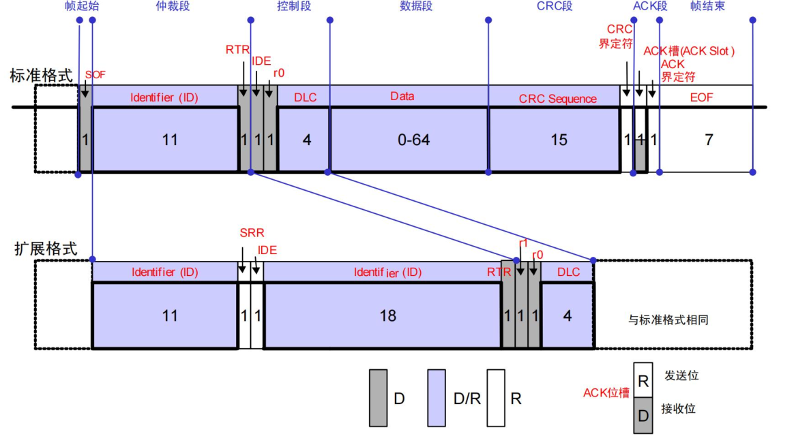

**SRR 位作用**

SRR 位在 CAN 协议中用于替代标准帧的 RTR 位，位于扩展帧仲裁段中原 RTR 位的位置。

其作用是强制设置为隐性电平（1），以确保在标准帧与扩展帧同时竞争总线时，标准帧因 RTR 位显性（0）而具有更高的优先级。当标准帧和扩展帧同时发送时，总线通过仲裁逻辑检测到显性电平（0），从而使标准帧胜出。

**IDE 位**
IDE 位是标识符扩展标志，用于区分帧类型：**显性（0）表示当前帧为标准帧，隐性（1）表示扩展帧**。

在扩展帧中，IDE 位不仅存在于仲裁段以标识帧类型，还出现在控制段中，进一步明确帧结构并实现对扩展帧与标准帧的区分。


### 遥控帧

**遥控帧（Remote Frame）**是 CAN 协议中**用于主动请求数据的特殊帧类型**。

> 当一个节点需要获取其他节点的数据时，可通过发送遥控帧向总线发起请求，目标节点收到请求后返回对应的数据帧。

**数据帧去掉数据段就是遥控帧**，当然和遥控帧一样，遥控帧也分标准遥控帧和扩展遥控帧，他们各自的构成如下所示：

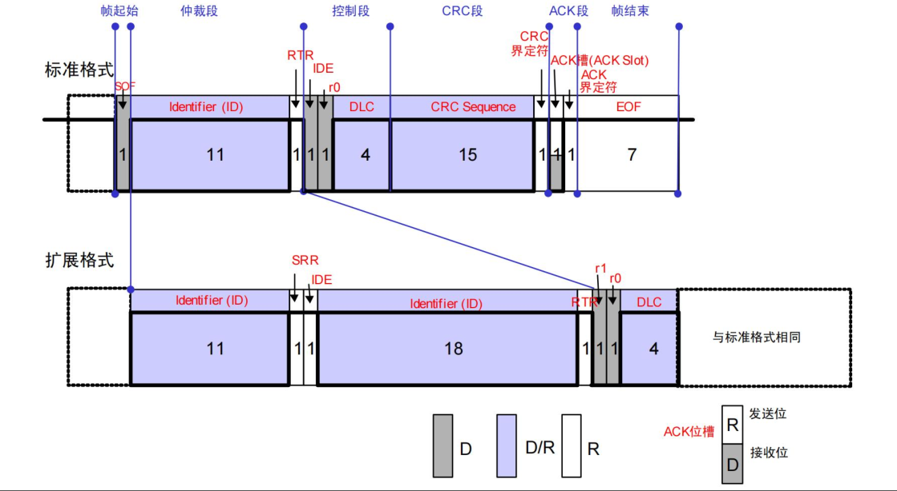

- **帧起始（Start of Frame）**
  - 帧起始由 1 位显性 0 组成，与数据帧相同，用于标识遥控帧的开始。
  - 它不仅通知接收设备准备接收数据，还起到同步发送端和接收端时钟的作用，确保后续数据解析的准确性。
- **仲裁字段（Arbitration Field）**：
  - 11 位标识符（ID）
  - 1位 RTR 位（隐性 1）组成，
  - 用于指定请求的数据帧类型，同时通过 RTR 位隐性 1 与数据帧（显性 0）区分，确保优先级低于同 ID 的数据帧。在扩展遥控帧中，仲裁字段扩展为 29 位标识符（ID）、SRR 位（隐性 1）、IDE 位（隐性 1）和 RTR 位（隐性 1）。其中，SRR 位替代标准帧的 RTR 位，确保扩展帧在仲裁时优先级低于标准数据帧；IDE 位隐性 1 则用于标识该帧为扩展帧。
- **控制字段（Control Field）**：与标准数据帧和扩展数据帧中的控制字段相同。
- **数据字段（Data Field）**：遥控帧**无数据字段**，这是其与数据帧的核心区别。通过省略数据字段，明确表示该帧为请求而非数据传输，从而触发目标节点发送对应 ID 的数据帧。
- **CRC 校验字段（CRC Field）**：
  - 15 位 CRC 校验码
  - 1 位隐性 CRC 界定符
  - 用于验证遥控帧在传输过程中是否发生错误。接收设备通过重新计算 CRC 并与接收到的 CRC 校验码进行比对，确保请求的可靠性。
- **ACK 字段（Acknowledgment Field）**ACK 字段由 1 位 ACK 槽和 1 位隐性 ACK 界定符组成。当接收节点成功接收到遥控帧后，会在 ACK 槽中返回一个显性位作为确认信号，表明遥控帧已被正确接收，而 ACK 界定符固定为隐性 1 以标识 ACK 字段的结束。
- **帧结束（End of Frame）**
  - 帧结束由 7 位连续的隐性 1 组成，与数据帧相同，用于明确标识遥控帧的结束。它不仅告诉接收设备遥控帧已经传输完毕，还提供了额外的时间用于信号同步，确保下一帧的正确接收。

|   字段名称   |                             组成                             |                             作用                             |
| :----------: | :----------------------------------------------------------: | :----------------------------------------------------------: |
|    帧起始    |                          1 位显性 0                          | 标识遥控帧的开始，同步发送端与接收端时钟，保障后续数据解析的准确性。 |
|   仲裁字段   | 标准帧：11 位 ID + RTR（隐性 1）扩展帧：29 位 ID + SRR（隐性 1）+ IDE（隐性 1）+ RTR（隐性 1） | 指定请求的数据帧类型，RTR 隐性 1 区分于数据帧；扩展帧通过 SRR、IDE 位兼容标准帧，优先级低于同 ID 的数据帧。 |
|   控制字段   |     标准帧：IDE+R0+4 位 DLC 位扩展帧：R1+R0+4 位 DLC 位      | DLC 位指示目标数据帧的字节数（0-8 字节），但遥控帧本身不携带数据；IDE 位区分扩展帧与标准帧。 |
|   数据字段   |                              无                              |             明确遥控帧为请求帧，不进行数据传输。             |
| CRC 校验字段 |            15 位 CRC 校验码 + 1 位隐性 CRC 界定符            |        验证遥控帧传输过程的正确性，保障请求的可靠性。        |
|   ACK 字段   |    1 位 ACK 槽（接收节点填显性位） + 1 位隐性 ACK 界定符     | 接收节点通过 ACK 槽确认遥控帧已正确接收，ACK 界定符标识该字段结束。 |
|    帧结束    |                          7 位隐性 1                          |   标识遥控帧结束，提供信号同步时间，确保下一帧的正确接收。   |

### 错误帧

错误帧是 CAN 总线中用于标识通信过程中发生错误的特殊帧，其结构与其他帧（如数据帧或遥控帧）不同，主要用于通知网络中的所有节点当前传输存在错误。

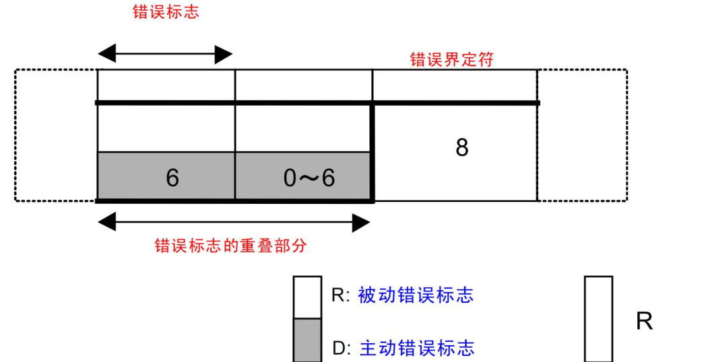


- **错误标志（Error Flag）**
  - **6 位连续的显性位（逻辑 0）或隐性位（逻辑 1）**，分为主动错误标志和被动错误标志。
  - **主动错误标志**由检测到错误的节点发送，强制中断当前帧的传输，通知网络中所有节点错误的发生；
  - **被动错误标志**则由处于被动错误状态的节点发送，避免干扰其他节点的正常通信。
- **错误界定符（Error Delimiter）**
  - 8 位连续的隐性位（逻辑 1）组成，用于标识错误帧的结束。它确保所有节点能够明确识别错误帧的边界，并在错误处理完成后恢复正常的通信流程。

|  字段名称  |                       组成                       |                             作用                             |
| :--------: | :----------------------------------------------: | :----------------------------------------------------------: |
|  错误标志  | 主动错误标志：6 位显性位被动错误标志：6 位隐性位 | 主动错误标志强制中断当前帧传输，通知网络节点错误；被动错误标志避免干扰其他节点通信。 |
| 错误界定符 |                    8 位隐性位                    |  标识错误帧结束，帮助所有节点识别错误帧边界并恢复正常通信。  |


### 过载帧

过载帧是 CAN 总线中用于通知网络中的其他节点当前接收设备需要更多时间来处理数据的特殊帧。它通常在接收节点无法及时处理接收到的数据时发送，以请求发送节点延迟下一帧的传输。过载帧的组成如下所示：

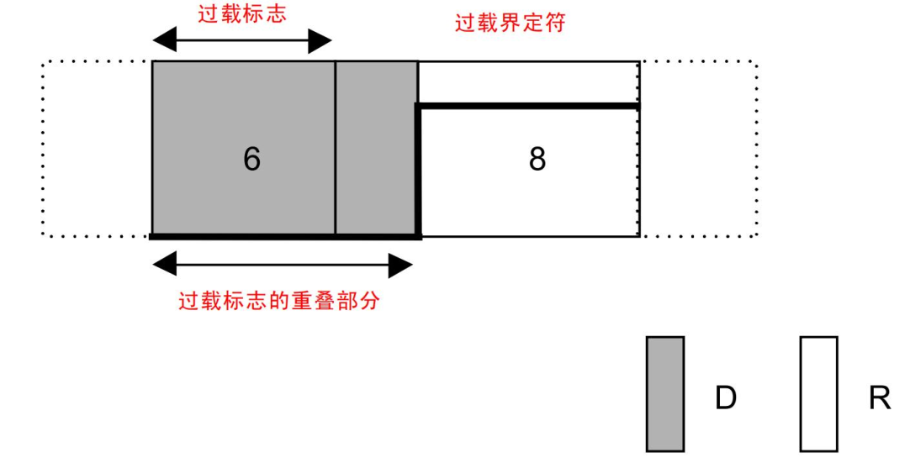

- **过载标志（Overload Flag）**
  -  **6 位连续的显性位（逻辑 0）组成**，由接收节点发送，用于通知网络中的其他节点当前接收设备需要更多时间来处理数据，从而请求延迟下一帧的传输。
  - 多个节点可以同时发送过载标志，这些标志会叠加在一起，形成一个更长的显性位序列。
- **过载界定符（Overload Delimiter）**
  - **8 位连续的隐性位（逻辑 1）组成**，用于标识过载帧的结束。
  - 它确保所有节点能够明确识别过载帧的边界，并在过载处理完成后恢复正常的通信流程。

|  字段名称  |      组成      |                             作用                             |
| :--------: | :------------: | :----------------------------------------------------------: |
|  过载标志  | 6 位连续显性位 | 由接收节点发送，告知网络其他节点自身需更多时间处理数据，请求延迟下一帧传输。 |
| 过载界定符 | 8 位连续隐性位 | 标识过载帧的结束，帮助所有节点识别其边界，从而恢复正常通信流程。 |

> 过载帧通过**过载标志**和**过载界定符**两个字段实现对接收节点处理能力不足的标识和处理。
>
> 当接收节点无法及时处理数据时，会发送过载标志（6 位显性位），通知网络中其他节点延迟下一帧的传输；随后通过过载界定符（8 位隐性位）明确标识过载帧的结束。
>
> 过载帧的设计确保了网络中的节点能够在高负载情况下协调通信，避免数据丢失或错误。

## 位填充

位填充是 CAN 协议中用于确保数据传输过程中信号同步的重要机制。

位填充通过在连续 5 个相同极性位后插入一个反向极性的填充位，确保总线上始终有电平变化，从而维持发送端和接收端的同步。

填充仅在帧起始到 CRC 字段之间进行，避免对其他部分造成干扰。接收方在检测到填充位后会自动移除填充位，还原出原始数据。这种机制对于防止信号同步问题、提高 CAN 总线通信的可靠性至关重要。

**核心目的**

通过在连续 5 个相同极性位后插入一个反向极性的填充位，避免长时间的“0”或“1”电平导致总线同步问题，从而提高通信的可靠性。

**位填充规则**

当数据中出现 5 个连续的相同极性位时，在第 6 位插入一个与这些位极性相反的填充位。

这一机制通过打破可能出现的长串相同电平，确保总线上始终有电平变化，从而维持发送端和接收端的同步。

**填充范围**

**从帧起始部分到 CRC 字段之间进行**，。这种设计限制了填充范围，避免对不需要同步的部分造成干扰，同时保证关键数据段的同步性。

- 示例 1：
  - 原始数据：110000011
  - 分析：未出现 5 个连续的相同极性位，因此无需填充。
  - 实际发送数据：1100000111
  - 接收方直接恢复原始数据：110000011
- 示例 2：
  - 原始数据：0111111
  - 分析：出现 5 个连续的“1”，在第 6 位插入一个“0”。
  - 实际发送数据：01111101
  - 接收方检测并移除填充位，恢复原始数据：0111111
- 示例 3：
  - 原始数据：1000001111
  - 分析：出现 5 个连续的“0”，在第 6 位插入一个“1”，插入 1 之后，又出现了五个连续的“1”，所以在最后一位需要补 0。
  - 实际发送数据：100000111110
  - 接收方检测并移除填充位，恢复原始数据：1000001111


## CAN 波形实例分析

### 标准数据帧

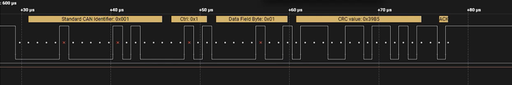

> CAN 通信是由一对差分信号线决定的，但上面的 CAN 波形就只有一个，这是因为上述波形是由逻辑分析仪采集得到的，逻辑分析仪会自动将差分信号转换为逻辑信号。然后来对波形进行分析。

**帧起始**

首先是帧起始，帧起始由一个固定的显性位（逻辑 0）组成，用于标识数据帧的开始

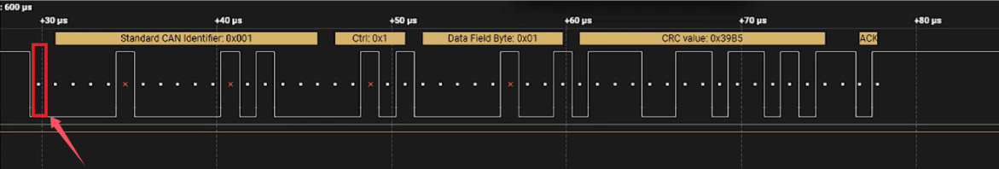

**仲裁字段**

接下来是 12 位的仲裁字段，其中前 11 位为标识符（ID）最后一位是远程传输请求 RTR 位，标识图如下所示，其中红色×的位表示填充位，所以在实际分析的时候需要忽略对应的位，最后一位的 RTR 位为显性位（逻辑 0），所以当前传输的帧为数据帧

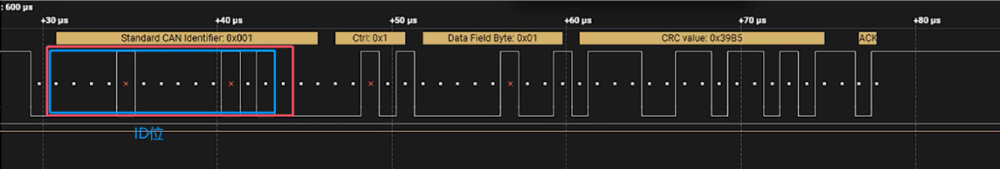

**控制字段**

仲裁字段后面是六位的控制字段（Control Field），包括 1 位 IDE 位、1 位保留位（R0）和4 位数据长度码（DLC），标识图如下所示，IDE 位为显性位（逻辑 0），所以当前帧为标准帧，保留位 R0 默认为显性位（逻辑 0），后四位的 DLC 位为 0001,表示后面会发送 8 位的数据

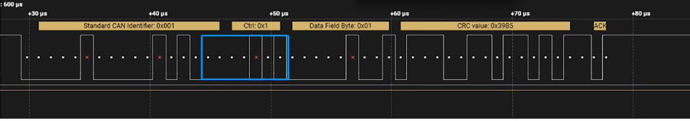

**数据字段**

接下来是 8 位的数据字段，它用于承载实际通信数据内容，标识图如下所示，要发送的数据为 00000001，然后继续向下分析

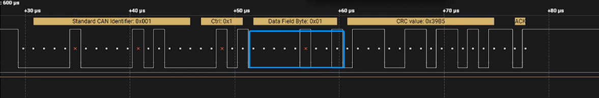

**CRC校验字段**

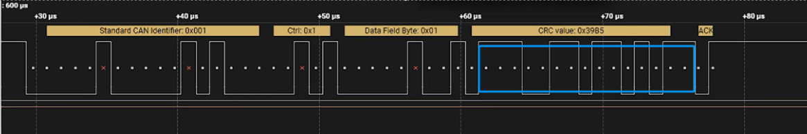

**ACK字段**

接下来的两位是 ACK 字段（Acknowledgment Field），ACK 字段由 2 位组成，包括 1 位 ACK槽和 1 位 ACK 界定符。当接收设备成功接收到数据帧后，会在 ACK 槽中返回一个显性位作为确认信号，表示数据帧已正确接收，ACK 界定符固定为隐性 1，用于标识 ACK 字段的结束，标识图如下所示：

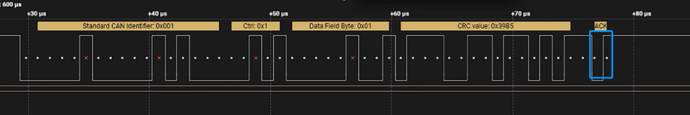


最后是由 7 位连续的隐性位（逻辑 1）组成的帧结束，用于明确标识数据帧的结束。

### 标准遥控帧


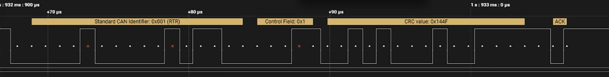

**帧起始**

首先是帧起始，帧起始由一个固定的显性位（逻辑 0）组成，用于标识数据帧的开始，在下图中已经标出

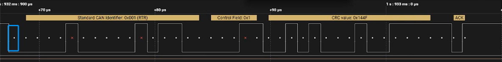

**仲裁字段**

接下来是 12 位的仲裁字段，其中前 11 位为标识符（ID）最后一位是远程传输请求 RTR 位组成，标识图如下所示，其中红色×的位表示填充位，所以在实际分析的时候需要忽略对应的位，最后一位的 RTR 位为隐性位（逻辑 1），并且通过观察可以得到后面没有要传输的数据位，所以当前传输的帧为遥控帧


**控制字段**

仲裁字段后面是六位的控制字段（Control Field），包括 1 位 IDE 位、1 位保留位（R0）和4 位数据长度码（DLC），标识图如下所示，IDE 位为隐性位（逻辑 1），所以当前帧为标准遥控帧，保留位 R0 默认为显性位（逻辑 0），后四位的 DLC 位为 0001,但当前帧是遥控帧，并不会发送数据

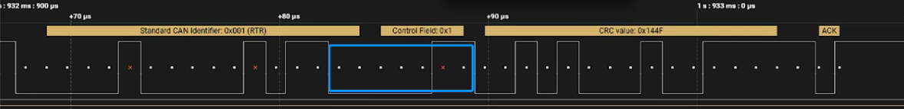

**CRC 校验字段**

CRC 校验字段由 15 位 CRC 校验码和 1 位 CRC 界定符组成，用于检测数据传输过程中是否发生错误，标识图如下所示，最后一位的 CRC 界定符固定为隐性 1，用于明确 CRC 字段的结束位置。

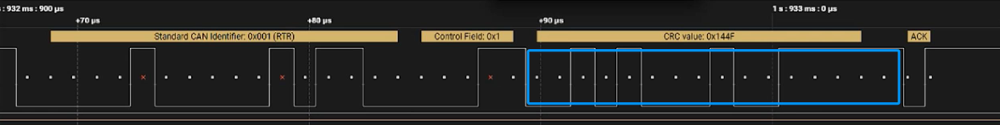


**ACK字段**

接下来的两位是 ACK 字段（Acknowledgment Field），ACK 字段由 2 位组成，包括 1 位 ACK槽和 1 位 ACK 界定符。当接收设备成功接收到数据帧后，会在 ACK 槽中返回一个显性位作为确认信号，表示数据帧已正确接收，ACK 界定符固定为隐性 1，用于标识 ACK 字段的结束，标识图如下所示：

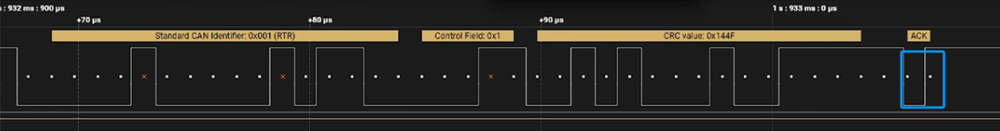

最后是由 7 位连续的隐性位（逻辑 1）组成的帧结束


### 扩展数据帧


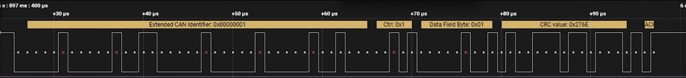

**帧起始**

首先是帧起始，帧起始由一个固定的显性位（逻辑 0）组成，用于标识数据帧的开始，在下图中已经标出

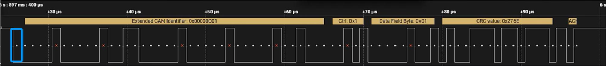

**扩展帧**

根据波形长度以及上方黄色标识可以得到，该帧为扩展帧，所以在接下来的 12 位中，前11 位为标识符（ID），最后一位是 SRR 位，标识图如下所示，其中红色×的位表示填充位，所以在实际分析的时候需要忽略对应的位，SRR 位为隐形位(逻辑 1)

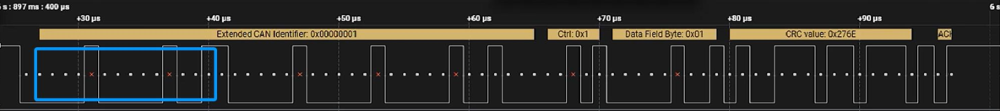

接下来的后面是 1 位 IDE 位，IDE 位为隐性位（逻辑 1），所以当前帧为扩展帧，但具体是扩展遥控帧还是扩展数据帧，还需要继续向下分析

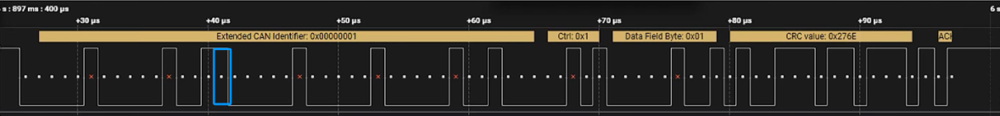

接下来 19 位中的前 18 位也是 ID 位，最后一位为 RTR 位，标识图如下所示，最后一位的RTR 位为显性位（逻辑 0），所以当前传输的帧为扩展数据帧，然后继续向下分析：

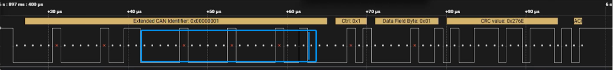

**控制字段**

接下来的六位是控制字段（Control Field），包括 2 位保留位（R1 和 R0）和 4 位数据长度码（DLC），标识图如下所示，后四位的 DLC 位为 0001,表示后面会发送 8 位的数据

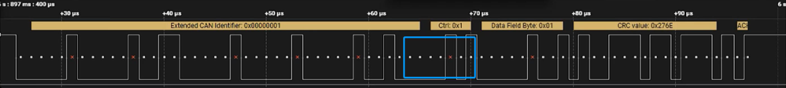

**数据字段**

接下来是 8 位的数据字段，它用于承载实际通信数据内容，标识图如下所示，要发送的数据为 00000001

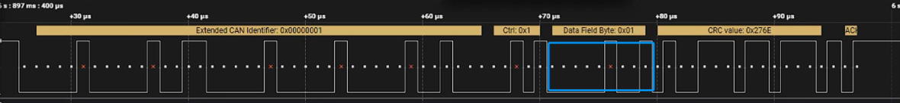

**CRC 校验字段**

CRC 校验字段由 15 位 CRC 校验码和 1 位 CRC 界定符组成，用于检测数据传输过程中是否发生错误，标识图如下所示，最后一位的 CRC 界定符固定为隐性 1，用于明确 CRC 字段的结束位置

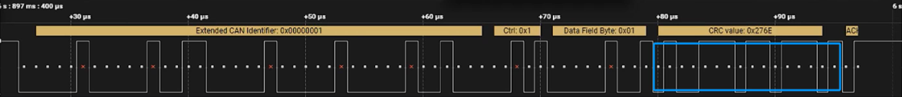

**ACK 字段**

接下来的两位是 ACK 字段（Acknowledgment Field），ACK 字段由 2 位组成，包括 1 位 ACK 槽和 1 位 ACK 界定符。当接收设备成功接收到数据帧后，会在 ACK 槽中返回一个显性位作为确认信号，表示数据帧已正确接收，ACK 界定符固定为隐性 1，用于标识 ACK 字段的结束，标识图如下所示

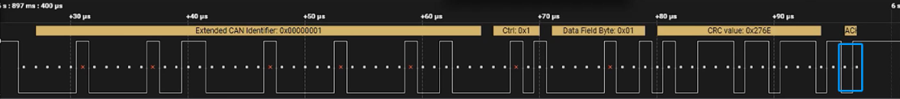

最后是由 7 位连续的隐性位（逻辑 1）组成的帧结束，用于明确标识数据帧的结束。


# CAN总线核心机制与通信原理

## 位时间

在 CAN 总线通讯中，**位时间是指传输一个逻辑位所需的时间，**是 CAN 协议实现可靠数据传输的核心概念之一，直接影响通讯的波特率和信号同步精度。作为异步通讯的基础，所有节点通过约定好的位时间来保持同步。

CAN 协议将位时间划分为多个时间段，这些时间段共同决定了信号的采样和同步机制。具体包括以下几个部分：

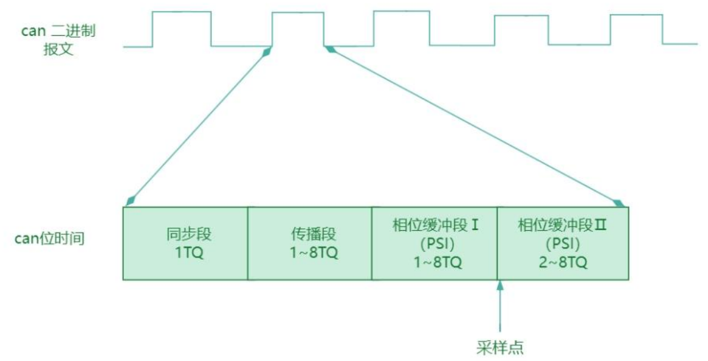


- **同步段（Sync Segment）**

同步段是位时间的第一个部分，**固定为 1 个时间量子**（**TQ 时间量子是位时间的基本单位，所有时间段都以时间量子为基准进行划分**），主要用于检测信号边沿并实现硬同步。

在帧起始（SOF，Start of Frame）阶段，接收节点会根据总线信号的下降沿强制调整自己的时钟，与总线信号对齐，从而确保所有节点在通讯初始阶段保持同步。

- **传播段（Propagation Segment）**

传播段用于补偿信号在总线上的传播延迟以及输入比较器的响应时间，其长度通常为 1 到 8 个时间量子（TQ），具体值由配置决定。这

段时间允许信号在物理介质上传播，并确保所有节点能够接收到稳定的信号，从而避免因传播延迟导致的采样误差。

- **相位缓冲段 1（Phase Segment 1）**

相位缓冲段 1 是位时间中可配置的部分，通常为 1到 8 个时间量子（TQ），**主要用于调整采样点的位置，确保采样点位于信号稳定区域**。



- **相位缓冲段 2（Phase Segment 2）**

相位缓冲段 2 类似于相位缓冲段 1，也是位时间中可配置的部分，通常为 1 到 8 个时间量子（TQ）。




**位时间的作用**

1. 保证同步：通过划分时间段，CAN 节点能够在信号边沿出现时动态调整采样点，补偿时钟偏差和信号延迟，从而实现多节点间的同步。
2. 提高抗干扰能力：将采样点设置在信号稳定区域（如位时间的 87.5% 处），避免因信号边沿抖动或干扰导致的误判。
3. 支持灵活配置：通过调整各时间段的长度（如传播段、相位缓冲段等），可以适应不同的波特率和网络环境。


## 硬同步和再同步

在 CAN 通信中，由于采用异步通信方式且没有独立时钟线，各节点依赖本地晶振进行数据传输，但晶振的时钟漂移会导致节点间时序逐渐偏移，最终引发采样错误。为解决这一问题，CAN 协议通过硬同步和再同步两大机制实现动态时序调整：

1. **硬同步在帧起始阶段强制对齐所有节点的时钟，消除初始相位偏差**；
2. **再同步则在数据传输过程中根据信号边沿的实时检测，动态调整相位缓冲段长度以补偿时钟漂移**。

这两种机制协同工作，结合位时间划分（同步段、传播段、相位段 I/II）和时间量子（Tq）的量化管理，确保所有节点在采样点时刻准确读取总线电平，从而在无独立时钟线的异步通信中实现高可靠性的数据传输。在本小节将对硬同步和再同步进行详细的讲解。

### 硬同步

在 CAN 通信中，硬同步是确保所有节点初始时序一致的重要机制。它的核心作用是**在帧起始（SOF）阶段强制对齐各节点的时序，从而消除因本地晶振差异导致的初始相位差**。

硬同步的触发条件是**当总线从空闲状态检测到显性电平（逻辑 0）的下降沿时（即 SOF 位的边沿），节点会立即调整自身时序，将当前位的同步段对齐到该边沿**。

这一过程可以分为以下几个步骤：

- 节点在**总线空闲期间持续监测电平变化**；
- 当**检测到 SOF 下降沿且该边沿落在同步段内时，硬同步被触发**；
- **节点强制调整时序，将当前位的同步段起点对齐到该边沿，并重新开始后续位时间的计数**。

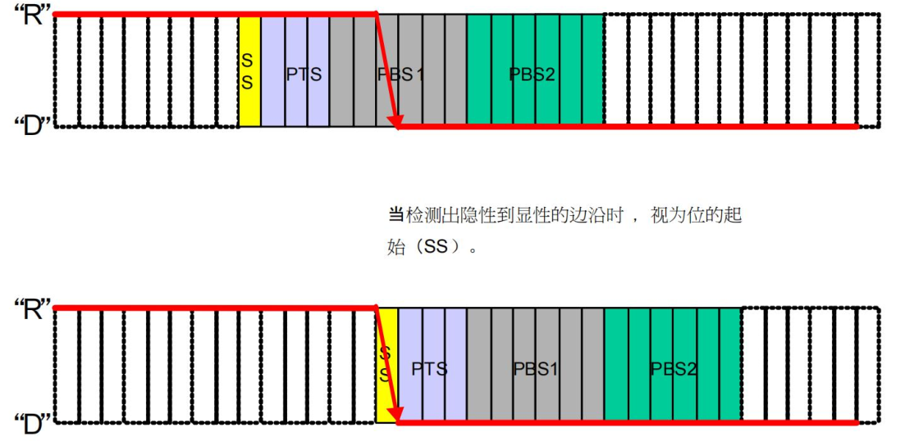


然而，**硬同步的作用范围有限，它仅在消息帧的起始阶段生效，且只能解决初始相位偏差问题**。



### 再同步

在 CAN 通信中，**再同步是解决通信过程中因时钟漂移或信号干扰导致的动态相位误差的关键机制**。

与硬同步不同，再同步并非仅限于帧起始阶段，而是**在整个数据传输过程中持续发挥作用**。。

具体来说，**再同步的触发条件是当检测到信号边沿（如显性电平到隐性电平的变化）与预期位置存在偏差时**。

- **如果信号边沿提前到达，说明发送节点的时钟快于接收节点，此时接收节点会通过缩短相位缓冲段 1 来提前采样点；**
- **反之，如果信号边沿延迟到达，则说明发送节点的时钟慢于接收节点，接收节点会通过延长相位缓冲段 2 来推迟采样点。**

这种动态调整的过程依赖于**同步跳转宽度（SJW, Synchronization Jump Width）**，它定义了，以防止过度调整引发新的误差。

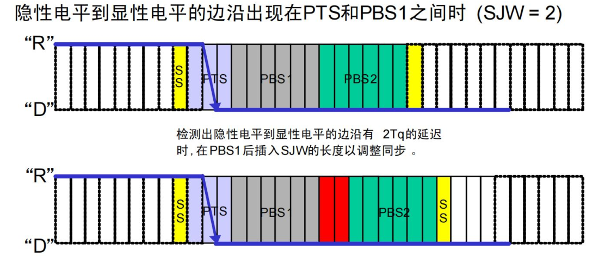


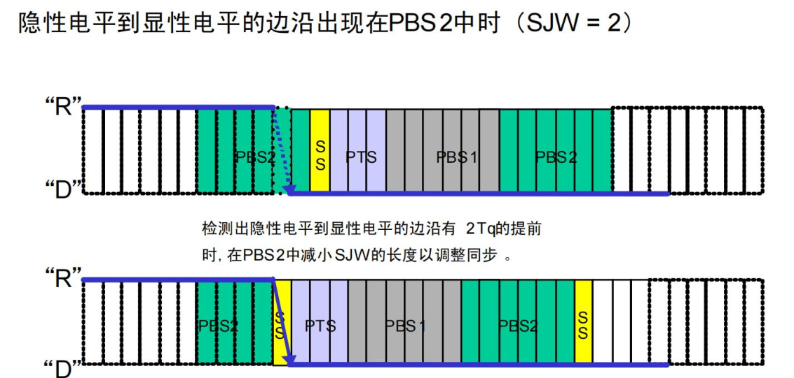

再同步的优势在于其灵活性和实时性，能够有效应对通信过程中因时钟漂移或信号传播延迟带来的挑战。

然而，。

因此，再同步与硬同步协同工作，共同构成了CAN 协议中完整的同步机制：硬同步为通讯提供初始对齐，而再同步则在后续传输中动态补偿误差，确保数据传输的准确性和稳定性。


## 仲裁规则

在 CAN 总线通信中，由于多个节点共享同一条总线，同一时刻只能传输一个数据帧，因此需要一套高效的仲裁机制来保证数据的有序传输。

CAN 协议通过载波侦听、非破坏性仲裁和回读机制共同协作，实现了多节点间的高效、无冲突通信。

### 载波侦听

在**发送数据之前，每个节点会首先侦听总线的状态**，只有当总线处于空闲状态（即没有其他节点正在发送数据）时，节点才允许开始发送数据。

这种机制类似于以太网中的“载波侦听多路访问（CSMA）”，可以有效避免多个节点同时抢占总线的情况。



### 非破坏性仲裁

非破坏性仲裁是 CAN 总线仲裁机制的核心，其核心原则是**基于线与机制**

- 当所有节点都发送隐性电平（逻辑 1）时，总线表现为隐性；
- 只要有一个节点发送显性电平（逻辑 0），总线就表现为显性。

这种机制确保了即使多个节点同时发送数据，总线上的信号也不会被破坏，而是由显性电平主导，仲裁过程如下所示：

- 每个数据帧的标识符（ID）字段用于仲裁优先级，**ID 越小，优先级越高**。
- 当多个节点同时发送数据时，它们会逐位比较自己发送的 ID 与总线上的实际电平，
  - 如果某个节点发送的是隐性电平（1），但检测到总线上为显性电平（0），说明有更高优先级的节点正在发送数据，该节点会立即停止发送并进入监听模式，等待下一次总线空闲时重新尝试发送。
  - 如果某个节点发送的是显性电平（0），且总线上也为显性电平（0），则该节点继续发送，表明它当前具有最高优先级。


### 回读机制

为了确保仲裁的正确性和数据传输的可靠性，CAN 节点**在发送数据的同时会不断回读总线上的信号**，**并将其与自身发送的数据进行比较**

，则说明发生了仲裁冲突，该节点会立即**停止发送并切换到监听模式**。

这种机制确保了低优先级节点能够及时退出发送，避免干扰高优先级节点的通信


## 错误状态

在 CAN 协议中，节点的错误状态是根据**发送错误计数器（TEC）**和**接收错误计数器（REC）**的值动态调整的。

通过三种不同的错误状态主动错误状态 、被动错误状态 和总线关闭态 ，

CAN 协议实现了对故障节点的有效管理和隔离，同时确保了通信的可靠性和稳定性。

### 主动错误状态

**当节点的发送错误计数器（TEC）和接收错误计数器（REC）均小于或等于 127 时，节点处于主动错误状态 。**

在此状态下，节点能够正常参与总线通信，并在检测到错误时主动发送主动错误标志（显性位）。这种显性标志会强制覆盖总线信号，通知其他节点当前存在错误。

由于显性位具有更高的优先级，这种机制能够快速传播错误信息，从而确保错误被及时处理，维护总线通信的可靠性。

### 被动错误状态

**如果节点的发送错误计数器（TEC）或接收错误计数器（REC）超过 127（通常由 TEC 触发），节点将进入被动错误状态。**

在这一状态下，节点仍可参与通信，但其行为受到限制：它不能主动发送显性错误标志，而是发送被动错误标志（隐性位），以避免对总线造成干扰。此外，每次发送后需插入 8 个隐性位的延迟才能再次尝试通信。

值得注意的是，如果仅被动错误状态的节点检测到错误，而其他主动节点未检测到，则总线被视为无错误，通信继续进行。

这种设计既限制了低可靠性节点对总线的影响，又保证了高可靠性节点的通信效率。

### 总线关闭态

**当节点的发送错误计数器（TEC）超过 255 时，节点进入总线关闭态 。**

在这种状态下，节点完全禁止通信，既不能发送也不能接收数据，以防止其对总线造成进一步干扰。

要恢复通信，节点需要检测到 128 次连续的 11 个隐性位（即总线空闲足够长时间），随后重置 TEC 和REC 为 0，从而恢复为主动错误状态并重新加入总线通信。

这种机制旨在隔离严重故障节点，同时为其提供重新加入总线的机会。


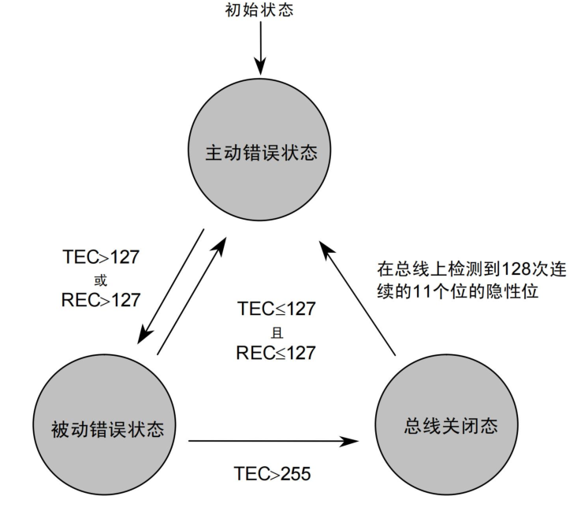

更具体的接收错误计数值（REC）和发送错误计数值（TEC)的变动条件如下表所示：

| 序号 |                接受和发送错误计数值的变动条件                | 发送错误计数值（TEC） |              接收错误计数值（REC）              |
| :--: | :----------------------------------------------------------: | :-------------------: | :---------------------------------------------: |
|  1   | 接收单元检测出错错误时。例外：接收单元在发送错误标志或过载标志中检测出 “位错误” 时，接收错误计数值不增加。 |           —           |                       +1                        |
|  2   |   接收单元在发送完错误标志后检测到的第一个位为显性电平时。   |           —           |                       +8                        |
|  3   |                  发送单元在输出错误标志时。                  |          +8           |                        —                        |
|  4   |    发送单元在发送主动错误标志或过载标志时，检测出位错误。    |          +8           |                        —                        |
|  5   |    接收单元在发送主动错误标志或过载标志时，检测出位错误。    |           —           |                       +8                        |
|  6   | 各单元从主动错误标志、过载标志的最开始检测出连续 14 个位的显性位时。之后，每检测出连续的 8 个位的显性位时。 |      发送时 + 8       |                   接收时 + 8                    |
|  7   |     检测出在被动错误标志后追加的连续 8 个位的显性位时。      |      发送时 + 8       |                   接收时 + 8                    |
|  8   | 发送单元正常发送数据结束时（返回 ACK 且到帧结束也未检测出错误时）。 |  TEC=0 时 ±0否则 - 1  |                        —                        |
|  9   | 接收单元正常接收数据结束时（到 CRC 未检测出错误且正常返回 ACK 时）。 |           —           | 1≤REC≤127 时 - 1REC=0 时 ±0REC>127 时设 REC=127 |
|  10  |  处于总线关闭态的单元，检测到 128 次连续 11 个位的隐性位。   |         TEC=0         |                      REC=0                      |

## 错误检测机制

CAN（Controller Area Network）协议通过多种错误检测手段，有效提升了通信的可靠性。

错误检测机制可以分为以下五种：位错误、填充错误、CRC 错误、格式错误和 ACK 错误。

### 位错误

位错误是指**发送单元在通信过程中比较自身输出电平与总线电平（不包括填充位）时，发现两者不一致所检测到的错误**。

这种错误通常表明发送节点与总线上的信号存在冲突或干扰。



由于位错误是由发送单元自身检测到的，因此其检测单元为发送单元。

### 填充错误

填充错误是指**在需要位填充的段内，接收单元连续检测到 6 位相同电平时所触发的错误**。

CAN 协议规定，在位填充段中，每连续 5 个相同电平后必须插入一个相反电平的填充位，以确保信号的直流平衡。

如果接收单元检测到连续 6 位相同的电平，则认为发生了填充错误。



### CRC 错误

CRC 错误是指**接收单元根据接收到的数据计算出的 CRC 校验值与帧中实际接收到的 CRC顺序不一致**时所检测到的错误。

CRC 校验是 CAN 协议中用于验证数据完整性的关键机制，若校验失败，则表明数据在传输过程中可能发生了损坏或丢失。



### 格式错误

格式错误是指**接收单元在解析帧时检测到与固定格式的位段相反的格式时所触发的错误**。例如，CRC 界定符、ACK 界定符或 EOF 的非法值均可能导致格式错误。

这种错误通常表明帧结构不符合 CAN 协议的规范。



### ACK 错误

ACK 错误是指**发送单元在 ACK 槽（ACK Slot）中检测到隐性电平时所触发的错误**。

在 CAN 协议中，**当发送单元完成数据帧或遥控帧的发送后，会在 ACK 槽等待其他节点的确认信号（显性电平）**。

如果发送单元未检测到显性电平，则认为未收到确认信号，从而触发 ACK 错误。




## CAN 总线协议和标准规格

在现代通信系统中，ISO 七层网络模型是描述和标准化网络通信过程的经典框架。它将网络通信划分为七个层次，从底层的物理信号传输到高层的应用服务，每一层都具有特定的功能和作用。

CAN 协议的设计虽然并未完全遵循 ISO 七层网络模型，但其功能可以映射到该模型的部分层次 。

CAN 协议主要集中在**物理层**、**数据链路层**和**传输层**的部分功能。

### ISO 七层网络模型

1. **物理层（Physical Layer）**
   物理层负责设备间的物理信号传输，定义了通信所需的电气信号、硬件规格和通信介质。它涵盖了通信方式（如单工、半双工、全双工）、信号电平（如高低电平表示逻辑 0 和 1）、硬件规格（如电缆、连接器、收发器）以及位时序条件（如位同步、采样点），从而确保数据能够在物理媒介上可靠传输。
2. **数据链路层（Data Link Layer）**
   数据链路层将物理层接收到的位序列组织成有意义的数据帧，并提供错误检测与控制功能。其具体项目包括数据帧的格式（如帧起始、标识符、数据字段、CRC 校验）、访问控制方法（如 CSMA/CD、CSMA/CA）以及错误检测与纠正机制（如 CRC 校验、ACK 应答），以确保数据在链路上传输的准确性和完整性。
3. **网络层（Network Layer）**
   网络层负责数据包的路由选择和中继，确保数据能够从源设备高效传输到目标设备。它通过路由选择（如静态路由、动态路由）、地址管理（如 IP 地址分配）以及数据包的分段与重组等功能，实现跨网络的数据传输，为复杂网络环境中的通信提供支持。
4. **传输层（Transport Layer）**
   传输层确保数据传输的可靠性，控制数据顺序、错误恢复和流量控制。它通过数据传输顺序控制（如序列号、确认机制）、错误恢复（如重传机制）以及流量控制（如滑动窗口协议）等机制，保障数据在端到端传输过程中的一致性、完整性和高效性。
5. **会话层（Session Layer）**
   会话层管理通信会话的建立、维护和终止，确保数据能够在会话期间正确传输。它通过会话建立与终止（如握手协议）、会话同步（如检查点机制）以及会话恢复（如断点续传）等功能，协调应用程序之间的交互，提高通信的稳定性和效率。

6. **表示层（Presentation Layer）**
   表示层负责数据的表现形式转换，确保不同系统间的数据兼容性。它通过数据格式转换（如文本编码、图像格式）、数据加密与解密以及数据压缩与解压缩等功能，使数据能够在不同平台和应用之间进行无缝交换和处理。

6. **应用层（Application Layer）**
   应用层为应用程序提供网络服务接口，实现具体的应用功能。它通过应用程序协议（如 HTTP、FTP、SMTP）、用户接口（如浏览器、邮件客户端）以及数据服务（如文件传输、电子邮件）等功能，直接服务于最终用户，满足多样化的网络应用需求。


### CAN 协议物理层和数据链路层

CAN 协议主要集中在重物理层和数据链路层

- **can 协议中的物理层**

物理层负责定义信号的实际发送方式，采用 NRZ（非归零）编码，并在每 6 个位后插入填充位。

它还规定了位时序和采样数，用户可以根据需求进行选择。

同步通过同步段（SS）实现，并具备再同步功能。然而，信号电平、通信速度、采样点、驱动器和总线的电气特性以及连接器的形态等具体细节未在协议中定义，需要用户根据系统需求自行确定。

- **can 协议中的数据链路层**
  - **MAC 子层（介质访问控制子层）**负责将数据组织成帧，包括数据帧、遥控帧、错误帧和过载帧。它还处理数据冲突时的仲裁，根据优先级决定哪个消息继续发送，并通过 ACK（确认）和 NACK（否定确认）进行应答。此外，MAC 子层检测并报告 CRC 错误、填充位错误、位错误、ACK 错误和格式错误，同时具备故障扩散抑制功能，能够自动区分暂时错误和持续错误，并排除故障节点。
  - **LLC 子层（逻辑链路控制子层）**则负责接收消息的选择，支持点到点连接、广播和组播它还提供错误恢复功能，在检测到错误时进行重发控制，确保数据的可靠传输


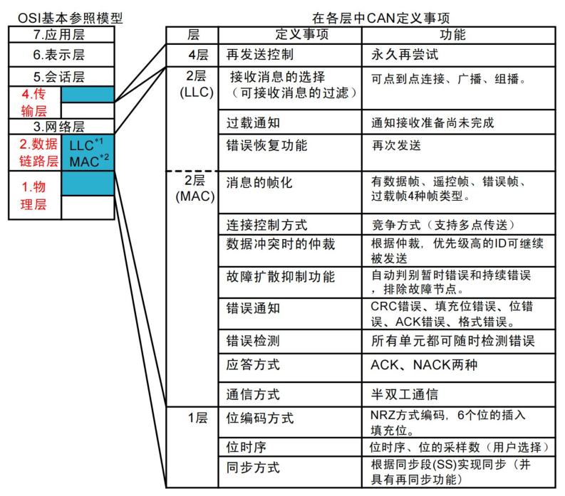

CAN 协议经过 ISO 标准化后，分为 ISO11898 和 ISO11519-2 两种标准。

这两个标准在数据链路层的定义是相同的，但在物理层有所不同：

-  ISO11898 是通信速度为 125kbps-1Mbps的 CAN 高速通信标准
- ISO11519-2 则是通信速度为 125kbps 以下的 CAN 低速通信标准。

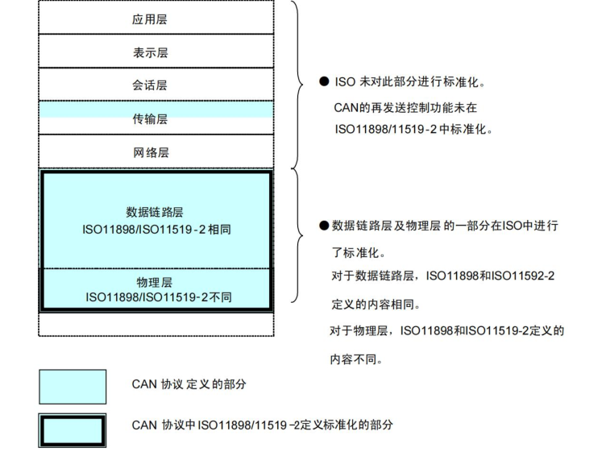


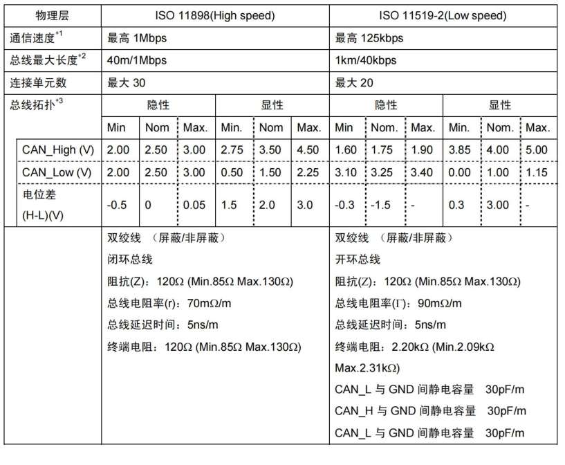


# 启用 CAN

## 设备树

```dts
	can0: can@fe570000 {
		compatible = "rockchip,rk3568-can-2.0"; // 指定设备兼容性字符串，用于匹配驱动程序
		reg = <0x0 0xfe570000 0x0 0x1000>; // 定义寄存器地址范围：基地址为 0xfe570000，长度为 0x1000 字节
		interrupts = <GIC_SPI 1 IRQ_TYPE_LEVEL_HIGH>; // 定义中断信息：使用 GIC 的 SPI 中断，中断号为 1，触发类型为高电平
		clocks = <&cru CLK_CAN0>, <&cru PCLK_CAN0>; // 定义时钟源：引用 CRU 节点中的 CLK_CAN0（波特率时钟）和 PCLK_CAN0（APB 总线时钟）
		clock-names = "baudclk", "apb_pclk"; // 为时钟信号命名：分别为波特率时钟和 APB 总线时钟
		resets = <&cru SRST_CAN0>, <&cru SRST_P_CAN0>;// 定义复位信号：引用 CRU 节点中的 SRST_CAN0（主复位）和 SRST_P_CAN0（APB 复位）
		reset-names = "can", "can-apb"; // 为复位信号命名：分别为 CAN 主复位和 APB 复位
		tx-fifo-depth = <1>; // 定义发送 FIFO 深度：深度为 1，即一次只能存储一个待发送的消息
		rx-fifo-depth = <6>; // 定义接收 FIFO 深度：深度为 6，即可以同时存储 6 个接收到的消息
		status = "disabled"; // 定义设备初始状态：默认禁用，启动时不会启用该设备
	};

	can1: can@fe580000 {
		compatible = "rockchip,rk3568-can-2.0";
		reg = <0x0 0xfe580000 0x0 0x1000>;
		interrupts = <GIC_SPI 2 IRQ_TYPE_LEVEL_HIGH>;
		clocks = <&cru CLK_CAN1>, <&cru PCLK_CAN1>;
		clock-names = "baudclk", "apb_pclk";
		resets = <&cru SRST_CAN1>, <&cru SRST_P_CAN1>;
		reset-names = "can", "can-apb";
		tx-fifo-depth = <1>;
		rx-fifo-depth = <6>;
		status = "disabled";
	};

	can2: can@fe590000 {
		compatible = "rockchip,rk3568-can-2.0";
		reg = <0x0 0xfe590000 0x0 0x1000>;
		interrupts = <GIC_SPI 3 IRQ_TYPE_LEVEL_HIGH>;
		clocks = <&cru CLK_CAN2>, <&cru PCLK_CAN2>;
		clock-names = "baudclk", "apb_pclk";
		resets = <&cru SRST_CAN2>, <&cru SRST_P_CAN2>;
		reset-names = "can", "can-apb";
		tx-fifo-depth = <1>;
		rx-fifo-depth = <6>;
		status = "disabled";
	};
```

虽然这里有着 3 个 CAN 设备节点，但是在迅为的底板上因为引脚复用问题只有一个 CAN接口，对应的原理图部分如下所示：

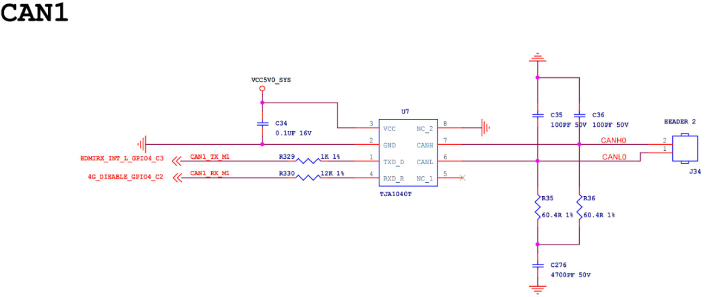

可以看到在开发板上使用的是 CAN1，而在 `rk3568.dtsi` 设备树中 can1 节点的 status 设置的是 disabled，表示不使能，所以肯定是在其他设备树中有对该节点的追加:

```dts
//can接口
&can1 {
        status = "okay";// 指定设备兼容性字符串
        compatible = "rockchip,rk3568-can-2.0";// 设置设备状态为 "okay"，表示启用该设备
        assigned-clocks = <&cru CLK_CAN1>;// 分配时钟源：引用 CRU（Clock and Reset Unit）节点中的 CLK_CAN1。
        assigned-clock-rates = <150000000>;  //If can bitrate lower than 3M,the clock-rates should set 100M,else set 200M. // 设置分配的时钟频率为 150MHz，如果 CAN 波特率低于3Mbps，则建议将时钟频率设置为 100MHz；否则设置为 200MHz。
        pinctrl-names = "default";// 定义引脚控制状态的名称，默认状态为 "default"。
        pinctrl-0 = <&can1m1_pins>;// 引用引脚配置节点 &can1m1_pins，定义 CAN1 的引脚复用和电气属性。
};
```

了设备树的使能之外，在内核配置文件种也要使能对应的驱动，具体路径如下所示：

```
> Networking support
	> CAN bus subsystem support
		> CAN Device Drivers
		<*> Platform CAN drivers with Netlink support
```

# CAN工具的移植和使用

`iproute2` 和 `can-utils` 是两个必不可少的工具。它们分别提供了对 CAN 接口的基础管理和高级操作功能，帮助我们轻松实现 CAN 总线的配置、测试和调试。

## iproute2 工具移植

iproute2 是一个用于网络管理的工具集，包含 ip、ss、tc 等命令，对应的源码压缩包可以在官网 进行下载



编译：

```bash
./configure
# 修改configure生成的Makefile，修改下面这样为lib ip即编译使用ip这个工具
SUBDIRS=lib ip

make CC=/path/to/linux_sdk/prebuilts/gcc/linux-x86/aarch64/gcc-linaro-6.3.1-2017.05-x8
6_64_aarch64-linux-gnu/bin/aarch64-linux-gnu-gcc
```

编译完成之后在 ip 目录下就会生成对应的可执行文件，将该文件拷贝到开发板上即可


## can utils 工具移植

canutils 是一个常用的 CAN 通信测试工具包，包含 5 个独立的程序：canconfig、candump、canecho、cansend 和 cansequence，每个工具的介绍如下所示：


|    工具名称     |                           功能描述                           |                 主要配置项 / 附加功能 / 用途                 |
| :-------------: | :----------------------------------------------------------: | :----------------------------------------------------------: |
|  **canconfig**  |                用于配置 CAN 总线接口的参数。                 | 波特率（Bitrate）<br />工作模式（Mode），如回环模式（Loopback）或正常模式（Normal）。 |
|   **candump**   |  从 CAN 总线接口接收数据，并以十六进制形式打印到标准输出。   |             可以将接收到的数据保存到指定文件中。             |
|   **canecho**   |  将从 CAN 总线接口接收到的所有数据重新发送回 CAN 总线接口。  |                用于测试 CAN 总线的回环功能。                 |
|   **cansend**   |            向指定的 CAN 总线接口发送指定的数据。             |         数据以 CAN 帧格式发送，包括帧 ID 和帧数据。          |
| **cansequence** | 向指定的 CAN 总线接口自动发送递增的数字序列；支持接收模式，可以校验接收到的递增数字是否正确。 |         用于测试 CAN 总线的数据传输完整性和稳定性。          |

由于 canutils 依赖于 libsocketcan 库，因此需要先编译 libsocketcan，然后再编译 canutils，libsocketcan对应源码链接：

 

编译：

```bash
$ export ARCH=arm64
$ export CROSS_COMPILE=/path/to/linux_sdk/prebuilts/gcc/linux-x86/aarch64/gcc-linaro-6.3.1-2017.05-x8
6_64_aarch64-linux-gnu/bin/aarch64-linux-gnu-
$ export PATH=$PATH:/path/to/linux_sdk/prebuilts/gcc/linux-x86/aarch64/gcc-linaro-6.3.1-2017.05-x8
6_64_aarch64-linux-gnu/bin/

$ ./configure --host=aarch64-linux-gnu --prefix=/home/topeet/can/libsocketcan-0.0.12/out

$ make && make install
# 编译完成之后会在当前目录的 out 目录下生成对应的文件
$ ls out
include lib share
```


canutils 源码下载地址为

 

解压后进入到对应的目录下，对 `config/autoconf/config.sub` 文件进行修改，分别添加以下内容，增加对 aarch64 的支持，修改完成如下所示：

```
| aarch64 | aarch64_be \
| aarch64-* | aarch64_be-* \
```

然后对 configure 配置文件进行修改，将 2604 行编译器修改为 aarch64-linux-gnu-gcc，修改完成如下所示：

```
at_ct_CC=aarch64-linux-gnu-gcc
```

编译：

```bash
$ export ARCH=arm64
$ export CROSS_COMPILE=/path/to/linux_sdk/prebuilts/gcc/linux-x86/aarch64/gcc-linaro-6.3.1-2017.05-x86_64_aarch64-linux-gnu/bin/aarch64-linux-gnu-
$ export PATH=$PATH:/home/topeet/work/linux_sdk/prebuilts/gcc/linux-x86/aarch64/gcc-linaro-6.3.1-2017.05-x86_64_aarch64-linux-gnu/bin/

$ ./configure \
	--host=aarch64-linux-gnu \
	--prefix=/path/to/canutils-4.0.6/out \
	libsocketcan_LIBS="-L/path/to/libsocketcan-0.0.12/out/lib -lsocketcan" \
	libsocketcan_LDFLAGS="-L/path/to/libsocketcan-0.0.12/out/lib" \
	libsocketcan_CFLAGS="-I/path/to/libsocketcan-0.0.12/out/include" \
	CFLAGS="-I/path/to/libsocketcan-0.0.12/out/include
	
$ make && make install
$ ls out/bin/
candump canecho cansend cansequence
```

## can工具使用

### 设置 CAN 接囗的波特率

CAN 接口的波特率可以通过 ip 命令设置,例如可以通过以下命令设置 CAN0 接口的波特率为250 k：

```bash
ip link set can0 type can bitrate 250000
```

### 启动和关闭 CAN 接口

配置完 CAN 接口波特率之后，需要启动 CAN 接口才能使用。

1. 方法 1：使用 ifconfig 命令

ifconfig 是传统的网络接口配置工具，可以通过以下命令启动 CAN 接口：

```bash
ifconfig can0 up
```

关闭 CAN 接口：

```bash
ifconfig can0 down
```

2. 方法 2：使用 ip 命令

启动 CAN 接口

```bash
ip link set can0 up
```

关闭 CAN 接口

```bash
ip link set can0 down
```

### 检查 CAN 接口状态

启动 CAN 接口后，可以使用 ifconfig 命令和 ip 命令检查其状态，

1. 使用 ifconfig 检查

```bash
ifconfig can0
```

2. 使用 ip 命令检查

```bash
ip -details link show can0
```

### 使用 CAN 工具测试通信

#### **使用 candump 接收数据**

candump 用于从 CAN 总线接口接收数据，并以十六进制形式打印到标准输出。

命令格式：`candump <接口> [选项]`

```bash
candump can0 -L &
```

##### 设置过滤规则

基本过滤公式分为两种：

- `<can id>:<can mask>` 匹配特定的CAN帧
  - 表示当接收到的 CAN ID 满足条件 `<received can id> & mask == can id & mask` 时匹配。
  - mask 决定了哪些位需要参与匹配，只有对应位为 1 的部分才会被检查
  - can id 则是期望匹配的目标 ID。这种规则通常用于筛选符合特定 ID 和格式的帧，例如只接收某个标准帧或扩展帧。

- `<can id>~<can mask>` 排除特定的CAN帧，与`<can id>:<can mask>` 正好相反，即忽略满足
  条件的帧，而接收其他所有帧。
  - 表示当接收到的 CAN ID 满足条件`<received can id> & mask != can id & mask` 时匹配。


> - 标准帧的 CAN ID 长度为 11 位，范围是 0x000 到 0x7FF，在过滤规则中，mask 的高 18 位通常设置为 0，表示不关
>   心扩展帧部分；
>
> - 扩展帧的 CAN ID 长度为 29 位，范围是 0x00000000 到 0x1FFFFFFF，其过滤规则中，mask 的低 11 位可以灵活设置为 0 或 1，以决定是否同时匹配标准帧


**示例**

---

**匹配特定扩展帧**

```bash
candump can0,12345678:1FFFFFFF
```

- 含义：只接收扩展帧，且 CAN ID 精确匹配 0x12345678。
- 解析：
  - can id = 0x12345678。
  - mask = 0x1FFFFFFF（匹配所有 29 位，且要求是扩展帧）

---

**匹配特定标准帧**

```bash
candump can0,123:C00007FF
```

- 含义：只接收标准帧，且 CAN ID 精确匹配 0x123。
- 解析：
  - can id = 0x123。
  - mask = 0xC00007FF：高 18 位为 0xC0000（忽略扩展帧部分），低 11 位为 0x7FF（精确匹配标准帧 ID）。

---

**匹配标准帧和远程帧**

```bash
candump can0,123:800007FF
```

- 含义：只接收标准帧或远程帧，且 CAN ID 精确匹配 0x123。
- 解析：
  - can id = 0x123
  - mask = 0x800007FF：高 18 位为 0x80000（允许远程帧），低 11 位为 0x7FF（精确匹配标准帧 ID）。

---

**排除特定扩展帧**

```bash
candump can0,12345678~1FFFFFFF
```

- 含义：排除扩展帧，且 CAN ID 精确匹配 0x12345678。
- 解析：
  - can id = 0x12345678。
  - mask = 0x1FFFFFFF（匹配所有 29 位，且要求是扩展帧）。使用~表示排除匹配

---

**多条匹配规则**

如果想要应用多条匹配规则，只需要通过逗号追加即可，例如只接收标准帧，且 CAN ID 精确匹配 0x123 和 0x456

```bash
candump can0,123:C00007FF,456:C00007FF
```


#### **使用 cansend 发送数据**

cansend 用于向 CAN 总线接口发送不同的帧，发送不同帧的示例如下

- **发送标准数据帧**
- 命令格式：`cansend <接口> <帧 ID>#<数据>`
  - `<接口>`：CAN 接口名称（如 can0）。
- `<帧 ID>`：CAN 帧的 ID（11 位，十六进制）。
  - `<数据>`：CAN 帧的数据（十六进制）。
- 示例：can0 发送一个标准数据帧，ID 为 0x123，数据为 DE AD BE EF。

```bash
cansend can0 123#DEADBEE
```

- **发送远程帧**
  - 命令格式：`cansend <接口> <帧 ID>#R`
  - `R`：表示远程帧。
  - 示例：向 can0 发送一个标准远程帧，ID 为 0x123。

```bash
cansend can0 123#R
```

- **发送扩展数据帧**
  - 命令格式：`cansend <接口> <帧 ID>#<数据>`
  - `<帧 ID>`：CAN 帧的 ID（29 位，十六进制）。
  - 示例：向 can0 发送一个扩展数据帧，ID 为 0x00000123，数据为 12 34 56 78。

```bash
cansend can0 00000123#12345678
```

- **发送扩展远程帧**
  - 命令格式：`cansend <接口> <帧 ID>#R`
  - R：表示远程帧。
  - 示例：向 can0 发送一个扩展远程帧，ID 为 0x00000123

```bash
cansend can0 00000123#R
```


# CAN应用编程


## 创建socket套接字

socket 函数是网络编程中最基础的函数之一，用于创建一个套接字（socket）。

**套接字是网络通信的基本单元，它提供了进程间通信的机制**。通过套接字，应用程序可以发送和接收数据包，从而实现网络通信。

`socket()` 用于创建一个套接字（Socket），是进行网络通信的**第一步**。创建成功后返回的套接字描述符用于后续的 `bind`、`listen`、`connect`、`send`、`recv` 等操作。

**头文件**

```c
#include <sys/types.h>
#include <sys/socket.h>
```

**函数原型**

```c
int socket(int domain, int type, int protocol);
```

**返回值**

- **成功**：返回一个非负整数，表示套接字描述符（socket fd）
- **失败**：返回 `-1`，并设置 `errno`

**参数说明**

1. `domain` 协议族（地址族）

指定通信所使用的协议族，决定**地址格式和通信范围**。常用取值：

|    协议族    |                             描述                             |
| :----------: | :----------------------------------------------------------: |
|   AF_UNIX    | 用于本地通信（同一台机器上的进程间通信），也称为 AF_LOCAL。  |
|   AF_INET    |        IPv4 互联网协议族，用于基于 IPv4 的网络通信。         |
|   AF_INET6   |        IPv6 互联网协议族，用于基于 IPv6 的网络通信。         |
|    AF_IPX    |         Novell 的 IPX/SPX 协议族，用于 Novell 网络。         |
|  AF_NETLINK  |       内核与用户空间之间的通信，用于接收内核事件通知。       |
|    AF_X25    |        ITU-T X.25/ISO-8208 协议族，用于分组交换网络。        |
|   AF_AX25    |        业余无线电 AX.25 协议族，用于业余无线电通信。         |
|  AF_ATMPVC   | 用于访问原始 ATM PVCs（永久虚拟电路），ATM 是一种高速网络通信技术。 |
| AF_APPLETALK |       AppleTalk 协议族，用于连接 Mac 电脑和其他设备。        |
|  AF_PACKET   | 低级数据包接口，允许应用程序直接访问网络设备，发送和接收原始数据包。 |
|    AF_ALG    |  内核加密 API 的接口，允许应用程序使用内核提供的加密服务。   |
|    PF_CAN    |      用于 CAN（Controller Area Network）通信的协议族。       |

2. `type` 套接字类型

指定数据传输方式。常用取值：

|      类型      |                             描述                             |
| :------------: | :----------------------------------------------------------: |
|  SOCK_STREAM   | 流式套接字，提供面向连接的、可靠的、双向的字节流通信（如 TCP）。 |
|   SOCK_DGRAM   | 数据报套接字，提供无连接的、不可靠的、固定长度的数据报通信（如 UDP）。 |
|    SOCK_RAW    |      原始套接字，允许直接访问底层协议（如 IP、ICMP）。       |
| SOCK_SEQPACKET |        提供面向连接的、可靠的、固定长度的数据报通信。        |


3. `protocol` 协议类型

指定具体使用的协议，通常设置为 **0**，由系统根据 `domain` 和 `type` 自动选择。常用取值：

|    协议     |                描述                 |      对应的 domain 和 type       |
| :---------: | :---------------------------------: | :------------------------------: |
| IPPROTO_TCP |   TCP 协议，用于 SOCK_STREAM 类型   | AF_INET 或 AF_INET6, SOCK_STREAM |
| IPPROTO_UDP |   UDP 协议，用于 SOCK_DGRAM 类型    | AF_INET 或 AF_INET6, SOCK_DGRAM  |
| IPPROTO_RAW |    原始协议，用于 SOCK_RAW 类型     |  AF_INET 或 AF_INET6, SOCK_RAW   |
|   CAN_RAW   |  原始 CAN 协议，用于 CAN 总线通信   |         PF_CAN, SOCK_RAW         |
|   CAN_BCM   | 广播管理协议，用于更复杂的 CAN 通信 |        PF_CAN, SOCK_DGRAM        |

**常见组合示例**

```c
// TCP IPv4 套接字
int fd = socket(AF_INET, SOCK_STREAM, 0);

// UDP IPv4 套接字
int fd = socket(AF_INET, SOCK_DGRAM, 0);

// 本地进程通信
int fd = socket(AF_UNIX, SOCK_STREAM, 0);

// 原始 CAN 套接字（最常用）
int fd = socket(PF_CAN, SOCK_RAW, CAN_RAW);

// 广播管理（BCM）CAN 套接字
int fd = socket(PF_CAN, SOCK_DGRAM, CAN_BCM);

// ISO-TP（CAN 上的传输层）
int fd = socket(PF_CAN, SOCK_DGRAM, CAN_ISOTP);

// J1939（商用车协议）
int fd = socket(PF_CAN, SOCK_DGRAM, CAN_J1939);
```

### 示例

```c
#include <stdio.h>
#include <fcntl.h>
#include <unistd.h>
#include <stdlib.h>
#include <sys/socket.h>
#include <linux/can.h>
#include <linux/can/raw.h>

int main() {
	int sockfd;
	// 创建 CAN 套接字
	sockfd = socket(PF_CAN, SOCK_RAW, CAN_RAW);
	if (sockfd == -1) {
		perror("Socket creation failed");
		return EXIT_FAILURE;
	}
	printf("CAN socket created successfully\n");
	// 关闭套接字（可选）
	close(sockfd);
	return 0;
}
```

## bind 绑定套接字

**函数介绍**

`bind()` 用于将一个套接字绑定到**指定的本地地址**。

 在网络编程中，它通常用于绑定 **IP 地址和端口号**； 在 **CAN 通信** 中，`bind()` 的主要作用是将套接字绑定到**指定的 CAN 接口**（如 `can0`），从而确定数据通过哪个 CAN 控制器进行收发。

`bind()` 是 CAN Socket 通信的**基础配置步骤之一**，在进行数据收发前必须调用。

**头文件**

```c
#include <sys/types.h>
#include <sys/socket.h>
```

**函数原型**

```c
int bind(int sockfd, const struct sockaddr *addr, socklen_t addrlen);
```

**返回值**

- **成功**：返回 `0`
- **失败**：返回 `-1`，并设置 `errno`

**参数说明**

- `sockfd` 套接字描述符

由 `socket()` 函数创建的套接字文件描述符，表示需要绑定的套接字。

- `addr` 地址结构指针：指向要绑定的地址信息的结构体指针。在不同通信场景下，实际使用的结构体不同：

  - **IPv4**：`struct sockaddr_in`

  - **IPv6**：`struct sockaddr_in6`

  - **CAN**：`struct sockaddr_can`

在调用 `bind()` 时，需要将其强制转换为 `struct sockaddr *` 类型。

- `addrlen` 地址结构长度：表示 `addr` 所指向地址结构的大小，通常使用 `sizeof()` 计算：

  - IPv4：`sizeof(struct sockaddr_in)`

  - IPv6：`sizeof(struct sockaddr_in6)`

  - CAN：`sizeof(struct sockaddr_can)`

CAN 通信中的 bind 示例

```c
struct sockaddr_can addr;

addr.can_family  = AF_CAN;
addr.can_ifindex = if_nametoindex("can0");

bind(fd, (struct sockaddr *)&addr, sizeof(addr));
```

> **说明：**
>
> - `can_family`：必须设置为 `AF_CAN`
> - `can_ifindex`：指定 CAN 接口索引（如 `can0`）
> - 绑定后，该套接字只会在指定的 CAN 接口上通信

### 示例

```c
#include <stdio.h>
#include <fcntl.h>
#include <unistd.h>
#include <string.h>
#include <sys/socket.h>
#include <sys/ioctl.h>
#include <net/if.h>
#include <linux/can.h>
#include <linux/can/raw.h>

int main(int argc, char *argv[]) {
	int sockfd; // 套接字描述符
	struct sockaddr_can addr; // CAN 地址结构体
	struct ifreq ifr; // 用于获取网络接口信息
    
	// 创建 CAN 套接字
	sockfd = socket(PF_CAN, SOCK_RAW, CAN_RAW);
	if (sockfd < 0) {
		printf("Socket creation failed");
		return -1;
	}
	// 指定要绑定的 CAN 接口名称
	strncpy(ifr.ifr_name, "can0", IFNAMSIZ - 1);
	
    // 使用 ioctl 获取 CAN 接口的索引号
	ioctl(sockfd, SIOCGIFINDEX, &ifr)

    // 设置 CAN 地址结构体
	addr.can_family = AF_CAN; // CAN 地址族
	addr.can_ifindex = ifr.ifr_ifindex; // CAN 接口索引号

    // 绑定套接字到指定的 CAN 接口
	bind(sockfd, (struct sockaddr *)&addr, sizeof(addr))

    // 关闭套接字（实际应用中可以继续发送/接收数据）
	close(s);
    
    return 0;
}
```

上述代码使用 ioctl 系统调用通过 `SIOCGIFINDEX` 宏获取 CAN 接口的索引号，除了 `SIOCGIFINDEX` 宏之外，在网络设备中还有其他功能的宏，具体如下表所示：

|        命令        |                         功能描述                         |
| :----------------: | :------------------------------------------------------: |
|  **SIOCGIFADDR**   |                  获取网络接口的 IP 地址                  |
|  **SIOCSIFADDR**   |                  设置网络接口的 IP 地址                  |
| **SIOCGIFNETMASK** |                  获取网络接口的子网掩码                  |
| **SIOCSIFNETMASK** |                  设置网络接口的子网掩码                  |
| **SIOCGIFBRDADDR** |                  获取网络接口的广播地址                  |
| **SIOCSIFBRDADDR** |                  设置网络接口的广播地址                  |
| **SIOCGIFDSTADDR** |      获取网络接口的目的地址（点对点接口的对端地址）      |
| **SIOCSIFDSTADDR** |                  设置网络接口的目的地址                  |
| **SIOCGIFHWADDR**  |          获取网络接口的硬件地址（如 MAC 地址）           |
| **SIOCSIFHWADDR**  | 设置网络接口的硬件地址（通常不常用，因硬件地址多为固定） |
|  **SIOCGIFINDEX**  |        获取网络接口的索引号（系统分配的唯一标识）        |
|   **SIOCSIFMTU**   |            设置网络接口的最大传输单元（MTU）             |
|  **SIOCGIFFLAGS**  |    获取网络接口的标志（如是否启用、是否为广播接口等）    |
|  **SIOCSIFFLAGS**  |                    设置网络接口的标志                    |

## 发送/接收数据

CAN 数据并不能直接发送，在发送之前需要进行封包的操作

### struct can_frame

CAN 数据帧通常通过 `struct can_frame` 结构体来表示。这个结构体定义在`<linux/can.h>`头文件中，用于封装要发送的 CAN 数据。该结构体内容如下所示：

```c
struct can_frame {
	canid_t can_id; // CAN 标识符（ID）
	__u8 can_dlc; // 数据长度码（DLC），表示数据字段的长度（0 到 8 字节）
	__u8 data[8]; // 数据字段，最多 8 字节
};
```

- `can_id`：can_id 是一个 32 位无符号整数字段，用于表示 CAN 标识符（ID）。
  - 对于标准帧，can_id 的低 11 位表示标识符；
  - 对于扩展帧，低 29 位表示标识符。
  - 第 30 位用于标识是否为远程帧（通过 CAN_RTR_FLAG 标志）。
  - 最高位（第 31 位）用于标识是否为扩展帧（通过 CAN_EFF_FLAG 标志），
- `can_dlc`：can_dlc 是一个 8 位无符号整数字段，表示 CAN 数据帧中数据字段的长度。其取值范围为 0 到 8，对应经典 CAN 协议中最多支持的 8 字节数据长度。
  - 对于 CAN FD（Flexible Data-rate CAN），can_dlc 可以支持更大的数据长度（如 64 字节）。该字段决定了实际发送或接收的数据字节数，未使用的部分会被忽略。
- `data`：data 是一个 8 字节数组字段，用于存储实际要发送或接收的数据内容。
  - 数据的实际长度由 can_dlc 字段决定，最大为 8 字节（经典 CAN）或更大（CAN FD）。
  - 数组中未使用的部分不会被传输，因此在封装数据时只需填充有效字节即可。

例子：

```c
struct can_frame frame[3]; // CAN 帧数组

unsigned char data[2] = {0x01, 0x02}; // 数据内容

frame[0].can_id = 0x11; // 标准帧 ID
frame[0].can_dlc = 2; // 数据长度（2 字节）

memcpy(frame[0].data, data, 2); // 填充数据
frame[1].can_id = 0x11 | CAN_EFF_FLAG; // 扩展帧 ID
frame[1].can_dlc = 2; // 数据长度（2 字节）

memcpy(frame[1].data, data, 2);// 填充数据

frame[2].can_id = 0x11 | CAN_RTR_FLAG; // 远程帧 ID
frame[2].can_dlc = 2;// 数据长度（2 字节）
```

### 示例

#### 发送数据

```c
#include <stdio.h>
#include <fcntl.h>
#include <unistd.h>
#include <string.h>
#include <sys/socket.h>
#include <sys/ioctl.h>
#include <net/if.h>
#include <linux/can.h>
#include <linux/can/raw.h> // 包含 CAN_RAW 相关定义

int main(int argc, char *argv[]) {
    int sockfd; // 套接字描述符
    struct sockaddr_can addr; // CAN 地址结构体
    struct ifreq ifr; // 用于获取网络接口信息
    int ret; // 用于存储系统调用返回值

    // 创建 CAN 套接字
    sockfd = socket(PF_CAN, SOCK_RAW, CAN_RAW);
    if (sockfd < 0) {
        printf("Socket creation failed");
        return -1;
    }

    // 指定要绑定的 CAN 接口名称
    strncpy(ifr.ifr_name, "can0", IFNAMSIZ - 1);

    // 使用 ioctl 获取 CAN 接口的索引号
    if (ioctl(sockfd, SIOCGIFINDEX, &ifr) < 0) {
        printf("ioctl failed");
        close(sockfd);
        return -1;
    }

    // 设置 CAN 地址结构体
    addr.can_family = AF_CAN; // CAN 地址族
    addr.can_ifindex = ifr.ifr_ifindex; // CAN 接口索引号

    // 绑定套接字到指定的 CAN 接口
    if (bind(sockfd, (struct sockaddr *)&addr, sizeof(addr)) < 0) {
        printf("Bind failed");
        close(sockfd);
        return -1;
    }

    // 定义 CAN 帧数组
    struct can_frame frame[3]; // CAN 帧数组
    unsigned char data[2] = {0x01, 0x02}; // 数据内容

    // 初始化标准帧
    frame[0].can_id = 0x11; // 标准帧 ID
    frame[0].can_dlc = 2;   // 数据长度（2 字节）
    memcpy(frame[0].data, data, 2); // 填充数据

    // 初始化扩展帧
    frame[1].can_id = 0x11 | CAN_EFF_FLAG; // 扩展帧 ID
    frame[1].can_dlc = 2;                 // 数据长度（2 字节）
    memcpy(frame[1].data, data, 2);       // 填充数据

    // 初始化远程帧
    frame[2].can_id = 0x11 | CAN_RTR_FLAG; // 远程帧 ID
    frame[2].can_dlc = 2;                 // 数据长度（2 字节）

    // 循环发送 CAN 帧
    while (1) {
        // 发送标准帧
        ret = write(sockfd, &frame[0], sizeof(frame[0]));
        if (ret != sizeof(frame[0])) {
            printf("write (标准帧)");
            break;
        }
        printf("标准帧发送成功！\n");

        // 发送扩展帧
        ret = write(sockfd, &frame[1], sizeof(frame[1]));
        if (ret != sizeof(frame[1])) {
            printf("write (扩展帧)");
            break;
        }
        printf("扩展帧发送成功！\n");

        // 发送远程帧
        ret = write(sockfd, &frame[2], sizeof(frame[2]));
        if (ret != sizeof(frame[2])) {
            printf("write (远程帧)");
            break;
        }
        printf("远程帧发送成功！\n");

        // 延时 1 秒
        sleep(1);
    }

    // 关闭套接字
    close(sockfd);

    return 0;
}
```

#### 接收数据

```c
#include <stdio.h>
#include <stdlib.h>
#include <string.h>
#include <unistd.h>
#include <net/if.h>
#include <sys/ioctl.h>
#include <sys/socket.h>
#include <linux/can.h>
#include <linux/can/raw.h>

#define BUF_SIZE 128 // 缓冲区大小

int main() {
    int sockfd; // 套接字文件描述符
    struct sockaddr_can addr; // CAN 地址结构体
    struct ifreq ifr; // 网络接口请求结构体
    struct can_frame frame; // CAN 帧结构体
    char buf[BUF_SIZE]; // 格式化输出缓冲区
    int ret, n, i, err;
    FILE *out = stdout; // 输出文件流（标准输出）

    // 创建 CAN 套接字
    sockfd = socket(PF_CAN, SOCK_RAW, CAN_RAW);

    // 指定 CAN 接口名称
    strcpy(ifr.ifr_name, "can0");
    ioctl(sockfd, SIOCGIFINDEX, &ifr);

    // 设置地址信息
    addr.can_family = AF_CAN;
    addr.can_ifindex = ifr.ifr_ifindex;

    // 绑定 CAN 接口
    bind(sockfd, (struct sockaddr *)&addr, sizeof(addr));

    // 循环接收 CAN 帧
    while (1) {
        // 接收 CAN 帧
        ret = read(sockfd, &frame, sizeof(frame));
        if (ret <= 0) {
            printf("read");
            break;
        }

        // 格式化输出 CAN 帧信息
        if (frame.can_id & CAN_EFF_FLAG) {
            // 扩展帧
            n = snprintf(buf, BUF_SIZE, "<0x%08x>", frame.can_id & CAN_EFF_MASK);
        } else {
            // 标准帧
            n = snprintf(buf, BUF_SIZE, "<0x%03x>", frame.can_id & CAN_SFF_MASK);
        }

        // 添加数据长度
        n += snprintf(buf + n, BUF_SIZE - n, "[%d]", frame.can_dlc);

        // 添加数据内容
        for (i = 0; i < frame.can_dlc; i++) {
            n += snprintf(buf + n, BUF_SIZE - n, " %02x", frame.data[i]);
        }

        // 如果是远程帧
        if (frame.can_id & CAN_RTR_FLAG) {
            n += snprintf(buf + n, BUF_SIZE - n, " remote request");
        }

        // 输出到标准输出
        fprintf(out, "%s\n", buf);

        // 刷新输出缓冲区
        err = fflush(out);
        if (err < 0) {
            perror("fflush");
            break;
        }
    }

    // 关闭套接字
    close(sockfd);
    return 0;
}
```

## 过滤规则的设置

CAN 应用程序中的过滤规则设置需要用到 `setsockopt` 函数，`setsockopt` 的主要作用是配置CAN 套接字的过滤规则或其他特定选项。

通过设置这些选项，用户可以控制套接字的行为，例如筛选特定的 CAN 数据帧或调整通信模式。这是 CAN 通信中实现高效数据处理的重要步骤之一。

### setsockopt()

`setsockopt()` 用于为套接字设置各种**协议相关选项**。在 **CAN Socket 通信** 中，它主要用于：

- 设置 **CAN 帧过滤规则**
- 控制是否接收错误帧
- 配置本地回环等行为

其中最常用、也是 CAN 通信的核心配置之一是 **`CAN_RAW_FILTER`**，用于指定套接字**接收哪些 CAN 帧**。

**头文件**

```c
#include <sys/types.h>
#include <sys/socket.h>
```

**函数原型**

```c
int setsockopt(int sockfd,
               int level,
               int optname,
               const void *optval,
               socklen_t optlen);
```


**返回值**

- **成功**：返回 `0`
- **失败**：返回 `-1`，并设置 `errno`


**参数说明**

- `sockfd` 套接字描述符，由 `socket()` 创建的 CAN 套接字文件描述符，表示要配置的套接字。

- `level` 选项级别，指定选项所属的协议层级。CAN 通信中固定使用`SOL_CAN_RAW` 表示设置的是 **原始 CAN 协议（CAN_RAW）相关选项**。

- `optname` 具体选项名称，指定要设置的 CAN 套接字选项，常用选项包括：

  - `CAN_RAW_FILTER`，设置 CAN 数据帧的**过滤规则**（本章重点）

  - `CAN_RAW_ERR_FILTER`，设置是否接收错误帧

  - `CAN_RAW_LOOPBACK`，设置是否启用本地回环模式

- `optval`选项值指针，指向选项数据的缓冲区。
  - 对于 `CAN_RAW_FILTER`，类型为 `struct can_filter *`
    - 可为 **单个过滤规则**
    - 也可为 **过滤规则数组**

- `optlen`选项值长度：表示 `optval` 缓冲区大小（字节数）：

  - 单个过滤规则：`sizeof(struct can_filter)`

  - 多个过滤规则：`sizeof(struct can_filter) * 规则数量`

示例：

**只接收 ID 为 0x123 的标准帧**

```c
struct can_filter filter;

filter.can_id   = 0x123;
filter.can_mask = CAN_SFF_MASK;

setsockopt(fd, SOL_CAN_RAW,
           CAN_RAW_FILTER,
           &filter, sizeof(filter));
```

---

**设置多个过滤规则**

```c
struct can_filter filters[2] = {
    { .can_id = 0x100, .can_mask = CAN_SFF_MASK },
    { .can_id = 0x200, .can_mask = CAN_SFF_MASK }
};

setsockopt(fd, SOL_CAN_RAW,
           CAN_RAW_FILTER,
           filters, sizeof(filters));
```

---

**接收所有 CAN 帧（关闭过滤）**

```c
setsockopt(fd, SOL_CAN_RAW,
           CAN_RAW_FILTER,
           NULL, 0);
```


### struct can_filter 

CAN 过滤规则结构体

```c
struct can_filter {
    canid_t can_id;    // CAN ID + 标志位
    canid_t can_mask;  // 掩码，决定哪些位参与匹配
};
```

- `can_id`

  - 表示期望匹配的 CAN ID

  - 可包含：
    - 标准帧 ID（11 位）
    - 扩展帧 ID（29 位）
    - 标志位（如 `CAN_EFF_FLAG`、`CAN_RTR_FLAG`）

- `can_mask`

  - 用于指定 **哪些位需要参与匹配**

  - 某一位为：
    - `1`：该位必须匹配
    - `0`：该位忽略

### 常用 CAN 掩码宏

|                    掩码值                    |                       含义                       |                        示例代码与用途                        |
| :------------------------------------------: | :----------------------------------------------: | :----------------------------------------------------------: |
|                 CAN_SFF_MASK                 |  匹配标准帧的低 11 位（0x7FF），忽略扩展帧部分   | `can_id=0x123, can_mask=CAN_SFF_MASK`<br />仅接收标准帧且 ID 精确匹配 0x123 |
|                 CAN_EFF_MASK                 |       匹配扩展帧的所有 29 位（0x1FFFFFFF）       | `can_id=0x12345678, can_mask=CAN_EFF_MASK`<br />仅接收扩展帧且 ID 精确匹配 0x12345678 |
|                 CAN_EFF_FLAG                 |           匹配扩展帧标志位（第 30 位）           | `can_mask=CAN_EFF_FLAG`<br />区分标准帧 / 扩展帧，仅关注是否为扩展帧 |
|                 CAN_RTR_FLAG                 |           匹配远程帧标志位（第 31 位）           | `can_mask=CAN_RTR_FLAG`<br />区分数据帧 / 远程帧，仅关注是否为远程帧 |
|         CAN_SFF_MASK \| CAN_EFF_FLAG         |       匹配标准帧低 11 位，区分是否为扩展帧       | `can_id=0x123, can_mask=CAN_SFF_MASK | CAN_EFF_FLAG`<br />接收指定标准帧或扩展帧 |
|         CAN_EFF_MASK \| CAN_RTR_FLAG         |        匹配扩展帧 29 位，区分是否为远程帧        | `can_id=0x12345678, can_mask=CAN_EFF_MASK | CAN_RTR_FLAG`<br />接收指定扩展帧或远程帧 |
|         CAN_SFF_MASK \| CAN_RTR_FLAG         |       匹配标准帧低 11 位，区分是否为远程帧       | `can_id=0x123, can_mask=CAN_SFF_MASK | CAN_RTR_FLAG`<br />接收指定标准帧或远程帧 |
| CAN_SFF_MASK \| CAN_EFF_FLAG \| CAN_RTR_FLAG |   匹配标准帧低 11 位，区分是否为扩展帧和远程帧   | `can_id=0x123, can_mask=CAN_SFF_MASK | CAN_EFF_FLAG | CAN_RTR_FLAG`<br />仅接收标准帧的数据帧 |
|                  0xFFFFFFFF                  | 匹配所有 32 位（含标准帧、扩展帧、远程帧标志位） | `can_id=0x123, can_mask=0xFFFFFFFF`<br />精确匹配某个完整 CAN ID 和帧类型 |
|                     0x0                      |       忽略所有位，匹配所有帧（无过滤规则）       |            `can_mask=0x0`<br />接收所有帧，无过滤            |

### 示例

```c
#include <stdio.h>
#include <stdlib.h>
#include <string.h>
#include <unistd.h>
#include <net/if.h>
#include <sys/ioctl.h>
#include <sys/socket.h>
#include <linux/can.h>
#include <linux/can/raw.h>

#define BUF_SIZE 128 // 缓冲区大小

int main() {
    int sockfd; // 套接字文件描述符
    struct sockaddr_can addr; // CAN 地址结构体
    struct ifreq ifr; // 网络接口请求结构体
    struct can_frame frame; // CAN 帧结构体
    struct can_filter rfilter[2]; // 过滤规则数组
    char buf[BUF_SIZE]; // 格式化输出缓冲区
    int i, n;
    FILE *out = stdout; // 输出文件流（标准输出）

    // 创建 CAN 套接字
    if ((sockfd = socket(PF_CAN, SOCK_RAW, CAN_RAW)) < 0) {
        perror("Socket creation failed");
        return -1;
    }

    // 指定 CAN 接口名称
    strcpy(ifr.ifr_name, "can0");
    if (ioctl(sockfd, SIOCGIFINDEX, &ifr) < 0) {
        perror("ioctl failed");
        close(sockfd);
        return -1;
    }

    // 设置地址信息
    addr.can_family = AF_CAN;
    addr.can_ifindex = ifr.ifr_ifindex;

    // 绑定 CAN 接口
    if (bind(sockfd, (struct sockaddr *)&addr, sizeof(addr)) < 0) {
        perror("Bind failed");
        close(sockfd);
        return -1;
    }

    // 设置过滤规则
    // 第一条规则：只接收标准帧的数据帧，且 ID 精确匹配 0x123
    rfilter[0].can_id = 0x123; // 目标 CAN ID
    rfilter[0].can_mask = CAN_SFF_MASK | CAN_EFF_FLAG | CAN_RTR_FLAG; // 匹配标准帧，排除扩展帧和远程帧

    // 第二条规则：只接收扩展帧的数据帧，且 ID 精确匹配 0x456
    rfilter[1].can_id = 0x456; // 目标 CAN ID
    rfilter[1].can_mask = CAN_EFF_MASK | CAN_RTR_FLAG; // 匹配扩展帧，排除远程帧

    // 应用过滤规则
    if (setsockopt(sockfd, SOL_CAN_RAW, CAN_RAW_FILTER, &rfilter, sizeof(rfilter)) < 0) {
        perror("setsockopt failed");
        close(sockfd);
        return -1;
    }

    // 循环接收 CAN 帧
    while (1) {
        // 接收 CAN 帧
        if (read(sockfd, &frame, sizeof(frame)) < 0) {
            perror("Read failed");
            break;
        }

        // 格式化输出 CAN 帧信息
        if (frame.can_id & CAN_EFF_FLAG) {
            // 扩展帧
            n = snprintf(buf, BUF_SIZE, "<0x%08x>", frame.can_id & CAN_EFF_MASK);
        } else {
            // 标准帧
            n = snprintf(buf, BUF_SIZE, "<0x%03x>", frame.can_id & CAN_SFF_MASK);
        }

        // 添加数据长度
        n += snprintf(buf + n, BUF_SIZE - n, "[%d]", frame.can_dlc);

        // 添加数据内容
        for (i = 0; i < frame.can_dlc; i++) {
            n += snprintf(buf + n, BUF_SIZE - n, " %02x", frame.data[i]);
        }

        // 如果是远程帧
        if (frame.can_id & CAN_RTR_FLAG) {
            n += snprintf(buf + n, BUF_SIZE - n, " remote request");
        }

        // 输出到标准输出
        fprintf(out, "%s\n", buf);

        // 刷新输出缓冲区
        fflush(out);
    }

    // 关闭套接字
    close(sockfd);
    return 0;
}
```

