# 网络通信基础

**发展历史**

1969 年，ARPAnet 最初连接了美国四所大学的计算机，采用分组交换技术，实现计算机间数据传输 。

1972 年，首次实现与英国、挪威计算机的跨大西洋连接。

1973 年开始研究传输控制协议（TCP）和网际协议（IP）。

1984 年，TCP/IP 协议成为计算机网络通信标准。

1986 年，美国国家科学基金会 NSF 建立了广域网（因特网的前身）。

1994 年，中国的 NCFC 网络正式接入 NSFnet, 中国加入到了因特网。

## 网络协议

网络协议是网络中设备进行通信的规则和约定，常见的网络协议有：

### TCP/IP 协议

TCP/IP（Transmission Control Protocol/Internet Protocol）协议，即传输控制协议/网际协议，是用于互联网通信的基础协议族。

**特点**

- **面向连接**：在传输数据前，TCP 协议会通过“三次握手”建立连接，以此确保通信双方的可靠性以及数据传输的有序性。
- **可靠性强**：TCP 借助序号、确认应答、重传机制以及流量控制等机制，保障数据的可靠性与完整性。若数据包在传输过程中丢失或损坏，TCP 会要求重新发送，直至数据准确无误地到达。
- **基于字节流**：TCP 将应用层数据视作无结构的字节流，不保留消息边界。这表明 TCP 并不关注应用层数据的具体内容，仅将其当作一系列字节进行传输。

**作用**

- TCP/IP 协议采用分层工作方式，每个层级承担特定功能，提供了从网络硬件到应用程序的完整通信解决方案。让不同计算机和网络之间的数据交换得以实现。

### UDP 协议

UDP（User Datagram Protocol）即用户数据报协议。与 TCP 不同，UDP 不提供面向连接的通信方式，也不确保数据的可靠性与完整性。

**特点**

- **无连接性**：UDP 在发送数据前无需建立连接，每个数据包都独立发送，接收方也无需发送确认应答。这种特性使 UDP 具备较低的延迟和较高的传输效率。

- **不可靠性**：UDP 无法保证数据包的顺序性、完整性以及可靠性。若数据包在传输过程中出现丢失或损坏的情况，UDP 不会要求重新发送。

- **基于数据报**：UDP 会将应用层的数据封装成一个个独立的数据报进行传输，每个数据报都包含完整的目的地址和源地址信息。

**作用**

UDP 适用于对实时性要求较高的场景，如视频流、音频流以及在线游戏等。在这些应用中，即便少量数据包丢失，也不会对整体体验造成严重影响。

### DNS 协议

DNS（Domain Name System，域名系统）是一种分布式数据库系统，主要功能是将域名转换为对应的 IP 地址（例如 192.0.2.1）。借助 DNS，用户能够通过易于记忆的域名访问网站，而不必牢记复杂的 IP 地址。

### DHCP 协议

DHCP（Dynamic Host Configuration Protocol，动态主机配置协议）是一种网络协议，其作用是自动为局域网内的客户端设备分配 IP 地址、子网掩码、默认网关以及 DNS 服务器地址等网络参数。

### FTP 协议

FTP（File Transfer Protocol，文件传输协议）是用于网络文件传输的协议，可以用于在不同计算机之间实现文件共享，是互联网上进行文件传输的重要工具之一。

### HTTP/HTTPS 协议

HTTP（HyperText Transfer Protocol，超文本传输协议）是用于分布式、协作式、超媒体信息系统的应用层协议，是万维网（WWW）数据通信的基础。

HTTPS（HyperText Transfer Protocol Secure，超文本传输安全协议）是 HTTP 的安全版本，它通过 SSL/TLS 协议对数据进行加密，从而保障数据传输的安全性。

**作用**

HTTP 协议使用户能够通过浏览器访问互联网上的各类资源，如网页、图片、视频等。HTTPS 协议则致力于保护用户的数据安全，防止数据在传输过程中被窃取或篡改，广泛应用于网上银行、网上支付、电子商务等对数据安全要求较高的场景


## 传输介质

包括网线，电缆，光纤

- **网线**

网线一般由几根导线组成，常见的是 8 根铜导线，两两相互缠绕，形成 4 对双绞线。外部包裹绝缘层和护套，起到保护内部导线，防止信息泄露和外界电磁干扰的作用。

- **电缆**

电缆是一种电能或信号传输装置，通常是由几根或几组导线组成。电缆由导体，绝缘层，护套层组成。

- **光纤**

光纤是一种以光为信息载体，利用光在玻璃或塑料制成的纤维中全反射原理进行数据传输的线缆。它主要分为单模光纤和多模光纤。

### 网线种类

**1 类线和 2 类线**

1 类线与 2 类线主要应用于早期的电话通信系统，并不支持数据传输或现代意义上的网络应用。随着网络技术的不断进步，这两类线已被淘汰，不再用于网络布线。

**3 类线（Category 3, Cat 3）**

3 类线是早期以太网电缆标准之一，主要用于传输速率为 10Mbps 的传统以太网。在现代网络环境中，3 类网线已很少被使用。

**4 类网线（Category 4, Cat 4）**

相较于 3 类线，4 类线虽有所提升，但在实际应用中，因其性价比不高，未能得到广泛推广，很快便被更为先进的 5 类线所取代。

**5 类线（Category 5, Cat 5）**



**超 5 类线（Category 5e, Cat 5e）**



**6 类线（Category 6，Cat 6）**



**超 6 类线（Category 6A, Cat 6a）**



**7 类线（Category 7，Cat 7）**




### 网线制作标准

网线制作有俩种标准，即 T568A 和 T568B。

> 如果网线两端采用相同的线序标准，称为直连线，用于连接不同类型的设备，如电脑与路由器；
>
> 若两端线序不同，如一端为 T568A，另一端为 T568B，则称为交叉线，常用于连接相同类型的设备，如电脑与电脑、交换机与交换机。

#### T568A

T568A 标准线序：绿白、绿、橙白、蓝、蓝白、橙、棕白、棕。


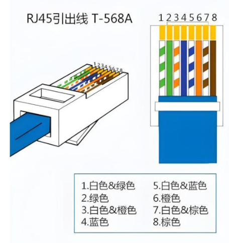

#### T568B

T568B 标准线序：橙白、橙、绿白、蓝、蓝白、绿、棕白、棕

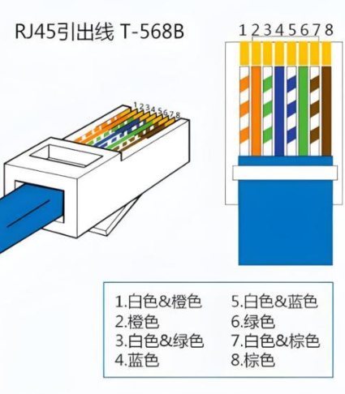


## 网络模型

### OSI 七层模型

OSI 七层网络模型是国际标准化组织（ISO）专门为实现不同系统之间的互连互通而制定的网络体系结构标准。

OSI 七层模型由底层至高层依次为：物理层、数据链路层、网络层、传输层、会话层、表示层以及应用层，具体如下所示：


- **物理层**

物理层只需要考虑如何发送 0 和 1，以及接收端如何识别从而完成比特流的传输，并不需要关心比特流的具体含义。除此以外还规定了网络中的一些电气特性。

- **数据链路层**

单纯的 0 和 1 没有意义，数据链路层要将物理层传来的原始比特流转化为一个个独立的帧。并负责链路连接的建立、维护以及终止，同时还具备帧同步、差错控制和流量控制等功能。

- **网络层**

网络层主要处理数据包从源节点到目标节点的传输与路由问题。也就是建立主机到主机之间的通信。

- **传输层**

传输层负责提供可靠的端口到端口的数据传输服务。确保数据能够准确无误地从发送端传输到接收端。

- **会话层**

主要负责管理用户会话，对应用程序之间的对话进行控制，包括对话的开始、结束以及数据交换过程。

- **表示层**

表示层负责数据格式的转换，如设备固有格式与网络标准格式之间的转换，可以理解是充当“翻译官”的作用。

- **应用层**

应用层是直接面向用户的一层，通过应用程序之间的交互完成特定的网络应用。


### TCP/IP 四层模型

TCP/IP 四层模型是对 OSI 七层模型的简化，它将网络功能划分为网络接口层、网际层、传输层和应用层，如下图所示：

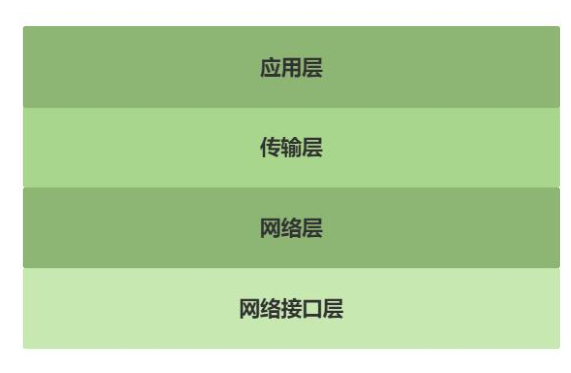

- **应用层**

应用层直接与应用程序交互。常见的应用层协议有 HTTP、FTP、SMTP、DNS 等，不同种类的应用程序会根据自己的需要来选择应用层中不同的协议，如邮件传输应用可以选择 SMTP 协议。

- **传输层**

提供可靠的端口到端口的数据传输服务，传输层中最重要的是 TCP 和 UDP 协议，TCP 提供面向连接的，可靠的服务。UDP 提供无连接的，不可靠但速度快的服务。

- **网络层**

提供主机到主机之间的通信。网络层中最重要的是 IP 协议，IP 协议会给每个数据包加上 IP地址。

- **网络接口层**

网络接口层包含了物理层和数据链路层，所以网络接口层既包括物理传输又包括链路的建立。


> OSI（Open System Interconnection）是国际标准化组织（ISO）制定的七层模型。
>
> TCP/IP 四层模型参考 OSI 七层模型，简化为了四个层次。如下图所示。因此在应用中效率更高，成本更低。所以迅速发展起来并成为事实上的标准。

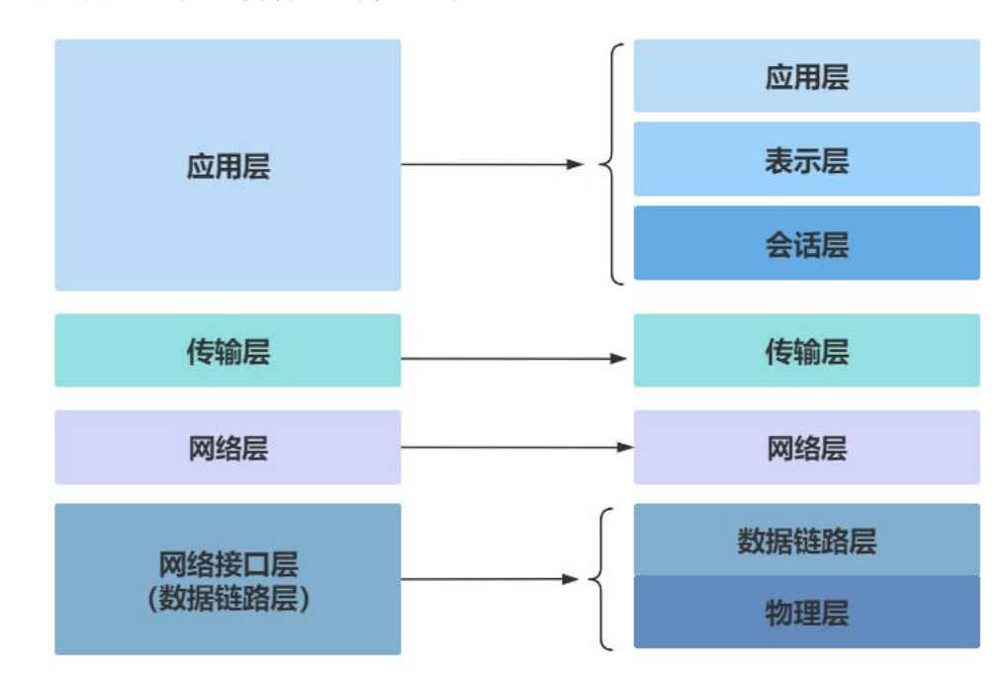


## 网络数据的封装和解封装

在网络通信中，封装是指将上层协议的数据加上本层的协议头和协议尾，形成一个新的数据单元，然后再传递给下一层进行处理。

而解封装则是封装的逆过程，即接收方将接收到的数据单元去掉本层的协议头和协议尾，提取出上层协议的数据，然后传递给上层进行处理。

封装和解封装的过程是在不同的网络层次中依次进行的


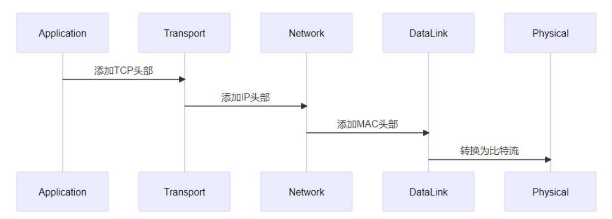


**应用层封装**：应用程序生成的数据，如 HTTP 协议传输的网页数据、SMTP 协议传输的邮件数据等，此时数据被称为应用数据。应用层协议会根据自身需求对数据进行格式化，比如HTTP 会添加请求头或响应头，包含如请求方法、URL、响应状态码等信息。

**传输层封装**：应用数据到达传输层（如 TCP 或 UDP）。以 TCP 为例，TCP 会为数据添加TCP 头部，包含源端口号、目的端口号、序列号、确认号、控制位等信息。端口号用于标识应用程序，使接收端能将数据正确交付给对应的应用。UDP 头部相对简单，同样有源端口号和目的端口号，用于多路复用和分用。此时数据加上 TCP 或 UDP 头部后称为段（Segment）。

**网络层封装**：传输层的段到达网络层（如 IPv4 或 IPv6），网络层添加 IP 头部。IP 头部包含源 IP 地址、目的 IP 地址等关键信息，用于在不同网络间进行路由选择。添加 IP 头部后的数据称为数据包（Packet）。例如，当你访问网站时，你的设备会将 TCP 段封装在 IP 数据包中，目的 IP 地址为网站服务器的 IP。

**数据链路层封装**：网络层的数据包到达数据链路层（如以太网），数据链路层添加帧头和帧尾。以太网帧头包含源 MAC 地址、目的 MAC 地址等，帧尾包含循环冗余校验（CRC）值用于差错检测。此时的数据称为数据帧（Frame）。数据帧通过物理层转化为电信号或光信号在物理介质上传输。


解封装是封装的逆过程，在接收端，数据从物理层开始，依次向上经过各网络层次，每一层去除相应头部信息，将数据还原为应用层能处理的形式，如下图所示：


**数据链路层解封装**：物理层接收到电信号或光信号，转换为数据帧交给数据链路层。数据链路层检查帧头和帧尾，通过 CRC 校验确保数据传输无误后，去除帧头和帧尾，将数据包交给网络层。

**网络层解封装**：网络层接收到数据包，检查 IP 头部，根据目的 IP 地址判断是否是发给本机的。如果是，去除 IP 头部，将段交给传输层。

**传输层解封装**：传输层接收到段，根据 TCP 或 UDP 头部中的端口号，将数据交付给对应的应用程序，并去除 TCP 或 UDP 头部。此时数据还原为应用层数据，应用层程序即可处理这些数据。

# 硬件连接

## RJ45接口

**RJ45** 是 **Registered Jack 45** 的缩写，在计算机网络中 RJ45 是标准 8 芯模块接口的简称，RJ45由插头和插座组成，这两种元器件之间用网线相连。RJ45 插头如下图所示

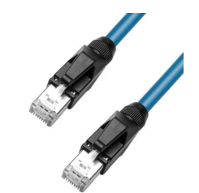

从外观上看，**RJ45 插头**呈矩形，外部是塑料外壳，**内部中有 8 个金属触点，金属触点用于与 RJ45 插座进行电气连接**。


与 RJ45 插头对应在 **RJ45 插座**中同样有 **8 个金属接触片，用于与 RJ45 插头相连**。RJ45 插头前端的 8 个金属触点在插入插座时会与插座内的金属片紧密接触，从而实现信号的传输。

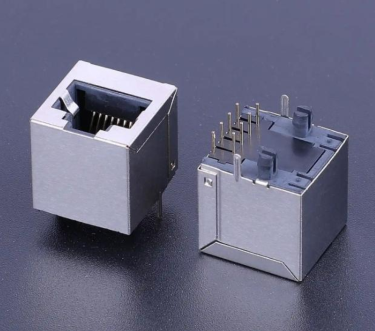

百兆网口和千兆网口都采用 RJ45 接口进行物理连接，不过，尽管外观看起来一模一样，但它们的传输能力却大不相同。对应的引脚使用情况也大不相同。

**百兆 RJ45 接口**有 8 个引脚，这 8 个引脚分别是

| 引脚号 | 标识 |  中文名称  |         功能说明         |
| :----: | :--: | :--------: | :----------------------: |
|   1    | TX+  | 发送数据 + | 以太网差分发送信号的正端 |
|   2    | TX-  | 发送数据 - | 以太网差分发送信号的负端 |
|   3    | RX+  | 接收数据 + | 以太网差分接收信号的正端 |
|   4    |  NC  |    空脚    |    无电气连接，未使用    |
|   5    |  NC  |    空脚    |    无电气连接，未使用    |
|   6    | RX-  | 接收数据 - | 以太网差分接收信号的负端 |
|   7    |  NC  |    空脚    |    无电气连接，未使用    |
|   8    |  NC  |    空脚    |    无电气连接，未使用    |

> **差分信号**：TX+/-、RX+/- 为成对的差分信号线，通过差分传输抗干扰，提升以太网数据传输的稳定性，这是 RJ45 网口的核心设计。
>
> **标准匹配**：该定义符合**T568B**布线标准（民用 / 工业场景最常用），与 T568A 标准仅线序排列不同，引脚功能一致。
>
> **空脚作用**：4、5、7、8 脚为预留脚，部分工业级网口会将其用于供电（如 POE 供电），但常规以太网应用中均为 NC（空脚）。


**千兆 RJ45 接口**也有 8 个引脚，相比百兆以太网，千兆网口启用了全部 8 个引脚，分为 4 对差分线实现全双工高速传输

| 引脚编号 |  名称  |            功能说明             | 传输方向 | 差分对分组 |
| :------: | :----: | :-----------------------------: | :------: | :--------: |
|    1     | TX_D1+ |   Tranceive Data1+(发信号 +)    |   发送   |   第一对   |
|    2     | TX_D1- |   Tranceive Data1-(发信号 -)    |   发送   |   第一对   |
|    3     | RX_D2+ |    Receive Data2+(收信号 +)     |   接收   |   第二对   |
|    4     | BI_D3+ | Bi-directional Data3+(双向信号) |   双向   |   第三对   |
|    5     | BI_D3- | Bi-directional Data3-(双向信号) |   双向   |   第三对   |
|    6     | RX_D2- |    Receive Data2-(收信号 -)     |   接收   |   第二对   |
|    7     | BI_D4+ | Bi-directional Data4+(双向信号) |   双向   |   第四对   |
|    8     | BI_D4- | Bi-directional Data4-(双向信号) |   双向   |   第四对   |

> **传输速率与引脚利用**：百兆以太网（100BASE-TX）仅使用 1/2（TX）、3/6（RX）4 个引脚，而**千兆以太网（1000BASE-T）启用全部 8 个引脚**，通过 4 对差分线同时进行收发，实现 1Gbps 的传输速率。
>
> **双向引脚（BI）的作用**：4/5、7/8 引脚为双向传输设计，在千兆模式下，这两对线会根据通信需求动态切换收发方向，配合数字信号处理（DSP）技术实现全双工通信。
>
> **差分传输特性**：每对引脚（如 TX_D1+/TX_D1-）均为差分信号线，通过两根线的电压差值传递信号，能有效抑制共模干扰，提升高速数据传输的稳定性，这是以太网物理层的核心设计。
>
> **布线标准兼容**：该引脚定义仍遵循 T568A/T568B 布线标准，线序排列与百兆网口一致，因此千兆网线可向下兼容百兆网口使用。

## MAC 控制器

MAC 控制器全称为 Media Access Control(介质访问控制)。属于 **OSI 第二层（数据链路层）** 的一部分。

> MAC 控制器的主要功能是控制与 PHY 芯片的连接，它就像是一个“桥梁管理员”，负责管理数据在数据链路层和物理层之间的传输，确保数据能够顺利地在两个层次之间流动。

MAC 控制器的主要功能包括：

1. **以太网帧的封装与解析**
   - 负责添加/解析以太网帧头（目标 MAC、源 MAC、类型字段）
   - 校验并生成 CRC（FCS）
2. **数据收发控制**
   - 从系统内存（DMA）读取数据，封装成以太网帧并发送
   - 接收来自 PHY 的数据并写入内存
3. **流量与缓冲管理**
   - 发送/接收 FIFO
   - 中断或轮询方式通知 CPU
   - DMA 描述符管理（驱动层重点）
4. **链路层控制**
   - 支持全双工 / 半双工
   - 支持流控（PAUSE 帧）
   - 统计信息（丢包、冲突、错误计数等）
5. **与 PHY 的接口**
   - 通过 **MII / RMII / RGMII / SGMII** 等接口与 PHY 通信
   - 通过 **MDIO/MDC** 配置和管理 PHY 芯片

## PHY 芯片

PHY 芯片全称为物理层芯片（Physical Layer chip）。PHY 芯片的主要任务就是**将数字信号转换为适合在物理介质（如网线）中传输的模拟信号**，然后**将接收到的模拟信号再转换回数字信号**，以便计算机能够识别和处理。

PHY 的核心功能包括：

1. **信号编码与解码**
   - 100M：MLT-3、4B/5B
   - 1000M：PAM-5
   - 自适应均衡、回波消除
2. **自动协商（Auto-Negotiation）**
   - 协商速率（10M / 100M / 1000M）
   - 协商双工模式（半双工 / 全双工）
3. **链路检测**
   - 网线插拔检测
   - Link Up / Link Down 状态上报给 MAC
4. **时钟恢复与同步**
   - 从接收到的信号中恢复时钟
   - 保证数据采样准确
5. **与 MAC 的管理接口**
   - 使用 **MDIO/MDC** 寄存器接口
   - Linux 驱动中常见 `phy_read()` / `phy_write()`


## 网络变压器

网络变压器又称网络隔离变压器，以太网变压器等，网络变压器主要起到信号耦合，电气隔离和阻抗匹配的作用。位于 **PHY 与 RJ45 接口之间**，属于被动器件。

网络变压器的主要作用包括：

1. **电气隔离**
   - 提供 1500V 以上的隔离能力
   - 防止浪涌、电位差损坏芯片
   - 满足以太网安规标准（如 IEEE 802.3）
2. **信号耦合**
   - 将 PHY 输出的差分信号耦合到双绞线
   - 阻断直流分量，只传输交流信号
3. **阻抗匹配**
   - 匹配 PHY 输出阻抗与网线（100Ω）
   - 减少反射，提高信号质量
4. **EMI 抑制**
   - 配合共模电感降低电磁干扰
   - 提升抗干扰能力

> 很多 RJ45 接口内部 **集成了网络变压器和共模电感**，工程中常称为 **“带灯网口”**。


## 连接方式

根据 CPU、MAC 和 PHY 的集成情况，又可以进一步细分为以下三种方式：

**方式 1：CPU 内部集成了 MAC 和 PHY**

在这种方式中，CPU 将 MAC 和 PHY 集成于自身内部。这种方式虽然可以减少外围硬件数量，但是 CPU 成本会显著提高，并且由于全部集成在 CPU 内部，灵活性较差。所以这种方式在实际应用中并不多见。


**方式 2：CPU 内部集成 MAC，PHY 采用独立芯片**

CPU 内部只集成 MAC 控制器，PHY 采用独立的芯片，这种方式的优势是可以根据适应场景灵活选择 PHY 芯片，也是**目前主流的方式**。


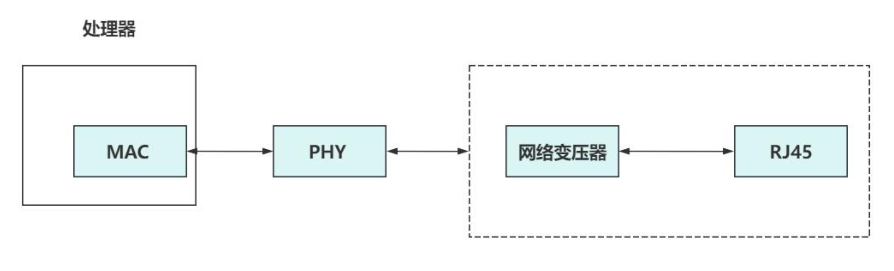

> iTOP-RK3568 也是使用的这种方式，需要注意的是 iTOP-RK3568 开发板上的 RJ45 插座内部集成了网络变压器，如果使用的
> RJ45 插座内部没有集成网络变压器，则需要使用单独网络变压器芯片。


**方式 3：CPU 不集成 MAC 和 PHY，MAC 和 PHY 采用独立芯片或者集成芯片**

在这种连接方式下，CPU 没有 MAC 和 PHY 的功能，也就是我们常说的 CPU 本身不支持网络功能。如果使用网络功能就需要通过其他接口转接。所以这种方式成本较高。

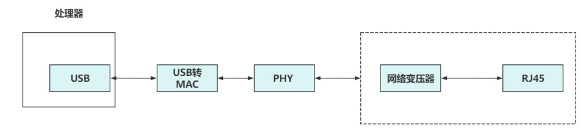


## PHY 接口

在嵌入式网络开发中，最主流的方案如下图所示：


通过框图可知，PHY 芯片的左侧连接了 MAC，右侧连接了 RJ45 插座。尤其可见 PHY 芯片起到了一个桥梁作用。

**PHY 芯片与 MAC 控制器相连可以通过 MII，RMII，GMII，RGMII 和 MIDO 接口。**

### MII 接口

MII 接口全称为 **Media Independent Interface**，即“介质独立接口”。

MII 接口的传输速率为10Mbps 或 100Mbps，在 100Mbps 下时钟为 25M，在 10Mbps 下钟为 2.5M。硬件连接如下图所示：

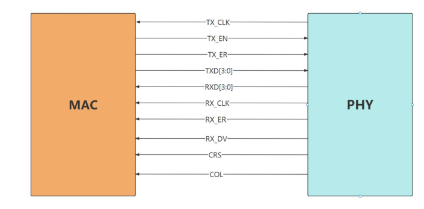

MII 接口一共需要 16 根信号线，含义如下

|     信号线类型      | 信号线名称 | 数量 |           描述           | 方向（MAC←→PHY） |                   核心作用                    |
| :-----------------: | :--------: | :--: | :----------------------: | :--------------: | :-------------------------------------------: |
|    **发送通道**     |   TX_CLK   |  1   |  发送时钟，由 PHY 产生   |    MAC ← PHY     |     发送数据的同步时钟（百兆下为 25MHz）      |
|                     |   TX_EN    |  1   |   发送使能，高电平有效   |    MAC → PHY     |          指示 TXD [3:0] 上的数据有效          |
|                     |  TXD[3:0]  |  4   |       发送数据总线       |    MAC → PHY     |      并行传输发送的以太网数据（4 位宽）       |
|                     |   TX_ER    |  1   |   发送错误，高电平有效   |    MAC → PHY     |    指示发送过程中出现错误（如帧格式错误）     |
|    **接收通道**     |   RX_CLK   |  1   |  接收时钟，由 PHY 产生   |    MAC ← PHY     |     接收数据的同步时钟（百兆下为 25MHz）      |
|                     |   RX_DV    |  1   | 接收数据有效，高电平有效 |    MAC ← PHY     |   指示 RXD [3:0] 上的数据有效（替代 RX_EN）   |
|                     |  RXD[3:0]  |  4   |       接收数据总线       |    MAC ← PHY     |      并行传输接收的以太网数据（4 位宽）       |
|                     |   RX_ER    |  1   |   接收错误，高电平有效   |    MAC ← PHY     | 指示接收过程中出现错误（如 CRC 错误、帧过长） |
| **冲突 / 载波检测** |    COL     |  1   |   冲突检测，高电平有效   |    MAC ← PHY     |     半双工模式下，指示总线上发生数据冲突      |
|                     |    CRS     |  1   |   载波侦听，高电平有效   |    MAC ← PHY     |       半双工模式下，指示总线处于忙状态        |


### RMII 接口

RMII 接口全称为 **Reduced Media Independent Interface**，即“简化媒体独立接口”，它是 MII 接口的简化版本。所以相较于 MII 接口，RMII 接口在数据的发送与接收方面减少了一半的信号线。硬件连接如下图所示：

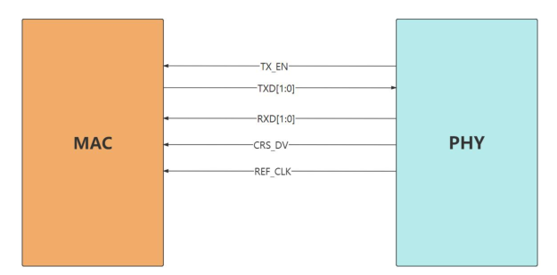


RMII 接口一共需要 7 根信号线，含义如下：

| 信号线名称 | 数量 | 方向（MAC ↔ PHY） |                   核心描述 & 开发关键要点                    |
| :--------: | :--: | :---------------: | :----------------------------------------------------------: |
|  REF_CLK   | 1 根 | 外部 → MAC + PHY  | 50MHz 固定参考时钟，**收发数据唯一同步时钟**（替代 MII 的 TX_CLK/RX_CLK）；需同时供给 MAC 和 PHY，时钟源可选 PHY 内置晶振或外部晶振 |
|   TX_EN    | 1 根 |     MAC → PHY     | 发送使能，高电平有效；PHY 仅在该信号高电平时采样 TXD [1:0] 数据 |
|  TXD[1:0]  | 2 根 |     MAC → PHY     | 2 位并行发送数据总线；通过「2 位宽 × 50MHz」实现 100Mbps 速率，是 RMII 精简的核心设计 |
|   CRS_DV   | 1 根 |     PHY → MAC     | **复用信号**：<br />全双工模式：仅作「RX_DV（接收数据有效）」<br />半双工模式：同时指示「CRS（载波侦听）」和「DV（数据有效）」 |
|  RXD[1:0]  | 2 根 |     PHY → MAC     |    2 位并行接收数据总线；MAC 仅在 CRS_DV 高电平时采样数据    |


### GMII 接口

GMII 接口全称为 **Gigabit Media Independent Interface**，即“千兆介质无关接口”，它是为了满足千兆以太网的高速数据传输需求而设计的接口。在 10M/100M/1000M 下时钟分别是 2.5M，25M 和 125M。硬件连接如下图所示：

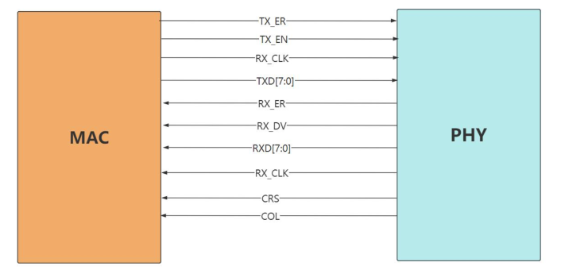

GMII 接口一共需要 25 根信号线，含义如下

| 信号名称 | 位宽 / 数量 |   中文描述   | 信号方向  |                     功能详解（开发核心）                     |                速率适配说明                |
| :------: | :---------: | :----------: | :-------: | :----------------------------------------------------------: | :----------------------------------------: |
| GTX_CLK  |    1 根     | 千兆发送时钟 | MAC → PHY | 千兆模式专属发送同步时钟，固定**125MHz**，MAC 基于此时钟发送数据，PHY 同步采样 TXD 数据 |       仅千兆 (1000M) 使用，核心时钟        |
|  TX_CLK  |    1 根     | 百兆发送时钟 | MAC → PHY |     兼容 10/100M 速率的发送时钟，10M=2.5MHz、100M=25MHz      | 仅 10/100M 模式使用，千兆模式无效（悬空）  |
| TXD[7:0] |    8 根     | 发送数据总线 | MAC → PHY |           8 位并行发送数据，GMII 的核心宽位宽设计            | 千兆 / 百兆 / 十兆全兼容，速率不同时钟不同 |
|  TX_EN   |    1 根     |   发送使能   | MAC → PHY | 高电平有效，指示 TXD [7:0] 上的数据有效，PHY 仅此时采样数据  |                 全速率通用                 |
|  TX_ER   |    1 根     | 发送错误指示 | MAC → PHY |         高电平有效，指示当前发送的数据帧存在格式错误         |                 全速率通用                 |
|  RX_CLK  |    1 根     |   接收时钟   | PHY → MAC | 接收同步时钟，千兆模式 = 125MHz，百兆 = 25MHz，十兆 = 2.5MHz，**由 PHY 从接收数据中提取并提供**，MAC 同步采样 RXD 数据 |          全速率通用，核心接收时钟          |
| RXD[7:0] |    8 根     | 接收数据总线 | PHY → MAC |           8 位并行接收数据，GMII 的核心宽位宽设计            |          千兆 / 百兆 / 十兆全兼容          |
|  RX_DV   |    1 根     | 接收数据有效 | PHY → MAC | 高电平有效，指示 RXD [7:0] 上的数据有效，MAC 仅此时采样数据  |     全速率通用，替代 MII 的 RX_EN 命名     |
|  RX_ER   |    1 根     | 接收错误指示 | PHY → MAC | 高电平有效，指示当前接收的数据帧存在错误（CRC/FCS 错误、帧长错误等） |                 全速率通用                 |
|   CRS    |    1 根     | 载波侦听信号 | PHY → MAC | 仅**半双工模式**有效，高电平表示以太网总线忙，禁止 MAC 发送数据 | 全速率通用，全双工模式下该信号无效（拉低） |
|   COL    |    1 根     | 冲突检测信号 | PHY → MAC | 仅**半双工模式**有效，高电平表示总线上发生数据碰撞，MAC 触发帧重传 | 全速率通用，全双工模式下无冲突，该信号无效 |

### RGMII 接口

RGMII 是 GMII 的简化版本。将引脚数量从 GMII 的 25 个减少至 RGMII 的 14 个。在10M/100M/1000M 下时钟分别是 2.5M，25M 和 125M。硬件连接如下图所示：

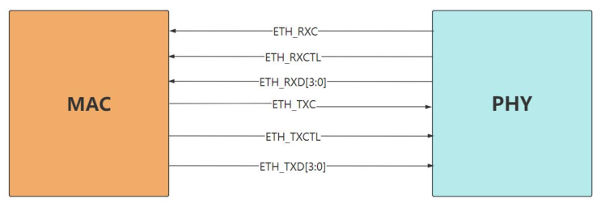

RGMII 接口一共需要 14 根信号线，含义如下

| 信号名称 | 数量 | 方向（MAC ↔ PHY） |                   核心描述 & 开发关键要点                    |             速率适配             |
| :------: | :--: | :---------------: | :----------------------------------------------------------: | :------------------------------: |
|   TXC    | 1 根 |     MAC → PHY     | 发送时钟，千兆模式固定**125MHz**；**双边沿采样**（上升沿 + 下降沿）是 RGMII 精简的核心 | 1000M=125MHz100M=25MHz10M=2.5MHz |
|  TX_CTL  | 1 根 |     MAC → PHY     | 发送控制信号，**复用 TX_EN（发送使能）和 TX_ER（发送错误）**；与 TXC 双边沿同步 |            全速率通用            |
| TXD[3:0] | 4 根 |     MAC → PHY     | 发送数据总线，4 位并行；**双边沿采样**，时钟每个沿都传输 1 位数据，等效 8 位带宽 |            全速率通用            |
|   RXC    | 1 根 |     PHY → MAC     | 接收时钟，千兆模式固定**125MHz**；由 PHY 提供，同样支持**双边沿采样** | 1000M=125MHz100M=25MHz10M=2.5MHz |
|  RX_CTL  | 1 根 |     PHY → MAC     | 接收控制信号，**复用 RX_DV（接收有效）和 RX_ER（接收错误）**；与 RXC 双边沿同步 |            全速率通用            |
| RXD[3:0] | 4 根 |     MAC → PHY     |    接收数据总线，4 位并行；**双边沿采样**，等效 8 位带宽     |            全速率通用            |


### MDIO 接口

MDIO 接口全称为 **Management Data Input/Output**，即管理数据输入输出接口。

主要功能是**实现 MAC 控制器对 PHY 芯片的管理与控制**，例如通过 MDIO 接口对 PHY 寄存器进行设置来配置工作速率；也能够通过读取 PHY 芯片的状态寄存器从而获取网口的状态。

MDIO 接口属于**同步串行半双工接口**，由两根信号线构成，分别是：

- MDIO: 作为数据线，用于在 MAC 层和 PHY 层之间传输配置和管理数据。
- MDC：作为时钟线，为数据传输提供时钟同步。

## 例子

### RTL8211 PHY芯片

在 iTOP-RK3568 开发板采用的是 RTL8211 这款 PHY 芯片。RTL8211 支持 10Mbps、100Mbps和 1000Mbps 的传输速率，并且具备自动协商功能，能够根据网络环境自动调整工作模式。

通过 RTL8211 芯片数据手册中电路连接示意图可知，RTL8211 芯片通过 MDI 接口与 RJ45 接口。MAC 控制器通过 RGMII 接口和 MDIO 接口与 PHY 芯片连接。如下图所示：

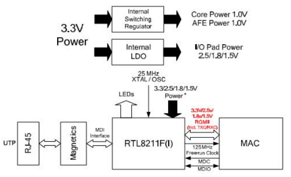

对数据手册中的框图进行简化：

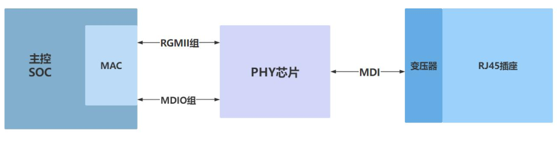

iTOP-RK3568 核心板有引出 RGMII 接口。如下图所示：

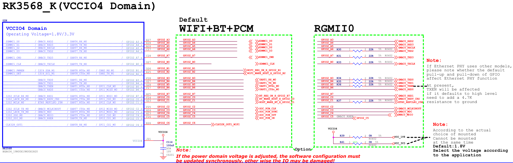

iTOP-RK3568 核心板通过 RGMII 接口和 MDIO 接口与 RTL8211 芯片相连。原理图如下

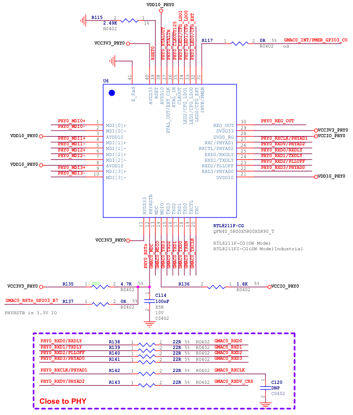


- 第 15，16，17，18 引脚分别对应 TXD3，TXD2，TXD1，TXD0。是发送引脚，方向从MAC 到 PHY。
- 第 22，23，24，25，26 分别对应 RXD3，RXD2，RXD1，RXD0。是接收引脚，方向从PHY 到 MAC。
- 第 20 脚为 TXC 引脚，发送时钟信号引脚。
- 第 27 脚为 RXC 引脚，接收时钟信号引脚。
- 第 26 脚为 RXCTL 引脚，接收控制信号引脚。
- 第 13 和 14 脚为 MDIO 引脚。
- 第 31 引脚为 INTB/PMEB 引脚，如果不使用这样俩个功能，此引脚悬空。如果把 Page 0xd40，REG.22 bit[5]寄存器设置成 1，则为 PMEB 功能，如果设置成 0，为中断功能。


RTL8211 通过 MDI 接口与 RJ45 插座相连，原理图如下：

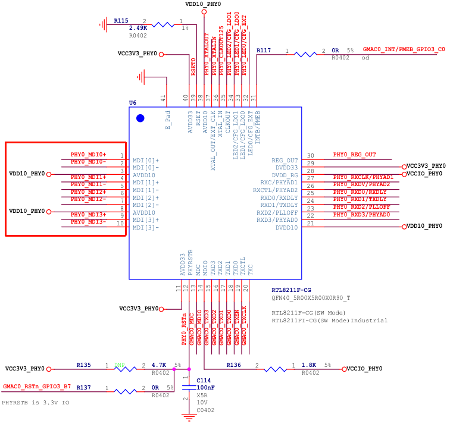

其中第 1 到 10 脚是分别对应 MDI 接口的 MDIP0，MDIN0，MDIP1，MDIN1，MDIP2，MDIN2，MDIP3，MDIN3 引脚。

MDI 接口是用于 PHY 芯片与网络变压器或者说是与 RJ45 插座相连的接口。

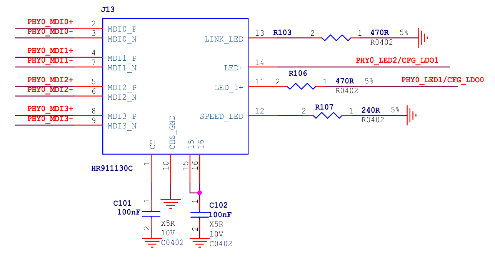

# PHY 寄存器

在 802.3 规范中，对 PHY 芯片的前 16 个寄存器进行了规定。如下图所示：


在开发中和我们打交道最多是寄存器 0，寄存器 1。

**寄存器 0 是控制寄存器**：用于配置 PHY 芯片的工作模式和参数。可以通过控制寄存器设置芯片的传输速率（10Mbps、100Mbps 或 1000Mbps）、双工模式（全双工或半双工）以及自动协商功能的开启或关闭等。

**寄存器 1 是状态寄存器**：用于表示 PHY 芯片当前的工作状态。比如，通过状态寄存器可以查看是否已经成功连接到网络、是否检测到链路故障、当前的传输速率和双工模式等信息等。

**寄存器 16 到 31 是扩展寄存器**：寄存器 0 到 15 是 IEEE 802.3 规定的寄存器，不论使用哪个厂家的 PHY 芯片，寄存器 0 到 15 是一摸一样的，所以一般情况下，使用 Linux 中通用的 PHY 驱动即可驱动 PHY 芯片。但是不同厂家的 PHY 芯片可能有额外特性的功能，所以扩展寄存器就是给 PHY 厂家自由发挥的寄存器。也就是说只有用到这些特性功能时，才会涉及到扩展寄存器。


## PHY 地址

每个 PHY 寄存器都有唯一的地址，通过这些地址，我们可以准确的访问和操作相应的寄存器。iTOP-RK3568 开发板中 RTL8211 PHY 芯片的地址可以通过 22，27，26 脚来设置。

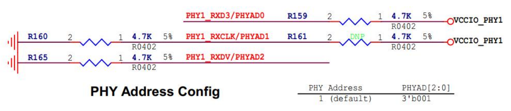

**物理地址（MAC 地址）**

物理地址，也称为 MAC 地址，是网络设备的唯一标识符。它由 48 位二进制数组成，通常用 12 位十六进制数表示，如 00:11:22:33:44:55。

**IP 地址**

IP 地址是网络层的地址，用于在网络中标识设备的逻辑位置。它分为 IPv4 和 IPv6 两种版本：

- IPv4 地址由 32 位二进制数组成，通常用点分十进制表示，如 192.168.1.1；
- IPv6 地址由 128 位二进制数组成。IP 地址的主要作用是实现不同网络之间的通信，通过 IP 地址可以将数据包从源网络路由到目标网络。

**PHY 地址**

PHY 地址是用于在一个网络中唯一标识 PHY 芯片的地址。在一个系统中，可能会有多个 PHY 芯片同时存在，通过 PHY 地址可以区分不同的 PHY 芯片，以便对它们进行单独的配置和管理。


## PHY 芯片地址的确定

以迅为 iTOP-RK3568 开发板为例，其采用的 RTL8211 PHY 芯片地址通过以下方式进行确定。

打开 RTL8211 PHY 芯片的数据手册，如下图所示，22 26 27 引脚是配置 PHY 芯片的地址。

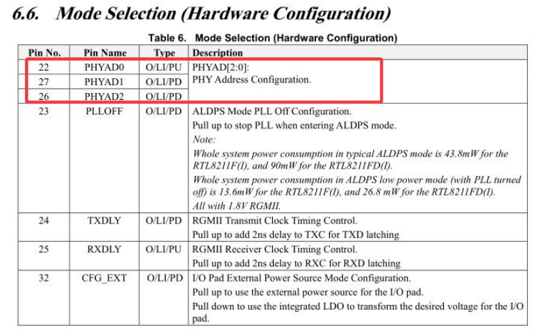


又RK3568 底板原理图上 PHY 芯片这三个引脚是连接的如下：


由上图可知，PHY 芯片的地址是 001，也就是 1。PHY 芯片通过硬件引脚来设置地址


## 操作 PHY 寄存器

首先，打开 iTOP-RK3568 开发板的调试串口，接着为开发板上电。待进入终端后，通过执行命令`cd /sys/bus/mdio_bus/devices`，进入开发板的`mdio_bus`总线设备目录。

随后，再执行命令`cd stmmac-0:00/`，即可进入网卡 0 的设备，具体操作过程如下所示：

```bash
cd /sys/bus/mdio_bus/devices

cd stmmac-0:00/
# 查看各个寄存器的值
cat phy_registers
# 对 0 号寄存器的值进行修改，设置为0x40
echo 0x00 0x40 > phy_registers
```


# 网络应用编程基础

## 字节序

小端模式：低位字节存在低地址，高位字节存在高地址。

大端模式：高位字节存在低地址，低位字节存在高地址。


## 字节序转换函数

常见的字节序转换函数有四个，分别为 htonl、htons、ntohl、ntohs，每个函数的简要介绍如下表所示：

> 它们的核心作用是解决不同主机与网络之间的字节序不兼容问题。

| 函数名称 |              功能描述              |  数据类型  |  转换方向   |
| :------: | :--------------------------------: | :--------: | :---------: |
| `htonl`  | 将 32 位主机字节序转换为网络字节序 | `uint32_t` | 主机 → 网络 |
| `htons`  | 将 16 位主机字节序转换为网络字节序 | `uint16_t` | 主机 → 网络 |
| `ntohl`  | 将 32 位网络字节序转换为主机字节序 | `uint32_t` | 网络 → 主机 |
| `ntohs`  | 将 16 位网络字节序转换为主机字节序 | `uint16_t` | 网络 → 主机 |

`uint32_t htonl(uint32_t hostlong)`

- 功能：用于将本地存储的 32 位整数转换为适合在网络上传输的格式（大端模式）。
- 参数：32 位主机字节序整数。
- 返回值：返回一个 32 位网络字节序整数。

`uint16_t htons(uint16_t hostshort)`

- 功能：用于将本地存储的 16 位整数（如端口号）转换为适合在网络上传输的格式。
- 参数：16 位主机字节序整数。
- 返回值：返回一个 16 位网络字节序整数。

`uint32_t ntohl(uint32_t netlong)`

- 功能：用于将从网络接收到的 32 位数据（如 IPv4 地址）转换为本地系统可以处理的格式。
- 参数：32 位网络字节序整数。
- 返回值：返回一个 32 位主机字节序整数。

`uint16_t ntohs(uint16_t netshort)`

- 功能：用于将从网络接收到的 16 位数据（如端口号）转换为本地系统可以处理的格式。
- 参数：16 位网络字节序整数。
- 返回值：返回一个 16 位主机字节序整数。


例如在编写 TCP 和 UDP 代码的时候，需要用到端口号，例如 8080，这时候就要用到字节序的转换了，需要通过 htons 将 8080 从主机字节序转换为网络字节序，一个简单的示例程序如下所示：

```c
#include <stdio.h>
#include <arpa/inet.h>
int main(void)
{
	uint16_t host_port = 8080; // 主机端口号
	uint16_t net_port = htons(host_port); // 转换为网络字节序
	printf("Host Port: 0x%04X\n", host_port);
	printf("Network Port: 0x%04X\n", net_port);
	return 0;
}
```


## 地址转换函数

> 除了字节序需要转换之外 IP 地址也需要转换，IP 地址通常是以点分十进制（如 192.168.1.1）这一人类可读的形式下展示的，而在程序内部则需要以二进制形式进行存储和处理。

在网络编程中，IP 地址转换函数有两个，分别是 `inet_pton` 和 `inet_ntop`，它们支持 IPv4 和IPv6 地址的转换，两个函数的简单介绍如下所示：

这张表格展示了网络编程中用于 IP 地址格式转换的两个核心函数，它们同时支持 IPv4 和 IPv6 地址的转换。

|  函数名称   |                           功能描述                           |    转换方向     |
| :---------: | :----------------------------------------------------------: | :-------------: |
| `inet_pton` | 将点分十进制（IPv4）或冒号十六进制（IPv6）的字符串格式 IP 地址，转换为网络字节序的二进制数据 | 字符串 → 二进制 |
| `inet_ntop` | 将网络字节序的二进制 IP 地址，转换为点分十进制（IPv4）或冒号十六进制（IPv6）的字符串格式 | 二进制 → 字符串 |


### inet_pton()

- 将字符串地址转换为二进制数据
- 将点分十进制（IPv4）或冒号十六进制（IPv6）的 IP 地址字符串转换为网络字节序的二进制数据。

`inet_pton` 函数原型如下所示，成功时返回 1，如果 src 格式无效，返回 0，如果 af 不支持，返回-1。

```c
int inet_pton(int af, const char *src, void *dst);
```

具体的参数介绍如下所示：

| 参数名称 |                  描述                  |        数据类型 / 值范围        |      示例值       |
| :------: | :------------------------------------: | :-----------------------------: | :---------------: |
|   `af`   | 指定地址族，用于区分 IPv4 或 IPv6 地址 | `AF_INET`：IPv4`AF_INET6`：IPv6 | `AF_INET`（IPv4） |
|  `src`   |    指向要转换的 IP 地址字符串的指针    |             字符串              |  `"192.168.1.1"`  |
|  `dst`   |    指向存储转换后二进制数据的缓冲区    |           二进制数据            | `struct in_addr`  |

示例：

```c
#include <stdio.h>
#include <arpa/inet.h>
int main()
{
	const char *ipv4 = "192.168.1.1";
	struct in_addr addr;
	if (inet_pton(AF_INET, ipv4, &addr) <= 0)
	{
		printf("Invalid IPv4 address\n");
	}
	else
	{
		printf("Network byte order: 0x%x\n", addr.s_addr);
	}
	return 0;
}
```


### inet_ntop()

- 将二进制数据转换为字符串地址
- `inet_ntop` 函数用于将网络字节序的二进制 IP 地址转换为人类可读的字符串形式（点分十进制或冒号十六进制）。

`inet_ntop` 的函数原型如下所示，运行成功时返回指向 dst 的指针，失败时返回 NULL 并设置 errno。

```c
const char *inet_ntop(int af, const void *src, char *dst, socklen_t size);
```

参数如下：

| 参数名称 |                    描述                    |        数据类型 / 值范围        |                 示例值                  |
| :------: | :----------------------------------------: | :-----------------------------: | :-------------------------------------: |
|   `af`   |   指定地址族，用于区分 IPv4 或 IPv6 地址   | `AF_INET`：IPv4`AF_INET6`：IPv6 |            `AF_INET`（IPv4）            |
|  `src`   |       指向存储二进制 IP 地址的缓冲区       |           二进制数据            |            `struct in_addr`             |
|  `dst`   |  指向存储转换后字符串形式 IP 地址的缓冲区  |             字符串              |       `char ip[INET_ADDRSTRLEN]`        |
|  `size`  | `dst` 缓冲区的大小，确保足够容纳结果字符串 |           `socklen_t`           | `INET_ADDRSTRLEN` 或 `INET6_ADDRSTRLEN` |

示例代码：

```c
#include <stdio.h>
#include <arpa/inet.h>
int main()
{
	struct in_addr addr;
	addr.s_addr = 0xC0A80101; // 网络字节序的 192.168.1.1
	char ip[INET_ADDRSTRLEN];
	if (inet_ntop(AF_INET, &addr, ip, sizeof(ip)) == NULL)
	{
		printf("inet_ntop");
	} else
	{
		printf("Dotted decimal: %s\n", ip);
	}
	return 0;
}
```

## UDP

UDP 的英文全称为 **User Datagram Protocol**，意为用户数据报协议，它是一种**无连接**的传输层协议，属于 TCP/IP 协议栈的一部分。它提供了一种简单、轻量的数据传输方式，适用于对速度要求高但对可靠性要求较低的场景，例如如视频会议、在线游戏、语音通话等，这些场景对延迟敏感且能容忍偶尔的丢包。


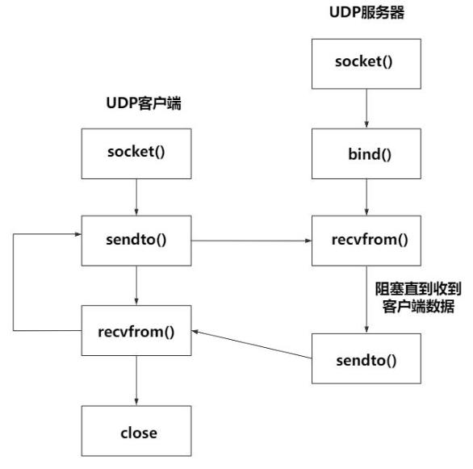

### UDP 函数

|    函数名    |                           功能描述                           |                           使用场景                           |
| :----------: | :----------------------------------------------------------: | :----------------------------------------------------------: |
|  `socket()`  |        创建一个套接字（socket），作为网络通信的端点。        | 服务器和客户端都需要调用此函数，创建一个用于后续通信的句柄。 |
|   `bind()`   | 将套接字绑定到指定的 IP 地址和端口号，使系统能将发送到该地址的数据交付给此套接字。 | 服务器必须调用，以绑定一个固定的监听端口，让客户端能找到它；客户端通常不需要显式调用。 |
|  `sendto()`  | 向指定的目标 IP 地址和端口发送数据报，是 UDP 协议的核心发送接口。 |   客户端用它向服务器发送请求；服务器用它向客户端发送响应。   |
| `recvfrom()` |     从网络接收数据报，并获取发送方的 IP 地址和端口信息。     |   服务器用它接收客户端的请求；客户端用它接收服务器的响应。   |

#### sendto()

`sendto()` 是一个用于发送数据的系统调用，主要用于无连接的 UDP 协议。它允许程序将数据发送到指定的目标地址（即目标 IP 和端口）。与 `send()`不同，`sendto()`需要显式指定目标地址，因此非常适合无连接的通信。它的函数原型如下所示:

```c
ssize_t sendto(int sockfd, const void *buf, size_t len, int flags, const struct sockaddr *dest_addr, socklen_t addrlen);
```

参数：

|   参数名    |        类型         |                             描述                             |
| :---------: | :-----------------: | :----------------------------------------------------------: |
|  `sockfd`   |        `int`        | 套接字文件描述符，由 `socket()` 函数创建，是后续所有网络操作的句柄。 |
|    `buf`    |   `const void *`    | 指向要发送的数据缓冲区的指针，它是 `const` 类型，表示函数不会修改该缓冲区的内容。 |
|    `len`    |      `size_t`       | 数据缓冲区的长度，以字节为单位，告诉函数需要发送多少字节的数据。 |
|   `flags`   |        `int`        | 发送标志，通常设为 `0`。可以设置特殊标志（如 `MSG_DONTROUTE` 表示不查路由表，`MSG_CONFIRM` 用于链路层确认），但在常规 UDP 通信中很少使用。 |
| `dest_addr` | `struct sockaddr *` | 指向目标地址结构体的指针，通常是 `struct sockaddr_in`（IPv4）或 `struct sockaddr_in6`（IPv6），包含了目标 IP 和端口信息。 |
|  `addrlen`  |     `socklen_t`     | 目标地址结构体的大小，以字节为单位，用于告诉函数 `dest_addr` 指向的结构体有多大。 |

成功会返回实际发送的字节数


#### recvfrom()

`recvfrom()`是一个用于接收数据的系统调用，主要用于无连接的 UDP 协议。它允许程序从指定的源地址（即发送方的 IP 和端口）接收数据包。与 `recv()`不同，`recvfrom()`可以获取发送方的地址信息，因此非常适合无连接的通信。它的函数原型如下所示：

```c
ssize_t recvfrom(int sockfd, void *buf, size_t len, int flags, struct sockaddr *src_addr, socklen_t *addrlen);
```

该函数的各个参数介绍如下所示：

|   参数名   |        类型         |                             描述                             |
| :--------: | :-----------------: | :----------------------------------------------------------: |
|  `sockfd`  |        `int`        | 套接字文件描述符，由 `socket()` 函数创建，是网络操作的句柄。 |
|   `buf`    |      `void *`       | 指向存储接收数据的缓冲区的指针，函数会将收到的数据写入此缓冲区。 |
|   `len`    |      `size_t`       | 缓冲区的最大长度（字节）。若接收的数据超过此长度，多余部分会被截断。 |
|  `flags`   |        `int`        | 接收标志，通常设为 `0`。可设置特殊标志（如 `MSG_PEEK` 仅查看数据不取出、`MSG_DONTWAIT` 非阻塞接收），常规 UDP 通信中较少使用。 |
| `src_addr` | `struct sockaddr *` | 指向存储发送方地址结构体的指针，通常为 `struct sockaddr_in`（IPv4）或 `struct sockaddr_in6`（IPv6），用于获取发送方的 IP 和端口。 |
| `addrlen`  |    `socklen_t *`    | 指向发送方地址结构体大小的指针。调用前需初始化为结构体的预期大小，调用后会更新为实际的地址长度。 |

成功之后会返回实际接收到的字节数

### 示例

`udp_client.c`

```c
#include <stdio.h>
#include <stdlib.h>
#include <sys/types.h>
#include <sys/socket.h>
#include <string.h>
#include <arpa/inet.h>

int main(int argc, char *argv[]) {
    // 定义变量port用于存储端口号
    int port;
    // 定义变量fd用于存储套接字描述符
    int fd;
    // 定义字符数组buf作为发送数据的缓冲区
    char buf[1024];

    // 检查命令行参数个数是否为3
    if (argc != 3) {
        // 如果参数个数不正确，输出使用示例提示信息
        printf("for example: ./app ip port\n");
        // 返回 -1 表示程序异常结束
        return -1;
    }

    // 将命令行参数中的端口号字符串转换为整数
    port = atoi(argv[2]);

    // 创建一个UDP套接字
    // AF_INET 表示使用IPv4协议
    // SOCK_DGRAM 表示这是一个UDP套接字
    // 0 表示使用默认协议
    fd = socket(AF_INET, SOCK_DGRAM, 0);
    // 检查套接字是否创建成功
    if (fd == -1) {
        // 如果创建失败，输出错误信息
        printf("socket fd error\n");
        // 返回 -1 表示程序异常结束
        return -1;
    }

    // 初始化一个sockaddr_in结构体，用于存储目标服务器地址信息
    struct sockaddr_in addr = {0};
    // 设置地址族为IPv4
    addr.sin_family = AF_INET;
    // 将端口号从主机字节序转换为网络字节序并赋值给addr.sin_port
    addr.sin_port = htons(port);
    // 将命令行参数中的IP地址字符串转换为网络字节序的IP地址并赋值给addr.sin_addr.s_addr
    // 这里也可以使用inet_pton(AF_INET, argv[1], &addr.sin_addr); ，但当前代码使用的inet_addr也是可行的
    addr.sin_addr.s_addr = inet_addr(argv[1]);

    // 将缓冲区buf清零，为后续接收数据做准备
    memset(buf, 0, sizeof(buf));
    // 进入无限循环，实现持续向服务器发送数据
    while (1) {
        // 从标准输入读取字符串到buf缓冲区
        scanf("%s", buf);
        // 通过UDP套接字向服务器发送buf中的数据
        // fd为套接字描述符
        // buf为要发送的数据
        // strlen(buf)为数据长度
        // 0表示默认的发送标志
        // (struct sockaddr*)&addr为服务器地址
        // sizeof(addr)为服务器地址结构体的大小
        sendto(fd, buf, strlen(buf), 0, (struct sockaddr*)&addr, sizeof(addr));
        // 将buf缓冲区清零，为下一次接收数据做准备
        memset(buf, 0, sizeof(buf));
    }

    return 0;
}
```

`udp_server.c`

```c
#include <stdio.h>
#include <stdlib.h>
#include <sys/types.h>
#include <sys/socket.h>
#include <string.h>
#include <arpa/inet.h>

int main(int argc, char *argv[]) {
    // 定义变量port用于存储端口号
    int port;
    // 定义变量fd用于存储套接字描述符
    int fd;
    // 定义字符数组buf作为接收数据的缓冲区
    char buf[1024];
    // 定义变量ret用于存储函数返回值
    int ret;
    // 定义变量len用于存储地址结构体的长度
    int len;

    // 检查命令行参数个数是否为3
    if (argc != 3) {
        // 如果参数个数不正确，输出使用示例提示
        printf("for example: ./app ip port\n");
        // 返回 -1 表示程序异常结束
        return -1;
    }

    // 将命令行参数中的端口号字符串转换为整数
    port = atoi(argv[2]);

    // 创建一个UDP套接字
    // AF_INET表示使用IPv4协议
    // SOCK_DGRAM表示这是一个UDP套接字
    // 0表示使用默认协议
    fd = socket(AF_INET, SOCK_DGRAM, 0);
    // 检查套接字是否创建成功
    if (fd == -1) {
        // 如果创建失败，输出错误信息
        printf("socket fd error\n");
        // 返回 -1 表示程序异常结束
        return -1;
    }

    // 初始化本地地址结构体local_addr
    struct sockaddr_in local_addr = {0};
    // 初始化源地址结构体src_addr
    struct sockaddr_in src_addr = {0};
    // 设置本地地址的地址族为IPv4
    local_addr.sin_family = AF_INET;
    // 将端口号从主机字节序转换为网络字节序并赋值给local_addr.sin_port
    local_addr.sin_port = htons(port);
    // 将命令行参数中的IP地址字符串转换为网络字节序的IP地址并赋值给local_addr.sin_addr.s_addr
    local_addr.sin_addr.s_addr = inet_addr(argv[1]);

    // 将套接字fd绑定到local_addr
    ret = bind(fd, (struct sockaddr *)&local_addr, sizeof(local_addr));
    // 检查绑定是否成功
    if (ret == -1) {
        // 如果绑定失败，输出错误信息
        printf("bind error\n");
        // 返回 -1 表示程序异常结束
        return -1;
    }

    // 设置src_addr结构体的长度
    len = sizeof(src_addr);
    // 将缓冲区buf清零，为接收数据做准备
    memset(buf, 0, sizeof(buf));

    // 进入无限循环，持续接收数据
    while (1) {
        // 从UDP套接字fd接收数据
        // buf是接收数据的缓冲区
        // sizeof(buf)是缓冲区大小
        // 0是接收标志
        // (struct sockaddr *)&src_addr是源地址结构体指针
        // &len用于返回源地址结构体的实际长度
        recvfrom(fd, buf, sizeof(buf), 0, (struct sockaddr *)&src_addr, &len);
        // 将源地址的IP地址转换为点分十进制格式并输出
        // inet_ntoa函数将网络字节序的IP地址转换为点分十进制字符串
        // ntohs函数将网络字节序的端口号转换为主机字节序
        printf("ip:%s port:%d\n", inet_ntoa(src_addr.sin_addr), ntohs(src_addr.sin_port));
        // 输出接收到的数据
        printf("buf is %s\n", buf);
        // 将缓冲区buf清零，为下一次接收做准备
        memset(buf, 0, sizeof(buf));
    }

    return 0;
}
```

## TCP

TCP 的英文全称为 **Transmission Control Protocol**，意为传输控制协议，它是一种**面向连接**的传输层协议，与 UDP 一样，都属于TCP/IP 协议栈的核心部分。

TCP 通过建立可靠的端到端连接，确保数据在传输过程中的完整性、顺序性和无丢失性。它使用三次握手建立连接，并通过确认机制、重传机制以及流量控制等功能来保障数据传输的可靠性。

因此，TCP 适用于对数据准确性要求较高的场景，例如文件传输、电子邮件、网页浏览等，这些场景中数据的完整性和顺序性至关重要，而对延迟的容忍度相对较高。


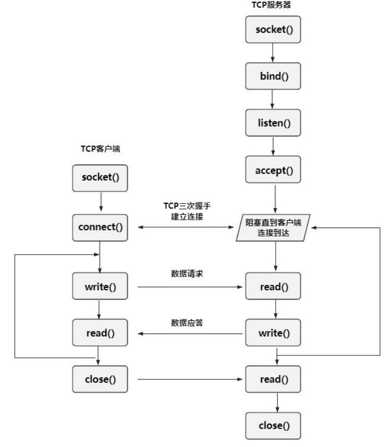

- TCP 客户端与 UDP 客户端相比，中间多了调用 connect 发起连接请求的这一步骤
- TCP服务器端与 UDP 服务器端相比，中间多了调用 listen 启动监听模式以及调用 accept 阻塞并等待客户端的请求这两个步骤
  - listen 会将套接字设置为被动模式以等待客户端的连接请求
  - 当客户端发起连接时，accept 会阻塞并等待，直到接收到请求后返回一个新的套接字文件描述符，该描述符专门用于与该客户端进行通信。

当客户端通过 connect 发起连接请求后，会与服务器进行 TCP 三次握手建立连接，连接建立后，客户端和服务器可以通过 write()和 read()进行数据的发送和接收。

数据传输完成后，客户端和服务器分别通过 close()关闭连接。


### TCP 函数

#### connect()

connect()是一个用于建立连接的系统调用，主要用于客户端。它通过指定服务器的地址（IP 地址和端口号），向服务器发起连接请求。对于 TCP 协议，connect()会触发 TCP 的三次握手过程；需要注意的是对于 UDP 协议，connect 同样可以使用，但是并不会真正建立连接，而是将目标地址绑定到套接字上，以便后续的通信过程。 它的函数原型如下所示：

```c
int connect(int sockfd, const struct sockaddr *addr, socklen_t addrlen);
```

成功返回 0，失败则返回-1

|  参数名   |        类型         |                             描述                             |
| :-------: | :-----------------: | :----------------------------------------------------------: |
| `sockfd`  |        `int`        | 套接字文件描述符，由 `socket()` 函数创建，是后续所有网络操作的句柄。 |
|  `addr`   | `struct sockaddr *` | 指向目标地址结构体的指针，通常是 `struct sockaddr_in`（IPv4）或 `struct sockaddr_in6`（IPv6），包含了要绑定的 IP 地址和端口号。 |
| `addrlen` |     `socklen_t`     | 目标地址结构体的大小，以字节为单位，例如 `sizeof(struct sockaddr_in)`。 |


#### listen()

`listen()` 是一个用于将套接字设置为监听模式的系统调用，主要用于 TCP 服务器。它将套接字从主动模式（用于发起连接）转换为被动模式（用于接收连接请求）。调用 `listen()` 后，套接字会开始监听来自客户端的连接请求，并维护一个等待队列以管理这些请求。它的函数原型如下所示

```c
int listen(int sockfd, int backlog);
```

函数长度

|  参数名   | 类型  |                             描述                             |
| :-------: | :---: | :----------------------------------------------------------: |
| `sockfd`  | `int` | 套接字文件描述符，由 `socket()` 创建并通过 `bind()` 绑定到特定地址和端口。 |
| `backlog` | `int` | 等待连接队列的最大长度，代表可以同时排队等待处理的 TCP 连接请求数量。 |

成功后返回 0，失败则返回-1，


#### accept()

`accept()` 是一个用于接收客户端连接请求的系统调用，主要用于 TCP 服务器。它从监听套接字的等待队列中取出一个连接请求，并创建一个新的套接字专门用于与该客户端通信。通过`accept()`，服务器能够处理多个客户端的连接请求。它的函数原型如下所示：

```c
int accept(int sockfd, struct sockaddr *addr, socklen_t *addrlen);
```

该函数的各个参数介绍如下所示:

|  参数名   |        类型         |                             描述                             |
| :-------: | :-----------------: | :----------------------------------------------------------: |
| `sockfd`  |        `int`        | 监听套接字文件描述符，由 `socket()` 创建并通过 `listen()` 设置为监听模式。 |
|  `addr`   | `struct sockaddr *` | 指向存储客户端地址结构体的指针（如 `struct sockaddr_in` 表示 IPv4 地址）。可以为 `NULL`，表示不需要获取客户端地址。 |
| `addrlen` |    `socklen_t *`    | 指向客户端地址结构体大小的指针。调用前需初始化为目标地址结构体的大小，调用后会更新为实际的地址长度。 |

成功后返回 0，失败则返回-1，

### 示例

`tcp_client.c`

```c
#include <stdio.h>
#include <stdlib.h>
#include <sys/types.h>
#include <sys/socket.h>
#include <string.h>
#include <arpa/inet.h>

int main(int argc, char *argv[]) {
    // 定义变量port，用于存储从命令行获取的端口号
    int port;
    // 定义变量fd，用于存储套接字描述符
    int fd;
    // 定义字符数组buf，作为数据缓冲区，用于存储从标准输入读取的数据以及接收的数据
    char buf[1024];
    // 定义变量ret，用于存储函数的返回值
    int ret;

    // 检查命令行参数个数是否为3
    if (argc != 3) {
        // 如果参数个数不正确，输出使用示例提示信息
        printf("for example: ./app ip port\n");
        // 返回 -1，表示程序异常结束
        return -1;
    }

    // 将命令行参数中的端口号字符串转换为整数
    port = atoi(argv[2]);

    // 创建一个TCP套接字
    // AF_INET 表示使用IPv4协议
    // SOCK_STREAM 表示这是一个面向连接的字节流套接字，适用于TCP协议
    // 0 表示使用默认协议
    fd = socket(AF_INET, SOCK_STREAM, 0);
    // 检查套接字是否创建成功
    if (fd == -1) {
        // 如果创建失败，输出错误信息
        printf("socket fd error\n");
        // 返回 -1，表示程序异常结束
        return -1;
    }

    // 初始化一个sockaddr_in结构体，用于存储服务器的地址信息
    struct sockaddr_in addr = {0};
    // 设置地址族为IPv4
    addr.sin_family = AF_INET;
    // 将端口号从主机字节序转换为网络字节序并赋值给addr.sin_port
    addr.sin_port = htons(port);
    // 将命令行参数中的IP地址字符串转换为网络字节序的IP地址并赋值给addr.sin_addr.s_addr
    // 这里也可以使用inet_pton(AF_INET, argv[1], &addr.sin_addr); ，但当前代码使用的inet_addr也是可行的
    addr.sin_addr.s_addr = inet_addr(argv[1]);

    // 使用connect函数连接到服务器
    // fd为套接字描述符
    // (struct sockaddr*)&addr为服务器地址结构体指针
    // sizeof(addr)为服务器地址结构体的大小
    ret = connect(fd, (struct sockaddr*)&addr, sizeof(addr));
    // 检查连接是否成功
    if (ret < 0) {
        // 如果连接失败，输出错误信息
        printf("connect error\n");
        // 返回 -1，表示程序异常结束
        return -1;
    }

    // 将缓冲区buf清零，为后续操作做准备
    memset(buf, 0, sizeof(buf));

    // 进入无限循环，实现持续向服务器发送数据
    while (1) {
        // 从标准输入读取字符串到buf缓冲区
        scanf("%s", buf);
        // 通过TCP套接字向服务器发送buf中的数据
        // 注意：这里使用sendto函数对于TCP套接字不太合适，通常TCP使用send函数
        // 正确的应该是send(fd, buf, strlen(buf), 0);
        // 但原代码使用sendto，这里按照原代码逻辑注释
        sendto(fd, buf, strlen(buf), 0, (struct sockaddr*)&addr, sizeof(addr));
        // 将buf缓冲区清零，为下一次接收数据做准备
        memset(buf, 0, sizeof(buf));
    }

    return 0;
}
```

`tcp_server.c`

```c
#include <stdio.h>
#include <stdlib.h>
#include <sys/types.h>
#include <sys/socket.h>
#include <string.h>
#include <arpa/inet.h>
#include <unistd.h>

int main(int argc, char *argv[]) {
    // 定义变量port，用于存储从命令行获取的端口号
    int port;
    // 定义变量fd，用于存储套接字描述符
    int fd;
    // 定义字符数组buf，作为接收数据的缓冲区
    char buf[1024];
    // 定义变量ret，用于存储函数的返回值
    int ret;
    // 定义变量len，用于存储地址结构体的长度
    int len;
    // 定义变量acc_fd，用于存储接受连接后的新套接字描述符
    int acc_fd;

    // 检查命令行参数个数是否为3
    if (argc != 3) {
        // 如果参数个数不正确，输出使用示例提示信息
        printf("for example: ./app ip port\n");
        // 返回 -1，表示程序异常结束
        return -1;
    }

    // 将命令行参数中的端口号字符串转换为整数
    port = atoi(argv[2]);

    // 创建一个TCP套接字
    // AF_INET 表示使用IPv4协议
    // SOCK_STREAM 表示这是一个面向连接的字节流套接字，适用于TCP协议
    // 0 表示使用默认协议
    fd = socket(AF_INET, SOCK_STREAM, 0);
    // 检查套接字是否创建成功
    if (fd == -1) {
        // 如果创建失败，输出错误信息
        printf("socket fd error\n");
        // 返回 -1，表示程序异常结束
        return -1;
    }

    // 初始化一个sockaddr_in结构体，用于存储本地地址信息
    struct sockaddr_in local_addr = {0};
    // 设置地址族为IPv4
    local_addr.sin_family = AF_INET;
    // 将端口号从主机字节序转换为网络字节序并赋值给local_addr.sin_port
    local_addr.sin_port = htons(port);
    // 将命令行参数中的IP地址字符串转换为网络字节序的IP地址并赋值给local_addr.sin_addr.s_addr
    // 这里也可以使用inet_pton(AF_INET, argv[1], &local_addr.sin_addr); ，但当前代码使用的inet_addr也是可行的
    local_addr.sin_addr.s_addr = inet_addr(argv[1]);

    // 将套接字fd绑定到local_addr
    ret = bind(fd, (struct sockaddr*)&local_addr, sizeof(local_addr));
    // 检查绑定是否成功
    if (ret == -1) {
        // 如果绑定失败，输出错误信息
        printf("bind error\n");
        // 返回 -1，表示程序异常结束
        return -1;
    }

    // 设置套接字为监听状态，等待客户端连接
    // 第二个参数10表示等待连接队列的最大长度
    listen(fd, 10);

    // 初始化一个sockaddr_in结构体，用于存储客户端地址信息
    struct sockaddr_in src_addr = {0};
    // 定义变量src_len，用于存储客户端地址结构体的长度
    socklen_t src_len = sizeof(src_addr);
    // 接受客户端的连接请求，返回一个新的套接字描述符acc_fd用于与客户端通信
    acc_fd = accept(fd, (struct sockaddr*)&src_addr, &src_len);
    // 检查接受连接是否成功
    if (acc_fd < 0) {
        // 如果接受连接失败，输出错误信息
        printf("accept error\n");
        // 返回 -1，表示程序异常结束
        return -1;
    }

    // 将缓冲区buf清零，为后续接收数据做准备
    memset(buf, 0, sizeof(buf));

    // 进入无限循环，持续接收客户端发送的数据
    while (1) {
        // 从新套接字acc_fd接收数据到buf缓冲区
        int byte = recvfrom(acc_fd, buf, sizeof(buf), 0, (struct sockaddr*)&src_addr, &len);
        // 检查接收数据的字节数
        if (byte > 0) {
            // 如果接收到的数据字节数大于0，打印客户端的IP地址、端口号以及接收到的数据
            printf("ip:%s port:%d\n", inet_ntoa(src_addr.sin_addr), ntohs(src_addr.sin_port));
            printf("buf is %s\n", buf);
        }
        // 如果接收到的数据字节数为0，表示客户端关闭了连接
        else if (byte == 0) {
            printf("close\n");
            // 跳出循环，结束数据接收
            break;
        }
        // 如果接收数据时发生错误
        else {
            printf("recvfrom error\n");
            // 返回 -1，表示程序异常结束
            return -1;
        }
        // 将buf缓冲区清零，为下一次接收数据做准备
        memset(buf, 0, sizeof(buf));
    }

    // 关闭与客户端通信的套接字acc_fd
    close(acc_fd);
    // 关闭监听套接字fd
    close(fd);

    // 返回0，表示程序正常结束
    return 0;
}
```

# 最小网络设备驱动

可借助 Linux 源码中现有的驱动作为模板，该驱动路径为 `drivers/net/loopback.c`。先将这个文件备份为 `loopback.c.bak`，随后新建一个 `loopback.c` 文件，在其中编写我们的最小网络设备驱动。

驱动程序内容如下所示, 代码实现了一个简单的回环网络设备驱动程序

```c
#include <linux/kernel.h>
// 包含与内核相关的基础定义和函数，如内核数据类型、内核打印函数等
#include <linux/jiffies.h>
// 提供与系统时间相关的jiffies变量和函数，jiffies记录系统启动以来的时钟滴答数
#include <linux/module.h>
// 用于构建可加载内核模块的相关定义和宏
#include <linux/interrupt.h>
// 包含与中断处理相关的函数和数据结构
#include <linux/fs.h>
// 文件系统相关的定义和函数，例如inode、file_operations等结构体的定义
#include <linux/types.h>
// 定义了各种内核数据类型，如 kuid_t、kgid_t等
#include <linux/string.h>
// 提供字符串处理函数，如strcpy、strlen等
#include <linux/socket.h>
// 包含套接字相关的定义和函数，用于网络编程
#include <linux/errno.h>
// 定义了各种错误码，用于错误处理
#include <linux/fcntl.h>
// 包含文件控制相关的定义，如文件打开标志（O_RDONLY、O_WRONLY等）
#include <linux/in.h>
// 定义了与Internet地址相关的数据结构和常量，如sockaddr_in等

#include <linux/uaccess.h>
// 提供用户空间和内核空间数据交互的函数，如copy_from_user、copy_to_user等
#include <linux/io.h>
// 用于执行I/O操作，如ioread、iowrite等函数

#include <linux/inet.h>
// 包含与Internet协议相关的函数和数据结构，如IP地址处理等
#include <linux/netdevice.h>
// 定义了网络设备相关的结构体和函数，是网络设备驱动开发的核心头文件
#include <linux/etherdevice.h>
// 提供以太网设备相关的辅助函数，如以太网地址操作等
#include <linux/skbuff.h>
// 包含套接字缓冲区（sk_buff）相关的定义和函数，用于网络数据的处理和传输
#include <linux/ethtool.h>
// 用于操作网络设备的ethtool功能，如获取和设置网络设备的各种参数
#include <net/sock.h>
// 定义了套接字相关的数据结构和函数，是网络编程中套接字操作的基础
#include <net/checksum.h>
// 提供计算校验和的函数，用于网络数据的校验
#include <linux/if_ether.h>	// For the statistics structure.
// 包含以太网相关的定义，如以太网帧格式、统计信息结构体等
#include <linux/if_arp.h>	// For ARPHRD_ETHER
// 包含地址解析协议（ARP）相关的定义，如ARP硬件类型
#include <linux/ip.h>
// 定义了IP协议相关的数据结构，如iphdr结构体用于表示IP头部
#include <linux/tcp.h>
// 包含TCP协议相关的数据结构和定义，如tcphdr结构体用于表示TCP头部
#include <linux/percpu.h>
// 提供了与每个CPU变量相关的功能，允许为每个CPU分配独立的数据
#include <linux/net_tstamp.h>
// 与网络时间戳相关的定义和函数，用于记录网络数据包的时间信息
#include <net/net_namespace.h>
// 包含网络命名空间相关的定义和函数，用于实现网络资源的隔离
#include <linux/u64_stats_sync.h>
// 提供了用于同步64位统计数据的机制

// 定义一个全局变量，指向网络设备结构体，用于表示回环网络设备
struct net_device *virnet_netdevice;
// 定义一个全局变量，用于记录传输的字节数
unsigned long bytes = 0;
// 定义一个全局变量，用于记录传输的数据包数
unsigned long packets = 0;

// 定义网络设备的发送函数，负责处理网络设备的数据发送
netdev_tx_t loopback_netdevice_xmit(struct sk_buff *skb, struct net_device *dev) {
    // 停止网络设备的发送队列，防止新的数据被发送
    netif_stop_queue(dev);
    // 更新发送的字节数，增加当前skb的长度
    bytes += skb->len;
    // 更新发送的数据包数，增加1
    packets++;
    // 根据设备类型设置skb的协议类型
    skb->protocol = eth_type_trans(skb, dev);
    // 将接收到的skb传递给网络设备的接收函数处理
    if (netif_rx(skb) == NET_RX_SUCCESS) {
        // 如果接收成功，打印成功信息
        printk("NET_RX_SUCCESS\n");
    }
    // 唤醒网络设备的发送队列，允许继续发送数据
    netif_wake_queue(dev);
    // 返回发送成功的标志
    return NETDEV_TX_OK;
}

// 定义获取网络设备统计信息的函数
void loopback_get_stats64(struct net_device *dev, struct rtnl_link_stats64 *stats) {
    // 设置发送的字节数统计信息
    stats->tx_bytes = bytes;
    // 设置接收的字节数统计信息，这里回环设备发送和接收字节数相同
    stats->rx_bytes = bytes;
    // 设置发送的数据包数统计信息
    stats->tx_packets = packets;
    // 设置接收的数据包数统计信息，这里回环设备发送和接收数据包数相同
    stats->rx_packets = packets;
}

// 定义网络设备操作集结构体，包含网络设备的各种操作函数指针
struct net_device_ops loopback_ops = {
   .ndo_start_xmit = loopback_netdevice_xmit,
    // 指向数据发送函数
   .ndo_get_stats64 = loopback_get_stats64,
    // 指向获取统计信息函数
};

// 定义网络设备头部操作集结构体，包含创建网络头部的函数指针
struct header_ops loopback_header_ops = {
   .create = eth_header,
    // 指向创建以太网头部的函数
};

// 定义网络设备的设置函数，用于初始化网络设备的属性
void loopback_setup(struct net_device *dev) {
    // 设置网络设备的最大传输单元（MTU）为64KB
    dev->mtu = 64 * 1024;
    // 设置网络设备的类型为回环设备
    dev->type = ARPHRD_LOOPBACK;
    // 设置网络设备的标志，添加回环设备标志
    dev->flags |= IFF_LOOPBACK;
    // 清除一些特定的私有标志
    dev->priv_flags &= ~(IFF_XMIT_DST_RELEASE | IFF_XMIT_DST_RELEASE_PERM);
    // 设置网络设备的特性，添加回环特性
    dev->features = NETIF_F_LOOPBACK;
    // 设置网络设备的头部操作集
    dev->header_ops = &loopback_header_ops;
    // 设置网络设备的操作集
    dev->netdev_ops = &loopback_ops;
}

// 定义网络设备初始化函数，在网络命名空间初始化时被调用
int loopback_net_init(struct net *net) {
    int ret;
    // 分配一个网络设备结构体，指定设备名称格式和初始化函数
    virnet_netdevice = alloc_netdev(0, "loopback%d", NET_NAME_UNKNOWN, loopback_setup);
    // 将分配的网络设备设置为网络命名空间的回环设备
    net->loopback_dev = virnet_netdevice;
    // 注册网络设备
    ret = register_netdev(virnet_netdevice);
    // 如果注册失败
    if (ret < 0) {
        // 打印注册错误信息
        printk("register_netdev error\n");
        // 释放分配的网络设备结构体
        free_netdev(virnet_netdevice);
        // 返回错误码
        return ret;
    }
    // 初始化成功，返回0
    return 0;
}

// 定义网络设备退出函数，在网络命名空间退出时被调用
void loopback_net_exit(struct net *net) {
    // 获取网络命名空间中的回环设备
    struct net_device *dev = net->loopback_dev;
    // 注销网络设备
    unregister_netdev(dev);
    // 释放分配的网络设备结构体
    free_netdev(virnet_netdevice);
}

// 定义网络命名空间操作结构体，包含网络命名空间初始化和退出函数指针
struct pernet_operations loopback_net_ops = {
   .init = loopback_net_init,
    // 指向网络命名空间初始化函数
   .exit = loopback_net_exit,
    // 指向网络命名空间退出函数
};
```

# 移植 RTL8723DU(wifi)驱动

将厂家提供的代码解压后，解压后修改Makefile

```makefile
CONFIG_MULTIDRV = n
CONFIG_RTL8188E = n
CONFIG_RTL8812A = n
CONFIG_RTL8821A = n
CONFIG_RTL8192E = n
CONFIG_RTL8723B = n
CONFIG_RTL8814A = n
CONFIG_RTL8723C = n
CONFIG_RTL8188F = n
CONFIG_RTL8188GTV = n
CONFIG_RTL8822B = n
CONFIG_RTL8723D = y //因为适配的模块是 RTL8723du，所以此选项为 y
CONFIG_RTL8821C = n
CONFIG_RTL8710B = n
CONFIG_RTL8192F = n
CONFIG_RTL8822C = n
CONFIG_RTL8814B = n
CONFIG_RTL8723F = n
######################### Interface ###########################
CONFIG_USB_HCI = y//模块为 usb 接口 设置为 y
CONFIG_PCI_HCI = n
CONFIG_SDIO_HCI = n
CONFIG_GSPI_HCI = n
CONFIG_PLATFORM_I386_PC = n//此选项修改为 n
CONFIG_PLATFORM_ANDROID_X86 = n
CONFIG_PLATFORM_ANDROID_INTEL_X86 = n
CONFIG_PLATFORM_JB_X86 = n
CONFIG_PLATFORM_ARM_S3C2K4 = n
CONFIG_PLATFORM_ARM_PXA2XX = n
CONFIG_PLATFORM_ARM_S3C6K4 = n
CONFIG_PLATFORM_MIPS_RMI = n
CONFIG_PLATFORM_RTD2880B = n
CONFIG_PLATFORM_MIPS_AR9132 = n
CONFIG_PLATFORM_RTK_DMP = n
CONFIG_PLATFORM_MIPS_PLM = n
CONFIG_PLATFORM_MSTAR389 = n
CONFIG_PLATFORM_MT53XX = n
CONFIG_PLATFORM_ARM_MX51_241H = n
CONFIG_PLATFORM_FS_MX61 = n
CONFIG_PLATFORM_ACTIONS_ATJ227X = n
CONFIG_PLATFORM_TEGRA3_CARDHU = n
CONFIG_PLATFORM_TEGRA4_DALMORE = n
CONFIG_PLATFORM_ARM_TCC8900 = n
CONFIG_PLATFORM_ARM_TCC8920 = n
CONFIG_PLATFORM_ARM_TCC8920_JB42 = n
CONFIG_PLATFORM_ARM_TCC8930_JB42 = n
CONFIG_PLATFORM_ARM_RK2818 = n
CONFIG_PLATFORM_ARM_RK3066 = n
CONFIG_PLATFORM_ARM_RK3568 = y //新增此选项设置为 y

//将下面的 3188 改成 3568
CONFIG_PLATFORM_ARM_RK3188 = nifeq ($(CONFIG_PLATFORM_ARM_RK3568), y)
EXTRA_CFLAGS += -DCONFIG_LITTLE_ENDIAN -DCONFIG_PLATFORM_ANDROID
-DCONFIG_PLATFORM_ROCKCHIPS
# default setting for Power control
#EXTRA_CFLAGS += -DRTW_ENABLE_WIFI_CONTROL_FUNC
ifeq ($(CONFIG_SDIO_HCI), y)
EXTRA_CFLAGS += -DRTW_SUPPORT_PLATFORM_SHUTDOWN
endif
# default setting for Special function
ARCH := arm64 //修改为 arm64
CROSS_COMPILE :=
/home/topeet/rk356x_linux/prebuilts/gcc/linux-x86/aarch64/gcc-linaro-6.3.1-2017.05-x86_64_aarch64-linux-
gnu/bin/aarch64-linux-gnu-
KSRC := /home/topeet/rk356x_linux/kernel
MODULE_NAME := wlan //模块名称
endif
```


`make`命令生成`wlan.ko`文件
