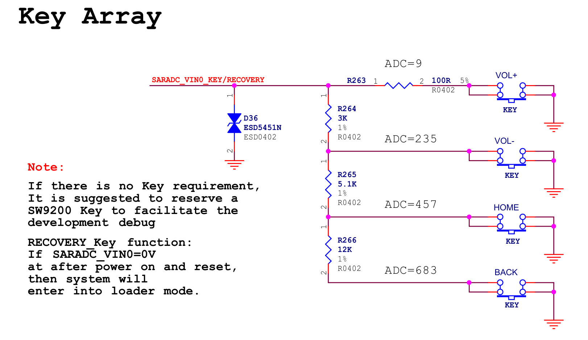
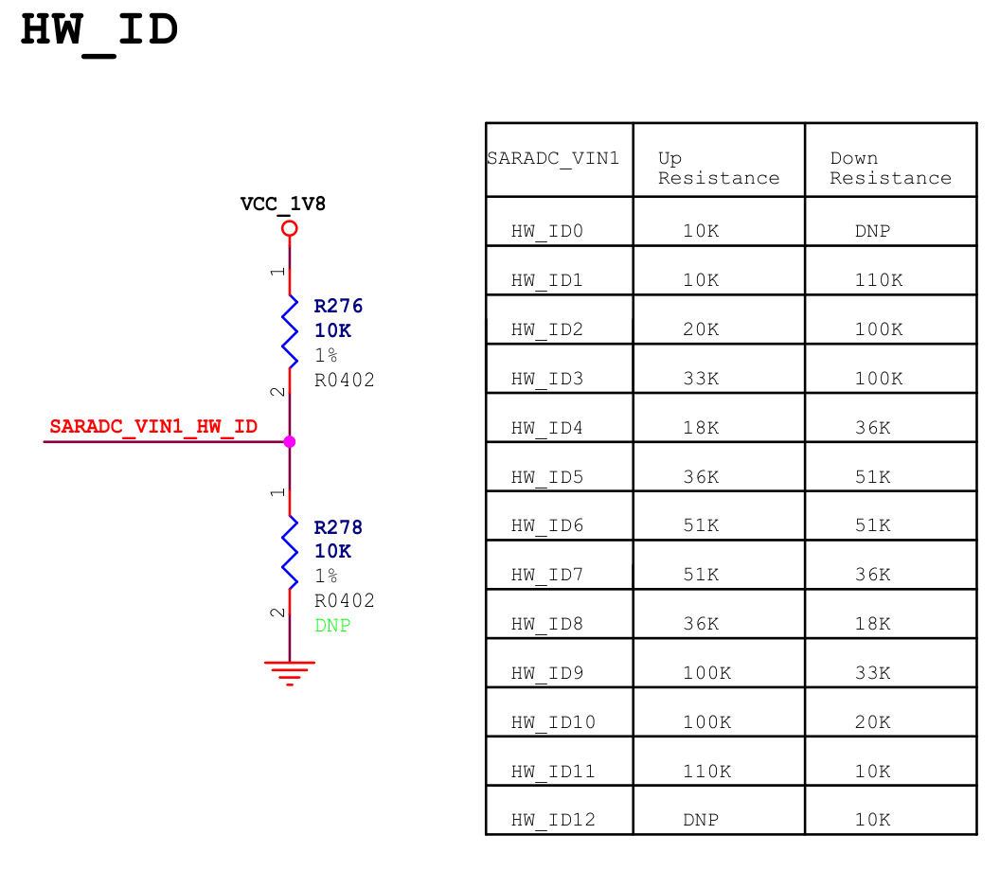
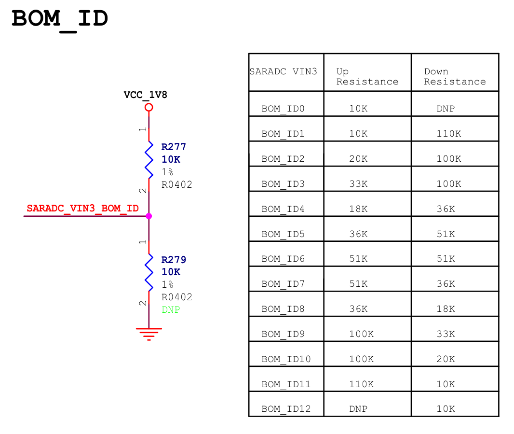
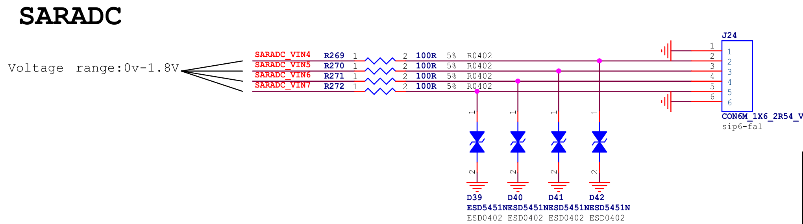
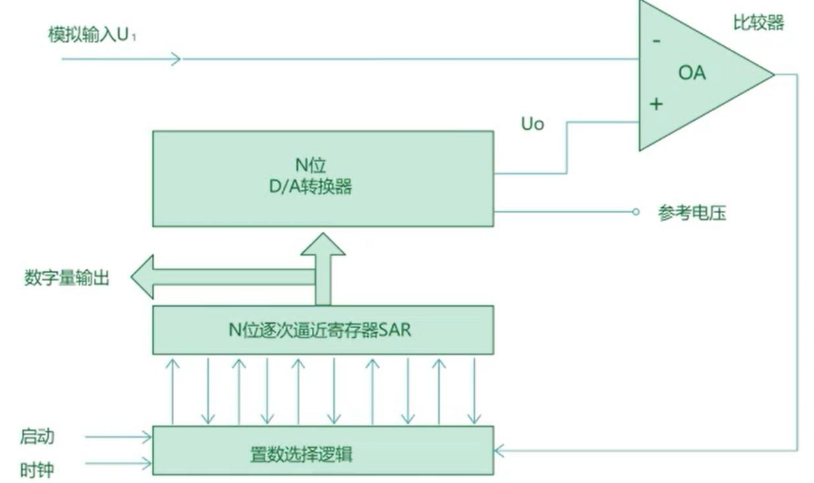
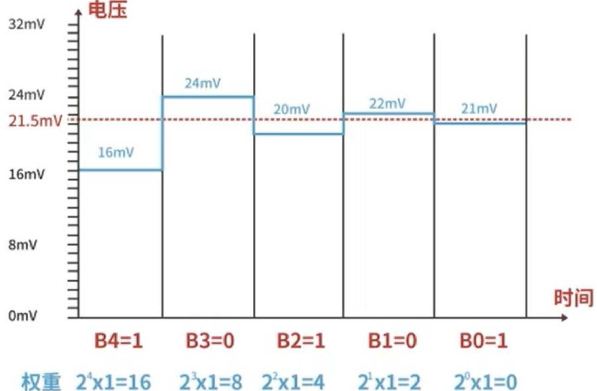
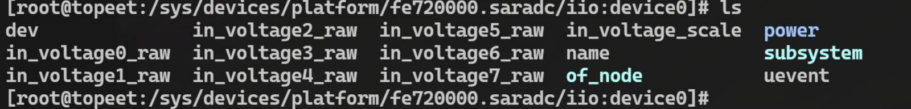

# ADC 基础

## 模拟信号与数字信号

**模拟信号**是一种连续变化的信号，其值可以在一定范围内取任意值。它在时间上和幅度上都是连续的，能够精确地反映自然界中的物理量变化。例如，温度传感器输出的电压信号、麦克风拾取的声音信号以及光敏电阻检测到的光强信号等，都属于模拟信号的范畴。

**数字信号**是一种离散的信号，其值只能在有限的范围内取特定的数值，通常以二进制形式表示。它的特点是时间上是离散的（采样点之间有固定的时间间隔），幅度上也是离散的（经过量化后的值）。例如，计算机中存储和处理的数据、MP3 文件中的音频数据以及 JPEG 图像文件中的像素值等，都是数字信号的具体体现。


|   维度   |          模拟信号特点          |              数字信号特点              |
| :------: | :----------------------------: | :------------------------------------: |
|   本质   |       连续变化、取值任意       |        离散取值、常以二进制表示        |
|   特性   |       时间 + 幅度均连续        | 时间（采样间隔）+ 幅度（量化值）均离散 |
|   优势   |     精准反映自然物理量变化     |   易存储 / 传输 / 处理、抗干扰能力强   |
| 典型场景 | 传感器原始信号、自然声光电信号 |       计算机数据、数字音视频文件       |

## ADC 概念

ADC 是 **Analog-to-Digital Converter** 的缩写，可以翻译为**模数转换器**。它是一种电子设备或电路模块，用于**将连续变化的模拟信号（如电压、电流等）转换为离散的数字信号**。这些数字信号可以被计算机、微控制器或其他数字系统处理和存储。

ADC 将模拟信号转换为数字信号通常分为**采样**、**保持**、**量化**以及**编码**四个步骤，每个步骤的定义以及作用如下表所示：

|         步骤         |                          定义                          |                             作用                             |                        关键参数或特点                        |
| :------------------: | :----------------------------------------------------: | :----------------------------------------------------------: | :----------------------------------------------------------: |
|   采样（Sampling）   |       以固定的时间间隔对模拟信号进行测量的过程。       |   将时间上连续的模拟信号离散化，为后续数字化处理奠定基础。   | 采样频率（Sampling Rate），即每秒采样的次数。根据奈奎斯特采样定理，采样频率至少是信号最高频率的两倍。 |
|   保持（Holding）    | 在采样完成后，将信号的瞬时值保持一段时间以便后续处理。 | 确保信号在量化过程中不会因快速变化而失真，提高转换的精度和稳定性。 |               无明确参数，主要目的是稳定信号。               |
| 量化（Quantization） |    将采样得到的连续幅值映射到一组离散数值上的过程。    |      将幅度上连续的信号离散化，使其能够被数字系统表示。      | 分辨率（Resolution），通常用位数表示（如 8 位、10 位、12 位等）。分辨率越高，信号越精确。 |
|   编码（Encoding）   |         将量化后的数值转换为二进制代码的过程。         | 将离散的数值以数字系统可识别的形式表示出来，便于存储、传输和处理，使模拟信号能被计算机或其他数字设备使用。 |     无明确参数，重点是生成适合数字系统使用的二进制代码。     |


ADC 广泛应用于传感器信号采集、音频处理、图像处理、工业自动化以及医疗设备中：

1. 传感器信号采集：许多传感器输出的是模拟信号。例如，温度传感器、压力传感器、光敏传感器等采集到的环境数据通常以模拟信号形式存在。
2. 音频处理：麦克风拾取的声音信号是模拟信号。
3. 图像处理：摄像头捕捉的光信号本质上是模拟信号。
4. 工业自动化：各种物理量（如速度、位置、压力等）的测量通常依赖于传感器输出的模拟信号。
5. 医疗设备：许多生物信号（如心电图、脑电图等）是以模拟信号形式采集的。


## ADC分辨率

ADC 的分辨率是指模数转换器能够区分的最小信号变化的能力。换句话说，它是 ADC 将模拟信号量化为离散数字值时的精细程度。在 ADC 中，分辨率越高，意味着它可以更精确地表示输入的模拟信号。当我们将数字信号通过 DAC（数模转换器）还原为模拟信号时，高分辨率的 ADC 能够生成更接近原始模拟信号的结果。

ADC 的分辨率通常用位数来表示，例如 8 位、10 位、12 位等。位数决定了 ADC 能够输出的离散数值的数量，n 位 ADC 可以表示 2^n 个不同的数值。例如，8 位 ADC 可以表示 2^8=256 个不同的数值；10 位 ADC 可以表示 2^10= 1024 个不同的数值；12 位 ADC 可以表示 2^12= 4096 个不同的数值。位数越高，分辨率越高，能够区分的信号变化越小。

分辨率可以通过以下公式计算：
$$
\text{分辨率} = \dfrac{\text{量程}}{2^n}
$$


其中：

1. 量程是指 ADC 输入信号的最大范围（即参考电压范围）；
2. n 是 ADC 的位数；
3. 2^n 表示 ADC 能够区分的离散数值总数。

例子：假设一个 3 位 ADC 的参考电压（量程）为 2V，计算他的分辨率：

1. 量程 = 2V
2. 位数为 3，2^n = 2^3 = 8；

代入分辨率计算公式可得 2V/8= 0.25V。这意味着该 ADC 能够将输入信号分成 8 个离散的等级，每个等级之间的步长为 0.25V。


除了分辨率，ADC的其他参数如下

|                参数                |                             定义                             |                          作用或意义                          |
| :--------------------------------: | :----------------------------------------------------------: | :----------------------------------------------------------: |
|   **采样时间（Sampling Time）**    |                   完成一次采样所需的时间。                   | 决定了 ADC 能够以多快的速度捕获输入信号的变化。如果采样时间过长，可能会导致信号失真或丢失细节。 |
|  **转换时间（Conversion Time）**   |             将模拟信号转换为数字信号所需的时间。             | 直接影响 ADC 的速度和效率。较短的转换时间意味着 ADC 可以更快地处理信号。 |
| **采样频率（Sampling Frequency）** | 每秒采集样本的次数，常用单位为 ksps（千次 / 秒）或 Msps（百万次 / 秒）。 | 决定了 ADC 对信号变化的捕捉能力。根据奈奎斯特采样定理，采样频率必须至少是信号最高频率的两倍，才能准确还原信号。 |
|        **精度（Accuracy）**        |         ADC 输出的数字值与实际模拟输入值之间的误差。         |   反映了 ADC 的可靠性和测量质量，是衡量其性能的重要指标。    |

## RK3568 ADC

在 RK3568 数据手册中的外设资源框图中可以找到，RK3568 这颗 SOC 总共有 **8 路 SARADC**。

**SARADC** （**Successive Approximation Register Analog-to-Digital Converter**）的中文名称为**逐次逼近型 ADC**；

除了 SAR ADC 之外，还有两路 TS-ADC（Temperature Sensor ADC），他们分别用来检测 CPU 和 GPU 的温度，如果在一段时间内检测到温度过高，则会向处理器发出中断信号以采取降温措施；如果温度持续过高，将复位整个芯片，达到重启的效果。TS-ADC 只负责检测 CPU 和 GPU 的温度所以并未在底板引出。

### ADC 按键

ADC 按键 是 SARADC 外设，ADC 按键的工作原理是**将多个按键连接到同一个 ADC 引脚上，并通过不同的分压电阻产生不同的电压，通过 ADC 测量该电压，并与预设的电压范围进行比对，从而判断哪个按键被按下**。




> 有两路 ADC 分别被用在了 HW_ID 和 BOM_ID 上，用于不同电子设备的硬件识别，但由于topeet的外设都是通用的，所以这两路 ADC 并没有被用到。







有 4 路 ADC 被连接到了 6pin 的座子上，原理图如下所示



总结如下

|  ADC 接口   |                  复用功能                  |
| :---------: | :----------------------------------------: |
| SARADC VIN0 | 用作按键引脚（音量 +，音量 -，HOME，BACK） |
| SARADC VIN1 |              用作 HW ID 引脚               |
| SARADC VIN2 |                   未使用                   |
| SARADC VIN3 |              用作 BOM ID 引脚              |
| SARADC VIN4 |                   未使用                   |
| SARADC VIN5 |                   未使用                   |
| SARADC VIN6 |                   未使用                   |
| SARADC VIN7 |                   未使用                   |

### 逐次逼近型 ADC

逐次逼近型 ADC（**Successive Approximation Register ADC**，简称 SAR ADC）是一种常见的模数转换器，其工作原理基于逐次逼近算法。它通过逐步比较输入模拟信号与内部生成的参考电压，最终确定一个接近输入信号的数字值。SAR ADC 工作原理示意图如下所示



由上图可知逼近寄存器型模数转换器（SAR ADC）主要由以下几个部分组成：

1. **比较器（Comparator）**：用于比较输入模拟信号 U1 和 D/A 转换器（DAC）输出的参考电压 U0，并产生反馈信号。
2. **N 位 D/A 转换器（DAC）**：将数字值转换为模拟电压，与输入信号进行比较，以逐步逼近目标值。
3. **N 位逐次逼近寄存器（SAR）**：用于存储当前的比较结果，并根据比较器的反馈调整数值，最终确定数字输出。
4. **置数选择逻辑**：控制逐次逼近寄存器的位选择过程，按二分法调整 DAC 的输出电压。

工作过程：

1. 首先，模拟输入信号 U1 进入 ADC，并由采样电路暂存，以便进行后续处理。
2. 随后，逐次逼近寄存器（SAR）初始化，并通过置数选择逻辑电路的控制，按照二分法逐步确定最终的数字输出值。

> 在转换过程中，SAR 从最高位开始假设为 1，并将当前的 N 位数字值传递给 D/A 转换器。DAC 将其转换为模拟电压 U0，然后送入比较器，与输入信号 U1 进行比较。如果 U0 小于 U1，当前位保持 1；否则，当前位改为 0。这个过程不断重复，每次确定一位，直到所有 N 位都完成，形成最终的数字输出。

3. 最终，SAR 将确定的 N 位数字值输出，完成一次模数转换。


举例如下：

**5 位逐次逼近型 ADC 在参考电压为 32mV、待测电压为 21.5mV 的情况**




1. 设置最高位：SAR 寄存器将最高位（第 5 位）设置为“1”，其余位为“0”，当前 SAR 值为 10000（二进制），即 16（十进制）。DAC 根据 SAR 值生成参考电压 U0=16×1mV=16 mV。比较器比较 U1=21.5 mV,V_0 =16，由于 U1>U0，因此保留当前位为“1”。
2. 设置次高位：SAR 寄存器保持最高位为“1”，并将次高位（第 4 位）设置为“1”，此时 SAR 值为 11000（二进制），即 24（十进制）。DAC 生成参考电压 U0=24×1 mV=24 mV。比较器比较 U1=21.5 m 和 U0=24 mV，由于 U1<U0，因此将当前位重置为“0”。
3. 设置第三位：SAR 寄存器保持前两位为“10”，并将第三位（第 3 位）设置为“1”，此时 SAR 值为 10100（二进制），即 20（十进制）。DAC 生成参考电压 U0=20×1 mV=20 mV。比较器比较 U1=21.5 mV 和 U0=20 mV，由于 U1>U0，因此保留当前位为“1”。
4. 设置第四位：SAR 寄存器保持前三位为“101”，并将第四位（第 2 位）设置为“1”，此时 SAR 值为 10110（二进制），即 22（十进制）。DAC 生成参考电压 U0=22×1 mV=22 mV。比较器比较 U1=21.5 mV 和 U0=22 mV，由于 U1<U0，因此将当前位重置为“0”。
5. 设置最低位：SAR 寄存器保持前四位为“1010”，并将最低位（第 1 位）设置为“1”，此时 SAR 值为 10101（二进制），即 21（十进制）。DAC 生成参考电压 U0=21×1 mV=21 mV。比较器比较 U1=21.5 mV 和 U0=21 mV，由于 U1>U0，因此保留当前位为“1”。
6. 结果：经过逐次逼近后，SAR 寄存器的值为 10101（二进制），即 21（十进制）。


# 操作 ADC

进入到`/sys/bus/iio/devices/iio:device0` 目录下



需要注意的是 `in_voltageX_raw` 和 `in_voltage_scale`。

- `in_voltageX_raw` **表示 ADC 某个通道的原始采样值**，其中 X 是通道编号（如 0, 1, 2, ..., 7）。它以整数形式存储 ADC 转换后的数字代码，用户可以通过读取该文件获取对应通道的未经缩放的原始数据。需要注意的是，这些值并未经过量程缩放，必须结合`in_voltage_scale` 进行计算才能得到实际电压值。
- `in_voltage_scale` 是用于**将 ADC 原始采样值转换为实际电压值的缩放因子**，通常定义为 1.8/1024。它以浮点数形式表示，单位可以是毫伏（mV）或伏特（V），具体取决于硬件实现。通过**将 `in_voltageX_raw` 的原始值乘以`in_voltage_scale`，即可得到对应通道的实际电压值**，从而实现从数字代码到物理量的转换


这里以 ADC 的通道 7 为例进行演示，对应的硬件为底板的 J24 的第 5 脚，具体如下图所示


DC 的通道 7 对应的原始采样值为 `in_voltage7_raw`，使用 cat 命令进行读取，读取到的值如下所示：

```bash
$ cat involtage7_raw
1017
```

这里读取到的是未经缩放的原始数据，然后继续使用cat命令读取缩放因子 `in_voltage_scale` 的值，具体如下所示：

```bash
$ cat in_voltage_scale
1.757812500
```

然后将获取到的原始采样值与缩放因子相乘即可得到实际电压值 1017x1.757812500=1787.6953125 mv=1.787 V


而除了上面的 SAR ADC 之外，还有着两路 TSADC，他们分别用来查询 CPU 和 GPU 的温度，

查看 CPU 的温度：

```bash
cat /sys/class/thermal/thermal_zone0/temp
```

查看 GPU 的温度：

```bash
cat /sys/class/thermal/thermal_zone1/temp
```

# ADC 驱动程序

编写一个 ADC 驱动程序，通过杂项设备创建一个 ADC 设备节点，通过该节点来读取对应通道的 ADC 值。

## API 函数

### iio_channel_get()

**函数原型**

```c
struct iio_channel *iio_channel_get(const char *name, const char *channel_name);
```

**核心作用**

从 Linux IIO 子系统中，根据「IIO 设备名」和「通道名」，获取一个对应的 `struct iio_channel` 通道结构体指针，后续所有对该 ADC 通道的操作都依赖这个指针。

**参数说明**

- `name`：指定要操作的 **IIO 设备名称 / ID**，如果传 `NULL` 表示使用系统默认的 IIO 设备；SARADC 场景常用 `NULL` 
- `channel_name`：指定要打开的 ADC 通道名称，具体名称要和内核驱动匹配。

**返回值**

- ✅ 成功：返回有效的 `struct iio_channel *` 结构体指针（通道句柄）；
- ❌ 失败：返回内核错误指针 `ERR_PTR(错误码)`，不能直接作为正常指针使用。


### iio_channel_release()

获取的通道句柄**用完必须释放**，否则造成内核资源泄漏，释放函数固定搭配：

```c
void iio_channel_release(struct iio_channel *channel);
```

- 参数：就是 `iio_channel_get` 获取到的通道指针
- 特性：无返回值，安全调用即可。

### struct iio_channel

```
struct iio_channel {
    struct iio_device *indio_dev;  // 当前通道绑定的IIO设备（如SARADC设备）
    const char *channel_name;      // 通道名称，和入参channel_name一致
    int channel_index;             // 通道索引，比如VIN0对应0，VIN3对应3
    bool is_output;                // 是否为输出通道，ADC是「输入通道」固定为false
};
```

------

### iio_read_channel_raw()

**函数原型**

```
int iio_read_channel_raw(struct iio_channel *channel, int *val);
```

**核心作用**

从已经打开的 IIO 通道（ADC 通道）中，读取**未经任何校准 / 换算的原始整型数据**，是 ADC 数据读取的核心函数。

> ✔️ 你的 SARADC 场景：读取到的 `val` 就是 ADC 引脚采集到的电压对应的**原始数字量**（比如 10 位 ADC 就是 0~1023 的数值）。

**参数说明**

- `channel`：输入参数，`iio_channel_get` 成功返回的通道句柄，**必须是有效指针**；
- `val`：输出参数，一个整型指针，函数执行成功后，采集到的 ADC 原始数据会被写入该地址指向的变量中。

**返回值**

- ✅ 成功：返回 `0`；
- ❌ 失败：返回**负数的内核错误码**（如 -EINVAL 无效参数、-ENODEV 设备不存在等）。

**关键注意点**

读取到的 `val` 是 **原始裸数据**：

- 无单位、无校准、无换算，只是 ADC 模数转换后的纯数字值；
- 数值范围由 ADC 位数决定（比如 8 位 ADC：0~255；10 位 ADC：0~1023；12 位 ADC：0~4095）；
- 如果需要换算成实际的电压值，需要自己写公式：`实际电压 = (原始值 / ADC最大量程) * ADC参考电压`。

------

**内核驱动中标准写法**

```c
// 步骤1：定义变量
struct iio_channel *adc_channel;
int adc_raw_data;
int ret;

// 步骤2：获取ADC通道句柄 (示例：打开SARADC的VIN0通道)
adc_channel = iio_channel_get(NULL, "vin0");
// 步骤3：判断通道获取是否成功
if (IS_ERR(adc_channel)) {
    ret = PTR_ERR(adc_channel); // 提取错误码
    printk("获取ADC通道失败: %d\n", ret);
    return ret;
}

// 步骤4：读取ADC原始数据
ret = iio_read_channel_raw(adc_channel, &adc_raw_data);
if (ret < 0) {
    printk("读取ADC数据失败: %d\n", ret);
    iio_channel_release(adc_channel); // 失败也要释放资源！
    return ret;
}
printk("ADC原始采集值：%d\n", adc_raw_data);

// 步骤5：使用完通道，必须释放资源
iio_channel_release(adc_channel);
```

## 设备树

添加设备节点：

```dts
adc7: adc-test {
	compatible = "myadc";
	io-channels = <&saradc 7>;
};
```

重点在 io-channels，意味要使用的是 ADC 的第 7 个通道

## 驱动程序

```c
#include <linux/module.h>
#include <linux/fs.h>
#include <linux/uaccess.h>
#include <linux/ioctl.h>
#include <linux/platform_device.h>
#include <linux/iio/consumer.h>
#include <linux/miscdevice.h>
#include <linux/of.h>  // 添加对设备树的支持

#define CMD_READ_SCALE _IOR('A', 0x1, int)  // 定义 ioctl 命令

static struct iio_channel *adc_chan;  // IIO 通道指针

// 文件操作：ioctl 实现
static long adc_dev_ioctl(struct file *file, unsigned int cmd, unsigned long arg) {
    int scale = 0;

    switch (cmd) {
        case CMD_READ_SCALE:
            // 从 ADC 通道读取原始值
            if (iio_read_channel_raw(adc_chan, &scale) < 0) {
                pr_err("Failed to read ADC channel raw value\n");
                return -EIO;
            }
            // 将数据复制到用户空间
            if (copy_to_user((int *)arg, &scale, sizeof(scale))) {
                pr_err("Failed to copy data to user space\n");
                return -EFAULT;
            }
            break;

        default:
            pr_err("Invalid ioctl command\n");
            return -EINVAL;
    }

    return 0;
}

// 文件操作结构体
static const struct file_operations adc_dev_fops = {
    .owner = THIS_MODULE,
    .unlocked_ioctl = adc_dev_ioctl,
};

// 杂项设备结构体
static struct miscdevice adc_dev = {
    .minor = MISC_DYNAMIC_MINOR,  // 动态分配次设备号
    .name = "adc",                // 设备名称
    .fops = &adc_dev_fops,        // 文件操作接口
};

// 设备树匹配表
static const struct of_device_id adc_driver_match[] = {
    { .compatible = "myadc" },
    { }
};
MODULE_DEVICE_TABLE(of, adc_driver_match);

// 平台设备探测函数
static int adc_driver_probe(struct platform_device *pdev) {
    // 获取 IIO 通道
    adc_chan = iio_channel_get(&pdev->dev, NULL);
    if (IS_ERR(adc_chan)) {
        pr_err("Failed to get IIO channel\n");
        return PTR_ERR(adc_chan);
    }

    // 注册杂项设备
    if (misc_register(&adc_dev)) {
        pr_err("Failed to register misc device\n");
        iio_channel_release(adc_chan);  // 释放 IIO 通道
        return -ENODEV;
    }

    pr_info("ADC driver probed successfully\n");
    return 0;
}

// 平台设备移除函数
static int adc_driver_remove(struct platform_device *pdev) {
    // 注销杂项设备
    misc_deregister(&adc_dev);

    // 释放 IIO 通道
    iio_channel_release(adc_chan);

    pr_info("ADC driver removed successfully\n");
    return 0;
}


// 平台设备驱动结构体
static struct platform_driver adc_driver = {
    .probe = adc_driver_probe,
    .remove = adc_driver_remove,
    .driver = {
        .name = "myadc",  // 驱动名称
        .owner = THIS_MODULE,
        .of_match_table = adc_driver_match,
    },
};


// 模块初始化函数
static int __init adc_driver_init(void) {
    int ret;

    // 注册平台设备驱动
    ret = platform_driver_register(&adc_driver);
    if (ret) {
        pr_err("Failed to register platform driver\n");
        return ret;
    }

    pr_info("ADC driver module loaded\n");
    return 0;
}

// 模块退出函数
static void __exit adc_driver_exit(void) {
    // 注销平台设备驱动
    platform_driver_unregister(&adc_driver);

    pr_info("ADC driver module unloaded\n");
}

module_init(adc_driver_init);
module_exit(adc_driver_exit);

MODULE_LICENSE("GPL");
MODULE_AUTHOR("topeet");

```

测试：

```bash
#include <stdio.h>
#include <stdlib.h>
#include <unistd.h>
#include <sys/types.h>
#include <sys/stat.h>
#include <fcntl.h>
#include <sys/ioctl.h>

#define CMD_READ_SCALE _IOR('A', 1, int)

int main(int argc, char *argv[]) {
    int scale = 0;
    int fd;
	float value = 0.0;      // 用于存储计算后的实际电压值

    // 打开设备文件
    fd = open("/dev/adc", O_RDWR);
    if (fd < 0) {
        printf("open error\n");
        return -1;
    }

    // 使用 ioctl 读取 scale 值
    if (ioctl(fd, CMD_READ_SCALE, &scale) < 0) {
        printf("ioctl error\n");
        close(fd);
        return -1;
    }

	value = (1.8 / 1024) * (float)scale;

    // 打印读取到的 scale 值
    printf("val is %lf\n", value);

    // 关闭设备文件
    close(fd);
    return 0;
}
```


