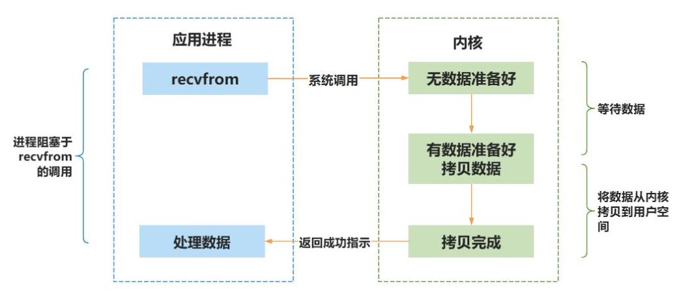
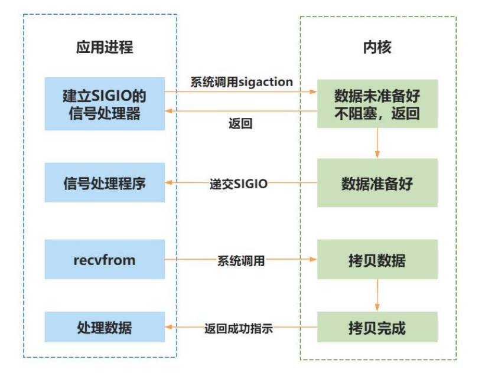
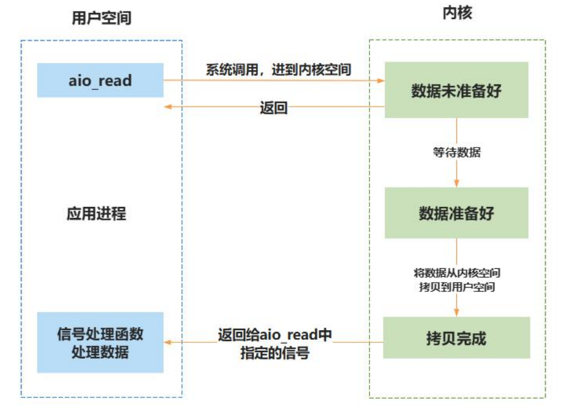

# 高级字符设备进阶

## IO模型

### IO操作过程

一个完整的 IO 流程，通常包含以下关键环节：

- IO 调用：应用程序通过系统调用接口向内核发起 IO 请求（如读取文件）。
- IO 执行：内核收到请求之后，通过驱动程序操作硬件完成具体 IO（如从磁盘读取数据），并将最终结果返回给用户空间。

完整的 IO 过程需要包含以下三个步骤:

1. 用户空间的应用程序向内核发起 IO 调用请求(系统调用)
2. 内核操作系统准备数据，把 IO 设备的数据加载到内核缓冲区
3. 操作系统拷贝数据，把内核缓冲区的数据拷贝到用户进程缓冲区


### IO模型的分类

>  在实际开发中，IO 操作常常成为影响程序性能的关键因素。假设有一个场景：从磁盘读取100MB 数据并处理，读取数据耗时 20 秒，处理数据也需要 20 秒。如果采用最传统的顺序流程——读取完再处理，那么整个流程耗时约 40 秒，效率明显偏低。那么能不能在等待数据的同时对数据进行处理呢？当然可以！这时候就轮到 IO 编程模型来出场了。


IO模型有阻塞IO，非阻塞IO，信号驱动IO，IO多路复用，异步IO。其中前四个被称之为同步IO

- 同步IO

  - 阻塞IO

  - 非阻塞IO

  - 信号驱动IO

  - IO多路复用

- 异步IO

同步和异步的区别在于**是否等待IO的执行结果**。

#### 同步阻塞IO

进程进行 IO 操作时(如 read 操作)，首先会发起一个系统调用，从而转到内核空间进行处理，内核空间的数据没有准备就绪时，进程会被阻塞，不会继续向下执行，直到内核空间的数据准备完成后，数据才会从内核空间拷贝到用户空间，最后返回应用进程，由
用户空间进行数据的处理。



阻塞 IO 的可以及时地获取结果，并立刻对获取到的结果进行处理，然而在获取结果之前，无法去处理其他任务，需要时刻对结果进行监听。比如C语言的scanf函数。


#### 同步非阻塞IO

和阻塞 IO 模型不同，非阻塞 IO 进行 IO 操作时，**如果内核数据没有准备好，内核会立即向进程返回 err**，不会进行阻塞；如果内核空间数据准备就绪，内核会立即把数据返回给用户空间的进程。


非阻塞 IO 的优点是效率高，同样的时间内可以做别的事。但是缺点也很明显，当需要频繁检查数据就绪状态时可能导致较高的 CPU 占用率。为了解决此问题，非阻塞 IO 通常与 IO多路复用技术结合使用。

#### IO多路复用

select()、poll()和 epoll()函数是实现 IO 多路复用的机制。

IO 多路复用可以让**单个进程监控多个描述符，当发现某个描述符就绪以后，就会通知程序进行相应的读写操作**。

以 select()函数为例，如图所示。使用时需要向 select()传入待监听的文件描述符集合以及超时时间。

当执行 select()时，系统会触发一次系统调用，**内核将遍历检查这些描述符是否触发了目标事件**（如可读、可写）。若检测到事件则立即返回，若**未检测到事件，进程将进入阻塞状态并休眠**，**直到任一描述符就绪或超时为止**。

当 select()返回后，用户空间需遍历所有描述符，逐一确认具体是哪个触发了事件，从而实现单线程同时管理多个 IO操作的效果。


IO 多路复用的优点是一个进程/线程可以同时监听和处理多路 IO，效率成倍提高。但是 IO多路复用并不是能医治百病的良药，虽**然 IO 多路复用可以监听多个 IO，但是实际上对结果的处理也只能依次进行**，比较**适合 IO 密集但是每一路 IO 数据量不多且到达时间分散的场合**（如网络聊天）。

另外 select 监听的描述符有上限（一般描述符最大不超过 1024），而且**需要遍历究竟是哪一个 IO 产生了数据**。因此 IO 较多时，效率不高（这个问题被 epoll 解决）。


#### 信号驱动IO

信号驱动 IO 指的是**进程会预先告知内核，当某个描述符发生事件时，内核要向该进程发送 SIGIO 信号进行通知**，进程可以在信号处理函数中对该事件进行处理。

例如在 Linux 系统中，用户按下 ctrl+C 终止运行中的任务时，系统实际上是对该进程发送一个 SIGINT 信号，该信号的默认处理函数就是退出当前程序。

具体到 IO 模型上，进程需要先为 SIGIO 信号注册相应的信号处理函数，并打开对应描述符的信号驱动。当数据准备好时，进程会收到一个 SIGIO 信号，可以在信号处理函数中调用 IO操作函数处理数据。




#### 异步IO

aio_read()函数常常用于异步 IO，当进程使用 aio_read()读取数据时，**如果数据尚未准备就绪就立即返回，不会阻塞**。

若数据准备就绪就会把数据从内核空间拷贝到用户空间的缓冲区中，然后**执行定义好的回调函数对接收到的数据进行处理**。




### 等待队列实现阻塞IO

在 Linux 驱动程序中，**阻塞进程可以使用等待队列来实现**。

等待队列是实现阻塞和唤醒的内核机制，**等待队列以双循环链表为基础结构**，其中链表头和链表项两部分别表示等待队列头和等待队列元素。


#### 定义

**include/linux/wait.h**

```c
typedef struct wait_queue_entry wait_queue_entry_t;

struct wait_queue_entry {
	unsigned int		flags;
	void			*private;
	wait_queue_func_t	func;
	struct list_head	entry;
};

struct wait_queue_head {
	spinlock_t		lock;
	struct list_head	head;
};
typedef struct wait_queue_head wait_queue_head_t;

struct task_struct;
```


#### API

##### 初始化等待队列

| API                             | 用途                 | 说明 / 参数                               | 注意事项       |
| ------------------------------- | -------------------- | ----------------------------------------- | -------------- |
| `DECLARE_WAIT_QUEUE_HEAD(name)` | 静态定义等待队列头   | 生成一个名为 `name` 的全局/静态等待队列头 | 最常用方式     |
| `init_waitqueue_head(wq)`       | 动态初始化等待队列头 | 适用于动态分配结构体中的等待队列头        | 需要先分配内存 |


##### 等待队列项API

| API                                     | 用途                   | 说明 / 参数                      | 注意事项                       |
| --------------------------------------- | ---------------------- | -------------------------------- | ------------------------------ |
| `DECLARE_WAITQUEUE(name, task)`         | 静态创建一个等待队列项 | `task` 通常填 `current`          | 全局或静态场景                 |
| `init_waitqueue_entry(&entry, task)`    | 动态初始化队列项       | task 通常为 `current`            | 动态创建项                     |
| `add_wait_queue(head, entry)`           | 将等待项加入等待队列   | 非排他 wait                      | 多用于底层调用（不建议直接用） |
| `add_wait_queue_exclusive(head, entry)` | 排他 wait              | 唤醒时只唤醒 1 个 exclusive 进程 | 用于写操作等阻塞队列           |
| `remove_wait_queue(head, entry)`        | 从等待队列移除项       | 和 add_wait_queue 配对           |                                |


##### 睡眠等待API

| API                                                        | 用途                          | 说明                    | 返回值 / 注意事项                        |
| ---------------------------------------------------------- | ----------------------------- | ----------------------- | ---------------------------------------- |
| `wait_event(wq, condition)`                                | 条件不满足 → 睡眠（不可中断） | condition 为真返回      | **不能被信号打断**                       |
| `wait_event_timeout(wq, condition, timeout)`               | 不可中断睡眠 + 超时           | timeout 为 jiffies      | 返回剩余 jiffies 或 0 超时               |
| `wait_event_interruptible(wq, condition)`                  | 可中断睡眠                    | 可被信号打断            | 被打断时返回 `-ERESTARTSYS`              |
| `wait_event_interruptible_timeout(wq, condition, timeout)` | 可中断 + 超时                 |                         | 返回：>0 剩余时间，0 超时，<0 被信号打断 |
| `wait_event_killable(wq, condition)`                       | 仅 fatal signal 打断          | 比 interruptible 更安全 | 被杀死信号打断                           |
| `wait_event_killable_timeout(wq, condition, timeout)`      | killable + timeout            |                         | 同上                                     |

##### 唤醒API

| API                              | 用途                                 | 说明 / 参数             | 唤醒规则                   |
| -------------------------------- | ------------------------------------ | ----------------------- | -------------------------- |
| `wake_up(&wq)`                   | 唤醒 queue 中所有非 exclusive waiter | 不修改任务状态          | 适合读者多、唤醒不需要限制 |
| `wake_up_all(&wq)`               | 唤醒所有 waiter                      | 包含 exclusive          | 强制唤醒所有任务           |
| `wake_up_interruptible(&wq)`     | 唤醒 `TASK_INTERRUPTIBLE` 状态任务   | 适配 interruptible wait |                            |
| `wake_up_interruptible_all(&wq)` | 唤醒所有可中断等待者                 |                         |                            |
| `wake_up_nr(&wq, nr)`            | 唤醒 nr 个 exclusive waiter          | 最常用：`wake_up(&wq)`  | exclusive 只唤醒一个       |

##### 示例

TODO


### 非阻塞式访问


应用程序可以使用如下所示示例代码来实现阻塞访问：

```c
int fd;
int data = 0;
fd = open("/dev/xxx_dev", O_RDWR);/* 阻塞方式打开 */
ret = read(fd, &data, sizeof(data));/* 读取数据 */

```

可以看出对于**设备驱动文件的默认读取方式就是阻塞式的**，所以之前实验例程测试都是采用阻塞 IO。
如果应用程序要采用非阻塞的方式来访问驱动设备文件，可以使用如下所示代码：

```c
int fd;
int data = 0;
fd = open("/dev/xxx_dev", O_RDWR | O_NONBLOCK); /*非阻塞方式打开 */
ret = read(fd, &data, sizeof(data)); /* 读取数据 */
```


使用 open 函数打开“/dev/xxx_dev”设备文件的时候添加了参数“O_NONBLOCK”，表示以非阻塞方式打开设备，这样从设备中读取数据的时候是非阻塞方式了。

**驱动程序**

通过file结构体中的f_flags中查询应用程序是否通过O_NONBLOCK方式打开

```c
static ssize_t cdev_test_read(struct file *file, char __user *buf, size_t size, loff_t *off)
{
	struct device_test *test_dev=(struct device_test *)file->private_data;
	if(file->f_flags & O_NONBLOCK ){
		if (test_dev->flag !=1)
			return -EAGAIN;
	}
    ...
```


### IO多路复用的实现

IO 多路复用是一种同步的 IO 模型。IO 多路复用可以**实现一个进程监视多个文件描述符**。一旦某个文件描述符准备就绪，就通知应用程序进行相应的读写操作。没有文件描述符就绪时就会阻塞应用程序，从而释放出 CPU 资源。


在应用层 Linux 提供了三种实现 IO 多路复用的模型，分别是 select、poll 和 epoll。

- poll和select基本一样，都可以监听多个文件描述符，通过轮询文件描述符来获取已经准备好的文件描述符
- epoll是将主动轮询变成了被动通知，当事件发生时，被动地接收通知。


#### Linux应用层poll

| 项目       | 内容                                                         |
| ---------- | ------------------------------------------------------------ |
| **作用**   | 监视多个文件描述符的读写事件或异常事件                       |
| **原型**   | `int poll(struct pollfd *fds, nfds_t nfds, int timeout);`    |
| **参数**   | - `fds`：struct pollfd 数组，描述被监视的文件描述符及事件 <br />- `nfds`：被监视的 fd 数量<br /> - `timeout`：超时时间（ms）>0：等待指定时间; = 0：立即返回; -1：永远阻塞，直到事件发生 |
| **返回值** | >0：返回 *revents ≠ 0* 的 fd 数量<br /> =0：超时 <br />-1：失败 |

 **struct pollfd**

```c
struct pollfd {
    int   fd;       // 被监视的文件描述符
    short events;   // 需要监视的事件
    short revents;  // 内核返回的事件
};	
```

**pollfd的events和revents**

| 事件类型 | 常值       | 作为 events 的值 | 作为 revents 的值 | 说明                 |
| -------- | ---------- | ---------------- | ----------------- | -------------------- |
| 读事件   | POLLIN     | ✔                | ✔                 | 有普通数据可读       |
| 读事件   | POLLRDNORM | ✔                | ✔                 | 可读（常规数据）     |
| 读事件   | POLLRDBAND | ✔                | ✔                 | 可读（带外数据）     |
| 读事件   | POLLPRI    | ✔                | ✔                 | 可读（高优先级数据） |
| 写事件   | POLLOUT    | ✔                | ✔                 | 可写                 |
| 写事件   | POLLWRNORM | ✔                | ✔                 | 可写（常规数据）     |
| 写事件   | POLLWRBAND | ✔                | ✔                 | 可写（带外数据）     |
| 错误事件 | POLLERR    |                  | ✔                 | 发生错误             |
| 错误事件 | POLLHUP    |                  | ✔                 | 发生挂起             |
| 错误事件 | POLLNVAL   |                  | ✔                 | 描述符不是打开的文件 |

#### file_operations.poll

| 项目       | 内容                                                         |
| ---------- | ------------------------------------------------------------ |
| **作用**   | 告诉内核：当前设备是否可 non-blocking 访问（可读/可写）      |
| **原型**   | `unsigned int (*poll)(struct file *filp, struct poll_table_struct *wait);` |
| **参数**   | - `filp`：文件结构体指针 <br />- `wait`：内核传入的 poll_table，用于登记等待队列 |
| **返回值** | 返回状态位掩码（同 POLLIN/POLLOUT 等事件）                   |

#### 驱动中的实现

##### poll_wait()

| 项目       | 内容                                                         |
| ---------- | ------------------------------------------------------------ |
| **作用**   | 把驱动中的等待队列加入到 poll_table 中，用于 select/poll/epoll |
| **原型**   | `void poll_wait(struct file *filp, wait_queue_head_t *queue, poll_table *wait);` |
| **参数**   | - `filp`：文件 <br /> - `queue`：等待队列头（wait_queue_head_t） <br /> - `wait`：poll_table（来自应用层） |
| **返回值** | 无                                                           |
| **特点**   | **不会阻塞！** 只是登记等待队列                              |

#### 示例

**app read.c**

```c
#include <stdio.h>
#include <sys/types.h>
#include <sys/stat.h>
#include <fcntl.h>
#include <unistd.h>
#include <stdlib.h>
#include <poll.h>

int main(int argc, char *argv[])  
{
    int fd;//要监视的文件描述符
    char buf1[32] = {0};   
    char buf2[32] = {0};
    struct pollfd  fds[1];
    int ret;
    fd = open("/dev/test", O_RDWR);  //打开/dev/test设备，阻塞式访问
    if (fd < 0)
    {
        perror("open error \n");
        return fd;
    }

    fds[0] .fd =fd;
    fds[0].events = POLLIN;
    printf("read before \n");
    while (1)
    {
        ret = poll(fds,1,3000);
    if(!ret){
        printf("time out !!\n");

    }else if(fds[0].revents == POLLIN)
    {
        read(fd,buf1,sizeof(buf1));  //从/dev/test文件读取数据
         printf("buf is %s \n",buf1);
         sleep(1);
    }
         
    }
    
    printf("read after\n");
    close(fd);     //关闭文件
    return 0;
}
```

**app write.c**

```c
#include <stdio.h>
#include <sys/types.h>
#include <sys/stat.h>
#include <fcntl.h>
#include <unistd.h>
#include <stdlib.h>
#include <string.h>

int main(int argc, char *argv[])  
{
    int fd;
    char buf1[32] = {0};   
    char buf2[32] = "nihao";
    fd = open("/dev/test",O_RDWR);  //打开led驱动
    if (fd < 0)
    {
        perror("open error \n");
        return fd;
    }
    printf("write before \n");
    write(fd,buf2,sizeof(buf2));  //向/dev/test文件写入数据
     printf("write after\n");
    close(fd);     //关闭文件
    return 0;
}
```


##### 驱动程序

```c
#include <linux/init.h>
#include <linux/module.h>
#include <linux/kdev_t.h>
#include <linux/fs.h>
#include <linux/cdev.h>
#include <linux/uaccess.h>
#include <linux/io.h>
#include  <linux/wait.h>
#include <linux/poll.h>

struct device_test{
   
    dev_t dev_num;  //设备号
     int major ;  //主设备号
    int minor ;  //次设备号
    struct cdev cdev_test; // cdev
    struct class *class;   //类
    struct device *device; //设备
    char kbuf[32];
    int  flag;  //标志位
};


struct  device_test dev1;  

DECLARE_WAIT_QUEUE_HEAD(read_wq); //定义并初始化等待队列头

/*打开设备函数*/
static int cdev_test_open(struct inode *inode, struct file *file)
{
    file->private_data=&dev1;//设置私有数据
   
    return 0;
}

/*向设备写入数据函数*/
static ssize_t cdev_test_write(struct file *file, const char __user *buf, size_t size, loff_t *off)
{
     struct device_test *test_dev=(struct device_test *)file->private_data;

    if (copy_from_user(test_dev->kbuf, buf, size) != 0) // copy_from_user:用户空间向内核空间传数据
    {
        printk("copy_from_user error\r\n");
        return -1;
    }
    test_dev->flag=1;
    wake_up_interruptible(&read_wq);

    return 0;
}

/**从设备读取数据*/
static ssize_t cdev_test_read(struct file *file, char __user *buf, size_t size, loff_t *off)
{
    
    struct device_test *test_dev=(struct device_test *)file->private_data;
    if(file->f_flags & O_NONBLOCK ){
        if (test_dev->flag !=1)
        return -EAGAIN;
    }
    wait_event_interruptible(read_wq,test_dev->flag);

    if (copy_to_user(buf, test_dev->kbuf, strlen( test_dev->kbuf)) != 0) // copy_to_user:内核空间向用户空间传数据
    {
        printk("copy_to_user error\r\n");
        return -1;
    }

    return 0;
}

static int cdev_test_release(struct inode *inode, struct file *file)
{
    
    return 0;
}

static  __poll_t  cdev_test_poll(struct file *file, struct poll_table_struct *p){
     struct device_test *test_dev=(struct device_test *)file->private_data;  //设置私有数据
     __poll_t mask=0;    
     poll_wait(file,&read_wq,p);     //不会阻塞

     if (test_dev->flag == 1)    
     {
         mask |= POLLIN;
     }
     return mask;
     
}

/*设备操作函数*/
struct file_operations cdev_test_fops = {
    .owner = THIS_MODULE, //将owner字段指向本模块，可以避免在模块的操作正在被使用时卸载该模块
    .open = cdev_test_open,
    .read = cdev_test_read, 
    .write = cdev_test_write, 
    .release = cdev_test_release, 
    .poll = cdev_test_poll,  //将poll字段指向chrdev_poll(...)函数
};

static int __init chr_fops_init(void) //驱动入口函数
{
    /*注册字符设备驱动*/
    int ret;
    /*1 创建设备号*/
    ret = alloc_chrdev_region(&dev1.dev_num, 0, 1, "alloc_name"); //动态分配设备号
    if (ret < 0)
    {
       goto err_chrdev;
    }
    printk("alloc_chrdev_region is ok\n");

    dev1.major = MAJOR(dev1.dev_num); //获取主设备号
   dev1.minor = MINOR(dev1.dev_num); //获取次设备号

    printk("major is %d \r\n", dev1.major); //打印主设备号
    printk("minor is %d \r\n", dev1.minor); //打印次设备号
     /*2 初始化cdev*/
    dev1.cdev_test.owner = THIS_MODULE;
    cdev_init(&dev1.cdev_test, &cdev_test_fops);

    /*3 添加一个cdev,完成字符设备注册到内核*/
   ret =  cdev_add(&dev1.cdev_test, dev1.dev_num, 1);
    if(ret<0)
    {
        goto  err_chr_add;
    }
    /*4 创建类*/
  dev1. class = class_create(THIS_MODULE, "test");
    if(IS_ERR(dev1.class))
    {
        ret=PTR_ERR(dev1.class);
        goto err_class_create;
    }
    /*5  创建设备*/
  dev1.device = device_create(dev1.class, NULL, dev1.dev_num, NULL, "test");
    if(IS_ERR(dev1.device))
    {
        ret=PTR_ERR(dev1.device);
        goto err_device_create;
    }

return 0;

 err_device_create:
        class_destroy(dev1.class);                 //删除类

err_class_create:
       cdev_del(&dev1.cdev_test);                 //删除cdev

err_chr_add:
        unregister_chrdev_region(dev1.dev_num, 1); //注销设备号

err_chrdev:
        return ret;
}


static void __exit chr_fops_exit(void) //驱动出口函数
{
    /*注销字符设备*/
    unregister_chrdev_region(dev1.dev_num, 1); //注销设备号
    cdev_del(&dev1.cdev_test);                 //删除cdev
    device_destroy(dev1.class, dev1.dev_num);       //删除设备
    class_destroy(dev1.class);                 //删除类
}

module_init(chr_fops_init);
module_exit(chr_fops_exit);
MODULE_LICENSE("GPL v2");
MODULE_AUTHOR("topeet");

```

### 信号驱动IO


信号驱动 IO 不需要应用程序查询设备的状态，一旦设备准备就绪，会触发 SIGIO 信号，进而调用注册的处理函数。


如果要实现信号驱动 IO，需要应用程序和驱动程序配合，应用程序使用信号驱动 IO 的步骤有三步：

- 步骤 1 ：注册信号处理函数 应用程序使用 signal 函数来注册 SIGIO 信号的信号处理函数。
- 步骤 2： 设置能够接收这个信号的进程(fcntl函数)
- 步骤 3： 开启信号驱动 IO 通常使用 fcntl 函数的 F_SETFL 命令打开 FASYNC 标志。


#### 驱动实现

当应用程序开启信号驱动 IO 时，会触发驱动中的 fasync 函数。所以首先在 file_operations结构体中实现 fasync 函数，函数原型如下：

```c
int (*fasync) (int fd,struct file *filp,int on)
```

在驱动中的 fasync 函数调用 fasync_helper 函数来操作 fasync_struct 结构体，fasync_helper函数原型如下：

```c
int fasync_helper(int fd,struct file *filp,int on,struct fasync_struct **fapp)
```

当设备准备好的时候，**驱动程序需要调用 kill_fasync 函数通知应用程序**，此时应用程序的SIGIO 信号处理函数就会被执行。kill_fasync 负责发送指定的信号，函数原型如下：

```c
void kill_fasync(struct fasync_struct **fp,int sig,int band)
```

- **函数参数**：
  - **fp**: 要操作的 fasync_struct
  - **sig**: 发送的信号
  - **band**: 可读的时候设置成 POLLIN ，可写的时候设置成 POLLOUT

#### 示例

app read.c

```c
#include <stdio.h>
#include <sys/types.h>
#include <sys/stat.h>
#include <fcntl.h>
#include <unistd.h>
#include <stdlib.h>
#include <poll.h>
#include <fcntl.h>
#include <signal.h>

int fd;
char buf1[32] = {0};   


//SIGIO信号的信号处理函数
static void func(int signum)
{
    read(fd,buf1,32);
    printf ("buf is %s\n",buf1);
}
int main(int argc, char *argv[])  
{
    int ret;
    int flags;
       fd = open("/dev/test", O_RDWR);  //打开led驱动
    if (fd < 0)
    {
        perror("open error \n");
        return fd;
    }

    signal(SIGIO,func);  //步骤一：使用signal函数注册SIGIO信号的信号处理函数
     //步骤二：设置能接收这个信号的进程
     //fcntl函数用来操作文件描述符，
     //F_SETOWN 设置当前接收的SIGIO的进程ID
     fcntl(fd,F_SETOWN,getpid()); 

    flags = fcntl(fd,F_GETFD); //获取文件描述符标志
    //步骤三  开启信号驱动IO 使用fcntl函数的F_SETFL命令打开FASYNC标志
    fcntl(fd,F_SETFL,flags| FASYNC);
    
    while(1);
    
    close(fd);     //关闭文件
    return 0;
}
```

app write.c还是向驱动写入数据


驱动程序

```c
#include <linux/init.h>
#include <linux/module.h>
#include <linux/kdev_t.h>
#include <linux/fs.h>
#include <linux/cdev.h>
#include <linux/uaccess.h>
#include <linux/io.h>
#include  <linux/wait.h>
#include <linux/poll.h>
#include <linux/fcntl.h>
#include <linux/signal.h>

struct device_test{
   
    dev_t dev_num;  //设备号
     int major ;  //主设备号
    int minor ;  //次设备号
    struct cdev cdev_test; // cdev
    struct class *class;   //类
    struct device *device; //设备
    char kbuf[32];
    int  flag;  //标志位
    struct fasync_struct *fasync;
};


struct  device_test dev1;  

DECLARE_WAIT_QUEUE_HEAD(read_wq); //定义并初始化等待队列头

/*打开设备函数*/
static int cdev_test_open(struct inode *inode, struct file *file)
{
    file->private_data=&dev1;//设置私有数据
   
    return 0;
}

/*向设备写入数据函数*/
static ssize_t cdev_test_write(struct file *file, const char __user *buf, size_t size, loff_t *off)
{
     struct device_test *test_dev=(struct device_test *)file->private_data;

    if (copy_from_user(test_dev->kbuf, buf, size) != 0) // copy_from_user:用户空间向内核空间传数据
    {
        printk("copy_from_user error\r\n");
        return -1;
    }
    test_dev->flag=1;
    wake_up_interruptible(&read_wq);
    kill_fasync(&test_dev->fasync,SIGIO,POLLIN);
    return 0;
}

/**从设备读取数据*/
static ssize_t cdev_test_read(struct file *file, char __user *buf, size_t size, loff_t *off)
{
    
    struct device_test *test_dev=(struct device_test *)file->private_data;
    if(file->f_flags & O_NONBLOCK ){
        if (test_dev->flag !=1)
        return -EAGAIN;
    }
    wait_event_interruptible(read_wq,test_dev->flag);

    if (copy_to_user(buf, test_dev->kbuf, strlen( test_dev->kbuf)) != 0) // copy_to_user:内核空间向用户空间传数据
    {
        printk("copy_to_user error\r\n");
        return -1;
    }

    return 0;
}

static int cdev_test_release(struct inode *inode, struct file *file)
{
    cdev_test_fasync(-1, file, 0);
    return 0;
}

static  __poll_t  cdev_test_poll(struct file *file, struct poll_table_struct *p){
     struct device_test *test_dev=(struct device_test *)file->private_data;  //设置私有数据
     __poll_t mask=0;    
     poll_wait(file,&read_wq,p);     //应用阻塞

     if (test_dev->flag == 1)    
     {
         mask |= POLLIN;
     }
     return mask;
     
}

static int cdev_test_fasync (int fd, struct file *file, int on)
{
    struct device_test *test_dev=(struct device_test *)file->private_data;  //设置私有数据
    return  fasync_helper(fd,file,on,&test_dev->fasync);
}

/*设备操作函数*/
struct file_operations cdev_test_fops = {
    .owner = THIS_MODULE, //将owner字段指向本模块，可以避免在模块的操作正在被使用时卸载该模块
    .open = cdev_test_open, //将open字段指向chrdev_open(...)函数
    .read = cdev_test_read, //将open字段指向chrdev_read(...)函数
    .write = cdev_test_write, //将open字段指向chrdev_write(...)函数
    .release = cdev_test_release, //将open字段指向chrdev_release(...)函数
    .poll = cdev_test_poll,  //将poll字段指向chrdev_poll(...)函数
    .fasync = cdev_test_fasync,   //将fasync字段指向cdev_test_fasync(...)函数
};

static int __init chr_fops_init(void) //驱动入口函数
{
    /*注册字符设备驱动*/
    int ret;
    /*1 创建设备号*/
    ret = alloc_chrdev_region(&dev1.dev_num, 0, 1, "alloc_name"); //动态分配设备号
    if (ret < 0)
    {
       goto err_chrdev;
    }
    printk("alloc_chrdev_region is ok\n");

    dev1.major = MAJOR(dev1.dev_num); //获取主设备号
   dev1.minor = MINOR(dev1.dev_num); //获取次设备号

    printk("major is %d \r\n", dev1.major); //打印主设备号
    printk("minor is %d \r\n", dev1.minor); //打印次设备号
     /*2 初始化cdev*/
    dev1.cdev_test.owner = THIS_MODULE;
    cdev_init(&dev1.cdev_test, &cdev_test_fops);

    /*3 添加一个cdev,完成字符设备注册到内核*/
   ret =  cdev_add(&dev1.cdev_test, dev1.dev_num, 1);
    if(ret<0)
    {
        goto  err_chr_add;
    }
    /*4 创建类*/
  dev1. class = class_create(THIS_MODULE, "test");
    if(IS_ERR(dev1.class))
    {
        ret=PTR_ERR(dev1.class);
        goto err_class_create;
    }
    /*5  创建设备*/
  dev1.device = device_create(dev1.class, NULL, dev1.dev_num, NULL, "test");
    if(IS_ERR(dev1.device))
    {
        ret=PTR_ERR(dev1.device);
        goto err_device_create;
    }

return 0;

 err_device_create:
        class_destroy(dev1.class);                 //删除类

err_class_create:
       cdev_del(&dev1.cdev_test);                 //删除cdev

err_chr_add:
        unregister_chrdev_region(dev1.dev_num, 1); //注销设备号

err_chrdev:
        return ret;
}


static void __exit chr_fops_exit(void) //驱动出口函数
{
    /*注销字符设备*/
    unregister_chrdev_region(dev1.dev_num, 1); //注销设备号
    cdev_del(&dev1.cdev_test);                 //删除cdev
    device_destroy(dev1.class, dev1.dev_num);       //删除设备
    class_destroy(dev1.class);                 //删除类
}
module_init(chr_fops_init);
module_exit(chr_fops_exit);
MODULE_LICENSE("GPL v2");
MODULE_AUTHOR("topeet");

```

### 异步IO

异步IO依赖于应用层glibc中的实现，可以不依赖Linux内核


## Linux内核定时器

硬件为内核提供了一个系统定时器来计算流逝的时间（即基于未来时间点的计时方式，以当前时刻为计时开始的起点，以未来的某一时刻为计时的终点），**内核只有在系统定时器的帮助下才能计算和管理时间**，但是**内核定时器的精度并不高**，所以不能作为高精度定时器使用。

并且内核定时器的运行没有周期性，到达计时终点后会自动关闭。如果要实现周期性定时，就要在定时处理函数中重新开启定时器。

### 定义

Linux 内核中使用 timer_list 结构体表示内核定时器

**include/linux/timer.h**

```c
struct timer_list {
	/*
	 * All fields that change during normal runtime grouped to the
	 * same cacheline
	 */
	struct hlist_node	entry;
	unsigned long		expires;
	void			(*function)(struct timer_list *);
	u32			flags;

#ifdef CONFIG_LOCKDEP
	struct lockdep_map	lockdep_map;
#endif
};
```


### DEFINE_TIMER

**include/linux/timer.h**

```c
#define __TIMER_INITIALIZER(_function, _flags) {		\
		.entry = { .next = TIMER_ENTRY_STATIC },	\
		.function = (_function),			\
		.flags = (_flags),				\
		__TIMER_LOCKDEP_MAP_INITIALIZER(		\
			__FILE__ ":" __stringify(__LINE__))	\
	}

#define DEFINE_TIMER(_name, _function)				\
	struct timer_list _name =				\
		__TIMER_INITIALIZER(_function, 0)
```

可以使用以下代码对定时器和相应的定时处理函数进行定义

```c
DEFINE_TIMER(timer_test,function_test);//定义一个定时器
```

### add_timer()

| 项目           | 说明                                                         |
| -------------- | ------------------------------------------------------------ |
| **函数定义**   | **void add_timer(struct timer_list \*timer);**               |
| **头文件**     | `#include <linux/timer.h>`                                   |
| **参数 timer** | 一个已初始化好的定时器对象，必须设置 `expires`（到期时间） 和 `function`（回调函数） |
| **功能**       | 将定时器注册到内核，使其开始计时。当 `expires` 到达时触发回调函数 |
| **返回值**     | 无返回值（void）                                             |

### del_timer()

| 项目           | 说明                                                         |
| -------------- | ------------------------------------------------------------ |
| **函数定义**   | **int del_timer(struct timer_list \*timer);**                |
| **头文件**     | `#include <linux/timer.h>`                                   |
| **参数 timer** | 需要删除的定时器对象                                         |
| **功能**       | 从内核中删除定时器，使其不再触发。不会等待回调执行结束（如需等待请使用 `del_timer_sync()`） |
| **返回值**     | 成功删除：**1**（定时器处于激活状态）已经不在激活队列：**0** |

### mod_timer()

| 项目             | 说明                                                         |
| ---------------- | ------------------------------------------------------------ |
| **函数定义**     | **int mod_timer(struct timer_list \*timer, unsigned long expires);** |
| **头文件**       | `#include <linux/timer.h>`                                   |
| **参数 timer**   | 需要修改的定时器对象                                         |
| **参数 expires** | 新的到期时间（单位：jiffies）                                |
| **功能**         | 修改定时器的到期时间。如果定时器未激活，会**自动激活**。如果已激活，会**重新开始计时** |
| **返回值**       | 定时器之前已激活：**1**<br />定时器之前未激活：**0**         |


在使用 add_timer()函数向 Linux 内核注册定时器之前，还需要设置定时时间，定时时间由 timer_list 结构体中的 expires 参数所确定，单位为节拍数，可以通过Linux编译时图形化界面menuconfig设置系统节拍的频率，具体路径如下所示：

```c
-> Kernel Features
	-> Timer frequency (<choice> [=y])
```

当前版本内核代码可选的系统节拍率为 100Hz、250Hz、300Hz 和 1000Hz，默认情况下选择300Hz。

### 全局变量 jiffies

通过全局变量 jiffies 来记录自系统启动以来产生节拍的总数。jiffies_64 用于 64 位系统，而 jiffies 用于 32 位系统。启动时，内核将该变量初始化为 0，此后，每次时钟中断处理程序都会增加该变量的值，一秒内 jiffes 增加的值为设置的系统节拍数，该变量定义在"include/linux/jiffies.h”文件中（timer.h 文件中已经包含，不需要重复引用），具体定义如下：

```c
extern u64 __cacheline_aligned_in_smp jiffies_64;
extern unsigned long volatile __cacheline_aligned_in_smp __jiffy_arch_data jiffies;
```

### jiffies 与时间单位转换函数

| 函数定义                                        | 作用                                         |
| ----------------------------------------------- | -------------------------------------------- |
| **int jiffies_to_msecs(const unsigned long j)** | 将 `jiffies` 类型的参数 `j` 转换为对应的毫秒 |
| **int jiffies_to_usecs(const unsigned long j)** | 将 `jiffies` 类型的参数 `j` 转换为对应的微秒 |
| **u64 jiffies_to_nsecs(const unsigned long j)** | 将 `jiffies` 类型的参数 `j` 转换为对应的纳秒 |
| **long msecs_to_jiffies(const unsigned int m)** | 将毫秒转换为 `jiffies` 类型                  |
| **long usecs_to_jiffies(const unsigned int u)** | 将微秒转换为 `jiffies` 类型                  |
| **unsigned long nsecs_to_jiffies(u64 n)**       | 将纳秒转换为 `jiffies` 类型                  |


## Linux内核打印

### dmesg

终端使用 dmseg 命令可以获取内核打印信息，该命令的具体使用方法如下所示：
**dmesg** 命令

- 英文全称：display message（显示信息）
- 作用：kernel 会将打印信息存储在 ring buffer 中。可以利用 dmesg 命令来查看内核打印信息
- 常用参数:
  - **-C**，--clear 清除内核环形缓冲区
  - **-c**，—-read-clear 读取并清除所有消息
  - **-T**，--显示时间戳

dmesg 命令也可以与 grep 命令组合使用。如查找待用 usb 关键字的打印信息，就可以使用如下命令:dmseg | grep usb


### kmsg文件

内核所有的打印信息都会输出到循环缓冲区 'log_buf'，为了能够方便的在用户空间读取内核打印信息，Linux 内核驱动将该循环缓冲区映射到了/proc 目录下的文件节点 kmsg。

通过cat 或者其他应用程序读取 Log Buffer 的时候可以不断的等待新的 log，所以**访问/proc/kmsg的方式适合长时间的读取 log**，一旦有新的 log 就可以被打印出来。

首先使用以下命令读取 kmsg 文件，在没有新的内核打印信息时会阻塞

```c
cat /proc/kmsg
```

### 调整内核打印等级

内核的日志打印由相应的打印等级来控制，可以通过调整内核打印等级来控制打印日志的输出。使用以下命令查看当前默认打印等级

```c
cat /proc/sys/kernel/printk
```

可以看到内核打印等级由四个数字所决定，“7 4 1 7” 分别对应 console_loglevel、default_message_loglevel、minimum_console_loglevel、default_console_loglevel，具体类型说明如下：


1. **console_loglevel**
   - 描述：控制哪些级别的消息可以输出到 **终端**（console）。
   - 规则：只有当消息的 log 优先级 **高于 console_loglevel** 时，才会在终端显示。
   - 举例：“7”表示允许所有级别的消息（0~7）都输出到终端。
2. **default_message_loglevel**
   - 描述：`printk` 函数打印消息时默认的 log 等级（priority）。
   - 举例：“4”表示默认打印的消息级别是 **警告（warning）**。
3. **minimum_console_loglevel**
   - 描述：console_loglevel 可以设置的最小值。
   - 举例：“1”表示 console_loglevel 最低可以设置为 1，也就是 **紧急（emerg）**。
4. **default_console_loglevel**
   - 描述：内核启动时 console_loglevel 的缺省值。
   - 举例：“7”表示缺省情况下允许 **所有等级** 输出到终端。

**include/linux/printk.c**

```c
int console_printk[4] = {
	CONSOLE_LOGLEVEL_DEFAULT,	/* console_loglevel */
	MESSAGE_LOGLEVEL_DEFAULT,	/* default_message_loglevel */
	CONSOLE_LOGLEVEL_MIN,		/* minimum_console_loglevel */
	CONSOLE_LOGLEVEL_DEFAULT,	/* default_console_loglevel */
};
EXPORT_SYMBOL_GPL(console_printk);

```

**include/linux/kern_levels.h**

```c
/* SPDX-License-Identifier: GPL-2.0 */
#ifndef __KERN_LEVELS_H__
#define __KERN_LEVELS_H__

#define KERN_SOH	"\001"		/* ASCII Start Of Header */
#define KERN_SOH_ASCII	'\001'

#define KERN_EMERG	KERN_SOH "0"	/* system is unusable */
#define KERN_ALERT	KERN_SOH "1"	/* action must be taken immediately */
#define KERN_CRIT	KERN_SOH "2"	/* critical conditions */
#define KERN_ERR	KERN_SOH "3"	/* error conditions */
#define KERN_WARNING	KERN_SOH "4"	/* warning conditions */
#define KERN_NOTICE	KERN_SOH "5"	/* normal but significant condition */
#define KERN_INFO	KERN_SOH "6"	/* informational */
#define KERN_DEBUG	KERN_SOH "7"	/* debug-level messages */

#define KERN_DEFAULT	""		/* the default kernel loglevel */

/*
 * Annotation for a "continued" line of log printout (only done after a
 * line that had no enclosing \n). Only to be used by core/arch code
 * during early bootup (a continued line is not SMP-safe otherwise).
 */
#define KERN_CONT	KERN_SOH "c"

/* integer equivalents of KERN_<LEVEL> */
#define LOGLEVEL_SCHED		-2	/* Deferred messages from sched code
					 * are set to this special level */
#define LOGLEVEL_DEFAULT	-1	/* default (or last) loglevel */
#define LOGLEVEL_EMERG		0	/* system is unusable */
#define LOGLEVEL_ALERT		1	/* action must be taken immediately */
#define LOGLEVEL_CRIT		2	/* critical conditions */
#define LOGLEVEL_ERR		3	/* error conditions */
#define LOGLEVEL_WARNING	4	/* warning conditions */
#define LOGLEVEL_NOTICE		5	/* normal but significant condition */
#define LOGLEVEL_INFO		6	/* informational */
#define LOGLEVEL_DEBUG		7	/* debug-level messages */

#endif
```


| 数字 | 等级名称     | 描述               |
| ---- | ------------ | ------------------ |
| 0    | KERN_EMERG   | 紧急，系统不可用   |
| 1    | KERN_ALERT   | 警报，需要立即处理 |
| 2    | KERN_CRIT    | 严重错误           |
| 3    | KERN_ERR     | 一般错误           |
| 4    | KERN_WARNING | 警告               |
| 5    | KERN_NOTICE  | 普通但重要信息     |
| 6    | KERN_INFO    | 信息性消息         |
| 7    | KERN_DEBUG   | 调试消息           |

修改内核打印等级：

```bash
echo 0 4 1 7 > /proc/sys/kernel/printk
# 如果提示permission denied, 用下面这个命令
echo "7 4 1 7" | sudo tee /proc/sys/kernel/printk
```

printk 在打印信息前，可以加入相应的打印等级宏定义，具体格式如下所示：

```c
printk(打印等级 "打印信息")
```

## llseek定位设备驱动


### 应用层lseek()

所有打开的文件都有一个**当前文件偏移量（current file offset）**，以下简称为 cfo。cfo 通常是一个**非负整数**，用于表明文件开始处到文件当前位置的字节数。读写操作通常开始于 cfo，并且使 cfo 增大，增量为读写的字节数。文件被打开时，cfo 会被初始化为 0，除非使用了 O_APPEND 。 使用 lseek 函数可以改变文件的 cfo 。

| 项目                  | 说明                                                         |
| --------------------- | ------------------------------------------------------------ |
| 函数定义              | **off_t lseek(int fd, off_t offset, int whence);**           |
| 头文件                | `#include <sys/types.h>`<br />`#include <unistd.h>`          |
| 参数 **fd**           | 文件描述符                                                   |
| 参数 **off_t offset** | 偏移量，**单位为字节**，**正负分别表示向前、向后移动**       |
| 参数 **whence**       | 位置基点，可选 **SEEK_SET**（文件开头）、**SEEK_CUR**（当前指针位置）、**SEEK_END**（文件末尾） |
| 功能                  | 移动文件读写指针；获取文件长度；拓展文件空间                 |
| 返回值                | 成功**返回当前位移(SEEK_CUR)**，失败返回 - 1                 |


**例子**：

- 把文件位置指针设置为 100(开头+100个字节)

  ```c
  lseek(fd,100,SEEK_SET);
  ```

- 把文件位置设置成文件末尾

  ```c
  lseek(fd,0,SEEK_END);
  ```

- 确定当前的文件位置

  ```c
  lseek(fd,0,SEEK_CUR);
  ```


### file_operation.llseek

```c
loff_t (*llseek)(struct file *file, loff_t offset, int whence);
```

- **作用**：文件指针偏移操作（类似 lseek 系统调用）。
- **参数**：
  - `file`：文件对象。
  - `offset`：偏移量。
  - `whence`：
    - `SEEK_SET`：相对于文件开头
    - `SEEK_CUR`：相对于当前文件指针
    - `SEEK_END`：相对于文件末尾
- **返回值**：
  - 新的文件指针位置（`loff_t`）
  - 出错返回负值（如 `-EINVAL`）


## ioctl设备操作


### 应用层ioctl()

| 项目                 | 说明                                                         |
| -------------------- | ------------------------------------------------------------ |
| **函数定义**         | **int ioctl(int fd, unsigned long request, ... /\* arg \*/ );** |
| **头文件**           | `#include <sys/ioctl.h>`（可能需要设备相关头文件，如 `linux/ioctl.h`） |
| **参数 fd**          | 打开的设备文件描述符（如 `/dev/...`）                        |
| **参数 request**     | IO 控制命令（通常通过 `_IO`, `_IOR`, `_IOW`, `_IOWR` 等宏构建） |
| **参数 arg**（可选） | 与 request 命令关联的数据，可以为 `int*`, `void*`, `struct *` 等 |
| **功能**             | 对设备驱动执行控制命令（非数据读写类），用于配置硬件、获取状态、发送控制指令等 |
| **返回值**           | 成功：通常为 **0**（也可能返回其他正值，视 request 而定）<br />失败：返回 **-1**，并设置 errno |


上述三个参数中，最重要的是第二个 cmd 参数，为 unsigned int 类型，为了高效的使用 cmd 参数传递更多的控制信息，一个 unsigned int cmd 被拆分为了 4 段，每一段都有各自的意义，unsigned int cmd 位域拆分如下：

```
| 31 30 | 29 ................ 16 | 15 ...... 8 | 7 .......... 0 |
| dir   |         size           |    type     |       nr       |
```

- **cmd[31:30]**     **dir** **数据（args）的传输方向（读写）**
- **cmd[29:16]**     **size** **数据（args）的大小**
- **cmd[15:8]**       **type** **命令的类型，可以理解成命令的密钥，**一般为 ASCII 码（0-255 的一个字符，有部分字符已经被占用，每个字符的序号段可能部分被占用）
- **cmd[7:0]**         **nr** **命令的序号**，是一个 8bits 的数字（序号，0-255 之间）


cmd 参数由 **ioctl 合成宏**定义得到，四个合成宏定义如下所示：

1. 定义一个命令，但是不需要参数：

```c
#define _IO(type,nr)
   _IOC(_IOC_NONE,(type),(nr),0)
```

2. 定义一个命令，应用程序从驱动程序读参数：

```c
#define _IOR(type,nr,size)
   _IOC(_IOC_READ,(type),(nr),(_IOC_TYPECHECK(size)))
```

3. 定义一个命令，应用程序向驱动程序写参数：

```c
#define _IOW(type,nr,size)
   _IOC(_IOC_WRITE,(type),(nr),(_IOC_TYPECHECK(size)))
```

4. 定义一个命令，参数是双向传递的（先写再读）：

```c
#define _IOWR(type,nr,size) _IOC(_IOC_READ|_IOC_WRITE,(type),(nr),(_IOC_TYPECHECK(size)))
```

   宏定义参数说明如下所示：

   - **type**：**命令的类型，一般为一个 ASCII 码值**，**一个驱动程序一般使用一个 type**
   - **nr**：该命令下序号。一个驱动有多个命令，一般他们的 type，序号不同
   - **size**：args 的类型
     例如可以使用以下代码定义不需要参数、向驱动程序写参数、向驱动程序读参数三个宏：

```c
#define CMD_TEST0 _IO('L',0)
#define CMD_TEST1 _IOW('L',1,int)
#define CMD_TEST2 _IOR('L',2,int)
```

> **SIZE = arg 参数的数据结构大小（字节数）**它是驱动创建 ioctl 命令码时自动编码进去的。

例：

```c
_IOR('M', 1, int)
```

会自动把：

```c
sizeof(int) = 4
```

编码进 cmd。

如果是：

```c
_IOW('M', 2, struct task_info)
```

则：

```c
sizeof(struct task_info)
```

用户调用

```c
struct task_info info;
ioctl(fd, MY_WRITE_TASK, &info);
```

内核收到后：

```c
copy_from_user(&kernel_buffer, (void __user *)arg, sizeof(struct task_info));
```


### file_operations.ioctl

```c
long compat_ioctl (struct file *file, unsigned int cmd, unsigned long arg);
```


内核会用 **ioctl 分解宏** 解析 cmd：

- `_IOC_DIR(cmd)` —— 数据方向
- `_IOC_TYPE(cmd)` —— 设备 magic
- `_IOC_NR(cmd)` —— 命令编号
- `_IOC_SIZE(cmd)` —— 传递数据大小

### 示例

```c
#include <linux/module.h>
#include <linux/init.h>
#include <linux/fs.h>
#include <linux/cdev.h>
#include <linux/kdev_t.h>
#include <linux/uaccess.h>
#include <linux/timer.h>

#define TIMER_OPEN _IO('L',0)
#define TIMER_CLOSE _IO('L',1)
#define TIMER_SET _IOW('L',2,int)

struct device_test{

    dev_t dev_num;  //设备号
    int major ;  //主设备号
    int minor ;  //次设备号
    struct cdev cdev_test; // cdev
    struct class *class;   //类
    struct device *device; //设备
	int counter; 
};
static struct device_test dev1;
static void fnction_test(struct timer_list *t);//定义function_test定时功能函数
DEFINE_TIMER(timer_test,fnction_test);//定义一个定时器

void fnction_test(struct timer_list *t)
{
    printk("this is fnction_test\n");
    mod_timer(&timer_test,jiffies_64 + msecs_to_jiffies(dev1.counter));//使用mod_timer函数重新设置定时时间
}
static int cdev_test_open(struct inode *inode, struct file *file)
{
    file->private_data=&dev1;//设置私有数据
    return 0;
}

static int cdev_test_release(struct inode *inode, struct file *file)
{
    file->private_data=&dev1;//设置私有数据
    return 0;
}

static long cdev_test_ioctl(struct file *file, unsigned int cmd, unsigned long arg)
{
	struct device_test *test_dev = (struct device_test *)file->private_data;//设置私有数据
	switch(cmd){
        case TIMER_OPEN:
			add_timer(&timer_test);//添加一个定时器
            break;
        case TIMER_CLOSE:
			del_timer(&timer_test);//删除一个定时器
            break;
        case TIMER_SET:
			test_dev->counter = arg;
			timer_test.expires = jiffies_64 + msecs_to_jiffies(test_dev->counter);//设置定时时间
            break;
	default:
			break;
	}
	return 0;
}
/*设备操作函数*/
struct file_operations cdev_test_fops = {
    .owner = THIS_MODULE, //将owner字段指向本模块，可以避免在模块的操作正在被使用时卸载该模块
	.open = cdev_test_open,
	.release = cdev_test_release,
	.unlocked_ioctl = cdev_test_ioctl,
};
static int __init timer_dev_init(void) //驱动入口函数
{
    /*注册字符设备驱动*/
    int ret;
    /*1 创建设备号*/
    ret = alloc_chrdev_region(&dev1.dev_num, 0, 1, "alloc_name"); //动态分配设备号
    if (ret < 0)
    {
       goto err_chrdev;
    }
    printk("alloc_chrdev_region is ok\n");

    dev1.major = MAJOR(dev1.dev_num); //获取主设备号
    dev1.minor = MINOR(dev1.dev_num); //获取次设备号

    printk("major is %d \r\n", dev1.major); //打印主设备号
    printk("minor is %d \r\n", dev1.minor); //打印次设备号
     /*2 初始化cdev*/
    dev1.cdev_test.owner = THIS_MODULE;
    cdev_init(&dev1.cdev_test, &cdev_test_fops);

    /*3 添加一个cdev,完成字符设备注册到内核*/
   ret =  cdev_add(&dev1.cdev_test, dev1.dev_num, 1);
    if(ret<0)
    {
        goto  err_chr_add;
    }
    /*4 创建类*/
 dev1. class = class_create(THIS_MODULE, "test");
if(IS_ERR(dev1.class))
{
        ret=PTR_ERR(dev1.class);
        goto err_class_create;
    }
    /*5  创建设备*/
  	dev1.device = device_create(dev1.class, NULL, dev1.dev_num, NULL, "test");
    if(IS_ERR(dev1.device))
    {
        ret=PTR_ERR(dev1.device);
        goto err_device_create;
    }

return 0;

err_device_create:
        class_destroy(dev1.class);                 //删除类

err_class_create:
       cdev_del(&dev1.cdev_test);                 //删除cdev

err_chr_add:
        unregister_chrdev_region(dev1.dev_num, 1); //注销设备号

err_chrdev:
        return ret;
}

static void __exit timer_dev_exit(void) //驱动出口函数
{
    /*注销字符设备*/
    unregister_chrdev_region(dev1.dev_num, 1); //注销设备号
    cdev_del(&dev1.cdev_test);                 //删除cdev
    device_destroy(dev1.class, dev1.dev_num);       //删除设备
    class_destroy(dev1.class);                 //删除类
}
module_init(timer_dev_init);
module_exit(timer_dev_exit);
MODULE_LICENSE("GPL v2");
MODULE_AUTHOR("topeet");

```


## 封装驱动提供的API函数


作为驱动工程师的我们当然可以理解每一行代码所要完成的功能，而一般情况下，应用都是由专业的应用工程师来进行编写的，上述代码编写方式很不利于应用工程师的理解和程序的移植，所以对于应用程序 API 的封装是一件必然的事情。


编译成库文件，**每个功能函数一个.c文件**，每个编译成一个库文件


## 优化驱动稳定性和效率

### 检测ioctl命令

ioctl 的 cmd 命令是由合成宏合成得到的，也有相应的分解宏得到各个参数，四个分解宏如下所示：

- 分解 cmd 命令，得到命令的类型：

```c
_IOC_TYPE(cmd)
```

- 分解 cmd 命令，得到数据（args）的传输方向：

```c
_IOC_DIR(cmd)
```

- 分解 cmd 命令，得到命令的序号：

```c
_IOC_NR(cmd)
```

- 分解 cmd 命令，得到数据（args）的大小：

```c
_IOC_SIZE(cmd)
```

可以在驱动中通过上述分解宏对传入的 ioctl 命令类型等参数进行判断，从而得到判断传入的参数是否正确，以此优化驱动的稳定性。

### 检测传递地址是否合理

#### access_ok()

| 项目          | 说明                                                         |
| ------------- | ------------------------------------------------------------ |
| **函数原型**  | **int access_ok(const void __user \*addr, unsigned long size);** |
| **头文件**    | `#include <linux/uaccess.h>`                                 |
| **参数 addr** | 用户空间的指针变量，指向要检查的内存块起始地址               |
| **参数 size** | 要检查的内存块大小（字节数）                                 |
| **功能**      | 检查指定的用户空间内存块是否可访问（读/写），用于保护内核访问用户空间数据安全 |
| **返回值**    | 成功：**1**（可访问）失败：**0**（不可访问）                 |

例子：

```c
len = sizeof(struct args);
if(!access_ok(arg,len)){
	return -1;
}
```

### 分支预测优化

现在的 CPU 都有 ICache 和流水线机制。即运行当前指令时，ICache 会预读取后面的指令，从而提升效率。但是如果条件分支的结果是跳转到了其他指令，那预取下一条指令就浪费时间了。

#### likely和unlikely宏

而我们要用到的 **likely 和 unlikely 宏**，会让编译器总是将大概率执行的代码放在靠前的位置，从而提高驱动的效率。

likely 和 unlikely 宏定义在内核源码include/linux/compiler.h文件中，具体定义如下所示：

```c
#define likely(x) __builtin_expect(!!(x), 1)
#define unlikely(x) __builtin_expect(!!(x), 0)
```

__builtin_expect 的作用是告知编译器预期表达式 exp 等于 c 的可能性更大，编译器可以根据该因素更好的对代码进行优化，所以 likely 与 unlikely 的作用就是表达性 x 为真的可能性更大（likely）和更小（unlikely）。

例子：

```c
if(unlikely(copy_from_user(&test,(int *)arg,sizeof(test)) != 0)){
	printk("copy_from_user error\n");
}
```

## 驱动调试

### 调试打印

#### dump_stack()

`dump_stack()` 的作用是：

> **打印当前 CPU 的调用堆栈（call trace）到内核日志中。**

在内核代码中调用它，相当于执行用户态中的 `backtrace()` 或者 C 库的 `printf("%pS", __builtin_return_address())` 之类的功能。

例子：

```c
#include <linux/module.h>
#include <linux/kernel.h>
static int __init helloworld_init(void)
{
	printk(KERN_EMERG "helloworld_init\r\n");
	dump_stack();
	return 0;
}
```

#### WARN_ON(condition)

WARN_ON (condition)函数作用: **在括号中的条件成立时，内核会抛出栈回溯，打印函数的调用关系**。

通常用于内核抛出一个警告，暗示某种不太合理的事情发生了。

**WARN_ON 实际上也是调用 dump_stack，只是多了参数 condition 判断条件是否成立**，例如 WARN_ON (1)则条件判断成功，函数会成功执行。

例子：

```c
#include <linux/module.h>
#include <linux/kernel.h>
static int __init helloworld_init(void)
{
	printk(KERN_EMERG "helloworld_init\r\n");
	WARN_ON(1);
	return 0;
}
```

#### BUG() 和 BUG_ON (condition)

内核中有许多地方调用类似 BUG_ON()的语句，它非常像一个内核运行时的断言，意味着本来不该执行到 BUG_ON()这条语句，**一旦 BUG_ON()执行内核就会立刻抛出 oops**(只有Linux出现致命错误时会抛出oops)，导致栈的回溯和错误信息的打印。

大部分体系结构把 BUG()和 BUG_ON()定义成某种非法操作，这样自然会产生需要的 oops。应用层可以看到产生了段错误。

参数 condition 判断条件是否成立，例如 BUG_ON (1)则条件判断成功，函数会成功执行。

```c
#include <linux/module.h>
#include <linux/kernel.h>

static int __init helloworld_init(void)
{
	printk(KERN_EMERG "helloworld_init\r\n");
	BUGON(1);
	return 0;
}
```

#### panic (fmt...)

panic (fmt...)函数: **输出打印会造成系统死机并将函数的调用关系以及寄存器值就都打印出来**

```c
#include <linux/module.h>
#include <linux/kernel.h>
static int __init helloworld_init(void)
{
	printk(KERN_EMERG "helloworld_init\r\n");
	panic("!!!!!!!!!!!!!!!!!!!!!!!!!!!!");
	return 0;
}
```