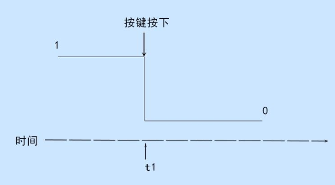
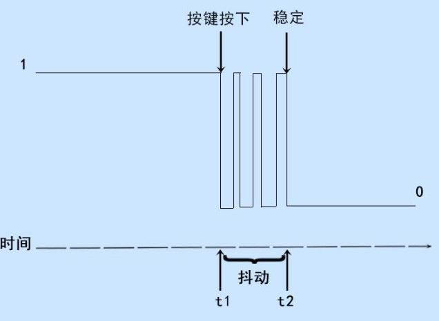
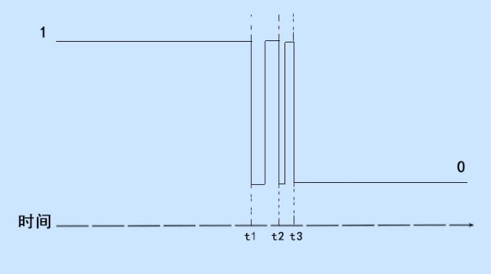
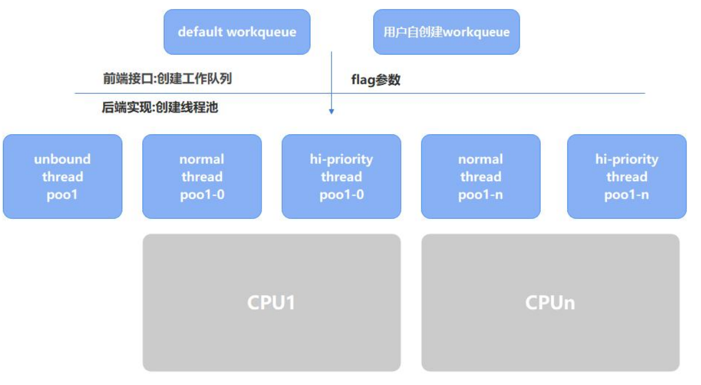

# 中断

中断是指在 CPU 正常运行期间，由外部或内部事件引起的一种机制。当中断发生时，CPU会停止当前正在执行的程序，并转而执行触发该中断的中断处理程序。处理完中断处理程序后，CPU 会返回到中断发生的地方，继续执行被中断的程序。中断机制允许 CPU 在实时响应外部或内部事件的同时，保持对其他任务的处理能力。

## 中断概念


中断机制赋予了我们处理意外情况的能力，而且如果我们能充分利用这个机制，就能够同时完成多个任务。

中断机制使我们能够有条不紊地同时处理多个任务，从而提高了并发处理能力。类似地，计算机系统中也使用中断机制来应对各种外部事件。例如，在键盘输入时，会发送一个中断信号给 CPU，以便及时响应用户的操作。这样，CPU 就不必一直轮询键盘的状态，而可以专注于其他任务。中断机制还可以用于处理硬盘读写完成、网络数据包接收等事件，提高了系统的资源利用率和并发处理能力。


### 中断的上下半部

**中断的执行需要快速响应**，但并不是所有中断都能迅速完成。如果中断处理时间过长，将会引发问题。

而为了让系统可以更好地处理中断事件，提高实时性和响应能力，将中断服务程序划分为上下文两部分：

- **中断上文  **是中断服务程序的第一部分，它主要**处理一些紧急且需要快速响应的任务**。
  - 特点是执行时间较短，旨在尽快完成对中断的处理。这些任务可能包括保存寄存器状态、更新计数器等，以便在中断处理完成后能够正确地返回到中断前的执行位置。
- **中断下文**  是中断服务程序的第二部分，它主要**处理一些相对耗时的任务**。
  - 由于中断上文需要尽快完成，因此中断下文负责处理那些不能立即完成的、需要更多时间的任务。这些任务可能包括复杂的计算、访问外部设备或进行长时间的数据处理等。


### 中断子系统框架

一个完整的中断子系统框架可以分为四个层次，由上到下分别为用户层、通用层、硬件相关层和硬件层，每个层相关的介绍如下所示：

- **用户层**：用户层是中断的使用者，主要包括各类设备驱动。

  这些驱动程序通过中断相关的接口进行中断的申请和注册。当外设触发中断时，用户层驱动程序会进行相应的回调处理，执行特定的操作。

- **通用层**：通用层也可称为框架层，它是硬件无关的层次。
  通用层的代码在所有硬件平台上都是通用的，不依赖于具体的硬件架构或中断控制器。通用层提供了统一的接口和功能，用于管理和处理中断，使得驱动程序能够在不同的硬件平台上复用。

- **硬件相关层**：硬件相关层包含两部分代码。
  一部分是与特定处理器架构相关的代码，比如ARM64 处理器的中断处理相关代码。这些代码负责处理特定架构的中断机制，包括中断向量表、中断处理程序等。另一部分是中断控制器的驱动代码，用于与中断控制器进行通信和配置。这些代码与具体的中断控制器硬件相关。

- **硬件层**：硬件层位于最底层，与具体的硬件连接相关。

  它包括外设与 SoC（系统片上芯片）的物理连接部分。中断信号从外设传递到中断控制器，由中断控制器统一管理和路由到处理器。硬件层的设计和实现决定了中断信号的传递方式和硬件的中断处理能力


### 中断控制器GIC


中断控制器 GIC（Generic Interrupt Controller）是中断子系统框架硬件层中的一个关键组件，用于管理和控制中断。它接收来自各种中断源的中断请求，并根据预先配置的中断优先级、屏蔽和路由规则，将中断请求分发给适当的处理器核心或中断服务例程。

GIC 是由 ARM 公司提出设计规范，当前有四个版本，GIC V1-v4。设计规范中最常用的有3 个版本 **V2.0、V3.1、V4.1**，GICv3 版本设计主要运行在 Armv8-A, Armv9-A 等架构上。

ARM 公司并给出一个实际的控制器设计参考，比如 GIC-400(支持 GIC v2 架构)、gic500(支持 GIC v3 架构)、GIC-600(支持 GIC v3 和 GIC v4 架构)。最终芯片厂商可以自己实现 GIC 或者直接购买 ARM提供的设计。

| **版本**  | **关键特性**                                                 | **常用核心**                                                 |
| --------- | ------------------------------------------------------------ | ------------------------------------------------------------ |
| **GICv1** | 支持最多 8 个处理器核心（PE） - 支持最多 1020 个中断 ID      | ARM Cortex-A5 MPCore, ARM Cortex-A9 MPCore, ARM Cortex-R7 MPCore |
| **GICv2** | 包含 GICv1 所有特性 - 支持虚拟化                             | ARM Cortex-A7 MPCore, ARM Cortex-A15 MPCore, ARM Cortex-A53 MPCore, ARM Cortex-A57 MPCore |
| **GICv3** | 包含 GICv2 所有特性 - 支持超过 8 个处理器核心 - 支持基于消息的中断 - 支持超过 1020 个中断 ID - CPU 接口寄存器的系统寄存器访问 - 增强的安全模型，分离安全和非安全的 Group 1 中断 | ARM Cortex-A53 MPCore, ARM Cortex-A57 MPCore, ARM Cortex-A72 MPCore |
| **GICv4** | 包含 GICv3 所有特性 - 支持虚拟中断的直接注入                 | ARM Cortex-A53 MPCore, ARM Cortex-A57 MPCore, ARM Cortex-A72 MPCore |

#### GICv3

RK3568使用的是GICv3


GIC 中断控制器可以分为 Distributor 接口、Redistributor 接口和 CPU 接口，下面是每个部分的说明：

##### Distributor 中断仲裁器

包含影响所有处理器核心中断的全局设置。包含以下编程接口：

- 启用和禁用 SPI。
- 设置每个 SPI 的优先级级别。
- 每个 SPI 的路由信息。
- 将每个 SPI 设置为电平触发或边沿触发。
- 生成基于消息的 SPI。
- 控制 SPI 的活动和挂起状态。
- 用于确定在每个安全状态中使用的程序员模型的控制（亲和性路由或遗留模型）。

##### Redistributor 重新分配器

对于每个连接的处理器核心（PE），都有一个重新分配器（Redistributor）。重新分配器提供以下编程接口：

- 启用和禁用 SGI（软件生成的中断）和 PPI（处理器专用中断）。
- 设置 SGI 和 PPI 的优先级级别。
- 将每个 PPI 设置为电平触发或边沿触发。
- 将每个 SGI 和 PPI 分配给一个中断组。
- 控制 SGI 和 PPI 的状态。
- 对支持关联 LPI（低功耗中断）的中断属性和挂起状态的内存中的数据结构进行基址控制。
- 支持与连接的处理器核心的电源管理。

##### CPU Interface

每个重新分配器都连接到一个 CPU 接口。CPU 接口提供以下编程接口：

- 通用控制和配置，用于启用中断处理。
- 确认中断。
- 执行中断的优先级降低和停用。
- 为处理器核心设置中断优先级屏蔽。
- 定义处理器核心的抢占策略。
- 确定处理器核心最高优先级的挂起中断。


##### 中断类型

GIC-V3 支持四种类型的中断，分别是 SGI、PPI、SPI 和 LPI，每个中断类型的介绍如下：

- **SGI（Software Generated Interrupt，软件生成中断）**：SGI 是通过向 GIC 中的 SGI 寄存器写入来生成的中断。它通常用于处理器之间的通信，允许一个 PE 发送中断给一个或多个指定的 PE，中断号 ID0 - ID15 用于 SGI。
- **PPI（Private Peripheral Interrupt，私有外设中断）**：针对特定 PE 的外设中断。不与其他 PE共享，中断号 ID16 - ID31 用于 PPI。
- **SPI（Shared Peripheral Interrupt，共享外设中断）**：全局外设中断，可以路由到指定的处理器核心（PE）或一组 PE，它允许多个 PE 接收同一个中断。中断号 ID32 - ID1019 用于 SPI，
- **LPI（Locality-specific Peripheral Interrupt，特定局部外设中断）**：LPI 是 GICv3 中引入的一种中断类型，与其他类型的中断有几个不同之处。LPI 总是基于消息的中断，其配置存储在内存表中，而不是寄存器中。

##### 中断状态


- **Inactive（非活动状态）**：中断源当前未被触发。
- **Pending（等待状态）**：中断源已被触发，但尚未被处理器核心确认。
- **Active（活动状态）**：中断源已被触发，并且已被处理器核心确认。
- **Active and Pending（活动且等待状态）**：已确认一个中断实例，同时另一个中断实例正在等待处理

##### 中断触发类型

**边沿触发（Edge-triggered）**
这是一种在检测到中断信号上升沿时触发的中断，然后无论信号状态如何，都保持触发状态，直到满足本规范定义的条件来清除中断。
**电平触发（Level-sensitive）**
这是一种在中断信号电平处于活动状态时触发的中断，并且在电平不处于活动状态时取消触发。


##### 中断号

在 linux 内核中，我们**使用 IRQ number 和 HW interrupt ID 两个 ID 来标识一个来自外设的中断**：

- **IRQ number**：CPU 需要为每一个外设中断编号，我们称之 IRQ Number。这个 I**RQ number是一个虚拟的 interrupt ID，和硬件无关，仅仅是被 CPU 用来标识一个外设中断**。
- **HW interrupt ID**：对于 GIC 中断控制器而言，它收集了多个外设的 interrupt request line 并向上传递，因此，GIC 中断控制器需要对外设中断进行编码。**GIC 中断控制器用 HW interrupt ID来标识外设的中断**。**如果只有一个 GIC 中断控制器，那 IRQ number 和 HW interrupt ID 是可以一一对应的**。

> 但如果是在 GIC 中断控制器级联的情况下，仅仅用 HW interrupt ID 就不能唯一标识一个外设中断，还需要知道该 HW interrupt ID 所属的 GIC 中断控制器（HW interrupt ID 在不同的Interrupt controller 上是会重复编码的）


对于驱动工程师而言，我们和 CPU 视角是一样的，我们只希望得到一个 IRQ number，而不关系具体是那个 GIC中断控制器上的那个 HW interrupt ID。这样一个好处是在中断相关的硬件发生变化的时候，驱动软件不需要修改。因此，**linux kernel 中的中断子系统需要提供一个将 HW interrupt ID 映射到IRQ number 上来的机制，也就是 irq domain**。


## 中断申请函数


### request_irq()

**include/linux/interrupt.h**

```c
/**
 * request_irq - Add a handler for an interrupt line
 * @irq:	The interrupt line to allocate
 * @handler:	Function to be called when the IRQ occurs.
 *		Primary handler for threaded interrupts
 *		If NULL, the default primary handler is installed
 * @flags:	Handling flags
 * @name:	Name of the device generating this interrupt
 * @dev:	A cookie passed to the handler function
 *
 * This call allocates an interrupt and establishes a handler; see
 * the documentation for request_threaded_irq() for details.
 */
static inline int __must_check
request_irq(unsigned int irq, irq_handler_t handler, unsigned long flags,
	    const char *name, void *dev)
{
	return request_threaded_irq(irq, handler, NULL, flags, name, dev);
}

```

| 项目             | 说明                                                         |
| ---------------- | ------------------------------------------------------------ |
| **函数定义**     | **int request_irq(unsigned int irq, irq_handler_t handler, unsigned long flags, const char *name, void \*dev);** |
| **头文件**       | `#include <linux/interrupt.h>`                               |
| **参数 irq**     | 需要分配的中断线（IRQ）编号                                  |
| **参数 handler** | 当中断发生时调用的处理函数（对于线程中断，主处理程序）       |
| **参数 flags**   | 处理中断时使用的标志位                                       |
| **参数 name**    | 生成中断的设备名称                                           |
| **参数 dev**     | 传递给处理函数的上下文信息（通常是设备上下文）               |
| **功能**         | 为指定的中断线分配一个处理程序。对于线程化中断，使用 `request_threaded_irq()` 实现。 |
| **返回值**       | 成功时返回 0；失败时返回负错误代码。                         |

- **irq** 参数用来指定要请求的中断号，例如gpio中断号需要通过 gpio_to_irq 函数映射 GPIO 引脚来获得。
- **irq_handler_t handler** 参数是一个函数指针，指向了中断处理程序的函数。中断处理程序是在中断事件发生时调用的函数，用于处理中断事件。
- **unsigned long flags**：中断处理程序的标志位
  - **IRQF_TRIGGER_NONE**：无触发方式，表示中断不会被触发。
  - **IRQF_TRIGGER_RISING**：上升沿触发方式，表示中断在信号上升沿时触发。
  - **IRQF_TRIGGER_FALLING**：下降沿触发方式，表示中断在信号下降沿时触发。
  - **IRQF_TRIGGER_HIGH**：高电平触发方式，表示中断在信号为高电平时触发。
  - **IRQF_TRIGGER_LOW**：低电平触发方式，表示中断在信号为低电平时触发。
  - **IRQF_SHARED**：中断共享方式，表示中断可以被多个设备共享使用。

```c
#define IRQF_TRIGGER_NONE	0x00000000
#define IRQF_TRIGGER_RISING	0x00000001
#define IRQF_TRIGGER_FALLING	0x00000002
#define IRQF_TRIGGER_HIGH	0x00000004
#define IRQF_TRIGGER_LOW	0x00000008
#define IRQF_TRIGGER_MASK	(IRQF_TRIGGER_HIGH | IRQF_TRIGGER_LOW | \
				 IRQF_TRIGGER_RISING | IRQF_TRIGGER_FALLING)
#define IRQF_TRIGGER_PROBE	0x00000010
```

例子：

```c
irq_num = gpio_to_irq(GPIO_PIN);

if (request_irq(irq_num, gpio_irq_handler, IRQF_TRIGGER_RISING,
			"irq_test", NULL) != 0) {
		printk(KERN_ERR "Failed to request IRQ %d\n", irq_num);

		// 请求中断失败，释放GPIO引脚
		gpio_free(GPIO_PIN);
		return -ENODEV;
}
```


### gpio_to_irq()

**include/linux/gpio.h**

```c
static inline int gpio_to_irq(unsigned int gpio)
{
	return __gpio_to_irq(gpio);
}
```

gpio_to_irq 函数用于**将 GPIO 引脚的编号（GPIO pin number）转换为对应的中断请求号（interrupt request number）**。

| 项目          | 说明                                                         |
| ------------- | ------------------------------------------------------------ |
| **函数定义**  | **int gpio_to_irq(unsigned int gpio);**                      |
| **头文件**    | `#include <linux/gpio.h>`                                    |
| **参数 gpio** | GPIO（通用输入输出）编号                                     |
| **功能**      | 将一个 GPIO 引脚转换为对应的中断线编号。该函数依赖于底层实现的 `__gpio_to_irq()` 来进行转换。 |
| **返回值**    | 对应的中断线编号，若转换失败则返回负值。                     |

### free_irq()

**include/linux/interrupt.h**

```c
extern const void *free_irq(unsigned int, void *);
```

| 项目            | 说明                                                         |
| --------------- | ------------------------------------------------------------ |
| **函数定义**    | **void free_irq(unsigned int irq, void \*dev_id);**          |
| **头文件**      | `#include <linux/interrupt.h>`                               |
| **参数 irq**    | 要释放的中断线编号                                           |
| **参数 dev_id** | 与该中断关联的设备上下文（通常是设备的指针或标识符）         |
| **功能**        | 释放一个已分配的中断线，取消与该中断线相关联的中断处理函数。 |
| **返回值**      | 无返回值。                                                   |

### 中断处理函数

**include/linux/interrupt.h**

```c
typedef irqreturn_t (*irq_handler_t)(int, void *);
```

- 函数功能：

  handler 函数是一个中断服务函数，用于处理特定中断事件。它在中断事件发生时被操作系统或硬件调用，执行必要的操作来响应和处理中断请求。

- 参数说明：

  - irq：表示中断号或中断源的标识符。它指示引发中断的硬件设备或中断控制器。
  - dev_id：是一个 void 类型的指针，用于传递设备特定的数据或标识符。它通常用于在中断处理程序中区分不同的设备或资源。

- 返回值：

  - **irqreturn_t** 是一个特定类型的枚举值，**用于表示中断服务函数的返回状态**。它可以有以下几种取值：
    - **IRQ_NONE**：表示中断服务函数未处理该中断，中断控制器可以继续处理其他中断请求。
    - **IRQ_HANDLED**：表示中断服务函数已成功处理该中断，中断控制器无需进一步处理。
    - **IRQ_WAKE_THREAD**：表示中断服务函数已处理该中断，并且请求唤醒一个内核线程来继续执行进一步的处理。这在一些需要长时间处理的中断情况下使用

### 示例

iTOP-RK3568 有 5 组 GPIO bank：GPIO0~GPIO4，每组又以 A0~A7, B0~B7, C0~C7, D0~D7 作为编号区分,常用以下公式计算引脚：
LCD 触摸屏对应的中断引脚标号为 TP_INT_L_GPIO3_A5，对应的计算过程如下所示：

**GPIO pin 脚计算公式**：

$$pin = bank * 32 + number$$

**GPIO 小组编号计算公式：**

$$number = group * 8 + X$$


GPIO3_A5=> 3, bank=3, group=0, X=5

```c
#include <linux/module.h>
#include <linux/init.h>
#include <linux/gpio.h>
#include <linux/interrupt.h>

#define GPIO_PIN 101

// 中断处理函数
static irqreturn_t gpio_irq_handler(int irq, void *dev_id)
{
    printk(KERN_INFO "Interrupt occurred on GPIO %d\n", GPIO_PIN);
    printk(KERN_INFO "This is irq_handler\n");
    return IRQ_HANDLED;
}

static int __init interrupt_init(void)
{
    int irq_num;

    printk(KERN_INFO "Initializing GPIO Interrupt Driver\n");

    // 将GPIO引脚映射到中断号
    irq_num = gpio_to_irq(GPIO_PIN);
    printk(KERN_INFO "GPIO %d mapped to IRQ %d\n", GPIO_PIN, irq_num);

    // 请求中断
    if (request_irq(irq_num, gpio_irq_handler, IRQF_TRIGGER_RISING, "irq_test", NULL) != 0) {
        printk(KERN_ERR "Failed to request IRQ %d\n", irq_num);

        // 请求中断失败，释放GPIO引脚
        gpio_free(GPIO_PIN);
        return -ENODEV;
    }
    return 0;
}

static void __exit interrupt_exit(void)
{
    int irq_num = gpio_to_irq(GPIO_PIN);

    // 释放中断
    free_irq(irq_num, NULL);
    printk(KERN_INFO "GPIO Interrupt Driver exited successfully\n");
}

module_init(interrupt_init);
module_exit(interrupt_exit);

MODULE_LICENSE("GPL");
MODULE_AUTHOR("topeet");
```


## 中断申请流程


### request_irq()

**include/linux/irq.h**

```c
static inline int __must_check
request_irq(unsigned int irq, irq_handler_t handler, unsigned long flags,
	    const char *name, void *dev)
{
	return request_threaded_irq(irq, handler, NULL, flags, name, dev);
}
```

### request_threaded_irq()

**kernel/irq/manage.c**

request_threaded_irq 函数是 Linux 内核提供的一个功能强大的函数，用于请求分配一个中断，并将中断处理程序与该中断关联起来。该函数的主要作用是在系统中注册中断处理函数，以响应对应中断的发生。

以下是 request_threaded_irq 函数的功能和作用的详细介绍：

- **中断请求**：request_threaded_irq 函数用于请求一个中断。它会向内核注册对应中断号的中断处理函数，并为该中断分配必要的资源。中断号是标识特定硬件中断的唯一标识符。
- **中断处理函数关联**：通过 handler 参数，将中断处理函数与中断号关联起来。中断处理函数是一个预定义的函数，用于处理中断事件。当中断发生时，内核将调用该函数来处理中断事件。
- **线程化中断处理**：request_threaded_irq 函数还支持使用线程化中断处理函数。通过指定 thread_fn 参数，可以在一个内核线程上下文中异步执行较长时间的中断处理或延迟敏感的工作。这有助于避免在中断上下文中阻塞时间过长。
- **中断属性设置**：通过 irqflags 参数，可以设置中断处理的各种属性和标志。例如，可以指定中断触发方式（上升沿、下降沿、边沿触发等）、中断类型（边沿触发中断、电平触发中断等）以及其他特定的中断行为。
- **设备标识关联**：通过 dev_id 参数，可以将中断处理与特定设备关联起来。这样可以在中断处理函数中访问与设备相关的数据。设备标识符可以是指向设备结构体或其他与设备相关的数据的指针。
- **错误处理**：request_threaded_irq 函数会返回一个整数值，用于指示中断请求的结果。如果中断请求成功，返回值为 0；如果中断请求失败，则返回一个负数错误代码，表示失败的原因。

```c
int request_threaded_irq(unsigned int irq, irq_handler_t handler,
			 irq_handler_t thread_fn, unsigned long irqflags,
			 const char *devname, void *dev_id)
{
	struct irqaction *action;// 中断动作结构体指针
	struct irq_desc *desc;// 中断描述符指针
	int retval; // 返回值
// 检查中断号是否为未连接状态
	if (irq == IRQ_NOTCONNECTED)
		return -ENOTCONN;

	/*
	 * Sanity-check: shared interrupts must pass in a real dev-ID,
	 * otherwise we'll have trouble later trying to figure out
	 * which interrupt is which (messes up the interrupt freeing
	 * logic etc).
	 *
	 * Also shared interrupts do not go well with disabling auto enable.
	 * The sharing interrupt might request it while it's still disabled
	 * and then wait for interrupts forever.
	 *
	 * Also IRQF_COND_SUSPEND only makes sense for shared interrupts and
	 * it cannot be set along with IRQF_NO_SUSPEND.
	 */
    // 检查中断标志的有效性
	if (((irqflags & IRQF_SHARED) && !dev_id) ||
	    ((irqflags & IRQF_SHARED) && (irqflags & IRQF_NO_AUTOEN)) ||
	    (!(irqflags & IRQF_SHARED) && (irqflags & IRQF_COND_SUSPEND)) ||
	    ((irqflags & IRQF_NO_SUSPEND) && (irqflags & IRQF_COND_SUSPEND)))
		return -EINVAL;
// 获取中断号的中断描述符
	desc = irq_to_desc(irq);
	if (!desc)
		return -EINVAL;
// 检查中断设置是否可以进行中断请求，以及是否为每个 CPU 分配唯一设备 ID
	if (!irq_settings_can_request(desc) ||
	    WARN_ON(irq_settings_is_per_cpu_devid(desc)))
		return -EINVAL;
// 如果未指定中断处理函数，则使用默认的主处理函数
	if (!handler) {
		if (!thread_fn)
			return -EINVAL;
		handler = irq_default_primary_handler;
	}
// 分配并初始化中断动作数据结构
	action = kzalloc(sizeof(struct irqaction), GFP_KERNEL);
	if (!action)
		return -ENOMEM;

	action->handler = handler;// 中断处理函数
	action->thread_fn = thread_fn;// 线程处理函数
	action->flags = irqflags;// 中断标志
	action->name = devname;// 设备名称
	action->dev_id = dev_id;// 设备 ID

    // 获取中断的电源管理引用计数
	retval = irq_chip_pm_get(&desc->irq_data);
	if (retval < 0) {
		kfree(action);
		return retval;
	}
// 设置中断并将中断动作与中断描述符关联
	retval = __setup_irq(irq, desc, action);
// 处理中断设置失败的情况
	if (retval) {
		irq_chip_pm_put(&desc->irq_data);//调用 irq_chip_pm_put 函数释放中断的电源管理引用计数
		kfree(action->secondary);//释放次要中断动作的内存空间
		kfree(action);//释放中断动作的内存空间
	}

#ifdef CONFIG_DEBUG_SHIRQ_FIXME
	if (!retval && (irqflags & IRQF_SHARED)) {
		/*
		 * It's a shared IRQ -- the driver ought to be prepared for it
		 * to happen immediately, so let's make sure....
		 * We disable the irq to make sure that a 'real' IRQ doesn't
		 * run in parallel with our fake.
		 */
		unsigned long flags;

		disable_irq(irq);
		local_irq_save(flags);

		handler(irq, dev_id);

		local_irq_restore(flags);
		enable_irq(irq);
	}
#endif
	return retval;
}
EXPORT_SYMBOL(request_threaded_irq);
```

### irq_desc 结构体

**include/linux/irqdesc.h**

irq_desc 结构体是 Linux 内核中用于描述中断的数据结构之一。每个硬件中断都有一个对应的 irq_desc 实例，它用于记录与该中断相关的各种信息和状态。该结构体的主要功能是管理中断处理函数、中断行为以及与中断处理相关的其他数据。

```c
struct irq_desc {
    struct irq_common_data irq_common_data;  // 常见的中断数据，包含了中断的标识、类型等信息。
    struct irq_data irq_data;                // 具体的中断数据，包括中断的状态、触发方式等。
    
    unsigned int __percpu *kstat_irqs;       // 该中断的统计信息，每个 CPU 上的统计数据。
    
    irq_flow_handler_t handle_irq;           // 中断处理程序的指针，处理该中断的实际函数。
    
    struct irqaction *action;                // 中断处理动作链表，用于存储关联的中断处理程序。
    
    unsigned int status_use_accessors;       // 状态字段，指示是否通过访问器来读取/修改状态。
    
    unsigned int core_internal_state__do_not_mess_with_it;  // 内部状态字段，直接操作可能会导致不稳定。
    
    unsigned int depth;                      // 嵌套中断禁用的计数器。
    
    unsigned int wake_depth;                 // 嵌套的唤醒使能的计数器。
    
    unsigned int tot_count;                  // 中断的总计数。
    
    unsigned int irq_count;                  // 用于检测有问题的中断计数。
    
    unsigned long last_unhandled;            // 处理未被处理的中断的计时器。
    
    unsigned int irqs_unhandled;             // 记录未被处理的中断次数。
    
    atomic_t threads_handled;                // 原子计数，表示处理的线程数。
    
    int threads_handled_last;                // 上次处理的线程数（用于调试/统计）。
    
    raw_spinlock_t lock;                     // 用于保护该中断描述符的自旋锁。
    
    struct cpumask *percpu_enabled;          // 每个 CPU 上启用的 CPU 掩码。
    
    const struct cpumask *percpu_affinity;   // 每个 CPU 上的中断亲和性掩码。
    
#ifdef CONFIG_SMP
    const struct cpumask *affinity_hint;     // 中断亲和性的提示。
    struct irq_affinity_notify *affinity_notify;  // 处理亲和性变更的通知结构体。
    
#ifdef CONFIG_GENERIC_PENDING_IRQ
    cpumask_var_t pending_mask;              // 表示当前有待处理的中断掩码。
#endif
#endif
    
    unsigned long threads_oneshot;           // 用于记录一次性线程的状态。
    
    atomic_t threads_active;                 // 当前活跃的线程数（原子操作）。
    
    wait_queue_head_t wait_for_threads;      // 等待线程处理的队列头。
    
#ifdef CONFIG_PM_SLEEP
    unsigned int nr_actions;                // 中断处理动作的数量（与电源管理相关）。
    unsigned int no_suspend_depth;           // 中断不能在何时挂起的深度。
    unsigned int cond_suspend_depth;         // 有条件地挂起的深度。
    unsigned int force_resume_depth;         // 强制恢复的深度。
#endif
    
#ifdef CONFIG_PROC_FS
    struct proc_dir_entry *dir;             // 中断的 proc 文件系统入口，用于调试和监控。
#endif
    
#ifdef CONFIG_GENERIC_IRQ_DEBUGFS
    struct dentry *debugfs_file;            // 中断的 debugfs 文件入口，用于调试。
    const char *dev_name;                   // 设备的名称，通常用于调试。
#endif
    
#ifdef CONFIG_SPARSE_IRQ
    struct rcu_head rcu;                    // 用于延迟释放中断资源的 RCU 头。
    struct kobject kobj;                    // 内核对象，用于关联和管理该中断描述符。
#endif
    
    struct mutex request_mutex;             // 请求中断时的互斥锁，保护中断请求的并发访问。
    
    int parent_irq;                          // 如果该中断是子中断，它的父中断 ID。
    
    struct module *owner;                   // 关联的模块指针，表示该中断由哪个模块负责。
    
    const char *name;                       // 中断的名称，便于调试和识别。
} ____cacheline_internodealigned_in_smp;  // 用于确保该结构体在 SMP（对称多处理）系统中的缓存对齐。

```

 irq_desc 结构体的主要作用和功能：

- **中断处理函数管理**：irq_desc 结构体中的 handle_irq 字段保存中断处理函数的指针。当硬件触发中断时，内核会调用该函数来处理中断事件。
- **中断行为管理**：irq_desc 结构体中的 action 字段是一个指向中断行为列表的指针。中断行为是一组回调函数，用于注册、注销和处理与中断相关的事件。
- **中断统计信息**：irq_desc 结构体中的 kstat_irqs 字段是一个指向中断统计信息的指针。该信息用于记录中断事件的发生次数和处理情况，可以帮助分析中断的性能和行为。
- **中断数据管理**：irq_desc 结构体中的 irq_data 字段保存了与中断相关的数据，如中断号、中断类型等。这些数据用于识别和管理中断。
- **通用中断数据管理**：irq_desc 结构体中的 irq_common_data 字段保存了与中断处理相关的通用数据，如中断控制器、中断屏蔽等。这些数据用于处理和控制中断的行为。
- **中断状态管理**：irq_desc 结构体中的其他字段用于管理中断的状态，如嵌套中断禁用计数、唤醒使能计数等。这些状态信息帮助内核跟踪和管理中断的状态变化。通过使用 irq_desc 结构体，内核可以有效地管理和处理系统中的硬件中断。它提供了一个统一的接口，用于注册和处理中断处理函数、管理中断行为，并提供了必要的信息和数据结构来监视和控制中断的行为和状态。

在 irq_desc 结构体中最重要的就是 action 字段。

### irqaction 结构体

**include/linux/interrupt.h**

irqaction 结构体是 Linux 内核中用于描述中断行为的数据结构之一。它用于定义中断处理过程中的回调函数和相关属性。irqaction 结构体的主要功能是管理与特定中断相关的行为和处理函数。

```c
struct irqaction {
    irq_handler_t handler;                 // 中断处理函数的指针。用于处理中断的回调函数，通常是一个普通的中断服务程序（ISR）。
    
    void *dev_id;                           // 设备 ID。通常是一个指向设备结构的指针（或其他类型的标识符），用于唯一标识中断关联的设备。
    
    void __percpu *percpu_dev_id;           // 每个 CPU 上的设备 ID，适用于多处理器系统，存储每个 CPU 上的设备标识。
    
    struct irqaction *next;                 // 用于共享中断的链接。每个中断号可能对应多个 irqaction，这个字段指向下一个 irqaction。
    
    irq_handler_t thread_fn;                // 线程化中断的处理函数。对于线程化中断，`thread_fn` 用于处理相关的工作。
    
    struct task_struct *thread;             // 线程指针。对于线程化中断，这个字段指向分配给该中断的线程。
    
    struct irqaction *secondary;            // 指向 secondary irqaction 的指针。用于强制将某些中断操作放入线程中处理。
    
    unsigned int irq;                       // 中断号，标识该 irqaction 关联的中断。
    
    unsigned int flags;                     // 中断标志。`IRQF_*` 标志用于控制中断的行为，如是否允许共享、是否在内核线程中处理等。
    
    unsigned long thread_flags;             // 线程标志，表示与线程化中断相关的设置或状态。
    
    unsigned long thread_mask;              // 线程掩码，用于跟踪线程的活动状态。
    
    const char *name;                       // 中断处理动作的名称，通常是设备的名称，用于调试和标识。
    
    struct proc_dir_entry *dir;             // 指向 proc 文件系统的条目，用于在 `/proc/irq/NN/name` 中显示中断信息。
} ____cacheline_internodealigned_in_smp;    // 确保在多核系统中该结构体按照缓存行对齐。
```

以下是 irqaction 结构体的主要作用和功能：

- **中断处理函数管理**：irqaction 结构体中的 handler 字段保存中断处理函数的指针。该函数在中断发生时被调用，用于处理中断事件。
- **中断处理标志管理**：irqaction 结构体中的 flags 字段用于指定中断处理的各种属性和标志。这些标志控制中断处理的行为，例如触发方式、中断类型等。
- **设备标识符管理**：irqaction 结构体中的 dev_id 字段用于保存与中断处理相关的设备标识符。它可以是指向设备结构体或其他与设备相关的数据的指针，用于将中断处理与特定设备关联起来。
- **中断行为链表管理**：irqaction 结构体中的 next 字段是一个指向下一个 irqaction 结构体的指针，用于构建中断行为的链表。这样可以将多个中断处理函数链接在一起，以便在中断发生时按顺序调用它们

## tasklet

在 Linux 内核中，**tasklet 是一种特殊的软中断机制**，被广泛用于处理中断下文相关的任务。

它是一种常见且有效的方法，在多核处理系统上可以避免并发问题。Tasklet 绑定的函数在同一时间只能在一个 CPU 上运行，因此不会出现并发冲突。

然而，需要注意的是，tasklet 绑定的函数中不能调用可能导致休眠的函数，否则可能引起内核异常。

> This API is deprecated.

**include/linux/interrupt.h**

```c
/* Tasklets --- multithreaded analogue of BHs.

   This API is deprecated. Please consider using threaded IRQs instead:
   https://lore.kernel.org/lkml/20200716081538.2sivhkj4hcyrusem@linutronix.de

   Main feature differing them of generic softirqs: tasklet
   is running only on one CPU simultaneously.

   Main feature differing them of BHs: different tasklets
   may be run simultaneously on different CPUs.

   Properties:
   * If tasklet_schedule() is called, then tasklet is guaranteed
     to be executed on some cpu at least once after this.
   * If the tasklet is already scheduled, but its execution is still not
     started, it will be executed only once.
   * If this tasklet is already running on another CPU (or schedule is called
     from tasklet itself), it is rescheduled for later.
   * Tasklet is strictly serialized wrt itself, but not
     wrt another tasklets. If client needs some intertask synchronization,
     he makes it with spinlocks.
 */

struct tasklet_struct
{
	struct tasklet_struct *next;
	unsigned long state;
	atomic_t count;
	bool use_callback;
	union {
		void (*func)(unsigned long data);
		void (*callback)(struct tasklet_struct *t);
	};
	unsigned long data;
};

#define DECLARE_TASKLET(name, _callback)		\
struct tasklet_struct name = {				\
	.count = ATOMIC_INIT(0),			\
	.callback = _callback,				\
	.use_callback = true,				\
}

#define DECLARE_TASKLET_DISABLED(name, _callback)	\
struct tasklet_struct name = {				\
	.count = ATOMIC_INIT(1),			\
	.callback = _callback,				\
	.use_callback = true,				\
}

#define from_tasklet(var, callback_tasklet, tasklet_fieldname)	\
	container_of(callback_tasklet, typeof(*var), tasklet_fieldname)

#define DECLARE_TASKLET_OLD(name, _func)		\
struct tasklet_struct name = {				\
	.count = ATOMIC_INIT(0),			\
	.func = _func,					\
}

#define DECLARE_TASKLET_DISABLED_OLD(name, _func)	\
struct tasklet_struct name = {				\
	.count = ATOMIC_INIT(1),			\
	.func = _func,					\
}
```

tasklet_struct 结构体包含以下成员：

- next:指向下一个 tasklet 的指针，用于形成链表结构，以便内核中可以同时管理多个tasklet。
- state:表示 tasklet 的当前状态。
- count:用于引用计数，用于确保 tasklet 在多个地方调度或取消调度时的正确处理。
- func:指向 tasklet 绑定的函数的指针，该函数将在 tasklet 执行时被调用。
- data:传递给 tasklet 绑定函数的参数

此外，为了方便，还定义了 tasklet_t 类型作为 struct tasklet_struct 的别名。这样我们可以使用 tasklet_t 来声明 tasklet 变量，而不是直接使用 struct tasklet_struct。

### 静态初始化 DECLARE_TASKLET

```c
#define DECLARE_TASKLET(name, _callback)		\
struct tasklet_struct name = {				\
	.count = ATOMIC_INIT(0),			\
	.callback = _callback,				\
	.use_callback = true,				\
}
```

其中，name 是 tasklet 的名称，func 是 tasklet 的处理函数，data 是传递给处理函数的参数。初始化状态为使能状态。


```c
#define DECLARE_TASKLET_DISABLED(name, _callback)	\
struct tasklet_struct name = {				\
	.count = ATOMIC_INIT(1),			\
	.callback = _callback,				\
	.use_callback = true,				\
}
```

其中，name 是 tasklet 的名称，func 是 tasklet 的处理函数，data 是传递给处理函数的参数。初始化状态为非使能状态。


**示例**

```c
#include <linux/interrupt.h>

// 定义 tasklet 处理函数
void my_tasklet_handler(unsigned long data)
{
	// Tasklet 处理逻辑
	// ...
}

// 静态初始化 tasklet
DECLARE_TASKLET(my_tasklet, my_tasklet_handler, 0);
// 驱动程序的其他代码
```

在上述示例中，my_tasklet 是 tasklet 的名称，my_tasklet_handler 是 tasklet 的处理函数，0是传递给处理函数的参数。

但是需要注意的是，**使用 DECLARE_TASKLET 静态初始化的 tasklet无法在运行时动态销毁**，因此在不需要 tasklet 时，应该避免使用此方法。如果需要在运行时销毁 tasklet，应使用 tasklet_init 和 tasklet_kill 函数进行动态初始化和销毁。

### 动态初始化 task_init

```c
extern void tasklet_init(struct tasklet_struct *t,
			 void (*func)(unsigned long), unsigned long data);
```

其中，t 是指向 tasklet 结构体的指针，func 是 tasklet 的处理函数，data 是传递给处理函数的参数

**示例**

```c
#include <linux/interrupt.h>
// 定义 tasklet 处理函数
void my_tasklet_handler(unsigned long data)
{
	// Tasklet 处理逻辑
	// ...
}

// 声明 tasklet 结构体
static struct tasklet_struct my_tasklet;

// 初始化 tasklet
tasklet_init(&my_tasklet, my_tasklet_handler, 0);
// 驱动程序的其他代码
```

在示例中，我们首先定义了 my_tasklet_handler 作为 tasklet 的处理函数。然后，声明了一个名为 my_tasklet 的 tasklet 结构体。接下来，通过调用 tasklet_init 函数，进行动态初始化。

通过使用 tasklet_init 函数，我们可以在运行时动态创建和初始化 tasklet。这样，我们可以根据需要灵活地管理和控制 tasklet 的生命周期。在不再需要 tasklet 时，可以使用 tasklet_kill函数进行销毁，以释放相关资源。

### 关闭函数 tasklet_disable

```c
static inline void tasklet_disable(struct tasklet_struct *t)
{
	tasklet_disable_nosync(t);
	tasklet_unlock_wait(t);
	smp_mb();
}
```

其中，t 是指向 tasklet 结构体的指针。

**示例**

```c
#include <linux/interrupt.h>

// 定义 tasklet 处理函数
void my_tasklet_handler(unsigned long data)
{
	// Tasklet 处理逻辑
	// ...
}

// 声明 tasklet 结构体
static struct tasklet_struct my_tasklet;

// 初始化 tasklet
tasklet_init(&my_tasklet, my_tasklet_handler, 0);

// 关闭 tasklet
tasklet_disable(&my_tasklet);

// 驱动程序的其他代码
```

在上述示例中，我们首先定义了 my_tasklet_handler 作为 tasklet 的处理函数。然后，声明了一个名为 my_tasklet 的 tasklet 结构体，并使用 tasklet_init 函数对其进行初始化。

最后，通过调用 tasklet_disable 函数，我们关闭了 my_tasklet。

关闭 tasklet 后，即使调用 tasklet_schedule 函数触发 tasklet，tasklet 的处理函数也不会再被执行。这可以**用于临时暂停或停止 tasklet 的执行，直到再次启用**（通过调用 tasklet_enable函数）。

需要注意的是，关闭 tasklet 并不会销毁 tasklet 结构体，因此可以随时通过调用tasklet_enable 函数重新启用 tasklet，或者调用tasklet_kill 函数来销毁 tasklet

### 使能函数 tasklet_enable

```c
static inline void tasklet_enable(struct tasklet_struct *t)
{
	smp_mb__before_atomic();
	atomic_dec(&t->count);
}
```

其中，t 是指向 tasklet 结构体的指针

**示例**

```c
#include <linux/interrupt.h>

// 定义 tasklet 处理函数
void my_tasklet_handler(unsigned long data)
{
	// Tasklet 处理逻辑
	// ...
}

// 声明 tasklet 结构体
static struct tasklet_struct my_tasklet;

// 初始化 tasklet
tasklet_init(&my_tasklet, my_tasklet_handler, 0);

// 使能 tasklet
tasklet_enable(&my_tasklet);
```

使能 tasklet 后，如果调用 tasklet_schedule 函数触发 tasklet，则 tasklet 的处理函数将会被执行。这样，tasklet 将开始按计划执行其处理逻辑。

需要注意的是，使能 tasklet 并不会自动触发 tasklet 的执行，而是通过调用 tasklet_schedule函数来触发。同时，可以使用 tasklet_disable 函数来临时暂停或停止 tasklet 的执行。

如果需要永久停止 tasklet 的执行并释放相关资源，则应调用 tasklet_kill 函数来销毁 tasklet。


### 调度函数 tasklet_schedule

```c
extern void __tasklet_schedule(struct tasklet_struct *t);

static inline void tasklet_schedule(struct tasklet_struct *t)
{
	if (!test_and_set_bit(TASKLET_STATE_SCHED, &t->state))
		__tasklet_schedule(t);
}

extern void __tasklet_hi_schedule(struct tasklet_struct *t);

static inline void tasklet_hi_schedule(struct tasklet_struct *t)
{
	if (!test_and_set_bit(TASKLET_STATE_SCHED, &t->state))
		__tasklet_hi_schedule(t);
}
```

其中，t 是指向 tasklet 结构体的指针。	

**示例**

```c
#include <linux/interrupt.h>
// 定义 tasklet 处理函数
void my_tasklet_handler(unsigned long data)
{
	// Tasklet 处理逻辑
	// ...
}

// 声明 tasklet 结构体
static struct tasklet_struct my_tasklet;
// 初始化 tasklet
tasklet_init(&my_tasklet, my_tasklet_handler, 0);
// 调度 tasklet 执行
tasklet_schedule(&my_tasklet);
// 驱动程序的其他代码
```

需要注意的是，调度 tasklet 只是将 tasklet 标记为需要执行，并不会立即执行 tasklet 的处理函数。实际的执行时间取决于内核的调度和处理机制。


### 销毁函数 tasklet_kill

```c
extern void tasklet_kill(struct tasklet_struct *t);
extern void tasklet_kill_immediate(struct tasklet_struct *t, unsigned int cpu);
```

其中，t 是指向 tasklet 结构体的指针

**示例**

```c
#include <linux/interrupt.h>
// 定义 tasklet 处理函数
void my_tasklet_handler(unsigned long data)
{
	// Tasklet 处理逻辑
	// ...
}

// 声明 tasklet 结构体
static struct tasklet_struct my_tasklet;
// 初始化 tasklet
tasklet_init(&my_tasklet, my_tasklet_handler, 0);
tasklet_disable(&my_tasklet);
// 销毁 tasklet
tasklet_kill(&my_tasklet);
// 驱动程序的其他代码
```

调用 tasklet_kill 函数会释放 tasklet 所占用的资源，并将 tasklet 标记为无效。因此，销毁后的 tasklet 不能再被使用。

需要 注意 的是 ，**在 销毁 tasklet 之前，应该确保该 tasklet 已经被失能**（通过调用tasklet_disable 函数）。否则，销毁一个正在执行的 tasklet 可能导致内核崩溃或其他错误。

一旦销毁了 tasklet，如果需要再次使用 tasklet，需要重新进行初始化（通过调用 tasklet_init函数）

### 示例

```c
#include <linux/module.h>
#include <linux/init.h>
#include <linux/interrupt.h>
#include <linux/gpio.h>


int irq;
struct tasklet_struct mytasklet;

// 定义tasklet处理函数
void mytasklet_func(unsigned long data)
{
  printk("data is %ld\n", data);
}

// 中断处理函数
irqreturn_t test_interrupt(int irq, void *args)
{
  printk("This is test_interrupt\n");
  tasklet_schedule(&mytasklet); // 调度tasklet执行
  return IRQ_RETVAL(IRQ_HANDLED);
}
// 模块初始化函数
static int interrupt_irq_init(void)
{
  int ret;
  irq = gpio_to_irq(101); // 将GPIO转换为中断号
  printk("irq is %d\n", irq);

  // 请求中断
  ret = request_irq(irq, test_interrupt, IRQF_TRIGGER_RISING, "test", NULL);
  if (ret < 0)
  {
    printk("request_irq is error\n");
    return -1;
  }
  // 初始化tasklet
  tasklet_init(&mytasklet, mytasklet_func, 1);
  tasklet_enable(&mytasklet);
  return 0;
}
// 模块退出函数
static void interrupt_irq_exit(void)
{

  free_irq(irq, NULL);
  tasklet_disable(&mytasklet);
  tasklet_kill(&mytasklet);   // 销毁tasklet
  printk("bye bye\n");
}

module_init(interrupt_irq_init); // 指定模块的初始化函数
module_exit(interrupt_irq_exit); // 指定模块的退出函数

MODULE_LICENSE("GPL");   // 模块使用的许可证
MODULE_AUTHOR("topeet"); // 模块的作者
```

## 软中断

> **软件中断（software interrupt）= 由软件触发的“异常/中断”机制，用于进入内核。**
>
> **软中断（softirq）= Linux 内核内部的一种“下半部”执行机制，用于处理高频短任务。**

软中断是 Linux 内核提供的一种**中断下半部机制**，用于执行高频、可延后的任务。

**它不是 CPU 的中断，也不是异常，是内核自己的调度机制。**

**include/linux/interrupt.h**

```c
enum
{
	HI_SOFTIRQ=0,
	TIMER_SOFTIRQ,
	NET_TX_SOFTIRQ,
	NET_RX_SOFTIRQ,
	BLOCK_SOFTIRQ,
	IRQ_POLL_SOFTIRQ,
	TASKLET_SOFTIRQ,
	SCHED_SOFTIRQ,
	HRTIMER_SOFTIRQ,
	RCU_SOFTIRQ,    /* Preferable RCU should always be the last softirq */

	NR_SOFTIRQS
};
```

以上代码定义了一个枚举类型，用于标识软中断的不同类型或优先级。每个枚举常量对应一个特定的软中断类型。

枚举常量的含义：

- HI_SOFTIRQ：高优先级软中断
- TIMER_SOFTIRQ：定时器软中断
- NET_TX_SOFTIRQ：网络传输发送软中断
- NET_RX_SOFTIRQ：网络传输接收软中断
- BLOCK_SOFTIRQ：块设备软中断
- IRQ_POLL_SOFTIRQ：中断轮询软中断
- **TASKLET_SOFTIRQ**：任务软中断
- CHED_SOFTIRQ：调度软中断
- HRTIMER_SOFTIRQ, /* Unused, but kept as tools rely on the numbering. Sigh! */*
- *RCU_SOFTIRQ,/* Preferable RCU should always be the last softirq */
- **NR_SOFTIRQS**：**表示软中断的总数，用于指示软中断类型的数据**

中断号的优先级越小，代表优先级越高。在驱动代码中，我们可以使用 Linux 驱动代码中上述的软中断，当然我们也可以自己添加软中断。我们添加一个自定义的软中断，如下所示，TEST_SOFTIRQ 为自定义添加的软中断。

```c
enum
{
	HI_SOFTIRQ=0,
	TIMER_SOFTIRQ,
	NET_TX_SOFTIRQ,
	NET_RX_SOFTIRQ,
	BLOCK_SOFTIRQ,
	IRQ_POLL_SOFTIRQ,
	TASKLET_SOFTIRQ,
	SCHED_SOFTIRQ,
	HRTIMER_SOFTIRQ, /* Unused, but kept as tools rely on thenumbering. Sigh! */
	RCU_SOFTIRQ,/* Preferable RCU should always be the last softirq */
	TEST_SOFTIRQ,//添加的自定义软中断
    
	NR_SOFTIRQS
};
```

尽管我们添加一个自定义的软中断非常简单，但是 Linux 内核的开发者并不希望我们这样去做，如果我们要用软中断，建议使用tasklet。

添加软中断后要重新编译Linux源码。并且软中断的接口函数是没有导出符号表的，如果要使用需要在kernel/softirq.c：

```c
void open_softirq(int nr, void (*action)(struct softirq_action *))
{
	softirq_vec[nr].action = action;
}
EXPORT_SYMBOL(open_softirq)
```

### 软中断接口函数

#### open_softirq


注册软中断，使用 open_softirq 函数，函数原型如下所示：

```c
void open_softirq(int nr,void (*action)(struct softirq_action *));
```

- nr: 软中断的编号或优先级。它是一个整数，表示要注册的软中断的标识符。
- action: 指向一个函数的指针，这个函数将作为软中断的处理程序。该函数接受一个 struct
- softirq_action 类型的参数。

#### raise_softirq

触发软中断，使用 raise_softirq 函数，函数原型如下所示：

```c
void raise_softirq(unsigned int nr);
```

nr: 软中断的编号或优先级。它是一个整数，表示要注册的软中断的标识符。

#### raise_softirq_irqoff

在禁用硬件中断的情况下，触发软中断使用 raise_softirq_irqoff 函数，函数原型如下所示：

```c
void raise_softirq_irqoff(unsigned int nr);
```

nr: 软中断的编号或优先级。它是一个整数，表示要注册的软中断的标识符。

### 示例

```c
#include <linux/module.h>
#include <linux/init.h>
#include <linux/interrupt.h>
#include <linux/gpio.h>


int irq;

// 软中断处理程序
void testsoft_func(struct softirq_action *softirq_action)
{
  printk("This is testsoft_func\n");
}

irqreturn_t test_interrupt(int irq, void *args)
{
  printk("This is test_interrupt\n");
  raise_softirq(TEST_SOFTIRQ); // 触发软中断
  return IRQ_RETVAL(IRQ_HANDLED);
}

static int interrupt_irq_init(void)
{
  int ret;
  irq = gpio_to_irq(101); // 将GPIO映射为中断号
  printk("irq is %d\n", irq);
  // 请求中断
  ret = request_irq(irq, test_interrupt, IRQF_TRIGGER_RISING, "test", NULL);
  if (ret < 0)
  {
    printk("request_irq is error\n");
    return -1;
  }
  // 注册软中断处理函数
  open_softirq(TEST_SOFTIRQ, testsoft_func);
  return 0;
}

static void interrupt_irq_exit(void)
{
  free_irq(irq, NULL); // 释放中断
  printk("bye bye\n");
}

module_init(interrupt_irq_init);
module_exit(interrupt_irq_exit);

MODULE_LICENSE("GPL");
MODULE_AUTHOR("topeet");
```

### tasklet分析

Tasklet 是 Linux 内核中的一种软中断机制，它可以被看作是一种轻量级的延迟处理机制。它是通过软中断控制结构来实现的，因此也被称为软中断。

**kernel/softirq.c**

```c
void __init softirq_init(void)
{
	int cpu;
// 初始化每个可能的 CPU 的 tasklet_vec 和 tasklet_hi_vec
// 将 tail 指针设置为对应的 head 指针的初始位置
	for_each_possible_cpu(cpu) {
		per_cpu(tasklet_vec, cpu).tail =
			&per_cpu(tasklet_vec, cpu).head;
		per_cpu(tasklet_hi_vec, cpu).tail =
			&per_cpu(tasklet_hi_vec, cpu).head;
	}
// 注册 TASKLET_SOFTIRQ 软中断，并指定对应的处理函数为 tasklet_action
	open_softirq(TASKLET_SOFTIRQ, tasklet_action);
// 注册 HI_SOFTIRQ 软中断，并指定对应的处理函数为 tasklet_hi_action
	open_softirq(HI_SOFTIRQ, tasklet_hi_action);
}	
```

- `for_each_possible_cpu(cpu)`：遍历每个可能的 CPU。在多核系统中，此循环用于初始化每个 CPU 的 tasklet_vec 和tasklet_hi_vec。
- `per_cpu(tasklet_vec, cpu).tail = &per_cpu(tasklet_vec, cpu).head;`：将每个 CPU 的 tasklet_vec的 tail 指针设置为对应的 head 指针的初始位置。这样做是为了**确保 tasklet_vec 的初始状态是空的**。
- `per_cpu(tasklet_hi_vec, cpu).tail = &per_cpu(tasklet_hi_vec, cpu).head;` ： 将 每 个 CPU 的tasklet_hi_vec 的 tail 指针设置为对应的 head 指针的初始位置。这样做是为了**确保tasklet_hi_vec 的初始状态是空的**。
- `open_softirq(TASKLET_SOFTIRQ, tasklet_action);`：**注册 TASKLET_SOFTIRQ 软中断，并指定对应的处理函数为tasklet_action。这样，在TASKLET_SOFTIRQ被触发时，将会调用tasklet_action函数来处理相应的任务**。
- `open_softirq(HI_SOFTIRQ, tasklet_hi_action);`：注册 HI_SOFTIRQ 软中断，并指定对应的处理函数为 tasklet_hi_action。这样，在 HI_SOFTIRQ 被触发时，将会调用 tasklet_hi_action 函数来处理相应的任务。


在执行`__init softirq_init `函数时，会触发 TASKLET_SOFTIRQ，然后会调用 tasklet_action 函数，tasklet_action 函数如下所示:

```c
// kernel/softirq.c
static __latent_entropy void tasklet_action(struct softirq_action *a)
{
	tasklet_action_common(a, this_cpu_ptr(&tasklet_vec), TASKLET_SOFTIRQ);
}

static __latent_entropy void tasklet_hi_action(struct softirq_action *a)
{
	tasklet_action_common(a, this_cpu_ptr(&tasklet_hi_vec), HI_SOFTIRQ);
}
```

上述函数中调用了 tasklet_action_common 函数

```c
// kernel/softirq.c
static void tasklet_action_common(struct softirq_action *a,
				  struct tasklet_head *tl_head,
				  unsigned int softirq_nr)
{
	struct tasklet_struct *list;
    // 禁用本地中断
	local_irq_disable();
    // 获取 tasklet_head 中的任务链表
	list = tl_head->head;
    // 清空 tasklet_head 中的任务链表
	tl_head->head = NULL;
    // 将 tail 指针重新指向 head 指针的位置
	tl_head->tail = &tl_head->head;
    // 启用本地中断
	local_irq_enable();
    // 遍历任务链表，处理每一个 tasklet
	while (list) {
		struct tasklet_struct *t = list;
        // 获取下一个 tasklet，并更新链表
		list = list->next;

		if (tasklet_trylock(t)) {// 尝试获取 tasklet 的锁
			if (!atomic_read(&t->count)) {// 检查 count 计数器是否为 0
				if (!test_and_clear_bit(TASKLET_STATE_SCHED,
							&t->state))
					BUG();// 如果 state 标志位不正确，则发生错误
				if (t->use_callback)
					t->callback(t);
				else
					t->func(t->data);// 执行 tasklet 的处理函数
				tasklet_unlock(t);// 解锁 tasklet
				continue;
			}
			tasklet_unlock(t);// 解锁 tasklet
		}
    	// 禁用本地中断
		local_irq_disable();
        // 将当前 tasklet 添加到 tasklet_head 的尾部
		t->next = NULL;
        // 更新 tail 指针
		*tl_head->tail = t;
		tl_head->tail = &t->next;
        // 触发软中断
		__raise_softirq_irqoff(softirq_nr);
        // 启用本地中断
		local_irq_enable();
	}
}

```

在上面的代码中，tasklet_action_common()函数对任务链表中的每个 tasklet 进行处理。它首先禁用本地中断，获取任务链表头指针，清空任务链表，并重新设置尾指针。然后它循环遍历任务链表，对每个 tasklet 进行处理。如果 tasklet 的锁获取成功，并且计数器为 0，它将执行 tasklet 的处理函数，并清除状态标志位。如果锁获取失败或计数不为 0，它将 tasklet 添加到任务链表的尾部，并触发指定的软中断。最后，它启用本地中断，完成任务处理过程。


tasklet 是通过`__tasklet_schedule_common()`函数加入到链表中的。

```c
// kernel/softirq.c
static void __tasklet_schedule_common(struct tasklet_struct *t,
				      struct tasklet_head __percpu *headp,
				      unsigned int softirq_nr)
{
	struct tasklet_head *head;
	unsigned long flags;
// 保存当前中断状态，并禁用本地中断
	local_irq_save(flags);
    // 获取当前 CPU 的 tasklet_head 指针
	head = this_cpu_ptr(headp);
    // 将当前 tasklet 添加到 tasklet_head 的尾部
	t->next = NULL;
    // 更新 tasklet_head 的尾指针
	*head->tail = t;
	head->tail = &(t->next);
    // 触发指定的软中断
	raise_softirq_irqoff(softirq_nr);
    // 恢复中断状态
	local_irq_restore(flags);
}


void __tasklet_schedule(struct tasklet_struct *t)
{
	__tasklet_schedule_common(t, &tasklet_vec,
				  TASKLET_SOFTIRQ);
}
EXPORT_SYMBOL(__tasklet_schedule);

void __tasklet_hi_schedule(struct tasklet_struct *t)
{
	__tasklet_schedule_common(t, &tasklet_hi_vec,
				  HI_SOFTIRQ);
}
EXPORT_SYMBOL(__tasklet_hi_schedule);

```

通过上述代码，__tasklet_schedule_common()函数将 tasklet 成功添加到链表的末尾。

当软中断被触发时，系统会遍历链表并处理每个 tasklet。因此，在添加到链表后，tasklet将在适当的时机被系统调度和执行。

经过上述分析，所以说 tasklet 是一个特殊的软中断。


**tasklet优点**

1. 简化的接口和编程模型：Tasklet 提供了一个简单的接口和编程模型，使得在内核中处理延迟工作变得更加容易。相比自己添加软中断，Tasklet 提供了更高级的抽象。

2. 低延迟：Tasklet 在软中断上下文中执行，避免了内核线程的上下文切换开销，因此具有较低的延迟。这对于需要快速响应的延迟敏感任务非常重要。
3. 自适应调度：Tasklet 具有自适应调度的特性，当多个 Tasklet 处于等待状态时，内核会合并它们以减少不必要的上下文切换。这种调度机制可以提高系统的效率。


**tasklet缺点**

1. 无法处理长时间运行的任务：Tasklet 适用于短时间运行的延迟工作，如果需要处理长时间运行的任务，可能会阻塞其他任务的执行。对于较长的操作，可能需要使用工作队列或内核线程来处理。
2. 缺乏灵活性：Tasklet 的执行受限于软中断的上下文，不适用于所有类型的延迟工作。某些情况下，可能需要更灵活的调度和执行机制，这时自定义软中断可能更加适合。
3. 资源限制：Tasklet 的数量是有限的，系统中可用的 Tasklet 数量取决于架构和内核配置。如果需要大量的延迟工作处理，可能会受到 Tasklet 数量的限制


## 工作队列

**工作队列是实现中断下半部分的机制之一**，是一种用于管理任务的数据结构或机制。它通常用于多线程，多进程或分布式系统中，用于协调和分配待处理的任务给可用的工作线程或工作进程。

> 工作队列的基本原理是将需要执行的任务按顺序排列在队列中，并提供一组工作线程或者工作进程来处理队列中的任务。当有新的任务到达时，它们会被添加到队列的末尾，工作线程或工作进程从队列的头部获取任务，并执行相应的处理操作。

tasklet 也是实现中断下半部分的机制之一。他们最主要的区别是 **tasklet 不能休眠，而工作队列是可以休眠的**，所以 tasklet 可以用来处理比较耗时间的事情，而**工作队列可以处理更耗时间的事情**。

工作队列将工作推后以后，会交给内核线程去执行。**Linux 在启动过程中会创建一个工作者内核线程，这个线程创建以后处于 sleep 状态。当有工作需要处理的时候，会唤醒这个线程去处理工作**。


在内核中，工作队列包括**共享工作队列**和**自定义工作队列**这俩种类型。这两种类型的工作队列具有不同的特点和用途。

### 共享工作队列

**共享队列是由内核管理的全局工作队列**，**用于处理内核中一些系统级任务**。

共享工作队列是内核中一个默认工作队列，可以由多个内核组件和驱动程序共享使用。

#### work_struct

```c
// include/linux/workqueue.h
struct work_struct {
	atomic_long_t data;
	struct list_head entry;
	work_func_t func;/* 工作队列处理函数 */
#ifdef CONFIG_LOCKDEP
	struct lockdep_map lockdep_map;
#endif
};

typedef void (*work_func_t)(struct work_struct *work);//工作函数
```


#### INIT_WORK()

| 项目          | 说明                                                         |
| ------------- | ------------------------------------------------------------ |
| **宏定义**    | **INIT_WORK(_work, _func)**                                  |
| **头文件**    | `#include <linux/workqueue.h>`                               |
| **参数 work** | 要初始化的工作项（`work_struct` 结构体）                     |
| **参数 func** | 工作项对应的处理函数                                         |
| **功能**      | 初始化一个工作项，使其绑定指定的执行函数，为后续调度做准备。 |
| **返回值**    | 无返回值                                                     |

#### DECLARE_WORK()

| 项目          | 说明                                                         |
| ------------- | ------------------------------------------------------------ |
| **宏定义**    | **DECLARE_WORK(name, func);**                                |
| **头文件**    | `#include <linux/workqueue.h>`                               |
| **参数 name** | 工作项（`work_struct` 类型）的变量名                         |
| **参数 func** | 工作项对应的处理函数                                         |
| **功能**      | 定义并初始化一个工作项，等价于定义 `struct work_struct` 并使用 `INIT_WORK()` 初始化。 |
| **返回值**    | 无返回值                                                     |

#### schedule_work()

| 项目          | 说明                                                         |
| ------------- | ------------------------------------------------------------ |
| **函数定义**  | **bool schedule_work(struct work_struct \*work);**           |
| **头文件**    | `#include <linux/workqueue.h>`                               |
| **参数 work** | 指向要调度的工作项指针                                       |
| **功能**      | 将工作项加入系统工作队列，请求调度器在合适时机执行该工作。   |
| **返回值**    | `true`：成功提交到工作队列；<br />`false`：提交失败或工作项已在队列中 |

#### cancel_work_sync()

| 项目          | 说明                                                         |
| ------------- | ------------------------------------------------------------ |
| **函数定义**  | **bool cancel_work_sync(struct work_struct \*work);**        |
| **头文件**    | `#include <linux/workqueue.h>`                               |
| **参数 work** | 指向要取消的工作项指针                                       |
| **功能**      | 同步取消工作项调度：若工作项在队列中则移除；若正在执行则等待执行完毕后返回。 |
| **返回值**    | `true`：成功取消；<br />`false`：工作并未处于等待或运行状态  |

#### 示例

```c
#include <linux/module.h>
#include <linux/init.h>
#include <linux/interrupt.h>
#include <linux/gpio.h>
#include <linux/delay.h>
#include <linux/workqueue.h>

int irq;

struct work_struct test_work;
// 工作项处理函数
void test_work(struct work_struct *work)
{
  msleep(1000);
  printk("This is test_work\n");
}
// 中断处理函数
irqreturn_t test_interrupt(int irq, void *args)
{
  printk("This is test_interrupt\n");
  // 提交工作项到工作队列
  schedule_work(&test_work);
  return IRQ_RETVAL(IRQ_HANDLED);
}

static int interrupt_irq_init(void)
{
  int ret;
  irq = gpio_to_irq(101); // 将GPIO映射为中断号
  printk("irq is %d\n", irq);
  // 请求中断
  ret = request_irq(irq, test_interrupt, IRQF_TRIGGER_RISING, "test", NULL);
  if (ret < 0)
  {
    printk("request_irq is error\n");
    return -1;
  }
  // 初始化工作项
  INIT_WORK(&test_work, test_work);
  return 0;
}

static void interrupt_irq_exit(void)
{
  free_irq(irq, NULL); // 释放中断
  printk("bye bye\n");
}

module_init(interrupt_irq_init);
module_exit(interrupt_irq_exit);

MODULE_LICENSE("GPL");
MODULE_AUTHOR("topeet");
```


### 自定义工作队列

**自定义工作队列是由内核或驱动程序创建的特定工作队列，用于处理特定的任务**。

自定义工作队列通常与特定的内核模块或驱动程序相关联，用于执行该模块或驱动程序相关的任务。


#### workqueue_struct

内核使用` struct workqueue_struct `结构体描述一个工作队列

```c
// kernel/workqueue.c
/*
 * The externally visible workqueue.  It relays the issued work items to
 * the appropriate worker_pool through its pool_workqueues.
 */
struct workqueue_struct {
	struct list_head	pwqs;		/* WR: all pwqs of this wq */
	struct list_head	list;		/* PR: list of all workqueues */

	struct mutex		mutex;		/* protects this wq */
	int			work_color;	/* WQ: current work color */
	int			flush_color;	/* WQ: current flush color */
	atomic_t		nr_pwqs_to_flush; /* flush in progress */
	struct wq_flusher	*first_flusher;	/* WQ: first flusher */
	struct list_head	flusher_queue;	/* WQ: flush waiters */
	struct list_head	flusher_overflow; /* WQ: flush overflow list */

	struct list_head	maydays;	/* MD: pwqs requesting rescue */
	struct worker		*rescuer;	/* MD: rescue worker */

	int			nr_drainers;	/* WQ: drain in progress */
	int			saved_max_active; /* WQ: saved pwq max_active */

	struct workqueue_attrs	*unbound_attrs;	/* PW: only for unbound wqs */
	struct pool_workqueue	*dfl_pwq;	/* PW: only for unbound wqs */

#ifdef CONFIG_SYSFS
	struct wq_device	*wq_dev;	/* I: for sysfs interface */
#endif
#ifdef CONFIG_LOCKDEP
	char			*lock_name;
	struct lock_class_key	key;
	struct lockdep_map	lockdep_map;
#endif
	char			name[WQ_NAME_LEN]; /* I: workqueue name */

	/*
	 * Destruction of workqueue_struct is RCU protected to allow walking
	 * the workqueues list without grabbing wq_pool_mutex.
	 * This is used to dump all workqueues from sysrq.
	 */
	struct rcu_head		rcu;

	/* hot fields used during command issue, aligned to cacheline */
	unsigned int		flags ____cacheline_aligned; /* WQ: WQ_* flags */
	struct pool_workqueue __percpu *cpu_pwqs; /* I: per-cpu pwqs */
	struct pool_workqueue __rcu *numa_pwq_tbl[]; /* PWR: unbound pwqs indexed by node */
};
```

#### create_workqueue()

| 项目          | 说明                                                         |
| ------------- | ------------------------------------------------------------ |
| **函数定义**  | **struct workqueue_struct \*create_workqueue(const char \*name);** |
| **头文件**    | `#include <linux/workqueue.h>`                               |
| **参数 name** | 创建的工作队列名称                                           |
| **功能**      | 创建一个每 CPU 都对应的工作队列（每个 CPU 一个 worker 线程）。 |
| **返回值**    | 成功：`workqueue_struct*` 指针；失败：`NULL`                 |

#### create_singlethread_workqueue()

| 项目          | 说明                                                         |
| ------------- | ------------------------------------------------------------ |
| **宏定义**    | **create_singlethread_workqueue(name)**<br />宏展开为：`alloc_workqueue("%s", WQ_SINGLE_THREAD, 1, name)` |
| **头文件**    | `#include <linux/workqueue.h>`                               |
| **参数 name** | 工作队列名称                                                 |
| **功能**      | 创建一个仅绑定单 CPU、单 worker 线程的工作队列。             |
| **返回值**    | 成功：`workqueue_struct*` 指针；失败：`NULL`                 |

#### queue_work_on()

| 项目          | 说明                                                         |
| ------------- | ------------------------------------------------------------ |
| **函数定义**  | **bool queue_work_on(int cpu, struct workqueue_struct \*wq, struct work_struct \*work);** |
| **头文件**    | `#include <linux/workqueue.h>`                               |
| **参数 cpu**  | 指定要在哪个 CPU 上执行工作项                                |
| **参数 wq**   | 目标工作队列指针                                             |
| **参数 work** | 要加入工作队列的工作项                                       |
| **功能**      | 将工作项添加到指定 CPU 的指定工作队列中，等待执行。          |
| **返回值**    | `true`：成功加入队列；`false`：加入失败（例如已在队列中）    |

#### cancel_work_sync()

| 项目          | 说明                                                  |
| ------------- | ----------------------------------------------------- |
| **函数定义**  | **bool cancel_work_sync(struct work_struct \*work);** |
| **头文件**    | `#include <linux/workqueue.h>`                        |
| **参数 work** | 要取消的工作项指针                                    |
| **功能**      | 同步取消工作项；若工作正在执行则等待执行完成后返回。  |
| **返回值**    | `true`：成功取消；`false`：工作不在队列或不可取消     |

#### flush_work_queue()

| 项目         | 说明                                                    |
| ------------ | ------------------------------------------------------- |
| **函数定义** | **void flush_workqueue(struct workqueue_struct \*wq);** |
| **头文件**   | `#include <linux/workqueue.h>`                          |
| **参数 wq**  | 要刷新的工作队列                                        |
| **功能**     | 刷新工作队列，等待所有已提交但尚未执行的工作执行完成。  |
| **返回值**   | 无返回值                                                |

#### destroy_work_queue()

| 项目         | 说明                                                         |
| ------------ | ------------------------------------------------------------ |
| **函数定义** | **void destroy_workqueue(struct workqueue_struct \*wq);**    |
| **头文件**   | `#include <linux/workqueue.h>`                               |
| **参数 wq**  | 要销毁的工作队列                                             |
| **功能**     | 删除工作队列，释放其资源。在调用前必须确保队列中没有未完成的工作（可配合 `flush_workqueue()` 使用）。 |
| **返回值**   | 无返回值                                                     |

#### 示例

```c
#include <linux/module.h>
#include <linux/init.h>
#include <linux/interrupt.h>
#include <linux/gpio.h>
#include <linux/delay.h>
#include <linux/workqueue.h>

int irq;
struct workqueue_struct *test_workqueue;
struct work_struct test_work;

// 工作项处理函数
void test_work_fn(struct work_struct *work)
{
  msleep(1000);
  printk("This is test_work\n");
}

// 中断处理函数
irqreturn_t test_interrupt(int irq, void *args)
{
  printk("This is test_interrupt\n");
  queue_work(test_workqueue, &test_work); // 提交工作项到工作队列
  return IRQ_RETVAL(IRQ_HANDLED);
}

static int interrupt_irq_init(void)
{
  int ret;
  irq = gpio_to_irq(101); // 将GPIO映射为中断号
  printk("irq is %d\n", irq);

  // 请求中断
  ret = request_irq(irq, test_interrupt, IRQF_TRIGGER_RISING, "test", NULL);
  if (ret < 0)
  {
    printk("request_irq is error\n");
    return -1;
  }

  test_workqueue = create_workqueue("test_workqueue"); // 创建工作队列
  INIT_WORK(&test_work, test_work_fn);          // 初始化工作项

  return 0;
}

static void interrupt_irq_exit(void)
{
  free_irq(irq, NULL);                    // 释放中断
  cancel_work_sync(&test_work); // 取消工作项
  flush_workqueue(test_workqueue);        // 刷新工作队列
  destroy_workqueue(test_workqueue);      // 销毁工作队列
  printk("bye bye\n");
}

module_init(interrupt_irq_init);
module_exit(interrupt_irq_exit);

MODULE_LICENSE("GPL");
MODULE_AUTHOR("topeet");
```

### 延迟工作

延迟工作是一种**将工作的执行延迟到稍后时间点进行处理**的技术。

通常情况下，**当某个任务需要花费较长时间，不需要立即执行或需要按时执行时**，延迟工作就会派上用场。

延迟工作的基本思想是将任务放入一个队列中，然后由后台的工作进程会任务调度程序来处理队列中的任务。任务可以在指定的延迟时间后执行，也可以根据优先级，任务类型或者其他条件进行排序和处理。

1. 延迟工作常用于处理那些需要花费较长时间的任务，比如发送电子邮件，处理图像等。通过将这些任务放入队列中并延迟执行，可以避免阻塞应用程序的主线程，提高系统的响应速度。
2. 延迟工作可以用来执行定时任务，比如定时备份数据库，通过将任务设置为在未来的某个时间点执行，提高系统的可靠性和效率。

#### 按键消抖

理想情况下，按下按键后：



实际情况下：



- t1 时刻按键被按下，但是由于抖动的原因，直到 t2 时刻才稳定下来，t1 到t2 这段时间就是抖动。
- 一般这段时间就是十几 ms 左右，从上图中可以看出在抖动期间会有多次触发，如果不消除这段抖动的话软件就会误判，本来按键就按下了一次，结果软件读取 IO值发现电平多次跳变以为按下了多次。
- 所以我们需要跳过这段抖动时间再去读取按键的 IO 值，也就是至少要在 t2 时刻以后再去读 IO 值

定时器消抖：



在按键中断中开启一个定时器定时周期为 10ms，当定时时间到了以后就会触发定时器中断，最后在定时器中断处理函数中读取按键的值，如果按键值还是按下状态那就表示这是一次有效的按键。

> 在上图中 t1~t3 这一段时间就是按键抖动，是需要消除的。设置按键为下降沿触发，因此会在 t1、t2 和 t3 这三个时刻会触发按键中断，每次进入中断处理函数都会重新开器定时器中断，所以会在 t1、t2 和 t3 这三个时刻开器定时器中断。
>
> 但是 t1~t2 和 t2~t3 这两个时间段是小于我们设置的定时器中断周期(也就是消抖时间，比如 10ms)，所以虽然 t1 开启了定时器，但是定时器定时时间还没到呢 t2 时刻就重置了定时器，最终只有 t3 时刻开启的定时器能完整的完成整个定时周期并触发中断，我们就可以在中断处理函数里面做按键处理了，这就是定时器实现按键防抖的原理，Linux 里面的按键驱动用的就是这个原理！

除了使用定时器方式进行消抖，也可以使用延迟工作，中断下文中将工作延迟 3 ms之后，再去读 GPIO 电平状态。。


#### delayed_work

```c
// include/linux/workqueue.h
struct delayed_work {
	struct work_struct work;
	struct timer_list timer;// 定时器，用于延迟执行工作

	/* target workqueue and CPU ->timer uses to queue ->work */
	struct workqueue_struct *wq;
	int cpu;
};
```


#### DECLARE_DELAYED_WORK()

| 项目       | 说明                                                        |
| ---------- | ----------------------------------------------------------- |
| **宏定义** | **DECLARE_DELAYED_WORK(n, f);**                             |
| **头文件** | `#include <linux/workqueue.h>`                              |
| **参数 n** | 延迟工作（`delayed_work`）变量名                            |
| **参数 f** | 延迟工作对应的处理函数（`void (*f)(struct work_struct *)`） |
| **功能**   | 静态定义并初始化一个延迟工作项。                            |
| **返回值** | 无返回值                                                    |


#### INIT_DELAYED_WORK()

| 项目          | 说明                                                         |
| ------------- | ------------------------------------------------------------ |
| **宏定义**    | **INIT_DELAYED_WORK(work, func);**                           |
| **头文件**    | `#include <linux/workqueue.h>`                               |
| **参数 work** | 待初始化的延迟工作结构体指针（`delayed_work`）               |
| **参数 func** | 延迟工作的处理函数                                           |
| **功能**      | 动态初始化一个延迟工作项，同时初始化内部的 `work_struct` 与 `timer`。 |
| **返回值**    | 无返回值                                                     |


#### schedule_delayed_work()

| 项目           | 说明                                                         |
| -------------- | ------------------------------------------------------------ |
| **函数定义**   | **bool schedule_delayed_work(struct delayed_work \*dwork, unsigned long delay);** |
| **头文件**     | `#include <linux/workqueue.h>`                               |
| **参数 dwork** | 要调度的延迟工作项                                           |
| **参数 delay** | 延迟时间（单位：jiffies）                                    |
| **功能**       | 将延迟工作提交到系统默认工作队列，并在指定延迟时间后执行。   |
| **返回值**     | `true`：成功提交；<br />`false`：提交失败                    |


#### queue_delayed_work()

| 项目           | 说明                                                         |
| -------------- | ------------------------------------------------------------ |
| **函数定义**   | **bool queue_delayed_work(struct workqueue_struct \*wq, struct delayed_work \*dwork, unsigned long delay);** |
| **头文件**     | `#include <linux/workqueue.h>`                               |
| **参数 wq**    | 指定执行的目标工作队列                                       |
| **参数 dwork** | 要调度的延迟工作项                                           |
| **参数 delay** | 延迟时间（单位：jiffies）                                    |
| **功能**       | 将延迟工作添加到自定义工作队列，并在指定延迟时间后执行。     |
| **返回值**     | `true`：成功提交；<br />`false`：提交失败                    |

####  cancel_delayed_work_sync()

| 项目           | 说明                                                         |
| -------------- | ------------------------------------------------------------ |
| **函数定义**   | **bool cancel_delayed_work_sync(struct delayed_work \*dwork);** |
| **头文件**     | `#include <linux/workqueue.h>`                               |
| **参数 dwork** | 要取消的延迟工作项                                           |
| **功能**       | 同步取消延迟工作调度：若工作已执行或正在执行，则等待其完成。 |
| **返回值**     | `true`：成功取消；<br />`false`：无法取消或工作已完成        |

#### 例子

```c
#include <linux/module.h>
#include <linux/init.h>
#include <linux/interrupt.h>
#include <linux/gpio.h>
#include <linux/delay.h>
#include <linux/workqueue.h>

int irq;
struct workqueue_struct *test_workqueue;
struct delayed_work test_work;

// 工作项处理函数
void test_work(struct work_struct *work)
{
  msleep(1000);
  printk("This is test_work\n");
}

// 中断处理函数
irqreturn_t test_interrupt(int irq, void *args)
{
  printk("This is test_interrupt\n");
  // 提交延迟工作项到自定义工作队列
  queue_delayed_work(test_workqueue, &test_work, 3 * HZ); 
  return IRQ_RETVAL(IRQ_HANDLED);
}

static int interrupt_irq_init(void)
{
  int ret;
  irq = gpio_to_irq(101); // 将GPIO映射为中断号
  printk("irq is %d\n", irq);

  // 请求中断
  ret = request_irq(irq, test_interrupt, IRQF_TRIGGER_RISING, "test", NULL);
  if (ret < 0)
  {
    printk("request_irq is error\n");
    return -1;
  }
  // 创建工作队列
  test_workqueue = create_workqueue("test_workqueue"); 
  // 初始化延迟工作项
  INIT_DELAYED_WORK(&test_work, test_work);  

  return 0;
}

static void interrupt_irq_exit(void)
{
  free_irq(irq, NULL);                            // 释放中断
  cancel_delayed_work_sync(&test_work);           // 取消延迟工作项
  flush_workqueue(test_workqueue);                // 刷新工作队列
  destroy_workqueue(test_workqueue);              // 销毁工作队列
  printk("bye bye\n");
}

module_init(interrupt_irq_init);
module_exit(interrupt_irq_exit);

MODULE_LICENSE("GPL");
MODULE_AUTHOR("topeet");
```


### 工作队列传参

主要思路是依靠`container_of`宏，把work_struct放入自定义结构体中

示例：

```c
#include <linux/module.h>
#include <linux/init.h>
#include <linux/interrupt.h>
#include <linux/gpio.h>
#include <linux/delay.h>
#include <linux/workqueue.h>

int irq;

struct work_data
{
  struct work_struct test_work;
  int a;
  int b;
};

struct work_data test_work_data;


struct workqueue_struct *test_workqueue;

// 工作项处理函数
void test_work(struct work_struct *work)
{
  struct work_data *pdata;
  pdata = container_of(work, struct work_data, test_work);

  printk("a is %d", pdata->a);
  printk("b is %d", pdata->b);
}

// 中断处理函数
irqreturn_t test_interrupt(int irq, void *args)
{
  printk("This is test_interrupt\n");
  // 提交工作项到工作队列
  queue_work(test_workqueue, &test_workqueue_work.test_work);
  return IRQ_RETVAL(IRQ_HANDLED);
}

static int interrupt_irq_init(void)
{
  int ret;
  irq = gpio_to_irq(101); // 将GPIO映射为中断号
  printk("irq is %d\n", irq);

  // 请求中断
  ret = request_irq(irq, test_interrupt, IRQF_TRIGGER_RISING, "test", NULL);
  if (ret < 0)
  {
    printk("request_irq is error\n");
    return -1;
  }
  // 创建工作队列
  test_workqueue = create_workqueue("test_workqueue");
  // 初始化工作项
  INIT_WORK(&test_work_data.test_work, test_work);

  test_work_data.a = 1;
  test_work_data.b = 2;

  return 0;
}

static void interrupt_irq_exit(void)
{
  free_irq(irq, NULL);                              // 释放中断
  cancel_work_sync(&test_work_data.test_work); // 取消工作项
  flush_workqueue(test_workqueue);                  // 刷新工作队列
  destroy_workqueue(test_workqueue);                // 销毁工作队列
  printk("bye bye\n");
}

module_init(interrupt_irq_init);
module_exit(interrupt_irq_exit);

MODULE_LICENSE("GPL");
MODULE_AUTHOR("topeet");
```


### 并发管理工作队列

在使用工作队列时，我们首先定义一个work结构体，然后将work添加到workqueue(工作队列)中，最后worker thread执行workqueue。

当工作队列中有新 work 产生时，工作线程（worker thread）会执行工作队列中每个 work。当执行完结束的时候，worker thread 会睡眠，等到新的中断产生，work 再继续添加到工作队列，然后工作线程执行每个工作，周而复始。


**单核系统**

在单核线程的系统中，通常会为每个 CPU（核心）初始化一个工作线程并关联一个工作队列。这种默认设置确保每个 CPU 都有一个专门的线程来处理与其绑定的工作队列上的工作项。


**多核系统**

在多核线程系统中，工作队列的设计与单核线程系统有所不同。**在多核线程系统中，通常会存在多个工作队列，每个工作队列与一个工作线程（Worker Thread）绑定**。这样可以充分利用多个核心的并行处理能力。

当有新的工作项产生时，系统需要决定将其分配给哪个工作队列。一种常见的策略是使用**负载均衡算法**，根据工作队列的负载情况来平衡分配工作项，以避免某个工作队列过载而导致性能下降。

每个工作队列独立管理自己的工作项。当有新的工作项添加到工作队列时，工作线程会从其关联的工作队列中获取待执行的工作项，并执行相应的处理函数。

在多核线程系统中，多个工作线程可以同时执行各自绑定的工作队列中的工作项。这样可以实现并行处理，提高系统的整体性能和响应速度。

#### 工作队列的弊端

1. 在工作项 w0 工作甚至是睡眠时，工作项 w1 w2 是排队等待的，在繁忙的系统中，工作队列可能会积累大量的待处理工作项，导致任务调度的延迟，这可能会影响系统的响应性能，并增加工作项的处理时间。
2. 在工作队列中，不同的工作项可能具有不同的处理时间和资源需求。如果工作项的处理时间差异很大，一些工作线程可能会一直忙于处理长时间的工作项，而其他工作线程则处于空闲状态，导致资源利用不均衡。
3. 在多线程环境下，多个工作线程同时访问和修改工作队列可能会导致竞争条件的发生。为了确保数据的一致性和正确性，需要采用适当的同步机制，如锁或原子操作，来保护共享数据，但这可能会引入额外的同步开销。
4. 工作队列通常按照先进先出（FIFO）的方式处理工作项，缺乏对工作项优先级的细粒度控制。在某些场景下，可能需要根据工作项的重要性或紧急程度进行优先级调度，而工作队列本身无法提供这种级别的优先级控制。
5. 当工作线程从工作队列中获取工作项并执行时，可能需要频繁地进行上下文切换，将处理器的执行上下文从一个线程切换到另一个线程。这种上下文切换开销可能会影响系统的性能和效率。


#### Concurrency Managed Workqueue

**CMWQ** 全称是 Concurrency Managed Workqueue，意为并发管理工作队列。并发管理工作队列是一种并发编程模式，用于有效地管理和调度待执行的任务或工作项。它通常用于多线程或多进程环境中，以实现并发执行和提高系统的性能。



当我们需要在一个系统中同时处理多个任务或工作时，使用并发管理工作队列是一种有效的方式。

##### alloc_workqueue()

```c
//include/linux/workqueue.h
/**
 * alloc_workqueue - allocate a workqueue
 * @fmt: printf format for the name of the workqueue
 * @flags: WQ_* flags
 * @max_active: max in-flight work items, 0 for default
 * remaining args: args for @fmt
 *
 * Allocate a workqueue with the specified parameters.  For detailed
 * information on WQ_* flags, please refer to
 * Documentation/core-api/workqueue.rst.
 *
 * RETURNS:
 * Pointer to the allocated workqueue on success, %NULL on failure.
 */
struct workqueue_struct *alloc_workqueue(const char *fmt,
					 unsigned int flags,
					 int max_active, ...);

```

| 项目                | 说明                                                         |
| ------------------- | ------------------------------------------------------------ |
| **函数定义**        | **struct workqueue_struct \*alloc_workqueue(const char \*fmt, unsigned int flags, int max_active);** |
| **头文件**          | `#include <linux/workqueue.h>`                               |
| **参数 fmt**        | 工作队列名称格式（可带格式化，如 `"my_wq%d"`）               |
| **参数 flags**      | 工作队列属性标志，如：• `WQ_UNBOUND`：不绑定具体 CPU• `WQ_HIGHPRI`：高优先级执行• `WQ_FREEZABLE`：可在系统冻结期间暂停• `WQ_MEM_RECLAIM`：用于内存回收路径 |
| **参数 max_active** | 最大活跃工作项数量（队列中可并发执行的 worker 数）           |
| **功能**            | 创建一个可定制属性的工作队列，用于并发或异步处理工作项。是创建工作队列最灵活的方式。 |
| **返回值**          | 成功：`struct workqueue_struct*` 指针；失败：`NULL`          |

##### 示例

```c
#include <linux/module.h>
#include <linux/init.h>
#include <linux/interrupt.h>
#include <linux/gpio.h>
#include <linux/delay.h>
#include <linux/workqueue.h>

int irq;
struct workqueue_struct *test_workqueue;
struct work_struct test_work;

// 工作项处理函数
void test_work_fn(struct work_struct *work)
{
  msleep(1000);
  printk("This is test_work\n");
}

// 中断处理函数
irqreturn_t test_interrupt(int irq, void *args)
{
  printk("This is test_interrupt\n");
  queue_work(test_workqueue, &test_work); // 提交工作项到工作队列
  return IRQ_RETVAL(IRQ_HANDLED);
}

static int interrupt_irq_init(void)
{
  int ret;
  irq = gpio_to_irq(101); // 将GPIO映射为中断号
  printk("irq is %d\n", irq);

  // 请求中断
  ret = request_irq(irq, test_interrupt, IRQF_TRIGGER_RISING, "test", NULL);
  if (ret < 0)
  {
    printk("request_irq is error\n");
    return -1;
  }
  // 用于创建和分配一个工作队列
  test_workqueue = alloc_workqueue("test_workqueue", WQ_UNBOUND, 0);
  INIT_WORK(&test_work, test_work_fn); // 初始化工作项

  return 0;
}

static void interrupt_irq_exit(void)
{
  free_irq(irq, NULL);                    // 释放中断
  cancel_work_sync(&test_work); // 取消工作项
  flush_workqueue(test_workqueue);        // 刷新工作队列
  destroy_workqueue(test_workqueue);      // 销毁工作队列
  printk("bye bye\n");
}

module_init(interrupt_irq_init);
module_exit(interrupt_irq_exit);

MODULE_LICENSE("GPL");
MODULE_AUTHOR("topeet");
```


### 中断线程化技术


中断线程化是一种优化技术，用于提高多线程程序的性能。

在多线程程序中，有时硬件或其他事件会发出中断信号，打断正在执行的线程，需要切换到中断处理程序去处理这些事件。这种**频繁的中断切换会导致额外的开销和延迟**，影响程序的性能。

为了解决这个问题，中断线程化提出了一种优化方案。它将中断处理程序从主线程中独立出来，创建一个专门的线程来处理这些中断事件。这样，主线程就不再受到中断的干扰，可以专注于自己的工作，不再频繁地被打断。

中断线程化的核心思想是**将中断处理和主线程的工作分开**，让它们可以并行执行。中断线程负责处理中断事件，而主线程负责执行主要的工作任务。这样一来，不仅可以减少切换的开销，还可以提高整个程序的响应速度和性能。

> 需要注意的是，中断线程化还需要处理线程之间的同步和数据共享问题。因为中断线程和主线程可能会同时访问和修改共享的数据，所以需要合理地进行同步操作，确保数据的一致性和正确性。
>
> 中断线程化的处理仍然可以看作是将原来的中断上半部分和中断下半部分。
>
> 上半部分还是用来处理紧急的事情，下半部分也是出路比较耗时的操作，但是下半部分会交给一个专门的内核线程来处理。这个内核线程只用于这个中断。
>
> 当发生中断的时候，会唤醒这个内核线程，然后由这个内核线程来执行中断下半部分的函数。


#### request_threaded_riq()

```c
// include/linux/interrupt.h
extern int __must_check
request_threaded_irq(unsigned int irq, irq_handler_t handler,
		     irq_handler_t thread_fn,
		     unsigned long flags, const char *name, void *dev);
```

| 项目               | 说明                                                         |
| ------------------ | ------------------------------------------------------------ |
| **函数定义**       | **int request_threaded_irq(unsigned int irq, irq_handler_t handler, irq_handler_t thread_fn, unsigned long irqflags, const char \*devname, void \*dev_id);** |
| **头文件**         | `#include <linux/interrupt.h>`                               |
| **参数 irq**       | 中断号（IRQ 线路编号）                                       |
| **参数 handler**   | 顶半部处理函数：中断发生时最先执行的快速处理函数。<br />若返回 `IRQ_WAKE_THREAD` 则唤醒底半部线程。<br />可设为 `NULL` 使用系统默认 handler。 |
| **参数 thread_fn** | 线程化的中断处理函数（底半部），在内核线程中执行。若为 `NULL` 则不使用中断线程化。 |
| **参数 irqflags**  | 中断属性标志，如 `IRQF_TRIGGER_RISING`、`IRQF_SHARED` 等     |
| **参数 devname**   | 中断名称，用于标识设备                                       |
| **参数 dev_id**    | 传递给处理函数的设备标识（通常是设备结构体指针）             |
| **功能**           | 注册一个线程化中断，包括顶半部与底半部线程处理，用于提升中断处理的实时性和可调度性。 |
| **返回值**         | 成功：返回 0；<br />失败：返回负数错误码                     |

#### 示例

```c
#include <linux/module.h>
#include <linux/init.h>
#include <linux/interrupt.h>
#include <linux/gpio.h>
#include <linux/delay.h>
#include <linux/workqueue.h>

int irq;

// 中断处理函数的底半部（线程化中断处理函数）
irqreturn_t test_work(int irq, void *args)
{
  // 执行底半部的中断处理任务
  msleep(1000);
  printk("This is test_work\n");
  return IRQ_RETVAL(IRQ_HANDLED);
}
// 中断处理函数的顶半部
irqreturn_t test_interrupt(int irq, void *args)
{
  printk("This is test_interrupt\n");
  // 将中断处理工作推迟到底半部
  return IRQ_WAKE_THREAD;
}

static int interrupt_irq_init(void)
{
  int ret;
  irq = gpio_to_irq(101); // 将GPIO映射为中断号
  printk("irq is %d\n", irq);
  // 用于请求并注册一个线程化的中断处理函数
  ret = request_threaded_irq(irq, test_interrupt, test_work, IRQF_TRIGGER_RISING, "test", NULL);
  if (ret < 0)
  {
    printk("request_irq is error\n");
    return -1;
  }

  return 0;
}

static void interrupt_irq_exit(void)
{
  free_irq(irq, NULL); // 释放中断
  printk("bye bye\n");
}

module_init(interrupt_irq_init);
module_exit(interrupt_irq_exit);

MODULE_LICENSE("GPL");
MODULE_AUTHOR("topeet");
```

