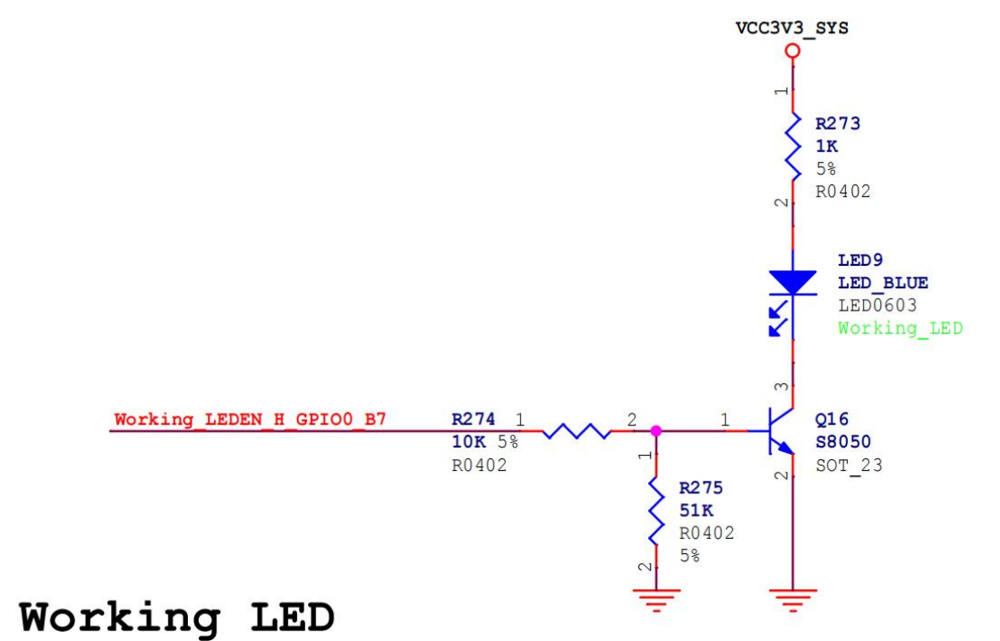
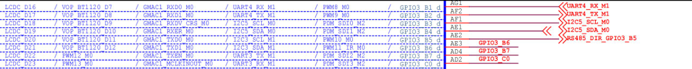
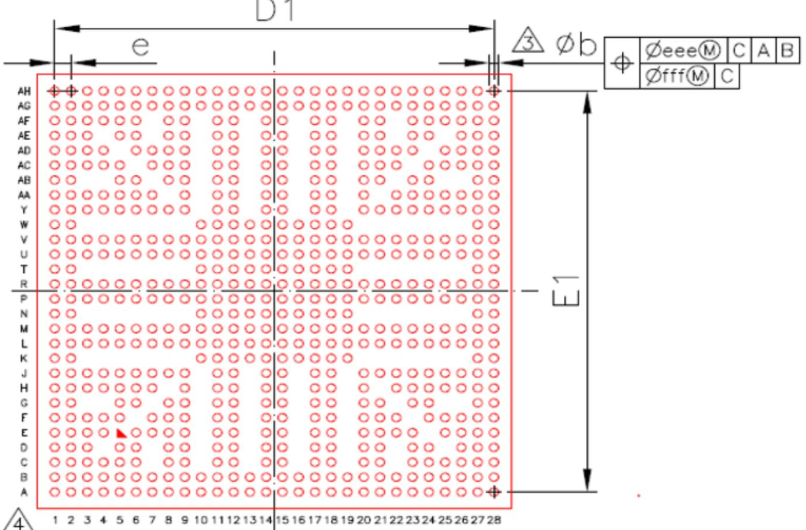
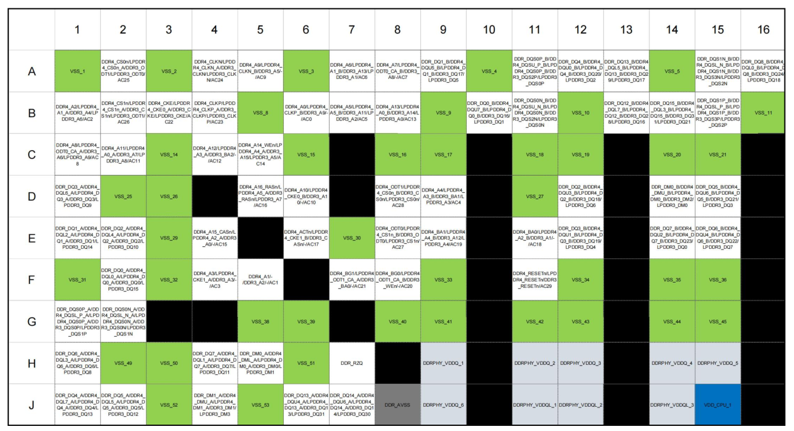
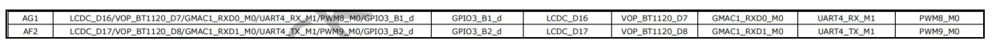
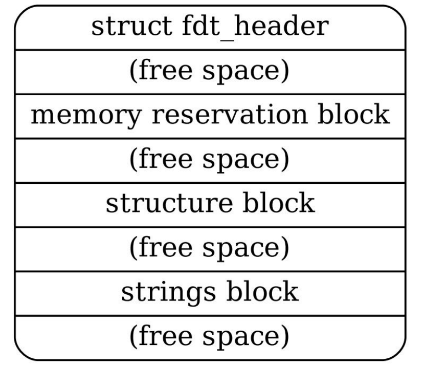
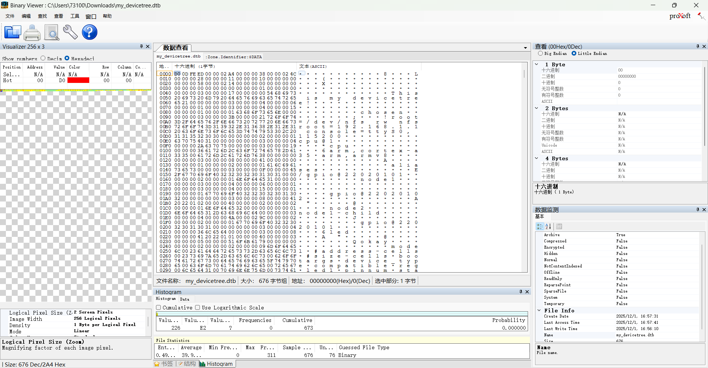
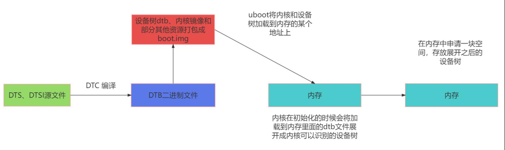

# 设备树


## 设备树介绍

**背景**

设备树（Device Tree）是一种硬件描述机制，用于在嵌入式系统和操作系统中描述硬件设备的特性、连接关系和配置信息。它提供了一种与平台无关的方式来描述硬件，使得内核与硬件之间的耦合度降低，提高了系统的可移植性和可维护性。

在平台总线模型中我们用 platform_device 结构体来对硬件设备进行描述，这是一种传统的平台总线设备描述方式。

每个 platform_device 结构表示一个特定的硬件设备，并通过注册到平台总线上来使得内核能够与该设备进行通信和交互。该结构包含设备的名称、资源（如内存地址、中断号等）、设备驱动程序等信息。

然而，随着时间的推移，Linux 内核中的 ARM 部分存在着大量的平台相关配置代码，这些代码通常是杂乱而重复的，导致了维护的困难和工作量的增加。设备树的引入为 ARM 架构上的 Linux 内核带来了革命性的变化。它提供了一种统一的硬件描述方式，使得不同芯片和板级的支持更加简单和灵活。此外，设备树还提供了硬件配置的可视化和可读性，方便开发者理解和调试硬件。


**DTS（Device Tree Source）**：**DTS 是设备树的源文件**，采用一种类似于文本的语法来描述硬件设备的结构、属性和连接关系。DTS 文件以.dts 为扩展名，通常由开发人员编写。它是人类可读的形式，用于描述设备树的层次结构和属性信息。

**DTSI（Device Tree Source Include）**：**DTSI 文件是设备树源文件的包含文件**。它扩展了 DTS文件的功能，用于定义可重用的设备树片段。DTSI 文件以.dtsi 为扩展名，可以在多个 DTS 文件中包含和共享。通过使用 DTSI，可以提高设备树的可重用性和可维护性（和 C 语言中头文件的作用相同）。

**DTB（Device Tree Blob）**：**DTB 是设备树的二进制表示形式**。DTB 文件是通过将 DTS 或 DTSI文件编译而成的二进制文件，以.dtb 为扩展名。DTB 文件包含了设备树的结构、属性和连接信息，被操作系统加载和解析。在运行时，操作系统使用 DTB 文件来动态识别和管理硬件设备。

**DTC（Device Tree Compiler）**：**DTC 是设备树的编译器**。它是一个命令行工具，用于将 DTS和 DTSI 文件编译成 DTB 文件。DTC 将文本格式的设备树源代码转换为二进制的设备树表示形式，以便操作系统能够加载和解析。DTC 是设备树开发中一个重要的工具。


**设备树在源码存放的位置**

ARM64 体系结构下的设备树源文件通常存放在 `arch/arm64/boot/dts/`目录及其子目录中。该目录也是设备树源文件的根目录，并包含了针对不同 ARM64 平台和设备的子目录。

在 ARM64 的子目录中，同样会按照硬件平台、设备类型或制造商进行组织和分类。这些子目录的命名可能与特定芯片厂商（如 Qualcomm、NVIDIA、Samsung）有关，由于我们使用的 soc是瑞芯微的rk3568, 所以匹配的设备树目录为`arch/arm64/boot/dts/rockchip`。每个子目录中可能包含多个设备树文件，用于描述不同的硬件配置和设备类型。


## 设备树的编译

在 Linux 内核源码中，DTC（Device Tree Compiler）的源代码和相关工具通常存放在`scripts/dtc/`目录中

**设备树编译**

```bash
dtc -I dts -O dtb -o output.dtb input.dts
```

- `-I` 表示输入的文件类型
- `-O`表示输出的文件类型
- `-o`表示编译后输出文件名


**设备树反编译**

```bash
dtc -I dtb -O dts -o output.dts input.dtb
```


## 设备树基本语法

### 根节点

```dts
/dts-v1/; // 设备树版本信息

/ {
	// 根节点开始
	/*
		在这里可以添加注释，描述根节点的属性和配置
	*/
}
```

### 子节点

```dts
[label:] node-name@[unit-address] {
	[properties definitions]
	[child nodes]
};
```

- **节点标签（Label）**（可选）：节点标签是一个可选的标识符，用于在设备树中引用该节点。标签允许其他节点直接引用此节点，以便在设备树中建立引用关系。

- **节点名称（Node Name）**：节点名称是一个字符串，用于唯一标识该节点在设备树中的位置。节点名称通常是硬件设备的名称，但必须在设备树中是唯一的。
- **单元地址（Unit Address）**（可选）：单元地址用于标识设备的实例。它可以是一个整数、一个十六进制值或一个字符串，具体取决于设备的要求。单元地址的目的是区分相同类型的设备的不同实例。
- 属性定义（Properties Definitions）：属性定义是一组键值对，用于描述设备的配置和特性。属性可以根据设备的需求进行定义，例如寄存器地址、中断号、时钟频率等。
- 子节点（Child Nodes）：子节点是当前节点的子项，用于进一步描述硬件设备的子组件或配置。子节点可以包含自己的属性定义和更深层次的子节点，形成设备树的层次结构。


### reg属性

reg 属性用于**在设备树中指定设备的寄存器地址和大小**，提供了与设备树中的物理设备之间的寄存器映射关系。

reg 属性可以在设备节点中有**单个值格式**和**列表值格式**这两种常见格式。	

- 单个值格式如下所示：

```dts
reg = <address size>;
```

这种格式适用于描述单个寄存器的情况。其中，address 是设备的起始寄存器地址，可以是一个整数或十六进制值(u32)。size 表示寄存器的大小，即占用的字节数。

例子：

```dts
my_device {
	compatible = "vendor,device";
	reg = <0x1000 0x4>;
	// 其他属性和子节点的定义
}
```

- 列表值格式

```dts
reg = <address1 size1 address2 size2 ...>;
```

当设备具有多个寄存器区域时，可以使用列表值格式的 reg 属性来描述每个寄存器区域的地址和大小。通过这种方式，可以指定多个寄存器的位置和大小，以描述设备的完整寄存器映射。

例子：

```dts
my_device {
	compatible = "vendor,device";
	reg = <0x1000 0x8 0x2000 0x4>;
	// 其他属性和子节点的定义
};
```

### `#address-cells` 和 `#size-cells` 属性

`#address-cells` 和 `#size-cells` 属性用于指定在上个小节中要设置的设备树中地址单元和大小单元的位数。它们提供了设备树解析所需的元数据，以正确解释设备的地址和大小信息.

#### `#address-cells`

属性是一个位于设备树根节点的特殊属性，它指定了设备树中地址单元的位数。地址单元是设备树中用于表示设备地址的单个单位。它通常是一个整数，可以是十进制或十六进制值。它的值告诉解析设备树的软件在解释设备地址时应该使用多少位来表示一个地址单元。

**默认情况下，`#address-cells` 的值为 2**，表示使用两个单元来表示一个设备地址。这意味着设备的地址将由两个整数（每个整数使用指定位数的位）组成。

例如，对于一个使用两个 32 位（4 字节）整数表示地址的设备，可以在设备树的根节点中设置 #address-cells 属性为 <2>。

#### `#size-cells`

`#size-cells `属性也是一个位于设备树根节点的特殊属性，它指定了设备树中大小单元的位数。大小单元是设备树中用于表示设备大小的单个单位。它通常是一个整数，可以是十进制或十六进制值。


例子

```dts
node1 {
	#address-cells = <1>;
	#size-cells = <1>;
	
	node1-child {
		reg = <0x02200000 0x4000>;
		// 其他属性和子节点的定义
	};
};
```

- 地址部分：0x02200000 被解释为一个地址单元，地址为 0x02200000。
- 大小部分：0x4000 被解释为一个大小单元，大小为 0x4000。

### model属性

在设备树中，**model 属性用于描述设备的型号或者名称**。它通常作为设备节点的一个属性，用来提供关于设备的标识信息。model 属性是可选的，但在实际应用中经常被使用。

```dts
my_device {
	compatible = "vendor,device";
	model = "My Device XYZ";
	// 其他属性和子节点的定义
}
```

model 属性通常用于标识和区分不同的设备，特别是当设备节点的 compatible 属性相同或相似时。通过使用不同的 model 属性值，可以更加准确地确定所使用的设备类型


### status属性

在设备树中，status 属性**用于描述设备或节点的状态**。它是设备树中常见的属性之一，用于表示设备或节点的可用性或操作状态。

status 属性的值可以是以下几种：

- "**okay**"：表示设备或节点正常工作，可用。

- "**disabled**"：表示设备或节点被禁用，不可用。

- "**reserved**"：表示设备或节点已被保留，暂时不可用。

- "**fail**"：表示设备或节点初始化或操作失败，不可用。

例子：

```dts
my_device {
	compatible = "vendor,device";
	status = "okay";
	// 其他属性和子节点的定义
}
```


### compatible 属性

在设备树中，compatible 属性用于描述设备的兼容性信息。它是设备树中重要的属性之一，**用于识别设备节点与驱动程序之间的匹配关系**。

compatible 属性的值是一个字符串或字符串列表，用于指定设备节点与相应的驱动程序或设备描述符兼容的规则。通常，compatible 属性的值由设备的厂商定义，并且在设备树中使用。

以下是一些常见的 compatible 属性值的示例：

- **单个字符串值**：例如 `"vendor,device"`，用于指定设备节点与特定厂商的特定设备兼容。
- **字符串列表**：例如 `["vendor,device1", "vendor,device2"]`，用于指定设备节点与多个设备兼容，通常用于设备节点具有多种变体或配置。
- **通配符匹配**：例如 `"vendor,*"`，用于指定设备节点与特定厂商的所有设备兼容，不考虑具体的设备标识。


通过使用 compatible 属性，设备树可以提供设备和驱动程序之间的匹配信息。当设备树被操作系统或设备管理软件解析时，会根据设备节点的 compatible 属性值来选择适合的驱动程序进行设备的初始化和配置。


### aliases节点

aliases 节点是一个特殊的节点，用于**定义设备别名**。该节点**位于设备树的根部**，并具有节点路径 `/aliases`

```dts
aliases {
	mmc0 = &sdmmc0;
	mmc1 = &sdmmc1;
	mmc2 = &sdhci;
	serial0 = "/simple@fe000000/seria1@11c500";
};
```

在别名的定义中，**& 符号用于引用设备树中的节点**。别名的目的是提供可读性更高的名称，使设备树更易于理解和维护。通过使用别名，可以简化设备节点之间的关联，并减少重复输入设备节点的路径。

**aliases 节点中定义的别名只在设备树内部可见，不能在设备树之外引用。**它们主要用于设备树的内部组织和引用，以提高可读性和可维护性。


### chosen节点

chosen 节点是设备树中的一个特殊节点，用于**传递和存储系统引导和配置的相关信息**。它**位于设备树的根部**，并具有路径`/chosen`。

chosen 节点通常包含以下子节点和属性：

- **bootargs**：用于**存储引导内核时传递的命令行参数**。它可以包含诸如内核参数、设备树参数等信息。在引导过程中，操作系统或引导加载程序可以读取该属性来获取启动参数。
- **stdout-path**：用于**指定用于标准输出的设备路径**。在引导过程中，操作系统可以使用该属性来确定将控制台输出发送到哪个设备，例如串口或显示屏。
- **firmware-name**：用于指定系统固件的名称。它可以用于标识所使用的引导加载程序或固件的类型和版本。
- **linux,initrd-start 和 linux,initrd-end**：这些属性用于指定 Linux 内核初始化 RAM 磁盘
- **initrd**: 的起始地址和结束地址。这些信息在引导过程中被引导加载程序使用，以将 initrd 加载到内存中供内核使用。
- **其他自定义属性**：chosen 节点还可以包含其他自定义属性，用于存储特定于系统引导和配置的信息。这些属性的具体含义和用法取决于设备树的使用和上下文。

示例

```dts
chosen {
	bootargs = "root=/dev/nfs rw nfsroot=192.168.1.1 console=ttyS0,115200";
};
```

通过使用 chosen 节点，系统引导过程中的相关信息可以方便地传递给操作系统或引导加载程序。这样，系统引导和配置的各个组件可以共享和访问这些信息，从而实现更灵活和可配置的系统引导流程。


### device_type节点

在设备树中，**device_type 节点是用于描述设备类型的节点**。它**通常作为设备节点的一个属性存在**。

device_type 属性的值是一个字符串，用于标识设备的类型。

device_type 节点的存在有助于操作系统或其他软件识别和处理设备。它提供了设备的基本分类信息，使得驱动程序、设备树解析器或其他系统组件能够根据设备的类型执行相应的操作。

常见的设备类型包括但不限于：

- cpu：表示中央处理器。
- memory：表示内存设备。
- display：表示显示设备，如液晶显示屏。
- serial：表示串行通信设备，如串口。
- ethernet：表示以太网设备。
- usb：表示通用串行总线设备。
- i2c：表示使用 I2C (Inter-Integrated Circuit) 总线通信的设备。
- spi：表示使用 SPI (Serial Peripheral Interface) 总线通信的设备。
- gpio：表示通用输入/输出设备。
- pwm：表示脉宽调制设备。

这些只是一些常见的设备类型示例，实际上，设备类型可以根据具体的硬件和设备树的使用情况进行自定义和扩展。

### 自定义属性

设备树中的自定义属性是用户根据特定需求添加的属性。这些属性可以用于提供额外的信息、配置参数或元数据，以满足设备或系统的特定要求。

例如可以在设备树中自定义一个管脚标号的属性 pinnum

```dts
my_device {
	compatible = "my_device";
	pinnum = <0 1 2 3 4>;
};
```

## 实例分析：中断

**arch/arm64/boot/dts/rk3568.dtsi**

```dts
	pinctrl: pinctrl {
		compatible = "rockchip,rk3568-pinctrl";
		rockchip,grf = <&grf>;
		rockchip,pmu = <&pmugrf>;
		#address-cells = <2>;
		#size-cells = <2>;
		ranges;

		gpio0: gpio0@fdd60000 {
			compatible = "rockchip,gpio-bank";
			reg = <0x0 0xfdd60000 0x0 0x100>;
			interrupts = <GIC_SPI 33 IRQ_TYPE_LEVEL_HIGH>;
			clocks = <&pmucru PCLK_GPIO0>, <&pmucru DBCLK_GPIO0>;

			gpio-controller;
			#gpio-cells = <2>;
			interrupt-controller;
			#interrupt-cells = <2>;
		};

	};
```

**arch/arm64/boot/dts/rockchip/topeet-screen-lcds.dts**

```dts
&i2c1 {
    status = "okay";
	ft5x061:ft5x06@38 {
				status = "disabled";
				compatible = "edt,edt-ft5306";
				reg = <0x38>;
				touch-gpio = <&gpio3 RK_PA5 IRQ_TYPE_EDGE_RISING>;
				interrupt-parent = <&gpio3>;
				interrupts = <RK_PA5 IRQ_TYPE_LEVEL_LOW>;
				reset-gpio = <&gpio0 RK_PB6 GPIO_ACTIVE_LOW>;
				touchscreen-size-x = <800>;
				touchscreen-size-y = <1280>;

    };
};

```

### interrupt属性

interrupts 属性用于指定设备的中断相关信息。它描述了**中断控制器的类型、中断号以及中断触发类型**。

```dts
		gpio0: gpio0@fdd60000 {

			interrupts = <GIC_SPI 33 IRQ_TYPE_LEVEL_HIGH>;
			interrupt-controller;

		};
		
		ft5x061:ft5x06@38 {

			interrupt-parent = <&gpio3>;
			interrupts = <RK_PA5 IRQ_TYPE_LEVEL_LOW>;
			
    	};		
```

**中断控制器类型**

interrupts 属性的第一个参数指定了中断控制器的类型。

常见的类型包括 **GIC (Generic Interrupt Controller)、IRQ (Basic Interrupt Handling)** 等。例如，在给定的代码片段中，GIC_SPI 表
示中断控制器的类型为 GIC SPI 中断。

中断控制器负责管理系统中的中断信号，它可以是硬件中的专用中断控制器，也可以是处理器内部的中断控制器。


**中断号**

interrupts 属性的第二个参数指定了设备所使用的中断号。

中断号是一个唯一标识符，用于区分不同的中断信号源。系统使用中断号来识别中断源并进行相应的中断处理。

**中断号可以是一个整数值，也可以是一个宏定义或符号引用**。在给定的代码片段中，33 表示该设备使用的中断号为 33。


**中断触发类型**
interrupts 属性的第三个参数指定了中断的触发类型，即中断信号的触发条件。常见的触发类型包括边沿触发和电平触发。

电平触发表示中断信号在保持特定电平状态时触发，可以是高电平触发或低电平触发。

在给定的代码片段中，IRQ_TYPE_LEVEL_HIGH 表示中断的触发类型为高电平触发。触发类型的宏定义在内核源码`include/dt-bindings/interrupt-controller/irq.h`目录下

```c
#define IRQ_TYPE_NONE 0 // 无中断触发类型
#define IRQ_TYPE_EDGE_RISING 1 // 上升沿触发
#define IRQ_TYPE_EDGE_FALLING 2 // 下降沿触发
#define IRQ_TYPE_EDGE_BOTH (IRQ_TYPE_EDGE_FALLING | IRQ_TYPE_EDGE_RISING)// 双边沿触发
#define IRQ_TYPE_LEVEL_HIGH 4 // 高电平触发
#define IRQ_TYPE_LEVEL_LOW 8 // 低电平触发
```

### interrupt-controller属性

`interrupt-controller` 属性用于**标识当前节点所描述的设备是一个中断控制器**。

中断控制器是**硬件或软件模块**，负责管理和分发中断信号。它接收来自各种设备的中断请求，并根据优先级和配置规则分发中断给相应的处理器或设备。

`interrupt-controller` 属性本身没有特定的属性值，只需出现在节点的属性列表中即可。


### interrupt-parent属性

`interrupt-parent` 属性是设备树中用于建立中断信号源与中断控制器之间关联的属性。它**指定了中断信号源所属的中断控制器节点，以确保正确的中断处理和分发**。

`interrupt-parent` 属性值是一个引用，它指向中断控制器节点的路径或标签。

可以使用路径来引用中断控制器节点，如`/interrupt-controller-node`，或使用标签来引用中断控制器节点，如`&interrupt-controller-label`

```dts
		ft5x061:ft5x06@38 {

			interrupt-parent = <&gpio3>;
			interrupts = <RK_PA5 IRQ_TYPE_LEVEL_LOW>;
			
    	};	
```

而在gpio0中没有interrupt-parent，但由于在根 DTS 有默认 interrupt-parent = GIC，因此 GPIO0 不需要显式写。

### `#interrupt-cells`属性

`#interrupt-cells` 属性用于**描述中断控制器中每个中断信号源的中断编号单元的数量**。

中断编号单元是指用于**表示中断号和其他相关信息的固定大小的单元**。通过指定中断编号单元的数量，操作系统可以正确解析和处理中断信息，并将其与中断控制器和中断信号源进行关联。

`#interrupt-cells` 属性的值是一个整数，表示中断编号单元的数量。通常，这个值是一个正整数，例如 1、2 或 3，取决于中断控制器和设备的要求。

```dts
		gpio0: gpio0@fdd60000 {
		
			interrupts = <GIC_SPI 33 IRQ_TYPE_LEVEL_HIGH>;

			interrupt-controller;
			#interrupt-cells = <2>;
		};
		
		ft5x061:ft5x06@38 {

			interrupt-parent = <&gpio3>;
			interrupts = <RK_PA5 IRQ_TYPE_LEVEL_LOW>;
			
    	};	
```


在 gpio0 的中断控制器为 gic，在 gic 节点中#interrupt-cells 属性被设置为 3，这也就是为什么在 gpio0 节点中 interrupts 属性有三个值;

而 ft5x061 的中断控制器为 gpio3，在 gpio3 节点中#interrupt-cells 属性被设置为 2，所以 ft5x06 节点的 interrupts 属性只有两个值。


### 其他SOC设备树对比

**NXP**

```dts
gpio1: gpio@0209c000 {
	compatible = "fsl,inx6ul-gpio", "fsl,imx35-gpio";
	reg = <0x0209c000 0x4000>;
	interrupts = <GIC_SPI 66 IRQ_TYPE_LEVEL_HIGH>, <GIC_SPI 67 IRQ_TYPE_LEVEL_HIGH>;
	gpio-controller;
	#gpio-cells = <2>;
	interrupt-controller;
	#interrupt-cells = <2>;

	edt-ft5x06@38 {
		compatible = "edt,edt-ft5306", "edt,edt-ft5x06", "edt,edt-ft5406";
		pinctrl-names = "default";
		pinctrl-0 = <&ts_int_pin &ts_reset_pin>;
		reg = <0x38>;
		interrupt-parent = <&gpio1>;
		interrupts = <9 0>;
		reset-gpios = <&gpio5 9 GPIO_ACTIVE_LOW>;
		irq-gpios = <&gpio1 9 GPIO_ACTIVE_LOW>;
		status = "disabled";
	};
}
```

**Samsung**

```dts
gpio_c: gpioc {
	compatible = "gpio-controller";
	#gpio-cells = <2>;
	interrupt-controller;
	#interrupt-cells = <2>;
};

ft5x06: ft5x06038 {
	compatible = "edt,edt-ft5406";
	reg = <0x38>;
	pinctrl-names = "default";
#if defined(RGB_1024x600) || defined(RGB_800x480)
	pinctrl-0 = <&tsc2007_irq>;
	interrupt-parent = <&gpio_c>;
	interrupts = <26 IRQ_TYPE_EDGE_FALLING>;
#endif
#if defined(LvDs_800×1280) || defined(LvDS_1024x768)
	pinctrl-0 = <&gt911_irq>;
	interrupt-parent = <&gpio_b>;
	interrupts = <29 IRQ_TYPE_EDGE_FALLING>;
#endif
	reset-gpios = <&gpio_e 30 0>;
}
```

## 实例分析：时钟

时钟（Clock）用于**描述硬件设备和系统中的时钟源以及时钟相关的配置和连接关系**。

时钟在计算机系统中起着至关重要的作用，用于同步和定时各种硬件设备的操作。

时钟可以分为两个主要角色：**时钟生产者（clock provider）**和**时钟消费者（clock consumer）**。


### **时钟生产者**

- 定义：时钟生产者是**负责生成和提供时钟信号的硬件或软件模块**。它可以是时钟控制器、PLL、时钟发生器等。
- 设备树节点：时钟生产者在设备树中**以时钟节点的形式表示**。


#### 时钟生产者属性

##### clock-cells

该属性用于指定时钟编号的位数。它是一个整数值，表示时钟编号的位数。

通常情况下，当 clock-cells 为 0 时表示一个时钟，为 1 表示多个时钟。

```dts
osc24m: osc24m {
	compatible = "clock";
	clock-frequency = <24000000>;
	clock-output-names = "osc24m";
	#clock-cells = <O>;
};

// 多个时钟
clock: clock {
	#clock-cells = <1>;
	clock-output-names = "clock1", "clock2";
};
```

##### clock-frequency 

是设备树中用于指定时钟频率的属性。它用于描述时钟节点所提供的时钟信号的频率，使用 Hertz (Hz) 作为单位。

对于时钟生产者节点，clock-frequency 属性表示该节点生成的时钟信号的频率。它用于描述时钟控制器、晶振、PLL 等产生时钟信号的硬件或软件模块的输出频率。

```dts
osc24m: osc24m {
	compatible = "clock";
	clock-frequency = <24000000>;
	clock-output-names = "osc24m";
	#clock-cells = <O>;
};
```

##### **assigned-clocks** 和 **assigned-clock-rates** 

是设备树中用于描述多路时钟的属性，通常一起使用。

`assigned-clocks` 属性用于**标识时钟消费者节点所使用的时钟源**。

它是一个整数数组，每个元素对应一个时钟编号。时钟编号是指时钟生产者节点（如时钟控制器）所提供的时钟源的编号。

通过在时钟消费者节点中使用 assigned-clocks 属性，可以指定该节点所需的时钟源。


`assigned-clock-rates` 属性用于**指定每个时钟源的时钟频率**。

它是一个整数数组，每个元素对应一个时钟源的频率。时钟频率以 Hz (赫兹) 为单位表示。

assigned-clock-rates 属性的元素数量和顺序应与 assigned-clocks 属性中的时钟编号相对应。


```dts
cru: clock-controller@fdd20000 {
	#clock-cells = <1>;
	assigned-clocks = <&pmucru CLK_RTC_32K>, <&cru ACLK_RKVDEC_PRE>;
	assigned-clock-rates = <32768>, <300000000>;
};
```

##### clock-indices

clock-indices 属性用于**指定时钟消费者节点所使用的时钟源的索引值**。

它是一个整数数组，每个元素对应一个时钟源的索引。

**时钟索引是指时钟生产者节点（如时钟控制器）所提供的时钟源的编号**。通过在时钟消费者节点中使用 clock-indices 属性，可以明确指定该节点所需的时钟源，并按照特定的顺序进行匹配。

```dts
scpi_dvfs: clocks-0 {
	#clock-cells = <1>;
	clock-indices = <0>, <1>, <2>;
	clock-output-names = "atlclk", "aplclk", "gpuclk";
};

scpi_clk: clocks-1 {
	#clock-cells = <1>;
	clock-indices = <3>;
	clock-output-names = "pxlclk";
};
```

在第一个节点中"atlclk", "aplclk", "gpuclk"三个时钟源的索引就分别被设置为了 0、1、2，在第二个节点中"pxlclk"时钟源的索引值被设置为了 3.

##### assigned-clock-parents 

用于**指定时钟消费者节点所使用的时钟源的父时钟源**。

它是一个时钟源引用的数组，每个元素对应一个父时钟源的引用。

在时钟的层次结构中，**某些时钟源可能是其他时钟源的父时钟源**，即它们提供时钟信号给其他时钟源作为输入。

通过在时钟消费者节点中使用 `assigned-clock-parents` 属性，可以明确指定该节点所需的父时钟源，并按照特定的顺序进行匹配

```dts
clock: clock {
	assigned-clocks = <&clkcon 0>, <&pll 2>;
	assigned-clock-parents = <&pll 2>;
	assigned-clock-rates = <115200>, <9600>;
};
```

assigned-clocks 属性指定了该节点使用的时钟源，引用了两个时钟源节点：clkcon 0 和 pll 2。

assigned-clock-parents 属性指定了这些时钟源的父时钟源，引用了 pll 2 时钟源节点。

assigned-clock-rates 属性指定了每个时钟源的时钟频率，分别是 115200 和 9600。

### 时钟消费者

时钟消费者是**依赖时钟信号的硬件设备或模块**。它们通过引用时钟生产者节点提供的时钟源来获取时钟信号。

#### 时钟消费者属性

##### clock

该属性用于指定时钟消费者节点所需的时钟源。它是一个整数数组，每个元素是一个时钟编号，表示时钟消费者需要的一个时钟源。

##### clock-names

可选属性，用于指定时钟消费者节点所需时钟源的名称。它是一个字符串数组，与 clocks 数组一一对应，用于提供时钟源的描述性名称。


一个时钟消费者示例如下：

```
clock: clock {
	clocks = <&cru CLK_VOP>;
	clock-names = "clk_vop";
};
```

clocks 属性指定了该节点使用的时钟源，引用了 cru 节点中的 CLK_VOP 时钟源。clock-names 属性指定了时钟源的名称，这里是 "clk_vop"。


## 实例分析：CPU

设备树的 **cpus 节点**是用于描述系统中的处理器的一个重要节点。它是**处理器拓扑结构的顶层节点**，包含了所有处理器相关的信息。

**节点结构**：

cpus 节点是一个容器节点，其下包含了系统中每个处理器的子节点。

每个子节点的名称通常为 cpu@X，其中 X 是处理器的索引号。每个子节点都包含了与处理器相关的属性，例如时钟频率、缓存大小等。

**处理器属性**：

cpu@X 子节点中的属性可以包括以下信息：

- **device_type**：指示设备类型为处理器（"cpu"）。
- **reg**：指定处理器的地址范围，通常是物理地址或寄存器地址。
- **compatible**：指定处理器的兼容性信息，用于匹配相应的设备驱动程序。
- **clock-frequency**：指定处理器的时钟频率。
- **cache-size**：指定处理器的缓存大小。


### 处理器拓扑关系

除了处理器的基本属性，**cpus 节点还可以包含其他用于描述处理器拓扑关系的节点**，以提供更详细的处理器拓扑信息。这些节点可以帮助操作系统和软件了解处理器之间的连接关系、组织结构和特性。

- **cpu-map 节点**：描述处理器的映射关系，通常在多核处理器系统中使用。
- **socket 节点**：描述多处理器系统中的物理插槽或芯片组。
- **cluster 节点**：描述处理器集群，即将多个处理器组织在一起形成的逻辑组。
- **core 节点**：描述处理器核心，即一个物理处理器内的独立执行单元。
- **thread 节点**：描述处理器线程，即一个物理处理器核心内的线程。

这些节点的嵌套关系可以在 cpus 节点下形成一个层次结构，反映了处理器的拓扑结构。


单核CPU:

```dts
cpus {
	#address-cells = <1>;
	#size-cells = <0>;
	cpu0: cpu@0 {
		compatible = "arm,cortex-a7";
		device_type = "cpu";
		// 其他属性...
	};
}
```

多核CPU:

```dts
cpus {
	#address-cells = <1>;
	#size-cells = <0>;
	cpu0: cpu@0 {
		device_type = "cpu";
		compatible = "arm,cortex-a9";
	};
	
	cpu1: cpu@1 {
		device_type = "cpu";
		compatible = "arm,cortex-a9";
	};

	cpu2: cpu@2 {
		device_type = "cpu";
		compatible = "arm,cortex-a9";
	};
	
	cpu3: cpu@3 {
		device_type = "cpu";
		compatible = "arm,cortex-a9";
	};
}
```

cpus 节点是一个容器节点，包含了 cpu0 子节点。该节点使用了 `#address-cells` 和 `#size-cells` 属性来指定地址和大小的单元数量。


#### cpu-map、socket、cluster 节点

**cpu-map 节点**是**设备树中用于描述大小核架构处理器的映射关系的节点之一**。

它的**父节点必须是 cpus 节点**，而**子节点可以是一个或多个 cluster 和 socket 节点**。

通过 cpu-map 节点，可以定义不同核心和集群之间的连接和组织结构。


**socket 节点**用于描述处理器插槽（socket）之间的映射关系。

**每个 socket 子节点表示一个处理器插槽**，可以**使用 cpu-map-mask 属性来指定该插槽使用的核心**。

通过为每个 socket 子节点指定适当的 cpu-map-mask，可以定义不同插槽中使用的核心。这样，操作系统和软件可以了解到不同插槽之间的核心分配情况。


**cluster 节点**用于描述核心（cluster）之间的映射关系。

**每个 cluster 子节点表示一个核心集群**，可以**使用 cpu-map-mask 属性来指定该集群使用的核心**。

通过为每个 cluster 子节点指定适当的 cpu-map-mask，可以定义每个集群中使用的核心。这样，操作系统和软件可以了解到不同集群之间的核心分配情况


一个大小核架构的具体示例

```dts
cpus {
	#address-cells = <2>;
	#size-cells = <0>;
	
	cpu-map {
		cluster0 {
			core0 {
				cpu = <&cpu_l0>;
			};
			
			core1 {
				cpu = <&cpu_l1>;
			};
			core2 {
				cpu = <&cpu_l2>;
			};
			core3 {
				cpu = <&cpu_l3>;
			};
		};
	
		cluster1 {
			core0 {
				cpu = <&cpu_b0>;
			};
			core1 {
				cpu = <&cpu_b1>;
			};
		};
	};
	
	cpu_l0: cpu@0 {	
		device_type = "cpu";
		compatible = "arm,cortex-a53", "arm,armv8";
	};
	
	cpu_l1: cpu@1 {
		device_type = "cpu";
		compatible = "arm,cortex-a53", "arm,armv8";
	};
	
	cpu_l2: cpu@2 {
		device_type = "cpu";
		compatible = "arm,cortex-a53", "arm,armv8";
	};

	cpu_l3: cpu@3 {
		device_type = "cpu";
		compatible = "arm,cortex-a53", "arm,armv8";
	};

	cpu_b0: cpu@100 {
		device_type = "cpu";
		compatible = "arm,cortex-a72", "arm,armv8";
	};

	cpu_b1: cpu@101 {
		device_type = "cpu";
		compatible = "arm,cortex-a72", "arm,armv8";
	};
};
```

这个设备树描述了一个具有多个 CPU 核心的系统，包括四个 Cortex-A53 核心和两个Cortex-A72 核心。


#### core、thread 节点

"core" 和 "thread" 节点通常用于描述处理器核心和线程的配置。

**core 节点**用于描述处理器的核心。一个处理器通常由多个核心组成，每个核心可以独立执行指令和任务。

**thread 节点**用于描述处理器的线程。线程是在处理器核心上执行的基本执行单元，每个核心可以支持多个线程。

```dts
cpus {
	#address-cells = <2>;
	cpu-map {
		socket0 {
			cluster0 {
				core0 {
					thread0 {
						cpu = <&CPU0>;
					};
					thread1 {
						cpu = <&CPU1>;
					};
				};
				
				core1 {
					thread0 {
						cpu = <&CPU2>;
					};
					thread1 {
						cpu = <&CPU3>;
					};
				};
			};
			
			cluster1 {
				core0 {
					thread0 {
						cpu = <&CPU4>;
					};
					thread1 {
						cpu = <&CPU5>;
					};
				};
				core1 {
					thread0 {
						cpu = <&CPU6>;
					};
					thread1 {
						cpu = <&CPU7>;
					};
				};
			};
		};
		socket1 {
			cluster0 {
				core0 {
					thread0 {
						cpu = <&CPU8>;
					};
					thread1 {
						cpu = <&CPU9>;
					};
				};
				core1 {
					thread0 {
						cpu = <&CPU10>;
					};
					thread1 {
						cpu = <&CPU11>;
					};
				};
			};
			cluster1 {
				core0 {
					thread0 {
						cpu = <&CPU12>;
					};
					thread1 {
						cpu = <&CPU13>;
					};
				};
				core1 {
					thread0 {
						cpu = <&CPU14>;
					};
					thread1 {
						cpu = <&CPU15>;
					};
				};
			};
		};
	};
};
```

## 实例分析：GPIO

```dts
gpio0: gpio@fdd60000 {
	compatible = "rockchip,gpio-bank";
	reg = <0x0 0xfdd60000 0x0 0x100>;
	interrupts = <GIC_SPI 33 IRQ_TYPE_LEVEL_HIGH>;
	clocks = <&pmucru PCLK_GPI00>, <&pmucru DBCLK_GPI00>;
	gpio-controller;
	#gpio-cells = <2>;
	gpio-ranges = <&pinctrl 0 0 32>;
	interrupt-controller;
	#interrupt-cells = <2>;
};

ft5x06: ft5x06@38 {
	status = "disabled";
	compatible = "edt,edt-ft5306";
	reg = <0x38>;
	touch-gpio = <&gpio0 RK_PB5 IRQ_TYPE_EDGE_RISING>;
	interrupt-parent = <&gpio0>;
	interrupts = <RK_PB5 IRQ_TYPE_LEVEL_LOW>;
	reset-gpios = <&gpio0 RK_PB6 GPIO_ACTIVE_LOW>;
	touchscreen-size-x = <800>;
	touchscreen-size-y = <1280>;
	touch_type = <1>;
};
```

### gpio-controller属性

`gpio-controller` 属性用于**标识一个设备节点作为 GPIO 控制器**。

**GPIO 控制器是负责管理和控制 GPIO 引脚的硬件模块或驱动程序**。

`gpio-controller` 属性通常作为设备节点的一个属性出现，位于设备节点的属性列表中。

当一个设备节点被标识为 GPIO 控制器时，它通常会定义一组 GPIO 引脚，并提供相关的GPIO 控制和配置功能。其他设备节点可以使用该 GPIO 控制器来控制和管理其 GPIO 引脚。

通过使用 gpio-controller 属性，设备树可以明确标识出 GPIO 控制器设备节点，使系统可以正确识别和管理 GPIO 引脚的配置和控制。


### `#gpio-cells`属性

`#gpio-cells `属性用于**指定 GPIO 引脚描述符的编码方式**。GPIO 引脚描述符是用于标识和配置 GPIO 引脚的一组值，例如引脚编号、引脚属性等。

`#gpio-cells` 属性的属性值是一个整数，表示用于编码 GPIO 引脚描述符的单元数。通常，这个值为 2。

```dts
ft5x06: ft5x06@38 {
	.....
	reset-gpios = <&gpio0 RK_PB6 GPIO_ACTIVE_LOW>;
	.....
};
```

### gpio-ranges属性

**背景**

>  每个 GPIO 控制器内部都会给自己的每个引脚一个 **本地编号（local number）**，比如：GPIO 控制器内部编号: 0, 1, 2, 3, ... 31
>
>  但是在整个系统或者在其他硬件模块中，这些 GPIO 可能有自己的 **全局编号（global number）**外部编号: 100, 101, 102, 103, ... 131
>
>  也就是说，**控制器内部编号和外部编号可能不一致**。
>
>  为了方便其他设备使用 GPIO，需要有一张映射表，把控制器的内部编号映射到系统外部编号，这就是 `gpio-ranges` 的作用。


gpio-ranges 属性是设备树中一个用于**描述 GPIO 范围映射的属性**。它通常用于描述具有大量 GPIO 引脚的 GPIO 控制器，以简化 GPIO 引脚的编码和访问。

gpio-ranges属性是一个包含一系列整数值的列表，每个整数值对应于设备树中的一个 GPIO控制器。列表中的每个整数值按照特定的顺序提供以下信息：

- 外部引脚编号的起始值。
- GPIO 控制器内部本地编号的起始值。
- 引脚范围的大小（引脚数量）。

在上面的示例中 gpio-ranges 属性的值为`<&pinctrl 0 0 32>`，其中`<&pinctrl>`表示引用了名为 pinctrl 的引脚控制器节点，`0 0 32` 表示外部引脚从 0 开始，控制器本地编号从 0 开始，共映射了 32 个引脚。

这样，gpio-ranges 属性将 GPIO 控制器的本地编号直接映射到外部引脚编号，使得 GPIO 引脚的编码和访问更加简洁和直观。


### gpio描述属性

```dts
ft5x06: ft5x06@38 {
	.....
	reset-gpios = <&gpio0 RK_PB6 GPIO_ACTIVE_LOW>;
	.....
};
```

gpio 引脚描述属性个数由#gpio-cells 所决定，因为 gpio0 节点中的#gpio-cells 属性设置为了2，所以上面设备树 gpio 引脚描述属性个数也为 2。

其中 RK_PB6 定义在内核源码目录下的`include/dt-bindings/pinctrl/rockchip.h`头文件中，定义了 RK 引脚名和 gpio 编号的宏定义。

```c
#ifndef __DT_BINDINGS_ROCKCHIP_PINCTRL_H__
#define __DT_BINDINGS_ROCKCHIP_PINCTRL_H__

#define RK_PA0		0
#define RK_PA1		1
#define RK_PA2		2
#define RK_PA3		3
#define RK_PA4		4
#define RK_PA5		5
#define RK_PA6		6
#define RK_PA7		7
#define RK_PB0		8
#define RK_PB1		9
#define RK_PB2		10
#define RK_PB3		11
#define RK_PB4		12
#define RK_PB5		13
#define RK_PB6		14
```

GPIO_ACTIVE_LOW 定义在源码目录下的`include/dt-bindings/gpio/gpio.h`中，表示设置为低电平，同理 GPIO_ACTIVE_HIGH 就表示将这个 GPIO 设置为高电平，但这里只是对设备的描述，具体的设置还是要跟驱动相匹配。

### 其他属性

```dts
gpio-controller@00000000 {
	compatible = "foo";
	reg = <0x00000000 0x1000>;
	gpio-controller;
	#gpio-cells = <2>;
	ngpios = <18>;
	gpio-reserved-ranges = <0 4>, <12 2>;
	gpio-line-names = "MMC-CD", "MMC-WP",
						"voD eth", "RST eth", "LED R",
						"LED G", "LED B", "col A",
						"col B", "col C", "col D",
						"NMI button", "Row A", "Row B",
						"Row C", "Row D", "poweroff",
						"reset";
}
```

- **ngpios 属性**

指定了 **GPIO 控制器所支持的 GPIO 引脚数量**。它表示该设备上可用的 GPIO 引脚的总数。在这个例子中，ngpios` 的值为 18，意味着该 GPIO 控制器支持 18个 GPIO 引脚

- **gpio-reserved-ranges 属性**

**定义了保留的 GPIO 范围**。每个范围由两个整数值表示，用尖括号括起来。保留的 GPIO 范围意味着这些 GPIO 引脚不可用或已被其他设备或功能保留。

在这个例子中，有两个保留范围：<0 4>和<12 2>。<0 4>表示从第 0 个引脚开始的连续 4 个引脚被保留，而<12 2>表示从第 12 个引脚开始的连续 2 个引脚被保留。

- **gpio-line-names 属性**

**定义了 GPIO 引脚的名称**，以逗号分隔。每个名称对应一个GPIO 引脚。这些名称用于标识和识别每个 GPIO 引脚的作用或连接的设备。在这个例子中，gpio-line-names 属性列出了多个 GPIO 引脚的名称，如 "MMC-CD"、"MMC-WP"、"voD eth" 等等。通过这些名称，可以清楚地了解每个 GPIO 引脚的功能或用途。

### 示例



从上面的原理图可以得到 LED 灯的引脚网络标号为 Working_LEDEN_H_GPIO0_B7，对应的引脚为 GPIO0_B7。

然后来查看内核源码目录下的`drivers/leds/leds-gpio.c`文件，这是 led 的驱动文件，然后找到 compatible 匹配值相关的部分，如下所示：

```c
static const struct of_device_id of_gpio_leds_match[] = {
	{ .compatible = "gpio-leds", },
	{},
};
```

可以看到 compatible 匹配值为 gpio-leds。

最后在内核源码目录下的`include/dt-bindings/pinctrl/rockchip.h`头文件中，定义了 RK 引脚名和 gpio 编号的宏定义，如下所示：

```c
/* SPDX-License-Identifier: GPL-2.0-or-later */
/*
 * Header providing constants for Rockchip pinctrl bindings.
 *
 * Copyright (c) 2013 MundoReader S.L.
 * Author: Heiko Stuebner <heiko@sntech.de>
 */

#ifndef __DT_BINDINGS_ROCKCHIP_PINCTRL_H__
#define __DT_BINDINGS_ROCKCHIP_PINCTRL_H__

#define RK_PA0		0
#define RK_PA1		1
#define RK_PA2		2
#define RK_PA3		3
#define RK_PA4		4
#define RK_PA5		5
#define RK_PA6		6
#define RK_PA7		7
#define RK_PB0		8
#define RK_PB1		9
#define RK_PB2		10
#define RK_PB3		11
#define RK_PB4		12
#define RK_PB5		13
#define RK_PB6		14
#define RK_PB7		15
#define RK_PC0		16
#define RK_PC1		17
#define RK_PC2		18
#define RK_PC3		19
#define RK_PC4		20
#define RK_PC5		21
#define RK_PC6		22
#define RK_PC7		23
#define RK_PD0		24
#define RK_PD1		25
#define RK_PD2		26
#define RK_PD3		27
#define RK_PD4		28
#define RK_PD5		29
#define RK_PD6		30
#define RK_PD7		31

#define RK_FUNC_GPIO	0

#endif

```

`include/dt-bindings/gpio/gpio.h`文件中定义了引脚极性设置宏定义

```c
/* SPDX-License-Identifier: GPL-2.0 */
/*
 * This header provides constants for most GPIO bindings.
 *
 * Most GPIO bindings include a flags cell as part of the GPIO specifier.
 * In most cases, the format of the flags cell uses the standard values
 * defined in this header.
 */

#ifndef _DT_BINDINGS_GPIO_GPIO_H
#define _DT_BINDINGS_GPIO_GPIO_H

/* Bit 0 express polarity */
#define GPIO_ACTIVE_HIGH 0
#define GPIO_ACTIVE_LOW 1

/* Bit 1 express single-endedness */
#define GPIO_PUSH_PULL 0
#define GPIO_SINGLE_ENDED 2

/* Bit 2 express Open drain or open source */
#define GPIO_LINE_OPEN_SOURCE 0
#define GPIO_LINE_OPEN_DRAIN 4

/*
 * Open Drain/Collector is the combination of single-ended open drain interface.
 * Open Source/Emitter is the combination of single-ended open source interface.
 */
#define GPIO_OPEN_DRAIN (GPIO_SINGLE_ENDED | GPIO_LINE_OPEN_DRAIN)
#define GPIO_OPEN_SOURCE (GPIO_SINGLE_ENDED | GPIO_LINE_OPEN_SOURCE)

/* Bit 3 express GPIO suspend/resume and reset persistence */
#define GPIO_PERSISTENT 0
#define GPIO_TRANSITORY 8

/* Bit 4 express pull up */
#define GPIO_PULL_UP 16

/* Bit 5 express pull down */
#define GPIO_PULL_DOWN 32

#endif
```

因此设备树如下：

```c
/dts-v1/;

#include "dt-bindings/pinctrl/rockchip.h"
#include "dt-bindings/gpio/gpio.h"

/{
	model = "This is my devicetree!";

    led: led@1 {
		compatible = "gpio-leds";
		gpios = <&gpio0 RK_PB7 GPIO_ACTIVE_HIGH>
	};
};
```

`&gpio0`是引脚控制器的引用，RK_PB7 是引脚的编号或标识，GPIO_ACTIVE_HIGH 表示该 GPIO 引脚的活动电平是高电平

### 其他SOC对比

**NXP**

```dts
gpio1: gpio@0209c000 {
	compatible = "fsl,inx6ul-gpio", "fsl,imx35-gpio";
	reg = <0x0209c000 0x4000>;
	interrupts = <GIC_SPI 66 IRQ_TYPE_LEVEL_HIGH>, <GIC_SPI 67 IRQ_TYPE_LEVEL_HIGH>;
	gpio-controller;
	#gpio-cells = <2>;
	interrupt-controller;
	#interrupt-cells = <2>;
	
	edt-ft5x06@38 {
		compatible = "edt,edt-ft5306", "edt,edt-ft5x06", "edt,edt-ft5406";
		pinctrl-names = "default";
		pinctrl-0 = <&ts_int_pin &ts_reset_pin>;
		reg = <0x38>;
		interrupt-parent = <&gpio1>;
		interrupts = <9 0>;
		reset-gpios = <&gpio5 9 GPIO_ACTIVE_LOW>;
		irq-gpios = <&gpio1 9 GPIO_ACTIVE_LOW>;
		status = "disabled";
	};
};
```

**samsung**

```dts
gpio_c: gpioc {
	compatible = "gpio-controller";
	#gpio-cells = <2>;
	interrupt-controller;
	#interrupt-cells = <2>;
};

ft5x06: ft5x06038 {
	compatible = "edt,edt-ft5406";
	reg = <0x38>;
	pinctrl-names = "default";
#if defined(RGB_1024x600) || defined(RGB_800x480)
	pinctrl-0 = <&tsc2007_irq>;
	interrupt-parent = <&gpio_c>;
	interrupts = <26 IRQ_TYPE_EDGE_FALLING>;
#endif
#if defined(LvDs_800×1280) || defined(LvDS_1024x768)
	pinctrl-0 = <&gt911_irq>;
	interrupt-parent = <&gpio_b>;
	interrupts = <29 IRQ_TYPE_EDGE_FALLING>;
#endif
	reset-gpios = <&gpio_e 30 0>;
};
```

## 实例分析：pinctrl

### pinmux介绍

**Pinmux（引脚复用）是指在系统中配置和管理引脚功能的过程**。在许多现代集成电路中，**单个引脚可以具有多个功能**，例如作为 GPIO、UART、SPI 或 I2C 等。通过使用引脚复用功能，可以在这些不同的功能之间切换。


引脚复用通过硬件和软件的方式实现。

- **硬件层面**

芯片设计会为每个引脚提供多个功能的选择。这些功能通常由芯片厂商在芯片规格文档中定义。通过编程设置寄存器或开关，可以选择某个功能来连接引脚。这种硬件层面的配置通常是由引脚控制器（Pin Controller）或引脚复用控制器（Pin Mux Controller）负责管理。



- **软件层面**

操作系统或设备驱动程序需要了解和配置引脚的功能。它们使用设备树（DeviceTree）或设备树绑定（Device Tree Bindings）来描述和配置引脚的功能。在设备树中，可以指定引脚的复用功能，将其连接到特定的硬件接口或功能。操作系统或设备驱动程序在启动过程中解析设备树，并根据配置对引脚进行初始化和设置。


从上图可以看到 UART4_RX_M1 对应的引脚可以复用为以下 6 个功能 LCDC_D16、VOP_BT1120_D7、GMAC1_RXD0_M0、UART4_RX_M1、PWM8_M0、GPIO3_B1_d，对应的 BGA引脚标号为 AG1

在 **BGA（Ball Grid Array，球栅阵列）封装**中，引脚标号是用于唯一标识每个引脚的标识符。这些标号通常由芯片制造商定义，并在芯片的规格文档或数据手册中提供。

BGA 芯片的引脚标号通常由字母和数字的组合构成。它们用于在芯片的封装底部的焊盘上进行标记。每个引脚标号都与芯片内部的功能或信号相对应，以便正确连接到印刷电路板（PCB）上的目标位置。RK3568 的引脚标号图如下所示：



可以看到纵向为 A-AH 的 28 个字母类型标号，横向为 1-28 的 28 个字母类型标号，瑞芯微也在对应的 3568 数据手册中加入了根据 BGA 位置制作的复用功能图，部分内容如下图。



其中黑色框代表被保留的引脚，其他有颜色的框一般为电源和地，白色的框代表有具体复用功能的引脚。


### 使用 pinctrl 设置复用关系

**pinctrl（引脚控制）用于描述和配置硬件设备上的引脚功能和连接方式**。它是设备树的一部分，用于在启动过程中传递引脚配置信息给操作系统和设备驱动程序，以便正确地初始化和控制引脚。

在设备树中，pinctrl（引脚控制）使用了客户端Client和服务端Server的概念来描述引脚控制的关系和配置。

#### Client

```dts
node {
	pinctrl-names = "default";
	pinctrl-0 = <&pinctrl_hog_1>;
}
```

在上例中，pinctrl-names 属性定义了一个状态名称：default。

pinctrl-0 属性指定了第一个状态 default 对应的引脚配置。

`<&pinctrl_hog_1>` 是一个引脚描述符，它引用了一个名为 pinctrl_hog_1 的引脚控制器节点。这表示在 default 状态下，设备的引脚配置将使用 pinctrl_hog_1 节点中定义的配置。


```dts
node {
	pinctrl-names = "default", "wake up";
	pinctrl-0 = <&pinctrl_hog_1>;
	pinctrl-1 = <&pinctrl_hog_2>;
}
```

在例子中，pinctrl-names 属性定义了两个状态名称：default 和 wake up。

pinctrl-0 属性指定了第一个状态 default 对应的引脚配置，引用了 pinctrl_hog_1 节点。

pinctrl-1 属性指定了第二个状态 wake up 对应的引脚配置，引用了 pinctrl_hog_2 节点。

这意味着设备可以处于两个不同的状态之一，每个状态分别使用不同的引脚配置


```dts
node {
	pinctrl-names = "default";
	pinctrl-0 = <&pinctrl_hog_1 &pinctrl_hog_2>;
}
```

在这个例子中，pinctrl-names 属性仍然定义了一个状态名称：default。

pinctrl-0 属性指定了第一个状态 default 对应的引脚配置，但与之前的例子不同的是，它引用了两个引脚描述符：`pinctrl_hog_1` 和 `pinctrl_hog_2`。

这表示在 default 状态下，设备的引脚配置将使用 pinctrl_hog_1 和 pinctrl_hog_2 两个节点中定义的配置。

这种方式可以将多个引脚控制器的配置组合在一起，以满足特定状态下的引脚需求。


#### Server

服务端是设备树中定义引脚配置的部分。它包含引脚组和引脚描述符，为客户端提供引脚配置选择。

服务端在设备树中定义了 pinctrl 节点，其中包含引脚组和引脚描述符的定义。

这里以瑞芯微的 RK3568 为例进行 pinctrl 服务端的讲解，瑞芯微原厂 BSP 工程师为了方便用户通过 pinctrl 设置管脚的复用关系，将包含所有复用关系的配置写在了内核目录下的`arch/arm64/boot/dts/rockchip/rk3568-pinctrl.dtsi`设备树中：

```dts
// SPDX-License-Identifier: (GPL-2.0+ OR MIT)
/*
 * Copyright (c) 2020 Rockchip Electronics Co., Ltd.
 */

#include <dt-bindings/pinctrl/rockchip.h>
#include "rockchip-pinconf.dtsi"

/*
 * This file is auto generated by pin2dts tool, please keep these code
 * by adding changes at end of this file.
 */
&pinctrl {
	acodec {
		/omit-if-no-ref/
		acodec_pins: acodec-pins {
			rockchip,pins =
				/* acodec_adc_sync */
				<1 RK_PB1 5 &pcfg_pull_none>,
				/* acodec_adcclk */
				<1 RK_PA1 5 &pcfg_pull_none>,
				/* acodec_adcdata */
				<1 RK_PA0 5 &pcfg_pull_none>,
				/* acodec_dac_datal */
				<1 RK_PA7 5 &pcfg_pull_none>,
				/* acodec_dac_datar */
				<1 RK_PB0 5 &pcfg_pull_none>,
				/* acodec_dacclk */
				<1 RK_PA3 5 &pcfg_pull_none>,
				/* acodec_dacsync */
				<1 RK_PA5 5 &pcfg_pull_none>;
		};
	};
```


在 pinctrl 节点中就是每个节点的复用功能，然后我们以 uart4 的引脚复用为例

```dts
uart4 {
		/omit-if-no-ref/
		uart4m0_xfer: uart4m0-xfer {
			rockchip,pins =
				/* uart4_rxm0 */
				<1 RK_PA4 2 &pcfg_pull_up>,
				/* uart4_txm0 */
				<1 RK_PA6 2 &pcfg_pull_up>;
		};

		/omit-if-no-ref/
		uart4m0_ctsn: uart4m0-ctsn {
			rockchip,pins =
				/* uart4m0_ctsn */
				<1 RK_PA7 2 &pcfg_pull_none>;
		};

		/omit-if-no-ref/
		uart4m0_rtsn: uart4m0-rtsn {
			rockchip,pins =
				/* uart4m0_rtsn */
				<1 RK_PA5 2 &pcfg_pull_none>;
		};

		/omit-if-no-ref/
		uart4m1_xfer: uart4m1-xfer {
			rockchip,pins =
				/* uart4_rxm1 */
				<3 RK_PB1 4 &pcfg_pull_up>,
				/* uart4_txm1 */
				<3 RK_PB2 4 &pcfg_pull_up>;
		};
	};

```

其中`<3 RK_PB1 4 &pcfg_pull_up>`和`<3 RK_PB2 4 &pcfg_pull_up>`分别表示将 GPIO3 的 PB1 引脚设置为功能 4，将 GPIO3 的 PB2 也设置为功能 4，且电器属性都会设置为上拉。通过查找原理图可以得到两个引脚在 BGA 封装位置分别为 AG1 和 AF2



可以看到功能 4 对应串口 4 的发送端和接收端，pinctrl 服务端的配置和数据手册中的引脚复用功能是一一对应的。

那如果要将 RK_PB1 和 RK_PB2 设置为 GPIO 功能要如何设置呢，从上图可以看到 GPIO 对应功能 0，所以可以通过以下 pinctrl 内容将设置 RK_PB1 和 RK_PB2 设置为 GPIO 功能（事实上如果不对该管脚进行功能复用该引脚默认就会设置为 GPIO 功能）：

- `<3 RK_PB1 0 &pcfg_pull_up>``
- ``<3 RK_PB2 0 &pcfg_pull_up>`


最后来看客户端对 uart4 服务端的引用，具体内容在内核源码目录`arch/arm64/boot/dts/rockchip/rk3568-evb1-ddr4-v10-linux.dts`

```dts
&uart4{
	status = "okay";
	pinctrl-names = "default";
	pinctrl-0 = <&uart4m1_xfer>;
}
```

通过在客户端中引用服务端的引脚描述符，设备树可以将客户端和服务端的引脚配置关联起来。

### pinctrl实例编写

sdk 源码目录下的`device/rockchip/rk356x/BoardConfig-rk3568-evb1-ddr4-v10.mk`默认配置文件可以了解到编译的设备树为 `rk3568-evb1-ddr4-v10-linux.dts`,设备树之间包含关系列表如下所示：


Led 在设备树中已经被正常配置了：

`arch/arm64/boot/dts/rockchip/topeet-rk3568-linux.dts `

```dts
//LED
#if LED_PWM
        leds {                                                                                              		   		compatible = "pwm-leds";
                work {
                        pwms = <&pwm0 0 500000 0>;
                        linux,default-trigger = "heartbeat";
                        default-state = "on";
                };
        };
#else
        leds {
                compatible = "gpio-leds";
                work {
                        gpios = <&gpio0 RK_PB7 GPIO_ACTIVE_HIGH>;
                        linux,default-trigger = "heartbeat";
                        default-state = "on";
                };
        };
#endif
```


这里并没有配置 pinctrl 呀，那为什么 led 最后能正常使用呢，上面我们已经提到了，在rk3568中，当一个引脚没有被复用为任何功能时，默认就是 GPIO 功能，所以这里没有 pinctrl led 功能也可以正常使用。


我们可以编写自己的led节点：

```dts
my_led: led {
	compatible = "topeet,led";
	gpios = <&gpio0 RK_PB7 GPIO_ACTIVE_HIGH>;
	pinctrl-names = "default";
	pinctrl-0 = <&rk_led_gpio>;
}
```

服务端

```dts
rk_led{
	rk_led_gpio:rk-led-gpio {
		rockchip,pins = <0 RK_PB7 RK_FUNC_GPIO &pcfg_pull_none>;
	};
};
```

## dtb文件格式解析

**设备树 Blob (DTB) 格式是设备树数据的平面二进制编码**。它用于在软件程序之间交换设备树数据。例如，在启动操作系统时，固件会将 DTB 传递给操作系统内核。

DTB 格式在单个、线性、无指针数据结构中对设备树数据进行编码。

它由一个小头部和三个可变大小的部分组成：**内存保留块**、**结构块**和**字符串块**。这些应该以该顺序出现在展平的设备树中。因此，设备树结构作为一个整体，当加载到内存地址时，将类似于下图



以下面这个设备树文件为例

```dts
/dts-v1/;

/ {
	model = "This is my devicetree!";
	#address-cells = <1>;
	#size-cells = <1>;
	
	chosen {
		bootargs = "root=/dev/nfs rw nfsroot=192.168.1.1 console=ttyS0, 115200";
	};
	
	cpu1: cpu@1 {
		device_type = "cpu";
		compatible = "arm,cortex-a35", "arm,armv8";
		reg = <0x0 0x1>;
	};
	
	aliases {
		led1 = "/gpio@22020101";
	};
	
	node1 {
		#address-cells = <1>;
		#size-cells = <1>;
		gpio@22020102 {
			reg = <0x20220102 0x40>;
		};
	};

	node2 {
		node1-child {
			pinnum = <01234>;
		};
	};
	
	gpio@22020101 {
		compatible = "led";
		reg = <0x20220101 0x40>;
	status = "okay";
	};
};
```

编译为dtb后用Binary Viewer打开：



### Header

```c
struct fdt_header {
	uint32_t magic;  // 设备树头部的魔数

    uint32_t totalsize; // 设备树文件的总大小
    
    uint32_t off_dt_struct; // 设备树结构体（节点数据）相对于文件开头的偏移量

    uint32_t off_dt_strings; // 设备树字符串表相对于文件开头的偏移量

    uint32_t off_mem_rsvmap; // 内存保留映射表相对于文件开头的偏移量

    uint32_t version; // 设备树版本号

    uint32_t last_comp_version; // 最后一个兼容版本号

    uint32_t boot_cpuid_phys; // 启动 CPU 的物理 ID

    uint32_t size_dt_strings; // 设备树字符串表的大小

    uint32_t size_dt_struct; // 设备树结构体（节点数据）的大小
};
```


| 核心作用分类   | 字段                  | 关键说明                                                     |
| -------------- | --------------------- | ------------------------------------------------------------ |
| 文件标识       | **magic**             | DTB 的固定魔数（0xd00dfeed，大端），用于验证文件合法性       |
| 尺寸与偏移定位 | **totalsize**         | DTB 整体大小（含所有块及间隙），确定文件读取范围             |
|                | **off_dt_struct**     | 结构块（存储硬件节点 / 属性）的偏移量，是解析硬件描述的核心入口 |
|                | **off_dt_strings**    | 字符串块（存储属性名称）的偏移量，配合结构块中的索引获取属性名 |
|                | **off_mem_rsvmap**    | 内存保留块（标记不可分配内存区域）的偏移量，避免内核内存冲突 |
|                | **size_dt_strings**   | 字符串块长度，用于读取完整的属性名称集合                     |
|                | **size_dt_struct**    | 结构块长度，用于读取完整的硬件描述数据                       |
| 版本兼容性     | **version**           | 当前 DTB 遵循的格式版本，决定解析逻辑                        |
|                | **last_comp_version** | 向下兼容的最低版本，保障不同版本内核的兼容性                 |
| 硬件关联       | **boot_cpuid_phys**   | 启动 CPU 的物理 ID，与设备树中 CPU 节点的`reg`属性对应，用于多核系统的核识别 |

### 内存保留块

内存保留块（Memory Reserved Block）是用于客户端程序的保护和保留物理内存区域的列表。

这些保留区域不应被用于一般的内存分配，而是用于保护重要数据结构，以防止客户端程序覆盖这些数据。

内存保留块的目的是确保特定的内存区域在客户端程序运行时不被修改或使用。由于在示例设备树中没有设置内存保留块，所以相应的区域都为 0，

**保留区域列表**： 内存保留块是一个由一组 64 位大端整数对构成的列表。每对整数对应一个保留内存区域，其中包含物理地址和区域的大小（以字节为单位）。这些保留区域应该彼此不重叠。

**保留区域的用途**： 客户端程序不应访问内存保留块中的保留区域，除非引导程序提供的其他信息明确指示可以访问。引导程序可以使用特定的方式来指示客户端程序可以访问保留内存的部分内容。引导程序可能会在文档、可选的扩展或特定于平台的文档中说明保留内存的特定用途。


内存保留块中的每个保留区域由一个 64 位大端整数对表示。每对由以下 C 结构表示

```c
struct fdt_reserve_entry {
	uint64_t address;
	uint64_t size;
};
```

其中的第一个整数表示保留区域的物理地址，第二个整数表示保留区域的大小（以字节为单位）。每个整数都以 64 位的形式表示，即使在 32 位架构上也是如此。在 32 位 CPU 上，整数的高 32 位将被忽略。

内存保留块为设备树提供了保护和保留物理内存区域的功能。它确保了特定的内存区域在客户端程序运行时不被修改或使用。这样可以确保引导程序和其他关键组件在需要的情况下能够访问保留内存的特定部分，并保护关键数据结构免受意外修改。


### 结构块

结构块是设备树中描述设备树本身结构和内容的部分。它**由一系列带有数据的令牌序列组成，这些令牌按照线性树结构进行组织**。

#### 令牌类型

结构块中的令牌分为五种类型，每种类型用于不同的目的。

- **FDT_BEGIN_NODE (0x00000001)**

FDT_BEGIN_NODE 标记表示一个节点的开始。它后面跟着节点的单元名称作为额外数据。节点名称以以空字符结尾的字符串形式存储，并且可以包括单元地址。节点名称后可能需要填充零字节以对齐，然后是下一个标记，可以是除了 FDT_END之外的任何标记。

- **FDT_END_NODE (0x00000002)**

FDT_END_NODE 标记表示一个节点的结束。该标记没有额外的数据，紧随其后的是下一个标记，可以是除了 FDT_PROP 之外的任何标记。

- **FDT_PROP (0x00000003)**

FDT_PROP 标记表示设备树中属性的开始。它后面跟着描述属性的额外数据，该数据首先由属性的长度和名称组成，表示为以下 C 结构

```c
struct {
	uint32_t len;
	uint32_t nameoff;
}
```

长度表示属性值的字节长度，名称偏移量指向字符串块中存储属性名称的位置。在这个结构之后，属性的值作为字节字符串给出。属性值后可能需要填充零字节以对齐，然后是下一个令牌，可以是除了 FDT_END 之外的任何标记。

- **FDT_NOP (0x00000004)**

FDT_NOP 令牌可以被解析设备树的程序忽略。该令牌没有额外的数据，紧随其后的是下一个令牌，可以是任何有效的令牌。使用 FDT_NOP 令牌可以覆盖树中的属性或节点定义，从而将其从树中删除，而无需移动设备树 blob 中的其他部分。

#### 树状结构

设备树的结构以线性树的形式表示。每个节点由 FDT_BEGIN_NODE 标记开始，由FDT_END_NODE 标记结束。

节点的属性和子节点在 FDT_END_NODE 之前表示，因此子节点的FDT_BEGIN_NODE 和 FDT_END_NODE 令牌嵌套在父节点的令牌中。

#### 结构块的结束

结构块以单个 FDT_END 标记结束。该标记没有额外的数据，它位于结构块的末尾，并且是结构块中的最后一个标记。FDT_END 标记之后的字节应位于结构块的开头偏移处，该偏移等于设备树 blob 标头中的 size_dt_struct 字段的值。

### 字符串块

字符串块用于存储设备树中使用的所有属性名称。它由一系列以空字符结尾的字符串组成，这些字符串在字符串块中简单地连接在一起。


- **字符串连接**

字符串块中的字符串**以空字符（\0）作为终止符来连接**。这意味着每个字符串都以空字符结尾，并且下一个字符串紧跟在上一个字符串的末尾。这种连接方式使得字符串块中的所有字符串形成一个连续的字符序列。


- **偏移量引用**

在结构块中，**属性的名称是通过偏移量来引用字符串块中的相应字符串的**。偏移量是一个无符号整数值，它表示字符串在字符串块中的位置。通过使用偏移量引用，设备树可以节省空间，并且在属性名称发生变化时也更加灵活，因为只需要更新偏移量，而不需要修改结构块中的属性引用。


- **对齐约束**

**字符串块没有对齐约束，这意味着它可以出现在设备树 blob 的任何偏移处**。这使得字符串块的位置在设备树 blob 中是灵活的，并且可以根据需要进行调整，而不会对设备树的解析和处理造成影响。

字符串块是设备树中用于存储属性名称的部分。它由字符串连接而成，并通过偏移量在结构块中进行引用。字符串块的灵活位置使得设备树的表示更加紧凑和可扩展。

## dtb展开成device_node




**U-Boot 加载**：U-Boot（Universal Bootloader）是一种常用的开源引导加载程序，用于引导嵌入式系统。在系统启动过程中，U-Boot 会将 boot.img 中的内核和设备树的二进制文件加载到系统内存的特定地址。

**内核初始化**：U-Boot 将内核和设备树的二进制文件加载到系统内存的特定地址后，控制权会转交给内核。在内核初始化的过程中，会解析设备树二进制文件，将其展开为内核可以识别的数据结构，以便内核能够正确地初始化和管理硬件资源。

**设备树展开**：**设备树展开是指将设备树二进制文件解析成内核中的设备节点（device_node）的过程**。内核会读取设备树二进制文件的内容，并根据设备树的描述信息，构建设备树数据结构，例如设备节点、中断控制器、寄存器、时钟等。这些设备树数据结构将在内核运行时用于管理和配置硬件资源


**include/linux/of.h**

```c
typedef u32 phandle;
typedef u32 ihandle;

struct property {
	char	*name; // 属性的名称
	int	length;// 属性值的长度（字节数）
	void	*value;// 属性值的指针
	struct property *next;// 下一个属性节点指针
#if defined(CONFIG_OF_DYNAMIC) || defined(CONFIG_SPARC)
	unsigned long _flags;// 属性的标志位
#endif
#if defined(CONFIG_OF_PROMTREE)
	unsigned int unique_id;// 属性的唯一标识
#endif
#if defined(CONFIG_OF_KOBJ)
	struct bin_attribute attr;// 内核对象二进制属性
#endif
};

#if defined(CONFIG_SPARC)
struct of_irq_controller;
#endif


struct device_node {
	const char *name; //设备节点的名称
	phandle phandle; // 设备节点的句柄
	const char *full_name;// 设备节点的完整名称
	struct fwnode_handle fwnode;// 设备节点的固件节点句柄

	struct	property *properties;// 设备节点的属性列表
	struct	property *deadprops;	/* removed properties */ // 已删除的属性列表
	struct	device_node *parent; // 父设备节点指针
	struct	device_node *child; // 子设备节点指针
	struct	device_node *sibling; // 兄弟设备节点指针
#if defined(CONFIG_OF_KOBJ)
	struct	kobject kobj; // 内核对象(用于 sysfs)
#endif
	unsigned long _flags; // 设备节点的标志位
	void	*data; // 与设备节点相关的数据指针
#if defined(CONFIG_SPARC)
	unsigned int unique_id;// 设备节点的唯一标识
	struct of_irq_controller *irq_trans;// 设备节点的中断控制器
#endif
};
```

### dtb解析过程源码分析

#### **init/main.c**

```c
asmlinkage __visible void __init __no_sanitize_address start_kernel(void)
{
	char *command_line;
	char *after_dashes;

	set_task_stack_end_magic(&init_task);// 设置任务栈的魔数
	smp_setup_processor_id();// 设置处理器 ID
	debug_objects_early_init();// 初始化调试对象

	cgroup_init_early();// 初始化 cgroup（控制组）

	local_irq_disable();// 禁用本地中断
	early_boot_irqs_disabled = true;// 标记早期引导期间中断已禁用

	/*
	* 中断仍然被禁用。进行必要的设置，然后启用它们。
	*/
	boot_cpu_init();// 初始化引导 CPU
	page_address_init();// 设置页地址
	pr_notice("%s", linux_banner);// 打印 Linux 内核版本信息
	early_security_init();
	setup_arch(&command_line);// 架构相关的初始化
	setup_boot_config(command_line);
	setup_command_line(command_line);// 设置命令行参数
	setup_nr_cpu_ids();// 设置 CPU 个数
	setup_per_cpu_areas();// 设置每个 CPU 的区域
	smp_prepare_boot_cpu();	/* arch-specific boot-cpu hooks */
	boot_cpu_hotplug_init();// 初始化热插拔的引导 CPU

	build_all_zonelists(NULL);// 构建所有内存区域列表
	page_alloc_init();// 初始化页面分配器
    ...
```


#### **arch/arm64/kernel/setup.c**

```c
void __init __no_sanitize_address setup_arch(char **cmdline_p)
{
	init_mm.start_code = (unsigned long) _text;
	init_mm.end_code   = (unsigned long) _etext;
	init_mm.end_data   = (unsigned long) _edata;
	init_mm.brk	   = (unsigned long) _end;

	*cmdline_p = boot_command_line;

	/*
	 * If know now we are going to need KPTI then use non-global
	 * mappings from the start, avoiding the cost of rewriting
	 * everything later.
	 */
	arm64_use_ng_mappings = kaslr_requires_kpti();

	early_fixmap_init();// 初始化 early fixmap
	early_ioremap_init();// 初始化 early ioremap

	setup_machine_fdt(__fdt_pointer);// 设置机器的 FDT（平台设备树

	/*
	 * Initialise the static keys early as they may be enabled by the
	 * cpufeature code and early parameters.
	 */
	jump_label_init();// 初始化静态密钥，早期可能会被 cpufeature 代码和早期参数启用
	parse_early_param();
	/*
	 * Unmask asynchronous aborts and fiq after bringing up possible
	 * earlycon. (Report possible System Errors once we can report this
	 * occurred).
	 */
    // 在启动可能的早期控制台后，解除屏蔽异步中断和 FIQ（我们可以立即报告发生的系统错误）
	local_daif_restore(DAIF_PROCCTX_NOIRQ);

	/*
	 * TTBR0 is only used for the identity mapping at this stage. Make it
	 * point to zero page to avoid speculatively fetching new entries.
	 */
	cpu_uninstall_idmap();// 在这个阶段，TTBR0 仅用于身份映射。将其指向零页面，以避免做出猜测性的新条目获取。

	xen_early_init();// Xen 平台的早期初始化
	efi_init();// EFI 平台的初始化	

	if (!efi_enabled(EFI_BOOT) && ((u64)_text % MIN_KIMG_ALIGN) != 0)
	     pr_warn(FW_BUG "Kernel image misaligned at boot, please fix your bootloader!");

	arm64_memblock_init();// ARM64 内存块的初始化

	paging_init();// 分页初始化

	acpi_table_upgrade();// ACPI 表的升级

	/* Parse the ACPI tables for possible boot-time configuration */
	acpi_boot_table_init();// 解析 ACPI 表以进行可能的引导时配置

	if (acpi_disabled)
		unflatten_device_tree();// 展开设备树

	bootmem_init();// 引导内存的初始化

	...
}

```

#### setup_machine_fdt(__fdt_pointer)

**arch/arm64/kernel/head.S**

`__fdt_pointer` 是 dtb 二进制文件加载到内存的地址，该地址由 bootloader 启动 kernel 时透过 x0 寄存器传递过来的

```asm
SYM_CODE_START_LOCAL(preserve_boot_args)
	mov	x21, x0				// x21=FDT
	...

SYM_FUNC_START_LOCAL(__primary_switched)
	...
	str_l	x21, __fdt_pointer, x5		// Save FDT pointer
	...
```


**arch/arm64/kernel/setup.c**

```c
// 初始化设置机器的设备树
static void __init setup_machine_fdt(phys_addr_t dt_phys)
{
	int size;
    // 将设备树物理地址映射到内核虚拟地址空间
	void *dt_virt = fixmap_remap_fdt(dt_phys, &size, PAGE_KERNEL);
	const char *name;

	if (dt_virt)// 如果映射成功
		memblock_reserve(dt_phys, size);// 保留设备树占用的内存区域

	if (!dt_virt || !early_init_dt_scan(dt_virt)) {// 如果设备树映射失败或者设备树解析失败
		pr_crit("\n"
			"Error: invalid device tree blob at physical address %pa (virtual address 0x%p)\n"
			"The dtb must be 8-byte aligned and must not exceed 2 MB in size\n"
			"\nPlease check your bootloader.",
			&dt_phys, dt_virt);

		while (true)// 无限循环，等待系统崩溃
			cpu_relax();
	}

	/* Early fixups are done, map the FDT as read-only now */
	fixmap_remap_fdt(dt_phys, &size, PAGE_KERNEL_RO);// 将设备树映射为只读模式

	name = of_flat_dt_get_machine_name();// 获取设备树的机器名
	if (!name)
		return;

	pr_info("Machine model: %s\n", name);// 输出机器型号信息
	dump_stack_set_arch_desc("%s (DT)", name);// 设置栈转储的架构描述为机器型号
}

```


其中`early_init_dt_scan`函数对设备树进行兼容性和完整性验证。

该函数可能会检查设备树中的一致性标记、版本信息以及必需的节点和属性是否存在。如果验证失败，函数会返回 false。

**drivers/of/fdt.c**

```c
bool __init early_init_dt_scan(void *params)
{
	bool status;

	status = early_init_dt_verify(params);// 验证设备树的兼容性和完整性
	if (!status)
		return false;

	early_init_dt_scan_nodes();// 扫描设备树节点
	return true;
}

```


**drivers/of/fdt.c**

```c
bool __init early_init_dt_verify(void *params)
{
	if (!params)// 验证传入的参数是否为空
		return false;

	/* check device tree validity */
    // 检查设备树头部的有效性
	// 如果设备树头部无效，返回 false
	if (fdt_check_header(params))
		return false;

	/* Setup flat device-tree pointer */
	initial_boot_params = params;// 设置指向设备树的指针为传入的参数
    // 计算设备树的 CRC32 校验值
	// 并将结果保存在全局变量 of_fdt_crc32 中
	of_fdt_crc32 = crc32_be(~0, initial_boot_params,
				fdt_totalsize(initial_boot_params));
	return true;
}

```


```c
void __init early_init_dt_scan_nodes(void)
{
	int rc = 0;

	/* Retrieve various information from the /chosen node */
	rc = of_scan_flat_dt(early_init_dt_scan_chosen, boot_command_line);/* 从 /chosen 节点中检索各种信息 */
	if (!rc)
		pr_warn("No chosen node found, continuing without\n");

	/* Initialize {size,address}-cells info */
	of_scan_flat_dt(early_init_dt_scan_root, NULL);/* 初始化 {size,address}-cells 信息 */

	/* Setup memory, calling early_init_dt_add_memory_arch */
	of_scan_flat_dt(early_init_dt_scan_memory, NULL);/* 设置内存信息，调用 early_init_dt_add_memory_arch 函数 */
}
```

函数 early_init_dt_scan_nodes 被声明为__init，这表示它是在内核初始化阶段被调用，并且在初始化完成后不再需要。该函数的目的是在早期阶段扫描设备树节点，并执行一些初始化操作。

函数中主要调用了 of_scan_flat_dt 函数，该函数用于扫描平面设备树（flat device tree）。平面设备树是一种将设备树以紧凑形式表示的数据结构，它不使用树状结构，而是使用线性结构，以节省内存空间。


#### unflatten_device_tree()

该函数用于解析设备树，将紧凑的设备树数据结构转换为树状结构的设备树

**drivers/of/fdt.c**

```c
void __init unflatten_device_tree(void)
{
    /* 解析设备树 */
	__unflatten_device_tree(initial_boot_params, NULL, &of_root,
				early_init_dt_alloc_memory_arch, false);

	/* Get pointer to "/chosen" and "/aliases" nodes for use everywhere */
    /* 获取指向 "/chosen" 和 "/aliases" 节点的指针，以供全局使用 */
	of_alias_scan(early_init_dt_alloc_memory_arch);

    /* 运行设备树的单元测试 */
	unittest_unflatten_overlay_base();
}
```

该函数主要用于解析设备树，并将解析后的设备树存储在全局变量 of_root 中。

函数首先调用`__unflatten_device_tree` 函数来执行设备树的解析操作。解析后的设备树将使用 of_root 指针进行存储。

接下来，函数调用 `of_alias_scan` 函数。这个函数用于扫描设备树中的`/chosen` 和`/aliases` 节点，并为它们分配内存。这样，其他部分的代码可以通过全局变量访问这些节点。

最后，函数调用 `unittest_unflatten_overlay_base` 函数，用于运行设备树的单元测试。


**drivers/of/fdt.c**

```c
/**
 * __unflatten_device_tree - create tree of device_nodes from flat blob
 *
 * unflattens a device-tree, creating the
 * tree of struct device_node. It also fills the "name" and "type"
 * pointers of the nodes so the normal device-tree walking functions
 * can be used.
 * @blob: The blob to expand
 * @dad: Parent device node
 * @mynodes: The device_node tree created by the call
 * @dt_alloc: An allocator that provides a virtual address to memory
 * for the resulting tree
 * @detached: if true set OF_DETACHED on @mynodes
 *
 * Returns NULL on failure or the memory chunk containing the unflattened
 * device tree on success.
 */
void *__unflatten_device_tree(const void *blob,
			      struct device_node *dad,
			      struct device_node **mynodes,
			      void *(*dt_alloc)(u64 size, u64 align),
			      bool detached)
{
	int size;
	void *mem;

	pr_debug(" -> unflatten_device_tree()\n");

	if (!blob) {
		pr_debug("No device tree pointer\n");
		return NULL;
	}

	pr_debug("Unflattening device tree:\n");
	pr_debug("magic: %08x\n", fdt_magic(blob));
	pr_debug("size: %08x\n", fdt_totalsize(blob));
	pr_debug("version: %08x\n", fdt_version(blob));

	if (fdt_check_header(blob)) {
		pr_err("Invalid device tree blob header\n");
		return NULL;
	}

	/* First pass, scan for size */
	size = unflatten_dt_nodes(blob, NULL, dad, NULL);/* 第一遍扫描，计算大小 */
	if (size < 0)
		return NULL;

	size = ALIGN(size, 4);
	pr_debug("  size is %d, allocating...\n", size);

	/* Allocate memory for the expanded device tree */
	mem = dt_alloc(size + 4, __alignof__(struct device_node));/* 为展开的设备树分配内存 */
	if (!mem)
		return NULL;

	memset(mem, 0, size);

	*(__be32 *)(mem + size) = cpu_to_be32(0xdeadbeef);

	pr_debug("  unflattening %p...\n", mem);

	/* Second pass, do actual unflattening */
	unflatten_dt_nodes(blob, mem, dad, mynodes);/* 第二遍扫描，实际展开设备树 */
	if (be32_to_cpup(mem + size) != 0xdeadbeef)
		pr_warn("End of tree marker overwritten: %08x\n",
			be32_to_cpup(mem + size));

	if (detached && mynodes) {
		of_node_set_flag(*mynodes, OF_DETACHED);
		pr_debug("unflattened tree is detached\n");
	}

	pr_debug(" <- unflatten_device_tree()\n");
	return mem;
}

```

该函数的重点在两次设备树的扫描上，第一遍扫描的目的是计算展开设备树所需的内存大小。


第 29 行：`unflatten_dt_nodes` 函数的作用是递归地遍历设备树数据块，并计算展开设备树所需的内存大小。它接受四个参数：blob（设备树数据块指针）、start（当前节点的起始地址，初始为 NULL）、dad（父节点指针）和 mynodes（用于存储节点指针数组的指针，初始为 NULL）。

第一遍扫描完成后，`unflatten_dt_nodes` 函数会返回展开设备树所需的内存大小，然后在对大小进行对齐操作，并为展开的设备树分配内存。


第二遍扫描的目的是实际展开设备树，并填充设备节点的名称、类型和属性等信息。

第 49 行：再次调用了 `unflatten_dt_nodes` 函数进行第二遍扫描。通过这样的过程，第二遍扫描会将设备树数据块中的节点展开为真正的设备节点，并填充节点的名称、类型和属性等信息。这样就完成了设备树的展开过程


**drivers/of/fdt.c**

```c
/**
 * unflatten_dt_nodes - Alloc and populate a device_node from the flat tree
 * @blob: The parent device tree blob
 * @mem: Memory chunk to use for allocating device nodes and properties
 * @dad: Parent struct device_node
 * @nodepp: The device_node tree created by the call
 *
 * It returns the size of unflattened device tree or error code
 */
static int unflatten_dt_nodes(const void *blob,
			      void *mem,
			      struct device_node *dad,
			      struct device_node **nodepp)
{
	struct device_node *root;// 根节点
	int offset = 0, depth = 0, initial_depth = 0;// 偏移量、深度和初始深度
#define FDT_MAX_DEPTH	64 // 最大深度
	struct device_node *nps[FDT_MAX_DEPTH];// 设备节点数组
	void *base = mem;// 基地址，用于计算偏移量
	bool dryrun = !base;// 是否只是模拟运行，不实际处理

	if (nodepp)
		*nodepp = NULL;// 如果指针不为空，将其置为空指针

	/*
	 * We're unflattening device sub-tree if @dad is valid. There are
	 * possibly multiple nodes in the first level of depth. We need
	 * set @depth to 1 to make fdt_next_node() happy as it bails
	 * immediately when negative @depth is found. Otherwise, the device
	 * nodes except the first one won't be unflattened successfully.
	 */
    /*
	* 如果 @dad 有效，则表示正在展开设备子树。
	* 在第一层深度可能有多个节点。
	* 将 @depth 设置为 1，以使 fdt_next_node() 正常工作。
	* 当发现负的 @depth 时，该函数会立即退出。
	* 否则，除第一个节点外的设备节点将无法成功展开。
	*/
	if (dad)
		depth = initial_depth = 1;

	root = dad;// 根节点为 @dad
	nps[depth] = dad;// 将根节点放入设备节点数组

	for (offset = 0;
	     offset >= 0 && depth >= initial_depth;
	     offset = fdt_next_node(blob, offset, &depth)) {
		if (WARN_ON_ONCE(depth >= FDT_MAX_DEPTH - 1))
			continue;
		// 如果未启用 CONFIG_OF_KOBJ 并且节点不可用，则跳过该节点
		if (!IS_ENABLED(CONFIG_OF_KOBJ) &&
		    !of_fdt_device_is_available(blob, offset))
			continue;
		// 填充节点信息，并将子节点添加到设备节点数组
		if (!populate_node(blob, offset, &mem, nps[depth],
				   &nps[depth+1], dryrun))
			return mem - base;

		if (!dryrun && nodepp && !*nodepp)
			*nodepp = nps[depth+1];// 将子节点指针赋值给 @nodepp
		if (!dryrun && !root)
			root = nps[depth+1];// 如果根节点为空，则将子节点设置为根节点
	}

	if (offset < 0 && offset != -FDT_ERR_NOTFOUND) {
		pr_err("Error %d processing FDT\n", offset);
		return -EINVAL;
	}

	/*
	 * Reverse the child list. Some drivers assumes node order matches .dts
	 * node order
	 */
	if (!dryrun)// 反转子节点列表。一些驱动程序假设节点顺序与 .dts 文件中的节点顺序一致
		reverse_nodes(root);

	return mem - base;// 返回处理的字节数
}

```

`fdt_next_node()` 函数用来遍历设备树的节点。

从偏移量为 0 开始，只要偏移量大于等于 0 且深度大于等于初始深度，就执行循环。

循环中的每次迭代都会处理一个设备树节点。在每次迭代中，首先检查深度是否超过了最大深度 FDT_MAX_DEPTH，如果超过了，则跳过该节点。

如果未启用 CONFIG_OF_KOBJ 并且节点不可用（通过 of_fdt_device_is_available() 函数判断），则跳过该节点。

随后调用 `populate_node()`函数填充节点信息，并将子节点添加到设备节点数组 nps 中。 populate_node() 函数定义如下所示


**drivers/of/fdt.c**

```c
static bool populate_node(const void *blob,
			  int offset,
			  void **mem,
			  struct device_node *dad,
			  struct device_node **pnp,
			  bool dryrun)
{
	struct device_node *np;// 设备节点指针
	const char *pathp;// 节点路径字符串指针
	unsigned int l, allocl;// 路径字符串长度和分配的内存大小

	pathp = fdt_get_name(blob, offset, &l);// 获取节点路径和长度
	if (!pathp) {
		*pnp = NULL;
		return false;
	}

	allocl = ++l;// 分配内存大小为路径长度加一，用于存储节点路径字符串

	np = unflatten_dt_alloc(mem, sizeof(struct device_node) + allocl,
				__alignof__(struct device_node));// 分配设备节点内存
	if (!dryrun) {
		char *fn;
		of_node_init(np);// 初始化设备节点
		np->full_name = fn = ((char *)np) + sizeof(*np);// 设置设备节点的完整路径名

		memcpy(fn, pathp, l);// 将节点路径字符串复制到设备节点的完整路径名中

		if (dad != NULL) {
			np->parent = dad;// 设置设备节点的父节点
			np->sibling = dad->child;// 设置设备节点的兄弟节点
			dad->child = np;// 将设备节点添加为父节点的子节点
		}
	}

	populate_properties(blob, offset, mem, np, pathp, dryrun);// 填充设备节点的属性信息
	if (!dryrun) {
		np->name = of_get_property(np, "name", NULL);// 获取设备节点的名称属性
		if (!np->name)
			np->name = "<NULL>";
	}

	*pnp = np;// 将设备节点指针赋值给*pnp
	return true;
}

```

在 `populate_node` 函数中首先会调用`unflatten_dt_alloc` 函数分配设备节点内存。

分配的内存大小为 `sizeof(struct device_node) + allocl` 字节, 并使用 `__alignof__(struct device_node)` 对齐。然后调用 `populate_properties` 函数填充设备节点的属性信息。

该函数会解析设备节点的属性，并根据需要分配内存来存储属性值。


## device_node转为platform_device

在平台总线模型中，device 部分是用 platform_device 结构体来描述硬件资源的，所以内核最终会将内核认识的 device_node 树转换 platform_ device，但是**并不是所有的device_node 都会被转换成 platform_ device**，只有满足要求的才会转换成 platform_ device,转换成 platform_device 的节点可以在`/sys/bus/platform/devices`下查看。

### 转换规则

规则如下：

- 首先遍历**根节点下包含 compatible 属性的子节点，对于每个子节点，创建一个对应的 platform_device**。
- 遍历包含 **compatible 属性为 `simple-bus`、`simple-mfd` 或 `isa` 的节点以及它们的子节点。如果子节点包含 compatible 属性值则会创建一个对应的 platform_device**。
- 检查**节点的 compatible 属性是否包含 "arm" 或 "primecell"。如果是，则不将该节点转换为 platform_device，而是将其识别为 AMBA 设备**。

### 示例

示例1：

```dts
/dts-v1/;
/ {
	model = "This is my devicetree!";
	#address-cells = <1>;
	#size-cells = <1>;
	chosen {
		bootargs = "root=/dev/nfs rw nfsroot=192.168.1.1 console=ttyS0, 115200";
	};

	cpu1: cpu@1 {
		device_type = "cpu";
		compatible = "arm,cortex-a35", "arm,armv8";
		reg = <0x0 0x1>;
	};
	
	aliases {
		led1 = "/gpio@22020101";
	};

	node1 {
		#address-cells = <1>;
		#size-cells = <1>;
		gpio@22020102 {
			reg = <0x20220102 0x40>;
		};
	};

	node2 {
		node1-child {
			pinnum = <01234>;
		};
	};

	gpio@22020101 {
		compatible = "led";
		reg = <0x20220101 0x40>;
		status = "okay";
	};
}
```

在上面的设备树中，总共有 `chosen`、`cpu1: cpu@1`、`aliases`、`node1`、`node2`、`gpio@22020101`这六个节点，其中前五个节点都没有 compatible 属性，所以并不会被转换为 platform_device，而最后一个 `gpio@22020101` 节点符合规则一，在根节点下，且有 compatible 属性，所以最后会转换为 platform_device。


示例2：

```dts
/dts-v1/;

/ {
	model = "This is my devicetree!";
	#address-cells = <1>;
	#size-cells = <1>;
	chosen {
		bootargs = "root=/dev/nfs rw nfsroot=192.168.1.1 console=ttyS0, 115200";
	};

	cpu1: cpu@1 {
		device_type = "cpu";
		compatible = "arm,cortex-a35", "arm,armv8";
		reg = <0x0 0x1>;
	};

	aliases {
		led1 = "/gpio@22020101";
	};

	node1 {
		#address-cells = <1>;
		#size-cells = <1>;
		compatible = "simple-bus";
		gpio@22020102 {
			reg = <0x20220102 0x40>;
		};
	};

	node2 {
		node1-child {
			pinnum = <01234>;
		};
	};

	gpio@22020101 {
		compatible = "led";
		reg = <0x20220101 0x40>;
		status = "okay";
	};
};
```

这里在 `node1` 节点中添加了 compatible 属性，但是这个 compatible 属性值为 simple-bus，我们需要继续看他的子节点，子节点 `gpio@22020102` 并没有 compatible 属性值，所以这里的 `node1` 节点不会被转换。


示例3：

```dts
/dts-v1/;

/ {
	model = "This is my devicetree!";
	#address-cells = <1>;
	#size-cells = <1>;
	chosen {
		bootargs = "root=/dev/nfs rw nfsroot=192.168.1.1 console=ttyS0, 115200";
	};

	cpu1: cpu@1 {
		device_type = "cpu";
		compatible = "arm,cortex-a35", "arm,armv8";
		reg = <0x0 0x1>;
	};

	aliases {
		led1 = "/gpio@22020101";
	};

	node1 {
		#address-cells = <1>;
		#size-cells = <1>;
		compatible = "simple-bus";
		
		gpio@22020102 {
			compatible = "gpio";
			reg = <0x20220102 0x40>;
		};
	};

	node2 {
		node1-child {
			pinnum = <01234>;
		};
	};

	gpio@22020101 {
		compatible = "led";
		reg = <0x20220101 0x40>;
		status = "okay";
	};
};
```

这里在 node1 节点的子节点 `gpio@22020102` 中添加了 compatible 属性，node1 节点的 compatible 属性值为 `simple-bus`，然后需要继续看他的子节点，子节点 `gpio@22020102` 的 compatible 属性值为 gpio，所以这里的 `gpio@22020102` 节点会被转换成platform_device


示例4：

```dts
/dts-v1/;
/ {
	model = "This is my devicetree!";
	#address-cells = <1>;
	#size-cells = <1>;
	chosen {
		bootargs = "root=/dev/nfs rw nfsroot=192.168.1.1 console=ttyS0,115200";
	};

	cpul: cpu@1 {
		device_type = "cpu";
		compatible = "arm,cortex-a35", "arm,armv8";
		reg = <0x0 0x1>;
		
		amba {
			compatible = "simple-bus";
			#address-cells = <2>;
			#size-cells = <2>;
			ranges;
			
			dmac_peri: dma-controller@ff250000 {
				compatible = "arm,p1330", "arm,primecell";
				reg = <0x0 0xff250000 0x0 0x4000>;
				interrupts = <GIC_SPI 2 IRQ_TYPE_LEVEL_HIGH>,
				<GIC_SPI 3 IRQ_TYPE_LEVEL_HIGH>;
				#dma-cells = <1>;
				arm,pl330-broken-no-flushp;
				arm,p1330-periph-burst;
				clocks = <&cru ACLK DMAC_PERI>;
				clock-names = "apb_pclk";
			};
			
			dmac_bus: dma-controller@ff600000 {
				compatible = "arm,p1330", "arm,primecell";
				reg = <0x0 0xff600000 0x0 0x4000>;
				interrupts = <GIC_SPI 0 IRQ_TYPE_LEVEL_HIGH>,
				<GIC_SPI 1 IRQ_TYPE_LEVEL_HIGH>;
				#dma-cells = <1>;
				arm,pl330-broken-no-flushp;
				arm,pl330-periph-burst;
				clocks = <&cru ACLK_DMAC_BUS>;
				clock-names = "apb_pclk";
			};
		};
	};
};
```

amba 节点的 compatible 值为 simple-bus，不会被转换为 platform_device，而是作为父节点用于组织其他设备，所以需要来查看他的子节点。

`dmac_peri: dma-controller@ff250000` 节点: 该节点的 compatible 属性包含 "arm,p1330"和 "arm,primecell"，根据规则 3，该节点不会被转换为 platform_device，而是被识别为 AMBA设备。

`dmac_bus: dma-controller@ff600000` 节点: 该节点的 compatible 属性包含 "arm,p1330" 和"arm,primecell"，根据规则 3，该节点不会被转换为 platform_device，而是被识别为 AMBA 设备。


### 源码分析


**drivers/of/platform.c**

```c
static int __init of_platform_default_populate_init(void)
{
	struct device_node *node;
	// 暂停设备链接供应商同步状态
	device_links_supplier_sync_state_pause();
	
    // 如果设备树尚未填充，则返回错误码
	if (!of_have_populated_dt())
		return -ENODEV;

	/*
	 * Handle certain compatibles explicitly, since we don't want to create
	 * platform_devices for every node in /reserved-memory with a
	 * "compatible",
	 */
    /*
	* 显式处理某些compatibles，因为我们不想为/reserved-memory 中的每个具有“compatible”的节点创建platform_device。
	*/
	for_each_matching_node(node, reserved_mem_matches)
		of_platform_device_create(node, NULL, NULL);
	// 查找节点 "/firmware"
	node = of_find_node_by_path("/firmware");
	if (node) {
        // 使用该节点进行设备树平台设备的填充
		of_platform_populate(node, NULL, NULL, NULL);
		of_node_put(node);
	}

	/* Populate everything else. */
	of_platform_default_populate(NULL, NULL, NULL);// 填充其他设备

	return 0;
}

arch_initcall_sync(of_platform_default_populate_init);
```

`arch_initcall_sync` 是 Linux 内核中的一个函数，用于在内核初始化过程中执行架构相关的初始化函数。它属于内核的初始化调用机制，用于确保在系统启动过程中适时地调用特定架构的初始化函数。

在 Linux 内核的初始化过程中，各个子系统和架构会注册自己的初始化函数。这些初始化函数负责完成特定子系统或架构相关的初始化工作，例如初始化硬件设备、注册中断处理程序、设置内存映射等。而 **`arch_initcall_sync` 函数则用于调用与当前架构相关的初始化函数**。

当内核启动时, 调用`rest_init()` 函数来启动初始化过程 。 在初始化过程中 ，`arch_initcall_sync` 函数会被调用，以确保所有与当前架构相关的初始化函数按照正确的顺序执行。这样可以保证在启动过程中，特定架构相关的初始化工作得到正确地完成。

而 **`of_platform_default_populate_init` 函数的作用是在内核初始化过程中自动解析设备树**，**并根据设备树中的设备节点创建对应的 `platform_device` 结构**。它会遍历设备树中的设备节点，并为每个设备节点创建一个对应的 `platform_device` 结构，然后将其注册到内核中，使得设备驱动程序能够识别和操作这些设备。


 `of_platform_default_populate_init` 函数调用`of_platform_default_populate`

**drivers/of/platform.c**

```c
int of_platform_default_populate(struct device_node *root,
				 const struct of_dev_auxdata *lookup,
				 struct device *parent)
{
	return of_platform_populate(root, of_default_bus_match_table, lookup,
				    parent);
}
```

该函数的作用是调用 `of_platform_populate` 函数来填充设备树中的平台设备，并使用默认的设备匹配表 `of_default_bus_match_table`，设备匹配表内容如下所示：

```c
// drivers/of/platform.c
const struct of_device_id of_default_bus_match_table[] = {
	{ .compatible = "simple-bus", },
	{ .compatible = "simple-mfd", },
	{ .compatible = "isa", },
#ifdef CONFIG_ARM_AMBA
	{ .compatible = "arm,amba-bus", },
#endif /* CONFIG_ARM_AMBA */
	{} /* Empty terminated list */
};
```

上述的设备匹配表就是我们在第一小节中第 2 条规则，函数将自动根据设备树节点的属性匹配相应的设备驱动程序，并填充内核的平台设备列表。接下来找到 `of_platform_populate`函数的定义：

**drivers/of/platform.c**

```c
/**
 * of_platform_populate() - Populate platform_devices from device tree data
 * @root: parent of the first level to probe or NULL for the root of the tree
 * @matches: match table, NULL to use the default
 * @lookup: auxdata table for matching id and platform_data with device nodes
 * @parent: parent to hook devices from, NULL for toplevel
 *
 * Similar to of_platform_bus_probe(), this function walks the device tree
 * and creates devices from nodes.  It differs in that it follows the modern
 * convention of requiring all device nodes to have a 'compatible' property,
 * and it is suitable for creating devices which are children of the root
 * node (of_platform_bus_probe will only create children of the root which
 * are selected by the @matches argument).
 *
 * New board support should be using this function instead of
 * of_platform_bus_probe().
 *
 * Returns 0 on success, < 0 on failure.
 */
int of_platform_populate(struct device_node *root,
			const struct of_device_id *matches,
			const struct of_dev_auxdata *lookup,
			struct device *parent)
{
	struct device_node *child;
	int rc = 0;
// 如果 root 不为空，则增加 root 节点的引用计数；否则，在设备树中根据路径查找 root 节点
	root = root ? of_node_get(root) : of_find_node_by_path("/");
	if (!root)
		return -EINVAL;

	pr_debug("%s()\n", __func__);
	pr_debug(" starting at: %pOF\n", root);
// 暂停设备链接供应商同步状态
	device_links_supplier_sync_state_pause();
    // 遍历 root 节点的所有子节点
	for_each_child_of_node(root, child) {
        // 创建平台设备并添加到设备树总线
		rc = of_platform_bus_create(child, matches, lookup, parent, true);
		if (rc) {
			of_node_put(child);
			break;
		}
	}
    // 恢复设备链接供应商同步状态
	device_links_supplier_sync_state_resume();

    // 设置 root 节点的 OF_POPULATED_BUS 标志
	of_node_set_flag(root, OF_POPULATED_BUS);

    // 释放 root 节点的引用计数
	of_node_put(root);
	return rc;
}
EXPORT_SYMBOL_GPL(of_platform_populate);

```


**drivers/of/platform.c**

```c
/**
 * of_platform_bus_create() - Create a device for a node and its children.
 * @bus: device node of the bus to instantiate
 * @matches: match table for bus nodes
 * @lookup: auxdata table for matching id and platform_data with device nodes
 * @parent: parent for new device, or NULL for top level.
 * @strict: require compatible property
 *
 * Creates a platform_device for the provided device_node, and optionally
 * recursively create devices for all the child nodes.
 */
static int of_platform_bus_create(struct device_node *bus,
				  const struct of_device_id *matches,
				  const struct of_dev_auxdata *lookup,
				  struct device *parent, bool strict)
{
	const struct of_dev_auxdata *auxdata;
	struct device_node *child;
	struct platform_device *dev;
	const char *bus_id = NULL;
	void *platform_data = NULL;
	int rc = 0;

	/* Make sure it has a compatible property */
    /* 确保设备节点具有 compatible 属性 */
	if (strict && (!of_get_property(bus, "compatible", NULL))) {
		pr_debug("%s() - skipping %pOF, no compatible prop\n",
			 __func__, bus);
		return 0;
	}

	/* Skip nodes for which we don't want to create devices */
    /* 跳过不想创建设备的节点 */
	if (unlikely(of_match_node(of_skipped_node_table, bus))) {
		pr_debug("%s() - skipping %pOF node\n", __func__, bus);
		return 0;
	}

	if (of_node_check_flag(bus, OF_POPULATED_BUS)) {
		pr_debug("%s() - skipping %pOF, already populated\n",
			__func__, bus);
		return 0;
	}

	auxdata = of_dev_lookup(lookup, bus);
	if (auxdata) {
		bus_id = auxdata->name;
		platform_data = auxdata->platform_data;
	}

	if (of_device_is_compatible(bus, "arm,primecell")) {
		/*
		 * Don't return an error here to keep compatibility with older
		 * device tree files.
		 */
        /*
		* 在此处不返回错误以保持与旧设备树文件的兼容性。
		*/
		of_amba_device_create(bus, bus_id, platform_data, parent);
		return 0;
	}

	dev = of_platform_device_create_pdata(bus, bus_id, platform_data, parent);
	if (!dev || !of_match_node(matches, bus))
		return 0;

	for_each_child_of_node(bus, child) {
		pr_debug("   create child: %pOF\n", child);
		rc = of_platform_bus_create(child, matches, lookup, &dev->dev, strict);
		if (rc) {
			of_node_put(child);
			break;
		}
	}
	of_node_set_flag(bus, OF_POPULATED_BUS);
	return rc;
}
```

第 47 行：调用 `of_platform_device_create_pdata` 函数创建平台设备，并将其赋值给变量dev。然后，检查设备节点 bus 是否与给定的匹配表 `matches` 匹配。如果平台设备创建失败或者设备节点不匹配，那么返回 0。

第 51 行-第 58 行：遍历设备节点 bus 的每个子节点 child，并递归调用 `of_platform_bus_create` 函数来创建子节点的平台设备。


**drivers/of/platform.c**

```c
/**
 * of_platform_device_create_pdata - Alloc, initialize and register an of_device
 * @np: pointer to node to create device for
 * @bus_id: name to assign device
 * @platform_data: pointer to populate platform_data pointer with
 * @parent: Linux device model parent device.
 *
 * Returns pointer to created platform device, or NULL if a device was not
 * registered.  Unavailable devices will not get registered.
 */
static struct platform_device *of_platform_device_create_pdata(
					struct device_node *np,
					const char *bus_id,
					void *platform_data,
					struct device *parent)
{
	struct platform_device *dev;
	/* 检查设备节点是否可用或已填充 */
	if (!of_device_is_available(np) ||
	    of_node_test_and_set_flag(np, OF_POPULATED))
		return NULL;
	/* 分配平台设备结构体 */
	dev = of_device_alloc(np, bus_id, parent);
	if (!dev)
		goto err_clear_flag;
	/* 设置平台设备的一些属性 */
	dev->dev.coherent_dma_mask = DMA_BIT_MASK(32);
	if (!dev->dev.dma_mask)
		dev->dev.dma_mask = &dev->dev.coherent_dma_mask;
	dev->dev.bus = &platform_bus_type;
	dev->dev.platform_data = platform_data;
	of_msi_configure(&dev->dev, dev->dev.of_node);
	
    /* 将平台设备添加到设备模型中 */
	if (of_device_add(dev) != 0) {
		platform_device_put(dev);
		goto err_clear_flag;
	}

	return dev;

err_clear_flag:
	of_node_clear_flag(np, OF_POPULATED);/* 清除设备节点的已填充标志 */
	return NULL;
}

```

第 15 行：函数调用 of_device_alloc 分配一个平台设备结构体，并将设备节点指针、设备标识符和父设备指针传递给它。如果分配失败，则跳转到 err_clear_flag 标签处进行错误处理。

第 19 行，函数设置平台设备的一些属性。它将 coherent_dma_mask 属性设置为 32 位的DMA 位掩码，并检查 dma_mask 属性是否为 NULL。如果 dma_mask 为 NULL，则将其指向 coherent_dma_mask。然后，函数设置平台设备的总线类型为 platform_bus_type，并将平台数据指针存储在 platform_data 属性中。接着，函数调用 `of_msi_configure` 和 `of_reserved_mem_device_init_by_idx` 来配置设备的 MSI 和保留内存信息

## 设备树下 platform_device 和 platform_driver 匹配

### of_match_table

在平台总线模型中只有 platform_device 结构体中的 name 属性与platform_driver 结构体中嵌套的 driver 结构体 name 属性或者 id_table 相同才能加载 probe 初始化函数。

而**为了使设备树能够与驱动程序进行匹配，需要在 platform_driver 驱动程序中添加 driver结构体的 of_match_table 属性**。这个属性是一个指向 const struct of_device_id 结构的指针，用于描述设备树节点和驱动程序之间的匹配规则。

**include/linux/mod_devicetable.h**

```c
/*
 * Struct used for matching a device
 */
struct of_device_id {
	char	name[32];
	char	type[32];
	char	compatible[128];
	const void *data;
};
```

struct of_device_id 结构体通常作为一个数组在驱动程序中定义，用于描述设备树节点和驱动程序之间的匹配规则。

**数组的最后一个元素必须是一个空的结构体，以标记数组的结束**。

示例：

```c
static const struct of_device_id my_driver_match[] = {
	{ .compatible = "vendor,device-1" },
	{ .compatible = "vendor,device-2" },
	{ },
};
```

### 示例

| 顶层设备树   | rk3568-evb1-ddr4-v10-linux.dts                               | rk3568-evb1-ddr4-v10-linux.dts |
| ------------ | ------------------------------------------------------------ | ------------------------------ |
| 第二级设备树 | rk3568-evb1-ddr4-v10.dtsi                                    | rk3568-linux.dtsi              |
| 第三级设备树 | rk3568.dtsi<br>rk3568-evb.dtsi<br>topeet_screen_choose.dtsi<br>topeet_rk3568_lcds.dtsi |                                |

`rk3568-evb1-ddr4-v10-linux.dts` 是顶层设备树


添加：

**rk3568-evb1-ddr4-v10-linux.dts**

```dts
// SPDX-License-Identifier: (GPL-2.0+ OR MIT)
/*
 * Copyright (c) 2020 Rockchip Electronics Co., Ltd.
 *
 */

#include "rk3568-evb1-ddr4-v10.dtsi"
#include "rk3568-linux.dtsi"

#include <dt-bindings/display/rockchip_vop.h>
/{
    topeet{
        #address-cells = <1>;
        #size-cells = <1>;
        compatible = "simple-bus";

        myLed{
            compatible = "my devicetree";
            reg = <0xFDD60000 0x00000004>;
        };
    };
};

&vp0 {
	cursor-win-id = <ROCKCHIP_VOP2_CLUSTER0>;
};

&vp1 {
	cursor-win-id = <ROCKCHIP_VOP2_CLUSTER1>;
};


&uart7 { 
		status ="okay"; 
		pinctrl-name = "default"; 
		pinctrl-0 = <&uart7m1_xfer>; 
};
&uart4 { 
	    status = "okay"; 
		pinctrl-names = "default"; 
		pinctrl-0 = <&uart4m1_xfer>; 
};
&uart9 { 
	    status = "okay"; 
		pinctrl-names = "default"; 
		pinctrl-0 = <&uart9m1_xfer>; 
};
&can1 {
        status = "okay";
		compatible = "rockchip,canfd-1.0";
        assigned-clocks = <&cru CLK_CAN1>;
        assigned-clock-rates = <150000000>;  //If can bitrate lower than 3M,the clock-rates should set 100M,else set 200M.
        pinctrl-names = "default";
        pinctrl-0 = <&can1m1_pins>;
};

```

**驱动**

```c
#include <linux/module.h>
#include <linux/platform_device.h>
#include <linux/mod_devicetable.h>
// 平台设备的初始化函数
static int my_platform_probe(struct platform_device *pdev)
{
    printk(KERN_INFO "my_platform_probe: Probing platform device\n");

    // 添加设备特定的操作
    // ...

    return 0;
}

// 平台设备的移除函数
static int my_platform_remove(struct platform_device *pdev)
{
    printk(KERN_INFO "my_platform_remove: Removing platform device\n");

    // 清理设备特定的操作
    // ...

    return 0;
}


const struct of_device_id of_match_table_id[]  = {
	{.compatible="my devicetree"},
};

// 定义平台驱动结构体
static struct platform_driver my_platform_driver = {
    .probe = my_platform_probe,
    .remove = my_platform_remove,
    .driver = {
        .name = "my_platform_device",
        .owner = THIS_MODULE,
		.of_match_table =  of_match_table_id,
    },
};

// 模块初始化函数
static int __init my_platform_driver_init(void)
{
    int ret;

    // 注册平台驱动
    ret = platform_driver_register(&my_platform_driver);
    if (ret) {
        printk(KERN_ERR "Failed to register platform driver\n");
        return ret;
    }

    printk(KERN_INFO "my_platform_driver: Platform driver initialized\n");

    return 0;
}

// 模块退出函数
static void __exit my_platform_driver_exit(void)
{
    // 注销平台驱动
    platform_driver_unregister(&my_platform_driver);

    printk(KERN_INFO "my_platform_driver: Platform driver exited\n");
}

module_init(my_platform_driver_init);
module_exit(my_platform_driver_exit);

MODULE_LICENSE("GPL");
MODULE_AUTHOR("topeet");
```

## of操作

### 获取设备树节点

#### of_find_by_name()

`of_find_node_by_name` 是 Linux 内核中用于通过节点名称查找设备树节点的函数

| 项目          | 说明                                                         |
| ------------- | ------------------------------------------------------------ |
| **函数定义**  | **struct device_node \*of_find_node_by_name(struct device_node \*from, const char \*name);** |
| **头文件**    | `#include <linux/of.h>`                                      |
| **参数 from** | 起始查找节点： <br />`NULL`：从设备树根节点开始查找<br /> 非 NULL：从该节点之后继续查找同名节点 |
| **参数 name** | 要查找的设备树节点名称（设备树节点的 *node name*，不是 compatible） |
| **功能**      | 在设备树中查找名称匹配的节点，返回对应的 `device_node` 结构体指针 |
| **返回值**    | 找到：返回匹配节点的 `struct device_node *`；未找到：返回 `NULL` |


#### of_find_node_by_path()

| 项目          | 说明                                                         |
| ------------- | ------------------------------------------------------------ |
| **函数定义**  | **struct device_node \*of_find_node_by_path(const char \*path);** |
| **头文件**    | `#include <linux/of.h>`                                      |
| **参数 path** | 设备树节点的绝对路径字符串，例如：`/soc/gpio@ff720000`、`/topeet/myLed` |
| **功能**      | 根据设备树节点的**绝对路径**查找对应节点，返回匹配的 `device_node` 结构体指针 |
| **返回值**    | 成功：返回指向 `struct device_node` 的指针；失败：返回 `NULL` |


#### of_get_parent()

| 项目          | 说明                                                         |
| ------------- | ------------------------------------------------------------ |
| **函数定义**  | **struct device_node \*of_get_parent(const struct device_node \*node);** |
| **头文件**    | `#include <linux/of.h>`                                      |
| **参数 node** | 要获取父节点的设备树节点指针                                 |
| **功能**      | 获取指定节点的父节点，并返回其对应的 `device_node` 结构体指针 |
| **返回值**    | 成功：返回父节点的 `struct device_node` 指针；失败或无父节点：返回 `NULL` |


#### of_get_next_child()

| 项目          | 说明                                                         |
| ------------- | ------------------------------------------------------------ |
| **函数定义**  | **struct device_node \*of_get_next_child(const struct device_node \*node, struct device_node \*prev);** |
| **头文件**    | `#include <linux/of.h>`                                      |
| **参数 node** | 当前设备树节点指针，用于指定要遍历其子节点的父节点           |
| **参数 prev** | 上一个子节点的指针；如果为 `NULL`，则返回第一个子节点        |
| **功能**      | 遍历设备树节点的子节点；逐个返回指定节点的所有子节点         |
| **返回值**    | 成功：返回指向下一个子节点的 `struct device_node` 指针；无更多子节点：返回 `NULL` |


#### of_find_compatible_node()

| 项目                | 说明                                                         |
| ------------------- | ------------------------------------------------------------ |
| **函数定义**        | **struct device_node \*of_find_compatible_node(struct device_node \*from, const char \*type, const char \*compatible);** |
| **头文件**          | `#include <linux/of.h>`                                      |
| **参数 from**       | 指定开始查找的节点；若为 `NULL`，则从设备树根节点开始搜索    |
| **参数 type**       | 要匹配的设备类型字符串，可用于匹配节点的 `"device_type"` 属性；通常可设为 `NULL` |
| **参数 compatible** | 设备树中需要匹配的 `"compatible"` 属性字符串                 |
| **功能**            | 在设备树中查找第一个与指定 *compatible* 字符串匹配的节点；返回值可用于继续查找下一个匹配节点 |
| **返回值**          | 成功：返回匹配节点的 `struct device_node*`；失败或不存在：返回 `NULL` |


#### of_find_matching_node_and_match()

| 项目             | 说明                                                         |
| ---------------- | ------------------------------------------------------------ |
| **函数定义**     | **struct device_node \*of_find_matching_node_and_match(struct device_node \*from, const struct of_device_id \*matches, const struct of_device_id \**match);** |
| **头文件**       | `#include <linux/of.h>`                                      |
| **参数 from**    | 指定从哪个节点开始查找；• 传 `NULL` 表示从设备树根节点开始查找；• 传上一次返回的节点可继续查找下一个匹配节点 |
| **参数 matches** | 指向一个 **of_device_id[] 匹配表**，匹配表中包含用于匹配设备树节点 `"compatible"` 或 `"type"` 的条件 |
| **参数 match**   | 输出参数，用于返回此次匹配到的 **of_device_id 条目指针**；可以为 NULL |
| **功能**         | 在设备树中根据 `matches` 匹配表查找符合条件的节点，同时可返回对应匹配项 |
| **返回值**       | 成功：返回匹配到的 `struct device_node *`；失败：返回 `NULL` |

示例：

```c
#include <linux/of.h>
static const struct of_device_id my_match_table[] = {
	{ .compatible = "vendor,device" },
	{ /* sentinel */ }
};

const struct of_device_id *match;
struct device_node *np;

// 从根节点开始查找匹配的节点
np = of_find_matching_node_and_match(NULL, my_match_table, &match)
```

我们定义了一个 of_device_id 匹配表 my_match_table，其中包含了一个兼容性字符串为"vendor,device"的匹配项。然后，我们使用 of_find_matching_node_and_match 函数从根节点开始查找匹配的节点。

#### 示例

```c
#include <linux/module.h>
#include <linux/platform_device.h>
#include <linux/mod_devicetable.h>
#include <linux/of.h>

struct device_node *mydevice_node;      
const struct of_device_id *mynode_match;

struct of_device_id mynode_of_match[] = {
	{.compatible="my devicetree"},
	{},
};

// 平台设备的初始化函数
static int my_platform_probe(struct platform_device *pdev)
{
    printk(KERN_INFO "my_platform_probe: Probing platform device\n");

    // 通过节点名称查找设备树节点
    mydevice_node = of_find_node_by_name(NULL, "myLed");
	printk("mydevice node is %s\n", mydevice_node->name);
    
	// 通过节点路径查找设备树节点
    mydevice_node = of_find_node_by_path("/topeet/myLed");
    printk("mydevice node is %s\n", mydevice_node->name);
        
    // 获取父节点
    mydevice_node = of_get_parent(mydevice_node);
    printk("myled's parent node is %s\n", mydevice_node->name);
            
    // 获取子节点
    mydevice_node = of_get_next_child(mydevice_node, NULL);
    printk("myled's sibling node is %s\n", mydevice_node->name);

	// 使用compatible值查找节点
	mydevice_node=of_find_compatible_node(NULL ,NULL, "my devicetree");
	printk("mydevice node is %s\n" , mydevice_node->name);
	
	//根据给定的of_device_id匹配表在设备树中查找匹配的节点
	mydevice_node=of_find_matching_node_and_match(NULL , mynode_of_match, &mynode_match);
	printk("mydevice node is %s\n" ,mydevice_node->name);
	return 0;
}

// 平台设备的移除函数
static int my_platform_remove(struct platform_device *pdev)
{
    printk(KERN_INFO "my_platform_remove: Removing platform device\n");

    // 清理设备特定的操作
    // ...

    return 0;
}


const struct of_device_id of_match_table_id[]  = {
	{.compatible="my devicetree"},
};

// 定义平台驱动结构体
static struct platform_driver my_platform_driver = {
    .probe = my_platform_probe,
    .remove = my_platform_remove,
    .driver = {
        .name = "my_platform_device",
        .owner = THIS_MODULE,
		.of_match_table =  of_match_table_id,
    },
};

// 模块初始化函数
static int __init my_platform_driver_init(void)
{
    int ret;

    // 注册平台驱动
    ret = platform_driver_register(&my_platform_driver);
    if (ret) {
        printk(KERN_ERR "Failed to register platform driver\n");
        return ret;
    }

    printk(KERN_INFO "my_platform_driver: Platform driver initialized\n");

    return 0;
}

// 模块退出函数
static void __exit my_platform_driver_exit(void)
{
    // 注销平台驱动
    platform_driver_unregister(&my_platform_driver);
    printk(KERN_INFO "my_platform_driver: Platform driver exited\n");
}

module_init(my_platform_driver_init);
module_exit(my_platform_driver_exit);

MODULE_LICENSE("GPL");
MODULE_AUTHOR("topeet");
```


### 获取设备树属性

#### of_find_property()

| 项目          | 说明                                                         |
| ------------- | ------------------------------------------------------------ |
| **函数定义**  | **struct property \*of_find_property(const struct device_node \*np, const char \*name, int \*lenp);** |
| **头文件**    | `#include <linux/of.h>`                                      |
| **参数 np**   | 要查找属性的设备树节点（`struct device_node` 指针）          |
| **参数 name** | 要查找的属性名称字符串，例如 `"compatible"`、`"reg"`、`"status"` |
| **参数 lenp** | 指向 `int` 类型的指针，用于返回属性值的字节长度；• 如果不需要获取长度，可以传入 `NULL` |
| **功能**      | 在指定节点 `np` 下查找名称为 `name` 的属性，并可返回属性值长度 |
| **返回值**    | 成功：返回属性结构体指针 `struct property *`；失败（未找到属性或参数无效）：返回 `NULL` |


#### of_property_count_elems_of_size()

| 项目               | 说明                                                         |
| ------------------ | ------------------------------------------------------------ |
| **函数定义**       | **int of_property_count_elems_of_size(const struct device_node \*np, const char \*propname, int elem_size);** |
| **头文件**         | `#include <linux/of.h>`                                      |
| **参数 np**        | 设备树节点指针（`struct device_node *`），表示要读取属性的节点 |
| **参数 propname**  | 属性名称字符串，例如 `"reg"`、`"gpios"` 等                   |
| **参数 elem_size** | 单个元素的大小（单位：字节），例如：`sizeof(u32)` → 计算属性中 32 位整数的数量 |
| **功能**           | 计算指定属性中的元素个数（按照给定的元素大小划分）           |
| **返回值**         | 成功：返回属性中包含的元素数量 <br />属性不存在或无内容：返回 **0**<br /> 其他错误：返回 **负数错误码**（例如 `-EINVAL`） |


#### of_property_read_u32_index()

| 项目               | 说明                                                         |
| ------------------ | ------------------------------------------------------------ |
| **函数定义**       | **int of_property_read_u32_index(const struct device_node *np, const char *propname, u32 index, u32 \*out_value);** |
| **头文件**         | `#include <linux/of.h>`                                      |
| **参数 np**        | 设备树节点指针（`struct device_node *`），表示要读取属性的节点 |
| **参数 propname**  | 属性名称字符串，例如 `"reg"`、`"gpios"` 等                   |
| **参数 index**     | 属性元素的索引（从 0 开始），指定要读取第几个元素            |
| **参数 out_value** | 指向 `u32` 类型变量的指针，用于存储读取到的值                |
| **功能**           | 从指定属性中获取指定索引位置的 32 位无符号整数（u32）        |
| **返回值**         | 成功：返回 **0**，`out_value` 保存读取值<br />失败：返回负数错误码，例如属性不存在或读取失败 |

#### of_property_read_u64_index()

| 项目               | 说明                                                         |
| ------------------ | ------------------------------------------------------------ |
| **函数定义**       | **static inline int of_property_read_u64_index(const struct device_node *np, const char *propname, u32 index, u64 \*out_value);** |
| **头文件**         | `#include <linux/of.h>`                                      |
| **参数 np**        | 设备树节点指针（`struct device_node *`），表示要读取属性的节点 |
| **参数 propname**  | 属性名称字符串，例如 `"reg"`、`"gpios"` 等                   |
| **参数 index**     | 属性元素的索引（从 0 开始），指定要读取第几个元素            |
| **参数 out_value** | 指向 `u64` 类型变量的指针，用于存储读取到的值                |
| **功能**           | 从指定属性中获取指定索引位置的 64 位无符号整数（u64）        |
| **返回值**         | 成功：返回 **0**，`out_value` 保存读取值<br />失败：返回负数错误码，例如属性不存在或读取失败 |

#### of_property_read_variable_u32_array()

| 项目                | 说明                                                         |
| ------------------- | ------------------------------------------------------------ |
| **函数定义**        | **int of_property_read_variable_u32_array(const struct device_node *np, const char *propname, u32 \*out_values, size_t SZ_min, size_t SZ_max);** |
| **头文件**          | `#include <linux/of.h>`                                      |
| **参数 np**         | 设备树节点指针（`struct device_node *`），表示要读取属性的节点 |
| **参数 propname**   | 属性名称字符串，例如 `"reg"`、`"gpios"` 等                   |
| **参数 out_values** | 指向 `u32` 类型数组的指针，用于存储读取到的值                |
| **参数 SZ_min**     | 指定数组的最小元素数量                                       |
| **参数 SZ_max**     | 指定数组的最大元素数量                                       |
| **功能**            | 从指定属性中读取可变长度的 `u32` 数组，并存储到 `out_values` |
| **返回值**          | 成功：返回实际读取到的数组元素数量<br />失败：返回负数错误码，例如属性不存在或读取失败 |

- 从指定属性中读取变长的 u8 数组

```c
int of_property_read_variable_u8_array(const struct device_node *np, const char *propname, u8 *out_values,
size_t SZ_min, size_t SZ_max)
```

- 从指定属性中读取变长的 u16 数组

```c
int of_property_read_variable_u16_array(const struct device_node *np, const char *propname, u16
*out_values, size_t SZ_min, size_t SZ_max)
```

- 从指定属性中读取变长的 u64 数组

```c
int of_property_read_variable_u64_array(const struct device_node *np, const char *propname, u64
*out_values, size_t SZ_min, size_t SZ_max)
```

#### of_property_read_string()

| 项目                | 说明                                                         |
| ------------------- | ------------------------------------------------------------ |
| **函数定义**        | **static inline int of_property_read_string(const struct device_node *np, const char *propname, const char **out_string);** |
| **头文件**          | `#include <linux/of.h>`                                      |
| **参数 np**         | 设备树节点指针（`struct device_node *`），表示要读取属性的节点 |
| **参数 propname**   | 属性名称字符串，例如 `"compatible"`、`"status"` 等           |
| **参数 out_string** | 指向字符串指针的指针，用于存储读取到的字符串                 |
| **功能**            | 从指定属性中读取字符串值                                     |
| **返回值**          | 成功：返回 0<br />失败：返回负数错误码，例如属性不存在或读取失败 |


#### 示例

```c
#include <linux/module.h>
#include <linux/platform_device.h>
#include <linux/mod_devicetable.h>
#include <linux/of.h>

struct device_node *mydevice_node;
int num;
u32 value_u32;
u64 value_u64;
u32 out_value[2];
const char *value_compatible;
struct property *my_property;

// 平台设备的探测函数
static int my_platform_probe(struct platform_device *pdev)
{
	printk(KERN_INFO "my_platform_probe: Probing platform device\n");
    
	// 通过节点名称查找设备树节点
	mydevice_node = of_find_node_by_name(NULL, "myLed");
	printk("mydevice node is %s\n", mydevice_node->name);
	
    // 查找 compatible 属性
	my_property = of_find_property(mydevice_node, "compatible", NULL);
	printk("my_property name is %s\n", my_property->name);
	
    // 获取 reg 属性的元素数量
	num = of_property_count_elems_of_size(mydevice_node, "reg", 4);
	printk("reg num is %d\n", num);
	
    // 读取 reg 属性的值
	of_property_read_u32_index(mydevice_node, "reg", 0, &value_u32);
	of_property_read_u64_index(mydevice_node, "reg", 0, &value_u64);
	printk("value u32 is 0x%X\n", value_u32);
	printk("value u64 is 0x%llx\n", value_u64);
	
    // 读取 reg 属性的变长数组
	of_property_read_variable_u32_array(mydevice_node, "reg", out_value, 1, 2);
	printk("out_value[0] is 0x%X\n", out_value[0]);
	printk("out_value[1] is 0x%X\n", out_value[1]);
	
    // 读取 compatible 属性的字符串值
	of_property_read_string(mydevice_node, "compatible", &value_compatible);
	printk("compatible value is %s\n", value_compatible);
	return 0;
}
// 平台设备的移除函数
static int my_platform_remove(struct platform_device *pdev)
{
	printk(KERN_INFO "my_platform_remove: Removing platform device\n");
	// 清理设备特定的操作
	// ...
	return 0;
}
const struct of_device_id of_match_table_id[] = {
	{ .compatible = "my devicetree" },
};
// 定义平台驱动结构体
static struct platform_driver my_platform_driver = {
  .probe = my_platform_probe,
  .remove = my_platform_remove,
  .driver = {
    .name = "my_platform_device",
    .owner = THIS_MODULE,
    .of_match_table = of_match_table_id,
  },
};
// 模块初始化函数
static int __init my_platform_driver_init(void)
{
	int ret;
	// 注册平台驱动
	ret = platform_driver_register(&my_platform_driver);
	if (ret) {
		printk(KERN_ERR "Failed to register platform driver\n");
		return ret;
	}
	printk(KERN_INFO "my_platform_driver: Platform driver initialized\n");
	return 0;
}
// 模块退出函数
static void __exit my_platform_driver_exit(void)
{
	// 注销平台驱动
	platform_driver_unregister(&my_platform_driver);
	printk(KERN_INFO "my_platform_driver: Platform driver exited\n");
}

module_init(my_platform_driver_init);
module_exit(my_platform_driver_exit);
MODULE_LICENSE("GPL");
MODULE_AUTHOR("topeet");
```


### ranges属性

#### platform_get_resource 获取设备树资源

由于设备树在系统启动的时候都会转化为 platform 设备，那我们能不能直接在驱动中使用在平台总线中的`platform_get_resource` 函数直接获取 platform_device 资源呢?

示例：

```c
#include <linux/module.h>
#include <linux/platform_device.h>
#include <linux/mod_devicetable.h>

// 平台设备的初始化函数
struct resource *myresources;

static int my_platform_probe(struct platform_device *pdev)
{
	printk(KERN_INFO "my_platform_probe: Probing platform device\n");
	// 获取平台设备的资源
	myresources = platform_get_resource(pdev, IORESOURCE_MEM, 0);
	if (myresources == NULL) {
		// 如果获取资源失败，打印 value_compatible 的值
		printk("platform_get_resource is error\n");
	}
	printk("reg valus is %llx\n", myresources->start);
	return 0;
}

// 平台设备的移除函数
static int my_platform_remove(struct platform_device *pdev)
{
	printk(KERN_INFO "my_platform_remove: Removing platform device\n");
	// 清理设备特定的操作
	// ...
	return 0;
}

const struct of_device_id of_match_table_id[] = {
	{ .compatible = "my devicetree" },
};

// 定义平台驱动结构体
static struct platform_driver my_platform_driver = {
  .probe = my_platform_probe,
  .remove = my_platform_remove,
  .driver = {
    .name = "my_platform_device",
    .owner = THIS_MODULE,
    .of_match_table = of_match_table_id,
  },
};

// 模块初始化函数
static int __init my_platform_driver_init(void)
{
	int ret;
	// 注册平台驱动
	ret = platform_driver_register(&my_platform_driver);
	if (ret) {
		printk(KERN_ERR "Failed to register platform driver\n");
		return ret;
	}
	printk(KERN_INFO "my_platform_driver: Platform driver initialized\n");
	return 0;
}

// 模块退出函数
static void __exit my_platform_driver_exit(void)
{
	// 注销平台驱动
	platform_driver_unregister(&my_platform_driver);
	printk(KERN_INFO "my_platform_driver: Platform driver exited\n");
}

module_init(my_platform_driver_init);
module_exit(my_platform_driver_exit);
MODULE_LICENSE("GPL");
MODULE_AUTHOR("topeet");

```

这种方法会加载失败。


**drivers/base/platform.c**

```c
/**
 * platform_get_resource - get a resource for a device
 * @dev: platform device
 * @type: resource type
 * @num: resource index
 *
 * Return: a pointer to the resource or NULL on failure.
 */
struct resource *platform_get_resource(struct platform_device *dev,
				       unsigned int type, unsigned int num)
{
	u32 i;

	for (i = 0; i < dev->num_resources; i++) {
		struct resource *r = &dev->resource[i];

		if (type == resource_type(r) && num-- == 0)
			return r;
	}
	return NULL;
}
EXPORT_SYMBOL_GPL(platform_get_resource);

```

返回 NULL 的情况有两种可能性，一种是没进入上面的 for 循环直接返回了 NULL，另外一种是进入了 for 循环，但是类型匹配不正确，跳出 for循环之后再返回 NULL。

这里的类型一定是匹配的，所以我们就来寻找为什么没有进入 for 循环，这里只有一种可能，也就是 **dev->num_resources 为 0**。

**drivers/of/platform.c**

```c
/**
 * of_platform_device_create_pdata - Alloc, initialize and register an of_device
 * @np: pointer to node to create device for
 * @bus_id: name to assign device
 * @platform_data: pointer to populate platform_data pointer with
 * @parent: Linux device model parent device.
 *
 * Returns pointer to created platform device, or NULL if a device was not
 * registered.  Unavailable devices will not get registered.
 */
static struct platform_device *of_platform_device_create_pdata(
					struct device_node *np,
					const char *bus_id,
					void *platform_data,
					struct device *parent)
{
	struct platform_device *dev;
/* 检查设备节点是否可用或已填充 */
	if (!of_device_is_available(np) ||
	    of_node_test_and_set_flag(np, OF_POPULATED))
		return NULL;
/* 分配平台设备结构体 */
	dev = of_device_alloc(np, bus_id, parent);
	if (!dev)
		goto err_clear_flag;
/* 设置平台设备的一些属性 */
	dev->dev.coherent_dma_mask = DMA_BIT_MASK(32);
	if (!dev->dev.dma_mask)
		dev->dev.dma_mask = &dev->dev.coherent_dma_mask;
	dev->dev.bus = &platform_bus_type;
	dev->dev.platform_data = platform_data;
	of_msi_configure(&dev->dev, dev->dev.of_node);
/* 将平台设备添加到设备模型中 */	
	if (of_device_add(dev) != 0) {
		platform_device_put(dev);
		goto err_clear_flag;
	}

	return dev;

err_clear_flag:
    /* 清除设备节点的已填充标志 */
	of_node_clear_flag(np, OF_POPULATED);
	return NULL;
}

```

函数调用 `of_device_alloc` 分配一个平台设备结构体，并将设备节点指针、设备标识符和父设备指针传递给它，正是该函数决定的 resource.num

**drivers/of/platform.c**

```c
/**
 * of_device_alloc - Allocate and initialize an of_device
 * @np: device node to assign to device
 * @bus_id: Name to assign to the device.  May be null to use default name.
 * @parent: Parent device.
 */
struct platform_device *of_device_alloc(struct device_node *np,
				  const char *bus_id,
				  struct device *parent)
{
	struct platform_device *dev;
	int rc, i, num_reg = 0, num_irq;
	struct resource *res, temp_res;

	dev = platform_device_alloc("", PLATFORM_DEVID_NONE);
	if (!dev)
		return NULL;

	/* count the io and irq resources */
	while (of_address_to_resource(np, num_reg, &temp_res) == 0)
		num_reg++;
	num_irq = of_irq_count(np);

	/* Populate the resource table */
	if (num_irq || num_reg) {
		res = kcalloc(num_irq + num_reg, sizeof(*res), GFP_KERNEL);
		if (!res) {
			platform_device_put(dev);
			return NULL;
		}

		dev->num_resources = num_reg + num_irq;
		dev->resource = res;
		for (i = 0; i < num_reg; i++, res++) {
			rc = of_address_to_resource(np, i, res);
			WARN_ON(rc);
		}
		if (of_irq_to_resource_table(np, res, num_irq) != num_irq)
			pr_debug("not all legacy IRQ resources mapped for %pOFn\n",
				 np);
	}

	dev->dev.of_node = of_node_get(np);
	dev->dev.fwnode = &np->fwnode;
	dev->dev.parent = parent ? : &platform_bus;

	if (bus_id)
		dev_set_name(&dev->dev, "%s", bus_id);
	else
		of_device_make_bus_id(&dev->dev);

	return dev;
}
EXPORT_SYMBOL(of_device_alloc);

```

在第 26 行出现了 for 循环的 `dev->num_resources = num_reg + num_irq`;

reg 的 number 和 irq的 number，由于在设备树中并没有添加中断相关的属性 num_irq 为 0，那这里的 num_reg 是哪里确定的呢。

```c
/* count the io and irq resources */
while (of_address_to_resource(np, num_reg, &temp_res) == 0)
	num_reg++;
```

然后跳转到 while 循环中的 of_address_to_resource 函数，该函数定义在内核源码目录的 **drivers/of/address.c** 文件中

```c
/**
 * of_address_to_resource - Translate device tree address and return as resource
 *
 * Note that if your address is a PIO address, the conversion will fail if
 * the physical address can't be internally converted to an IO token with
 * pci_address_to_pio(), that is because it's either called too early or it
 * can't be matched to any host bridge IO space
 */
int of_address_to_resource(struct device_node *dev, int index,
			   struct resource *r)
{
	const __be32	*addrp;
	u64		size;
	unsigned int	flags;
	const char	*name = NULL;

	addrp = of_get_address(dev, index, &size, &flags);
	if (addrp == NULL)
		return -EINVAL;

	/* Get optional "reg-names" property to add a name to a resource */
	of_property_read_string_index(dev, "reg-names",	index, &name);

	return __of_address_to_resource(dev, addrp, size, flags, name, r);
}
EXPORT_SYMBOL_GPL(of_address_to_resource);
```

第 9 行，获取 reg 属性的地址、大小和类型，在设备树中 reg 属性已经存在了，所以这里会正确返回。

第 14 行，读取 reg-names 属性，由于设备树中没有定义这个属性，所以该函数不会有影响。

最后具有决定性作用的函数就是返回的`__of_address_to_resource` 函数了，跳转到该函数的定义如下所示

```c
// drivers/of/address.c
static int __of_address_to_resource(struct device_node *dev,
		const __be32 *addrp, u64 size, unsigned int flags,
		const char *name, struct resource *r)
{
	u64 taddr;

	if (flags & IORESOURCE_MEM)
		taddr = of_translate_address(dev, addrp);
	else if (flags & IORESOURCE_IO)
		taddr = of_translate_ioport(dev, addrp, size);
	else
		return -EINVAL;

	if (taddr == OF_BAD_ADDR)
		return -EINVAL;
	memset(r, 0, sizeof(struct resource));

	r->start = taddr;
	r->end = taddr + size - 1;
	r->flags = flags;
	r->name = name ? name : dev->full_name;

	return 0;
}
```

reg 属性的 flags 为 IORESOURCE_MEM，所以又会执行第 9 行的 of_translate_address 函数，跳转到该函数，该函数的定义如下所示

```c
// drivers/of/address.c
u64 of_translate_address(struct device_node *dev, const __be32 *in_addr)
{
	struct device_node *host;
	u64 ret;

	ret = __of_translate_address(dev, of_get_parent,
				     in_addr, "ranges", &host);
	if (host) {
		of_node_put(host);
		return OF_BAD_ADDR;
	}

	return ret;
}
EXPORT_SYMBOL(of_translate_address);
```

该函数的重点在第 6 行，上述函数实际上是__of_translate_address 函数的封装，其中**传入的第三个参数“ranges”**是我们要关注的重点，继续跳转到该函数的定义，具体内容如下所示：

```c
// drivers/of/address.c
/*
 * Translate an address from the device-tree into a CPU physical address,
 * this walks up the tree and applies the various bus mappings on the
 * way.
 *
 * Note: We consider that crossing any level with #size-cells == 0 to mean
 * that translation is impossible (that is we are not dealing with a value
 * that can be mapped to a cpu physical address). This is not really specified
 * that way, but this is traditionally the way IBM at least do things
 *
 * Whenever the translation fails, the *host pointer will be set to the
 * device that had registered logical PIO mapping, and the return code is
 * relative to that node.
 */
static u64 __of_translate_address(struct device_node *dev,
				  struct device_node *(*get_parent)(const struct device_node *),
				  const __be32 *in_addr, const char *rprop,
				  struct device_node **host)
{
	struct device_node *parent = NULL;
	struct of_bus *bus, *pbus;
	__be32 addr[OF_MAX_ADDR_CELLS];
	int na, ns, pna, pns;
	u64 result = OF_BAD_ADDR;

	pr_debug("** translation for device %pOF **\n", dev);

	/* Increase refcount at current level */
	of_node_get(dev);

	*host = NULL;
	/* Get parent & match bus type */
	parent = get_parent(dev);
	if (parent == NULL)
		goto bail;
	bus = of_match_bus(parent);

	/* Count address cells & copy address locally */
	bus->count_cells(dev, &na, &ns);
	if (!OF_CHECK_COUNTS(na, ns)) {
		pr_debug("Bad cell count for %pOF\n", dev);
		goto bail;
	}
	memcpy(addr, in_addr, na * 4);

	pr_debug("bus is %s (na=%d, ns=%d) on %pOF\n",
	    bus->name, na, ns, parent);
	of_dump_addr("translating address:", addr, na);

	/* Translate */
	for (;;) {
		struct logic_pio_hwaddr *iorange;

		/* Switch to parent bus */
		of_node_put(dev);
		dev = parent;
		parent = get_parent(dev);

		/* If root, we have finished */
		if (parent == NULL) {
			pr_debug("reached root node\n");
			result = of_read_number(addr, na);
			break;
		}

		/*
		 * For indirectIO device which has no ranges property, get
		 * the address from reg directly.
		 */
		iorange = find_io_range_by_fwnode(&dev->fwnode);
		if (iorange && (iorange->flags != LOGIC_PIO_CPU_MMIO)) {
			result = of_read_number(addr + 1, na - 1);
			pr_debug("indirectIO matched(%pOF) 0x%llx\n",
				 dev, result);
			*host = of_node_get(dev);
			break;
		}

		/* Get new parent bus and counts */
		pbus = of_match_bus(parent);
		pbus->count_cells(dev, &pna, &pns);
		if (!OF_CHECK_COUNTS(pna, pns)) {
			pr_err("Bad cell count for %pOF\n", dev);
			break;
		}

		pr_debug("parent bus is %s (na=%d, ns=%d) on %pOF\n",
		    pbus->name, pna, pns, parent);

		/* Apply bus translation */
		if (of_translate_one(dev, bus, pbus, addr, na, ns, pna, rprop))
			break;

		/* Complete the move up one level */
		na = pna;
		ns = pns;
		bus = pbus;

		of_dump_addr("one level translation:", addr, na);
	}
 bail:
	of_node_put(parent);
	of_node_put(dev);

	return result;
}

```

第 18 行，获取父节点和匹配的总线类型

第 24 行，获取 address-cell 和 size-cells

然后是一个 for 循环，在 76 行使用 of_translate_one 函数进行转换，其中 rprop 参数表示要转换的资源属性，该参数的值为传入的“ranges”，然后我们继续跳转到该函数，该函数的具体内容如下所示：

```c
// drivers/of/address.c
static int of_translate_one(struct device_node *parent, struct of_bus *bus,
			    struct of_bus *pbus, __be32 *addr,
			    int na, int ns, int pna, const char *rprop)
{
	const __be32 *ranges;
	unsigned int rlen;
	int rone;
	u64 offset = OF_BAD_ADDR;

	/*
	 * Normally, an absence of a "ranges" property means we are
	 * crossing a non-translatable boundary, and thus the addresses
	 * below the current cannot be converted to CPU physical ones.
	 * Unfortunately, while this is very clear in the spec, it's not
	 * what Apple understood, and they do have things like /uni-n or
	 * /ht nodes with no "ranges" property and a lot of perfectly
	 * useable mapped devices below them. Thus we treat the absence of
	 * "ranges" as equivalent to an empty "ranges" property which means
	 * a 1:1 translation at that level. It's up to the caller not to try
	 * to translate addresses that aren't supposed to be translated in
	 * the first place. --BenH.
	 *
	 * As far as we know, this damage only exists on Apple machines, so
	 * This code is only enabled on powerpc. --gcl
	 *
	 * This quirk also applies for 'dma-ranges' which frequently exist in
	 * child nodes without 'dma-ranges' in the parent nodes. --RobH
	 */
	ranges = of_get_property(parent, rprop, &rlen);
	if (ranges == NULL && !of_empty_ranges_quirk(parent) &&
	    strcmp(rprop, "dma-ranges")) {
		pr_debug("no ranges; cannot translate\n");
		return 1;
	}
	if (ranges == NULL || rlen == 0) {
		offset = of_read_number(addr, na);
		memset(addr, 0, pna * 4);
		pr_debug("empty ranges; 1:1 translation\n");
		goto finish;
	}

	pr_debug("walking ranges...\n");

	/* Now walk through the ranges */
	rlen /= 4;
	rone = na + pna + ns;
	for (; rlen >= rone; rlen -= rone, ranges += rone) {
		offset = bus->map(addr, ranges, na, ns, pna);
		if (offset != OF_BAD_ADDR)
			break;
	}
	if (offset == OF_BAD_ADDR) {
		pr_debug("not found !\n");
		return 1;
	}
	memcpy(addr, ranges + na, 4 * pna);

 finish:
	of_dump_addr("parent translation for:", addr, pna);
	pr_debug("with offset: %llx\n", (unsigned long long)offset);

	/* Translate it into parent bus space */
	return pbus->translate(addr, offset, pna);
}

```

在该函数的第 26 行使用 `of_get_property` 函数获取“ranges”属性，但由于在我们添加的设备树节点中并没有该属性，所以这里的 ranges 值就为 NULL，第 27 行的条件判断成立，也就会返回 1。


接下来再根据这个返回值继续分析上级函数:

`of_translate_one` 函数返回 1 之后，上一级的`_of_translate_address` 的返回值就为 OF BADADDR;

再上一级的 `of_translate_address` 返回值也是 OF BAD _ADDR;

继续向上查找`_of_address_to_resource` 函数会返回 EINVAL;

`of_address_to_resource` 返回 EINVAL，所以 num_reg 为 0;


到这里关于为什么 platform_get_resource 函数获取资源失败的问题就找到了，只是因为在设备树中并没有这个名为 ranges 这个属性，所以只需要对设备树进行 ranges 属性的添加即可。


#### ranges属性介绍

ranges 属性是一种**用于描述设备之间地址映射关系的属性。**它在设备树（Device Tree）中使用，用于**描述子设备地址空间如何映射到父设备地址空间**。设备树是一种硬件描述语言，用于描述嵌入式系统中的硬件组件和它们之间的连接关系。

设备树中的每个设备节点都可以具有 ranges 属性，其中包含了地址映射的信息。

下面是常见的格式：

```dts
ranges = <child-bus-address parent-bus-address length>;
```

或者

```dts
ranges;
```


- **child-bus-address**

子设备地址空间的起始地址。

它指定了子设备在父设备地址空间中的位置。具体的字长由 ranges 所在节点的 #address-cells 属性决定。

- **parent-bus-address**

父设备地址空间的起始地址。

它指定了父设备中用于映射子设备的地址范围。具体的字长由 ranges 的父节点的 #address-cells 属性决定。

- **length**

映射的大小。它指定了子设备地址空间在父设备地址空间中的长度。具体的字长由 ranges 的父节点的 #size-cells 属性决定。


当 ranges 属性的值为空时，表示子设备地址空间和父设备地址空间具有完全相同的映射，即 1:1 映射。这通常用于描述内存区域，其中子设备和父设备具有相同的地址范围。

当 ranges 属性的值不为空时，按照指定的映射规则将子设备地址空间映射到父设备地址空间。具体的映射规则取决于设备树的结构和设备的特定要求。


示例

```dts
/dts-v1/;
/ {
	compatible = "acme,coyotes-revenge";
	#address-cells = <1>;
	#size-cells = <1>;
	....
	
	external-bus {
		#address-cells = <2>;
		#size-cells = <1>;
		ranges = <0 0 0x10100000 0x10000
				  1 0 0x10160000 0x10000
				  2 0 0x30000000 0x30000000>;

	// Chipselect 1, Ethernet
	// Chipselect 2, i2c controller
	// Chipselect 3, NOR Flash
	.......
```

在 external-bus 节点中#address-cells 属性值为 2 表示 child-bus-address 由两个值表示，也就是 0 和 0，父节点的 `#address-cells` 属性值和`#size-cells` 属性值为 1，表示 parent-bus-address和 length 都由一个表示，也就是 0x10100000 和 0x10000，该 ranges 值表示将子地址空间（0x0-0xFFFF）映射到父地址空间 0x10100000 - 0x1010FFFF，这里的例子为带参数 ranges 属性映射，不带参数的 ranges 属性为 1：1 映射，较为简单，这里不再进行举例。

在嵌入式系统中，不同的设备可能连接到相同的总线或总线控制器上，它们需要在物理地址空间中进行正确的映射，以便进行数据交换和通信。

例如，一个设备可能通过总线连接到主处理器或其他设备，而这些设备的物理地址范围可能不同。ranges 属性就是用来描述这种地址映射关系的。

#### 设备分类

##### 内存映射型设备

内存映射型设备是指**可以通过内存地址进行直接访问的设备**。这类设备在物理地址空间中的一部分被映射到系统的内存地址空间中，使得 CPU 可以通过读写内存地址的方式与设备进行通信和控制。

- 特点：
  - 直接访问：内存映射型设备可以被 CPU 直接访问，类似于访问内存中的数据。这种直接访问方式提供了高速的数据传输和低延迟的设备操作。
  - 内存映射：设备的寄存器、缓冲区等资源被映射到系统的内存地址空间中，使用读写内存的方式与设备进行通信。
  - 读写操作：CPU 可以通过读取和写入映射的内存地址来与设备进行数据交换和控制操作。

在设备树中，内存映射型设备的设备树举例如下所示：

```dts
/dts-v1/;

/ {
	#address-cells = <1>;
	#size-cells = <1>;
	ranges;
	
	serial@101f0000 {
		compatible = "arm,pl011";
		reg = <0x101f0000 0x1000>;
	};

	gpio@101f3000 {
		compatible = "arm,pl061";
		reg = <0x101f3000 0x1000
			   0x101f4000 0x10>;
	};

	spi@10115000 {
		compatible = "arm,pl022";
		reg = <0x10115000 0x1000>;
	};
};
```


##### 非内存映射型设备

非内存映射型设备是指不能通过内存地址直接访问的设备。这类设备可能采用其他方式与CPU 进行通信，例如通过 I/O 端口、专用总线或特定的通信协议。

- 特点：
  - 非内存访问：非内存映射型设备不能像内存映射型设备那样直接通过内存地址进行访问。它们可能使用独立的 I/O 端口或专用总线进行通信。
  - 特定接口：设备通常使用特定的接口和协议与 CPU 进行通信和控制，例如 SPI、I2C、UART 等。
  - 驱动程序：非内存映射型设备通常需要特定的设备驱动程序来实现与 CPU 的通信和控制。

在设备树中，非内存映射型设备的设备树举例如下所示：

```dts
/dts-v1/;
/ {
	compatible = "acme,coyotes-revenge";
	#address-cells = <1>;
	#size-cells = <1>;
	....
	external-bus {
		#address-cells = <2>;
		#size-cells = <1>;
		ranges = <0 0 0x10100000 0x10000
				  1 0 0x10160000 0x10000
				  2 0 0x30000000 0x30000000>;
	
		// Chipselect 1, Ethernet
		// Chipselect 2, i2c controller
		// Chipselect 3, NOR Flash

		ethernet@0,0 {
			compatible = "smc,smc91c111";
			reg = <0 0 0x1000>;
		};

		i2c@1,0 {
			compatible = "acme,a1234-i2c-bus";
			#address-cells = <1>;
			#size-cells = <0>;
			reg = <1 0 0x1000>;
			rtc@58 {
				compatible = "maxim,ds1338";
				reg = <0x58>;
			};
		};
	};
};
```

**映射地址计算**

接下来以上面列举的非内存映射型设备的设备树中的 `ethernet@0` 节点为例，计算该网卡设备的映射地址。

首先，找到 `ethernet@0` 所在的节点，并查看其 reg 属性。在给定的设备树片段中，`ethernet@0` 的 reg 属性为<0 0 0x1000>。在根节点中，`#address-cells` 的值为 1，表示地址由一个单元格组成。

接下来，根据 ranges 属性进行地址映射计算。在 external-bus 节点的 ranges 属性中，有三个映射条目：

- 第一个映射条目为“0 0 0x10100000 0x10000”，表示外部总线的地址范围为 0x10100000到 0x1010FFFF。该映射条目的第一个值为 0，表示与 external-bus 节点的第一个子节点（`ethernet@0,0`）相关联。
- 第二个映射条目：“1 0 0x10160000 0x10000”，表示外部总线的地址范围为 0x10160000到 0x1016FFFF。该映射条目的第一个值为 1，表示与 external-bus 节点的第二个子节点（`i2c@1,0`）相关联。
- 第三个映射条目：“2 0 0x30000000 0x30000000”，表示外部总线的地址范围为 0x30000000到 0x5FFFFFFF。该映射条目的第一个值为 2，表示与 external-bus 节点的第三个子节点相关联。

由于`ethernet@0`与external-bus的第一个子节点相关联，并且它的reg属性为<0 0 0x1000>，我们可以进行以下计算：

`ethernet@0` 的物理起始地址 = 外部总线地址起始值=0x10100000

`ethernet@0` 的物理结束地址 = 外部总线地址起始值 + （`ethernet@0` 的 reg 属性的第二个值-1）= 0x10100000 + 0xFFF = 0x10100FFF

因此，`ethernet@0` 的物理地址范围为 0x10100000 - 0x10100FFF，


### 获取中断资源

#### irq_of_parse_and_map()

| 项目           | 说明                                                         |
| -------------- | ------------------------------------------------------------ |
| **函数定义**   | **unsigned int irq_of_parse_and_map(struct device_node \*dev, int index);** |
| **头文件**     | `#include <linux/of_irq.h>`                                  |
| **参数 dev**   | 设备树节点指针（`struct device_node *`），表示要解析中断号的设备节点 |
| **参数 index** | 索引号，表示从设备节点的 `"interrupts"` 属性中获取第几个中断号 |
| **功能**       | 从设备节点的 `"interrupts"` 属性中解析和映射对应的中断号     |
| **返回值**     | 成功：返回无符号整数表示解析和映射的中断号<br />失败：通常返回 0 或无效中断号（具体错误处理依赖平台实现） |

#### irqd_get_trigger_type()

| 项目         | 说明                                                         |
| ------------ | ------------------------------------------------------------ |
| **函数定义** | **u32 irqd_get_trigger_type(struct irq_data \*d);**          |
| **头文件**   | `#include <linux/irq.h>`                                     |
| **参数 d**   | 指向中断数据结构（`struct irq_data *`），表示要获取触发类型的中断 |
| **功能**     | 从中断数据结构中获取对应中断的触发类型                       |
| **返回值**   | 成功：返回一个无符号 32 位整数，表示中断触发类型（如电平触发或边沿触发） |

#### irq_get_irq_data()

| 项目         | 说明                                                      |
| ------------ | --------------------------------------------------------- |
| **函数定义** | **struct irq_data \*irq_get_irq_data(unsigned int irq);** |
| **头文件**   | `#include <linux/irq.h>`                                  |
| **参数 irq** | 中断号，表示要获取中断数据结构的中断号                    |
| **功能**     | 根据中断号获取对应的中断数据结构                          |
| **返回值**   | 成功：返回指向 `struct irq_data` 的指针；失败：返回 NULL  |

#### gpio_to_irq()

| 项目          | 说明                                                 |
| ------------- | ---------------------------------------------------- |
| **函数定义**  | **int gpio_to_irq(unsigned int gpio);**              |
| **头文件**    | `#include <linux/gpio.h>`                            |
| **参数 gpio** | GPIO 编号，表示要获取中断号的 GPIO                   |
| **功能**      | 根据 GPIO 编号获取对应的中断号                       |
| **返回值**    | 成功：返回对应的中断号（整数）；失败：返回负数错误码 |


#### of_irq_get()

| 项目           | 说明                                                     |
| -------------- | -------------------------------------------------------- |
| **函数定义**   | **int of_irq_get(struct device_node \*dev, int index);** |
| **头文件**     | `#include <linux/of_irq.h>`                              |
| **参数 dev**   | 设备节点，表示要获取中断号的设备节点                     |
| **参数 index** | 索引号，表示从 `"interrupts"` 属性中获取第几个中断号     |
| **功能**       | 从设备节点的 `"interrupts"` 属性中获取对应的中断号       |
| **返回值**     | 成功：返回对应的中断号（整数）；失败：返回负数错误码     |

#### platform_get_irq()

| 项目         | 说明                                                         |
| ------------ | ------------------------------------------------------------ |
| **函数定义** | **int platform_get_irq(struct platform_device \*dev, unsigned int num);** |
| **头文件**   | `#include <linux/platform_device.h>`                         |
| **参数 dev** | 平台设备，表示要获取中断号的平台设备                         |
| **参数 num** | 索引号，表示从设备中获取第几个中断号                         |
| **功能**     | 根据平台设备和索引号获取对应的中断号                         |
| **返回值**   | 成功：返回对应的中断号（整数）；失败：返回负数错误码         |

#### 例子

```dts
// SPDX-License-Identifier: (GPL-2.0+ OR MIT)
/*
 * Copyright (c) 2020 Rockchip Electronics Co., Ltd.
 *
 */

#include "rk3568-evb1-ddr4-v10.dtsi"
#include "rk3568-linux.dtsi"

#include <dt-bindings/display/rockchip_vop.h>
/{
    topeet{
        #address-cells = <1>;
        #size-cells = <1>;
        ranges;
		compatible = "simple-bus";

        myLed{
            compatible = "my devicetree";
            reg = <0xFDD60000 0x00000004>;
        };
		myirq {
			compatible = "my_devicetree_irq";
			interrupt-parent = <&gpio3>;
			interrupts = <RK_PA5 IRQ_TYPE_LEVEL_LOW>;
		};
    };
};

&vp0 {
	cursor-win-id = <ROCKCHIP_VOP2_CLUSTER0>;
};

&vp1 {
	cursor-win-id = <ROCKCHIP_VOP2_CLUSTER1>;
};


&uart7 { 
		status ="okay"; 
		pinctrl-name = "default"; 
		pinctrl-0 = <&uart7m1_xfer>; 
};
&uart4 { 
	    status = "okay"; 
		pinctrl-names = "default"; 
		pinctrl-0 = <&uart4m1_xfer>; 
};
&uart9 { 
	    status = "okay"; 
		pinctrl-names = "default"; 
		pinctrl-0 = <&uart9m1_xfer>; 
};
&can1 {
        status = "okay";
		compatible = "rockchip,canfd-1.0";
        assigned-clocks = <&cru CLK_CAN1>;
        assigned-clock-rates = <150000000>;  //If can bitrate lower than 3M,the clock-rates should set 100M,else set 200M.
        pinctrl-names = "default";
        pinctrl-0 = <&can1m1_pins>;
};
```


驱动代码

```c
#include <linux/module.h>
#include <linux/platform_device.h>
#include <linux/mod_devicetable.h>
#include <linux/of.h>
#include <linux/of_irq.h>
#include <linux/gpio.h>
int num;
int irq;
struct irq_data *my_irq_data;
struct device_node *mydevice_node;
u32 trigger_type;

// 平台设备的初始化函数
static int my_platform_probe(struct platform_device *pdev)
{
    printk(KERN_INFO "my_platform_probe: Probing platform device\n");

    // 查找设备节点
    mydevice_node = of_find_node_by_name(NULL, "myirq");
    
    // 解析和映射中断
    irq = irq_of_parse_and_map(mydevice_node, 0);
    printk("irq is %d\n", irq);
    
    // 获取中断数据结构
    my_irq_data = irq_get_irq_data(irq);
    // 获取中断触发类型
    trigger_type = irqd_get_trigger_type(my_irq_data);
    printk("trigger type is 0x%x\n", trigger_type);
    
    // 将GPIO转换为中断号
    irq = gpio_to_irq(101);
    printk("irq is %d\n", irq);
    
    // 从设备节点获取中断号
    irq = of_irq_get(mydevice_node, 0);
    printk("irq is %d\n", irq);
    
    // 获取平台设备的中断号
    irq = platform_get_irq(pdev, 0);
    printk("irq is %d\n", irq);
    return 0;
}

// 平台设备的移除函数
static int my_platform_remove(struct platform_device *pdev)
{
    printk(KERN_INFO "my_platform_remove: Removing platform device\n");

    // 清理设备特定的操作
    // ...

    return 0;
}


const struct of_device_id of_match_table_id[]  = {
	{.compatible="my_devicetree_irq"},
};

// 定义平台驱动结构体
static struct platform_driver my_platform_driver = {
    .probe = my_platform_probe,
    .remove = my_platform_remove,
    .driver = {
        .name = "my_platform_device",
        .owner = THIS_MODULE,
		.of_match_table =  of_match_table_id,
    },
};

// 模块初始化函数
static int __init my_platform_driver_init(void)
{
    int ret;

    // 注册平台驱动
    ret = platform_driver_register(&my_platform_driver);
    if (ret) {
        printk(KERN_ERR "Failed to register platform driver\n");
        return ret;
    }

    printk(KERN_INFO "my_platform_driver: Platform driver initialized\n");

    return 0;
}

// 模块退出函数
static void __exit my_platform_driver_exit(void)
{
    // 注销平台驱动
    platform_driver_unregister(&my_platform_driver);

    printk(KERN_INFO "my_platform_driver: Platform driver exited\n");
}

module_init(my_platform_driver_init);
module_exit(my_platform_driver_exit);

MODULE_LICENSE("GPL");
MODULE_AUTHOR("topeet");
```


## 参考文档：dts-bindings


`Documentation/devicetree/bindings` 目录是 Linux 内核源码中的一个重要目录，用于存储设备树（Device Tree）的 bindings 文档。设备树是一种描述硬件平台和设备配置的数据结构，它以一种可移植和独立于具体硬件的方式描述了设备的属性、寄存器配置、中断信息等。

bindings 目录中的文档提供了有关设备树的各种设备和驱动程序的详细说明和用法示例。这些文档对于开发人员来说非常重要，因为它们提供了在设备树中描述硬件和配置驱动程序所需的属性和约定。


`Documentation/devicetree/bindings` 目录的一些常见子目录和其内容的概述：

- arm：包含与 ARM 体系结构相关的设备和驱动程序的 bindings 文档。
- clock：包含与时钟设备和时钟控制器相关的 bindings 文档。
- dma：包含与直接内存访问（DMA）控制器和设备相关的 bindings 文档。
- gpio：包含与通用输入输出（GPIO）控制器和设备相关的 bindings 文档。
- i2c：包含与 I2C 总线和设备相关的 bindings 文档。
- interrupt-controller：包含与中断控制器相关的 bindings 文档。
- media：包含与多媒体设备和驱动程序相关的 bindings 文档。
- mfd：包含与多功能设备（MFD）子系统和设备相关的 bindings 文档。
- networking：包含与网络设备和驱动程序相关的 bindings 文档。
- power：包含与电源管理子系统和设备相关的 bindings 文档。
- spi：包含与 SPI 总线和设备相关的 bindings 文档。
- usb：包含与 USB 控制器和设备相关的 bindings 文档。
- video：包含与视频设备和驱动程序相关的 bindings 文档。

每个子目录中的文档通常以.txt 或.yaml 的扩展名保存，使用文本或 YAML 格式编写。这些文档提供了有关设备树中属性的详细说明、属性的语法、可选值和用法示例。它们还描述了设备树的约定和最佳实践，以帮助开发人员正确地配置和描述硬件设备和驱动程序

