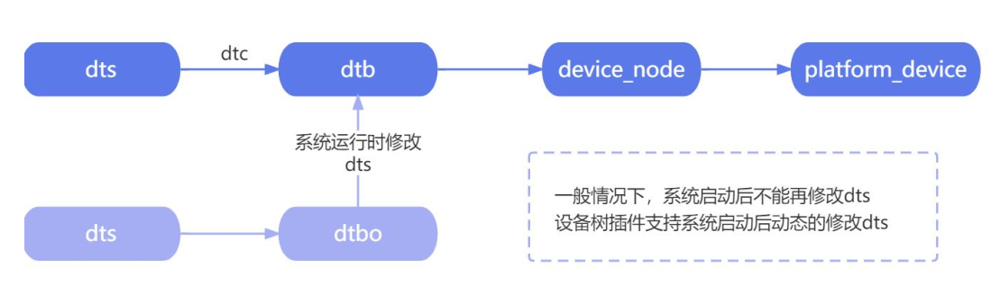
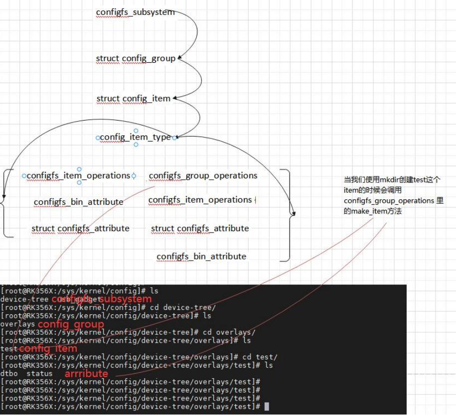

# 设备树插件

Linux4.4 以后引入了动态设备树（Dynamic DeviceTree）。设备树插件（Device Tree Overlay）是一种用于设备树（Device Tree）的扩展机制。设备树是一种用于描述硬件设备的数据结构，广泛应用于嵌入式系统中，特别是基于 Linux 内核的系统中。

设备树插件**允许在运行时动态修改设备树的内容，以便添加，修改或删除设备节点和属性**。它提供了一种灵活的方式来配置和管理硬件设备，而无需重新编译整个设备树。通过使用设备树插件，开发人员可以在不重新启动系统的情况下对硬件进行配置更改。

设备树插件（Dynamic DeviceTree）通常以一种文本格式定义，称为设备树源文件（DeviceTree Source,DTS）。DTS 文件描述了设备树的结构和属性，包括设备节点，寄存器地址，中断信息等。设备树插件可以通过加载和解析设备树文件，并将其合并到现有的设备树中，从而实现对设备树的动态修改。


**应用场景**

使用设备树插件，可以实现一些常见的配置变化，比如添加外部设备，禁用不需要的设备，修改设备属性等。这对于嵌入式系统的开发和调试非常有用，特别是面对多种硬件配置或需要频繁更改硬件配置的情况下

## 设备树插件语法

**overlay.dts**

- 头部声明

```dts
/dts-v1/;
/plugin/;
```

- 插件节点名称用于定义要添加，修改或删除的设备节点及其属性。它使用与设备树源文件相同的语法，但在节点名称前面使用特定的修饰符来指示插件的操作

比如下面这个节点：

```dts
//arch/arm64/boot/dts/rockchip/topeet-rk3568-linux.dts
		//485 使能引脚
        rk_485_ctl: rk-485-ctl {
                compatible = "topeet,rs485_ctl";
                gpios = <&gpio0 RK_PC6 GPIO_ACTIVE_HIGH>;
                pinctrl-names = "default";
                pinctrl-0 = <&rk_485_gpio>;
        };
```

如果在设备树插件中要为这个节点添加 overlay_node 节点:

有以下几种表达方式：

```dts
/dts-v1/;
/plugin/;

// 方法1
&{/rk-485-ctl}{
	overlay_node{
		status = "okay";
	}
}

// 方法2
&rk_485_ctl{
	overlay_node{
		status = "okay";
	}
}

// 方法3

/{
    fragment@0{
        target-path="/rk-485-ctl";
        __overlay__{
            overlay_node{
                status = "okay";
            };
        };
    };
    fragment@1{
        target=<&rk_485_ctl>;
        __overlay__{
            overlay_node{
                status = "okay";
            };
        };
    };
};
```


设备树插件的编译和设备树编译一样的。

```bash
dtc -I dts -O dtb overlay.dts -o overlay.dtbo
```

加载设备树插件(首先要有设备树插件驱动，通过`cat proc/filesystems` 检查 configfs 是否挂载成功)

进入系统目录`/sys/kernel/config/device-tree/overlays/`

```bash
$ cd /sys/kernel/config/device-tree/overlays/
# 创建一个内核对象
$ mkdir test
$ cd test
$ ls
dtbo status

$ cat overlay.dtb > dtbo
# 使能 dtbo
$ echo 1 > status
# 此时我们可以使用以下命令看到加载的节点
$ ls /proc/device-tree/rk-485-ctl/overlay_node/

# 如果我们想删掉使用 dtbo 修改的节点，删除创建的内核对象test即可
$ cd /sys/kernel/config/device-tree/overlays/
$ rmdir test
```

可以创建多个

```bash
$ cd /sys/kernel/config/device-tree/overlays/
# 创建一个内核对象
$ mkdir test1
# 用另一个设备树覆盖
```

删除时会恢复到test加载后的设备树

## 虚拟文件系统ConfigFS介绍

在 Linux 内核中，有几个常用的虚拟文件系统，虚拟文件系统提供了一个内核抽象层，使得应用程序可以通过统一的文件访问接口操作不同类型的文件和设备。它简化了应用程序的开发和维护，提供了更高的可移植性和灵活性，并提供了管理文件系统和访问底层硬件的功能。

- **procfs** 

虚拟文件系统，**提供了对系统内核运行时状态的访问接口**。它以文件和目录的形式表示内核中的进程，设备，驱动程序和其他系统信息。通过读取和写入 procfs 中的文件，可以获取和修改有关系统状态的信息。

- **sysfs** 

虚拟文件系统，**用于表示系统中的设备，驱动程序和其他内核对象**。它提供一种统一的接口，通过文件和目录来访问和配置这些对象的属性和状态。Sysfs 常用于设备驱动程序和系统管理工具，用于查看和控制系统的硬件和内核对象。

- **configfs** 

虚拟文件系统，**用于动态配置和管理内核对象**。它提供了一种以文件和目录的形式访问内核对象的接口，允许用户在运行时添加，修改和删除内核对象，而无需重新编译内核或重新启动系统。ConfigFS 常用于配置和管理设备，驱动程序和子系统


> 这些虚拟文件系统在功能上有一些区别：
>
> - Procfs 主要用于访问和管理进程信息，提供了有关进程，内核参数和系统状态的信息。
> - Sysfs 主要用于表示和配置系统中的设备，驱动程序和其他内核对象，提供了一种统一的接口来访问和控制这些对象的属性和状态。
> - Configfs 主要用于动态配置和管理内核对象，提供了一种以文件和目录的形式访问内核对象的接口，允许在运行时添加，修改和删除内核对象。





要实现上述的功能，用户空间需要和内核进行交互，也就是将 dtbo 加载到内存里面去。sysfs 虚拟文件系统的作用是将内核中的数据、属性以文件的方式导出到用户空间。导出到用户空间以后，读这些文件表示读取设备的文件，写这些文件就表示控制设备。

configfs 作用的英文解释为 **Userspace-driven kernel object configuration**，翻译过来就是用户空间配置内核对象。

所以 configfs 与 sysfs 恰恰相反，sysfs 导出内核对象给用户空间，configfs 是从用户空间去配置内核对象，并且不需要重新编译内核或者修改内核代码。所以 configfs 更适合设备树插件这个技术。

## ConfigFS核心数据结构

ConfigFS 的核心数据结构主要包括以下几个部分：

**configfs_subsystem**

configfs_subsystem 是一个顶层的数据结构，用于表示整个 ConfigFS 子系统。它包含了根配置项组的指针，以及 ConfigFS 的其他属性和状态信息。

**config_group**

config_group 是一种特殊类型的配置项，表示一个配置项组。它可以包含一组相关的配置项，形成一个层次结构。config_group 结构包含了父配置项的指针，以及指向子配置项的链表。

**config_item**

这是 ConfigFS 中最基本的数据结构，用于表示一个配置项。每个配置项都是一个内核对象，可以是设备、驱动程序、子系统等。config_item 结构包含了配置项的类型、名称、属性、状态等信息，以及指向父配置项和子配置项的指针。


这些数据结构之间的关系可以形成一个树形结构，其中 configfs_subsystem 是根节点，config_group 表示配置项组，config_item 表示单个配置项。子配置项通过链表连接在一起，形成父子关系。


**configfs_subsystem**

```c
struct configfs_subsystem {
	struct config_group su_group;
	struct mutex su_mutex;
};
```

configfs_subsystem 结构体中包含 config_group 结构体，config_group 结构体如下所示：

**config_group**

```c
struct config_group {
	struct config_item cg_item;
	struct list_head cg_children;
	struct configfs_subsystem *cg_subsys;
	struct list_head default_groups;
	struct list_head group_entry;
};
```

config_group 结构体中包含 config_item 结构体，config_item结构体如下所示：

```c
struct config_item {
	char *ci_name;
	char ci_namebuf[CONFIGFS_ITEM_NAME_LEN]; //目录的名字
	struct kref ci_kref;
	struct list_head ci_entry;
	struct config_item *ci_parent;
	struct config_group *ci_group;
	const struct config_item_type *ci_type; //目录下属性文件和属性操作
	struct dentry *ci_dentry;
};
```


接下来我们来分析设备树插件驱动代码:

```c
static struct configfs_subsystem dtbocfg_root_subsys = {
    .su_group = {
        .cg_item = {
            .ci_namebuf = "device-tree",
            .ci_type   = &dtbocfg_root_type,
        },
    },
    .su_mutex = __MUTEX_INITIALIZER(dtbocfg_root_subsys.su_mutex),
};
```

这段代码定义了一个名为 dtbocfg_root_subsys 的 configfs_subsystem 结构体实例，表示ConfigFS 中的一个子系统。

首先，`dtbocfg_root_subsys.su_group` 是一个 config_group 结构体，它表示子系统的根配置项组。在这里，该结构体的.cg_item 字段表示根配置项组的基本配置项。

`.ci_namebuf = "device-tree"`：配置项的名称设置为"device-tree"，表示该配置项的名称为"device-tree"。

`.ci_type = &dtbocfg_root_type`：配置项的类型设置为 `dtbocfg_root_type`，这是一个自定义的配置项类型。
接下来，`.su_mutex` 字段是一个互斥锁，用于保护子系统的操作。在这里，使用了`__MUTEX_INITIALIZER` 宏来初始化互斥锁。


上面的代码创建了一个名为"device-tree"的子系统，它的根配置项组为空。可以在该子系统下添加更多的配置项和配置项组，用于动态配置和管理设备树相关的内核对象。Linux系统下创建了 device-tree 这个子系统

```bash
$ ls /sys/kernel/config/
devicetree usb_gadget
```


驱动代码入口部分：

```c
static int __init dtbocfg_module_init(void)
{
    int retval = 0;
    pr_info("%s\n", __func__);

    // 初始化 configfs 组
    config_group_init(&dtbocfg_root_subsys.su_group);
    config_group_init_type_name(&dtbocfg_overlay_group, "overlays", &dtbocfg_overlays_type);

    // 注册子系统
    retval = configfs_register_subsystem(&dtbocfg_root_subsys);
    if (retval != 0) {
        pr_err("%s: couldn't register subsys\n", __func__);
        goto register_subsystem_failed;
    }

    // 注册组
    retval = configfs_register_group(&dtbocfg_root_subsys.su_group, &dtbocfg_overlay_group);
    if (retval != 0) {
        pr_err("%s: couldn't register group\n", __func__);
        goto register_group_failed;
    }

    pr_info("%s: OK\n", __func__);
    return 0;

register_group_failed:
    configfs_unregister_subsystem(&dtbocfg_root_subsys);
register_subsystem_failed:
    return retval;
}
```

这段代码是一个初始化函数 `dtbocfg_module_init()`，用于初始化和注册 ConfigFS 子系统和配置项组。

首先，通过 `config_group_init()`函数初始化了 `dtbocfg_root_subsys.su_group`，即子系统的根配置项组。接下来，使用 `config_group_init_type_name()`函数初始化了`dtbocfg_overlay_group`，表示名为"overlays"的配置项组，并指定了配置项组的类型为`dtbocfg_overlays_type`，这是一个自定义的配置项类型。

然后，调用 `configfs_register_subsystem()`函数注册了 `dtbocfg_root_subsys` 子系统。如果注册失败，将打印错误信息，并跳转到`register_subsystem_failed` 标签处进行错误处理。

接着，调用 `configfs_register_group()`函数注册了 dtbocfg_overlay_group 配置项组，并将其添加到 `dtbocfg_root_subsys.su_group` 下。

这段代码的作用是初始化和注册一个名为"device-tree"的 ConfigFS 子系统，并在其下创建一个名为"overlays"的配置项组。

Linux 系统下，在 device-tree 子系统下创建了 overlays 容器

```bash
$ ls /sys/kernel/config/device-tree/
overlays
```

## 属性和方法

**config_item**

```c
struct config_item {
	char *ci_name;
	char ci_namebuf[CONFIGFS_ITEM_NAME_LEN]; //目录的名字
	struct kref ci_kref;
	struct list_head ci_entry;
	struct config_item *ci_parent;
	struct config_group *ci_group;
	const struct config_item_type *ci_type; //目录下属性文件和属性操作
	struct dentry *ci_dentry;
};
```

config_item 结构体中包含了 config_item_type 结构体，config_item_type 结构体如下所示

**config_item_type** 

```c
struct config_item_type {
	struct module *ct_owner;
	struct configfs_item_operations *ct_item_ops; //item（目录）的操作方法
	struct configfs_group_operations *ct_group_ops; //group（容器）的操作方法
	struct configfs_attribute **ct_attrs; //属性文件的操作方法
	struct configfs_bin_attribute **ct_bin_attrs; //bin 属性文件的操作方法
};
```

config_item_type包含了许多重要数据结构：configfs_item_operations，configfs_group_operations，configfs_attribute，configfs_bin_attribute


**configfs_item_operations** 

```c
struct configfs_item_operations {
	//删除 item 方法，在 group 下面使用 rmdir 命令会调用这个方法
	void (*release)(struct config_item *);
	int (*allow_link)(struct config_item *src, struct config_item *target);
	void (*drop_link)(struct config_item *src, struct config_item *target);
};
```

**configfs_group_operations**

```c
struct configfs_group_operations {
	//创建 item 的方法，在 group 下面使用 mkdir 命令会调用这个方法
	struct config_item *(*make_item)(struct config_group *group, const char *name);
	//创建 group 的方法
	struct config_group *(*make_group)(struct config_group *group, const char *name);
	int (*commit_item)(struct config_item *item);
	void (*disconnect_notify)(struct config_group *group, struct config_item *item);
	void (*drop_item)(struct config_group *group, struct config_item *item);
};
```

**struct configfs_attribute** 

```c
struct configfs_attribute {
	const char *ca_name; // 属性文件的名字
	struct module *ca_owner;// 属性文件文件的所属模块
	umode_t ca_mode; // 属性文件访问权限
	// 读写方法的函数指针，具体功能需要自行实现。
	ssize_t (*show)(struct config_item *, char *);
	ssize_t (*store)(struct config_item *, const char *, size_t);
};
```




## 示例

### 注册configFS子系统

```c
#include <linux/module.h>
#include <linux/init.h>
#include <linux/slab.h>
#include <linux/configfs.h>

//定义名为"myconfig_item_type"的配置项类型结构体
static const struct config_item_type myconfig_item_type ={
  .ct_owner = THIS_MODULE,
  .ct_item_ops = NULL,
  .ct_group_ops = NULL,
  .ct_attrs = NULL,

};
//定义一个configfs_subsystem结构体实例"myconfigfs_subsystem"
static struct configfs_subsystem myconfigfs_subsystem ={
  .su_group = {
    .cg_item = {
      .ci_namebuf = "myconfigfs",
      .ci_type = &myconfig_item_type,
    },
  },

};

//模块的初始化函数
static int myconfigfs_init(void)
{
  //初始化配置组
  config_group_init(&myconfigfs_subsystem.su_group);
  //注册子系统
  configfs_register_subsystem(&myconfigfs_subsystem);
  return 0;
}
// 模块退出函数
static void myconfigfs_exit(void)
{
  configfs_unregister_subsystem(&myconfigfs_subsystem);

}

module_init(myconfigfs_init); // 指定模块的初始化函数
module_exit(myconfigfs_exit); // 指定模块的退出函数

MODULE_LICENSE("GPL");   // 模块使用的许可证
MODULE_AUTHOR("topeet"); // 模块的作者

```

加载后可以在`/sys/kernel/config`目录下看到注册的子系统myconfigfs

### 注册group容器

```c
#include <linux/module.h>
#include <linux/init.h>
#include <linux/slab.h>
#include <linux/configfs.h>

// 定义一个名为"mygroup"的config_group结构体
static struct config_group mygroup;

// 定义一个名为"mygroup_config_item_type"的config_item_type结构体，用于描述配置项类型。
static const struct config_item_type mygroup_config_item_type = {
    .ct_owner = THIS_MODULE,
    .ct_item_ops = NULL,
    .ct_group_ops = NULL,
    .ct_attrs = NULL,
};

// 定义名为"myconfig_item_type"的配置项类型结构体
static const struct config_item_type myconfig_item_type = {
    .ct_owner = THIS_MODULE,
    .ct_group_ops = NULL,
};

// 定义一个configfs_subsystem结构体实例"myconfigfs_subsystem"
static struct configfs_subsystem myconfigfs_subsystem = {
    .su_group = {
        .cg_item = {
            .ci_namebuf = "myconfigfs",
            .ci_type = &myconfig_item_type,
        },
    },
};

// 模块的初始化函数
static int myconfig_group_init(void)
{
  // 初始化配置组
  config_group_init(&myconfigfs_subsystem.su_group);
  // 注册子系统
  configfs_register_subsystem(&myconfigfs_subsystem);

  // 初始化配置组"mygroup"
  config_group_init_type_name(&mygroup, "mygroup", &mygroup_config_item_type);
  // 在子系统中注册配置组"mygroup"
  configfs_register_group(&myconfigfs_subsystem.su_group, &mygroup);
  return 0;
}

// 模块退出函数
static void myconfig_group_exit(void)
{
  // 注销子系统
  configfs_unregister_subsystem(&myconfigfs_subsystem);
}

module_init(myconfig_group_init); // 指定模块的初始化函数
module_exit(myconfig_group_exit); // 指定模块的退出函数

MODULE_LICENSE("GPL");   // 模块使用的许可证
MODULE_AUTHOR("topeet"); // 模块的作者
```

测试

```bash
$ ls /sys/kernel/config/myconfigfs
mygroup
```

### 用户空间创建item

我们已经成功在/sys/kernel/config/目录下创建了 myconfigfs 子系统，并在这个子系统下创建了 mygroup 容器，但是 mygroup 容器下不能使用 mkdir 创建 item

```c
#include <linux/module.h>
#include <linux/init.h>
#include <linux/slab.h>
#include <linux/configfs.h>

// 定义一个名为"mygroup"的config_group结构体
static struct config_group mygroup;

// 自定义的配置项结构体
struct myitem
{
    struct config_item item;
};

// 配置项释放函数
void myitem_release(struct config_item *item)
{
    struct myitem *myitem = container_of(item, struct myitem, item);
    kfree(myitem);
    printk("%s\n", __func__);
}

// 配置项操作结构体
struct configfs_item_operations myitem_ops = {
    .release = myitem_release,
};

// 配置项类型结构体
static struct config_item_type mygroup_item_type = {
    .ct_owner = THIS_MODULE,
    .ct_item_ops = &myitem_ops,
};

// 创建配置项函数
struct config_item *mygroup_make_item(struct config_group *group, const char *name)
{
    struct myitem *myconfig_item;
    printk("%s\n", __func__);
    myconfig_item = kzalloc(sizeof(*myconfig_item), GFP_KERNEL);
    config_item_init_type_name(&myconfig_item->item, name, &mygroup_item_type);
    return &myconfig_item->item;
}

// 配置组操作结构体
struct configfs_group_operations mygroup_ops = {
    .make_item = mygroup_make_item,
};

// 定义名为"mygroup_config_item_type"的config_item_type结构体，用于描述配置项类型。
static const struct config_item_type mygroup_config_item_type = {
    .ct_owner = THIS_MODULE,
    .ct_group_ops = &mygroup_ops,
};

// 定义名为"myconfig_item_type"的配置项类型结构体
static const struct config_item_type myconfig_item_type = {
    .ct_owner = THIS_MODULE,
    .ct_group_ops = NULL,
};

// 定义一个configfs_subsystem结构体实例"myconfigfs_subsystem"
static struct configfs_subsystem myconfigfs_subsystem = {
    .su_group = {
        .cg_item = {
            .ci_namebuf = "myconfigfs",
            .ci_type = &myconfig_item_type,
        },
    },
};

// 模块的初始化函数
static int myconfig_group_init(void)
{
    // 初始化配置组
    config_group_init(&myconfigfs_subsystem.su_group);
    // 注册子系统
    configfs_register_subsystem(&myconfigfs_subsystem);

    // 初始化配置组"mygroup"
    config_group_init_type_name(&mygroup, "mygroup", &mygroup_config_item_type);
    // 在子系统中注册配置组"mygroup"
    configfs_register_group(&myconfigfs_subsystem.su_group, &mygroup);
    return 0;
}

// 模块退出函数
static void myconfig_group_exit(void)
{
    // 注销子系统
    configfs_unregister_subsystem(&myconfigfs_subsystem);
}

module_init(myconfig_group_init); // 指定模块的初始化函数
module_exit(myconfig_group_exit); // 指定模块的退出函数

MODULE_LICENSE("GPL");   // 模块使用的许可证
MODULE_AUTHOR("topeet"); // 模块的作者
```

### 完善drop和release

release 和 .drop_item 是两个不同的成员字段，用于不同的目的：

- `.release` 成员字段是在 `struct config_item_type` 结构体中定义的一个回调函数指针。它指向一个函数，当 configfs 中的配置项被释放或删除时，内核会调用该函数来执行相应的资源释放操作。它通常用于释放与配置项相关的资源，比如释放动态分配的内存、关闭打开的文件描述符等。
- `.drop_item` 是在 `struct configfs_group_operations` 结构体中定义的一个回调函数指针。它指向一个函数，当 configfs 中的配置组（group）被删除时，内核会调用该函数来处理与配置组相关的操作。这个函数通常用于清理配置组的状态、释放相关的资源以及执行其他必要的清理操作。`.drop_item` 函数在删除配置组时被调用，而不是在删除单个配置项时被调用。

`.release` 成员字段用于配置项的释放操作，而 `.drop_item` 成员字段用于配置组的删除操作。它们分别在不同的上下文中执行不同的任务，但都与资源释放和清理有关。

```c
#include <linux/module.h>
#include <linux/init.h>
#include <linux/slab.h>
#include <linux/configfs.h>

// 定义一个名为"mygroup"的config_group结构体
static struct config_group mygroup;

// 自定义的配置项结构体
struct myitem
{
    struct config_item item;
};

// 配置项释放函数
void myitem_release(struct config_item *item)
{
    struct myitem *myitem = container_of(item, struct myitem, item);
    kfree(myitem);
    printk("%s\n", __func__);
}

// 配置项操作结构体
struct configfs_item_operations myitem_ops = {
    .release = myitem_release,
};

// 配置项类型结构体
static struct config_item_type mygroup_item_type = {
    .ct_owner = THIS_MODULE,
    .ct_item_ops = &myitem_ops,
};

// 创建配置项函数
struct config_item *mygroup_make_item(struct config_group *group, const char *name)
{
    struct myitem *myconfig_item;
    printk("%s\n", __func__);
    myconfig_item = kzalloc(sizeof(*myconfig_item), GFP_KERNEL);
    config_item_init_type_name(&myconfig_item->item, name, &mygroup_item_type);
    return &myconfig_item->item;
}

// 删除配置项函数
void mygroup_delete_item(struct config_group *group, struct config_item *item)
{
    struct myitem *myitem = container_of(item, struct myitem, item);
    
    config_item_put(&myitem->item);
    printk("%s\n", __func__);
}

// 配置组操作结构体
struct configfs_group_operations mygroup_ops = {
    .make_item = mygroup_make_item,
    .drop_item = mygroup_delete_item,
};

// 定义名为"mygroup_config_item_type"的config_item_type结构体，用于描述配置项类型。
static const struct config_item_type mygroup_config_item_type = {
    .ct_owner = THIS_MODULE,
    .ct_group_ops = &mygroup_ops,
};

// 定义名为"myconfig_item_type"的配置项类型结构体
static const struct config_item_type myconfig_item_type = {
    .ct_owner = THIS_MODULE,
    .ct_group_ops = NULL,
};

// 定义一个configfs_subsystem结构体实例"myconfigfs_subsystem"
static struct configfs_subsystem myconfigfs_subsystem = {
    .su_group = {
        .cg_item = {
            .ci_namebuf = "myconfigfs",
            .ci_type = &myconfig_item_type,
        },
    },
};

// 模块的初始化函数
static int myconfig_group_init(void)
{
    // 初始化配置组
    config_group_init(&myconfigfs_subsystem.su_group);
    // 注册子系统
    configfs_register_subsystem(&myconfigfs_subsystem);

    // 初始化配置组"mygroup"
    config_group_init_type_name(&mygroup, "mygroup", &mygroup_config_item_type);
    // 在子系统中注册配置组"mygroup"
    configfs_register_group(&myconfigfs_subsystem.su_group, &mygroup);
    return 0;
}

// 模块退出函数
static void myconfig_group_exit(void)
{
    // 注销子系统
    configfs_unregister_subsystem(&myconfigfs_subsystem);
}

module_init(myconfig_group_init); // 指定模块的初始化函数
module_exit(myconfig_group_exit); // 指定模块的退出函数

MODULE_LICENSE("GPL");   // 模块使用的许可证
MODULE_AUTHOR("topeet"); // 模块的作者
```

### 注册attribute

我们成功创建了 item，但是 item 下面没有创建属性和操作项。

```c
#include <linux/module.h>
#include <linux/init.h>
#include <linux/slab.h>
#include <linux/configfs.h>

// 定义一个名为"mygroup"的config_group结构体
static struct config_group mygroup;

// 自定义的配置项结构体
struct myitem
{
    struct config_item item;
    int size;
    void *addr;
};

// 配置项释放函数
void myitem_release(struct config_item *item)
{
    struct myitem *myitem = container_of(item, struct myitem, item);
    kfree(myitem);
    printk("%s\n", __func__);
};

// 读取配置项内容的回调函数
ssize_t myread_show(struct config_item *item, char *page)
{
    struct myitem *myitem = container_of(item, struct myitem, item);
    memcpy(page, myitem->addr, myitem->size);
    printk("%s\n", __func__);
    return myitem->size;
};

// 写入配置项内容的回调函数
ssize_t mywrite_store(struct config_item *item, const char *page, size_t size)
{
    struct myitem *myitem = container_of(item, struct myitem, item);
    myitem->addr = kmemdup(page, size, GFP_KERNEL);
    myitem->size = size;
    printk("%s\n", __func__);
    return myitem->size;
};

// 创建只读配置项
CONFIGFS_ATTR_RO(my, read);
// 创建只写配置项
CONFIGFS_ATTR_WO(my, write);

// 配置项属性数组
struct configfs_attribute *my_attrs[] = {
    &myattr_read,
    &myattr_write,
    NULL,
};

// 配置项操作结构体
struct configfs_item_operations myitem_ops = {
    .release = myitem_release,
};

// 配置项类型结构体
static struct config_item_type mygroup_item_type = {
    .ct_owner = THIS_MODULE,
    .ct_item_ops = &myitem_ops,
    .ct_attrs = my_attrs,
};

// 创建配置项函数
struct config_item *mygroup_make_item(struct config_group *group, const char *name)
{
    struct myitem *myconfig_item;
    printk("%s\n", __func__);
    myconfig_item = kzalloc(sizeof(*myconfig_item), GFP_KERNEL);
    config_item_init_type_name(&myconfig_item->item, name, &mygroup_item_type);
    return &myconfig_item->item;
}

// 删除配置项函数
void mygroup_delete_item(struct config_group *group, struct config_item *item)
{
    struct myitem *myitem = container_of(item, struct myitem, item);

    config_item_put(&myitem->item);
    printk("%s\n", __func__);
}

// 配置组操作结构体
struct configfs_group_operations mygroup_ops = {
    .make_item = mygroup_make_item,
    .drop_item = mygroup_delete_item,
};

// 配置项类型结构体
static const struct config_item_type mygroup_config_item_type = {
    .ct_owner = THIS_MODULE,
    .ct_group_ops = &mygroup_ops,
};

// 配置项类型结构体
static const struct config_item_type myconfig_item_type = {
    .ct_owner = THIS_MODULE,
    .ct_group_ops = NULL,
};

// 定义一个configfs_subsystem结构体实例"myconfigfs_subsystem"
static struct configfs_subsystem myconfigfs_subsystem = {
    .su_group = {
        .cg_item = {
            .ci_namebuf = "myconfigfs",
            .ci_type = &myconfig_item_type,
        },
    },
};

// 模块的初始化函数
static int myconfig_group_init(void)
{
    // 初始化配置组
    config_group_init(&myconfigfs_subsystem.su_group);
    // 注册子系统
    configfs_register_subsystem(&myconfigfs_subsystem);

    // 初始化配置组"mygroup"
    config_group_init_type_name(&mygroup, "mygroup", &mygroup_config_item_type);
    // 在子系统中注册配置组"mygroup"
    configfs_register_group(&myconfigfs_subsystem.su_group, &mygroup);
    return 0;
}

// 模块退出函数
static void myconfig_group_exit(void)
{
    // 注销子系统
    configfs_unregister_subsystem(&myconfigfs_subsystem);
}

module_init(myconfig_group_init); // 指定模块的初始化函数
module_exit(myconfig_group_exit); // 指定模块的退出函数

MODULE_LICENSE("GPL");   // 模块使用的许可证
MODULE_AUTHOR("topeet"); // 模块的作者
```

### 实现多级目录

```c
#include <linux/module.h>
#include <linux/init.h>
#include <linux/slab.h>
#include <linux/configfs.h>

// 定义一个名为"mygroup"的config_group结构体
static struct config_group mygroup;

// 自定义的配置项结构体
struct myitem
{
    struct config_item item;
    int size;
    void *addr;
};
// 自定义的配置组结构体
struct mygroup
{
    struct config_group group;
};

// 配置项释放函数
void myitem_release(struct config_item *item)
{
    struct myitem *myitem = container_of(item, struct myitem, item);
    kfree(myitem);
    printk("%s\n", __func__);
};

// 读取配置项内容的回调函数
ssize_t myread_show(struct config_item *item, char *page)
{
    struct myitem *myitem = container_of(item, struct myitem, item);
    memcpy(page, myitem->addr, myitem->size);
    printk("%s\n", __func__);
    return myitem->size;
};

// 写入配置项内容的回调函数
ssize_t mywrite_store(struct config_item *item, const char *page, size_t size)
{
    struct myitem *myitem = container_of(item, struct myitem, item);
    myitem->addr = kmemdup(page, size, GFP_KERNEL);
    myitem->size = size;
    printk("%s\n", __func__);
    return myitem->size;
};

// 创建只读配置项
CONFIGFS_ATTR_RO(my, read);
// 创建只写配置项
CONFIGFS_ATTR_WO(my, write);

// 配置项属性数组
struct configfs_attribute *my_attrs[] = {
    &myattr_read,
    &myattr_write,
    NULL,
};

// 配置项操作结构体
struct configfs_item_operations myitem_ops = {
    .release = myitem_release,
};

// 配置项类型结构体
static struct config_item_type mygroup_item_type = {
    .ct_owner = THIS_MODULE,
    .ct_item_ops = &myitem_ops,
    .ct_attrs = my_attrs,
};

// 配置组类型结构体
static struct config_item_type mygroup_type = {
    .ct_owner = THIS_MODULE,

};

// 创建配置项函数
struct config_item *mygroup_make_item(struct config_group *group, const char *name)
{
    struct myitem *myconfig_item;
    printk("%s\n", __func__);
    myconfig_item = kzalloc(sizeof(*myconfig_item), GFP_KERNEL);
    config_item_init_type_name(&myconfig_item->item, name, &mygroup_item_type);
    return &myconfig_item->item;
}

// 删除配置项函数
void mygroup_delete_item(struct config_group *group, struct config_item *item)
{
    struct myitem *myitem = container_of(item, struct myitem, item);

    config_item_put(&myitem->item);
    printk("%s\n", __func__);
}
// 创建配置组函数
struct config_group *mygroup_make_group(struct config_group *group, const char *name)
{
    struct mygroup *mygroup;
    printk("%s\n", __func__);
    mygroup = kzalloc(sizeof(*mygroup), GFP_KERNEL);
    config_group_init_type_name(&mygroup->group, name, &mygroup_type);
    return &mygroup->group;
};

// 配置组操作结构体
struct configfs_group_operations mygroup_ops = {
    .make_item = mygroup_make_item,
    .drop_item = mygroup_delete_item,
    .make_group = mygroup_make_group,
};

// 配置项类型结构体
static const struct config_item_type mygroup_config_item_type = {
    .ct_owner = THIS_MODULE,
    .ct_group_ops = &mygroup_ops,
};

// 配置项类型结构体
static const struct config_item_type myconfig_item_type = {
    .ct_owner = THIS_MODULE,
    .ct_group_ops = NULL,
};

// 定义一个configfs_subsystem结构体实例"myconfigfs_subsystem"
static struct configfs_subsystem myconfigfs_subsystem = {
    .su_group = {
        .cg_item = {
            .ci_namebuf = "myconfigfs",
            .ci_type = &myconfig_item_type,
        },
    },
};

// 模块的初始化函数
static int myconfig_group_init(void)
{
    // 初始化配置组
    config_group_init(&myconfigfs_subsystem.su_group);
    // 注册子系统
    configfs_register_subsystem(&myconfigfs_subsystem);

    // 初始化配置组"mygroup"
    config_group_init_type_name(&mygroup, "mygroup", &mygroup_config_item_type);
    // 在子系统中注册配置组"mygroup"
    configfs_register_group(&myconfigfs_subsystem.su_group, &mygroup);
    return 0;
}

// 模块退出函数
static void myconfig_group_exit(void)
{
    // 注销子系统
    configfs_unregister_subsystem(&myconfigfs_subsystem);
}

module_init(myconfig_group_init); // 指定模块的初始化函数
module_exit(myconfig_group_exit); // 指定模块的退出函数

MODULE_LICENSE("GPL");   // 模块使用的许可证
MODULE_AUTHOR("topeet"); // 模块的作者
```

## 移植设备树驱动插件

我们将探讨如何移植设备树插件到 iTOP-RK3568 开发板上。移植设备树插件主要包括以下几个步骤

- 配置内核支持挂载 configfs 虚拟文件系统。
- 配置内核支持设备树插件
- 移植设备树插件驱动

**配置内核支持挂载 configfs 虚拟文件系统**

```bash
make ARCH=arm64 menuconfig
# File System->Pseudo filesystems ->UserSpace-driven configuration filesystem
```

启动用后检查内核是否挂载了虚拟文件系统，如果没有运行下面命令挂载

```bash
$ mount -t configfs none /sys/kernel/config
```

**配置内核支持设备树插件**

```bash
make ARCH=arm64 menuconfig
# Device Driver -> Device Tree and Open Firmware support -> Device Tree overlays
# File System -> Overlay filesystem support
```

保存配置：

```bash
cp .config arch/arm64/configs/rockchip_linux_defconfig
cd ../
./build.sh kernel
```

**移植设备树插件驱动**

github上已有编写好的设备树插件驱动(https://github.com/ikwzm/dtbocfg/tree/master)，我们只要将此驱动编译成驱动模块或者编译进内核即可


## 改变集

设备树插件（dtbo）里面的节点也要被转换成 device_node，有的 device_node 也要被转换成 platform_device。不过在进行转换之前，`of_overlay_fdt_apply` 函数会先创建一个**改变集**。然后根据这个改变集去进行修改。

创建改变集的目的是为了方便对设备树进行修改和复原。设备树是一种静态的数据结构，一旦被编译和加载到内核中，就难以直接修改。为了解决这个问题，设备树覆盖功能引入了改变集的概念。

**改变集是一个描述设备树变化的数据结构，它记录了对设备树的修改操作，如添加、删除或修改节点。通过创建改变集，我们可以在运行时对设备树进行动态修改，而无需修改原始的设备树源文件**。

通过创建改变集，我们可以方便地定义需要进行的修改操作，而不必直接操作设备树的底层结构。这提供了一种高层次的抽象，使我们能够以更简洁和可读的方式描述设备树的变化。

同时，改变集也可以被保存、传递和应用到其他设备树上，方便在不同系统或环境中进行设备树的配置和定制。

此外，改变集还可以用于设备树的复原。在某些情况下，我们可能需要在运行时撤销对设备树的修改并恢复到原始状态。通过应用反向的改变集，我们可以还原设备树，使其回到修改之前的状态，实现修改的复原。

因此，创建改变集提供了一种方便、可控和可复原的方式来修改设备树，使设备树的管理和配置更加灵活和可靠。


**参考资料**

`kernel/Documentation/filesystems/configfs` 目录下的 configfs.txt。

`kernel/samples/configfs` 目录下的 configfs_sample.c

