# 设备模型


字符设备驱动通常适用于相对简单的设备，对于一些更复杂的功能，比如说**电源管理**和**热插拔事件管理**，使用字符设备框架可能不够灵活和高效。

为了应对更复杂的设备和功能，Linux内核提供了设备模型。设备模型允许开发人员以更高级的方式来描述硬件设备和它们之间的关系，并提供一组通用 API 和机制来处理设备的注册，热插拔事件，电源管理等。

通过使用设备模型，驱动开发人员可以将更多的底层功能交给内核来处理，而不必重复实现这些基础功能。这使得驱动的编写更加高级和模块化，减少了重复工作和出错的可能性。

**对于一些常见的硬件设备，如 USB、I2C 和平台设备，内核已经提供了相应的设备模型和相关驱动，开发人员可以基于这些模型来编写驱动，从而更快地实现特定设备的功能，并且可以借助内核的电源管理和热插拔事件管理功能**。

## 使用设备模型的优点

设备模型在内核驱动中扮演着重要的角色，它提供了一种统一的方式来描述硬件设备和它们之间的关系。以下是设备模型在内核驱动中的几个重要方面。

- **代码复用**：

**设备模型允许多个设备复用同一个驱动**。通过在设备树或总线上定义不同的设备节点，这些设备可以使用相同的驱动进行初始化和管理。这样可以减少代码的冗余，提高驱动的复用性和维护性。

- **资源的动态申请和释放**

设备模型提供了一种机制来动态申请和释放设备所需的资源，如内存，中断等。驱动可以使用这些机制来管理设备所需的资源，确保在设备初始化和关闭时进行正确的资源分配和释放。

- **简化驱动编写**

设备模型提供了一组通用 API 和机制，使得驱动编写更加简化和模块化。开发人员可以使用这些 API 来注册设备，处理设备事件，进行设备的读写操作等，而无需重复实现这些通用功能。

- **热插拔机制**

**设备模型支持热插拔机制**，能够在运行时动态添加或移除设备。当设备插入或拔出时，内核会生成相应的热插拔事件，驱动可以通过监听这些事件来执行相应的操作，如设备的初始化或释放。

- **驱动的面向对象思想**

设备模型的设计借鉴了面向对象编程（OOP）的思想。**每个设备都被看作是一个对象，具有自己的属性和方法，并且可以通过设备模型的机制进行继承和扩展**。这种设计使得驱动的编写更加模块化和可扩展，可以更好地应对不同类型的设备和功能需求。


## kobject和kset

**kobject** 和 **kset** 是 Linux 内核中用于管理内核对象的基本概念。

### kobject

kobject(内核对象)是内核中抽象出来的通用对象模型，**用于表示内核中的各种实体**。kobject是一个结构体，其中包含了一些描述该对象的属性和方法。它提供了一种统一的接口和机制，用于管理和操作内核对象。

**include/linux/kobject.h**

```c
struct kobject {
	const char		*name;
	struct list_head	entry;
	struct kobject		*parent;
	struct kset		*kset;
	struct kobj_type	*ktype;
	struct kernfs_node	*sd; /* sysfs directory entry */
	struct kref		kref;
#ifdef CONFIG_DEBUG_KOBJECT_RELEASE
	struct delayed_work	release;
#endif
	unsigned int state_initialized:1;
	unsigned int state_in_sysfs:1;
	unsigned int state_add_uevent_sent:1;
	unsigned int state_remove_uevent_sent:1;
	unsigned int uevent_suppress:1;
};
```


- `const char *name`：表示 kobject 的名称，**通常用于在/sys 目录下创建对应的目录**
- `struct list_head entry`：用于将 kobject 链接到父 kobject 的子对象列表中，以建立层次关系。
- `struct kobject *parent`：指向父 kobject，表示 kobject 的层次关系。
- `struct kset *kset`：指向包含该 kobject 的 kset，用于进一步组织和管理 kobject。
- `struct kobj_type *ktype`：指向定义 kobject 类型的 kobj_type 结构体，**描述 kobject 的属性和操作**。
- `struct kernfs_node *sd`：指向 sysfs 目录中对应的 kernfs_node，用于访问和操作 sysfs 目录项。
- `struct kref kref`：**用于对 kobject 进行引用计数，确保在不再使用时能够正确释放资源**。
- `unsigned int` 字段：表示一些状态标志和配置选项，例如是否已初始化、是否在 sysfs 中、是否发送了 add/remove uevent 等。


**每一个 kobject 都会对应系统`/sys/`下的一个目录**

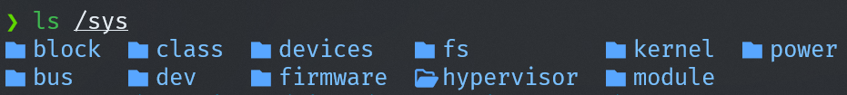


kobject 表示系统/sys 下的一个目录，而目录又是有多个层次，所以对应 kobject 的树状关系如下图所示

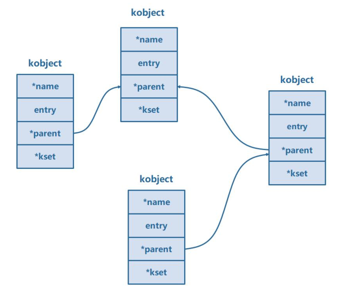


可以用两种方法来创建kobject

```c
#include <linux/module.h>
#include <linux/init.h>
#include <linux/slab.h>
#include <linux/configfs.h>
#include <linux/kernel.h>
#include <linux/kobject.h>

// 定义了三个kobject指针变量：mykobject01、mykobject02、mykobject03
struct kobject *mykobject01;
struct kobject *mykobject02;
struct kobject *mykobject03;

// 定义了一个kobj_type结构体变量mytype，用于描述kobject的类型。
struct kobj_type mytype;
// 模块的初始化函数
static int mykobj_init(void)
{
    int ret;
    // 创建kobject的第一种方法
    // 创建并添加了名为"mykobject01"的kobject对象，父kobject为NULL
    mykobject01 = kobject_create_and_add("mykobject01", NULL);
    // 创建并添加了名为"mykobject02"的kobject对象，父kobject为mykobject01。
    mykobject02 = kobject_create_and_add("mykobject02", mykobject01);

    // 创建kobject的第二种方法
    // 1 使用kzalloc函数分配了一个kobject对象的内存
    mykobject03 = kzalloc(sizeof(struct kobject), GFP_KERNEL);
    // 2 初始化并添加到内核中，名为"mykobject03"。
    ret = kobject_init_and_add(mykobject03, &mytype, NULL, "%s", "mykobject03");

    return 0;
}

// 模块退出函数
static void mykobj_exit(void)
{
    // 释放了之前创建的kobject对象
    kobject_put(mykobject01);
    kobject_put(mykobject02);
    kobject_put(mykobject03);
}

module_init(mykobj_init); // 指定模块的初始化函数
module_exit(mykobj_exit); // 指定模块的退出函数

MODULE_LICENSE("GPL");   // 模块使用的许可证
MODULE_AUTHOR("topeet"); // 模块的作者
```


### kset


**kset(内核对象集合)是一种用于组织和管理一组相关 kobject 的容器**。

kset 是 kobject 的一种扩展，它提供了一种层次化的组织结构，可以将一组相关的 kobject 组织在一起。kset 在内核里面用 `struct kset` 结构体来表示

 **include/linux/kobject.h**

```c
/**
 * struct kset - a set of kobjects of a specific type, belonging to a specific subsystem.
 *
 * A kset defines a group of kobjects.  They can be individually
 * different "types" but overall these kobjects all want to be grouped
 * together and operated on in the same manner.  ksets are used to
 * define the attribute callbacks and other common events that happen to
 * a kobject.
 *
 * @list: the list of all kobjects for this kset
 * @list_lock: a lock for iterating over the kobjects
 * @kobj: the embedded kobject for this kset (recursion, isn't it fun...)
 * @uevent_ops: the set of uevent operations for this kset.  These are
 * called whenever a kobject has something happen to it so that the kset
 * can add new environment variables, or filter out the uevents if so
 * desired.
 */
struct kset {
	struct list_head list;
	spinlock_t list_lock;
	struct kobject kobj;
	const struct kset_uevent_ops *uevent_ops;
} __randomize_layout;
```

- `struct list_head list`：用于将 kset 链接到**全局 kset 链表**中，以便对 kset 进行遍历和管理。
- `spinlock_t list_lock`：用于保护对 kset 链表的并发访问，确保线程安全性。
- `struct kobject kobj`：作为 **kset 的 kobject 表示**，用于在`/sys` 目录下创建对应的目录，并与kset 关联。
- `const struct kset_uevent_ops *uevent_ops`：**指向 kset 的 uevent 操作的结构体，用于处理与 kset 相关的 uevent 事件**（热插拔相关）。


kobject和kset的关系如下：

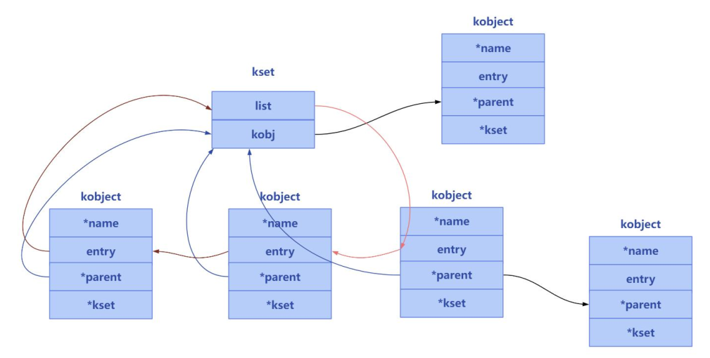

- kset 是 kobject 的一种扩展：kset 可以被看作是 kobject 的一种特殊形式，它扩展了 kobject 并提供了一些额外的功能。**kset 可以包含多个 kobject，形成一个层次化的组织结构**。
- kobject 属于一个 kset：**每个 kobject 都属于一个 kset**。kobject 结构体中的 `struct kset *kset`字段指向所属的 kset。这个关联关系表示了 kobject 所在的集合或组织。

总结起来，kset 和 kobject 之间的关系是：**一个 kset 可以包含多个 kobject，而一个 kobject只能属于一个 kset**。kset 提供了对 kobject 的集合管理和操作接口，用于组织和管理具有相似特性或关系的 kobject。这种关系使得内核能够以一种统一的方式管理和操作不同类型的内核对象。


```c
#include <linux/module.h>
#include <linux/init.h>
#include <linux/slab.h>
#include <linux/configfs.h>
#include <linux/kernel.h>
#include <linux/kobject.h>

// 定义kobject结构体指针，用于表示第一个自定义内核对象
struct kobject *mykobject01;
// 定义kobject结构体指针，用于表示第二个自定义内核对象
struct kobject *mykobject02;
// 定义kset结构体指针，用于表示自定义内核对象的集合
struct kset *mykset;
// 定义kobj_type结构体，用于定义自定义内核对象的类型
struct kobj_type mytype;

// 模块的初始化函数
static int mykobj_init(void)
{
    int ret;

    // 创建并添加kset，名称为"mykset"，父kobject为NULL，属性为NULL
    mykset = kset_create_and_add("mykset", NULL, NULL);

    // 为mykobject01分配内存空间，大小为struct kobject的大小，标志为GFP_KERNEL
    mykobject01 = kzalloc(sizeof(struct kobject), GFP_KERNEL);
    // 将mykset设置为mykobject01的kset属性
    mykobject01->kset = mykset;
    // 初始化并添加mykobject01，类型为mytype，父kobject为NULL，格式化字符串为"mykobject01"
    ret = kobject_init_and_add(mykobject01, &mytype, NULL, "%s", "mykobject01");

    // 为mykobject02分配内存空间，大小为struct kobject的大小，标志为GFP_KERNEL
    mykobject02 = kzalloc(sizeof(struct kobject), GFP_KERNEL);
    // 将mykset设置为mykobject02的kset属性
    mykobject02->kset = mykset;
    // 初始化并添加mykobject02，类型为mytype，父kobject为NULL，格式化字符串为"mykobject02"
    ret = kobject_init_and_add(mykobject02, &mytype, NULL, "%s", "mykobject02");

    return 0;
}

// 模块退出函数
static void mykobj_exit(void)
{
    // 释放mykobject01的引用计数
    kobject_put(mykobject01);

    // 释放mykobject02的引用计数
    kobject_put(mykobject02);
}

module_init(mykobj_init); // 指定模块的初始化函数
module_exit(mykobj_exit); // 指定模块的退出函数

MODULE_LICENSE("GPL");   // 模块使用的许可证
MODULE_AUTHOR("topeet"); // 模块的作者
```


## 为什么要引入设备模型

设备模型包含以下四个概念：

1. **总线（Bus）**：总线是设备模型中的基础组件，**用于连接和传输数据的通信通道**。**总线可以是物理总线（如 PCI、USB）或虚拟总线（如虚拟设备总线）**。总线提供了设备之间进行通信和数据传输的基本机制。
2. **设备（Device）**：**设备是指计算机系统中的硬件设备**，例如网卡、显示器、键盘等。每个设备都有一个唯一的标识符，用于在系统中进行识别和管理。设备模型通过设备描述符来描述设备的属性和特性。
3. **驱动（Driver）**：**驱动是设备模型中的软件组件，用于控制和管理设备的操作**。每个设备都需要相应的驱动程序来与操作系统进行交互和通信。驱动程序负责向设备发送命令、接收设备事件、进行设备配置等操作。
4. **类（Class）**：类是设备模型中的**逻辑组织单元**，用于**对具有相似功能和特性的设备进行分类和管理**。类定义了一组共享相同属性和行为的设备的集合。通过设备类，可以对设备进行分组、识别和访问。


在 Linux 设备模型中，虚构了一条名为“platform”的总线，用来连接一些直接与 CPU 相连的设备控制器。这种设备控制器通常不符合常见的总线标准，比如 PCI 总线和 USB 总线，所以 Linux 使用 platform 总线来管理这些设备。

**Platform 总线允许设备控制器与设备驱动程序进行通信和交互**。

**设备控制器在设备树中定义，并通过设备树与对应的设备驱动程序匹配**。

在设备模型中，Platform 总线提供了一种统一的接口和机制来注册和管理这些设备控制器。设备驱动程序可以通过注册到 Platform 总线的方式，与相应的设备控制器进行绑定和通信。设备驱动程序可以访问设备控制器的寄存器、配置设备、处理中断等操作，如下图所示：

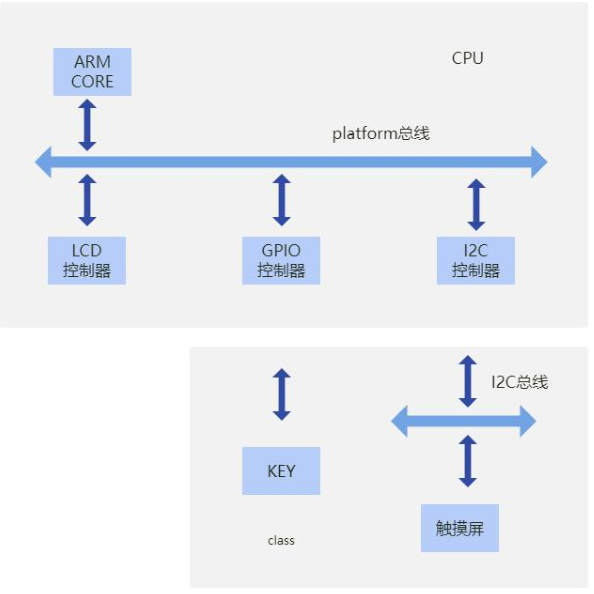


### struct bus_type

bus_type 结构体是 Linux 内核中用于描述总线的数据结构

**include/linux/device/bus.h**

```c
/**
 * struct bus_type - The bus type of the device
 *
 * @name:	The name of the bus.
 * @dev_name:	Used for subsystems to enumerate devices like ("foo%u", dev->id).
 * @dev_root:	Default device to use as the parent.
 * @bus_groups:	Default attributes of the bus.
 * @dev_groups:	Default attributes of the devices on the bus.
 * @drv_groups: Default attributes of the device drivers on the bus.
 * @match:	Called, perhaps multiple times, whenever a new device or driver
 *		is added for this bus. It should return a positive value if the
 *		given device can be handled by the given driver and zero
 *		otherwise. It may also return error code if determining that
 *		the driver supports the device is not possible. In case of
 *		-EPROBE_DEFER it will queue the device for deferred probing.
 * @uevent:	Called when a device is added, removed, or a few other things
 *		that generate uevents to add the environment variables.
 * @probe:	Called when a new device or driver add to this bus, and callback
 *		the specific driver's probe to initial the matched device.
 * @sync_state:	Called to sync device state to software state after all the
 *		state tracking consumers linked to this device (present at
 *		the time of late_initcall) have successfully bound to a
 *		driver. If the device has no consumers, this function will
 *		be called at late_initcall_sync level. If the device has
 *		consumers that are never bound to a driver, this function
 *		will never get called until they do.
 * @remove:	Called when a device removed from this bus.
 * @shutdown:	Called at shut-down time to quiesce the device.
 *
 * @online:	Called to put the device back online (after offlining it).
 * @offline:	Called to put the device offline for hot-removal. May fail.
 *
 * @suspend:	Called when a device on this bus wants to go to sleep mode.
 * @resume:	Called to bring a device on this bus out of sleep mode.
 * @num_vf:	Called to find out how many virtual functions a device on this
 *		bus supports.
 * @dma_configure:	Called to setup DMA configuration on a device on
 *			this bus.
 * @pm:		Power management operations of this bus, callback the specific
 *		device driver's pm-ops.
 * @iommu_ops:  IOMMU specific operations for this bus, used to attach IOMMU
 *              driver implementations to a bus and allow the driver to do
 *              bus-specific setup
 * @p:		The private data of the driver core, only the driver core can
 *		touch this.
 * @lock_key:	Lock class key for use by the lock validator
 * @need_parent_lock:	When probing or removing a device on this bus, the
 *			device core should lock the device's parent.
 *
 * A bus is a channel between the processor and one or more devices. For the
 * purposes of the device model, all devices are connected via a bus, even if
 * it is an internal, virtual, "platform" bus. Buses can plug into each other.
 * A USB controller is usually a PCI device, for example. The device model
 * represents the actual connections between buses and the devices they control.
 * A bus is represented by the bus_type structure. It contains the name, the
 * default attributes, the bus' methods, PM operations, and the driver core's
 * private data.
 */
struct bus_type {
	const char		*name; //总线类型的名称
	const char		*dev_name;//总线设备名称
	struct device		*dev_root;//总线设备的根设备
	const struct attribute_group **bus_groups;//总线类型的属性组
	const struct attribute_group **dev_groups;//设备的属性组
	const struct attribute_group **drv_groups;//驱动程序的属性组

	int (*match)(struct device *dev, struct device_driver *drv);//设备和驱动程序之间的匹配函数
	int (*uevent)(struct device *dev, struct kobj_uevent_env *env);//设备的事件处理函数
	int (*probe)(struct device *dev);//设备的探测函数
	void (*sync_state)(struct device *dev);//设备状态同步函数
	int (*remove)(struct device *dev);//设备的移除函数
	void (*shutdown)(struct device *dev);

	int (*online)(struct device *dev);//设备上线函数
	int (*offline)(struct device *dev);//设备离线函数

	int (*suspend)(struct device *dev, pm_message_t state);//设备的挂起函数
	int (*resume)(struct device *dev);//设备的恢复函数

	int (*num_vf)(struct device *dev);//设备的虚拟功能数目函数

	int (*dma_configure)(struct device *dev);//设备的 DMA 配置函数

	const struct dev_pm_ops *pm;// 设备的电源管理操作

	const struct iommu_ops *iommu_ops;// 设备的 IOMMU 操作

	struct subsys_private *p; // 子系统私有数据
	struct lock_class_key lock_key; // 用于锁机制的锁类别键

	bool need_parent_lock; // 是否需要父级锁
};
```

### struct device

device 结构体是 Linux 内核中用于描述设备的数据结构

**include/linux/device.h**

```c
/**
 * struct device - The basic device structure
 * @parent:	The device's "parent" device, the device to which it is attached.
 * 		In most cases, a parent device is some sort of bus or host
 * 		controller. If parent is NULL, the device, is a top-level device,
 * 		which is not usually what you want.
 * @p:		Holds the private data of the driver core portions of the device.
 * 		See the comment of the struct device_private for detail.
 * @kobj:	A top-level, abstract class from which other classes are derived.
 * @init_name:	Initial name of the device.
 * @type:	The type of device.
 * 		This identifies the device type and carries type-specific
 * 		information.
 * @mutex:	Mutex to synchronize calls to its driver.
 * @lockdep_mutex: An optional debug lock that a subsystem can use as a
 * 		peer lock to gain localized lockdep coverage of the device_lock.
 * @bus:	Type of bus device is on.
 * @driver:	Which driver has allocated this
 * @platform_data: Platform data specific to the device.
 * 		Example: For devices on custom boards, as typical of embedded
 * 		and SOC based hardware, Linux often uses platform_data to point
 * 		to board-specific structures describing devices and how they
 * 		are wired.  That can include what ports are available, chip
 * 		variants, which GPIO pins act in what additional roles, and so
 * 		on.  This shrinks the "Board Support Packages" (BSPs) and
 * 		minimizes board-specific #ifdefs in drivers.
 * @driver_data: Private pointer for driver specific info.
 * @links:	Links to suppliers and consumers of this device.
 * @power:	For device power management.
 *		See Documentation/driver-api/pm/devices.rst for details.
 * @pm_domain:	Provide callbacks that are executed during system suspend,
 * 		hibernation, system resume and during runtime PM transitions
 * 		along with subsystem-level and driver-level callbacks.
 * @em_pd:	device's energy model performance domain
 * @pins:	For device pin management.
 *		See Documentation/driver-api/pinctl.rst for details.
 * @msi_list:	Hosts MSI descriptors
 * @msi_domain: The generic MSI domain this device is using.
 * @numa_node:	NUMA node this device is close to.
 * @dma_ops:    DMA mapping operations for this device.
 * @dma_mask:	Dma mask (if dma'ble device).
 * @coherent_dma_mask: Like dma_mask, but for alloc_coherent mapping as not all
 * 		hardware supports 64-bit addresses for consistent allocations
 * 		such descriptors.
 * @bus_dma_limit: Limit of an upstream bridge or bus which imposes a smaller
 *		DMA limit than the device itself supports.
 * @dma_range_map: map for DMA memory ranges relative to that of RAM
 * @dma_parms:	A low level driver may set these to teach IOMMU code about
 * 		segment limitations.
 * @dma_pools:	Dma pools (if dma'ble device).
 * @dma_mem:	Internal for coherent mem override.
 * @cma_area:	Contiguous memory area for dma allocations
 * @archdata:	For arch-specific additions.
 * @of_node:	Associated device tree node.
 * @fwnode:	Associated device node supplied by platform firmware.
 * @devt:	For creating the sysfs "dev".
 * @id:		device instance
 * @devres_lock: Spinlock to protect the resource of the device.
 * @devres_head: The resources list of the device.
 * @knode_class: The node used to add the device to the class list.
 * @class:	The class of the device.
 * @groups:	Optional attribute groups.
 * @release:	Callback to free the device after all references have
 * 		gone away. This should be set by the allocator of the
 * 		device (i.e. the bus driver that discovered the device).
 * @iommu_group: IOMMU group the device belongs to.
 * @iommu:	Per device generic IOMMU runtime data
 * @removable:  Whether the device can be removed from the system. This
 *              should be set by the subsystem / bus driver that discovered
 *              the device.
 *
 * @offline_disabled: If set, the device is permanently online.
 * @offline:	Set after successful invocation of bus type's .offline().
 * @of_node_reused: Set if the device-tree node is shared with an ancestor
 *              device.
 * @state_synced: The hardware state of this device has been synced to match
 *		  the software state of this device by calling the driver/bus
 *		  sync_state() callback.
 * @dma_coherent: this particular device is dma coherent, even if the
 *		architecture supports non-coherent devices.
 * @dma_ops_bypass: If set to %true then the dma_ops are bypassed for the
 *		streaming DMA operations (->map_* / ->unmap_* / ->sync_*),
 *		and optionall (if the coherent mask is large enough) also
 *		for dma allocations.  This flag is managed by the dma ops
 *		instance from ->dma_supported.
 *
 * At the lowest level, every device in a Linux system is represented by an
 * instance of struct device. The device structure contains the information
 * that the device model core needs to model the system. Most subsystems,
 * however, track additional information about the devices they host. As a
 * result, it is rare for devices to be represented by bare device structures;
 * instead, that structure, like kobject structures, is usually embedded within
 * a higher-level representation of the device.
 */
struct device {

	struct kobject kobj;    //对应的 kobj
	struct device		*parent; // 设备的父设备

	struct device_private	*p; // 私有指针

	const char		*init_name; /* initial name of the device */ //设备初始化的名字
	const struct device_type *type;

	struct bus_type	*bus;		/* type of bus device is on */ //设备所属的总线
	struct device_driver *driver;	/* which driver has allocated this
					   device */
	void		*platform_data;	/* Platform specific data, device
					   core doesn't touch it */
	void		*driver_data;	/* Driver data, set and get with
					   dev_set_drvdata/dev_get_drvdata */
#ifdef CONFIG_PROVE_LOCKING
	struct mutex		lockdep_mutex;
#endif
	struct mutex		mutex;	/* mutex to synchronize calls to
					 * its driver.
					 */

	struct dev_links_info	links;
	struct dev_pm_info	power;
	struct dev_pm_domain	*pm_domain;

#ifdef CONFIG_ENERGY_MODEL
	struct em_perf_domain	*em_pd;
#endif

#ifdef CONFIG_GENERIC_MSI_IRQ_DOMAIN
	struct irq_domain	*msi_domain;
#endif
#ifdef CONFIG_PINCTRL
	struct dev_pin_info	*pins;
#endif
#ifdef CONFIG_GENERIC_MSI_IRQ
	raw_spinlock_t		msi_lock;
	struct list_head	msi_list;
#endif
#ifdef CONFIG_DMA_OPS
	const struct dma_map_ops *dma_ops;
#endif
	u64		*dma_mask;	/* dma mask (if dma'able device) */
	u64		coherent_dma_mask;/* Like dma_mask, but for
					     alloc_coherent mappings as
					     not all hardware supports
					     64 bit addresses for consistent
					     allocations such descriptors. */
	u64		bus_dma_limit;	/* upstream dma constraint */
	const struct bus_dma_region *dma_range_map;

	struct device_dma_parameters *dma_parms;

	struct list_head	dma_pools;	/* dma pools (if dma'ble) */

#ifdef CONFIG_DMA_DECLARE_COHERENT
	struct dma_coherent_mem	*dma_mem; /* internal for coherent mem
					     override */
#endif
#ifdef CONFIG_DMA_CMA
	struct cma *cma_area;		/* contiguous memory area for dma
					   allocations */
#endif
	/* arch specific additions */
	struct dev_archdata	archdata;

	struct device_node	*of_node; /* associated device tree node */
	struct fwnode_handle	*fwnode; /* firmware device node */

#ifdef CONFIG_NUMA
	int		numa_node;	/* NUMA node this device is close to */
#endif
	dev_t			devt;	/* dev_t, creates the sysfs "dev" */
	u32			id;	/* device instance */

	spinlock_t		devres_lock;
	struct list_head	devres_head;

	struct class		*class; //设备所属的类
	const struct attribute_group **groups;	/* optional groups */ //设备的属性组

	void	(*release)(struct device *dev);
	struct iommu_group	*iommu_group;
	struct dev_iommu	*iommu;

	enum device_removable	removable;

	bool			offline_disabled:1;
	bool			offline:1;
	bool			of_node_reused:1;
	bool			state_synced:1;
#if defined(CONFIG_ARCH_HAS_SYNC_DMA_FOR_DEVICE) || \
    defined(CONFIG_ARCH_HAS_SYNC_DMA_FOR_CPU) || \
    defined(CONFIG_ARCH_HAS_SYNC_DMA_FOR_CPU_ALL)
	bool			dma_coherent:1;
#endif
#ifdef CONFIG_DMA_OPS_BYPASS
	bool			dma_ops_bypass : 1;
#endif
};

```

### struct device_driver

struct device_driver 是Linux内核中描述设备驱动程序的数据结构

**include/linux/device/driver.h**

```c
/**
 * struct device_driver - The basic device driver structure
 * @name:	Name of the device driver.
 * @bus:	The bus which the device of this driver belongs to.
 * @owner:	The module owner.
 * @mod_name:	Used for built-in modules.
 * @suppress_bind_attrs: Disables bind/unbind via sysfs.
 * @probe_type:	Type of the probe (synchronous or asynchronous) to use.
 * @of_match_table: The open firmware table.
 * @acpi_match_table: The ACPI match table.
 * @probe:	Called to query the existence of a specific device,
 *		whether this driver can work with it, and bind the driver
 *		to a specific device.
 * @sync_state:	Called to sync device state to software state after all the
 *		state tracking consumers linked to this device (present at
 *		the time of late_initcall) have successfully bound to a
 *		driver. If the device has no consumers, this function will
 *		be called at late_initcall_sync level. If the device has
 *		consumers that are never bound to a driver, this function
 *		will never get called until they do.
 * @remove:	Called when the device is removed from the system to
 *		unbind a device from this driver.
 * @shutdown:	Called at shut-down time to quiesce the device.
 * @suspend:	Called to put the device to sleep mode. Usually to a
 *		low power state.
 * @resume:	Called to bring a device from sleep mode.
 * @groups:	Default attributes that get created by the driver core
 *		automatically.
 * @dev_groups:	Additional attributes attached to device instance once the
 *		it is bound to the driver.
 * @pm:		Power management operations of the device which matched
 *		this driver.
 * @coredump:	Called when sysfs entry is written to. The device driver
 *		is expected to call the dev_coredump API resulting in a
 *		uevent.
 * @p:		Driver core's private data, no one other than the driver
 *		core can touch this.
 *
 * The device driver-model tracks all of the drivers known to the system.
 * The main reason for this tracking is to enable the driver core to match
 * up drivers with new devices. Once drivers are known objects within the
 * system, however, a number of other things become possible. Device drivers
 * can export information and configuration variables that are independent
 * of any specific device.
 */
struct device_driver {
	const char		*name;// 设备驱动程序的名称
	struct bus_type		*bus; // 设备驱动程序所属的总线类型

	struct module		*owner; // 拥有该驱动程序的模块。
	const char		*mod_name;	/* used for built-in modules */ // 用于内置模块的名称

	bool suppress_bind_attrs;	/* disables bind/unbind via sysfs */ //禁用通过 sysfs 进行绑定/解绑的属性。
	enum probe_type probe_type; // 探测类型，用于指定探测的方式

	const struct of_device_id	*of_match_table; // 设备匹配表
	const struct acpi_device_id	*acpi_match_table; // ACPI 设备匹配表

    
    // 注意：device 和 device_driver 必须挂在同一个 bus 下。这样才可以触发 probe
	int (*probe) (struct device *dev);// 设备的探测函数，用于初始化和配置设备

	void (*sync_state)(struct device *dev);    // 设备状态同步函数

	int (*remove) (struct device *dev);    // 设备的移除函数

	void (*shutdown) (struct device *dev);    // 设备的关机函数

	int (*suspend) (struct device *dev, pm_message_t state);    // 设备的挂起函数

	int (*resume) (struct device *dev);    // 设备的恢复函数
	const struct attribute_group **groups;  // 驱动程序的属性组
	const struct attribute_group **dev_groups;

	const struct dev_pm_ops *pm; // 电源管理操作
	void (*coredump) (struct device *dev);//设备的核心转储函数

	struct driver_private *p; //驱动程序的私有数据。
};
```

### struct class

struct class 是 Linux 内核中描述设备类的数据结构

**include/linux/device/class.h**

```c
/**
 * struct class - device classes
 * @name:	Name of the class.
 * @owner:	The module owner.
 * @class_groups: Default attributes of this class.
 * @dev_groups:	Default attributes of the devices that belong to the class.
 * @dev_kobj:	The kobject that represents this class and links it into the hierarchy.
 * @dev_uevent:	Called when a device is added, removed from this class, or a
 *		few other things that generate uevents to add the environment
 *		variables.
 * @devnode:	Callback to provide the devtmpfs.
 * @class_release: Called to release this class.
 * @dev_release: Called to release the device.
 * @shutdown_pre: Called at shut-down time before driver shutdown.
 * @ns_type:	Callbacks so sysfs can detemine namespaces.
 * @namespace:	Namespace of the device belongs to this class.
 * @get_ownership: Allows class to specify uid/gid of the sysfs directories
 *		for the devices belonging to the class. Usually tied to
 *		device's namespace.
 * @pm:		The default device power management operations of this class.
 * @p:		The private data of the driver core, no one other than the
 *		driver core can touch this.
 *
 * A class is a higher-level view of a device that abstracts out low-level
 * implementation details. Drivers may see a SCSI disk or an ATA disk, but,
 * at the class level, they are all simply disks. Classes allow user space
 * to work with devices based on what they do, rather than how they are
 * connected or how they work.
 */
struct class {
	const char		*name; //设备类的名称
	struct module		*owner;//拥有该类的模块
    // 类属性组，用于描述设备类的属性，在类注册到内核时，会自动在/sys/class/xxx_class 下创建对应的属性文件
	const struct attribute_group	**class_groups;
    // 设备属性组，用于描述设备的属性，在类注册到内核时，会自动在该类下的设备目录创建对应的属性文件
	const struct attribute_group	**dev_groups;
    // 设备的内核对象
	struct kobject			*dev_kobj;

	int (*dev_uevent)(struct device *dev, struct kobj_uevent_env *env);// 设备的事件处理函数
	char *(*devnode)(struct device *dev, umode_t *mode);// 生成设备节点的函数

	void (*class_release)(struct class *class);// 类资源的释放函数
	void (*dev_release)(struct device *dev);// 设备资源的释放函数

	int (*shutdown_pre)(struct device *dev);// 设备关机前的回调函数

	const struct kobj_ns_type_operations *ns_type;// 命名空间类型操作
	const void *(*namespace)(struct device *dev);// 命名空间函数

	void (*get_ownership)(struct device *dev, kuid_t *uid, kgid_t *gid);// 获取设备所有权的函数

	const struct dev_pm_ops *pm;// 电源管理操作

	struct subsys_private *p;// 子系统私有数据
};

```


### sysfs文件系统

sysfs 文件系统是 Linux 内核提供的一种**虚拟文件系统**，**用于向用户空间提供内核中设备，驱动程序和其他内核对象的信息**。它以一种层次结构的方式组织数据，并将这些数据表示为文件和目录，使得用户空间可以通过文件系统接口访问和操作内核对象的属性。

sysfs 提供了一种统一的接口，用于浏览和管理内核中的设备、总线、驱动程序和其他内核对象。它在 /sys 目录下挂载，用户可以通过查看和修改 /sys 目录下的文件和目录来获取和配置内核对象的信息。

**我们可以把总线，设备，驱动看作是 kobject 的派生类**。因为他们都是设备模型中的实体，通过继承或扩展 kobject 来实现与设备模型的集成。

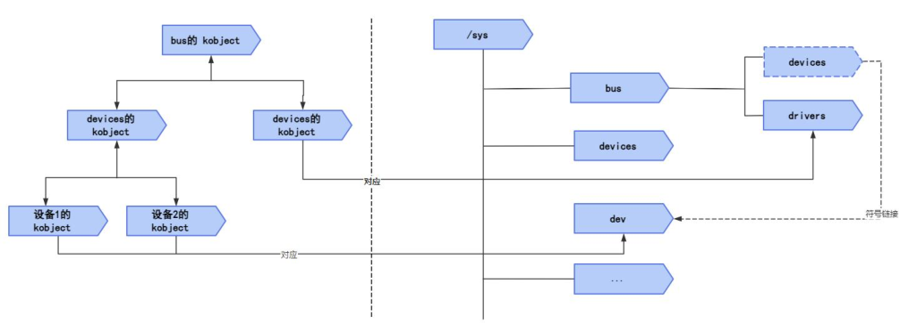

kobject 是设备模型的基石，通过创建对应的目录结构和属性文件，它提供了一个统一的接口和框架，用于管理和操作设备模型中的各个实体。

#### 源码分析文件创建

下面从代码层面一层层解释为什么当使用 kobject_create_and_add()函数创建kobject 时，父节点为 NULL 会在系统根目录/sys 下创建

逐步追踪路径如下所示：
`kobject_create_and_add`->`kobject_add`->`kobject_add_varg`->`kobject_add_internal`->`create_dir`->`sysfs_create_dir_ns`（fs/sysfs/dir.c）


**lib/kobject.c**

```c
/**
 * kobject_create_and_add() - Create a struct kobject dynamically and
 *                            register it with sysfs.
 * @name: the name for the kobject
 * @parent: the parent kobject of this kobject, if any.
 *
 * This function creates a kobject structure dynamically and registers it
 * with sysfs.  When you are finished with this structure, call
 * kobject_put() and the structure will be dynamically freed when
 * it is no longer being used.
 *
 * If the kobject was not able to be created, NULL will be returned.
 */
struct kobject *kobject_create_and_add(const char *name, struct kobject *parent)
{
	struct kobject *kobj;
	int retval;

	kobj = kobject_create();
	if (!kobj)
		return NULL;

	retval = kobject_add(kobj, parent, "%s", name);
	if (retval) {
		pr_warn("%s: kobject_add error: %d\n", __func__, retval);
		kobject_put(kobj);
		kobj = NULL;
	}
	return kobj;
}
EXPORT_SYMBOL_GPL(kobject_create_and_add);


/**
 * kobject_add() - The main kobject add function.
 * @kobj: the kobject to add
 * @parent: pointer to the parent of the kobject.
 * @fmt: format to name the kobject with.
 *
 * The kobject name is set and added to the kobject hierarchy in this
 * function.
 *
 * If @parent is set, then the parent of the @kobj will be set to it.
 * If @parent is NULL, then the parent of the @kobj will be set to the
 * kobject associated with the kset assigned to this kobject.  If no kset
 * is assigned to the kobject, then the kobject will be located in the
 * root of the sysfs tree.
 *
 * Note, no "add" uevent will be created with this call, the caller should set
 * up all of the necessary sysfs files for the object and then call
 * kobject_uevent() with the UEVENT_ADD parameter to ensure that
 * userspace is properly notified of this kobject's creation.
 *
 * Return: If this function returns an error, kobject_put() must be
 *         called to properly clean up the memory associated with the
 *         object.  Under no instance should the kobject that is passed
 *         to this function be directly freed with a call to kfree(),
 *         that can leak memory.
 *
 *         If this function returns success, kobject_put() must also be called
 *         in order to properly clean up the memory associated with the object.
 *
 *         In short, once this function is called, kobject_put() MUST be called
 *         when the use of the object is finished in order to properly free
 *         everything.
 */
int kobject_add(struct kobject *kobj, struct kobject *parent,
		const char *fmt, ...)
{
	va_list args;
	int retval;

	if (!kobj)
		return -EINVAL;

	if (!kobj->state_initialized) {
		pr_err("kobject '%s' (%p): tried to add an uninitialized object, something is seriously wrong.\n",
		       kobject_name(kobj), kobj);
		dump_stack();
		return -EINVAL;
	}
	va_start(args, fmt);
	retval = kobject_add_varg(kobj, parent, fmt, args);
	va_end(args);

	return retval;
}
EXPORT_SYMBOL(kobject_add);


static __printf(3, 0) int kobject_add_varg(struct kobject *kobj,
					   struct kobject *parent,
					   const char *fmt, va_list vargs)
{
	int retval;

	retval = kobject_set_name_vargs(kobj, fmt, vargs);
	if (retval) {
		pr_err("kobject: can not set name properly!\n");
		return retval;
	}
	kobj->parent = parent;
	return kobject_add_internal(kobj);
}


static int kobject_add_internal(struct kobject *kobj)
{
	int error = 0;
	struct kobject *parent;

	if (!kobj)
		return -ENOENT;

	if (!kobj->name || !kobj->name[0]) {
		WARN(1,
		     "kobject: (%p): attempted to be registered with empty name!\n",
		     kobj);
		return -EINVAL;
	}

	parent = kobject_get(kobj->parent);

	/* join kset if set, use it as parent if we do not already have one */
	if (kobj->kset) {
		if (!parent)
			parent = kobject_get(&kobj->kset->kobj);
		kobj_kset_join(kobj);
		kobj->parent = parent;
	}

	pr_debug("kobject: '%s' (%p): %s: parent: '%s', set: '%s'\n",
		 kobject_name(kobj), kobj, __func__,
		 parent ? kobject_name(parent) : "<NULL>",
		 kobj->kset ? kobject_name(&kobj->kset->kobj) : "<NULL>");

	error = create_dir(kobj);
	if (error) {
		kobj_kset_leave(kobj);
		kobject_put(parent);
		kobj->parent = NULL;

		/* be noisy on error issues */
		if (error == -EEXIST)
			pr_err("%s failed for %s with -EEXIST, don't try to register things with the same name in the same directory.\n",
			       __func__, kobject_name(kobj));
		else
			pr_err("%s failed for %s (error: %d parent: %s)\n",
			       __func__, kobject_name(kobj), error,
			       parent ? kobject_name(parent) : "'none'");
	} else
		kobj->state_in_sysfs = 1;

	return error;
}

static int create_dir(struct kobject *kobj)
{
	const struct kobj_type *ktype = get_ktype(kobj);
	const struct kobj_ns_type_operations *ops;
	int error;

	error = sysfs_create_dir_ns(kobj, kobject_namespace(kobj));
	if (error)
		return error;

	error = populate_dir(kobj);
	if (error) {
		sysfs_remove_dir(kobj);
		return error;
	}

	if (ktype) {
		error = sysfs_create_groups(kobj, ktype->default_groups);
		if (error) {
			sysfs_remove_dir(kobj);
			return error;
		}
	}

	/*
	 * @kobj->sd may be deleted by an ancestor going away.  Hold an
	 * extra reference so that it stays until @kobj is gone.
	 */
	sysfs_get(kobj->sd);

	/*
	 * If @kobj has ns_ops, its children need to be filtered based on
	 * their namespace tags.  Enable namespace support on @kobj->sd.
	 */
	ops = kobj_child_ns_ops(kobj);
	if (ops) {
		BUG_ON(ops->type <= KOBJ_NS_TYPE_NONE);
		BUG_ON(ops->type >= KOBJ_NS_TYPES);
		BUG_ON(!kobj_ns_type_registered(ops->type));

		sysfs_enable_ns(kobj->sd);
	}

	return 0;
}

```


**fs/sysfs/dir.c**

```c
/**
 * sysfs_create_dir_ns - create a directory for an object with a namespace tag
 * @kobj: object we're creating directory for
 * @ns: the namespace tag to use
 */
int sysfs_create_dir_ns(struct kobject *kobj, const void *ns)
{
	struct kernfs_node *parent, *kn;
	kuid_t uid;
	kgid_t gid;

	if (WARN_ON(!kobj))
		return -EINVAL;

	if (kobj->parent)
		parent = kobj->parent->sd;
	else
		parent = sysfs_root_kn;

	if (!parent)
		return -ENOENT;

	kobject_get_ownership(kobj, &uid, &gid);

	kn = kernfs_create_dir_ns(parent, kobject_name(kobj),
				  S_IRWXU | S_IRUGO | S_IXUGO, uid, gid,
				  kobj, ns);
	if (IS_ERR(kn)) {
		if (PTR_ERR(kn) == -EEXIST)
			sysfs_warn_dup(parent, kobject_name(kobj));
		return PTR_ERR(kn);
	}

	kobj->sd = kn;
	return 0;
}
```

在上面的函数中，当没有父节点的时候，父节点被赋值成了 `sysfs_root_kn`，即`/sys`目录根目录的节点。如果有 `parent`，则它的父节点为`kobj->parent->sd`，然后调用 `kernfs_create_dir_ns`创建目录。


`sysfs_root_kn`的创建：

**fs/sysfs/mount.c**

```c
static struct file_system_type sysfs_fs_type = {
	.name			= "sysfs",
	.init_fs_context	= sysfs_init_fs_context,
	.kill_sb		= sysfs_kill_sb,
	.fs_flags		= FS_USERNS_MOUNT,
};

int __init sysfs_init(void)
{
	int err;

	sysfs_root = kernfs_create_root(NULL, KERNFS_ROOT_EXTRA_OPEN_PERM_CHECK,
					NULL);
	if (IS_ERR(sysfs_root))
		return PTR_ERR(sysfs_root);

	sysfs_root_kn = sysfs_root->kn;

	err = register_filesystem(&sysfs_fs_type);
	if (err) {
		kernfs_destroy_root(sysfs_root);
		return err;
	}

	return 0;
}

```

通过上述对 API 函数的分析，我们可以总结出创建目录的规律，如下所示：

1. 无父目录、无 kset，则将在 sysfs 的根目录（即/sys/）下创建目录。
2. 无父目录、有 kset，则将在 kset 下创建目录，并将 kobj 加入 kset.list。
3. 有父目录、无 kset，则将在 parent 下创建目录。
4. 有父目录、有 kset，则将在 parent 下创建目录，并将 kobj 加入 kset.list。


#### sysfs 目录层次分析

和设备模型有关的文件夹为 bus，class，devices。完整路径为如下所示：

- `/sys/bus`
- `/sys/class`
- `/sys/devices`


- `/sys/devices`：该目录包含了系统中所有设备的子目录。**每个设备子目录代表一个具体的设备**，通过其路径层次结构和符号链接反映设备的关系和拓扑结构。每个设备子目录中包含了设备的属性、状态和其他相关信息。

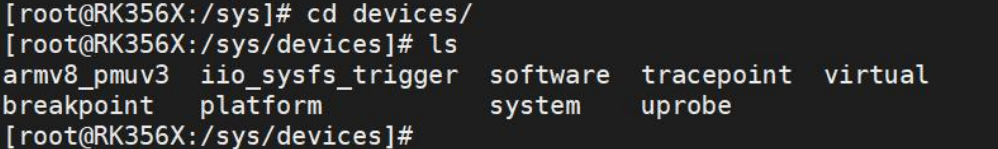

- `/sys/bus`：该目录包含了总线类型的子目录。每个子目录代表一个特定类型的总线，例如PCI、USB 等。每个总线子目录中包含与该总线相关的设备和驱动程序的信息。

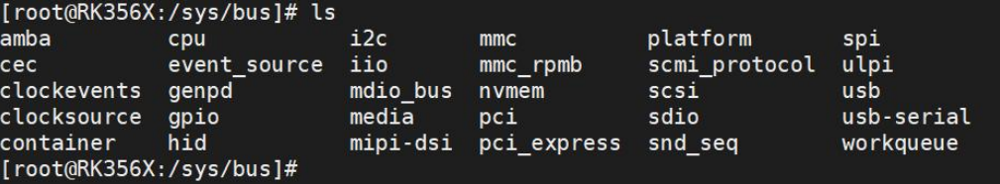

比如 I2C 总线下连接的设备，如下所示:

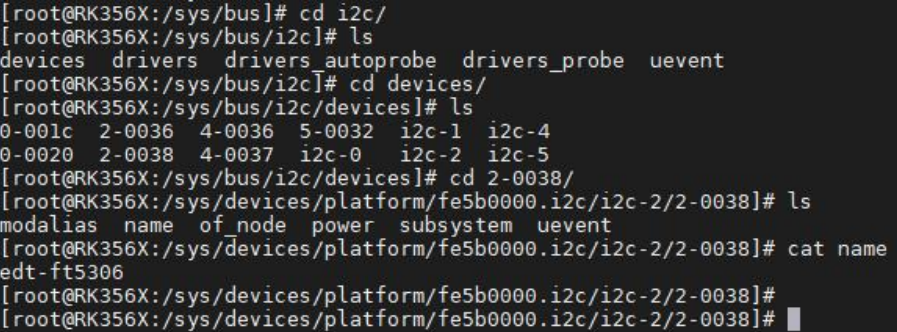

- `/sys/class`：该目录包含了设备类别的子目录。每个子目录代表一个设备类别，例如磁盘、网络接口等。每个设备类别子目录中包含了属于该类别的设备的信息。如下图所示

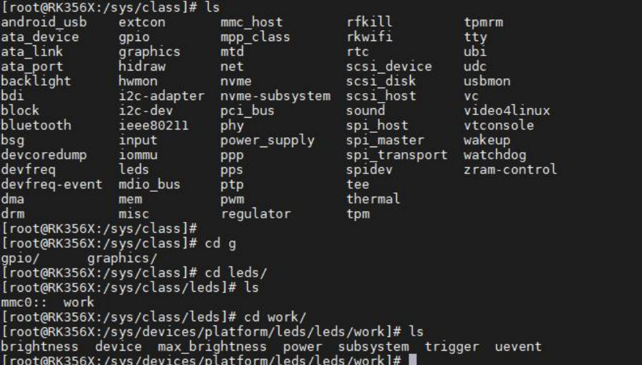

使用 class 进行归类的好处有以下几点：

1. 逻辑上的组织：通过将设备按照类别进行归类，可以在设备模型中建立逻辑上的组织结构。这样，**相关类型的设备可以被放置在同一个类别目录下**，使得设备的组织结构更加清晰和可管理。
2. 统一的接口和属性：每**个设备类别目录下可以定义一组统一的接口和属性**，用于描述和配置该类别下所有设备的共同特征和行为。这样，对于同一类别的设备，可以使用相同的方法和属性来操作和配置，简化了设备驱动程序的编写和维护。
3. 简化设备发现和管理：通过将设备进行分类，可以提供一种简化的设备发现和管理机制。用户和应用程序可以在类别目录中查找和识别特定类型的设备，而无需遍历整个设备模型。这样，设备的发现和访问变得更加高效和方便。
4. 扩展性和可移植性：使用`class`进行归类可以提供一种扩展性和可移植性的机制。当引入新的设备类型时，可以将其归类到现有的类别中，而无需修改现有的设备管理和驱动程序。这种扩展性和可移植性使得系统更加灵活，并且对于开发人员和设备供应商来说，更容易集成新设备。

比如应用现在要设置 gpio, 如果使用类可以直接使用以下命令：

```bash
echo 1 > /sys/class/gpio/gpio157/value
```

如果不使用类，使用以下命令：

```bash
echo 1 > /sys/devices/platform/fe770000.gpio/gpiochip4/gpio/gpio157/value
```

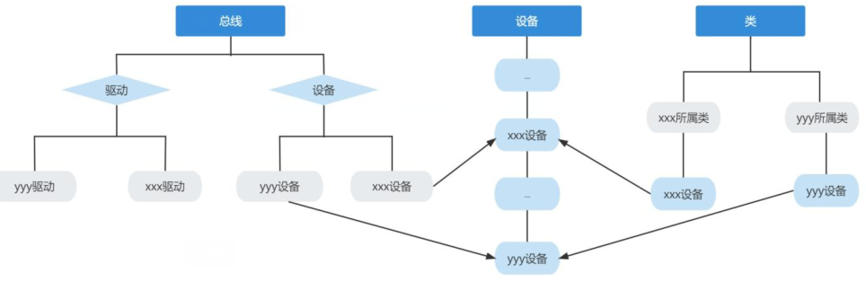

## 引用计数器kref


```c
// include/linux/kref.h
struct kref {
	refcount_t refcount;
};
// include/linux/refcount.h
typedef struct refcount_struct {
	atomic_t refs;
} refcount_t;

// include/linux/types.h
typedef struct {
	int counter;
} atomic_t;
```

在使用引用计数器时，通常会**将结构体 kref 嵌入到其他结构体中**，例如 **struct kobject**，以实现引用计数的管理。


为了实现引用计数功能，struct kobject 通常会包含一个嵌入的 struct kref 对象。这样可以通过对 struct kref 的操作来对 struct kobject 进行引用计数的管理，并在引用计数减少到 0 时释放相关资源。


```c
struct device_node {
	const char *name;
	phandle phandle;
	const char *full_name;
	struct fwnode_handle fwnode;

	struct	property *properties;
	struct	property *deadprops;	/* removed properties */
	struct	device_node *parent;
	struct	device_node *child;
	struct	device_node *sibling;
#if defined(CONFIG_OF_KOBJ)
	struct	kobject kobj;
#endif
	unsigned long _flags;
	void	*data;
#if defined(CONFIG_SPARC)
	unsigned int unique_id;
	struct of_irq_controller *irq_trans;
#endif
};
```

### 常用API函数

#### kref_init()

**功能** : 初始化一个 `struct kref` 对象，并将其引用计数设置为 **1**。**所有引用计数对象必须在使用前调用一次本函数。**

**函数原型**

```c
static inline void kref_init(struct kref *kref)
{
    refcount_set(&kref->refcount, 1);
}
```


#### kref_get()

**功能**: **将 kref 的引用计数 +1。**

**函数原型**

```
static inline void kref_get(struct kref *kref)
{
    refcount_inc(&kref->refcount);
}
```

**适用场景**: 每当一个结构体被新的用户持有或使用时，需要调用此函数增加引用计数。


#### kref_put()

**功能**: 引用计数 **-1**，当计数归零时调用 `release()` 函数释放资源（通常释放内存）。

**函数原型**

```c
static inline int kref_put(struct kref *kref, void (*release)(struct kref *kref))
{
    if (refcount_dec_and_test(&kref->refcount)) {
        release(kref);
        return 1;
    }
    return 0;
}
```

**关键点**

- 引用计数变为 **0** → 调用回调 `release(kref)` 进行真正销毁。
- 返回 1 表示引用计数变为 0，并执行了销毁。
- 返回 0 表示引用计数 > 0，对象仍有效。


#### refcount_set()

**功能**: 设置底层的原子引用计数值。`kref_init()` 内部调用本函数。

**函数原型**

```c
static inline void refcount_set(refcount_t *r, int n)
{
    atomic_set(&r->refs, n);
}
```


### Kobj是如何释放的

kobject创建有两种方法：

1. 使用 `kobject_create_and_add()`函数创建 kobject：`kobject_create_and_add()`函数首先调用 `kobject_create()`函数，该函数使用 `kzalloc()`为kobject 分配内存空间。在 `kobject_create()`函数中，调用 `kobject_init()`函数对分配的内存进行初始化，并指定了默认的 ktype。接下来，`kobject_create_and_add()`函数调用 `kobject_add()`函数将 kobject 添加到系统中，使其可见。`kobject_add()`函数内部调用了 `kobject_add_internal()`函数，该函数负责将 kobject 添加到父对象的子对象列表中，并创建相应的 sysfs 文件系统条目。
2. 使用 `kobject_init_and_add()`函数创建 kobject：`kobject_init_and_add()`函数需要手动分配内存，并通过 `kobject_init()`函数对分配的内存进行初始化。此时需要自己实现 ktype 结构体。初始化完成后，调用 `kobject_add()`函数将 kobject添加到系统中。


无论哪种方法，最终都是用`kobject_put()`来释放kobject

**lib/kobject.c**

```c
/**
 * kobject_put() - Decrement refcount for object.
 * @kobj: object.
 *
 * Decrement the refcount, and if 0, call kobject_cleanup().
 */
void kobject_put(struct kobject *kobj)
{
	if (kobj) {
		if (!kobj->state_initialized)
			WARN(1, KERN_WARNING
				"kobject: '%s' (%p): is not initialized, yet kobject_put() is being called.\n",
			     kobject_name(kobj), kobj);
		kref_put(&kobj->kref, kobject_release);
	}
}
EXPORT_SYMBOL(kobject_put);


static void kobject_release(struct kref *kref)
{
	struct kobject *kobj = container_of(kref, struct kobject, kref);
#ifdef CONFIG_DEBUG_KOBJECT_RELEASE
	unsigned long delay = HZ + HZ * (get_random_int() & 0x3);
	pr_info("kobject: '%s' (%p): %s, parent %p (delayed %ld)\n",
		 kobject_name(kobj), kobj, __func__, kobj->parent, delay);
	INIT_DELAYED_WORK(&kobj->release, kobject_delayed_cleanup);

	schedule_delayed_work(&kobj->release, delay);
#else
	kobject_cleanup(kobj);
#endif
}
```

可以看到当kref为0时，会调用`kobject_release()`，而这个函数会调用`kobject_cleanup()`

**lib/kobject.c**

```c
/*
 * kobject_cleanup - free kobject resources.
 * @kobj: object to cleanup
 */
static void kobject_cleanup(struct kobject *kobj)
{
	struct kobject *parent = kobj->parent;
	struct kobj_type *t = get_ktype(kobj);
	const char *name = kobj->name;

	pr_debug("kobject: '%s' (%p): %s, parent %p\n",
		 kobject_name(kobj), kobj, __func__, kobj->parent);

	if (t && !t->release)
		pr_debug("kobject: '%s' (%p): does not have a release() function, it is broken and must be fixed. See Documentation/core-api/kobject.rst.\n",
			 kobject_name(kobj), kobj);

	/* remove from sysfs if the caller did not do it */
	if (kobj->state_in_sysfs) {
		pr_debug("kobject: '%s' (%p): auto cleanup kobject_del\n",
			 kobject_name(kobj), kobj);
		__kobject_del(kobj);
	} else {
		/* avoid dropping the parent reference unnecessarily */
		parent = NULL;
	}

	if (t && t->release) {
		pr_debug("kobject: '%s' (%p): calling ktype release\n",
			 kobject_name(kobj), kobj);
		t->release(kobj);
	}

	/* free name if we allocated it */
	if (name) {
		pr_debug("kobject: '%s': free name\n", name);
		kfree_const(name);
	}

	kobject_put(parent);
}

```

函数内部定义了一个指向 struct kobj_type 结构体的指针 t，用于获取 kobj 的类型信息

如果 t 存在但 t->release 为 NULL，表示 kobj 的类型没有定义释放函数，会打印调试信息指示该情况。

然后，检查 kobj 的状态变量 state_in_sysfs。如果为真，表示调用者没有从 sysfs 中删除kobj，会自动调用 `kobject_del()`函数将其从 sysfs 中删除。

接下来，再次检查 t 是否存在，并且检查 `t->release` 是否存在。如果存在，表示 kobj 的类型定义了释放函数，会调用该释放函数进行资源清理。

`kobject_cleanup()` 函数的实现表明，**最终调用的释放函数是在 kobj_type 结构体中定义的**。这解释了为什么在使用`kobject_init_and_add()` 函数时，kobj_type 结构体不能为空的原因。

```c
// include/linux/kobject.h
struct kobj_type {
	void (*release)(struct kobject *kobj);
	const struct sysfs_ops *sysfs_ops;
	struct attribute **default_attrs;	/* use default_groups instead */
	const struct attribute_group **default_groups;
	const struct kobj_ns_type_operations *(*child_ns_type)(struct kobject *kobj);
	const void *(*namespace)(struct kobject *kobj);
	void (*get_ownership)(struct kobject *kobj, kuid_t *uid, kgid_t *gid);
};

// lib/kobject.c
struct kobject *kobject_create(void)
{
	struct kobject *kobj;

	kobj = kzalloc(sizeof(*kobj), GFP_KERNEL);
	if (!kobj)
		return NULL;

	kobject_init(kobj, &dynamic_kobj_ktype);
	return kobj;
}

// lib/kobject.c
void kobject_init(struct kobject *kobj, struct kobj_type *ktype)
{
    ...
	kobject_init_internal(kobj);
	kobj->ktype = ktype;
	return;
    ...
}
EXPORT_SYMBOL(kobject_init);
```

而dynamic_kobj_ktype定义为：

```c
// lib/kobject.c
static void dynamic_kobj_release(struct kobject *kobj)
{
	pr_debug("kobject: (%p): %s\n", kobj, __func__);
	kfree(kobj);
}

static struct kobj_type dynamic_kobj_ktype = {
	.release	= dynamic_kobj_release,
	.sysfs_ops	= &kobj_sysfs_ops,
};
```

## 创建sysfs属性文件并实现读写功能

### 使用`kobject_init_and_add()`

```c
#include <linux/module.h>
#include <linux/init.h>
#include <linux/slab.h>
#include <linux/configfs.h>
#include <linux/kernel.h>
#include <linux/kobject.h>
#include <linux/sysfs.h> 

// 自定义的kobject结构体，包含一个kobject对象和两个整型值
struct mykobj
{
    struct kobject kobj;
    int value1;
    int value2;
};

// 定义了mykobj结构体指针变量mykobject01
struct mykobj *mykobject01;

// 自定义的kobject释放函数
static void dynamic_kobj_release(struct kobject *kobj)
{
    struct mykobj *mykobject01 = container_of(kobj, struct mykobj, kobj);
    printk("kobject: (%p): %s\n", kobj, __func__);
    kfree(mykobject01);
}

// 自定义的attribute对象value1和value2
struct attribute value1 = {
    .name = "value1",
    .mode = 0666,
};
struct attribute value2 = {
    .name = "value2",
    .mode = 0666,
};

// 将attribute对象放入数组中
struct attribute *myattr[] = {
    &value1,
    &value2,
    NULL,
};

// 自定义的show函数，用于读取属性值
ssize_t myshow(struct kobject *kobj, struct attribute *attr, char *buf)
{
    ssize_t count;
    struct mykobj *mykobject01 = container_of(kobj, struct mykobj, kobj);
    if (strcmp(attr->name, "value1") == 0)
    {
        count = sprintf(buf, "%d\n", mykobject01->value1);
    }
    else if (strcmp(attr->name, "value2") == 0)
    {
        count = sprintf(buf, "%d\n", mykobject01->value2);
    }
    else
    {
        count = 0;
    }
    return count;
}

// 自定义的store函数，用于写入属性值
ssize_t mystore(struct kobject *kobj, struct attribute *attr, const char *buf, size_t size)
{
    struct mykobj *mykobject01 = container_of(kobj, struct mykobj, kobj);
    if (strcmp(attr->name, "value1") == 0)
    {
        sscanf(buf, "%d\n", &mykobject01->value1);
    }
    else if (strcmp(attr->name, "value2") == 0)
    {
        sscanf(buf, "%d\n", &mykobject01->value2);
    }
    return size;
}

// 自定义的sysfs_ops结构体，包含show和store函数指针
struct sysfs_ops myops = {
    .show = myshow,
    .store = mystore,
};

// 自定义的kobj_type结构体，包含释放函数、默认属性和sysfs_ops
static struct kobj_type mytype = {
    .release = dynamic_kobj_release,
    .default_attrs = myattr,
    .sysfs_ops = &myops,
};

// 模块的初始化函数
static int mykobj_init(void)
{
    int ret;

    // 分配并初始化mykobject01
    mykobject01 = kzalloc(sizeof(struct mykobj), GFP_KERNEL);
    mykobject01->value1 = 1;
    mykobject01->value2 = 1;

    // 初始化并添加mykobject01到内核中，名为"mykobject01"
    ret = kobject_init_and_add(&mykobject01->kobj, &mytype, NULL, "%s", "mykobject01");

    return 0;
}

// 模块的退出函数
static void mykobj_exit(void)
{
    // 释放mykobject01
    kobject_put(&mykobject01->kobj);
}

module_init(mykobj_init); // 指定模块的初始化函数
module_exit(mykobj_exit); // 指定模块的退出函数

MODULE_LICENSE("GPL");   // 模块使用的许可证
MODULE_AUTHOR("topeet"); // 模块的作者

MODULE_LICENSE("GPL");   // 模块使用的许可证
MODULE_AUTHOR("topeet"); // 模块的作者
```


优化属性文件读写，每一个属性对应一个读写函数，使用`kobj_attribute`封装

```c
#include <linux/module.h>
#include <linux/init.h>
#include <linux/slab.h>
#include <linux/configfs.h>
#include <linux/kernel.h>
#include <linux/kobject.h>
#include <linux/sysfs.h>

// 自定义的kobject结构体，包含一个kobject对象和两个整型值
struct mykobj
{
    struct kobject kobj;
    int value1;
    int value2;
};

// 定义了mykobj结构体指针变量mykobject01
struct mykobj *mykobject01;

// 自定义的show函数，用于读取属性值
ssize_t show_myvalue1(struct kobject *kobj, struct kobj_attribute *attr, char *buf)
{
    ssize_t count;
    count = sprintf(buf, "show_myvalue1\n");
    return count;
};

// 自定义的store函数，用于写入属性值
ssize_t store_myvalue1(struct kobject *kobj, struct kobj_attribute *attr, const char *buf, size_t count)
{
    printk("buf is %s\n", buf);
    return count;
};

// 自定义的show函数，用于读取属性值
ssize_t show_myvalue2(struct kobject *kobj, struct kobj_attribute *attr, char *buf)
{
    ssize_t count;
    count = sprintf(buf, "show_myvalue2\n");
    return count;
};

// 自定义的store函数，用于写入属性值
ssize_t store_myvalue2(struct kobject *kobj, struct kobj_attribute *attr, const char *buf, size_t count)
{
    printk("buf is %s\n", buf);
    return count;
};

// 定义attribute对象value1和value2
struct kobj_attribute value1 = __ATTR(value1, 0664, show_myvalue1, store_myvalue1);
struct kobj_attribute value2 = __ATTR(value2, 0664, show_myvalue2, store_myvalue2);

// 自定义的kobject释放函数
static void dynamic_kobj_release(struct kobject *kobj)
{
    struct mykobj *mykobject01 = container_of(kobj, struct mykobj, kobj);
    printk("kobject: (%p): %s\n", kobj, __func__);
    kfree(mykobject01);
}

// 将attribute对象放入数组中
struct attribute *myattr[] = {
    &value1.attr,
    &value2.attr,
    NULL,
};

// 自定义的show函数，用于读取属性值
ssize_t myshow(struct kobject *kobj, struct attribute *attr, char *buf)
{
    ssize_t count;
    struct kobj_attribute *kobj_attr = container_of(attr, struct kobj_attribute, attr);
    count = kobj_attr->show(kobj, kobj_attr, buf);
    return count;
}

// 自定义的store函数，用于写入属性值
ssize_t mystore(struct kobject *kobj, struct attribute *attr, const char *buf, size_t size)
{
    struct kobj_attribute *kobj_attr = container_of(attr, struct kobj_attribute, attr);
    return kobj_attr->store(kobj, kobj_attr, buf, size);
}

// 自定义的sysfs_ops结构体，包含show和store函数指针
struct sysfs_ops myops = {
    .show = myshow,
    .store = mystore,
};

// 自定义的kobj_type结构体，包含释放函数、默认属性和sysfs_ops
static struct kobj_type mytype = {
    .release = dynamic_kobj_release,
    .default_attrs = myattr,
    .sysfs_ops = &myops,
};

// 模块的初始化函数
static int mykobj_init(void)
{
    int ret;

    // 分配并初始化mykobject01
    mykobject01 = kzalloc(sizeof(struct mykobj), GFP_KERNEL);
    mykobject01->value1 = 1;
    mykobject01->value2 = 1;

    // 初始化并添加mykobject01到内核中，名为"mykobject01"
    ret = kobject_init_and_add(&mykobject01->kobj, &mytype, NULL, "%s", "mykobject01");

    return 0;
}

// 模块的退出函数
static void mykobj_exit(void)
{
    // 释放mykobject01
    kobject_put(&mykobject01->kobj);
}

module_init(mykobj_init); // 指定模块的初始化函数
module_exit(mykobj_exit); // 指定模块的退出/
MODULE_LICENSE("GPL");    // 模块使用的许可证
MODULE_AUTHOR("topeet");  // 模块的作者
```

### 使用`kobject_create_and_add()`

使用`kobject_create_and_add()`，需要调用`sysfs_create_file`添加属性文件

```c
#include <linux/module.h>
#include <linux/init.h>
#include <linux/slab.h>
#include <linux/configfs.h>
#include <linux/kernel.h>
#include <linux/kobject.h>
#include <linux/sysfs.h>

// 定义了mykobj结构体指针变量mykobject01
struct kobject *mykobject01;

// 自定义的show函数，用于读取属性值
ssize_t show_myvalue1(struct kobject *kobj, struct kobj_attribute *attr, char *buf)
{
    ssize_t count;
    count = sprintf(buf, "show_myvalue1\n");
    return count;
};

// 自定义的store函数，用于写入属性值
ssize_t store_myvalue1(struct kobject *kobj, struct kobj_attribute *attr, const char *buf, size_t count)
{
    printk("buf is %s\n", buf);
    return count;
};

// 自定义的show函数，用于读取属性值
ssize_t show_myvalue2(struct kobject *kobj, struct kobj_attribute *attr, char *buf)
{
    ssize_t count;
    count = sprintf(buf, "show_myvalue2\n");
    return count;
};

// 自定义的store函数，用于写入属性值
ssize_t store_myvalue2(struct kobject *kobj, struct kobj_attribute *attr, const char *buf, size_t count)
{
    printk("buf is %s\n", buf);
    return count;
};

// 定义attribute对象value1和value2
struct kobj_attribute value1 = __ATTR(value1, 0664, show_myvalue1, store_myvalue1);
struct kobj_attribute value2 = __ATTR(value2, 0664, show_myvalue2, store_myvalue2);

// 模块的初始化函数
static int mykobj_init(void)
{
    int ret;

    // // 分配并初始化mykobject01
    // mykobject01 = kzalloc(sizeof(struct mykobj), GFP_KERNEL);
    // mykobject01->value1 = 1;
    // mykobject01->value2 = 1;
    // // 初始化并添加mykobject01到内核中，名为"mykobject01"
    // ret = kobject_init_and_add(&mykobject01->kobj, &mytype, NULL, "%s", "mykobject01");

    mykobject01 = kobject_create_and_add("mykobject01", NULL);
    ret = sysfs_create_file(mykobject01, &value1.attr);
    ret = sysfs_create_file(mykobject01, &value2.attr);
    return ret;
}

// 模块的退出函数
static void mykobj_exit(void)
{
    // 释放mykobject01
    kobject_put(mykobject01);
}

module_init(mykobj_init); // 指定模块的初始化函数
module_exit(mykobj_exit); // 指定模块的退出/
MODULE_LICENSE("GPL");    // 模块使用的许可证
MODULE_AUTHOR("topeet");  // 模块的作者
```


### 创建多个属性文件的简便方法`sysfs_create_group()`

`sysfs_create_group()` 用于在 sysfs 中为一个 kobject 创建一个属性组（directory + 多个属性文件）。

------

#### **函数原型**

```c
int sysfs_create_group(struct kobject *kobj, const struct attribute_group *grp);
```

**参数说明**

**1. `kobj`**

- 指向一个 `struct kobject`
- 属性组将作为该 kobject 目录下的一个子目录（如果组名存在）或者同级属性（组名 NULL 时）

**2. `grp`**

指向一个 `struct attribute_group`，用于描述组名称与属性文件列表。

 **struct attribute_group 结构体**

```c
struct attribute_group {
    const char              *name;
    const struct attribute **attrs;
    mode_t (*is_visible)(struct kobject *kobj,
                         struct attribute *attr,
                         int index);
};
```

字段说明：

| 成员         | 说明                                                         |
| ------------ | ------------------------------------------------------------ |
| `name`       | 组名称。若非 NULL，将在 sysfs 下创建一个目录。               |
| `attrs`      | 属性数组，以 NULL 结束；每个 entry 是一个 `struct attribute *`。 |
| `is_visible` | （可选）根据 index 决定属性是否可见，不可见则不会创建该属性文件。 |


**属性文件数组（attrs）**

属性文件数组是一个：

```c
struct attribute *attrs[] = {... , NULL};
```

每个属性通常来源于：

```c
struct kobj_attribute attr1 = __ATTR(...);
```

属性文件数组中传入：

```c
&attr1.attr
```

#### **示例**

**定义属性文件**

```
static struct kobj_attribute attr1 =
    __ATTR(attr1, 0644, attr1_show, attr1_store);

static struct kobj_attribute attr2 =
    __ATTR(attr2, 0644, attr2_show, attr2_store);
```

**创建属性数组（以 NULL 结尾）**

```c
struct attribute *attrs[] = {
    &attr1.attr,
    &attr2.attr,
    NULL,
};
```

**定义属性组**

```c
const struct attribute_group attr_group = {
    .name = "my_group",
    .attrs = attrs,
};
```

创建后，sysfs 中将出现：

```
/sys/.../kobj/my_group/attr1
/sys/.../kobj/my_group/attr2
```

**注册属性组**

```c
sysfs_create_group(kobj, &attr_group);
```

**删除属性组（必须成对使用）**

在模块退出或设备移除时需要删除：

```c
sysfs_remove_group(kobj, &attr_group);
```

## 注册自己的总线

### bus_register()

| 项目         | 说明                                                         |
| ------------ | ------------------------------------------------------------ |
| **函数定义** | **int bus_register(struct bus_type \*bus);**                 |
| **头文件**   | `#include <linux/device/bus.h>` 或 `#include <linux/device.h>` |
| **参数 bus** | 指向 `struct bus_type` 的指针，表示要注册的自定义总线        |
| **功能**     | 将一个自定义总线注册到 Linux 内核，使内核能够识别该总线，并提供设备与驱动匹配机制 |
| **返回值**   | 成功：返回 0；失败：返回负错误码（如 `-EINVAL`, `-ENOMEM` 等） |


### bus_unregister()

| 项目         | 说明                                                         |
| ------------ | ------------------------------------------------------------ |
| **函数定义** | **void bus_unregister(struct bus_type \*bus);**              |
| **头文件**   | `#include <linux/device/bus.h>` 或 `#include <linux/device.h>` |
| **参数 bus** | 指向 `struct bus_type` 的指针，表示要注销的自定义总线        |
| **功能**     | 注销一个已经注册的自定义总线，释放相关资源，使其不再在内核中可见 |
| **返回值**   | 无返回值                                                     |


### 示例

```c
#include <linux/module.h>
#include <linux/init.h>
#include <linux/slab.h>
#include <linux/configfs.h>
#include <linux/kernel.h>
#include <linux/kobject.h>
#include <linux/device.h>

int mybus_match(struct device *dev, struct device_driver *drv)
{
    return (strcmp(dev_name(dev), drv->name) == 0);
};

int mybus_probe(struct device *dev)
{
    struct device_driver *drv = dev->driver;
    if (drv->probe)
        drv->probe(dev);
    return 0;
};

struct bus_type mybus = {
    .name = "mybus",
    .match = mybus_match,
    .probe = mybus_probe,
};

// 模块的初始化函数
static int bus_init(void)
{
    int ret;
    ret = bus_register(&mybus);
    return 0;
}

// 模块退出函数
static void bus_exit(void)
{
    bus_unregister(&mybus);
}

module_init(bus_init); // 指定模块的初始化函数
module_exit(bus_exit); // 指定模块的退出函数

MODULE_LICENSE("GPL");   // 模块使用的许可证
MODULE_AUTHOR("topeet"); // 模块的作者
```

### 总线目录下创建属性

#### bus_create_file()

| 项目          | 说明                                                         |
| ------------- | ------------------------------------------------------------ |
| **函数定义**  | **int bus_create_file(struct bus_type *bus, struct kobject *kobj, const struct attribute \*attr);** |
| **头文件**    | `#include <linux/device/bus.h>` 或 `#include <linux/device.h>` |
| **参数 bus**  | 指向 `struct bus_type` 的指针，表示在哪个总线上创建属性文件  |
| **参数 kobj** | 指向 `struct kobject` 的指针，表示要在其目录下创建属性文件（常为总线的 kobject） |
| **参数 attr** | 指向 `struct attribute` 的指针，表示要创建的 sysfs 属性文件（包含名称、权限等） |
| **功能**      | 在总线对应的 sysfs 目录下创建一个属性文件（如 `/sys/bus/<busname>/value`） |
| **返回值**    | 成功：返回 0；失败：负错误码                                 |

**属性结构（struct bus_attribute）示例说明表**

| 字段          | 说明                             |
| ------------- | -------------------------------- |
| **attr.name** | 属性文件名                       |
| **attr.mode** | 文件权限，如 `0664`              |
| **show**      | sysfs 读取回调（用于 cat 读取）  |
| **store**     | sysfs 写入回调（用于 echo 写入） |

示例用法：

```c
struct bus_attribute mybus_attr = {
	.attr = {
		.name = "value",
		.mode = 0664,
	},
	.show = mybus_show,
};

ret = bus_create_file(&mybus, &mydevice.kobj, &mybus_attr.attr);
```


#### 示例代码

```c
#include <linux/module.h>
#include <linux/init.h>
#include <linux/slab.h>
#include <linux/configfs.h>
#include <linux/kernel.h>
#include <linux/kobject.h>
#include <linux/device.h>
#include <linux/sysfs.h>

int mybus_match(struct device *dev, struct device_driver *drv)
{
    // 检查设备名称和驱动程序名称是否匹配
    return (strcmp(dev_name(dev), drv->name) == 0);
};

int mybus_probe(struct device *dev)
{
    struct device_driver *drv = dev->driver;
    if (drv->probe)
        drv->probe(dev);
    return 0;
};

struct bus_type mybus = {
    .name = "mybus",                 // 总线的名称
    .match = mybus_match,            // 设备和驱动程序匹配的回调函数
    .probe = mybus_probe,            // 设备探测的回调函数
};
EXPORT_SYMBOL_GPL(mybus);             // 导出总线符号

ssize_t mybus_show(struct bus_type *bus, char *buf)
{
    // 在 sysfs 中显示总线的值
    return sprintf(buf, "%s\n", "mybus_show");
};

struct bus_attribute mybus_attr = {
    .attr = {
        .name = "value",             // 属性的名称
        .mode = 0664,                // 属性的访问权限
    },
    .show = mybus_show,               // 属性的 show 回调函数
};

// 模块的初始化函数
static int bus_init(void)
{
    int ret;
    ret = bus_register(&mybus);       // 注册总线
    ret = bus_create_file(&mybus, &mybus_attr);  // 在 sysfs 中创建属性文件

    return 0;
}

// 模块退出函数
static void bus_exit(void)
{
    bus_remove_file(&mybus, &mybus_attr);  // 从 sysfs 中移除属性文件
    bus_unregister(&mybus);                // 取消注册总线
}

module_init(bus_init);                    // 指定模块的初始化函数
module_exit(bus_exit);                    // 指定模块的退出函数

MODULE_LICENSE("GPL");                    // 模块使用的许可证
MODULE_AUTHOR("topeet");                  // 模块的作者
```

### 总线注册流程分析

#### bus_register()

bus_type结构体：

```c
// include/linux/device/bus.h

struct bus_type {
	const char		*name;
	const char		*dev_name;
	struct device		*dev_root;// device结构体， dev_root
	const struct attribute_group **bus_groups;
	const struct attribute_group **dev_groups;
	const struct attribute_group **drv_groups;

	int (*match)(struct device *dev, struct device_driver *drv);
	int (*uevent)(struct device *dev, struct kobj_uevent_env *env);
	int (*probe)(struct device *dev);
	void (*sync_state)(struct device *dev);
	int (*remove)(struct device *dev);
	void (*shutdown)(struct device *dev);

	int (*online)(struct device *dev);
	int (*offline)(struct device *dev);

	int (*suspend)(struct device *dev, pm_message_t state);
	int (*resume)(struct device *dev);

	int (*num_vf)(struct device *dev);

	int (*dma_configure)(struct device *dev);

	const struct dev_pm_ops *pm;

	const struct iommu_ops *iommu_ops;

	struct subsys_private *p;
	struct lock_class_key lock_key;

	bool need_parent_lock;
};

```

可以看到bus_type结构体中含有struct device结构体，而device结构体含有kobject

```c
// include/linux/device.h
struct device {
	struct kobject kobj;
	struct device		*parent;

	struct device_private	*p;

	const char		*init_name; /* initial name of the device */
	const struct device_type *type;

	struct bus_type	*bus;		/* type of bus device is on */
	struct device_driver *driver;	/* which driver has allocated this
					   device */
	void		*platform_data;	/* Platform specific data, device
					   core doesn't touch it */
	void		*driver_data;	/* Driver data, set and get with
					   dev_set_drvdata/dev_get_drvdata */
#ifdef CONFIG_PROVE_LOCKING
	struct mutex		lockdep_mutex;
#endif
	struct mutex		mutex;	/* mutex to synchronize calls to
					 * its driver.
					 */

	struct dev_links_info	links;
	struct dev_pm_info	power;
	struct dev_pm_domain	*pm_domain;

#ifdef CONFIG_ENERGY_MODEL
	struct em_perf_domain	*em_pd;
#endif

#ifdef CONFIG_GENERIC_MSI_IRQ_DOMAIN
	struct irq_domain	*msi_domain;
#endif
#ifdef CONFIG_PINCTRL
	struct dev_pin_info	*pins;
#endif
#ifdef CONFIG_GENERIC_MSI_IRQ
	raw_spinlock_t		msi_lock;
	struct list_head	msi_list;
#endif
#ifdef CONFIG_DMA_OPS
	const struct dma_map_ops *dma_ops;
#endif
	u64		*dma_mask;	/* dma mask (if dma'able device) */
	u64		coherent_dma_mask;/* Like dma_mask, but for
					     alloc_coherent mappings as
					     not all hardware supports
					     64 bit addresses for consistent
					     allocations such descriptors. */
	u64		bus_dma_limit;	/* upstream dma constraint */
	const struct bus_dma_region *dma_range_map;

	struct device_dma_parameters *dma_parms;

	struct list_head	dma_pools;	/* dma pools (if dma'ble) */

#ifdef CONFIG_DMA_DECLARE_COHERENT
	struct dma_coherent_mem	*dma_mem; /* internal for coherent mem
					     override */
#endif
#ifdef CONFIG_DMA_CMA
	struct cma *cma_area;		/* contiguous memory area for dma
					   allocations */
#endif
	/* arch specific additions */
	struct dev_archdata	archdata;

	struct device_node	*of_node; /* associated device tree node */
	struct fwnode_handle	*fwnode; /* firmware device node */

#ifdef CONFIG_NUMA
	int		numa_node;	/* NUMA node this device is close to */
#endif
	dev_t			devt;	/* dev_t, creates the sysfs "dev" */
	u32			id;	/* device instance */

	spinlock_t		devres_lock;
	struct list_head	devres_head;

	struct class		*class;
	const struct attribute_group **groups;	/* optional groups */

	void	(*release)(struct device *dev);
	struct iommu_group	*iommu_group;
	struct dev_iommu	*iommu;

	enum device_removable	removable;

	bool			offline_disabled:1;
	bool			offline:1;
	bool			of_node_reused:1;
	bool			state_synced:1;
#if defined(CONFIG_ARCH_HAS_SYNC_DMA_FOR_DEVICE) || \
    defined(CONFIG_ARCH_HAS_SYNC_DMA_FOR_CPU) || \
    defined(CONFIG_ARCH_HAS_SYNC_DMA_FOR_CPU_ALL)
	bool			dma_coherent:1;
#endif
#ifdef CONFIG_DMA_OPS_BYPASS
	bool			dma_ops_bypass : 1;
#endif
};
```

而`bus_register()`中

```c
/**
 * bus_register - register a driver-core subsystem
 * @bus: bus to register
 *
 * Once we have that, we register the bus with the kobject
 * infrastructure, then register the children subsystems it has:
 * the devices and drivers that belong to the subsystem.
 */
int bus_register(struct bus_type *bus)
{
	int retval;
	struct subsys_private *priv;
	struct lock_class_key *key = &bus->lock_key;
	// 分配并初始化一个 subsys_private 结构体，用于保存子系统的相关信息
	priv = kzalloc(sizeof(struct subsys_private), GFP_KERNEL);
	if (!priv)
		return -ENOMEM;

	priv->bus = bus;
	bus->p = priv;
	// 初始化一个阻塞通知链表 bus_notifier
	BLOCKING_INIT_NOTIFIER_HEAD(&priv->bus_notifier);
	// 设置子系统的名称
	retval = kobject_set_name(&priv->subsys.kobj, "%s", bus->name);
	if (retval)
		goto out;
	// 设置子系统的 kset 和 ktype
	priv->subsys.kobj.kset = bus_kset;
	priv->subsys.kobj.ktype = &bus_ktype;
	priv->drivers_autoprobe = 1;
	// 注册子系统的 kset
	retval = kset_register(&priv->subsys);
	if (retval)
		goto out;
	// 在总线上创建一个属性文件
	retval = bus_create_file(bus, &bus_attr_uevent);
	if (retval)
		goto bus_uevent_fail;
	// 创建并添加 "devices" 子目录的 kset
	priv->devices_kset = kset_create_and_add("devices", NULL,
						 &priv->subsys.kobj);
	if (!priv->devices_kset) {
		retval = -ENOMEM;
		goto bus_devices_fail;
	}
	// 创建并添加 "drivers" 子目录的 kset
	priv->drivers_kset = kset_create_and_add("drivers", NULL,
						 &priv->subsys.kobj);
	if (!priv->drivers_kset) {
		retval = -ENOMEM;
		goto bus_drivers_fail;
	}
	// 初始化接口链表、互斥锁和设备/驱动的 klist
	INIT_LIST_HEAD(&priv->interfaces);
	__mutex_init(&priv->mutex, "subsys mutex", key);
	klist_init(&priv->klist_devices, klist_devices_get, klist_devices_put);
	klist_init(&priv->klist_drivers, NULL, NULL);
	// 添加驱动探测文件
	retval = add_probe_files(bus);
	if (retval)
		goto bus_probe_files_fail;
	// 添加总线的属性组
	retval = bus_add_groups(bus, bus->bus_groups);
	if (retval)
		goto bus_groups_fail;

	pr_debug("bus: '%s': registered\n", bus->name);
	return 0;

bus_groups_fail:
	remove_probe_files(bus);
bus_probe_files_fail:
	kset_unregister(bus->p->drivers_kset);
bus_drivers_fail:
	kset_unregister(bus->p->devices_kset);
bus_devices_fail:
	bus_remove_file(bus, &bus_attr_uevent);
bus_uevent_fail:
	kset_unregister(&bus->p->subsys);
	/* Above kset_unregister() will kfree @bus->p */
	bus->p = NULL;
out:
	kfree(bus->p);
	bus->p = NULL;
	return retval;
}
EXPORT_SYMBOL_GPL(bus_register);

```

`klist_init(&priv->klist_devices, klist_devices_get, klist_devices_put);`

这行代码初始化了名为`priv->klist_devices` 的内核链表。`klist_devices_get` 和 `klist_devices_put` 是两个回调函数，用
于在向链表添加或移除元素时执行相应的操作。

通常，这些回调函数**用于在链表中的每个元素被引用或释放时执行额外的操作**。例如，当设备被添加到链表时，`klist_devices_get`函数可能会增加设备的引用计数；当设备从链表中移除时，`klist_devices_put` 函数可能会减少设备的引用计数。


`klist_init(&priv->klist_drivers, NULL, NULL);`

这行代码初始化了名为 priv->klist_drivers 的内核链表，但与第一个初始化不同，这里没有提供回调函数。因此，这个链表在添加或移除元素时不会执行额外的操作。这种情况下，链表主要用于存储驱动程序对象，而不需要附加的处理逻辑。


#### subsys_private()

出现了新的结构体subsys_private：

```c
// drivers/base/base.h
/**
 * struct subsys_private - structure to hold the private to the driver core portions of the bus_type/class structure.
 *
 * @subsys - the struct kset that defines this subsystem
 * @devices_kset - the subsystem's 'devices' directory
 * @interfaces - list of subsystem interfaces associated
 * @mutex - protect the devices, and interfaces lists.
 *
 * @drivers_kset - the list of drivers associated
 * @klist_devices - the klist to iterate over the @devices_kset
 * @klist_drivers - the klist to iterate over the @drivers_kset
 * @bus_notifier - the bus notifier list for anything that cares about things
 *                 on this bus.
 * @bus - pointer back to the struct bus_type that this structure is associated
 *        with.
 *
 * @glue_dirs - "glue" directory to put in-between the parent device to
 *              avoid namespace conflicts
 * @class - pointer back to the struct class that this structure is associated
 *          with.
 *
 * This structure is the one that is the actual kobject allowing struct
 * bus_type/class to be statically allocated safely.  Nothing outside of the
 * driver core should ever touch these fields.
 */
struct subsys_private {
	struct kset subsys;
	struct kset *devices_kset;
	struct list_head interfaces;
	struct mutex mutex;

	struct kset *drivers_kset;
	struct klist klist_devices;
	struct klist klist_drivers;
	struct blocking_notifier_head bus_notifier;
	unsigned int drivers_autoprobe:1;
	struct bus_type *bus;

	struct kset glue_dirs;
	struct class *class;
};
#define to_subsys_private(obj) container_of(obj, struct subsys_private, subsys.kobj)

```


struct subsys_private 是一个结构体，用于保存驱动核心子系统（bus）的私有信息。每个子系统都可以有私有数据，这些私有数据存储在 struct subsys_private 结构体中。

##### Linux子系统

在 Linux 中，**子系统是一种机制，用于将特定功能的实现抽象为一个独立的实体**。它提供了一种方便的方式，将相关的代码和数据结构组织在一起，以实现特定的功能。子系统可以被视为一个功能模块，它封装了相关的功能和操作，使得用户和应用程序可以通过统一的接口与其交互。

在 Linux 中，存在许多常见的子系统，每个子系统都负责实现特定的功能。以下是一些常见的子系统示例。

- **虚拟文件系统（VFS）子系统**：VFS 子系统提供了对不同文件系统的统一访问接口，使得应用程序可以透明地访问各种文件系统（如 ext4、NTFS、FAT 等），而无需关心底层文件系统的具体实现。
- **设备驱动子系统**：设备驱动子系统管理和控制硬件设备的驱动程序。它提供了与硬件设备交互的接口，使得应用程序可以通过驱动程序与设备进行通信和控制。
- **网络子系统**：网络子系统负责管理和控制网络相关的功能。它包括网络协议栈、套接字接口、网络设备驱动程序等，用于实现网络通信和网络协议的处理。
- **内存管理子系统**：内存管理子系统负责管理系统的物理内存和虚拟内存。它包括内存分配、页面置换、内存映射等功能，用于有效地分配和管理系统的内存资源。
- **进程管理子系统**：进程管理子系统负责管理和控制系统中的进程。它包括进程的创建、调度、终止等功能，以及进程间通信的机制，如信号、管道、共享内存等。
- **电源管理子系统**：电源管理子系统负责管理和控制系统的电源管理功能。它可以用于控制电源的开关、电源模式的切换、节能功能的实现等。
- **文件系统子系统**：文件系统子系统负责管理和控制文件系统的创建、格式化、挂载、数据存取等操作。它支持各种文件系统类型，如 ext4、FAT、NTFS 等。
- **图形子系统**：图形子系统负责管理和控制图形显示功能，包括显示驱动程序、窗口管理、图形渲染等。它提供了图形界面的支持，使得用户可以通过图形方式与计算机交互。


#### 总结

通过分析 bus_register 函数，我们对设备模型有了更深层次的感悟，如下所示：

1. **kobject** 和 **kset** 是设备模型的基本框架，它们可以**嵌入到其他结构体中以提供设备模型的功能**。kobject 代表设备模型中的一个对象，而 kset 则是一组相关的 kobject 的集合。
2. **属性文件**在设备模型中具有重要作用，它们**用于在内核空间和用户空间之间进行数据交换**。属性文件可以通过 sysfs 虚拟文件系统在用户空间中表示为文件，用户可以读取或写入这些文件来与设备模型进行交互。属性文件允许用户访问设备的状态、配置和控制信息，从而实现了设备模型的管理和配置。
3. **sysfs 虚拟文件系统在设备模型中扮演关键角色**，它可以将设备模型的组织层次展现出来。通过 sysfs，设备模型中的对象、属性和关系可以以目录和文件的形式在用户空间中表示。这种组织形式使用户能够以层次结构的方式浏览和管理设备模型，从而方便地获取设备的信息、配置和状态。sysfs 提供了一种统一的接口，使用户能够通过文件系统操作来与设备模型进行交互，提供了设备模型的可视化和可操作性

### platform总线注册流程分析

内核在初始化的过程中调用 `platform_bus_init()`函数来初始化平台总线，调用流程如下所示：

```c
kernel_init_freeable()->do_basic_setup()->driver_init()->platform_bus_init()
```

**drivers/base/platform.c**

```c
int __init platform_bus_init(void)
{
	int error;

	early_platform_cleanup();// 提前清理平台总线相关资源

	error = device_register(&platform_bus);// 注册平台总线设备
	if (error) {
		put_device(&platform_bus); // 注册失败，释放平台总线设备
		return error;
	}
	error =  bus_register(&platform_bus_type);// 注册平台总线类型
	if (error)
		device_unregister(&platform_bus);// 注册失败，注销平台总线设备
	of_platform_register_reconfig_notifier();// 注册平台重新配置的通知器
	return error;
}
```


platform_bus_type如下

```c
// drivers/base/platform.c
static const struct dev_pm_ops platform_dev_pm_ops = {
	.runtime_suspend = pm_generic_runtime_suspend,
	.runtime_resume = pm_generic_runtime_resume,
	USE_PLATFORM_PM_SLEEP_OPS
};

struct bus_type platform_bus_type = {
    // 指定平台总线类型的名称为"platform"
	.name		= "platform",
    // 指定设备组的指针，用于定义与平台总线相关的设备属性组
	.dev_groups	= platform_dev_groups,
    // 指定匹配函数的指针，用于确定设备是否与平台总线兼容
	.match		= platform_match,
    // 指定事件处理函数的指针，用于处理与平台总线相关的事件
	.uevent		= platform_uevent,
    // 指定 DMA 配置函数的指针，用于配置平台总线上的 DMA
	.dma_configure	= platform_dma_configure,
    // 指定与电源管理相关的操作函数的指针，用于管理平台总线上的设备电源
	.pm		= &platform_dev_pm_ops,
};
EXPORT_SYMBOL_GPL(platform_bus_type);
```


#### platform_match()

platform_match 是一个用于判断设备和驱动程序是否匹配的函数。它接受两个参数：

- dev表示设备对象指针

- drv 表示驱动程序对象指针

```c
static int platform_match(struct device *dev, struct device_driver *drv)
{
	struct platform_device *pdev = to_platform_device(dev);
	struct platform_driver *pdrv = to_platform_driver(drv);

	/* When driver_override is set, only bind to the matching driver */
	if (pdev->driver_override)
		return !strcmp(pdev->driver_override, drv->name);

	/* Attempt an OF style match first */
	if (of_driver_match_device(dev, drv))
		return 1;

	/* Then try ACPI style match */
	if (acpi_driver_match_device(dev, drv))
		return 1;

	/* Then try to match against the id table */
	if (pdrv->id_table)
		return platform_match_id(pdrv->id_table, pdev) != NULL;

	/* fall-back to driver name match */
	return (strcmp(pdev->name, drv->name) == 0);
}
```

1. 首先，将 dev 和 drv 分别转换为 `struct platform_device` 和 `struct platform_driver` 类型的指针，以便后续使用。
2. 检查 `pdev->driver_override` 是否设置。如果设置了，表示只要与指定的驱动程序名称匹配，即可认为设备和驱动程序匹配。函数会比较 `pdev->driver_override` 和 `drv->name` 的字符串是否相等，如果相等则返回匹配（非零）。
3. 如果 `pdev->driver_override` 未设置，首先尝试进行 OF 风格的匹配（Open Firmware）。调用 `of_driver_match_device(dev, drv)`函数，该函数会检查设备是否与驱动程序匹配。如果匹配成功，则返回匹配（非零）。
4. 如果 OF 风格的匹配失败，接下来尝试进行 ACPI 风格的匹配（Advanced Configuration andPower Interface）。调用 `acpi_driver_match_device(dev, drv)`函数，该函数会检查设备是否与驱动程序匹配。如果匹配成功，则返回匹配（非零）
5. 如果 ACPI 风格的匹配也失败，最后尝试根据驱动程序的 ID 表进行匹配。检查pdrv->id_table 是否存在。如果存在，则调用 `platform_match_id(pdrv->id_table, pdev)`函数来检查设备是否与 ID 表中的任何条目匹配。如果匹配成功，则返回匹配（非零）。
6. 如果以上所有匹配尝试都失败，最后使用**驱动程序名称**与**设备名称**进行比较。比较`pdev->name` 和 `drv->name` 的字符串是否相等，如果相等则返回匹配（非零）。

通 过 上 述 分 析 ， 我 们 终 于 明 白 了 为 什 么 在 platform 总 线 匹 配 优 先 级 的 时 候 ，`of_match_table>id_table>name`。


### 在总线下注册设备

首先在自定义总线模块下添加

```c
EXPORT_SYMBOL_GPL(mybus);// 导出总线符号
```


添加设备：

```c
#include <linux/module.h>
#include <linux/init.h>
#include <linux/slab.h>
#include <linux/configfs.h>
#include <linux/kernel.h>
#include <linux/kobject.h>
#include <linux/device.h>
#include <linux/sysfs.h>

extern struct bus_type mybus;

void myrelease(struct device *dev)
{
    printk("This is myrelease\n");
};

struct device mydevice = {
    .init_name = "mydevice",      // 设备的初始化名称
    .bus = &mybus,                // 所属总线
    .release = myrelease,         // 设备的释放回调函数
    .devt = ((255 << 20 | 0)),    // 设备号
};

// 模块的初始化函数
static int device_init(void)
{
    int ret;
    ret = device_register(&mydevice);  // 注册设备

    return 0;
}

// 模块退出函数
static void device_exit(void)
{
    device_unregister(&mydevice);      // 取消注册设备
}

module_init(device_init);              // 指定模块的初始化函数
module_exit(device_exit);              // 指定模块的退出函数

MODULE_LICENSE("GPL");                 // 模块使用的许可证
MODULE_AUTHOR("topeet");               // 模块的作者
```

#### 设备注册流程分析

##### device_register()

**drivers/base/core.c**

```c
// drivers/base/core.c
int device_register(struct device *dev)
{
	device_initialize(dev);
	return device_add(dev);
}
EXPORT_SYMBOL_GPL(device_register);
```

##### device_initialize()

```c
// drivers/base/core.c
void device_initialize(struct device *dev)
{
    // 代码将设备对象的 kobj.kset 成员设置为 devices_kset，表示该设备对象所属的 kset 为 devices_kset，即设备对象属于 devices 子系统
	dev->kobj.kset = devices_kset;
    // 调用 kobject_init 函数初始化设备对象的 kobj 成员，使用 device_ktype 作为 ktype。通过这个函数调用，设备对象的 kobject 被正确地初始化和设置。
	kobject_init(&dev->kobj, &device_ktype);
    // 使用 INIT_LIST_HEAD 宏初始化设备对象的 dma_pools、msi_list、consumers、suppliers、needs_suppliers 和 defer_hook 等链表头，以确保它们为空链表
    // 调用 mutex_init 函数初始化设备对象的 mutex 互斥锁，用于对设备进行互斥操作。
	INIT_LIST_HEAD(&dev->dma_pools);
	mutex_init(&dev->mutex);
#ifdef CONFIG_PROVE_LOCKING
	mutex_init(&dev->lockdep_mutex);
#endif
    // 通过 lockdep_set_novalidate_class 函数，设置 dev->mutex 的验证类别为无效，以避免死锁分析器对该互斥锁的验证
	lockdep_set_novalidate_class(&dev->mutex);
	spin_lock_init(&dev->devres_lock);
	INIT_LIST_HEAD(&dev->devres_head);
    // 初始化设备对象的电源管理相关信息
	device_pm_init(dev);
    // 表示没有指定设备节点
	set_dev_node(dev, -1);
#ifdef CONFIG_GENERIC_MSI_IRQ
	raw_spin_lock_init(&dev->msi_lock);
	INIT_LIST_HEAD(&dev->msi_list);
#endif
	INIT_LIST_HEAD(&dev->links.consumers);
	INIT_LIST_HEAD(&dev->links.suppliers);
	INIT_LIST_HEAD(&dev->links.needs_suppliers);
	INIT_LIST_HEAD(&dev->links.defer_hook);
    // 代码将设备对象的 status 成员设置为DL_DEV_NO_DRIVER，表示设备当前没有驱动程序
	dev->links.status = DL_DEV_NO_DRIVER;
}
EXPORT_SYMBOL_GPL(device_initialize);
```

##### device_add()

```c
// drivers/base/core.c
int device_add(struct device *dev)
{
	struct device *parent;
	struct kobject *kobj;
	struct class_interface *class_intf;
	int error = -EINVAL;
	struct kobject *glue_dir = NULL;
	// 获取设备的引用
	dev = get_device(dev);
	if (!dev)
		goto done;

	if (!dev->p) {
        // 如果设备的私有数据（private data）未初始化，则进行初始化
		error = device_private_init(dev);
		if (error)
			goto done;
	}

	/*
	 * for statically allocated devices, which should all be converted
	 * some day, we need to initialize the name. We prevent reading back
	 * the name, and force the use of dev_name()
	 */
	if (dev->init_name) {
		dev_set_name(dev, "%s", dev->init_name);// 初始化设备的名称
		dev->init_name = NULL;
	}

	/* subsystems can specify simple device enumeration */
	if (!dev_name(dev) && dev->bus && dev->bus->dev_name)
		dev_set_name(dev, "%s%u", dev->bus->dev_name, dev->id);// 如果设备的名称为空，并且设备所属总线的名称不为空，则设置设备名称

	if (!dev_name(dev)) {
		error = -EINVAL;
		goto name_error;
	}

	pr_debug("device: '%s': %s\n", dev_name(dev), __func__);

	parent = get_device(dev->parent);// 获取设备的父设备引用
	kobj = get_device_parent(dev, parent);// 获取设备的父 kobject
	if (IS_ERR(kobj)) {
		error = PTR_ERR(kobj);
		goto parent_error;
	}
	if (kobj)
		dev->kobj.parent = kobj;

	/* use parent numa_node */
	if (parent && (dev_to_node(dev) == NUMA_NO_NODE))
		set_dev_node(dev, dev_to_node(parent));// 使用父设备的 NUMA 节点

	/* first, register with generic layer. */
	/* we require the name to be set before, and pass NULL */
    // 首先，向通用层注册设备
	// 需要在此之前设置设备的名称，并将 parent 设置为 NULL
	error = kobject_add(&dev->kobj, dev->kobj.parent, NULL);
	if (error) {
		glue_dir = get_glue_dir(dev);
		goto Error;
	}

	/* notify platform of device entry */
    // 通知平台设备的添加
	error = device_platform_notify(dev, KOBJ_ADD);
	if (error)
		goto platform_error;
	// 创建设备的 uevent 属性文件
	error = device_create_file(dev, &dev_attr_uevent);
	if (error)
		goto attrError;
	// 添加设备类的符号链接
	error = device_add_class_symlinks(dev);
	if (error)
		goto SymlinkError;
    // 添加设备的属性
	error = device_add_attrs(dev);
	if (error)
		goto AttrsError;
    // 将设备添加到总线
	error = bus_add_device(dev);
	if (error)
		goto BusError;
    // 在设备电源管理目录中添加设备
	error = dpm_sysfs_add(dev);
	if (error)
		goto DPMError;
    // 添加设备到电源管理
	device_pm_add(dev);

    // 如果设备的 devt 存在主设备号
	if (MAJOR(dev->devt)) {
        // 创建设备的 dev 属性文件
		error = device_create_file(dev, &dev_attr_dev);
		if (error)
			goto DevAttrError;
		// 创建设备的 sys 设备节点
		error = device_create_sys_dev_entry(dev);
		if (error)
			goto SysEntryError;
		// 在 devtmpfs 上创建设备节点
		devtmpfs_create_node(dev);
	}

	/* Notify clients of device addition.  This call must come
	 * after dpm_sysfs_add() and before kobject_uevent().
	 */
	if (dev->bus)// 通知设备添加的事件链
		blocking_notifier_call_chain(&dev->bus->p->bus_notifier,
					     BUS_NOTIFY_ADD_DEVICE, dev);

	kobject_uevent(&dev->kobj, KOBJ_ADD);

	/*
	 * Check if any of the other devices (consumers) have been waiting for
	 * this device (supplier) to be added so that they can create a device
	 * link to it.
	 *
	 * This needs to happen after device_pm_add() because device_link_add()
	 * requires the supplier be registered before it's called.
	 *
	 * But this also needs to happen before bus_probe_device() to make sure
	 * waiting consumers can link to it before the driver is bound to the
	 * device and the driver sync_state callback is called for this device.
	 */
    // 检查其他设备（消费者）是否一直在等待该设备（供应者）的添加，以便可以创建设备链接。
	if (dev->fwnode && !dev->fwnode->dev) {
		dev->fwnode->dev = dev;
		fw_devlink_link_device(dev);
	}
	// 对总线中的设备进行探测
	bus_probe_device(dev);
	if (parent)// 如果存在父设备，则将当前设备添加到父设备的子设备列表中
		klist_add_tail(&dev->p->knode_parent,
			       &parent->p->klist_children);
	// 如果设备有类别
	if (dev->class) {
		mutex_lock(&dev->class->p->mutex);
		/* tie the class to the device */
		klist_add_tail(&dev->p->knode_class,
			       &dev->class->p->klist_devices);// 将设备添加到类别的设备列表中

		/* notify any interfaces that the device is here */
		list_for_each_entry(class_intf,
				    &dev->class->p->interfaces, node)
			if (class_intf->add_dev)
				class_intf->add_dev(dev, class_intf);// 通知任何接口设备已添加
		mutex_unlock(&dev->class->p->mutex);
	}
done:
	put_device(dev);// 释放设备的引用
	return error;
 SysEntryError:
	if (MAJOR(dev->devt))// 如果存在主设备号，则移除设备的 dev 属性文件
		device_remove_file(dev, &dev_attr_dev);
 DevAttrError:
	device_pm_remove(dev);// 移除设备的电源管理
	dpm_sysfs_remove(dev);// 从设备电源管理目录中移除设备
 DPMError:
	bus_remove_device(dev);// 从总线中移除设备
 BusError:// 移除设备的属性
	device_remove_attrs(dev);
 AttrsError:// 移除设备类的符号链接
	device_remove_class_symlinks(dev);
 SymlinkError:// 移除设备的 uevent 属性文件
	device_remove_file(dev, &dev_attr_uevent);
 attrError:
	device_platform_notify(dev, KOBJ_REMOVE);
platform_error:
	kobject_uevent(&dev->kobj, KOBJ_REMOVE);// 为设备的 kobject 发送 KOBJ_REMOVE 事件
	glue_dir = get_glue_dir(dev);// 获取设备的粘合目录
	kobject_del(&dev->kobj);// 删除设备的 kobject
 Error:
	cleanup_glue_dir(dev, glue_dir);// 清理设备的粘合目录
parent_error:
	put_device(parent);// 释放父设备的引用
name_error:
	kfree(dev->p);// 释放设备的私有数据
	dev->p = NULL;
	goto done;
}
EXPORT_SYMBOL_GPL(device_add);
```

上述代码使用 `bus_add_device` 函数添加设备到总线中

**drivers/base/bus.c**

```c
/**
 * bus_add_device - add device to bus
 * @dev: device being added
 *
 * - Add device's bus attributes.
 * - Create links to device's bus.
 * - Add the device to its bus's list of devices.
 */
int bus_add_device(struct device *dev)
{
	struct bus_type *bus = bus_get(dev->bus);// 获取设备所属的总线类型(bus_type)的指针
	int error = 0;

	if (bus) {// 如果成功获取总线类型指针
		pr_debug("bus: '%s': add device %s\n", bus->name, dev_name(dev));
		error = device_add_groups(dev, bus->dev_groups);// 将设备添加到总线类型的设备组(dev_groups)中
		if (error)
			goto out_put;
		error = sysfs_create_link(&bus->p->devices_kset->kobj,
						&dev->kobj, dev_name(dev));// // 在总线类型的设备集(kset)的内核对象(kobj)下创建设备的符号链接
		if (error)
			goto out_groups;
		error = sysfs_create_link(&dev->kobj,
				&dev->bus->p->subsys.kobj, "subsystem");// 在设备的内核对象(kobj)下创建指向总线类型子系统(subsystem)的符号链接
		if (error)
			goto out_subsys;
		klist_add_tail(&dev->p->knode_bus, &bus->p->klist_devices);// 将设备的节点添加到总线类型的设备列表中
	}
	return 0;

out_subsys:
	sysfs_remove_link(&bus->p->devices_kset->kobj, dev_name(dev));
out_groups:
	device_remove_groups(dev, bus->dev_groups);
out_put:
	bus_put(dev->bus);
	return error;
}

```

 `sysfs_create_link(&bus->p->devices_kset->kobj, &dev->kobj, dev_name(dev))`在总线类型的设备集（devices_kset）的内核对象（kobj）下创建设备的符号链接。这个符号链接将设备的sysfs 目录链接到总线类型的设备集目录中。

`sysfs_create_link(&dev->kobj, &dev->bus->p->subsys.kobj, "subsystem")`在设备的内核对象（kobj）下创建指向总线类型子系统（subsystem）的符号链接。这个符号链接将设备的 sysfs目录链接到总线类型子系统的目录中。


### platform总线设备注册流程分析

在平台设备驱动中，我们使用platform_device_register注册设备

#### platform_device_register

```c
// drivers/base/platform_device_register
/**
 * platform_device_register - add a platform-level device
 * @pdev: platform device we're adding
 */
int platform_device_register(struct platform_device *pdev)
{
	device_initialize(&pdev->dev);
	setup_pdev_dma_masks(pdev);
	return platform_device_add(pdev);
}
EXPORT_SYMBOL_GPL(platform_device_register);

```

#### platform_device_add

```c
/**
 * platform_device_add - add a platform device to device hierarchy
 * @pdev: platform device we're adding
 *
 * This is part 2 of platform_device_register(), though may be called
 * separately _iff_ pdev was allocated by platform_device_alloc().
 */
int platform_device_add(struct platform_device *pdev)
{
	u32 i;
	int ret;

	if (!pdev)// 检查输入的平台设备指针是否为空
		return -EINVAL;

	if (!pdev->dev.parent)// 如果平台设备的父设备为空，将父设备设置为 platform_bus
		pdev->dev.parent = &platform_bus;

	pdev->dev.bus = &platform_bus_type;// 将平台设备的总线设置为 platform_bus_type

	switch (pdev->id) {// 根据平台设备的 id 进行不同的处理
	default:
		dev_set_name(&pdev->dev, "%s.%d", pdev->name,  pdev->id);// 根据设备名和 id 设置设备的名字
		break;
	case PLATFORM_DEVID_NONE:
            // 如果 id 为 PLATFORM_DEVID_NONE，则只使用设备名作为设备的名字
		dev_set_name(&pdev->dev, "%s", pdev->name);
		break;
	case PLATFORM_DEVID_AUTO:
		/*
		 * Automatically allocated device ID. We mark it as such so
		 * that we remember it must be freed, and we append a suffix
		 * to avoid namespace collision with explicit IDs.
		 */
         /*
		  * 自动分配的设备 ID。将其标记为自动分配的，以便我们记住它需要释放，
		  * 并且为了避免与显式 ID 的命名空间冲突，我们附加一个后缀。
		  */
		ret = ida_alloc(&platform_devid_ida, GFP_KERNEL);
		if (ret < 0)
			goto err_out;
		pdev->id = ret;
		pdev->id_auto = true;
		dev_set_name(&pdev->dev, "%s.%d.auto", pdev->name, pdev->id);
		break;
	}
	// 遍历平台设备的资源列表，处理每个资源
	for (i = 0; i < pdev->num_resources; i++) {
		struct resource *p, *r = &pdev->resource[i];
		// 如果资源的名称为空，则将资源的名称设置为设备的名字
		if (r->name == NULL)
			r->name = dev_name(&pdev->dev);

		p = r->parent;
		if (!p) {
            // 如果资源没有指定父资源，则根据资源类型设置默认的父资源
			if (resource_type(r) == IORESOURCE_MEM)
				p = &iomem_resource;
			else if (resource_type(r) == IORESOURCE_IO)
				p = &ioport_resource;
		}

		if (p) {
            // 如果父资源存在，并且将资源插入到父资源中失败，则返回错误
			ret = insert_resource(p, r);
			if (ret) {
				dev_err(&pdev->dev, "failed to claim resource %d: %pR\n", i, r);
				goto failed;
			}
		}
	}

	pr_debug("Registering platform device '%s'. Parent at %s\n",
		 dev_name(&pdev->dev), dev_name(pdev->dev.parent));
	// 添加设备到设备层级中，注册设备
	ret = device_add(&pdev->dev);
	if (ret == 0)
		return ret;

 failed:
	if (pdev->id_auto) {// 如果设备 ID 是自动分配的，需要移除已分配的 ID
		ida_free(&platform_devid_ida, pdev->id);
		pdev->id = PLATFORM_DEVID_AUTO;
	}

	while (i--) {// 在失败的情况下，释放已插入的资源
		struct resource *r = &pdev->resource[i];
		if (r->parent)
			release_resource(r);
	}

 err_out:
	return ret;
}
EXPORT_SYMBOL_GPL(platform_device_add);
```

根据平台设备的 ID 进行不同的处理：

- 默认情况下，根据设备名称和 ID 设置设备的名称。
- 如果 ID 为 **PLATFORM_DEVID_NONE**，则只使用设备名称作为设备的名称。
- 如果 ID 为 **PLATFORM_DEVID_AUTO**，则自动分配设备 ID。使用 ida_simple_get 函数获取一个可用的 ID，并将设备 ID 标记为自动分配。设备名称将附加一个后缀以避免与显式 ID 的命名空间冲突。

设置设备的名字，名字有三种格式，如下图所示

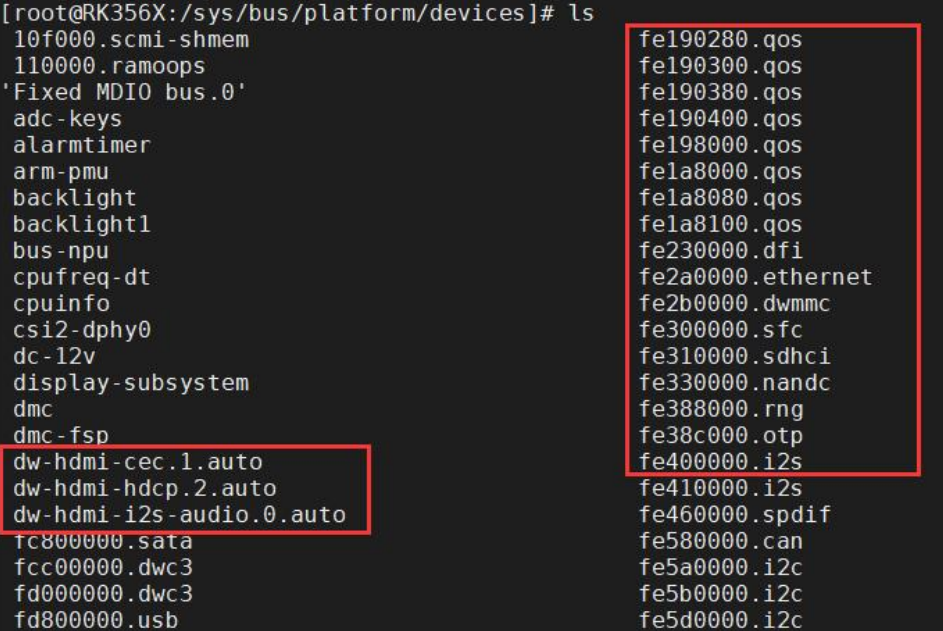

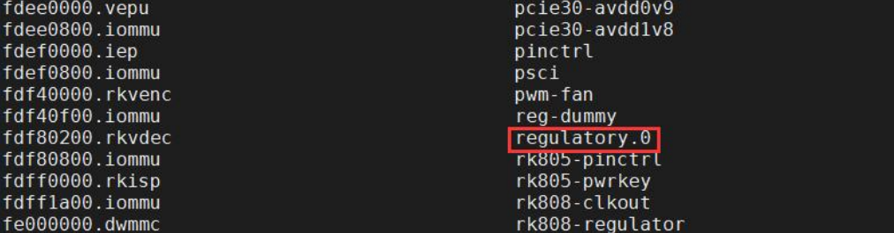


### 为什么注册总线前先注册设备

注册 platform 设备之前，会先调用 `device_register()` 函数注册一个 platform bus设备。

```c
//drivers/base/platform.c
int __init platform_bus_init(void)
{
	int error;

	early_platform_cleanup();

	error = device_register(&platform_bus);
	if (error) {
		put_device(&platform_bus);
		return error;
	}
	error =  bus_register(&platform_bus_type);
	if (error)
		device_unregister(&platform_bus);
	of_platform_register_reconfig_notifier();
	return error;
}

```

可以看到是先调用`device_register(&platform_bus)`然后调用` bus_register(&platform_bus_type)`

先调用 `device_register` 函数注册 paltform_bus 这个设备，会在`/sys/devices` 目录下创建目录`/sys/devices/platform`，此目录所有 platform 设备的父目录，即所有 platform_device 设备都会在`/sys/devices/platform` 下创建子目录，如下图所示：

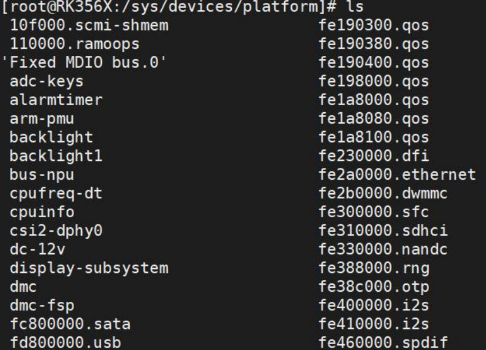

创建好 platform bus 设备之后，使用 `platform_device_add` 函数将 platform_device 结构体添加到 platform 总线中进行注册

### 自己的总线下注册驱动

```c
#include <linux/module.h>
#include <linux/init.h>
#include <linux/slab.h>
#include <linux/configfs.h>
#include <linux/kernel.h>
#include <linux/kobject.h>
#include <linux/device.h>
#include <linux/sysfs.h>

extern struct bus_type mybus;

int mydriver_remove(struct device *dev){
    printk("This is mydriver_remove\n");
    return 0;
};

int mydriver_probe(struct device *dev){
    printk("This is mydriver_probe\n");
    return 0;
};


struct device_driver mydriver = {
    .name = "mydevice",
    .bus = &mybus,
    .probe = mydriver_probe,
    .remove = mydriver_remove,
    
};

// 模块的初始化函数
static int mydriver_init(void)
{
    int ret;
    ret = driver_register(&mydriver);
    
    return ret;
}

// 模块退出函数
static void mydriver_exit(void)
{
    driver_unregister(&mydriver);
}

module_init(mydriver_init); // 指定模块的初始化函数
module_exit(mydriver_exit); // 指定模块的退出函数

MODULE_LICENSE("GPL");   // 模块使用的许可证
MODULE_AUTHOR("topeet"); // 模块的作者
```


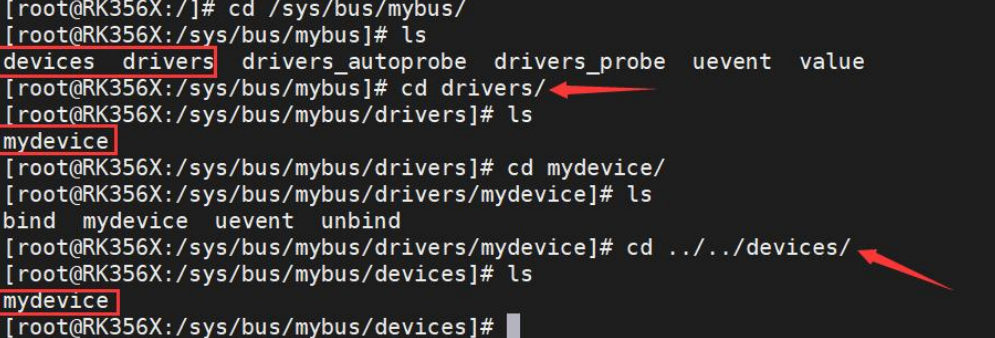

### 驱动注册流程分析

```c
// drivers/base/driver.c
/**
 * driver_register - register driver with bus
 * @drv: driver to register
 *
 * We pass off most of the work to the bus_add_driver() call,
 * since most of the things we have to do deal with the bus
 * structures.
 */
int driver_register(struct device_driver *drv)
{
	int ret;
	struct device_driver *other;
	
    // 检查总线是否已初始化
	if (!drv->bus->p) {
		pr_err("Driver '%s' was unable to register with bus_type '%s' because the bus was not initialized.\n",
			   drv->name, drv->bus->name);
		return -EINVAL;
	}
 // 检查驱动程序的方法是否需要更新
	if ((drv->bus->probe && drv->probe) ||
	    (drv->bus->remove && drv->remove) ||
	    (drv->bus->shutdown && drv->shutdown))
		pr_warn("Driver '%s' needs updating - please use "
			"bus_type methods\n", drv->name);
// 检查驱动程序是否已被注册
	other = driver_find(drv->name, drv->bus);
	if (other) {
		pr_err("Error: Driver '%s' is already registered, "
			"aborting...\n", drv->name);
		return -EBUSY;
	}

	ret = bus_add_driver(drv);// 将驱动程序添加到总线
	if (ret)
		return ret;
	ret = driver_add_groups(drv, drv->groups);// 添加驱动程序的组属性
	if (ret) {
		bus_remove_driver(drv);// 移除已添加的驱动程序
		return ret;
	}
	kobject_uevent(&drv->p->kobj, KOBJ_ADD);// 发送内核对象事件，通知驱动程序添加成功

	return ret;
}
EXPORT_SYMBOL_GPL(driver_register);
```

`driver_register` 函数用于注册设备驱动程序并将其添加到总线中。以下是该函数的功能解释：

- 第 5~11 行代码 检查总线是否已初始化：首先，通过 drv->bus 访问设备驱动程序结构体中的总线信息。如果总线的 p 成员为 NULL，表示总线未初始化。如果总线未初始化，则打印错误消息，并返回 -EINVAL 错误码表示无效的参数。
- 第 13 行~19 行代码 检查驱动程序的方法是否需要更新：通过检查驱动程序结构体中的 bus->probe 和 drv->probe、bus->remove 和 drv->remove、bus->shutdown 和 drv->shutdown 成员是否同时存在来判断。如果存在需要更新的方法组合，说明驱动程序需要更新。在这种情况下，打印警告消息，建议使用 bus_type 方法进行更新。
- 第 21 行~26 行 检查驱动程序是否已被注册：调用 driver_find 函数来查找是否已经注册了同名的驱动程序。如果找到同名驱动程序，表示驱动程序已经注册过。在这种情况下，打印错误消息，并返回 -EBUSY 错误码表示设备忙。
- 第 28 行代码 添加驱动程序到总线：调用 bus_add_driver 函数将驱动程序添加到总线。如果添加失败，则返回相应的错误码。
- 第 31 行代码 添加驱动程序的组属性：调用 driver_add_groups 函数将驱动程序的组属性添加到驱动程序中。如果添加失败，则
  调用 bus_remove_driver 函数移除已添加的驱动程序，并返回相应的错误码。
- 第 36 行代码 发送内核对象事件：调用 kobject_uevent 函数向驱动程序的内核对象发送事件，通知驱动程序已成功添加到系统中。

综上所述，driver_register 函数的功能是注册设备驱动程序并将其添加到总线中，同时进行各种检查和错误处理操作。

在上面代码中，调用 `bus_add_driver` 函数将驱动程序添加到总线。我们来详细分析下`bus_add_driver` 函数


```c
// drivers/base/bus.c
/**
 * bus_add_driver - Add a driver to the bus.
 * @drv: driver.
 */
int bus_add_driver(struct device_driver *drv)
{
	struct bus_type *bus;
	struct driver_private *priv;
	int error = 0;
// 获取总线对象
	bus = bus_get(drv->bus);
	if (!bus)
		return -EINVAL;

	pr_debug("bus: '%s': add driver %s\n", bus->name, drv->name);
// 分配并初始化驱动程序私有数据
	priv = kzalloc(sizeof(*priv), GFP_KERNEL);
	if (!priv) {
		error = -ENOMEM;
		goto out_put_bus;
	}
	klist_init(&priv->klist_devices, NULL, NULL);
	priv->driver = drv;
	drv->p = priv;
	priv->kobj.kset = bus->p->drivers_kset;
	error = kobject_init_and_add(&priv->kobj, &driver_ktype, NULL,
				     "%s", drv->name);// 初始化并添加驱动程序的内核对象
	if (error)
		goto out_unregister;
// 将驱动程序添加到总线的驱动程序列表
	klist_add_tail(&priv->knode_bus, &bus->p->klist_drivers);
	if (drv->bus->p->drivers_autoprobe) {// 如果总线启用了自动探测，则尝试自动探测设备
		error = driver_attach(drv);
		if (error)
			goto out_del_list;
	}
	module_add_driver(drv->owner, drv);// 将驱动程序添加到模块
	// 创建驱动程序的 uevent 属性文件
	error = driver_create_file(drv, &driver_attr_uevent);
	if (error) {
		printk(KERN_ERR "%s: uevent attr (%s) failed\n",
			__func__, drv->name);
	}
	error = driver_add_groups(drv, bus->drv_groups);// 添加驱动程序的组属性
	if (error) {
		/* How the hell do we get out of this pickle? Give up */
		printk(KERN_ERR "%s: driver_create_groups(%s) failed\n",
			__func__, drv->name);
	}

	if (!drv->suppress_bind_attrs) {// 如果驱动程序不禁止绑定属性文件，则添加绑定属性文件
		error = add_bind_files(drv);
		if (error) {
			/* Ditto */
			printk(KERN_ERR "%s: add_bind_files(%s) failed\n",
				__func__, drv->name);
		}
	}

	return 0;

out_del_list:
	klist_del(&priv->knode_bus);
out_unregister:
	kobject_put(&priv->kobj);
	/* drv->p is freed in driver_release()  */
	drv->p = NULL;
out_put_bus:
	bus_put(bus);
	return error;
}

```

`bus_add_driver` 该函数用于将设备驱动程序添加到总线中。以下是功能的详细解释：

- 第 8 行代码获取总线对象：通过 drv->bus 访问设备驱动程序结构体中的总线信息。通过调用 bus_get 函数获取总线
  对象。如果总线对象不存在，则返回 -EINVAL 错误码表示无效的参数。
- 第 15 行~23 行代码分配并初始化驱动程序私有数据：调用 kzalloc 函数为驱动程序的私有数据结构体 priv 分配内存，并使用 GFP_KERNEL 标志进行内存分配。如果内存分配失败，则返回 -ENOMEM 错误码表示内存不足。使用 klist_init函数初始化 priv 结构体中的设备列表。设置 priv 结构体中的驱动程序指针，并将其赋值为当前的驱动程序。将 drv->p 指向 priv 结构体，以便后续的释放操作。
- 第 25 行代码初始化并添加驱动程序的内核对象：设置 priv->kobj.kset 成员为总线对象的 drivers_kset。调用 `kobject_init_and_add` 函数初始化并添加驱动程序的内核对象。如果初始化或添加失败，则跳转到 out_unregister 进行错误处理。
- 第 31 行代码将驱动程序添加到总线的驱动程序列表：使用 klist_add_tail 函数将驱动程序的节点添加到总线的驱动程序列表中


### probe 函数执行流程分析实验

上面在`bus_add_driver`函数中如果总线启用了自动探测（drivers_autoprobe 标志），则调用 `driver_attach` 函数尝试自动探测设备。
如果自动探测失败，则跳转到 out_unregister 进行错误处理。

变量 drivers_autoprobe 也可以在用户空间通过属性文件 drivers_autoprobe 来控制，再次体现属性文件的作用

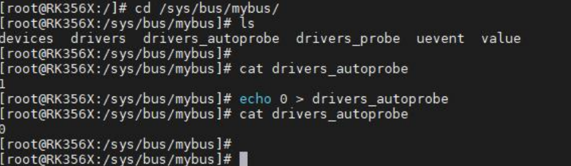

`driver_attach`函数

```c
//drivers/base/dd.c
/**
 * driver_attach - try to bind driver to devices.
 * @drv: driver.
 *
 * Walk the list of devices that the bus has on it and try to
 * match the driver with each one.  If driver_probe_device()
 * returns 0 and the @dev->driver is set, we've found a
 * compatible pair.
 */
int driver_attach(struct device_driver *drv)
{
    //bus_for_each_dev() 函数主要是提供了一个遍历指定总线上的设备对象列表，
	// 并对每个设备对象进行特定操作的快捷方式，可以用于驱动程序中需要管理和操作大量设备实例的场景
	return bus_for_each_dev(drv->bus, NULL, drv, __driver_attach);
}
EXPORT_SYMBOL_GPL(driver_attach);


static int __driver_attach(struct device *dev, void *data)
{
	struct device_driver *drv = data;// 传入的数据参数data作为设备驱动对象
	bool async = false;
	int ret;

	/*
	 * Lock device and try to bind to it. We drop the error
	 * here and always return 0, because we need to keep trying
	 * to bind to devices and some drivers will return an error
	 * simply if it didn't support the device.
	 *
	 * driver_probe_device() will spit a warning if there
	 * is an error.
	 */

	ret = driver_match_device(drv, dev);// 尝试将驱动程序绑定到设备上
	if (ret == 0) {
		/* no match */
		return 0;
	} else if (ret == -EPROBE_DEFER) {
		dev_dbg(dev, "Device match requests probe deferral\n");
		driver_deferred_probe_add(dev);// 请求推迟探测设备
		/*
		 * Driver could not match with device, but may match with
		 * another device on the bus.
		 */
		return 0;
	} else if (ret < 0) {// 总线无法匹配设备，返回错误码
		dev_dbg(dev, "Bus failed to match device: %d\n", ret);
		/*
		 * Driver could not match with device, but may match with
		 * another device on the bus.
		 */
		return 0;
	} /* ret > 0 means positive match */

	if (driver_allows_async_probing(drv)) {
		/*
		 * Instead of probing the device synchronously we will
		 * probe it asynchronously to allow for more parallelism.
		 *
		 * We only take the device lock here in order to guarantee
		 * that the dev->driver and async_driver fields are protected
		 */
		dev_dbg(dev, "probing driver %s asynchronously\n", drv->name);
		device_lock(dev);// 锁定设备以保护 dev->driver 和 async_driver 字段
		if (!dev->driver) {
			get_device(dev);
			dev->p->async_driver = drv;// 设置设备的异步驱动程序
			async = true;
		}
		device_unlock(dev);
		if (async)
			async_schedule_dev(__driver_attach_async_helper, dev);// 异步调度驱动程序的附加处理函数
		return 0;
	}

	device_driver_attach(drv, dev);// 同步探测设备并绑定驱动程序

	return 0;
}

```

`driver_match_device`函数如下：

```c
// drivers/base/base.h
static inline int driver_match_device(struct device_driver *drv,
				      struct device *dev)
{
	return drv->bus->match ? drv->bus->match(dev, drv) : 1;
}
```

如果设备和驱动匹配上，会继续执行 `device_driver_attach` 函数

```c
// drivers/base/dd.c
/**
 * device_driver_attach - attach a specific driver to a specific device
 * @drv: Driver to attach
 * @dev: Device to attach it to
 *
 * Manually attach driver to a device. Will acquire both @dev lock and
 * @dev->parent lock if needed.
 */
int device_driver_attach(struct device_driver *drv, struct device *dev)
{
	int ret = 0;

	__device_driver_lock(dev, dev->parent);

	/*
	 * If device has been removed or someone has already successfully
	 * bound a driver before us just skip the driver probe call.
	 */
	if (!dev->p->dead && !dev->driver)
		ret = driver_probe_device(drv, dev);

	__device_driver_unlock(dev, dev->parent);

	return ret;
}

/**
 * driver_probe_device - attempt to bind device & driver together
 * @drv: driver to bind a device to
 * @dev: device to try to bind to the driver
 *
 * This function returns -ENODEV if the device is not registered,
 * 1 if the device is bound successfully and 0 otherwise.
 *
 * This function must be called with @dev lock held.  When called for a
 * USB interface, @dev->parent lock must be held as well.
 *
 * If the device has a parent, runtime-resume the parent before driver probing.
 */
int driver_probe_device(struct device_driver *drv, struct device *dev)
{
	int ret = 0;

	if (!device_is_registered(dev))// 检查设备是否已注册，如果未注册则返回错误码 -ENODEV
		return -ENODEV;
	// 打印调试信息，表示设备与驱动程序匹配
	pr_debug("bus: '%s': %s: matched device %s with driver %s\n",
		 drv->bus->name, __func__, dev_name(dev), drv->name);
	// 获取设备供应商的运行时引用计数
	pm_runtime_get_suppliers(dev);
	if (dev->parent)// 如果设备有父设备，获取父设备的同步运行时引用计数
		pm_runtime_get_sync(dev->parent);

	pm_runtime_barrier(dev);// 等待设备的运行时状态达到稳定
	if (initcall_debug)// 根据初始化调试标志选择调用真实的探测函数
		ret = really_probe_debug(dev, drv);
	else
		ret = really_probe(dev, drv);
	pm_request_idle(dev);// 请求设备进入空闲状态（省电模式）

	if (dev->parent)// 如果设备有父设备，释放父设备的运行时引用计数
		pm_runtime_put(dev->parent);

	pm_runtime_put_suppliers(dev);// 释放设备供应商的运行时引用计数
	return ret;
}

```

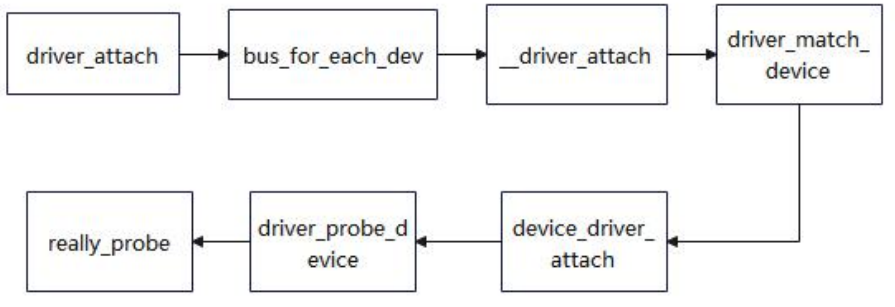


`really_probe`函数如下

```c
// drivers/base/dd.c
static int really_probe(struct device *dev, struct device_driver *drv)
{
	int ret = -EPROBE_DEFER;// 初始化返回值为延迟探测
	int local_trigger_count = atomic_read(&deferred_trigger_count);// 获取当前延迟探测计数
	bool test_remove = IS_ENABLED(CONFIG_DEBUG_TEST_DRIVER_REMOVE) &&
			   !drv->suppress_bind_attrs;

	if (defer_all_probes) {
		/*
		 * Value of defer_all_probes can be set only by
		 * device_block_probing() which, in turn, will call
		 * wait_for_device_probe() right after that to avoid any races.
		 */
		dev_dbg(dev, "Driver %s force probe deferral\n", drv->name);
		driver_deferred_probe_add(dev);
		return ret;
	}

	ret = device_links_check_suppliers(dev);// 检查设备的供应者链路
	if (ret == -EPROBE_DEFER)
		driver_deferred_probe_add_trigger(dev, local_trigger_count);// 将设备添加到延迟探测触发列表
	if (ret)
		return ret;

	atomic_inc(&probe_count);// 增加探测计数
	pr_debug("bus: '%s': %s: probing driver %s with device %s\n",
		 drv->bus->name, __func__, drv->name, dev_name(dev));
	if (!list_empty(&dev->devres_head)) {
		dev_crit(dev, "Resources present before probing\n");
		ret = -EBUSY;
		goto done;
	}

re_probe:
	dev->driver = drv;

	/* If using pinctrl, bind pins now before probing */
	ret = pinctrl_bind_pins(dev);/* 如果使用了 pinctrl，绑定引脚 */
	if (ret)
		goto pinctrl_bind_failed;

	if (dev->bus->dma_configure) {// 配置 DMA
		ret = dev->bus->dma_configure(dev);
		if (ret)
			goto probe_failed;
	}

	ret = driver_sysfs_add(dev);// 添加驱动的 sysfs
	if (ret) {
		pr_err("%s: driver_sysfs_add(%s) failed\n",
		       __func__, dev_name(dev));
		goto probe_failed;
	}

	if (dev->pm_domain && dev->pm_domain->activate) {// 如果设备有电源管理域并且存在激活函数，激活电源管理域
		ret = dev->pm_domain->activate(dev);
		if (ret)
			goto probe_failed;
	}

	if (dev->bus->probe) {// 如果总线有探测函数，调用总线的探测函数
		ret = dev->bus->probe(dev);
		if (ret)
			goto probe_failed;
	} else if (drv->probe) {// 否则调用驱动的探测函数
		ret = drv->probe(dev);
		if (ret)
			goto probe_failed;
	}

	ret = device_add_groups(dev, drv->dev_groups);
	if (ret) {
		dev_err(dev, "device_add_groups() failed\n");
		goto dev_groups_failed;
	}

	if (dev_has_sync_state(dev)) {
		ret = device_create_file(dev, &dev_attr_state_synced);
		if (ret) {
			dev_err(dev, "state_synced sysfs add failed\n");
			goto dev_sysfs_state_synced_failed;
		}
	}

	if (test_remove) {// 如果启用了驱动移除测试
		test_remove = false;

		device_remove_file(dev, &dev_attr_state_synced);
		device_remove_groups(dev, drv->dev_groups);

		if (dev->bus->remove)// 如果总线有移除函数，调用总线的移除函数
			dev->bus->remove(dev);
		else if (drv->remove)// 否则调用驱动的移除函数
			drv->remove(dev);

		devres_release_all(dev);// 释放设备的资源
		arch_teardown_dma_ops(dev);// 移除驱动的 sysfs
		kfree(dev->dma_range_map);
		dev->dma_range_map = NULL;
		driver_sysfs_remove(dev);
		dev->driver = NULL;
		dev_set_drvdata(dev, NULL);
		if (dev->pm_domain && dev->pm_domain->dismiss)// 如果设备有电源管理域并且存在解除函数，解除电源管理域
			dev->pm_domain->dismiss(dev);
		pm_runtime_reinit(dev);// 重新初始化电源管理运行时

		goto re_probe;// 重新进行探测
	}

	pinctrl_init_done(dev);// 完成 pinctrl 的初始化

	if (dev->pm_domain && dev->pm_domain->sync)// 如果设备有电源管理域并且存在同步函数，同步电源管理域
		dev->pm_domain->sync(dev);

	driver_bound(dev);// 驱动绑定成功
	ret = 1;
	pr_debug("bus: '%s': %s: bound device %s to driver %s\n",
		 drv->bus->name, __func__, dev_name(dev), drv->name);
	goto done;

dev_sysfs_state_synced_failed:
	device_remove_groups(dev, drv->dev_groups);
dev_groups_failed:
	if (dev->bus->remove)
		dev->bus->remove(dev);
	else if (drv->remove)
		drv->remove(dev);
probe_failed:
	if (dev->bus)
		blocking_notifier_call_chain(&dev->bus->p->bus_notifier,
					     BUS_NOTIFY_DRIVER_NOT_BOUND, dev);
pinctrl_bind_failed:
	device_links_no_driver(dev);// 将设备与驱动解除绑定
	devres_release_all(dev);// 释放设备的资源
	arch_teardown_dma_ops(dev);// 取消 DMA 配置
	kfree(dev->dma_range_map);
	dev->dma_range_map = NULL;
	driver_sysfs_remove(dev);// 移除驱动的 sysfs
	dev->driver = NULL;
	dev_set_drvdata(dev, NULL);
	if (dev->pm_domain && dev->pm_domain->dismiss)// 如果设备有电源管理域并且存在解除函数，解除电源管理域
		dev->pm_domain->dismiss(dev);
	pm_runtime_reinit(dev);// 重新初始化电源管理运行时
	dev_pm_set_driver_flags(dev, 0);// 设置设备的驱动标志为 0

	switch (ret) {
	case -EPROBE_DEFER:/* 驱动程序请求延迟探测 */
		/* Driver requested deferred probing */
		dev_dbg(dev, "Driver %s requests probe deferral\n", drv->name);
		driver_deferred_probe_add_trigger(dev, local_trigger_count);// 将设备添加到延迟探测触发列表
		break;
	case -ENODEV:
	case -ENXIO:
		pr_debug("%s: probe of %s rejects match %d\n",
			 drv->name, dev_name(dev), ret);
		break;
	default:/* 驱动程序匹配但探测失败 */
		/* driver matched but the probe failed */
		pr_warn("%s: probe of %s failed with error %d\n",
			drv->name, dev_name(dev), ret);
	}
	/*
	 * Ignore errors returned by ->probe so that the next driver can try
	 * its luck.
	 */
	ret = 0;
done:
	atomic_dec(&probe_count);// 减少探测计数
	wake_up_all(&probe_waitqueue);// 唤醒等待探测的进程
	return ret;
}

```

### 加载驱动和加载设备先后顺序分析

经过前面的分析，我们不管是先加载 device.ko 还是 driver.ko，驱动和设备都可以匹配成功。所以我们可以猜测不管是 device 驱动还是 driver 驱动，都会有匹配操作。

在 `drivers/base/core.c` 文件中的 `device_add` 函数中调用了 `bus_probe_device` 函数

```c
// drivers/base/core.c
int device_add(struct device *dev)
{
	...

	// 对总线中的设备进行探测
	bus_probe_device(dev);
	if (parent)// 如果存在父设备，则将当前设备添加到父设备的子设备列表中
		klist_add_tail(&dev->p->knode_parent,
			       &parent->p->klist_children);
	// 如果设备有类别
	if (dev->class) {
		mutex_lock(&dev->class->p->mutex);
	...

}
EXPORT_SYMBOL_GPL(device_add);
```


`bus_probe_device`函数中最重要的是 `device_initial_probe` 函数

```c
// drivers/base/bus.c
/**
 * bus_probe_device - probe drivers for a new device
 * @dev: device to probe
 *
 * - Automatically probe for a driver if the bus allows it.
 */
void bus_probe_device(struct device *dev)
{
	struct bus_type *bus = dev->bus;
	struct subsys_interface *sif;

	if (!bus)
		return;

	if (bus->p->drivers_autoprobe)
		device_initial_probe(dev);

	mutex_lock(&bus->p->mutex);
	list_for_each_entry(sif, &bus->p->interfaces, node)
		if (sif->add_dev)
			sif->add_dev(dev, sif);
	mutex_unlock(&bus->p->mutex);
}

```

`device_initial_probe`调用`__device_attach`

```c
// drivers/base/dd.c
void device_initial_probe(struct device *dev)
{
	__device_attach(dev, true);
}

```

`__device_attach`如下

```c
// drivers/base/dd.c
static int __device_attach(struct device *dev, bool allow_async)
{
	int ret = 0;
	bool async = false;

	device_lock(dev);
	if (dev->p->dead) {
		goto out_unlock;
	} else if (dev->driver) {
		if (device_is_bound(dev)) {// 如果设备已经绑定了驱动程序，则返回 1
			ret = 1;
			goto out_unlock;
		}
		ret = device_bind_driver(dev);// 尝试将设备与驱动程序进行绑定
		if (ret == 0)
			ret = 1;
		else {
			dev->driver = NULL;// 绑定失败，将设备的驱动程序指针置为 NULL
			ret = 0;
		}
	} else {
		struct device_attach_data data = {// 如果设备没有驱动程序，需要遍历总线上的驱动程序进行匹配
			.dev = dev,
			.check_async = allow_async,
			.want_async = false,
		};

		if (dev->parent)// 如果设备有父设备，调用 pm_runtime_get_sync() 增加父设备的引用计数
			pm_runtime_get_sync(dev->parent);
		// 遍历总线上的驱动程序，调用 __device_attach_driver() 进行匹配
		ret = bus_for_each_drv(dev->bus, NULL, &data,
					__device_attach_driver);
		if (!ret && allow_async && data.have_async) {
			/*
			 * If we could not find appropriate driver
			 * synchronously and we are allowed to do
			 * async probes and there are drivers that
			 * want to probe asynchronously, we'll
			 * try them.
			 */
            /*
			* 如果无法同步找到适合的驱动程序，并且允许异步探测以及有驱动程序要求异步探测，
			* 则尝试进行异步探测。
			*/
			dev_dbg(dev, "scheduling asynchronous probe\n");
			get_device(dev);// 增加设备的引用计数，以确保在异步探测期间设备不会被释放
			async = true;
		} else {
			pm_request_idle(dev);// 如果无法异步探测或者没有驱动程序要求异步探测，则调用 pm_request_idle() 进入空闲状态
		}

		if (dev->parent)// 如果设备有父设备，调用 pm_runtime_put() 减少父设备的引用计数
			pm_runtime_put(dev->parent);
	}
out_unlock:
	device_unlock(dev);
	if (async)
		async_schedule_dev(__device_attach_async_helper, dev);// 调度异步任务 __device_attach_async_helper() 进行异步探测
	return ret;
}

```

上述函数中使用`device_bind_driver`绑定设备驱动

```c
// drivers/base/dd.c
/**
 * device_bind_driver - bind a driver to one device.
 * @dev: device.
 *
 * Allow manual attachment of a driver to a device.
 * Caller must have already set @dev->driver.
 *
 * Note that this does not modify the bus reference count.
 * Please verify that is accounted for before calling this.
 * (It is ok to call with no other effort from a driver's probe() method.)
 *
 * This function must be called with the device lock held.
 */
int device_bind_driver(struct device *dev)
{
	int ret;

	ret = driver_sysfs_add(dev);
	if (!ret)
		driver_bound(dev);
	else if (dev->bus)
		blocking_notifier_call_chain(&dev->bus->p->bus_notifier,
					     BUS_NOTIFY_DRIVER_NOT_BOUND, dev);
	return ret;
}
EXPORT_SYMBOL_GPL(device_bind_driver);


static void driver_bound(struct device *dev)
{
	if (device_is_bound(dev)) {// 如果设备已经绑定了驱动程序，则输出警告信息并返回
		pr_warn("%s: device %s already bound\n",
			__func__, kobject_name(&dev->kobj));
		return;
	}

	pr_debug("driver: '%s': %s: bound to device '%s'\n", dev->driver->name,
		 __func__, dev_name(dev));
	// 将设备添加到驱动程序的设备链表中
	klist_add_tail(&dev->p->knode_driver, &dev->driver->p->klist_devices);
	device_links_driver_bound(dev);// 更新设备的驱动程序链接状态

	device_pm_check_callbacks(dev);// 检查设备的电源管理回调函数

	/*
	 * Make sure the device is no longer in one of the deferred lists and
	 * kick off retrying all pending devices
	 */
    /*
	* 确保设备不再位于延迟探测列表中，并启动重试所有待处理设备
	*/
	driver_deferred_probe_del(dev);
	driver_deferred_probe_trigger();
	// 如果设备有总线，调用总线通知链进行通知
	if (dev->bus)
		blocking_notifier_call_chain(&dev->bus->p->bus_notifier,
					     BUS_NOTIFY_BOUND_DRIVER, dev);
	// 发送内核对象事件通知
	kobject_uevent(&dev->kobj, KOBJ_BIND);
}

```

上述代码的作用是将驱动和设备进行绑定，首先，通过调用 `device_is_bound(dev)` 检查设备是否已经绑定了驱动程序。

如果设备已经绑定了驱动程序，则输出警告信息并返回。

如果设备未绑定驱动程序，将输出绑定信息，其中包括驱动程序的名称、函数名和设备的名称。接下来，通过调用 `klist_add_tail()` 将设备添加到驱动程序的设备链表中。这样，驱动程序可以通过遍历该链表来访问所有已绑定的设备。

然后，调用 `device_links_driver_bound()` 更新设备的驱动程序链接状态。这个函数会确保设备和驱动程序之间的链接关系是正确的。


### platform 总线注册驱动流程实例分析

```c
#define platform_driver_register(drv) \
__platform_driver_register(drv, THIS_MODULE)


// drivers/base/platform.c
/**
 * __platform_driver_register - register a driver for platform-level devices
 * @drv: platform driver structure
 * @owner: owning module/driver
 */
int __platform_driver_register(struct platform_driver *drv,
				struct module *owner)
{
	drv->driver.owner = owner;
	drv->driver.bus = &platform_bus_type;
	drv->driver.probe = platform_drv_probe;
	drv->driver.remove = platform_drv_remove;
	drv->driver.shutdown = platform_drv_shutdown;

	return driver_register(&drv->driver);
}
EXPORT_SYMBOL_GPL(__platform_driver_register);

```

`driver_register` 函数之前已经分析过，所以接下来我们重点看看 platform 总线的 probe 函数是如何执行的：

```c
static int platform_drv_probe(struct device *_dev)
{
    // 将传递给驱动程序的设备指针转换为 platform_driver 结构体指针
	struct platform_driver *drv = to_platform_driver(_dev->driver);
    // 将传递给驱动程序的设备指针转换为 platform_device 结构体指针
	struct platform_device *dev = to_platform_device(_dev);
	int ret;
// 设置设备节点的默认时钟属性
	ret = of_clk_set_defaults(_dev->of_node, false);
	if (ret < 0)
		return ret;
// 将设备附加到电源域
	ret = dev_pm_domain_attach(_dev, true);
	if (ret)
		goto out;
// 调用驱动程序的探测函数（probe）
	if (drv->probe) {
		ret = drv->probe(dev);
		if (ret)
			dev_pm_domain_detach(_dev, true);
	}

out:
	if (drv->prevent_deferred_probe && ret == -EPROBE_DEFER) {// 处理探测延迟和错误情况
		dev_warn(_dev, "probe deferral not supported\n");
		ret = -ENXIO;
	}

	return ret;
}
```

该函数的主要逻辑如下：

1. 首先，将传递给驱动程序的设备指针 `_dev` 转换为 platform_driver 结构体指针 drv，将传递给驱动程序的设备指针 `_dev` 转换为 platform_device 结构体指针 dev。

2. 使用 of_clk_set_defaults() 函数设置设备节点的默认时钟属性。这个函数会根据设备节点的属性信息配置设备的时钟。
3. 调用 `dev_pm_domain_attach()` 将设备附加到电源域。这个函数会根据设备的电源管理需求，将设备与相应的电源域进行关联。
4. 如果驱动程序的 probe 函数存在，调用它来执行设备的探测操作。`drv->probe(dev)` 表示调用驱动程序的 probe 函数，并传递 platform_device 结构体指针 dev 作为参数。如果探测失败，会调用 `dev_pm_domain_detach()` 分离设备的电源域。
5. 处理探测延迟和错误情况。如果驱动程序设置了 `prevent_deferred_probe` 标志，并且返回值为`-EPROBE_DEFER` ， 则 表 示 探 测 被 延 迟 。 在 这 种 情 况 下 如 果 驱 动 程 序 设 置 了`prevent_deferred_probe` 标志，并且返回值为 `-EPROBE_DEFER，`则表示探测被延迟。在这种情况下，代码会打印一个警告信息 probe deferral not supported，并将返回值设置为 -ENXIO，表示设备不存在。

总体而言，该函数的作用是执行平台驱动程序的探测操作，在设备上调用驱动程序的probe 函数，并处理探测延迟和错误情况