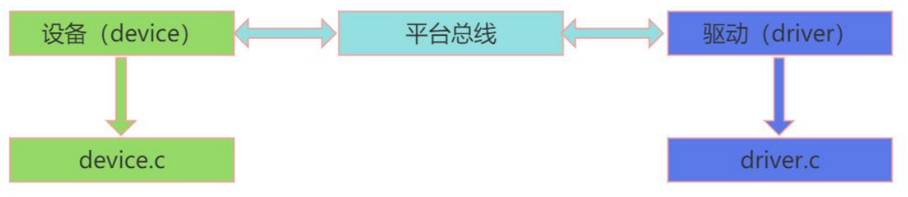

# Linux驱动框架


Linux 将存储器和外设分为 3 个基础大类：**字符设备驱动**，**块设备驱动**，**网络设备驱动**。

## Linux源码目录结构

| 目录          | 说明                                                         |
| ------------- | ------------------------------------------------------------ |
| arch          | 架构相关目录，存放多种 CPU 架构（如 arm、X86、MIPS 等）的适配代码 |
| block         | 块设备相关代码目录，Linux 中以块设备形式管理硬盘、SD 卡等存储设备 |
| crypto        | 加密算法目录，存放各类加密相关的实现代码                     |
| Documentation | 官方 Linux 内核文档目录，包含内核功能、接口等详细说明        |
| drivers       | 驱动目录，存放 Linux 系统支持的各类硬件设备驱动代码          |
| firmware      | 固件目录，存放硬件设备所需的固件文件                         |
| fs            | 文件系统目录，存放 ext2、ext3、fat 等文件系统的实现代码      |
| include       | 公共头文件目录，提供内核各模块共用的头文件                   |
| init          | 内核启动初始化目录，存放 Linux 内核启动阶段的初始化代码      |
| ipc           | 进程间通信目录，存放管道、消息队列、共享内存等 IPC 机制的实现代码 |
| kernel        | 内核核心目录，存放内核本身的核心功能代码                     |
| lib           | 库函数目录，存放内核使用的各类库函数                         |
| mm            | 内存管理目录（mm 为 memory management 缩写），负责内核内存管理功能 |
| net           | 网络相关目录，存放 TCP/IP 协议栈等网络功能的实现代码         |
| scripts       | 脚本目录，存放内核编译、测试等流程中使用的脚本文件           |
| security      | 安全相关目录，存放内核安全机制的实现代码                     |
| sound         | 音频相关目录，存放音频设备驱动及音频处理的代码               |
| tools         | 工具目录，存放 Linux 内核开发、调试用到的工具程序            |
| usr           | 与 Linux 内核启动相关的代码目录                              |
| virt          | 内核虚拟机相关目录，存放内核级虚拟化功能的实现代码           |

## 最简单的 Linux 驱动结构解析

- **组成部分**
  1. **头文件（必须）**：驱动需包含内核相关头文件，其中`<linux/module.h>`和`<linux/init.h>`是必备的。
  2. **驱动加载函数（必须）**：加载驱动时，该函数会被内核自动执行。
  3. **驱动卸载函数（必须）**：卸载驱动时，该函数会被内核自动执行。
  4. **许可证声明（必须）**：因 Linux 内核遵循 GPL 协议，驱动加载时也需遵守相关协议，常见的有 GPL v2 等多种许可证类型。
  5. **模块参数（可选）**：是模块加载时传递给内核模块的值。
  6. **作者和版本信息（可选）**：用于声明驱动的作者及代码版本信息。
- **例子**

```c
#include <linux/init.h>
#include <linux/module.h>
#include <linux/kernel.h>


static int __init hello_world_init(void)
{
    printk(KERN_INFO "Hello World: Module loaded\n");
    return 0;
}

static void __exit hello_world_exit(void)
{
    printk(KERN_INFO "Hello World: Module unloaded\n");
}

module_init(hello_world_init);
module_exit(hello_world_exit);

MODULE_LICENSE("GPL");
MODULE_AUTHOR("Zhao Hang");
MODULE_DESCRIPTION("Hello World Kernel Module");
```

## 编译Linux驱动

- **将驱动放在Linux内核里面**，然后编译Linux内核。将驱动编译到Linux内核里面。
- 将驱动**编译成内核模块**，独立于Linux内核之外
  - 内核模块是Linux系统中的一个特殊的机制，可以将一些使用频率很少或者暂时不用的功能编译成内核模块，在需要的时候再动态加载到内核里面。
  - 使用内核模块可以减小内核体积，加快启动速度。并且可以在系统运行时插入或者卸载驱动，无需重启系统。内核模块的后缀是.ko


### 编译成内核模块

```makefile
obj-m += hello_world.o
KERNEL_SRC:=/home/zhaohang/repository/linux/linux-5.10.246
PWD ?=$(shell pwd)
ARCH = arm64
CROSS_COMPILE = aarch64-linux-gnu-

all:
	$(MAKE) ARCH=$(ARCH) CROSS_COMPILE=$(CROSS_COMPILE) -C $(KERNEL_SRC) M=$(PWD) modules

clean:
	$(MAKE) ARCH=$(ARCH) CROSS_COMPILE=$(CROSS_COMPILE) -C $(KERNEL_SRC) M=$(PWD) modules clean
	rm -rf *.ko *.o *.mod.o *.mod.c *.symvers *.order
```

> 本地的Linux代码在/lib/modules/$(uname -r)/kernel下

### 将驱动编译到内核

在drivers/char(以字符驱动为例)创建文件夹helloworld，然后将驱动源代码放入，然后创建Kconfig文件

```Kconfig
config helloworld
	bool "helloworld support"
	default y
	help
			helloworld
```

更改drivers

```bash
emacs ../Kconfig
# 添加
source "drivers/char/helloworld/Kconfig"
```

在驱动源码里创建Makefile

```makefile
obj-$(CONFIG_helloworld) += helloworld.o
```

然后在上一级的Makefile中添加：

```bash
emacs ../Makefile
# 添加
obj-y += helloworld/
```


## 模块相关命令

### 模块加载命令

- insmod
  - 功能：载入Linux内核模块
  - 语法：insmod 模块名
  - 例子：insmod hello_world.ko
- modprobe
  - 功能：加载内核模块，同时这个模块所依赖的模块也同时被加载
  - 语法：modprobe 模块名
  - 举例：modprobe hello_world.ko

### 模块卸载命令

- rmmod
  - 功能：移除已经载入Linux的内核模块
  - 语法：rmmod模块名
  - 举例：rmmod hello_world.ko


### 查看模块信息命令

- lsmod命令
  - 功能：列出已经载入Linux的内核模块
  - 也可以使用命令cat /proc/modules来查看模块是否加载成功
- modinfo命令
  - 功能：查看内核模块信息
  - 语法：modinfo模块名
  - 举例：modinfo hello_world.ko

## 配置文件

**menuconfig**配置驱动选项状态操作：

驱动状态：

1. 把驱动编译成内核模块，用M来表示
2. 把驱动编译到内核里面，用*来表示
3. 不编译

使用空格来切换这三种不同状态。


选项的状态有:

- [] : 表示有两种状态只能设置成选中或者不选中
- <> : 表示有三种状态，可以设置成选中，不选中，和编译成模块
- () : 表示用来存放字符串或者16进制数


### Kconfig文件

Kconfig文件是图形化配置界面的源文件，图形化配置界面中的选项由Kconfig文件决定。当我们执行命令make menuconfig命令的时候，内核的配置工具会读取内核源码目录下的arch/xxx/Kconfig。xxx是ARCH的值，比如arm64，然后生成对应的配置界面供开发者使用。


### config文件与.config文件

config文件和.config文件都是Linux内核的配置文件。

- config文件位于Linux内核源码的arch/$(ARCH)/configs目录下，是**Linux系统默认的配置文件**。.
- config文件位于Linux内核源码的顶层目录下，编译linux内核时会使用.config文件里面的配置来编译内核镜像。

若.config存在，make menuconfig界面的默认配置即当前.config文件的配置，若修改了图形化配置界面的设置并保存，则.config文件会被更新。

若.config文件不存在，make menuconfig界面的默认配置则为Kconfig文件中的默认配置。

使用命令make xxx_defconfig命令会根据arch/$(ARCH)/configs目录下默认文件生成.config文件。


### Kconfig语法

参考:



**主菜单**

**mainmenu**用来设置主菜单的标题

举例：mainmenu "Linux/\$(ARCH) $(KERNELVERSION) Kernel Configuration"

上述名字设置的菜单名字为Linux/\$(ARCH) $(KERNELVERSION) Kernel Configuration

**菜单结构**

可以用menu/endmenu来生成菜单，menu是菜单开始的标志，endmenu是菜单结束的标志。这两个是成对出现的。

如下描述的是一个名字为："Network device support"的菜单

```
menu "Network device support"
	config NETDEVICE
	...
endmenu
```

**配置选项**

​       使用关键字**config**来定义一个新的选项。每个选项都必须指定类型，类型包括**bool, tristate, string, hex, int**。最常见的是bool, tristate, string这三个。bool类型有两种值：y和n, trisate有三种值：y, m和n。string为字符串类型。

​      help表示帮助信息，当我们在图形化界面按下h按键，弹出来的就是help的内容。

举例：

```Kconfig
config helloworld
	bool "hello world support"
	default y
	help 
		hello world
```

**依赖关系**

Kconfig中的依赖关系可以用depends on和select


**depends on 表示直接依赖关系**：

```Kconfig
config A
	depends on B
```

表示选项A依赖选项B，只有选项B被选中时，A选项才可以被选中


**select表示反向依赖关系：**

```Kconfig
config A
	select B
```

在A选项被选中的情况下，B选项自动被选中


**可选选项**

使用choice和endchoice定义可选择项

```Kconfig
choice
	bool "a"
config b
	boot b1
config c
	boot c1
...
endchoice
```


**注释**

在图形化配置界面显示一个注释

```Kconfig
config TEST_CONFIG
	bool "test"
	default y
	help
		just test
comment "just for test"
```


**souce**

source用于读取另一个Kconfig文件，如source "init/Kconfig" 就是读取init目录下的Kconfig文件


## 驱动模块传参

驱动传参的意义：

**优势：**

1. 通过驱动传参，可以让驱动程序更加灵活，兼容性更强。
2. 可以通过驱动传参，设置安全校验，防止驱动被盗用

**不足**

1. 使驱动代码变得复杂化
2. 增加了驱动的资源占用


### 驱动可以传递的参数类型

C语言常用的数据类型内核大部分都支持驱动传参。这里将内核支持的驱动传递参数类型分为三类：

- 基本类型：char, bool, int, long, short, byte, ushort, uint
- 数组：array
- 字符串：string

### 给 Linux 驱动传递参数的方式

- **参数类型与对应函数**

  | 参数类型   | 对应函数              | 功能               |
  | ---------- | --------------------- | ------------------ |
  | 基本类型   | `module_param`        | 传递基本类型参数   |
  | 数组类型   | `module_param_array`  | 传递数组类型参数   |
  | 字符串类型 | `module_param_string` | 传递字符串类型参数 |

- **函数定义位置**：这三个函数在 Linux 内核源码的`include/linux/moduleparam.h`中定义。

```c
module_param(name, type, perm);
module_param_array(name, type, nump, perm);
module_param_string(name, string, len, perm);

module_param_named(name, variable, type, perm);

MODULE_PARM_DESC(name, "help description");
```

**MODULE_PARM_DESC**

函数功能：描述模块参数的信息。在include/linux/moduleparam.h定义

函数原型：MODULE_PARM_DESC(_parm, desc)

函数参数： _parm：要描述的参数的参数名称。desc：描述信息


| 参数名   | 含义                                                       |
| -------- | ---------------------------------------------------------- |
| `name`   | 参数名（可在命令行传入）                                   |
| `type`   | 参数类型（如：`int`、`bool`、`charp`）                     |
| `perm`   | 在 `/sys/module/<modname>/parameters/` 中的权限，如 `0644` |
| `nump`   | （仅数组）保存数组元素数量的变量地址                       |
| `len`    | （仅字符串）缓冲区长度                                     |
| `string` | 指向字符串缓冲的指针                                       |


示例：

```c
#include <linux/module.h>
#include <linux/kernel.h>
#include <linux/init.h>

static int myint = 1;
static char *mystring = "default";
static int myarray[3] = {0, 1, 2};
static int arr_argc = 3;

module_param(myint, int, 0644);
MODULE_PARM_DESC(myint, "An integer parameter");

module_param(mystring, charp, 0444);
MODULE_PARM_DESC(mystring, "A string parameter");

module_param_array(myarray, int, &arr_argc, 0644);
MODULE_PARM_DESC(myarray, "An integer array parameter");

static int __init hello_init(void)
{
    int i;
    pr_info("Hello, world!\n");
    pr_info("myint = %d\n", myint);
    pr_info("mystring = %s\n", mystring);
    for (i = 0; i < arr_argc; i++)
        pr_info("myarray[%d] = %d\n", i, myarray[i]);
    return 0;
}

static void __exit hello_exit(void)
{
    pr_info("Goodbye!\n");
}

module_init(hello_init);
module_exit(hello_exit);
MODULE_LICENSE("GPL");
```

**加载模块时可以传参**：

```bash
insmod hello_world.ko myint=42 mystring="hi" myarray=9,8,7
```

**运行时候查看参数**：

```bash
cd /sys/module/hello_world/parameters/
cat myint
echo 99 > myint
```


**权限定义位置**：读写权限在`include/linux/stat.h`和`include/uapi/linux/stat.h`中定义。

- **include/linux/stat.h**

```c
/* SPDX-License-Identifier: GPL-2.0 */
#ifndef _LINUX_STAT_H
#define _LINUX_STAT_H


#include <asm/stat.h>
#include <uapi/linux/stat.h>

#define S_IRWXUGO	(S_IRWXU|S_IRWXG|S_IRWXO)
#define S_IALLUGO	(S_ISUID|S_ISGID|S_ISVTX|S_IRWXUGO)
#define S_IRUGO		(S_IRUSR|S_IRGRP|S_IROTH)
#define S_IWUGO		(S_IWUSR|S_IWGRP|S_IWOTH)
#define S_IXUGO		(S_IXUSR|S_IXGRP|S_IXOTH)


#endif
```

- **include/uapi/linux/stat.h**

```c
/* SPDX-License-Identifier: GPL-2.0 WITH Linux-syscall-note */
#ifndef _UAPI_LINUX_STAT_H
#define _UAPI_LINUX_STAT_H

#include <linux/types.h>

#if defined(__KERNEL__) || !defined(__GLIBC__) || (__GLIBC__ < 2)

#define S_IFMT  00170000
#define S_IFSOCK 0140000
#define S_IFLNK	 0120000
#define S_IFREG  0100000
#define S_IFBLK  0060000
#define S_IFDIR  0040000
#define S_IFCHR  0020000
#define S_IFIFO  0010000
#define S_ISUID  0004000
#define S_ISGID  0002000
#define S_ISVTX  0001000

#define S_ISLNK(m)	(((m) & S_IFMT) == S_IFLNK)
#define S_ISREG(m)	(((m) & S_IFMT) == S_IFREG)
#define S_ISDIR(m)	(((m) & S_IFMT) == S_IFDIR)
#define S_ISCHR(m)	(((m) & S_IFMT) == S_IFCHR)
#define S_ISBLK(m)	(((m) & S_IFMT) == S_IFBLK)
#define S_ISFIFO(m)	(((m) & S_IFMT) == S_IFIFO)
#define S_ISSOCK(m)	(((m) & S_IFMT) == S_IFSOCK)

#define S_IRWXU 00700
#define S_IRUSR 00400
#define S_IWUSR 00200
#define S_IXUSR 00100

#define S_IRWXG 00070
#define S_IRGRP 00040
#define S_IWGRP 00020
#define S_IXGRP 00010

#define S_IRWXO 00007
#define S_IROTH 00004
#define S_IWOTH 00002
#define S_IXOTH 00001

#endif

#endif /* _UAPI_LINUX_STAT_H */

```

相关的权限主要是**文件访问权限宏（File Permission Bits）**

| 宏名      | 八进制值 | 含义                             |
| --------- | -------- | -------------------------------- |
| `S_IRWXU` | `00700`  | 所有者(U)读、写、执行权限(RWX)   |
| `S_IRUSR` | `00400`  | 所有者(USR)读权限(R)             |
| `S_IWUSR` | `00200`  | 所有者(USR)写权限(W)             |
| `S_IXUSR` | `00100`  | 所有者(USR)执行权限(X)           |
| `S_IRWXG` | `00070`  | 所属组(G)读、写、执行权限(RWX)   |
| `S_IRGRP` | `00040`  | 所属组(GRP)读权限(R)             |
| `S_IWGRP` | `00020`  | 所属组(GRP)写权限(W)             |
| `S_IXGRP` | `00010`  | 所属组(GRP)执行权限(X)           |
| `S_IRWXO` | `00007`  | 其他用户(O)读、写、执行权限(RWX) |
| `S_IROTH` | `00004`  | 其他用户(OTH)读权限(R)           |
| `S_IWOTH` | `00002`  | 其他用户(OTH)写权限(W)           |
| `S_IXOTH` | `00001`  | 其他用户(OTH)执行权限(X)         |


还有**组合权限**

| 宏名            | 定义                                        | 含义（展开后）                                   | 实际意义                                                     | 举例用途                                |
| --------------- | ------------------------------------------- | ------------------------------------------------ | ------------------------------------------------------------ | --------------------------------------- |
| **`S_IRWXUGO`** | `(S_IRWXU | S_IRWXG | S_IRWXO)`             | 00700 \| 00070 \| 00007 = `00777`                | 允许 **所有者、组、其他用户** (UGO)拥有 **读、写、执行** 权限 | 设置所有人可读写执行，如临时目录 `/tmp` |
| **`S_IALLUGO`** | `(S_ISUID | S_ISGID | S_ISVTX | S_IRWXUGO)` | 0004000 \| 0002000 \| 0001000 \| 00777 = `01777` | 包含特殊位（SUID、SGID、Sticky）以及所有人读写执行权限       | 常见权限：`drwxrwxrwt`（如 `/tmp`）     |
| **`S_IRUGO`**   | `(S_IRUSR | S_IRGRP | S_IROTH)`             | 00400 \| 00040 \| 00004 = `00444`                | 所有人 **读** 权限                                           | 常用于只读文件                          |
| **`S_IWUGO`**   | `(S_IWUSR | S_IWGRP | S_IWOTH)`             | 00200 \| 00020 \| 00002 = `00222`                | 所有人 **写** 权限                                           | 少用，一般仅限特定目录                  |
| **`S_IXUGO`**   | `(S_IXUSR | S_IXGRP | S_IXOTH)`             | 00100 \| 00010 \| 00001 = `00111`                | 所有人 **执行** 权限                                         | 使所有人可执行某脚本或程序              |

## 内核符号表导入导出

驱动程序可以编译成内核模块，也就是KO文件。每个KO文件是相互独立的，也就是说模块之间无法相互访问。但是在某些使用场景下要相互访问，如B模块要用A模块中的函数。（B模块依赖于A模块）

**符号表**

**”符号“就是内核中的函数名，全局变量名等**。符号表就是用来记录这些”符号“的文件。

### 内核符号表导出

**导出宏**

| 宏名称              | 适用场景                    |
| ------------------- | --------------------------- |
| `EXPORT_SYMBOL`     | 导出符号到内核符号表        |
| `EXPORT_SYMBOL_GPL` | 仅适用于包含 GPL 许可的模块 |

导出的符号可被其他模块使用，使用前只需声明即可。

例子：

```c
#include <linux/module.h>
#include <linux/init.h>

int add(int a, int b)
{
    return a + b;
}
EXPORT_SYMBOL(add);  // 导出add函数到内核符号表

static int __init helloworld_init(void)
{
    printk("helloworld!\n");
    return 0;
}

static void __exit helloworld_exit(void)
{
    printk("helloworld bye\n");
}

module_init(helloworld_init);  // 指定模块初始化函数
module_exit(helloworld_exit);  // 指定模块退出函数

MODULE_LICENSE("GPL");  // 声明许可证
```

导入

```c
#include <linux/module.h>
#include <linux/init.h>

/* 声明外部模块导出的函数 */
extern int add(int a, int b);

static int __init use_add_init(void)
{
    int result = add(3, 5);
    pr_info("Result of add(3,5) = %d\n", result);
    return 0;
}

static void __exit use_add_exit(void)
{
    pr_info("use_add module unloaded\n");
}

module_init(use_add_init);
module_exit(use_add_exit);

MODULE_LICENSE("GPL");
MODULE_AUTHOR("Zhao Hang");
MODULE_DESCRIPTION("Module that calls add() from helloworld");

```

注意：加载时要先加载导出的那个模块，卸载时要先卸载导入的那个模块。**因为此时两个模块已经有了依赖关系，modprobe会自动处理这些依赖关系，不需要显式声明。**


## 使用makefile中定义的宏

 核心思路：想要让它被 **C 代码可见**，必须通过 **编译器命令行传入宏定义**：

```makefile
cc -D宏名=值 source.c
```

例子：

```makefile
obj-m += mydriver.o

# 定义一个宏
MY_DRIVER_VER := 0x10

# 把它传给编译器
KBUILD_CFLAGS_MODULE += -DMY_DRIVER_VER=$(MY_DRIVER_VER)
```

其他变量名：

| 变量名                 | 作用范围                         | 典型用途        |
| ---------------------- | -------------------------------- | --------------- |
| `ccflags-y`            | 当前模块的所有 `.c` 文件         | 普通 C 编译选项 |
| `asflags-y`            | 汇编文件                         | 汇编参数        |
| `subdir-ccflags-y`     | 当前目录及子目录                 | 全局作用        |
| `KBUILD_CFLAGS`        | 全局（由内核顶层 Makefile 设置） | 平台级 CFLAGS   |
| `KBUILD_CFLAGS_MODULE` | 内核模块                         |                 |
| `EXTRA_CFLAGS`         | 已废弃（旧版用法）               | 临时附加选项    |

然后在driver中可以使用：

```c
#include <linux/module.h>
#include <linux/kernel.h>

static int __init mydriver_init(void)
{
    pr_info("mydriver version: 0x%x\n", MY_DRIVER_VER);
    return 0;
}

static void __exit mydriver_exit(void)
{
    pr_info("mydriver exit\n");
}

module_init(mydriver_init);
module_exit(mydriver_exit);

MODULE_LICENSE("GPL");
```


## 编译进内核的驱动是如何运行的？

### module_init

定义在include/linux/module.h中

```c
#ifndef MODULE
/**
 * module_init() - driver initialization entry point
 * @x: function to be run at kernel boot time or module insertion
 *
 * module_init() will either be called during do_initcalls() (if
 * builtin) or at module insertion time (if a module).  There can only
 * be one per module.
 */
#define module_init(x)	__initcall(x);

/**
 * module_exit() - driver exit entry point
 * @x: function to be run when driver is removed
 *
 * module_exit() will wrap the driver clean-up code
 * with cleanup_module() when used with rmmod when
 * the driver is a module.  If the driver is statically
 * compiled into the kernel, module_exit() has no effect.
 * There can only be one per module.
 */
#define module_exit(x)	__exitcall(x);

#else /* MODULE */

/*
 * In most cases loadable modules do not need custom
 * initcall levels. There are still some valid cases where
 * a driver may be needed early if built in, and does not
 * matter when built as a loadable module. Like bus
 * snooping debug drivers.
 */
#define early_initcall(fn)		module_init(fn)
#define core_initcall(fn)		module_init(fn)
#define core_initcall_sync(fn)		module_init(fn)
#define postcore_initcall(fn)		module_init(fn)
#define postcore_initcall_sync(fn)	module_init(fn)
#define arch_initcall(fn)		module_init(fn)
#define subsys_initcall(fn)		module_init(fn)
#define subsys_initcall_sync(fn)	module_init(fn)
#define fs_initcall(fn)			module_init(fn)
#define fs_initcall_sync(fn)		module_init(fn)
#define rootfs_initcall(fn)		module_init(fn)
#define device_initcall(fn)		module_init(fn)
#define device_initcall_sync(fn)	module_init(fn)
#define late_initcall(fn)		module_init(fn)
#define late_initcall_sync(fn)		module_init(fn)

#define console_initcall(fn)		module_init(fn)

/* Each module must use one module_init(). */
#define module_init(initfn)					\
	static inline initcall_t __maybe_unused __inittest(void)		\
	{ return initfn; }					\
	int init_module(void) __copy(initfn) __attribute__((alias(#initfn)));

/* This is only required if you want to be unloadable. */
#define module_exit(exitfn)					\
	static inline exitcall_t __maybe_unused __exittest(void)		\
	{ return exitfn; }					\
	void cleanup_module(void) __copy(exitfn) __attribute__((alias(#exitfn)));

#endif
```

> 如果把驱动编译进Linux内核，module_exit是没有意义的，因为静态编译的驱动无法卸载

**MODULE宏**

| 场景                     | 含义                                   | `MODULE` 状态 |
| ------------------------ | -------------------------------------- | ------------- |
| **模块（.ko）**          | 使用 `obj-m += xxx.o` 编译为可加载模块 | ✅ 被定义      |
| **内建驱动（built-in）** | 使用 `obj-y += xxx.o` 编进内核镜像     | ❌ 未定义      |

在linux源码顶层Makefile里

```makefile
KBUILD_AFLAGS_KERNEL :=
KBUILD_CFLAGS_KERNEL :=
KBUILD_AFLAGS_MODULE  := -DMODULE
KBUILD_CFLAGS_MODULE  := -DMODULE
```

| 变量名                 | 作用                                    | 是否带 `-DMODULE` |
| ---------------------- | --------------------------------------- | ----------------- |
| `KBUILD_CFLAGS_KERNEL` | 编译内建（built-in）代码时使用的 CFLAGS | ❌ 否              |
| `KBUILD_CFLAGS_MODULE` | 编译模块（.ko）代码时使用的 CFLAGS      | ✅ 是              |
| `KBUILD_AFLAGS_KERNEL` | 汇编文件（built-in）使用的 AFLAGS       | ❌ 否              |
| `KBUILD_AFLAGS_MODULE` | 汇编文件（模块）使用的 AFLAGS           | ✅ 是              |


以我们**把驱动编译进内核**为例：

**include/linux/module.h**

```c
// include/linux/module.h
#define module_init(x)	__initcall(x);
```

**include/linux/init.h**

```c
// include/linux/init.h

#define __initcall(fn) device_initcall(fn)

#define pure_initcall(fn)		__define_initcall(fn, 0)
#define core_initcall(fn)		__define_initcall(fn, 1)
#define core_initcall_sync(fn)		__define_initcall(fn, 1s)
#define postcore_initcall(fn)		__define_initcall(fn, 2)
#define postcore_initcall_sync(fn)	__define_initcall(fn, 2s)
#define arch_initcall(fn)		__define_initcall(fn, 3)
#define arch_initcall_sync(fn)		__define_initcall(fn, 3s)
#define subsys_initcall(fn)		__define_initcall(fn, 4)
#define subsys_initcall_sync(fn)	__define_initcall(fn, 4s)
#define fs_initcall(fn)			__define_initcall(fn, 5)
#define fs_initcall_sync(fn)		__define_initcall(fn, 5s)
#define rootfs_initcall(fn)		__define_initcall(fn, rootfs)
#define device_initcall(fn)		__define_initcall(fn, 6)
#define device_initcall_sync(fn)	__define_initcall(fn, 6s)
#define late_initcall(fn)		__define_initcall(fn, 7)
#define late_initcall_sync(fn)		__define_initcall(fn, 7s)

#define __define_initcall(fn, id) ___define_initcall(fn, id, .initcall##id)

typedef int (*initcall_t)(void);

#ifdef CONFIG_HAVE_ARCH_PREL32_RELOCATIONS
#define ___define_initcall(fn, id, __sec)			\
	__ADDRESSABLE(fn)					\
	asm(".section	\"" #__sec ".init\", \"a\"	\n"	\
	"__initcall_" #fn #id ":			\n"	\
	    ".long	" #fn " - .			\n"	\
	    ".previous					\n");
#else
#define ___define_initcall(fn, id, __sec) \
	static initcall_t __initcall_##fn##id __used \
		__attribute__((__section__(#__sec ".init"))) = fn;
#endif
```


`__attribute__((__section__(".initcall6.init")))` 告诉编译器：**把这个指针变量放到 `.initcall6.init` 段中**。

这个段是内核专门保留的一个“初始化函数指针表”，对应初始化阶段的不同阶段调用顺序。

以fn为my_driver为例：module_init最终展开为

```c
__initcall_my_driver_init6 = my_driver_init;
```

也就是在这个段里存放了一个指向 `my_driver_init()` 的指针。一个8字节。

> 如果想要用其他优先级，可以把驱动中的module_init替换为fs_initcall等。

| 宏                      | 段名              | 调用阶段                   |
| ----------------------- | ----------------- | -------------------------- |
| `early_initcall(fn)`    | `.initcall0.init` | 最早                       |
| `core_initcall(fn)`     | `.initcall1.init` | 核心子系统初始化           |
| `postcore_initcall(fn)` | `.initcall2.init` | 核心完成后初始化           |
| `arch_initcall(fn)`     | `.initcall3.init` | 与架构相关部分             |
| `subsys_initcall(fn)`   | `.initcall4.init` | 子系统（例如 driver core） |
| `fs_initcall(fn)`       | `.initcall5.init` | 文件系统初始化             |
| `device_initcall(fn)`   | `.initcall6.init` | 设备驱动初始化（默认）     |
| `late_initcall(fn)`     | `.initcall7.init` | 最晚阶段初始化             |


#### PREL32

`CONFIG_HAVE_ARCH_PREL32_RELOCATIONS` 是一个 **Kconfig 选项**，出现在部分架构（如 ARM64、RISC-V）中。它的含义是：

- 该架构支持使用 **PREL32（PC-relative 32-bit relocation）** 类型的重定位方式，也就是说：存储在 `.initcall` 段中的地址，是 **相对当前指针位置（PC-relative）** 的 32 位偏移量，而不是绝对地址。

在没有这个选项的系统上（如传统 x86），`.initcallX.init` 段直接存放函数指针：

  ```c
static initcall_t __initcall_driver6 __used
__attribute__((section(".initcall6.init"))) = driver_init;
  ```

  也就是：

  ```
.initcall6.init:
    0xffffffff81001234   // 绝对地址
    0xffffffff81004567
  ```

  但是在支持 PREL32 的系统上：

  ```asm
asm(".section \".initcall6.init\", \"a\"\n"
    "__initcall_driver6:\n"
    ".long driver_init - .\n"
    ".previous\n");
  ```

  这里 `.long driver_init - .` 表示：把“函数地址减当前地址”的差值（一个 32 位有符号偏移）存入 `.initcall` 表。

在运行时，内核会这样取值：

```c
real_addr = (u64)&entry + (s32)*entry;
```

这样，内核就能在 **不需要重定位修正** 的情况下定位函数。这对于 **位置无关的内核（KASLR、RELATIVE linking）** 特别重要，因为函数的绝对地址在启动时才确定。

**优势**:

1. **节省空间**：每个 entry 只占 4 字节，而不是 8 字节（在 64 位下节省一半）。
2.  **支持内核地址随机化（KASLR）**：不需要在启动时对所有指针段做重定位修正。
3. **启动更快**：省去一大堆 relocation fixup 操作。


#### INIT_CALLS

**include/asm-generic.h/vmlinux.lds.h**

```c
#define INIT_CALLS_LEVEL(level)						\
		__initcall##level##_start = .;				\
		KEEP(*(.initcall##level##.init))			\
		KEEP(*(.initcall##level##s.init))			\

#define INIT_CALLS							\
		__initcall_start = .;					\
		KEEP(*(.initcallearly.init))				\
		INIT_CALLS_LEVEL(0)					\
		INIT_CALLS_LEVEL(1)					\
		INIT_CALLS_LEVEL(2)					\
		INIT_CALLS_LEVEL(3)					\
		INIT_CALLS_LEVEL(4)					\
		INIT_CALLS_LEVEL(5)					\
		INIT_CALLS_LEVEL(rootfs)				\
		INIT_CALLS_LEVEL(6)					\
		INIT_CALLS_LEVEL(7)					\
		__initcall_end = .;
```

最终展开放入连接脚本中：

```
__initcall_start = .;
KEEP(*(.initcallearly.init))
__initcall0_start = .;
KEEP(*(.initcall0.init))
KEEP(*(.initcall0s.init))
__initcall1_start = .;
KEEP(*(.initcall1.init))
KEEP(*(.initcall1s.init))
...
__initcall7_start = .;
KEEP(*(.initcall7.init))
KEEP(*(.initcall7s.init))
__initcall_end = .;

```

**init/main.c**

```c
extern initcall_entry_t __initcall_start[];
extern initcall_entry_t __initcall0_start[];
extern initcall_entry_t __initcall1_start[];
extern initcall_entry_t __initcall2_start[];
extern initcall_entry_t __initcall3_start[];
extern initcall_entry_t __initcall4_start[];
extern initcall_entry_t __initcall5_start[];
extern initcall_entry_t __initcall6_start[];
extern initcall_entry_t __initcall7_start[];
extern initcall_entry_t __initcall_end[];

static initcall_entry_t *initcall_levels[] __initdata = {
	__initcall0_start,
	__initcall1_start,
	__initcall2_start,
	__initcall3_start,
	__initcall4_start,
	__initcall5_start,
	__initcall6_start,
	__initcall7_start,
	__initcall_end,
};


asmlinkage __visible void __init __no_sanitize_address start_kernel(void)
{
	//前面省略
	/* Do the rest non-__init'ed, we're now alive */
	arch_call_rest_init();

	prevent_tail_call_optimization();
}

void __init __weak arch_call_rest_init(void)
{
	rest_init();
}

noinline void __ref rest_init(void)
{
	struct task_struct *tsk;
	int pid;

	rcu_scheduler_starting();
	/*
	 * We need to spawn init first so that it obtains pid 1, however
	 * the init task will end up wanting to create kthreads, which, if
	 * we schedule it before we create kthreadd, will OOPS.
	 */
	pid = kernel_thread(kernel_init, NULL, CLONE_FS);
    // 后面的省略
}

static int __ref kernel_init(void *unused)
{
	int ret;

	kernel_init_freeable();
	// 后面省略

}

// 
static noinline void __init kernel_init_freeable(void)
{
	// 前面省略

	do_basic_setup();

	// 后面省略
}

static void __init do_basic_setup(void)
{
	cpuset_init_smp();
	driver_init();
	init_irq_proc();
	do_ctors();
	usermodehelper_enable();
	do_initcalls();
}


static void __init do_initcalls(void)
{
	int level;
	size_t len = strlen(saved_command_line) + 1;
	char *command_line;

	command_line = kzalloc(len, GFP_KERNEL);
	if (!command_line)
		panic("%s: Failed to allocate %zu bytes\n", __func__, len);
	// 这个for循环可以看到是从0开始初始化的，因此数字越小优先级越高
    // 此外相同id的带s的优先级小于不带s的
	for (level = 0; level < ARRAY_SIZE(initcall_levels) - 1; level++) {
		/* Parser modifies command_line, restore it each time */
		strcpy(command_line, saved_command_line);
		do_initcall_level(level, command_line);
	}

	kfree(command_line);
}


static void __init do_initcall_level(int level, char *command_line)
{
	initcall_entry_t *fn;

	parse_args(initcall_level_names[level],
		   command_line, __start___param,
		   __stop___param - __start___param,
		   level, level,
		   NULL, ignore_unknown_bootoption);

	trace_initcall_level(initcall_level_names[level]);
	for (fn = initcall_levels[level]; fn < initcall_levels[level+1]; fn++)
		do_one_initcall(initcall_from_entry(fn));
}

int __init_or_module do_one_initcall(initcall_t fn)
{
	int count = preempt_count();
	char msgbuf[64];
	int ret;

	if (initcall_blacklisted(fn))
		return -EPERM;

	do_trace_initcall_start(fn);
	ret = fn();// 核心代码，执行一次这个初始化函数
	do_trace_initcall_finish(fn, ret);

	msgbuf[0] = 0;

	if (preempt_count() != count) {
		sprintf(msgbuf, "preemption imbalance ");
		preempt_count_set(count);
	}
	if (irqs_disabled()) {
		strlcat(msgbuf, "disabled interrupts ", sizeof(msgbuf));
		local_irq_enable();
	}
	WARN(msgbuf[0], "initcall %pS returned with %s\n", fn, msgbuf);

	add_latent_entropy();
	return ret;
}
```

其中**do_initcall_level**中使用的**initcall_from_entry**定义在include/linux/init.h

```c
#ifdef CONFIG_HAVE_ARCH_PREL32_RELOCATIONS
typedef int initcall_entry_t;

static inline initcall_t initcall_from_entry(initcall_entry_t *entry)
{
	return offset_to_ptr(entry);
}
#else
typedef initcall_t initcall_entry_t;

static inline initcall_t initcall_from_entry(initcall_entry_t *entry)
{
	return *entry;
}
#endif
```


#### 总结

在使用module_init(hello_world)的时候，hello_world()这个函数会被放在.initcall6.init段处。当内核启动的时候，会执行do_initcall()函数根据指针数组initcall_levels[6]找到__initcall6_start，在include/asm-generic/vmlinux.lds.h中可以查到\_\_initcall6_start对应的.initcall6.init段的起始地址，然后依次去除这个段的函数指针并执行函数。

### 内核模块驱动

对于的initcall：

```c
#else /* MODULE */

/*
 * In most cases loadable modules do not need custom
 * initcall levels. There are still some valid cases where
 * a driver may be needed early if built in, and does not
 * matter when built as a loadable module. Like bus
 * snooping debug drivers.
 */
#define early_initcall(fn)		module_init(fn)
#define core_initcall(fn)		module_init(fn)
#define core_initcall_sync(fn)		module_init(fn)
#define postcore_initcall(fn)		module_init(fn)
#define postcore_initcall_sync(fn)	module_init(fn)
#define arch_initcall(fn)		module_init(fn)
#define subsys_initcall(fn)		module_init(fn)
#define subsys_initcall_sync(fn)	module_init(fn)
#define fs_initcall(fn)			module_init(fn)
#define fs_initcall_sync(fn)		module_init(fn)
#define rootfs_initcall(fn)		module_init(fn)
#define device_initcall(fn)		module_init(fn)
#define device_initcall_sync(fn)	module_init(fn)
#define late_initcall(fn)		module_init(fn)
#define late_initcall_sync(fn)		module_init(fn)

#define console_initcall(fn)		module_init(fn)

/* Each module must use one module_init(). */
#define module_init(initfn)					\
	static inline initcall_t __maybe_unused __inittest(void)		\
	{ return initfn; }					\
	int init_module(void) __copy(initfn) __attribute__((alias(#initfn)));

/* This is only required if you want to be unloadable. */
#define module_exit(exitfn)					\
	static inline exitcall_t __maybe_unused __exittest(void)		\
	{ return exitfn; }					\
	void cleanup_module(void) __copy(exitfn) __attribute__((alias(#exitfn)));

#endif
```


模块的初始化是在 **`insmod` / `modprobe` 时由模块加载器统一调用** 的，不会按内核的启动阶段区分。因此：

```c
#define early_initcall(fn)       module_init(fn)
#define device_initcall(fn)      module_init(fn)
...
```

这些宏都退化成同一个东西：
 **模块加载时，内核直接调用 `init_module()`，进而执行 `fn()`**

```c
#define module_init(initfn)                                     \
	static inline initcall_t __maybe_unused __inittest(void) {  \
		return initfn;                                         \
	}                                                          \
	int init_module(void) __copy(initfn)                       \
		__attribute__((alias(#initfn)));
```

展开后等价于生成两个符号：

- 一个辅助的 __inittest() 内联函数（只是返回 initfn，不重要）；

- 一个名为 init_module 的函数别名，直接指向我们定义的初始化函数。

例子：

```c
static int mydriver_init(void) { ... }
module_init(mydriver_init);
```


预处理后就等价于：

```c
int init_module(void) __attribute__((alias("mydriver_init")));
```

也就是说：内核加载模块时，真正执行的入口函数是 init_module()，它被别名绑定到我们定义的初始化函数 mydriver_init()。


**include/uapi/asm-generic/unistd.h**

>  uapi属于 **通用内核接口（UAPI, User API）**，也就是用户空间可以包含的头文件。定义了 **大部分架构通用的系统调用号**（syscall numbers），供用户程序调用。

```c
/* kernel/module.c */
#define __NR_init_module 105
__SYSCALL(__NR_init_module, sys_init_module)
#define __NR_delete_module 106
__SYSCALL(__NR_delete_module, sys_delete_module)
    
#define __NR_finit_module 273
__SYSCALL(__NR_finit_module, sys_finit_module)
```


**include/linux/syscalls.h**

```c
/* kernel/module.c */
asmlinkage long sys_init_module(void __user *umod, unsigned long len,
				const char __user *uargs);
asmlinkage long sys_delete_module(const char __user *name_user,
				unsigned int flags);

asmlinkage long sys_finit_module(int fd, const char __user *uargs, int flags);
```

> `asmlinkage` 是一个 **调用约定修饰符**，用于告诉编译器：
>
> 系统调用入口函数的所有参数都从栈上传递（而不是寄存器），因为它是从汇编入口（syscall trap）进入的。


**kernel/module.c**

```c
SYSCALL_DEFINE3(init_module, void __user *, umod,
		unsigned long, len, const char __user *, uargs)
{
	int err;
	struct load_info info = { };

	err = may_init_module();
	if (err)
		return err;

	pr_debug("init_module: umod=%p, len=%lu, uargs=%p\n",
	       umod, len, uargs);

	err = copy_module_from_user(umod, len, &info);
	if (err)
		return err;

	return load_module(&info, uargs, 0);
}

SYSCALL_DEFINE3(finit_module, int, fd, const char __user *, uargs, int, flags)
{
	struct load_info info = { };
	void *hdr = NULL;
	int err;

	err = may_init_module();
	if (err)
		return err;

	pr_debug("finit_module: fd=%d, uargs=%p, flags=%i\n", fd, uargs, flags);

	if (flags & ~(MODULE_INIT_IGNORE_MODVERSIONS
		      |MODULE_INIT_IGNORE_VERMAGIC))
		return -EINVAL;

	err = kernel_read_file_from_fd(fd, 0, &hdr, INT_MAX, NULL,
				       READING_MODULE);
	if (err < 0)
		return err;
	info.hdr = hdr;
	info.len = err;

	return load_module(&info, uargs, flags);
}

```

`SYSCALL_DEFINE3` 是一个宏，用于生成系统调用封装函数。它生成的函数名就是 `sys_init_module`。这里的3表示3个参数，SYSCALL_DEFINE最有有6个参数。

最终会展开为\_\_se_sys_init_module。


```c
/* Allocate and load the module: note that size of section 0 is always
   zero, and we rely on this for optional sections. */
static int load_module(struct load_info *info, const char __user *uargs,
		       int flags)
{
	struct module *mod;
	long err = 0;
	char *after_dashes;

	/*
	 * Do the signature check (if any) first. All that
	 * the signature check needs is info->len, it does
	 * not need any of the section info. That can be
	 * set up later. This will minimize the chances
	 * of a corrupt module causing problems before
	 * we even get to the signature check.
	 *
	 * The check will also adjust info->len by stripping
	 * off the sig length at the end of the module, making
	 * checks against info->len more correct.
	 */
	err = module_sig_check(info, flags);
	if (err)
		goto free_copy;

	/*
	 * Do basic sanity checks against the ELF header and
	 * sections.
	 */
	err = elf_validity_check(info);
	if (err) {
		pr_err("Module has invalid ELF structures\n");
		goto free_copy;
	}

	/*
	 * Everything checks out, so set up the section info
	 * in the info structure.
	 */
	err = setup_load_info(info, flags);
	if (err)
		goto free_copy;

	/*
	 * Now that we know we have the correct module name, check
	 * if it's blacklisted.
	 */
	if (blacklisted(info->name)) {
		err = -EPERM;
		pr_err("Module %s is blacklisted\n", info->name);
		goto free_copy;
	}

	err = rewrite_section_headers(info, flags);
	if (err)
		goto free_copy;

	/* Check module struct version now, before we try to use module. */
	if (!check_modstruct_version(info, info->mod)) {
		err = -ENOEXEC;
		goto free_copy;
	}

	/* Figure out module layout, and allocate all the memory. */
	mod = layout_and_allocate(info, flags);
	if (IS_ERR(mod)) {
		err = PTR_ERR(mod);
		goto free_copy;
	}

	audit_log_kern_module(mod->name);

	/* Reserve our place in the list. */
	err = add_unformed_module(mod);
	if (err)
		goto free_module;

#ifdef CONFIG_MODULE_SIG
	mod->sig_ok = info->sig_ok;
	if (!mod->sig_ok) {
		pr_notice_once("%s: module verification failed: signature "
			       "and/or required key missing - tainting "
			       "kernel\n", mod->name);
		add_taint_module(mod, TAINT_UNSIGNED_MODULE, LOCKDEP_STILL_OK);
	}
#endif

	/* To avoid stressing percpu allocator, do this once we're unique. */
	err = percpu_modalloc(mod, info);
	if (err)
		goto unlink_mod;

	/* Now module is in final location, initialize linked lists, etc. */
	err = module_unload_init(mod);
	if (err)
		goto unlink_mod;

	init_param_lock(mod);

	/* Now we've got everything in the final locations, we can
	 * find optional sections. */
	err = find_module_sections(mod, info);
	if (err)
		goto free_unload;

	err = check_module_license_and_versions(mod);
	if (err)
		goto free_unload;

	/* Set up MODINFO_ATTR fields */
	setup_modinfo(mod, info);

	/* Fix up syms, so that st_value is a pointer to location. */
	err = simplify_symbols(mod, info);
	if (err < 0)
		goto free_modinfo;

	err = apply_relocations(mod, info);
	if (err < 0)
		goto free_modinfo;

	err = post_relocation(mod, info);
	if (err < 0)
		goto free_modinfo;

	flush_module_icache(mod);

	/* Now copy in args */
	mod->args = strndup_user(uargs, ~0UL >> 1);
	if (IS_ERR(mod->args)) {
		err = PTR_ERR(mod->args);
		goto free_arch_cleanup;
	}

	dynamic_debug_setup(mod, info->debug, info->num_debug);

	/* Ftrace init must be called in the MODULE_STATE_UNFORMED state */
	ftrace_module_init(mod);

	/* Finally it's fully formed, ready to start executing. */
	err = complete_formation(mod, info);
	if (err)
		goto ddebug_cleanup;

	err = prepare_coming_module(mod);
	if (err)
		goto bug_cleanup;

	/* Module is ready to execute: parsing args may do that. */
	after_dashes = parse_args(mod->name, mod->args, mod->kp, mod->num_kp,
				  -32768, 32767, mod,
				  unknown_module_param_cb);
	if (IS_ERR(after_dashes)) {
		err = PTR_ERR(after_dashes);
		goto coming_cleanup;
	} else if (after_dashes) {
		pr_warn("%s: parameters '%s' after `--' ignored\n",
		       mod->name, after_dashes);
	}

	/* Link in to sysfs. */
	err = mod_sysfs_setup(mod, info, mod->kp, mod->num_kp);
	if (err < 0)
		goto coming_cleanup;

	if (is_livepatch_module(mod)) {
		err = copy_module_elf(mod, info);
		if (err < 0)
			goto sysfs_cleanup;
	}

	/* Get rid of temporary copy. */
	free_copy(info);

	/* Done! */
	trace_module_load(mod);
//-----> 最终返回do_init_module
	return do_init_module(mod);

 sysfs_cleanup:
	mod_sysfs_teardown(mod);
 coming_cleanup:
	mod->state = MODULE_STATE_GOING;
	destroy_params(mod->kp, mod->num_kp);
	blocking_notifier_call_chain(&module_notify_list,
				     MODULE_STATE_GOING, mod);
	klp_module_going(mod);
 bug_cleanup:
	mod->state = MODULE_STATE_GOING;
	/* module_bug_cleanup needs module_mutex protection */
	mutex_lock(&module_mutex);
	module_bug_cleanup(mod);
	mutex_unlock(&module_mutex);

 ddebug_cleanup:
	ftrace_release_mod(mod);
	dynamic_debug_remove(mod, info->debug);
	synchronize_rcu();
	kfree(mod->args);
 free_arch_cleanup:
	module_arch_cleanup(mod);
 free_modinfo:
	free_modinfo(mod);
 free_unload:
	module_unload_free(mod);
 unlink_mod:
	mutex_lock(&module_mutex);
	/* Unlink carefully: kallsyms could be walking list. */
	list_del_rcu(&mod->list);
	mod_tree_remove(mod);
	wake_up_all(&module_wq);
	/* Wait for RCU-sched synchronizing before releasing mod->list. */
	synchronize_rcu();
	mutex_unlock(&module_mutex);
 free_module:
	/* Free lock-classes; relies on the preceding sync_rcu() */
	lockdep_free_key_range(mod->core_layout.base, mod->core_layout.size);

	module_deallocate(mod, info);
 free_copy:
	free_copy(info);
	return err;
}
```

最终会返回 do_init_module(mod);

```c
/*
 * This is where the real work happens.
 *
 * Keep it uninlined to provide a reliable breakpoint target, e.g. for the gdb
 * helper command 'lx-symbols'.
 */
static noinline int do_init_module(struct module *mod)
{
	int ret = 0;
	struct mod_initfree *freeinit;

	freeinit = kmalloc(sizeof(*freeinit), GFP_KERNEL);
	if (!freeinit) {
		ret = -ENOMEM;
		goto fail;
	}
	freeinit->module_init = mod->init_layout.base;

	do_mod_ctors(mod);
	/* Start the module */
//-------->这里mod->init就是模块入口函数，然后调用do_one_initcall
	if (mod->init != NULL)
		ret = do_one_initcall(mod->init);
	if (ret < 0) {
		goto fail_free_freeinit;
	}
	if (ret > 0) {
		pr_warn("%s: '%s'->init suspiciously returned %d, it should "
			"follow 0/-E convention\n"
			"%s: loading module anyway...\n",
			__func__, mod->name, ret, __func__);
		dump_stack();
	}

	/* Now it's a first class citizen! */
	mod->state = MODULE_STATE_LIVE;
	blocking_notifier_call_chain(&module_notify_list,
				     MODULE_STATE_LIVE, mod);

	/* Delay uevent until module has finished its init routine */
	kobject_uevent(&mod->mkobj.kobj, KOBJ_ADD);

	/*
	 * We need to finish all async code before the module init sequence
	 * is done. This has potential to deadlock if synchronous module
	 * loading is requested from async (which is not allowed!).
	 *
	 * See commit 0fdff3ec6d87 ("async, kmod: warn on synchronous
	 * request_module() from async workers") for more details.
	 */
	if (!mod->async_probe_requested)
		async_synchronize_full();

	ftrace_free_mem(mod, mod->init_layout.base, mod->init_layout.base +
			mod->init_layout.size);
	mutex_lock(&module_mutex);
	/* Drop initial reference. */
	module_put(mod);
	trim_init_extable(mod);
#ifdef CONFIG_KALLSYMS
	/* Switch to core kallsyms now init is done: kallsyms may be walking! */
	rcu_assign_pointer(mod->kallsyms, &mod->core_kallsyms);
#endif
	module_enable_ro(mod, true);
	mod_tree_remove_init(mod);
	module_arch_freeing_init(mod);
	mod->init_layout.base = NULL;
	mod->init_layout.size = 0;
	mod->init_layout.ro_size = 0;
	mod->init_layout.ro_after_init_size = 0;
	mod->init_layout.text_size = 0;
	/*
	 * We want to free module_init, but be aware that kallsyms may be
	 * walking this with preempt disabled.  In all the failure paths, we
	 * call synchronize_rcu(), but we don't want to slow down the success
	 * path. module_memfree() cannot be called in an interrupt, so do the
	 * work and call synchronize_rcu() in a work queue.
	 *
	 * Note that module_alloc() on most architectures creates W+X page
	 * mappings which won't be cleaned up until do_free_init() runs.  Any
	 * code such as mark_rodata_ro() which depends on those mappings to
	 * be cleaned up needs to sync with the queued work - ie
	 * rcu_barrier()
	 */
	if (llist_add(&freeinit->node, &init_free_list))
		schedule_work(&init_free_wq);

	mutex_unlock(&module_mutex);
	wake_up_all(&module_wq);

	return 0;

fail_free_freeinit:
	kfree(freeinit);
fail:
	/* Try to protect us from buggy refcounters. */
	mod->state = MODULE_STATE_GOING;
	synchronize_rcu();
	module_put(mod);
	blocking_notifier_call_chain(&module_notify_list,
				     MODULE_STATE_GOING, mod);
	klp_module_going(mod);
	ftrace_release_mod(mod);
	free_module(mod);
	wake_up_all(&module_wq);
	return ret;
}
```

调用do_one_initcall(mod->init);

struct module定义

```c
struct module {
	enum module_state state;

	/* Member of list of modules */
	struct list_head list;

	/* Unique handle for this module */
	char name[MODULE_NAME_LEN];

	/* Sysfs stuff. */
	struct module_kobject mkobj;
	struct module_attribute *modinfo_attrs;
	const char *version;
	const char *srcversion;
	struct kobject *holders_dir;

	/* Exported symbols */
	const struct kernel_symbol *syms;
	const s32 *crcs;
	unsigned int num_syms;

	/* Kernel parameters. */
#ifdef CONFIG_SYSFS
	struct mutex param_lock;
#endif
	struct kernel_param *kp;
	unsigned int num_kp;

	/* GPL-only exported symbols. */
	unsigned int num_gpl_syms;
	const struct kernel_symbol *gpl_syms;
	const s32 *gpl_crcs;
	bool using_gplonly_symbols;

#ifdef CONFIG_UNUSED_SYMBOLS
	/* unused exported symbols. */
	const struct kernel_symbol *unused_syms;
	const s32 *unused_crcs;
	unsigned int num_unused_syms;

	/* GPL-only, unused exported symbols. */
	unsigned int num_unused_gpl_syms;
	const struct kernel_symbol *unused_gpl_syms;
	const s32 *unused_gpl_crcs;
#endif

#ifdef CONFIG_MODULE_SIG
	/* Signature was verified. */
	bool sig_ok;
#endif

	bool async_probe_requested;

	/* symbols that will be GPL-only in the near future. */
	const struct kernel_symbol *gpl_future_syms;
	const s32 *gpl_future_crcs;
	unsigned int num_gpl_future_syms;

	/* Exception table */
	unsigned int num_exentries;
	struct exception_table_entry *extable;

	/* Startup function. */
	int (*init)(void);

	/* Core layout: rbtree is accessed frequently, so keep together. */
	struct module_layout core_layout __module_layout_align;
	struct module_layout init_layout;

	/* Arch-specific module values */
	struct mod_arch_specific arch;

	unsigned long taints;	/* same bits as kernel:taint_flags */

#ifdef CONFIG_GENERIC_BUG
	/* Support for BUG */
	unsigned num_bugs;
	struct list_head bug_list;
	struct bug_entry *bug_table;
#endif

#ifdef CONFIG_KALLSYMS
	/* Protected by RCU and/or module_mutex: use rcu_dereference() */
	struct mod_kallsyms __rcu *kallsyms;
	struct mod_kallsyms core_kallsyms;

	/* Section attributes */
	struct module_sect_attrs *sect_attrs;

	/* Notes attributes */
	struct module_notes_attrs *notes_attrs;
#endif

	/* The command line arguments (may be mangled).  People like
	   keeping pointers to this stuff */
	char *args;

#ifdef CONFIG_SMP
	/* Per-cpu data. */
	void __percpu *percpu;
	unsigned int percpu_size;
#endif
	void *noinstr_text_start;
	unsigned int noinstr_text_size;

#ifdef CONFIG_TRACEPOINTS
	unsigned int num_tracepoints;
	tracepoint_ptr_t *tracepoints_ptrs;
#endif
#ifdef CONFIG_TREE_SRCU
	unsigned int num_srcu_structs;
	struct srcu_struct **srcu_struct_ptrs;
#endif
#ifdef CONFIG_BPF_EVENTS
	unsigned int num_bpf_raw_events;
	struct bpf_raw_event_map *bpf_raw_events;
#endif
#ifdef CONFIG_JUMP_LABEL
	struct jump_entry *jump_entries;
	unsigned int num_jump_entries;
#endif
#ifdef CONFIG_TRACING
	unsigned int num_trace_bprintk_fmt;
	const char **trace_bprintk_fmt_start;
#endif
#ifdef CONFIG_EVENT_TRACING
	struct trace_event_call **trace_events;
	unsigned int num_trace_events;
	struct trace_eval_map **trace_evals;
	unsigned int num_trace_evals;
#endif
#ifdef CONFIG_FTRACE_MCOUNT_RECORD
	unsigned int num_ftrace_callsites;
	unsigned long *ftrace_callsites;
#endif
#ifdef CONFIG_KPROBES
	void *kprobes_text_start;
	unsigned int kprobes_text_size;
	unsigned long *kprobe_blacklist;
	unsigned int num_kprobe_blacklist;
#endif
#ifdef CONFIG_HAVE_STATIC_CALL_INLINE
	int num_static_call_sites;
	struct static_call_site *static_call_sites;
#endif

#ifdef CONFIG_LIVEPATCH
	bool klp; /* Is this a livepatch module? */
	bool klp_alive;

	/* Elf information */
	struct klp_modinfo *klp_info;
#endif

#ifdef CONFIG_MODULE_UNLOAD
	/* What modules depend on me? */
	struct list_head source_list;
	/* What modules do I depend on? */
	struct list_head target_list;

	/* Destruction function. */
	void (*exit)(void);

	atomic_t refcnt;
#endif

#ifdef CONFIG_MITIGATION_ITS
	int its_num_pages;
	void **its_page_array;
#endif

#ifdef CONFIG_CONSTRUCTORS
	/* Constructor functions. */
	ctor_fn_t *ctors;
	unsigned int num_ctors;
#endif

#ifdef CONFIG_FUNCTION_ERROR_INJECTION
	struct error_injection_entry *ei_funcs;
	unsigned int num_ei_funcs;
#endif
} ____cacheline_aligned __randomize_layout;
```


## 内核是如何运行ko文件的？

### insmod命令

**busybox1.37.0/modutils/insmod.c**

```c
/* vi: set sw=4 ts=4: */
/*
 * Mini insmod implementation for busybox
 *
 * Copyright (C) 2008 Timo Teras <timo.teras@iki.fi>
 *
 * Licensed under GPLv2 or later, see file LICENSE in this source tree.
 */
//config:config INSMOD
//config:	bool "insmod (22 kb)"
//config:	default y
//config:	help
//config:	insmod is used to load specified modules in the running kernel.

//applet:IF_INSMOD(IF_NOT_MODPROBE_SMALL(APPLET_NOEXEC(insmod, insmod, BB_DIR_SBIN, BB_SUID_DROP, insmod)))

//kbuild:ifneq ($(CONFIG_MODPROBE_SMALL),y)
//kbuild:lib-$(CONFIG_INSMOD) += insmod.o modutils.o
//kbuild:endif

#include "libbb.h"
#include "modutils.h"

/* 2.6 style insmod has no options and required filename
 * (not module name - .ko can't be omitted) */

//usage:#if !ENABLE_MODPROBE_SMALL
//usage:#define insmod_trivial_usage
//usage:	IF_FEATURE_2_4_MODULES("[-fkvqLx] MODULE")
//usage:	IF_NOT_FEATURE_2_4_MODULES("FILE")
//usage:	IF_FEATURE_CMDLINE_MODULE_OPTIONS(" [SYMBOL=VALUE]...")
//usage:#define insmod_full_usage "\n\n"
//usage:       "Load kernel module"
//usage:	IF_FEATURE_2_4_MODULES( "\n"
//usage:     "\n	-f	Force module to load into the wrong kernel version"
//usage:     "\n	-k	Make module autoclean-able"
//usage:     "\n	-v	Verbose"
//usage:     "\n	-q	Quiet"
//usage:     "\n	-L	Lock: prevent simultaneous loads"
//usage:	IF_FEATURE_INSMOD_LOAD_MAP(
//usage:     "\n	-m	Output load map to stdout"
//usage:	)
//usage:     "\n	-x	Don't export externs"
//usage:	)
//usage:#endif

int insmod_main(int argc, char **argv) MAIN_EXTERNALLY_VISIBLE;
int insmod_main(int argc UNUSED_PARAM, char **argv)
{
	char *filename;
	int rc;

	/* Compat note:
	 * 2.6 style insmod has no options and required filename
	 * (not module name - .ko can't be omitted).
	 * 2.4 style insmod can take module name without .o
	 * and performs module search in default directories
	 * or in $MODPATH.
	 */

	IF_FEATURE_2_4_MODULES(
		getopt32(argv, INSMOD_OPTS INSMOD_ARGS);
		argv += optind - 1;
	);

	filename = *++argv;
	if (!filename)
		bb_show_usage();

	rc = bb_init_module(filename, parse_cmdline_module_options(argv, /*quote_spaces:*/ 0));
	if (rc)
		bb_error_msg("can't insert '%s': %s", filename, moderror(rc));

	return rc;
}

```

调用了bb_init_module

**busybox1.37.0/modutils/modutils.c**

```c
#include <sys/syscall.h>

#define init_module(mod, len, opts) syscall(__NR_init_module, mod, len, opts)
#if defined(__NR_finit_module)
	#define finit_module(fd, uargs, flags) syscall(__NR_finit_module, fd, uargs, flags)
	#ifndef MODULE_INIT_COMPRESSED_FILE
		#define MODULE_INIT_COMPRESSED_FILE 4
	#endif
#endif

#define delete_module(mod, flags) syscall(__NR_delete_module, mod, flags)

int FAST_FUNC bb_init_module(const char *filename, const char *options)
{
	size_t image_size;
	char *image;
	int rc;
	bool mmaped;

	if (!options)
		options = "";

//TODO: audit bb_init_module_24 to match error code convention
#if ENABLE_FEATURE_2_4_MODULES
	if (get_linux_version_code() < KERNEL_VERSION(2,6,0))
		return bb_init_module_24(filename, options);
#endif

	/*
	 * First we try finit_module if available.  Some kernels are configured
	 * to only allow loading of modules off of secure storage (like a read-
	 * only rootfs) which needs the finit_module call.  If it fails, we fall
	 * back to normal module loading to support compressed modules.
	 */
# ifdef __NR_finit_module
	{
        // 方法1：通过句柄打开文件
		int fd = open(filename, O_RDONLY | O_CLOEXEC);
		if (fd >= 0) {
			int flags = is_suffixed_with(filename, ".ko") ? 0 : MODULE_INIT_COMPRESSED_FILE;
			for (;;) {
                // 然后调用finit_module
				rc = finit_module(fd, options, flags);
				if (rc == 0 || flags == 0)
					break;
				/* Loading non-.ko named uncompressed module? Not likely, but let's try it */
				flags = 0;
			}
			close(fd);
			if (rc == 0)
				return rc;
		}
	}
# endif

	image_size = INT_MAX - 4095;
	mmaped = 0;
    // 方法2：将ko文件映射到内存
	image = try_to_mmap_module(filename, &image_size);
	if (image) {
		mmaped = 1;
	} else {
		errno = ENOMEM; /* may be changed by e.g. open errors below */
        // 如果映射失败，尝试将ko文件malloc到内存
		image = xmalloc_open_zipped_read_close(filename, &image_size);
		if (!image)
			return -errno;
	}

	errno = 0;
    // 最后调用到init_module
	init_module(image, image_size, options);
	rc = errno;
	if (mmaped)
		munmap(image, image_size);
	else
		free(image);
	return rc;
}
```

最后都会通过系统调用调用到\_\_NR_init_module 或 \_\_NR_finit_module


### 系统调用

**include/linux/syscalls.h**

```c

#define SYSCALL_DEFINE_MAXARGS	6

#define SYSCALL_DEFINEx(x, sname, ...)				\
	SYSCALL_METADATA(sname, x, __VA_ARGS__)			\
	__SYSCALL_DEFINEx(x, sname, __VA_ARGS__)

#define __PROTECT(...) asmlinkage_protect(__VA_ARGS__)

/*
 * The asmlinkage stub is aliased to a function named __se_sys_*() which
 * sign-extends 32-bit ints to longs whenever needed. The actual work is
 * done within __do_sys_*().
 */
#ifndef __SYSCALL_DEFINEx
#define __SYSCALL_DEFINEx(x, name, ...)					\
	__diag_push();							\
	__diag_ignore(GCC, 8, "-Wattribute-alias",			\
		      "Type aliasing is used to sanitize syscall arguments");\
	asmlinkage long sys##name(__MAP(x,__SC_DECL,__VA_ARGS__))	\
		__attribute__((alias(__stringify(__se_sys##name))));	\
	ALLOW_ERROR_INJECTION(sys##name, ERRNO);			\
	static inline long __do_sys##name(__MAP(x,__SC_DECL,__VA_ARGS__));\
	asmlinkage long __se_sys##name(__MAP(x,__SC_LONG,__VA_ARGS__));	\
	asmlinkage long __se_sys##name(__MAP(x,__SC_LONG,__VA_ARGS__))	\
	{								\
		long ret = __do_sys##name(__MAP(x,__SC_CAST,__VA_ARGS__));\
		__MAP(x,__SC_TEST,__VA_ARGS__);				\
		__PROTECT(x, ret,__MAP(x,__SC_ARGS,__VA_ARGS__));	\
		return ret;						\
	}								\
	__diag_pop();							\
	static inline long __do_sys##name(__MAP(x,__SC_DECL,__VA_ARGS__))
#endif /* __SYSCALL_DEFINEx */


// ================SYSCALL_DEFINE=====================
#ifndef SYSCALL_DEFINE0
#define SYSCALL_DEFINE0(sname)					\
	SYSCALL_METADATA(_##sname, 0);				\
	asmlinkage long sys_##sname(void);			\
	ALLOW_ERROR_INJECTION(sys_##sname, ERRNO);		\
	asmlinkage long sys_##sname(void)
#endif /* SYSCALL_DEFINE0 */

#define SYSCALL_DEFINE1(name, ...) SYSCALL_DEFINEx(1, _##name, __VA_ARGS__)
#define SYSCALL_DEFINE2(name, ...) SYSCALL_DEFINEx(2, _##name, __VA_ARGS__)
#define SYSCALL_DEFINE3(name, ...) SYSCALL_DEFINEx(3, _##name, __VA_ARGS__)
#define SYSCALL_DEFINE4(name, ...) SYSCALL_DEFINEx(4, _##name, __VA_ARGS__)
#define SYSCALL_DEFINE5(name, ...) SYSCALL_DEFINEx(5, _##name, __VA_ARGS__)
#define SYSCALL_DEFINE6(name, ...) SYSCALL_DEFINEx(6, _##name, __VA_ARGS__)


```

数字代表参数的个数


#### 添加一个自定义系统调用


**helloworld.c**

```c
#include <linux/kernel.h>
#include <linux/syscalls.h>

SYSCALL_DEFINE0(helloworld){
	printk("hello world syscall\n");
}
```

可以放在linux源码任意路径下


**添加系统调用号**

在**include/uapi/asm-generic/unistd.h**中添加

```c
// ...
#define __NR_openat2 437
__SYSCALL(__NR_openat2, sys_openat2)
#define __NR_pidfd_getfd 438
__SYSCALL(__NR_pidfd_getfd, sys_pidfd_getfd)
#define __NR_faccessat2 439
__SYSCALL(__NR_faccessat2, sys_faccessat2)
#define __NR_process_madvise 440
__SYSCALL(__NR_process_madvise, sys_process_madvise)

#define __NR_helloworld 441
__SYSCALL(__NR_helloworld, sys_helloworld)    
#undef __NR_syscalls
#define __NR_syscalls 442
```

**测试**

```c
#include <sys/stat.h>
#include <stdlib.h>

#define __NR_helloworld 441

int main(int argc, char **argv){
    syscall(__NR_helloworld);
    return 0;
}
```

# 字符设备基础

## 设备号

在 Linux 系统中每一个设备都有相应的设备号，设备号有**主设备号**与**次设备号**之分：

- **主设备号**用来表示一个特定的驱动
- **次设备号**用来管理下面的设备。

> 比如主设备号1表示USB驱动，然后次设备2表示鼠标驱动，次设备3表示键盘驱动

在**注册字符设备驱动之前需要先申请设备号**。


**include/linux/types.h**

```c
typedef u32 __kernel_dev_t;

typedef __kernel_fd_set		fd_set;
typedef __kernel_dev_t		dev_t;
typedef __kernel_ino_t		ino_t;
typedef __kernel_mode_t		mode_t;
typedef unsigned short		umode_t;
```


设备号dev_t是u32类型，**高12位为主设备号**，**低20位为次设备号**。


### 设备号操作宏

**include/linux/kdev_t.h**

```c
#define MINORBITS	20
#define MINORMASK	((1U << MINORBITS) - 1)

#define MAJOR(dev)	((unsigned int) ((dev) >> MINORBITS))
#define MINOR(dev)	((unsigned int) ((dev) & MINORMASK))
#define MKDEV(ma,mi)	(((ma) << MINORBITS) | (mi))
```

- **MINORBITS**表示次设备号的位数，一共20位
- **MINORMASK**用于计算次设备号
- **MAJOR**表示从dev_t中获取主设备号，本质是将dev_t右移20位
- **MINOR**表示从dev_t中获取次设备号，本质是取低20位的值
- **MKDEV**用于将主设备号和次设备号组成dev_t类型的设备号


### 设备号申请函数

在 Linux 驱动中可以使用以下两种方法进行设备号的申请。

**include/linux/fs.h**

```c
extern int register_chrdev_region(dev_t, unsigned, const char *);

extern int alloc_chrdev_region(dev_t *, unsigned, unsigned, const char *);
```


1. 通过 `register_chrdev_region(dev_t from, unsigned count, const char *name)` 函数进行静态申请设备号。

   - **函数原型**：

   ```c
   register_chrdev_region(dev_t from, unsigned count, const char *name)
   ```

   - **函数作用**：静态申请设备号，对指定好的设备号进行申请。
   - **参数含义**：
     - from: 自定义的 dev_t 类型设备号，比如MKDEV(100,0)表示起始主设备号100，起始次设备号为0
     - count: 次设备的数量，表示在主设备号相同的情况下有几个次设备号。
     - name: 申请的设备名称
   - **函数返回值**：申请成功返回 0，申请失败返回负数

2. 通过`alloc_chrdev_region(dev_t *dev, unsigned baseminor, unsigned count,const char* name)`函数进行动态申请设备号。

     - **函数原型**：
     
   ```c 
   alloc_chrdev_region(dev_t *dev, unsigned baseminor, unsigned count,const char *name)
   ```
   
     - **函数作用**：动态申请设备号，内核会自动分配一个未使用的设备号，相较于静态申请设备号，动态申请会避免注册设备号相同引发冲突的问题。
     
     - **参数含义**：
     - dev *: 会将申请完成的设备号保存在 dev 变量中
       - baseminor: 次设备号的起始地址，次设备号一般从0开始，所以这个参数一般设置成0
       - count: 申请设备的数量
       - name: 申请的设备名称
       
     - **函数返回值**：申请成功返回 0，申请失败返回负数


### 设备号释放函数

**include/linux/fs.h**

```c
extern void unregister_chrdev_region(dev_t, unsigned);
```

- 函数功能：设备号释放函数，注销字符设备以后要释放掉设备号
- 函数参数：
  - 参数1：要释放的设备号
  - 参数2：释放的设备号的数量


### **示例**

my_driver.c

```c
#include <linux/init.h>
#include <linux/module.h>
#include <linux/kernel.h>
#include <linux/moduleparam.h>
#include <linux/fs.h>
#include <linux/types.h>

static int major = 0;
static int minor = 0;

module_param(major, int, S_IRUGO);
module_param(minor, int, S_IRUGO);

static dev_t dev_id;

static int __init my_driver_init(void)
{
	int ret;

	if (major) {
		dev_id = MKDEV(major, minor);

		printk(KERN_INFO "major from module_param: %d", MAJOR(dev_id));
		printk(KERN_INFO "minor from module_param: %d", MINOR(dev_id));

		ret = register_chrdev_region(dev_id, 1, "my_driver device");

		if (ret < 0) {
			printk(KERN_ERR "register_chrdev_region error\n");
		} else {
			printk(KERN_INFO "register_chrdev_region ok\n");
		}

	} else {
		ret = alloc_chrdev_region(&dev_id, 0, 1, "my_driver device");

		if (ret < 0) {
			printk(KERN_ERR "alloc_chrdev_region error\n");
		} else {
			printk(KERN_INFO "alloc_chrdev_region ok\n");

			printk(KERN_INFO "major allocated: %d", MAJOR(dev_id));
			printk(KERN_INFO "minor allocated: %d", MINOR(dev_id));
		}
	}

	printk(KERN_INFO "my_driver: Module loaded\n");

	return 0;
}

static void __exit my_driver_exit(void)
{
	if (dev_id) {
		unregister_chrdev_region(dev_id, 1);
		printk(KERN_INFO "unregister_chrdev_region ok\n");
	}
	printk(KERN_INFO "my_driver: Module unloaded\n");
}

module_init(my_driver_init);
module_exit(my_driver_exit);

MODULE_LICENSE("GPL");
MODULE_AUTHOR("Zhao Hang");
MODULE_DESCRIPTION("my_driver Kernel Module");
```

测试：

```bash
~ # insmod my_driver.ko
[   18.414274] my_driver: loading out-of-tree module taints kernel.
[   18.421489] alloc_chrdev_region ok
[   18.421652] major allocated: 511
[   18.421667] minor allocated: 0
[   18.421910] my_driver: Module loaded
~ # cat /proc/devices | grep my_driver
511 my_driver device
~ # rmmod my_driver.ko
[   27.856484] unregister_chrdev_region ok
[   27.856638] my_driver: Module unloaded
~ #  cat /proc/devices | grep my_driver
~ #

~ # insmod my_driver.ko major=512 minor=0
[   16.721502] my_driver: loading out-of-tree module taints kernel.
[   16.728530] major from module_param: 512
[   16.728574] minor from module_param: 0
[   16.728753] CHRDEV "my_driver device" major requested (512) is greater than the maximum (511)
[   16.729588] register_chrdev_region error
[   16.729760] my_driver: Module loaded
~ # rmmod my_driver.ko
[   36.863583] unregister_chrdev_region ok
[   36.864560] my_driver: Module unloaded
~ # insmod my_driver.ko major=500 minor=0
[   40.101231] major from module_param: 500
[   40.101265] minor from module_param: 0
[   40.101430] register_chrdev_region ok
[   40.101657] my_driver: Module loaded
~ # rmmod my_driver.ko
[   50.626705] unregister_chrdev_region ok
[   50.626876] my_driver: Module unloaded
```

## 注册字符类设备

**include/linux/cdev.h**

```c
/* SPDX-License-Identifier: GPL-2.0 */
#ifndef _LINUX_CDEV_H
#define _LINUX_CDEV_H

#include <linux/kobject.h>
#include <linux/kdev_t.h>
#include <linux/list.h>
#include <linux/device.h>

struct file_operations;
struct inode;
struct module;

struct cdev {
	struct kobject kobj;
	struct module *owner;
	const struct file_operations *ops;
	struct list_head list;
	dev_t dev;
	unsigned int count;
} __randomize_layout;

void cdev_init(struct cdev *, const struct file_operations *);

struct cdev *cdev_alloc(void);

void cdev_put(struct cdev *p);

int cdev_add(struct cdev *, dev_t, unsigned);

void cdev_set_parent(struct cdev *p, struct kobject *kobj);
int cdev_device_add(struct cdev *cdev, struct device *dev);
void cdev_device_del(struct cdev *cdev, struct device *dev);

void cdev_del(struct cdev *);

void cd_forget(struct inode *);

#endif
```

>  GCC/Clang attribute（`__randomize_layout`），
>  用于内核的 **结构体布局随机化（struct layout randomization）**，增加攻击者预测结构偏移的难度，提高内核安全性。

### cdev结构体

| 字段    | 含义                                                         |
| ------- | ------------------------------------------------------------ |
| `kobj`  | 继承自 `struct kobject`，使字符设备能挂在 sysfs 下（即 `/sys/class/...` 等路径）。 |
| `owner` | 指向拥有该设备的模块（`THIS_MODULE`），防止模块卸载时设备仍在使用。 |
| `ops`   | **指向设备操作函数表（`struct file_operations`），定义 read/write/ioctl 等行为。** |
| `list`  | 内部链表，用于内核维护所有注册的字符设备。                   |
| `dev`   | 设备号，类型是 `dev_t`（包含主设备号 major 和次设备号 minor）。 |
| `count` | 表示这个 `cdev` 控制的连续设备编号数量（常为 1）。           |

### cdev_init

**fs/char_dev.c**

```c
/**
 * cdev_init() - initialize a cdev structure
 * @cdev: the structure to initialize
 * @fops: the file_operations for this device
 *
 * Initializes @cdev, remembering @fops, making it ready to add to the
 * system with cdev_add().
 */
void cdev_init(struct cdev *cdev, const struct file_operations *fops)
{
	memset(cdev, 0, sizeof *cdev);
	INIT_LIST_HEAD(&cdev->list);
	kobject_init(&cdev->kobj, &ktype_cdev_default);
	cdev->ops = fops;
}
```

- **作用**：初始化一个静态分配的 `struct cdev`。建立cdev和file_operations之间的联系

### cdev_add

**fs/char_dev.c**

```c
/**
 * cdev_add() - add a char device to the system
 * @p: the cdev structure for the device
 * @dev: the first device number for which this device is responsible
 * @count: the number of consecutive minor numbers corresponding to this
 *         device
 *
 * cdev_add() adds the device represented by @p to the system, making it
 * live immediately.  A negative error code is returned on failure.
 */
int cdev_add(struct cdev *p, dev_t dev, unsigned count)
{
	int error;

	p->dev = dev;
	p->count = count;

	if (WARN_ON(dev == WHITEOUT_DEV))
		return -EBUSY;

	error = kobj_map(cdev_map, dev, count, NULL,
			 exact_match, exact_lock, p);
	if (error)
		return error;

	kobject_get(p->kobj.parent);

	return 0;
}
```

- **作用**：向系统添加一个cdev结构体，也就是添加一个字符设备

### cdev_del

**fs/char_dev.c**

```c
/**
 * cdev_del() - remove a cdev from the system
 * @p: the cdev structure to be removed
 *
 * cdev_del() removes @p from the system, possibly freeing the structure
 * itself.
 *
 * NOTE: This guarantees that cdev device will no longer be able to be
 * opened, however any cdevs already open will remain and their fops will
 * still be callable even after cdev_del returns.
 */
void cdev_del(struct cdev *p)
{
	cdev_unmap(p->dev, p->count);
	kobject_put(&p->kobj);
}
```

- 作用：系统中删除一个字符设备

### 示例

```c
#include <linux/init.h>
#include <linux/module.h>
#include <linux/kernel.h>
#include <linux/moduleparam.h>
#include <linux/fs.h>
#include <linux/types.h>
#include <linux/cdev.h>

static int major = 0;
static int minor = 0;

module_param(major, int, S_IRUGO);
module_param(minor, int, S_IRUGO);

static dev_t dev_id;

static struct cdev cdev_test;

static struct file_operations cdev_test_ops = {
	.owner = THIS_MODULE,
};

static int __init my_driver_init(void)
{
	int ret;

	if (major) {
		dev_id = MKDEV(major, minor);

		pr_info( "major from module_param: %d", MAJOR(dev_id));
		pr_info( "minor from module_param: %d", MINOR(dev_id));

		ret = register_chrdev_region(dev_id, 1, "my_driver device");

		if (ret < 0) {
			pr_err( "register_chrdev_region error\n");
			return ret;
		} else {
			pr_info( "register_chrdev_region ok\n");
		}

	} else {
		ret = alloc_chrdev_region(&dev_id, 0, 1, "my_driver device");

		if (ret < 0) {
			pr_err( "alloc_chrdev_region error\n");
			return ret;
		} else {
			pr_info( "alloc_chrdev_region ok\n");

			pr_info( "major allocated: %d", MAJOR(dev_id));
			pr_info( "minor allocated: %d", MINOR(dev_id));
		}
	}

	cdev_init(&cdev_test, &cdev_test_ops);
	
	//将 owner 字段指向本模块，可以避免在模块的操作正在被使用时卸载该模块
	cdev_test.owner = THIS_MODULE;

	ret = cdev_add(&cdev_test, dev_id, 1);

	if (ret < 0) {
		pr_err( "cdev_add error\n");
		unregister_chrdev_region(dev_id, 1);
		return ret;

	}else{
		pr_info( "cdev_add ok\n");
	}

	pr_info( "my_driver: Module loaded\n");

	return 0;
}

static void __exit my_driver_exit(void)
{
	if (dev_id) {
		cdev_del(&cdev_test);
		unregister_chrdev_region(dev_id, 1);
		pr_info( "unregister_chrdev_region ok\n");
	}
	pr_info( "my_driver: Module unloaded\n");
}

module_init(my_driver_init);
module_exit(my_driver_exit);

MODULE_LICENSE("GPL");
MODULE_AUTHOR("Zhao Hang");
MODULE_DESCRIPTION("my_driver Kernel Module");
```

注意先删除设备再释放设备号。

## file_operations结构体

Linux有一个很重要的概念叫一切皆文件，也就是Linux中的设备就像普通的文件一样。访问一个设备好像是在访问一个文件。在应用程序中我们可以使用open, read, write, close, ioctl这几个系统调用来操作驱动。当我们在应用程序中调用open函数的时候，最终会去执行驱动中的open函数。所以file_operations将系统调用和驱动程序连接起来了。

**应用中调用open函数**

```c
fd = open("/dev/hello", O_RDWR);
```

**驱动中执行open函数**

```c
static int cdev_test_open(struct inode *, struct file*){
    printk("This is cdev_test open");
    return 0;
}

static struct file_operations cdev_test_ops={
    .owner = THIS_MODULE,
    .open = cdev_test_open,
    .read = cdev_test_read,
    .write = cdev_test_write,
    .release = cdev_test_release
}
```


linux中file_operations定义：

**include/linux/fs.h**

```c
struct file_operations {
	struct module *owner;
	loff_t (*llseek) (struct file *, loff_t, int);
	ssize_t (*read) (struct file *, char __user *, size_t, loff_t *);
	ssize_t (*write) (struct file *, const char __user *, size_t, loff_t *);
	ssize_t (*read_iter) (struct kiocb *, struct iov_iter *);
	ssize_t (*write_iter) (struct kiocb *, struct iov_iter *);
	int (*iopoll)(struct kiocb *kiocb, bool spin);
	int (*iterate) (struct file *, struct dir_context *);
	int (*iterate_shared) (struct file *, struct dir_context *);
	__poll_t (*poll) (struct file *, struct poll_table_struct *);
	long (*unlocked_ioctl) (struct file *, unsigned int, unsigned long);
	long (*compat_ioctl) (struct file *, unsigned int, unsigned long);
	int (*mmap) (struct file *, struct vm_area_struct *);
	unsigned long mmap_supported_flags;
	int (*open) (struct inode *, struct file *);
	int (*flush) (struct file *, fl_owner_t id);
	int (*release) (struct inode *, struct file *);
	int (*fsync) (struct file *, loff_t, loff_t, int datasync);
	int (*fasync) (int, struct file *, int);
	int (*lock) (struct file *, int, struct file_lock *);
	ssize_t (*sendpage) (struct file *, struct page *, int, size_t, loff_t *, int);
	unsigned long (*get_unmapped_area)(struct file *, unsigned long, unsigned long, unsigned long, unsigned long);
	int (*check_flags)(int);
	int (*flock) (struct file *, int, struct file_lock *);
	ssize_t (*splice_write)(struct pipe_inode_info *, struct file *, loff_t *, size_t, unsigned int);
	ssize_t (*splice_read)(struct file *, loff_t *, struct pipe_inode_info *, size_t, unsigned int);
	int (*setlease)(struct file *, long, struct file_lock **, void **);
	long (*fallocate)(struct file *file, int mode, loff_t offset,
			  loff_t len);
	void (*show_fdinfo)(struct seq_file *m, struct file *f);
#ifndef CONFIG_MMU
	unsigned (*mmap_capabilities)(struct file *);
#endif
	ssize_t (*copy_file_range)(struct file *, loff_t, struct file *,
			loff_t, size_t, unsigned int);
	loff_t (*remap_file_range)(struct file *file_in, loff_t pos_in,
				   struct file *file_out, loff_t pos_out,
				   loff_t len, unsigned int remap_flags);
	int (*fadvise)(struct file *, loff_t, loff_t, int);
	bool may_pollfree;
} __randomize_layout;
```

常见字段解析：

| 函数指针         | 用户态调用                | 作用                                             | 是否常用               |
| ---------------- | ------------------------- | ------------------------------------------------ | ---------------------- |
| `owner`          | —                         | 通常写为 `THIS_MODULE`，防止模块被正在使用时卸载 | ✅                      |
| `open`           | `open()`                  | 打开设备时调用，一般用于初始化或统计打开次数     | ✅                      |
| `release`        | `close()`                 | 关闭设备时调用，用于释放资源                     | ✅                      |
| `read`           | `read()`                  | 用户读设备数据                                   | ✅                      |
| `write`          | `write()`                 | 用户写数据到设备                                 | ✅                      |
| `unlocked_ioctl` | `ioctl()`                 | 用户发控制命令                                   | ✅                      |
| `poll`           | `poll()`/`select()`       | 实现非阻塞 I/O（epoll 机制）                     | ⚙️ 常见于网络或串口驱动 |
| `mmap`           | `mmap()`                  | 将物理内存映射到用户空间                         | ⚙️ GPU / DMA 驱动常用   |
| `llseek`         | `lseek()`                 | 文件位置偏移                                     | ⚙️ 文件类驱动           |
| `fasync`         | `fcntl(F_SETFL, O_ASYNC)` | 支持异步通知                                     | ⚙️ 串口驱动常见         |

**返回值约定**：

- `ssize_t`：>=0 成功字节数，<0 errno
- `int` / `long`：0 成功，<0 errno
- 指针：成功返回指针，失败返回 `ERR_PTR(-errno)`

 


### **llseek**

```c
loff_t (*llseek)(struct file *file, loff_t offset, int whence);
```

- **作用**：文件指针偏移操作（类似 lseek 系统调用）。
- **参数**：
  - `file`：文件对象。
  - `offset`：偏移量。
  - `whence`：
    - `SEEK_SET`：相对于文件开头
    - `SEEK_CUR`：相对于当前文件指针
    - `SEEK_END`：相对于文件末尾
- **返回值**：
  - 新的文件指针位置（`loff_t`）
  - 出错返回负值（如 `-EINVAL`）

------

### **read**

```c
ssize_t (*read)(struct file *file, char __user *buf, size_t count, loff_t *pos);
```

- **作用**：从文件读数据到用户空间。
- **参数**：
  - `file`：文件对象。
  - `buf`：用户空间缓冲区指针。
  - `count`：希望读取的字节数。
  - `pos`：文件指针位置，读完后需要更新。
- **返回值**：
  - 成功：实际读取的字节数
  - 出错：负数 errno

---

### write

```c
ssize_t (*write)(struct file *file, const char __user *buf, size_t count, loff_t *pos);
```

- **作用**：把用户数据写入文件/设备。
- **参数**：
  - `file`：文件对象
  - `buf`：用户缓冲区
  - `count`：写入字节数
  - `pos`：文件指针
- **返回值**：
  - 成功：实际写入的字节数
  - 出错：负数 errno

### **mmap**

```c
int (*mmap)(struct file *, struct vm_area_struct *);
```

- **作用**：支持用户空间内存映射到设备。
- **参数**：
  - `file`：文件对象
  - `vma`：虚拟内存区域结构
- **返回值**：
  - 0 成功
  - <0 错误
- `mmap_supported_flags`：映射时支持的标志。

### **open**

```c
int (*open)(struct inode *inode, struct file *file);
```

- **作用**：当用户态调用 `open()` 打开设备或文件时被调用。
- **参数**：
  - `inode`：指向设备对应的 inode 结构，包含文件系统层信息和设备号。
  - `file`：指向文件对象（`struct file`），保存文件状态、偏移量、`private_data` 等。
- **返回值**：
  - `0`：成功打开
  - `<0`：出错，返回对应 errno（如 `-EBUSY` 表示设备忙，`-ENOMEM` 内存不足）
- **典型用途**：
  - 检查设备是否已经被占用
  - 初始化 `file->private_data` 指针
  - 增加模块引用计数（`THIS_MODULE`）

------

### **flush**

```c
int (*flush)(struct file *file, fl_owner_t id);
```

- **作用**：刷新文件缓冲区，确保用户态写入的数据在内核缓冲中被提交。
- **参数**：
  - `file`：文件对象
  - `id`：文件句柄拥有者标识，一般是文件描述符对应的进程
- **返回值**：
  - `0`：成功
  - `<0`：出错
- **说明**：
  - 对于大多数字符设备驱动，`flush` 不需要特殊实现，直接返回 0 即可
  - 在块设备或网络设备中，`flush` 可能用于提交缓存数据

------

### **release**

```c
int (*release)(struct inode *inode, struct file *file);
```

- **作用**：当用户态调用 `close()` 关闭设备或文件时被调用。
- **参数**：
  - `inode`：设备对应 inode
  - `file`：文件对象
- **返回值**：
  - `0`：成功关闭
  - `<0`：出错
- **典型用途**：
  - 释放在 `open()` 时分配的资源
  - 恢复设备状态（如标记为未被占用）
  - 减少模块引用计数

### 示例

```c
#include <linux/init.h>
#include <linux/module.h>
#include <linux/kernel.h>
#include <linux/moduleparam.h>
#include <linux/fs.h>
#include <linux/types.h>
#include <linux/cdev.h>

static int major = 0;
static int minor = 0;

module_param(major, int, S_IRUGO);
module_param(minor, int, S_IRUGO);

static dev_t dev_id;

static struct cdev cdev_test;

int cdev_test_open(struct inode *inode, struct file *file)
{
	pr_info("cdev_test_open was called");
	return 0;
}

ssize_t cdev_test_read(struct file *file, char __user *buf, size_t size,
		       loff_t *off)
{
	pr_info("cdev_test_read was called");
	return 0;
}
ssize_t cdev_test_write(struct file *file, const char __user *buf, size_t size,
			loff_t *off)
{
	pr_info("cdev_test_write was called");
	return 0;
}
int cdev_test_release(struct inode *inode, struct file *file)
{
	pr_info("cdev_test_release was called");
	return 0;
}

static struct file_operations cdev_test_ops = { .owner = THIS_MODULE,
						.open = cdev_test_open,
						.read = cdev_test_read,
						.write = cdev_test_write,
						.release = cdev_test_release };

static int __init my_driver_init(void)
{
	int ret;

	if (major) {
		dev_id = MKDEV(major, minor);

		pr_info("major from module_param: %d", MAJOR(dev_id));
		pr_info("minor from module_param: %d", MINOR(dev_id));

		ret = register_chrdev_region(dev_id, 1, "my_driver device");

		if (ret < 0) {
			pr_err("register_chrdev_region error\n");
			return ret;
		} else {
			pr_info("register_chrdev_region ok\n");
		}

	} else {
		ret = alloc_chrdev_region(&dev_id, 0, 1, "my_driver device");

		if (ret < 0) {
			pr_err("alloc_chrdev_region error\n");
			return ret;
		} else {
			pr_info("alloc_chrdev_region ok\n");

			pr_info("major allocated: %d", MAJOR(dev_id));
			pr_info("minor allocated: %d", MINOR(dev_id));
		}
	}

	cdev_init(&cdev_test, &cdev_test_ops);

	//将 owner 字段指向本模块，可以避免在模块的操作正在被使用时卸载该模块
	cdev_test.owner = THIS_MODULE;

	ret = cdev_add(&cdev_test, dev_id, 1);

	if (ret < 0) {
		pr_err("cdev_add error\n");
		unregister_chrdev_region(dev_id, 1);
		return ret;

	} else {
		pr_info("cdev_add ok\n");
	}

	pr_info("my_driver: Module loaded\n");

	return 0;
}

static void __exit my_driver_exit(void)
{
	if (dev_id) {
		cdev_del(&cdev_test);
		unregister_chrdev_region(dev_id, 1);
		pr_info("unregister_chrdev_region ok\n");
	}
	pr_info("my_driver: Module unloaded\n");
}

module_init(my_driver_init);
module_exit(my_driver_exit);

MODULE_LICENSE("GPL");
MODULE_AUTHOR("Zhao Hang");
MODULE_DESCRIPTION("my_driver Kernel Module");

```

## 设备结点

在 Linux 操作系统中一切皆文件，对于**用来进行设备访问的文件称之为设备节点**。程序通过操作这个"设备文件"，便可以操作对应的硬件。

```c
fd = open("/dev/hello", O_RDWR);
```

这个“设备文件”就是设备结点。所以Linux设备结点是应用程序和驱动程序沟通的一个桥梁。设备节点被创建在/dev 目录下。

```bash
[zhaohang@cyberboy linux_driver_learning]$ ll /dev
crw-------   4,15 root 11 Nov 10:05 󰡯 tty15
crw-------   4,16 root 11 Nov 10:05 󰡯 tty16
crw-------   4,17 root 11 Nov 10:05 󰡯 tty17
crw-------   4,18 root 11 Nov 10:05 󰡯 tty18
crw-------   4,19 root 11 Nov 10:05 󰡯 tty19
crw-------   4,20 root 11 Nov 10:05 󰡯 tty20
crw-------   4,21 root 11 Nov 10:05 󰡯 tty21
crw-------   4,22 root 11 Nov 10:05 󰡯 tty22
crw-------   4,23 root 11 Nov 10:05 󰡯 tty23
crw-------   4,24 root 11 Nov 10:05 󰡯 tty24
crw-------   4,25 root 11 Nov 10:05 󰡯 tty25
crw-------   4,26 root 11 Nov 10:05 󰡯 tty26
crw-------   4,27 root 11 Nov 10:05 󰡯 tty27
crw-------   4,28 root 11 Nov 10:05 󰡯 tty28
crw-------   4,29 root 11 Nov 10:05 󰡯 tty29
```

4,15表示主设备号和次设备号。crw中c表示字符设备。

根据设备节点的创建方式不同，分为了**手动创建设备节点**和**自动创建设备节点**。

### Linux下创建结点的方式

#### 手动创建设备结点

使用 mknod 命令手动创建设备节点，mknod 命令格式为：

```bash
mknod NAME TYPE MAJOR MINOR
```


参数含义：

- NAME: 要创建的节点名称
- TYPE: b 表示块设备，c 表示字符设备，p 表示管道
- MAJOR：要链接设备的主设备号
- MINOR: 要链接设备的从设备号

例如: 使用以下命令创建一个名为 device_test 的字符设备节点，设备的主设备号和从设备号分别为 236 和 0。

```bash
mknod /dev/device_test c 236 0
```

#### 自动创建设备结点

自动创建设备节点是利用 **udev** 机制来实现的。

**udev 是一个用户程序**，通过检测系统中硬件设备状态，可以**根据系统中硬件设备状态来创建或者删除设备文件**。

自动创建设备节点**需要在驱动中首先使用 class_create()函数创建一个类，创建的类位于于/sys/class/ 目录下**，**之后使用 device_create()函数在这个类下创建相应的设备**，在加载驱动模块时，用户空间中的 udev 会自动响应根据并/sys/class/ 下的信息创建设备节点。

在嵌入式Linux中我们使用的是mdev，**mdev是udev的简化版本**。在使用busybox构建的跟文件系统的时候，busybox会自动创建mdev。


##### **class_create函数**

**linux/device/class.h**

引用头文件使用linux/device/device.h因为device.h引用了class.h

```c
/* This is a #define to keep the compiler from merging different
 * instances of the __key variable */
#define class_create(owner, name)		\
({						\
	static struct lock_class_key __key;	\
	__class_create(owner, name, &__key);	\
})

```

- **函数作用**：用于动态创建设备类。
- **参数含义**：
  - owner：struct module 结构体类型的指针。一般赋值为 THIS_MODULE。
  - name：char 类型的指针，代表即将创建的 struct class 变量的名字。
- **返回值**：struct class * 类型的结构体


##### **class_destroy函数**

**linux/device/class.h**

```c
extern void class_destroy(struct class *cls);
```

- 函数作用：用于删除设备类。
- 参数含义：
  - owner：struct module 结构体类型的指针，一般赋值为 THIS_MODULE。
  - name：char 类型的指针，代表即将创建的 struct class 变量的名字。


##### **device_create函数**

**linux/device/device.h**

使用class_create创建好类以后，还需要使用device_create函数在类下面创建一个设备。

```c
__printf(5, 6) struct device *
device_create(struct class *cls, struct device *parent, dev_t devt,
	      void *drvdata, const char *fmt, ...);
```

- 函数作用：用来在 class 类下创建一个设备文件。
- 参数含义：
  - **cls**：指定所要创建的设备所从属的类。
  - **parent**:指定该设备的父设备，如果没有就指定为 NULL。
  - **devt**:指定创建设备的设备号。
  - **drvdata**:被添加到该设备回调的数据，没有则指定为 NULL。
  - **fmt**：添加到系统的设备节点名称。
- 返回值：struct device * 类型结构体


##### **device_destroy函数**

**linux/device/device.h**

```c
void device_destroy(struct class *cls, dev_t devt);
```

- **函数作用**：用来删除 class 类中的设备。
- 参数含义：
  - **cls**：指定所要创建的设备所从属的类。
  - **devt**:指定创建设备的设备号。


##### 示例

```c
#include <linux/init.h>
#include <linux/module.h>
#include <linux/kernel.h>
#include <linux/moduleparam.h>
#include <linux/fs.h>
#include <linux/types.h>
#include <linux/cdev.h>
#include <linux/device.h>
// #include <linux/device/class.h>

static int major = 0;
static int minor = 0;

module_param(major, int, S_IRUGO);
module_param(minor, int, S_IRUGO);

struct class *class;
struct device *device;

static dev_t dev_id;

static struct cdev cdev_test;
int cdev_test_open(struct inode *inode, struct file *file)
{
	pr_info("cdev_test_open was called");
	return 0;
}

ssize_t cdev_test_read(struct file *file, char __user *buf, size_t size,
		       loff_t *off)
{
	pr_info("cdev_test_read was called");
	return 0;
}
ssize_t cdev_test_write(struct file *file, const char __user *buf, size_t size,
			loff_t *off)
{
	pr_info("cdev_test_write was called");
	return 0;
}
int cdev_test_release(struct inode *inode, struct file *file)
{
	pr_info("cdev_test_release was called");
	return 0;
}

static struct file_operations cdev_test_ops = { .owner = THIS_MODULE,
						.open = cdev_test_open,
						.read = cdev_test_read,
						.write = cdev_test_write,
						.release = cdev_test_release };

static int __init my_driver_init(void)
{
	int ret;

	if (major) {
		dev_id = MKDEV(major, minor);

		pr_info("major from module_param: %d", MAJOR(dev_id));
		pr_info("minor from module_param: %d", MINOR(dev_id));

		ret = register_chrdev_region(dev_id, 1, "my_driver device");

		if (ret < 0) {
			pr_err("register_chrdev_region error\n");
			return ret;
		} else {
			pr_info("register_chrdev_region ok\n");
		}

	} else {
		ret = alloc_chrdev_region(&dev_id, 0, 1, "my_driver device");

		if (ret < 0) {
			pr_err("alloc_chrdev_region error\n");
			return ret;
		} else {
			pr_info("alloc_chrdev_region ok\n");

			pr_info("major allocated: %d", MAJOR(dev_id));
			pr_info("minor allocated: %d", MINOR(dev_id));
		}
	}

	cdev_init(&cdev_test, &cdev_test_ops);

	//将 owner 字段指向本模块，可以避免在模块的操作正在被使用时卸载该模块
	cdev_test.owner = THIS_MODULE;

	ret = cdev_add(&cdev_test, dev_id, 1);

	if (ret < 0) {
		pr_err("cdev_add error\n");
		unregister_chrdev_region(dev_id, 1);
		return ret;

	} else {
		pr_info("cdev_add ok\n");
	}

	class = class_create(THIS_MODULE, "test");
	// /dev/my_driver
	device = device_create(class, NULL, dev_id, NULL, "my_driver");
	pr_info("my_driver: Module loaded\n");

	return 0;
}

static void __exit my_driver_exit(void)
{
	// 删除设备结点
	device_destroy(class, dev_id);
	// 删除该设备结点的class
	class_destroy(class);

	// 删除cdev
	cdev_del(&cdev_test);
	// 释放设备号
	unregister_chrdev_region(dev_id, 1);

	pr_info("unregister_chrdev_region ok\n");

	pr_info("my_driver: Module unloaded\n");
}

module_init(my_driver_init);
module_exit(my_driver_exit);

MODULE_LICENSE("GPL");
MODULE_AUTHOR("Zhao Hang");
MODULE_DESCRIPTION("my_driver Kernel Module");
```


测试：

```bash
~ # insmod my_driver.ko
[    8.681454] my_driver: loading out-of-tree module taints kernel.
[    8.688800] alloc_chrdev_region ok
[    8.688997] major allocated: 511
[    8.689010] minor allocated: 0
[    8.689322] cdev_add ok
[    8.690848] my_driver: Module loaded
~ # ls /dev/ | grep my_driver
~ # mdev -s
~ # ls /dev/ | grep my_driver
my_driver
```

## 用户空间和内核空间

用户空间---->内核空间

- 系统调用
- 软中断
- 硬件中断

### 用户空间和内核空间的数据交换

内核空间和用户空间的内存是不能互相访问的。但是很多应用程序都需要和内核进行数据的交换，例如应用程序使用 read()函数从驱动中读取数据，使用 write()函数向驱动中写数据，上述功能就需要使用 copy_from_user()和 copy_to_user()俩个函数来完成。

- copy_from_user()函数是将用户空间的数据拷贝到内核空间。
- copy_to_user()函数是将内核空间的数据拷贝到用户空间。


**include/linux/uaccess.h**

```c

/*
 * Architectures should provide two primitives (raw_copy_{to,from}_user())
 * and get rid of their private instances of copy_{to,from}_user() and
 * __copy_{to,from}_user{,_inatomic}().
 *
 * raw_copy_{to,from}_user(to, from, size) should copy up to size bytes and
 * return the amount left to copy.  They should assume that access_ok() has
 * already been checked (and succeeded); they should *not* zero-pad anything.
 * No KASAN or object size checks either - those belong here.
 *
 * Both of these functions should attempt to copy size bytes starting at from
 * into the area starting at to.  They must not fetch or store anything
 * outside of those areas.  Return value must be between 0 (everything
 * copied successfully) and size (nothing copied).
 *
 * If raw_copy_{to,from}_user(to, from, size) returns N, size - N bytes starting
 * at to must become equal to the bytes fetched from the corresponding area
 * starting at from.  All data past to + size - N must be left unmodified.
 *
 * If copying succeeds, the return value must be 0.  If some data cannot be
 * fetched, it is permitted to copy less than had been fetched; the only
 * hard requirement is that not storing anything at all (i.e. returning size)
 * should happen only when nothing could be copied.  In other words, you don't
 * have to squeeze as much as possible - it is allowed, but not necessary.
 *
 * For raw_copy_from_user() to always points to kernel memory and no faults
 * on store should happen.  Interpretation of from is affected by set_fs().
 * For raw_copy_to_user() it's the other way round.
 *
 * Both can be inlined - it's up to architectures whether it wants to bother
 * with that.  They should not be used directly; they are used to implement
 * the 6 functions (copy_{to,from}_user(), __copy_{to,from}_user_inatomic())
 * that are used instead.  Out of those, __... ones are inlined.  Plain
 * copy_{to,from}_user() might or might not be inlined.  If you want them
 * inlined, have asm/uaccess.h define INLINE_COPY_{TO,FROM}_USER.
 *
 * NOTE: only copy_from_user() zero-pads the destination in case of short copy.
 * Neither __copy_from_user() nor __copy_from_user_inatomic() zero anything
 * at all; their callers absolutely must check the return value.
 *
 * Biarch ones should also provide raw_copy_in_user() - similar to the above,
 * but both source and destination are __user pointers (affected by set_fs()
 * as usual) and both source and destination can trigger faults.
 */

static __always_inline __must_check unsigned long
__copy_from_user_inatomic(void *to, const void __user *from, unsigned long n)
{
	instrument_copy_from_user(to, from, n);
	check_object_size(to, n, false);
	return raw_copy_from_user(to, from, n);
}

static __always_inline __must_check unsigned long
__copy_from_user(void *to, const void __user *from, unsigned long n)
{
	might_fault();
	if (should_fail_usercopy())
		return n;
	instrument_copy_from_user(to, from, n);
	check_object_size(to, n, false);
	return raw_copy_from_user(to, from, n);
}

/**
 * __copy_to_user_inatomic: - Copy a block of data into user space, with less checking.
 * @to:   Destination address, in user space.
 * @from: Source address, in kernel space.
 * @n:    Number of bytes to copy.
 *
 * Context: User context only.
 *
 * Copy data from kernel space to user space.  Caller must check
 * the specified block with access_ok() before calling this function.
 * The caller should also make sure he pins the user space address
 * so that we don't result in page fault and sleep.
 */
static __always_inline __must_check unsigned long
__copy_to_user_inatomic(void __user *to, const void *from, unsigned long n)
{
	if (should_fail_usercopy())
		return n;
	instrument_copy_to_user(to, from, n);
	check_object_size(from, n, true);
	return raw_copy_to_user(to, from, n);
}

static __always_inline __must_check unsigned long
__copy_to_user(void __user *to, const void *from, unsigned long n)
{
	might_fault();
	if (should_fail_usercopy())
		return n;
	instrument_copy_to_user(to, from, n);
	check_object_size(from, n, true);
	return raw_copy_to_user(to, from, n);
}

#ifdef INLINE_COPY_FROM_USER
static inline __must_check unsigned long
_copy_from_user(void *to, const void __user *from, unsigned long n)
{
	unsigned long res = n;
	might_fault();
	if (!should_fail_usercopy() && likely(access_ok(from, n))) {
		instrument_copy_from_user(to, from, n);
		res = raw_copy_from_user(to, from, n);
	}
	if (unlikely(res))
		memset(to + (n - res), 0, res);
	return res;
}
#else
extern __must_check unsigned long
_copy_from_user(void *, const void __user *, unsigned long);
#endif

#ifdef INLINE_COPY_TO_USER
static inline __must_check unsigned long
_copy_to_user(void __user *to, const void *from, unsigned long n)
{
	might_fault();
	if (should_fail_usercopy())
		return n;
	if (access_ok(to, n)) {
		instrument_copy_to_user(to, from, n);
		n = raw_copy_to_user(to, from, n);
	}
	return n;
}
#else
extern __must_check unsigned long
_copy_to_user(void __user *, const void *, unsigned long);
#endif

static __always_inline unsigned long __must_check
copy_from_user(void *to, const void __user *from, unsigned long n)
{
	if (likely(check_copy_size(to, n, false)))
		n = _copy_from_user(to, from, n);
	return n;
}

static __always_inline unsigned long __must_check
copy_to_user(void __user *to, const void *from, unsigned long n)
{
	if (likely(check_copy_size(from, n, true)))
		n = _copy_to_user(to, from, n);
	return n;
}
#ifdef CONFIG_COMPAT
static __always_inline unsigned long __must_check
copy_in_user(void __user *to, const void __user *from, unsigned long n)
{
	might_fault();
	if (access_ok(to, n) && access_ok(from, n))
		n = raw_copy_in_user(to, from, n);
	return n;
}
#endif

#ifndef copy_mc_to_kernel
/*
 * Without arch opt-in this generic copy_mc_to_kernel() will not handle
 * #MC (or arch equivalent) during source read.
 */
static inline unsigned long __must_check
copy_mc_to_kernel(void *dst, const void *src, size_t cnt)
{
	memcpy(dst, src, cnt);
	return 0;
}
#endif
```

#### copy_to_user()函数

函数原型：

```c
static __always_inline unsigned long __must_check
copy_to_user(void __user *to, const void *from, unsigned long n)
{
	if (likely(check_copy_size(from, n, true)))
		n = _copy_to_user(to, from, n);
	return n;
}
```

- 函数作用：把内核空间的数据复制到用户空间。
- 参数含义：
  - *to 是用户空间的指针
  - from 是内核空间的指针
  - n 是从内核空间向用户空间拷贝的字节数
- 返回值：等于0表示成功，其他表示失败

#### copy_from_user()函数

```c
static __always_inline unsigned long __must_check
copy_from_user(void *to, const void __user *from, unsigned long n)
{
	if (likely(check_copy_size(to, n, false)))
		n = _copy_from_user(to, from, n);
	return n;
}
```

- 函数作用：把用户空间的数据复制到内核空间。
- 参数含义
  - *to 是内核空间的指针
  - from 是用户空间的指针
  - n 是从用户空间向内核空间拷贝的字节数
- 返回值：等于0表示成功，其他表示失败

#### 示例

```c
#include "linux/printk.h"
#include <linux/init.h>
#include <linux/module.h>
#include <linux/kernel.h>
#include <linux/moduleparam.h>
#include <linux/fs.h>
#include <linux/types.h>
#include <linux/cdev.h>
#include <linux/device.h>
#include <linux/uaccess.h>

static int major = 0;
static int minor = 0;

module_param(major, int, S_IRUGO);
module_param(minor, int, S_IRUGO);

struct class *class;
struct device *device;

static dev_t dev_id;

static struct cdev cdev_test;
int cdev_test_open(struct inode *inode, struct file *file)
{
	pr_info("cdev_test_open was called");
	return 0;
}

ssize_t cdev_test_read(struct file *file, char __user *buf, size_t size,
		       loff_t *off)
{
	char kbuf[] = "This is my_driver read\n";
	if (copy_to_user(buf, kbuf, strlen(kbuf)) != 0) {
		pr_err("copy kbuf to buf from kernel error\n");
		return -1;
	}
	pr_info("copy kbuf to buf from kernel ok\n");
	pr_info("cdev_test_read was called");
	return 0;
}
ssize_t cdev_test_write(struct file *file, const char __user *buf, size_t size,
			loff_t *off)
{
	char kbuf[32] = { 0 };
	if (copy_from_user(kbuf, buf, size) != 0) {
		pr_err("copy buf to kbuf from kernel error\n");
		return -1;
	}
	printk("read from user: %s", kbuf);
	pr_info("cdev_test_write was called");
	return 0;
}
int cdev_test_release(struct inode *inode, struct file *file)
{
	pr_info("cdev_test_release was called");
	return 0;
}

static struct file_operations cdev_test_ops = { .owner = THIS_MODULE,
						.open = cdev_test_open,
						.read = cdev_test_read,
						.write = cdev_test_write,
						.release = cdev_test_release };

static int __init my_driver_init(void)
{
	int ret;

	if (major) {
		dev_id = MKDEV(major, minor);

		pr_info("major from module_param: %d", MAJOR(dev_id));
		pr_info("minor from module_param: %d", MINOR(dev_id));

		ret = register_chrdev_region(dev_id, 1, "my_driver device");

		if (ret < 0) {
			pr_err("register_chrdev_region error\n");
			return ret;
		} else {
			pr_info("register_chrdev_region ok\n");
		}

	} else {
		ret = alloc_chrdev_region(&dev_id, 0, 1, "my_driver device");

		if (ret < 0) {
			pr_err("alloc_chrdev_region error\n");
			return ret;
		} else {
			pr_info("alloc_chrdev_region ok\n");

			pr_info("major allocated: %d", MAJOR(dev_id));
			pr_info("minor allocated: %d", MINOR(dev_id));
		}
	}

	cdev_init(&cdev_test, &cdev_test_ops);

	//将 owner 字段指向本模块，可以避免在模块的操作正在被使用时卸载该模块
	cdev_test.owner = THIS_MODULE;

	ret = cdev_add(&cdev_test, dev_id, 1);

	if (ret < 0) {
		pr_err("cdev_add error\n");
		unregister_chrdev_region(dev_id, 1);
		return ret;

	} else {
		pr_info("cdev_add ok\n");
	}

	class = class_create(THIS_MODULE, "test");
	// /dev/my_driver
	device = device_create(class, NULL, dev_id, NULL, "my_driver");
	pr_info("my_driver: Module loaded\n");

	return 0;
}

static void __exit my_driver_exit(void)
{
	// 删除设备结点
	device_destroy(class, dev_id);
	// 删除该设备结点的class
	class_destroy(class);

	// 删除cdev
	cdev_del(&cdev_test);
	// 释放设备号
	unregister_chrdev_region(dev_id, 1);

	pr_info("unregister_chrdev_region ok\n");

	pr_info("my_driver: Module unloaded\n");
}

module_init(my_driver_init);
module_exit(my_driver_exit);

MODULE_LICENSE("GPL");
MODULE_AUTHOR("Zhao Hang");
MODULE_DESCRIPTION("my_driver Kernel Module");

```

**测试**

测试代码：

```c
#include <stdio.h>
#include <sys/types.h>
#include <sys/stat.h>
#include <fcntl.h>
#include <unistd.h>

int main(int argc, char **argv)
{
	int ret, fd;

	fd = open("/dev/my_driver", O_RDWR);
	if (fd < 0) {
		printf("open /dev/my_driver error\n");
		return -1;
	}

	char rbuf[32] = { 0 };
	ret = read(fd, rbuf, sizeof(rbuf));
	if (ret < 0) {
		printf("read error\n");
		goto err;
	}
	printf("read from driver:%s\n", rbuf);

	char wbuf[32] = "hello world\n";
	ret = write(fd, wbuf, sizeof(wbuf));
	if (ret < 0) {
		printf("write error\n");
		goto err;
	}
success:
	close(fd);
	return 0;
err:
	close(fd);
	return -1;
}
```

makefile

```makefile
TARGET_EXEC := test
SRC_DIRS := ./
BUILD_DIR := ./build

CC = aarch64-linux-gnu-gcc
CFLAGS = -g -Wall

# 源文件收集
SRCS := $(shell find $(SRC_DIRS) -name '*.c' -or -name '*.s' -or -name '*.S')

# 目标文件映射
OBJS := $(patsubst %.c,$(BUILD_DIR)/%.o,$(SRCS))
OBJS := $(patsubst %.s,$(BUILD_DIR)/%.o,$(OBJS))
OBJS := $(patsubst %.S,$(BUILD_DIR)/%.o,$(OBJS))

# 包含路径
INC_DIRS := $(shell find $(SRC_DIRS) -type d)
INC_FLAGS := $(addprefix -I,$(INC_DIRS))

# 自动生成依赖文件
CPPFLAGS := $(INC_FLAGS) -MMD -MP

# 链接最终可执行文件
$(BUILD_DIR)/$(TARGET_EXEC): $(OBJS)
	@mkdir -p $(dir $@)
	$(CC) $(OBJS) -o $@ $(LDFLAGS)

# 编译规则 (C)
$(BUILD_DIR)/%.o: %.c
	@mkdir -p $(dir $@)
	$(CC) $(CPPFLAGS) $(CFLAGS) -c $< -o $@

# 编译规则 (汇编)
# 不需要预处理的汇编代码
$(BUILD_DIR)/%.o: %.s
	@mkdir -p $(dir $@)
	$(CC) $(CPPFLAGS) $(CFLAGS) -c $< -o $@

# 需要预处理的汇编代码
$(BUILD_DIR)/%.o: %.S
	@mkdir -p $(dir $@)
	$(CC) $(CPPFLAGS) $(CFLAGS) -c $< -o $@

# 清理
.PHONY: clean deploy
clean:
	rm -rf $(BUILD_DIR)
deploy:
	cp $(BUILD_DIR)/$(TARGET_EXEC) ~/tftp

# 自动依赖包含
-include $(OBJS:.o=.d)
```


测试输出：

```bash
~ # insmod my_driver.ko
[    7.250701] my_driver: loading out-of-tree module taints kernel.
[    7.257204] alloc_chrdev_region ok
[    7.257387] major allocated: 511
[    7.257406] minor allocated: 0
[    7.257563] cdev_add ok
[    7.258587] my_driver: Module loaded
~ # mdev -s
~ # ./test
[   18.006803] cdev_test_open was called
[   18.007016] copy kbuf to buf from kernel ok
read from driver:This is my_driver read

[   18.007275] cdev_test_read was called
[   18.010813] read from user: hello world
[   18.011205] cdev_test_write was called
```

## 文件私有数据

>  通常在驱动开发中会**为设备自定义设备结构体**并**将设备结构体设置为文件私有数据**。设备结构体用来存放硬件相关信息，如设备号、类、设备名称等。

**Linux 中并没有明确规定要必须要使用文件私有数据**，但是在 linux 驱动源码中随处可见文件私有数据，因此可以认为使用文件私有数据是 Linux 驱动遵循的“潜规则”，实际上文件私有数据也体现了 Linux 面向对象的思想。

文件私有数据就是将私有数据private_data指向设备结构体。

```c
struct device_test dev1;

static int cdev_test_open(struct inode *inode, struct file *file){
    file->private_data = &dev1;
    return 0;
}
```

然后在read, write等函数中通过private_data访问设备结构体

```c
static ssize_t cdev_test_write(struct file *file, const char __user *buf, size_t size, loff_t *off_t){
    	struct device_test *test_dev = (struct device_test *)file->private_data;
    	return 0;
}
```

> 用全局变量也可以实现这样的功能，但是随着驱动代码复杂度增多，使用private_data更利于管理


### 示例

```c
#include <linux/init.h>
#include <linux/module.h>
#include <linux/kernel.h>
#include <linux/moduleparam.h>
#include <linux/fs.h>
#include <linux/types.h>
#include <linux/cdev.h>
#include <linux/device.h>
#include <linux/uaccess.h>

struct device_test {
	// 设备号
	dev_t dev_id;
	char kbuf[32];
	struct class *class;
	struct device *device;
	// cdev
	struct cdev cdev_test;
};

struct device_test device1;

static int major_num;
static int minor_num;

module_param(major_num, int, S_IRUGO);
module_param(minor_num, int, S_IRUGO);

int cdev_test_open(struct inode *inode, struct file *file)
{
	pr_info("cdev_test_open was called");
	file->private_data = &device1;
	return 0;
}

ssize_t cdev_test_read(struct file *file, char __user *buf, size_t size,
		       loff_t *off)
{
	struct device_test *dev1 = (struct device_test *)file->private_data;

	if (copy_to_user(buf, dev1->kbuf, strlen(dev1->kbuf)) != 0) {
		pr_err("copy kbuf to buf from kernel error\n");
		return -1;
	}
	pr_info("copy kbuf to buf from kernel ok\n");
	pr_info("cdev_test_read was called");
	return 0;
}

ssize_t cdev_test_write(struct file *file, const char __user *buf, size_t size,
			loff_t *off)
{
	struct device_test *dev1 = (struct device_test *)file->private_data;
	if (copy_from_user(dev1->kbuf, buf, size) != 0) {
		pr_err("copy buf to kbuf from kernel error\n");
		return -1;
	}
	printk("read from user: %s", dev1->kbuf);
	pr_info("cdev_test_write was called");
	return 0;
}
int cdev_test_release(struct inode *inode, struct file *file)
{
	pr_info("cdev_test_release was called");
	return 0;
}

static struct file_operations cdev_test_ops = { .owner = THIS_MODULE,
						.open = cdev_test_open,
						.read = cdev_test_read,
						.write = cdev_test_write,
						.release = cdev_test_release };

static int __init my_driver_init(void)
{
	int ret;

	// 申请设备号
	if (major_num) {
		device1.dev_id = MKDEV(major_num, minor_num);

		pr_info("major from module_param: %d", MAJOR(device1.dev_id));
		pr_info("minor from module_param: %d", MINOR(device1.dev_id));

		ret = register_chrdev_region(device1.dev_id, 1,
					     "my_driver device");

		if (ret < 0) {
			pr_err("register_chrdev_region error\n");
			return ret;
		} else {
			pr_info("register_chrdev_region ok\n");
		}

	} else {
		ret = alloc_chrdev_region(&device1.dev_id, 0, 1,
					  "my_driver device");

		if (ret < 0) {
			pr_err("alloc_chrdev_region error\n");
			return ret;
		} else {
			pr_info("alloc_chrdev_region ok\n");

			pr_info("major allocated: %d", MAJOR(device1.dev_id));
			pr_info("minor allocated: %d", MINOR(device1.dev_id));
		}
	}
	// cdev初始化，注册字符类设备
	cdev_init(&device1.cdev_test, &cdev_test_ops);

	//将 owner 字段指向本模块，可以避免在模块的操作正在被使用时卸载该模块
	device1.cdev_test.owner = THIS_MODULE;

	ret = cdev_add(&device1.cdev_test, device1.dev_id, 1);

	if (ret < 0) {
		pr_err("cdev_add error\n");
		unregister_chrdev_region(device1.dev_id, 1);
		return ret;

	} else {
		pr_info("cdev_add ok\n");
	}

	device1.class = class_create(THIS_MODULE, "test");
	// /dev/my_driver
	device1.device = device_create(device1.class, NULL, device1.dev_id,
				       NULL, "my_driver");
	pr_info("my_driver: Module loaded\n");

	return 0;
}

static void __exit my_driver_exit(void)
{
	// 删除设备结点
	device_destroy(device1.class, device1.dev_id);
	// 删除该设备结点的class
	class_destroy(device1.class);

	// 删除cdev
	cdev_del(&device1.cdev_test);
	// 释放设备号
	unregister_chrdev_region(device1.dev_id, 1);

	pr_info("unregister_chrdev_region ok\n");

	pr_info("my_driver: Module unloaded\n");
}

module_init(my_driver_init);
module_exit(my_driver_exit);

MODULE_LICENSE("GPL");
MODULE_AUTHOR("Zhao Hang");
MODULE_DESCRIPTION("my_driver Kernel Module");
```

### 使用文件私有数据的场景

在Linux中，使用主设备号来表示对应的某一类驱动。用次设备号表示这类驱动下的各个设备。

假如现在我们的驱动**要支持主设备相同，但是次设备号不同的设备**。我们的驱动就可以利用文件私有数据来写。

#### container_of 宏

**include/linux/kernel.h**

```c
#define container_of(ptr, type, member) ({				\
	void *__mptr = (void *)(ptr);					\
	BUILD_BUG_ON_MSG(!__same_type(*(ptr), ((type *)0)->member) &&	\
			 !__same_type(*(ptr), void),			\
			 "pointer type mismatch in container_of()");	\
	((type *)(__mptr - offsetof(type, member))); })
```

- **ptr**                指向结构体中某个成员的指针。
- **type**             目标结构体类型。
- **member**      成员在结构体中的名字。
- **BUILD_BUG_ON_MSG(...)**  

编译期类型检查，保证 ptr 和结构体成员类型一致，避免类型错误。

- **__mptr - offsetof(type, member)**

核心公式：用成员指针减去该成员在结构体中的偏移，得到结构体起始地址。

- **offsetof(type, member)** 标准宏，计算成员在结构体内的字节偏移。

#### 示例

```c
#include <linux/init.h>
#include <linux/module.h>
#include <linux/kdev_t.h>
#include <linux/fs.h>
#include <linux/cdev.h>
#include <linux/device.h>
#include <linux/uaccess.h>

#define BUF_SIZE 32

/* 设备结构体 */
struct device_test {
    dev_t dev_num;          // 设备号
    int major;              // 主设备号
    int minor;              // 次设备号
    struct cdev cdev_test;  // cdev
    char kbuf[BUF_SIZE];    // 内核缓冲区
};

static struct device_test dev1;
static struct device_test dev2;

static struct class *test_class;

/* 打开设备 */
static int cdev_test_open(struct inode *inode, struct file *file)
{
    struct device_test *dev;

    /* 根据 inode->i_cdev 获取 device_test 结构体 */
    dev = container_of(inode->i_cdev, struct device_test, cdev_test);
    file->private_data = dev;

    pr_info("cdev_test_open: minor=%d\n", dev->minor);
    return 0;
}

/* 读取设备 */
static ssize_t cdev_test_read(struct file *file, char __user *buf,
                              size_t size, loff_t *off)
{
    struct device_test *dev = file->private_data;
    size_t len = min(strlen(dev->kbuf), size);

    if (copy_to_user(buf, dev->kbuf, len))
        return -EFAULT;

    pr_info("cdev_test_read: minor=%d, data=%s\n", dev->minor, dev->kbuf);
    return len;
}

/* 写入设备 */
static ssize_t cdev_test_write(struct file *file, const char __user *buf,
                               size_t size, loff_t *off)
{
    struct device_test *dev = file->private_data;
    size_t len = min(size, (size_t)(BUF_SIZE - 1));

    if (copy_from_user(dev->kbuf, buf, len))
        return -EFAULT;

    dev->kbuf[len] = '\0';
    pr_info("cdev_test_write: minor=%d, data=%s\n", dev->minor, dev->kbuf);

    return len;
}

/* 释放设备 */
static int cdev_test_release(struct inode *inode, struct file *file)
{
    pr_info("cdev_test_release\n");
    return 0;
}

/* 文件操作结构体 */
static struct file_operations cdev_test_fops = {
    .owner = THIS_MODULE,
    .open = cdev_test_open,
    .read = cdev_test_read,
    .write = cdev_test_write,
    .release = cdev_test_release,
};

/* 驱动入口 */
static int __init chr_fops_init(void)
{
    int ret;

    /* 申请两个连续设备号 */
    ret = alloc_chrdev_region(&dev1.dev_num, 0, 2, "my_chardev");
    if (ret < 0)
        return ret;

    dev1.major = MAJOR(dev1.dev_num);
    dev1.minor = 0;
    dev2.major = dev1.major;
    dev2.minor = 1;

    /* 初始化 cdev */
    cdev_init(&dev1.cdev_test, &cdev_test_fops);
    dev1.cdev_test.owner = THIS_MODULE;
    cdev_add(&dev1.cdev_test, MKDEV(dev1.major, dev1.minor), 1);

    cdev_init(&dev2.cdev_test, &cdev_test_fops);
    dev2.cdev_test.owner = THIS_MODULE;
    cdev_add(&dev2.cdev_test, MKDEV(dev2.major, dev2.minor), 1);

    /* 创建设备类 */
    test_class = class_create(THIS_MODULE, "test");
    if (IS_ERR(test_class)) {
        pr_err("class_create failed\n");
        cdev_del(&dev1.cdev_test);
        cdev_del(&dev2.cdev_test);
        unregister_chrdev_region(dev1.dev_num, 2);
        return PTR_ERR(test_class);
    }

    /* 创建设备节点 /dev/test1 和 /dev/test2 */
    device_create(test_class, NULL, MKDEV(dev1.major, dev1.minor), NULL, "test1");
    device_create(test_class, NULL, MKDEV(dev2.major, dev2.minor), NULL, "test2");

    pr_info("my_chardev: Module loaded, major=%d\n", dev1.major);
    return 0;
}

/* 驱动出口 */
static void __exit chr_fops_exit(void)
{
    device_destroy(test_class, MKDEV(dev1.major, dev1.minor));
    device_destroy(test_class, MKDEV(dev2.major, dev2.minor));
    class_destroy(test_class);

    cdev_del(&dev1.cdev_test);
    cdev_del(&dev2.cdev_test);

    unregister_chrdev_region(dev1.dev_num, 2);

    pr_info("my_chardev: Module unloaded\n");
}

module_init(chr_fops_init);
module_exit(chr_fops_exit);

MODULE_LICENSE("GPL");
MODULE_AUTHOR("Zhao Hang");
MODULE_DESCRIPTION("Dual minor char device driver example");

```

## 杂项设备驱动

杂项设备属于**特殊的一种字符型设备**，是对字符设备的一种封装，本质也是字符设备。

在 Linux 中，把无法归类的五花八门的设备定义成杂项设备。相较于字符设备，杂项设备有以下两个优点:

1. **节省主设备号**:  **杂项设备的主设备号固定为 10**，当系统中注册了多个杂项设备驱动时，只需使用子设备号进行区分即可。而字符设备不管是动态分配还是静态分配设备号，都会消耗一个主设备号，进而造成了主设备号浪费。
2. **使用简单**：**杂项设备驱动本身包含创建设备节点操作，不需要额外使用 class_create()函数和 device_create()函数**实现自动创建设备节点操作。只需要填充驱动中的 file_operations 结构体中的成员即可。


### 定义

**include/linux/miscdevice.h**

```c
struct device;
struct attribute_group;

struct miscdevice  {
	int minor;
	const char *name;
	const struct file_operations *fops;
	struct list_head list;
	struct device *parent;
	struct device *this_device;
	const struct attribute_group **groups;
	const char *nodename;
	umode_t mode;
};

extern int misc_register(struct miscdevice *misc);
extern void misc_deregister(struct miscdevice *misc);
```

定义一个杂项设备，一般只需要填充 miscdevice 结构体中 minor、name、fops 这三个成员变量。

- **minor** 杂项指次设备号，可以从内核源码`include/linux/miscdevice.h` 文件中预定义的次设备号挑选，也可以自行定义子设备号（没有被其他设备使用即可），通常情况下将该参数设置为 **MISC_DYNAMIC_MINOR**，表示自动分配子设备号。
- **name** 表示杂项设备的名字。也就是杂项设备驱动注册成功之后，会在 dev 目录下生成名为 name 的设备节点。
- **fops** 指向了file_operations 的结构体，表示文件操作集。


### misc_register

```c
extern int misc_register(struct miscdevice *misc);
```

- **函数作用**：基于 misc_class 构造一个设备，将 miscdevice 结构挂载到 misc_list 列表上，并初始化与 linux设备模型相关的结构。进而起到杂项设备注册的作用。

- **参数含义**：
  - **misc**: 杂项设备的结构体指针
- **函数返回值**：申请成功返回 0，申请失败返回负数

### misc_deregister

```c
extern void misc_deregister(struct miscdevice *misc);
```

- **函数作用**：从 mist_list 中删除 miscdevice，进而起到杂项设备卸载的作用。
- **参数含义**：
  - **misc**: 杂项设备的结构体指针


### 示例

```c
#include <linux/init.h>
#include <linux/module.h>
#include <linux/miscdevice.h>
#include <linux/fs.h>


static ssize_t misc_read(struct file *file, char __user *buf,
                         size_t count, loff_t *ppos)
{
    pr_info("misc_read\n");
    return 0;
}

static ssize_t misc_write(struct file *file, const char __user *buf,
                          size_t count, loff_t *ppos)
{
    pr_info("misc_write\n");
    return 0;
}

/* 文件操作集合 */
static const struct file_operations misc_fops = {
    .owner = THIS_MODULE,
    .read  = misc_read,
    .write = misc_write,
};

/* 杂项设备结构体 */
static struct miscdevice misc_dev = {
    .minor = MISC_DYNAMIC_MINOR, // 动态申请次设备号
    .name  = "test",             // /dev/test
    .fops  = &misc_fops,
};

/* 驱动入口 */
static int __init misc_init(void)
{
    int ret;

    ret = misc_register(&misc_dev);
    if (ret) {
        pr_err("misc_register failed: %d\n", ret);
        return ret;
    }

    pr_info("misc device registered successfully, minor=%d\n", misc_dev.minor);
    return 0;
}

/* 驱动出口 */
static void __exit misc_exit(void)
{
    misc_deregister(&misc_dev);
    pr_info("misc device deregistered\n");
}

module_init(misc_init);
module_exit(misc_exit);

MODULE_LICENSE("GPL");
MODULE_AUTHOR("zhaohang");
MODULE_DESCRIPTION("Simple misc device example");

```

## Linux驱动错误处理


### goto 逆序释放

**逆序释放**：后申请的先释放

```c
static int __init my_driver_init(void)
{
    int ret;

    ret = alloc_chrdev_region(&dev1.dev_num, 0, 2, "my_driver");
    if (ret < 0)
        goto fail_alloc;

    cdev_init(&dev1.cdev_test, &cdev_test_fops);
    dev1.cdev_test.owner = THIS_MODULE;

    ret = cdev_add(&dev1.cdev_test, dev1.dev_num, 1);
    if (ret < 0)
        goto fail_cdev_add;

    dev1.class = class_create(THIS_MODULE, "test1");
    if (IS_ERR(dev1.class)) {
        ret = PTR_ERR(dev1.class);
        goto fail_class_create;
    }

    dev1.device = device_create(dev1.class, NULL, dev1.dev_num, NULL, "test1");
    if (IS_ERR(dev1.device)) {
        ret = PTR_ERR(dev1.device);
        goto fail_device_create;
    }

    pr_info("my_driver initialized successfully\n");
    return 0;

fail_device_create:
    class_destroy(dev1.class);
fail_class_create:
    cdev_del(&dev1.cdev_test);
fail_cdev_add:
    unregister_chrdev_region(dev1.dev_num, 1);
fail_alloc:
    return ret;
}
```

- 标签顺序是“逆序释放”，即 **后申请的先释放**。
- `PTR_ERR()` + `IS_ERR()` 用于判断 `class_create()` 和 `device_create()` 的错误。
- `PTR_ERR()` 将错误指针转换为错误码，并进行错误码的返回
- `goto` 能避免重复写多次 `if` 检查和清理代码，使代码简洁。


### IS_ERR()

如果一个函数返回值是指针类型，在调用出错的情况下会返回 NULL 指针，但是返回 NULL不能知道问题的确切性，一些函数需要返回一个实际的错误码以便于工程师能够基于返回值作出正确的判断。
对于任何一个指针来说，必然存在三种情况:

- 合法指针
- NULL(也就是空指针)
- 错误指针(也就是无效指针)

在 Linux 内核中，所谓的**错误指针指向了内核空间的最后一页**，例如，对于一个 64 位系统来说，最后一页的地址是0xfffffffffffff000~0xffffffffffffffff，
最后一页地址是被保留的，并这段地址与内核定义的错误码相关联，因此可以使用错误码用来指明对应出错的情况，如果一个指针指向了该页的地址范围就被定义为错误指针。
在 Linux 内核源码中提供了错误指针相关的 API 函数，主要有 IS_ERR()、PTR_ERR()、ERR_PTR()函数等，其函数的源码在 `include/linux/err.h` 文件中。

**include/linux/err.h**

```c
/* SPDX-License-Identifier: GPL-2.0 */
#ifndef _LINUX_ERR_H
#define _LINUX_ERR_H

#include <linux/compiler.h>
#include <linux/types.h>

#include <asm/errno.h>

/*
 * Kernel pointers have redundant information, so we can use a
 * scheme where we can return either an error code or a normal
 * pointer with the same return value.
 *
 * This should be a per-architecture thing, to allow different
 * error and pointer decisions.
 */
#define MAX_ERRNO	4095

#ifndef __ASSEMBLY__

#define IS_ERR_VALUE(x) unlikely((unsigned long)(void *)(x) >= (unsigned long)-MAX_ERRNO)

static inline void * __must_check ERR_PTR(long error)
{
	return (void *) error;
}

static inline long __must_check PTR_ERR(__force const void *ptr)
{
	return (long) ptr;
}

static inline bool __must_check IS_ERR(__force const void *ptr)
{
	return IS_ERR_VALUE((unsigned long)ptr);
}

static inline bool __must_check IS_ERR_OR_NULL(__force const void *ptr)
{
	return unlikely(!ptr) || IS_ERR_VALUE((unsigned long)ptr);
}

/**
 * ERR_CAST - Explicitly cast an error-valued pointer to another pointer type
 * @ptr: The pointer to cast.
 *
 * Explicitly cast an error-valued pointer to another pointer type in such a
 * way as to make it clear that's what's going on.
 */
static inline void * __must_check ERR_CAST(__force const void *ptr)
{
	/* cast away the const */
	return (void *) ptr;
}

static inline int __must_check PTR_ERR_OR_ZERO(__force const void *ptr)
{
	if (IS_ERR(ptr))
		return PTR_ERR(ptr);
	else
		return 0;
}

#endif

#endif /* _LINUX_ERR_H */

```

### PTR_ERR()

把错误指针转成错误码

**include/linux/err.h**

```c
static inline long __must_check PTR_ERR(__force const void *ptr)
{
	return (long) ptr;
}
```


### 错误码

**include/uapi/asm-generic/errno-base.h**

```c
/* SPDX-License-Identifier: GPL-2.0 WITH Linux-syscall-note */
#ifndef _ASM_GENERIC_ERRNO_BASE_H
#define _ASM_GENERIC_ERRNO_BASE_H

#define	EPERM		 1	/* Operation not permitted */
#define	ENOENT		 2	/* No such file or directory */
#define	ESRCH		 3	/* No such process */
#define	EINTR		 4	/* Interrupted system call */
#define	EIO		 5	/* I/O error */
#define	ENXIO		 6	/* No such device or address */
#define	E2BIG		 7	/* Argument list too long */
#define	ENOEXEC		 8	/* Exec format error */
#define	EBADF		 9	/* Bad file number */
#define	ECHILD		10	/* No child processes */
#define	EAGAIN		11	/* Try again */
#define	ENOMEM		12	/* Out of memory */
#define	EACCES		13	/* Permission denied */
#define	EFAULT		14	/* Bad address */
#define	ENOTBLK		15	/* Block device required */
#define	EBUSY		16	/* Device or resource busy */
#define	EEXIST		17	/* File exists */
#define	EXDEV		18	/* Cross-device link */
#define	ENODEV		19	/* No such device */
#define	ENOTDIR		20	/* Not a directory */
#define	EISDIR		21	/* Is a directory */
#define	EINVAL		22	/* Invalid argument */
#define	ENFILE		23	/* File table overflow */
#define	EMFILE		24	/* Too many open files */
#define	ENOTTY		25	/* Not a typewriter */
#define	ETXTBSY		26	/* Text file busy */
#define	EFBIG		27	/* File too large */
#define	ENOSPC		28	/* No space left on device */
#define	ESPIPE		29	/* Illegal seek */
#define	EROFS		30	/* Read-only file system */
#define	EMLINK		31	/* Too many links */
#define	EPIPE		32	/* Broken pipe */
#define	EDOM		33	/* Math argument out of domain of func */
#define	ERANGE		34	/* Math result not representable */

#endif

```

示例：

```c
    if (IS_ERR(dev1.class)) {
        ret = PTR_ERR(dev1.class);
        goto fail_class_create;
    }
```

## 点亮一个LED灯(RK3568开发板)


TODO


# 并发与竞争

下面把并发与并行统称并发。

在并发执行的环境中，多个程序可能同时访问同一个共享资源。当多个任务试图同时操作这类资源时，可能会出现执行异常或数据错误，这类问题被称为竞争。

竞争产生的常见原因包括：

1. **多线程访问**。由于 Linux 是一个多任务操作系统，多个线程可能同时访问同一共享资源，这是竞争产生的基本原因。
2. **中断访问**。当进程正在访问某一共享资源，而中断打断了正在执行的进程，而发出中断的进程与被打断的进程之间也可能发生竞争。
3. **抢占访问**。linux2.6 及更高版本引入了抢占式内核，高优先级的任务可以打断低优先级的任务。如果正在访问共享资源的任务被打断，另一个任务接着访问相同资源，就可能引发竞争。
4. **多核并发访问(SMP）**。在多核处理器系统中，不同 CPU 核心之间可能并发访问同
   一共享资源，形成核间竞争。


Linux 内核提供了多种机制来应对这一问题，常用的方法包括**原子操作**、**自旋锁**、**互斥锁**、**信号量**等。

## 原子操作

原子操作会将对整形变量的一次读写操作视为一个整体，确保其不可分割，从而避免竞争。

原子操作可以进一步细分为“**整型原子操作**”和“**位原子操作**”，这里首先对整型原子操作进行讲解。

### 整形原子操作

在 Linux 内核中使用 **atomic_t** 和 **atomic64_t** 结构体分别来定义 32 位系统和 64 位系统下的原子变量

**include/linux/types.h**

```c
typedef struct {
	int counter;
} atomic_t;

#define ATOMIC_INIT(i) { (i) }

#ifdef CONFIG_64BIT
typedef struct {
	s64 counter;
} atomic64_t;
#endif
```

**32位的atomic_t**

**include/linux/atomic.h**

| 函数原型                                      | 功能解释                                | 参数                           | 返回值                         |
| --------------------------------------------- | --------------------------------------- | ------------------------------ | ------------------------------ |
| `#define ATOMIC_INIT(i)`                      | 初始化 atomic_t 变量为 `i`              | `i`：初始整数值                | 无                             |
| `int atomic_read(const atomic_t *v)`          | 读取原子变量的值                        | `v`：atomic_t 指针             | 返回 `v` 的当前值              |
| `void atomic_set(atomic_t *v, int i)`         | 设置原子变量为 `i`                      | `v`：变量指针；`i`：要写入的值 | 无                             |
| `void atomic_add(int i, atomic_t *v)`         | 原子地将 `v += i`                       | `i`：增加值；`v`：变量指针     | 无                             |
| `void atomic_sub(int i, atomic_t *v)`         | 原子地将 `v -= i`                       | `i`：减少值；`v`：变量指针     | 无                             |
| `void atomic_inc(atomic_t *v)`                | 原子地将 `v++`                          | `v`：变量指针                  | 无                             |
| `void atomic_dec(atomic_t *v)`                | 原子地将 `v--`                          | `v`：变量指针                  | 无                             |
| `int atomic_inc_return(atomic_t *v)`          | 原子 `v++` 并返回新值（先加后返回）     | `v`：变量指针                  | 自增后的值                     |
| `int atomic_dec_return(atomic_t *v)`          | 原子 `v--` 并返回新值（先减后返回）     | `v`：变量指针                  | 自减后的值                     |
| `int atomic_sub_and_test(int i, atomic_t *v)` | 原子 `v -= i`，若结果为 **0** 返回 true | `i`：减的值；`v`：变量指针     | 为 0 → 返回 1，不为 0 → 返回 0 |
| `int atomic_dec_and_test(atomic_t *v)`        | 原子 `v--`，若结果为 **0** 返回 true    | `v`：变量指针                  | 为 0 → 返回 1，不为 0 → 返回 0 |
| `int atomic_inc_and_test(atomic_t *v)`        | 原子 `v++`，若结果为 **0** 返回 true    | `v`：变量指针                  | 为 0 → 返回 1，否则 0          |
| `int atomic_add_negative(int i, atomic_t *v)` | 原子 `v += i`，若结果 **< 0** 返回 true | `i`：增加值；`v`：变量指针     | 结果 < 0 → 返回 1，否则 0      |

**64位的atomic64_t**

| 函数原型                                                     | 功能解释                                   | 参数                               | 返回值                                 |
| ------------------------------------------------------------ | ------------------------------------------ | ---------------------------------- | -------------------------------------- |
| `#define ATOMIC64_INIT(i)`                                   | 初始化 atomic64_t 为 `i`                   | `i`：初始 64 位整数                | 无                                     |
| `long long atomic64_read(const atomic64_t *v)`               | 读取 64 位原子变量的值                     | `v`：变量指针                      | 返回当前 64 位值                       |
| `void atomic64_set(atomic64_t *v, long long i)`              | 设置原子变量为 `i`                         | `v`：变量指针；`i`：写入的 64 位值 | 无                                     |
| `void atomic64_add(long long i, atomic64_t *v)`              | 原子执行 `v += i`                          | `i`：增加值；`v`：变量指针         | 无                                     |
| `void atomic64_sub(long long i, atomic64_t *v)`              | 原子执行 `v -= i`                          | `i`：减少值；`v`：变量指针         | 无                                     |
| `void atomic64_inc(atomic64_t *v)`                           | 原子执行 `v++`                             | `v`：变量指针                      | 无                                     |
| `void atomic64_dec(atomic64_t *v)`                           | 原子执行 `v--`                             | `v`：变量指针                      | 无                                     |
| `long long atomic64_add_return(long long i, atomic64_t *v)`  | 原子执行 `v += i` 并返回新值（先加后返回） | `i`、`v`                           | 返回加后的值                           |
| `long long atomic64_sub_return(long long i, atomic64_t *v)`  | 原子执行 `v -= i` 并返回新值（先减后返回） | `i`、`v`                           | 返回减后的值                           |
| `long long atomic64_inc_return(atomic64_t *v)`               | 原子 `v++` 并返回新值                      | `v`                                | 返回自增后的值                         |
| `long long atomic64_dec_return(atomic64_t *v)`               | 原子 `v--` 并返回新值                      | `v`                                | 返回自减后的值                         |
| `int atomic64_add_negative(long long i, atomic64_t *v)`      | 原子 `v += i`，若结果 **< 0** 返回 true    | `i`、`v`                           | 结果 < 0 → 1，否则 0                   |
| `int atomic64_add_and_test(long long i, atomic64_t *v)`      | 原子 `v += i`，若结果 **== 0** 返回 true   | `i`、`v`                           | 结果 == 0 → 1，否则 0                  |
| `int atomic64_sub_and_test(long long i, atomic64_t *v)`      | 原子 `v -= i`，若结果 **== 0** 返回 true   | `i`、`v`                           | 结果 == 0 → 1，否则 0                  |
| `int atomic64_inc_and_test(atomic64_t *v)`                   | 原子 `v++`，若结果 **== 0** 返回 true      | `v`                                | 为 0 → 1，否则 0                       |
| `int atomic64_dec_and_test(atomic64_t *v)`                   | 原子 `v--`，若结果 **== 0** 返回 true      | `v`                                | 为 0 → 1，否则 0                       |
| `long long atomic64_xchg(atomic64_t *v, long long i)`        | 原子交换：将 `v` 设置成 `i` 并返回旧值     | `v`、`i`                           | 返回交换前的旧值                       |
| `long long atomic64_cmpxchg(atomic64_t *v, long long old, long long new)` | 原子比较交换：若 *v == old，则写入 new     | `v`、`old`、`new`                  | 返回交换前的旧值（可用于判断是否成功） |


#### atomic_cmpxchg

```c
#include <linux/atomic.h>

long long atomic64_cmpxchg(atomic64_t *v, long long old, long long new);
```

**参数**

| 参数  | 说明                                          |
| ----- | --------------------------------------------- |
| `v`   | 指向要操作的 `atomic64_t` 变量的指针          |
| `old` | 期望的旧值（expected value）                  |
| `new` | 如果原子变量的值等于 `old`，就用 `new` 替换它 |

**返回值**

- 返回 **原子变量操作前的原始值**。
- 如果原始值等于 `old`，把原始值替换位new，返回值 = old。
- 如果原始值不等于 `old`，替换失败，返回值 ≠ old。

#### **例子**

```c
#include <linux/init.h>
#include <linux/module.h>
#include <linux/kernel.h>
#include <linux/moduleparam.h>
#include <linux/fs.h>
#include <linux/types.h>
#include <linux/cdev.h>
#include <linux/device.h>
#include <linux/uaccess.h>
#include <linux/err.h>
#include <linux/errno.h>
#include <linux/atomic.h>

struct device_test {
	// 设备号
	dev_t dev_id;
	// 所属类
	struct class *class;
	// 类下的device 设备节点
	struct device *device;
	// cdev,字符类设备
	struct cdev cdev_test;
};

static struct device_test device1;

static atomic64_t cnt = ATOMIC_INIT(1);

static int major_num;
static int minor_num;

module_param(major_num, int, S_IRUGO);
module_param(minor_num, int, S_IRUGO);

int cdev_test_open(struct inode *inode, struct file *file)
{
	if (atomic64_cmpxchg(&cnt, 1, 0) != 1) {
		return -EBUSY;
	}
	file->private_data = &device1;
	pr_info("cdev_test_open was called");
	return 0;
}

ssize_t cdev_test_read(struct file *file, char __user *buf, size_t size,
		       loff_t *off)
{
	//struct device_test *dev1 = (struct device_test *)file->private_data;

	pr_info("cdev_test_read was called");
	return 0;
}

ssize_t cdev_test_write(struct file *file, const char __user *buf, size_t size,
			loff_t *off)
{
	//struct device_test *dev1 = (struct device_test *)file->private_data;

	return 0;
}
int cdev_test_release(struct inode *inode, struct file *file)
{
	atomic64_set(&cnt, 1);
	pr_info("cdev_test_release was called");
	return 0;
}

static struct file_operations cdev_test_ops = { .owner = THIS_MODULE,
						.open = cdev_test_open,
						.read = cdev_test_read,
						.write = cdev_test_write,
						.release = cdev_test_release };

static int __init my_driver_init(void)
{
	int ret;

	// 申请设备号
	if (major_num) { //驱动传参，静态申请设备号
		device1.dev_id = MKDEV(major_num, minor_num);

		pr_info("major from module_param: %d", MAJOR(device1.dev_id));
		pr_info("minor from module_param: %d", MINOR(device1.dev_id));

		ret = register_chrdev_region(device1.dev_id, 1,
					     "my_driver device");

		if (ret < 0) {
			pr_err("register_chrdev_region error\n");
			goto get_chrdev_region_err;
		}
		pr_info("register_chrdev_region ok\n");

	} else { //动态申请设备号
		ret = alloc_chrdev_region(&device1.dev_id, 0, 1,
					  "my_driver device");
		if (ret < 0) {
			pr_err("alloc_chrdev_region error\n");
			goto get_chrdev_region_err;
		}
		pr_info("alloc_chrdev_region ok\n");

		pr_info("major allocated: %d", MAJOR(device1.dev_id));
		pr_info("minor allocated: %d", MINOR(device1.dev_id));
	}
	// cdev初始化，注册字符类设备
	cdev_init(&device1.cdev_test, &cdev_test_ops);

	//将 owner 字段指向本模块，可以避免在模块的操作正在被使用时卸载该模块
	device1.cdev_test.owner = THIS_MODULE;
	// 添加一个字符设备
	ret = cdev_add(&device1.cdev_test, device1.dev_id, 1);

	if (ret < 0) {
		pr_err("cdev_add error\n");
		goto cdev_add_err;
	}
	pr_info("cdev_add ok\n");

	// 创建一个class
	device1.class = class_create(THIS_MODULE, "test");
	if (IS_ERR(device1.class)) {
		ret = PTR_ERR(device1.class);
		pr_err("class create error\n");
		goto class_create_err;
	}
	// 在class下创建一个设备结点, /dev/my_driver
	device1.device = device_create(device1.class, NULL, device1.dev_id,
				       NULL, "my_driver");
	if (IS_ERR(device1.device)) {
		ret = PTR_ERR(device1.device);
		pr_err("device create error\n");
		goto device_create_err;
	}
	pr_info("my_driver: Module loaded\n");

	return 0;

device_create_err:
	class_destroy(device1.class);
class_create_err:
	cdev_del(&device1.cdev_test);
cdev_add_err:
	unregister_chrdev_region(device1.dev_id, 1);
get_chrdev_region_err:
	return ret;
}

static void __exit my_driver_exit(void)
{
	// 删除设备结点
	device_destroy(device1.class, device1.dev_id);
	// 删除该设备结点的class
	class_destroy(device1.class);
	// 删除cdev
	cdev_del(&device1.cdev_test);
	// 释放设备号
	unregister_chrdev_region(device1.dev_id, 1);

	pr_info("unregister_chrdev_region ok\n");
	pr_info("my_driver: Module unloaded\n");
}

module_init(my_driver_init);
module_exit(my_driver_exit);

MODULE_LICENSE("GPL");
MODULE_AUTHOR("Zhao Hang");
MODULE_DESCRIPTION("my_driver Kernel Module");
```

### 位原子操作

| 函数原型                                   | 功能解释                           | 参数说明                                | 返回值                       |
| ------------------------------------------ | ---------------------------------- | --------------------------------------- | ---------------------------- |
| `void set_bit(int nr, void *p)`            | 将 `p` 地址的第 `nr` 位 **置为 1** | `nr`：位编号（0 表最低位）`p`：起始地址 | 无                           |
| `void clear_bit(int nr, void *p)`          | 将 `p` 地址的第 `nr` 位 **清零**   | 同上                                    | 无                           |
| `void change_bit(int nr, void *p)`         | 将 `nr` 位 **取反**（0→1 或 1→0）  | 同上                                    | 无                           |
| `int test_bit(int nr, void *p)`            | 读取 `nr` 位的值                   | 同上                                    | 返回该位的值：0 或 1         |
| `int test_and_set_bit(int nr, void *p)`    | 将 `nr` 位设置为 1，并返回原值     | 同上                                    | 返回操作前该位的值（0 或 1） |
| `int test_and_clear_bit(int nr, void *p)`  | 将 `nr` 位清零，并返回原值         | 同上                                    | 返回操作前该位的值           |
| `int test_and_change_bit(int nr, void *p)` | 将 `nr` 位翻转（1↔0），并返回原值  | 同上                                    | 返回操作前该位的值           |

位编号是从 **p 指向内存的起始地址**算起：

- `nr = 0` → 第一字节的最低位（bit0）
- `nr = 7` → 第一字节的最高位
- `nr = 8` → 第二字节的 bit0
- 依此类推

**位编号为绝对 bit index，而不是字节内偏移。**


## 自旋锁


自旋锁是为了保护共享资源提出的一种锁机制。**当一个线程尝试获取自旋锁而发现该锁已被其他线程持有时，它不会进入睡眠状态等待，而是会持续循环地尝试获取锁，直到成功为止**。这个过程称为“自旋”，因此得名“自旋锁”。

### 定义

**include/linux/spinlock_types.h**

```c
typedef struct spinlock {
	union {
		struct raw_spinlock rlock;

#ifdef CONFIG_DEBUG_LOCK_ALLOC
# define LOCK_PADSIZE (offsetof(struct raw_spinlock, dep_map))
		struct {
			u8 __padding[LOCK_PADSIZE];
			struct lockdep_map dep_map;
		};
#endif
	};
} spinlock_t;
```

自旋锁相关 API 函数定义在内核源码`include/linux/spinlock.h` 文件中，所以在本章节的实验中要加入该头文件（spinlock.h 头文件包含 spinlock_types.h 等，所以只需加入 spinlock.h 头文件即可）

### API

| API / 宏                                                     | 返回值类型 | 功能描述                      | 是否阻塞     | 中断状态             | 返回值 / 备注          |
| ------------------------------------------------------------ | ---------- | ----------------------------- | ------------ | -------------------- | ---------------------- |
| `DEFINE_SPINLOCK(name)`                                      | `void`     | 静态定义并初始化自旋锁        | -            | -                    | 无                     |
| `spin_lock_init(spinlock_t *lock)`                           | `void`     | 动态初始化自旋锁              | -            | -                    | 无                     |
| `spin_lock(spinlock_t *lock)`                                | `void`     | 获取自旋锁                    | 阻塞（自旋） | 不改变               | 无                     |
| `spin_lock_bh(spinlock_t *lock)`                             | `void`     | 获取自旋锁并禁止 softirq      | 阻塞         | 禁用 softirq         | 无                     |
| `spin_lock_irq(spinlock_t *lock)`                            | `void`     | 获取自旋锁并禁止本地 CPU 中断 | 阻塞         | 禁止本地中断         | 无                     |
| `spin_lock_irqsave(spinlock_t *lock, unsigned long flags)`   | `void`     | 获取自旋锁并保存本地中断状态  | 阻塞         | 禁止中断，保存 flags | 无                     |
| `spin_trylock(spinlock_t *lock)`                             | `int`      | 尝试获取自旋锁                | 非阻塞       | 不改变               | 成功返回 1，失败返回 0 |
| `spin_trylock_bh(spinlock_t *lock)`                          | `int`      | 尝试获取自旋锁并禁止 softirq  | 非阻塞       | 禁用 softirq         | 成功返回 1，失败返回 0 |
| `spin_trylock_irq(spinlock_t *lock)`                         | `int`      | 尝试获取自旋锁并禁止中断      | 非阻塞       | 禁用本地中断         | 成功返回 1，失败返回 0 |
| `spin_trylock_irqsave(spinlock_t *lock, unsigned long flags)` | `int`      | 尝试获取自旋锁并保存中断状态  | 非阻塞       | 禁用中断，保存 flags | 成功返回 1，失败返回 0 |
| `spin_unlock(spinlock_t *lock)`                              | `void`     | 释放自旋锁                    | -            | -                    | 无                     |
| `spin_unlock_bh(spinlock_t *lock)`                           | `void`     | 释放自旋锁并恢复 softirq 状态 | -            | 恢复 softirq         | 无                     |
| `spin_unlock_irq(spinlock_t *lock)`                          | `void`     | 释放自旋锁并恢复中断          | -            | 恢复中断             | 无                     |
| `spin_unlock_irqrestore(spinlock_t *lock, unsigned long flags)` | `void`     | 释放自旋锁并恢复中断状态      | -            | 恢复中断状态 flags   | 无                     |
| `spin_is_locked(spinlock_t *lock)`                           | `int`      | 检查锁是否被持有              | 非阻塞       | -                    | 被锁返回 1，否则 0     |
| `spin_is_contended(spinlock_t *lock)`                        | `int`      | 检查锁是否存在竞争            | 非阻塞       | -                    | 有竞争返回 1，否则 0   |

使用自旋锁分为以下 3 步:

1. 在访问临界资源的时候先申请自旋锁
2. 获取到自旋锁之后就进入临界区，获取不到自旋锁就原地等待。
3. 退出临界区的时候要释放自旋锁。


### 例子

```c
#include <linux/init.h>
#include <linux/module.h>
#include <linux/fs.h>
#include <linux/cdev.h>
#include <linux/kdev_t.h>
#include <linux/uaccess.h>
#include <linux/spinlock.h>
#include <linux/slab.h>
#include <linux/delay.h>
#include <linux/device.h>

#define DEVICE_NAME "device_test"
#define CLASS_NAME  "class_test"

static spinlock_t spinlock_test;   // 自旋锁保护 flag
static int flag = 1;               // 设备状态标志：1=未打开，0=已打开

static char kbuf[10] = {0};        // 内核缓冲区

struct chrdev_test {
    dev_t dev_num;
    int major, minor;
    struct cdev cdev_test;
    struct class *class_test;
    struct device *device_test;
};

static struct chrdev_test dev1;

/* ---------------- File Operations ---------------- */
static int open_test(struct inode *inode, struct file *file)
{
    spin_lock(&spinlock_test);

    if (flag != 1) {
        spin_unlock(&spinlock_test);
        return -EBUSY;
    }

    flag = 0;
    spin_unlock(&spinlock_test);

    printk(KERN_INFO "open_test: device opened\n");
    return 0;
}

static ssize_t read_test(struct file *file, char __user *ubuf,
                         size_t len, loff_t *off)
{
    int ret;
    size_t to_copy = min(len, strlen(kbuf));

    printk(KERN_INFO "read_test: reading from device\n");

    ret = copy_to_user(ubuf, kbuf, to_copy);
    if (ret != 0)
        printk(KERN_WARNING "read_test: copy_to_user failed, %d bytes left\n", ret);
    else
        printk(KERN_INFO "read_test: copy_to_user success\n");

    return to_copy;
}

static ssize_t write_test(struct file *file, const char __user *ubuf,
                          size_t len, loff_t *off)
{
    int ret;
    size_t to_copy = min(len, sizeof(kbuf) - 1);

    ret = copy_from_user(kbuf, ubuf, to_copy);
    if (ret != 0)
        printk(KERN_WARNING "write_test: copy_from_user failed, %d bytes left\n", ret);

    kbuf[to_copy] = '\0'; // 确保字符串结尾

    if (strcmp(kbuf, "topeet") == 0)
        ssleep(4);
    else if (strcmp(kbuf, "itop") == 0)
        ssleep(2);

    printk(KERN_INFO "write_test: received buf='%s'\n", kbuf);
    return len;
}

static int release_test(struct inode *inode, struct file *file)
{
    spin_lock(&spinlock_test);
    flag = 1;
    spin_unlock(&spinlock_test);

    printk(KERN_INFO "release_test: device released\n");
    return 0;
}

static struct file_operations fops_test = {
    .owner = THIS_MODULE,
    .open = open_test,
    .read = read_test,
    .write = write_test,
    .release = release_test,
};

/* ---------------- Module Init / Exit ---------------- */
static int __init atomic_init(void)
{
    int ret;

    spin_lock_init(&spinlock_test);

    ret = alloc_chrdev_region(&dev1.dev_num, 0, 1, DEVICE_NAME);
    if (ret < 0) {
        printk(KERN_ERR "alloc_chrdev_region failed\n");
        return ret;
    }

    dev1.major = MAJOR(dev1.dev_num);
    dev1.minor = MINOR(dev1.dev_num);
    printk(KERN_INFO "Device major=%d minor=%d\n", dev1.major, dev1.minor);

    cdev_init(&dev1.cdev_test, &fops_test);
    dev1.cdev_test.owner = THIS_MODULE;

    ret = cdev_add(&dev1.cdev_test, dev1.dev_num, 1);
    if (ret < 0) {
        printk(KERN_ERR "cdev_add failed\n");
        unregister_chrdev_region(dev1.dev_num, 1);
        return ret;
    }

    dev1.class_test = class_create(THIS_MODULE, CLASS_NAME);
    if (IS_ERR(dev1.class_test)) {
        ret = PTR_ERR(dev1.class_test);
        printk(KERN_ERR "class_create failed\n");
        cdev_del(&dev1.cdev_test);
        unregister_chrdev_region(dev1.dev_num, 1);
        return ret;
    }

    dev1.device_test = device_create(dev1.class_test, NULL,
                                     dev1.dev_num, NULL, DEVICE_NAME);
    if (IS_ERR(dev1.device_test)) {
        ret = PTR_ERR(dev1.device_test);
        printk(KERN_ERR "device_create failed\n");
        class_destroy(dev1.class_test);
        cdev_del(&dev1.cdev_test);
        unregister_chrdev_region(dev1.dev_num, 1);
        return ret;
    }

    printk(KERN_INFO "Module loaded successfully\n");
    return 0;
}

static void __exit atomic_exit(void)
{
    device_destroy(dev1.class_test, dev1.dev_num);
    class_destroy(dev1.class_test);
    cdev_del(&dev1.cdev_test);
    unregister_chrdev_region(dev1.dev_num, 1);

    printk(KERN_INFO "Module unloaded\n");
}

module_init(atomic_init);
module_exit(atomic_exit);

MODULE_LICENSE("GPL");
MODULE_AUTHOR("topeet");
MODULE_DESCRIPTION("Character device with spinlock example");
```

### 注意

1. 由于自旋锁会"原地等待"，因为原地等待会继续占用CPU，会消耗CPU资源，所以锁的时间不能太长。也就是临界区的代码不能太多
2. 在自旋锁保护的临界区里面不能调用可能会导致线程休眠的函数，否则可能会发生死锁
3. 自旋锁一般是用在多核SOC上


### 自旋锁死锁

自旋锁死锁是指多个任务或进程因互相等待彼此释放资源，导致谁也无法继续往下执行的现象。

举个例子，假设有进程 A 和进程 B 俩个进程，进程 A 对资源 1 持有自旋锁，同时进程 A也想获取资源 2。而进程 B 对资源 2 持有自旋锁，同时进程 B 也想获取资源 1。在这种情况下进程 A 和进程 B 都在等待彼此释放资源，从而造成了死锁。

又如进程 A 在拥有自旋锁期间发生了中断，CPU 转头去执行中断处理函数，而此时的中断处理函数也需要获取同一把自旋锁。这时由于锁已被 A 占用，中断处理函数只能等待自旋，从而导致系统进入死锁状态。


- 如**在中断处理函数中也要获得自旋锁时，驱动程序则需要在拥有自旋锁时禁止中断（spin_lock_irqsave,spin_lock_irqrestore），在释放自旋锁时使能中断**。

- 同时尽量短时间拥有自旋锁，长时间拥有自旋锁可能会导致系统资源耗尽从而造成死锁。

- 最后也要避免某个获得自旋锁的函数调用其他同样试图获取这个锁的函数，否则也会造成死锁。
- **临界区中不能调用任何能够引起休眠或阻塞的函数**

## 信号量

自旋锁是通过“原地等待”的方式来处理并发与竞争的，所以被保护的临界区不能太长，以免造成对CPU资源的浪费。但是有些情况下我们必不可免的**要长时间对一些资源进行保护**。这时候可以使用信号量。

信号量会引起调用者睡眠，所以信号量也叫睡眠锁。

信号量具有 **P 操作**和 **V 操作**。P 操作会使信号量的值减一，如果此时信号量的值小于等于 0，说明资源都被占用，如果还有其他进程需要使用，则该进程会被加入等待队列，如果大于 0，表示可用资源为 n


### 定义

**include/linux/semaphore**

```c
/* SPDX-License-Identifier: GPL-2.0-only */
/*
 * Copyright (c) 2008 Intel Corporation
 * Author: Matthew Wilcox <willy@linux.intel.com>
 *
 * Please see kernel/locking/semaphore.c for documentation of these functions
 */
#ifndef __LINUX_SEMAPHORE_H
#define __LINUX_SEMAPHORE_H

#include <linux/list.h>
#include <linux/spinlock.h>

/* Please don't access any members of this structure directly */
struct semaphore {
	raw_spinlock_t		lock;
	unsigned int		count;
	struct list_head	wait_list;
};

#define __SEMAPHORE_INITIALIZER(name, n)				\
{									\
	.lock		= __RAW_SPIN_LOCK_UNLOCKED((name).lock),	\
	.count		= n,						\
	.wait_list	= LIST_HEAD_INIT((name).wait_list),		\
}

#define DEFINE_SEMAPHORE(name)	\
	struct semaphore name = __SEMAPHORE_INITIALIZER(name, 1)

static inline void sema_init(struct semaphore *sem, int val)
{
	static struct lock_class_key __key;
	*sem = (struct semaphore) __SEMAPHORE_INITIALIZER(*sem, val);
	lockdep_init_map(&sem->lock.dep_map, "semaphore->lock", &__key, 0);
}

extern void down(struct semaphore *sem);
extern int __must_check down_interruptible(struct semaphore *sem);
extern int __must_check down_killable(struct semaphore *sem);
extern int __must_check down_trylock(struct semaphore *sem);
extern int __must_check down_timeout(struct semaphore *sem, long jiffies);
extern void up(struct semaphore *sem);

#endif /* __LINUX_SEMAPHORE_H */

```

### API

| API / 宏                                            | 返回值类型 | 功能说明                                                     |
| --------------------------------------------------- | ---------- | ------------------------------------------------------------ |
| `DEFINE_SEMAPHORE(name)`                            | N/A        | 定义并初始化一个信号量，初值为 1（互斥信号量）。             |
| `sema_init(struct semaphore *sem, int val)`         | `void`     | 初始化一个信号量 `sem`，初值为 `val`。                       |
| `down(struct semaphore *sem)`                       | `void`     | 获取信号量。如果计数 > 0，减 1 并立即返回；如果计数为 0，阻塞等待直到可获取。 |
| `down_interruptible(struct semaphore *sem)`         | `int`      | 获取信号量。如果被中断信号打断，返回非 0；否则阻塞直到获取成功并返回 0。 |
| `down_killable(struct semaphore *sem)`              | `int`      | 获取信号量，如果进程接收到致命信号则返回非 0；否则阻塞直到获取成功并返回 0。 |
| `down_trylock(struct semaphore *sem)`               | `int`      | 尝试立即获取信号量。如果获取成功返回非 0，否则立即返回 0，不阻塞。 |
| `down_timeout(struct semaphore *sem, long jiffies)` | `int`      | 尝试获取信号量，最多阻塞 `jiffies` 个时钟周期。返回值 >0 表示成功，0 表示超时，负值表示错误或信号打断。 |
| `up(struct semaphore *sem)`                         | `void`     | 释放信号量（计数 +1），并唤醒等待队列中的任务。              |

down和down_interruptible的区别：

| 特性     | `down(struct semaphore *sem)`                                | `down_interruptible(struct semaphore *sem)`                  |
| -------- | ------------------------------------------------------------ | ------------------------------------------------------------ |
| 阻塞行为 | 如果信号量 `count` 为 0，调用进程会**无限阻塞**，直到信号量可用 | 如果信号量 `count` 为 0，调用进程会阻塞，但**可被中断信号打断** |
| 信号打断 | 不响应信号，中断不会让 `down()` 返回                         | 响应信号，如果阻塞期间收到信号，则**立即返回非 0**           |
| 返回值   | `void`（永远成功，除非内核 BUG）                             | `int`，0 表示获取成功，非 0 表示被信号打断，获取失败         |
| 使用场景 | 不需要响应中断，确保获取信号量                               | 需要可中断阻塞，例如用户进程可以响应 Ctrl+C 或其他信号       |


### 示例

```c
#include <linux/semaphore.h>
struct semaphore semaphore_test;//定义一个 semaphore 类型的结构体变量 semaphore_test
static int open_test(struct inode *inode,struct file *file)
{
	printk("\nthis is open_test \n");
	down(&semaphore_test);//信号量数量减 1
	return 0;
}

static int release_test(struct inode *inode,struct file *file)
{
    up(&semaphore_test);//信号量数量加 1
	printk("\nthis is release_test \n");
	return 0;
}

static int __init atomic_init(void)
{
	sema_init(&semaphore_test,1);
}
```

### 注意

1. 信号量的值不能小于0
2. 访问共享资源时，信号量执行"减一"操作，访问完成后再执行"加一"操作
3. 当信号量的值为0，想访问共享资源的线程必须等待，当信号量大于0时，等待的线程才可以访问
4. 因为**信号量会引起休眠，所以中断里面不能使用信号量**
5. **如果共享资源持有时间比较长，一般用信号量而不用自旋锁**
6. **在同时使用信号量和自旋锁的时候，要先获取信号量，再使用自旋锁。因为信号量会导致睡眠。**

## 互斥锁

**同一个资源同一个时间只有一个访问者在进行访问**，其他的访问者结束以后才可以访问这个资源。这就是互斥。

**互斥锁和信号量为1的情况很类似**，但是互斥锁更简洁高效。不过要注意的事项更多。


### 定义

**include/linux/mutex.h**

```c
struct mutex {
	atomic_long_t		owner;
	spinlock_t		wait_lock;
#ifdef CONFIG_MUTEX_SPIN_ON_OWNER
	struct optimistic_spin_queue osq; /* Spinner MCS lock */
#endif
	struct list_head	wait_list;
#ifdef CONFIG_DEBUG_MUTEXES
	void			*magic;
#endif
#ifdef CONFIG_DEBUG_LOCK_ALLOC
	struct lockdep_map	dep_map;
#endif
};
```

### API

| 函数/宏                                                      | 返回值类型                          | 功能说明                                                     |
| ------------------------------------------------------------ | ----------------------------------- | ------------------------------------------------------------ |
| **`DEFINE_MUTEX(name)`**                                     | `struct mutex`                      | 静态定义并初始化一个互斥锁，初始状态为 unlocked              |
| **`mutex_init(struct mutex *lock)`**                         | `void`                              | 初始化互斥锁为 unlocked 状态                                 |
| `mutex_destroy(struct mutex *lock)`                          | `void`                              | 销毁互斥锁（仅在 DEBUG_MUTEXES 下实际工作）                  |
| **`mutex_lock(struct mutex *lock)`**                         | `void`                              | 获取互斥锁，如果锁被占用则阻塞直到锁可用                     |
| **`mutex_lock_interruptible(struct mutex *lock)`**           | `int`                               | 获取互斥锁，如果锁被占用则阻塞，可被信号中断，成功返回 0，被信号打断返回 -EINTR |
| `mutex_lock_killable(struct mutex *lock)`                    | `int`                               | 获取互斥锁，如果锁被占用则阻塞，可被致死信号打断，返回值同上 |
| `mutex_lock_io(struct mutex *lock)`                          | `void`                              | 获取互斥锁，允许在 I/O 上下文使用（不常用）                  |
| `mutex_lock_nested(struct mutex *lock, unsigned int subclass)` | `void`                              | 嵌套锁获取，用于 Lockdep 分析，实际等效于 `mutex_lock()`     |
| `mutex_lock_interruptible_nested(struct mutex *lock, unsigned int subclass)` | `int`                               | 可中断的嵌套锁获取，用于 Lockdep 分析                        |
| `mutex_lock_killable_nested(struct mutex *lock, unsigned int subclass)` | `int`                               | 可致死信号打断的嵌套锁获取，用于 Lockdep 分析                |
| `mutex_lock_nest_lock(struct mutex *lock, struct lockdep_map *nest_lock)` | `void`                              | 嵌套锁获取，用于 Lockdep 分析                                |
| `mutex_trylock(struct mutex *lock)`                          | `int`                               | 尝试获取互斥锁，不阻塞，成功返回 1，失败返回 0               |
| `mutex_trylock_recursive(struct mutex *lock)`                | `enum mutex_trylock_recursive_enum` | 尝试获取互斥锁，允许递归，返回 0/1/递归标志                  |
| **`mutex_unlock(struct mutex *lock)`**                       | `void`                              | 释放互斥锁，必须由持有锁的线程调用                           |
| `atomic_dec_and_mutex_lock(atomic_t *cnt, struct mutex *lock)` | `int`                               | 将原子计数器减 1，如果减到 0 则获取 mutex；否则返回 0        |
| **`mutex_is_locked(struct mutex *lock)`**                    | `bool`                              | 查询互斥锁是否被占用，true 表示锁被持有，false 表示未被持有  |

### 示例

```c
#include <linux/init.h>
#include <linux/module.h>
#include <linux/fs.h>
#include <linux/cdev.h>
#include <linux/kdev_t.h>
#include <linux/uaccess.h>
#include <linux/delay.h>
#include <linux/errno.h>
#include <linux/mutex.h>

static struct mutex mutex_test; // 定义 mutex 类型的互斥锁


static int open_test(struct inode *inode, struct file *file)
{
    printk("\nthis is open_test \n");
    mutex_lock(&mutex_test); // 获取互斥锁
    return 0;
}

static int release_test(struct inode *inode, struct file *file)
{
    mutex_unlock(&mutex_test); // 释放互斥锁
    printk("\nthis is release_test \n");
    return 0;
}

static int __init atomic_init(void)
{
    mutex_init(&mutex_test); // 初始化互斥锁

    if (alloc_chrdev_region(&dev1.dev_num, 0, 1, "chrdev_name") < 0) {
        printk("alloc_chrdev_region is error \n");
        return -1;
    }
    printk("alloc_chrdev_region is ok \n");

    dev1.major = MAJOR(dev1.dev_num);
    dev1.minor = MINOR(dev1.dev_num);
    printk("major is %d, minor is %d\n", dev1.major, dev1.minor);

    cdev_init(&dev1.cdev_test, &fops_test);
    dev1.cdev_test.owner = THIS_MODULE;
    cdev_add(&dev1.cdev_test, dev1.dev_num, 1);

    dev1.class_test = class_create(THIS_MODULE, "class_test");
    device_create(dev1.class_test, NULL, dev1.dev_num, NULL, "device_test");

    return 0;
}

// 模块退出
static void __exit atomic_exit(void)
{
    device_destroy(dev1.class_test, dev1.dev_num);
    class_destroy(dev1.class_test);
    cdev_del(&dev1.cdev_test);
    unregister_chrdev_region(dev1.dev_num, 1);
    printk("module exit \n");
}

module_init(atomic_init);
module_exit(atomic_exit);

MODULE_LICENSE("GPL v2");
MODULE_AUTHOR("topeet");

```

### 注意

1. **互斥锁会导致休眠**，因此在**中断中不能使用互斥锁**
2. 同一时刻只能有一个线程持有互斥锁，并且只有持有者可以解锁
3. **不允许递归上锁和解锁**


# 高级字符设备进阶

## IO模型

### IO操作过程

一个完整的 IO 流程，通常包含以下关键环节：

- IO 调用：应用程序通过系统调用接口向内核发起 IO 请求（如读取文件）。
- IO 执行：内核收到请求之后，通过驱动程序操作硬件完成具体 IO（如从磁盘读取数据），并将最终结果返回给用户空间。

完整的 IO 过程需要包含以下三个步骤:

1. 用户空间的应用程序向内核发起 IO 调用请求(系统调用)
2.  内核操作系统准备数据，把 IO 设备的数据加载到内核缓冲区
3. 操作系统拷贝数据，把内核缓冲区的数据拷贝到用户进程缓冲区


### IO模型的分类

>  在实际开发中，IO 操作常常成为影响程序性能的关键因素。假设有一个场景：从磁盘读取100MB 数据并处理，读取数据耗时 20 秒，处理数据也需要 20 秒。如果采用最传统的顺序流程——读取完再处理，那么整个流程耗时约 40 秒，效率明显偏低。那么能不能在等待数据的同时对数据进行处理呢？当然可以！这时候就轮到 IO 编程模型来出场了。


IO模型有阻塞IO，非阻塞IO，信号驱动IO，IO多路复用，异步IO。其中前四个被称之为同步IO

- 同步IO

  - 阻塞IO

  - 非阻塞IO

  - 信号驱动IO

  - IO多路复用

- 异步IO

同步和异步的区别在于**是否等待IO的执行结果**。

#### 同步阻塞IO

进程进行 IO 操作时(如 read 操作)，首先会发起一个系统调用，从而转到内核空间进行处理，内核空间的数据没有准备就绪时，进程会被阻塞，不会继续向下执行，直到内核空间的数据准备完成后，数据才会从内核空间拷贝到用户空间，最后返回应用进程，由
用户空间进行数据的处理。


阻塞 IO 的可以及时地获取结果，并立刻对获取到的结果进行处理，然而在获取结果之前，无法去处理其他任务，需要时刻对结果进行监听。比如C语言的scanf函数。


#### 同步非阻塞IO

和阻塞 IO 模型不同，非阻塞 IO 进行 IO 操作时，**如果内核数据没有准备好，内核会立即向进程返回 err**，不会进行阻塞；如果内核空间数据准备就绪，内核会立即把数据返回给用户空间的进程。


非阻塞 IO 的优点是效率高，同样的时间内可以做别的事。但是缺点也很明显，当需要频繁检查数据就绪状态时可能导致较高的 CPU 占用率。为了解决此问题，非阻塞 IO 通常与 IO多路复用技术结合使用。

#### IO多路复用

select()、poll()和 epoll()函数是实现 IO 多路复用的机制。

IO 多路复用可以让**单个进程监控多个描述符，当发现某个描述符就绪以后，就会通知程序进行相应的读写操作**。

以 select()函数为例，如图所示。使用时需要向 select()传入待监听的文件描述符集合以及超时时间。

当执行 select()时，系统会触发一次系统调用，**内核将遍历检查这些描述符是否触发了目标事件**（如可读、可写）。若检测到事件则立即返回，若**未检测到事件，进程将进入阻塞状态并休眠**，**直到任一描述符就绪或超时为止**。

当 select()返回后，用户空间需遍历所有描述符，逐一确认具体是哪个触发了事件，从而实现单线程同时管理多个 IO操作的效果。


IO 多路复用的优点是一个进程/线程可以同时监听和处理多路 IO，效率成倍提高。但是 IO多路复用并不是能医治百病的良药，虽**然 IO 多路复用可以监听多个 IO，但是实际上对结果的处理也只能依次进行**，比较**适合 IO 密集但是每一路 IO 数据量不多且到达时间分散的场合**（如网络聊天）。

另外 select 监听的描述符有上限（一般描述符最大不超过 1024），而且**需要遍历究竟是哪一个 IO 产生了数据**。因此 IO 较多时，效率不高（这个问题被 epoll 解决）。


#### 信号驱动IO

信号驱动 IO 指的是**进程会预先告知内核，当某个描述符发生事件时，内核要向该进程发送 SIGIO 信号进行通知**，进程可以在信号处理函数中对该事件进行处理。

例如在 Linux 系统中，用户按下 ctrl+C 终止运行中的任务时，系统实际上是对该进程发送一个 SIGINT 信号，该信号的默认处理函数就是退出当前程序。

具体到 IO 模型上，进程需要先为 SIGIO 信号注册相应的信号处理函数，并打开对应描述符的信号驱动。当数据准备好时，进程会收到一个 SIGIO 信号，可以在信号处理函数中调用 IO操作函数处理数据。


#### 异步IO

aio_read()函数常常用于异步 IO，当进程使用 aio_read()读取数据时，**如果数据尚未准备就绪就立即返回，不会阻塞**。

若数据准备就绪就会把数据从内核空间拷贝到用户空间的缓冲区中，然后**执行定义好的回调函数对接收到的数据进行处理**。


### 等待队列实现阻塞IO

在 Linux 驱动程序中，**阻塞进程可以使用等待队列来实现**。

等待队列是实现阻塞和唤醒的内核机制，**等待队列以双循环链表为基础结构**，其中链表头和链表项两部分别表示等待队列头和等待队列元素。


#### 定义

**include/linux/wait.h**

```c
typedef struct wait_queue_entry wait_queue_entry_t;

struct wait_queue_entry {
	unsigned int		flags;
	void			*private;
	wait_queue_func_t	func;
	struct list_head	entry;
};

struct wait_queue_head {
	spinlock_t		lock;
	struct list_head	head;
};
typedef struct wait_queue_head wait_queue_head_t;

struct task_struct;
```


#### API

##### 初始化等待队列

| API                             | 用途                 | 说明 / 参数                               | 注意事项       |
| ------------------------------- | -------------------- | ----------------------------------------- | -------------- |
| `DECLARE_WAIT_QUEUE_HEAD(name)` | 静态定义等待队列头   | 生成一个名为 `name` 的全局/静态等待队列头 | 最常用方式     |
| `init_waitqueue_head(wq)`       | 动态初始化等待队列头 | 适用于动态分配结构体中的等待队列头        | 需要先分配内存 |


##### 等待队列项API

| API                                     | 用途                   | 说明 / 参数                      | 注意事项                       |
| --------------------------------------- | ---------------------- | -------------------------------- | ------------------------------ |
| `DECLARE_WAITQUEUE(name, task)`         | 静态创建一个等待队列项 | `task` 通常填 `current`          | 全局或静态场景                 |
| `init_waitqueue_entry(&entry, task)`    | 动态初始化队列项       | task 通常为 `current`            | 动态创建项                     |
| `add_wait_queue(head, entry)`           | 将等待项加入等待队列   | 非排他 wait                      | 多用于底层调用（不建议直接用） |
| `add_wait_queue_exclusive(head, entry)` | 排他 wait              | 唤醒时只唤醒 1 个 exclusive 进程 | 用于写操作等阻塞队列           |
| `remove_wait_queue(head, entry)`        | 从等待队列移除项       | 和 add_wait_queue 配对           |                                |


##### 睡眠等待API

| API                                                        | 用途                          | 说明                    | 返回值 / 注意事项                        |
| ---------------------------------------------------------- | ----------------------------- | ----------------------- | ---------------------------------------- |
| `wait_event(wq, condition)`                                | 条件不满足 → 睡眠（不可中断） | condition 为真返回      | **不能被信号打断**                       |
| `wait_event_timeout(wq, condition, timeout)`               | 不可中断睡眠 + 超时           | timeout 为 jiffies      | 返回剩余 jiffies 或 0 超时               |
| `wait_event_interruptible(wq, condition)`                  | 可中断睡眠                    | 可被信号打断            | 被打断时返回 `-ERESTARTSYS`              |
| `wait_event_interruptible_timeout(wq, condition, timeout)` | 可中断 + 超时                 |                         | 返回：>0 剩余时间，0 超时，<0 被信号打断 |
| `wait_event_killable(wq, condition)`                       | 仅 fatal signal 打断          | 比 interruptible 更安全 | 被杀死信号打断                           |
| `wait_event_killable_timeout(wq, condition, timeout)`      | killable + timeout            |                         | 同上                                     |

##### 唤醒API

| API                              | 用途                                 | 说明 / 参数             | 唤醒规则                   |
| -------------------------------- | ------------------------------------ | ----------------------- | -------------------------- |
| `wake_up(&wq)`                   | 唤醒 queue 中所有非 exclusive waiter | 不修改任务状态          | 适合读者多、唤醒不需要限制 |
| `wake_up_all(&wq)`               | 唤醒所有 waiter                      | 包含 exclusive          | 强制唤醒所有任务           |
| `wake_up_interruptible(&wq)`     | 唤醒 `TASK_INTERRUPTIBLE` 状态任务   | 适配 interruptible wait |                            |
| `wake_up_interruptible_all(&wq)` | 唤醒所有可中断等待者                 |                         |                            |
| `wake_up_nr(&wq, nr)`            | 唤醒 nr 个 exclusive waiter          | 最常用：`wake_up(&wq)`  | exclusive 只唤醒一个       |

##### 示例

TODO


### 非阻塞式访问


应用程序可以使用如下所示示例代码来实现阻塞访问：

```c
int fd;
int data = 0;
fd = open("/dev/xxx_dev", O_RDWR);/* 阻塞方式打开 */
ret = read(fd, &data, sizeof(data));/* 读取数据 */

```

可以看出对于**设备驱动文件的默认读取方式就是阻塞式的**，所以之前实验例程测试都是采用阻塞 IO。
如果应用程序要采用非阻塞的方式来访问驱动设备文件，可以使用如下所示代码：

```c
int fd;
int data = 0;
fd = open("/dev/xxx_dev", O_RDWR | O_NONBLOCK); /*非阻塞方式打开 */
ret = read(fd, &data, sizeof(data)); /* 读取数据 */
```


使用 open 函数打开“/dev/xxx_dev”设备文件的时候添加了参数“O_NONBLOCK”，表示以非阻塞方式打开设备，这样从设备中读取数据的时候是非阻塞方式了。

**驱动程序**

通过file结构体中的f_flags中查询应用程序是否通过O_NONBLOCK方式打开

```c
static ssize_t cdev_test_read(struct file *file, char __user *buf, size_t size, loff_t *off)
{
	struct device_test *test_dev=(struct device_test *)file->private_data;
	if(file->f_flags & O_NONBLOCK ){
		if (test_dev->flag !=1)
			return -EAGAIN;
	}
    ...
```


### IO多路复用的实现

IO 多路复用是一种同步的 IO 模型。IO 多路复用可以**实现一个进程监视多个文件描述符**。一旦某个文件描述符准备就绪，就通知应用程序进行相应的读写操作。没有文件描述符就绪时就会阻塞应用程序，从而释放出 CPU 资源。


在应用层 Linux 提供了三种实现 IO 多路复用的模型，分别是 select、poll 和 epoll。

- poll和select基本一样，都可以监听多个文件描述符，通过轮询文件描述符来获取已经准备好的文件描述符
- epoll是将主动轮询变成了被动通知，当事件发生时，被动地接收通知。


#### Linux应用层poll

| 项目       | 内容                                                         |
| ---------- | ------------------------------------------------------------ |
| **作用**   | 监视多个文件描述符的读写事件或异常事件                       |
| **原型**   | `int poll(struct pollfd *fds, nfds_t nfds, int timeout);`    |
| **参数**   | - `fds`：struct pollfd 数组，描述被监视的文件描述符及事件 <br />- `nfds`：被监视的 fd 数量<br /> - `timeout`：超时时间（ms）>0：等待指定时间; = 0：立即返回; -1：永远阻塞，直到事件发生 |
| **返回值** | >0：返回 *revents ≠ 0* 的 fd 数量<br /> =0：超时 <br />-1：失败 |

 **struct pollfd**

```c
struct pollfd {
    int   fd;       // 被监视的文件描述符
    short events;   // 需要监视的事件
    short revents;  // 内核返回的事件
};	
```

**pollfd的events和revents**

| 事件类型 | 常值       | 作为 events 的值 | 作为 revents 的值 | 说明                 |
| -------- | ---------- | ---------------- | ----------------- | -------------------- |
| 读事件   | POLLIN     | ✔                | ✔                 | 有普通数据可读       |
| 读事件   | POLLRDNORM | ✔                | ✔                 | 可读（常规数据）     |
| 读事件   | POLLRDBAND | ✔                | ✔                 | 可读（带外数据）     |
| 读事件   | POLLPRI    | ✔                | ✔                 | 可读（高优先级数据） |
| 写事件   | POLLOUT    | ✔                | ✔                 | 可写                 |
| 写事件   | POLLWRNORM | ✔                | ✔                 | 可写（常规数据）     |
| 写事件   | POLLWRBAND | ✔                | ✔                 | 可写（带外数据）     |
| 错误事件 | POLLERR    |                  | ✔                 | 发生错误             |
| 错误事件 | POLLHUP    |                  | ✔                 | 发生挂起             |
| 错误事件 | POLLNVAL   |                  | ✔                 | 描述符不是打开的文件 |

#### file_operations.poll

| 项目       | 内容                                                         |
| ---------- | ------------------------------------------------------------ |
| **作用**   | 告诉内核：当前设备是否可 non-blocking 访问（可读/可写）      |
| **原型**   | `unsigned int (*poll)(struct file *filp, struct poll_table_struct *wait);` |
| **参数**   | - `filp`：文件结构体指针 <br />- `wait`：内核传入的 poll_table，用于登记等待队列 |
| **返回值** | 返回状态位掩码（同 POLLIN/POLLOUT 等事件）                   |

#### 驱动中的实现

##### poll_wait()

| 项目       | 内容                                                         |
| ---------- | ------------------------------------------------------------ |
| **作用**   | 把驱动中的等待队列加入到 poll_table 中，用于 select/poll/epoll |
| **原型**   | `void poll_wait(struct file *filp, wait_queue_head_t *queue, poll_table *wait);` |
| **参数**   | - `filp`：文件 <br /> - `queue`：等待队列头（wait_queue_head_t） <br /> - `wait`：poll_table（来自应用层） |
| **返回值** | 无                                                           |
| **特点**   | **不会阻塞！** 只是登记等待队列                              |

#### 示例

**app read.c**

```c
#include <stdio.h>
#include <sys/types.h>
#include <sys/stat.h>
#include <fcntl.h>
#include <unistd.h>
#include <stdlib.h>
#include <poll.h>

int main(int argc, char *argv[])  
{
    int fd;//要监视的文件描述符
    char buf1[32] = {0};   
    char buf2[32] = {0};
    struct pollfd  fds[1];
    int ret;
    fd = open("/dev/test", O_RDWR);  //打开/dev/test设备，阻塞式访问
    if (fd < 0)
    {
        perror("open error \n");
        return fd;
    }

    fds[0] .fd =fd;
    fds[0].events = POLLIN;
    printf("read before \n");
    while (1)
    {
        ret = poll(fds,1,3000);
    if(!ret){
        printf("time out !!\n");

    }else if(fds[0].revents == POLLIN)
    {
        read(fd,buf1,sizeof(buf1));  //从/dev/test文件读取数据
         printf("buf is %s \n",buf1);
         sleep(1);
    }
         
    }
    
    printf("read after\n");
    close(fd);     //关闭文件
    return 0;
}
```

**app write.c**

```c
#include <stdio.h>
#include <sys/types.h>
#include <sys/stat.h>
#include <fcntl.h>
#include <unistd.h>
#include <stdlib.h>
#include <string.h>

int main(int argc, char *argv[])  
{
    int fd;
    char buf1[32] = {0};   
    char buf2[32] = "nihao";
    fd = open("/dev/test",O_RDWR);  //打开led驱动
    if (fd < 0)
    {
        perror("open error \n");
        return fd;
    }
    printf("write before \n");
    write(fd,buf2,sizeof(buf2));  //向/dev/test文件写入数据
     printf("write after\n");
    close(fd);     //关闭文件
    return 0;
}
```


##### 驱动程序

```c
#include <linux/init.h>
#include <linux/module.h>
#include <linux/kdev_t.h>
#include <linux/fs.h>
#include <linux/cdev.h>
#include <linux/uaccess.h>
#include <linux/io.h>
#include  <linux/wait.h>
#include <linux/poll.h>

struct device_test{
   
    dev_t dev_num;  //设备号
     int major ;  //主设备号
    int minor ;  //次设备号
    struct cdev cdev_test; // cdev
    struct class *class;   //类
    struct device *device; //设备
    char kbuf[32];
    int  flag;  //标志位
};


struct  device_test dev1;  

DECLARE_WAIT_QUEUE_HEAD(read_wq); //定义并初始化等待队列头

/*打开设备函数*/
static int cdev_test_open(struct inode *inode, struct file *file)
{
    file->private_data=&dev1;//设置私有数据
   
    return 0;
}

/*向设备写入数据函数*/
static ssize_t cdev_test_write(struct file *file, const char __user *buf, size_t size, loff_t *off)
{
     struct device_test *test_dev=(struct device_test *)file->private_data;

    if (copy_from_user(test_dev->kbuf, buf, size) != 0) // copy_from_user:用户空间向内核空间传数据
    {
        printk("copy_from_user error\r\n");
        return -1;
    }
    test_dev->flag=1;
    wake_up_interruptible(&read_wq);

    return 0;
}

/**从设备读取数据*/
static ssize_t cdev_test_read(struct file *file, char __user *buf, size_t size, loff_t *off)
{
    
    struct device_test *test_dev=(struct device_test *)file->private_data;
    if(file->f_flags & O_NONBLOCK ){
        if (test_dev->flag !=1)
        return -EAGAIN;
    }
    wait_event_interruptible(read_wq,test_dev->flag);

    if (copy_to_user(buf, test_dev->kbuf, strlen( test_dev->kbuf)) != 0) // copy_to_user:内核空间向用户空间传数据
    {
        printk("copy_to_user error\r\n");
        return -1;
    }

    return 0;
}

static int cdev_test_release(struct inode *inode, struct file *file)
{
    
    return 0;
}

static  __poll_t  cdev_test_poll(struct file *file, struct poll_table_struct *p){
     struct device_test *test_dev=(struct device_test *)file->private_data;  //设置私有数据
     __poll_t mask=0;    
     poll_wait(file,&read_wq,p);     //不会阻塞

     if (test_dev->flag == 1)    
     {
         mask |= POLLIN;
     }
     return mask;
     
}

/*设备操作函数*/
struct file_operations cdev_test_fops = {
    .owner = THIS_MODULE, //将owner字段指向本模块，可以避免在模块的操作正在被使用时卸载该模块
    .open = cdev_test_open,
    .read = cdev_test_read, 
    .write = cdev_test_write, 
    .release = cdev_test_release, 
    .poll = cdev_test_poll,  //将poll字段指向chrdev_poll(...)函数
};

static int __init chr_fops_init(void) //驱动入口函数
{
    /*注册字符设备驱动*/
    int ret;
    /*1 创建设备号*/
    ret = alloc_chrdev_region(&dev1.dev_num, 0, 1, "alloc_name"); //动态分配设备号
    if (ret < 0)
    {
       goto err_chrdev;
    }
    printk("alloc_chrdev_region is ok\n");

    dev1.major = MAJOR(dev1.dev_num); //获取主设备号
   dev1.minor = MINOR(dev1.dev_num); //获取次设备号

    printk("major is %d \r\n", dev1.major); //打印主设备号
    printk("minor is %d \r\n", dev1.minor); //打印次设备号
     /*2 初始化cdev*/
    dev1.cdev_test.owner = THIS_MODULE;
    cdev_init(&dev1.cdev_test, &cdev_test_fops);

    /*3 添加一个cdev,完成字符设备注册到内核*/
   ret =  cdev_add(&dev1.cdev_test, dev1.dev_num, 1);
    if(ret<0)
    {
        goto  err_chr_add;
    }
    /*4 创建类*/
  dev1. class = class_create(THIS_MODULE, "test");
    if(IS_ERR(dev1.class))
    {
        ret=PTR_ERR(dev1.class);
        goto err_class_create;
    }
    /*5  创建设备*/
  dev1.device = device_create(dev1.class, NULL, dev1.dev_num, NULL, "test");
    if(IS_ERR(dev1.device))
    {
        ret=PTR_ERR(dev1.device);
        goto err_device_create;
    }

return 0;

 err_device_create:
        class_destroy(dev1.class);                 //删除类

err_class_create:
       cdev_del(&dev1.cdev_test);                 //删除cdev

err_chr_add:
        unregister_chrdev_region(dev1.dev_num, 1); //注销设备号

err_chrdev:
        return ret;
}


static void __exit chr_fops_exit(void) //驱动出口函数
{
    /*注销字符设备*/
    unregister_chrdev_region(dev1.dev_num, 1); //注销设备号
    cdev_del(&dev1.cdev_test);                 //删除cdev
    device_destroy(dev1.class, dev1.dev_num);       //删除设备
    class_destroy(dev1.class);                 //删除类
}

module_init(chr_fops_init);
module_exit(chr_fops_exit);
MODULE_LICENSE("GPL v2");
MODULE_AUTHOR("topeet");

```

### 信号驱动IO


信号驱动 IO 不需要应用程序查询设备的状态，一旦设备准备就绪，会触发 SIGIO 信号，进而调用注册的处理函数。


如果要实现信号驱动 IO，需要应用程序和驱动程序配合，应用程序使用信号驱动 IO 的步骤有三步：

- 步骤 1 ：注册信号处理函数 应用程序使用 signal 函数来注册 SIGIO 信号的信号处理函数。
- 步骤 2： 设置能够接收这个信号的进程(fcntl函数)
- 步骤 3： 开启信号驱动 IO 通常使用 fcntl 函数的 F_SETFL 命令打开 FASYNC 标志。


#### 驱动实现

当应用程序开启信号驱动 IO 时，会触发驱动中的 fasync 函数。所以首先在 file_operations结构体中实现 fasync 函数，函数原型如下：

```c
int (*fasync) (int fd,struct file *filp,int on)
```

在驱动中的 fasync 函数调用 fasync_helper 函数来操作 fasync_struct 结构体，fasync_helper函数原型如下：

```c
int fasync_helper(int fd,struct file *filp,int on,struct fasync_struct **fapp)
```

当设备准备好的时候，**驱动程序需要调用 kill_fasync 函数通知应用程序**，此时应用程序的SIGIO 信号处理函数就会被执行。kill_fasync 负责发送指定的信号，函数原型如下：

```c
void kill_fasync(struct fasync_struct **fp,int sig,int band)
```

- **函数参数**：
  - **fp**: 要操作的 fasync_struct
  - **sig**: 发送的信号
  - **band**: 可读的时候设置成 POLLIN ，可写的时候设置成 POLLOUT

#### 示例

app read.c

```c
#include <stdio.h>
#include <sys/types.h>
#include <sys/stat.h>
#include <fcntl.h>
#include <unistd.h>
#include <stdlib.h>
#include <poll.h>
#include <fcntl.h>
#include <signal.h>

int fd;
char buf1[32] = {0};   


//SIGIO信号的信号处理函数
static void func(int signum)
{
    read(fd,buf1,32);
    printf ("buf is %s\n",buf1);
}
int main(int argc, char *argv[])  
{
    int ret;
    int flags;
       fd = open("/dev/test", O_RDWR);  //打开led驱动
    if (fd < 0)
    {
        perror("open error \n");
        return fd;
    }

    signal(SIGIO,func);  //步骤一：使用signal函数注册SIGIO信号的信号处理函数
     //步骤二：设置能接收这个信号的进程
     //fcntl函数用来操作文件描述符，
     //F_SETOWN 设置当前接收的SIGIO的进程ID
     fcntl(fd,F_SETOWN,getpid()); 

    flags = fcntl(fd,F_GETFD); //获取文件描述符标志
    //步骤三  开启信号驱动IO 使用fcntl函数的F_SETFL命令打开FASYNC标志
    fcntl(fd,F_SETFL,flags| FASYNC);
    
    while(1);
    
    close(fd);     //关闭文件
    return 0;
}
```

app write.c还是向驱动写入数据


驱动程序

```c
#include <linux/init.h>
#include <linux/module.h>
#include <linux/kdev_t.h>
#include <linux/fs.h>
#include <linux/cdev.h>
#include <linux/uaccess.h>
#include <linux/io.h>
#include  <linux/wait.h>
#include <linux/poll.h>
#include <linux/fcntl.h>
#include <linux/signal.h>

struct device_test{
   
    dev_t dev_num;  //设备号
     int major ;  //主设备号
    int minor ;  //次设备号
    struct cdev cdev_test; // cdev
    struct class *class;   //类
    struct device *device; //设备
    char kbuf[32];
    int  flag;  //标志位
    struct fasync_struct *fasync;
};


struct  device_test dev1;  

DECLARE_WAIT_QUEUE_HEAD(read_wq); //定义并初始化等待队列头

/*打开设备函数*/
static int cdev_test_open(struct inode *inode, struct file *file)
{
    file->private_data=&dev1;//设置私有数据
   
    return 0;
}

/*向设备写入数据函数*/
static ssize_t cdev_test_write(struct file *file, const char __user *buf, size_t size, loff_t *off)
{
     struct device_test *test_dev=(struct device_test *)file->private_data;

    if (copy_from_user(test_dev->kbuf, buf, size) != 0) // copy_from_user:用户空间向内核空间传数据
    {
        printk("copy_from_user error\r\n");
        return -1;
    }
    test_dev->flag=1;
    wake_up_interruptible(&read_wq);
    kill_fasync(&test_dev->fasync,SIGIO,POLLIN);
    return 0;
}

/**从设备读取数据*/
static ssize_t cdev_test_read(struct file *file, char __user *buf, size_t size, loff_t *off)
{
    
    struct device_test *test_dev=(struct device_test *)file->private_data;
    if(file->f_flags & O_NONBLOCK ){
        if (test_dev->flag !=1)
        return -EAGAIN;
    }
    wait_event_interruptible(read_wq,test_dev->flag);

    if (copy_to_user(buf, test_dev->kbuf, strlen( test_dev->kbuf)) != 0) // copy_to_user:内核空间向用户空间传数据
    {
        printk("copy_to_user error\r\n");
        return -1;
    }

    return 0;
}

static int cdev_test_release(struct inode *inode, struct file *file)
{
    cdev_test_fasync(-1, file, 0);
    return 0;
}

static  __poll_t  cdev_test_poll(struct file *file, struct poll_table_struct *p){
     struct device_test *test_dev=(struct device_test *)file->private_data;  //设置私有数据
     __poll_t mask=0;    
     poll_wait(file,&read_wq,p);     //应用阻塞

     if (test_dev->flag == 1)    
     {
         mask |= POLLIN;
     }
     return mask;
     
}

static int cdev_test_fasync (int fd, struct file *file, int on)
{
    struct device_test *test_dev=(struct device_test *)file->private_data;  //设置私有数据
    return  fasync_helper(fd,file,on,&test_dev->fasync);
}

/*设备操作函数*/
struct file_operations cdev_test_fops = {
    .owner = THIS_MODULE, //将owner字段指向本模块，可以避免在模块的操作正在被使用时卸载该模块
    .open = cdev_test_open, //将open字段指向chrdev_open(...)函数
    .read = cdev_test_read, //将open字段指向chrdev_read(...)函数
    .write = cdev_test_write, //将open字段指向chrdev_write(...)函数
    .release = cdev_test_release, //将open字段指向chrdev_release(...)函数
    .poll = cdev_test_poll,  //将poll字段指向chrdev_poll(...)函数
    .fasync = cdev_test_fasync,   //将fasync字段指向cdev_test_fasync(...)函数
};

static int __init chr_fops_init(void) //驱动入口函数
{
    /*注册字符设备驱动*/
    int ret;
    /*1 创建设备号*/
    ret = alloc_chrdev_region(&dev1.dev_num, 0, 1, "alloc_name"); //动态分配设备号
    if (ret < 0)
    {
       goto err_chrdev;
    }
    printk("alloc_chrdev_region is ok\n");

    dev1.major = MAJOR(dev1.dev_num); //获取主设备号
   dev1.minor = MINOR(dev1.dev_num); //获取次设备号

    printk("major is %d \r\n", dev1.major); //打印主设备号
    printk("minor is %d \r\n", dev1.minor); //打印次设备号
     /*2 初始化cdev*/
    dev1.cdev_test.owner = THIS_MODULE;
    cdev_init(&dev1.cdev_test, &cdev_test_fops);

    /*3 添加一个cdev,完成字符设备注册到内核*/
   ret =  cdev_add(&dev1.cdev_test, dev1.dev_num, 1);
    if(ret<0)
    {
        goto  err_chr_add;
    }
    /*4 创建类*/
  dev1. class = class_create(THIS_MODULE, "test");
    if(IS_ERR(dev1.class))
    {
        ret=PTR_ERR(dev1.class);
        goto err_class_create;
    }
    /*5  创建设备*/
  dev1.device = device_create(dev1.class, NULL, dev1.dev_num, NULL, "test");
    if(IS_ERR(dev1.device))
    {
        ret=PTR_ERR(dev1.device);
        goto err_device_create;
    }

return 0;

 err_device_create:
        class_destroy(dev1.class);                 //删除类

err_class_create:
       cdev_del(&dev1.cdev_test);                 //删除cdev

err_chr_add:
        unregister_chrdev_region(dev1.dev_num, 1); //注销设备号

err_chrdev:
        return ret;
}


static void __exit chr_fops_exit(void) //驱动出口函数
{
    /*注销字符设备*/
    unregister_chrdev_region(dev1.dev_num, 1); //注销设备号
    cdev_del(&dev1.cdev_test);                 //删除cdev
    device_destroy(dev1.class, dev1.dev_num);       //删除设备
    class_destroy(dev1.class);                 //删除类
}
module_init(chr_fops_init);
module_exit(chr_fops_exit);
MODULE_LICENSE("GPL v2");
MODULE_AUTHOR("topeet");

```

### 异步IO

异步IO依赖于应用层glibc中的实现，可以不依赖Linux内核


## Linux内核定时器

硬件为内核提供了一个系统定时器来计算流逝的时间（即基于未来时间点的计时方式，以当前时刻为计时开始的起点，以未来的某一时刻为计时的终点），**内核只有在系统定时器的帮助下才能计算和管理时间**，但是**内核定时器的精度并不高**，所以不能作为高精度定时器使用。

并且内核定时器的运行没有周期性，到达计时终点后会自动关闭。如果要实现周期性定时，就要在定时处理函数中重新开启定时器。

### 定义

Linux 内核中使用 timer_list 结构体表示内核定时器

**include/linux/timer.h**

```c
struct timer_list {
	/*
	 * All fields that change during normal runtime grouped to the
	 * same cacheline
	 */
	struct hlist_node	entry;
	unsigned long		expires;
	void			(*function)(struct timer_list *);
	u32			flags;

#ifdef CONFIG_LOCKDEP
	struct lockdep_map	lockdep_map;
#endif
};
```


### DEFINE_TIMER

**include/linux/timer.h**

```c
#define __TIMER_INITIALIZER(_function, _flags) {		\
		.entry = { .next = TIMER_ENTRY_STATIC },	\
		.function = (_function),			\
		.flags = (_flags),				\
		__TIMER_LOCKDEP_MAP_INITIALIZER(		\
			__FILE__ ":" __stringify(__LINE__))	\
	}

#define DEFINE_TIMER(_name, _function)				\
	struct timer_list _name =				\
		__TIMER_INITIALIZER(_function, 0)
```

可以使用以下代码对定时器和相应的定时处理函数进行定义

```c
DEFINE_TIMER(timer_test,function_test);//定义一个定时器
```

### add_timer()

| 项目           | 说明                                                         |
| -------------- | ------------------------------------------------------------ |
| **函数定义**   | **void add_timer(struct timer_list \*timer);**               |
| **头文件**     | `#include <linux/timer.h>`                                   |
| **参数 timer** | 一个已初始化好的定时器对象，必须设置 `expires`（到期时间） 和 `function`（回调函数） |
| **功能**       | 将定时器注册到内核，使其开始计时。当 `expires` 到达时触发回调函数 |
| **返回值**     | 无返回值（void）                                             |

### del_timer()

| 项目           | 说明                                                         |
| -------------- | ------------------------------------------------------------ |
| **函数定义**   | **int del_timer(struct timer_list \*timer);**                |
| **头文件**     | `#include <linux/timer.h>`                                   |
| **参数 timer** | 需要删除的定时器对象                                         |
| **功能**       | 从内核中删除定时器，使其不再触发。不会等待回调执行结束（如需等待请使用 `del_timer_sync()`） |
| **返回值**     | 成功删除：**1**（定时器处于激活状态）已经不在激活队列：**0** |

### mod_timer()

| 项目             | 说明                                                         |
| ---------------- | ------------------------------------------------------------ |
| **函数定义**     | **int mod_timer(struct timer_list \*timer, unsigned long expires);** |
| **头文件**       | `#include <linux/timer.h>`                                   |
| **参数 timer**   | 需要修改的定时器对象                                         |
| **参数 expires** | 新的到期时间（单位：jiffies）                                |
| **功能**         | 修改定时器的到期时间。如果定时器未激活，会**自动激活**。如果已激活，会**重新开始计时** |
| **返回值**       | 定时器之前已激活：**1**<br />定时器之前未激活：**0**         |


在使用 add_timer()函数向 Linux 内核注册定时器之前，还需要设置定时时间，定时时间由 timer_list 结构体中的 expires 参数所确定，单位为节拍数，可以通过Linux编译时图形化界面menuconfig设置系统节拍的频率，具体路径如下所示：

```c
-> Kernel Features
	-> Timer frequency (<choice> [=y])
```

当前版本内核代码可选的系统节拍率为 100Hz、250Hz、300Hz 和 1000Hz，默认情况下选择300Hz。

### 全局变量 jiffies

通过全局变量 jiffies 来记录自系统启动以来产生节拍的总数。jiffies_64 用于 64 位系统，而 jiffies 用于 32 位系统。启动时，内核将该变量初始化为 0，此后，每次时钟中断处理程序都会增加该变量的值，一秒内 jiffes 增加的值为设置的系统节拍数，该变量定义在"include/linux/jiffies.h”文件中（timer.h 文件中已经包含，不需要重复引用），具体定义如下：

```c
extern u64 __cacheline_aligned_in_smp jiffies_64;
extern unsigned long volatile __cacheline_aligned_in_smp __jiffy_arch_data jiffies;
```

### jiffies 与时间单位转换函数

| 函数定义                                        | 作用                                         |
| ----------------------------------------------- | -------------------------------------------- |
| **int jiffies_to_msecs(const unsigned long j)** | 将 `jiffies` 类型的参数 `j` 转换为对应的毫秒 |
| **int jiffies_to_usecs(const unsigned long j)** | 将 `jiffies` 类型的参数 `j` 转换为对应的微秒 |
| **u64 jiffies_to_nsecs(const unsigned long j)** | 将 `jiffies` 类型的参数 `j` 转换为对应的纳秒 |
| **long msecs_to_jiffies(const unsigned int m)** | 将毫秒转换为 `jiffies` 类型                  |
| **long usecs_to_jiffies(const unsigned int u)** | 将微秒转换为 `jiffies` 类型                  |
| **unsigned long nsecs_to_jiffies(u64 n)**       | 将纳秒转换为 `jiffies` 类型                  |


## Linux内核打印

### dmesg

终端使用 dmseg 命令可以获取内核打印信息，该命令的具体使用方法如下所示：
**dmesg** 命令

- 英文全称：display message（显示信息）
- 作用：kernel 会将打印信息存储在 ring buffer 中。可以利用 dmesg 命令来查看内核打印信息
- 常用参数:
  - **-C**，--clear 清除内核环形缓冲区
  - **-c**，—-read-clear 读取并清除所有消息
  - **-T**，--显示时间戳

dmesg 命令也可以与 grep 命令组合使用。如查找待用 usb 关键字的打印信息，就可以使用如下命令:dmseg | grep usb


### kmsg文件

内核所有的打印信息都会输出到循环缓冲区 'log_buf'，为了能够方便的在用户空间读取内核打印信息，Linux 内核驱动将该循环缓冲区映射到了/proc 目录下的文件节点 kmsg。

通过cat 或者其他应用程序读取 Log Buffer 的时候可以不断的等待新的 log，所以**访问/proc/kmsg的方式适合长时间的读取 log**，一旦有新的 log 就可以被打印出来。

首先使用以下命令读取 kmsg 文件，在没有新的内核打印信息时会阻塞

```c
cat /proc/kmsg
```

### 调整内核打印等级

内核的日志打印由相应的打印等级来控制，可以通过调整内核打印等级来控制打印日志的输出。使用以下命令查看当前默认打印等级

```c
cat /proc/sys/kernel/printk
```

可以看到内核打印等级由四个数字所决定，“7 4 1 7” 分别对应 console_loglevel、default_message_loglevel、minimum_console_loglevel、default_console_loglevel，具体类型说明如下：


1. **console_loglevel**
   - 描述：控制哪些级别的消息可以输出到 **终端**（console）。
   - 规则：只有当消息的 log 优先级 **高于 console_loglevel** 时，才会在终端显示。
   - 举例：“7”表示允许所有级别的消息（0~7）都输出到终端。
2. **default_message_loglevel**
   - 描述：`printk` 函数打印消息时默认的 log 等级（priority）。
   - 举例：“4”表示默认打印的消息级别是 **警告（warning）**。
3. **minimum_console_loglevel**
   - 描述：console_loglevel 可以设置的最小值。
   - 举例：“1”表示 console_loglevel 最低可以设置为 1，也就是 **紧急（emerg）**。
4. **default_console_loglevel**
   - 描述：内核启动时 console_loglevel 的缺省值。
   - 举例：“7”表示缺省情况下允许 **所有等级** 输出到终端。

**include/linux/printk.c**

```c
int console_printk[4] = {
	CONSOLE_LOGLEVEL_DEFAULT,	/* console_loglevel */
	MESSAGE_LOGLEVEL_DEFAULT,	/* default_message_loglevel */
	CONSOLE_LOGLEVEL_MIN,		/* minimum_console_loglevel */
	CONSOLE_LOGLEVEL_DEFAULT,	/* default_console_loglevel */
};
EXPORT_SYMBOL_GPL(console_printk);

```

**include/linux/kern_levels.h**

```c
/* SPDX-License-Identifier: GPL-2.0 */
#ifndef __KERN_LEVELS_H__
#define __KERN_LEVELS_H__

#define KERN_SOH	"\001"		/* ASCII Start Of Header */
#define KERN_SOH_ASCII	'\001'

#define KERN_EMERG	KERN_SOH "0"	/* system is unusable */
#define KERN_ALERT	KERN_SOH "1"	/* action must be taken immediately */
#define KERN_CRIT	KERN_SOH "2"	/* critical conditions */
#define KERN_ERR	KERN_SOH "3"	/* error conditions */
#define KERN_WARNING	KERN_SOH "4"	/* warning conditions */
#define KERN_NOTICE	KERN_SOH "5"	/* normal but significant condition */
#define KERN_INFO	KERN_SOH "6"	/* informational */
#define KERN_DEBUG	KERN_SOH "7"	/* debug-level messages */

#define KERN_DEFAULT	""		/* the default kernel loglevel */

/*
 * Annotation for a "continued" line of log printout (only done after a
 * line that had no enclosing \n). Only to be used by core/arch code
 * during early bootup (a continued line is not SMP-safe otherwise).
 */
#define KERN_CONT	KERN_SOH "c"

/* integer equivalents of KERN_<LEVEL> */
#define LOGLEVEL_SCHED		-2	/* Deferred messages from sched code
					 * are set to this special level */
#define LOGLEVEL_DEFAULT	-1	/* default (or last) loglevel */
#define LOGLEVEL_EMERG		0	/* system is unusable */
#define LOGLEVEL_ALERT		1	/* action must be taken immediately */
#define LOGLEVEL_CRIT		2	/* critical conditions */
#define LOGLEVEL_ERR		3	/* error conditions */
#define LOGLEVEL_WARNING	4	/* warning conditions */
#define LOGLEVEL_NOTICE		5	/* normal but significant condition */
#define LOGLEVEL_INFO		6	/* informational */
#define LOGLEVEL_DEBUG		7	/* debug-level messages */

#endif
```


| 数字 | 等级名称     | 描述               |
| ---- | ------------ | ------------------ |
| 0    | KERN_EMERG   | 紧急，系统不可用   |
| 1    | KERN_ALERT   | 警报，需要立即处理 |
| 2    | KERN_CRIT    | 严重错误           |
| 3    | KERN_ERR     | 一般错误           |
| 4    | KERN_WARNING | 警告               |
| 5    | KERN_NOTICE  | 普通但重要信息     |
| 6    | KERN_INFO    | 信息性消息         |
| 7    | KERN_DEBUG   | 调试消息           |

修改内核打印等级：

```bash
echo 0 4 1 7 > /proc/sys/kernel/printk
```

printk 在打印信息前，可以加入相应的打印等级宏定义，具体格式如下所示：

```c
printk(打印等级 "打印信息")
```

## llseek定位设备驱动


### 应用层lseek()

所有打开的文件都有一个**当前文件偏移量（current file offset）**，以下简称为 cfo。cfo 通常是一个**非负整数**，用于表明文件开始处到文件当前位置的字节数。读写操作通常开始于 cfo，并且使 cfo 增大，增量为读写的字节数。文件被打开时，cfo 会被初始化为 0，除非使用了 O_APPEND 。 使用 lseek 函数可以改变文件的 cfo 。

| 项目                  | 说明                                                         |
| --------------------- | ------------------------------------------------------------ |
| 函数定义              | **off_t lseek(int fd, off_t offset, int whence);**           |
| 头文件                | `#include <sys/types.h>`<br />`#include <unistd.h>`          |
| 参数 **fd**           | 文件描述符                                                   |
| 参数 **off_t offset** | 偏移量，**单位为字节**，**正负分别表示向前、向后移动**       |
| 参数 **whence**       | 位置基点，可选 **SEEK_SET**（文件开头）、**SEEK_CUR**（当前指针位置）、**SEEK_END**（文件末尾） |
| 功能                  | 移动文件读写指针；获取文件长度；拓展文件空间                 |
| 返回值                | 成功**返回当前位移(SEEK_CUR)**，失败返回 - 1                 |


**例子**：

- 把文件位置指针设置为 100(开头+100个字节)

  ```c
  lseek(fd,100,SEEK_SET);
  ```

- 把文件位置设置成文件末尾

  ```c
  lseek(fd,0,SEEK_END);
  ```

- 确定当前的文件位置

  ```c
  lseek(fd,0,SEEK_CUR);
  ```


### file_operation.llseek

```c
loff_t (*llseek)(struct file *file, loff_t offset, int whence);
```

- **作用**：文件指针偏移操作（类似 lseek 系统调用）。
- **参数**：
  - `file`：文件对象。
  - `offset`：偏移量。
  - `whence`：
    - `SEEK_SET`：相对于文件开头
    - `SEEK_CUR`：相对于当前文件指针
    - `SEEK_END`：相对于文件末尾
- **返回值**：
  - 新的文件指针位置（`loff_t`）
  - 出错返回负值（如 `-EINVAL`）


## ioctl设备操作


### 应用层ioctl()

| 项目                 | 说明                                                         |
| -------------------- | ------------------------------------------------------------ |
| **函数定义**         | **int ioctl(int fd, unsigned long request, ... /\* arg \*/ );** |
| **头文件**           | `#include <sys/ioctl.h>`（可能需要设备相关头文件，如 `linux/ioctl.h`） |
| **参数 fd**          | 打开的设备文件描述符（如 `/dev/...`）                        |
| **参数 request**     | IO 控制命令（通常通过 `_IO`, `_IOR`, `_IOW`, `_IOWR` 等宏构建） |
| **参数 arg**（可选） | 与 request 命令关联的数据，可以为 `int*`, `void*`, `struct *` 等 |
| **功能**             | 对设备驱动执行控制命令（非数据读写类），用于配置硬件、获取状态、发送控制指令等 |
| **返回值**           | 成功：通常为 **0**（也可能返回其他正值，视 request 而定）<br />失败：返回 **-1**，并设置 errno |


上述三个参数中，最重要的是第二个 cmd 参数，为 unsigned int 类型，为了高效的使用 cmd 参数传递更多的控制信息，一个 unsigned int cmd 被拆分为了 4 段，每一段都有各自的意义，unsigned int cmd 位域拆分如下：

```
| 31 30 | 29 ................ 16 | 15 ...... 8 | 7 .......... 0 |
| dir   |         size           |    type     |       nr       |
```

- **cmd[31:30]**     **dir** **数据（args）的传输方向（读写）**
- **cmd[29:16]**     **size** **数据（args）的大小**
- **cmd[15:8]**       **type** **命令的类型，可以理解成命令的密钥，**一般为 ASCII 码（0-255 的一个字符，有部分字符已经被占用，每个字符的序号段可能部分被占用）
- **cmd[7:0]**         **nr** **命令的序号**，是一个 8bits 的数字（序号，0-255 之间）


cmd 参数由 **ioctl 合成宏**定义得到，四个合成宏定义如下所示：

1. 定义一个命令，但是不需要参数：

```c
#define _IO(type,nr)
   _IOC(_IOC_NONE,(type),(nr),0)
```

2. 定义一个命令，应用程序从驱动程序读参数：

```c
#define _IOR(type,nr,size)
   _IOC(_IOC_READ,(type),(nr),(_IOC_TYPECHECK(size)))
```

3. 定义一个命令，应用程序向驱动程序写参数：

```c
#define _IOW(type,nr,size)
   _IOC(_IOC_WRITE,(type),(nr),(_IOC_TYPECHECK(size)))
```

4. 定义一个命令，参数是双向传递的（先写再读）：

```c
#define _IOWR(type,nr,size) _IOC(_IOC_READ|_IOC_WRITE,(type),(nr),(_IOC_TYPECHECK(size)))
```

   宏定义参数说明如下所示：

   - **type**：**命令的类型，一般为一个 ASCII 码值**，**一个驱动程序一般使用一个 type**
   - **nr**：该命令下序号。一个驱动有多个命令，一般他们的 type，序号不同
   - **size**：args 的类型
     例如可以使用以下代码定义不需要参数、向驱动程序写参数、向驱动程序读参数三个宏：

```c
#define CMD_TEST0 _IO('L',0)
#define CMD_TEST1 _IOW('L',1,int)
#define CMD_TEST2 _IOR('L',2,int)
```

> **SIZE = arg 参数的数据结构大小（字节数）**它是驱动创建 ioctl 命令码时自动编码进去的。

例：

```c
_IOR('M', 1, int)
```

会自动把：

```c
sizeof(int) = 4
```

编码进 cmd。

如果是：

```c
_IOW('M', 2, struct task_info)
```

则：

```c
sizeof(struct task_info)
```

用户调用

```c
struct task_info info;
ioctl(fd, MY_WRITE_TASK, &info);
```

内核收到后：

```c
copy_from_user(&kernel_buffer, (void __user *)arg, sizeof(struct task_info));
```


### file_operations.ioctl

```c
long compat_ioctl (struct file *file, unsigned int cmd, unsigned long arg);
```


内核会用 **ioctl 分解宏** 解析 cmd：

- `_IOC_DIR(cmd)` —— 数据方向
- `_IOC_TYPE(cmd)` —— 设备 magic
- `_IOC_NR(cmd)` —— 命令编号
- `_IOC_SIZE(cmd)` —— 传递数据大小

### 示例

```c
#include <linux/module.h>
#include <linux/init.h>
#include <linux/fs.h>
#include <linux/cdev.h>
#include <linux/kdev_t.h>
#include <linux/uaccess.h>
#include <linux/timer.h>

#define TIMER_OPEN _IO('L',0)
#define TIMER_CLOSE _IO('L',1)
#define TIMER_SET _IOW('L',2,int)

struct device_test{

    dev_t dev_num;  //设备号
    int major ;  //主设备号
    int minor ;  //次设备号
    struct cdev cdev_test; // cdev
    struct class *class;   //类
    struct device *device; //设备
	int counter; 
};
static struct device_test dev1;
static void fnction_test(struct timer_list *t);//定义function_test定时功能函数
DEFINE_TIMER(timer_test,fnction_test);//定义一个定时器

void fnction_test(struct timer_list *t)
{
    printk("this is fnction_test\n");
    mod_timer(&timer_test,jiffies_64 + msecs_to_jiffies(dev1.counter));//使用mod_timer函数重新设置定时时间
}
static int cdev_test_open(struct inode *inode, struct file *file)
{
    file->private_data=&dev1;//设置私有数据
    return 0;
}

static int cdev_test_release(struct inode *inode, struct file *file)
{
    file->private_data=&dev1;//设置私有数据
    return 0;
}

static long cdev_test_ioctl(struct file *file, unsigned int cmd, unsigned long arg)
{
	struct device_test *test_dev = (struct device_test *)file->private_data;//设置私有数据
	switch(cmd){
        case TIMER_OPEN:
			add_timer(&timer_test);//添加一个定时器
            break;
        case TIMER_CLOSE:
			del_timer(&timer_test);//删除一个定时器
            break;
        case TIMER_SET:
			test_dev->counter = arg;
			timer_test.expires = jiffies_64 + msecs_to_jiffies(test_dev->counter);//设置定时时间
            break;
	default:
			break;
	}
	return 0;
}
/*设备操作函数*/
struct file_operations cdev_test_fops = {
    .owner = THIS_MODULE, //将owner字段指向本模块，可以避免在模块的操作正在被使用时卸载该模块
	.open = cdev_test_open,
	.release = cdev_test_release,
	.unlocked_ioctl = cdev_test_ioctl,
};
static int __init timer_dev_init(void) //驱动入口函数
{
    /*注册字符设备驱动*/
    int ret;
    /*1 创建设备号*/
    ret = alloc_chrdev_region(&dev1.dev_num, 0, 1, "alloc_name"); //动态分配设备号
    if (ret < 0)
    {
       goto err_chrdev;
    }
    printk("alloc_chrdev_region is ok\n");

    dev1.major = MAJOR(dev1.dev_num); //获取主设备号
    dev1.minor = MINOR(dev1.dev_num); //获取次设备号

    printk("major is %d \r\n", dev1.major); //打印主设备号
    printk("minor is %d \r\n", dev1.minor); //打印次设备号
     /*2 初始化cdev*/
    dev1.cdev_test.owner = THIS_MODULE;
    cdev_init(&dev1.cdev_test, &cdev_test_fops);

    /*3 添加一个cdev,完成字符设备注册到内核*/
   ret =  cdev_add(&dev1.cdev_test, dev1.dev_num, 1);
    if(ret<0)
    {
        goto  err_chr_add;
    }
    /*4 创建类*/
 dev1. class = class_create(THIS_MODULE, "test");
if(IS_ERR(dev1.class))
{
        ret=PTR_ERR(dev1.class);
        goto err_class_create;
    }
    /*5  创建设备*/
  	dev1.device = device_create(dev1.class, NULL, dev1.dev_num, NULL, "test");
    if(IS_ERR(dev1.device))
    {
        ret=PTR_ERR(dev1.device);
        goto err_device_create;
    }

return 0;

err_device_create:
        class_destroy(dev1.class);                 //删除类

err_class_create:
       cdev_del(&dev1.cdev_test);                 //删除cdev

err_chr_add:
        unregister_chrdev_region(dev1.dev_num, 1); //注销设备号

err_chrdev:
        return ret;
}

static void __exit timer_dev_exit(void) //驱动出口函数
{
    /*注销字符设备*/
    unregister_chrdev_region(dev1.dev_num, 1); //注销设备号
    cdev_del(&dev1.cdev_test);                 //删除cdev
    device_destroy(dev1.class, dev1.dev_num);       //删除设备
    class_destroy(dev1.class);                 //删除类
}
module_init(timer_dev_init);
module_exit(timer_dev_exit);
MODULE_LICENSE("GPL v2");
MODULE_AUTHOR("topeet");

```


## 封装驱动提供的API函数


作为驱动工程师的我们当然可以理解每一行代码所要完成的功能，而一般情况下，应用都是由专业的应用工程师来进行编写的，上述代码编写方式很不利于应用工程师的理解和程序的移植，所以对于应用程序 API 的封装是一件必然的事情。


编译成库文件，**每个功能函数一个.c文件**，每个编译成一个库文件


## 优化驱动稳定性和效率

### 检测ioctl命令

ioctl 的 cmd 命令是由合成宏合成得到的，也有相应的分解宏得到各个参数，四个分解宏如下所示：

- 分解 cmd 命令，得到命令的类型：

```c
_IOC_TYPE(cmd)
```

- 分解 cmd 命令，得到数据（args）的传输方向：

```c
_IOC_DIR(cmd)
```

- 分解 cmd 命令，得到命令的序号：

```c
_IOC_NR(cmd)
```

- 分解 cmd 命令，得到数据（args）的大小：

```c
_IOC_SIZE(cmd)
```

可以在驱动中通过上述分解宏对传入的 ioctl 命令类型等参数进行判断，从而得到判断传入的参数是否正确，以此优化驱动的稳定性。

### 检测传递地址是否合理

#### access_ok()

| 项目          | 说明                                                         |
| ------------- | ------------------------------------------------------------ |
| **函数原型**  | **int access_ok(const void __user \*addr, unsigned long size);** |
| **头文件**    | `#include <linux/uaccess.h>`                                 |
| **参数 addr** | 用户空间的指针变量，指向要检查的内存块起始地址               |
| **参数 size** | 要检查的内存块大小（字节数）                                 |
| **功能**      | 检查指定的用户空间内存块是否可访问（读/写），用于保护内核访问用户空间数据安全 |
| **返回值**    | 成功：**1**（可访问）失败：**0**（不可访问）                 |

例子：

```c
len = sizeof(struct args);
if(!access_ok(arg,len)){
	return -1;
}
```

### 分支预测优化

现在的 CPU 都有 ICache 和流水线机制。即运行当前指令时，ICache 会预读取后面的指令，从而提升效率。但是如果条件分支的结果是跳转到了其他指令，那预取下一条指令就浪费时间了。

#### likely和unlikely宏

而我们要用到的 **likely 和 unlikely 宏**，会让编译器总是将大概率执行的代码放在靠前的位置，从而提高驱动的效率。

likely 和 unlikely 宏定义在内核源码include/linux/compiler.h文件中，具体定义如下所示：
```c
#define likely(x) __builtin_expect(!!(x), 1)
#define unlikely(x) __builtin_expect(!!(x), 0)
```

__builtin_expect 的作用是告知编译器预期表达式 exp 等于 c 的可能性更大，编译器可以根据该因素更好的对代码进行优化，所以 likely 与 unlikely 的作用就是表达性 x 为真的可能性更大（likely）和更小（unlikely）。

例子：

```c
if(unlikely(copy_from_user(&test,(int *)arg,sizeof(test)) != 0)){
	printk("copy_from_user error\n");
}
```

## 驱动调试

### 调试打印

#### dump_stack()

`dump_stack()` 的作用是：

> **打印当前 CPU 的调用堆栈（call trace）到内核日志中。**

在内核代码中调用它，相当于执行用户态中的 `backtrace()` 或者 C 库的 `printf("%pS", __builtin_return_address())` 之类的功能。

例子：

```c
#include <linux/module.h>
#include <linux/kernel.h>
static int __init helloworld_init(void)
{
	printk(KERN_EMERG "helloworld_init\r\n");
	dump_stack();
	return 0;
}
```

#### WARN_ON(condition)

WARN_ON (condition)函数作用: **在括号中的条件成立时，内核会抛出栈回溯，打印函数的调用关系**。

通常用于内核抛出一个警告，暗示某种不太合理的事情发生了。

**WARN_ON 实际上也是调用 dump_stack，只是多了参数 condition 判断条件是否成立**，例如 WARN_ON (1)则条件判断成功，函数会成功执行。

例子：

```c
#include <linux/module.h>
#include <linux/kernel.h>
static int __init helloworld_init(void)
{
	printk(KERN_EMERG "helloworld_init\r\n");
	WARN_ON(1);
	return 0;
}
```

#### BUG() 和 BUG_ON (condition)

内核中有许多地方调用类似 BUG_ON()的语句，它非常像一个内核运行时的断言，意味着本来不该执行到 BUG_ON()这条语句，**一旦 BUG_ON()执行内核就会立刻抛出 oops**(只有Linux出现致命错误时会抛出oops)，导致栈的回溯和错误信息的打印。

大部分体系结构把 BUG()和 BUG_ON()定义成某种非法操作，这样自然会产生需要的 oops。应用层可以看到产生了段错误。

参数 condition 判断条件是否成立，例如 BUG_ON (1)则条件判断成功，函数会成功执行。

```c
#include <linux/module.h>
#include <linux/kernel.h>

static int __init helloworld_init(void)
{
	printk(KERN_EMERG "helloworld_init\r\n");
	BUGON(1);
	return 0;
}
```

#### panic (fmt...)

panic (fmt...)函数: **输出打印会造成系统死机并将函数的调用关系以及寄存器值就都打印出来**

```c
#include <linux/module.h>
#include <linux/kernel.h>
static int __init helloworld_init(void)
{
	printk(KERN_EMERG "helloworld_init\r\n");
	panic("!!!!!!!!!!!!!!!!!!!!!!!!!!!!");
	return 0;
}
```

# 中断

中断是指在 CPU 正常运行期间，由外部或内部事件引起的一种机制。当中断发生时，CPU会停止当前正在执行的程序，并转而执行触发该中断的中断处理程序。处理完中断处理程序后，CPU 会返回到中断发生的地方，继续执行被中断的程序。中断机制允许 CPU 在实时响应外部或内部事件的同时，保持对其他任务的处理能力。

## 中断概念


中断机制赋予了我们处理意外情况的能力，而且如果我们能充分利用这个机制，就能够同时完成多个任务。

中断机制使我们能够有条不紊地同时处理多个任务，从而提高了并发处理能力。类似地，计算机系统中也使用中断机制来应对各种外部事件。例如，在键盘输入时，会发送一个中断信号给 CPU，以便及时响应用户的操作。这样，CPU 就不必一直轮询键盘的状态，而可以专注于其他任务。中断机制还可以用于处理硬盘读写完成、网络数据包接收等事件，提高了系统的资源利用率和并发处理能力。


### 中断的上下半部

**中断的执行需要快速响应**，但并不是所有中断都能迅速完成。如果中断处理时间过长，将会引发问题。

而为了让系统可以更好地处理中断事件，提高实时性和响应能力，将中断服务程序划分为上下文两部分：

- **中断上文  **是中断服务程序的第一部分，它主要**处理一些紧急且需要快速响应的任务**。
  - 特点是执行时间较短，旨在尽快完成对中断的处理。这些任务可能包括保存寄存器状态、更新计数器等，以便在中断处理完成后能够正确地返回到中断前的执行位置。
- **中断下文**  是中断服务程序的第二部分，它主要**处理一些相对耗时的任务**。
  - 由于中断上文需要尽快完成，因此中断下文负责处理那些不能立即完成的、需要更多时间的任务。这些任务可能包括复杂的计算、访问外部设备或进行长时间的数据处理等。


### 中断子系统框架

一个完整的中断子系统框架可以分为四个层次，由上到下分别为用户层、通用层、硬件相关层和硬件层，每个层相关的介绍如下所示：

- **用户层**：用户层是中断的使用者，主要包括各类设备驱动。

  这些驱动程序通过中断相关的接口进行中断的申请和注册。当外设触发中断时，用户层驱动程序会进行相应的回调处理，执行特定的操作。

- **通用层**：通用层也可称为框架层，它是硬件无关的层次。
  通用层的代码在所有硬件平台上都是通用的，不依赖于具体的硬件架构或中断控制器。通用层提供了统一的接口和功能，用于管理和处理中断，使得驱动程序能够在不同的硬件平台上复用。

- **硬件相关层**：硬件相关层包含两部分代码。
  一部分是与特定处理器架构相关的代码，比如ARM64 处理器的中断处理相关代码。这些代码负责处理特定架构的中断机制，包括中断向量表、中断处理程序等。另一部分是中断控制器的驱动代码，用于与中断控制器进行通信和配置。这些代码与具体的中断控制器硬件相关。

- **硬件层**：硬件层位于最底层，与具体的硬件连接相关。

  它包括外设与 SoC（系统片上芯片）的物理连接部分。中断信号从外设传递到中断控制器，由中断控制器统一管理和路由到处理器。硬件层的设计和实现决定了中断信号的传递方式和硬件的中断处理能力


### 中断控制器GIC


中断控制器 GIC（Generic Interrupt Controller）是中断子系统框架硬件层中的一个关键组件，用于管理和控制中断。它接收来自各种中断源的中断请求，并根据预先配置的中断优先级、屏蔽和路由规则，将中断请求分发给适当的处理器核心或中断服务例程。

GIC 是由 ARM 公司提出设计规范，当前有四个版本，GIC V1-v4。设计规范中最常用的有3 个版本 **V2.0、V3.1、V4.1**，GICv3 版本设计主要运行在 Armv8-A, Armv9-A 等架构上。

ARM 公司并给出一个实际的控制器设计参考，比如 GIC-400(支持 GIC v2 架构)、gic500(支持 GIC v3 架构)、GIC-600(支持 GIC v3 和 GIC v4 架构)。最终芯片厂商可以自己实现 GIC 或者直接购买 ARM提供的设计。

| **版本**  | **关键特性**                                                 | **常用核心**                                                 |
| --------- | ------------------------------------------------------------ | ------------------------------------------------------------ |
| **GICv1** | 支持最多 8 个处理器核心（PE） - 支持最多 1020 个中断 ID      | ARM Cortex-A5 MPCore, ARM Cortex-A9 MPCore, ARM Cortex-R7 MPCore |
| **GICv2** | 包含 GICv1 所有特性 - 支持虚拟化                             | ARM Cortex-A7 MPCore, ARM Cortex-A15 MPCore, ARM Cortex-A53 MPCore, ARM Cortex-A57 MPCore |
| **GICv3** | 包含 GICv2 所有特性 - 支持超过 8 个处理器核心 - 支持基于消息的中断 - 支持超过 1020 个中断 ID - CPU 接口寄存器的系统寄存器访问 - 增强的安全模型，分离安全和非安全的 Group 1 中断 | ARM Cortex-A53 MPCore, ARM Cortex-A57 MPCore, ARM Cortex-A72 MPCore |
| **GICv4** | 包含 GICv3 所有特性 - 支持虚拟中断的直接注入                 | ARM Cortex-A53 MPCore, ARM Cortex-A57 MPCore, ARM Cortex-A72 MPCore |

#### GICv3

RK3568使用的是GICv3


GIC 中断控制器可以分为 Distributor 接口、Redistributor 接口和 CPU 接口，下面是每个部分的说明：

##### Distributor 中断仲裁器

包含影响所有处理器核心中断的全局设置。包含以下编程接口：

- 启用和禁用 SPI。
- 设置每个 SPI 的优先级级别。
- 每个 SPI 的路由信息。
- 将每个 SPI 设置为电平触发或边沿触发。
- 生成基于消息的 SPI。
- 控制 SPI 的活动和挂起状态。
- 用于确定在每个安全状态中使用的程序员模型的控制（亲和性路由或遗留模型）。

##### Redistributor 重新分配器

对于每个连接的处理器核心（PE），都有一个重新分配器（Redistributor）。重新分配器提供以下编程接口：

- 启用和禁用 SGI（软件生成的中断）和 PPI（处理器专用中断）。
- 设置 SGI 和 PPI 的优先级级别。
- 将每个 PPI 设置为电平触发或边沿触发。
- 将每个 SGI 和 PPI 分配给一个中断组。
- 控制 SGI 和 PPI 的状态。
- 对支持关联 LPI（低功耗中断）的中断属性和挂起状态的内存中的数据结构进行基址控制。
- 支持与连接的处理器核心的电源管理。

##### CPU Interface

每个重新分配器都连接到一个 CPU 接口。CPU 接口提供以下编程接口：

- 通用控制和配置，用于启用中断处理。
- 确认中断。
- 执行中断的优先级降低和停用。
- 为处理器核心设置中断优先级屏蔽。
- 定义处理器核心的抢占策略。
- 确定处理器核心最高优先级的挂起中断。


##### 中断类型

GIC-V3 支持四种类型的中断，分别是 SGI、PPI、SPI 和 LPI，每个中断类型的介绍如下：

- **SGI（Software Generated Interrupt，软件生成中断）**：SGI 是通过向 GIC 中的 SGI 寄存器写入来生成的中断。它通常用于处理器之间的通信，允许一个 PE 发送中断给一个或多个指定的 PE，中断号 ID0 - ID15 用于 SGI。
- **PPI（Private Peripheral Interrupt，私有外设中断）**：针对特定 PE 的外设中断。不与其他 PE共享，中断号 ID16 - ID31 用于 PPI。
- **SPI（Shared Peripheral Interrupt，共享外设中断）**：全局外设中断，可以路由到指定的处理器核心（PE）或一组 PE，它允许多个 PE 接收同一个中断。中断号 ID32 - ID1019 用于 SPI，
- **LPI（Locality-specific Peripheral Interrupt，特定局部外设中断）**：LPI 是 GICv3 中引入的一种中断类型，与其他类型的中断有几个不同之处。LPI 总是基于消息的中断，其配置存储在内存表中，而不是寄存器中。

##### 中断状态


- **Inactive（非活动状态）**：中断源当前未被触发。
- **Pending（等待状态）**：中断源已被触发，但尚未被处理器核心确认。
- **Active（活动状态）**：中断源已被触发，并且已被处理器核心确认。
- **Active and Pending（活动且等待状态）**：已确认一个中断实例，同时另一个中断实例正在等待处理

##### 中断触发类型

**边沿触发（Edge-triggered）**
这是一种在检测到中断信号上升沿时触发的中断，然后无论信号状态如何，都保持触发状态，直到满足本规范定义的条件来清除中断。
**电平触发（Level-sensitive）**
这是一种在中断信号电平处于活动状态时触发的中断，并且在电平不处于活动状态时取消触发。


##### 中断号

在 linux 内核中，我们**使用 IRQ number 和 HW interrupt ID 两个 ID 来标识一个来自外设的中断**：

- **IRQ number**：CPU 需要为每一个外设中断编号，我们称之 IRQ Number。这个 I**RQ number是一个虚拟的 interrupt ID，和硬件无关，仅仅是被 CPU 用来标识一个外设中断**。
- **HW interrupt ID**：对于 GIC 中断控制器而言，它收集了多个外设的 interrupt request line 并向上传递，因此，GIC 中断控制器需要对外设中断进行编码。**GIC 中断控制器用 HW interrupt ID来标识外设的中断**。**如果只有一个 GIC 中断控制器，那 IRQ number 和 HW interrupt ID 是可以一一对应的**。

> 但如果是在 GIC 中断控制器级联的情况下，仅仅用 HW interrupt ID 就不能唯一标识一个外设中断，还需要知道该 HW interrupt ID 所属的 GIC 中断控制器（HW interrupt ID 在不同的Interrupt controller 上是会重复编码的）


对于驱动工程师而言，我们和 CPU 视角是一样的，我们只希望得到一个 IRQ number，而不关系具体是那个 GIC中断控制器上的那个 HW interrupt ID。这样一个好处是在中断相关的硬件发生变化的时候，驱动软件不需要修改。因此，**linux kernel 中的中断子系统需要提供一个将 HW interrupt ID 映射到IRQ number 上来的机制，也就是 irq domain**。


## 中断申请函数


### request_irq()

**include/linux/interrupt.h**

```c
/**
 * request_irq - Add a handler for an interrupt line
 * @irq:	The interrupt line to allocate
 * @handler:	Function to be called when the IRQ occurs.
 *		Primary handler for threaded interrupts
 *		If NULL, the default primary handler is installed
 * @flags:	Handling flags
 * @name:	Name of the device generating this interrupt
 * @dev:	A cookie passed to the handler function
 *
 * This call allocates an interrupt and establishes a handler; see
 * the documentation for request_threaded_irq() for details.
 */
static inline int __must_check
request_irq(unsigned int irq, irq_handler_t handler, unsigned long flags,
	    const char *name, void *dev)
{
	return request_threaded_irq(irq, handler, NULL, flags, name, dev);
}

```

| 项目             | 说明                                                         |
| ---------------- | ------------------------------------------------------------ |
| **函数定义**     | **int request_irq(unsigned int irq, irq_handler_t handler, unsigned long flags, const char *name, void \*dev);** |
| **头文件**       | `#include <linux/interrupt.h>`                               |
| **参数 irq**     | 需要分配的中断线（IRQ）编号                                  |
| **参数 handler** | 当中断发生时调用的处理函数（对于线程中断，主处理程序）       |
| **参数 flags**   | 处理中断时使用的标志位                                       |
| **参数 name**    | 生成中断的设备名称                                           |
| **参数 dev**     | 传递给处理函数的上下文信息（通常是设备上下文）               |
| **功能**         | 为指定的中断线分配一个处理程序。对于线程化中断，使用 `request_threaded_irq()` 实现。 |
| **返回值**       | 成功时返回 0；失败时返回负错误代码。                         |

- **irq** 参数用来指定要请求的中断号，例如gpio中断号需要通过 gpio_to_irq 函数映射 GPIO 引脚来获得。
- **irq_handler_t handler** 参数是一个函数指针，指向了中断处理程序的函数。中断处理程序是在中断事件发生时调用的函数，用于处理中断事件。
- **unsigned long flags**：中断处理程序的标志位
  - **IRQF_TRIGGER_NONE**：无触发方式，表示中断不会被触发。
  - **IRQF_TRIGGER_RISING**：上升沿触发方式，表示中断在信号上升沿时触发。
  - **IRQF_TRIGGER_FALLING**：下降沿触发方式，表示中断在信号下降沿时触发。
  - **IRQF_TRIGGER_HIGH**：高电平触发方式，表示中断在信号为高电平时触发。
  - **IRQF_TRIGGER_LOW**：低电平触发方式，表示中断在信号为低电平时触发。
  - **IRQF_SHARED**：中断共享方式，表示中断可以被多个设备共享使用。

```c
#define IRQF_TRIGGER_NONE	0x00000000
#define IRQF_TRIGGER_RISING	0x00000001
#define IRQF_TRIGGER_FALLING	0x00000002
#define IRQF_TRIGGER_HIGH	0x00000004
#define IRQF_TRIGGER_LOW	0x00000008
#define IRQF_TRIGGER_MASK	(IRQF_TRIGGER_HIGH | IRQF_TRIGGER_LOW | \
				 IRQF_TRIGGER_RISING | IRQF_TRIGGER_FALLING)
#define IRQF_TRIGGER_PROBE	0x00000010
```

例子：

```c
irq_num = gpio_to_irq(GPIO_PIN);

if (request_irq(irq_num, gpio_irq_handler, IRQF_TRIGGER_RISING,
			"irq_test", NULL) != 0) {
		printk(KERN_ERR "Failed to request IRQ %d\n", irq_num);

		// 请求中断失败，释放GPIO引脚
		gpio_free(GPIO_PIN);
		return -ENODEV;
}
```


### gpio_to_irq()

**include/linux/gpio.h**

```c
static inline int gpio_to_irq(unsigned int gpio)
{
	return __gpio_to_irq(gpio);
}
```

gpio_to_irq 函数用于**将 GPIO 引脚的编号（GPIO pin number）转换为对应的中断请求号（interrupt request number）**。

| 项目          | 说明                                                         |
| ------------- | ------------------------------------------------------------ |
| **函数定义**  | **int gpio_to_irq(unsigned int gpio);**                      |
| **头文件**    | `#include <linux/gpio.h>`                                    |
| **参数 gpio** | GPIO（通用输入输出）编号                                     |
| **功能**      | 将一个 GPIO 引脚转换为对应的中断线编号。该函数依赖于底层实现的 `__gpio_to_irq()` 来进行转换。 |
| **返回值**    | 对应的中断线编号，若转换失败则返回负值。                     |

### free_irq()

**include/linux/interrupt.h**

```c
extern const void *free_irq(unsigned int, void *);
```

| 项目            | 说明                                                         |
| --------------- | ------------------------------------------------------------ |
| **函数定义**    | **void free_irq(unsigned int irq, void \*dev_id);**          |
| **头文件**      | `#include <linux/interrupt.h>`                               |
| **参数 irq**    | 要释放的中断线编号                                           |
| **参数 dev_id** | 与该中断关联的设备上下文（通常是设备的指针或标识符）         |
| **功能**        | 释放一个已分配的中断线，取消与该中断线相关联的中断处理函数。 |
| **返回值**      | 无返回值。                                                   |

### 中断处理函数

**include/linux/interrupt.h**

```c
typedef irqreturn_t (*irq_handler_t)(int, void *);
```

- 函数功能：

  handler 函数是一个中断服务函数，用于处理特定中断事件。它在中断事件发生时被操作系统或硬件调用，执行必要的操作来响应和处理中断请求。

- 参数说明：
  - irq：表示中断号或中断源的标识符。它指示引发中断的硬件设备或中断控制器。
  - dev_id：是一个 void 类型的指针，用于传递设备特定的数据或标识符。它通常用于在中断处理程序中区分不同的设备或资源。
- 返回值：
  - **irqreturn_t** 是一个特定类型的枚举值，**用于表示中断服务函数的返回状态**。它可以有以下几种取值：
    - **IRQ_NONE**：表示中断服务函数未处理该中断，中断控制器可以继续处理其他中断请求。
    - **IRQ_HANDLED**：表示中断服务函数已成功处理该中断，中断控制器无需进一步处理。
    - **IRQ_WAKE_THREAD**：表示中断服务函数已处理该中断，并且请求唤醒一个内核线程来继续执行进一步的处理。这在一些需要长时间处理的中断情况下使用

### 示例

iTOP-RK3568 有 5 组 GPIO bank：GPIO0~GPIO4，每组又以 A0~A7, B0~B7, C0~C7, D0~D7 作为编号区分,常用以下公式计算引脚：
LCD 触摸屏对应的中断引脚标号为 TP_INT_L_GPIO3_A5，对应的计算过程如下所示：

**GPIO pin 脚计算公式**：

$$pin = bank * 32 + number$$

**GPIO 小组编号计算公式：**

$$number = group * 8 + X$$


GPIO3_A5=> 3, bank=3, group=0, X=5

```c
#include <linux/module.h>
#include <linux/init.h>
#include <linux/gpio.h>
#include <linux/interrupt.h>

#define GPIO_PIN 101

// 中断处理函数
static irqreturn_t gpio_irq_handler(int irq, void *dev_id)
{
    printk(KERN_INFO "Interrupt occurred on GPIO %d\n", GPIO_PIN);
    printk(KERN_INFO "This is irq_handler\n");
    return IRQ_HANDLED;
}

static int __init interrupt_init(void)
{
    int irq_num;

    printk(KERN_INFO "Initializing GPIO Interrupt Driver\n");

    // 将GPIO引脚映射到中断号
    irq_num = gpio_to_irq(GPIO_PIN);
    printk(KERN_INFO "GPIO %d mapped to IRQ %d\n", GPIO_PIN, irq_num);

    // 请求中断
    if (request_irq(irq_num, gpio_irq_handler, IRQF_TRIGGER_RISING, "irq_test", NULL) != 0) {
        printk(KERN_ERR "Failed to request IRQ %d\n", irq_num);

        // 请求中断失败，释放GPIO引脚
        gpio_free(GPIO_PIN);
        return -ENODEV;
    }
    return 0;
}

static void __exit interrupt_exit(void)
{
    int irq_num = gpio_to_irq(GPIO_PIN);

    // 释放中断
    free_irq(irq_num, NULL);
    printk(KERN_INFO "GPIO Interrupt Driver exited successfully\n");
}

module_init(interrupt_init);
module_exit(interrupt_exit);

MODULE_LICENSE("GPL");
MODULE_AUTHOR("topeet");
```


## 中断申请流程


### request_irq()

**include/linux/irq.h**

```c
static inline int __must_check
request_irq(unsigned int irq, irq_handler_t handler, unsigned long flags,
	    const char *name, void *dev)
{
	return request_threaded_irq(irq, handler, NULL, flags, name, dev);
}
```

### request_threaded_irq()

**kernel/irq/manage.c**

request_threaded_irq 函数是 Linux 内核提供的一个功能强大的函数，用于请求分配一个中断，并将中断处理程序与该中断关联起来。该函数的主要作用是在系统中注册中断处理函数，以响应对应中断的发生。

以下是 request_threaded_irq 函数的功能和作用的详细介绍：

- **中断请求**：request_threaded_irq 函数用于请求一个中断。它会向内核注册对应中断号的中断处理函数，并为该中断分配必要的资源。中断号是标识特定硬件中断的唯一标识符。
- **中断处理函数关联**：通过 handler 参数，将中断处理函数与中断号关联起来。中断处理函数是一个预定义的函数，用于处理中断事件。当中断发生时，内核将调用该函数来处理中断事件。
- **线程化中断处理**：request_threaded_irq 函数还支持使用线程化中断处理函数。通过指定 thread_fn 参数，可以在一个内核线程上下文中异步执行较长时间的中断处理或延迟敏感的工作。这有助于避免在中断上下文中阻塞时间过长。
- **中断属性设置**：通过 irqflags 参数，可以设置中断处理的各种属性和标志。例如，可以指定中断触发方式（上升沿、下降沿、边沿触发等）、中断类型（边沿触发中断、电平触发中断等）以及其他特定的中断行为。
- **设备标识关联**：通过 dev_id 参数，可以将中断处理与特定设备关联起来。这样可以在中断处理函数中访问与设备相关的数据。设备标识符可以是指向设备结构体或其他与设备相关的数据的指针。
- **错误处理**：request_threaded_irq 函数会返回一个整数值，用于指示中断请求的结果。如果中断请求成功，返回值为 0；如果中断请求失败，则返回一个负数错误代码，表示失败的原因。

```c
int request_threaded_irq(unsigned int irq, irq_handler_t handler,
			 irq_handler_t thread_fn, unsigned long irqflags,
			 const char *devname, void *dev_id)
{
	struct irqaction *action;// 中断动作结构体指针
	struct irq_desc *desc;// 中断描述符指针
	int retval; // 返回值
// 检查中断号是否为未连接状态
	if (irq == IRQ_NOTCONNECTED)
		return -ENOTCONN;

	/*
	 * Sanity-check: shared interrupts must pass in a real dev-ID,
	 * otherwise we'll have trouble later trying to figure out
	 * which interrupt is which (messes up the interrupt freeing
	 * logic etc).
	 *
	 * Also shared interrupts do not go well with disabling auto enable.
	 * The sharing interrupt might request it while it's still disabled
	 * and then wait for interrupts forever.
	 *
	 * Also IRQF_COND_SUSPEND only makes sense for shared interrupts and
	 * it cannot be set along with IRQF_NO_SUSPEND.
	 */
    // 检查中断标志的有效性
	if (((irqflags & IRQF_SHARED) && !dev_id) ||
	    ((irqflags & IRQF_SHARED) && (irqflags & IRQF_NO_AUTOEN)) ||
	    (!(irqflags & IRQF_SHARED) && (irqflags & IRQF_COND_SUSPEND)) ||
	    ((irqflags & IRQF_NO_SUSPEND) && (irqflags & IRQF_COND_SUSPEND)))
		return -EINVAL;
// 获取中断号的中断描述符
	desc = irq_to_desc(irq);
	if (!desc)
		return -EINVAL;
// 检查中断设置是否可以进行中断请求，以及是否为每个 CPU 分配唯一设备 ID
	if (!irq_settings_can_request(desc) ||
	    WARN_ON(irq_settings_is_per_cpu_devid(desc)))
		return -EINVAL;
// 如果未指定中断处理函数，则使用默认的主处理函数
	if (!handler) {
		if (!thread_fn)
			return -EINVAL;
		handler = irq_default_primary_handler;
	}
// 分配并初始化中断动作数据结构
	action = kzalloc(sizeof(struct irqaction), GFP_KERNEL);
	if (!action)
		return -ENOMEM;

	action->handler = handler;// 中断处理函数
	action->thread_fn = thread_fn;// 线程处理函数
	action->flags = irqflags;// 中断标志
	action->name = devname;// 设备名称
	action->dev_id = dev_id;// 设备 ID

    // 获取中断的电源管理引用计数
	retval = irq_chip_pm_get(&desc->irq_data);
	if (retval < 0) {
		kfree(action);
		return retval;
	}
// 设置中断并将中断动作与中断描述符关联
	retval = __setup_irq(irq, desc, action);
// 处理中断设置失败的情况
	if (retval) {
		irq_chip_pm_put(&desc->irq_data);//调用 irq_chip_pm_put 函数释放中断的电源管理引用计数
		kfree(action->secondary);//释放次要中断动作的内存空间
		kfree(action);//释放中断动作的内存空间
	}

#ifdef CONFIG_DEBUG_SHIRQ_FIXME
	if (!retval && (irqflags & IRQF_SHARED)) {
		/*
		 * It's a shared IRQ -- the driver ought to be prepared for it
		 * to happen immediately, so let's make sure....
		 * We disable the irq to make sure that a 'real' IRQ doesn't
		 * run in parallel with our fake.
		 */
		unsigned long flags;

		disable_irq(irq);
		local_irq_save(flags);

		handler(irq, dev_id);

		local_irq_restore(flags);
		enable_irq(irq);
	}
#endif
	return retval;
}
EXPORT_SYMBOL(request_threaded_irq);
```

### irq_desc 结构体

**include/linux/irqdesc.h**

irq_desc 结构体是 Linux 内核中用于描述中断的数据结构之一。每个硬件中断都有一个对应的 irq_desc 实例，它用于记录与该中断相关的各种信息和状态。该结构体的主要功能是管理中断处理函数、中断行为以及与中断处理相关的其他数据。

```c
struct irq_desc {
    struct irq_common_data irq_common_data;  // 常见的中断数据，包含了中断的标识、类型等信息。
    struct irq_data irq_data;                // 具体的中断数据，包括中断的状态、触发方式等。
    
    unsigned int __percpu *kstat_irqs;       // 该中断的统计信息，每个 CPU 上的统计数据。
    
    irq_flow_handler_t handle_irq;           // 中断处理程序的指针，处理该中断的实际函数。
    
    struct irqaction *action;                // 中断处理动作链表，用于存储关联的中断处理程序。
    
    unsigned int status_use_accessors;       // 状态字段，指示是否通过访问器来读取/修改状态。
    
    unsigned int core_internal_state__do_not_mess_with_it;  // 内部状态字段，直接操作可能会导致不稳定。
    
    unsigned int depth;                      // 嵌套中断禁用的计数器。
    
    unsigned int wake_depth;                 // 嵌套的唤醒使能的计数器。
    
    unsigned int tot_count;                  // 中断的总计数。
    
    unsigned int irq_count;                  // 用于检测有问题的中断计数。
    
    unsigned long last_unhandled;            // 处理未被处理的中断的计时器。
    
    unsigned int irqs_unhandled;             // 记录未被处理的中断次数。
    
    atomic_t threads_handled;                // 原子计数，表示处理的线程数。
    
    int threads_handled_last;                // 上次处理的线程数（用于调试/统计）。
    
    raw_spinlock_t lock;                     // 用于保护该中断描述符的自旋锁。
    
    struct cpumask *percpu_enabled;          // 每个 CPU 上启用的 CPU 掩码。
    
    const struct cpumask *percpu_affinity;   // 每个 CPU 上的中断亲和性掩码。
    
#ifdef CONFIG_SMP
    const struct cpumask *affinity_hint;     // 中断亲和性的提示。
    struct irq_affinity_notify *affinity_notify;  // 处理亲和性变更的通知结构体。
    
#ifdef CONFIG_GENERIC_PENDING_IRQ
    cpumask_var_t pending_mask;              // 表示当前有待处理的中断掩码。
#endif
#endif
    
    unsigned long threads_oneshot;           // 用于记录一次性线程的状态。
    
    atomic_t threads_active;                 // 当前活跃的线程数（原子操作）。
    
    wait_queue_head_t wait_for_threads;      // 等待线程处理的队列头。
    
#ifdef CONFIG_PM_SLEEP
    unsigned int nr_actions;                // 中断处理动作的数量（与电源管理相关）。
    unsigned int no_suspend_depth;           // 中断不能在何时挂起的深度。
    unsigned int cond_suspend_depth;         // 有条件地挂起的深度。
    unsigned int force_resume_depth;         // 强制恢复的深度。
#endif
    
#ifdef CONFIG_PROC_FS
    struct proc_dir_entry *dir;             // 中断的 proc 文件系统入口，用于调试和监控。
#endif
    
#ifdef CONFIG_GENERIC_IRQ_DEBUGFS
    struct dentry *debugfs_file;            // 中断的 debugfs 文件入口，用于调试。
    const char *dev_name;                   // 设备的名称，通常用于调试。
#endif
    
#ifdef CONFIG_SPARSE_IRQ
    struct rcu_head rcu;                    // 用于延迟释放中断资源的 RCU 头。
    struct kobject kobj;                    // 内核对象，用于关联和管理该中断描述符。
#endif
    
    struct mutex request_mutex;             // 请求中断时的互斥锁，保护中断请求的并发访问。
    
    int parent_irq;                          // 如果该中断是子中断，它的父中断 ID。
    
    struct module *owner;                   // 关联的模块指针，表示该中断由哪个模块负责。
    
    const char *name;                       // 中断的名称，便于调试和识别。
} ____cacheline_internodealigned_in_smp;  // 用于确保该结构体在 SMP（对称多处理）系统中的缓存对齐。

```

 irq_desc 结构体的主要作用和功能：

- **中断处理函数管理**：irq_desc 结构体中的 handle_irq 字段保存中断处理函数的指针。当硬件触发中断时，内核会调用该函数来处理中断事件。
- **中断行为管理**：irq_desc 结构体中的 action 字段是一个指向中断行为列表的指针。中断行为是一组回调函数，用于注册、注销和处理与中断相关的事件。
- **中断统计信息**：irq_desc 结构体中的 kstat_irqs 字段是一个指向中断统计信息的指针。该信息用于记录中断事件的发生次数和处理情况，可以帮助分析中断的性能和行为。
- **中断数据管理**：irq_desc 结构体中的 irq_data 字段保存了与中断相关的数据，如中断号、中断类型等。这些数据用于识别和管理中断。
- **通用中断数据管理**：irq_desc 结构体中的 irq_common_data 字段保存了与中断处理相关的通用数据，如中断控制器、中断屏蔽等。这些数据用于处理和控制中断的行为。
- **中断状态管理**：irq_desc 结构体中的其他字段用于管理中断的状态，如嵌套中断禁用计数、唤醒使能计数等。这些状态信息帮助内核跟踪和管理中断的状态变化。通过使用 irq_desc 结构体，内核可以有效地管理和处理系统中的硬件中断。它提供了一个统一的接口，用于注册和处理中断处理函数、管理中断行为，并提供了必要的信息和数据结构来监视和控制中断的行为和状态。

在 irq_desc 结构体中最重要的就是 action 字段。

### irqaction 结构体

**include/linux/interrupt.h**

irqaction 结构体是 Linux 内核中用于描述中断行为的数据结构之一。它用于定义中断处理过程中的回调函数和相关属性。irqaction 结构体的主要功能是管理与特定中断相关的行为和处理函数。

```c
struct irqaction {
    irq_handler_t handler;                 // 中断处理函数的指针。用于处理中断的回调函数，通常是一个普通的中断服务程序（ISR）。
    
    void *dev_id;                           // 设备 ID。通常是一个指向设备结构的指针（或其他类型的标识符），用于唯一标识中断关联的设备。
    
    void __percpu *percpu_dev_id;           // 每个 CPU 上的设备 ID，适用于多处理器系统，存储每个 CPU 上的设备标识。
    
    struct irqaction *next;                 // 用于共享中断的链接。每个中断号可能对应多个 irqaction，这个字段指向下一个 irqaction。
    
    irq_handler_t thread_fn;                // 线程化中断的处理函数。对于线程化中断，`thread_fn` 用于处理相关的工作。
    
    struct task_struct *thread;             // 线程指针。对于线程化中断，这个字段指向分配给该中断的线程。
    
    struct irqaction *secondary;            // 指向 secondary irqaction 的指针。用于强制将某些中断操作放入线程中处理。
    
    unsigned int irq;                       // 中断号，标识该 irqaction 关联的中断。
    
    unsigned int flags;                     // 中断标志。`IRQF_*` 标志用于控制中断的行为，如是否允许共享、是否在内核线程中处理等。
    
    unsigned long thread_flags;             // 线程标志，表示与线程化中断相关的设置或状态。
    
    unsigned long thread_mask;              // 线程掩码，用于跟踪线程的活动状态。
    
    const char *name;                       // 中断处理动作的名称，通常是设备的名称，用于调试和标识。
    
    struct proc_dir_entry *dir;             // 指向 proc 文件系统的条目，用于在 `/proc/irq/NN/name` 中显示中断信息。
} ____cacheline_internodealigned_in_smp;    // 确保在多核系统中该结构体按照缓存行对齐。
```

以下是 irqaction 结构体的主要作用和功能：

- **中断处理函数管理**：irqaction 结构体中的 handler 字段保存中断处理函数的指针。该函数在中断发生时被调用，用于处理中断事件。
- **中断处理标志管理**：irqaction 结构体中的 flags 字段用于指定中断处理的各种属性和标志。这些标志控制中断处理的行为，例如触发方式、中断类型等。
- **设备标识符管理**：irqaction 结构体中的 dev_id 字段用于保存与中断处理相关的设备标识符。它可以是指向设备结构体或其他与设备相关的数据的指针，用于将中断处理与特定设备关联起来。
- **中断行为链表管理**：irqaction 结构体中的 next 字段是一个指向下一个 irqaction 结构体的指针，用于构建中断行为的链表。这样可以将多个中断处理函数链接在一起，以便在中断发生时按顺序调用它们

## tasklet

在 Linux 内核中，**tasklet 是一种特殊的软中断机制**，被广泛用于处理中断下文相关的任务。

它是一种常见且有效的方法，在多核处理系统上可以避免并发问题。Tasklet 绑定的函数在同一时间只能在一个 CPU 上运行，因此不会出现并发冲突。

然而，需要注意的是，tasklet 绑定的函数中不能调用可能导致休眠的函数，否则可能引起内核异常。

> This API is deprecated.

**include/linux/interrupt.h**

```c
/* Tasklets --- multithreaded analogue of BHs.

   This API is deprecated. Please consider using threaded IRQs instead:
   https://lore.kernel.org/lkml/20200716081538.2sivhkj4hcyrusem@linutronix.de

   Main feature differing them of generic softirqs: tasklet
   is running only on one CPU simultaneously.

   Main feature differing them of BHs: different tasklets
   may be run simultaneously on different CPUs.

   Properties:
   * If tasklet_schedule() is called, then tasklet is guaranteed
     to be executed on some cpu at least once after this.
   * If the tasklet is already scheduled, but its execution is still not
     started, it will be executed only once.
   * If this tasklet is already running on another CPU (or schedule is called
     from tasklet itself), it is rescheduled for later.
   * Tasklet is strictly serialized wrt itself, but not
     wrt another tasklets. If client needs some intertask synchronization,
     he makes it with spinlocks.
 */

struct tasklet_struct
{
	struct tasklet_struct *next;
	unsigned long state;
	atomic_t count;
	bool use_callback;
	union {
		void (*func)(unsigned long data);
		void (*callback)(struct tasklet_struct *t);
	};
	unsigned long data;
};

#define DECLARE_TASKLET(name, _callback)		\
struct tasklet_struct name = {				\
	.count = ATOMIC_INIT(0),			\
	.callback = _callback,				\
	.use_callback = true,				\
}

#define DECLARE_TASKLET_DISABLED(name, _callback)	\
struct tasklet_struct name = {				\
	.count = ATOMIC_INIT(1),			\
	.callback = _callback,				\
	.use_callback = true,				\
}

#define from_tasklet(var, callback_tasklet, tasklet_fieldname)	\
	container_of(callback_tasklet, typeof(*var), tasklet_fieldname)

#define DECLARE_TASKLET_OLD(name, _func)		\
struct tasklet_struct name = {				\
	.count = ATOMIC_INIT(0),			\
	.func = _func,					\
}

#define DECLARE_TASKLET_DISABLED_OLD(name, _func)	\
struct tasklet_struct name = {				\
	.count = ATOMIC_INIT(1),			\
	.func = _func,					\
}
```

tasklet_struct 结构体包含以下成员：

- next:指向下一个 tasklet 的指针，用于形成链表结构，以便内核中可以同时管理多个tasklet。
- state:表示 tasklet 的当前状态。
- count:用于引用计数，用于确保 tasklet 在多个地方调度或取消调度时的正确处理。
- func:指向 tasklet 绑定的函数的指针，该函数将在 tasklet 执行时被调用。
- data:传递给 tasklet 绑定函数的参数

此外，为了方便，还定义了 tasklet_t 类型作为 struct tasklet_struct 的别名。这样我们可以使用 tasklet_t 来声明 tasklet 变量，而不是直接使用 struct tasklet_struct。

### 静态初始化 DECLARE_TASKLET

```c
#define DECLARE_TASKLET(name, _callback)		\
struct tasklet_struct name = {				\
	.count = ATOMIC_INIT(0),			\
	.callback = _callback,				\
	.use_callback = true,				\
}
```

其中，name 是 tasklet 的名称，func 是 tasklet 的处理函数，data 是传递给处理函数的参数。初始化状态为使能状态。


```c
#define DECLARE_TASKLET_DISABLED(name, _callback)	\
struct tasklet_struct name = {				\
	.count = ATOMIC_INIT(1),			\
	.callback = _callback,				\
	.use_callback = true,				\
}
```

其中，name 是 tasklet 的名称，func 是 tasklet 的处理函数，data 是传递给处理函数的参数。初始化状态为非使能状态。


**示例**

```c
#include <linux/interrupt.h>

// 定义 tasklet 处理函数
void my_tasklet_handler(unsigned long data)
{
	// Tasklet 处理逻辑
	// ...
}

// 静态初始化 tasklet
DECLARE_TASKLET(my_tasklet, my_tasklet_handler, 0);
// 驱动程序的其他代码
```

在上述示例中，my_tasklet 是 tasklet 的名称，my_tasklet_handler 是 tasklet 的处理函数，0是传递给处理函数的参数。

但是需要注意的是，**使用 DECLARE_TASKLET 静态初始化的 tasklet无法在运行时动态销毁**，因此在不需要 tasklet 时，应该避免使用此方法。如果需要在运行时销毁 tasklet，应使用 tasklet_init 和 tasklet_kill 函数进行动态初始化和销毁。

### 动态初始化 task_init

```c
extern void tasklet_init(struct tasklet_struct *t,
			 void (*func)(unsigned long), unsigned long data);
```

其中，t 是指向 tasklet 结构体的指针，func 是 tasklet 的处理函数，data 是传递给处理函数的参数

**示例**

```c
#include <linux/interrupt.h>
// 定义 tasklet 处理函数
void my_tasklet_handler(unsigned long data)
{
	// Tasklet 处理逻辑
	// ...
}

// 声明 tasklet 结构体
static struct tasklet_struct my_tasklet;

// 初始化 tasklet
tasklet_init(&my_tasklet, my_tasklet_handler, 0);
// 驱动程序的其他代码
```

在示例中，我们首先定义了 my_tasklet_handler 作为 tasklet 的处理函数。然后，声明了一个名为 my_tasklet 的 tasklet 结构体。接下来，通过调用 tasklet_init 函数，进行动态初始化。

通过使用 tasklet_init 函数，我们可以在运行时动态创建和初始化 tasklet。这样，我们可以根据需要灵活地管理和控制 tasklet 的生命周期。在不再需要 tasklet 时，可以使用 tasklet_kill函数进行销毁，以释放相关资源。

### 关闭函数 tasklet_disable

```c
static inline void tasklet_disable(struct tasklet_struct *t)
{
	tasklet_disable_nosync(t);
	tasklet_unlock_wait(t);
	smp_mb();
}
```

其中，t 是指向 tasklet 结构体的指针。

**示例**

```c
#include <linux/interrupt.h>

// 定义 tasklet 处理函数
void my_tasklet_handler(unsigned long data)
{
	// Tasklet 处理逻辑
	// ...
}

// 声明 tasklet 结构体
static struct tasklet_struct my_tasklet;

// 初始化 tasklet
tasklet_init(&my_tasklet, my_tasklet_handler, 0);

// 关闭 tasklet
tasklet_disable(&my_tasklet);

// 驱动程序的其他代码
```

在上述示例中，我们首先定义了 my_tasklet_handler 作为 tasklet 的处理函数。然后，声明了一个名为 my_tasklet 的 tasklet 结构体，并使用 tasklet_init 函数对其进行初始化。

最后，通过调用 tasklet_disable 函数，我们关闭了 my_tasklet。

关闭 tasklet 后，即使调用 tasklet_schedule 函数触发 tasklet，tasklet 的处理函数也不会再被执行。这可以**用于临时暂停或停止 tasklet 的执行，直到再次启用**（通过调用 tasklet_enable函数）。

需要注意的是，关闭 tasklet 并不会销毁 tasklet 结构体，因此可以随时通过调用tasklet_enable 函数重新启用 tasklet，或者调用tasklet_kill 函数来销毁 tasklet

### 使能函数 tasklet_enable

```c
static inline void tasklet_enable(struct tasklet_struct *t)
{
	smp_mb__before_atomic();
	atomic_dec(&t->count);
}
```

其中，t 是指向 tasklet 结构体的指针

**示例**

```c
#include <linux/interrupt.h>

// 定义 tasklet 处理函数
void my_tasklet_handler(unsigned long data)
{
	// Tasklet 处理逻辑
	// ...
}

// 声明 tasklet 结构体
static struct tasklet_struct my_tasklet;

// 初始化 tasklet
tasklet_init(&my_tasklet, my_tasklet_handler, 0);

// 使能 tasklet
tasklet_enable(&my_tasklet);
```

使能 tasklet 后，如果调用 tasklet_schedule 函数触发 tasklet，则 tasklet 的处理函数将会被执行。这样，tasklet 将开始按计划执行其处理逻辑。

需要注意的是，使能 tasklet 并不会自动触发 tasklet 的执行，而是通过调用 tasklet_schedule函数来触发。同时，可以使用 tasklet_disable 函数来临时暂停或停止 tasklet 的执行。

如果需要永久停止 tasklet 的执行并释放相关资源，则应调用 tasklet_kill 函数来销毁 tasklet。


### 调度函数 tasklet_schedule

```c
extern void __tasklet_schedule(struct tasklet_struct *t);

static inline void tasklet_schedule(struct tasklet_struct *t)
{
	if (!test_and_set_bit(TASKLET_STATE_SCHED, &t->state))
		__tasklet_schedule(t);
}

extern void __tasklet_hi_schedule(struct tasklet_struct *t);

static inline void tasklet_hi_schedule(struct tasklet_struct *t)
{
	if (!test_and_set_bit(TASKLET_STATE_SCHED, &t->state))
		__tasklet_hi_schedule(t);
}
```

其中，t 是指向 tasklet 结构体的指针。	

**示例**

```c
#include <linux/interrupt.h>
// 定义 tasklet 处理函数
void my_tasklet_handler(unsigned long data)
{
	// Tasklet 处理逻辑
	// ...
}

// 声明 tasklet 结构体
static struct tasklet_struct my_tasklet;
// 初始化 tasklet
tasklet_init(&my_tasklet, my_tasklet_handler, 0);
// 调度 tasklet 执行
tasklet_schedule(&my_tasklet);
// 驱动程序的其他代码
```

需要注意的是，调度 tasklet 只是将 tasklet 标记为需要执行，并不会立即执行 tasklet 的处理函数。实际的执行时间取决于内核的调度和处理机制。


### 销毁函数 tasklet_kill

```c
extern void tasklet_kill(struct tasklet_struct *t);
extern void tasklet_kill_immediate(struct tasklet_struct *t, unsigned int cpu);
```

其中，t 是指向 tasklet 结构体的指针

**示例**

```c
#include <linux/interrupt.h>
// 定义 tasklet 处理函数
void my_tasklet_handler(unsigned long data)
{
	// Tasklet 处理逻辑
	// ...
}

// 声明 tasklet 结构体
static struct tasklet_struct my_tasklet;
// 初始化 tasklet
tasklet_init(&my_tasklet, my_tasklet_handler, 0);
tasklet_disable(&my_tasklet);
// 销毁 tasklet
tasklet_kill(&my_tasklet);
// 驱动程序的其他代码
```

调用 tasklet_kill 函数会释放 tasklet 所占用的资源，并将 tasklet 标记为无效。因此，销毁后的 tasklet 不能再被使用。

需要 注意 的是 ，**在 销毁 tasklet 之前，应该确保该 tasklet 已经被失能**（通过调用tasklet_disable 函数）。否则，销毁一个正在执行的 tasklet 可能导致内核崩溃或其他错误。

一旦销毁了 tasklet，如果需要再次使用 tasklet，需要重新进行初始化（通过调用 tasklet_init函数）

### 示例

```c
#include <linux/module.h>
#include <linux/init.h>
#include <linux/interrupt.h>
#include <linux/gpio.h>


int irq;
struct tasklet_struct mytasklet;

// 定义tasklet处理函数
void mytasklet_func(unsigned long data)
{
  printk("data is %ld\n", data);
}

// 中断处理函数
irqreturn_t test_interrupt(int irq, void *args)
{
  printk("This is test_interrupt\n");
  tasklet_schedule(&mytasklet); // 调度tasklet执行
  return IRQ_RETVAL(IRQ_HANDLED);
}
// 模块初始化函数
static int interrupt_irq_init(void)
{
  int ret;
  irq = gpio_to_irq(101); // 将GPIO转换为中断号
  printk("irq is %d\n", irq);

  // 请求中断
  ret = request_irq(irq, test_interrupt, IRQF_TRIGGER_RISING, "test", NULL);
  if (ret < 0)
  {
    printk("request_irq is error\n");
    return -1;
  }
  // 初始化tasklet
  tasklet_init(&mytasklet, mytasklet_func, 1);
  tasklet_enable(&mytasklet);
  return 0;
}
// 模块退出函数
static void interrupt_irq_exit(void)
{

  free_irq(irq, NULL);
  tasklet_disable(&mytasklet);
  tasklet_kill(&mytasklet);   // 销毁tasklet
  printk("bye bye\n");
}

module_init(interrupt_irq_init); // 指定模块的初始化函数
module_exit(interrupt_irq_exit); // 指定模块的退出函数

MODULE_LICENSE("GPL");   // 模块使用的许可证
MODULE_AUTHOR("topeet"); // 模块的作者
```

## 软中断

> **软件中断（software interrupt）= 由软件触发的“异常/中断”机制，用于进入内核。**
>
> **软中断（softirq）= Linux 内核内部的一种“下半部”执行机制，用于处理高频短任务。**

软中断是 Linux 内核提供的一种**中断下半部机制**，用于执行高频、可延后的任务。

**它不是 CPU 的中断，也不是异常，是内核自己的调度机制。**

**include/linux/interrupt.h**

```c
enum
{
	HI_SOFTIRQ=0,
	TIMER_SOFTIRQ,
	NET_TX_SOFTIRQ,
	NET_RX_SOFTIRQ,
	BLOCK_SOFTIRQ,
	IRQ_POLL_SOFTIRQ,
	TASKLET_SOFTIRQ,
	SCHED_SOFTIRQ,
	HRTIMER_SOFTIRQ,
	RCU_SOFTIRQ,    /* Preferable RCU should always be the last softirq */

	NR_SOFTIRQS
};
```

以上代码定义了一个枚举类型，用于标识软中断的不同类型或优先级。每个枚举常量对应一个特定的软中断类型。

枚举常量的含义：

- HI_SOFTIRQ：高优先级软中断
- TIMER_SOFTIRQ：定时器软中断
- NET_TX_SOFTIRQ：网络传输发送软中断
- NET_RX_SOFTIRQ：网络传输接收软中断
- BLOCK_SOFTIRQ：块设备软中断
- IRQ_POLL_SOFTIRQ：中断轮询软中断
- **TASKLET_SOFTIRQ**：任务软中断
- CHED_SOFTIRQ：调度软中断
- HRTIMER_SOFTIRQ, /* Unused, but kept as tools rely on the numbering. Sigh! */*
- *RCU_SOFTIRQ,/* Preferable RCU should always be the last softirq */
- **NR_SOFTIRQS**：**表示软中断的总数，用于指示软中断类型的数据**

中断号的优先级越小，代表优先级越高。在驱动代码中，我们可以使用 Linux 驱动代码中上述的软中断，当然我们也可以自己添加软中断。我们添加一个自定义的软中断，如下所示，TEST_SOFTIRQ 为自定义添加的软中断。

```c
enum
{
	HI_SOFTIRQ=0,
	TIMER_SOFTIRQ,
	NET_TX_SOFTIRQ,
	NET_RX_SOFTIRQ,
	BLOCK_SOFTIRQ,
	IRQ_POLL_SOFTIRQ,
	TASKLET_SOFTIRQ,
	SCHED_SOFTIRQ,
	HRTIMER_SOFTIRQ, /* Unused, but kept as tools rely on thenumbering. Sigh! */
	RCU_SOFTIRQ,/* Preferable RCU should always be the last softirq */
	TEST_SOFTIRQ,//添加的自定义软中断
    
	NR_SOFTIRQS
};
```

尽管我们添加一个自定义的软中断非常简单，但是 Linux 内核的开发者并不希望我们这样去做，如果我们要用软中断，建议使用tasklet。

添加软中断后要重新编译Linux源码。并且软中断的接口函数是没有导出符号表的，如果要使用需要在kernel/softirq.c：

```c
void open_softirq(int nr, void (*action)(struct softirq_action *))
{
	softirq_vec[nr].action = action;
}
EXPORT_SYMBOL(open_softirq)
```

### 软中断接口函数

#### open_softirq


注册软中断，使用 open_softirq 函数，函数原型如下所示：
```c
void open_softirq(int nr,void (*action)(struct softirq_action *));
```

- nr: 软中断的编号或优先级。它是一个整数，表示要注册的软中断的标识符。
- action: 指向一个函数的指针，这个函数将作为软中断的处理程序。该函数接受一个 struct
- softirq_action 类型的参数。

#### raise_softirq

触发软中断，使用 raise_softirq 函数，函数原型如下所示：
```c
void raise_softirq(unsigned int nr);
```

nr: 软中断的编号或优先级。它是一个整数，表示要注册的软中断的标识符。

#### raise_softirq_irqoff

在禁用硬件中断的情况下，触发软中断使用 raise_softirq_irqoff 函数，函数原型如下所示：

```c
void raise_softirq_irqoff(unsigned int nr);
```

nr: 软中断的编号或优先级。它是一个整数，表示要注册的软中断的标识符。

### 示例

```c
#include <linux/module.h>
#include <linux/init.h>
#include <linux/interrupt.h>
#include <linux/gpio.h>


int irq;

// 软中断处理程序
void testsoft_func(struct softirq_action *softirq_action)
{
  printk("This is testsoft_func\n");
}

irqreturn_t test_interrupt(int irq, void *args)
{
  printk("This is test_interrupt\n");
  raise_softirq(TEST_SOFTIRQ); // 触发软中断
  return IRQ_RETVAL(IRQ_HANDLED);
}

static int interrupt_irq_init(void)
{
  int ret;
  irq = gpio_to_irq(101); // 将GPIO映射为中断号
  printk("irq is %d\n", irq);
  // 请求中断
  ret = request_irq(irq, test_interrupt, IRQF_TRIGGER_RISING, "test", NULL);
  if (ret < 0)
  {
    printk("request_irq is error\n");
    return -1;
  }
  // 注册软中断处理函数
  open_softirq(TEST_SOFTIRQ, testsoft_func);
  return 0;
}

static void interrupt_irq_exit(void)
{
  free_irq(irq, NULL); // 释放中断
  printk("bye bye\n");
}

module_init(interrupt_irq_init);
module_exit(interrupt_irq_exit);

MODULE_LICENSE("GPL");
MODULE_AUTHOR("topeet");
```

### tasklet分析

Tasklet 是 Linux 内核中的一种软中断机制，它可以被看作是一种轻量级的延迟处理机制。它是通过软中断控制结构来实现的，因此也被称为软中断。

**kernel/softirq.c**

```c
void __init softirq_init(void)
{
	int cpu;
// 初始化每个可能的 CPU 的 tasklet_vec 和 tasklet_hi_vec
// 将 tail 指针设置为对应的 head 指针的初始位置
	for_each_possible_cpu(cpu) {
		per_cpu(tasklet_vec, cpu).tail =
			&per_cpu(tasklet_vec, cpu).head;
		per_cpu(tasklet_hi_vec, cpu).tail =
			&per_cpu(tasklet_hi_vec, cpu).head;
	}
// 注册 TASKLET_SOFTIRQ 软中断，并指定对应的处理函数为 tasklet_action
	open_softirq(TASKLET_SOFTIRQ, tasklet_action);
// 注册 HI_SOFTIRQ 软中断，并指定对应的处理函数为 tasklet_hi_action
	open_softirq(HI_SOFTIRQ, tasklet_hi_action);
}	
```

- `for_each_possible_cpu(cpu)`：遍历每个可能的 CPU。在多核系统中，此循环用于初始化每个 CPU 的 tasklet_vec 和tasklet_hi_vec。
- `per_cpu(tasklet_vec, cpu).tail = &per_cpu(tasklet_vec, cpu).head;`：将每个 CPU 的 tasklet_vec的 tail 指针设置为对应的 head 指针的初始位置。这样做是为了**确保 tasklet_vec 的初始状态是空的**。
- `per_cpu(tasklet_hi_vec, cpu).tail = &per_cpu(tasklet_hi_vec, cpu).head;` ： 将 每 个 CPU 的tasklet_hi_vec 的 tail 指针设置为对应的 head 指针的初始位置。这样做是为了**确保tasklet_hi_vec 的初始状态是空的**。
- `open_softirq(TASKLET_SOFTIRQ, tasklet_action);`：**注册 TASKLET_SOFTIRQ 软中断，并指定对应的处理函数为tasklet_action。这样，在TASKLET_SOFTIRQ被触发时，将会调用tasklet_action函数来处理相应的任务**。
- `open_softirq(HI_SOFTIRQ, tasklet_hi_action);`：注册 HI_SOFTIRQ 软中断，并指定对应的处理函数为 tasklet_hi_action。这样，在 HI_SOFTIRQ 被触发时，将会调用 tasklet_hi_action 函数来处理相应的任务。


在执行`__init softirq_init `函数时，会触发 TASKLET_SOFTIRQ，然后会调用 tasklet_action 函数，tasklet_action 函数如下所示:

```c
// kernel/softirq.c
static __latent_entropy void tasklet_action(struct softirq_action *a)
{
	tasklet_action_common(a, this_cpu_ptr(&tasklet_vec), TASKLET_SOFTIRQ);
}

static __latent_entropy void tasklet_hi_action(struct softirq_action *a)
{
	tasklet_action_common(a, this_cpu_ptr(&tasklet_hi_vec), HI_SOFTIRQ);
}
```

上述函数中调用了 tasklet_action_common 函数

```c
// kernel/softirq.c
static void tasklet_action_common(struct softirq_action *a,
				  struct tasklet_head *tl_head,
				  unsigned int softirq_nr)
{
	struct tasklet_struct *list;
    // 禁用本地中断
	local_irq_disable();
    // 获取 tasklet_head 中的任务链表
	list = tl_head->head;
    // 清空 tasklet_head 中的任务链表
	tl_head->head = NULL;
    // 将 tail 指针重新指向 head 指针的位置
	tl_head->tail = &tl_head->head;
    // 启用本地中断
	local_irq_enable();
    // 遍历任务链表，处理每一个 tasklet
	while (list) {
		struct tasklet_struct *t = list;
        // 获取下一个 tasklet，并更新链表
		list = list->next;

		if (tasklet_trylock(t)) {// 尝试获取 tasklet 的锁
			if (!atomic_read(&t->count)) {// 检查 count 计数器是否为 0
				if (!test_and_clear_bit(TASKLET_STATE_SCHED,
							&t->state))
					BUG();// 如果 state 标志位不正确，则发生错误
				if (t->use_callback)
					t->callback(t);
				else
					t->func(t->data);// 执行 tasklet 的处理函数
				tasklet_unlock(t);// 解锁 tasklet
				continue;
			}
			tasklet_unlock(t);// 解锁 tasklet
		}
    	// 禁用本地中断
		local_irq_disable();
        // 将当前 tasklet 添加到 tasklet_head 的尾部
		t->next = NULL;
        // 更新 tail 指针
		*tl_head->tail = t;
		tl_head->tail = &t->next;
        // 触发软中断
		__raise_softirq_irqoff(softirq_nr);
        // 启用本地中断
		local_irq_enable();
	}
}

```

在上面的代码中，tasklet_action_common()函数对任务链表中的每个 tasklet 进行处理。它首先禁用本地中断，获取任务链表头指针，清空任务链表，并重新设置尾指针。然后它循环遍历任务链表，对每个 tasklet 进行处理。如果 tasklet 的锁获取成功，并且计数器为 0，它将执行 tasklet 的处理函数，并清除状态标志位。如果锁获取失败或计数不为 0，它将 tasklet 添加到任务链表的尾部，并触发指定的软中断。最后，它启用本地中断，完成任务处理过程。


tasklet 是通过`__tasklet_schedule_common()`函数加入到链表中的。

```c
// kernel/softirq.c
static void __tasklet_schedule_common(struct tasklet_struct *t,
				      struct tasklet_head __percpu *headp,
				      unsigned int softirq_nr)
{
	struct tasklet_head *head;
	unsigned long flags;
// 保存当前中断状态，并禁用本地中断
	local_irq_save(flags);
    // 获取当前 CPU 的 tasklet_head 指针
	head = this_cpu_ptr(headp);
    // 将当前 tasklet 添加到 tasklet_head 的尾部
	t->next = NULL;
    // 更新 tasklet_head 的尾指针
	*head->tail = t;
	head->tail = &(t->next);
    // 触发指定的软中断
	raise_softirq_irqoff(softirq_nr);
    // 恢复中断状态
	local_irq_restore(flags);
}


void __tasklet_schedule(struct tasklet_struct *t)
{
	__tasklet_schedule_common(t, &tasklet_vec,
				  TASKLET_SOFTIRQ);
}
EXPORT_SYMBOL(__tasklet_schedule);

void __tasklet_hi_schedule(struct tasklet_struct *t)
{
	__tasklet_schedule_common(t, &tasklet_hi_vec,
				  HI_SOFTIRQ);
}
EXPORT_SYMBOL(__tasklet_hi_schedule);

```

通过上述代码，__tasklet_schedule_common()函数将 tasklet 成功添加到链表的末尾。

当软中断被触发时，系统会遍历链表并处理每个 tasklet。因此，在添加到链表后，tasklet将在适当的时机被系统调度和执行。

经过上述分析，所以说 tasklet 是一个特殊的软中断。


**tasklet优点**

1. 简化的接口和编程模型：Tasklet 提供了一个简单的接口和编程模型，使得在内核中处理延迟工作变得更加容易。相比自己添加软中断，Tasklet 提供了更高级的抽象。

2. 低延迟：Tasklet 在软中断上下文中执行，避免了内核线程的上下文切换开销，因此具有较低的延迟。这对于需要快速响应的延迟敏感任务非常重要。
3. 自适应调度：Tasklet 具有自适应调度的特性，当多个 Tasklet 处于等待状态时，内核会合并它们以减少不必要的上下文切换。这种调度机制可以提高系统的效率。


**tasklet缺点**

1. 无法处理长时间运行的任务：Tasklet 适用于短时间运行的延迟工作，如果需要处理长时间运行的任务，可能会阻塞其他任务的执行。对于较长的操作，可能需要使用工作队列或内核线程来处理。
2. 缺乏灵活性：Tasklet 的执行受限于软中断的上下文，不适用于所有类型的延迟工作。某些情况下，可能需要更灵活的调度和执行机制，这时自定义软中断可能更加适合。
3. 资源限制：Tasklet 的数量是有限的，系统中可用的 Tasklet 数量取决于架构和内核配置。如果需要大量的延迟工作处理，可能会受到 Tasklet 数量的限制


## 工作队列

**工作队列是实现中断下半部分的机制之一**，是一种用于管理任务的数据结构或机制。它通常用于多线程，多进程或分布式系统中，用于协调和分配待处理的任务给可用的工作线程或工作进程。

> 工作队列的基本原理是将需要执行的任务按顺序排列在队列中，并提供一组工作线程或者工作进程来处理队列中的任务。当有新的任务到达时，它们会被添加到队列的末尾，工作线程或工作进程从队列的头部获取任务，并执行相应的处理操作。

tasklet 也是实现中断下半部分的机制之一。他们最主要的区别是 **tasklet 不能休眠，而工作队列是可以休眠的**，所以 tasklet 可以用来处理比较耗时间的事情，而**工作队列可以处理更耗时间的事情**。

工作队列将工作推后以后，会交给内核线程去执行。**Linux 在启动过程中会创建一个工作者内核线程，这个线程创建以后处于 sleep 状态。当有工作需要处理的时候，会唤醒这个线程去处理工作**。


在内核中，工作队列包括**共享工作队列**和**自定义工作队列**这俩种类型。这两种类型的工作队列具有不同的特点和用途。

### 共享工作队列

**共享队列是由内核管理的全局工作队列**，**用于处理内核中一些系统级任务**。

共享工作队列是内核中一个默认工作队列，可以由多个内核组件和驱动程序共享使用。

#### work_struct

```c
// include/linux/workqueue.h
struct work_struct {
	atomic_long_t data;
	struct list_head entry;
	work_func_t func;/* 工作队列处理函数 */
#ifdef CONFIG_LOCKDEP
	struct lockdep_map lockdep_map;
#endif
};

typedef void (*work_func_t)(struct work_struct *work);//工作函数
```


#### INIT_WORK()

| 项目          | 说明                                                         |
| ------------- | ------------------------------------------------------------ |
| **宏定义**    | **INIT_WORK(_work, _func)**                                  |
| **头文件**    | `#include <linux/workqueue.h>`                               |
| **参数 work** | 要初始化的工作项（`work_struct` 结构体）                     |
| **参数 func** | 工作项对应的处理函数                                         |
| **功能**      | 初始化一个工作项，使其绑定指定的执行函数，为后续调度做准备。 |
| **返回值**    | 无返回值                                                     |

#### DECLARE_WORK()

| 项目          | 说明                                                         |
| ------------- | ------------------------------------------------------------ |
| **宏定义**    | **DECLARE_WORK(name, func);**                                |
| **头文件**    | `#include <linux/workqueue.h>`                               |
| **参数 name** | 工作项（`work_struct` 类型）的变量名                         |
| **参数 func** | 工作项对应的处理函数                                         |
| **功能**      | 定义并初始化一个工作项，等价于定义 `struct work_struct` 并使用 `INIT_WORK()` 初始化。 |
| **返回值**    | 无返回值                                                     |

#### schedule_work()

| 项目          | 说明                                                         |
| ------------- | ------------------------------------------------------------ |
| **函数定义**  | **bool schedule_work(struct work_struct \*work);**           |
| **头文件**    | `#include <linux/workqueue.h>`                               |
| **参数 work** | 指向要调度的工作项指针                                       |
| **功能**      | 将工作项加入系统工作队列，请求调度器在合适时机执行该工作。   |
| **返回值**    | `true`：成功提交到工作队列；<br />`false`：提交失败或工作项已在队列中 |

#### cancel_work_sync()

| 项目          | 说明                                                         |
| ------------- | ------------------------------------------------------------ |
| **函数定义**  | **bool cancel_work_sync(struct work_struct \*work);**        |
| **头文件**    | `#include <linux/workqueue.h>`                               |
| **参数 work** | 指向要取消的工作项指针                                       |
| **功能**      | 同步取消工作项调度：若工作项在队列中则移除；若正在执行则等待执行完毕后返回。 |
| **返回值**    | `true`：成功取消；<br />`false`：工作并未处于等待或运行状态  |

#### 示例

```c
#include <linux/module.h>
#include <linux/init.h>
#include <linux/interrupt.h>
#include <linux/gpio.h>
#include <linux/delay.h>
#include <linux/workqueue.h>

int irq;

struct work_struct test_work;
// 工作项处理函数
void test_work(struct work_struct *work)
{
  msleep(1000);
  printk("This is test_work\n");
}
// 中断处理函数
irqreturn_t test_interrupt(int irq, void *args)
{
  printk("This is test_interrupt\n");
  // 提交工作项到工作队列
  schedule_work(&test_work);
  return IRQ_RETVAL(IRQ_HANDLED);
}

static int interrupt_irq_init(void)
{
  int ret;
  irq = gpio_to_irq(101); // 将GPIO映射为中断号
  printk("irq is %d\n", irq);
  // 请求中断
  ret = request_irq(irq, test_interrupt, IRQF_TRIGGER_RISING, "test", NULL);
  if (ret < 0)
  {
    printk("request_irq is error\n");
    return -1;
  }
  // 初始化工作项
  INIT_WORK(&test_work, test_work);
  return 0;
}

static void interrupt_irq_exit(void)
{
  free_irq(irq, NULL); // 释放中断
  printk("bye bye\n");
}

module_init(interrupt_irq_init);
module_exit(interrupt_irq_exit);

MODULE_LICENSE("GPL");
MODULE_AUTHOR("topeet");
```


### 自定义工作队列

**自定义工作队列是由内核或驱动程序创建的特定工作队列，用于处理特定的任务**。

自定义工作队列通常与特定的内核模块或驱动程序相关联，用于执行该模块或驱动程序相关的任务。


#### workqueue_struct

内核使用` struct workqueue_struct `结构体描述一个工作队列

```c
// kernel/workqueue.c
/*
 * The externally visible workqueue.  It relays the issued work items to
 * the appropriate worker_pool through its pool_workqueues.
 */
struct workqueue_struct {
	struct list_head	pwqs;		/* WR: all pwqs of this wq */
	struct list_head	list;		/* PR: list of all workqueues */

	struct mutex		mutex;		/* protects this wq */
	int			work_color;	/* WQ: current work color */
	int			flush_color;	/* WQ: current flush color */
	atomic_t		nr_pwqs_to_flush; /* flush in progress */
	struct wq_flusher	*first_flusher;	/* WQ: first flusher */
	struct list_head	flusher_queue;	/* WQ: flush waiters */
	struct list_head	flusher_overflow; /* WQ: flush overflow list */

	struct list_head	maydays;	/* MD: pwqs requesting rescue */
	struct worker		*rescuer;	/* MD: rescue worker */

	int			nr_drainers;	/* WQ: drain in progress */
	int			saved_max_active; /* WQ: saved pwq max_active */

	struct workqueue_attrs	*unbound_attrs;	/* PW: only for unbound wqs */
	struct pool_workqueue	*dfl_pwq;	/* PW: only for unbound wqs */

#ifdef CONFIG_SYSFS
	struct wq_device	*wq_dev;	/* I: for sysfs interface */
#endif
#ifdef CONFIG_LOCKDEP
	char			*lock_name;
	struct lock_class_key	key;
	struct lockdep_map	lockdep_map;
#endif
	char			name[WQ_NAME_LEN]; /* I: workqueue name */

	/*
	 * Destruction of workqueue_struct is RCU protected to allow walking
	 * the workqueues list without grabbing wq_pool_mutex.
	 * This is used to dump all workqueues from sysrq.
	 */
	struct rcu_head		rcu;

	/* hot fields used during command issue, aligned to cacheline */
	unsigned int		flags ____cacheline_aligned; /* WQ: WQ_* flags */
	struct pool_workqueue __percpu *cpu_pwqs; /* I: per-cpu pwqs */
	struct pool_workqueue __rcu *numa_pwq_tbl[]; /* PWR: unbound pwqs indexed by node */
};
```

#### create_workqueue()

| 项目          | 说明                                                         |
| ------------- | ------------------------------------------------------------ |
| **函数定义**  | **struct workqueue_struct \*create_workqueue(const char \*name);** |
| **头文件**    | `#include <linux/workqueue.h>`                               |
| **参数 name** | 创建的工作队列名称                                           |
| **功能**      | 创建一个每 CPU 都对应的工作队列（每个 CPU 一个 worker 线程）。 |
| **返回值**    | 成功：`workqueue_struct*` 指针；失败：`NULL`                 |

#### create_singlethread_workqueue()

| 项目          | 说明                                                         |
| ------------- | ------------------------------------------------------------ |
| **宏定义**    | **create_singlethread_workqueue(name)**<br />宏展开为：`alloc_workqueue("%s", WQ_SINGLE_THREAD, 1, name)` |
| **头文件**    | `#include <linux/workqueue.h>`                               |
| **参数 name** | 工作队列名称                                                 |
| **功能**      | 创建一个仅绑定单 CPU、单 worker 线程的工作队列。             |
| **返回值**    | 成功：`workqueue_struct*` 指针；失败：`NULL`                 |

#### queue_work_on()

| 项目          | 说明                                                         |
| ------------- | ------------------------------------------------------------ |
| **函数定义**  | **bool queue_work_on(int cpu, struct workqueue_struct \*wq, struct work_struct \*work);** |
| **头文件**    | `#include <linux/workqueue.h>`                               |
| **参数 cpu**  | 指定要在哪个 CPU 上执行工作项                                |
| **参数 wq**   | 目标工作队列指针                                             |
| **参数 work** | 要加入工作队列的工作项                                       |
| **功能**      | 将工作项添加到指定 CPU 的指定工作队列中，等待执行。          |
| **返回值**    | `true`：成功加入队列；`false`：加入失败（例如已在队列中）    |

#### cancel_work_sync()

| 项目          | 说明                                                  |
| ------------- | ----------------------------------------------------- |
| **函数定义**  | **bool cancel_work_sync(struct work_struct \*work);** |
| **头文件**    | `#include <linux/workqueue.h>`                        |
| **参数 work** | 要取消的工作项指针                                    |
| **功能**      | 同步取消工作项；若工作正在执行则等待执行完成后返回。  |
| **返回值**    | `true`：成功取消；`false`：工作不在队列或不可取消     |

#### flush_work_queue()

| 项目         | 说明                                                    |
| ------------ | ------------------------------------------------------- |
| **函数定义** | **void flush_workqueue(struct workqueue_struct \*wq);** |
| **头文件**   | `#include <linux/workqueue.h>`                          |
| **参数 wq**  | 要刷新的工作队列                                        |
| **功能**     | 刷新工作队列，等待所有已提交但尚未执行的工作执行完成。  |
| **返回值**   | 无返回值                                                |

#### destroy_work_queue()

| 项目         | 说明                                                         |
| ------------ | ------------------------------------------------------------ |
| **函数定义** | **void destroy_workqueue(struct workqueue_struct \*wq);**    |
| **头文件**   | `#include <linux/workqueue.h>`                               |
| **参数 wq**  | 要销毁的工作队列                                             |
| **功能**     | 删除工作队列，释放其资源。在调用前必须确保队列中没有未完成的工作（可配合 `flush_workqueue()` 使用）。 |
| **返回值**   | 无返回值                                                     |

#### 示例

```c
#include <linux/module.h>
#include <linux/init.h>
#include <linux/interrupt.h>
#include <linux/gpio.h>
#include <linux/delay.h>
#include <linux/workqueue.h>

int irq;
struct workqueue_struct *test_workqueue;
struct work_struct test_work;

// 工作项处理函数
void test_work_fn(struct work_struct *work)
{
  msleep(1000);
  printk("This is test_work\n");
}

// 中断处理函数
irqreturn_t test_interrupt(int irq, void *args)
{
  printk("This is test_interrupt\n");
  queue_work(test_workqueue, &test_work); // 提交工作项到工作队列
  return IRQ_RETVAL(IRQ_HANDLED);
}

static int interrupt_irq_init(void)
{
  int ret;
  irq = gpio_to_irq(101); // 将GPIO映射为中断号
  printk("irq is %d\n", irq);

  // 请求中断
  ret = request_irq(irq, test_interrupt, IRQF_TRIGGER_RISING, "test", NULL);
  if (ret < 0)
  {
    printk("request_irq is error\n");
    return -1;
  }

  test_workqueue = create_workqueue("test_workqueue"); // 创建工作队列
  INIT_WORK(&test_work, test_work_fn);          // 初始化工作项

  return 0;
}

static void interrupt_irq_exit(void)
{
  free_irq(irq, NULL);                    // 释放中断
  cancel_work_sync(&test_work); // 取消工作项
  flush_workqueue(test_workqueue);        // 刷新工作队列
  destroy_workqueue(test_workqueue);      // 销毁工作队列
  printk("bye bye\n");
}

module_init(interrupt_irq_init);
module_exit(interrupt_irq_exit);

MODULE_LICENSE("GPL");
MODULE_AUTHOR("topeet");
```

### 延迟工作

延迟工作是一种**将工作的执行延迟到稍后时间点进行处理**的技术。

通常情况下，**当某个任务需要花费较长时间，不需要立即执行或需要按时执行时**，延迟工作就会派上用场。

延迟工作的基本思想是将任务放入一个队列中，然后由后台的工作进程会任务调度程序来处理队列中的任务。任务可以在指定的延迟时间后执行，也可以根据优先级，任务类型或者其他条件进行排序和处理。

1. 延迟工作常用于处理那些需要花费较长时间的任务，比如发送电子邮件，处理图像等。通过将这些任务放入队列中并延迟执行，可以避免阻塞应用程序的主线程，提高系统的响应速度。
2. 延迟工作可以用来执行定时任务，比如定时备份数据库，通过将任务设置为在未来的某个时间点执行，提高系统的可靠性和效率。

#### 按键消抖

理想情况下，按下按键后：


实际情况下：


- t1 时刻按键被按下，但是由于抖动的原因，直到 t2 时刻才稳定下来，t1 到t2 这段时间就是抖动。
- 一般这段时间就是十几 ms 左右，从上图中可以看出在抖动期间会有多次触发，如果不消除这段抖动的话软件就会误判，本来按键就按下了一次，结果软件读取 IO值发现电平多次跳变以为按下了多次。
- 所以我们需要跳过这段抖动时间再去读取按键的 IO 值，也就是至少要在 t2 时刻以后再去读 IO 值

定时器消抖：


在按键中断中开启一个定时器定时周期为 10ms，当定时时间到了以后就会触发定时器中断，最后在定时器中断处理函数中读取按键的值，如果按键值还是按下状态那就表示这是一次有效的按键。

> 在上图中 t1~t3 这一段时间就是按键抖动，是需要消除的。设置按键为下降沿触发，因此会在 t1、t2 和 t3 这三个时刻会触发按键中断，每次进入中断处理函数都会重新开器定时器中断，所以会在 t1、t2 和 t3 这三个时刻开器定时器中断。
>
> 但是 t1~t2 和 t2~t3 这两个时间段是小于我们设置的定时器中断周期(也就是消抖时间，比如 10ms)，所以虽然 t1 开启了定时器，但是定时器定时时间还没到呢 t2 时刻就重置了定时器，最终只有 t3 时刻开启的定时器能完整的完成整个定时周期并触发中断，我们就可以在中断处理函数里面做按键处理了，这就是定时器实现按键防抖的原理，Linux 里面的按键驱动用的就是这个原理！

除了使用定时器方式进行消抖，也可以使用延迟工作，中断下文中将工作延迟 3 ms之后，再去读 GPIO 电平状态。。


#### delayed_work

```c
// include/linux/workqueue.h
struct delayed_work {
	struct work_struct work;
	struct timer_list timer;// 定时器，用于延迟执行工作

	/* target workqueue and CPU ->timer uses to queue ->work */
	struct workqueue_struct *wq;
	int cpu;
};
```


#### DECLARE_DELAYED_WORK()

| 项目       | 说明                                                        |
| ---------- | ----------------------------------------------------------- |
| **宏定义** | **DECLARE_DELAYED_WORK(n, f);**                             |
| **头文件** | `#include <linux/workqueue.h>`                              |
| **参数 n** | 延迟工作（`delayed_work`）变量名                            |
| **参数 f** | 延迟工作对应的处理函数（`void (*f)(struct work_struct *)`） |
| **功能**   | 静态定义并初始化一个延迟工作项。                            |
| **返回值** | 无返回值                                                    |


#### INIT_DELAYED_WORK()

| 项目          | 说明                                                         |
| ------------- | ------------------------------------------------------------ |
| **宏定义**    | **INIT_DELAYED_WORK(work, func);**                           |
| **头文件**    | `#include <linux/workqueue.h>`                               |
| **参数 work** | 待初始化的延迟工作结构体指针（`delayed_work`）               |
| **参数 func** | 延迟工作的处理函数                                           |
| **功能**      | 动态初始化一个延迟工作项，同时初始化内部的 `work_struct` 与 `timer`。 |
| **返回值**    | 无返回值                                                     |


#### schedule_delayed_work()

| 项目           | 说明                                                         |
| -------------- | ------------------------------------------------------------ |
| **函数定义**   | **bool schedule_delayed_work(struct delayed_work \*dwork, unsigned long delay);** |
| **头文件**     | `#include <linux/workqueue.h>`                               |
| **参数 dwork** | 要调度的延迟工作项                                           |
| **参数 delay** | 延迟时间（单位：jiffies）                                    |
| **功能**       | 将延迟工作提交到系统默认工作队列，并在指定延迟时间后执行。   |
| **返回值**     | `true`：成功提交；<br />`false`：提交失败                    |


#### queue_delayed_work()

| 项目           | 说明                                                         |
| -------------- | ------------------------------------------------------------ |
| **函数定义**   | **bool queue_delayed_work(struct workqueue_struct \*wq, struct delayed_work \*dwork, unsigned long delay);** |
| **头文件**     | `#include <linux/workqueue.h>`                               |
| **参数 wq**    | 指定执行的目标工作队列                                       |
| **参数 dwork** | 要调度的延迟工作项                                           |
| **参数 delay** | 延迟时间（单位：jiffies）                                    |
| **功能**       | 将延迟工作添加到自定义工作队列，并在指定延迟时间后执行。     |
| **返回值**     | `true`：成功提交；<br />`false`：提交失败                    |

####  cancel_delayed_work_sync()

| 项目           | 说明                                                         |
| -------------- | ------------------------------------------------------------ |
| **函数定义**   | **bool cancel_delayed_work_sync(struct delayed_work \*dwork);** |
| **头文件**     | `#include <linux/workqueue.h>`                               |
| **参数 dwork** | 要取消的延迟工作项                                           |
| **功能**       | 同步取消延迟工作调度：若工作已执行或正在执行，则等待其完成。 |
| **返回值**     | `true`：成功取消；<br />`false`：无法取消或工作已完成        |

#### 例子

```c
#include <linux/module.h>
#include <linux/init.h>
#include <linux/interrupt.h>
#include <linux/gpio.h>
#include <linux/delay.h>
#include <linux/workqueue.h>

int irq;
struct workqueue_struct *test_workqueue;
struct delayed_work test_work;

// 工作项处理函数
void test_work(struct work_struct *work)
{
  msleep(1000);
  printk("This is test_work\n");
}

// 中断处理函数
irqreturn_t test_interrupt(int irq, void *args)
{
  printk("This is test_interrupt\n");
  // 提交延迟工作项到自定义工作队列
  queue_delayed_work(test_workqueue, &test_work, 3 * HZ); 
  return IRQ_RETVAL(IRQ_HANDLED);
}

static int interrupt_irq_init(void)
{
  int ret;
  irq = gpio_to_irq(101); // 将GPIO映射为中断号
  printk("irq is %d\n", irq);

  // 请求中断
  ret = request_irq(irq, test_interrupt, IRQF_TRIGGER_RISING, "test", NULL);
  if (ret < 0)
  {
    printk("request_irq is error\n");
    return -1;
  }
  // 创建工作队列
  test_workqueue = create_workqueue("test_workqueue"); 
  // 初始化延迟工作项
  INIT_DELAYED_WORK(&test_work, test_work);  

  return 0;
}

static void interrupt_irq_exit(void)
{
  free_irq(irq, NULL);                            // 释放中断
  cancel_delayed_work_sync(&test_work);           // 取消延迟工作项
  flush_workqueue(test_workqueue);                // 刷新工作队列
  destroy_workqueue(test_workqueue);              // 销毁工作队列
  printk("bye bye\n");
}

module_init(interrupt_irq_init);
module_exit(interrupt_irq_exit);

MODULE_LICENSE("GPL");
MODULE_AUTHOR("topeet");
```


### 工作队列传参

主要思路是依靠`container_of`宏，把work_struct放入自定义结构体中

示例：

```c
#include <linux/module.h>
#include <linux/init.h>
#include <linux/interrupt.h>
#include <linux/gpio.h>
#include <linux/delay.h>
#include <linux/workqueue.h>

int irq;

struct work_data
{
  struct work_struct test_work;
  int a;
  int b;
};

struct work_data test_work_data;


struct workqueue_struct *test_workqueue;

// 工作项处理函数
void test_work(struct work_struct *work)
{
  struct work_data *pdata;
  pdata = container_of(work, struct work_data, test_work);

  printk("a is %d", pdata->a);
  printk("b is %d", pdata->b);
}

// 中断处理函数
irqreturn_t test_interrupt(int irq, void *args)
{
  printk("This is test_interrupt\n");
  // 提交工作项到工作队列
  queue_work(test_workqueue, &test_workqueue_work.test_work);
  return IRQ_RETVAL(IRQ_HANDLED);
}

static int interrupt_irq_init(void)
{
  int ret;
  irq = gpio_to_irq(101); // 将GPIO映射为中断号
  printk("irq is %d\n", irq);

  // 请求中断
  ret = request_irq(irq, test_interrupt, IRQF_TRIGGER_RISING, "test", NULL);
  if (ret < 0)
  {
    printk("request_irq is error\n");
    return -1;
  }
  // 创建工作队列
  test_workqueue = create_workqueue("test_workqueue");
  // 初始化工作项
  INIT_WORK(&test_work_data.test_work, test_work);

  test_work_data.a = 1;
  test_work_data.b = 2;

  return 0;
}

static void interrupt_irq_exit(void)
{
  free_irq(irq, NULL);                              // 释放中断
  cancel_work_sync(&test_work_data.test_work); // 取消工作项
  flush_workqueue(test_workqueue);                  // 刷新工作队列
  destroy_workqueue(test_workqueue);                // 销毁工作队列
  printk("bye bye\n");
}

module_init(interrupt_irq_init);
module_exit(interrupt_irq_exit);

MODULE_LICENSE("GPL");
MODULE_AUTHOR("topeet");
```


### 并发管理工作队列

在使用工作队列时，我们首先定义一个work结构体，然后将work添加到workqueue(工作队列)中，最后worker thread执行workqueue。

当工作队列中有新 work 产生时，工作线程（worker thread）会执行工作队列中每个 work。当执行完结束的时候，worker thread 会睡眠，等到新的中断产生，work 再继续添加到工作队列，然后工作线程执行每个工作，周而复始。


**单核系统**

在单核线程的系统中，通常会为每个 CPU（核心）初始化一个工作线程并关联一个工作队列。这种默认设置确保每个 CPU 都有一个专门的线程来处理与其绑定的工作队列上的工作项。


**多核系统**

在多核线程系统中，工作队列的设计与单核线程系统有所不同。**在多核线程系统中，通常会存在多个工作队列，每个工作队列与一个工作线程（Worker Thread）绑定**。这样可以充分利用多个核心的并行处理能力。

当有新的工作项产生时，系统需要决定将其分配给哪个工作队列。一种常见的策略是使用**负载均衡算法**，根据工作队列的负载情况来平衡分配工作项，以避免某个工作队列过载而导致性能下降。

每个工作队列独立管理自己的工作项。当有新的工作项添加到工作队列时，工作线程会从其关联的工作队列中获取待执行的工作项，并执行相应的处理函数。

在多核线程系统中，多个工作线程可以同时执行各自绑定的工作队列中的工作项。这样可以实现并行处理，提高系统的整体性能和响应速度。

#### 工作队列的弊端

1. 在工作项 w0 工作甚至是睡眠时，工作项 w1 w2 是排队等待的，在繁忙的系统中，工作队列可能会积累大量的待处理工作项，导致任务调度的延迟，这可能会影响系统的响应性能，并增加工作项的处理时间。
2. 在工作队列中，不同的工作项可能具有不同的处理时间和资源需求。如果工作项的处理时间差异很大，一些工作线程可能会一直忙于处理长时间的工作项，而其他工作线程则处于空闲状态，导致资源利用不均衡。
3. 在多线程环境下，多个工作线程同时访问和修改工作队列可能会导致竞争条件的发生。为了确保数据的一致性和正确性，需要采用适当的同步机制，如锁或原子操作，来保护共享数据，但这可能会引入额外的同步开销。
4. 工作队列通常按照先进先出（FIFO）的方式处理工作项，缺乏对工作项优先级的细粒度控制。在某些场景下，可能需要根据工作项的重要性或紧急程度进行优先级调度，而工作队列本身无法提供这种级别的优先级控制。
5. 当工作线程从工作队列中获取工作项并执行时，可能需要频繁地进行上下文切换，将处理器的执行上下文从一个线程切换到另一个线程。这种上下文切换开销可能会影响系统的性能和效率。


#### Concurrency Managed Workqueue

**CMWQ** 全称是 Concurrency Managed Workqueue，意为并发管理工作队列。并发管理工作队列是一种并发编程模式，用于有效地管理和调度待执行的任务或工作项。它通常用于多线程或多进程环境中，以实现并发执行和提高系统的性能。


当我们需要在一个系统中同时处理多个任务或工作时，使用并发管理工作队列是一种有效的方式。

##### alloc_workqueue()

```c
//include/linux/workqueue.h
/**
 * alloc_workqueue - allocate a workqueue
 * @fmt: printf format for the name of the workqueue
 * @flags: WQ_* flags
 * @max_active: max in-flight work items, 0 for default
 * remaining args: args for @fmt
 *
 * Allocate a workqueue with the specified parameters.  For detailed
 * information on WQ_* flags, please refer to
 * Documentation/core-api/workqueue.rst.
 *
 * RETURNS:
 * Pointer to the allocated workqueue on success, %NULL on failure.
 */
struct workqueue_struct *alloc_workqueue(const char *fmt,
					 unsigned int flags,
					 int max_active, ...);

```

| 项目                | 说明                                                         |
| ------------------- | ------------------------------------------------------------ |
| **函数定义**        | **struct workqueue_struct \*alloc_workqueue(const char \*fmt, unsigned int flags, int max_active);** |
| **头文件**          | `#include <linux/workqueue.h>`                               |
| **参数 fmt**        | 工作队列名称格式（可带格式化，如 `"my_wq%d"`）               |
| **参数 flags**      | 工作队列属性标志，如：• `WQ_UNBOUND`：不绑定具体 CPU• `WQ_HIGHPRI`：高优先级执行• `WQ_FREEZABLE`：可在系统冻结期间暂停• `WQ_MEM_RECLAIM`：用于内存回收路径 |
| **参数 max_active** | 最大活跃工作项数量（队列中可并发执行的 worker 数）           |
| **功能**            | 创建一个可定制属性的工作队列，用于并发或异步处理工作项。是创建工作队列最灵活的方式。 |
| **返回值**          | 成功：`struct workqueue_struct*` 指针；失败：`NULL`          |

##### 示例

```c
#include <linux/module.h>
#include <linux/init.h>
#include <linux/interrupt.h>
#include <linux/gpio.h>
#include <linux/delay.h>
#include <linux/workqueue.h>

int irq;
struct workqueue_struct *test_workqueue;
struct work_struct test_work;

// 工作项处理函数
void test_work_fn(struct work_struct *work)
{
  msleep(1000);
  printk("This is test_work\n");
}

// 中断处理函数
irqreturn_t test_interrupt(int irq, void *args)
{
  printk("This is test_interrupt\n");
  queue_work(test_workqueue, &test_work); // 提交工作项到工作队列
  return IRQ_RETVAL(IRQ_HANDLED);
}

static int interrupt_irq_init(void)
{
  int ret;
  irq = gpio_to_irq(101); // 将GPIO映射为中断号
  printk("irq is %d\n", irq);

  // 请求中断
  ret = request_irq(irq, test_interrupt, IRQF_TRIGGER_RISING, "test", NULL);
  if (ret < 0)
  {
    printk("request_irq is error\n");
    return -1;
  }
  // 用于创建和分配一个工作队列
  test_workqueue = alloc_workqueue("test_workqueue", WQ_UNBOUND, 0);
  INIT_WORK(&test_work, test_work_fn); // 初始化工作项

  return 0;
}

static void interrupt_irq_exit(void)
{
  free_irq(irq, NULL);                    // 释放中断
  cancel_work_sync(&test_work); // 取消工作项
  flush_workqueue(test_workqueue);        // 刷新工作队列
  destroy_workqueue(test_workqueue);      // 销毁工作队列
  printk("bye bye\n");
}

module_init(interrupt_irq_init);
module_exit(interrupt_irq_exit);

MODULE_LICENSE("GPL");
MODULE_AUTHOR("topeet");
```


### 中断线程化技术


中断线程化是一种优化技术，用于提高多线程程序的性能。

在多线程程序中，有时硬件或其他事件会发出中断信号，打断正在执行的线程，需要切换到中断处理程序去处理这些事件。这种**频繁的中断切换会导致额外的开销和延迟**，影响程序的性能。

为了解决这个问题，中断线程化提出了一种优化方案。它将中断处理程序从主线程中独立出来，创建一个专门的线程来处理这些中断事件。这样，主线程就不再受到中断的干扰，可以专注于自己的工作，不再频繁地被打断。

中断线程化的核心思想是**将中断处理和主线程的工作分开**，让它们可以并行执行。中断线程负责处理中断事件，而主线程负责执行主要的工作任务。这样一来，不仅可以减少切换的开销，还可以提高整个程序的响应速度和性能。

> 需要注意的是，中断线程化还需要处理线程之间的同步和数据共享问题。因为中断线程和主线程可能会同时访问和修改共享的数据，所以需要合理地进行同步操作，确保数据的一致性和正确性。
>
> 中断线程化的处理仍然可以看作是将原来的中断上半部分和中断下半部分。
>
> 上半部分还是用来处理紧急的事情，下半部分也是出路比较耗时的操作，但是下半部分会交给一个专门的内核线程来处理。这个内核线程只用于这个中断。
>
> 当发生中断的时候，会唤醒这个内核线程，然后由这个内核线程来执行中断下半部分的函数。


#### request_threaded_riq()

```c
// include/linux/interrupt.h
extern int __must_check
request_threaded_irq(unsigned int irq, irq_handler_t handler,
		     irq_handler_t thread_fn,
		     unsigned long flags, const char *name, void *dev);
```

| 项目               | 说明                                                         |
| ------------------ | ------------------------------------------------------------ |
| **函数定义**       | **int request_threaded_irq(unsigned int irq, irq_handler_t handler, irq_handler_t thread_fn, unsigned long irqflags, const char \*devname, void \*dev_id);** |
| **头文件**         | `#include <linux/interrupt.h>`                               |
| **参数 irq**       | 中断号（IRQ 线路编号）                                       |
| **参数 handler**   | 顶半部处理函数：中断发生时最先执行的快速处理函数。<br />若返回 `IRQ_WAKE_THREAD` 则唤醒底半部线程。<br />可设为 `NULL` 使用系统默认 handler。 |
| **参数 thread_fn** | 线程化的中断处理函数（底半部），在内核线程中执行。若为 `NULL` 则不使用中断线程化。 |
| **参数 irqflags**  | 中断属性标志，如 `IRQF_TRIGGER_RISING`、`IRQF_SHARED` 等     |
| **参数 devname**   | 中断名称，用于标识设备                                       |
| **参数 dev_id**    | 传递给处理函数的设备标识（通常是设备结构体指针）             |
| **功能**           | 注册一个线程化中断，包括顶半部与底半部线程处理，用于提升中断处理的实时性和可调度性。 |
| **返回值**         | 成功：返回 0；<br />失败：返回负数错误码                     |

#### 示例

```c
#include <linux/module.h>
#include <linux/init.h>
#include <linux/interrupt.h>
#include <linux/gpio.h>
#include <linux/delay.h>
#include <linux/workqueue.h>

int irq;

// 中断处理函数的底半部（线程化中断处理函数）
irqreturn_t test_work(int irq, void *args)
{
  // 执行底半部的中断处理任务
  msleep(1000);
  printk("This is test_work\n");
  return IRQ_RETVAL(IRQ_HANDLED);
}
// 中断处理函数的顶半部
irqreturn_t test_interrupt(int irq, void *args)
{
  printk("This is test_interrupt\n");
  // 将中断处理工作推迟到底半部
  return IRQ_WAKE_THREAD;
}

static int interrupt_irq_init(void)
{
  int ret;
  irq = gpio_to_irq(101); // 将GPIO映射为中断号
  printk("irq is %d\n", irq);
  // 用于请求并注册一个线程化的中断处理函数
  ret = request_threaded_irq(irq, test_interrupt, test_work, IRQF_TRIGGER_RISING, "test", NULL);
  if (ret < 0)
  {
    printk("request_irq is error\n");
    return -1;
  }

  return 0;
}

static void interrupt_irq_exit(void)
{
  free_irq(irq, NULL); // 释放中断
  printk("bye bye\n");
}

module_init(interrupt_irq_init);
module_exit(interrupt_irq_exit);

MODULE_LICENSE("GPL");
MODULE_AUTHOR("topeet");
```

# 平台总线

在 **Linux 内核**中，**平台总线（Platform Bus）**是一个用于管理和连接"平台设备（platform device）"和"平台驱动（platform driver）"的抽象层。它充当了平台设备（platform device）和平台驱动（platform driver）之间的桥梁，负责将它们进行匹配和绑定。

它主要用于那些 **不通过标准总线（如 PCI、USB、I²C、SPI）发现设备** 的设备，而是**直接集成在 SoC（System on Chip）或者主板上的设备**。





通过使用平台总线模型，将设备驱动和平台设备进行了分离。这样一来，我们只需编写一份通用的驱动代码即可，然后针对不同的平台设备进行配置，这就大大减少了重复编写代码的工作量，并提高了驱动代码的重用性。

当我们需要将驱动移植到不同的平台时，只需对硬件相关的部分进行适配即可，其他部分可以保持不变。

平台总线下，**设备（platform_device）和驱动（platform_driver）是两个独立对象**。

- **设备来自 DT/板级文件/平台代码**
- **驱动来自模块加载/编译进内核**
- **驱动卸载不等于设备消失**

## 注册platform设备

### platform_device结构体

```c
// include/linux/platform_device.h
struct platform_device {
	const char	*name;// 设备的名称，用于唯一标识设备
	int		id;// 设备的 ID，可以用于区分同一种设备的不同实例
	bool		id_auto;// 表示设备的 ID 是否自动生成
	struct device	dev;// 表示平台设备对应的 struct device 结构体，用于设备的基本管理和操作
	u64		platform_dma_mask;
	struct device_dma_parameters dma_parms;
	u32		num_resources;// 设备资源的数量
	struct resource	*resource;// 指向设备资源的指针

	const struct platform_device_id	*id_entry;// 指向设备的 ID 表项的指针，用于匹配设备和驱动
	/*
	 * Driver name to force a match.  Do not set directly, because core
	 * frees it.  Use driver_set_override() to set or clear it.
	 */
	const char *driver_override;// 强制设备与指定驱动匹配的驱动名称	

	/* MFD cell pointer */
	struct mfd_cell *mfd_cell;// 指向多功能设备（MFD）单元的指针，用于多功能设备的描述

	/* arch specific additions */
	struct pdev_archdata	archdata;// 用于存储特定于架构的设备数据
};
```

- `const char *name`：设备的名称，用于唯一标识设备。必须提供一个唯一的名称，以便内核能够正确识别和管理该设备。
- `int id`：设备的 ID，可以用于区分同一种设备的不同实例。这个参数是可选的，如果不需要使用 ID 进行区分，可以将其设置为-1
- `struct device dev`：表示平台设备对应的 struct device 结构体，用于设备的基本管理和操作。必须为该参数提供一个有效的 struct device 对象，该结构体的 release 方法必须要实现，否则在编译的时候会报错。
- `u32 num_resources`：设备资源的数量。如果设备具有资源（如内存区域、中断等），则需要提供资源的数量。
- `struct resource *resource`：指向设备资源的指针。如果设备具有资源，需要提供一个指向资源数组的指针，会在下个小节对该结构体进行详细的讲解。


### resource结构体

```c
//include/linux/ioport.h
struct resource {
	resource_size_t start;/* 资源的起始地址 */
	resource_size_t end;/* 资源的结束地址 */
	const char *name;/* 资源的名称 */
	unsigned long flags;/* 资源的标志位 */
	unsigned long desc;/* 资源的描述信息 */
	struct resource *parent, *sibling, *child;/* 指向子资源的指针 */
};

```

中最重要的是前四个参数，每个参数的具体介绍如下所示：

- `resource_size_t start`：资源的起始地址。它表示资源的起始位置或者起始寄存器的地址。
- `resource_size_t end`：资源的结束地址。它表示资源的结束位置或者结束寄存器的地址。
- `const char *name`：资源的名称。它是一个字符串，用于标识和描述资源。
- `unsigned long flags`：资源的标志位。它包含了一些特定的标志，用于表示资源的属性或者特征。例如，可以用标志位来指示资源的可用性、共享性、缓存属性等。flags 参数的具体取值和含义可以根据系统和驱动的需求进行定义和解释，但通常情况下，它用于表示资源的属性、特征或配置选项。下面是一些常见的标志位及其可能的含义

| 分类                         | 标志位                   | 说明                           |
| ---------------------------- | ------------------------ | ------------------------------ |
| **资源类型**相关标志位       | `IORESOURCE_IO`          | 资源是 I/O 端口资源            |
|                              | `IORESOURCE_MEM`         | 资源是内存资源                 |
|                              | `IORESOURCE_REG`         | 资源是寄存器偏移量             |
|                              | `IORESOURCE_IRQ`         | 资源是中断资源                 |
|                              | `IORESOURCE_DMA`         | 资源是 DMA（直接内存访问）资源 |
| **资源属性与特征**相关标志位 | `IORESOURCE_PREFETCH`    | 资源是无副作用的可预取资源     |
|                              | `IORESOURCE_READONLY`    | 资源只读                       |
|                              | `IORESOURCE_CACHEABLE`   | 资源支持缓存                   |
|                              | `IORESOURCE_RANGELENGTH` | 资源的范围长度                 |
|                              | `IORESOURCE_SHADOWABLE`  | 资源可被影子资源替代           |
|                              | `IORESOURCE_SIZEALIGN`   | 资源大小字段对齐               |
|                              | `IORESOURCE_STARTALIGN`  | 起始地址字段对齐               |
|                              | `IORESOURCE_MEM_64`      | 资源是 64 位内存资源           |
|                              | `IORESOURCE_WINDOW`      | 资源由桥接器转发               |
|                              | `IORESOURCE_MUXED`       | 资源被软件复用                 |
|                              | `IORESOURCE_SYSRAM`      | 资源是系统 RAM（修饰符）       |
| **状态与控制**相关标志位     | `IORESOURCE_EXCLUSIVE`   | 用户空间无法映射此资源         |
|                              | `IORESOURCE_DISABLED`    | 资源当前被禁用                 |
|                              | `IORESOURCE_UNSET`       | 地址尚未分配给资源             |
|                              | `IORESOURCE_AUTO`        | 地址由系统自动分配             |
|                              | `IORESOURCE_BUSY`        | 驱动程序标记资源为繁忙         |


### platform_device_register()

| 项目          | 说明                                                         |
| ------------- | ------------------------------------------------------------ |
| **函数定义**  | **int platform_device_register(struct platform_device \*pdev);** |
| **头文件**    | `#include <linux/platform_device.h>`                         |
| **参数 pdev** | 指向 `platform_device` 结构体的指针，描述要注册的平台设备，包括设备名称、资源、设备 ID 等信息。 |
| **功能**      | 将平台设备注册到内核，使其能够参与设备资源分配和驱动匹配。   |
| **返回值**    | 成功：返回 0；失败：返回负数错误码                           |

```c
// include/linux/platform_device.h
#define platform_get_device_id(pdev)	((pdev)->id_entry)

#define dev_is_platform(dev) ((dev)->bus == &platform_bus_type)
#define to_platform_device(x) container_of((x), struct platform_device, dev)

extern int platform_device_register(struct platform_device *);
extern void platform_device_unregister(struct platform_device *);


// drivers/base/platform.c

/**
 * platform_device_register - add a platform-level device
 * @pdev: platform device we're adding
 */
int platform_device_register(struct platform_device *pdev)
{
	device_initialize(&pdev->dev);
	setup_pdev_dma_masks(pdev);
	return platform_device_add(pdev);
}
EXPORT_SYMBOL_GPL(platform_device_register);
```


- `device_initialize(&pdev->dev)`对 pdev->dev 进行初始化。pdev->dev 是 struct platform_device 结构体中的一个成员，它表示平台设备对应的 struct device 结构体。通过调用device_initialize 函数，对 pdev->dev 进行一些基本的初始化工作，例如设置设备的引用计数、设备的类型等。
- `setup_pdev_dma_masks`根据平台设备的架构数据来设置 pdev的架构相关数据。这个函数的具体实现可能与具体的架构相关，它主要用于在不同的架构下对平台设备进行特定的设置。
- `platform_device_add` 函数 ， 将平台设备 pdev 添加到内核中 。platform_device_add 函数会完成平台设备的添加操作，包括将设备添加到设备层级结构中、添加设备的资源等。它会返回一个 int 类型的结果，表示设备添加的结果。

`platform_device_register` 函数的主要作用是将 platform_device 结构体描述的平台设备注册到内核中，包括设备的初始化、添加到 platform 总线和设备层级结构、添加设备资源等操作。

通过该函数，平台设备被注册后，就能够参与设备的资源分配和驱动的匹配过程。函数的返回值可以用于判断设备注册是否成功。


### platform_device_unregister()

| 项目          | 说明                                                         |
| ------------- | ------------------------------------------------------------ |
| **函数定义**  | **void platform_device_unregister(struct platform_device \*pdev);** |
| **头文件**    | `#include <linux/platform_device.h>`                         |
| **参数 pdev** | 指向要取消注册的平台设备的 `platform_device` 结构体指针      |
| **功能**      | 取消注册已注册的平台设备，从内核中移除设备，并进行资源清理。 |
| **返回值**    | 无返回值                                                     |

```c
// drivers/base/platform.c

/**
 * platform_device_unregister - unregister a platform-level device
 * @pdev: platform device we're unregistering
 *
 * Unregistration is done in 2 steps. First we release all resources
 * and remove it from the subsystem, then we drop reference count by
 * calling platform_device_put().
 */
void platform_device_unregister(struct platform_device *pdev)
{
	platform_device_del(pdev);
	platform_device_put(pdev);
}
EXPORT_SYMBOL_GPL(platform_device_unregister);
```


- `platform_device_del` 函数，用于将设备从 platform 总线的设备列表中移除。它会将设备从设备层级结构中移除，停止设备的资源分配和驱动的匹配。
- `platform_device_put` 函数，用于减少对设备的引用计数。这个函数会检查设备的引用计数，如果引用计数减为零，则会释放设备结构体和相关资源。通过减少引用计数，可以确保设备在不再被使用时能够被释放。

platform_device_unregister 函数的作用是取消注册已经注册的平台设备，从内核中移除设备 。它先调用 platform_device_del 函 数 将设备从设层级结构中移除 ， 然后调用platform_device_put 函数减少设备的引用计数，确保设备在不再被使用时能够被释放。


### 示例

`platform_device`的release回调函数必须实现，否则可能编译不过

```c
#include <linux/module.h>
#include <linux/platform_device.h>
#include <linux/ioport.h>

#define MEM_START_ADDR 0xFDD60000
#define MEM_END_ADDR   0xFDD60004
#define IRQ_NUMBER     101

static struct resource my_resources[] = {
    {
        .start = MEM_START_ADDR,    // 内存资源起始地址
        .end = MEM_END_ADDR,        // 内存资源结束地址
        .flags = IORESOURCE_MEM,    // 标记为内存资源
    },
    {
        .start = IRQ_NUMBER,        // 中断资源号
        .end = IRQ_NUMBER,          // 中断资源号
        .flags = IORESOURCE_IRQ,    // 标记为中断资源
    },
};

static void my_platform_device_release(struct device *dev)
{
    // 释放资源的回调函数
}

static struct platform_device my_platform_device = {
    .name = "my_platform_device",                  // 设备名称
    .id = -1,                                      // 设备ID
    .num_resources = ARRAY_SIZE(my_resources),     // 资源数量
    .resource = my_resources,                      // 资源数组
    .dev.release = my_platform_device_release,     // 释放资源的回调函数
};

static int __init my_platform_device_init(void)
{
    int ret;

    ret = platform_device_register(&my_platform_device);   // 注册平台设备
    if (ret) {
        printk(KERN_ERR "Failed to register platform device\n");
        return ret;
    }

    printk(KERN_INFO "Platform device registered\n");
    return 0;
}

static void __exit my_platform_device_exit(void)
{
    platform_device_unregister(&my_platform_device);   // 注销平台设备
    printk(KERN_INFO "Platform device unregistered\n");
}

module_init(my_platform_device_init);
module_exit(my_platform_device_exit);

MODULE_LICENSE("GPL");
MODULE_AUTHOR("topeet");
```

加载后在/sys/bus/platform/devices 目录下，可以看到我们创建的 my_platform_device 设备

## 注册platform驱动

### platform_driver结构体

```c
// include/linux/platform_device.h
struct platform_driver {
	int (*probe)(struct platform_device *); /* 平台设备的探测函数指针 */
	int (*remove)(struct platform_device *); /* 平台设备的移除函数指针 */
	void (*shutdown)(struct platform_device *);/* 平台设备的关闭函数指针 */
	int (*suspend)(struct platform_device *, pm_message_t state);/* 平台设备的挂起函数指针 */
	int (*resume)(struct platform_device *);/* 平台设备的恢复函数指针 */
	struct device_driver driver;/* 设备驱动程序的通用数据 */
	const struct platform_device_id *id_table;/* 平台设备与驱动程序的关联关系表 */
	bool prevent_deferred_probe;/* 是否阻止延迟探测 */
};
```

- **probe**：平台设备的探测函数指针。当系统检测到一个平台设备与该驱动程序匹配时，该函数将被调用以初始化和配置设备。
- **remove**：平台设备的移除函数指针。当平台设备从系统中移除时，该函数将被调用以执行清理和释放资源的操作。
- **shutdown**：平台设备的关闭函数指针。当系统关闭时，该函数将被调用以执行与平台设备相关的关闭操作。
- **suspend**：平台设备的挂起函数指针。当系统进入挂起状态时，该函数将被调用以执行与平台设备相关的挂起操作。
- **resume**：平台设备的恢复函数指针。当系统从挂起状态恢复时，该函数将被调用以执行与平台设备相关的恢复操作。


- **driver**：包含了与设备驱动程序相关的通用数据，它是 struct device_driver 类型的实例。其中包括驱动程序的名称、总线类型、模块拥有者、属性组数组指针等信息，**该结构体的 name参数需要与` platform_device` 的`.name` 参数相同才能匹配成功，从而进入 probe 函数**。
- **id_table**：指向 struct platform_device_id 结构体数组的指针，用于匹配平台设备和驱动程序之间的关联关系。通过该关联关系，可以确定哪个平台设备与该驱动程序匹配，**和.driver.name起到相同的作用，但是优先级高于.driver.name**
- **prevent_deferred_probe**：一个布尔值，用于确定是否阻止延迟探测。如果设置为 true，则延迟探测将被禁用。


### device_driver()结构体

`struct device_driver` 是 **设备模型（Device Model）层）** 的抽象，它描述的是 **驱动程序本身的身份和行为**，例如：

- 驱动名称、所属总线、模块信息
- 设备匹配表（设备树、ACPI）
- 驱动操作回调：`probe` / `remove` / `suspend` / `resume`
- sysfs 属性和电源管理

> 核心思想：**它关注的是驱动和设备之间的匹配与生命周期管理**。

```c
// include/linux/device/driver.h
struct device_driver {
	const char		*name;// 驱动的名字，用于匹配设备。
	struct bus_type		*bus;// 驱动所属的总线类型，例如 PCI、USB、I2C 等。

	struct module		*owner;// 指向驱动所属模块 (struct module)，用于模块引用计数。
	const char		*mod_name;	/* used for built-in modules */ //模块名字，如果是内置驱动而非模块的话，会用这个名字。

	bool suppress_bind_attrs;	/* disables bind/unbind via sysfs */ //如果为 true，就禁用了通过 sysfs 手动绑定/解绑设备。
	enum probe_type probe_type;// 驱动探测方式，决定驱动如何被自动绑定到设备（例如正常探测或延迟探测）。

	const struct of_device_id	*of_match_table;// 用于 设备树匹配（Device Tree）
	const struct acpi_device_id	*acpi_match_table;// 用于 ACPI 设备匹配。

	int (*probe) (struct device *dev);// 核心函数，当驱动匹配到设备时调用，初始化设备。
	void (*sync_state)(struct device *dev);// 同步设备状态，主要是内核内部使用
	int (*remove) (struct device *dev);// 设备被卸载或驱动被卸载时调用。
	void (*shutdown) (struct device *dev);// 系统关机时调用。
	int (*suspend) (struct device *dev, pm_message_t state);// 用于电源管理，挂起。
	int (*resume) (struct device *dev);// 用于电源管理，恢复。
    // 用于 暴露驱动和设备的 sysfs 属性，可以通过 /sys/bus/... 或 /sys/class/... 查看和操作。
	const struct attribute_group **groups;
	const struct attribute_group **dev_groups;

	const struct dev_pm_ops *pm;// 指向电源管理操作的结构体，包含 suspend/resume、runtime PM 等回调函数。
	void (*coredump) (struct device *dev);// 当设备出现严重错误时，可以触发驱动的 coredump 回调，用于调试。

	struct driver_private *p;// 内核内部使用，存放与驱动相关的私有数据，例如绑定的设备列表。
};
```


### platform_driver_register()

| 项目            | 说明                                                         |
| --------------- | ------------------------------------------------------------ |
| **函数定义**    | **int platform_driver_register(struct platform_driver \*driver);** |
| **头文件**      | `#include <linux/platform_device.h>`                         |
| **参数 driver** | 指向 `platform_driver` 结构体的指针，描述要注册的平台驱动程序，包括属性和回调函数。 |
| **功能**        | 将平台驱动程序注册到内核，使内核能够与特定平台设备匹配并调用相应回调函数。 |
| **返回值**      | 成功：返回 0；<br />失败：返回负数错误码                     |

```c
#define platform_driver_register(drv) \
	__platform_driver_register(drv, THIS_MODULE)
extern int __platform_driver_register(struct platform_driver *,
					struct module *);
```

这个宏用于简化平台驱动程序的注册过程。它将实际的注册函数 `__platform_driver_register` 与当前模块（驱动程序）关联起来。宏的参数 drv 是一个指向 `struct platform_driver` 结构体的指针，描述了要注册的平台驱动程序的属性和回调函数。THIS_MODULE 是一个宏，用于获取当前模块的指针。


```c
// drivers/base/platform.c
/**
 * __platform_driver_register - register a driver for platform-level devices
 * @drv: platform driver structure
 * @owner: owning module/driver
 */
int __platform_driver_register(struct platform_driver *drv,
				struct module *owner)
{
	drv->driver.owner = owner;// 将平台驱动程序的所有权设置为当前模块
	drv->driver.bus = &platform_bus_type;// 将平台驱动程序的总线类型设置为平台总线
	drv->driver.probe = platform_drv_probe;// 设置平台驱动程序的探测函数
	drv->driver.remove = platform_drv_remove;// 设置平台驱动程序的移除函数
	drv->driver.shutdown = platform_drv_shutdown;// 设置平台驱动程序的关机函数

	return driver_register(&drv->driver);// 将平台驱动程序注册到内核
}
EXPORT_SYMBOL_GPL(__platform_driver_register);
```

通过这些操作，`__platform_driver_register` 函数将平台驱动程序与内核关联起来，并确保内核能够正确识别和调用驱动程序的各种回调函数，以实现与平台设备的交互和管理。函数的返回值表示注册过程的执行状态，以便在需要时进行错误处理。


### platform_driver_unregister()

| 项目            | 说明                                                         |
| --------------- | ------------------------------------------------------------ |
| **函数定义**    | **int platform_driver_register(struct platform_driver \*driver);** |
| **头文件**      | `#include <linux/platform_device.h>`                         |
| **参数 driver** | 指向 `platform_driver` 结构体的指针，描述要注册的平台驱动程序，包括属性和回调函数。 |
| **功能**        | 将平台驱动程序注册到内核，使内核能够与特定平台设备匹配并调用相应回调函数。 |
| **返回值**      | 成功：返回 0；失败：返回负数错误码                           |

```c
// include/linux/platform_device.h
extern void platform_driver_unregister(struct platform_driver *);

// drivers/base/platform.c

/**
 * platform_driver_unregister - unregister a driver for platform-level devices
 * @drv: platform driver structure
 */
void platform_driver_unregister(struct platform_driver *drv)
{
	driver_unregister(&drv->driver);
}
EXPORT_SYMBOL_GPL(platform_driver_unregister);

// drivers/base/driver.c

/**
 * driver_unregister - remove driver from system.
 * @drv: driver.
 *
 * Again, we pass off most of the work to the bus-level call.
 */
void driver_unregister(struct device_driver *drv)
{
    // 检查传入的设备驱动程序指针和 p 成员是否有效
	if (!drv || !drv->p) {
		WARN(1, "Unexpected driver unregister!\n");
		return;
	}
	driver_remove_groups(drv, drv->groups);// 移除与设备驱动程序关联的属性组
	bus_remove_driver(drv);// 从总线中移除设备驱动程序
}
EXPORT_SYMBOL_GPL(driver_unregister);
```

- `bus_remove_driver` 函数，用于从总线中移除设备驱动程序。该函数会执行以下操作：
  - 从总线驱动程序列表中移除指定的设备驱动程序。
  - 调用与设备驱动程序关联的 remove 回调函数（如果有定义）。
  - 释放设备驱动程序所占用的资源和内存。
  - 最终销毁设备驱动程序的数据结构。

通过调用 `driver_unregister` 函数，可以正确地注销设备驱动程序，并在注销过程中进行必要的清理工作。这样可以避免资源泄漏和其他问题。在调用该函数后，应避免继续使用已注销的设备驱动程序指针，因为该驱动程序已不再存在于内核中

### platform_get_resource()

在驱动程序中获取平台设备的资源信息，并根据这些信息进行后续的操作和配置

| 项目          | 说明                                                         |
| ------------- | ------------------------------------------------------------ |
| **函数定义**  | **struct resource \*platform_get_resource(struct platform_device \*pdev, unsigned int type, unsigned int num);** |
| **头文件**    | `#include <linux/platform_device.h>`                         |
| **参数 pdev** | 指向要获取资源的平台设备（`platform_device`）结构体指针      |
| **参数 type** | 资源类型，如： `IORESOURCE_MEM`：内存资源, `IORESOURCE_IO`：I/O 资源, `IORESOURCE_IRQ`：中断资源 |
| **参数 num**  | 资源索引号，用于选择设备中**同类型的第 `num` 个资源**        |
| **功能**      | 从平台设备的资源数组中获取指定类型和索引的资源信息           |
| **返回值**    | 成功：返回指向 `struct resource` 的指针；失败或资源不存在：返回 `NULL` |


### 示例

```c
#include <linux/module.h>
#include <linux/platform_device.h>
#include <linux/ioport.h>

static int my_platform_driver_probe(struct platform_device *pdev)
{
    struct resource *res_mem, *res_irq;

    // 方法1：直接访问 platform_device 结构体的资源数组
    if (pdev->num_resources >= 2) {
        struct resource *res_mem = &pdev->resource[0];
        struct resource *res_irq = &pdev->resource[1];

        // 使用获取到的硬件资源进行处理
        printk("Method 1: Memory Resource: start = 0x%llx, end = 0x%llx\n",
                res_mem->start, res_mem->end);
        printk("Method 1: IRQ Resource: number = %lld\n", res_irq->start);
    }

    // 方法2：使用 platform_get_resource() 获取硬件资源
    res_mem = platform_get_resource(pdev, IORESOURCE_MEM, 0);
    if (!res_mem) {
        dev_err(&pdev->dev, "Failed to get memory resource\n");
        return -ENODEV;
    }

    res_irq = platform_get_resource(pdev, IORESOURCE_IRQ, 0);
    if (!res_irq) {
        dev_err(&pdev->dev, "Failed to get IRQ resource\n");
        return -ENODEV;
    }

    // 使用获取到的硬件资源进行处理
    printk("Method 2: Memory Resource: start = 0x%llx, end = 0x%llx\n",
            res_mem->start, res_mem->end);
    printk("Method 2: IRQ Resource: number = %lld\n", res_irq->start);

    return 0;
}

static int my_platform_driver_remove(struct platform_device *pdev)
{
    // 设备移除操作
    return 0;
}

static struct platform_driver my_platform_driver = {
    .driver = {
        .name = "my_platform_device", // 与 platform_device.c 中的设备名称匹配
        .owner = THIS_MODULE,
    },
    .probe = my_platform_driver_probe,
    .remove = my_platform_driver_remove,
};

static int __init my_platform_driver_init(void)
{
    int ret;

    ret = platform_driver_register(&my_platform_driver); // 注册平台驱动
    if (ret) {
        printk("Failed to register platform driver\n");
        return ret;
    }

    printk("Platform driver registered\n");
    return 0;
}

static void __exit my_platform_driver_exit(void)
{
    platform_driver_unregister(&my_platform_driver); // 注销平台驱动
    printk("Platform driver unregistered\n");
}

module_init(my_platform_driver_init);
module_exit(my_platform_driver_exit);

MODULE_LICENSE("GPL");
MODULE_AUTHOR("topeet");
```

## LED灯平台总线示例

```c
#include <linux/module.h>
#include <linux/platform_device.h>
#include <linux/ioport.h>
#include <linux/kdev_t.h>
#include <linux/fs.h>
#include <linux/cdev.h>
#include <linux/uaccess.h>
#include <linux/io.h>

struct device_test{
    dev_t dev_num;  //设备号
    int major ;  //主设备号
    int minor ;  //次设备号
    struct cdev cdev_test; // cdev
    struct class *class;   //类
    struct device *device; //设备
    char kbuf[32];
    unsigned int *vir_gpio_dr;
};

struct  device_test dev1;


/*打开设备函数*/
static int cdev_test_open(struct inode *inode, struct file *file)
{
    file->private_data=&dev1;//设置私有数据
    printk("This is cdev_test_open\r\n");

    return 0;
}

/*向设备写入数据函数*/
static ssize_t cdev_test_write(struct file *file, const char __user *buf, size_t size, loff_t *off)
{
     struct device_test *test_dev=(struct device_test *)file->private_data;

    if (copy_from_user(test_dev->kbuf, buf, size) != 0) // copy_from_user:用户空间向内核空间传数据
    {
        printk("copy_from_user error\r\n");
        return -1;
    }
    if(test_dev->kbuf[0]==1){   //如果应用层传入的数据是1，则打开灯
            *(test_dev->vir_gpio_dr) = 0x8000c040;   //设置数据寄存器的地址
              printk("test_dev->kbuf [0]  is %d\n",test_dev->kbuf[0]);  //打印传入的数据
    }
    else if(test_dev->kbuf[0]==0)  //如果应用层传入的数据是0，则关闭灯
    {
            *(test_dev->vir_gpio_dr) = 0x80004040; //设置数据寄存器的地址
            printk("test_dev->kbuf [0]  is %d\n",test_dev->kbuf[0]); //打印传入的数据
    }
    return 0;
}

/**从设备读取数据*/
static ssize_t cdev_test_read(struct file *file, char __user *buf, size_t size, loff_t *off)
{

    struct device_test *test_dev=(struct device_test *)file->private_data;

    if (copy_to_user(buf, test_dev->kbuf, strlen( test_dev->kbuf)) != 0) // copy_to_user:内核空间向用户空间传数据
    {
        printk("copy_to_user error\r\n");
        return -1;
    }

    printk("This is cdev_test_read\r\n");
    return 0;
}

static int cdev_test_release(struct inode *inode, struct file *file)
{
    printk("This is cdev_test_release\r\n");
    return 0;
}

/*设备操作函数*/
struct file_operations cdev_test_fops = {
    .owner = THIS_MODULE, //将owner字段指向本模块，可以避免在模块的操作正在被使用时卸载该模块
    .open = cdev_test_open, 
    .read = cdev_test_read, 
    .write = cdev_test_write,
    .release = cdev_test_release, 
};

static int my_platform_driver_probe(struct platform_device *pdev)
{
    struct resource *res_mem;
	int ret;
	res_mem = platform_get_resource(pdev, IORESOURCE_MEM, 0);
    if (!res_mem) {
        dev_err(&pdev->dev, "Failed to get memory resource\n");
        return -ENODEV;
    }

	/*注册字符设备驱动*/
    /*1 创建设备号*/
    ret = alloc_chrdev_region(&dev1.dev_num, 0, 1, "alloc_name"); //动态分配设备号
    if (ret < 0)
    {
       goto err_chrdev;
    }
    printk("alloc_chrdev_region is ok\n");

    dev1.major = MAJOR(dev1.dev_num); //获取主设备号
   dev1.minor = MINOR(dev1.dev_num); //获取次设备号

    printk("major is %d \r\n", dev1.major); //打印主设备号
    printk("minor is %d \r\n", dev1.minor); //打印次设备号
     /*2 初始化cdev*/
    dev1.cdev_test.owner = THIS_MODULE;
    cdev_init(&dev1.cdev_test, &cdev_test_fops);

    /*3 添加一个cdev,完成字符设备注册到内核*/
   ret =  cdev_add(&dev1.cdev_test, dev1.dev_num, 1);
    if(ret<0)
    {
        goto  err_chr_add;
    }
    /*4 创建类*/
  dev1. class = class_create(THIS_MODULE, "test");
    if(IS_ERR(dev1.class))
    {
        ret=PTR_ERR(dev1.class);
        goto err_class_create;
    }
    /*5  创建设备*/
  dev1.device = device_create(dev1.class, NULL, dev1.dev_num, NULL, "test");
    if(IS_ERR(dev1.device))
    {
        ret=PTR_ERR(dev1.device);
        goto err_device_create;
    }
    dev1.vir_gpio_dr=ioremap(res_mem->start,4);  //将物理地址转化为虚拟地址
    if(IS_ERR(dev1.vir_gpio_dr))
    {
        ret=PTR_ERR(dev1.vir_gpio_dr);  //PTR_ERR()来返回错误代码
        goto err_ioremap;
    }


return 0;

err_ioremap:
        iounmap(dev1.vir_gpio_dr);

 err_device_create:
        class_destroy(dev1.class);                 //删除类

err_class_create:
       cdev_del(&dev1.cdev_test);                 //删除cdev

err_chr_add:
        unregister_chrdev_region(dev1.dev_num, 1); //注销设备号

err_chrdev:
        return ret;
}

static int my_platform_driver_remove(struct platform_device *pdev)
{
    // 设备移除操作
    return 0;
}

static struct platform_driver my_platform_driver = {
    .driver = {
        .name = "my_platform_device", // 与 platform_device.c 中的设备名称匹配
        .owner = THIS_MODULE,
    },
    .probe = my_platform_driver_probe,
    .remove = my_platform_driver_remove,
};

static int __init my_platform_driver_init(void)
{
    int ret;

    ret = platform_driver_register(&my_platform_driver); // 注册平台驱动
    if (ret) {
        printk("Failed to register platform driver\n");
        return ret;
    }

    printk("Platform driver registered\n");
    return 0;
}

static void __exit my_platform_driver_exit(void)
{
        /*注销字符设备*/
    unregister_chrdev_region(dev1.dev_num, 1); //注销设备号
    cdev_del(&dev1.cdev_test);                 //删除cdev
    device_destroy(dev1.class, dev1.dev_num);       //删除设备
    class_destroy(dev1.class);                 //删除类
	platform_driver_unregister(&my_platform_driver); // 注销平台驱动
    printk("Platform driver unregistered\n");
}

module_init(my_platform_driver_init);
module_exit(my_platform_driver_exit);

MODULE_LICENSE("GPL");
MODULE_AUTHOR("topeet");

```

> **.remove 是设备被移除时调用的，而不是驱动卸载时调用的。.remove 在“设备消失”时执行，不代表“驱动要卸载，所以注销字符设备逻辑必须放在 module_exit()。**

# 设备树


## 设备树介绍

**背景**

设备树（Device Tree）是一种硬件描述机制，用于在嵌入式系统和操作系统中描述硬件设备的特性、连接关系和配置信息。它提供了一种与平台无关的方式来描述硬件，使得内核与硬件之间的耦合度降低，提高了系统的可移植性和可维护性。

在平台总线模型中我们用 platform_device 结构体来对硬件设备进行描述，这是一种传统的平台总线设备描述方式。

每个 platform_device 结构表示一个特定的硬件设备，并通过注册到平台总线上来使得内核能够与该设备进行通信和交互。该结构包含设备的名称、资源（如内存地址、中断号等）、设备驱动程序等信息。

然而，随着时间的推移，Linux 内核中的 ARM 部分存在着大量的平台相关配置代码，这些代码通常是杂乱而重复的，导致了维护的困难和工作量的增加。设备树的引入为 ARM 架构上的 Linux 内核带来了革命性的变化。它提供了一种统一的硬件描述方式，使得不同芯片和板级的支持更加简单和灵活。此外，设备树还提供了硬件配置的可视化和可读性，方便开发者理解和调试硬件。


**DTS（Device Tree Source）**：**DTS 是设备树的源文件**，采用一种类似于文本的语法来描述硬件设备的结构、属性和连接关系。DTS 文件以.dts 为扩展名，通常由开发人员编写。它是人类可读的形式，用于描述设备树的层次结构和属性信息。

**DTSI（Device Tree Source Include）**：**DTSI 文件是设备树源文件的包含文件**。它扩展了 DTS文件的功能，用于定义可重用的设备树片段。DTSI 文件以.dtsi 为扩展名，可以在多个 DTS 文件中包含和共享。通过使用 DTSI，可以提高设备树的可重用性和可维护性（和 C 语言中头文件的作用相同）。

**DTB（Device Tree Blob）**：**DTB 是设备树的二进制表示形式**。DTB 文件是通过将 DTS 或 DTSI文件编译而成的二进制文件，以.dtb 为扩展名。DTB 文件包含了设备树的结构、属性和连接信息，被操作系统加载和解析。在运行时，操作系统使用 DTB 文件来动态识别和管理硬件设备。

**DTC（Device Tree Compiler）**：**DTC 是设备树的编译器**。它是一个命令行工具，用于将 DTS和 DTSI 文件编译成 DTB 文件。DTC 将文本格式的设备树源代码转换为二进制的设备树表示形式，以便操作系统能够加载和解析。DTC 是设备树开发中一个重要的工具。


**设备树在源码存放的位置**

ARM64 体系结构下的设备树源文件通常存放在 `arch/arm64/boot/dts/`目录及其子目录中。该目录也是设备树源文件的根目录，并包含了针对不同 ARM64 平台和设备的子目录。

在 ARM64 的子目录中，同样会按照硬件平台、设备类型或制造商进行组织和分类。这些子目录的命名可能与特定芯片厂商（如 Qualcomm、NVIDIA、Samsung）有关，由于我们使用的 soc是瑞芯微的rk3568, 所以匹配的设备树目录为`arch/arm64/boot/dts/rockchip`。每个子目录中可能包含多个设备树文件，用于描述不同的硬件配置和设备类型。


## 设备树的编译

在 Linux 内核源码中，DTC（Device Tree Compiler）的源代码和相关工具通常存放在`scripts/dtc/`目录中

**设备树编译**

```bash
dtc -I dts -O dtb -o output.dtb input.dts
```

- `-I` 表示输入的文件类型
- `-O`表示输出的文件类型
- `-o`表示编译后输出文件名


**设备树反编译**

```bash
dtc -I dtb -O dts -o output.dts input.dtb
```


## 设备树基本语法

### 根节点

```dts
/dts-v1/; // 设备树版本信息

/ {
	// 根节点开始
	/*
		在这里可以添加注释，描述根节点的属性和配置
	*/
}
```

### 子节点

```dts
[label:] node-name@[unit-address] {
	[properties definitions]
	[child nodes]
};
```

- **节点标签（Label）**（可选）：节点标签是一个可选的标识符，用于在设备树中引用该节点。标签允许其他节点直接引用此节点，以便在设备树中建立引用关系。

- **节点名称（Node Name）**：节点名称是一个字符串，用于唯一标识该节点在设备树中的位置。节点名称通常是硬件设备的名称，但必须在设备树中是唯一的。
- **单元地址（Unit Address）**（可选）：单元地址用于标识设备的实例。它可以是一个整数、一个十六进制值或一个字符串，具体取决于设备的要求。单元地址的目的是区分相同类型的设备的不同实例。
- 属性定义（Properties Definitions）：属性定义是一组键值对，用于描述设备的配置和特性。属性可以根据设备的需求进行定义，例如寄存器地址、中断号、时钟频率等。
- 子节点（Child Nodes）：子节点是当前节点的子项，用于进一步描述硬件设备的子组件或配置。子节点可以包含自己的属性定义和更深层次的子节点，形成设备树的层次结构。


### reg属性

reg 属性用于**在设备树中指定设备的寄存器地址和大小**，提供了与设备树中的物理设备之间的寄存器映射关系。

reg 属性可以在设备节点中有**单个值格式**和**列表值格式**这两种常见格式。	

- 单个值格式如下所示：

```dts
reg = <address size>;
```

这种格式适用于描述单个寄存器的情况。其中，address 是设备的起始寄存器地址，可以是一个整数或十六进制值(u32)。size 表示寄存器的大小，即占用的字节数。

例子：

```dts
my_device {
	compatible = "vendor,device";
	reg = <0x1000 0x4>;
	// 其他属性和子节点的定义
}
```

- 列表值格式

```dts
reg = <address1 size1 address2 size2 ...>;
```

当设备具有多个寄存器区域时，可以使用列表值格式的 reg 属性来描述每个寄存器区域的地址和大小。通过这种方式，可以指定多个寄存器的位置和大小，以描述设备的完整寄存器映射。

例子：

```dts
my_device {
	compatible = "vendor,device";
	reg = <0x1000 0x8 0x2000 0x4>;
	// 其他属性和子节点的定义
};
```

### `#address-cells` 和 `#size-cells` 属性

`#address-cells` 和 `#size-cells` 属性用于指定在上个小节中要设置的设备树中地址单元和大小单元的位数。它们提供了设备树解析所需的元数据，以正确解释设备的地址和大小信息.

#### `#address-cells`

属性是一个位于设备树根节点的特殊属性，它指定了设备树中地址单元的位数。地址单元是设备树中用于表示设备地址的单个单位。它通常是一个整数，可以是十进制或十六进制值。它的值告诉解析设备树的软件在解释设备地址时应该使用多少位来表示一个地址单元。

**默认情况下，`#address-cells` 的值为 2**，表示使用两个单元来表示一个设备地址。这意味着设备的地址将由两个整数（每个整数使用指定位数的位）组成。

例如，对于一个使用两个 32 位（4 字节）整数表示地址的设备，可以在设备树的根节点中设置 #address-cells 属性为 <2>。

#### `#size-cells`

`#size-cells `属性也是一个位于设备树根节点的特殊属性，它指定了设备树中大小单元的位数。大小单元是设备树中用于表示设备大小的单个单位。它通常是一个整数，可以是十进制或十六进制值。


例子

```dts
node1 {
	#address-cells = <1>;
	#size-cells = <1>;
	
	node1-child {
		reg = <0x02200000 0x4000>;
		// 其他属性和子节点的定义
	};
};
```

- 地址部分：0x02200000 被解释为一个地址单元，地址为 0x02200000。
- 大小部分：0x4000 被解释为一个大小单元，大小为 0x4000。

### model属性

在设备树中，**model 属性用于描述设备的型号或者名称**。它通常作为设备节点的一个属性，用来提供关于设备的标识信息。model 属性是可选的，但在实际应用中经常被使用。

```dts
my_device {
	compatible = "vendor,device";
	model = "My Device XYZ";
	// 其他属性和子节点的定义
}
```

model 属性通常用于标识和区分不同的设备，特别是当设备节点的 compatible 属性相同或相似时。通过使用不同的 model 属性值，可以更加准确地确定所使用的设备类型


### status属性

在设备树中，status 属性**用于描述设备或节点的状态**。它是设备树中常见的属性之一，用于表示设备或节点的可用性或操作状态。

status 属性的值可以是以下几种：

- "**okay**"：表示设备或节点正常工作，可用。

- "**disabled**"：表示设备或节点被禁用，不可用。

- "**reserved**"：表示设备或节点已被保留，暂时不可用。

- "**fail**"：表示设备或节点初始化或操作失败，不可用。

例子：

```dts
my_device {
	compatible = "vendor,device";
	status = "okay";
	// 其他属性和子节点的定义
}
```


### compatible 属性

在设备树中，compatible 属性用于描述设备的兼容性信息。它是设备树中重要的属性之一，**用于识别设备节点与驱动程序之间的匹配关系**。

compatible 属性的值是一个字符串或字符串列表，用于指定设备节点与相应的驱动程序或设备描述符兼容的规则。通常，compatible 属性的值由设备的厂商定义，并且在设备树中使用。

以下是一些常见的 compatible 属性值的示例：

- **单个字符串值**：例如 `"vendor,device"`，用于指定设备节点与特定厂商的特定设备兼容。
- **字符串列表**：例如 `["vendor,device1", "vendor,device2"]`，用于指定设备节点与多个设备兼容，通常用于设备节点具有多种变体或配置。
- **通配符匹配**：例如 `"vendor,*"`，用于指定设备节点与特定厂商的所有设备兼容，不考虑具体的设备标识。


通过使用 compatible 属性，设备树可以提供设备和驱动程序之间的匹配信息。当设备树被操作系统或设备管理软件解析时，会根据设备节点的 compatible 属性值来选择适合的驱动程序进行设备的初始化和配置。


### aliases节点

aliases 节点是一个特殊的节点，用于**定义设备别名**。该节点**位于设备树的根部**，并具有节点路径 `/aliases`

```dts
aliases {
	mmc0 = &sdmmc0;
	mmc1 = &sdmmc1;
	mmc2 = &sdhci;
	serial0 = "/simple@fe000000/seria1@11c500";
};
```

在别名的定义中，**& 符号用于引用设备树中的节点**。别名的目的是提供可读性更高的名称，使设备树更易于理解和维护。通过使用别名，可以简化设备节点之间的关联，并减少重复输入设备节点的路径。

**aliases 节点中定义的别名只在设备树内部可见，不能在设备树之外引用。**它们主要用于设备树的内部组织和引用，以提高可读性和可维护性。


### chosen节点

chosen 节点是设备树中的一个特殊节点，用于**传递和存储系统引导和配置的相关信息**。它**位于设备树的根部**，并具有路径`/chosen`。

chosen 节点通常包含以下子节点和属性：

- **bootargs**：用于**存储引导内核时传递的命令行参数**。它可以包含诸如内核参数、设备树参数等信息。在引导过程中，操作系统或引导加载程序可以读取该属性来获取启动参数。
- **stdout-path**：用于**指定用于标准输出的设备路径**。在引导过程中，操作系统可以使用该属性来确定将控制台输出发送到哪个设备，例如串口或显示屏。
- **firmware-name**：用于指定系统固件的名称。它可以用于标识所使用的引导加载程序或固件的类型和版本。
- **linux,initrd-start 和 linux,initrd-end**：这些属性用于指定 Linux 内核初始化 RAM 磁盘
- **initrd**: 的起始地址和结束地址。这些信息在引导过程中被引导加载程序使用，以将 initrd 加载到内存中供内核使用。
- **其他自定义属性**：chosen 节点还可以包含其他自定义属性，用于存储特定于系统引导和配置的信息。这些属性的具体含义和用法取决于设备树的使用和上下文。

示例

```dts
chosen {
	bootargs = "root=/dev/nfs rw nfsroot=192.168.1.1 console=ttyS0,115200";
};
```

通过使用 chosen 节点，系统引导过程中的相关信息可以方便地传递给操作系统或引导加载程序。这样，系统引导和配置的各个组件可以共享和访问这些信息，从而实现更灵活和可配置的系统引导流程。


### device_type节点

在设备树中，**device_type 节点是用于描述设备类型的节点**。它**通常作为设备节点的一个属性存在**。

device_type 属性的值是一个字符串，用于标识设备的类型。

device_type 节点的存在有助于操作系统或其他软件识别和处理设备。它提供了设备的基本分类信息，使得驱动程序、设备树解析器或其他系统组件能够根据设备的类型执行相应的操作。

常见的设备类型包括但不限于：

- cpu：表示中央处理器。
- memory：表示内存设备。
- display：表示显示设备，如液晶显示屏。
- serial：表示串行通信设备，如串口。
- ethernet：表示以太网设备。
- usb：表示通用串行总线设备。
- i2c：表示使用 I2C (Inter-Integrated Circuit) 总线通信的设备。
- spi：表示使用 SPI (Serial Peripheral Interface) 总线通信的设备。
- gpio：表示通用输入/输出设备。
- pwm：表示脉宽调制设备。

这些只是一些常见的设备类型示例，实际上，设备类型可以根据具体的硬件和设备树的使用情况进行自定义和扩展。

### 自定义属性

设备树中的自定义属性是用户根据特定需求添加的属性。这些属性可以用于提供额外的信息、配置参数或元数据，以满足设备或系统的特定要求。

例如可以在设备树中自定义一个管脚标号的属性 pinnum

```dts
my_device {
	compatible = "my_device";
	pinnum = <0 1 2 3 4>;
};
```

## 实例分析：中断

**arch/arm64/boot/dts/rk3568.dtsi**

```dts
	pinctrl: pinctrl {
		compatible = "rockchip,rk3568-pinctrl";
		rockchip,grf = <&grf>;
		rockchip,pmu = <&pmugrf>;
		#address-cells = <2>;
		#size-cells = <2>;
		ranges;

		gpio0: gpio0@fdd60000 {
			compatible = "rockchip,gpio-bank";
			reg = <0x0 0xfdd60000 0x0 0x100>;
			interrupts = <GIC_SPI 33 IRQ_TYPE_LEVEL_HIGH>;
			clocks = <&pmucru PCLK_GPIO0>, <&pmucru DBCLK_GPIO0>;

			gpio-controller;
			#gpio-cells = <2>;
			interrupt-controller;
			#interrupt-cells = <2>;
		};

	};
```

**arch/arm64/boot/dts/rockchip/topeet-screen-lcds.dts**

```dts
&i2c1 {
    status = "okay";
	ft5x061:ft5x06@38 {
				status = "disabled";
				compatible = "edt,edt-ft5306";
				reg = <0x38>;
				touch-gpio = <&gpio3 RK_PA5 IRQ_TYPE_EDGE_RISING>;
				interrupt-parent = <&gpio3>;
				interrupts = <RK_PA5 IRQ_TYPE_LEVEL_LOW>;
				reset-gpio = <&gpio0 RK_PB6 GPIO_ACTIVE_LOW>;
				touchscreen-size-x = <800>;
				touchscreen-size-y = <1280>;

    };
};

```

### interrupt属性

interrupts 属性用于指定设备的中断相关信息。它描述了**中断控制器的类型、中断号以及中断触发类型**。

```dts
		gpio0: gpio0@fdd60000 {

			interrupts = <GIC_SPI 33 IRQ_TYPE_LEVEL_HIGH>;
			interrupt-controller;

		};
		
		ft5x061:ft5x06@38 {

			interrupt-parent = <&gpio3>;
			interrupts = <RK_PA5 IRQ_TYPE_LEVEL_LOW>;
			
    	};		
```

**中断控制器类型**

interrupts 属性的第一个参数指定了中断控制器的类型。

常见的类型包括 **GIC (Generic Interrupt Controller)、IRQ (Basic Interrupt Handling)** 等。例如，在给定的代码片段中，GIC_SPI 表
示中断控制器的类型为 GIC SPI 中断。

中断控制器负责管理系统中的中断信号，它可以是硬件中的专用中断控制器，也可以是处理器内部的中断控制器。


**中断号**

interrupts 属性的第二个参数指定了设备所使用的中断号。

中断号是一个唯一标识符，用于区分不同的中断信号源。系统使用中断号来识别中断源并进行相应的中断处理。

**中断号可以是一个整数值，也可以是一个宏定义或符号引用**。在给定的代码片段中，33 表示该设备使用的中断号为 33。


**中断触发类型**
interrupts 属性的第三个参数指定了中断的触发类型，即中断信号的触发条件。常见的触发类型包括边沿触发和电平触发。

电平触发表示中断信号在保持特定电平状态时触发，可以是高电平触发或低电平触发。

在给定的代码片段中，IRQ_TYPE_LEVEL_HIGH 表示中断的触发类型为高电平触发。触发类型的宏定义在内核源码`include/dt-bindings/interrupt-controller/irq.h`目录下

```c
#define IRQ_TYPE_NONE 0 // 无中断触发类型
#define IRQ_TYPE_EDGE_RISING 1 // 上升沿触发
#define IRQ_TYPE_EDGE_FALLING 2 // 下降沿触发
#define IRQ_TYPE_EDGE_BOTH (IRQ_TYPE_EDGE_FALLING | IRQ_TYPE_EDGE_RISING)// 双边沿触发
#define IRQ_TYPE_LEVEL_HIGH 4 // 高电平触发
#define IRQ_TYPE_LEVEL_LOW 8 // 低电平触发
```

### interrupt-controller属性

`interrupt-controller` 属性用于**标识当前节点所描述的设备是一个中断控制器**。

中断控制器是**硬件或软件模块**，负责管理和分发中断信号。它接收来自各种设备的中断请求，并根据优先级和配置规则分发中断给相应的处理器或设备。

`interrupt-controller` 属性本身没有特定的属性值，只需出现在节点的属性列表中即可。


### interrupt-parent属性

`interrupt-parent` 属性是设备树中用于建立中断信号源与中断控制器之间关联的属性。它**指定了中断信号源所属的中断控制器节点，以确保正确的中断处理和分发**。

`interrupt-parent` 属性值是一个引用，它指向中断控制器节点的路径或标签。

可以使用路径来引用中断控制器节点，如`/interrupt-controller-node`，或使用标签来引用中断控制器节点，如`&interrupt-controller-label`

```dts
		ft5x061:ft5x06@38 {

			interrupt-parent = <&gpio3>;
			interrupts = <RK_PA5 IRQ_TYPE_LEVEL_LOW>;
			
    	};	
```

而在gpio0中没有interrupt-parent，但由于在根 DTS 有默认 interrupt-parent = GIC，因此 GPIO0 不需要显式写。

### `#interrupt-cells`属性

`#interrupt-cells` 属性用于**描述中断控制器中每个中断信号源的中断编号单元的数量**。

中断编号单元是指用于**表示中断号和其他相关信息的固定大小的单元**。通过指定中断编号单元的数量，操作系统可以正确解析和处理中断信息，并将其与中断控制器和中断信号源进行关联。

`#interrupt-cells` 属性的值是一个整数，表示中断编号单元的数量。通常，这个值是一个正整数，例如 1、2 或 3，取决于中断控制器和设备的要求。

```dts
		gpio0: gpio0@fdd60000 {
		
			interrupts = <GIC_SPI 33 IRQ_TYPE_LEVEL_HIGH>;

			interrupt-controller;
			#interrupt-cells = <2>;
		};
		
		ft5x061:ft5x06@38 {

			interrupt-parent = <&gpio3>;
			interrupts = <RK_PA5 IRQ_TYPE_LEVEL_LOW>;
			
    	};	
```


在 gpio0 的中断控制器为 gic，在 gic 节点中#interrupt-cells 属性被设置为 3，这也就是为什么在 gpio0 节点中 interrupts 属性有三个值;

而 ft5x061 的中断控制器为 gpio3，在 gpio3 节点中#interrupt-cells 属性被设置为 2，所以 ft5x06 节点的 interrupts 属性只有两个值。


### 其他SOC设备树对比

**NXP**

```dts
gpio1: gpio@0209c000 {
	compatible = "fsl,inx6ul-gpio", "fsl,imx35-gpio";
	reg = <0x0209c000 0x4000>;
	interrupts = <GIC_SPI 66 IRQ_TYPE_LEVEL_HIGH>, <GIC_SPI 67 IRQ_TYPE_LEVEL_HIGH>;
	gpio-controller;
	#gpio-cells = <2>;
	interrupt-controller;
	#interrupt-cells = <2>;

	edt-ft5x06@38 {
		compatible = "edt,edt-ft5306", "edt,edt-ft5x06", "edt,edt-ft5406";
		pinctrl-names = "default";
		pinctrl-0 = <&ts_int_pin &ts_reset_pin>;
		reg = <0x38>;
		interrupt-parent = <&gpio1>;
		interrupts = <9 0>;
		reset-gpios = <&gpio5 9 GPIO_ACTIVE_LOW>;
		irq-gpios = <&gpio1 9 GPIO_ACTIVE_LOW>;
		status = "disabled";
	};
}
```

**Samsung**

```dts
gpio_c: gpioc {
	compatible = "gpio-controller";
	#gpio-cells = <2>;
	interrupt-controller;
	#interrupt-cells = <2>;
};

ft5x06: ft5x06038 {
	compatible = "edt,edt-ft5406";
	reg = <0x38>;
	pinctrl-names = "default";
#if defined(RGB_1024x600) || defined(RGB_800x480)
	pinctrl-0 = <&tsc2007_irq>;
	interrupt-parent = <&gpio_c>;
	interrupts = <26 IRQ_TYPE_EDGE_FALLING>;
#endif
#if defined(LvDs_800×1280) || defined(LvDS_1024x768)
	pinctrl-0 = <&gt911_irq>;
	interrupt-parent = <&gpio_b>;
	interrupts = <29 IRQ_TYPE_EDGE_FALLING>;
#endif
	reset-gpios = <&gpio_e 30 0>;
}
```

## 实例分析：时钟

时钟（Clock）用于**描述硬件设备和系统中的时钟源以及时钟相关的配置和连接关系**。

时钟在计算机系统中起着至关重要的作用，用于同步和定时各种硬件设备的操作。

时钟可以分为两个主要角色：**时钟生产者（clock provider）**和**时钟消费者（clock consumer）**。


### **时钟生产者**

- 定义：时钟生产者是**负责生成和提供时钟信号的硬件或软件模块**。它可以是时钟控制器、PLL、时钟发生器等。
- 设备树节点：时钟生产者在设备树中**以时钟节点的形式表示**。


#### 时钟生产者属性

##### clock-cells

该属性用于指定时钟编号的位数。它是一个整数值，表示时钟编号的位数。

通常情况下，当 clock-cells 为 0 时表示一个时钟，为 1 表示多个时钟。

```dts
osc24m: osc24m {
	compatible = "clock";
	clock-frequency = <24000000>;
	clock-output-names = "osc24m";
	#clock-cells = <O>;
};

// 多个时钟
clock: clock {
	#clock-cells = <1>;
	clock-output-names = "clock1", "clock2";
};
```

##### clock-frequency 

是设备树中用于指定时钟频率的属性。它用于描述时钟节点所提供的时钟信号的频率，使用 Hertz (Hz) 作为单位。

对于时钟生产者节点，clock-frequency 属性表示该节点生成的时钟信号的频率。它用于描述时钟控制器、晶振、PLL 等产生时钟信号的硬件或软件模块的输出频率。

```dts
osc24m: osc24m {
	compatible = "clock";
	clock-frequency = <24000000>;
	clock-output-names = "osc24m";
	#clock-cells = <O>;
};
```

##### **assigned-clocks** 和 **assigned-clock-rates** 

是设备树中用于描述多路时钟的属性，通常一起使用。

`assigned-clocks` 属性用于**标识时钟消费者节点所使用的时钟源**。

它是一个整数数组，每个元素对应一个时钟编号。时钟编号是指时钟生产者节点（如时钟控制器）所提供的时钟源的编号。

通过在时钟消费者节点中使用 assigned-clocks 属性，可以指定该节点所需的时钟源。


`assigned-clock-rates` 属性用于**指定每个时钟源的时钟频率**。

它是一个整数数组，每个元素对应一个时钟源的频率。时钟频率以 Hz (赫兹) 为单位表示。

assigned-clock-rates 属性的元素数量和顺序应与 assigned-clocks 属性中的时钟编号相对应。


```dts
cru: clock-controller@fdd20000 {
	#clock-cells = <1>;
	assigned-clocks = <&pmucru CLK_RTC_32K>, <&cru ACLK_RKVDEC_PRE>;
	assigned-clock-rates = <32768>, <300000000>;
};
```

##### clock-indices

clock-indices 属性用于**指定时钟消费者节点所使用的时钟源的索引值**。

它是一个整数数组，每个元素对应一个时钟源的索引。

**时钟索引是指时钟生产者节点（如时钟控制器）所提供的时钟源的编号**。通过在时钟消费者节点中使用 clock-indices 属性，可以明确指定该节点所需的时钟源，并按照特定的顺序进行匹配。

```dts
scpi_dvfs: clocks-0 {
	#clock-cells = <1>;
	clock-indices = <0>, <1>, <2>;
	clock-output-names = "atlclk", "aplclk", "gpuclk";
};

scpi_clk: clocks-1 {
	#clock-cells = <1>;
	clock-indices = <3>;
	clock-output-names = "pxlclk";
};
```

在第一个节点中"atlclk", "aplclk", "gpuclk"三个时钟源的索引就分别被设置为了 0、1、2，在第二个节点中"pxlclk"时钟源的索引值被设置为了 3.

##### assigned-clock-parents 

用于**指定时钟消费者节点所使用的时钟源的父时钟源**。

它是一个时钟源引用的数组，每个元素对应一个父时钟源的引用。

在时钟的层次结构中，**某些时钟源可能是其他时钟源的父时钟源**，即它们提供时钟信号给其他时钟源作为输入。

通过在时钟消费者节点中使用 `assigned-clock-parents` 属性，可以明确指定该节点所需的父时钟源，并按照特定的顺序进行匹配

```dts
clock: clock {
	assigned-clocks = <&clkcon 0>, <&pll 2>;
	assigned-clock-parents = <&pll 2>;
	assigned-clock-rates = <115200>, <9600>;
};
```

assigned-clocks 属性指定了该节点使用的时钟源，引用了两个时钟源节点：clkcon 0 和 pll 2。

assigned-clock-parents 属性指定了这些时钟源的父时钟源，引用了 pll 2 时钟源节点。

assigned-clock-rates 属性指定了每个时钟源的时钟频率，分别是 115200 和 9600。

### 时钟消费者

时钟消费者是**依赖时钟信号的硬件设备或模块**。它们通过引用时钟生产者节点提供的时钟源来获取时钟信号。

#### 时钟消费者属性

##### clock

该属性用于指定时钟消费者节点所需的时钟源。它是一个整数数组，每个元素是一个时钟编号，表示时钟消费者需要的一个时钟源。

##### clock-names

可选属性，用于指定时钟消费者节点所需时钟源的名称。它是一个字符串数组，与 clocks 数组一一对应，用于提供时钟源的描述性名称。


一个时钟消费者示例如下：

```
clock: clock {
	clocks = <&cru CLK_VOP>;
	clock-names = "clk_vop";
};
```

clocks 属性指定了该节点使用的时钟源，引用了 cru 节点中的 CLK_VOP 时钟源。clock-names 属性指定了时钟源的名称，这里是 "clk_vop"。


## 实例分析：CPU

设备树的 **cpus 节点**是用于描述系统中的处理器的一个重要节点。它是**处理器拓扑结构的顶层节点**，包含了所有处理器相关的信息。

**节点结构**：

cpus 节点是一个容器节点，其下包含了系统中每个处理器的子节点。

每个子节点的名称通常为 cpu@X，其中 X 是处理器的索引号。每个子节点都包含了与处理器相关的属性，例如时钟频率、缓存大小等。

**处理器属性**：

cpu@X 子节点中的属性可以包括以下信息：

- **device_type**：指示设备类型为处理器（"cpu"）。
- **reg**：指定处理器的地址范围，通常是物理地址或寄存器地址。
- **compatible**：指定处理器的兼容性信息，用于匹配相应的设备驱动程序。
- **clock-frequency**：指定处理器的时钟频率。
- **cache-size**：指定处理器的缓存大小。


### 处理器拓扑关系

除了处理器的基本属性，**cpus 节点还可以包含其他用于描述处理器拓扑关系的节点**，以提供更详细的处理器拓扑信息。这些节点可以帮助操作系统和软件了解处理器之间的连接关系、组织结构和特性。

- **cpu-map 节点**：描述处理器的映射关系，通常在多核处理器系统中使用。
- **socket 节点**：描述多处理器系统中的物理插槽或芯片组。
- **cluster 节点**：描述处理器集群，即将多个处理器组织在一起形成的逻辑组。
- **core 节点**：描述处理器核心，即一个物理处理器内的独立执行单元。
- **thread 节点**：描述处理器线程，即一个物理处理器核心内的线程。

这些节点的嵌套关系可以在 cpus 节点下形成一个层次结构，反映了处理器的拓扑结构。


单核CPU:

```dts
cpus {
	#address-cells = <1>;
	#size-cells = <0>;
	cpu0: cpu@0 {
		compatible = "arm,cortex-a7";
		device_type = "cpu";
		// 其他属性...
	};
}
```

多核CPU:

```dts
cpus {
	#address-cells = <1>;
	#size-cells = <0>;
	cpu0: cpu@0 {
		device_type = "cpu";
		compatible = "arm,cortex-a9";
	};
	
	cpu1: cpu@1 {
		device_type = "cpu";
		compatible = "arm,cortex-a9";
	};

	cpu2: cpu@2 {
		device_type = "cpu";
		compatible = "arm,cortex-a9";
	};
	
	cpu3: cpu@3 {
		device_type = "cpu";
		compatible = "arm,cortex-a9";
	};
}
```

cpus 节点是一个容器节点，包含了 cpu0 子节点。该节点使用了 `#address-cells` 和 `#size-cells` 属性来指定地址和大小的单元数量。


#### cpu-map、socket、cluster 节点

**cpu-map 节点**是**设备树中用于描述大小核架构处理器的映射关系的节点之一**。

它的**父节点必须是 cpus 节点**，而**子节点可以是一个或多个 cluster 和 socket 节点**。

通过 cpu-map 节点，可以定义不同核心和集群之间的连接和组织结构。


**socket 节点**用于描述处理器插槽（socket）之间的映射关系。

**每个 socket 子节点表示一个处理器插槽**，可以**使用 cpu-map-mask 属性来指定该插槽使用的核心**。

通过为每个 socket 子节点指定适当的 cpu-map-mask，可以定义不同插槽中使用的核心。这样，操作系统和软件可以了解到不同插槽之间的核心分配情况。


**cluster 节点**用于描述核心（cluster）之间的映射关系。

**每个 cluster 子节点表示一个核心集群**，可以**使用 cpu-map-mask 属性来指定该集群使用的核心**。

通过为每个 cluster 子节点指定适当的 cpu-map-mask，可以定义每个集群中使用的核心。这样，操作系统和软件可以了解到不同集群之间的核心分配情况


一个大小核架构的具体示例

```dts
cpus {
	#address-cells = <2>;
	#size-cells = <0>;
	
	cpu-map {
		cluster0 {
			core0 {
				cpu = <&cpu_l0>;
			};
			
			core1 {
				cpu = <&cpu_l1>;
			};
			core2 {
				cpu = <&cpu_l2>;
			};
			core3 {
				cpu = <&cpu_l3>;
			};
		};
	
		cluster1 {
			core0 {
				cpu = <&cpu_b0>;
			};
			core1 {
				cpu = <&cpu_b1>;
			};
		};
	};
	
	cpu_l0: cpu@0 {	
		device_type = "cpu";
		compatible = "arm,cortex-a53", "arm,armv8";
	};
	
	cpu_l1: cpu@1 {
		device_type = "cpu";
		compatible = "arm,cortex-a53", "arm,armv8";
	};
	
	cpu_l2: cpu@2 {
		device_type = "cpu";
		compatible = "arm,cortex-a53", "arm,armv8";
	};

	cpu_l3: cpu@3 {
		device_type = "cpu";
		compatible = "arm,cortex-a53", "arm,armv8";
	};

	cpu_b0: cpu@100 {
		device_type = "cpu";
		compatible = "arm,cortex-a72", "arm,armv8";
	};

	cpu_b1: cpu@101 {
		device_type = "cpu";
		compatible = "arm,cortex-a72", "arm,armv8";
	};
};
```

这个设备树描述了一个具有多个 CPU 核心的系统，包括四个 Cortex-A53 核心和两个Cortex-A72 核心。


#### core、thread 节点

"core" 和 "thread" 节点通常用于描述处理器核心和线程的配置。

**core 节点**用于描述处理器的核心。一个处理器通常由多个核心组成，每个核心可以独立执行指令和任务。

**thread 节点**用于描述处理器的线程。线程是在处理器核心上执行的基本执行单元，每个核心可以支持多个线程。

```dts
cpus {
	#address-cells = <2>;
	cpu-map {
		socket0 {
			cluster0 {
				core0 {
					thread0 {
						cpu = <&CPU0>;
					};
					thread1 {
						cpu = <&CPU1>;
					};
				};
				
				core1 {
					thread0 {
						cpu = <&CPU2>;
					};
					thread1 {
						cpu = <&CPU3>;
					};
				};
			};
			
			cluster1 {
				core0 {
					thread0 {
						cpu = <&CPU4>;
					};
					thread1 {
						cpu = <&CPU5>;
					};
				};
				core1 {
					thread0 {
						cpu = <&CPU6>;
					};
					thread1 {
						cpu = <&CPU7>;
					};
				};
			};
		};
		socket1 {
			cluster0 {
				core0 {
					thread0 {
						cpu = <&CPU8>;
					};
					thread1 {
						cpu = <&CPU9>;
					};
				};
				core1 {
					thread0 {
						cpu = <&CPU10>;
					};
					thread1 {
						cpu = <&CPU11>;
					};
				};
			};
			cluster1 {
				core0 {
					thread0 {
						cpu = <&CPU12>;
					};
					thread1 {
						cpu = <&CPU13>;
					};
				};
				core1 {
					thread0 {
						cpu = <&CPU14>;
					};
					thread1 {
						cpu = <&CPU15>;
					};
				};
			};
		};
	};
};
```

## 实例分析：GPIO

```dts
gpio0: gpio@fdd60000 {
	compatible = "rockchip,gpio-bank";
	reg = <0x0 0xfdd60000 0x0 0x100>;
	interrupts = <GIC_SPI 33 IRQ_TYPE_LEVEL_HIGH>;
	clocks = <&pmucru PCLK_GPI00>, <&pmucru DBCLK_GPI00>;
	gpio-controller;
	#gpio-cells = <2>;
	gpio-ranges = <&pinctrl 0 0 32>;
	interrupt-controller;
	#interrupt-cells = <2>;
};

ft5x06: ft5x06@38 {
	status = "disabled";
	compatible = "edt,edt-ft5306";
	reg = <0x38>;
	touch-gpio = <&gpio0 RK_PB5 IRQ_TYPE_EDGE_RISING>;
	interrupt-parent = <&gpio0>;
	interrupts = <RK_PB5 IRQ_TYPE_LEVEL_LOW>;
	reset-gpios = <&gpio0 RK_PB6 GPIO_ACTIVE_LOW>;
	touchscreen-size-x = <800>;
	touchscreen-size-y = <1280>;
	touch_type = <1>;
};
```

### gpio-controller属性

`gpio-controller` 属性用于**标识一个设备节点作为 GPIO 控制器**。

**GPIO 控制器是负责管理和控制 GPIO 引脚的硬件模块或驱动程序**。

`gpio-controller` 属性通常作为设备节点的一个属性出现，位于设备节点的属性列表中。

当一个设备节点被标识为 GPIO 控制器时，它通常会定义一组 GPIO 引脚，并提供相关的GPIO 控制和配置功能。其他设备节点可以使用该 GPIO 控制器来控制和管理其 GPIO 引脚。

通过使用 gpio-controller 属性，设备树可以明确标识出 GPIO 控制器设备节点，使系统可以正确识别和管理 GPIO 引脚的配置和控制。


### `#gpio-cells`属性

`#gpio-cells `属性用于**指定 GPIO 引脚描述符的编码方式**。GPIO 引脚描述符是用于标识和配置 GPIO 引脚的一组值，例如引脚编号、引脚属性等。

`#gpio-cells` 属性的属性值是一个整数，表示用于编码 GPIO 引脚描述符的单元数。通常，这个值为 2。

```dts
ft5x06: ft5x06@38 {
	.....
	reset-gpios = <&gpio0 RK_PB6 GPIO_ACTIVE_LOW>;
	.....
};
```

### gpio-ranges属性

**背景**

>  每个 GPIO 控制器内部都会给自己的每个引脚一个 **本地编号（local number）**，比如：GPIO 控制器内部编号: 0, 1, 2, 3, ... 31
>
> 但是在整个系统或者在其他硬件模块中，这些 GPIO 可能有自己的 **全局编号（global number）**外部编号: 100, 101, 102, 103, ... 131
>
> 也就是说，**控制器内部编号和外部编号可能不一致**。
>
> 为了方便其他设备使用 GPIO，需要有一张映射表，把控制器的内部编号映射到系统外部编号，这就是 `gpio-ranges` 的作用。


gpio-ranges 属性是设备树中一个用于**描述 GPIO 范围映射的属性**。它通常用于描述具有大量 GPIO 引脚的 GPIO 控制器，以简化 GPIO 引脚的编码和访问。

gpio-ranges属性是一个包含一系列整数值的列表，每个整数值对应于设备树中的一个 GPIO控制器。列表中的每个整数值按照特定的顺序提供以下信息：

- 外部引脚编号的起始值。
- GPIO 控制器内部本地编号的起始值。
- 引脚范围的大小（引脚数量）。

在上面的示例中 gpio-ranges 属性的值为`<&pinctrl 0 0 32>`，其中`<&pinctrl>`表示引用了名为 pinctrl 的引脚控制器节点，`0 0 32` 表示外部引脚从 0 开始，控制器本地编号从 0 开始，共映射了 32 个引脚。

这样，gpio-ranges 属性将 GPIO 控制器的本地编号直接映射到外部引脚编号，使得 GPIO 引脚的编码和访问更加简洁和直观。


### gpio描述属性

```dts
ft5x06: ft5x06@38 {
	.....
	reset-gpios = <&gpio0 RK_PB6 GPIO_ACTIVE_LOW>;
	.....
};
```

gpio 引脚描述属性个数由#gpio-cells 所决定，因为 gpio0 节点中的#gpio-cells 属性设置为了2，所以上面设备树 gpio 引脚描述属性个数也为 2。

其中 RK_PB6 定义在内核源码目录下的`include/dt-bindings/pinctrl/rockchip.h`头文件中，定义了 RK 引脚名和 gpio 编号的宏定义。

```c
#ifndef __DT_BINDINGS_ROCKCHIP_PINCTRL_H__
#define __DT_BINDINGS_ROCKCHIP_PINCTRL_H__

#define RK_PA0		0
#define RK_PA1		1
#define RK_PA2		2
#define RK_PA3		3
#define RK_PA4		4
#define RK_PA5		5
#define RK_PA6		6
#define RK_PA7		7
#define RK_PB0		8
#define RK_PB1		9
#define RK_PB2		10
#define RK_PB3		11
#define RK_PB4		12
#define RK_PB5		13
#define RK_PB6		14
```

GPIO_ACTIVE_LOW 定义在源码目录下的`include/dt-bindings/gpio/gpio.h`中，表示设置为低电平，同理 GPIO_ACTIVE_HIGH 就表示将这个 GPIO 设置为高电平，但这里只是对设备的描述，具体的设置还是要跟驱动相匹配。

### 其他属性

```dts
gpio-controller@00000000 {
	compatible = "foo";
	reg = <0x00000000 0x1000>;
	gpio-controller;
	#gpio-cells = <2>;
	ngpios = <18>;
	gpio-reserved-ranges = <0 4>, <12 2>;
	gpio-line-names = "MMC-CD", "MMC-WP",
						"voD eth", "RST eth", "LED R",
						"LED G", "LED B", "col A",
						"col B", "col C", "col D",
						"NMI button", "Row A", "Row B",
						"Row C", "Row D", "poweroff",
						"reset";
}
```

- **ngpios 属性**

指定了 **GPIO 控制器所支持的 GPIO 引脚数量**。它表示该设备上可用的 GPIO 引脚的总数。在这个例子中，ngpios` 的值为 18，意味着该 GPIO 控制器支持 18个 GPIO 引脚

- **gpio-reserved-ranges 属性**

**定义了保留的 GPIO 范围**。每个范围由两个整数值表示，用尖括号括起来。保留的 GPIO 范围意味着这些 GPIO 引脚不可用或已被其他设备或功能保留。

在这个例子中，有两个保留范围：<0 4>和<12 2>。<0 4>表示从第 0 个引脚开始的连续 4 个引脚被保留，而<12 2>表示从第 12 个引脚开始的连续 2 个引脚被保留。

- **gpio-line-names 属性**

**定义了 GPIO 引脚的名称**，以逗号分隔。每个名称对应一个GPIO 引脚。这些名称用于标识和识别每个 GPIO 引脚的作用或连接的设备。在这个例子中，gpio-line-names 属性列出了多个 GPIO 引脚的名称，如 "MMC-CD"、"MMC-WP"、"voD eth" 等等。通过这些名称，可以清楚地了解每个 GPIO 引脚的功能或用途。

### 示例


从上面的原理图可以得到 LED 灯的引脚网络标号为 Working_LEDEN_H_GPIO0_B7，对应的引脚为 GPIO0_B7。

然后来查看内核源码目录下的`drivers/leds/leds-gpio.c`文件，这是 led 的驱动文件，然后找到 compatible 匹配值相关的部分，如下所示：

```c
static const struct of_device_id of_gpio_leds_match[] = {
	{ .compatible = "gpio-leds", },
	{},
};
```

可以看到 compatible 匹配值为 gpio-leds。

最后在内核源码目录下的`include/dt-bindings/pinctrl/rockchip.h`头文件中，定义了 RK 引脚名和 gpio 编号的宏定义，如下所示：

```c
/* SPDX-License-Identifier: GPL-2.0-or-later */
/*
 * Header providing constants for Rockchip pinctrl bindings.
 *
 * Copyright (c) 2013 MundoReader S.L.
 * Author: Heiko Stuebner <heiko@sntech.de>
 */

#ifndef __DT_BINDINGS_ROCKCHIP_PINCTRL_H__
#define __DT_BINDINGS_ROCKCHIP_PINCTRL_H__

#define RK_PA0		0
#define RK_PA1		1
#define RK_PA2		2
#define RK_PA3		3
#define RK_PA4		4
#define RK_PA5		5
#define RK_PA6		6
#define RK_PA7		7
#define RK_PB0		8
#define RK_PB1		9
#define RK_PB2		10
#define RK_PB3		11
#define RK_PB4		12
#define RK_PB5		13
#define RK_PB6		14
#define RK_PB7		15
#define RK_PC0		16
#define RK_PC1		17
#define RK_PC2		18
#define RK_PC3		19
#define RK_PC4		20
#define RK_PC5		21
#define RK_PC6		22
#define RK_PC7		23
#define RK_PD0		24
#define RK_PD1		25
#define RK_PD2		26
#define RK_PD3		27
#define RK_PD4		28
#define RK_PD5		29
#define RK_PD6		30
#define RK_PD7		31

#define RK_FUNC_GPIO	0

#endif

```

`include/dt-bindings/gpio/gpio.h`文件中定义了引脚极性设置宏定义

```c
/* SPDX-License-Identifier: GPL-2.0 */
/*
 * This header provides constants for most GPIO bindings.
 *
 * Most GPIO bindings include a flags cell as part of the GPIO specifier.
 * In most cases, the format of the flags cell uses the standard values
 * defined in this header.
 */

#ifndef _DT_BINDINGS_GPIO_GPIO_H
#define _DT_BINDINGS_GPIO_GPIO_H

/* Bit 0 express polarity */
#define GPIO_ACTIVE_HIGH 0
#define GPIO_ACTIVE_LOW 1

/* Bit 1 express single-endedness */
#define GPIO_PUSH_PULL 0
#define GPIO_SINGLE_ENDED 2

/* Bit 2 express Open drain or open source */
#define GPIO_LINE_OPEN_SOURCE 0
#define GPIO_LINE_OPEN_DRAIN 4

/*
 * Open Drain/Collector is the combination of single-ended open drain interface.
 * Open Source/Emitter is the combination of single-ended open source interface.
 */
#define GPIO_OPEN_DRAIN (GPIO_SINGLE_ENDED | GPIO_LINE_OPEN_DRAIN)
#define GPIO_OPEN_SOURCE (GPIO_SINGLE_ENDED | GPIO_LINE_OPEN_SOURCE)

/* Bit 3 express GPIO suspend/resume and reset persistence */
#define GPIO_PERSISTENT 0
#define GPIO_TRANSITORY 8

/* Bit 4 express pull up */
#define GPIO_PULL_UP 16

/* Bit 5 express pull down */
#define GPIO_PULL_DOWN 32

#endif
```

因此设备树如下：

```c
/dts-v1/;

#include "dt-bindings/pinctrl/rockchip.h"
#include "dt-bindings/gpio/gpio.h"

/{
	model = "This is my devicetree!";

    led: led@1 {
		compatible = "gpio-leds";
		gpios = <&gpio0 RK_PB7 GPIO_ACTIVE_HIGH>
	};
};
```

`&gpio0`是引脚控制器的引用，RK_PB7 是引脚的编号或标识，GPIO_ACTIVE_HIGH 表示该 GPIO 引脚的活动电平是高电平

### 其他SOC对比

**NXP**

```dts
gpio1: gpio@0209c000 {
	compatible = "fsl,inx6ul-gpio", "fsl,imx35-gpio";
	reg = <0x0209c000 0x4000>;
	interrupts = <GIC_SPI 66 IRQ_TYPE_LEVEL_HIGH>, <GIC_SPI 67 IRQ_TYPE_LEVEL_HIGH>;
	gpio-controller;
	#gpio-cells = <2>;
	interrupt-controller;
	#interrupt-cells = <2>;
	
	edt-ft5x06@38 {
		compatible = "edt,edt-ft5306", "edt,edt-ft5x06", "edt,edt-ft5406";
		pinctrl-names = "default";
		pinctrl-0 = <&ts_int_pin &ts_reset_pin>;
		reg = <0x38>;
		interrupt-parent = <&gpio1>;
		interrupts = <9 0>;
		reset-gpios = <&gpio5 9 GPIO_ACTIVE_LOW>;
		irq-gpios = <&gpio1 9 GPIO_ACTIVE_LOW>;
		status = "disabled";
	};
};
```

**samsung**

```dts
gpio_c: gpioc {
	compatible = "gpio-controller";
	#gpio-cells = <2>;
	interrupt-controller;
	#interrupt-cells = <2>;
};

ft5x06: ft5x06038 {
	compatible = "edt,edt-ft5406";
	reg = <0x38>;
	pinctrl-names = "default";
#if defined(RGB_1024x600) || defined(RGB_800x480)
	pinctrl-0 = <&tsc2007_irq>;
	interrupt-parent = <&gpio_c>;
	interrupts = <26 IRQ_TYPE_EDGE_FALLING>;
#endif
#if defined(LvDs_800×1280) || defined(LvDS_1024x768)
	pinctrl-0 = <&gt911_irq>;
	interrupt-parent = <&gpio_b>;
	interrupts = <29 IRQ_TYPE_EDGE_FALLING>;
#endif
	reset-gpios = <&gpio_e 30 0>;
};
```

## 实例分析：pinctrl

### pinmux介绍

**Pinmux（引脚复用）是指在系统中配置和管理引脚功能的过程**。在许多现代集成电路中，**单个引脚可以具有多个功能**，例如作为 GPIO、UART、SPI 或 I2C 等。通过使用引脚复用功能，可以在这些不同的功能之间切换。


引脚复用通过硬件和软件的方式实现。

- **硬件层面**

芯片设计会为每个引脚提供多个功能的选择。这些功能通常由芯片厂商在芯片规格文档中定义。通过编程设置寄存器或开关，可以选择某个功能来连接引脚。这种硬件层面的配置通常是由引脚控制器（Pin Controller）或引脚复用控制器（Pin Mux Controller）负责管理。


- **软件层面**

操作系统或设备驱动程序需要了解和配置引脚的功能。它们使用设备树（DeviceTree）或设备树绑定（Device Tree Bindings）来描述和配置引脚的功能。在设备树中，可以指定引脚的复用功能，将其连接到特定的硬件接口或功能。操作系统或设备驱动程序在启动过程中解析设备树，并根据配置对引脚进行初始化和设置。


从上图可以看到 UART4_RX_M1 对应的引脚可以复用为以下 6 个功能 LCDC_D16、VOP_BT1120_D7、GMAC1_RXD0_M0、UART4_RX_M1、PWM8_M0、GPIO3_B1_d，对应的 BGA引脚标号为 AG1

在 **BGA（Ball Grid Array，球栅阵列）封装**中，引脚标号是用于唯一标识每个引脚的标识符。这些标号通常由芯片制造商定义，并在芯片的规格文档或数据手册中提供。

BGA 芯片的引脚标号通常由字母和数字的组合构成。它们用于在芯片的封装底部的焊盘上进行标记。每个引脚标号都与芯片内部的功能或信号相对应，以便正确连接到印刷电路板（PCB）上的目标位置。RK3568 的引脚标号图如下所示：


可以看到纵向为 A-AH 的 28 个字母类型标号，横向为 1-28 的 28 个字母类型标号，瑞芯微也在对应的 3568 数据手册中加入了根据 BGA 位置制作的复用功能图，部分内容如下图。


其中黑色框代表被保留的引脚，其他有颜色的框一般为电源和地，白色的框代表有具体复用功能的引脚。


### 使用 pinctrl 设置复用关系

**pinctrl（引脚控制）用于描述和配置硬件设备上的引脚功能和连接方式**。它是设备树的一部分，用于在启动过程中传递引脚配置信息给操作系统和设备驱动程序，以便正确地初始化和控制引脚。

在设备树中，pinctrl（引脚控制）使用了客户端Client和服务端Server的概念来描述引脚控制的关系和配置。

#### Client

```dts
node {
	pinctrl-names = "default";
	pinctrl-0 = <&pinctrl_hog_1>;
}
```

在上例中，pinctrl-names 属性定义了一个状态名称：default。

pinctrl-0 属性指定了第一个状态 default 对应的引脚配置。

`<&pinctrl_hog_1>` 是一个引脚描述符，它引用了一个名为 pinctrl_hog_1 的引脚控制器节点。这表示在 default 状态下，设备的引脚配置将使用 pinctrl_hog_1 节点中定义的配置。


```dts
node {
	pinctrl-names = "default", "wake up";
	pinctrl-0 = <&pinctrl_hog_1>;
	pinctrl-1 = <&pinctrl_hog_2>;
}
```

在例子中，pinctrl-names 属性定义了两个状态名称：default 和 wake up。

pinctrl-0 属性指定了第一个状态 default 对应的引脚配置，引用了 pinctrl_hog_1 节点。

pinctrl-1 属性指定了第二个状态 wake up 对应的引脚配置，引用了 pinctrl_hog_2 节点。

这意味着设备可以处于两个不同的状态之一，每个状态分别使用不同的引脚配置


```dts
node {
	pinctrl-names = "default";
	pinctrl-0 = <&pinctrl_hog_1 &pinctrl_hog_2>;
}
```

在这个例子中，pinctrl-names 属性仍然定义了一个状态名称：default。

pinctrl-0 属性指定了第一个状态 default 对应的引脚配置，但与之前的例子不同的是，它引用了两个引脚描述符：`pinctrl_hog_1` 和 `pinctrl_hog_2`。

这表示在 default 状态下，设备的引脚配置将使用 pinctrl_hog_1 和 pinctrl_hog_2 两个节点中定义的配置。

这种方式可以将多个引脚控制器的配置组合在一起，以满足特定状态下的引脚需求。


#### Server

服务端是设备树中定义引脚配置的部分。它包含引脚组和引脚描述符，为客户端提供引脚配置选择。

服务端在设备树中定义了 pinctrl 节点，其中包含引脚组和引脚描述符的定义。

这里以瑞芯微的 RK3568 为例进行 pinctrl 服务端的讲解，瑞芯微原厂 BSP 工程师为了方便用户通过 pinctrl 设置管脚的复用关系，将包含所有复用关系的配置写在了内核目录下的`arch/arm64/boot/dts/rockchip/rk3568-pinctrl.dtsi`设备树中：

```dts
// SPDX-License-Identifier: (GPL-2.0+ OR MIT)
/*
 * Copyright (c) 2020 Rockchip Electronics Co., Ltd.
 */

#include <dt-bindings/pinctrl/rockchip.h>
#include "rockchip-pinconf.dtsi"

/*
 * This file is auto generated by pin2dts tool, please keep these code
 * by adding changes at end of this file.
 */
&pinctrl {
	acodec {
		/omit-if-no-ref/
		acodec_pins: acodec-pins {
			rockchip,pins =
				/* acodec_adc_sync */
				<1 RK_PB1 5 &pcfg_pull_none>,
				/* acodec_adcclk */
				<1 RK_PA1 5 &pcfg_pull_none>,
				/* acodec_adcdata */
				<1 RK_PA0 5 &pcfg_pull_none>,
				/* acodec_dac_datal */
				<1 RK_PA7 5 &pcfg_pull_none>,
				/* acodec_dac_datar */
				<1 RK_PB0 5 &pcfg_pull_none>,
				/* acodec_dacclk */
				<1 RK_PA3 5 &pcfg_pull_none>,
				/* acodec_dacsync */
				<1 RK_PA5 5 &pcfg_pull_none>;
		};
	};
```


在 pinctrl 节点中就是每个节点的复用功能，然后我们以 uart4 的引脚复用为例

```dts
uart4 {
		/omit-if-no-ref/
		uart4m0_xfer: uart4m0-xfer {
			rockchip,pins =
				/* uart4_rxm0 */
				<1 RK_PA4 2 &pcfg_pull_up>,
				/* uart4_txm0 */
				<1 RK_PA6 2 &pcfg_pull_up>;
		};

		/omit-if-no-ref/
		uart4m0_ctsn: uart4m0-ctsn {
			rockchip,pins =
				/* uart4m0_ctsn */
				<1 RK_PA7 2 &pcfg_pull_none>;
		};

		/omit-if-no-ref/
		uart4m0_rtsn: uart4m0-rtsn {
			rockchip,pins =
				/* uart4m0_rtsn */
				<1 RK_PA5 2 &pcfg_pull_none>;
		};

		/omit-if-no-ref/
		uart4m1_xfer: uart4m1-xfer {
			rockchip,pins =
				/* uart4_rxm1 */
				<3 RK_PB1 4 &pcfg_pull_up>,
				/* uart4_txm1 */
				<3 RK_PB2 4 &pcfg_pull_up>;
		};
	};

```

其中`<3 RK_PB1 4 &pcfg_pull_up>`和`<3 RK_PB2 4 &pcfg_pull_up>`分别表示将 GPIO3 的 PB1 引脚设置为功能 4，将 GPIO3 的 PB2 也设置为功能 4，且电器属性都会设置为上拉。通过查找原理图可以得到两个引脚在 BGA 封装位置分别为 AG1 和 AF2


可以看到功能 4 对应串口 4 的发送端和接收端，pinctrl 服务端的配置和数据手册中的引脚复用功能是一一对应的。

那如果要将 RK_PB1 和 RK_PB2 设置为 GPIO 功能要如何设置呢，从上图可以看到 GPIO 对应功能 0，所以可以通过以下 pinctrl 内容将设置 RK_PB1 和 RK_PB2 设置为 GPIO 功能（事实上如果不对该管脚进行功能复用该引脚默认就会设置为 GPIO 功能）：

- `<3 RK_PB1 0 &pcfg_pull_up>``
- ``<3 RK_PB2 0 &pcfg_pull_up>`


最后来看客户端对 uart4 服务端的引用，具体内容在内核源码目录`arch/arm64/boot/dts/rockchip/rk3568-evb1-ddr4-v10-linux.dts`

```dts
&uart4{
	status = "okay";
	pinctrl-names = "default";
	pinctrl-0 = <&uart4m1_xfer>;
}
```

通过在客户端中引用服务端的引脚描述符，设备树可以将客户端和服务端的引脚配置关联起来。

### pinctrl实例编写

sdk 源码目录下的`device/rockchip/rk356x/BoardConfig-rk3568-evb1-ddr4-v10.mk`默认配置文件可以了解到编译的设备树为 `rk3568-evb1-ddr4-v10-linux.dts`,设备树之间包含关系列表如下所示：


Led 在设备树中已经被正常配置了：

`arch/arm64/boot/dts/rockchip/topeet-rk3568-linux.dts `

```dts
//LED
#if LED_PWM
        leds {                                                                                              		   		compatible = "pwm-leds";
                work {
                        pwms = <&pwm0 0 500000 0>;
                        linux,default-trigger = "heartbeat";
                        default-state = "on";
                };
        };
#else
        leds {
                compatible = "gpio-leds";
                work {
                        gpios = <&gpio0 RK_PB7 GPIO_ACTIVE_HIGH>;
                        linux,default-trigger = "heartbeat";
                        default-state = "on";
                };
        };
#endif
```


这里并没有配置 pinctrl 呀，那为什么 led 最后能正常使用呢，上面我们已经提到了，在rk3568中，当一个引脚没有被复用为任何功能时，默认就是 GPIO 功能，所以这里没有 pinctrl led 功能也可以正常使用。


我们可以编写自己的led节点：

```dts
my_led: led {
	compatible = "topeet,led";
	gpios = <&gpio0 RK_PB7 GPIO_ACTIVE_HIGH>;
	pinctrl-names = "default";
	pinctrl-0 = <&rk_led_gpio>;
}
```

服务端

```dts
rk_led{
	rk_led_gpio:rk-led-gpio {
		rockchip,pins = <0 RK_PB7 RK_FUNC_GPIO &pcfg_pull_none>;
	};
};
```

## dtb文件格式解析

**设备树 Blob (DTB) 格式是设备树数据的平面二进制编码**。它用于在软件程序之间交换设备树数据。例如，在启动操作系统时，固件会将 DTB 传递给操作系统内核。

DTB 格式在单个、线性、无指针数据结构中对设备树数据进行编码。

它由一个小头部和三个可变大小的部分组成：**内存保留块**、**结构块**和**字符串块**。这些应该以该顺序出现在展平的设备树中。因此，设备树结构作为一个整体，当加载到内存地址时，将类似于下图


以下面这个设备树文件为例

```dts
/dts-v1/;

/ {
	model = "This is my devicetree!";
	#address-cells = <1>;
	#size-cells = <1>;
	
	chosen {
		bootargs = "root=/dev/nfs rw nfsroot=192.168.1.1 console=ttyS0, 115200";
	};
	
	cpu1: cpu@1 {
		device_type = "cpu";
		compatible = "arm,cortex-a35", "arm,armv8";
		reg = <0x0 0x1>;
	};
	
	aliases {
		led1 = "/gpio@22020101";
	};
	
	node1 {
		#address-cells = <1>;
		#size-cells = <1>;
		gpio@22020102 {
			reg = <0x20220102 0x40>;
		};
	};

	node2 {
		node1-child {
			pinnum = <01234>;
		};
	};
	
	gpio@22020101 {
		compatible = "led";
		reg = <0x20220101 0x40>;
	status = "okay";
	};
};
```

编译为dtb后用Binary Viewer打开：


### Header

```c
struct fdt_header {
	uint32_t magic;  // 设备树头部的魔数

    uint32_t totalsize; // 设备树文件的总大小
    
    uint32_t off_dt_struct; // 设备树结构体（节点数据）相对于文件开头的偏移量

    uint32_t off_dt_strings; // 设备树字符串表相对于文件开头的偏移量

    uint32_t off_mem_rsvmap; // 内存保留映射表相对于文件开头的偏移量

    uint32_t version; // 设备树版本号

    uint32_t last_comp_version; // 最后一个兼容版本号

    uint32_t boot_cpuid_phys; // 启动 CPU 的物理 ID

    uint32_t size_dt_strings; // 设备树字符串表的大小

    uint32_t size_dt_struct; // 设备树结构体（节点数据）的大小
};
```


| 核心作用分类   | 字段                  | 关键说明                                                     |
| -------------- | --------------------- | ------------------------------------------------------------ |
| 文件标识       | **magic**             | DTB 的固定魔数（0xd00dfeed，大端），用于验证文件合法性       |
| 尺寸与偏移定位 | **totalsize**         | DTB 整体大小（含所有块及间隙），确定文件读取范围             |
|                | **off_dt_struct**     | 结构块（存储硬件节点 / 属性）的偏移量，是解析硬件描述的核心入口 |
|                | **off_dt_strings**    | 字符串块（存储属性名称）的偏移量，配合结构块中的索引获取属性名 |
|                | **off_mem_rsvmap**    | 内存保留块（标记不可分配内存区域）的偏移量，避免内核内存冲突 |
|                | **size_dt_strings**   | 字符串块长度，用于读取完整的属性名称集合                     |
|                | **size_dt_struct**    | 结构块长度，用于读取完整的硬件描述数据                       |
| 版本兼容性     | **version**           | 当前 DTB 遵循的格式版本，决定解析逻辑                        |
|                | **last_comp_version** | 向下兼容的最低版本，保障不同版本内核的兼容性                 |
| 硬件关联       | **boot_cpuid_phys**   | 启动 CPU 的物理 ID，与设备树中 CPU 节点的`reg`属性对应，用于多核系统的核识别 |

### 内存保留块

内存保留块（Memory Reserved Block）是用于客户端程序的保护和保留物理内存区域的列表。

这些保留区域不应被用于一般的内存分配，而是用于保护重要数据结构，以防止客户端程序覆盖这些数据。

内存保留块的目的是确保特定的内存区域在客户端程序运行时不被修改或使用。由于在示例设备树中没有设置内存保留块，所以相应的区域都为 0，

**保留区域列表**： 内存保留块是一个由一组 64 位大端整数对构成的列表。每对整数对应一个保留内存区域，其中包含物理地址和区域的大小（以字节为单位）。这些保留区域应该彼此不重叠。

**保留区域的用途**： 客户端程序不应访问内存保留块中的保留区域，除非引导程序提供的其他信息明确指示可以访问。引导程序可以使用特定的方式来指示客户端程序可以访问保留内存的部分内容。引导程序可能会在文档、可选的扩展或特定于平台的文档中说明保留内存的特定用途。


内存保留块中的每个保留区域由一个 64 位大端整数对表示。每对由以下 C 结构表示

```c
struct fdt_reserve_entry {
	uint64_t address;
	uint64_t size;
};
```

其中的第一个整数表示保留区域的物理地址，第二个整数表示保留区域的大小（以字节为单位）。每个整数都以 64 位的形式表示，即使在 32 位架构上也是如此。在 32 位 CPU 上，整数的高 32 位将被忽略。

内存保留块为设备树提供了保护和保留物理内存区域的功能。它确保了特定的内存区域在客户端程序运行时不被修改或使用。这样可以确保引导程序和其他关键组件在需要的情况下能够访问保留内存的特定部分，并保护关键数据结构免受意外修改。


### 结构块

结构块是设备树中描述设备树本身结构和内容的部分。它**由一系列带有数据的令牌序列组成，这些令牌按照线性树结构进行组织**。

#### 令牌类型

结构块中的令牌分为五种类型，每种类型用于不同的目的。

- **FDT_BEGIN_NODE (0x00000001)**

FDT_BEGIN_NODE 标记表示一个节点的开始。它后面跟着节点的单元名称作为额外数据。节点名称以以空字符结尾的字符串形式存储，并且可以包括单元地址。节点名称后可能需要填充零字节以对齐，然后是下一个标记，可以是除了 FDT_END之外的任何标记。

- **FDT_END_NODE (0x00000002)**

FDT_END_NODE 标记表示一个节点的结束。该标记没有额外的数据，紧随其后的是下一个标记，可以是除了 FDT_PROP 之外的任何标记。

- **FDT_PROP (0x00000003)**

FDT_PROP 标记表示设备树中属性的开始。它后面跟着描述属性的额外数据，该数据首先由属性的长度和名称组成，表示为以下 C 结构

```c
struct {
	uint32_t len;
	uint32_t nameoff;
}
```

长度表示属性值的字节长度，名称偏移量指向字符串块中存储属性名称的位置。在这个结构之后，属性的值作为字节字符串给出。属性值后可能需要填充零字节以对齐，然后是下一个令牌，可以是除了 FDT_END 之外的任何标记。

- **FDT_NOP (0x00000004)**

FDT_NOP 令牌可以被解析设备树的程序忽略。该令牌没有额外的数据，紧随其后的是下一个令牌，可以是任何有效的令牌。使用 FDT_NOP 令牌可以覆盖树中的属性或节点定义，从而将其从树中删除，而无需移动设备树 blob 中的其他部分。

#### 树状结构

设备树的结构以线性树的形式表示。每个节点由 FDT_BEGIN_NODE 标记开始，由FDT_END_NODE 标记结束。

节点的属性和子节点在 FDT_END_NODE 之前表示，因此子节点的FDT_BEGIN_NODE 和 FDT_END_NODE 令牌嵌套在父节点的令牌中。

#### 结构块的结束

结构块以单个 FDT_END 标记结束。该标记没有额外的数据，它位于结构块的末尾，并且是结构块中的最后一个标记。FDT_END 标记之后的字节应位于结构块的开头偏移处，该偏移等于设备树 blob 标头中的 size_dt_struct 字段的值。

### 字符串块

字符串块用于存储设备树中使用的所有属性名称。它由一系列以空字符结尾的字符串组成，这些字符串在字符串块中简单地连接在一起。


- **字符串连接**

字符串块中的字符串**以空字符（\0）作为终止符来连接**。这意味着每个字符串都以空字符结尾，并且下一个字符串紧跟在上一个字符串的末尾。这种连接方式使得字符串块中的所有字符串形成一个连续的字符序列。


- **偏移量引用**

在结构块中，**属性的名称是通过偏移量来引用字符串块中的相应字符串的**。偏移量是一个无符号整数值，它表示字符串在字符串块中的位置。通过使用偏移量引用，设备树可以节省空间，并且在属性名称发生变化时也更加灵活，因为只需要更新偏移量，而不需要修改结构块中的属性引用。


- **对齐约束**

**字符串块没有对齐约束，这意味着它可以出现在设备树 blob 的任何偏移处**。这使得字符串块的位置在设备树 blob 中是灵活的，并且可以根据需要进行调整，而不会对设备树的解析和处理造成影响。

字符串块是设备树中用于存储属性名称的部分。它由字符串连接而成，并通过偏移量在结构块中进行引用。字符串块的灵活位置使得设备树的表示更加紧凑和可扩展。

## dtb展开成device_node


**U-Boot 加载**：U-Boot（Universal Bootloader）是一种常用的开源引导加载程序，用于引导嵌入式系统。在系统启动过程中，U-Boot 会将 boot.img 中的内核和设备树的二进制文件加载到系统内存的特定地址。

**内核初始化**：U-Boot 将内核和设备树的二进制文件加载到系统内存的特定地址后，控制权会转交给内核。在内核初始化的过程中，会解析设备树二进制文件，将其展开为内核可以识别的数据结构，以便内核能够正确地初始化和管理硬件资源。

**设备树展开**：**设备树展开是指将设备树二进制文件解析成内核中的设备节点（device_node）的过程**。内核会读取设备树二进制文件的内容，并根据设备树的描述信息，构建设备树数据结构，例如设备节点、中断控制器、寄存器、时钟等。这些设备树数据结构将在内核运行时用于管理和配置硬件资源


**include/linux/of.h**

```c

typedef u32 phandle;
typedef u32 ihandle;

struct property {
	char	*name; // 属性的名称
	int	length;// 属性值的长度（字节数）
	void	*value;// 属性值的指针
	struct property *next;// 下一个属性节点指针
#if defined(CONFIG_OF_DYNAMIC) || defined(CONFIG_SPARC)
	unsigned long _flags;// 属性的标志位
#endif
#if defined(CONFIG_OF_PROMTREE)
	unsigned int unique_id;// 属性的唯一标识
#endif
#if defined(CONFIG_OF_KOBJ)
	struct bin_attribute attr;// 内核对象二进制属性
#endif
};

#if defined(CONFIG_SPARC)
struct of_irq_controller;
#endif


struct device_node {
	const char *name; //设备节点的名称
	phandle phandle; // 设备节点的句柄
	const char *full_name;// 设备节点的完整名称
	struct fwnode_handle fwnode;// 设备节点的固件节点句柄

	struct	property *properties;// 设备节点的属性列表
	struct	property *deadprops;	/* removed properties */ // 已删除的属性列表
	struct	device_node *parent; // 父设备节点指针
	struct	device_node *child; // 子设备节点指针
	struct	device_node *sibling; // 兄弟设备节点指针
#if defined(CONFIG_OF_KOBJ)
	struct	kobject kobj; // 内核对象(用于 sysfs)
#endif
	unsigned long _flags; // 设备节点的标志位
	void	*data; // 与设备节点相关的数据指针
#if defined(CONFIG_SPARC)
	unsigned int unique_id;// 设备节点的唯一标识
	struct of_irq_controller *irq_trans;// 设备节点的中断控制器
#endif
};
```

### dtb解析过程源码分析

#### **init/main.c**

```c
asmlinkage __visible void __init __no_sanitize_address start_kernel(void)
{
	char *command_line;
	char *after_dashes;

	set_task_stack_end_magic(&init_task);// 设置任务栈的魔数
	smp_setup_processor_id();// 设置处理器 ID
	debug_objects_early_init();// 初始化调试对象

	cgroup_init_early();// 初始化 cgroup（控制组）

	local_irq_disable();// 禁用本地中断
	early_boot_irqs_disabled = true;// 标记早期引导期间中断已禁用

	/*
	* 中断仍然被禁用。进行必要的设置，然后启用它们。
	*/
	boot_cpu_init();// 初始化引导 CPU
	page_address_init();// 设置页地址
	pr_notice("%s", linux_banner);// 打印 Linux 内核版本信息
	early_security_init();
	setup_arch(&command_line);// 架构相关的初始化
	setup_boot_config(command_line);
	setup_command_line(command_line);// 设置命令行参数
	setup_nr_cpu_ids();// 设置 CPU 个数
	setup_per_cpu_areas();// 设置每个 CPU 的区域
	smp_prepare_boot_cpu();	/* arch-specific boot-cpu hooks */
	boot_cpu_hotplug_init();// 初始化热插拔的引导 CPU

	build_all_zonelists(NULL);// 构建所有内存区域列表
	page_alloc_init();// 初始化页面分配器
    ...
```


#### **arch/arm64/kernel/setup.c**

```c
void __init __no_sanitize_address setup_arch(char **cmdline_p)
{
	init_mm.start_code = (unsigned long) _text;
	init_mm.end_code   = (unsigned long) _etext;
	init_mm.end_data   = (unsigned long) _edata;
	init_mm.brk	   = (unsigned long) _end;

	*cmdline_p = boot_command_line;

	/*
	 * If know now we are going to need KPTI then use non-global
	 * mappings from the start, avoiding the cost of rewriting
	 * everything later.
	 */
	arm64_use_ng_mappings = kaslr_requires_kpti();

	early_fixmap_init();// 初始化 early fixmap
	early_ioremap_init();// 初始化 early ioremap

	setup_machine_fdt(__fdt_pointer);// 设置机器的 FDT（平台设备树

	/*
	 * Initialise the static keys early as they may be enabled by the
	 * cpufeature code and early parameters.
	 */
	jump_label_init();// 初始化静态密钥，早期可能会被 cpufeature 代码和早期参数启用
	parse_early_param();
	/*
	 * Unmask asynchronous aborts and fiq after bringing up possible
	 * earlycon. (Report possible System Errors once we can report this
	 * occurred).
	 */
    // 在启动可能的早期控制台后，解除屏蔽异步中断和 FIQ（我们可以立即报告发生的系统错误）
	local_daif_restore(DAIF_PROCCTX_NOIRQ);

	/*
	 * TTBR0 is only used for the identity mapping at this stage. Make it
	 * point to zero page to avoid speculatively fetching new entries.
	 */
	cpu_uninstall_idmap();// 在这个阶段，TTBR0 仅用于身份映射。将其指向零页面，以避免做出猜测性的新条目获取。

	xen_early_init();// Xen 平台的早期初始化
	efi_init();// EFI 平台的初始化	

	if (!efi_enabled(EFI_BOOT) && ((u64)_text % MIN_KIMG_ALIGN) != 0)
	     pr_warn(FW_BUG "Kernel image misaligned at boot, please fix your bootloader!");

	arm64_memblock_init();// ARM64 内存块的初始化

	paging_init();// 分页初始化

	acpi_table_upgrade();// ACPI 表的升级

	/* Parse the ACPI tables for possible boot-time configuration */
	acpi_boot_table_init();// 解析 ACPI 表以进行可能的引导时配置

	if (acpi_disabled)
		unflatten_device_tree();// 展开设备树

	bootmem_init();// 引导内存的初始化

	...
}

```

#### setup_machine_fdt(__fdt_pointer)

**arch/arm64/kernel/head.S**

`__fdt_pointer` 是 dtb 二进制文件加载到内存的地址，该地址由 bootloader 启动 kernel 时透过 x0 寄存器传递过来的

```asm
SYM_CODE_START_LOCAL(preserve_boot_args)
	mov	x21, x0				// x21=FDT
	...

SYM_FUNC_START_LOCAL(__primary_switched)
	...
	str_l	x21, __fdt_pointer, x5		// Save FDT pointer
	...
```


**arch/arm64/kernel/setup.c**

```c
// 初始化设置机器的设备树
static void __init setup_machine_fdt(phys_addr_t dt_phys)
{
	int size;
    // 将设备树物理地址映射到内核虚拟地址空间
	void *dt_virt = fixmap_remap_fdt(dt_phys, &size, PAGE_KERNEL);
	const char *name;

	if (dt_virt)// 如果映射成功
		memblock_reserve(dt_phys, size);// 保留设备树占用的内存区域

	if (!dt_virt || !early_init_dt_scan(dt_virt)) {// 如果设备树映射失败或者设备树解析失败
		pr_crit("\n"
			"Error: invalid device tree blob at physical address %pa (virtual address 0x%p)\n"
			"The dtb must be 8-byte aligned and must not exceed 2 MB in size\n"
			"\nPlease check your bootloader.",
			&dt_phys, dt_virt);

		while (true)// 无限循环，等待系统崩溃
			cpu_relax();
	}

	/* Early fixups are done, map the FDT as read-only now */
	fixmap_remap_fdt(dt_phys, &size, PAGE_KERNEL_RO);// 将设备树映射为只读模式

	name = of_flat_dt_get_machine_name();// 获取设备树的机器名
	if (!name)
		return;

	pr_info("Machine model: %s\n", name);// 输出机器型号信息
	dump_stack_set_arch_desc("%s (DT)", name);// 设置栈转储的架构描述为机器型号
}

```


其中`early_init_dt_scan`函数对设备树进行兼容性和完整性验证。

该函数可能会检查设备树中的一致性标记、版本信息以及必需的节点和属性是否存在。如果验证失败，函数会返回 false。

**drivers/of/fdt.c**

```c
bool __init early_init_dt_scan(void *params)
{
	bool status;

	status = early_init_dt_verify(params);// 验证设备树的兼容性和完整性
	if (!status)
		return false;

	early_init_dt_scan_nodes();// 扫描设备树节点
	return true;
}

```


**drivers/of/fdt.c**

```c
bool __init early_init_dt_verify(void *params)
{
	if (!params)// 验证传入的参数是否为空
		return false;

	/* check device tree validity */
    // 检查设备树头部的有效性
	// 如果设备树头部无效，返回 false
	if (fdt_check_header(params))
		return false;

	/* Setup flat device-tree pointer */
	initial_boot_params = params;// 设置指向设备树的指针为传入的参数
    // 计算设备树的 CRC32 校验值
	// 并将结果保存在全局变量 of_fdt_crc32 中
	of_fdt_crc32 = crc32_be(~0, initial_boot_params,
				fdt_totalsize(initial_boot_params));
	return true;
}

```


```c
void __init early_init_dt_scan_nodes(void)
{
	int rc = 0;

	/* Retrieve various information from the /chosen node */
	rc = of_scan_flat_dt(early_init_dt_scan_chosen, boot_command_line);/* 从 /chosen 节点中检索各种信息 */
	if (!rc)
		pr_warn("No chosen node found, continuing without\n");

	/* Initialize {size,address}-cells info */
	of_scan_flat_dt(early_init_dt_scan_root, NULL);/* 初始化 {size,address}-cells 信息 */

	/* Setup memory, calling early_init_dt_add_memory_arch */
	of_scan_flat_dt(early_init_dt_scan_memory, NULL);/* 设置内存信息，调用 early_init_dt_add_memory_arch 函数 */
}
```

函数 early_init_dt_scan_nodes 被声明为__init，这表示它是在内核初始化阶段被调用，并且在初始化完成后不再需要。该函数的目的是在早期阶段扫描设备树节点，并执行一些初始化操作。

函数中主要调用了 of_scan_flat_dt 函数，该函数用于扫描平面设备树（flat device tree）。平面设备树是一种将设备树以紧凑形式表示的数据结构，它不使用树状结构，而是使用线性结构，以节省内存空间。


#### unflatten_device_tree()

该函数用于解析设备树，将紧凑的设备树数据结构转换为树状结构的设备树

**drivers/of/fdt.c**

```c
void __init unflatten_device_tree(void)
{
    /* 解析设备树 */
	__unflatten_device_tree(initial_boot_params, NULL, &of_root,
				early_init_dt_alloc_memory_arch, false);

	/* Get pointer to "/chosen" and "/aliases" nodes for use everywhere */
    /* 获取指向 "/chosen" 和 "/aliases" 节点的指针，以供全局使用 */
	of_alias_scan(early_init_dt_alloc_memory_arch);

    /* 运行设备树的单元测试 */
	unittest_unflatten_overlay_base();
}
```

该函数主要用于解析设备树，并将解析后的设备树存储在全局变量 of_root 中。

函数首先调用`__unflatten_device_tree` 函数来执行设备树的解析操作。解析后的设备树将使用 of_root 指针进行存储。

接下来，函数调用 `of_alias_scan` 函数。这个函数用于扫描设备树中的`/chosen` 和`/aliases` 节点，并为它们分配内存。这样，其他部分的代码可以通过全局变量访问这些节点。

最后，函数调用 `unittest_unflatten_overlay_base` 函数，用于运行设备树的单元测试。


**drivers/of/fdt.c**

```c
/**
 * __unflatten_device_tree - create tree of device_nodes from flat blob
 *
 * unflattens a device-tree, creating the
 * tree of struct device_node. It also fills the "name" and "type"
 * pointers of the nodes so the normal device-tree walking functions
 * can be used.
 * @blob: The blob to expand
 * @dad: Parent device node
 * @mynodes: The device_node tree created by the call
 * @dt_alloc: An allocator that provides a virtual address to memory
 * for the resulting tree
 * @detached: if true set OF_DETACHED on @mynodes
 *
 * Returns NULL on failure or the memory chunk containing the unflattened
 * device tree on success.
 */
void *__unflatten_device_tree(const void *blob,
			      struct device_node *dad,
			      struct device_node **mynodes,
			      void *(*dt_alloc)(u64 size, u64 align),
			      bool detached)
{
	int size;
	void *mem;

	pr_debug(" -> unflatten_device_tree()\n");

	if (!blob) {
		pr_debug("No device tree pointer\n");
		return NULL;
	}

	pr_debug("Unflattening device tree:\n");
	pr_debug("magic: %08x\n", fdt_magic(blob));
	pr_debug("size: %08x\n", fdt_totalsize(blob));
	pr_debug("version: %08x\n", fdt_version(blob));

	if (fdt_check_header(blob)) {
		pr_err("Invalid device tree blob header\n");
		return NULL;
	}

	/* First pass, scan for size */
	size = unflatten_dt_nodes(blob, NULL, dad, NULL);/* 第一遍扫描，计算大小 */
	if (size < 0)
		return NULL;

	size = ALIGN(size, 4);
	pr_debug("  size is %d, allocating...\n", size);

	/* Allocate memory for the expanded device tree */
	mem = dt_alloc(size + 4, __alignof__(struct device_node));/* 为展开的设备树分配内存 */
	if (!mem)
		return NULL;

	memset(mem, 0, size);

	*(__be32 *)(mem + size) = cpu_to_be32(0xdeadbeef);

	pr_debug("  unflattening %p...\n", mem);

	/* Second pass, do actual unflattening */
	unflatten_dt_nodes(blob, mem, dad, mynodes);/* 第二遍扫描，实际展开设备树 */
	if (be32_to_cpup(mem + size) != 0xdeadbeef)
		pr_warn("End of tree marker overwritten: %08x\n",
			be32_to_cpup(mem + size));

	if (detached && mynodes) {
		of_node_set_flag(*mynodes, OF_DETACHED);
		pr_debug("unflattened tree is detached\n");
	}

	pr_debug(" <- unflatten_device_tree()\n");
	return mem;
}

```

该函数的重点在两次设备树的扫描上，第一遍扫描的目的是计算展开设备树所需的内存大小。


第 29 行：`unflatten_dt_nodes` 函数的作用是递归地遍历设备树数据块，并计算展开设备树所需的内存大小。它接受四个参数：blob（设备树数据块指针）、start（当前节点的起始地址，初始为 NULL）、dad（父节点指针）和 mynodes（用于存储节点指针数组的指针，初始为 NULL）。

第一遍扫描完成后，`unflatten_dt_nodes` 函数会返回展开设备树所需的内存大小，然后在对大小进行对齐操作，并为展开的设备树分配内存。


第二遍扫描的目的是实际展开设备树，并填充设备节点的名称、类型和属性等信息。

第 49 行：再次调用了 `unflatten_dt_nodes` 函数进行第二遍扫描。通过这样的过程，第二遍扫描会将设备树数据块中的节点展开为真正的设备节点，并填充节点的名称、类型和属性等信息。这样就完成了设备树的展开过程


**drivers/of/fdt.c**

```c
/**
 * unflatten_dt_nodes - Alloc and populate a device_node from the flat tree
 * @blob: The parent device tree blob
 * @mem: Memory chunk to use for allocating device nodes and properties
 * @dad: Parent struct device_node
 * @nodepp: The device_node tree created by the call
 *
 * It returns the size of unflattened device tree or error code
 */
static int unflatten_dt_nodes(const void *blob,
			      void *mem,
			      struct device_node *dad,
			      struct device_node **nodepp)
{
	struct device_node *root;// 根节点
	int offset = 0, depth = 0, initial_depth = 0;// 偏移量、深度和初始深度
#define FDT_MAX_DEPTH	64 // 最大深度
	struct device_node *nps[FDT_MAX_DEPTH];// 设备节点数组
	void *base = mem;// 基地址，用于计算偏移量
	bool dryrun = !base;// 是否只是模拟运行，不实际处理

	if (nodepp)
		*nodepp = NULL;// 如果指针不为空，将其置为空指针

	/*
	 * We're unflattening device sub-tree if @dad is valid. There are
	 * possibly multiple nodes in the first level of depth. We need
	 * set @depth to 1 to make fdt_next_node() happy as it bails
	 * immediately when negative @depth is found. Otherwise, the device
	 * nodes except the first one won't be unflattened successfully.
	 */
    /*
	* 如果 @dad 有效，则表示正在展开设备子树。
	* 在第一层深度可能有多个节点。
	* 将 @depth 设置为 1，以使 fdt_next_node() 正常工作。
	* 当发现负的 @depth 时，该函数会立即退出。
	* 否则，除第一个节点外的设备节点将无法成功展开。
	*/
	if (dad)
		depth = initial_depth = 1;

	root = dad;// 根节点为 @dad
	nps[depth] = dad;// 将根节点放入设备节点数组

	for (offset = 0;
	     offset >= 0 && depth >= initial_depth;
	     offset = fdt_next_node(blob, offset, &depth)) {
		if (WARN_ON_ONCE(depth >= FDT_MAX_DEPTH - 1))
			continue;
		// 如果未启用 CONFIG_OF_KOBJ 并且节点不可用，则跳过该节点
		if (!IS_ENABLED(CONFIG_OF_KOBJ) &&
		    !of_fdt_device_is_available(blob, offset))
			continue;
		// 填充节点信息，并将子节点添加到设备节点数组
		if (!populate_node(blob, offset, &mem, nps[depth],
				   &nps[depth+1], dryrun))
			return mem - base;

		if (!dryrun && nodepp && !*nodepp)
			*nodepp = nps[depth+1];// 将子节点指针赋值给 @nodepp
		if (!dryrun && !root)
			root = nps[depth+1];// 如果根节点为空，则将子节点设置为根节点
	}

	if (offset < 0 && offset != -FDT_ERR_NOTFOUND) {
		pr_err("Error %d processing FDT\n", offset);
		return -EINVAL;
	}

	/*
	 * Reverse the child list. Some drivers assumes node order matches .dts
	 * node order
	 */
	if (!dryrun)// 反转子节点列表。一些驱动程序假设节点顺序与 .dts 文件中的节点顺序一致
		reverse_nodes(root);

	return mem - base;// 返回处理的字节数
}

```

`fdt_next_node()` 函数用来遍历设备树的节点。

从偏移量为 0 开始，只要偏移量大于等于 0 且深度大于等于初始深度，就执行循环。

循环中的每次迭代都会处理一个设备树节点。在每次迭代中，首先检查深度是否超过了最大深度 FDT_MAX_DEPTH，如果超过了，则跳过该节点。

如果未启用 CONFIG_OF_KOBJ 并且节点不可用（通过 of_fdt_device_is_available() 函数判断），则跳过该节点。

随后调用 `populate_node()`函数填充节点信息，并将子节点添加到设备节点数组 nps 中。 populate_node() 函数定义如下所示


**drivers/of/fdt.c**

```c
static bool populate_node(const void *blob,
			  int offset,
			  void **mem,
			  struct device_node *dad,
			  struct device_node **pnp,
			  bool dryrun)
{
	struct device_node *np;// 设备节点指针
	const char *pathp;// 节点路径字符串指针
	unsigned int l, allocl;// 路径字符串长度和分配的内存大小

	pathp = fdt_get_name(blob, offset, &l);// 获取节点路径和长度
	if (!pathp) {
		*pnp = NULL;
		return false;
	}

	allocl = ++l;// 分配内存大小为路径长度加一，用于存储节点路径字符串

	np = unflatten_dt_alloc(mem, sizeof(struct device_node) + allocl,
				__alignof__(struct device_node));// 分配设备节点内存
	if (!dryrun) {
		char *fn;
		of_node_init(np);// 初始化设备节点
		np->full_name = fn = ((char *)np) + sizeof(*np);// 设置设备节点的完整路径名

		memcpy(fn, pathp, l);// 将节点路径字符串复制到设备节点的完整路径名中

		if (dad != NULL) {
			np->parent = dad;// 设置设备节点的父节点
			np->sibling = dad->child;// 设置设备节点的兄弟节点
			dad->child = np;// 将设备节点添加为父节点的子节点
		}
	}

	populate_properties(blob, offset, mem, np, pathp, dryrun);// 填充设备节点的属性信息
	if (!dryrun) {
		np->name = of_get_property(np, "name", NULL);// 获取设备节点的名称属性
		if (!np->name)
			np->name = "<NULL>";
	}

	*pnp = np;// 将设备节点指针赋值给*pnp
	return true;
}

```

在 `populate_node` 函数中首先会调用`unflatten_dt_alloc` 函数分配设备节点内存。

分配的内存大小为 `sizeof(struct device_node) + allocl` 字节, 并使用 `__alignof__(struct device_node)` 对齐。然后调用 `populate_properties` 函数填充设备节点的属性信息。

该函数会解析设备节点的属性，并根据需要分配内存来存储属性值。


## device_node转为platform_device

在平台总线模型中，device 部分是用 platform_device 结构体来描述硬件资源的，所以内核最终会将内核认识的 device_node 树转换 platform_ device，但是**并不是所有的device_node 都会被转换成 platform_ device**，只有满足要求的才会转换成 platform_ device,转换成 platform_device 的节点可以在`/sys/bus/platform/devices`下查看。

### 转换规则

规则如下：

- 首先遍历**根节点下包含 compatible 属性的子节点，对于每个子节点，创建一个对应的 platform_device**。
- 遍历包含 **compatible 属性为 `simple-bus`、`simple-mfd` 或 `isa` 的节点以及它们的子节点。如果子节点包含 compatible 属性值则会创建一个对应的 platform_device**。
- 检查**节点的 compatible 属性是否包含 "arm" 或 "primecell"。如果是，则不将该节点转换为 platform_device，而是将其识别为 AMBA 设备**。

### 示例

示例1：

```dts
/dts-v1/;
/ {
	model = "This is my devicetree!";
	#address-cells = <1>;
	#size-cells = <1>;
	chosen {
		bootargs = "root=/dev/nfs rw nfsroot=192.168.1.1 console=ttyS0, 115200";
	};

	cpu1: cpu@1 {
		device_type = "cpu";
		compatible = "arm,cortex-a35", "arm,armv8";
		reg = <0x0 0x1>;
	};
	
	aliases {
		led1 = "/gpio@22020101";
	};

	node1 {
		#address-cells = <1>;
		#size-cells = <1>;
		gpio@22020102 {
			reg = <0x20220102 0x40>;
		};
	};

	node2 {
		node1-child {
			pinnum = <01234>;
		};
	};

	gpio@22020101 {
		compatible = "led";
		reg = <0x20220101 0x40>;
		status = "okay";
	};
}
```

在上面的设备树中，总共有 `chosen`、`cpu1: cpu@1`、`aliases`、`node1`、`node2`、`gpio@22020101`这六个节点，其中前五个节点都没有 compatible 属性，所以并不会被转换为 platform_device，而最后一个 `gpio@22020101` 节点符合规则一，在根节点下，且有 compatible 属性，所以最后会转换为 platform_device。


示例2：

```dts
/dts-v1/;

/ {
	model = "This is my devicetree!";
	#address-cells = <1>;
	#size-cells = <1>;
	chosen {
		bootargs = "root=/dev/nfs rw nfsroot=192.168.1.1 console=ttyS0, 115200";
	};

	cpu1: cpu@1 {
		device_type = "cpu";
		compatible = "arm,cortex-a35", "arm,armv8";
		reg = <0x0 0x1>;
	};

	aliases {
		led1 = "/gpio@22020101";
	};

	node1 {
		#address-cells = <1>;
		#size-cells = <1>;
		compatible = "simple-bus";
		gpio@22020102 {
			reg = <0x20220102 0x40>;
		};
	};

	node2 {
		node1-child {
			pinnum = <01234>;
		};
	};

	gpio@22020101 {
		compatible = "led";
		reg = <0x20220101 0x40>;
		status = "okay";
	};
};
```

这里在 `node1` 节点中添加了 compatible 属性，但是这个 compatible 属性值为 simple-bus，我们需要继续看他的子节点，子节点 `gpio@22020102` 并没有 compatible 属性值，所以这里的 `node1` 节点不会被转换。


示例3：

```dts
/dts-v1/;

/ {
	model = "This is my devicetree!";
	#address-cells = <1>;
	#size-cells = <1>;
	chosen {
		bootargs = "root=/dev/nfs rw nfsroot=192.168.1.1 console=ttyS0, 115200";
	};

	cpu1: cpu@1 {
		device_type = "cpu";
		compatible = "arm,cortex-a35", "arm,armv8";
		reg = <0x0 0x1>;
	};

	aliases {
		led1 = "/gpio@22020101";
	};

	node1 {
		#address-cells = <1>;
		#size-cells = <1>;
		compatible = "simple-bus";
		
		gpio@22020102 {
			compatible = "gpio";
			reg = <0x20220102 0x40>;
		};
	};

	node2 {
		node1-child {
			pinnum = <01234>;
		};
	};

	gpio@22020101 {
		compatible = "led";
		reg = <0x20220101 0x40>;
		status = "okay";
	};
};
```

这里在 node1 节点的子节点 `gpio@22020102` 中添加了 compatible 属性，node1 节点的 compatible 属性值为 `simple-bus`，然后需要继续看他的子节点，子节点 `gpio@22020102` 的 compatible 属性值为 gpio，所以这里的 `gpio@22020102` 节点会被转换成platform_device


示例4：

```dts
/dts-v1/;
/ {
	model = "This is my devicetree!";
	#address-cells = <1>;
	#size-cells = <1>;
	chosen {
		bootargs = "root=/dev/nfs rw nfsroot=192.168.1.1 console=ttyS0,115200";
	};

	cpul: cpu@1 {
		device_type = "cpu";
		compatible = "arm,cortex-a35", "arm,armv8";
		reg = <0x0 0x1>;
		
		amba {
			compatible = "simple-bus";
			#address-cells = <2>;
			#size-cells = <2>;
			ranges;
			
			dmac_peri: dma-controller@ff250000 {
				compatible = "arm,p1330", "arm,primecell";
				reg = <0x0 0xff250000 0x0 0x4000>;
				interrupts = <GIC_SPI 2 IRQ_TYPE_LEVEL_HIGH>,
				<GIC_SPI 3 IRQ_TYPE_LEVEL_HIGH>;
				#dma-cells = <1>;
				arm,pl330-broken-no-flushp;
				arm,p1330-periph-burst;
				clocks = <&cru ACLK DMAC_PERI>;
				clock-names = "apb_pclk";
			};
			
			dmac_bus: dma-controller@ff600000 {
				compatible = "arm,p1330", "arm,primecell";
				reg = <0x0 0xff600000 0x0 0x4000>;
				interrupts = <GIC_SPI 0 IRQ_TYPE_LEVEL_HIGH>,
				<GIC_SPI 1 IRQ_TYPE_LEVEL_HIGH>;
				#dma-cells = <1>;
				arm,pl330-broken-no-flushp;
				arm,pl330-periph-burst;
				clocks = <&cru ACLK_DMAC_BUS>;
				clock-names = "apb_pclk";
			};
		};
	};
};
```

amba 节点的 compatible 值为 simple-bus，不会被转换为 platform_device，而是作为父节点用于组织其他设备，所以需要来查看他的子节点。

`dmac_peri: dma-controller@ff250000` 节点: 该节点的 compatible 属性包含 "arm,p1330"和 "arm,primecell"，根据规则 3，该节点不会被转换为 platform_device，而是被识别为 AMBA设备。

`dmac_bus: dma-controller@ff600000` 节点: 该节点的 compatible 属性包含 "arm,p1330" 和"arm,primecell"，根据规则 3，该节点不会被转换为 platform_device，而是被识别为 AMBA 设备。


### 源码分析


**drivers/of/platform.c**

```c
static int __init of_platform_default_populate_init(void)
{
	struct device_node *node;
	// 暂停设备链接供应商同步状态
	device_links_supplier_sync_state_pause();
	
    // 如果设备树尚未填充，则返回错误码
	if (!of_have_populated_dt())
		return -ENODEV;

	/*
	 * Handle certain compatibles explicitly, since we don't want to create
	 * platform_devices for every node in /reserved-memory with a
	 * "compatible",
	 */
    /*
	* 显式处理某些compatibles，因为我们不想为/reserved-memory 中的每个具有“compatible”的节点创建platform_device。
	*/
	for_each_matching_node(node, reserved_mem_matches)
		of_platform_device_create(node, NULL, NULL);
	// 查找节点 "/firmware"
	node = of_find_node_by_path("/firmware");
	if (node) {
        // 使用该节点进行设备树平台设备的填充
		of_platform_populate(node, NULL, NULL, NULL);
		of_node_put(node);
	}

	/* Populate everything else. */
	of_platform_default_populate(NULL, NULL, NULL);// 填充其他设备

	return 0;
}

arch_initcall_sync(of_platform_default_populate_init);
```

`arch_initcall_sync` 是 Linux 内核中的一个函数，用于在内核初始化过程中执行架构相关的初始化函数。它属于内核的初始化调用机制，用于确保在系统启动过程中适时地调用特定架构的初始化函数。

在 Linux 内核的初始化过程中，各个子系统和架构会注册自己的初始化函数。这些初始化函数负责完成特定子系统或架构相关的初始化工作，例如初始化硬件设备、注册中断处理程序、设置内存映射等。而 **`arch_initcall_sync` 函数则用于调用与当前架构相关的初始化函数**。

当内核启动时, 调用`rest_init()` 函数来启动初始化过程 。 在初始化过程中 ，`arch_initcall_sync` 函数会被调用，以确保所有与当前架构相关的初始化函数按照正确的顺序执行。这样可以保证在启动过程中，特定架构相关的初始化工作得到正确地完成。

而 **`of_platform_default_populate_init` 函数的作用是在内核初始化过程中自动解析设备树**，**并根据设备树中的设备节点创建对应的 `platform_device` 结构**。它会遍历设备树中的设备节点，并为每个设备节点创建一个对应的 `platform_device` 结构，然后将其注册到内核中，使得设备驱动程序能够识别和操作这些设备。


 `of_platform_default_populate_init` 函数调用`of_platform_default_populate`

**drivers/of/platform.c**

```c
int of_platform_default_populate(struct device_node *root,
				 const struct of_dev_auxdata *lookup,
				 struct device *parent)
{
	return of_platform_populate(root, of_default_bus_match_table, lookup,
				    parent);
}
```

该函数的作用是调用 `of_platform_populate` 函数来填充设备树中的平台设备，并使用默认的设备匹配表 `of_default_bus_match_table`，设备匹配表内容如下所示：

```c
// drivers/of/platform.c
const struct of_device_id of_default_bus_match_table[] = {
	{ .compatible = "simple-bus", },
	{ .compatible = "simple-mfd", },
	{ .compatible = "isa", },
#ifdef CONFIG_ARM_AMBA
	{ .compatible = "arm,amba-bus", },
#endif /* CONFIG_ARM_AMBA */
	{} /* Empty terminated list */
};
```

上述的设备匹配表就是我们在第一小节中第 2 条规则，函数将自动根据设备树节点的属性匹配相应的设备驱动程序，并填充内核的平台设备列表。接下来找到 `of_platform_populate`函数的定义：

**drivers/of/platform.c**

```c
/**
 * of_platform_populate() - Populate platform_devices from device tree data
 * @root: parent of the first level to probe or NULL for the root of the tree
 * @matches: match table, NULL to use the default
 * @lookup: auxdata table for matching id and platform_data with device nodes
 * @parent: parent to hook devices from, NULL for toplevel
 *
 * Similar to of_platform_bus_probe(), this function walks the device tree
 * and creates devices from nodes.  It differs in that it follows the modern
 * convention of requiring all device nodes to have a 'compatible' property,
 * and it is suitable for creating devices which are children of the root
 * node (of_platform_bus_probe will only create children of the root which
 * are selected by the @matches argument).
 *
 * New board support should be using this function instead of
 * of_platform_bus_probe().
 *
 * Returns 0 on success, < 0 on failure.
 */
int of_platform_populate(struct device_node *root,
			const struct of_device_id *matches,
			const struct of_dev_auxdata *lookup,
			struct device *parent)
{
	struct device_node *child;
	int rc = 0;
// 如果 root 不为空，则增加 root 节点的引用计数；否则，在设备树中根据路径查找 root 节点
	root = root ? of_node_get(root) : of_find_node_by_path("/");
	if (!root)
		return -EINVAL;

	pr_debug("%s()\n", __func__);
	pr_debug(" starting at: %pOF\n", root);
// 暂停设备链接供应商同步状态
	device_links_supplier_sync_state_pause();
    // 遍历 root 节点的所有子节点
	for_each_child_of_node(root, child) {
        // 创建平台设备并添加到设备树总线
		rc = of_platform_bus_create(child, matches, lookup, parent, true);
		if (rc) {
			of_node_put(child);
			break;
		}
	}
    // 恢复设备链接供应商同步状态
	device_links_supplier_sync_state_resume();

    // 设置 root 节点的 OF_POPULATED_BUS 标志
	of_node_set_flag(root, OF_POPULATED_BUS);

    // 释放 root 节点的引用计数
	of_node_put(root);
	return rc;
}
EXPORT_SYMBOL_GPL(of_platform_populate);

```


**drivers/of/platform.c**

```c
/**
 * of_platform_bus_create() - Create a device for a node and its children.
 * @bus: device node of the bus to instantiate
 * @matches: match table for bus nodes
 * @lookup: auxdata table for matching id and platform_data with device nodes
 * @parent: parent for new device, or NULL for top level.
 * @strict: require compatible property
 *
 * Creates a platform_device for the provided device_node, and optionally
 * recursively create devices for all the child nodes.
 */
static int of_platform_bus_create(struct device_node *bus,
				  const struct of_device_id *matches,
				  const struct of_dev_auxdata *lookup,
				  struct device *parent, bool strict)
{
	const struct of_dev_auxdata *auxdata;
	struct device_node *child;
	struct platform_device *dev;
	const char *bus_id = NULL;
	void *platform_data = NULL;
	int rc = 0;

	/* Make sure it has a compatible property */
    /* 确保设备节点具有 compatible 属性 */
	if (strict && (!of_get_property(bus, "compatible", NULL))) {
		pr_debug("%s() - skipping %pOF, no compatible prop\n",
			 __func__, bus);
		return 0;
	}

	/* Skip nodes for which we don't want to create devices */
    /* 跳过不想创建设备的节点 */
	if (unlikely(of_match_node(of_skipped_node_table, bus))) {
		pr_debug("%s() - skipping %pOF node\n", __func__, bus);
		return 0;
	}

	if (of_node_check_flag(bus, OF_POPULATED_BUS)) {
		pr_debug("%s() - skipping %pOF, already populated\n",
			__func__, bus);
		return 0;
	}

	auxdata = of_dev_lookup(lookup, bus);
	if (auxdata) {
		bus_id = auxdata->name;
		platform_data = auxdata->platform_data;
	}

	if (of_device_is_compatible(bus, "arm,primecell")) {
		/*
		 * Don't return an error here to keep compatibility with older
		 * device tree files.
		 */
        /*
		* 在此处不返回错误以保持与旧设备树文件的兼容性。
		*/
		of_amba_device_create(bus, bus_id, platform_data, parent);
		return 0;
	}

	dev = of_platform_device_create_pdata(bus, bus_id, platform_data, parent);
	if (!dev || !of_match_node(matches, bus))
		return 0;

	for_each_child_of_node(bus, child) {
		pr_debug("   create child: %pOF\n", child);
		rc = of_platform_bus_create(child, matches, lookup, &dev->dev, strict);
		if (rc) {
			of_node_put(child);
			break;
		}
	}
	of_node_set_flag(bus, OF_POPULATED_BUS);
	return rc;
}
```

第 47 行：调用 `of_platform_device_create_pdata` 函数创建平台设备，并将其赋值给变量dev。然后，检查设备节点 bus 是否与给定的匹配表 `matches` 匹配。如果平台设备创建失败或者设备节点不匹配，那么返回 0。

第 51 行-第 58 行：遍历设备节点 bus 的每个子节点 child，并递归调用 `of_platform_bus_create` 函数来创建子节点的平台设备。


**drivers/of/platform.c**

```c
/**
 * of_platform_device_create_pdata - Alloc, initialize and register an of_device
 * @np: pointer to node to create device for
 * @bus_id: name to assign device
 * @platform_data: pointer to populate platform_data pointer with
 * @parent: Linux device model parent device.
 *
 * Returns pointer to created platform device, or NULL if a device was not
 * registered.  Unavailable devices will not get registered.
 */
static struct platform_device *of_platform_device_create_pdata(
					struct device_node *np,
					const char *bus_id,
					void *platform_data,
					struct device *parent)
{
	struct platform_device *dev;
	/* 检查设备节点是否可用或已填充 */
	if (!of_device_is_available(np) ||
	    of_node_test_and_set_flag(np, OF_POPULATED))
		return NULL;
	/* 分配平台设备结构体 */
	dev = of_device_alloc(np, bus_id, parent);
	if (!dev)
		goto err_clear_flag;
	/* 设置平台设备的一些属性 */
	dev->dev.coherent_dma_mask = DMA_BIT_MASK(32);
	if (!dev->dev.dma_mask)
		dev->dev.dma_mask = &dev->dev.coherent_dma_mask;
	dev->dev.bus = &platform_bus_type;
	dev->dev.platform_data = platform_data;
	of_msi_configure(&dev->dev, dev->dev.of_node);
	
    /* 将平台设备添加到设备模型中 */
	if (of_device_add(dev) != 0) {
		platform_device_put(dev);
		goto err_clear_flag;
	}

	return dev;

err_clear_flag:
	of_node_clear_flag(np, OF_POPULATED);/* 清除设备节点的已填充标志 */
	return NULL;
}

```

第 15 行：函数调用 of_device_alloc 分配一个平台设备结构体，并将设备节点指针、设备标识符和父设备指针传递给它。如果分配失败，则跳转到 err_clear_flag 标签处进行错误处理。

第 19 行，函数设置平台设备的一些属性。它将 coherent_dma_mask 属性设置为 32 位的DMA 位掩码，并检查 dma_mask 属性是否为 NULL。如果 dma_mask 为 NULL，则将其指向 coherent_dma_mask。然后，函数设置平台设备的总线类型为 platform_bus_type，并将平台数据指针存储在 platform_data 属性中。接着，函数调用 `of_msi_configure` 和 `of_reserved_mem_device_init_by_idx` 来配置设备的 MSI 和保留内存信息

## 设备树下 platform_device 和 platform_driver 匹配

### of_match_table

在平台总线模型中只有 platform_device 结构体中的 name 属性与platform_driver 结构体中嵌套的 driver 结构体 name 属性或者 id_table 相同才能加载 probe 初始化函数。

而**为了使设备树能够与驱动程序进行匹配，需要在 platform_driver 驱动程序中添加 driver结构体的 of_match_table 属性**。这个属性是一个指向 const struct of_device_id 结构的指针，用于描述设备树节点和驱动程序之间的匹配规则。

**include/linux/mod_devicetable.h**

```c
/*
 * Struct used for matching a device
 */
struct of_device_id {
	char	name[32];
	char	type[32];
	char	compatible[128];
	const void *data;
};
```

struct of_device_id 结构体通常作为一个数组在驱动程序中定义，用于描述设备树节点和驱动程序之间的匹配规则。

**数组的最后一个元素必须是一个空的结构体，以标记数组的结束**。

示例：

```c
static const struct of_device_id my_driver_match[] = {
	{ .compatible = "vendor,device-1" },
	{ .compatible = "vendor,device-2" },
	{ },
};
```

### 示例

| 顶层设备树   | rk3568-evb1-ddr4-v10-linux.dts                               | rk3568-evb1-ddr4-v10-linux.dts |
| ------------ | ------------------------------------------------------------ | ------------------------------ |
| 第二级设备树 | rk3568-evb1-ddr4-v10.dtsi                                    | rk3568-linux.dtsi              |
| 第三级设备树 | rk3568.dtsi<br>rk3568-evb.dtsi<br>topeet_screen_choose.dtsi<br>topeet_rk3568_lcds.dtsi |                                |

`rk3568-evb1-ddr4-v10-linux.dts` 是顶层设备树


添加：

**rk3568-evb1-ddr4-v10-linux.dts**

```dts
// SPDX-License-Identifier: (GPL-2.0+ OR MIT)
/*
 * Copyright (c) 2020 Rockchip Electronics Co., Ltd.
 *
 */

#include "rk3568-evb1-ddr4-v10.dtsi"
#include "rk3568-linux.dtsi"

#include <dt-bindings/display/rockchip_vop.h>
/{
    topeet{
        #address-cells = <1>;
        #size-cells = <1>;
        compatible = "simple-bus";

        myLed{
            compatible = "my devicetree";
            reg = <0xFDD60000 0x00000004>;
        };
    };
};

&vp0 {
	cursor-win-id = <ROCKCHIP_VOP2_CLUSTER0>;
};

&vp1 {
	cursor-win-id = <ROCKCHIP_VOP2_CLUSTER1>;
};


&uart7 { 
		status ="okay"; 
		pinctrl-name = "default"; 
		pinctrl-0 = <&uart7m1_xfer>; 
};
&uart4 { 
	    status = "okay"; 
		pinctrl-names = "default"; 
		pinctrl-0 = <&uart4m1_xfer>; 
};
&uart9 { 
	    status = "okay"; 
		pinctrl-names = "default"; 
		pinctrl-0 = <&uart9m1_xfer>; 
};
&can1 {
        status = "okay";
		compatible = "rockchip,canfd-1.0";
        assigned-clocks = <&cru CLK_CAN1>;
        assigned-clock-rates = <150000000>;  //If can bitrate lower than 3M,the clock-rates should set 100M,else set 200M.
        pinctrl-names = "default";
        pinctrl-0 = <&can1m1_pins>;
};

```

**驱动**

```c
#include <linux/module.h>
#include <linux/platform_device.h>
#include <linux/mod_devicetable.h>
// 平台设备的初始化函数
static int my_platform_probe(struct platform_device *pdev)
{
    printk(KERN_INFO "my_platform_probe: Probing platform device\n");

    // 添加设备特定的操作
    // ...

    return 0;
}

// 平台设备的移除函数
static int my_platform_remove(struct platform_device *pdev)
{
    printk(KERN_INFO "my_platform_remove: Removing platform device\n");

    // 清理设备特定的操作
    // ...

    return 0;
}


const struct of_device_id of_match_table_id[]  = {
	{.compatible="my devicetree"},
};

// 定义平台驱动结构体
static struct platform_driver my_platform_driver = {
    .probe = my_platform_probe,
    .remove = my_platform_remove,
    .driver = {
        .name = "my_platform_device",
        .owner = THIS_MODULE,
		.of_match_table =  of_match_table_id,
    },
};

// 模块初始化函数
static int __init my_platform_driver_init(void)
{
    int ret;

    // 注册平台驱动
    ret = platform_driver_register(&my_platform_driver);
    if (ret) {
        printk(KERN_ERR "Failed to register platform driver\n");
        return ret;
    }

    printk(KERN_INFO "my_platform_driver: Platform driver initialized\n");

    return 0;
}

// 模块退出函数
static void __exit my_platform_driver_exit(void)
{
    // 注销平台驱动
    platform_driver_unregister(&my_platform_driver);

    printk(KERN_INFO "my_platform_driver: Platform driver exited\n");
}

module_init(my_platform_driver_init);
module_exit(my_platform_driver_exit);

MODULE_LICENSE("GPL");
MODULE_AUTHOR("topeet");
```

## of操作

### 获取设备树节点

#### of_find_by_name()

`of_find_node_by_name` 是 Linux 内核中用于通过节点名称查找设备树节点的函数

| 项目          | 说明                                                         |
| ------------- | ------------------------------------------------------------ |
| **函数定义**  | **struct device_node \*of_find_node_by_name(struct device_node \*from, const char \*name);** |
| **头文件**    | `#include <linux/of.h>`                                      |
| **参数 from** | 起始查找节点： <br />`NULL`：从设备树根节点开始查找<br /> 非 NULL：从该节点之后继续查找同名节点 |
| **参数 name** | 要查找的设备树节点名称（设备树节点的 *node name*，不是 compatible） |
| **功能**      | 在设备树中查找名称匹配的节点，返回对应的 `device_node` 结构体指针 |
| **返回值**    | 找到：返回匹配节点的 `struct device_node *`；未找到：返回 `NULL` |


#### of_find_node_by_path()

| 项目          | 说明                                                         |
| ------------- | ------------------------------------------------------------ |
| **函数定义**  | **struct device_node \*of_find_node_by_path(const char \*path);** |
| **头文件**    | `#include <linux/of.h>`                                      |
| **参数 path** | 设备树节点的绝对路径字符串，例如：`/soc/gpio@ff720000`、`/topeet/myLed` |
| **功能**      | 根据设备树节点的**绝对路径**查找对应节点，返回匹配的 `device_node` 结构体指针 |
| **返回值**    | 成功：返回指向 `struct device_node` 的指针；失败：返回 `NULL` |


#### of_get_parent()

| 项目          | 说明                                                         |
| ------------- | ------------------------------------------------------------ |
| **函数定义**  | **struct device_node \*of_get_parent(const struct device_node \*node);** |
| **头文件**    | `#include <linux/of.h>`                                      |
| **参数 node** | 要获取父节点的设备树节点指针                                 |
| **功能**      | 获取指定节点的父节点，并返回其对应的 `device_node` 结构体指针 |
| **返回值**    | 成功：返回父节点的 `struct device_node` 指针；失败或无父节点：返回 `NULL` |


#### of_get_next_child()

| 项目          | 说明                                                         |
| ------------- | ------------------------------------------------------------ |
| **函数定义**  | **struct device_node \*of_get_next_child(const struct device_node \*node, struct device_node \*prev);** |
| **头文件**    | `#include <linux/of.h>`                                      |
| **参数 node** | 当前设备树节点指针，用于指定要遍历其子节点的父节点           |
| **参数 prev** | 上一个子节点的指针；如果为 `NULL`，则返回第一个子节点        |
| **功能**      | 遍历设备树节点的子节点；逐个返回指定节点的所有子节点         |
| **返回值**    | 成功：返回指向下一个子节点的 `struct device_node` 指针；无更多子节点：返回 `NULL` |


#### of_find_compatible_node()

| 项目                | 说明                                                         |
| ------------------- | ------------------------------------------------------------ |
| **函数定义**        | **struct device_node \*of_find_compatible_node(struct device_node \*from, const char \*type, const char \*compatible);** |
| **头文件**          | `#include <linux/of.h>`                                      |
| **参数 from**       | 指定开始查找的节点；若为 `NULL`，则从设备树根节点开始搜索    |
| **参数 type**       | 要匹配的设备类型字符串，可用于匹配节点的 `"device_type"` 属性；通常可设为 `NULL` |
| **参数 compatible** | 设备树中需要匹配的 `"compatible"` 属性字符串                 |
| **功能**            | 在设备树中查找第一个与指定 *compatible* 字符串匹配的节点；返回值可用于继续查找下一个匹配节点 |
| **返回值**          | 成功：返回匹配节点的 `struct device_node*`；失败或不存在：返回 `NULL` |


#### of_find_matching_node_and_match()

| 项目             | 说明                                                         |
| ---------------- | ------------------------------------------------------------ |
| **函数定义**     | **struct device_node \*of_find_matching_node_and_match(struct device_node \*from, const struct of_device_id \*matches, const struct of_device_id \**match);** |
| **头文件**       | `#include <linux/of.h>`                                      |
| **参数 from**    | 指定从哪个节点开始查找；• 传 `NULL` 表示从设备树根节点开始查找；• 传上一次返回的节点可继续查找下一个匹配节点 |
| **参数 matches** | 指向一个 **of_device_id[] 匹配表**，匹配表中包含用于匹配设备树节点 `"compatible"` 或 `"type"` 的条件 |
| **参数 match**   | 输出参数，用于返回此次匹配到的 **of_device_id 条目指针**；可以为 NULL |
| **功能**         | 在设备树中根据 `matches` 匹配表查找符合条件的节点，同时可返回对应匹配项 |
| **返回值**       | 成功：返回匹配到的 `struct device_node *`；失败：返回 `NULL` |

示例：

```c
#include <linux/of.h>
static const struct of_device_id my_match_table[] = {
	{ .compatible = "vendor,device" },
	{ /* sentinel */ }
};

const struct of_device_id *match;
struct device_node *np;

// 从根节点开始查找匹配的节点
np = of_find_matching_node_and_match(NULL, my_match_table, &match)
```

我们定义了一个 of_device_id 匹配表 my_match_table，其中包含了一个兼容性字符串为"vendor,device"的匹配项。然后，我们使用 of_find_matching_node_and_match 函数从根节点开始查找匹配的节点。

#### 示例

```c
#include <linux/module.h>
#include <linux/platform_device.h>
#include <linux/mod_devicetable.h>
#include <linux/of.h>

struct device_node *mydevice_node;      
const struct of_device_id *mynode_match;

struct of_device_id mynode_of_match[] = {
	{.compatible="my devicetree"},
	{},
};

// 平台设备的初始化函数
static int my_platform_probe(struct platform_device *pdev)
{
    printk(KERN_INFO "my_platform_probe: Probing platform device\n");

    // 通过节点名称查找设备树节点
    mydevice_node = of_find_node_by_name(NULL, "myLed");
	printk("mydevice node is %s\n", mydevice_node->name);
    
	// 通过节点路径查找设备树节点
    mydevice_node = of_find_node_by_path("/topeet/myLed");
    printk("mydevice node is %s\n", mydevice_node->name);
        
    // 获取父节点
    mydevice_node = of_get_parent(mydevice_node);
    printk("myled's parent node is %s\n", mydevice_node->name);
            
    // 获取子节点
    mydevice_node = of_get_next_child(mydevice_node, NULL);
    printk("myled's sibling node is %s\n", mydevice_node->name);

	// 使用compatible值查找节点
	mydevice_node=of_find_compatible_node(NULL ,NULL, "my devicetree");
	printk("mydevice node is %s\n" , mydevice_node->name);
	
	//根据给定的of_device_id匹配表在设备树中查找匹配的节点
	mydevice_node=of_find_matching_node_and_match(NULL , mynode_of_match, &mynode_match);
	printk("mydevice node is %s\n" ,mydevice_node->name);
	return 0;
}

// 平台设备的移除函数
static int my_platform_remove(struct platform_device *pdev)
{
    printk(KERN_INFO "my_platform_remove: Removing platform device\n");

    // 清理设备特定的操作
    // ...

    return 0;
}


const struct of_device_id of_match_table_id[]  = {
	{.compatible="my devicetree"},
};

// 定义平台驱动结构体
static struct platform_driver my_platform_driver = {
    .probe = my_platform_probe,
    .remove = my_platform_remove,
    .driver = {
        .name = "my_platform_device",
        .owner = THIS_MODULE,
		.of_match_table =  of_match_table_id,
    },
};

// 模块初始化函数
static int __init my_platform_driver_init(void)
{
    int ret;

    // 注册平台驱动
    ret = platform_driver_register(&my_platform_driver);
    if (ret) {
        printk(KERN_ERR "Failed to register platform driver\n");
        return ret;
    }

    printk(KERN_INFO "my_platform_driver: Platform driver initialized\n");

    return 0;
}

// 模块退出函数
static void __exit my_platform_driver_exit(void)
{
    // 注销平台驱动
    platform_driver_unregister(&my_platform_driver);
    printk(KERN_INFO "my_platform_driver: Platform driver exited\n");
}

module_init(my_platform_driver_init);
module_exit(my_platform_driver_exit);

MODULE_LICENSE("GPL");
MODULE_AUTHOR("topeet");
```


### 获取设备树属性

#### of_find_property()

| 项目          | 说明                                                         |
| ------------- | ------------------------------------------------------------ |
| **函数定义**  | **struct property \*of_find_property(const struct device_node \*np, const char \*name, int \*lenp);** |
| **头文件**    | `#include <linux/of.h>`                                      |
| **参数 np**   | 要查找属性的设备树节点（`struct device_node` 指针）          |
| **参数 name** | 要查找的属性名称字符串，例如 `"compatible"`、`"reg"`、`"status"` |
| **参数 lenp** | 指向 `int` 类型的指针，用于返回属性值的字节长度；• 如果不需要获取长度，可以传入 `NULL` |
| **功能**      | 在指定节点 `np` 下查找名称为 `name` 的属性，并可返回属性值长度 |
| **返回值**    | 成功：返回属性结构体指针 `struct property *`；失败（未找到属性或参数无效）：返回 `NULL` |


#### of_property_count_elems_of_size()

| 项目               | 说明                                                         |
| ------------------ | ------------------------------------------------------------ |
| **函数定义**       | **int of_property_count_elems_of_size(const struct device_node \*np, const char \*propname, int elem_size);** |
| **头文件**         | `#include <linux/of.h>`                                      |
| **参数 np**        | 设备树节点指针（`struct device_node *`），表示要读取属性的节点 |
| **参数 propname**  | 属性名称字符串，例如 `"reg"`、`"gpios"` 等                   |
| **参数 elem_size** | 单个元素的大小（单位：字节），例如：`sizeof(u32)` → 计算属性中 32 位整数的数量 |
| **功能**           | 计算指定属性中的元素个数（按照给定的元素大小划分）           |
| **返回值**         | 成功：返回属性中包含的元素数量 <br />属性不存在或无内容：返回 **0**<br /> 其他错误：返回 **负数错误码**（例如 `-EINVAL`） |


#### of_property_read_u32_index()

| 项目               | 说明                                                         |
| ------------------ | ------------------------------------------------------------ |
| **函数定义**       | **int of_property_read_u32_index(const struct device_node *np, const char *propname, u32 index, u32 \*out_value);** |
| **头文件**         | `#include <linux/of.h>`                                      |
| **参数 np**        | 设备树节点指针（`struct device_node *`），表示要读取属性的节点 |
| **参数 propname**  | 属性名称字符串，例如 `"reg"`、`"gpios"` 等                   |
| **参数 index**     | 属性元素的索引（从 0 开始），指定要读取第几个元素            |
| **参数 out_value** | 指向 `u32` 类型变量的指针，用于存储读取到的值                |
| **功能**           | 从指定属性中获取指定索引位置的 32 位无符号整数（u32）        |
| **返回值**         | 成功：返回 **0**，`out_value` 保存读取值<br />失败：返回负数错误码，例如属性不存在或读取失败 |

#### of_property_read_u64_index()

| 项目               | 说明                                                         |
| ------------------ | ------------------------------------------------------------ |
| **函数定义**       | **static inline int of_property_read_u64_index(const struct device_node *np, const char *propname, u32 index, u64 \*out_value);** |
| **头文件**         | `#include <linux/of.h>`                                      |
| **参数 np**        | 设备树节点指针（`struct device_node *`），表示要读取属性的节点 |
| **参数 propname**  | 属性名称字符串，例如 `"reg"`、`"gpios"` 等                   |
| **参数 index**     | 属性元素的索引（从 0 开始），指定要读取第几个元素            |
| **参数 out_value** | 指向 `u64` 类型变量的指针，用于存储读取到的值                |
| **功能**           | 从指定属性中获取指定索引位置的 64 位无符号整数（u64）        |
| **返回值**         | 成功：返回 **0**，`out_value` 保存读取值<br />失败：返回负数错误码，例如属性不存在或读取失败 |

#### of_property_read_variable_u32_array()

| 项目                | 说明                                                         |
| ------------------- | ------------------------------------------------------------ |
| **函数定义**        | **int of_property_read_variable_u32_array(const struct device_node *np, const char *propname, u32 \*out_values, size_t SZ_min, size_t SZ_max);** |
| **头文件**          | `#include <linux/of.h>`                                      |
| **参数 np**         | 设备树节点指针（`struct device_node *`），表示要读取属性的节点 |
| **参数 propname**   | 属性名称字符串，例如 `"reg"`、`"gpios"` 等                   |
| **参数 out_values** | 指向 `u32` 类型数组的指针，用于存储读取到的值                |
| **参数 SZ_min**     | 指定数组的最小元素数量                                       |
| **参数 SZ_max**     | 指定数组的最大元素数量                                       |
| **功能**            | 从指定属性中读取可变长度的 `u32` 数组，并存储到 `out_values` |
| **返回值**          | 成功：返回实际读取到的数组元素数量<br />失败：返回负数错误码，例如属性不存在或读取失败 |

- 从指定属性中读取变长的 u8 数组

```c
int of_property_read_variable_u8_array(const struct device_node *np, const char *propname, u8 *out_values,
size_t SZ_min, size_t SZ_max)
```

- 从指定属性中读取变长的 u16 数组

```c
int of_property_read_variable_u16_array(const struct device_node *np, const char *propname, u16
*out_values, size_t SZ_min, size_t SZ_max)
```

- 从指定属性中读取变长的 u64 数组

```c
int of_property_read_variable_u64_array(const struct device_node *np, const char *propname, u64
*out_values, size_t SZ_min, size_t SZ_max)
```

#### of_property_read_string()

| 项目                | 说明                                                         |
| ------------------- | ------------------------------------------------------------ |
| **函数定义**        | **static inline int of_property_read_string(const struct device_node *np, const char *propname, const char **out_string);** |
| **头文件**          | `#include <linux/of.h>`                                      |
| **参数 np**         | 设备树节点指针（`struct device_node *`），表示要读取属性的节点 |
| **参数 propname**   | 属性名称字符串，例如 `"compatible"`、`"status"` 等           |
| **参数 out_string** | 指向字符串指针的指针，用于存储读取到的字符串                 |
| **功能**            | 从指定属性中读取字符串值                                     |
| **返回值**          | 成功：返回 0<br />失败：返回负数错误码，例如属性不存在或读取失败 |


#### 示例

```c
#include <linux/module.h>
#include <linux/platform_device.h>
#include <linux/mod_devicetable.h>
#include <linux/of.h>

struct device_node *mydevice_node;
int num;
u32 value_u32;
u64 value_u64;
u32 out_value[2];
const char *value_compatible;
struct property *my_property;

// 平台设备的探测函数
static int my_platform_probe(struct platform_device *pdev)
{
	printk(KERN_INFO "my_platform_probe: Probing platform device\n");
    
	// 通过节点名称查找设备树节点
	mydevice_node = of_find_node_by_name(NULL, "myLed");
	printk("mydevice node is %s\n", mydevice_node->name);
	
    // 查找 compatible 属性
	my_property = of_find_property(mydevice_node, "compatible", NULL);
	printk("my_property name is %s\n", my_property->name);
	
    // 获取 reg 属性的元素数量
	num = of_property_count_elems_of_size(mydevice_node, "reg", 4);
	printk("reg num is %d\n", num);
	
    // 读取 reg 属性的值
	of_property_read_u32_index(mydevice_node, "reg", 0, &value_u32);
	of_property_read_u64_index(mydevice_node, "reg", 0, &value_u64);
	printk("value u32 is 0x%X\n", value_u32);
	printk("value u64 is 0x%llx\n", value_u64);
	
    // 读取 reg 属性的变长数组
	of_property_read_variable_u32_array(mydevice_node, "reg", out_value, 1, 2);
	printk("out_value[0] is 0x%X\n", out_value[0]);
	printk("out_value[1] is 0x%X\n", out_value[1]);
	
    // 读取 compatible 属性的字符串值
	of_property_read_string(mydevice_node, "compatible", &value_compatible);
	printk("compatible value is %s\n", value_compatible);
	return 0;
}
// 平台设备的移除函数
static int my_platform_remove(struct platform_device *pdev)
{
	printk(KERN_INFO "my_platform_remove: Removing platform device\n");
	// 清理设备特定的操作
	// ...
	return 0;
}
const struct of_device_id of_match_table_id[] = {
	{ .compatible = "my devicetree" },
};
// 定义平台驱动结构体
static struct platform_driver my_platform_driver = {
  .probe = my_platform_probe,
  .remove = my_platform_remove,
  .driver = {
    .name = "my_platform_device",
    .owner = THIS_MODULE,
    .of_match_table = of_match_table_id,
  },
};
// 模块初始化函数
static int __init my_platform_driver_init(void)
{
	int ret;
	// 注册平台驱动
	ret = platform_driver_register(&my_platform_driver);
	if (ret) {
		printk(KERN_ERR "Failed to register platform driver\n");
		return ret;
	}
	printk(KERN_INFO "my_platform_driver: Platform driver initialized\n");
	return 0;
}
// 模块退出函数
static void __exit my_platform_driver_exit(void)
{
	// 注销平台驱动
	platform_driver_unregister(&my_platform_driver);
	printk(KERN_INFO "my_platform_driver: Platform driver exited\n");
}

module_init(my_platform_driver_init);
module_exit(my_platform_driver_exit);
MODULE_LICENSE("GPL");
MODULE_AUTHOR("topeet");
```


### ranges属性

#### platform_get_resource 获取设备树资源

由于设备树在系统启动的时候都会转化为 platform 设备，那我们能不能直接在驱动中使用在平台总线中的`platform_get_resource` 函数直接获取 platform_device 资源呢?

示例：

```c
#include <linux/module.h>
#include <linux/platform_device.h>
#include <linux/mod_devicetable.h>

// 平台设备的初始化函数
struct resource *myresources;

static int my_platform_probe(struct platform_device *pdev)
{
	printk(KERN_INFO "my_platform_probe: Probing platform device\n");
	// 获取平台设备的资源
	myresources = platform_get_resource(pdev, IORESOURCE_MEM, 0);
	if (myresources == NULL) {
		// 如果获取资源失败，打印 value_compatible 的值
		printk("platform_get_resource is error\n");
	}
	printk("reg valus is %llx\n", myresources->start);
	return 0;
}

// 平台设备的移除函数
static int my_platform_remove(struct platform_device *pdev)
{
	printk(KERN_INFO "my_platform_remove: Removing platform device\n");
	// 清理设备特定的操作
	// ...
	return 0;
}

const struct of_device_id of_match_table_id[] = {
	{ .compatible = "my devicetree" },
};

// 定义平台驱动结构体
static struct platform_driver my_platform_driver = {
  .probe = my_platform_probe,
  .remove = my_platform_remove,
  .driver = {
    .name = "my_platform_device",
    .owner = THIS_MODULE,
    .of_match_table = of_match_table_id,
  },
};

// 模块初始化函数
static int __init my_platform_driver_init(void)
{
	int ret;
	// 注册平台驱动
	ret = platform_driver_register(&my_platform_driver);
	if (ret) {
		printk(KERN_ERR "Failed to register platform driver\n");
		return ret;
	}
	printk(KERN_INFO "my_platform_driver: Platform driver initialized\n");
	return 0;
}

// 模块退出函数
static void __exit my_platform_driver_exit(void)
{
	// 注销平台驱动
	platform_driver_unregister(&my_platform_driver);
	printk(KERN_INFO "my_platform_driver: Platform driver exited\n");
}

module_init(my_platform_driver_init);
module_exit(my_platform_driver_exit);
MODULE_LICENSE("GPL");
MODULE_AUTHOR("topeet");

```

这种方法会加载失败。


**drivers/base/platform.c**

```c
/**
 * platform_get_resource - get a resource for a device
 * @dev: platform device
 * @type: resource type
 * @num: resource index
 *
 * Return: a pointer to the resource or NULL on failure.
 */
struct resource *platform_get_resource(struct platform_device *dev,
				       unsigned int type, unsigned int num)
{
	u32 i;

	for (i = 0; i < dev->num_resources; i++) {
		struct resource *r = &dev->resource[i];

		if (type == resource_type(r) && num-- == 0)
			return r;
	}
	return NULL;
}
EXPORT_SYMBOL_GPL(platform_get_resource);

```

返回 NULL 的情况有两种可能性，一种是没进入上面的 for 循环直接返回了 NULL，另外一种是进入了 for 循环，但是类型匹配不正确，跳出 for循环之后再返回 NULL。

这里的类型一定是匹配的，所以我们就来寻找为什么没有进入 for 循环，这里只有一种可能，也就是 **dev->num_resources 为 0**。

**drivers/of/platform.c**

```c
/**
 * of_platform_device_create_pdata - Alloc, initialize and register an of_device
 * @np: pointer to node to create device for
 * @bus_id: name to assign device
 * @platform_data: pointer to populate platform_data pointer with
 * @parent: Linux device model parent device.
 *
 * Returns pointer to created platform device, or NULL if a device was not
 * registered.  Unavailable devices will not get registered.
 */
static struct platform_device *of_platform_device_create_pdata(
					struct device_node *np,
					const char *bus_id,
					void *platform_data,
					struct device *parent)
{
	struct platform_device *dev;
/* 检查设备节点是否可用或已填充 */
	if (!of_device_is_available(np) ||
	    of_node_test_and_set_flag(np, OF_POPULATED))
		return NULL;
/* 分配平台设备结构体 */
	dev = of_device_alloc(np, bus_id, parent);
	if (!dev)
		goto err_clear_flag;
/* 设置平台设备的一些属性 */
	dev->dev.coherent_dma_mask = DMA_BIT_MASK(32);
	if (!dev->dev.dma_mask)
		dev->dev.dma_mask = &dev->dev.coherent_dma_mask;
	dev->dev.bus = &platform_bus_type;
	dev->dev.platform_data = platform_data;
	of_msi_configure(&dev->dev, dev->dev.of_node);
/* 将平台设备添加到设备模型中 */	
	if (of_device_add(dev) != 0) {
		platform_device_put(dev);
		goto err_clear_flag;
	}

	return dev;

err_clear_flag:
    /* 清除设备节点的已填充标志 */
	of_node_clear_flag(np, OF_POPULATED);
	return NULL;
}

```

函数调用 `of_device_alloc` 分配一个平台设备结构体，并将设备节点指针、设备标识符和父设备指针传递给它，正是该函数决定的 resource.num

**drivers/of/platform.c**

```c
/**
 * of_device_alloc - Allocate and initialize an of_device
 * @np: device node to assign to device
 * @bus_id: Name to assign to the device.  May be null to use default name.
 * @parent: Parent device.
 */
struct platform_device *of_device_alloc(struct device_node *np,
				  const char *bus_id,
				  struct device *parent)
{
	struct platform_device *dev;
	int rc, i, num_reg = 0, num_irq;
	struct resource *res, temp_res;

	dev = platform_device_alloc("", PLATFORM_DEVID_NONE);
	if (!dev)
		return NULL;

	/* count the io and irq resources */
	while (of_address_to_resource(np, num_reg, &temp_res) == 0)
		num_reg++;
	num_irq = of_irq_count(np);

	/* Populate the resource table */
	if (num_irq || num_reg) {
		res = kcalloc(num_irq + num_reg, sizeof(*res), GFP_KERNEL);
		if (!res) {
			platform_device_put(dev);
			return NULL;
		}

		dev->num_resources = num_reg + num_irq;
		dev->resource = res;
		for (i = 0; i < num_reg; i++, res++) {
			rc = of_address_to_resource(np, i, res);
			WARN_ON(rc);
		}
		if (of_irq_to_resource_table(np, res, num_irq) != num_irq)
			pr_debug("not all legacy IRQ resources mapped for %pOFn\n",
				 np);
	}

	dev->dev.of_node = of_node_get(np);
	dev->dev.fwnode = &np->fwnode;
	dev->dev.parent = parent ? : &platform_bus;

	if (bus_id)
		dev_set_name(&dev->dev, "%s", bus_id);
	else
		of_device_make_bus_id(&dev->dev);

	return dev;
}
EXPORT_SYMBOL(of_device_alloc);

```

在第 26 行出现了 for 循环的 `dev->num_resources = num_reg + num_irq`;

reg 的 number 和 irq的 number，由于在设备树中并没有添加中断相关的属性 num_irq 为 0，那这里的 num_reg 是哪里确定的呢。

```c
/* count the io and irq resources */
while (of_address_to_resource(np, num_reg, &temp_res) == 0)
	num_reg++;
```

然后跳转到 while 循环中的 of_address_to_resource 函数，该函数定义在内核源码目录的 **drivers/of/address.c** 文件中

```c
/**
 * of_address_to_resource - Translate device tree address and return as resource
 *
 * Note that if your address is a PIO address, the conversion will fail if
 * the physical address can't be internally converted to an IO token with
 * pci_address_to_pio(), that is because it's either called too early or it
 * can't be matched to any host bridge IO space
 */
int of_address_to_resource(struct device_node *dev, int index,
			   struct resource *r)
{
	const __be32	*addrp;
	u64		size;
	unsigned int	flags;
	const char	*name = NULL;

	addrp = of_get_address(dev, index, &size, &flags);
	if (addrp == NULL)
		return -EINVAL;

	/* Get optional "reg-names" property to add a name to a resource */
	of_property_read_string_index(dev, "reg-names",	index, &name);

	return __of_address_to_resource(dev, addrp, size, flags, name, r);
}
EXPORT_SYMBOL_GPL(of_address_to_resource);
```

第 9 行，获取 reg 属性的地址、大小和类型，在设备树中 reg 属性已经存在了，所以这里会正确返回。

第 14 行，读取 reg-names 属性，由于设备树中没有定义这个属性，所以该函数不会有影响。

最后具有决定性作用的函数就是返回的`__of_address_to_resource` 函数了，跳转到该函数的定义如下所示

```c
// drivers/of/address.c
static int __of_address_to_resource(struct device_node *dev,
		const __be32 *addrp, u64 size, unsigned int flags,
		const char *name, struct resource *r)
{
	u64 taddr;

	if (flags & IORESOURCE_MEM)
		taddr = of_translate_address(dev, addrp);
	else if (flags & IORESOURCE_IO)
		taddr = of_translate_ioport(dev, addrp, size);
	else
		return -EINVAL;

	if (taddr == OF_BAD_ADDR)
		return -EINVAL;
	memset(r, 0, sizeof(struct resource));

	r->start = taddr;
	r->end = taddr + size - 1;
	r->flags = flags;
	r->name = name ? name : dev->full_name;

	return 0;
}
```

reg 属性的 flags 为 IORESOURCE_MEM，所以又会执行第 9 行的 of_translate_address 函数，跳转到该函数，该函数的定义如下所示

```c
// drivers/of/address.c
u64 of_translate_address(struct device_node *dev, const __be32 *in_addr)
{
	struct device_node *host;
	u64 ret;

	ret = __of_translate_address(dev, of_get_parent,
				     in_addr, "ranges", &host);
	if (host) {
		of_node_put(host);
		return OF_BAD_ADDR;
	}

	return ret;
}
EXPORT_SYMBOL(of_translate_address);
```

该函数的重点在第 6 行，上述函数实际上是__of_translate_address 函数的封装，其中**传入的第三个参数“ranges”**是我们要关注的重点，继续跳转到该函数的定义，具体内容如下所示：

```c
// drivers/of/address.c
/*
 * Translate an address from the device-tree into a CPU physical address,
 * this walks up the tree and applies the various bus mappings on the
 * way.
 *
 * Note: We consider that crossing any level with #size-cells == 0 to mean
 * that translation is impossible (that is we are not dealing with a value
 * that can be mapped to a cpu physical address). This is not really specified
 * that way, but this is traditionally the way IBM at least do things
 *
 * Whenever the translation fails, the *host pointer will be set to the
 * device that had registered logical PIO mapping, and the return code is
 * relative to that node.
 */
static u64 __of_translate_address(struct device_node *dev,
				  struct device_node *(*get_parent)(const struct device_node *),
				  const __be32 *in_addr, const char *rprop,
				  struct device_node **host)
{
	struct device_node *parent = NULL;
	struct of_bus *bus, *pbus;
	__be32 addr[OF_MAX_ADDR_CELLS];
	int na, ns, pna, pns;
	u64 result = OF_BAD_ADDR;

	pr_debug("** translation for device %pOF **\n", dev);

	/* Increase refcount at current level */
	of_node_get(dev);

	*host = NULL;
	/* Get parent & match bus type */
	parent = get_parent(dev);
	if (parent == NULL)
		goto bail;
	bus = of_match_bus(parent);

	/* Count address cells & copy address locally */
	bus->count_cells(dev, &na, &ns);
	if (!OF_CHECK_COUNTS(na, ns)) {
		pr_debug("Bad cell count for %pOF\n", dev);
		goto bail;
	}
	memcpy(addr, in_addr, na * 4);

	pr_debug("bus is %s (na=%d, ns=%d) on %pOF\n",
	    bus->name, na, ns, parent);
	of_dump_addr("translating address:", addr, na);

	/* Translate */
	for (;;) {
		struct logic_pio_hwaddr *iorange;

		/* Switch to parent bus */
		of_node_put(dev);
		dev = parent;
		parent = get_parent(dev);

		/* If root, we have finished */
		if (parent == NULL) {
			pr_debug("reached root node\n");
			result = of_read_number(addr, na);
			break;
		}

		/*
		 * For indirectIO device which has no ranges property, get
		 * the address from reg directly.
		 */
		iorange = find_io_range_by_fwnode(&dev->fwnode);
		if (iorange && (iorange->flags != LOGIC_PIO_CPU_MMIO)) {
			result = of_read_number(addr + 1, na - 1);
			pr_debug("indirectIO matched(%pOF) 0x%llx\n",
				 dev, result);
			*host = of_node_get(dev);
			break;
		}

		/* Get new parent bus and counts */
		pbus = of_match_bus(parent);
		pbus->count_cells(dev, &pna, &pns);
		if (!OF_CHECK_COUNTS(pna, pns)) {
			pr_err("Bad cell count for %pOF\n", dev);
			break;
		}

		pr_debug("parent bus is %s (na=%d, ns=%d) on %pOF\n",
		    pbus->name, pna, pns, parent);

		/* Apply bus translation */
		if (of_translate_one(dev, bus, pbus, addr, na, ns, pna, rprop))
			break;

		/* Complete the move up one level */
		na = pna;
		ns = pns;
		bus = pbus;

		of_dump_addr("one level translation:", addr, na);
	}
 bail:
	of_node_put(parent);
	of_node_put(dev);

	return result;
}

```

第 18 行，获取父节点和匹配的总线类型

第 24 行，获取 address-cell 和 size-cells

然后是一个 for 循环，在 76 行使用 of_translate_one 函数进行转换，其中 rprop 参数表示要转换的资源属性，该参数的值为传入的“ranges”，然后我们继续跳转到该函数，该函数的具体内容如下所示：

```c
// drivers/of/address.c
static int of_translate_one(struct device_node *parent, struct of_bus *bus,
			    struct of_bus *pbus, __be32 *addr,
			    int na, int ns, int pna, const char *rprop)
{
	const __be32 *ranges;
	unsigned int rlen;
	int rone;
	u64 offset = OF_BAD_ADDR;

	/*
	 * Normally, an absence of a "ranges" property means we are
	 * crossing a non-translatable boundary, and thus the addresses
	 * below the current cannot be converted to CPU physical ones.
	 * Unfortunately, while this is very clear in the spec, it's not
	 * what Apple understood, and they do have things like /uni-n or
	 * /ht nodes with no "ranges" property and a lot of perfectly
	 * useable mapped devices below them. Thus we treat the absence of
	 * "ranges" as equivalent to an empty "ranges" property which means
	 * a 1:1 translation at that level. It's up to the caller not to try
	 * to translate addresses that aren't supposed to be translated in
	 * the first place. --BenH.
	 *
	 * As far as we know, this damage only exists on Apple machines, so
	 * This code is only enabled on powerpc. --gcl
	 *
	 * This quirk also applies for 'dma-ranges' which frequently exist in
	 * child nodes without 'dma-ranges' in the parent nodes. --RobH
	 */
	ranges = of_get_property(parent, rprop, &rlen);
	if (ranges == NULL && !of_empty_ranges_quirk(parent) &&
	    strcmp(rprop, "dma-ranges")) {
		pr_debug("no ranges; cannot translate\n");
		return 1;
	}
	if (ranges == NULL || rlen == 0) {
		offset = of_read_number(addr, na);
		memset(addr, 0, pna * 4);
		pr_debug("empty ranges; 1:1 translation\n");
		goto finish;
	}

	pr_debug("walking ranges...\n");

	/* Now walk through the ranges */
	rlen /= 4;
	rone = na + pna + ns;
	for (; rlen >= rone; rlen -= rone, ranges += rone) {
		offset = bus->map(addr, ranges, na, ns, pna);
		if (offset != OF_BAD_ADDR)
			break;
	}
	if (offset == OF_BAD_ADDR) {
		pr_debug("not found !\n");
		return 1;
	}
	memcpy(addr, ranges + na, 4 * pna);

 finish:
	of_dump_addr("parent translation for:", addr, pna);
	pr_debug("with offset: %llx\n", (unsigned long long)offset);

	/* Translate it into parent bus space */
	return pbus->translate(addr, offset, pna);
}

```

在该函数的第 26 行使用 `of_get_property` 函数获取“ranges”属性，但由于在我们添加的设备树节点中并没有该属性，所以这里的 ranges 值就为 NULL，第 27 行的条件判断成立，也就会返回 1。


接下来再根据这个返回值继续分析上级函数:

`of_translate_one` 函数返回 1 之后，上一级的`_of_translate_address` 的返回值就为 OF BADADDR;

再上一级的 `of_translate_address` 返回值也是 OF BAD _ADDR;

继续向上查找`_of_address_to_resource` 函数会返回 EINVAL;

`of_address_to_resource` 返回 EINVAL，所以 num_reg 为 0;


到这里关于为什么 platform_get_resource 函数获取资源失败的问题就找到了，只是因为在设备树中并没有这个名为 ranges 这个属性，所以只需要对设备树进行 ranges 属性的添加即可。


#### ranges属性介绍

ranges 属性是一种**用于描述设备之间地址映射关系的属性。**它在设备树（Device Tree）中使用，用于**描述子设备地址空间如何映射到父设备地址空间**。设备树是一种硬件描述语言，用于描述嵌入式系统中的硬件组件和它们之间的连接关系。

设备树中的每个设备节点都可以具有 ranges 属性，其中包含了地址映射的信息。

下面是常见的格式：

```dts
ranges = <child-bus-address parent-bus-address length>;
```

或者

```dts
ranges;
```


- **child-bus-address**

子设备地址空间的起始地址。

它指定了子设备在父设备地址空间中的位置。具体的字长由 ranges 所在节点的 #address-cells 属性决定。

- **parent-bus-address**

父设备地址空间的起始地址。

它指定了父设备中用于映射子设备的地址范围。具体的字长由 ranges 的父节点的 #address-cells 属性决定。

- **length**

映射的大小。它指定了子设备地址空间在父设备地址空间中的长度。具体的字长由 ranges 的父节点的 #size-cells 属性决定。


当 ranges 属性的值为空时，表示子设备地址空间和父设备地址空间具有完全相同的映射，即 1:1 映射。这通常用于描述内存区域，其中子设备和父设备具有相同的地址范围。

当 ranges 属性的值不为空时，按照指定的映射规则将子设备地址空间映射到父设备地址空间。具体的映射规则取决于设备树的结构和设备的特定要求。


示例

```dts
/dts-v1/;
/ {
	compatible = "acme,coyotes-revenge";
	#address-cells = <1>;
	#size-cells = <1>;
	....
	
	external-bus {
		#address-cells = <2>;
		#size-cells = <1>;
		ranges = <0 0 0x10100000 0x10000
				  1 0 0x10160000 0x10000
				  2 0 0x30000000 0x30000000>;

	// Chipselect 1, Ethernet
	// Chipselect 2, i2c controller
	// Chipselect 3, NOR Flash
	.......
```

在 external-bus 节点中#address-cells 属性值为 2 表示 child-bus-address 由两个值表示，也就是 0 和 0，父节点的 `#address-cells` 属性值和`#size-cells` 属性值为 1，表示 parent-bus-address和 length 都由一个表示，也就是 0x10100000 和 0x10000，该 ranges 值表示将子地址空间（0x0-0xFFFF）映射到父地址空间 0x10100000 - 0x1010FFFF，这里的例子为带参数 ranges 属性映射，不带参数的 ranges 属性为 1：1 映射，较为简单，这里不再进行举例。

在嵌入式系统中，不同的设备可能连接到相同的总线或总线控制器上，它们需要在物理地址空间中进行正确的映射，以便进行数据交换和通信。

例如，一个设备可能通过总线连接到主处理器或其他设备，而这些设备的物理地址范围可能不同。ranges 属性就是用来描述这种地址映射关系的。

#### 设备分类

##### 内存映射型设备

内存映射型设备是指**可以通过内存地址进行直接访问的设备**。这类设备在物理地址空间中的一部分被映射到系统的内存地址空间中，使得 CPU 可以通过读写内存地址的方式与设备进行通信和控制。

- 特点：
  - 直接访问：内存映射型设备可以被 CPU 直接访问，类似于访问内存中的数据。这种直接访问方式提供了高速的数据传输和低延迟的设备操作。
  - 内存映射：设备的寄存器、缓冲区等资源被映射到系统的内存地址空间中，使用读写内存的方式与设备进行通信。
  - 读写操作：CPU 可以通过读取和写入映射的内存地址来与设备进行数据交换和控制操作。

在设备树中，内存映射型设备的设备树举例如下所示：

```dts
/dts-v1/;

/ {
	#address-cells = <1>;
	#size-cells = <1>;
	ranges;
	
	serial@101f0000 {
		compatible = "arm,pl011";
		reg = <0x101f0000 0x1000>;
	};

	gpio@101f3000 {
		compatible = "arm,pl061";
		reg = <0x101f3000 0x1000
			   0x101f4000 0x10>;
	};

	spi@10115000 {
		compatible = "arm,pl022";
		reg = <0x10115000 0x1000>;
	};
};
```


##### 非内存映射型设备

非内存映射型设备是指不能通过内存地址直接访问的设备。这类设备可能采用其他方式与CPU 进行通信，例如通过 I/O 端口、专用总线或特定的通信协议。

- 特点：
  - 非内存访问：非内存映射型设备不能像内存映射型设备那样直接通过内存地址进行访问。它们可能使用独立的 I/O 端口或专用总线进行通信。
  - 特定接口：设备通常使用特定的接口和协议与 CPU 进行通信和控制，例如 SPI、I2C、UART 等。
  - 驱动程序：非内存映射型设备通常需要特定的设备驱动程序来实现与 CPU 的通信和控制。

在设备树中，非内存映射型设备的设备树举例如下所示：

```dts
/dts-v1/;
/ {
	compatible = "acme,coyotes-revenge";
	#address-cells = <1>;
	#size-cells = <1>;
	....
	external-bus {
		#address-cells = <2>;
		#size-cells = <1>;
		ranges = <0 0 0x10100000 0x10000
				  1 0 0x10160000 0x10000
				  2 0 0x30000000 0x30000000>;
	
		// Chipselect 1, Ethernet
		// Chipselect 2, i2c controller
		// Chipselect 3, NOR Flash

		ethernet@0,0 {
			compatible = "smc,smc91c111";
			reg = <0 0 0x1000>;
		};

		i2c@1,0 {
			compatible = "acme,a1234-i2c-bus";
			#address-cells = <1>;
			#size-cells = <0>;
			reg = <1 0 0x1000>;
			rtc@58 {
				compatible = "maxim,ds1338";
				reg = <0x58>;
			};
		};
	};
};
```

**映射地址计算**

接下来以上面列举的非内存映射型设备的设备树中的 `ethernet@0` 节点为例，计算该网卡设备的映射地址。

首先，找到 `ethernet@0` 所在的节点，并查看其 reg 属性。在给定的设备树片段中，`ethernet@0` 的 reg 属性为<0 0 0x1000>。在根节点中，`#address-cells` 的值为 1，表示地址由一个单元格组成。

接下来，根据 ranges 属性进行地址映射计算。在 external-bus 节点的 ranges 属性中，有三个映射条目：

- 第一个映射条目为“0 0 0x10100000 0x10000”，表示外部总线的地址范围为 0x10100000到 0x1010FFFF。该映射条目的第一个值为 0，表示与 external-bus 节点的第一个子节点（`ethernet@0,0`）相关联。
- 第二个映射条目：“1 0 0x10160000 0x10000”，表示外部总线的地址范围为 0x10160000到 0x1016FFFF。该映射条目的第一个值为 1，表示与 external-bus 节点的第二个子节点（`i2c@1,0`）相关联。
- 第三个映射条目：“2 0 0x30000000 0x30000000”，表示外部总线的地址范围为 0x30000000到 0x5FFFFFFF。该映射条目的第一个值为 2，表示与 external-bus 节点的第三个子节点相关联。

由于`ethernet@0`与external-bus的第一个子节点相关联，并且它的reg属性为<0 0 0x1000>，我们可以进行以下计算：

`ethernet@0` 的物理起始地址 = 外部总线地址起始值=0x10100000

`ethernet@0` 的物理结束地址 = 外部总线地址起始值 + （`ethernet@0` 的 reg 属性的第二个值-1）= 0x10100000 + 0xFFF = 0x10100FFF

因此，`ethernet@0` 的物理地址范围为 0x10100000 - 0x10100FFF，


### 获取中断资源

#### irq_of_parse_and_map()

| 项目           | 说明                                                         |
| -------------- | ------------------------------------------------------------ |
| **函数定义**   | **unsigned int irq_of_parse_and_map(struct device_node \*dev, int index);** |
| **头文件**     | `#include <linux/of_irq.h>`                                  |
| **参数 dev**   | 设备树节点指针（`struct device_node *`），表示要解析中断号的设备节点 |
| **参数 index** | 索引号，表示从设备节点的 `"interrupts"` 属性中获取第几个中断号 |
| **功能**       | 从设备节点的 `"interrupts"` 属性中解析和映射对应的中断号     |
| **返回值**     | 成功：返回无符号整数表示解析和映射的中断号<br />失败：通常返回 0 或无效中断号（具体错误处理依赖平台实现） |

#### irqd_get_trigger_type()

| 项目         | 说明                                                         |
| ------------ | ------------------------------------------------------------ |
| **函数定义** | **u32 irqd_get_trigger_type(struct irq_data \*d);**          |
| **头文件**   | `#include <linux/irq.h>`                                     |
| **参数 d**   | 指向中断数据结构（`struct irq_data *`），表示要获取触发类型的中断 |
| **功能**     | 从中断数据结构中获取对应中断的触发类型                       |
| **返回值**   | 成功：返回一个无符号 32 位整数，表示中断触发类型（如电平触发或边沿触发） |

#### irq_get_irq_data()

| 项目         | 说明                                                      |
| ------------ | --------------------------------------------------------- |
| **函数定义** | **struct irq_data \*irq_get_irq_data(unsigned int irq);** |
| **头文件**   | `#include <linux/irq.h>`                                  |
| **参数 irq** | 中断号，表示要获取中断数据结构的中断号                    |
| **功能**     | 根据中断号获取对应的中断数据结构                          |
| **返回值**   | 成功：返回指向 `struct irq_data` 的指针；失败：返回 NULL  |

#### gpio_to_irq()

| 项目          | 说明                                                 |
| ------------- | ---------------------------------------------------- |
| **函数定义**  | **int gpio_to_irq(unsigned int gpio);**              |
| **头文件**    | `#include <linux/gpio.h>`                            |
| **参数 gpio** | GPIO 编号，表示要获取中断号的 GPIO                   |
| **功能**      | 根据 GPIO 编号获取对应的中断号                       |
| **返回值**    | 成功：返回对应的中断号（整数）；失败：返回负数错误码 |


#### of_irq_get()

| 项目           | 说明                                                     |
| -------------- | -------------------------------------------------------- |
| **函数定义**   | **int of_irq_get(struct device_node \*dev, int index);** |
| **头文件**     | `#include <linux/of_irq.h>`                              |
| **参数 dev**   | 设备节点，表示要获取中断号的设备节点                     |
| **参数 index** | 索引号，表示从 `"interrupts"` 属性中获取第几个中断号     |
| **功能**       | 从设备节点的 `"interrupts"` 属性中获取对应的中断号       |
| **返回值**     | 成功：返回对应的中断号（整数）；失败：返回负数错误码     |

#### platform_get_irq()

| 项目         | 说明                                                         |
| ------------ | ------------------------------------------------------------ |
| **函数定义** | **int platform_get_irq(struct platform_device \*dev, unsigned int num);** |
| **头文件**   | `#include <linux/platform_device.h>`                         |
| **参数 dev** | 平台设备，表示要获取中断号的平台设备                         |
| **参数 num** | 索引号，表示从设备中获取第几个中断号                         |
| **功能**     | 根据平台设备和索引号获取对应的中断号                         |
| **返回值**   | 成功：返回对应的中断号（整数）；失败：返回负数错误码         |

#### 例子

```dts
// SPDX-License-Identifier: (GPL-2.0+ OR MIT)
/*
 * Copyright (c) 2020 Rockchip Electronics Co., Ltd.
 *
 */

#include "rk3568-evb1-ddr4-v10.dtsi"
#include "rk3568-linux.dtsi"

#include <dt-bindings/display/rockchip_vop.h>
/{
    topeet{
        #address-cells = <1>;
        #size-cells = <1>;
        ranges;
		compatible = "simple-bus";

        myLed{
            compatible = "my devicetree";
            reg = <0xFDD60000 0x00000004>;
        };
		myirq {
			compatible = "my_devicetree_irq";
			interrupt-parent = <&gpio3>;
			interrupts = <RK_PA5 IRQ_TYPE_LEVEL_LOW>;
		};
    };
};

&vp0 {
	cursor-win-id = <ROCKCHIP_VOP2_CLUSTER0>;
};

&vp1 {
	cursor-win-id = <ROCKCHIP_VOP2_CLUSTER1>;
};


&uart7 { 
		status ="okay"; 
		pinctrl-name = "default"; 
		pinctrl-0 = <&uart7m1_xfer>; 
};
&uart4 { 
	    status = "okay"; 
		pinctrl-names = "default"; 
		pinctrl-0 = <&uart4m1_xfer>; 
};
&uart9 { 
	    status = "okay"; 
		pinctrl-names = "default"; 
		pinctrl-0 = <&uart9m1_xfer>; 
};
&can1 {
        status = "okay";
		compatible = "rockchip,canfd-1.0";
        assigned-clocks = <&cru CLK_CAN1>;
        assigned-clock-rates = <150000000>;  //If can bitrate lower than 3M,the clock-rates should set 100M,else set 200M.
        pinctrl-names = "default";
        pinctrl-0 = <&can1m1_pins>;
};
```


驱动代码

```c
#include <linux/module.h>
#include <linux/platform_device.h>
#include <linux/mod_devicetable.h>
#include <linux/of.h>
#include <linux/of_irq.h>
#include <linux/gpio.h>
int num;
int irq;
struct irq_data *my_irq_data;
struct device_node *mydevice_node;
u32 trigger_type;

// 平台设备的初始化函数
static int my_platform_probe(struct platform_device *pdev)
{
    printk(KERN_INFO "my_platform_probe: Probing platform device\n");

    // 查找设备节点
    mydevice_node = of_find_node_by_name(NULL, "myirq");
    
    // 解析和映射中断
    irq = irq_of_parse_and_map(mydevice_node, 0);
    printk("irq is %d\n", irq);
    
    // 获取中断数据结构
    my_irq_data = irq_get_irq_data(irq);
    // 获取中断触发类型
    trigger_type = irqd_get_trigger_type(my_irq_data);
    printk("trigger type is 0x%x\n", trigger_type);
    
    // 将GPIO转换为中断号
    irq = gpio_to_irq(101);
    printk("irq is %d\n", irq);
    
    // 从设备节点获取中断号
    irq = of_irq_get(mydevice_node, 0);
    printk("irq is %d\n", irq);
    
    // 获取平台设备的中断号
    irq = platform_get_irq(pdev, 0);
    printk("irq is %d\n", irq);
    return 0;
}

// 平台设备的移除函数
static int my_platform_remove(struct platform_device *pdev)
{
    printk(KERN_INFO "my_platform_remove: Removing platform device\n");

    // 清理设备特定的操作
    // ...

    return 0;
}


const struct of_device_id of_match_table_id[]  = {
	{.compatible="my_devicetree_irq"},
};

// 定义平台驱动结构体
static struct platform_driver my_platform_driver = {
    .probe = my_platform_probe,
    .remove = my_platform_remove,
    .driver = {
        .name = "my_platform_device",
        .owner = THIS_MODULE,
		.of_match_table =  of_match_table_id,
    },
};

// 模块初始化函数
static int __init my_platform_driver_init(void)
{
    int ret;

    // 注册平台驱动
    ret = platform_driver_register(&my_platform_driver);
    if (ret) {
        printk(KERN_ERR "Failed to register platform driver\n");
        return ret;
    }

    printk(KERN_INFO "my_platform_driver: Platform driver initialized\n");

    return 0;
}

// 模块退出函数
static void __exit my_platform_driver_exit(void)
{
    // 注销平台驱动
    platform_driver_unregister(&my_platform_driver);

    printk(KERN_INFO "my_platform_driver: Platform driver exited\n");
}

module_init(my_platform_driver_init);
module_exit(my_platform_driver_exit);

MODULE_LICENSE("GPL");
MODULE_AUTHOR("topeet");
```


## 参考文档：dts-bindings


`Documentation/devicetree/bindings` 目录是 Linux 内核源码中的一个重要目录，用于存储设备树（Device Tree）的 bindings 文档。设备树是一种描述硬件平台和设备配置的数据结构，它以一种可移植和独立于具体硬件的方式描述了设备的属性、寄存器配置、中断信息等。

bindings 目录中的文档提供了有关设备树的各种设备和驱动程序的详细说明和用法示例。这些文档对于开发人员来说非常重要，因为它们提供了在设备树中描述硬件和配置驱动程序所需的属性和约定。


`Documentation/devicetree/bindings` 目录的一些常见子目录和其内容的概述：

- arm：包含与 ARM 体系结构相关的设备和驱动程序的 bindings 文档。
- clock：包含与时钟设备和时钟控制器相关的 bindings 文档。
- dma：包含与直接内存访问（DMA）控制器和设备相关的 bindings 文档。
- gpio：包含与通用输入输出（GPIO）控制器和设备相关的 bindings 文档。
- i2c：包含与 I2C 总线和设备相关的 bindings 文档。
- interrupt-controller：包含与中断控制器相关的 bindings 文档。
- media：包含与多媒体设备和驱动程序相关的 bindings 文档。
- mfd：包含与多功能设备（MFD）子系统和设备相关的 bindings 文档。
- networking：包含与网络设备和驱动程序相关的 bindings 文档。
- power：包含与电源管理子系统和设备相关的 bindings 文档。
- spi：包含与 SPI 总线和设备相关的 bindings 文档。
- usb：包含与 USB 控制器和设备相关的 bindings 文档。
- video：包含与视频设备和驱动程序相关的 bindings 文档。

每个子目录中的文档通常以.txt 或.yaml 的扩展名保存，使用文本或 YAML 格式编写。这些文档提供了有关设备树中属性的详细说明、属性的语法、可选值和用法示例。它们还描述了设备树的约定和最佳实践，以帮助开发人员正确地配置和描述硬件设备和驱动程序


# 设备树插件

Linux4.4 以后引入了动态设备树（Dynamic DeviceTree）。设备树插件（Device Tree Overlay）是一种用于设备树（Device Tree）的扩展机制。设备树是一种用于描述硬件设备的数据结构，广泛应用于嵌入式系统中，特别是基于 Linux 内核的系统中。

设备树插件**允许在运行时动态修改设备树的内容，以便添加，修改或删除设备节点和属性**。它提供了一种灵活的方式来配置和管理硬件设备，而无需重新编译整个设备树。通过使用设备树插件，开发人员可以在不重新启动系统的情况下对硬件进行配置更改。

设备树插件（Dynamic DeviceTree）通常以一种文本格式定义，称为设备树源文件（DeviceTree Source,DTS）。DTS 文件描述了设备树的结构和属性，包括设备节点，寄存器地址，中断信息等。设备树插件可以通过加载和解析设备树文件，并将其合并到现有的设备树中，从而实现对设备树的动态修改。


**应用场景**

使用设备树插件，可以实现一些常见的配置变化，比如添加外部设备，禁用不需要的设备，修改设备属性等。这对于嵌入式系统的开发和调试非常有用，特别是面对多种硬件配置或需要频繁更改硬件配置的情况下

## 设备树插件语法

**overlay.dts**

- 头部声明

```dts
/dts-v1/;
/plugin/;
```

- 插件节点名称用于定义要添加，修改或删除的设备节点及其属性。它使用与设备树源文件相同的语法，但在节点名称前面使用特定的修饰符来指示插件的操作

比如下面这个节点：

```dts
//arch/arm64/boot/dts/rockchip/topeet-rk3568-linux.dts
		//485 使能引脚
        rk_485_ctl: rk-485-ctl {
                compatible = "topeet,rs485_ctl";
                gpios = <&gpio0 RK_PC6 GPIO_ACTIVE_HIGH>;
                pinctrl-names = "default";
                pinctrl-0 = <&rk_485_gpio>;
        };
```

如果在设备树插件中要为这个节点添加 overlay_node 节点:

有以下几种表达方式：

```dts
/dts-v1/;
/plugin/;

// 方法1
&{/rk-485-ctl}{
	overlay_node{
		status = "okay";
	}
}

// 方法2
&rk_485_ctl{
	overlay_node{
		status = "okay";
	}
}

// 方法3

/{
    fragment@0{
        target-path="/rk-485-ctl";
        __overlay__{
            overlay_node{
                status = "okay";
            };
        };
    };
    fragment@1{
        target=<&rk_485_ctl>;
        __overlay__{
            overlay_node{
                status = "okay";
            };
        };
    };
};
```


设备树插件的编译和设备树编译一样的。

```bash
dtc -I dts -O dtb overlay.dts -o overlay.dtbo
```

加载设备树插件(首先要有设备树插件驱动，通过`cat proc/filesystems` 检查 configfs 是否挂载成功)

进入系统目录`/sys/kernel/config/device-tree/overlays/`

```bash
$ cd /sys/kernel/config/device-tree/overlays/
# 创建一个内核对象
$ mkdir test
$ cd test
$ ls
dtbo status

$ cat overlay.dtb > dtbo
# 使能 dtbo
$ echo 1 > status
# 此时我们可以使用以下命令看到加载的节点
$ ls /proc/device-tree/rk-485-ctl/overlay_node/

# 如果我们想删掉使用 dtbo 修改的节点，删除创建的内核对象test即可
$ cd /sys/kernel/config/device-tree/overlays/
$ rmdir test
```

可以创建多个

```bash
$ cd /sys/kernel/config/device-tree/overlays/
# 创建一个内核对象
$ mkdir test1
# 用另一个设备树覆盖
```

删除时会恢复到test加载后的设备树

## 虚拟文件系统ConfigFS介绍

在 Linux 内核中，有几个常用的虚拟文件系统，虚拟文件系统提供了一个内核抽象层，使得应用程序可以通过统一的文件访问接口操作不同类型的文件和设备。它简化了应用程序的开发和维护，提供了更高的可移植性和灵活性，并提供了管理文件系统和访问底层硬件的功能。

- **procfs** 

虚拟文件系统，**提供了对系统内核运行时状态的访问接口**。它以文件和目录的形式表示内核中的进程，设备，驱动程序和其他系统信息。通过读取和写入 procfs 中的文件，可以获取和修改有关系统状态的信息。

- **sysfs** 

虚拟文件系统，**用于表示系统中的设备，驱动程序和其他内核对象**。它提供一种统一的接口，通过文件和目录来访问和配置这些对象的属性和状态。Sysfs 常用于设备驱动程序和系统管理工具，用于查看和控制系统的硬件和内核对象。

- **configfs** 

虚拟文件系统，**用于动态配置和管理内核对象**。它提供了一种以文件和目录的形式访问内核对象的接口，允许用户在运行时添加，修改和删除内核对象，而无需重新编译内核或重新启动系统。ConfigFS 常用于配置和管理设备，驱动程序和子系统


> 这些虚拟文件系统在功能上有一些区别：
>
> - Procfs 主要用于访问和管理进程信息，提供了有关进程，内核参数和系统状态的信息。
> - Sysfs 主要用于表示和配置系统中的设备，驱动程序和其他内核对象，提供了一种统一的接口来访问和控制这些对象的属性和状态。
> - Configfs 主要用于动态配置和管理内核对象，提供了一种以文件和目录的形式访问内核对象的接口，允许在运行时添加，修改和删除内核对象。


要实现上述的功能，用户空间需要和内核进行交互，也就是将 dtbo 加载到内存里面去。sysfs 虚拟文件系统的作用是将内核中的数据、属性以文件的方式导出到用户空间。导出到用户空间以后，读这些文件表示读取设备的文件，写这些文件就表示控制设备。

configfs 作用的英文解释为 **Userspace-driven kernel object configuration**，翻译过来就是用户空间配置内核对象。

所以 configfs 与 sysfs 恰恰相反，sysfs 导出内核对象给用户空间，configfs 是从用户空间去配置内核对象，并且不需要重新编译内核或者修改内核代码。所以 configfs 更适合设备树插件这个技术。

## ConfigFS核心数据结构

ConfigFS 的核心数据结构主要包括以下几个部分：

**configfs_subsystem**

configfs_subsystem 是一个顶层的数据结构，用于表示整个 ConfigFS 子系统。它包含了根配置项组的指针，以及 ConfigFS 的其他属性和状态信息。

**config_group**

config_group 是一种特殊类型的配置项，表示一个配置项组。它可以包含一组相关的配置项，形成一个层次结构。config_group 结构包含了父配置项的指针，以及指向子配置项的链表。

**config_item**

这是 ConfigFS 中最基本的数据结构，用于表示一个配置项。每个配置项都是一个内核对象，可以是设备、驱动程序、子系统等。config_item 结构包含了配置项的类型、名称、属性、状态等信息，以及指向父配置项和子配置项的指针。


这些数据结构之间的关系可以形成一个树形结构，其中 configfs_subsystem 是根节点，config_group 表示配置项组，config_item 表示单个配置项。子配置项通过链表连接在一起，形成父子关系。


**configfs_subsystem**

```c
struct configfs_subsystem {
	struct config_group su_group;
	struct mutex su_mutex;
};
```

configfs_subsystem 结构体中包含 config_group 结构体，config_group 结构体如下所示：

**config_group**

```c
struct config_group {
	struct config_item cg_item;
	struct list_head cg_children;
	struct configfs_subsystem *cg_subsys;
	struct list_head default_groups;
	struct list_head group_entry;
};
```

config_group 结构体中包含 config_item 结构体，config_item结构体如下所示：

```c
struct config_item {
	char *ci_name;
	char ci_namebuf[CONFIGFS_ITEM_NAME_LEN]; //目录的名字
	struct kref ci_kref;
	struct list_head ci_entry;
	struct config_item *ci_parent;
	struct config_group *ci_group;
	const struct config_item_type *ci_type; //目录下属性文件和属性操作
	struct dentry *ci_dentry;
};
```


接下来我们来分析设备树插件驱动代码:

```c
static struct configfs_subsystem dtbocfg_root_subsys = {
    .su_group = {
        .cg_item = {
            .ci_namebuf = "device-tree",
            .ci_type   = &dtbocfg_root_type,
        },
    },
    .su_mutex = __MUTEX_INITIALIZER(dtbocfg_root_subsys.su_mutex),
};
```

这段代码定义了一个名为 dtbocfg_root_subsys 的 configfs_subsystem 结构体实例，表示ConfigFS 中的一个子系统。

首先，`dtbocfg_root_subsys.su_group` 是一个 config_group 结构体，它表示子系统的根配置项组。在这里，该结构体的.cg_item 字段表示根配置项组的基本配置项。

`.ci_namebuf = "device-tree"`：配置项的名称设置为"device-tree"，表示该配置项的名称为"device-tree"。

`.ci_type = &dtbocfg_root_type`：配置项的类型设置为 `dtbocfg_root_type`，这是一个自定义的配置项类型。
接下来，`.su_mutex` 字段是一个互斥锁，用于保护子系统的操作。在这里，使用了`__MUTEX_INITIALIZER` 宏来初始化互斥锁。


上面的代码创建了一个名为"device-tree"的子系统，它的根配置项组为空。可以在该子系统下添加更多的配置项和配置项组，用于动态配置和管理设备树相关的内核对象。Linux系统下创建了 device-tree 这个子系统

```bash
$ ls /sys/kernel/config/
devicetree usb_gadget
```


驱动代码入口部分：

```c
static int __init dtbocfg_module_init(void)
{
    int retval = 0;
    pr_info("%s\n", __func__);

    // 初始化 configfs 组
    config_group_init(&dtbocfg_root_subsys.su_group);
    config_group_init_type_name(&dtbocfg_overlay_group, "overlays", &dtbocfg_overlays_type);

    // 注册子系统
    retval = configfs_register_subsystem(&dtbocfg_root_subsys);
    if (retval != 0) {
        pr_err("%s: couldn't register subsys\n", __func__);
        goto register_subsystem_failed;
    }

    // 注册组
    retval = configfs_register_group(&dtbocfg_root_subsys.su_group, &dtbocfg_overlay_group);
    if (retval != 0) {
        pr_err("%s: couldn't register group\n", __func__);
        goto register_group_failed;
    }

    pr_info("%s: OK\n", __func__);
    return 0;

register_group_failed:
    configfs_unregister_subsystem(&dtbocfg_root_subsys);
register_subsystem_failed:
    return retval;
}
```

这段代码是一个初始化函数 `dtbocfg_module_init()`，用于初始化和注册 ConfigFS 子系统和配置项组。

首先，通过 `config_group_init()`函数初始化了 `dtbocfg_root_subsys.su_group`，即子系统的根配置项组。接下来，使用 `config_group_init_type_name()`函数初始化了`dtbocfg_overlay_group`，表示名为"overlays"的配置项组，并指定了配置项组的类型为`dtbocfg_overlays_type`，这是一个自定义的配置项类型。

然后，调用 `configfs_register_subsystem()`函数注册了 `dtbocfg_root_subsys` 子系统。如果注册失败，将打印错误信息，并跳转到`register_subsystem_failed` 标签处进行错误处理。

接着，调用 `configfs_register_group()`函数注册了 dtbocfg_overlay_group 配置项组，并将其添加到 `dtbocfg_root_subsys.su_group` 下。

这段代码的作用是初始化和注册一个名为"device-tree"的 ConfigFS 子系统，并在其下创建一个名为"overlays"的配置项组。

Linux 系统下，在 device-tree 子系统下创建了 overlays 容器

```bash
$ ls /sys/kernel/config/device-tree/
overlays
```

## 属性和方法

**config_item**

```c
struct config_item {
	char *ci_name;
	char ci_namebuf[CONFIGFS_ITEM_NAME_LEN]; //目录的名字
	struct kref ci_kref;
	struct list_head ci_entry;
	struct config_item *ci_parent;
	struct config_group *ci_group;
	const struct config_item_type *ci_type; //目录下属性文件和属性操作
	struct dentry *ci_dentry;
};
```

config_item 结构体中包含了 config_item_type 结构体，config_item_type 结构体如下所示

**config_item_type** 

```c
struct config_item_type {
	struct module *ct_owner;
	struct configfs_item_operations *ct_item_ops; //item（目录）的操作方法
	struct configfs_group_operations *ct_group_ops; //group（容器）的操作方法
	struct configfs_attribute **ct_attrs; //属性文件的操作方法
	struct configfs_bin_attribute **ct_bin_attrs; //bin 属性文件的操作方法
};
```

config_item_type包含了许多重要数据结构：configfs_item_operations，configfs_group_operations，configfs_attribute，configfs_bin_attribute


**configfs_item_operations** 

```c
struct configfs_item_operations {
	//删除 item 方法，在 group 下面使用 rmdir 命令会调用这个方法
	void (*release)(struct config_item *);
	int (*allow_link)(struct config_item *src, struct config_item *target);
	void (*drop_link)(struct config_item *src, struct config_item *target);
};
```

**configfs_group_operations**

```c
struct configfs_group_operations {
	//创建 item 的方法，在 group 下面使用 mkdir 命令会调用这个方法
	struct config_item *(*make_item)(struct config_group *group, const char *name);
	//创建 group 的方法
	struct config_group *(*make_group)(struct config_group *group, const char *name);
	int (*commit_item)(struct config_item *item);
	void (*disconnect_notify)(struct config_group *group, struct config_item *item);
	void (*drop_item)(struct config_group *group, struct config_item *item);
};
```

**struct configfs_attribute** 

```c
struct configfs_attribute {
	const char *ca_name; // 属性文件的名字
	struct module *ca_owner;// 属性文件文件的所属模块
	umode_t ca_mode; // 属性文件访问权限
	// 读写方法的函数指针，具体功能需要自行实现。
	ssize_t (*show)(struct config_item *, char *);
	ssize_t (*store)(struct config_item *, const char *, size_t);
};
```


## 示例

### 注册configFS子系统

```c
#include <linux/module.h>
#include <linux/init.h>
#include <linux/slab.h>
#include <linux/configfs.h>

//定义名为"myconfig_item_type"的配置项类型结构体
static const struct config_item_type myconfig_item_type ={
  .ct_owner = THIS_MODULE,
  .ct_item_ops = NULL,
  .ct_group_ops = NULL,
  .ct_attrs = NULL,

};
//定义一个configfs_subsystem结构体实例"myconfigfs_subsystem"
static struct configfs_subsystem myconfigfs_subsystem ={
  .su_group = {
    .cg_item = {
      .ci_namebuf = "myconfigfs",
      .ci_type = &myconfig_item_type,
    },
  },

};

//模块的初始化函数
static int myconfigfs_init(void)
{
  //初始化配置组
  config_group_init(&myconfigfs_subsystem.su_group);
  //注册子系统
  configfs_register_subsystem(&myconfigfs_subsystem);
  return 0;
}
// 模块退出函数
static void myconfigfs_exit(void)
{
  configfs_unregister_subsystem(&myconfigfs_subsystem);

}

module_init(myconfigfs_init); // 指定模块的初始化函数
module_exit(myconfigfs_exit); // 指定模块的退出函数

MODULE_LICENSE("GPL");   // 模块使用的许可证
MODULE_AUTHOR("topeet"); // 模块的作者

```

加载后可以在`/sys/kernel/config`目录下看到注册的子系统myconfigfs

### 注册group容器

```c
#include <linux/module.h>
#include <linux/init.h>
#include <linux/slab.h>
#include <linux/configfs.h>

// 定义一个名为"mygroup"的config_group结构体
static struct config_group mygroup;

// 定义一个名为"mygroup_config_item_type"的config_item_type结构体，用于描述配置项类型。
static const struct config_item_type mygroup_config_item_type = {
    .ct_owner = THIS_MODULE,
    .ct_item_ops = NULL,
    .ct_group_ops = NULL,
    .ct_attrs = NULL,
};

// 定义名为"myconfig_item_type"的配置项类型结构体
static const struct config_item_type myconfig_item_type = {
    .ct_owner = THIS_MODULE,
    .ct_group_ops = NULL,
};

// 定义一个configfs_subsystem结构体实例"myconfigfs_subsystem"
static struct configfs_subsystem myconfigfs_subsystem = {
    .su_group = {
        .cg_item = {
            .ci_namebuf = "myconfigfs",
            .ci_type = &myconfig_item_type,
        },
    },
};

// 模块的初始化函数
static int myconfig_group_init(void)
{
  // 初始化配置组
  config_group_init(&myconfigfs_subsystem.su_group);
  // 注册子系统
  configfs_register_subsystem(&myconfigfs_subsystem);

  // 初始化配置组"mygroup"
  config_group_init_type_name(&mygroup, "mygroup", &mygroup_config_item_type);
  // 在子系统中注册配置组"mygroup"
  configfs_register_group(&myconfigfs_subsystem.su_group, &mygroup);
  return 0;
}

// 模块退出函数
static void myconfig_group_exit(void)
{
  // 注销子系统
  configfs_unregister_subsystem(&myconfigfs_subsystem);
}

module_init(myconfig_group_init); // 指定模块的初始化函数
module_exit(myconfig_group_exit); // 指定模块的退出函数

MODULE_LICENSE("GPL");   // 模块使用的许可证
MODULE_AUTHOR("topeet"); // 模块的作者
```

测试

```bash
$ ls /sys/kernel/config/myconfigfs
mygroup
```

### 用户空间创建item

我们已经成功在/sys/kernel/config/目录下创建了 myconfigfs 子系统，并在这个子系统下创建了 mygroup 容器，但是 mygroup 容器下不能使用 mkdir 创建 item

```c
#include <linux/module.h>
#include <linux/init.h>
#include <linux/slab.h>
#include <linux/configfs.h>

// 定义一个名为"mygroup"的config_group结构体
static struct config_group mygroup;

// 自定义的配置项结构体
struct myitem
{
    struct config_item item;
};

// 配置项释放函数
void myitem_release(struct config_item *item)
{
    struct myitem *myitem = container_of(item, struct myitem, item);
    kfree(myitem);
    printk("%s\n", __func__);
}

// 配置项操作结构体
struct configfs_item_operations myitem_ops = {
    .release = myitem_release,
};

// 配置项类型结构体
static struct config_item_type mygroup_item_type = {
    .ct_owner = THIS_MODULE,
    .ct_item_ops = &myitem_ops,
};

// 创建配置项函数
struct config_item *mygroup_make_item(struct config_group *group, const char *name)
{
    struct myitem *myconfig_item;
    printk("%s\n", __func__);
    myconfig_item = kzalloc(sizeof(*myconfig_item), GFP_KERNEL);
    config_item_init_type_name(&myconfig_item->item, name, &mygroup_item_type);
    return &myconfig_item->item;
}

// 配置组操作结构体
struct configfs_group_operations mygroup_ops = {
    .make_item = mygroup_make_item,
};

// 定义名为"mygroup_config_item_type"的config_item_type结构体，用于描述配置项类型。
static const struct config_item_type mygroup_config_item_type = {
    .ct_owner = THIS_MODULE,
    .ct_group_ops = &mygroup_ops,
};

// 定义名为"myconfig_item_type"的配置项类型结构体
static const struct config_item_type myconfig_item_type = {
    .ct_owner = THIS_MODULE,
    .ct_group_ops = NULL,
};

// 定义一个configfs_subsystem结构体实例"myconfigfs_subsystem"
static struct configfs_subsystem myconfigfs_subsystem = {
    .su_group = {
        .cg_item = {
            .ci_namebuf = "myconfigfs",
            .ci_type = &myconfig_item_type,
        },
    },
};

// 模块的初始化函数
static int myconfig_group_init(void)
{
    // 初始化配置组
    config_group_init(&myconfigfs_subsystem.su_group);
    // 注册子系统
    configfs_register_subsystem(&myconfigfs_subsystem);

    // 初始化配置组"mygroup"
    config_group_init_type_name(&mygroup, "mygroup", &mygroup_config_item_type);
    // 在子系统中注册配置组"mygroup"
    configfs_register_group(&myconfigfs_subsystem.su_group, &mygroup);
    return 0;
}

// 模块退出函数
static void myconfig_group_exit(void)
{
    // 注销子系统
    configfs_unregister_subsystem(&myconfigfs_subsystem);
}

module_init(myconfig_group_init); // 指定模块的初始化函数
module_exit(myconfig_group_exit); // 指定模块的退出函数

MODULE_LICENSE("GPL");   // 模块使用的许可证
MODULE_AUTHOR("topeet"); // 模块的作者
```

### 完善drop和release

release 和 .drop_item 是两个不同的成员字段，用于不同的目的：

- `.release` 成员字段是在 `struct config_item_type` 结构体中定义的一个回调函数指针。它指向一个函数，当 configfs 中的配置项被释放或删除时，内核会调用该函数来执行相应的资源释放操作。它通常用于释放与配置项相关的资源，比如释放动态分配的内存、关闭打开的文件描述符等。
- `.drop_item` 是在 `struct configfs_group_operations` 结构体中定义的一个回调函数指针。它指向一个函数，当 configfs 中的配置组（group）被删除时，内核会调用该函数来处理与配置组相关的操作。这个函数通常用于清理配置组的状态、释放相关的资源以及执行其他必要的清理操作。`.drop_item` 函数在删除配置组时被调用，而不是在删除单个配置项时被调用。

`.release` 成员字段用于配置项的释放操作，而 `.drop_item` 成员字段用于配置组的删除操作。它们分别在不同的上下文中执行不同的任务，但都与资源释放和清理有关。

```c
#include <linux/module.h>
#include <linux/init.h>
#include <linux/slab.h>
#include <linux/configfs.h>

// 定义一个名为"mygroup"的config_group结构体
static struct config_group mygroup;

// 自定义的配置项结构体
struct myitem
{
    struct config_item item;
};

// 配置项释放函数
void myitem_release(struct config_item *item)
{
    struct myitem *myitem = container_of(item, struct myitem, item);
    kfree(myitem);
    printk("%s\n", __func__);
}

// 配置项操作结构体
struct configfs_item_operations myitem_ops = {
    .release = myitem_release,
};

// 配置项类型结构体
static struct config_item_type mygroup_item_type = {
    .ct_owner = THIS_MODULE,
    .ct_item_ops = &myitem_ops,
};

// 创建配置项函数
struct config_item *mygroup_make_item(struct config_group *group, const char *name)
{
    struct myitem *myconfig_item;
    printk("%s\n", __func__);
    myconfig_item = kzalloc(sizeof(*myconfig_item), GFP_KERNEL);
    config_item_init_type_name(&myconfig_item->item, name, &mygroup_item_type);
    return &myconfig_item->item;
}

// 删除配置项函数
void mygroup_delete_item(struct config_group *group, struct config_item *item)
{
    struct myitem *myitem = container_of(item, struct myitem, item);
    
    config_item_put(&myitem->item);
    printk("%s\n", __func__);
}

// 配置组操作结构体
struct configfs_group_operations mygroup_ops = {
    .make_item = mygroup_make_item,
    .drop_item = mygroup_delete_item,
};

// 定义名为"mygroup_config_item_type"的config_item_type结构体，用于描述配置项类型。
static const struct config_item_type mygroup_config_item_type = {
    .ct_owner = THIS_MODULE,
    .ct_group_ops = &mygroup_ops,
};

// 定义名为"myconfig_item_type"的配置项类型结构体
static const struct config_item_type myconfig_item_type = {
    .ct_owner = THIS_MODULE,
    .ct_group_ops = NULL,
};

// 定义一个configfs_subsystem结构体实例"myconfigfs_subsystem"
static struct configfs_subsystem myconfigfs_subsystem = {
    .su_group = {
        .cg_item = {
            .ci_namebuf = "myconfigfs",
            .ci_type = &myconfig_item_type,
        },
    },
};

// 模块的初始化函数
static int myconfig_group_init(void)
{
    // 初始化配置组
    config_group_init(&myconfigfs_subsystem.su_group);
    // 注册子系统
    configfs_register_subsystem(&myconfigfs_subsystem);

    // 初始化配置组"mygroup"
    config_group_init_type_name(&mygroup, "mygroup", &mygroup_config_item_type);
    // 在子系统中注册配置组"mygroup"
    configfs_register_group(&myconfigfs_subsystem.su_group, &mygroup);
    return 0;
}

// 模块退出函数
static void myconfig_group_exit(void)
{
    // 注销子系统
    configfs_unregister_subsystem(&myconfigfs_subsystem);
}

module_init(myconfig_group_init); // 指定模块的初始化函数
module_exit(myconfig_group_exit); // 指定模块的退出函数

MODULE_LICENSE("GPL");   // 模块使用的许可证
MODULE_AUTHOR("topeet"); // 模块的作者
```

### 注册attribute

我们成功创建了 item，但是 item 下面没有创建属性和操作项。

```c
#include <linux/module.h>
#include <linux/init.h>
#include <linux/slab.h>
#include <linux/configfs.h>

// 定义一个名为"mygroup"的config_group结构体
static struct config_group mygroup;

// 自定义的配置项结构体
struct myitem
{
    struct config_item item;
    int size;
    void *addr;
};

// 配置项释放函数
void myitem_release(struct config_item *item)
{
    struct myitem *myitem = container_of(item, struct myitem, item);
    kfree(myitem);
    printk("%s\n", __func__);
};

// 读取配置项内容的回调函数
ssize_t myread_show(struct config_item *item, char *page)
{
    struct myitem *myitem = container_of(item, struct myitem, item);
    memcpy(page, myitem->addr, myitem->size);
    printk("%s\n", __func__);
    return myitem->size;
};

// 写入配置项内容的回调函数
ssize_t mywrite_store(struct config_item *item, const char *page, size_t size)
{
    struct myitem *myitem = container_of(item, struct myitem, item);
    myitem->addr = kmemdup(page, size, GFP_KERNEL);
    myitem->size = size;
    printk("%s\n", __func__);
    return myitem->size;
};

// 创建只读配置项
CONFIGFS_ATTR_RO(my, read);
// 创建只写配置项
CONFIGFS_ATTR_WO(my, write);

// 配置项属性数组
struct configfs_attribute *my_attrs[] = {
    &myattr_read,
    &myattr_write,
    NULL,
};

// 配置项操作结构体
struct configfs_item_operations myitem_ops = {
    .release = myitem_release,
};

// 配置项类型结构体
static struct config_item_type mygroup_item_type = {
    .ct_owner = THIS_MODULE,
    .ct_item_ops = &myitem_ops,
    .ct_attrs = my_attrs,
};

// 创建配置项函数
struct config_item *mygroup_make_item(struct config_group *group, const char *name)
{
    struct myitem *myconfig_item;
    printk("%s\n", __func__);
    myconfig_item = kzalloc(sizeof(*myconfig_item), GFP_KERNEL);
    config_item_init_type_name(&myconfig_item->item, name, &mygroup_item_type);
    return &myconfig_item->item;
}

// 删除配置项函数
void mygroup_delete_item(struct config_group *group, struct config_item *item)
{
    struct myitem *myitem = container_of(item, struct myitem, item);

    config_item_put(&myitem->item);
    printk("%s\n", __func__);
}

// 配置组操作结构体
struct configfs_group_operations mygroup_ops = {
    .make_item = mygroup_make_item,
    .drop_item = mygroup_delete_item,
};

// 配置项类型结构体
static const struct config_item_type mygroup_config_item_type = {
    .ct_owner = THIS_MODULE,
    .ct_group_ops = &mygroup_ops,
};

// 配置项类型结构体
static const struct config_item_type myconfig_item_type = {
    .ct_owner = THIS_MODULE,
    .ct_group_ops = NULL,
};

// 定义一个configfs_subsystem结构体实例"myconfigfs_subsystem"
static struct configfs_subsystem myconfigfs_subsystem = {
    .su_group = {
        .cg_item = {
            .ci_namebuf = "myconfigfs",
            .ci_type = &myconfig_item_type,
        },
    },
};

// 模块的初始化函数
static int myconfig_group_init(void)
{
    // 初始化配置组
    config_group_init(&myconfigfs_subsystem.su_group);
    // 注册子系统
    configfs_register_subsystem(&myconfigfs_subsystem);

    // 初始化配置组"mygroup"
    config_group_init_type_name(&mygroup, "mygroup", &mygroup_config_item_type);
    // 在子系统中注册配置组"mygroup"
    configfs_register_group(&myconfigfs_subsystem.su_group, &mygroup);
    return 0;
}

// 模块退出函数
static void myconfig_group_exit(void)
{
    // 注销子系统
    configfs_unregister_subsystem(&myconfigfs_subsystem);
}

module_init(myconfig_group_init); // 指定模块的初始化函数
module_exit(myconfig_group_exit); // 指定模块的退出函数

MODULE_LICENSE("GPL");   // 模块使用的许可证
MODULE_AUTHOR("topeet"); // 模块的作者
```

### 实现多级目录

```c
#include <linux/module.h>
#include <linux/init.h>
#include <linux/slab.h>
#include <linux/configfs.h>

// 定义一个名为"mygroup"的config_group结构体
static struct config_group mygroup;

// 自定义的配置项结构体
struct myitem
{
    struct config_item item;
    int size;
    void *addr;
};
// 自定义的配置组结构体
struct mygroup
{
    struct config_group group;
};

// 配置项释放函数
void myitem_release(struct config_item *item)
{
    struct myitem *myitem = container_of(item, struct myitem, item);
    kfree(myitem);
    printk("%s\n", __func__);
};

// 读取配置项内容的回调函数
ssize_t myread_show(struct config_item *item, char *page)
{
    struct myitem *myitem = container_of(item, struct myitem, item);
    memcpy(page, myitem->addr, myitem->size);
    printk("%s\n", __func__);
    return myitem->size;
};

// 写入配置项内容的回调函数
ssize_t mywrite_store(struct config_item *item, const char *page, size_t size)
{
    struct myitem *myitem = container_of(item, struct myitem, item);
    myitem->addr = kmemdup(page, size, GFP_KERNEL);
    myitem->size = size;
    printk("%s\n", __func__);
    return myitem->size;
};

// 创建只读配置项
CONFIGFS_ATTR_RO(my, read);
// 创建只写配置项
CONFIGFS_ATTR_WO(my, write);

// 配置项属性数组
struct configfs_attribute *my_attrs[] = {
    &myattr_read,
    &myattr_write,
    NULL,
};

// 配置项操作结构体
struct configfs_item_operations myitem_ops = {
    .release = myitem_release,
};

// 配置项类型结构体
static struct config_item_type mygroup_item_type = {
    .ct_owner = THIS_MODULE,
    .ct_item_ops = &myitem_ops,
    .ct_attrs = my_attrs,
};

// 配置组类型结构体
static struct config_item_type mygroup_type = {
    .ct_owner = THIS_MODULE,

};

// 创建配置项函数
struct config_item *mygroup_make_item(struct config_group *group, const char *name)
{
    struct myitem *myconfig_item;
    printk("%s\n", __func__);
    myconfig_item = kzalloc(sizeof(*myconfig_item), GFP_KERNEL);
    config_item_init_type_name(&myconfig_item->item, name, &mygroup_item_type);
    return &myconfig_item->item;
}

// 删除配置项函数
void mygroup_delete_item(struct config_group *group, struct config_item *item)
{
    struct myitem *myitem = container_of(item, struct myitem, item);

    config_item_put(&myitem->item);
    printk("%s\n", __func__);
}
// 创建配置组函数
struct config_group *mygroup_make_group(struct config_group *group, const char *name)
{
    struct mygroup *mygroup;
    printk("%s\n", __func__);
    mygroup = kzalloc(sizeof(*mygroup), GFP_KERNEL);
    config_group_init_type_name(&mygroup->group, name, &mygroup_type);
    return &mygroup->group;
};

// 配置组操作结构体
struct configfs_group_operations mygroup_ops = {
    .make_item = mygroup_make_item,
    .drop_item = mygroup_delete_item,
    .make_group = mygroup_make_group,
};

// 配置项类型结构体
static const struct config_item_type mygroup_config_item_type = {
    .ct_owner = THIS_MODULE,
    .ct_group_ops = &mygroup_ops,
};

// 配置项类型结构体
static const struct config_item_type myconfig_item_type = {
    .ct_owner = THIS_MODULE,
    .ct_group_ops = NULL,
};

// 定义一个configfs_subsystem结构体实例"myconfigfs_subsystem"
static struct configfs_subsystem myconfigfs_subsystem = {
    .su_group = {
        .cg_item = {
            .ci_namebuf = "myconfigfs",
            .ci_type = &myconfig_item_type,
        },
    },
};

// 模块的初始化函数
static int myconfig_group_init(void)
{
    // 初始化配置组
    config_group_init(&myconfigfs_subsystem.su_group);
    // 注册子系统
    configfs_register_subsystem(&myconfigfs_subsystem);

    // 初始化配置组"mygroup"
    config_group_init_type_name(&mygroup, "mygroup", &mygroup_config_item_type);
    // 在子系统中注册配置组"mygroup"
    configfs_register_group(&myconfigfs_subsystem.su_group, &mygroup);
    return 0;
}

// 模块退出函数
static void myconfig_group_exit(void)
{
    // 注销子系统
    configfs_unregister_subsystem(&myconfigfs_subsystem);
}

module_init(myconfig_group_init); // 指定模块的初始化函数
module_exit(myconfig_group_exit); // 指定模块的退出函数

MODULE_LICENSE("GPL");   // 模块使用的许可证
MODULE_AUTHOR("topeet"); // 模块的作者
```

## 移植设备树驱动插件

我们将探讨如何移植设备树插件到 iTOP-RK3568 开发板上。移植设备树插件主要包括以下几个步骤

- 配置内核支持挂载 configfs 虚拟文件系统。
- 配置内核支持设备树插件
- 移植设备树插件驱动

**配置内核支持挂载 configfs 虚拟文件系统**

```bash
make ARCH=arm64 menuconfig
# File System->Pseudo filesystems ->UserSpace-driven configuration filesystem
```

启动用后检查内核是否挂载了虚拟文件系统，如果没有运行下面命令挂载

```bash
$ mount -t configfs none /sys/kernel/config
```

**配置内核支持设备树插件**

```bash
make ARCH=arm64 menuconfig
# Device Driver -> Device Tree and Open Firmware support -> Device Tree overlays
# File System -> Overlay filesystem support
```

保存配置：

```bash
cp .config arch/arm64/configs/rockchip_linux_defconfig
cd ../
./build.sh kernel
```

**移植设备树插件驱动**

github上已有编写好的设备树插件驱动(https://github.com/ikwzm/dtbocfg/tree/master)，我们只要将此驱动编译成驱动模块或者编译进内核即可


## 改变集

设备树插件（dtbo）里面的节点也要被转换成 device_node，有的 device_node 也要被转换成 platform_device。不过在进行转换之前，`of_overlay_fdt_apply` 函数会先创建一个**改变集**。然后根据这个改变集去进行修改。

创建改变集的目的是为了方便对设备树进行修改和复原。设备树是一种静态的数据结构，一旦被编译和加载到内核中，就难以直接修改。为了解决这个问题，设备树覆盖功能引入了改变集的概念。

**改变集是一个描述设备树变化的数据结构，它记录了对设备树的修改操作，如添加、删除或修改节点。通过创建改变集，我们可以在运行时对设备树进行动态修改，而无需修改原始的设备树源文件**。

通过创建改变集，我们可以方便地定义需要进行的修改操作，而不必直接操作设备树的底层结构。这提供了一种高层次的抽象，使我们能够以更简洁和可读的方式描述设备树的变化。

同时，改变集也可以被保存、传递和应用到其他设备树上，方便在不同系统或环境中进行设备树的配置和定制。

此外，改变集还可以用于设备树的复原。在某些情况下，我们可能需要在运行时撤销对设备树的修改并恢复到原始状态。通过应用反向的改变集，我们可以还原设备树，使其回到修改之前的状态，实现修改的复原。

因此，创建改变集提供了一种方便、可控和可复原的方式来修改设备树，使设备树的管理和配置更加灵活和可靠。


**参考资料**

`kernel/Documentation/filesystems/configfs` 目录下的 configfs.txt。

`kernel/samples/configfs` 目录下的 configfs_sample.c


# 设备模型


字符设备驱动通常适用于相对简单的设备，对于一些更复杂的功能，比如说**电源管理**和**热插拔事件管理**，使用字符设备框架可能不够灵活和高效。

为了应对更复杂的设备和功能，Linux内核提供了设备模型。设备模型允许开发人员以更高级的方式来描述硬件设备和它们之间的关系，并提供一组通用 API 和机制来处理设备的注册，热插拔事件，电源管理等。

通过使用设备模型，驱动开发人员可以将更多的底层功能交给内核来处理，而不必重复实现这些基础功能。这使得驱动的编写更加高级和模块化，减少了重复工作和出错的可能性。

**对于一些常见的硬件设备，如 USB、I2C 和平台设备，内核已经提供了相应的设备模型和相关驱动，开发人员可以基于这些模型来编写驱动，从而更快地实现特定设备的功能，并且可以借助内核的电源管理和热插拔事件管理功能**。

## 使用设备模型的优点

设备模型在内核驱动中扮演着重要的角色，它提供了一种统一的方式来描述硬件设备和它们之间的关系。以下是设备模型在内核驱动中的几个重要方面。

- **代码复用**：

**设备模型允许多个设备复用同一个驱动**。通过在设备树或总线上定义不同的设备节点，这些设备可以使用相同的驱动进行初始化和管理。这样可以减少代码的冗余，提高驱动的复用性和维护性。

- **资源的动态申请和释放**

设备模型提供了一种机制来动态申请和释放设备所需的资源，如内存，中断等。驱动可以使用这些机制来管理设备所需的资源，确保在设备初始化和关闭时进行正确的资源分配和释放。

- **简化驱动编写**

设备模型提供了一组通用 API 和机制，使得驱动编写更加简化和模块化。开发人员可以使用这些 API 来注册设备，处理设备事件，进行设备的读写操作等，而无需重复实现这些通用功能。

- **热插拔机制**

**设备模型支持热插拔机制**，能够在运行时动态添加或移除设备。当设备插入或拔出时，内核会生成相应的热插拔事件，驱动可以通过监听这些事件来执行相应的操作，如设备的初始化或释放。

- **驱动的面向对象思想**

设备模型的设计借鉴了面向对象编程（OOP）的思想。**每个设备都被看作是一个对象，具有自己的属性和方法，并且可以通过设备模型的机制进行继承和扩展**。这种设计使得驱动的编写更加模块化和可扩展，可以更好地应对不同类型的设备和功能需求。


## kobject和kset

**kobject** 和 **kset** 是 Linux 内核中用于管理内核对象的基本概念。


kobject(内核对象)是内核中抽象出来的通用对象模型，**用于表示内核中的各种实体**。kobject是一个结构体，其中包含了一些描述该对象的属性和方法。它提供了一种统一的接口和机制，用于管理和操作内核对象。

**include/linux/kobject.h**

```c
struct kobject {
	const char		*name;
	struct list_head	entry;
	struct kobject		*parent;
	struct kset		*kset;
	struct kobj_type	*ktype;
	struct kernfs_node	*sd; /* sysfs directory entry */
	struct kref		kref;
#ifdef CONFIG_DEBUG_KOBJECT_RELEASE
	struct delayed_work	release;
#endif
	unsigned int state_initialized:1;
	unsigned int state_in_sysfs:1;
	unsigned int state_add_uevent_sent:1;
	unsigned int state_remove_uevent_sent:1;
	unsigned int uevent_suppress:1;
};
```


- `const char *name`：表示 kobject 的名称，**通常用于在/sys 目录下创建对应的目录**
- `struct list_head entry`：用于将 kobject 链接到父 kobject 的子对象列表中，以建立层次关系。
- `struct kobject *parent`：指向父 kobject，表示 kobject 的层次关系。
- `struct kset *kset`：指向包含该 kobject 的 kset，用于进一步组织和管理 kobject。
- `struct kobj_type *ktype`：指向定义 kobject 类型的 kobj_type 结构体，**描述 kobject 的属性和操作**。
- `struct kernfs_node *sd`：指向 sysfs 目录中对应的 kernfs_node，用于访问和操作 sysfs 目录项。
- `struct kref kref`：**用于对 kobject 进行引用计数，确保在不再使用时能够正确释放资源**。
- `unsigned int` 字段：表示一些状态标志和配置选项，例如是否已初始化、是否在 sysfs 中、是否发送了 add/remove uevent 等。


**每一个 kobject 都会对应系统`/sys/`下的一个目录**


kobject 表示系统/sys 下的一个目录，而目录又是有多个层次，所以对应 kobject 的树状关系如下图所示


# 


**kset(内核对象集合)是一种用于组织和管理一组相关 kobject 的容器**。

kset 是 kobject 的一种扩展，它提供了一种层次化的组织结构，可以将一组相关的 kobject 组织在一起。kset 在内核里面用 `struct kset` 结构体来表示

 **include/linux/kobject.h**

```c
/**
 * struct kset - a set of kobjects of a specific type, belonging to a specific subsystem.
 *
 * A kset defines a group of kobjects.  They can be individually
 * different "types" but overall these kobjects all want to be grouped
 * together and operated on in the same manner.  ksets are used to
 * define the attribute callbacks and other common events that happen to
 * a kobject.
 *
 * @list: the list of all kobjects for this kset
 * @list_lock: a lock for iterating over the kobjects
 * @kobj: the embedded kobject for this kset (recursion, isn't it fun...)
 * @uevent_ops: the set of uevent operations for this kset.  These are
 * called whenever a kobject has something happen to it so that the kset
 * can add new environment variables, or filter out the uevents if so
 * desired.
 */
struct kset {
	struct list_head list;
	spinlock_t list_lock;
	struct kobject kobj;
	const struct kset_uevent_ops *uevent_ops;
} __randomize_layout;
```

- `struct list_head list`：用于将 kset 链接到**全局 kset 链表**中，以便对 kset 进行遍历和管理。
- `spinlock_t list_lock`：用于保护对 kset 链表的并发访问，确保线程安全性。
- `struct kobject kobj`：作为 **kset 的 kobject 表示**，用于在`/sys` 目录下创建对应的目录，并与kset 关联。
- `const struct kset_uevent_ops *uevent_ops`：**指向 kset 的 uevent 操作的结构体，用于处理与 kset 相关的 uevent 事件**（热插拔相关）。


kobject和kset的关系如下：


