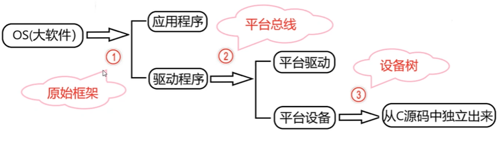
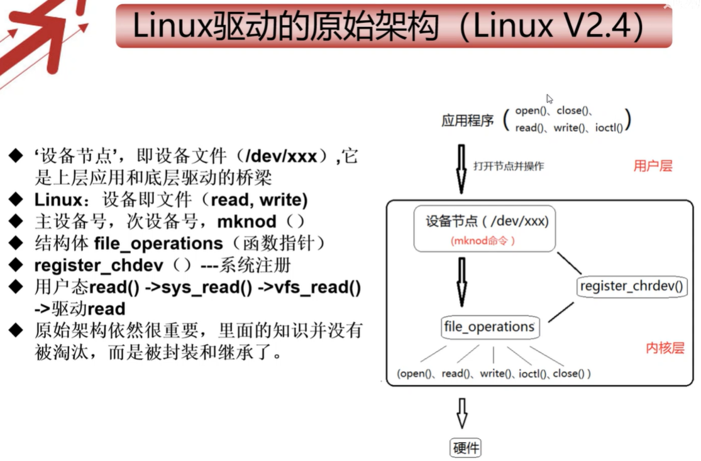
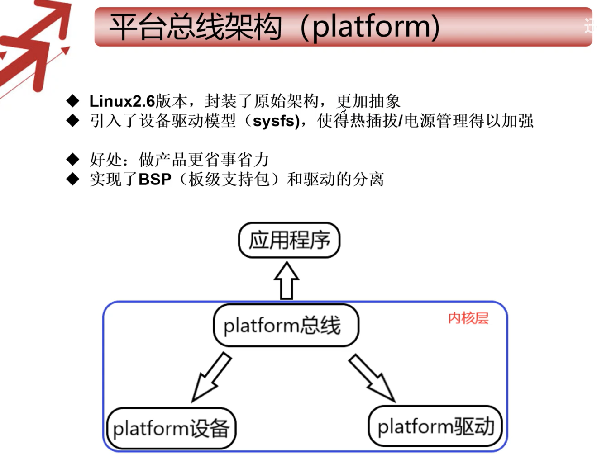
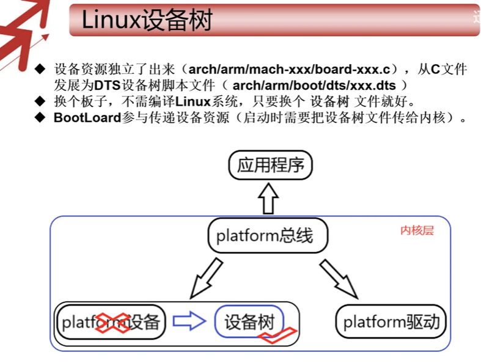

# Linux驱动框架









Linux 将存储器和外设分为 3 个基础大类：**字符设备驱动**，**块设备驱动**，**网络设备驱动**。

## Linux源码目录结构

| 目录          | 说明                                                         |
| ------------- | ------------------------------------------------------------ |
| arch          | 架构相关目录，存放多种 CPU 架构（如 arm、X86、MIPS 等）的适配代码 |
| block         | 块设备相关代码目录，Linux 中以块设备形式管理硬盘、SD 卡等存储设备 |
| crypto        | 加密算法目录，存放各类加密相关的实现代码                     |
| Documentation | 官方 Linux 内核文档目录，包含内核功能、接口等详细说明        |
| drivers       | 驱动目录，存放 Linux 系统支持的各类硬件设备驱动代码          |
| firmware      | 固件目录，存放硬件设备所需的固件文件                         |
| fs            | 文件系统目录，存放 ext2、ext3、fat 等文件系统的实现代码      |
| include       | 公共头文件目录，提供内核各模块共用的头文件                   |
| init          | 内核启动初始化目录，存放 Linux 内核启动阶段的初始化代码      |
| ipc           | 进程间通信目录，存放管道、消息队列、共享内存等 IPC 机制的实现代码 |
| kernel        | 内核核心目录，存放内核本身的核心功能代码                     |
| lib           | 库函数目录，存放内核使用的各类库函数                         |
| mm            | 内存管理目录（mm 为 memory management 缩写），负责内核内存管理功能 |
| net           | 网络相关目录，存放 TCP/IP 协议栈等网络功能的实现代码         |
| scripts       | 脚本目录，存放内核编译、测试等流程中使用的脚本文件           |
| security      | 安全相关目录，存放内核安全机制的实现代码                     |
| sound         | 音频相关目录，存放音频设备驱动及音频处理的代码               |
| tools         | 工具目录，存放 Linux 内核开发、调试用到的工具程序            |
| usr           | 与 Linux 内核启动相关的代码目录                              |
| virt          | 内核虚拟机相关目录，存放内核级虚拟化功能的实现代码           |

## 最简单的 Linux 驱动结构解析

- **组成部分**
  1. **头文件（必须）**：驱动需包含内核相关头文件，其中`<linux/module.h>`和`<linux/init.h>`是必备的。
  2. **驱动加载函数（必须）**：加载驱动时，该函数会被内核自动执行。
  3. **驱动卸载函数（必须）**：卸载驱动时，该函数会被内核自动执行。
  4. **许可证声明（必须）**：因 Linux 内核遵循 GPL 协议，驱动加载时也需遵守相关协议，常见的有 GPL v2 等多种许可证类型。
  5. **模块参数（可选）**：是模块加载时传递给内核模块的值。
  6. **作者和版本信息（可选）**：用于声明驱动的作者及代码版本信息。
- **例子**

```c
#include <linux/init.h>
#include <linux/module.h>
#include <linux/kernel.h>


static int __init hello_world_init(void)
{
    printk(KERN_INFO "Hello World: Module loaded\n");
    return 0;
}

static void __exit hello_world_exit(void)
{
    printk(KERN_INFO "Hello World: Module unloaded\n");
}

module_init(hello_world_init);
module_exit(hello_world_exit);

MODULE_LICENSE("GPL");
MODULE_AUTHOR("Zhao Hang");
MODULE_DESCRIPTION("Hello World Kernel Module");
```

## 编译Linux驱动

- **将驱动放在Linux内核里面**，然后编译Linux内核。将驱动编译到Linux内核里面。
- 将驱动**编译成内核模块**，独立于Linux内核之外
  - 内核模块是Linux系统中的一个特殊的机制，可以将一些使用频率很少或者暂时不用的功能编译成内核模块，在需要的时候再动态加载到内核里面。
  - 使用内核模块可以减小内核体积，加快启动速度。并且可以在系统运行时插入或者卸载驱动，无需重启系统。内核模块的后缀是.ko


### 编译成内核模块

```makefile
obj-m += hello_world.o
KERNEL_SRC:=/home/zhaohang/repository/linux/linux-5.10.246
PWD ?=$(shell pwd)
ARCH = arm64
CROSS_COMPILE = aarch64-linux-gnu-

all:
	$(MAKE) ARCH=$(ARCH) CROSS_COMPILE=$(CROSS_COMPILE) -C $(KERNEL_SRC) M=$(PWD) modules

clean:
	$(MAKE) ARCH=$(ARCH) CROSS_COMPILE=$(CROSS_COMPILE) -C $(KERNEL_SRC) M=$(PWD) modules clean
	rm -rf *.ko *.o *.mod.o *.mod.c *.symvers *.order
```

### 将驱动编译到内核

在drivers/char(以字符驱动为例)创建文件夹helloworld，然后将驱动源代码放入，然后创建Kconfig文件

```Kconfig
config helloworld
	bool "helloworld support"
	default y
	help
			helloworld
```

更改drivers

```bash
emacs ../Kconfig
# 添加
source "drivers/char/helloworld/Kconfig"
```

在驱动源码里创建Makefile

```makefile
obj-$(CONFIG_helloworld) += helloworld.o
```

然后在上一级的Makefile中添加：

```bash
emacs ../Makefile
# 添加
obj-y += helloworld/
```


## 模块相关命令

### 模块加载命令

- insmod
  - 功能：载入Linux内核模块
  - 语法：insmod 模块名
  - 例子：insmod hello_world.ko
- modprobe
  - 功能：加载内核模块，同时这个模块所依赖的模块也同时被加载
  - 语法：modprobe 模块名
  - 举例：modprobe hello_world.ko

### 模块卸载命令

- rmmod
  - 功能：移除已经载入Linux的内核模块
  - 语法：rmmod模块名
  - 举例：rmmod hello_world.ko


### 查看模块信息命令

- lsmod命令
  - 功能：列出已经载入Linux的内核模块
  - 也可以使用命令cat /proc/modules来查看模块是否加载成功
- modinfo命令
  - 功能：查看内核模块信息
  - 语法：modinfo模块名
  - 举例：modinfo hello_world.ko

## 配置文件

**menuconfig**配置驱动选项状态操作：

驱动状态：

1. 把驱动编译成内核模块，用M来表示
2. 把驱动编译到内核里面，用*来表示
3. 不编译

使用空格来切换这三种不同状态。


选项的状态有:

- [] : 表示有两种状态只能设置成选中或者不选中
- <> : 表示有三种状态，可以设置成选中，不选中，和编译成模块
- () : 表示用来存放字符串或者16进制数


### Kconfig文件

Kconfig文件是图形化配置界面的源文件，图形化配置界面中的选项由Kconfig文件决定。当我们执行命令make menuconfig命令的时候，内核的配置工具会读取内核源码目录下的arch/xxx/Kconfig。xxx是ARCH的值，比如arm64，然后生成对应的配置界面供开发者使用。


### config文件与.config文件

config文件和.config文件都是Linux内核的配置文件。

- config文件位于Linux内核源码的arch/$(ARCH)/configs目录下，是**Linux系统默认的配置文件**。.
- config文件位于Linux内核源码的顶层目录下，编译linux内核时会使用.config文件里面的配置来编译内核镜像。

若.config存在，make menuconfig界面的默认配置即当前.config文件的配置，若修改了图形化配置界面的设置并保存，则.config文件会被更新。

若.config文件不存在，make menuconfig界面的默认配置则为Kconfig文件中的默认配置。

使用命令make xxx_defconfig命令会根据arch/$(ARCH)/configs目录下默认文件生成.config文件。


### Kconfig语法

参考:



**主菜单**

**mainmenu**用来设置主菜单的标题

举例：mainmenu "Linux/\$(ARCH) $(KERNELVERSION) Kernel Configuration"

上述名字设置的菜单名字为Linux/\$(ARCH) $(KERNELVERSION) Kernel Configuration

**菜单结构**

可以用menu/endmenu来生成菜单，menu是菜单开始的标志，endmenu是菜单结束的标志。这两个是成对出现的。

如下描述的是一个名字为："Network device support"的菜单

```
menu "Network device support"
	config NETDEVICE
	...
endmenu
```

**配置选项**

​       使用关键字**config**来定义一个新的选项。每个选项都必须指定类型，类型包括**bool, tristate, string, hex, int**。最常见的是bool, tristate, string这三个。bool类型有两种值：y和n, trisate有三种值：y, m和n。string为字符串类型。

​      help表示帮助信息，当我们在图形化界面按下h按键，弹出来的就是help的内容。

举例：

```Kconfig
config helloworld
	bool "hello world support"
	default y
	help 
		hello world
```

**依赖关系**

Kconfig中的依赖关系可以用depends on和select


**depends on 表示直接依赖关系**：

```Kconfig
config A
	depends on B
```

表示选项A依赖选项B，只有选项B被选中时，A选项才可以被选中


**select表示反向依赖关系：**

```Kconfig
config A
	select B
```

在A选项被选中的情况下，B选项自动被选中


**可选选项**

使用choice和endchoice定义可选择项

```Kconfig
choice
	bool "a"
config b
	boot b1
config c
	boot c1
...
endchoice
```


**注释**

在图形化配置界面显示一个注释

```Kconfig
config TEST_CONFIG
	bool "test"
	default y
	help
		just test
comment "just for test"
```


**souce**

source用于读取另一个Kconfig文件，如source "init/Kconfig" 就是读取init目录下的Kconfig文件


## 驱动模块传参

驱动传参的意义：

**优势：**

1. 通过驱动传参，可以让驱动程序更加灵活，兼容性更强。
2. 可以通过驱动传参，设置安全校验，防止驱动被盗用

**不足**

1. 使驱动代码变得复杂化
2. 增加了驱动的资源占用


### 驱动可以传递的参数类型

C语言常用的数据类型内核大部分都支持驱动传参。这里将内核支持的驱动传递参数类型分为三类：

- 基本类型：char, bool, int, long, short, byte, ushort, uint
- 数组：array
- 字符串：string

### 给 Linux 驱动传递参数的方式

- **参数类型与对应函数**

  | 参数类型   | 对应函数              | 功能               |
  | ---------- | --------------------- | ------------------ |
  | 基本类型   | `module_param`        | 传递基本类型参数   |
  | 数组类型   | `module_param_array`  | 传递数组类型参数   |
  | 字符串类型 | `module_param_string` | 传递字符串类型参数 |

- **函数定义位置**：这三个函数在 Linux 内核源码的`include/linux/moduleparam.h`中定义。

```c
module_param(name, type, perm);
module_param_array(name, type, nump, perm);
module_param_string(name, string, len, perm);

module_param_named(name, variable, type, perm);

MODULE_PARM_DESC(name, "help description");
```

**MODULE_PARM_DESC**

函数功能：描述模块参数的信息。在include/linux/moduleparam.h定义

函数原型：MODULE_PARM_DESC(_parm, desc)

函数参数： _parm：要描述的参数的参数名称。desc：描述信息


| 参数名   | 含义                                                       |
| -------- | ---------------------------------------------------------- |
| `name`   | 参数名（可在命令行传入）                                   |
| `type`   | 参数类型（如：`int`、`bool`、`charp`）                     |
| `perm`   | 在 `/sys/module/<modname>/parameters/` 中的权限，如 `0644` |
| `nump`   | （仅数组）保存数组元素数量的变量地址                       |
| `len`    | （仅字符串）缓冲区长度                                     |
| `string` | 指向字符串缓冲的指针                                       |


示例：

```c
#include <linux/module.h>
#include <linux/kernel.h>
#include <linux/init.h>

static int myint = 1;
static char *mystring = "default";
static int myarray[3] = {0, 1, 2};
static int arr_argc = 3;

module_param(myint, int, 0644);
MODULE_PARM_DESC(myint, "An integer parameter");

module_param(mystring, charp, 0444);
MODULE_PARM_DESC(mystring, "A string parameter");

module_param_array(myarray, int, &arr_argc, 0644);
MODULE_PARM_DESC(myarray, "An integer array parameter");

static int __init hello_init(void)
{
    int i;
    pr_info("Hello, world!\n");
    pr_info("myint = %d\n", myint);
    pr_info("mystring = %s\n", mystring);
    for (i = 0; i < arr_argc; i++)
        pr_info("myarray[%d] = %d\n", i, myarray[i]);
    return 0;
}

static void __exit hello_exit(void)
{
    pr_info("Goodbye!\n");
}

module_init(hello_init);
module_exit(hello_exit);
MODULE_LICENSE("GPL");
```

**加载模块时可以传参**：

```bash
insmod hello_world.ko myint=42 mystring="hi" myarray=9,8,7
```

**运行时候查看参数**：

```bash
cd /sys/module/hello_world/parameters/
cat myint
echo 99 > myint
```


**权限定义位置**：读写权限在`include/linux/stat.h`和`include/uapi/linux/stat.h`中定义。

- **include/linux/stat.h**

```c
/* SPDX-License-Identifier: GPL-2.0 */
#ifndef _LINUX_STAT_H
#define _LINUX_STAT_H


#include <asm/stat.h>
#include <uapi/linux/stat.h>

#define S_IRWXUGO	(S_IRWXU|S_IRWXG|S_IRWXO)
#define S_IALLUGO	(S_ISUID|S_ISGID|S_ISVTX|S_IRWXUGO)
#define S_IRUGO		(S_IRUSR|S_IRGRP|S_IROTH)
#define S_IWUGO		(S_IWUSR|S_IWGRP|S_IWOTH)
#define S_IXUGO		(S_IXUSR|S_IXGRP|S_IXOTH)


#endif
```

- **include/uapi/linux/stat.h**

```c
/* SPDX-License-Identifier: GPL-2.0 WITH Linux-syscall-note */
#ifndef _UAPI_LINUX_STAT_H
#define _UAPI_LINUX_STAT_H

#include <linux/types.h>

#if defined(__KERNEL__) || !defined(__GLIBC__) || (__GLIBC__ < 2)

#define S_IFMT  00170000
#define S_IFSOCK 0140000
#define S_IFLNK	 0120000
#define S_IFREG  0100000
#define S_IFBLK  0060000
#define S_IFDIR  0040000
#define S_IFCHR  0020000
#define S_IFIFO  0010000
#define S_ISUID  0004000
#define S_ISGID  0002000
#define S_ISVTX  0001000

#define S_ISLNK(m)	(((m) & S_IFMT) == S_IFLNK)
#define S_ISREG(m)	(((m) & S_IFMT) == S_IFREG)
#define S_ISDIR(m)	(((m) & S_IFMT) == S_IFDIR)
#define S_ISCHR(m)	(((m) & S_IFMT) == S_IFCHR)
#define S_ISBLK(m)	(((m) & S_IFMT) == S_IFBLK)
#define S_ISFIFO(m)	(((m) & S_IFMT) == S_IFIFO)
#define S_ISSOCK(m)	(((m) & S_IFMT) == S_IFSOCK)

#define S_IRWXU 00700
#define S_IRUSR 00400
#define S_IWUSR 00200
#define S_IXUSR 00100

#define S_IRWXG 00070
#define S_IRGRP 00040
#define S_IWGRP 00020
#define S_IXGRP 00010

#define S_IRWXO 00007
#define S_IROTH 00004
#define S_IWOTH 00002
#define S_IXOTH 00001

#endif

#endif /* _UAPI_LINUX_STAT_H */

```

相关的权限主要是**文件访问权限宏（File Permission Bits）**

| 宏名      | 八进制值 | 含义                             |
| --------- | -------- | -------------------------------- |
| `S_IRWXU` | `00700`  | 所有者(U)读、写、执行权限(RWX)   |
| `S_IRUSR` | `00400`  | 所有者(USR)读权限(R)             |
| `S_IWUSR` | `00200`  | 所有者(USR)写权限(W)             |
| `S_IXUSR` | `00100`  | 所有者(USR)执行权限(X)           |
| `S_IRWXG` | `00070`  | 所属组(G)读、写、执行权限(RWX)   |
| `S_IRGRP` | `00040`  | 所属组(GRP)读权限(R)             |
| `S_IWGRP` | `00020`  | 所属组(GRP)写权限(W)             |
| `S_IXGRP` | `00010`  | 所属组(GRP)执行权限(X)           |
| `S_IRWXO` | `00007`  | 其他用户(O)读、写、执行权限(RWX) |
| `S_IROTH` | `00004`  | 其他用户(OTH)读权限(R)           |
| `S_IWOTH` | `00002`  | 其他用户(OTH)写权限(W)           |
| `S_IXOTH` | `00001`  | 其他用户(OTH)执行权限(X)         |


还有**组合权限**

| 宏名            | 定义                                        | 含义（展开后）                                   | 实际意义                                                     | 举例用途                                |
| --------------- | ------------------------------------------- | ------------------------------------------------ | ------------------------------------------------------------ | --------------------------------------- |
| **`S_IRWXUGO`** | `(S_IRWXU | S_IRWXG | S_IRWXO)`             | 00700 \| 00070 \| 00007 = `00777`                | 允许 **所有者、组、其他用户** (UGO)拥有 **读、写、执行** 权限 | 设置所有人可读写执行，如临时目录 `/tmp` |
| **`S_IALLUGO`** | `(S_ISUID | S_ISGID | S_ISVTX | S_IRWXUGO)` | 0004000 \| 0002000 \| 0001000 \| 00777 = `01777` | 包含特殊位（SUID、SGID、Sticky）以及所有人读写执行权限       | 常见权限：`drwxrwxrwt`（如 `/tmp`）     |
| **`S_IRUGO`**   | `(S_IRUSR | S_IRGRP | S_IROTH)`             | 00400 \| 00040 \| 00004 = `00444`                | 所有人 **读** 权限                                           | 常用于只读文件                          |
| **`S_IWUGO`**   | `(S_IWUSR | S_IWGRP | S_IWOTH)`             | 00200 \| 00020 \| 00002 = `00222`                | 所有人 **写** 权限                                           | 少用，一般仅限特定目录                  |
| **`S_IXUGO`**   | `(S_IXUSR | S_IXGRP | S_IXOTH)`             | 00100 \| 00010 \| 00001 = `00111`                | 所有人 **执行** 权限                                         | 使所有人可执行某脚本或程序              |

## 内核符号表导入导出

驱动程序可以编译成内核模块，也就是KO文件。每个KO文件是相互独立的，也就是说模块之间无法相互访问。但是在某些使用场景下要相互访问，如B模块要用A模块中的函数。（B模块依赖于A模块）

**符号表**

**”符号“就是内核中的函数名，全局变量名等**。符号表就是用来记录这些”符号“的文件。

### 内核符号表导出

**导出宏**

| 宏名称              | 适用场景                    |
| ------------------- | --------------------------- |
| `EXPORT_SYMBOL`     | 导出符号到内核符号表        |
| `EXPORT_SYMBOL_GPL` | 仅适用于包含 GPL 许可的模块 |

导出的符号可被其他模块使用，使用前只需声明即可。

例子：

```c
#include <linux/module.h>
#include <linux/init.h>

int add(int a, int b)
{
    return a + b;
}
EXPORT_SYMBOL(add);  // 导出add函数到内核符号表

static int __init helloworld_init(void)
{
    printk("helloworld!\n");
    return 0;
}

static void __exit helloworld_exit(void)
{
    printk("helloworld bye\n");
}

module_init(helloworld_init);  // 指定模块初始化函数
module_exit(helloworld_exit);  // 指定模块退出函数

MODULE_LICENSE("GPL");  // 声明许可证
```

导入

```c
#include <linux/module.h>
#include <linux/init.h>

/* 声明外部模块导出的函数 */
extern int add(int a, int b);

static int __init use_add_init(void)
{
    int result = add(3, 5);
    pr_info("Result of add(3,5) = %d\n", result);
    return 0;
}

static void __exit use_add_exit(void)
{
    pr_info("use_add module unloaded\n");
}

module_init(use_add_init);
module_exit(use_add_exit);

MODULE_LICENSE("GPL");
MODULE_AUTHOR("Zhao Hang");
MODULE_DESCRIPTION("Module that calls add() from helloworld");

```

注意：加载时要先加载导出的那个模块，卸载时要先卸载导入的那个模块。**因为此时两个模块已经有了依赖关系，modprobe会自动处理这些依赖关系，不需要显式声明。**


## 调试打印

### dump_stack()

`dump_stack()` 的作用是：

> **打印当前 CPU 的调用堆栈（call trace）到内核日志中。**

在内核代码中调用它，相当于执行用户态中的 `backtrace()` 或者 C 库的 `printf("%pS", __builtin_return_address())` 之类的功能。

## 使用makefile中定义的宏

 核心思路：想要让它被 **C 代码可见**，必须通过 **编译器命令行传入宏定义**：

```makefile
cc -D宏名=值 source.c
```

例子：

```makefile
obj-m += mydriver.o

# 定义一个宏
MY_DRIVER_VER := 0x10

# 把它传给编译器
KBUILD_CFLAGS_MODULE += -DMY_DRIVER_VER=$(MY_DRIVER_VER)
```

其他变量名：

| 变量名                 | 作用范围                         | 典型用途        |
| ---------------------- | -------------------------------- | --------------- |
| `ccflags-y`            | 当前模块的所有 `.c` 文件         | 普通 C 编译选项 |
| `asflags-y`            | 汇编文件                         | 汇编参数        |
| `subdir-ccflags-y`     | 当前目录及子目录                 | 全局作用        |
| `KBUILD_CFLAGS`        | 全局（由内核顶层 Makefile 设置） | 平台级 CFLAGS   |
| `KBUILD_CFLAGS_MODULE` | 内核模块                         |                 |
| `EXTRA_CFLAGS`         | 已废弃（旧版用法）               | 临时附加选项    |

然后在driver中可以使用：

```c
#include <linux/module.h>
#include <linux/kernel.h>

static int __init mydriver_init(void)
{
    pr_info("mydriver version: 0x%x\n", MY_DRIVER_VER);
    return 0;
}

static void __exit mydriver_exit(void)
{
    pr_info("mydriver exit\n");
}

module_init(mydriver_init);
module_exit(mydriver_exit);

MODULE_LICENSE("GPL");
```


## 编译进内核的驱动是如何运行的？

### module_init

定义在include/linux/module.h中

```c
#ifndef MODULE
/**
 * module_init() - driver initialization entry point
 * @x: function to be run at kernel boot time or module insertion
 *
 * module_init() will either be called during do_initcalls() (if
 * builtin) or at module insertion time (if a module).  There can only
 * be one per module.
 */
#define module_init(x)	__initcall(x);

/**
 * module_exit() - driver exit entry point
 * @x: function to be run when driver is removed
 *
 * module_exit() will wrap the driver clean-up code
 * with cleanup_module() when used with rmmod when
 * the driver is a module.  If the driver is statically
 * compiled into the kernel, module_exit() has no effect.
 * There can only be one per module.
 */
#define module_exit(x)	__exitcall(x);

#else /* MODULE */

/*
 * In most cases loadable modules do not need custom
 * initcall levels. There are still some valid cases where
 * a driver may be needed early if built in, and does not
 * matter when built as a loadable module. Like bus
 * snooping debug drivers.
 */
#define early_initcall(fn)		module_init(fn)
#define core_initcall(fn)		module_init(fn)
#define core_initcall_sync(fn)		module_init(fn)
#define postcore_initcall(fn)		module_init(fn)
#define postcore_initcall_sync(fn)	module_init(fn)
#define arch_initcall(fn)		module_init(fn)
#define subsys_initcall(fn)		module_init(fn)
#define subsys_initcall_sync(fn)	module_init(fn)
#define fs_initcall(fn)			module_init(fn)
#define fs_initcall_sync(fn)		module_init(fn)
#define rootfs_initcall(fn)		module_init(fn)
#define device_initcall(fn)		module_init(fn)
#define device_initcall_sync(fn)	module_init(fn)
#define late_initcall(fn)		module_init(fn)
#define late_initcall_sync(fn)		module_init(fn)

#define console_initcall(fn)		module_init(fn)

/* Each module must use one module_init(). */
#define module_init(initfn)					\
	static inline initcall_t __maybe_unused __inittest(void)		\
	{ return initfn; }					\
	int init_module(void) __copy(initfn) __attribute__((alias(#initfn)));

/* This is only required if you want to be unloadable. */
#define module_exit(exitfn)					\
	static inline exitcall_t __maybe_unused __exittest(void)		\
	{ return exitfn; }					\
	void cleanup_module(void) __copy(exitfn) __attribute__((alias(#exitfn)));

#endif
```

> 如果把驱动编译进Linux内核，module_exit是没有意义的，因为静态编译的驱动无法卸载

**MODULE宏**

| 场景                     | 含义                                   | `MODULE` 状态 |
| ------------------------ | -------------------------------------- | ------------- |
| **模块（.ko）**          | 使用 `obj-m += xxx.o` 编译为可加载模块 | ✅ 被定义      |
| **内建驱动（built-in）** | 使用 `obj-y += xxx.o` 编进内核镜像     | ❌ 未定义      |

在linux源码顶层Makefile里

```makefile
KBUILD_AFLAGS_KERNEL :=
KBUILD_CFLAGS_KERNEL :=
KBUILD_AFLAGS_MODULE  := -DMODULE
KBUILD_CFLAGS_MODULE  := -DMODULE
```

| 变量名                 | 作用                                    | 是否带 `-DMODULE` |
| ---------------------- | --------------------------------------- | ----------------- |
| `KBUILD_CFLAGS_KERNEL` | 编译内建（built-in）代码时使用的 CFLAGS | ❌ 否              |
| `KBUILD_CFLAGS_MODULE` | 编译模块（.ko）代码时使用的 CFLAGS      | ✅ 是              |
| `KBUILD_AFLAGS_KERNEL` | 汇编文件（built-in）使用的 AFLAGS       | ❌ 否              |
| `KBUILD_AFLAGS_MODULE` | 汇编文件（模块）使用的 AFLAGS           | ✅ 是              |


以我们**把驱动编译进内核**为例：

**include/linux/module.h**

```c
// include/linux/module.h
#define module_init(x)	__initcall(x);
```

**include/linux/init.h**

```c
// include/linux/init.h

#define __initcall(fn) device_initcall(fn)

#define pure_initcall(fn)		__define_initcall(fn, 0)
#define core_initcall(fn)		__define_initcall(fn, 1)
#define core_initcall_sync(fn)		__define_initcall(fn, 1s)
#define postcore_initcall(fn)		__define_initcall(fn, 2)
#define postcore_initcall_sync(fn)	__define_initcall(fn, 2s)
#define arch_initcall(fn)		__define_initcall(fn, 3)
#define arch_initcall_sync(fn)		__define_initcall(fn, 3s)
#define subsys_initcall(fn)		__define_initcall(fn, 4)
#define subsys_initcall_sync(fn)	__define_initcall(fn, 4s)
#define fs_initcall(fn)			__define_initcall(fn, 5)
#define fs_initcall_sync(fn)		__define_initcall(fn, 5s)
#define rootfs_initcall(fn)		__define_initcall(fn, rootfs)
#define device_initcall(fn)		__define_initcall(fn, 6)
#define device_initcall_sync(fn)	__define_initcall(fn, 6s)
#define late_initcall(fn)		__define_initcall(fn, 7)
#define late_initcall_sync(fn)		__define_initcall(fn, 7s)

#define __define_initcall(fn, id) ___define_initcall(fn, id, .initcall##id)

typedef int (*initcall_t)(void);

#ifdef CONFIG_HAVE_ARCH_PREL32_RELOCATIONS
#define ___define_initcall(fn, id, __sec)			\
	__ADDRESSABLE(fn)					\
	asm(".section	\"" #__sec ".init\", \"a\"	\n"	\
	"__initcall_" #fn #id ":			\n"	\
	    ".long	" #fn " - .			\n"	\
	    ".previous					\n");
#else
#define ___define_initcall(fn, id, __sec) \
	static initcall_t __initcall_##fn##id __used \
		__attribute__((__section__(#__sec ".init"))) = fn;
#endif
```


`__attribute__((__section__(".initcall6.init")))` 告诉编译器：**把这个指针变量放到 `.initcall6.init` 段中**。

这个段是内核专门保留的一个“初始化函数指针表”，对应初始化阶段的不同阶段调用顺序。

以fn为my_driver为例：module_init最终展开为

```c
__initcall_my_driver_init6 = my_driver_init;
```

也就是在这个段里存放了一个指向 `my_driver_init()` 的指针。一个8字节。

> 如果想要用其他优先级，可以把驱动中的module_init替换为fs_initcall等。

| 宏                      | 段名              | 调用阶段                   |
| ----------------------- | ----------------- | -------------------------- |
| `early_initcall(fn)`    | `.initcall0.init` | 最早                       |
| `core_initcall(fn)`     | `.initcall1.init` | 核心子系统初始化           |
| `postcore_initcall(fn)` | `.initcall2.init` | 核心完成后初始化           |
| `arch_initcall(fn)`     | `.initcall3.init` | 与架构相关部分             |
| `subsys_initcall(fn)`   | `.initcall4.init` | 子系统（例如 driver core） |
| `fs_initcall(fn)`       | `.initcall5.init` | 文件系统初始化             |
| `device_initcall(fn)`   | `.initcall6.init` | 设备驱动初始化（默认）     |
| `late_initcall(fn)`     | `.initcall7.init` | 最晚阶段初始化             |


#### PREL32

`CONFIG_HAVE_ARCH_PREL32_RELOCATIONS` 是一个 **Kconfig 选项**，出现在部分架构（如 ARM64、RISC-V）中。它的含义是：

- 该架构支持使用 **PREL32（PC-relative 32-bit relocation）** 类型的重定位方式，也就是说：存储在 `.initcall` 段中的地址，是 **相对当前指针位置（PC-relative）** 的 32 位偏移量，而不是绝对地址。

在没有这个选项的系统上（如传统 x86），`.initcallX.init` 段直接存放函数指针：

  ```c
static initcall_t __initcall_driver6 __used
__attribute__((section(".initcall6.init"))) = driver_init;
  ```

  也就是：

  ```
.initcall6.init:
    0xffffffff81001234   // 绝对地址
    0xffffffff81004567
  ```

  但是在支持 PREL32 的系统上：

  ```asm
asm(".section \".initcall6.init\", \"a\"\n"
    "__initcall_driver6:\n"
    ".long driver_init - .\n"
    ".previous\n");
  ```

  这里 `.long driver_init - .` 表示：把“函数地址减当前地址”的差值（一个 32 位有符号偏移）存入 `.initcall` 表。

在运行时，内核会这样取值：

```c
real_addr = (u64)&entry + (s32)*entry;
```

这样，内核就能在 **不需要重定位修正** 的情况下定位函数。这对于 **位置无关的内核（KASLR、RELATIVE linking）** 特别重要，因为函数的绝对地址在启动时才确定。

**优势**:

1. **节省空间**：每个 entry 只占 4 字节，而不是 8 字节（在 64 位下节省一半）。
2.  **支持内核地址随机化（KASLR）**：不需要在启动时对所有指针段做重定位修正。
3. **启动更快**：省去一大堆 relocation fixup 操作。


#### INIT_CALLS

**include/asm-generic.h/vmlinux.lds.h**

```c
#define INIT_CALLS_LEVEL(level)						\
		__initcall##level##_start = .;				\
		KEEP(*(.initcall##level##.init))			\
		KEEP(*(.initcall##level##s.init))			\

#define INIT_CALLS							\
		__initcall_start = .;					\
		KEEP(*(.initcallearly.init))				\
		INIT_CALLS_LEVEL(0)					\
		INIT_CALLS_LEVEL(1)					\
		INIT_CALLS_LEVEL(2)					\
		INIT_CALLS_LEVEL(3)					\
		INIT_CALLS_LEVEL(4)					\
		INIT_CALLS_LEVEL(5)					\
		INIT_CALLS_LEVEL(rootfs)				\
		INIT_CALLS_LEVEL(6)					\
		INIT_CALLS_LEVEL(7)					\
		__initcall_end = .;
```

最终展开放入连接脚本中：

```
__initcall_start = .;
KEEP(*(.initcallearly.init))
__initcall0_start = .;
KEEP(*(.initcall0.init))
KEEP(*(.initcall0s.init))
__initcall1_start = .;
KEEP(*(.initcall1.init))
KEEP(*(.initcall1s.init))
...
__initcall7_start = .;
KEEP(*(.initcall7.init))
KEEP(*(.initcall7s.init))
__initcall_end = .;

```

**init/main.c**

```c
extern initcall_entry_t __initcall_start[];
extern initcall_entry_t __initcall0_start[];
extern initcall_entry_t __initcall1_start[];
extern initcall_entry_t __initcall2_start[];
extern initcall_entry_t __initcall3_start[];
extern initcall_entry_t __initcall4_start[];
extern initcall_entry_t __initcall5_start[];
extern initcall_entry_t __initcall6_start[];
extern initcall_entry_t __initcall7_start[];
extern initcall_entry_t __initcall_end[];

static initcall_entry_t *initcall_levels[] __initdata = {
	__initcall0_start,
	__initcall1_start,
	__initcall2_start,
	__initcall3_start,
	__initcall4_start,
	__initcall5_start,
	__initcall6_start,
	__initcall7_start,
	__initcall_end,
};


asmlinkage __visible void __init __no_sanitize_address start_kernel(void)
{
	//前面省略
	/* Do the rest non-__init'ed, we're now alive */
	arch_call_rest_init();

	prevent_tail_call_optimization();
}

void __init __weak arch_call_rest_init(void)
{
	rest_init();
}

noinline void __ref rest_init(void)
{
	struct task_struct *tsk;
	int pid;

	rcu_scheduler_starting();
	/*
	 * We need to spawn init first so that it obtains pid 1, however
	 * the init task will end up wanting to create kthreads, which, if
	 * we schedule it before we create kthreadd, will OOPS.
	 */
	pid = kernel_thread(kernel_init, NULL, CLONE_FS);
    // 后面的省略
}

static int __ref kernel_init(void *unused)
{
	int ret;

	kernel_init_freeable();
	// 后面省略

}

// 
static noinline void __init kernel_init_freeable(void)
{
	// 前面省略

	do_basic_setup();

	// 后面省略
}

static void __init do_basic_setup(void)
{
	cpuset_init_smp();
	driver_init();
	init_irq_proc();
	do_ctors();
	usermodehelper_enable();
	do_initcalls();
}


static void __init do_initcalls(void)
{
	int level;
	size_t len = strlen(saved_command_line) + 1;
	char *command_line;

	command_line = kzalloc(len, GFP_KERNEL);
	if (!command_line)
		panic("%s: Failed to allocate %zu bytes\n", __func__, len);
	// 这个for循环可以看到是从0开始初始化的，因此数字越小优先级越高
    // 此外相同id的带s的优先级小于不带s的
	for (level = 0; level < ARRAY_SIZE(initcall_levels) - 1; level++) {
		/* Parser modifies command_line, restore it each time */
		strcpy(command_line, saved_command_line);
		do_initcall_level(level, command_line);
	}

	kfree(command_line);
}


static void __init do_initcall_level(int level, char *command_line)
{
	initcall_entry_t *fn;

	parse_args(initcall_level_names[level],
		   command_line, __start___param,
		   __stop___param - __start___param,
		   level, level,
		   NULL, ignore_unknown_bootoption);

	trace_initcall_level(initcall_level_names[level]);
	for (fn = initcall_levels[level]; fn < initcall_levels[level+1]; fn++)
		do_one_initcall(initcall_from_entry(fn));
}

int __init_or_module do_one_initcall(initcall_t fn)
{
	int count = preempt_count();
	char msgbuf[64];
	int ret;

	if (initcall_blacklisted(fn))
		return -EPERM;

	do_trace_initcall_start(fn);
	ret = fn();// 核心代码，执行一次这个初始化函数
	do_trace_initcall_finish(fn, ret);

	msgbuf[0] = 0;

	if (preempt_count() != count) {
		sprintf(msgbuf, "preemption imbalance ");
		preempt_count_set(count);
	}
	if (irqs_disabled()) {
		strlcat(msgbuf, "disabled interrupts ", sizeof(msgbuf));
		local_irq_enable();
	}
	WARN(msgbuf[0], "initcall %pS returned with %s\n", fn, msgbuf);

	add_latent_entropy();
	return ret;
}
```

其中**do_initcall_level**中使用的**initcall_from_entry**定义在include/linux/init.h

```c
#ifdef CONFIG_HAVE_ARCH_PREL32_RELOCATIONS
typedef int initcall_entry_t;

static inline initcall_t initcall_from_entry(initcall_entry_t *entry)
{
	return offset_to_ptr(entry);
}
#else
typedef initcall_t initcall_entry_t;

static inline initcall_t initcall_from_entry(initcall_entry_t *entry)
{
	return *entry;
}
#endif
```


#### 总结

在使用module_init(hello_world)的时候，hello_world()这个函数会被放在.initcall6.init段处。当内核启动的时候，会执行do_initcall()函数根据指针数组initcall_levels[6]找到__initcall6_start，在include/asm-generic/vmlinux.lds.h中可以查到\_\_initcall6_start对应的.initcall6.init段的起始地址，然后依次去除这个段的函数指针并执行函数。

### 内核模块驱动

对于的initcall：

```c
#else /* MODULE */

/*
 * In most cases loadable modules do not need custom
 * initcall levels. There are still some valid cases where
 * a driver may be needed early if built in, and does not
 * matter when built as a loadable module. Like bus
 * snooping debug drivers.
 */
#define early_initcall(fn)		module_init(fn)
#define core_initcall(fn)		module_init(fn)
#define core_initcall_sync(fn)		module_init(fn)
#define postcore_initcall(fn)		module_init(fn)
#define postcore_initcall_sync(fn)	module_init(fn)
#define arch_initcall(fn)		module_init(fn)
#define subsys_initcall(fn)		module_init(fn)
#define subsys_initcall_sync(fn)	module_init(fn)
#define fs_initcall(fn)			module_init(fn)
#define fs_initcall_sync(fn)		module_init(fn)
#define rootfs_initcall(fn)		module_init(fn)
#define device_initcall(fn)		module_init(fn)
#define device_initcall_sync(fn)	module_init(fn)
#define late_initcall(fn)		module_init(fn)
#define late_initcall_sync(fn)		module_init(fn)

#define console_initcall(fn)		module_init(fn)

/* Each module must use one module_init(). */
#define module_init(initfn)					\
	static inline initcall_t __maybe_unused __inittest(void)		\
	{ return initfn; }					\
	int init_module(void) __copy(initfn) __attribute__((alias(#initfn)));

/* This is only required if you want to be unloadable. */
#define module_exit(exitfn)					\
	static inline exitcall_t __maybe_unused __exittest(void)		\
	{ return exitfn; }					\
	void cleanup_module(void) __copy(exitfn) __attribute__((alias(#exitfn)));

#endif
```


模块的初始化是在 **`insmod` / `modprobe` 时由模块加载器统一调用** 的，不会按内核的启动阶段区分。因此：

```c
#define early_initcall(fn)       module_init(fn)
#define device_initcall(fn)      module_init(fn)
...
```

这些宏都退化成同一个东西：
 **模块加载时，内核直接调用 `init_module()`，进而执行 `fn()`**

```c
#define module_init(initfn)                                     \
	static inline initcall_t __maybe_unused __inittest(void) {  \
		return initfn;                                         \
	}                                                          \
	int init_module(void) __copy(initfn)                       \
		__attribute__((alias(#initfn)));
```

展开后等价于生成两个符号：

- 一个辅助的 __inittest() 内联函数（只是返回 initfn，不重要）；

- 一个名为 init_module 的函数别名，直接指向我们定义的初始化函数。

例子：

```c
static int mydriver_init(void) { ... }
module_init(mydriver_init);
```


预处理后就等价于：

```c
int init_module(void) __attribute__((alias("mydriver_init")));
```

也就是说：内核加载模块时，真正执行的入口函数是 init_module()，它被别名绑定到我们定义的初始化函数 mydriver_init()。


**include/uapi/asm-generic/unistd.h**

>  uapi属于 **通用内核接口（UAPI, User API）**，也就是用户空间可以包含的头文件。定义了 **大部分架构通用的系统调用号**（syscall numbers），供用户程序调用。

```c
/* kernel/module.c */
#define __NR_init_module 105
__SYSCALL(__NR_init_module, sys_init_module)
#define __NR_delete_module 106
__SYSCALL(__NR_delete_module, sys_delete_module)
    
#define __NR_finit_module 273
__SYSCALL(__NR_finit_module, sys_finit_module)
```


**include/linux/syscalls.h**

```c
/* kernel/module.c */
asmlinkage long sys_init_module(void __user *umod, unsigned long len,
				const char __user *uargs);
asmlinkage long sys_delete_module(const char __user *name_user,
				unsigned int flags);

asmlinkage long sys_finit_module(int fd, const char __user *uargs, int flags);
```

> `asmlinkage` 是一个 **调用约定修饰符**，用于告诉编译器：
>
> 系统调用入口函数的所有参数都从栈上传递（而不是寄存器），因为它是从汇编入口（syscall trap）进入的。


**kernel/module.c**

```c
SYSCALL_DEFINE3(init_module, void __user *, umod,
		unsigned long, len, const char __user *, uargs)
{
	int err;
	struct load_info info = { };

	err = may_init_module();
	if (err)
		return err;

	pr_debug("init_module: umod=%p, len=%lu, uargs=%p\n",
	       umod, len, uargs);

	err = copy_module_from_user(umod, len, &info);
	if (err)
		return err;

	return load_module(&info, uargs, 0);
}

SYSCALL_DEFINE3(finit_module, int, fd, const char __user *, uargs, int, flags)
{
	struct load_info info = { };
	void *hdr = NULL;
	int err;

	err = may_init_module();
	if (err)
		return err;

	pr_debug("finit_module: fd=%d, uargs=%p, flags=%i\n", fd, uargs, flags);

	if (flags & ~(MODULE_INIT_IGNORE_MODVERSIONS
		      |MODULE_INIT_IGNORE_VERMAGIC))
		return -EINVAL;

	err = kernel_read_file_from_fd(fd, 0, &hdr, INT_MAX, NULL,
				       READING_MODULE);
	if (err < 0)
		return err;
	info.hdr = hdr;
	info.len = err;

	return load_module(&info, uargs, flags);
}

```

`SYSCALL_DEFINE3` 是一个宏，用于生成系统调用封装函数。它生成的函数名就是 `sys_init_module`。这里的3表示3个参数，SYSCALL_DEFINE最有有6个参数。

最终会展开为\_\_se_sys_init_module。


```c
/* Allocate and load the module: note that size of section 0 is always
   zero, and we rely on this for optional sections. */
static int load_module(struct load_info *info, const char __user *uargs,
		       int flags)
{
	struct module *mod;
	long err = 0;
	char *after_dashes;

	/*
	 * Do the signature check (if any) first. All that
	 * the signature check needs is info->len, it does
	 * not need any of the section info. That can be
	 * set up later. This will minimize the chances
	 * of a corrupt module causing problems before
	 * we even get to the signature check.
	 *
	 * The check will also adjust info->len by stripping
	 * off the sig length at the end of the module, making
	 * checks against info->len more correct.
	 */
	err = module_sig_check(info, flags);
	if (err)
		goto free_copy;

	/*
	 * Do basic sanity checks against the ELF header and
	 * sections.
	 */
	err = elf_validity_check(info);
	if (err) {
		pr_err("Module has invalid ELF structures\n");
		goto free_copy;
	}

	/*
	 * Everything checks out, so set up the section info
	 * in the info structure.
	 */
	err = setup_load_info(info, flags);
	if (err)
		goto free_copy;

	/*
	 * Now that we know we have the correct module name, check
	 * if it's blacklisted.
	 */
	if (blacklisted(info->name)) {
		err = -EPERM;
		pr_err("Module %s is blacklisted\n", info->name);
		goto free_copy;
	}

	err = rewrite_section_headers(info, flags);
	if (err)
		goto free_copy;

	/* Check module struct version now, before we try to use module. */
	if (!check_modstruct_version(info, info->mod)) {
		err = -ENOEXEC;
		goto free_copy;
	}

	/* Figure out module layout, and allocate all the memory. */
	mod = layout_and_allocate(info, flags);
	if (IS_ERR(mod)) {
		err = PTR_ERR(mod);
		goto free_copy;
	}

	audit_log_kern_module(mod->name);

	/* Reserve our place in the list. */
	err = add_unformed_module(mod);
	if (err)
		goto free_module;

#ifdef CONFIG_MODULE_SIG
	mod->sig_ok = info->sig_ok;
	if (!mod->sig_ok) {
		pr_notice_once("%s: module verification failed: signature "
			       "and/or required key missing - tainting "
			       "kernel\n", mod->name);
		add_taint_module(mod, TAINT_UNSIGNED_MODULE, LOCKDEP_STILL_OK);
	}
#endif

	/* To avoid stressing percpu allocator, do this once we're unique. */
	err = percpu_modalloc(mod, info);
	if (err)
		goto unlink_mod;

	/* Now module is in final location, initialize linked lists, etc. */
	err = module_unload_init(mod);
	if (err)
		goto unlink_mod;

	init_param_lock(mod);

	/* Now we've got everything in the final locations, we can
	 * find optional sections. */
	err = find_module_sections(mod, info);
	if (err)
		goto free_unload;

	err = check_module_license_and_versions(mod);
	if (err)
		goto free_unload;

	/* Set up MODINFO_ATTR fields */
	setup_modinfo(mod, info);

	/* Fix up syms, so that st_value is a pointer to location. */
	err = simplify_symbols(mod, info);
	if (err < 0)
		goto free_modinfo;

	err = apply_relocations(mod, info);
	if (err < 0)
		goto free_modinfo;

	err = post_relocation(mod, info);
	if (err < 0)
		goto free_modinfo;

	flush_module_icache(mod);

	/* Now copy in args */
	mod->args = strndup_user(uargs, ~0UL >> 1);
	if (IS_ERR(mod->args)) {
		err = PTR_ERR(mod->args);
		goto free_arch_cleanup;
	}

	dynamic_debug_setup(mod, info->debug, info->num_debug);

	/* Ftrace init must be called in the MODULE_STATE_UNFORMED state */
	ftrace_module_init(mod);

	/* Finally it's fully formed, ready to start executing. */
	err = complete_formation(mod, info);
	if (err)
		goto ddebug_cleanup;

	err = prepare_coming_module(mod);
	if (err)
		goto bug_cleanup;

	/* Module is ready to execute: parsing args may do that. */
	after_dashes = parse_args(mod->name, mod->args, mod->kp, mod->num_kp,
				  -32768, 32767, mod,
				  unknown_module_param_cb);
	if (IS_ERR(after_dashes)) {
		err = PTR_ERR(after_dashes);
		goto coming_cleanup;
	} else if (after_dashes) {
		pr_warn("%s: parameters '%s' after `--' ignored\n",
		       mod->name, after_dashes);
	}

	/* Link in to sysfs. */
	err = mod_sysfs_setup(mod, info, mod->kp, mod->num_kp);
	if (err < 0)
		goto coming_cleanup;

	if (is_livepatch_module(mod)) {
		err = copy_module_elf(mod, info);
		if (err < 0)
			goto sysfs_cleanup;
	}

	/* Get rid of temporary copy. */
	free_copy(info);

	/* Done! */
	trace_module_load(mod);
//-----> 最终返回do_init_module
	return do_init_module(mod);

 sysfs_cleanup:
	mod_sysfs_teardown(mod);
 coming_cleanup:
	mod->state = MODULE_STATE_GOING;
	destroy_params(mod->kp, mod->num_kp);
	blocking_notifier_call_chain(&module_notify_list,
				     MODULE_STATE_GOING, mod);
	klp_module_going(mod);
 bug_cleanup:
	mod->state = MODULE_STATE_GOING;
	/* module_bug_cleanup needs module_mutex protection */
	mutex_lock(&module_mutex);
	module_bug_cleanup(mod);
	mutex_unlock(&module_mutex);

 ddebug_cleanup:
	ftrace_release_mod(mod);
	dynamic_debug_remove(mod, info->debug);
	synchronize_rcu();
	kfree(mod->args);
 free_arch_cleanup:
	module_arch_cleanup(mod);
 free_modinfo:
	free_modinfo(mod);
 free_unload:
	module_unload_free(mod);
 unlink_mod:
	mutex_lock(&module_mutex);
	/* Unlink carefully: kallsyms could be walking list. */
	list_del_rcu(&mod->list);
	mod_tree_remove(mod);
	wake_up_all(&module_wq);
	/* Wait for RCU-sched synchronizing before releasing mod->list. */
	synchronize_rcu();
	mutex_unlock(&module_mutex);
 free_module:
	/* Free lock-classes; relies on the preceding sync_rcu() */
	lockdep_free_key_range(mod->core_layout.base, mod->core_layout.size);

	module_deallocate(mod, info);
 free_copy:
	free_copy(info);
	return err;
}
```

最终会返回 do_init_module(mod);

```c
/*
 * This is where the real work happens.
 *
 * Keep it uninlined to provide a reliable breakpoint target, e.g. for the gdb
 * helper command 'lx-symbols'.
 */
static noinline int do_init_module(struct module *mod)
{
	int ret = 0;
	struct mod_initfree *freeinit;

	freeinit = kmalloc(sizeof(*freeinit), GFP_KERNEL);
	if (!freeinit) {
		ret = -ENOMEM;
		goto fail;
	}
	freeinit->module_init = mod->init_layout.base;

	do_mod_ctors(mod);
	/* Start the module */
//-------->这里mod->init就是模块入口函数，然后调用do_one_initcall
	if (mod->init != NULL)
		ret = do_one_initcall(mod->init);
	if (ret < 0) {
		goto fail_free_freeinit;
	}
	if (ret > 0) {
		pr_warn("%s: '%s'->init suspiciously returned %d, it should "
			"follow 0/-E convention\n"
			"%s: loading module anyway...\n",
			__func__, mod->name, ret, __func__);
		dump_stack();
	}

	/* Now it's a first class citizen! */
	mod->state = MODULE_STATE_LIVE;
	blocking_notifier_call_chain(&module_notify_list,
				     MODULE_STATE_LIVE, mod);

	/* Delay uevent until module has finished its init routine */
	kobject_uevent(&mod->mkobj.kobj, KOBJ_ADD);

	/*
	 * We need to finish all async code before the module init sequence
	 * is done. This has potential to deadlock if synchronous module
	 * loading is requested from async (which is not allowed!).
	 *
	 * See commit 0fdff3ec6d87 ("async, kmod: warn on synchronous
	 * request_module() from async workers") for more details.
	 */
	if (!mod->async_probe_requested)
		async_synchronize_full();

	ftrace_free_mem(mod, mod->init_layout.base, mod->init_layout.base +
			mod->init_layout.size);
	mutex_lock(&module_mutex);
	/* Drop initial reference. */
	module_put(mod);
	trim_init_extable(mod);
#ifdef CONFIG_KALLSYMS
	/* Switch to core kallsyms now init is done: kallsyms may be walking! */
	rcu_assign_pointer(mod->kallsyms, &mod->core_kallsyms);
#endif
	module_enable_ro(mod, true);
	mod_tree_remove_init(mod);
	module_arch_freeing_init(mod);
	mod->init_layout.base = NULL;
	mod->init_layout.size = 0;
	mod->init_layout.ro_size = 0;
	mod->init_layout.ro_after_init_size = 0;
	mod->init_layout.text_size = 0;
	/*
	 * We want to free module_init, but be aware that kallsyms may be
	 * walking this with preempt disabled.  In all the failure paths, we
	 * call synchronize_rcu(), but we don't want to slow down the success
	 * path. module_memfree() cannot be called in an interrupt, so do the
	 * work and call synchronize_rcu() in a work queue.
	 *
	 * Note that module_alloc() on most architectures creates W+X page
	 * mappings which won't be cleaned up until do_free_init() runs.  Any
	 * code such as mark_rodata_ro() which depends on those mappings to
	 * be cleaned up needs to sync with the queued work - ie
	 * rcu_barrier()
	 */
	if (llist_add(&freeinit->node, &init_free_list))
		schedule_work(&init_free_wq);

	mutex_unlock(&module_mutex);
	wake_up_all(&module_wq);

	return 0;

fail_free_freeinit:
	kfree(freeinit);
fail:
	/* Try to protect us from buggy refcounters. */
	mod->state = MODULE_STATE_GOING;
	synchronize_rcu();
	module_put(mod);
	blocking_notifier_call_chain(&module_notify_list,
				     MODULE_STATE_GOING, mod);
	klp_module_going(mod);
	ftrace_release_mod(mod);
	free_module(mod);
	wake_up_all(&module_wq);
	return ret;
}
```

调用do_one_initcall(mod->init);

struct module定义

```c
struct module {
	enum module_state state;

	/* Member of list of modules */
	struct list_head list;

	/* Unique handle for this module */
	char name[MODULE_NAME_LEN];

	/* Sysfs stuff. */
	struct module_kobject mkobj;
	struct module_attribute *modinfo_attrs;
	const char *version;
	const char *srcversion;
	struct kobject *holders_dir;

	/* Exported symbols */
	const struct kernel_symbol *syms;
	const s32 *crcs;
	unsigned int num_syms;

	/* Kernel parameters. */
#ifdef CONFIG_SYSFS
	struct mutex param_lock;
#endif
	struct kernel_param *kp;
	unsigned int num_kp;

	/* GPL-only exported symbols. */
	unsigned int num_gpl_syms;
	const struct kernel_symbol *gpl_syms;
	const s32 *gpl_crcs;
	bool using_gplonly_symbols;

#ifdef CONFIG_UNUSED_SYMBOLS
	/* unused exported symbols. */
	const struct kernel_symbol *unused_syms;
	const s32 *unused_crcs;
	unsigned int num_unused_syms;

	/* GPL-only, unused exported symbols. */
	unsigned int num_unused_gpl_syms;
	const struct kernel_symbol *unused_gpl_syms;
	const s32 *unused_gpl_crcs;
#endif

#ifdef CONFIG_MODULE_SIG
	/* Signature was verified. */
	bool sig_ok;
#endif

	bool async_probe_requested;

	/* symbols that will be GPL-only in the near future. */
	const struct kernel_symbol *gpl_future_syms;
	const s32 *gpl_future_crcs;
	unsigned int num_gpl_future_syms;

	/* Exception table */
	unsigned int num_exentries;
	struct exception_table_entry *extable;

	/* Startup function. */
	int (*init)(void);

	/* Core layout: rbtree is accessed frequently, so keep together. */
	struct module_layout core_layout __module_layout_align;
	struct module_layout init_layout;

	/* Arch-specific module values */
	struct mod_arch_specific arch;

	unsigned long taints;	/* same bits as kernel:taint_flags */

#ifdef CONFIG_GENERIC_BUG
	/* Support for BUG */
	unsigned num_bugs;
	struct list_head bug_list;
	struct bug_entry *bug_table;
#endif

#ifdef CONFIG_KALLSYMS
	/* Protected by RCU and/or module_mutex: use rcu_dereference() */
	struct mod_kallsyms __rcu *kallsyms;
	struct mod_kallsyms core_kallsyms;

	/* Section attributes */
	struct module_sect_attrs *sect_attrs;

	/* Notes attributes */
	struct module_notes_attrs *notes_attrs;
#endif

	/* The command line arguments (may be mangled).  People like
	   keeping pointers to this stuff */
	char *args;

#ifdef CONFIG_SMP
	/* Per-cpu data. */
	void __percpu *percpu;
	unsigned int percpu_size;
#endif
	void *noinstr_text_start;
	unsigned int noinstr_text_size;

#ifdef CONFIG_TRACEPOINTS
	unsigned int num_tracepoints;
	tracepoint_ptr_t *tracepoints_ptrs;
#endif
#ifdef CONFIG_TREE_SRCU
	unsigned int num_srcu_structs;
	struct srcu_struct **srcu_struct_ptrs;
#endif
#ifdef CONFIG_BPF_EVENTS
	unsigned int num_bpf_raw_events;
	struct bpf_raw_event_map *bpf_raw_events;
#endif
#ifdef CONFIG_JUMP_LABEL
	struct jump_entry *jump_entries;
	unsigned int num_jump_entries;
#endif
#ifdef CONFIG_TRACING
	unsigned int num_trace_bprintk_fmt;
	const char **trace_bprintk_fmt_start;
#endif
#ifdef CONFIG_EVENT_TRACING
	struct trace_event_call **trace_events;
	unsigned int num_trace_events;
	struct trace_eval_map **trace_evals;
	unsigned int num_trace_evals;
#endif
#ifdef CONFIG_FTRACE_MCOUNT_RECORD
	unsigned int num_ftrace_callsites;
	unsigned long *ftrace_callsites;
#endif
#ifdef CONFIG_KPROBES
	void *kprobes_text_start;
	unsigned int kprobes_text_size;
	unsigned long *kprobe_blacklist;
	unsigned int num_kprobe_blacklist;
#endif
#ifdef CONFIG_HAVE_STATIC_CALL_INLINE
	int num_static_call_sites;
	struct static_call_site *static_call_sites;
#endif

#ifdef CONFIG_LIVEPATCH
	bool klp; /* Is this a livepatch module? */
	bool klp_alive;

	/* Elf information */
	struct klp_modinfo *klp_info;
#endif

#ifdef CONFIG_MODULE_UNLOAD
	/* What modules depend on me? */
	struct list_head source_list;
	/* What modules do I depend on? */
	struct list_head target_list;

	/* Destruction function. */
	void (*exit)(void);

	atomic_t refcnt;
#endif

#ifdef CONFIG_MITIGATION_ITS
	int its_num_pages;
	void **its_page_array;
#endif

#ifdef CONFIG_CONSTRUCTORS
	/* Constructor functions. */
	ctor_fn_t *ctors;
	unsigned int num_ctors;
#endif

#ifdef CONFIG_FUNCTION_ERROR_INJECTION
	struct error_injection_entry *ei_funcs;
	unsigned int num_ei_funcs;
#endif
} ____cacheline_aligned __randomize_layout;
```


## 内核是如何运行ko文件的？

### insmod命令

**busybox1.37.0/modutils/insmod.c**

```c
/* vi: set sw=4 ts=4: */
/*
 * Mini insmod implementation for busybox
 *
 * Copyright (C) 2008 Timo Teras <timo.teras@iki.fi>
 *
 * Licensed under GPLv2 or later, see file LICENSE in this source tree.
 */
//config:config INSMOD
//config:	bool "insmod (22 kb)"
//config:	default y
//config:	help
//config:	insmod is used to load specified modules in the running kernel.

//applet:IF_INSMOD(IF_NOT_MODPROBE_SMALL(APPLET_NOEXEC(insmod, insmod, BB_DIR_SBIN, BB_SUID_DROP, insmod)))

//kbuild:ifneq ($(CONFIG_MODPROBE_SMALL),y)
//kbuild:lib-$(CONFIG_INSMOD) += insmod.o modutils.o
//kbuild:endif

#include "libbb.h"
#include "modutils.h"

/* 2.6 style insmod has no options and required filename
 * (not module name - .ko can't be omitted) */

//usage:#if !ENABLE_MODPROBE_SMALL
//usage:#define insmod_trivial_usage
//usage:	IF_FEATURE_2_4_MODULES("[-fkvqLx] MODULE")
//usage:	IF_NOT_FEATURE_2_4_MODULES("FILE")
//usage:	IF_FEATURE_CMDLINE_MODULE_OPTIONS(" [SYMBOL=VALUE]...")
//usage:#define insmod_full_usage "\n\n"
//usage:       "Load kernel module"
//usage:	IF_FEATURE_2_4_MODULES( "\n"
//usage:     "\n	-f	Force module to load into the wrong kernel version"
//usage:     "\n	-k	Make module autoclean-able"
//usage:     "\n	-v	Verbose"
//usage:     "\n	-q	Quiet"
//usage:     "\n	-L	Lock: prevent simultaneous loads"
//usage:	IF_FEATURE_INSMOD_LOAD_MAP(
//usage:     "\n	-m	Output load map to stdout"
//usage:	)
//usage:     "\n	-x	Don't export externs"
//usage:	)
//usage:#endif

int insmod_main(int argc, char **argv) MAIN_EXTERNALLY_VISIBLE;
int insmod_main(int argc UNUSED_PARAM, char **argv)
{
	char *filename;
	int rc;

	/* Compat note:
	 * 2.6 style insmod has no options and required filename
	 * (not module name - .ko can't be omitted).
	 * 2.4 style insmod can take module name without .o
	 * and performs module search in default directories
	 * or in $MODPATH.
	 */

	IF_FEATURE_2_4_MODULES(
		getopt32(argv, INSMOD_OPTS INSMOD_ARGS);
		argv += optind - 1;
	);

	filename = *++argv;
	if (!filename)
		bb_show_usage();

	rc = bb_init_module(filename, parse_cmdline_module_options(argv, /*quote_spaces:*/ 0));
	if (rc)
		bb_error_msg("can't insert '%s': %s", filename, moderror(rc));

	return rc;
}

```

调用了bb_init_module

**busybox1.37.0/modutils/modutils.c**

```c
#include <sys/syscall.h>

#define init_module(mod, len, opts) syscall(__NR_init_module, mod, len, opts)
#if defined(__NR_finit_module)
	#define finit_module(fd, uargs, flags) syscall(__NR_finit_module, fd, uargs, flags)
	#ifndef MODULE_INIT_COMPRESSED_FILE
		#define MODULE_INIT_COMPRESSED_FILE 4
	#endif
#endif

#define delete_module(mod, flags) syscall(__NR_delete_module, mod, flags)

int FAST_FUNC bb_init_module(const char *filename, const char *options)
{
	size_t image_size;
	char *image;
	int rc;
	bool mmaped;

	if (!options)
		options = "";

//TODO: audit bb_init_module_24 to match error code convention
#if ENABLE_FEATURE_2_4_MODULES
	if (get_linux_version_code() < KERNEL_VERSION(2,6,0))
		return bb_init_module_24(filename, options);
#endif

	/*
	 * First we try finit_module if available.  Some kernels are configured
	 * to only allow loading of modules off of secure storage (like a read-
	 * only rootfs) which needs the finit_module call.  If it fails, we fall
	 * back to normal module loading to support compressed modules.
	 */
# ifdef __NR_finit_module
	{
        // 方法1：通过句柄打开文件
		int fd = open(filename, O_RDONLY | O_CLOEXEC);
		if (fd >= 0) {
			int flags = is_suffixed_with(filename, ".ko") ? 0 : MODULE_INIT_COMPRESSED_FILE;
			for (;;) {
                // 然后调用finit_module
				rc = finit_module(fd, options, flags);
				if (rc == 0 || flags == 0)
					break;
				/* Loading non-.ko named uncompressed module? Not likely, but let's try it */
				flags = 0;
			}
			close(fd);
			if (rc == 0)
				return rc;
		}
	}
# endif

	image_size = INT_MAX - 4095;
	mmaped = 0;
    // 方法2：将ko文件映射到内存
	image = try_to_mmap_module(filename, &image_size);
	if (image) {
		mmaped = 1;
	} else {
		errno = ENOMEM; /* may be changed by e.g. open errors below */
        // 如果映射失败，尝试将ko文件malloc到内存
		image = xmalloc_open_zipped_read_close(filename, &image_size);
		if (!image)
			return -errno;
	}

	errno = 0;
    // 最后调用到init_module
	init_module(image, image_size, options);
	rc = errno;
	if (mmaped)
		munmap(image, image_size);
	else
		free(image);
	return rc;
}
```

最后都会通过系统调用调用到\_\_NR_init_module 或 \_\_NR_finit_module


### 系统调用

**include/linux/syscalls.h**

```c

#define SYSCALL_DEFINE_MAXARGS	6

#define SYSCALL_DEFINEx(x, sname, ...)				\
	SYSCALL_METADATA(sname, x, __VA_ARGS__)			\
	__SYSCALL_DEFINEx(x, sname, __VA_ARGS__)

#define __PROTECT(...) asmlinkage_protect(__VA_ARGS__)

/*
 * The asmlinkage stub is aliased to a function named __se_sys_*() which
 * sign-extends 32-bit ints to longs whenever needed. The actual work is
 * done within __do_sys_*().
 */
#ifndef __SYSCALL_DEFINEx
#define __SYSCALL_DEFINEx(x, name, ...)					\
	__diag_push();							\
	__diag_ignore(GCC, 8, "-Wattribute-alias",			\
		      "Type aliasing is used to sanitize syscall arguments");\
	asmlinkage long sys##name(__MAP(x,__SC_DECL,__VA_ARGS__))	\
		__attribute__((alias(__stringify(__se_sys##name))));	\
	ALLOW_ERROR_INJECTION(sys##name, ERRNO);			\
	static inline long __do_sys##name(__MAP(x,__SC_DECL,__VA_ARGS__));\
	asmlinkage long __se_sys##name(__MAP(x,__SC_LONG,__VA_ARGS__));	\
	asmlinkage long __se_sys##name(__MAP(x,__SC_LONG,__VA_ARGS__))	\
	{								\
		long ret = __do_sys##name(__MAP(x,__SC_CAST,__VA_ARGS__));\
		__MAP(x,__SC_TEST,__VA_ARGS__);				\
		__PROTECT(x, ret,__MAP(x,__SC_ARGS,__VA_ARGS__));	\
		return ret;						\
	}								\
	__diag_pop();							\
	static inline long __do_sys##name(__MAP(x,__SC_DECL,__VA_ARGS__))
#endif /* __SYSCALL_DEFINEx */


// ================SYSCALL_DEFINE=====================
#ifndef SYSCALL_DEFINE0
#define SYSCALL_DEFINE0(sname)					\
	SYSCALL_METADATA(_##sname, 0);				\
	asmlinkage long sys_##sname(void);			\
	ALLOW_ERROR_INJECTION(sys_##sname, ERRNO);		\
	asmlinkage long sys_##sname(void)
#endif /* SYSCALL_DEFINE0 */

#define SYSCALL_DEFINE1(name, ...) SYSCALL_DEFINEx(1, _##name, __VA_ARGS__)
#define SYSCALL_DEFINE2(name, ...) SYSCALL_DEFINEx(2, _##name, __VA_ARGS__)
#define SYSCALL_DEFINE3(name, ...) SYSCALL_DEFINEx(3, _##name, __VA_ARGS__)
#define SYSCALL_DEFINE4(name, ...) SYSCALL_DEFINEx(4, _##name, __VA_ARGS__)
#define SYSCALL_DEFINE5(name, ...) SYSCALL_DEFINEx(5, _##name, __VA_ARGS__)
#define SYSCALL_DEFINE6(name, ...) SYSCALL_DEFINEx(6, _##name, __VA_ARGS__)


```

数字代表参数的个数


#### 添加一个自定义系统调用


**helloworld.c**

```c
#include <linux/kernel.h>
#include <linux/syscalls.h>

SYSCALL_DEFINE0(helloworld){
	printk("hello world syscall\n");
}
```

可以放在linux源码任意路径下


**添加系统调用号**

在**include/uapi/asm-generic/unistd.h**中添加

```c
// ...
#define __NR_openat2 437
__SYSCALL(__NR_openat2, sys_openat2)
#define __NR_pidfd_getfd 438
__SYSCALL(__NR_pidfd_getfd, sys_pidfd_getfd)
#define __NR_faccessat2 439
__SYSCALL(__NR_faccessat2, sys_faccessat2)
#define __NR_process_madvise 440
__SYSCALL(__NR_process_madvise, sys_process_madvise)

#define __NR_helloworld 441
__SYSCALL(__NR_helloworld, sys_helloworld)    
#undef __NR_syscalls
#define __NR_syscalls 442
```

**测试**

```c
#include <sys/stat.h>
#include <stdlib.h>

#define __NR_helloworld 441

int main(int argc, char **argv){
    syscall(__NR_helloworld);
    return 0;
}
```

# 字符设备基础

## 设备号

在 Linux 系统中每一个设备都有相应的设备号，设备号有**主设备号**与**次设备号**之分：

- **主设备号**用来表示一个特定的驱动
- **次设备号**用来管理下面的设备。

> 比如主设备号1表示USB驱动，然后次设备2表示鼠标驱动，次设备3表示键盘驱动

在**注册字符设备驱动之前需要先申请设备号**。


**include/linux/types.h**

```c
typedef u32 __kernel_dev_t;

typedef __kernel_fd_set		fd_set;
typedef __kernel_dev_t		dev_t;
typedef __kernel_ino_t		ino_t;
typedef __kernel_mode_t		mode_t;
typedef unsigned short		umode_t;
```


设备号dev_t是u32类型，**高12位为主设备号**，**低20位为次设备号**。


### 设备号操作宏

**include/linux/kdev_t.h**

```c
#define MINORBITS	20
#define MINORMASK	((1U << MINORBITS) - 1)

#define MAJOR(dev)	((unsigned int) ((dev) >> MINORBITS))
#define MINOR(dev)	((unsigned int) ((dev) & MINORMASK))
#define MKDEV(ma,mi)	(((ma) << MINORBITS) | (mi))
```

- **MINORBITS**表示次设备号的位数，一共20位
- **MINORMASK**用于计算次设备号
- **MAJOR**表示从dev_t中获取主设备号，本质是将dev_t右移20位
- **MINOR**表示从dev_t中获取次设备号，本质是取低20位的值
- **MKDEV**用于将主设备号和次设备号组成dev_t类型的设备号


### 设备号申请函数

在 Linux 驱动中可以使用以下两种方法进行设备号的申请。

**include/linux/fs.h**

```c
extern int register_chrdev_region(dev_t, unsigned, const char *);

extern int alloc_chrdev_region(dev_t *, unsigned, unsigned, const char *);
```


1. 通过 `register_chrdev_region(dev_t from, unsigned count, const char *name)` 函数进行静态申请设备号。

   - **函数原型**：

   ```c
   register_chrdev_region(dev_t from, unsigned count, const char *name)
   ```

   - **函数作用**：静态申请设备号，对指定好的设备号进行申请。
   - **参数含义**：
     - from: 自定义的 dev_t 类型设备号，比如MKDEV(100,0)表示起始主设备号100，起始次设备号为0
     - count: 次设备的数量，表示在主设备号相同的情况下有几个次设备号。
     - name: 申请的设备名称
   - **函数返回值**：申请成功返回 0，申请失败返回负数

2. 通过`alloc_chrdev_region(dev_t *dev, unsigned baseminor, unsigned count,const char* name)`函数进行动态申请设备号。

     - **函数原型**：
     
   ```c 
   alloc_chrdev_region(dev_t *dev, unsigned baseminor, unsigned count,const char *name)
   ```
   
     - **函数作用**：动态申请设备号，内核会自动分配一个未使用的设备号，相较于静态申请设备号，动态申请会避免注册设备号相同引发冲突的问题。
     
     - **参数含义**：
     - dev *: 会将申请完成的设备号保存在 dev 变量中
       - baseminor: 次设备号的起始地址，次设备号一般从0开始，所以这个参数一般设置成0
       - count: 申请设备的数量
       - name: 申请的设备名称
       
     - **函数返回值**：申请成功返回 0，申请失败返回负数


### 设备号释放函数

**include/linux/fs.h**

```c
extern void unregister_chrdev_region(dev_t, unsigned);
```

- 函数功能：设备号释放函数，注销字符设备以后要释放掉设备号
- 函数参数：
  - 参数1：要释放的设备号
  - 参数2：释放的设备号的数量


### **示例**

my_driver.c

```c
#include <linux/init.h>
#include <linux/module.h>
#include <linux/kernel.h>
#include <linux/moduleparam.h>
#include <linux/fs.h>
#include <linux/types.h>

static int major = 0;
static int minor = 0;

module_param(major, int, S_IRUGO);
module_param(minor, int, S_IRUGO);

static dev_t dev_id;

static int __init my_driver_init(void)
{
	int ret;

	if (major) {
		dev_id = MKDEV(major, minor);

		printk(KERN_INFO "major from module_param: %d", MAJOR(dev_id));
		printk(KERN_INFO "minor from module_param: %d", MINOR(dev_id));

		ret = register_chrdev_region(dev_id, 1, "my_driver device");

		if (ret < 0) {
			printk(KERN_ERR "register_chrdev_region error\n");
		} else {
			printk(KERN_INFO "register_chrdev_region ok\n");
		}

	} else {
		ret = alloc_chrdev_region(&dev_id, 0, 1, "my_driver device");

		if (ret < 0) {
			printk(KERN_ERR "alloc_chrdev_region error\n");
		} else {
			printk(KERN_INFO "alloc_chrdev_region ok\n");

			printk(KERN_INFO "major allocated: %d", MAJOR(dev_id));
			printk(KERN_INFO "minor allocated: %d", MINOR(dev_id));
		}
	}

	printk(KERN_INFO "my_driver: Module loaded\n");

	return 0;
}

static void __exit my_driver_exit(void)
{
	if (dev_id) {
		unregister_chrdev_region(dev_id, 1);
		printk(KERN_INFO "unregister_chrdev_region ok\n");
	}
	printk(KERN_INFO "my_driver: Module unloaded\n");
}

module_init(my_driver_init);
module_exit(my_driver_exit);

MODULE_LICENSE("GPL");
MODULE_AUTHOR("Zhao Hang");
MODULE_DESCRIPTION("my_driver Kernel Module");
```

测试：

```bash
~ # insmod my_driver.ko
[   18.414274] my_driver: loading out-of-tree module taints kernel.
[   18.421489] alloc_chrdev_region ok
[   18.421652] major allocated: 511
[   18.421667] minor allocated: 0
[   18.421910] my_driver: Module loaded
~ # cat /proc/devices | grep my_driver
511 my_driver device
~ # rmmod my_driver.ko
[   27.856484] unregister_chrdev_region ok
[   27.856638] my_driver: Module unloaded
~ #  cat /proc/devices | grep my_driver
~ #

~ # insmod my_driver.ko major=512 minor=0
[   16.721502] my_driver: loading out-of-tree module taints kernel.
[   16.728530] major from module_param: 512
[   16.728574] minor from module_param: 0
[   16.728753] CHRDEV "my_driver device" major requested (512) is greater than the maximum (511)
[   16.729588] register_chrdev_region error
[   16.729760] my_driver: Module loaded
~ # rmmod my_driver.ko
[   36.863583] unregister_chrdev_region ok
[   36.864560] my_driver: Module unloaded
~ # insmod my_driver.ko major=500 minor=0
[   40.101231] major from module_param: 500
[   40.101265] minor from module_param: 0
[   40.101430] register_chrdev_region ok
[   40.101657] my_driver: Module loaded
~ # rmmod my_driver.ko
[   50.626705] unregister_chrdev_region ok
[   50.626876] my_driver: Module unloaded
```

## 注册字符类设备

**include/linux/cdev.h**

```c
/* SPDX-License-Identifier: GPL-2.0 */
#ifndef _LINUX_CDEV_H
#define _LINUX_CDEV_H

#include <linux/kobject.h>
#include <linux/kdev_t.h>
#include <linux/list.h>
#include <linux/device.h>

struct file_operations;
struct inode;
struct module;

struct cdev {
	struct kobject kobj;
	struct module *owner;
	const struct file_operations *ops;
	struct list_head list;
	dev_t dev;
	unsigned int count;
} __randomize_layout;

void cdev_init(struct cdev *, const struct file_operations *);

struct cdev *cdev_alloc(void);

void cdev_put(struct cdev *p);

int cdev_add(struct cdev *, dev_t, unsigned);

void cdev_set_parent(struct cdev *p, struct kobject *kobj);
int cdev_device_add(struct cdev *cdev, struct device *dev);
void cdev_device_del(struct cdev *cdev, struct device *dev);

void cdev_del(struct cdev *);

void cd_forget(struct inode *);

#endif
```

>  GCC/Clang attribute（`__randomize_layout`），
>  用于内核的 **结构体布局随机化（struct layout randomization）**，增加攻击者预测结构偏移的难度，提高内核安全性。

### cdev结构体

| 字段    | 含义                                                         |
| ------- | ------------------------------------------------------------ |
| `kobj`  | 继承自 `struct kobject`，使字符设备能挂在 sysfs 下（即 `/sys/class/...` 等路径）。 |
| `owner` | 指向拥有该设备的模块（`THIS_MODULE`），防止模块卸载时设备仍在使用。 |
| `ops`   | **指向设备操作函数表（`struct file_operations`），定义 read/write/ioctl 等行为。** |
| `list`  | 内部链表，用于内核维护所有注册的字符设备。                   |
| `dev`   | 设备号，类型是 `dev_t`（包含主设备号 major 和次设备号 minor）。 |
| `count` | 表示这个 `cdev` 控制的连续设备编号数量（常为 1）。           |

### cdev_init

**fs/char_dev.c**

```c
/**
 * cdev_init() - initialize a cdev structure
 * @cdev: the structure to initialize
 * @fops: the file_operations for this device
 *
 * Initializes @cdev, remembering @fops, making it ready to add to the
 * system with cdev_add().
 */
void cdev_init(struct cdev *cdev, const struct file_operations *fops)
{
	memset(cdev, 0, sizeof *cdev);
	INIT_LIST_HEAD(&cdev->list);
	kobject_init(&cdev->kobj, &ktype_cdev_default);
	cdev->ops = fops;
}
```

- **作用**：初始化一个静态分配的 `struct cdev`。建立cdev和file_operations之间的联系

### cdev_add

**fs/char_dev.c**

```c
/**
 * cdev_add() - add a char device to the system
 * @p: the cdev structure for the device
 * @dev: the first device number for which this device is responsible
 * @count: the number of consecutive minor numbers corresponding to this
 *         device
 *
 * cdev_add() adds the device represented by @p to the system, making it
 * live immediately.  A negative error code is returned on failure.
 */
int cdev_add(struct cdev *p, dev_t dev, unsigned count)
{
	int error;

	p->dev = dev;
	p->count = count;

	if (WARN_ON(dev == WHITEOUT_DEV))
		return -EBUSY;

	error = kobj_map(cdev_map, dev, count, NULL,
			 exact_match, exact_lock, p);
	if (error)
		return error;

	kobject_get(p->kobj.parent);

	return 0;
}
```

- **作用**：向系统添加一个cdev结构体，也就是添加一个字符设备

### cdev_del

**fs/char_dev.c**

```c
/**
 * cdev_del() - remove a cdev from the system
 * @p: the cdev structure to be removed
 *
 * cdev_del() removes @p from the system, possibly freeing the structure
 * itself.
 *
 * NOTE: This guarantees that cdev device will no longer be able to be
 * opened, however any cdevs already open will remain and their fops will
 * still be callable even after cdev_del returns.
 */
void cdev_del(struct cdev *p)
{
	cdev_unmap(p->dev, p->count);
	kobject_put(&p->kobj);
}
```

- 作用：系统中删除一个字符设备

### 示例

```c
#include <linux/init.h>
#include <linux/module.h>
#include <linux/kernel.h>
#include <linux/moduleparam.h>
#include <linux/fs.h>
#include <linux/types.h>
#include <linux/cdev.h>

static int major = 0;
static int minor = 0;

module_param(major, int, S_IRUGO);
module_param(minor, int, S_IRUGO);

static dev_t dev_id;

static struct cdev cdev_test;

static struct file_operations cdev_test_ops = {
	.owner = THIS_MODULE,
};

static int __init my_driver_init(void)
{
	int ret;

	if (major) {
		dev_id = MKDEV(major, minor);

		pr_info( "major from module_param: %d", MAJOR(dev_id));
		pr_info( "minor from module_param: %d", MINOR(dev_id));

		ret = register_chrdev_region(dev_id, 1, "my_driver device");

		if (ret < 0) {
			pr_err( "register_chrdev_region error\n");
			return ret;
		} else {
			pr_info( "register_chrdev_region ok\n");
		}

	} else {
		ret = alloc_chrdev_region(&dev_id, 0, 1, "my_driver device");

		if (ret < 0) {
			pr_err( "alloc_chrdev_region error\n");
			return ret;
		} else {
			pr_info( "alloc_chrdev_region ok\n");

			pr_info( "major allocated: %d", MAJOR(dev_id));
			pr_info( "minor allocated: %d", MINOR(dev_id));
		}
	}

	cdev_init(&cdev_test, &cdev_test_ops);
	
	//将 owner 字段指向本模块，可以避免在模块的操作正在被使用时卸载该模块
	cdev_test.owner = THIS_MODULE;

	ret = cdev_add(&cdev_test, dev_id, 1);

	if (ret < 0) {
		pr_err( "cdev_add error\n");
		unregister_chrdev_region(dev_id, 1);
		return ret;

	}else{
		pr_info( "cdev_add ok\n");
	}

	pr_info( "my_driver: Module loaded\n");

	return 0;
}

static void __exit my_driver_exit(void)
{
	if (dev_id) {
		cdev_del(&cdev_test);
		unregister_chrdev_region(dev_id, 1);
		pr_info( "unregister_chrdev_region ok\n");
	}
	pr_info( "my_driver: Module unloaded\n");
}

module_init(my_driver_init);
module_exit(my_driver_exit);

MODULE_LICENSE("GPL");
MODULE_AUTHOR("Zhao Hang");
MODULE_DESCRIPTION("my_driver Kernel Module");
```

注意先删除设备再释放设备号。

## file_operations结构体

Linux有一个很重要的概念叫一切皆文件，也就是Linux中的设备就像普通的文件一样。访问一个设备好像是在访问一个文件。在应用程序中我们可以使用open, read, write, close, ioctl这几个系统调用来操作驱动。当我们在应用程序中调用open函数的时候，最终会去执行驱动中的open函数。所以file_operations将系统调用和驱动程序连接起来了。

**应用中调用open函数**

```c
fd = open("/dev/hello", O_RDWR);
```

**驱动中执行open函数**

```c
static int cdev_test_open(struct inode *, struct file*){
    printk("This is cdev_test open");
    return 0;
}

static struct file_operations cdev_test_ops={
    .owner = THIS_MODULE,
    .open = cdev_test_open,
    .read = cdev_test_read,
    .write = cdev_test_write,
    .release = cdev_test_release
}
```


linux中file_operations定义：

**include/linux/fs.h**

```c
struct file_operations {
	struct module *owner;
	loff_t (*llseek) (struct file *, loff_t, int);
	ssize_t (*read) (struct file *, char __user *, size_t, loff_t *);
	ssize_t (*write) (struct file *, const char __user *, size_t, loff_t *);
	ssize_t (*read_iter) (struct kiocb *, struct iov_iter *);
	ssize_t (*write_iter) (struct kiocb *, struct iov_iter *);
	int (*iopoll)(struct kiocb *kiocb, bool spin);
	int (*iterate) (struct file *, struct dir_context *);
	int (*iterate_shared) (struct file *, struct dir_context *);
	__poll_t (*poll) (struct file *, struct poll_table_struct *);
	long (*unlocked_ioctl) (struct file *, unsigned int, unsigned long);
	long (*compat_ioctl) (struct file *, unsigned int, unsigned long);
	int (*mmap) (struct file *, struct vm_area_struct *);
	unsigned long mmap_supported_flags;
	int (*open) (struct inode *, struct file *);
	int (*flush) (struct file *, fl_owner_t id);
	int (*release) (struct inode *, struct file *);
	int (*fsync) (struct file *, loff_t, loff_t, int datasync);
	int (*fasync) (int, struct file *, int);
	int (*lock) (struct file *, int, struct file_lock *);
	ssize_t (*sendpage) (struct file *, struct page *, int, size_t, loff_t *, int);
	unsigned long (*get_unmapped_area)(struct file *, unsigned long, unsigned long, unsigned long, unsigned long);
	int (*check_flags)(int);
	int (*flock) (struct file *, int, struct file_lock *);
	ssize_t (*splice_write)(struct pipe_inode_info *, struct file *, loff_t *, size_t, unsigned int);
	ssize_t (*splice_read)(struct file *, loff_t *, struct pipe_inode_info *, size_t, unsigned int);
	int (*setlease)(struct file *, long, struct file_lock **, void **);
	long (*fallocate)(struct file *file, int mode, loff_t offset,
			  loff_t len);
	void (*show_fdinfo)(struct seq_file *m, struct file *f);
#ifndef CONFIG_MMU
	unsigned (*mmap_capabilities)(struct file *);
#endif
	ssize_t (*copy_file_range)(struct file *, loff_t, struct file *,
			loff_t, size_t, unsigned int);
	loff_t (*remap_file_range)(struct file *file_in, loff_t pos_in,
				   struct file *file_out, loff_t pos_out,
				   loff_t len, unsigned int remap_flags);
	int (*fadvise)(struct file *, loff_t, loff_t, int);
	bool may_pollfree;
} __randomize_layout;
```

常见字段解析：

| 函数指针         | 用户态调用                | 作用                                             | 是否常用               |
| ---------------- | ------------------------- | ------------------------------------------------ | ---------------------- |
| `owner`          | —                         | 通常写为 `THIS_MODULE`，防止模块被正在使用时卸载 | ✅                      |
| `open`           | `open()`                  | 打开设备时调用，一般用于初始化或统计打开次数     | ✅                      |
| `release`        | `close()`                 | 关闭设备时调用，用于释放资源                     | ✅                      |
| `read`           | `read()`                  | 用户读设备数据                                   | ✅                      |
| `write`          | `write()`                 | 用户写数据到设备                                 | ✅                      |
| `unlocked_ioctl` | `ioctl()`                 | 用户发控制命令                                   | ✅                      |
| `poll`           | `poll()`/`select()`       | 实现非阻塞 I/O（epoll 机制）                     | ⚙️ 常见于网络或串口驱动 |
| `mmap`           | `mmap()`                  | 将物理内存映射到用户空间                         | ⚙️ GPU / DMA 驱动常用   |
| `llseek`         | `lseek()`                 | 文件位置偏移                                     | ⚙️ 文件类驱动           |
| `fasync`         | `fcntl(F_SETFL, O_ASYNC)` | 支持异步通知                                     | ⚙️ 串口驱动常见         |

### 示例

```c
#include <linux/init.h>
#include <linux/module.h>
#include <linux/kernel.h>
#include <linux/moduleparam.h>
#include <linux/fs.h>
#include <linux/types.h>
#include <linux/cdev.h>

static int major = 0;
static int minor = 0;

module_param(major, int, S_IRUGO);
module_param(minor, int, S_IRUGO);

static dev_t dev_id;

static struct cdev cdev_test;

int cdev_test_open(struct inode *inode, struct file *file)
{
	pr_info("cdev_test_open was called");
	return 0;
}

ssize_t cdev_test_read(struct file *file, char __user *buf, size_t size,
		       loff_t *off)
{
	pr_info("cdev_test_read was called");
	return 0;
}
ssize_t cdev_test_write(struct file *file, const char __user *buf, size_t size,
			loff_t *off)
{
	pr_info("cdev_test_write was called");
	return 0;
}
int cdev_test_release(struct inode *inode, struct file *file)
{
	pr_info("cdev_test_release was called");
	return 0;
}

static struct file_operations cdev_test_ops = { .owner = THIS_MODULE,
						.open = cdev_test_open,
						.read = cdev_test_read,
						.write = cdev_test_write,
						.release = cdev_test_release };

static int __init my_driver_init(void)
{
	int ret;

	if (major) {
		dev_id = MKDEV(major, minor);

		pr_info("major from module_param: %d", MAJOR(dev_id));
		pr_info("minor from module_param: %d", MINOR(dev_id));

		ret = register_chrdev_region(dev_id, 1, "my_driver device");

		if (ret < 0) {
			pr_err("register_chrdev_region error\n");
			return ret;
		} else {
			pr_info("register_chrdev_region ok\n");
		}

	} else {
		ret = alloc_chrdev_region(&dev_id, 0, 1, "my_driver device");

		if (ret < 0) {
			pr_err("alloc_chrdev_region error\n");
			return ret;
		} else {
			pr_info("alloc_chrdev_region ok\n");

			pr_info("major allocated: %d", MAJOR(dev_id));
			pr_info("minor allocated: %d", MINOR(dev_id));
		}
	}

	cdev_init(&cdev_test, &cdev_test_ops);

	//将 owner 字段指向本模块，可以避免在模块的操作正在被使用时卸载该模块
	cdev_test.owner = THIS_MODULE;

	ret = cdev_add(&cdev_test, dev_id, 1);

	if (ret < 0) {
		pr_err("cdev_add error\n");
		unregister_chrdev_region(dev_id, 1);
		return ret;

	} else {
		pr_info("cdev_add ok\n");
	}

	pr_info("my_driver: Module loaded\n");

	return 0;
}

static void __exit my_driver_exit(void)
{
	if (dev_id) {
		cdev_del(&cdev_test);
		unregister_chrdev_region(dev_id, 1);
		pr_info("unregister_chrdev_region ok\n");
	}
	pr_info("my_driver: Module unloaded\n");
}

module_init(my_driver_init);
module_exit(my_driver_exit);

MODULE_LICENSE("GPL");
MODULE_AUTHOR("Zhao Hang");
MODULE_DESCRIPTION("my_driver Kernel Module");

```

## 设备结点

在 Linux 操作系统中一切皆文件，对于**用来进行设备访问的文件称之为设备节点**。程序通过操作这个"设备文件"，便可以操作对应的硬件。

```c
fd = open("/dev/hello", O_RDWR);
```

这个“设备文件”就是设备结点。所以Linux设备结点是应用程序和驱动程序沟通的一个桥梁。设备节点被创建在/dev 目录下。

```bash
[zhaohang@cyberboy linux_driver_learning]$ ll /dev
crw-------   4,15 root 11 Nov 10:05 󰡯 tty15
crw-------   4,16 root 11 Nov 10:05 󰡯 tty16
crw-------   4,17 root 11 Nov 10:05 󰡯 tty17
crw-------   4,18 root 11 Nov 10:05 󰡯 tty18
crw-------   4,19 root 11 Nov 10:05 󰡯 tty19
crw-------   4,20 root 11 Nov 10:05 󰡯 tty20
crw-------   4,21 root 11 Nov 10:05 󰡯 tty21
crw-------   4,22 root 11 Nov 10:05 󰡯 tty22
crw-------   4,23 root 11 Nov 10:05 󰡯 tty23
crw-------   4,24 root 11 Nov 10:05 󰡯 tty24
crw-------   4,25 root 11 Nov 10:05 󰡯 tty25
crw-------   4,26 root 11 Nov 10:05 󰡯 tty26
crw-------   4,27 root 11 Nov 10:05 󰡯 tty27
crw-------   4,28 root 11 Nov 10:05 󰡯 tty28
crw-------   4,29 root 11 Nov 10:05 󰡯 tty29
```

4,15表示主设备号和次设备号。crw中c表示字符设备。

根据设备节点的创建方式不同，分为了**手动创建设备节点**和**自动创建设备节点**。

### Linux下创建结点的方式

#### 手动创建设备结点

使用 mknod 命令手动创建设备节点，mknod 命令格式为：

```bash
mknod NAME TYPE MAJOR MINOR
```


参数含义：

- NAME: 要创建的节点名称
- TYPE: b 表示块设备，c 表示字符设备，p 表示管道
- MAJOR：要链接设备的主设备号
- MINOR: 要链接设备的从设备号

例如: 使用以下命令创建一个名为 device_test 的字符设备节点，设备的主设备号和从设备号分别为 236 和 0。

```bash
mknod /dev/device_test c 236 0
```

#### 自动创建设备结点

自动创建设备节点是利用 **udev** 机制来实现的。

**udev 是一个用户程序**，通过检测系统中硬件设备状态，可以**根据系统中硬件设备状态来创建或者删除设备文件**。

自动创建设备节点**需要在驱动中首先使用 class_create()函数创建一个类，创建的类位于于/sys/class/ 目录下**，**之后使用 device_create()函数在这个类下创建相应的设备**，在加载驱动模块时，用户空间中的 udev 会自动响应根据并/sys/class/ 下的信息创建设备节点。

在嵌入式Linux中我们使用的是mdev，**mdev是udev的简化版本**。在使用busybox构建的跟文件系统的时候，busybox会自动创建mdev。


##### **class_create函数**

**linux/device/class.h**

引用头文件使用linux/device/device.h因为device.h引用了class.h

```c
/* This is a #define to keep the compiler from merging different
 * instances of the __key variable */
#define class_create(owner, name)		\
({						\
	static struct lock_class_key __key;	\
	__class_create(owner, name, &__key);	\
})

```

- **函数作用**：用于动态创建设备类。
- **参数含义**：
  - owner：struct module 结构体类型的指针。一般赋值为 THIS_MODULE。
  - name：char 类型的指针，代表即将创建的 struct class 变量的名字。
- **返回值**：struct class * 类型的结构体


##### **class_destroy函数**

**linux/device/class.h**

```c
extern void class_destroy(struct class *cls);
```

- 函数作用：用于删除设备类。
- 参数含义：
  - owner：struct module 结构体类型的指针，一般赋值为 THIS_MODULE。
  - name：char 类型的指针，代表即将创建的 struct class 变量的名字。


##### **device_create函数**

**linux/device/device.h**

使用class_create创建好类以后，还需要使用device_create函数在类下面创建一个设备。

```c
__printf(5, 6) struct device *
device_create(struct class *cls, struct device *parent, dev_t devt,
	      void *drvdata, const char *fmt, ...);
```

- 函数作用：用来在 class 类下创建一个设备文件。
- 参数含义：
  - **cls**：指定所要创建的设备所从属的类。
  - **parent**:指定该设备的父设备，如果没有就指定为 NULL。
  - **devt**:指定创建设备的设备号。
  - **drvdata**:被添加到该设备回调的数据，没有则指定为 NULL。
  - **fmt**：添加到系统的设备节点名称。
- 返回值：struct device * 类型结构体


##### **device_destroy函数**

**linux/device/device.h**

```c
void device_destroy(struct class *cls, dev_t devt);
```

- **函数作用**：用来删除 class 类中的设备。
- 参数含义：
  - **cls**：指定所要创建的设备所从属的类。
  - **devt**:指定创建设备的设备号。


##### 示例

```c
#include <linux/init.h>
#include <linux/module.h>
#include <linux/kernel.h>
#include <linux/moduleparam.h>
#include <linux/fs.h>
#include <linux/types.h>
#include <linux/cdev.h>
#include <linux/device.h>
// #include <linux/device/class.h>

static int major = 0;
static int minor = 0;

module_param(major, int, S_IRUGO);
module_param(minor, int, S_IRUGO);

struct class *class;
struct device *device;

static dev_t dev_id;

static struct cdev cdev_test;
int cdev_test_open(struct inode *inode, struct file *file)
{
	pr_info("cdev_test_open was called");
	return 0;
}

ssize_t cdev_test_read(struct file *file, char __user *buf, size_t size,
		       loff_t *off)
{
	pr_info("cdev_test_read was called");
	return 0;
}
ssize_t cdev_test_write(struct file *file, const char __user *buf, size_t size,
			loff_t *off)
{
	pr_info("cdev_test_write was called");
	return 0;
}
int cdev_test_release(struct inode *inode, struct file *file)
{
	pr_info("cdev_test_release was called");
	return 0;
}

static struct file_operations cdev_test_ops = { .owner = THIS_MODULE,
						.open = cdev_test_open,
						.read = cdev_test_read,
						.write = cdev_test_write,
						.release = cdev_test_release };

static int __init my_driver_init(void)
{
	int ret;

	if (major) {
		dev_id = MKDEV(major, minor);

		pr_info("major from module_param: %d", MAJOR(dev_id));
		pr_info("minor from module_param: %d", MINOR(dev_id));

		ret = register_chrdev_region(dev_id, 1, "my_driver device");

		if (ret < 0) {
			pr_err("register_chrdev_region error\n");
			return ret;
		} else {
			pr_info("register_chrdev_region ok\n");
		}

	} else {
		ret = alloc_chrdev_region(&dev_id, 0, 1, "my_driver device");

		if (ret < 0) {
			pr_err("alloc_chrdev_region error\n");
			return ret;
		} else {
			pr_info("alloc_chrdev_region ok\n");

			pr_info("major allocated: %d", MAJOR(dev_id));
			pr_info("minor allocated: %d", MINOR(dev_id));
		}
	}

	cdev_init(&cdev_test, &cdev_test_ops);

	//将 owner 字段指向本模块，可以避免在模块的操作正在被使用时卸载该模块
	cdev_test.owner = THIS_MODULE;

	ret = cdev_add(&cdev_test, dev_id, 1);

	if (ret < 0) {
		pr_err("cdev_add error\n");
		unregister_chrdev_region(dev_id, 1);
		return ret;

	} else {
		pr_info("cdev_add ok\n");
	}

	class = class_create(THIS_MODULE, "test");
	// /dev/my_driver
	device = device_create(class, NULL, dev_id, NULL, "my_driver");
	pr_info("my_driver: Module loaded\n");

	return 0;
}

static void __exit my_driver_exit(void)
{
	// 删除设备结点
	device_destroy(class, dev_id);
	// 删除该设备结点的class
	class_destroy(class);

	// 删除cdev
	cdev_del(&cdev_test);
	// 释放设备号
	unregister_chrdev_region(dev_id, 1);

	pr_info("unregister_chrdev_region ok\n");

	pr_info("my_driver: Module unloaded\n");
}

module_init(my_driver_init);
module_exit(my_driver_exit);

MODULE_LICENSE("GPL");
MODULE_AUTHOR("Zhao Hang");
MODULE_DESCRIPTION("my_driver Kernel Module");
```


测试：

```bash
~ # insmod my_driver.ko
[    8.681454] my_driver: loading out-of-tree module taints kernel.
[    8.688800] alloc_chrdev_region ok
[    8.688997] major allocated: 511
[    8.689010] minor allocated: 0
[    8.689322] cdev_add ok
[    8.690848] my_driver: Module loaded
~ # ls /dev/ | grep my_driver
~ # mdev -s
~ # ls /dev/ | grep my_driver
my_driver
```

## 用户空间和内核空间

用户空间---->内核空间

- 系统调用
- 软中断
- 硬件中断

### 

### 用户空间和内核空间的数据交换

内核空间和用户空间的内存是不能互相访问的。但是很多应用程序都需要和内核进行数据的交换，例如应用程序使用 read()函数从驱动中读取数据，使用 write()函数向驱动中写数据，上述功能就需要使用 copy_from_user()和 copy_to_user()俩个函数来完成。

- copy_from_user()函数是将用户空间的数据拷贝到内核空间。
- copy_to_user()函数是将内核空间的数据拷贝到用户空间。


**include/linux/uaccess.h**

```c

/*
 * Architectures should provide two primitives (raw_copy_{to,from}_user())
 * and get rid of their private instances of copy_{to,from}_user() and
 * __copy_{to,from}_user{,_inatomic}().
 *
 * raw_copy_{to,from}_user(to, from, size) should copy up to size bytes and
 * return the amount left to copy.  They should assume that access_ok() has
 * already been checked (and succeeded); they should *not* zero-pad anything.
 * No KASAN or object size checks either - those belong here.
 *
 * Both of these functions should attempt to copy size bytes starting at from
 * into the area starting at to.  They must not fetch or store anything
 * outside of those areas.  Return value must be between 0 (everything
 * copied successfully) and size (nothing copied).
 *
 * If raw_copy_{to,from}_user(to, from, size) returns N, size - N bytes starting
 * at to must become equal to the bytes fetched from the corresponding area
 * starting at from.  All data past to + size - N must be left unmodified.
 *
 * If copying succeeds, the return value must be 0.  If some data cannot be
 * fetched, it is permitted to copy less than had been fetched; the only
 * hard requirement is that not storing anything at all (i.e. returning size)
 * should happen only when nothing could be copied.  In other words, you don't
 * have to squeeze as much as possible - it is allowed, but not necessary.
 *
 * For raw_copy_from_user() to always points to kernel memory and no faults
 * on store should happen.  Interpretation of from is affected by set_fs().
 * For raw_copy_to_user() it's the other way round.
 *
 * Both can be inlined - it's up to architectures whether it wants to bother
 * with that.  They should not be used directly; they are used to implement
 * the 6 functions (copy_{to,from}_user(), __copy_{to,from}_user_inatomic())
 * that are used instead.  Out of those, __... ones are inlined.  Plain
 * copy_{to,from}_user() might or might not be inlined.  If you want them
 * inlined, have asm/uaccess.h define INLINE_COPY_{TO,FROM}_USER.
 *
 * NOTE: only copy_from_user() zero-pads the destination in case of short copy.
 * Neither __copy_from_user() nor __copy_from_user_inatomic() zero anything
 * at all; their callers absolutely must check the return value.
 *
 * Biarch ones should also provide raw_copy_in_user() - similar to the above,
 * but both source and destination are __user pointers (affected by set_fs()
 * as usual) and both source and destination can trigger faults.
 */

static __always_inline __must_check unsigned long
__copy_from_user_inatomic(void *to, const void __user *from, unsigned long n)
{
	instrument_copy_from_user(to, from, n);
	check_object_size(to, n, false);
	return raw_copy_from_user(to, from, n);
}

static __always_inline __must_check unsigned long
__copy_from_user(void *to, const void __user *from, unsigned long n)
{
	might_fault();
	if (should_fail_usercopy())
		return n;
	instrument_copy_from_user(to, from, n);
	check_object_size(to, n, false);
	return raw_copy_from_user(to, from, n);
}

/**
 * __copy_to_user_inatomic: - Copy a block of data into user space, with less checking.
 * @to:   Destination address, in user space.
 * @from: Source address, in kernel space.
 * @n:    Number of bytes to copy.
 *
 * Context: User context only.
 *
 * Copy data from kernel space to user space.  Caller must check
 * the specified block with access_ok() before calling this function.
 * The caller should also make sure he pins the user space address
 * so that we don't result in page fault and sleep.
 */
static __always_inline __must_check unsigned long
__copy_to_user_inatomic(void __user *to, const void *from, unsigned long n)
{
	if (should_fail_usercopy())
		return n;
	instrument_copy_to_user(to, from, n);
	check_object_size(from, n, true);
	return raw_copy_to_user(to, from, n);
}

static __always_inline __must_check unsigned long
__copy_to_user(void __user *to, const void *from, unsigned long n)
{
	might_fault();
	if (should_fail_usercopy())
		return n;
	instrument_copy_to_user(to, from, n);
	check_object_size(from, n, true);
	return raw_copy_to_user(to, from, n);
}

#ifdef INLINE_COPY_FROM_USER
static inline __must_check unsigned long
_copy_from_user(void *to, const void __user *from, unsigned long n)
{
	unsigned long res = n;
	might_fault();
	if (!should_fail_usercopy() && likely(access_ok(from, n))) {
		instrument_copy_from_user(to, from, n);
		res = raw_copy_from_user(to, from, n);
	}
	if (unlikely(res))
		memset(to + (n - res), 0, res);
	return res;
}
#else
extern __must_check unsigned long
_copy_from_user(void *, const void __user *, unsigned long);
#endif

#ifdef INLINE_COPY_TO_USER
static inline __must_check unsigned long
_copy_to_user(void __user *to, const void *from, unsigned long n)
{
	might_fault();
	if (should_fail_usercopy())
		return n;
	if (access_ok(to, n)) {
		instrument_copy_to_user(to, from, n);
		n = raw_copy_to_user(to, from, n);
	}
	return n;
}
#else
extern __must_check unsigned long
_copy_to_user(void __user *, const void *, unsigned long);
#endif

static __always_inline unsigned long __must_check
copy_from_user(void *to, const void __user *from, unsigned long n)
{
	if (likely(check_copy_size(to, n, false)))
		n = _copy_from_user(to, from, n);
	return n;
}

static __always_inline unsigned long __must_check
copy_to_user(void __user *to, const void *from, unsigned long n)
{
	if (likely(check_copy_size(from, n, true)))
		n = _copy_to_user(to, from, n);
	return n;
}
#ifdef CONFIG_COMPAT
static __always_inline unsigned long __must_check
copy_in_user(void __user *to, const void __user *from, unsigned long n)
{
	might_fault();
	if (access_ok(to, n) && access_ok(from, n))
		n = raw_copy_in_user(to, from, n);
	return n;
}
#endif

#ifndef copy_mc_to_kernel
/*
 * Without arch opt-in this generic copy_mc_to_kernel() will not handle
 * #MC (or arch equivalent) during source read.
 */
static inline unsigned long __must_check
copy_mc_to_kernel(void *dst, const void *src, size_t cnt)
{
	memcpy(dst, src, cnt);
	return 0;
}
#endif
```

#### copy_to_user()函数

函数原型：

```c
static __always_inline unsigned long __must_check
copy_to_user(void __user *to, const void *from, unsigned long n)
{
	if (likely(check_copy_size(from, n, true)))
		n = _copy_to_user(to, from, n);
	return n;
}
```

- 函数作用：把内核空间的数据复制到用户空间。
- 参数含义：
  - *to 是用户空间的指针
  - from 是内核空间的指针
  - n 是从内核空间向用户空间拷贝的字节数

#### copy_from_user()函数

```c
static __always_inline unsigned long __must_check
copy_from_user(void *to, const void __user *from, unsigned long n)
{
	if (likely(check_copy_size(to, n, false)))
		n = _copy_from_user(to, from, n);
	return n;
}
```

- 函数作用：把用户空间的数据复制到内核空间。
- 参数含义
  - *to 是内核空间的指针
  - from 是用户空间的指针
  - n 是从用户空间向内核空间拷贝的字节数


#### 示例

```c
/*向设备写入数据函数*/
static ssize_t cdev_test_write(struct file *file, const char __user *buf, size_t size, loff_t *off)
{
	char kbuf[32] = {0};
	//定义写入缓存区 kbuf
	if (copy_from_user(kbuf, buf, size) != 0) // copy_from_user:用户空间向内核空间传数据
	{
		printk("copy_from_user error\r\n");//打印 copy_from_user 函数执行失败
		return -1;
	}
	printk("This is cdev_test_write\r\n");
	printk("kbuf is %s\r\n", kbuf);
	return 0;
}

/*从设备读取数据*/
static ssize_t cdev_test_read(struct file *file, char __user *buf, size_t size, loff_t *off)
{

	char kbuf[32] = "This is cdev_test_read!";//定义内核空间数据
	// copy_to_user:内核空间向用户空间传数据
	if (copy_to_user(buf, kbuf, strlen(kbuf)) != 0)
	{
		printk("copy_to_user error\r\n"); //打印 copy_to_user 函数执行失败
		return -1;
	}
	printk("This is cdev_test_read\r\n");
	return 0;
}
```

