# ARM64虚拟化

## 芯片手册

- **Arm Architecture Reference Manual Armv8, for Armv8-A architecture profile, v8.6**
  - 关于虚拟化的内容：D1.5
  - 关于异常的内容：
    - D1.1 Exception levels
    - D1.2 Exception terminology
    - D1.10 Exception entry
    - D1.11 Exception return
    - D1.12 Synchronous exception types, routing and priorities
    - D1.13 Asynchronous exception types, routing, masking and priorities
    - D13.2.37 ESR_EL2, Exception Syndrome Register(EL2)
    - D13.2.138 VBAR_EL2, Vector Base Address Register(EL2)
    - D13.2.47 HCR_EL2, Hypervisor Configuration Register
    - FAR_EL2 Fault Address Register(EL2)
    - D13.2.53 HPFAR_EL2, Hypervisor IPA Fault Address Register
  - 关于内存管理的内容
    - D5.2.3 Controlling address translation stages
    - D5.2.6 Overview of the VMSAv8-64 address translation stages
    - D5.2.7 The VMSAv8-64 translation table format
    - D5.3 VMSAv8-64 translation table format descriptors
    - D13.2.61 ID_AA64MMFR0_EL1, AArch64 Memory Model Feature Register 0
    - D13.2.146 VTTBR_EL2, Virtualization Translation Table Base Register
    - D13.2.145 VTCR_EL2, Virtualization Translation Control Register
- **Armv8-A virtualization**
- **ARM Generic Interrupt Controller Architecture version 2.0, Architecture Specification**


## 虚拟化介绍

### 虚拟化技术

虚拟化技术作为一种资源管理技术，能对计算机的各种物理资源（比如CPU、内存、I/O设备等）进行抽象组合并分配给多个虚拟机

- **平台虚拟化**（**platform virtualization**）：针对计算机和操作系统的虚拟化，例如KVM等。
- **资源虚拟化**（**resource virtualization**）：针对特定系统资源的虚拟化，包括内存、存储器、网络资源等，例如容器技术。
- **应用程序虚拟化**（**application virtualization**）：包括仿真、模拟、解释技术等，如Java 虚拟机。


### 虚拟化应用场景

- 桌面虚拟化
- 服务器虚拟化
- 嵌入式虚拟化


### 虚拟化技术的重要理论基础

1974年：论文"Formal Requirements for Virtualizable Third Generation Architectures"

实现虚拟化的3个必要的要素：

- 资源控制（resource control）。VMM必须能够管理所有的系统资源。
- 等价性（equivalence）。客户机的运行行为与在裸机上一致。
- 效率性（efficiency）。客户机运行的程序不受VMM的干涉。


x86架构在实现虚拟化的过程中遇到了一些挑战，特别是不能满足上述第二个条件。计算机架构里包含两种指令。

- 敏感指令：操作某些特权资源的指令，比如访问、修改虚拟机模式或机器状态的指令。
- 特权指令：具有特殊权限的指令。这类指令只用于操作系统或其他系统软件，一般不
  直接提供给用户使用。

### 硬件辅助虚拟化技术

- 2005年，Intel开始在CPU中引入硬件虚拟化技术，这项技术称为VT（virtualization technology）。
- VT的基本思想是创建可以运行虚拟机的容器。在使能了VT的CPU里有两种操作模式——根（VMX root）模式和非根（VMX non-root）模式。这两种操作模式都支持Ring 0～Ring 3这4个特权级别，因此虚拟机管理程序和虚拟机都可以自由选择它们期望的运行级别。

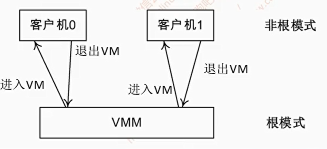

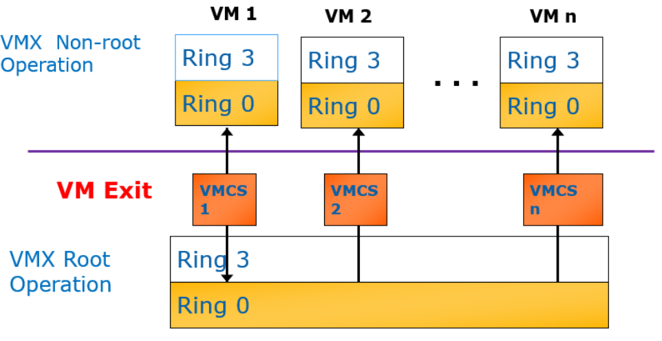

### 全虚拟化与半虚拟化

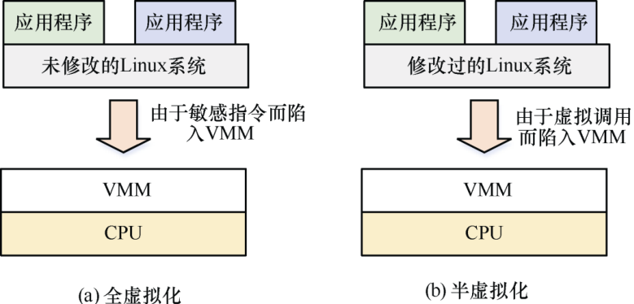

目前主要用硬件辅助虚拟化技术，这两项技术都不怎么用了

### 虚拟机的分类

- **Hypervisor**：虚拟机管理程序，也叫做VMM（Virtual Machine Manager），Hypervisor位于计算机硬件和虚拟机之间，负责管理和分配计算机资源给各个虚拟机。

  - Type1：第一类虚拟机管理程序就像小型操作系统，目的就是管理所有的虚拟机，常见的虚拟化软件有Xen、ACRN等。

  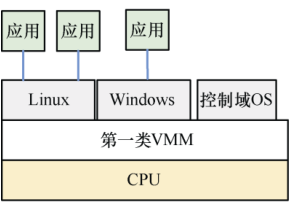

  - Type2：第二类虚拟机管理程序依赖于Windows、Linux等操作系统来分配和管理调度资源，常见的虚拟化软件有VMware Player、KVM以及Virtual Box等。

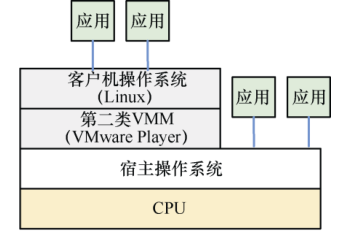

### 内存虚拟化

- 软件模拟：影子页表（Shadow Page）

  - 效率低

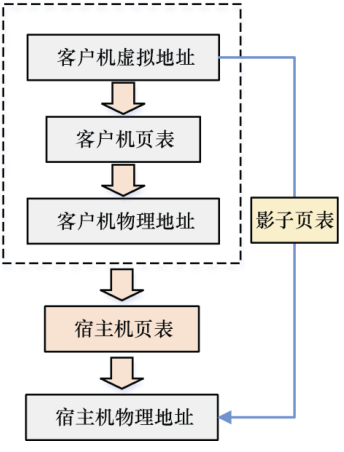

- 硬件内存虚拟化技术—
    - Intel: 扩展页表（Extended Page Table，EPT）技术
    - ARM: stage1 & stage2页表
    
- 虚拟化用到的4种地址
    - GVA（Guest Virtual Address）：客户机虚拟地址。
    - GPA（Guest Physical Address）：客户机物理地址。
    - HVA（Host Virtual Address）：宿主机虚拟地址。
    - HPA（Host Physical Address）：宿主机物理地址


### IO虚拟化

- **软件模拟设备**。以磁盘为例，虚拟机管理程序可以在实际的磁盘上创建一个文件或一块区域来模拟虚拟磁盘，并把它传递给客户机。

- **设备透传**（Device Pass Through）。虚拟机管理程序把物理设备直接分配给特定的虚拟机。
- **SR-IOV**（Single Root I/O Virtualization）技术


## CPU虚拟化

### vCPU与VM概念

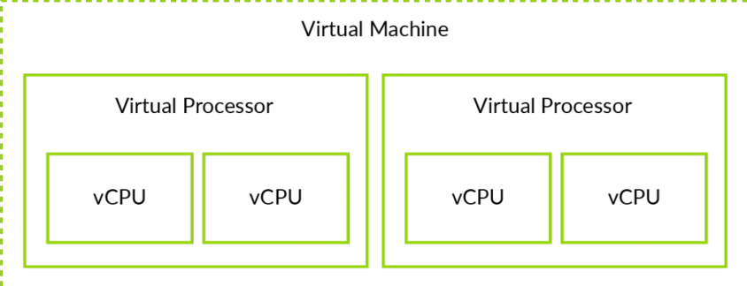

- ARMv8/v9的CPU虚拟化技术构建在不同的异常等级上

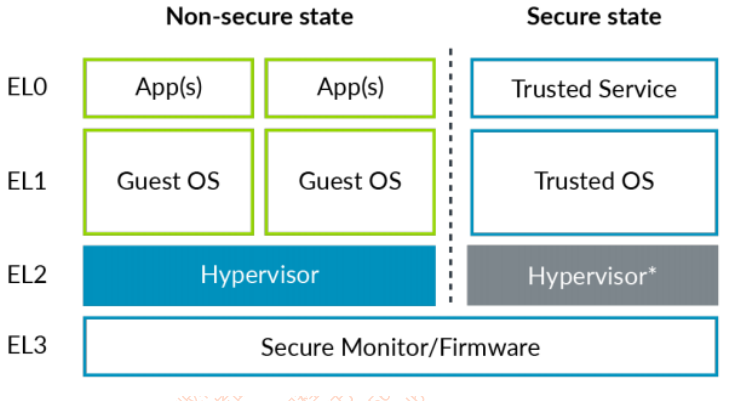

### 创建多个vCPU

一个物理CPU可能创建多个vCPU，利用OS的多进程/多线程机制

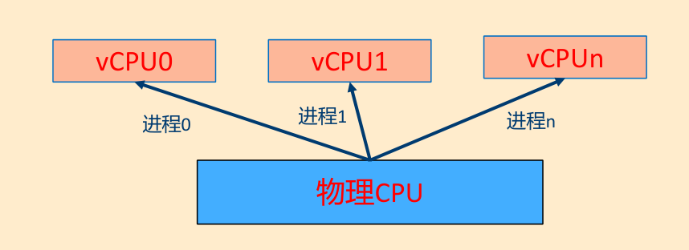

一个物理CPU可以运行多个进程/线程，hypervisor可以分时复用地调度它们运行。当进程从EL2切入到EL1之后，vCPU就创建了。

### ARMv8/v9异常处理

- **非虚拟化场景**：异常的处理集中在EL1，比如异常向量表，异常处理，中断处理，系统调用等

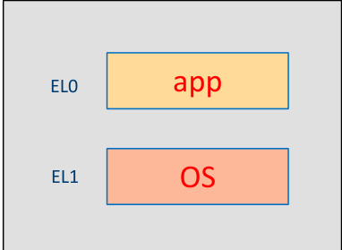

- **虚拟化场景**：

  

  - **对于hypervisor**：需要处理来自hypervisor本身的异常，来自VM的异常，来自VM的系统调用，来自VM的中断等等。
  - **对于VM**：VM本身也需要处理 来自VM的异常和系统调用等（GuestOS处理app的异常和系统调用）


### Hyervisor进入VM

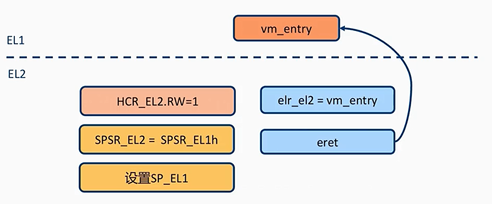

1. **设置HCR_EL2.RW，让cpu运行在aarch64中**
2. 暂时关闭vCPU的MMU功能（可选项）
3. **设置SPSR_EL2，当eret指令之后，让CPU跳转到EL1**
4. **设置ELR_EL2寄存器，执行eret之后跳转到vm_entry函数中执行执行eret指令，进行处理器模式转换，让CPU进入EL1**
5. **设置SP_EL1栈，让vCPU指向一个新的栈空间**

```asm
.global jump_to_vm
jump_to_vm:
	/* 设置 EL1 执行状态为 AArch64 */
	ldr x0, =HCR_HOST_NVHE_FLAGS  //NVHE（Non-Virtualized Host Environment）
	msr hcr_el2, x0
	
	/*  禁用 EL1 的 MMU */
	ldr x0, =SCTLR_VALUE_MMU_DISABLED
    msr sctlr_el1, x0
    
    /* 设置 SPSR_EL2，使返回时进入 EL1h（64位）*/
    ldr x0, =SPSR_EL1
    msr spsr_el2, x0
    
    /* 设置虚拟机入口地址（ELR_EL2）*/
    adr x0, vm_entry
    msr elr_el2, x0
	
	/* 设置虚拟机栈指针（SP_EL1）*/
	adr x2, vm_sp
    add x2, x2, #4096
    msr sp_el1, x2
    
    eret
```


### 从VM退出到Hypervisor

- **VM的Guest OS主动调用HVC**
- **VM发生了异常（EL1中处理不了，比如GPA缺页异常）**
- **发生了硬件中断**


#### HVC系统调用

- SVC系统调用：运行在EL0的 app 请求 进入到EL1的OS。

- HVC系统调用：运行在EL1中的 VM，请求进入到EL2的hypervisor中。
- SMC系统调用：运行在hypervisor或者VM的软件，请求进入EL3的安全固件中


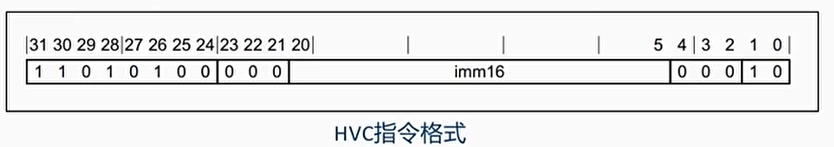

```c
#define HVC_CALL(which, arg0, arg1, arg2) ({ \
    register unsigned long a0 asm ("x0") = (unsigned long)(arg0); \
    register unsigned long a1 asm ("x1") = (unsigned long)(arg1); \
    register unsigned long a2 asm ("x2") = (unsigned long)(arg2); \
    register unsigned long a8 asm ("x8") = (unsigned long)(which); \
    asm volatile ("hvc #0" \
                  : "+r" (a0), "r" (a1), "r" (a2), "r" (a8) \
                  : "memory"); \
    a0; \
})

#define HVC_CALL_0(which) HVC_CALL(which, 0, 0, 0)
#define HVC_CALL_1(which, arg0) HVC_CALL(which, arg0, 0, 0)
#define HVC_CALL_2(which, arg0, arg1) HVC_CALL(which, arg0, arg1, 0)
```

遵循ARM64标准函数调用规范

- `x0`: 返回值 / 第一个参数
- `x1`, `x2`: 参数
- `x8`: HVC 的功能号（即 `which`）


#### 异常综合信息寄存器ESR_EL2

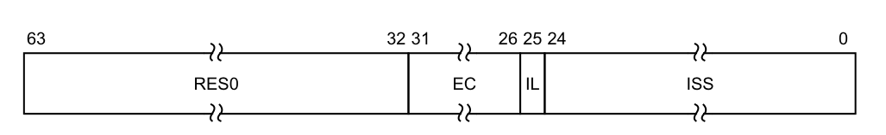

ESR寄存器一共包含4个字段（域），其中：

- Bit 32~63，是保留的比特位。
- Bit 26~31，EC（**Exception Class**），这个字段指示发生异常的类型，同时用来索引ISS域。
- Bit 25，**IL**（**Instruction Length for synchronous exceptions**），表示同步异常的指令长度。
- Bit 0~24，**ISS**（**Instruction Specific Syndrome**）具体的异常指令编码。这个异常指令编码表依赖不同的异常类型，不同的异常类型有不同的编码格式。


**Exception Class**

- **范围划分**：
  - `0x00–0x2C`：保留用于 **同步异常**
  - `0x2D–0x3F`：保留用于 **同步或异步异常**
- **保留（Reserved）**：
  - **`0x02`, `0x0A–0x0B`, `0x0F`, `0x10`, `0x14`, `0x1B`, `0x1D–0x1F`, `0x23`, `0x27`, `0x29–0x2E`, `0x36–0x37`, `0x39`, `0x3B`, `0x3D–0x3F`**
  - 编程为这些值会导致 **CONSTRAINED UNPREDICTABLE** 行为


| EC 值 (二进制) | EC 值 (十六进制) | 异常类型说明                                                 | 是否依赖 AArch32 / 特性   |
| -------------- | ---------------- | ------------------------------------------------------------ | ------------------------- |
| `0b000000`     | `0x00`           | **Unknown reason**（未知原因）                               | 通用                      |
| `0b000001`     | `0x01`           | **Trapped WFI/WFE**（被陷阱的 WFI 或 WFE 指令）              | 通用                      |
| `0b000011`     | `0x03`           | **MCR/MRC (coproc=0b1111)**（AArch32 协处理器访问）          | 需 AArch32 支持           |
| `0b000100`     | `0x04`           | **MCRR/MRRC (coproc=0b1111)**                                | 需 AArch32 支持           |
| `0b000101`     | `0x05`           | **MCR/MRC (coproc=0b1110)**                                  | 需 AArch32 支持           |
| `0b000110`     | `0x06`           | **LDC/STC**（调试数据传输指令）                              | 需 AArch32 支持           |
| `0b000111`     | `0x07`           | **FP/SVE 被 CPACR/CPTx.FPEN 禁用**（浮点/SVE 访问被禁）      | 通用（需 FP/SVE）         |
| `0b001000`     | `0x08`           | **VMRS（ID group trap）**                                    | 需 AArch32 支持           |
| `0b001001`     | `0x09`           | **Pointer Authentication 指令被禁**（HCR_EL2.API=0 等）      | 需 ARMv8.3-PAuth          |
| `0b001100`     | `0x0C`           | **MRRC (coproc=0b1110)**                                     | 需 AArch32 支持           |
| `0b001101`     | `0x0D`           | **Branch Target Exception (BTI)**                            | 需 ARMv8.5-BTI            |
| `0b001110`     | `0x0E`           | **Illegal Execution state**（非法执行状态）或 PC 对齐错误    | 通用                      |
| `0b010001`     | `0x11`           | **SVC in AArch32**（仅当 HCR_EL2.TGE=1 时上报到 EL2）        | 需 AArch32 支持           |
| `0b010010`     | `0x12`           | **HVC in AArch32**（HVC 未被禁用）                           | 需 AArch32 支持           |
| `0b010011`     | `0x13`           | **SMC in AArch32**（仅当 HCR_EL2.TSC=1 时上报到 EL2）        | 需 AArch32 支持           |
| `0b010101`     | `0x15`           | **SVC in AArch64**                                           | 需 AArch64 支持           |
| `0b010110`     | `0x16`           | **HVC in AArch64**（HVC 未被禁用）                           | 需 AArch64 支持           |
| `0b010111`     | `0x17`           | **SMC in AArch64**（仅当 HCR_EL2.TSC=1 时上报到 EL2）        | 需 AArch64 支持           |
| `0b011000`     | `0x18`           | **Trapped MSR/MRS/System 指令**（AArch64 系统寄存器访问）    | 需 AArch64 支持           |
| `0b011001`     | `0x19`           | **SVE 被 CPACR/CPTx.ZEN 禁用**                               | 需 SVE 支持               |
| `0b011010`     | `0x1A`           | **Trapped ERET/ERETAA/ERETAB**                               | 需 ARMv8.3-PAuth + NV     |
| `0b011100`     | `0x1C`           | **Pointer Auth 认证失败**                                    | 需 ARMv8.3-FPAC           |
| `0b100000`     | `0x20`           | **Instruction Abort from lower EL**（来自低异常级的指令取指异常） | 通用                      |
| `0b100001`     | `0x21`           | **Instruction Abort at same EL**（同级异常的指令取指异常）   | 通用                      |
| `0b100010`     | `0x22`           | **PC alignment fault**（程序计数器未对齐）                   | 通用                      |
| `0b100100`     | `0x24`           | **Data Abort from lower EL**（来自低异常级的数据访问异常）   | 通用                      |
| `0b100101`     | `0x25`           | **Data Abort at same EL**（含嵌套虚拟化 VNCR 相关）          | 通用                      |
| `0b100110`     | `0x26`           | **SP alignment fault**（栈指针未对齐）                       | 通用                      |
| `0b101000`     | `0x28`           | **Trapped FP exception (AArch32)**                           | 需 AArch32 + FP trap 支持 |
| `0b101100`     | `0x2C`           | **Trapped FP exception (AArch64)**                           | 需 AArch64 + FP trap 支持 |
| `0b101111`     | `0x2F`           | **SError interrupt**（同步外部错误中断）                     | 通用                      |
| `0b110000`     | `0x30`           | **Breakpoint from lower EL**                                 | 通用                      |
| `0b110001`     | `0x31`           | **Breakpoint at same EL**                                    | 通用                      |
| `0b110010`     | `0x32`           | **Software Step from lower EL**                              | 通用                      |
| `0b110011`     | `0x33`           | **Software Step at same EL**                                 | 通用                      |
| `0b110100`     | `0x34`           | **Watchpoint from lower EL**                                 | 通用                      |
| `0b110101`     | `0x35`           | **Watchpoint at same EL**（含 VNCR）                         | 通用                      |
| `0b111000`     | `0x38`           | **BKPT instruction (AArch32)**                               | 需 AArch32 支持           |
| `0b111010`     | `0x3A`           | **Vector Catch (AArch32)**                                   | 需 AArch32 支持           |
| `0b111100`     | `0x3C`           | **BRK instruction (AArch64)**                                | 需 AArch64 支持           |


```asm
.global hvc_call
hvc_call:
	hvc 0x0
	ret
```

退出到VM，hvc系统调用，10保存到x0

```c
	hvc_call(10);
```

触发Lower EL using AArch64 同步异常，下面是异常向量表

```asm
/ * Lower EL using AArch64 */
vtentry __do_vcpu_exit
vtentry __invalid
vtentry __invalid
vtentry __invalid
```

触发异常后跳转到异常向量表`__do_vcpu_exit`函数

```asm
_do_vcpu_exit:
    vm_exit 1                 
    mrs x25, esr_el2          // 读取 ESR_EL2寄存器Exception Syndrome Register，保存在x25
    lsr x24, x25, #ESR_ELX_EC_SHIFT   // 右移获取 EC 字段（[31:26]），即 Exception Class
    cmp x24, #ESR_ELX_EC_HVC64       // 比较是否为 HVC64 异常（EC == 0b010110）
    b.eq vm_hvc                // 如果相等，则跳转到 vm_hvc 处理 HVC

    mov x0, sp                 // 设置参数：x0 = 当前栈指针
    mov x1, #BAD_SYNC          // 设置错误码：BAD_SYNC（表示同步异常）
    mrs x2, esr_el2            // 再次读取 ESR_EL2 作为上下文信息
    bl bad_mode                // 跳转到 bad_mode 处理未知/非法异常

vm_hvc:
    mov x0, sp                 // 设置参数：x0 = 栈指针
    bl vm_hvc_handler         // 调用 HVC 处理函数
    vm_entry 1                // 返回继续运行虚拟机（进入 VM）
```

`vm_exit`和`vm_entry`宏实现：

```asm
#define S_FRAME_SIZE 272 /* sizeof(struct pt_regs)	// */
#define S_X0 0 /* offsetof(struct pt_regs, regs[0])	// */
#define S_X1 8 /* offsetof(struct pt_regs, regs[1])	// */
#define S_X2 16 /* offsetof(struct pt_regs, regs[2])	// */
#define S_X3 24 /* offsetof(struct pt_regs, regs[3])	// */
#define S_X4 32 /* offsetof(struct pt_regs, regs[4])	// */
#define S_X5 40 /* offsetof(struct pt_regs, regs[5])	// */
#define S_X6 48 /* offsetof(struct pt_regs, regs[6])	// */
#define S_X7 56 /* offsetof(struct pt_regs, regs[7])	// */
#define S_X8 64 /* offsetof(struct pt_regs, regs[8])	// */
#define S_X10 80 /* offsetof(struct pt_regs, regs[10])	// */
#define S_X12 96 /* offsetof(struct pt_regs, regs[12])	// */
#define S_X14 112 /* offsetof(struct pt_regs, regs[14])	// */
#define S_X16 128 /* offsetof(struct pt_regs, regs[16])	// */
#define S_X18 144 /* offsetof(struct pt_regs, regs[18])	// */
#define S_X20 160 /* offsetof(struct pt_regs, regs[20])	// */
#define S_X22 176 /* offsetof(struct pt_regs, regs[22])	// */
#define S_X24 192 /* offsetof(struct pt_regs, regs[24])	// */
#define S_X26 208 /* offsetof(struct pt_regs, regs[26])	// */
#define S_X28 224 /* offsetof(struct pt_regs, regs[28])	// */
#define S_FP 232 /* offsetof(struct pt_regs, regs[29])	// */
#define S_LR 240 /* offsetof(struct pt_regs, regs[30])	// */
#define S_SP 248 /* offsetof(struct pt_regs, sp)	// */
#define S_PC 256 /* offsetof(struct pt_regs, pc)	// */
#define S_PSTATE 264 /* offsetof(struct pt_regs, pstate)	// */

#define BAD_SYNC  0
#define BAD_IRQ   1
#define BAD_FIQ   2
#define BAD_ERROR 3


.macro kernel_exit el
   // load ELR ,SPSR, 将PC的值和pstate的值恢复
   ldp x21, x22, [sp, #S_PC]
   .if \el == 1
   		ldr x23, [sp, #S_SP]
   		msr sp_el1, x23
   .endif
   
   msr elr_el2, x21
   msr spsr_el2, x22

   ldp x0, x1, [sp, #16 * 0]
   ldp x2, x3, [sp, #16 * 1]
   ldp x4, x5, [sp, #16 * 2]
   ldp x6, x7, [sp, #16 * 3]
   ldp x8, x9, [sp, #16 * 4]
   ldp x10, x11, [sp, #16 * 5]
   ldp x12, x13, [sp, #16 * 6]
   ldp x14, x15, [sp, #16 * 7]
   ldp x16, x17, [sp, #16 * 8]
   ldp x18, x19, [sp, #16 * 9]
   ldp x20, x21, [sp, #16 * 10]
   ldp x22, x23, [sp, #16 * 11]
   ldp x24, x25, [sp, #16 * 12]
   ldp x26, x27, [sp, #16 * 13]
   ldp x28, x29, [sp, #16 * 14]

   ldr lr, [sp, #S_LR]
   // restore sp
   add sp, sp, #S_FRAME_SIZE
   eret
.endm


.macro kernel_entry el
   sub sp, sp, #S_FRAME_SIZE
   stp x0, x1, [sp, #16 * 0]
   stp x2, x3, [sp, #16 * 1]
   stp x4, x5, [sp, #16 * 2]
   stp x6, x7, [sp, #16 * 3]
   stp x8, x9, [sp, #16 * 4]
   stp x10, x11, [sp, #16 * 5]
   stp x12, x13, [sp, #16 * 6]
   stp x14, x15, [sp, #16 * 7]
   stp x16, x17, [sp, #16 * 8]
   stp x18, x19, [sp, #16 * 9]
   stp x20, x21, [sp, #16 * 10]
   stp x22, x23, [sp, #16 * 11]
   stp x24, x25, [sp, #16 * 12]
   stp x26, x27, [sp, #16 * 13]
   stp x28, x29, [sp, #16 * 14]

   .if \el == 1
   		msr x21, sp_el1
   .else
      	// x21栈顶的位置
   		add x21, sp, #S_FRAME_SIZE
   .endif

   mrs x22, elr_el2
   mrs x23, spsr_el2
   // lr和sp保存到sp+#S_LR(pt_regs->regs[30])和sp+#S_LR+8(pt_regs->sp)的位置
   stp lr, x21, [sp, #S_LR]
   // 保存elr_eln和spsr_eln到sp+#S_PC(pt_regs->PC)和sp+#S_PC+8(pt_regs->pstate)
   // 这里elr_eln是PC是因为进入异常时，硬件会自动把异常前的PC和PSTATE保存到ELR_ELn
   // 和SPSR_ELn(The Saved Program Status Register)
   stp x22, x23, [sp, #S_PC]

.endm
```

`vm_hvc_handler`实现

```c
void vm_hvc_handler(struct pt_regs *regs){
    unsigned int el = read_sysreg(CurrentEL)>>2;
    printk("%s jump into hypervisor(el=%d), hvccall num: %d\n", __func__, el, regs->regs[0]);
}
```


## 内存虚拟化


### ARM64页表映射

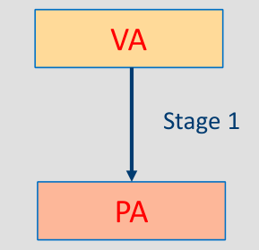

仅有一阶段地址映射Stage 1，将虚拟地址转换为物理地址

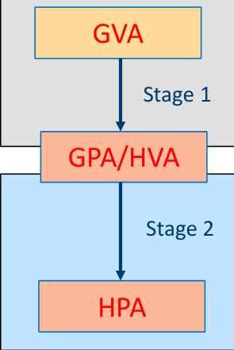

两阶段地址映射：

- **Stage1：VM里面的GVA -> GPA**
- **Stage2：hypervisor里面的HVA到HPA**

每一阶段映射都要经过一个3级或4级页表


**从系统角度看**

虚拟化的2阶段的地址转换
1. **VA (Virtual Address) -> IPA (Intermediate Physical Address)**（ARM手册术语）
2. **IPA-> PA(Intermediate Physical Address)**

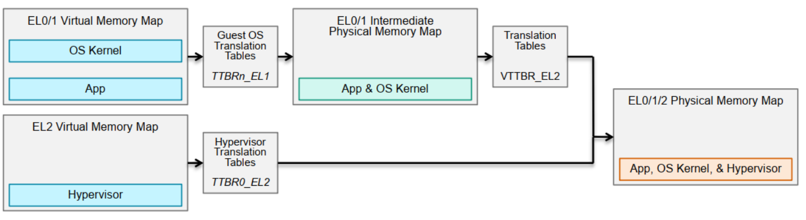

hypervisor本身也有内存访问需求，使用TTBR0_EL2，是另一套页表，也就说一共三套页表


### 2 Stage 页表转换

-  2 Stage需要消耗更多的内存
-  VA->IPA->PA的转换：可能要多达16次的内存访问过程
-  Stage1和stage2都可以缓存到TLB


#### Stage 1页表映射

- 非虚拟化：VA -> PA

- 虚拟化：VA -> IPA

**影响页表映射的几大因素**

- Input address size：由TCR_ELx.TxSZ来确定，指定VA的范围，也确定采用几级页表。通常48bits
- Output address size：由ID_AA64MMFR0_EL1.PARange来确定，系统支持的最大物理内存，填入到TCR_ELx.{I}PS中
- 页面粒度：由TCR_Elx中的TG0和TG1来指定


#### Stage 2页表映射

- 虚拟化：IPA(GPA) -> PA

**影响页表映射的几大因素**

- Input address size：IPA的最大值 受到系统PA的约束，PA由ID_AA64MMFR0_EL1.PARange来确定。

>  VM里的GPA不可能超过物理内存size。

- Output address size：由ID_AA64MMFR0_EL1.PARange来确定，系统支持的最大物理内存，填入到VTCR_EL2.PS中
- 页面粒度：由VTCR_El2中的TG0来指定


Stage 2页表映射支持 4级或者3级页表映射

- Input address size （PA size）
- 页表粒度（4KB? 16KB? 64KB?）
- 从哪一级开始遍历页表？（VTCR_EL2.SL0）


**怎么知道PA?**

以Cortex-A72处理器为例，查询Cortex-A72 Technical Reference Manual，可知**Physical Address range最大支持44bits**，16TB。
比较新的IP如，Cortex-A77, A78，X2等，PA最大支持40bits，1TB。

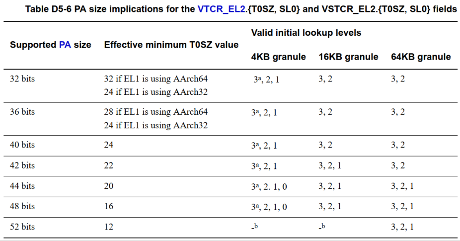

T0SZ 是 64 - `Support PA size`


以4KB页面粒度为例

- 当PA为44bits，支持4级页表映射
- 当PA为42bits, 40bits，36bits，32bits，支持3级页表映射

当PA为42bits和40bits时，可以使用S2 concatenated（串联）页表，把4级页表压缩到3级


#### S2 contatenated 页表

以40bits+4KB为例

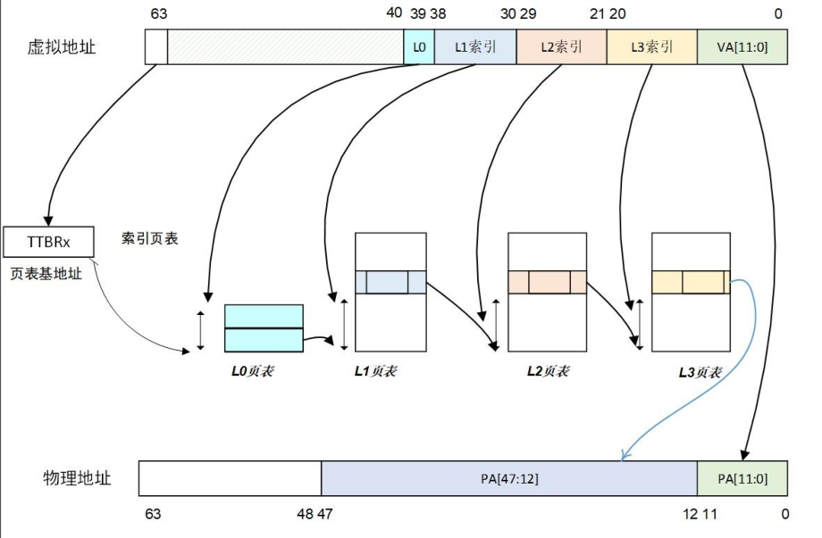

多出来一个bit位39，用于L0页表，有两个页表项，每一个指向一个L1页表

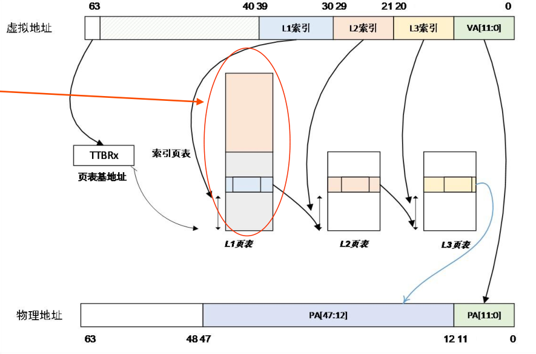

使用concatenated页表之后，原来L0页表的两个页表项指向的两个L1页表被串联在一起，这样L1页表相当于原来的2倍。

- L1索引范围也 变成原来的2倍
- MMU直接从L1页表开始索引，这样4级页表 变成 3级页表


**好处**：可以避免额外的一级翻译所带来的开销。

- 最大支持串联的表的数量为16。
- VTCR_EL2.SL0字段用来指示：从哪一级页表开始索引


- IA: Input Address，IA[47:12]-IA[39:12]表示使用40~48bit的虚拟地址
- 第一行Tables表示可以串联的table数量，最大为16，1表示没有串联，2表示两个页表串联
- 第一列Inital lookup level（SL0 value）表示硬件从哪一级页表开始遍历，通过设置VTCR_EL2.SL0


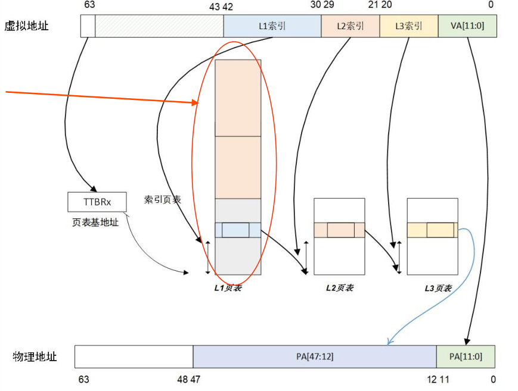

以43bits + 4KB页面粒度为例，使用S2 concatenated页表的话，L1页表将由16个表 串联而成


#### S2页表属性

S2页表属性与S1页表属性 略有不同

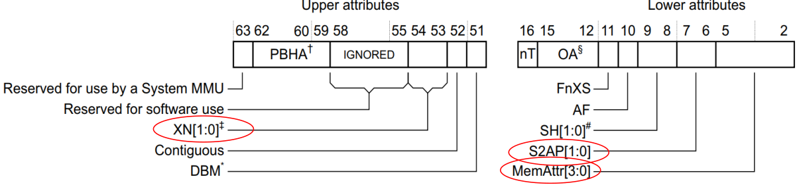

##### MemAttr

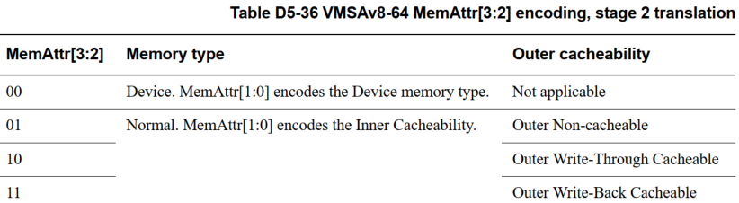

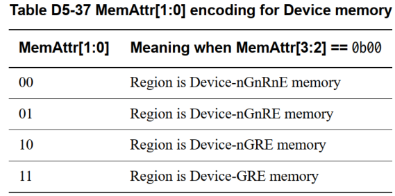

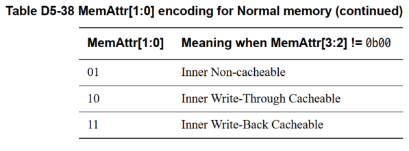

##### S2AP属性

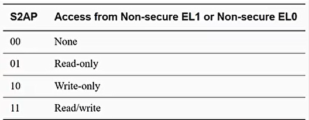

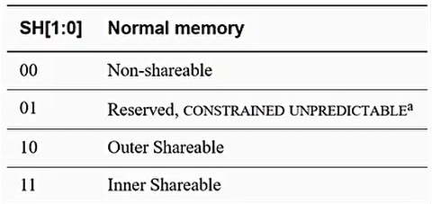

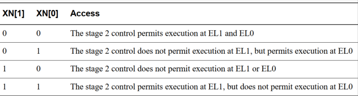

#### S2页表相关的寄存器

- 页表基地址寄存器：**VTTBR_EL2**

- S2页表转换控制寄存器：**VTCR_EL2**

  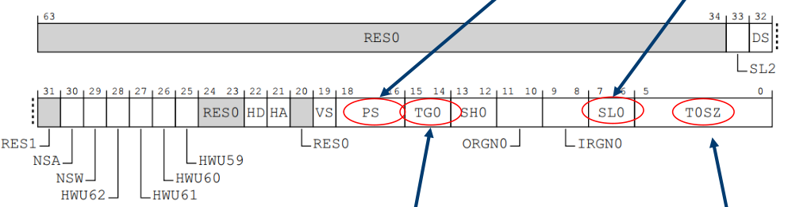

  - PS表示物理内存最大值

  - TG0表示页面粒度4KB，16KB，64KB

  - SL0表示MMU从哪一级页表中开始查询

  - T0SZ 用来指定IPA的范围，这个值受PA约束。它表示IPA的范围$ 2^{64-\text T0SZ}$


Hypervisor配置寄存器：**HCR_EL2。**

- VM字段：开启S2页表映射


### 实验3：创建4级页表的S2映射

实验目的：了解ARM64架构的S2页表

实验要求：在实验2的基础上，打开HCR_EL2_VM字段，使能S2 MMU页表，会发生什么情况？请分析

本实验采用 “IPA 44Bits + 4KB页面 + 4级映射“ 的方式来创建S2页表。开启S2页表映射之后， 跳转到 VM时，执行第一条指令会触发 缺页异常，因为第一条指令 并没有建立 映射。本实验 采用缺页异常处理的方式来 一页一页得建立S2页表


TODO

### 实验4：创建S2 concatenated页表 with 43 bits IPA

实验目的：了解ARM64架构的S2 concatenated页表

实验要求：在上个实验的基础上，本实验要创建S2 concatenated页表，并且IPA bits 为43，页面粒度为4KB。画出该映射的结构示意图。

TODO


### 实验5：创建S2 concatenated页表 with 40 bits IPA

实验目的：了解ARM64架构的S2 concatenated页表
实验要求：在上个实验的基础上，本实验要创建S2 concatenated页表，并且IPA bits 为40，页面粒度为4KB。画出该映射的结构示意图。


### 实验6：创建虚拟机中的两阶段地址映射

实验目的：了解ARM64架构的2 stage页表映射，建立第二阶段的地址映射，即GPA到HPA的映射，GPA到HPA的映射采用恒等映射方式。

- 建立第一阶段的地址映射，即GVA到GPA的映射采用非恒等映射方式。

实验要求：

- 在Hypervisor中分配一个page，因为在Hypervisor中是恒等映射，所以gpa = hpa
- 在这个gpa中写入数值，比如0x12345678
- 在切入到VM时候，把这个gpa传递给VM
- 在VM中创建一个gva到gpa的映射，假设gva地址为：0x80000000
- 然后在VM中读取gva地址的值，看是否为0x12345678？

请画出这个系统中所有映射的示意图，包括VM和Hypervisor内部的

TODO


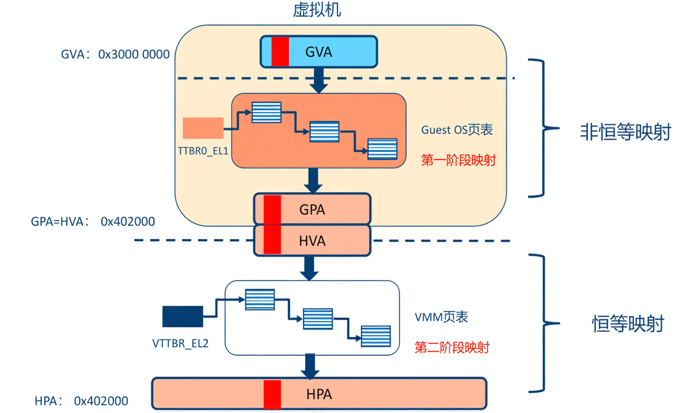


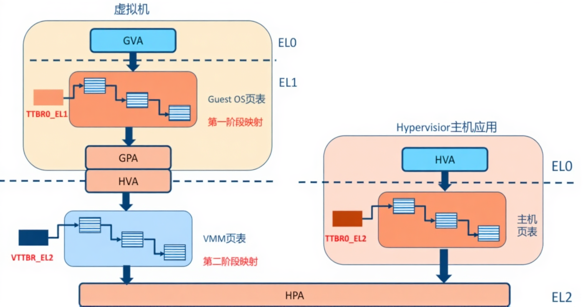


## IO设备虚拟化

### 三种主流方式

1. **全软件虚拟化**：采用“陷入和模拟”（trap & emulate）的方式来完全模拟设备的行为。

2. **半虚拟化**：采用高效的前端驱动程序和后续驱动程序来减少虚拟机陷入事件，提升I/O设备虚拟化性能，如VirtIO技术。

3. **硬件辅助虚拟化**：硬件直接透传（passthrough）、IOMMU以及SR-IOV（Single Root I/O Virtualization）


**模拟MMIO寄存器访问的流程（trap & emulate）**

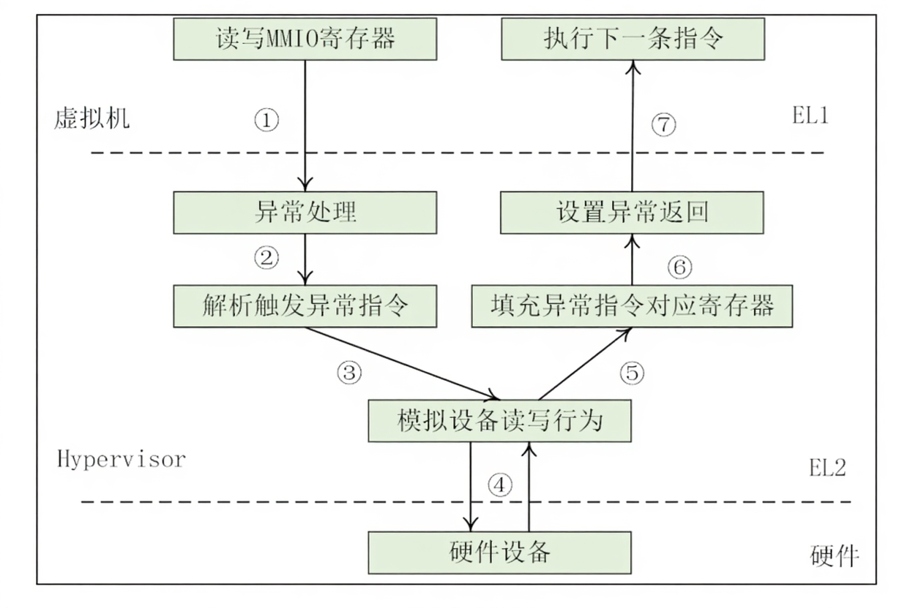


**解析触发指令**

- VM访问MMIO，触发“**Data Abort from a lower Exception level**”异常。
- 不需要人工解析异常指令编码，硬件已经帮忙解析了，读取ISS即可：

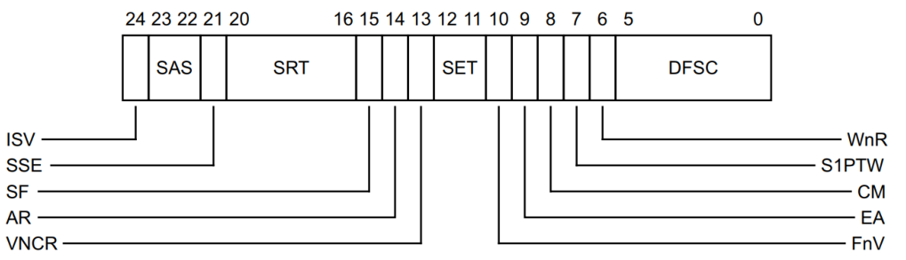


- ISV: 表示ISS[23:14] 包含的异常指令解析是有效的。
- SAS：发生异常时，访问内存的大小。
- SSE：数据是否需要有符号扩展。
- SRT：目标寄存器Rt
- SF：是32位还是64位的load/Store指令
- AR：指令是否包含acquire/release屏障语义
- VNCR：是否来着嵌套虚拟化的访问
- SET：同步错误类型。
- FnV：far寄存器是否有效。
- WnR：读或者写操作触发的异常


**模拟读串口MMIO寄存器的流程**

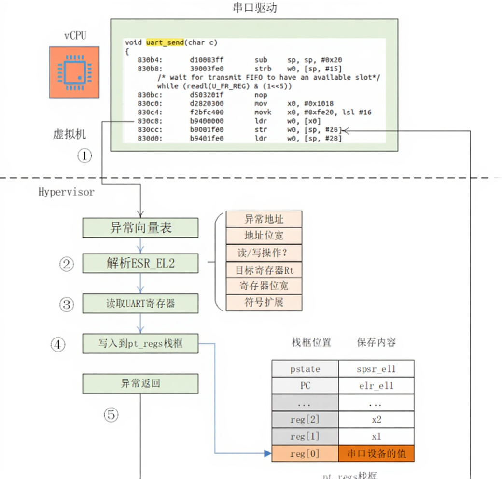


**模拟写串口MMIO寄存器的流程**

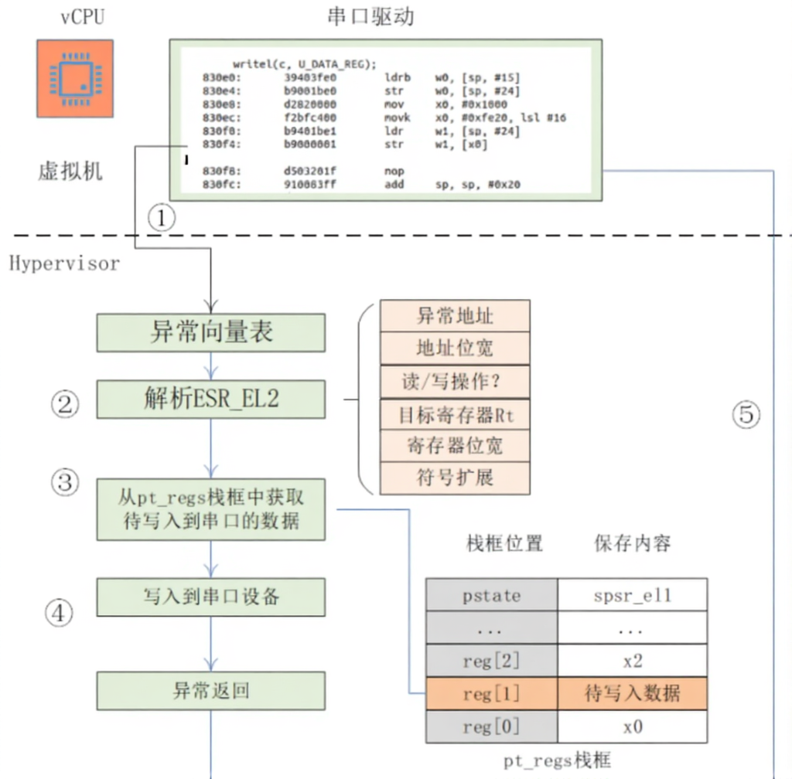


### 实验7：在hypervisor中模拟串口设备

实验目的：使用全软件虚拟化的方式来模拟串口设备

实验要求：在GuestOS中实现串口驱动，并且能让GuestOS从串口中打印输出

TODO


## 定时器虚拟化

- System counter：提供一个全系统，固定频率的系统计数器。
- System counter会广播到所有的core上
  - CNTPCT_EL0寄存器返回 system counter的值
  - CNTFRQ_EL0 寄存器用来设置system counter对应的频率。
- 每个CPU core会有一组定时器


**generic timer**

每个ARMv8v9的CPU核心上有一组通用定时器


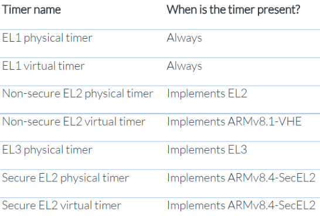

以Cortex-A72为例

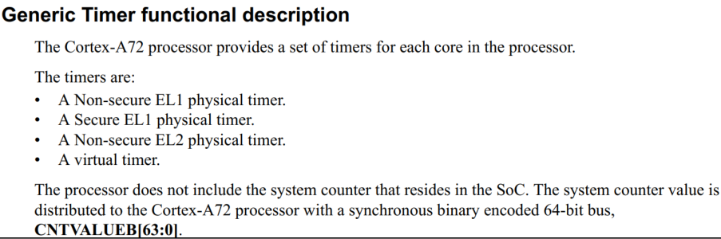


**物理定时器与虚拟定时器的区别**

虚拟计数器（virtual counter）可以**测量 虚拟机上 时间的流逝**。

**虚拟机上的时间流逝 != 真实物理机上的 时间流逝**


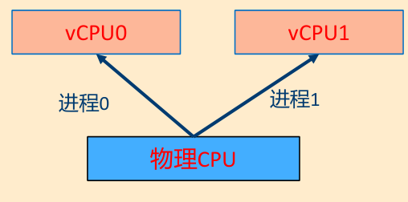

假设两个vCPU轮流运行，每个vCPU运行1ms

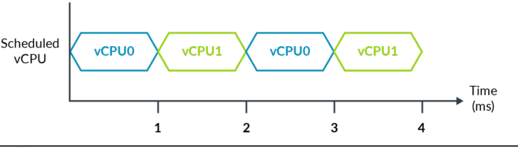

如果vCPU0在T=0时设置了一个定时器，在经过3ms后触发一个中断，中断是否已触发？


**物理时间 vs 虚拟时间**：物理时间是指挂钟时间（wall-clock time），即实际经过的时间。虚拟时间是指虚拟处理器（vCPU）经历的时间

vCPU0在物理时间4毫秒时只运行了2毫秒。根据物理时间的流逝，vCPU0的比较器设置的时间还没有到达3毫秒，此时不会触发中断。

- **Virtual counter = physical counter - offset**

- **CNTVCT_EL0(虚拟计数器) = CNTPCT_EL0(物理计数器) - CNTVOFF_EL2(虚拟偏移量)**


### VM中的 虚拟时间的计算 方式1

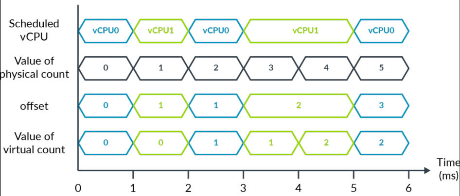

虚拟时间 offset
$$
\text{offset} = \sum(\text{Time\_sched\_in} - \text{Time\_sched\_out})
$$
其中Time_sched_in是 vCPU 被调度进入运行的时间，Time_sched_out是 vCPU 被调度挂起的时间。


**方案1：在每次vCPU被调度运行时，hypervisor更新CNTVOFF_EL2寄存器。**


### VM中的 虚拟时间的计算 方式2

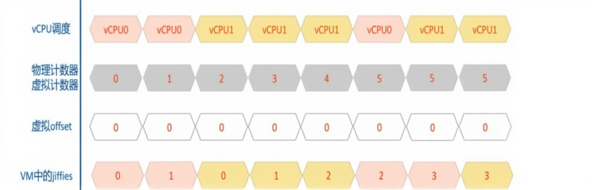


方案2：

- 让虚拟offset为一个恒定值，虚拟计数器 = 物理计数器 - 虚拟offset
- 当vCPU被调度出去时，hypervisor关闭虚拟timer中断，即该vCPU的jiffies会暂时停止自增。
- 当vCPU被调度运行时，hypervisor打开虚拟timer中断，该vCPU的jiffies会恢复自增


### Timer触发中断两种方式

- 使用TimeValue的方式，即给定时器赋一个初始值，让它递减。当递减到0时触发中断，在中断处理程序里重新给定时器赋值

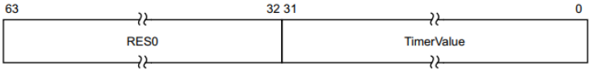

-  使用CmpValue的方式：即给定时器赋一个对比值CValue，当timer增加的Cvalue之后，触发中断。

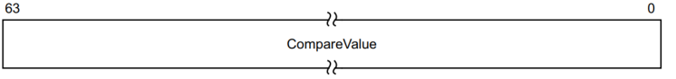


### 实验8：使能hypervisor (EL2) physical timer

实验目的：熟悉arm64架构中的通用定时器的用法

实验要求：在BenOS中使能EL2 物理定时器

TODO


### 实验9：使能VM中的virtual timer

实验目的：熟悉arm64架构中的通用定时器的用法

实验要求：在BenOS中使能virtual timer。本实验 看不到Guest OS的定时器中断处理函数中的打印。因为，VM中的virtual timer会路由的EL2中的hypervisor来处理，然后再注入到VM中，这个过程需要实现GIC中断虚拟化才行。


TODO


## 中断虚拟化

### 中断处理的路由

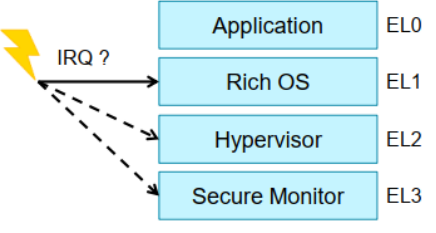

对于异常和中断，可以路由到EL1, EL2, EL3处理，需要配置HCR以及SCR相关寄存器。

HCR_EL2寄存器是虚拟管理程序配置寄存器，其中有如下几个字段和异常处理路由相关

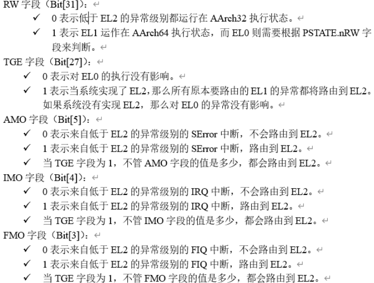


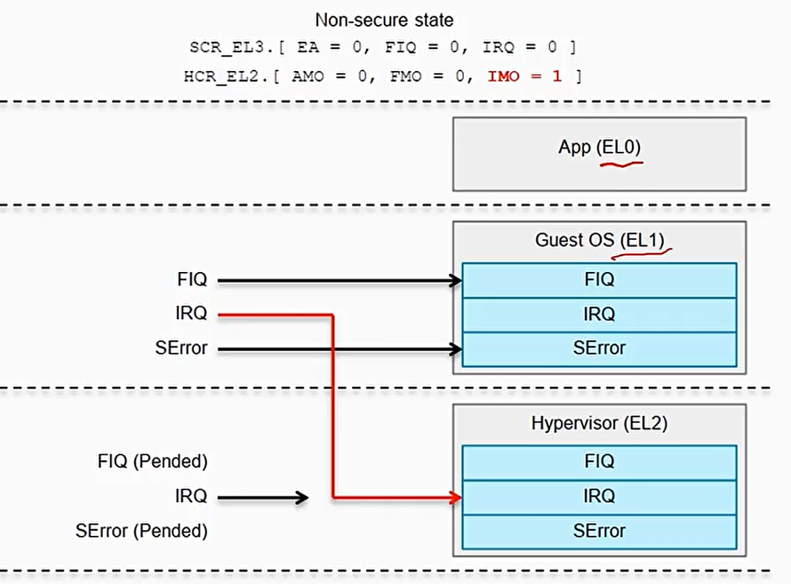


### 虚拟中断


- 有两种方式来发送虚拟中断（virtual interrupt）到vCPU
  - 使用系统寄存器（ HCR_EL2中的VI和VF字段）来配置vIRQ和vFIQ
  - 使用GICv2和GICv3控制器
- 使用vIRQ和VFIQ需要在hypervisor中模拟中断控制器
  - 效率低，trapping and emulating
  - GIC中断控制器支持vCPU，不需要软件模拟

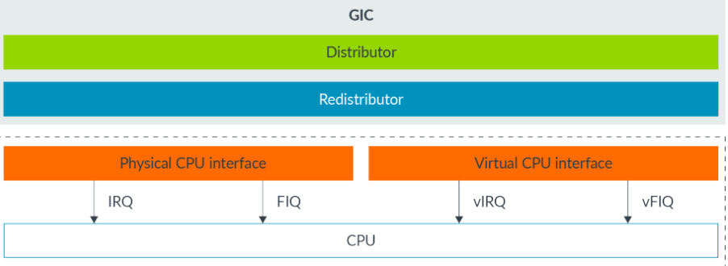


### GICv2中断控制器

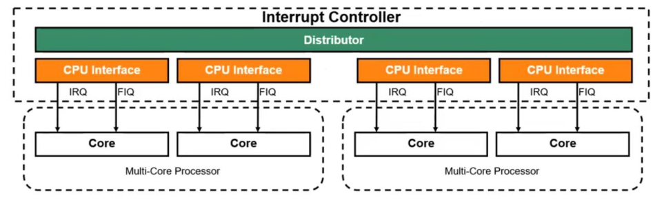


The Distributor registers (`GICD_`) 包含了中断设置和配置

The CPU Interface registers (`GICC_`) 包含CPU相关的特殊设置


#### **GIC的中断类型**

- SGI：软件产生的中断（Software Generated Interrupt），软中断即软件产生的中断，用于给其他CPU核心发送中断信号。
- PPI：私有外设中断（Private Peripheral Interrupt），私有的外设中断，该中断是某个指定的CPU独有的。
- SPI：共享外设中断（Shared Peripheral Interrupt），共享的外设中断，所有CPU都可以访问这个中断。
- LPI，本地特殊外设中断（Locality-specific Peripheral Interrupt），GICv3新增的中断类型。基于消息传递的中断类型。

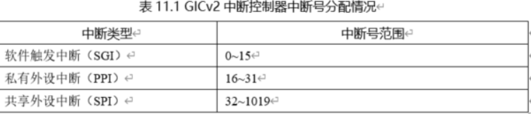

> 注意: 中断号 1020 ~ 1023是保留的


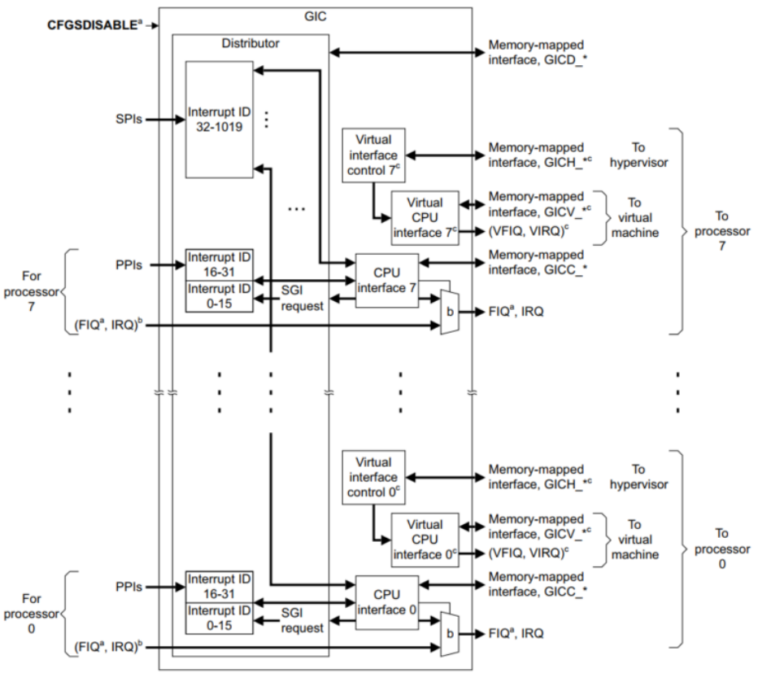


#### GICv2寄存器

GICv2寄存器分成两组：

- D：表示Distributor的寄存器
- C：表示CPU interface的寄存器


有些寄存器是按照 中断号 来描述的，比如使用某几个比特位来描述一个 中断号 的相关属性，同一个寄存器可以n个。

例如**GICD_ISENABLERn**寄存器，它是用来 使能某个中断号的。“n”表示它有n个这样的寄存器

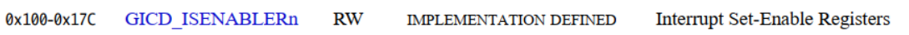

可以看到这个寄存器从0x100 到 0x17c，这些都是这个寄存器

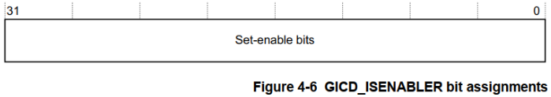

寄存器里的每个比特位表示一个中断号的enable


- ARM Core的中断：
  - Core n HP tiemr IRQ
  - Core n V timer IRQ
  - Legacy FIQn
  - Core n PS timer IRQ
  - **Core n PNS timer IRQ** (PPI ID **30**)
  - Legacy IRQn
- ARM local的中断
  - ARM Mailbox IRQs
  - Core 0 PMU IRQ
  - Core 1 PMU IRQ
  - Core 2 PMU IRQ
  - Core 3 PMU IRQ
  - AXIERR IRQ
  - Local timer IRQ
- 16个ARMC外设中断
- 64个VC外设中断
- 51个PCI相关的外设中断

#### **访问GIC-400寄存器**

- 树莓派4b上的GIC-400的基地址


**访问**：树莓派GIC400的**基地址 **+ GIC-400 **memory map偏移** + **寄存器偏移**


#### GIC v2上虚拟化的支持


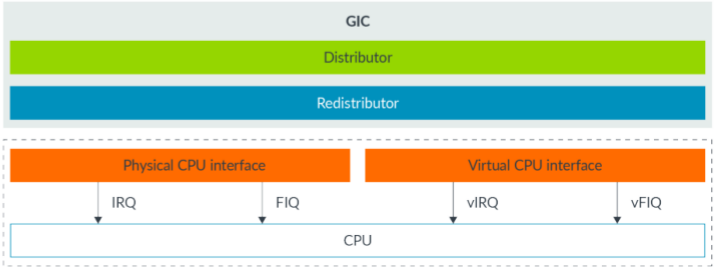

GIC v2为了支持虚拟化：

- 新增了**virtual CPU interface**，发送Vfiq/vIRQ到vCPU。
- 新增**GIC virtual interface control registers**。
- 新增**GIC virtual CPU interface registers**

**Distributor只有一个，hypervisor需要为VM模拟一个vDdistributor**


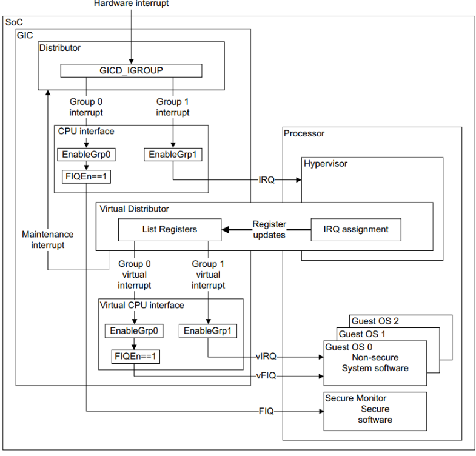


#### GIC v2中断虚拟化流程

1. **确保所有的中断都路由到EL2的hypervisor来处理**。
2. **Hypervisor模拟一个vDistributor给VM使用，即GuestOS访问GIC distributor的MMIO寄存器会陷入到hypervisor**。
3. **在hypervisor中建立映射，即GuestOS访问GIC CPU interface的MMIO区间，会映射到GIC virtual CPU interface**。
4. **当hypervisor收到一个物理中断，它要决定这个中断由hypervisor处理还是注入到VM来处理**。
5. **如果需要注入中断到VM，更新GICH_LRn寄存器，来填入中断相关信息。等CPU返回到vCPU时，即完成中断注入**。
6. **VM运行时，读取GIC_IAR寄存器，可以得到中断号**


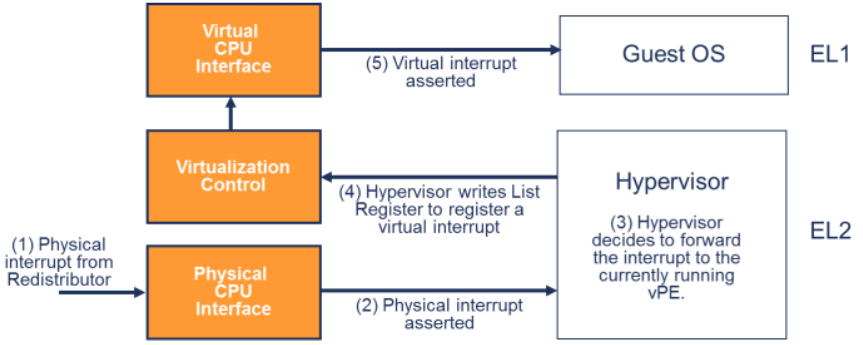


外设中断流程如下：
1. 进入到GIC控制器里面Distributor硬件单元，然后派送到某个physical CPU interface。
2. CPU会响应这个中断。
3. 这个中断会被路由到EL2。hypervisor读取IAR寄存器，得到物理中断号hwirq。Hypervisor写GICC_EOIR，告诉GIC，物理中断处理完成。
4. Hypervisor设置GICH_LRn寄存器来注册一个虚拟中断。
5. Virtual CPU interface收到这个中断之后，判断这个虚拟中断能不能发送给vCPU。
6. 这个中断进入了vCPU的虚拟异常向量表。Guest OS读取GICC_IAR寄存器，然后得到vINTID虚拟中断号，然后跳转到中断处理程序中处理。
7. Guest OS处理完中断之后，写GICC_EOIR寄存器，告诉GIC这个虚拟中断已经完成。


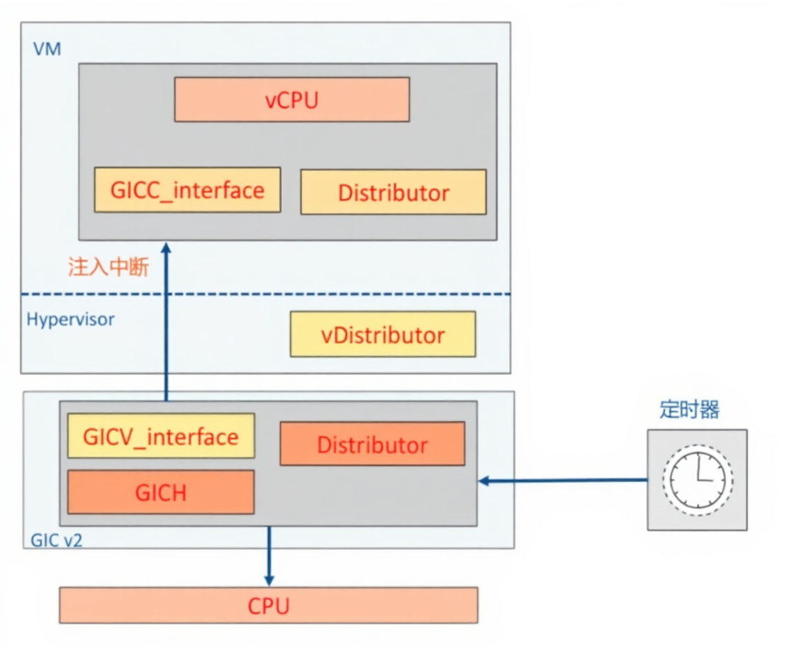

流程如下：
1. 外设触发了一个IRQ中断，中断达到GIC
2. GIC把中断发送到CPU。因为设置了HCR_EL2.IMQ=1的原因，CPU路由到EL2
3. GIC配置GIC List Register（GICH_LRn）来注册一个vIRQ。
4. Hypervisor切换到Guest OS上运行，EL2切换到EL1/EL0，CPU运行在vCPU上
5. vCPU接收到来自GIC的vIRQ中断


#### GIC v2虚拟化新增的两组寄存器

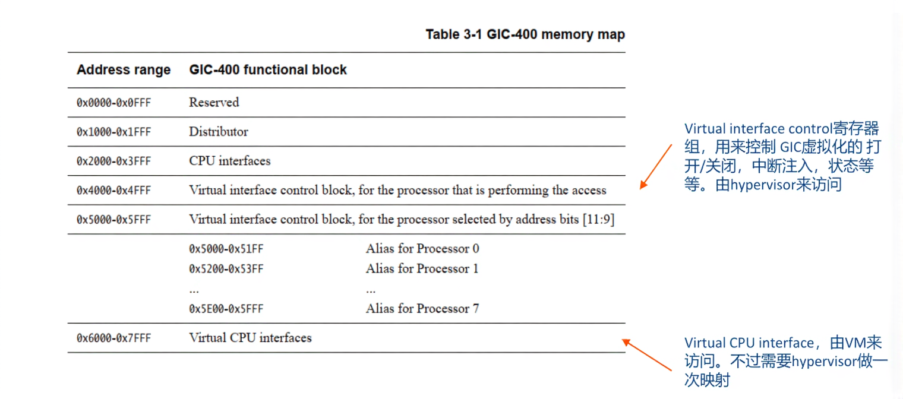

#### GIC虚拟化之MMIO


根据虚拟化的3个必要条件之一：等价性（equivalence）。即虚拟机不感知自己运行在虚拟环境里。
1. VM访问GIC CPU interface，仿佛真的一样。Hypervisor需要把GICC_interface映射到 GICV_interface上。Base + 0x2000 --->（映射） Base + 0x6000
2. GICC_interface和GICV_interface是格式一样的两组寄存器。

3. 由于GICv2内部中只有一个Distributor，所以VM看到的Distributor是hypervisor模拟的。

> vDistributor和Distributor最终访问的是同一个硬件单元，需要避免访问冲突

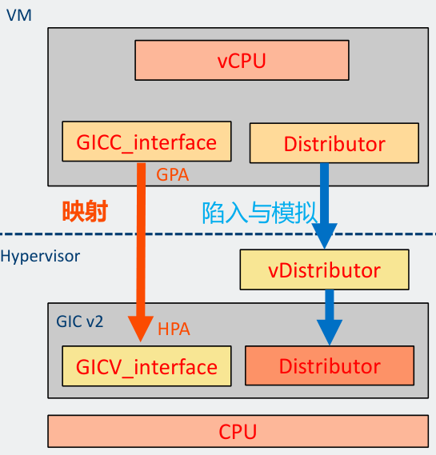


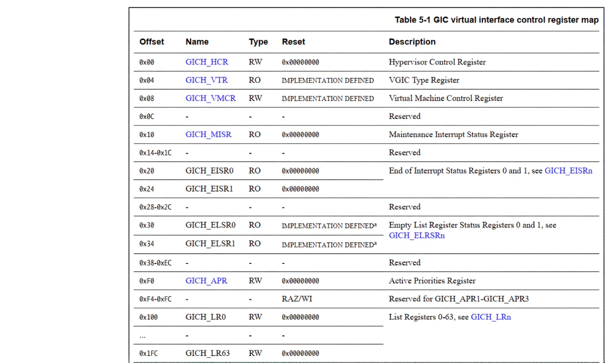


- **GICH_HCR**     GICH总控制的寄存器
- **GICH_ELSR0**  GICH_LR寄存器状态，判断LR寄存器是否为空等等
- **GICH_LR0**      用来注入中断到VM

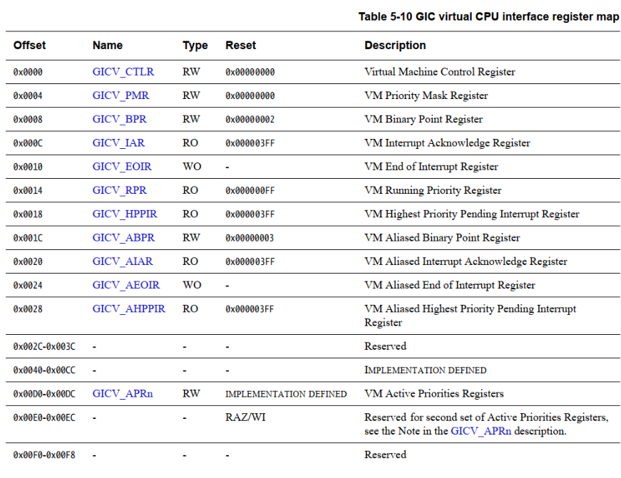

#### GICH_LRn寄存器实现 中断注入


写入GICH_LRn寄存器可以实现中断注入到VM


### 实验10：给VM虚拟机注入中断

实验目的：熟悉GIC v2如何注入中断

实验要求：在BenOS中实现中断的注入功能，把virtual timer中断 注入到 VM中。步骤如下：

- 使能GIC虚拟化功能， GICH_HCR.EN =1
- 映射VM中的GICC_interface访问地址到hypervisor的GICV_interface
- 在hypervisor中模拟Distributor
- 当VM中的virtual timer触发中断之后，路由到EL2的hypervisor来处理
- Hypervisor把中断信息写入到GICH_LRn寄存器中，注入中断到VM
- EOI mode, handled by Hypervisor or inject vm
- VM中的GuestOS的GIC 驱动，读取中断号，处理中断


### 模拟vDistributor 需要注意的地方

- VM看到的Distributor是由hypervisor模拟的。
- Hypervisor在模拟vDistributor时，需要考虑VM和hypervisor并发访问的问题。
- Distributor的有些寄存器是按照 中断号 来描述的，比如使用某几个比特位来描述一个 中断号 的相关属性，那同一个寄存器可以描述n个中断源


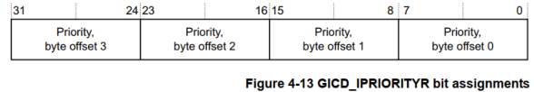

> 如果vDistributor鲁莽地通过trap and emulate来 直接 写 这类寄存器，会破坏hypervisor原有的状态


避免冲突的方法：

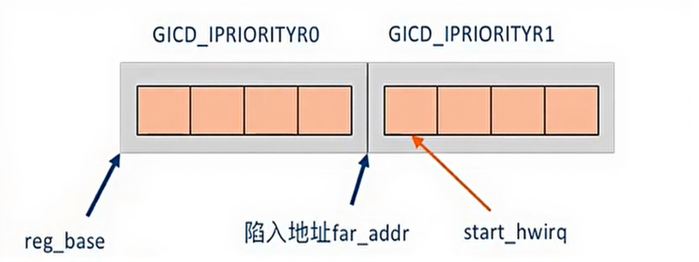


已知 reg_base，far_addr，field_width，可计算出far_addr对应的起始start_hwirq号。
```c
for (start_hwirq ~ start_hwirq +4)
	if (irq owned by hypervisor)
		continue；
	update_reg_field();
```


## Virtualization Host Extensions

TODO
